Directory structure:
└── codes/
    ├── README.md
    ├── GameAPIServer_Template.md
    ├── MultiAPIServer_Template.md
    ├── apiTest.http
    ├── api_server_training_tany_farm.md
    ├── docker-compose.yml
    ├── practice_omok_game-1.md
    ├── practice_omok_game-2.md
    └── zlogger_test.md

================================================
File: README.md
================================================
# 예제 프로젝트 모음

이 디렉토리에는 ASP.NET Core 기반 게임 API 서버 학습용 프로젝트가 포함되어 있다.

## 프로젝트 목록

| 프로젝트 | 유형 | .NET | 설명 | 완성도 |
|----------|------|------|------|--------|
| [GameAPIServer_Template](./GameAPIServer_Template/) | 템플릿 | net10.0 | 단일 서버 API 템플릿 (71파일). 신규 프로젝트의 기반으로 사용 | 완성 |
| [MultiAPIServer_Template](./MultiAPIServer_Template/) | 템플릿 | net10.0 | 멀티 서버 구성 (Game + Hive + Match) | 완성 |
| [practice_omok_game-1](./practice_omok_game-1/) | 실습 | net10.0 | 오목 게임 v1 (롱폴링, 시퀀스 다이어그램 충실) | 완성 |
| [practice_omok_game-2](./practice_omok_game-2/) | 실습 | net10.0 | 오목 게임 v2 (플로우 다이어그램 우수) | 완성 |
| [api_server_training_tany_farm](./api_server_training_tany_farm/) | 과제 | net10.0 | 타니 팜 (**과제 명세만**, 본 서버는 학습자가 구현) | 명세만 |
| [zlogger_test](./zlogger_test/) | 예제 | net10.0 | ZLogger 로깅 테스트 | 예제 |

## 학습 순서 권장

1. **GameAPIServer_Template** — 프로젝트 구조와 패턴 파악
2. **MultiAPIServer_Template** — 멀티 서버(Game + Hive + Match) 구성 이해
3. **practice_omok_game-1 / omok_game-2** — 롱폴링 기반 실시간 게임 구현
4. **api_server_training_tany_farm** — 직접 구현 과제 도전

## 공통 기술 스택

- **DB**: MySQL (MySqlConnector + SqlKata)
- **캐시**: Redis (CloudStructures)
- **로깅**: ZLogger (구조화 JSON 로깅)
- **인증**: FakeHiveServer를 통한 토큰 기반 인증
- **미들웨어**: 버전 체크, 유저 인증 및 요청 락

## 참고

ASP.NET Core 팁 (Polly 재시도, RateLimit, FluentValidation 등)은 [aspnet_core_tips.md](../docs/references/aspnet_core_tips.md)를 참고한다.


================================================
File: GameAPIServer_Template.md
================================================
Directory structure:
└── GameAPIServer_Template/
    ├── README.md
    ├── DB_Schema.md
    ├── ErrorCode.cs
    ├── GameAPIServer.csproj
    ├── GameAPIServer.sln
    ├── Program.cs
    ├── Security.cs
    ├── apiTest.http
    ├── appsettings.Development.json
    ├── appsettings.json
    ├── Controllers/
    │   ├── AttendanceCheckController.cs
    │   ├── AttendanceInfoController.cs
    │   ├── CreateAccountController.cs
    │   ├── LoginController.cs
    │   ├── LogoutController.cs
    │   ├── MailDeleteController.cs
    │   ├── MailListController.cs
    │   ├── MailReceiveController.cs
    │   ├── TopRankingController.cs
    │   ├── UserDataLoadController.cs
    │   └── UserRankController.cs
    ├── DTOs/
    │   ├── AttendanceCheck.cs
    │   ├── AttendanceInfo.cs
    │   ├── CreateAccount.cs
    │   ├── ErrorCode.cs
    │   ├── FreindDelete.cs
    │   ├── FriendAccept.cs
    │   ├── FriendAdd.cs
    │   ├── FriendList.cs
    │   ├── GameDataLoad.cs
    │   ├── Header.cs
    │   ├── Login.cs
    │   ├── Logout.cs
    │   ├── MailDelete.cs
    │   ├── MailList.cs
    │   ├── MailReceive.cs
    │   ├── OtherUserInfo.cs
    │   ├── Ranking.cs
    │   ├── SocialDataLoad.cs
    │   ├── UserDataLoad.cs
    │   ├── UserRank.cs
    │   └── UserSetMainChar.cs
    ├── Middleware/
    │   ├── CheckUserAuth.cs
    │   └── VersionCheck.cs
    ├── Models/
    │   ├── Account.cs
    │   ├── Attendance.cs
    │   ├── Friend.cs
    │   ├── Game.cs
    │   ├── Item.cs
    │   ├── Mailbox.cs
    │   ├── MasterDB.cs
    │   ├── RedisDB.cs
    │   └── User.cs
    ├── Properties/
    │   └── launchSettings.json
    ├── Repository/
    │   ├── GameDB_Attendance.cs
    │   ├── GameDB_Game.cs
    │   ├── GameDB_Mail.cs
    │   ├── GameDB_User.cs
    │   ├── MasterDb.cs
    │   ├── MemoryDBDefine.cs
    │   ├── MemoryDb.cs
    │   ├── MemoryDbKeyMaker.cs
    │   └── Interfaces/
    │       ├── IGameDb.cs
    │       ├── IMasterDb.cs
    │       └── IMemoryDb.cs
    └── Services/
        ├── AttendanceService.cs
        ├── AuthService.cs
        ├── DataLoadService.cs
        ├── GameService.cs
        ├── ItemService.cs
        ├── MailService.cs
        ├── UserService.cs
        └── Interfaces/
            ├── IAttendanceService.cs
            ├── IAuthService.cs
            ├── IDataLoadService.cs
            ├── IGameService.cs
            ├── IItemService.cs
            ├── IMailService.cs
            └── IUserService.cs

================================================
File: README.md
================================================
# GameAPIServer Template

ASP.NET Core 기반 게임 API 서버 템플릿. 이 코드를 참고하여 새 프로젝트를 만들되, 더 좋은 코드를 작성하는 것을 목표로 한다.

## 기술 스택

- .NET 9.0 / ASP.NET Core Web API
- MySQL (MySqlConnector + SqlKata)
- Redis (CloudStructures)
- ZLogger (구조화 로깅)

## 프로젝트 구조

```
GameAPIServer_Template/
├── Controllers/          # API 엔드포인트 (9개)
├── DTOs/                 # 요청/응답 데이터 모델
├── Middleware/            # 미들웨어 (버전 체크, 인증)
├── Models/               # DB 엔티티 모델
├── Repository/           # DB 접근 계층 (GameDb, MasterDb, MemoryDb)
│   └── Interfaces/
├── Services/             # 비즈니스 로직
│   └── Interfaces/
├── ErrorCode.cs          # 에러 코드 정의 (UInt16 enum)
├── Security.cs           # 보안 유틸리티
├── Program.cs            # 앱 진입점, DI 설정
├── appsettings.json      # 운영 설정
├── appsettings.Development.json  # 개발 설정
├── DB_Schema.md          # DB 스키마 정의
└── apiTest.http          # API 테스트 파일
```

## API 엔드포인트

모든 엔드포인트는 **POST** 메서드를 사용한다. `Login`, `CreateAccount`를 제외한 모든 요청에는 헤더에 `uid`, `token`, `AppVersion`, `MasterDataVersion`이 필요하다.

| 엔드포인트 | 기능 |
|-----------|------|
| `/CreateAccount` | 계정 생성 |
| `/Login` | 로그인 (인증 토큰 발급) |
| `/Logout` | 로그아웃 |
| `/UserDataLoad` | 유저 데이터 로드 |
| `/AttendanceCheck` | 출석 체크 |
| `/AttendanceInfo` | 출석 정보 조회 |
| `/MailList` | 우편함 목록 |
| `/MailReceive` | 우편 수령 |
| `/MailDelete` | 우편 삭제 |

## 미들웨어

1. **VersionCheck** — `AppVersion`, `MasterDataVersion` 헤더를 검증. 버전 불일치 시 HTTP 426 반환.
2. **CheckUserAuthAndLoadUserData** — Redis에서 토큰 검증, 유저 요청 락 처리. `Login`/`CreateAccount`는 건너뜀.

## 서비스 (DI 등록)

| 서비스 | Lifetime | 역할 |
|--------|----------|------|
| IAuthService | Transient | 인증, 계정 관리 |
| IGameService | Transient | 게임 초기화 |
| IItemService | Transient | 아이템 관리 |
| IMailService | Transient | 우편 시스템 |
| IUserService | Transient | 유저 프로필 |
| IAttendanceService | Transient | 출석 체크 |
| IDataLoadService | Transient | 데이터 로드 |
| IGameDb | Transient | 게임 DB 접근 |
| IMemoryDb | Singleton | Redis 접근 |
| IMasterDb | Singleton | 마스터 데이터 |

## 설정 (appsettings.json)

```json
{
  "ServerAddress": "http://localhost:11500",
  "logdir": "./log/",
  "DbConfig": {
    "Redis": "localhost",
    "GameDb": "Server=localhost;Port=3306;user=root;Password=<비밀번호>;Database=game_db;...",
    "MasterDb": "Server=localhost;Port=3306;user=root;Password=<비밀번호>;Database=master_db;..."
  }
}
```

## 에러 코드 범위

| 범위 | 카테고리 |
|------|---------|
| 1000~1999 | 공통 (Redis, 토큰, 버전) |
| 2000~2999 | 인증, 친구 |
| 3000~3999 | 아이템 |
| 4000~4999 | 게임 DB |
| 5000~5999 | 마스터 DB |
| 6000~6999 | 유저 관리 |
| 8000~8999 | 우편 |
| 9000~9999 | 출석 |

## DB 설정

`DB_Schema.md`를 참고하여 MySQL에 `game_db`, `master_db` 데이터베이스와 테이블을 생성한다.

## 빌드 및 실행

```bash
dotnet build
dotnet run
# 서버 주소: http://localhost:11500
```


================================================
File: DB_Schema.md
================================================
아래 사용 예를 참고하여 만드는 게임에 맞게 DB 스키마 정보를 만들도록 한다.  
사용하지 않는 것은 삭제한다.  
  
   
# game DB
데이터베이스 이름: `game_db`  
  
## account_info 테이블
하이브 계정 정보를 가지고 있는 테이블
```sql
-- 테이블 생성 SQL - account
CREATE TABLE account
(
    `uid`         BIGINT          NOT NULL    AUTO_INCREMENT COMMENT '유니크 유저 번호',
    `user_id`           VARCHAR(50)     NOT NULL    COMMENT '유저아이디.
    `salt_value`        VARCHAR(100)    NOT NULL    COMMENT '암호화 값',
    `pw`                VARCHAR(100)    NOT NULL    COMMENT '해싱된 비밀번호',
    `create_dt`         DATETIME        NOT NULL    DEFAULT CURRENT_TIMESTAMP COMMENT '생성 일시',
     PRIMARY KEY (uid),
     UNIQUE KEY (user_id)
)
```


## user_money 테이블
유저의 재화 정보를 가지고 있는 테이블
```sql
-- 테이블 생성 SQL - user_money
CREATE TABLE user_money
(
    `uid`         BIGINT    NOT NULL    COMMENT '유저아이디', 
    `jewelry`     INT    NOT NULL    DEFAULT 0 COMMENT '보석', 
    `gold_medal`  INT    NOT NULL    DEFAULT 0 COMMENT '금 메달', 
    `cash`        INT    NOT NULL    DEFAULT 0 COMMENT '현금', 
    `sunchip`     INT    NOT NULL    DEFAULT 0 COMMENT '썬칩', 
     PRIMARY KEY (uid)
);
-- Foreign Key 설정 SQL - user_money(uid) -> user(uid)
ALTER TABLE user_money
    ADD CONSTRAINT FK_user_money_uid_user_uid FOREIGN KEY (uid)
        REFERENCES user (uid) ON DELETE RESTRICT ON UPDATE RESTRICT;
```
  
    
## mailbox 테이블
우편함 정보를 가지고 있는 테이블
```sql
-- 테이블 생성 SQL - mailbox
CREATE TABLE mailbox
(
    `mail_seq`    INT             NOT NULL    AUTO_INCREMENT COMMENT '우편 일련번호', 
    `uid`         BIGINT             NOT NULL    COMMENT '유저아이디', 
    `mail_title`  VARCHAR(100)    NOT NULL    COMMENT '우편 제목', 
    `create_dt`   DATETIME        NOT NULL    COMMENT '생성 일시', 
    `expire_dt`   DATETIME        NOT NULL    COMMENT '만료 일시', 
    `receive_dt`  DATETIME        NOT NULL    DEFAULT CURRENT_TIMESTAMP COMMENT '수령 일시', 
    `receive_yn`  TINYINT         NOT NULL    DEFAULT 0 COMMENT '수령 유무',
     PRIMARY KEY (mail_seq)
);
-- Foreign Key 설정 SQL - mailbox(uid) -> user(uid)
ALTER TABLE mailbox
    ADD CONSTRAINT FK_mailbox_uid_user_uid FOREIGN KEY (uid)
        REFERENCES user (uid) ON DELETE RESTRICT ON UPDATE RESTRICT;
```

## mailbox_reward 테이블
우편함의 보상정보를 가지고 있는 테이블
```sql
-- 테이블 생성 SQL - mailbox_reward
CREATE TABLE mailbox_reward
(
    `mail_seq`     INT            NOT NULL    COMMENT '우편 일련번호', 
    `reward_key`   INT            NOT NULL    COMMENT '보상 키', 
    `reward_qty`   INT            NOT NULL    COMMENT '보상 수', 
    `reward_type`  VARCHAR(20)    NOT NULL    COMMENT '보상 타입', 
     PRIMARY KEY (mail_seq, reward_key)
);

-- Foreign Key 설정 SQL - mailbox_reward(mail_seq) -> mailbox(mail_seq)
ALTER TABLE mailbox_reward
    ADD CONSTRAINT FK_mailbox_reward_mail_seq_mailbox_mail_seq FOREIGN KEY (mail_seq)
        REFERENCES mailbox (mail_seq) ON DELETE RESTRICT ON UPDATE RESTRICT;
```

## user_attendance 테이블
유저의 출석 현황을 가지고 있는 테이블
```sql
-- 테이블 생성 SQL - user_attendance
CREATE TABLE user_attendance
(
    `uid`                   BIGINT         NOT NULL    COMMENT '유저아이디', 
    `attendance_cnt`        INT         NOT NULL    COMMENT '출석 횟수', 
    `recent_attendance_dt`  DATETIME    NOT NULL    COMMENT '최근 출석 일시', 
     PRIMARY KEY (uid)
);
-- Foreign Key 설정 SQL - user_attendance(uid) -> user(uid)
ALTER TABLE user_attendance
    ADD CONSTRAINT FK_user_attendance_uid_user_uid FOREIGN KEY (uid)
        REFERENCES user (uid) ON DELETE RESTRICT ON UPDATE RESTRICT;
```
    
    


<br>
<br>

# master DB
## version 테이블
앱버전과 데이터 버전을 가지고 있는 테이블
```sql
-- 테이블 생성 SQL - version
CREATE TABLE version
(
    `app_version`            INT         NOT NULL    COMMENT '앱 버전', 
    `master_data_version`    INT         NOT NULL    COMMENT '마스터 데이터 버전', 
);
```
      

## master_gacha_reward 테이블
가챠 보상의 확률 정보와 뽑는 수량을 가지고 있는 테이블
```sql
-- 테이블 생성 SQL - master_gacha_reward
CREATE TABLE master_gacha_reward
(
    `gacha_reward_key`        INT            NOT NULL    COMMENT '가챠 보상 키', 
    `gacha_reward_name`       VARCHAR(50)    NOT NULL    COMMENT '가챠 보상 이름', 
    `char_prob_percent`       INT            NOT NULL    COMMENT '캐릭터 확률 퍼센트', 
    `skin_prob_percent`       INT            NOT NULL    COMMENT '스킨 확률 퍼센트', 
    `costume_prob_percent`    INT            NOT NULL    COMMENT '코스튬 확률 퍼센트', 
    `food_prob_percent`       INT            NOT NULL    COMMENT '푸드 확률 퍼센트', 
    `food_gear_prob_percent`  INT            NOT NULL    COMMENT '푸드 기어 확률 퍼센트', 
    `gacha_count`             INT            NOT NULL    COMMENT '가챠 개수', 
    `create_dt`               DATETIME       NOT NULL    COMMENT '생성 일시', 
     PRIMARY KEY (gacha_reward_key)
);
```

## master_gacha_reward_list 테이블
가챠 보상에 포함되는 보상들의 정보를 가지고 있는 테이블
```sql
-- 테이블 생성 SQL - master_gacha_reward_list
CREATE TABLE master_gacha_reward_list
(
    `gacha_reward_key`  INT            NOT NULL    COMMENT '가챠 보상 키', 
    `reward_key`        INT            NOT NULL    COMMENT '보상 키', 
    `reward_type`       VARCHAR(20)    NOT NULL    COMMENT '보상 종류',
    `reward_qty`        INT             NOT NULL   DEFAULT 1 COMMENT '보상 수',
    `create_dt`         DATETIME       NOT NULL    COMMENT '생성 일시', 
     PRIMARY KEY (gacha_reward_key, reward_key)
);
-- Foreign Key 설정 SQL - master_gacha_reward_list(gacha_reward_key) -> master_gacha_reward(gacha_reward_key)
ALTER TABLE master_gacha_reward_list
    ADD CONSTRAINT FK_master_gacha_reward_list_gacha_reward_key_master_gacha_reward FOREIGN KEY (gacha_reward_key)
        REFERENCES master_gacha_reward (gacha_reward_key) ON DELETE RESTRICT ON UPDATE RESTRICT;
```

## master_attendance_reward 테이블
출석 보상 정보를 가지고 있는 테이블
```sql
-- 테이블 생성 SQL - master_attendance_reward
CREATE TABLE master_attendance_reward
(
    `day_seq`     INT         NOT NULL    COMMENT '날짜 번호', 
    `reward_key`  INT         NOT NULL    COMMENT '보상 키', 
    `reward_qty`  INT         NOT NULL    DEFAULT 0 COMMENT '보상 수',
    `reward_type` VARCHAR(20) NOT NULL    COMMENT '보상 종류',
    `create_dt`   DATETIME    NOT NULL    COMMENT '생성 일시', 
     PRIMARY KEY (day_seq)
);
```

## master_item_level 테이블
아이템(캐릭터, 코스튬, 푸드) 레벨업을 위한 개수의 정보를 가지고 있는 테이블
```sql
-- 테이블 생성 SQL - master_item_level
CREATE TABLE master_item_level
(
    `level`     INT            NOT NULL    COMMENT '레벨', 
    `item_cnt`  VARCHAR(50)    NOT NULL    DEFAULT 1 COMMENT '아이템 개수', 
     PRIMARY KEY (level)
);
```  
  


================================================
File: ErrorCode.cs
================================================
癤퓎sing System;

// 1000 ~ 19999
public enum ErrorCode : UInt16
{
    None = 0,

    // Common 1000 ~
    UnhandleException = 1001,
    RedisFailException = 1002,
    InValidRequestHttpBody = 1003,
    TokenDoesNotExist = 1004,
    UidDoesNotExist = 1005,
    AuthTokenFailWrongAuthToken = 1006,
    Hive_Fail_InvalidResponse = 1010,
    InValidAppVersion = 1011,
    InvalidMasterDataVersion = 1012,

    // Auth 2000 ~
    CreateUserFailException = 2001,
    CreateUserFailNoNickname = 2002,
    CreateUserFailDuplicateNickname = 2003,
    LoginFailException = 2004,
    LoginFailUserNotExist = 2005,
    LoginFailPwNotMatch = 2006,
    LoginFailSetAuthToken = 2007,
    LoginUpdateRecentLoginFail = 2008,
    LoginUpdateRecentLoginFailException = 2009,
    AuthTokenMismatch = 2010,
    AuthTokenKeyNotFound = 2011,
    AuthTokenFailWrongKeyword = 2012,
    AuthTokenFailSetNx = 2013,
    AccountIdMismatch = 2014,
    DuplicatedLogin = 2015,
    CreateUserFailInsert = 2016,
    LoginFailAddRedis = 2017,
    CheckAuthFailNotExist = 2018,
    CheckAuthFailNotMatch = 2019,
    CheckAuthFailException = 2020,
    LogoutRedisDelFail = 2021,
    LogoutRedisDelFailException= 2022,
    DeleteAccountFail = 2023,
    DeleteAccountFailException = 2024,
    InitNewUserGameDataFailException = 2025,
    InitNewUserGameDataFailCharacter = 2026,
    InitNewUserGameDataFailGameList = 2027,
    InitNewUserGameDataFailMoney = 2028,
    InitNewUserGameDataFailAttendance = 2029,
    CreateAccountFailInsert = 2051,
    CreateAccountFailException = 2052,

    // Friend 2100
    FriendSendReqFailUserNotExist = 2101,
    FriendSendReqFailInsert = 2102,
    FriendSendReqFailException = 2103,
    FriendSendReqFailAlreadyExist = 2104,
    SendFriendReqFailSameUid = 2105,
    FriendGetListFailOrderby = 2106,
    FriendGetListFailException = 2107,
    FriendGetRequestListFailException = 2108,
    FriendDeleteFailNotFriend = 2109,
    FriendDeleteFailDelete = 2110,
    FriendDeleteFailException = 2111,
    FriendDeleteFailSameUid = 2112,
    FriendDeleteReqFailNotFriend = 2113,
    FriendDeleteReqFailDelete = 2114,
    FriendDeleteReqFailException = 2115,
    FriendAcceptFailException = 2116,
    FriendAcceptFailSameUid = 2117,
    AcceptFriendRequestFailUserNotExist = 2118,
    AcceptFriendRequestFailAlreadyFriend = 2119,
    AcceptFriendRequestFailException = 2120,
    FriendSendReqFailNeedAccept = 2121,

    // Game 2200
    MiniGameListFailException = 2201,
    GameSetNewUserListFailException = 2202,
    GameSetNewUserListFailInsert = 2203,
    MiniGameUnlockFailInsert = 2204,
    MiniGameUnlockFailException = 2205,
    MiniGameInfoFailException = 2206,
    MiniGameSaveFailException = 2207,
    MiniGameSaveFailGameLocked = 2208,
    MiniGameUnlockFailAlreadyUnlocked = 2209,
    MiniGameSetPlayCharFailUpdate = 2210,
    MiniGameSetPlayCharFailException = 2211,
    MiniGameSaveFailFoodDecrement = 2212,

    SetUserScoreFailException = 2301,
    GetRankingFailException = 2302,
    GetUserRankFailException = 2303,

    // Item 3000 ~
    CharReceiveFailInsert = 3011,
    CharReceiveFailLevelUP = 3012,
    CharReceiveFailIncrementCharCnt = 3013,
    CharReceiveFailException= 3014,
    CharListFailException = 3015,
    CharNotExist = 3016,
    CharSetCostumeFailUpdate = 3017,
    CharSetCostumeFailException = 3018,

    SkinReceiveFailAlreadyOwn = 3021,
    SkinReceiveFailInsert = 3022,
    SkinReceiveFailException = 3023,
    SkinListFailException = 3024,

    CostumeReceiveFailInsert = 3031,
    CostumeReceiveFailLevelUP = 3032,
    CostumeReceiveFailIncrementCharCnt = 3033,
    CostumeReceiveFailException = 3034,
    CostumeListFailException = 3035,
    CharSetCostumeFailHeadNotExist= 3036,
    CharSetCostumeFailFaceNotExist = 3037,
    CharSetCostumeFailHandNotExist = 3038,

    FoodReceiveFailInsert = 3041,
    FoodReceiveFailIncrementFoodQty = 3042,
    FoodReceiveFailException = 3043,
    FoodListFailException = 3044,
    FoodGearReceiveFailInsert = 3045,
    FoodGearReceiveFailIncrementFoodGear = 3046,
    FoodGearReceiveFailException = 3047,

    GachaReceiveFailException= 3051,


    //GameDb 4000~ 
    GetGameDbConnectionFail = 4002,


    // MasterDb 5000 ~
    MasterDB_Fail_LoadData = 5001,
    MasterDB_Fail_InvalidData = 5002,

    // User
    UserInfoFailException = 6001,
    UserMoneyInfoFailException = 6002,
    UserUpdateJewelryFailIncremnet = 6003,
    SetMainCharFailException = 6004,
    GetOtherUserInfoFailException = 6005,
    UserNotExist = 6006,

    // Mail
    MailListFailException = 8001,
    MailReceiveFailException = 8002,
    MailReceiveFailAlreadyReceived = 8003,
    MailReceiveFailMailNotExist = 8004,
    MailReceiveFailUpdateReceiveDt = 8005,
    MailRewardListFailException = 8006,
    MailDeleteFailDeleteMail = 8007,
    MailDeleteFailDeleteMailReward = 8008,
    MailDeleteFailException = 8009,
    MailReceiveFailNotMailOwner = 8010,
    MailReceiveRewardsFailException = 8011,

    // Attendance
    AttendanceInfoFailException = 9001,
    AttendanceCheckFailAlreadyChecked = 9002,
    AttendanceCheckFailException = 9003,

    GetRewardFailException = 9004,
}


================================================
File: GameAPIServer.csproj
================================================
<Project Sdk="Microsoft.NET.Sdk.Web">

    <PropertyGroup>
        <TargetFramework>net10.0</TargetFramework>
    </PropertyGroup>

    <PropertyGroup Condition="'$(Configuration)|$(Platform)'=='Debug|AnyCPU'">
        <OutputPath>..\00_ServerBin\GameAPIServer\</OutputPath>
    </PropertyGroup>

    <PropertyGroup Condition="'$(Configuration)|$(Platform)'=='Release|AnyCPU'">
        <OutputPath>..\00_ServerBin\GameAPIServer\</OutputPath>
    </PropertyGroup>

    <ItemGroup>
        <PackageReference Include="CloudStructures" Version="3.3.0" />
        <PackageReference Include="Microsoft.Extensions.Logging.Abstractions" Version="8.0.1" />
        <PackageReference Include="MySqlConnector" Version="2.3.7" />
        <PackageReference Include="SqlKata" Version="2.4.0" />
        <PackageReference Include="SqlKata.Execution" Version="2.4.0" />
        <PackageReference Include="System.Configuration.ConfigurationManager" Version="8.0.0" />
        <PackageReference Include="System.Net.Security" Version="4.3.2" />
        <PackageReference Include="ZLogger" Version="2.4.1" />
    </ItemGroup>

</Project>


================================================
File: GameAPIServer.sln
================================================

Microsoft Visual Studio Solution File, Format Version 12.00
# Visual Studio Version 17
VisualStudioVersion = 17.8.34330.188
MinimumVisualStudioVersion = 10.0.40219.1
Project("{9A19103F-16F7-4668-BE54-9A1E7A4F7556}") = "GameAPIServer", "GameAPIServer.csproj", "{C4BF4730-21F7-4F00-A236-706420265F0D}"
EndProject

Global
	GlobalSection(SolutionConfigurationPlatforms) = preSolution
		Debug|Any CPU = Debug|Any CPU
		Release|Any CPU = Release|Any CPU
	EndGlobalSection
	GlobalSection(ProjectConfigurationPlatforms) = postSolution
		{C4BF4730-21F7-4F00-A236-706420265F0D}.Debug|Any CPU.ActiveCfg = Debug|Any CPU
		{C4BF4730-21F7-4F00-A236-706420265F0D}.Debug|Any CPU.Build.0 = Debug|Any CPU
		{C4BF4730-21F7-4F00-A236-706420265F0D}.Release|Any CPU.ActiveCfg = Release|Any CPU
		{C4BF4730-21F7-4F00-A236-706420265F0D}.Release|Any CPU.Build.0 = Release|Any CPU
		{EDAEE952-47EB-4524-B8C9-00C73A782988}.Debug|Any CPU.ActiveCfg = Debug|Any CPU
		{EDAEE952-47EB-4524-B8C9-00C73A782988}.Debug|Any CPU.Build.0 = Debug|Any CPU
		{EDAEE952-47EB-4524-B8C9-00C73A782988}.Release|Any CPU.ActiveCfg = Release|Any CPU
		{EDAEE952-47EB-4524-B8C9-00C73A782988}.Release|Any CPU.Build.0 = Release|Any CPU
	EndGlobalSection
	GlobalSection(SolutionProperties) = preSolution
		HideSolutionNode = FALSE
	EndGlobalSection
EndGlobal


================================================
File: Program.cs
================================================
using System.IO;
using GameAPIServer.Repository;
using GameAPIServer.Repository.Interfaces;
using GameAPIServer.Servicies;
using GameAPIServer.Servicies.Interfaces;
using Microsoft.AspNetCore.Builder;
using Microsoft.Extensions.Configuration;
using Microsoft.Extensions.DependencyInjection;
using Microsoft.Extensions.Logging;
using ZLogger;


WebApplicationBuilder builder = WebApplication.CreateBuilder(args);

IConfiguration configuration = builder.Configuration;

// ── appsettings.json에서 DB 접속 정보를 DbConfig 객체로 바인딩 ──
builder.Services.Configure<DbConfig>(configuration.GetSection(nameof(DbConfig)));

// ── DI(의존성 주입) 등록 ──────────────────────────────
// Repository 계층: DB 접근을 담당
builder.Services.AddTransient<IGameDb, GameDb>();       // MySQL 게임 DB (요청마다 새 인스턴스)
builder.Services.AddSingleton<IMemoryDb, MemoryDb>();   // Redis (앱 전체에서 1개 연결 공유)
builder.Services.AddSingleton<IMasterDb, MasterDb>();   // 마스터 데이터 (앱 시작 시 1회 로드)

// Service 계층: 비즈니스 로직을 담당
builder.Services.AddTransient<IAuthService, AuthService>();
builder.Services.AddTransient<IGameService, GameService>();
builder.Services.AddTransient<IItemService, ItemService>();
builder.Services.AddTransient<IMailService, MailService>();
builder.Services.AddTransient<IUserService, UserService>();
builder.Services.AddTransient<IAttendanceService, AttendanceService>();
builder.Services.AddTransient<IDataLoadService, DataLoadService>();

builder.Services.AddControllers();

// ZLogger 로깅 설정 (콘솔 + 롤링 파일, JSON 형식)
SettingLogger();

WebApplication app = builder.Build();

// ── 마스터 데이터 로드 (앱 시작 시 1회) ───────────────
// 아이템 테이블, 스테이지 테이블 등 기획 데이터를 DB에서 메모리로 로드
if(!await app.Services.GetService<IMasterDb>().Load())
{
    return;
}

ILoggerFactory loggerFactory = app.Services.GetRequiredService<ILoggerFactory>();

// ── 미들웨어 체인 (요청이 컨트롤러에 도달하기 전에 순서대로 실행) ──
// 1) 클라이언트 버전 체크: 앱 버전이 서버와 일치하는지 확인
app.UseMiddleware<GameAPIServer.Middleware.VersionCheck>();
// 2) 인증 + 유저 데이터 로드: 토큰 검증 후 Redis에서 유저 정보 로드
app.UseMiddleware<GameAPIServer.Middleware.CheckUserAuthAndLoadUserData>();

app.UseRouting();

app.MapDefaultControllerRoute();

IMasterDb masterDataDB = app.Services.GetRequiredService<IMasterDb>();
await masterDataDB.Load();

app.Run(configuration["ServerAddress"]);

// ── ZLogger 설정 ─────────────────────────────────────
void SettingLogger()
{
    ILoggingBuilder logging = builder.Logging;
    logging.ClearProviders(); // 기본 로거 제거 (ZLogger만 사용)

    var fileDir = configuration["logdir"];

    var exists = Directory.Exists(fileDir);

    if (!exists)
    {
        Directory.CreateDirectory(fileDir);
    }

    // 롤링 파일: 일 단위 교체, 1MB 초과 시 새 파일, JSON 형식
    logging.AddZLoggerRollingFile(
        options =>
        {
            options.UseJsonFormatter();
            options.FilePathSelector = (timestamp, sequenceNumber) => $"{fileDir}{timestamp.ToLocalTime():yyyy-MM-dd}_{sequenceNumber:000}.log";
            options.RollingInterval = ZLogger.Providers.RollingInterval.Day;
            options.RollingSizeKB = 1024;
        });

    // 콘솔 출력: JSON 형식 (개발 중 터미널에서 확인)
    _ = logging.AddZLoggerConsole(options =>
    {
        options.UseJsonFormatter();
    });


}


================================================
File: Security.cs
================================================
using System;
using System.Linq;
using System.Security.Cryptography;
using System.Text;

namespace GameAPIServer;

public class Security
{
    const String AllowableCharacters = "abcdefghijklmnopqrstuvwxyz0123456789";

    public static String MakeHashingPassWord(String saltValue, String pw)
    {
        var sha = SHA256.Create();
        var hash = sha.ComputeHash(Encoding.ASCII.GetBytes(saltValue + pw));
        var stringBuilder = new StringBuilder();
        foreach (var b in hash)
        {
            stringBuilder.AppendFormat("{0:x2}", b);
        }

        return stringBuilder.ToString();
    }

    public static String SaltString()
    {
        var bytes = new Byte[64];
        using (var random = RandomNumberGenerator.Create())
        {
            random.GetBytes(bytes);
        }

        return new String(bytes.Select(x => AllowableCharacters[x % AllowableCharacters.Length]).ToArray());
    }

    public static String CreateAuthToken()
    {
        var bytes = new Byte[25];
        using (var random = RandomNumberGenerator.Create())
        {
            random.GetBytes(bytes);
        }

        return new String(bytes.Select(x => AllowableCharacters[x % AllowableCharacters.Length]).ToArray());
    }

}


================================================
File: apiTest.http
================================================
癤풮OST http://localhost:11500/Login
Content-Type: application/json

{
  "ID":"jacking751",
  "PW":"123qwe"
}

###
POST http://localhost:11500/CreateAccount
Content-Type: application/json

{
  "ID":"jacking751",
  "PW":"123qwe",
  "NickName": "aaa"
}


================================================
File: appsettings.Development.json
================================================
{
  "Logging": {
    "LogLevel": {
      "Default": "Debug",
      "Microsoft": "Warning",
      "Microsoft.Hosting.Lifetime": "Debug"
    }
  },
  "AllowedHosts": "*",
  "ServerAddress": "http://localhost:11500",
  "HiveServerAddress": "http://localhost:11501",
  "logdir": "./log/",
  "DbConfig": {
    "Redis": "localhost",
    "GameDb": "Server=localhost;Port=3306;user=root;Password=sykim2312;Database=game_db;Pooling=true;Min Pool Size=0;Max Pool Size=100;AllowUserVariables=True;",
    "MasterDb": "Server=localhost;Port=3306;user=root;Password=sykim2312;Database=master_db;Pooling=true;Min Pool Size=0;Max Pool Size=100;AllowUserVariables=True;"
  }
}


================================================
File: appsettings.json
================================================
{
  "Logging": {
    "LogLevel": {
      "Default": "Debug",
      "Microsoft": "Warning",
      "Microsoft.Hosting.Lifetime": "Debug"
    },
    "ZLoggerConsole": {
      "LogLevel": {
        "Default": "Information"
      }
    }
  },
  "AllowedHosts": "*",
  "ServerAddress": "http://localhost:11500",
  "HiveServerAddress": "http://localhost:11501",
  "logdir": "./log/",
  "DbConfig": {
    "Redis": "localhost",
    "GameDb": "Server=localhost;Port=3306;user=root;Password=123qwe;Database=game_db;Pooling=true;Min Pool Size=0;Max Pool Size=100;AllowUserVariables=True;",
    "MasterDb": "Server=localhost;Port=3306;user=root;Password=123qwe;Database=master_db;Pooling=true;Min Pool Size=0;Max Pool Size=100;AllowUserVariables=True;"
  }
}


================================================
File: Controllers/AttendanceCheckController.cs
================================================
using GameAPIServer.DTOs;
using GameAPIServer.Servicies.Interfaces;
using Microsoft.AspNetCore.Mvc;
using Microsoft.Extensions.Logging;
using System.Threading.Tasks;
using ZLogger;

namespace GameAPIServer.Controllers;

[ApiController]
[Route("[controller]")]
public class AttendanceCheckController : ControllerBase
{
    readonly ILogger<AttendanceCheckController> _logger;
    readonly IAttendanceService _attendanceService;

    public AttendanceCheckController(ILogger<AttendanceCheckController> logger, IAttendanceService attendanceService)
    {
        _logger = logger;
        _attendanceService = attendanceService;
    }

    /// <summary>
    /// 출석 체크 API </br>
    /// 출석 체크를 하고 받은 보상을 반환합니다.
    /// </summary>
    [HttpPost]
    public async Task<AttendanceCheckResponse> CheckAttendance([FromHeader] Header header)
    {
        AttendanceCheckResponse response = new();
                              
        (response.Result, response.Rewards) = await _attendanceService.CheckAttendanceAndReceiveRewards(header.Uid);

        _logger.ZLogInformation($"[AttendanceCheck] Uid : {header.Uid}");
        return response;
    }

}


================================================
File: Controllers/AttendanceInfoController.cs
================================================
using GameAPIServer.Servicies.Interfaces;
using GameAPIServer.DTOs;
using Microsoft.AspNetCore.Mvc;
using Microsoft.Extensions.Logging;
using System.Threading.Tasks;
using ZLogger;

namespace GameAPIServer.Controllers;

[ApiController]
[Route("[controller]")]
public class AttendanceInfoController : ControllerBase
{
    readonly ILogger<AttendanceInfoController> _logger;
    readonly IAttendanceService _attendanceService;

    public AttendanceInfoController(ILogger<AttendanceInfoController> logger, IAttendanceService attendanceService)
    {
        _logger = logger;
        _attendanceService = attendanceService;
    }

    /// <summary>
    /// 출석 정보 API </br>
    /// 유저의 출석 정보(누적 출석일, 최근 출석 일시)를 전달합니다.
    /// </summary>
    [HttpPost]
    public async Task<AttendanceInfoResponse> GetAttendanceInfo([FromHeader] Header header)
    {
        AttendanceInfoResponse response = new();

        (response.Result, response.AttendanceInfo) = await _attendanceService.GetAttendanceInfo(header.Uid);
        
        _logger.ZLogInformation($"[AttendanceInfo] Uid : {header.Uid}");
        return response;
    }
}


================================================
File: Controllers/CreateAccountController.cs
================================================
癤퓎sing System.Threading.Tasks;
using GameAPIServer.Servicies.Interfaces;
using GameAPIServer.DTOs;
using Microsoft.AspNetCore.Mvc;
using Microsoft.Extensions.Logging;
using System;


namespace GameAPIServer.Controllers;

[ApiController]
[Route("[controller]")]
public class CreateAccountController : ControllerBase
{
    readonly ILogger<CreateAccountController> _logger;
    readonly IAuthService _authService;
    readonly IGameService _gameService;

    public CreateAccountController(ILogger<CreateAccountController> logger, IAuthService authService, IGameService gameService)
    {
        _logger = logger;
        _authService = authService;
        _gameService = gameService;
    }

    [HttpPost]
    public async Task<CreateHiveAccountResponse> Create([FromBody]CreateHiveAccountRequest request)
    {
        CreateHiveAccountResponse response = new();
        Int64 uid = 0;

        (response.Result, uid) = await _authService.CreateAccount(request.UserID, request.Password);


        if (response.Result != ErrorCode.None)
        {
            response.Result = await _gameService.InitNewUserGameData(uid);
        }


        return response;
    }

    

    
}


================================================
File: Controllers/LoginController.cs
================================================
using System.Threading.Tasks;
using GameAPIServer.Repository.Interfaces;
using GameAPIServer.Servicies.Interfaces;
using GameAPIServer.DTOs;
using Microsoft.AspNetCore.Mvc;
using Microsoft.Extensions.Logging;
using ZLogger;


namespace GameAPIServer.Controllers;

[ApiController]
[Route("[controller]")]
public class LoginController : ControllerBase
{
    readonly IMemoryDb _memoryDb;
    readonly ILogger<LoginController> _logger;
    readonly IAuthService _authService;
 
    public LoginController(ILogger<LoginController> logger, IMemoryDb memoryDb, IAuthService authService)
    {
        _logger = logger;
        _memoryDb = memoryDb;
        _authService = authService;
    }

    /// <summary>
    /// 로그인 API </br>
    /// 하이브 토큰을 검증하고, 유저가 없다면 생성, 토큰 발급, 로그인 시간 업데이트, 유저 데이터 로드를 합니다. 
    /// </summary>
    [HttpPost]
    public async Task<LoginResponse> Login(LoginRequest request)
    {
        LoginResponse response = new();

        //TODO: 컨트룰러에 구현 코드가 너무 많이 노출 되어 있다. 아래 코드에서는 서비스 객체의 메소드를 여러개 호출하고 있는데 1개 정도의 메소드로 묶어서 호출하는 방법을 생각해보자.
        // 즉 구현은 대부분 서비스 객체에 있어야 하고, 컨트룰러는 필요한 서비스 객체를 호출하고, 응답만 보내는 역할을 해야 한다.

        
        //하이브 토큰 체크
        var (errorCode,uid, authToken) = await _authService.Login(request.UserID, request.Password);
        if (errorCode != ErrorCode.None)
        {
            response.Result = errorCode;
            return response;
        }

        response.Result = errorCode;
        response.AuthToken = authToken;

        
        //TODO: 첫 로그인 유저인 경우 아직 게임데이터가 생성 되어 있지 않으니 여기서 생성하도록 한다.
        _logger.ZLogInformation($"[Login] Uid : {uid}, Token : {authToken}");
        return response;
    }
}


================================================
File: Controllers/LogoutController.cs
================================================
using System.Threading.Tasks;
using GameAPIServer.Repository.Interfaces;
using GameAPIServer.DTOs;
using Microsoft.AspNetCore.Mvc;
using Microsoft.Extensions.Logging;
using ZLogger;

namespace GameAPIServer.Controllers;

[ApiController]
[Route("[controller]")]
public class LogoutController : ControllerBase
{
    readonly IMemoryDb _memoryDb;
    readonly ILogger<LogoutController> _logger;

    public LogoutController(ILogger<LogoutController> logger, IMemoryDb memoryDb)
    {
        _logger = logger;
        _memoryDb = memoryDb;
    }

    /// <summary>
    /// 로그아웃 API </br>
    /// 해당 유저의 토큰을 Redis에서 삭제합니다.
    /// </summary>
    [HttpPost]
    public async Task<LogoutResponse> DeleteUserToken([FromHeader] Header request)
    {
        LogoutResponse response = new();
        var errorCode = await _memoryDb.DelUserAuthAsync(request.Uid);
        if (errorCode != ErrorCode.None)
        {
            response.Result = errorCode;
            return response;
        }

        _logger.ZLogInformation($"[Logout] Uid : {request.Uid}");
        return response;
    }
}


================================================
File: Controllers/MailDeleteController.cs
================================================
using GameAPIServer.Servicies.Interfaces;
using GameAPIServer.DTOs;
using Microsoft.AspNetCore.Mvc;
using Microsoft.Extensions.Logging;
using System.Threading.Tasks;
using ZLogger;

namespace GameAPIServer.Controllers;

[ApiController]
[Route("[controller]")]
public class MailDeleteController : ControllerBase
{
    readonly ILogger<MailDeleteController> _logger;
    readonly IMailService _mailService;

    public MailDeleteController(ILogger<MailDeleteController> logger, IMailService mailService)
    {
        _logger = logger;
        _mailService = mailService;
    }

    /// <summary>
    /// 메일 삭제 API
    /// 메일함에서 메일을 삭제합니다.
    /// </summary>
    [HttpPost]
    public async Task<MailDeleteResponse> DeleteMail([FromHeader] Header header, MailDeleteRequest request)
    {
        MailDeleteResponse response = new();

        response.Result = await _mailService.DeleteMail(header.Uid, request.MailSeq);

        _logger.ZLogInformation($"[MailDelete] Uid : {header.Uid}");
        return response;
    }
}


================================================
File: Controllers/MailListController.cs
================================================
using GameAPIServer.Servicies.Interfaces;
using GameAPIServer.DTOs;
using Microsoft.AspNetCore.Mvc;
using Microsoft.Extensions.Logging;
using System.Threading.Tasks;
using ZLogger;

namespace GameAPIServer.Controllers;

[ApiController]
[Route("[controller]")]
public class MailListController : ControllerBase
{
    readonly ILogger<MailListController> _logger;
    readonly IMailService _mailService;

    public MailListController(ILogger<MailListController> logger, IMailService mailService)
    {
        _logger = logger;
        _mailService = mailService;
    }

    /// <summary>
    /// 메일 목록 정보 API
    /// 유저의 메일 목록 정보를 가져옵니다.
    /// </summary>
    [HttpPost]
    public async Task<MailboxInfoResponse> GetMailList([FromHeader] Header header)
    {
        MailboxInfoResponse response = new();

        (response.Result, response.MailList) = await _mailService.GetMailList(header.Uid);

        _logger.ZLogInformation($"[MailList] Uid : {header.Uid}");
        return response;
    }
}


================================================
File: Controllers/MailReceiveController.cs
================================================
using GameAPIServer.Servicies.Interfaces;
using GameAPIServer.DTOs;
using Microsoft.AspNetCore.Mvc;
using Microsoft.Extensions.Logging;
using System.Threading.Tasks;
using ZLogger;

namespace GameAPIServer.Controllers;

[ApiController]
[Route("[controller]")]
public class MailReceiveController : ControllerBase
{
    readonly ILogger<MailReceiveController> _logger;
    readonly IMailService _mailService;

    public MailReceiveController(ILogger<MailReceiveController> logger, IMailService mailService)
    {
        _logger = logger;
        _mailService = mailService;
    }

    /// <summary>
    /// 메일 보상 수령 API
    /// 메일에 포함된 보상을 모두 수령하고, 수령한 보상을 반환합니다.
    /// </summary>
    [HttpPost]
    public async Task<MailReceiveResponse> ReceiveMail([FromHeader] Header header, MailReceiveRequest request)
    {
        MailReceiveResponse response = new();

        (response.Result, response.Rewards) = await _mailService.ReceiveMail(header.Uid, request.MailSeq);

        _logger.ZLogInformation($"[MailReceive] Uid : {header.Uid}");
        return response;
    }
}


================================================
File: Controllers/TopRankingController.cs
================================================
using GameAPIServer.Repository.Interfaces;
using GameAPIServer.DTOs;
using Microsoft.AspNetCore.Mvc;
using Microsoft.Extensions.Logging;
using System.Threading.Tasks;
using ZLogger;

namespace GameAPIServer.Controllers;

[ApiController]
[Route("[controller]")]
public class TopRankingController : ControllerBase
{
    readonly ILogger<TopRankingController> _logger;
    readonly IMemoryDb _memoryDb;

    public TopRankingController(ILogger<TopRankingController> logger, IMemoryDb memoryDb)
    {
        _logger = logger;
        _memoryDb = memoryDb;
    }

    /// <summary>
    /// 상위 랭킹 조회 API
    /// 상위 100명의 랭킹을 조회합니다.
    /// </summary>
    [HttpPost]
    public async Task<RankingResponse> GetTopRanking()
    {
        RankingResponse response = new();
    
        (response.Result, response.RankingData) = await _memoryDb.GetTopRanking();

        _logger.ZLogInformation($"[TopRanking] GetTopRanking");
        return response;
    }
}


================================================
File: Controllers/UserDataLoadController.cs
================================================
using GameAPIServer.Servicies.Interfaces;
using GameAPIServer.DTOs;
using Microsoft.AspNetCore.Mvc;
using Microsoft.Extensions.Logging;
using System.Threading.Tasks;
using ZLogger;

namespace GameAPIServer.Controllers;

[ApiController]
[Route("[controller]")]
public class UserDataLoadController : ControllerBase
{
    readonly ILogger<UserDataLoadController> _logger;
    readonly IDataLoadService _dataLoadService;

    public UserDataLoadController(ILogger<UserDataLoadController> logger, IDataLoadService dataLoadService)
    {
        _logger = logger;
        _dataLoadService = dataLoadService;
    }

    /// <summary>
    /// 유저 데이터 로드 API
    /// 게임에 필요한 유저 정보(유저의 정보(점수,재화), 출석 정보)를 조회합니다.
    /// </summary>
    [HttpPost]
    public async Task<UserDataLoadResponse> LoadUserData([FromHeader] Header header)
    {
        UserDataLoadResponse response = new();

        (response.Result, response.UserData) = await _dataLoadService.LoadUserData(header.Uid);

        _logger.ZLogInformation($"[UserDataLoad] Uid : {header.Uid}");
        return response;
    }
}


================================================
File: Controllers/UserRankController.cs
================================================
using GameAPIServer.Repository.Interfaces;
using GameAPIServer.DTOs;
using Microsoft.AspNetCore.Mvc;
using Microsoft.Extensions.Logging;
using System.Threading.Tasks;
using ZLogger;

namespace GameAPIServer.Controllers;

[ApiController]
[Route("[controller]")]
public class UserRankController : ControllerBase
{
    readonly ILogger<UserRankController> _logger;
    readonly IMemoryDb _memoryDb;
    
    public UserRankController(ILogger<UserRankController> logger, IMemoryDb memoryDb)
    {
        _logger = logger;
        _memoryDb = memoryDb;
    }

    /// <summary>
    /// 유저 랭킹 API
    /// 자신의 등수를 가져옵니다.
    /// </summary>
    [HttpPost]
    public async Task<UserRankResponse> GetUserRank([FromHeader] Header request)
    {
        var response = new UserRankResponse();

        (response.Result, response.Rank) = await _memoryDb.GetUserRankAsync(request.Uid);

        _logger.ZLogInformation($"[UserRank] Uid:{request.Uid}, Result:{response.Result}, Rank:{response.Rank}");
        return response;
    }
}


================================================
File: DTOs/AttendanceCheck.cs
================================================
癤퓎sing System.Collections.Generic;
using GameAPIServer.Models;

namespace GameAPIServer.DTOs;

public class AttendanceCheckResponse : ErrorCode
{
    public List<ReceivedReward> Rewards { get; set; }
}


================================================
File: DTOs/AttendanceInfo.cs
================================================
癤퓎sing GameAPIServer.Models;

namespace GameAPIServer.DTOs;

public class AttendanceInfoResponse : ErrorCode
{
    public GdbAttendanceInfo AttendanceInfo { get; set; }
}


================================================
File: DTOs/CreateAccount.cs
================================================
using System.ComponentModel.DataAnnotations;


namespace GameAPIServer.DTOs;

public class CreateHiveAccountRequest
{
    [Required]
    [MinLength(1, ErrorMessage = "EMAIL CANNOT BE EMPTY")]
    [StringLength(50, ErrorMessage = "EMAIL IS TOO LONG")]
    [RegularExpression("^[a-zA-Z0-9_\\.-]+@([a-zA-Z0-9-]+\\.)+[a-zA-Z]{2,6}$", ErrorMessage = "E-mail is not valid")]
    public string UserID { get; set; }

    [Required]
    [MinLength(1, ErrorMessage = "PASSWORD CANNOT BE EMPTY")]
    [StringLength(30, ErrorMessage = "PASSWORD IS TOO LONG")]
    [DataType(DataType.Password)]
    public string Password { get; set; }
}


public class CreateHiveAccountResponse
{
    [Required]
    public global::ErrorCode Result { get; set; } = global::ErrorCode.None;
}


================================================
File: DTOs/ErrorCode.cs
================================================
癤퓆amespace GameAPIServer.DTOs;

public class ErrorCode
{
    public global::ErrorCode Result { get; set; } = global::ErrorCode.None;
}


================================================
File: DTOs/FreindDelete.cs
================================================
癤퓎sing System.ComponentModel.DataAnnotations;

namespace GameAPIServer.DTOs;

public class FriendDeleteRequest
{
    [Required]
    public int FriendUid { get; set; }
}


public class FriendDeleteResponse : ErrorCode
{
}


================================================
File: DTOs/FriendAccept.cs
================================================
癤퓎sing System.ComponentModel.DataAnnotations;

namespace GameAPIServer.DTOs;

public class FriendAcceptRequest
{
    [Required]
    public int FriendUid { get; set; }
}

public class FriendAcceptResponse : ErrorCode
{
}


================================================
File: DTOs/FriendAdd.cs
================================================
癤퓎sing System.ComponentModel.DataAnnotations;

namespace GameAPIServer.DTOs;

public class SendFriendReqRequest
{
    [Required]
    public int FriendUid { get; set; }
}


public class SendFriendReqResponse : ErrorCode
{
}


================================================
File: DTOs/FriendList.cs
================================================
癤퓎sing GameAPIServer.Models;
using System.Collections.Generic;


namespace GameAPIServer.DTOs;

public class FriendListResponse : ErrorCode
{
    public IEnumerable<GdbFriendInfo> FriendList { get; set; }
}


================================================
File: DTOs/GameDataLoad.cs
================================================
癤퓎sing GameAPIServer.Models;

namespace GameAPIServer.DTOs;

public class GameDataLoadResponse : ErrorCode
{
    public DataLoadGameInfo GameData { get; set; }
}

public class DataLoadGameInfo
{        
}

public class UserCharInfo
{
    public GdbUserCharInfo CharInfo { get; set; }
  
}


================================================
File: DTOs/Header.cs
================================================
癤퓎sing Microsoft.AspNetCore.Mvc;

namespace GameAPIServer.DTOs;

public class Header
{
    [FromHeader]
    public int Uid { get; set; }
}


================================================
File: DTOs/Login.cs
================================================
癤퓎sing System.ComponentModel.DataAnnotations;


namespace GameAPIServer.DTOs;

public class LoginRequest
{
    [Required]
    [MinLength(1, ErrorMessage = "EMAIL CANNOT BE EMPTY")]
    [StringLength(50, ErrorMessage = "EMAIL IS TOO LONG")]
    [RegularExpression("^[a-zA-Z0-9_\\.-]+@([a-zA-Z0-9-]+\\.)+[a-zA-Z]{2,6}$", ErrorMessage = "E-mail is not valid")]
    public string UserID { get; set; }

    [Required]
    [MinLength(1, ErrorMessage = "PASSWORD CANNOT BE EMPTY")]
    [StringLength(30, ErrorMessage = "PASSWORD IS TOO LONG")]
    [DataType(DataType.Password)]
    public string Password { get; set; }
}

public class LoginResponse
{
    [Required] public global::ErrorCode Result { get; set; } = global::ErrorCode.None;
    [Required] public string AuthToken { get; set; } = "";
    [Required] public long Uid { get; set; } = 0;

    public DataLoadUserInfo userData { get; set; }
}


================================================
File: DTOs/Logout.cs
================================================
癤퓆amespace GameAPIServer.DTOs;

public class LogoutResponse : ErrorCode
{
}


================================================
File: DTOs/MailDelete.cs
================================================
癤퓎sing System.ComponentModel.DataAnnotations;

namespace GameAPIServer.DTOs;

public class MailDeleteRequest
{
    [Required]
    public int MailSeq { get; set; }
}
public class MailDeleteResponse : ErrorCode
{
}


================================================
File: DTOs/MailList.cs
================================================
癤퓎sing System.Collections.Generic;

namespace GameAPIServer.DTOs;

public class MailboxInfoResponse : ErrorCode
{
    public List<UserMailInfo> MailList { get; set; }
}


================================================
File: DTOs/MailReceive.cs
================================================
癤퓎sing System.Collections.Generic;
using System.ComponentModel.DataAnnotations;
using GameAPIServer.Models;


namespace GameAPIServer.DTOs;


public class MailReceiveRequest
{
    [Required]
    public int MailSeq { get; set; }
}

public class MailReceiveResponse : ErrorCode
{
    public List<ReceivedReward> Rewards { get; set; }
}


================================================
File: DTOs/OtherUserInfo.cs
================================================
癤퓎sing System;
using System.ComponentModel.DataAnnotations;

namespace GameAPIServer.DTOs;

public class OtherUserInfoRequest
{
    [Required]
    public int Uid { get; set; }
}

public class OtherUserInfoResponse : ErrorCode
{
    public OtherUserInfo UserInfo { get; set; }
}

public class OtherUserInfo
{
    public int uid { get; set; }
    public string nickname { get; set; }
    public int total_bestscore { get; set; }
    public int total_bestscore_cur_season { get; set; }
    public int total_bestscore_prev_season { get; set; }
    public int main_char_key { get; set; }
    public int main_char_skin_key { get; set; }
    public string main_char_costume_json { get; set; }
    public long rank;
}


================================================
File: DTOs/Ranking.cs
================================================
癤퓎sing System.Collections.Generic;

namespace GameAPIServer.DTOs;

public class RankingResponse : ErrorCode
{
    public List<RankData> RankingData { get; set; }
}

public class RankData
{
    public long rank { get; set; }
    public int uid { get; set; }
    public int score { get; set; }
}


================================================
File: DTOs/SocialDataLoad.cs
================================================
癤퓎sing System.Collections.Generic;
using GameAPIServer.Models;


namespace GameAPIServer.DTOs;

public class SocialDataLoadResponse : ErrorCode
{
    public DataLoadSocialInfo SocialData { get; set; }
}

public class DataLoadSocialInfo
{
    public IEnumerable<GdbFriendInfo> FriendList { get; set; }
    public List<UserMailInfo> MailList { get; set; }

}

public class UserMailInfo
{
    public GdbMailboxInfo MailInfo { get; set; }
    public IEnumerable<GdbMailboxRewardInfo> MailItems { get; set; }
}


================================================
File: DTOs/UserDataLoad.cs
================================================
癤퓎sing GameAPIServer.Models;


namespace GameAPIServer.DTOs;

public class UserDataLoadResponse : ErrorCode
{
    public DataLoadUserInfo UserData { get; set; }
}

public class DataLoadUserInfo
{
    public GdbUserInfo UserInfo { get; set; }
    public GdbUserMoneyInfo MoneyInfo { get; set; }
    public GdbAttendanceInfo AttendanceInfo { get; set; }
}


================================================
File: DTOs/UserRank.cs
================================================
癤퓆amespace GameAPIServer.DTOs;

public class UserRankResponse : ErrorCode
{
    public long Rank { get; set; }
}


================================================
File: DTOs/UserSetMainChar.cs
================================================
癤퓎sing System.ComponentModel.DataAnnotations;

namespace GameAPIServer.DTOs;

public class UserSetMainCharRequest
{
    [Required]
    public int CharKey { get; set; }
}

public class UserSetMainCharResponse : ErrorCode
{
}


================================================
File: Middleware/CheckUserAuth.cs
================================================
using GameAPIServer.Repository.Interfaces;
using GameAPIServer.Models;
using Microsoft.AspNetCore.Http;
using System;
using System.IO;
using System.Text.Json;
using System.Threading.Tasks;
using GameAPIServer.Repository;

namespace GameAPIServer.Middleware;

public class CheckUserAuthAndLoadUserData
{
    readonly IMemoryDb _memoryDb;
    readonly RequestDelegate _next;

    public CheckUserAuthAndLoadUserData(RequestDelegate next, IMemoryDb memoryDb)
    {
        _memoryDb = memoryDb;
        _next = next;
    }

    public async Task Invoke(HttpContext context)
    {
        //로그인, 회원가입 api는 토큰 검사를 하지 않는다.
        var formString = context.Request.Path.Value;
        if (string.Compare(formString, "/Login", StringComparison.OrdinalIgnoreCase) == 0 ||
            string.Compare(formString, "/CreateAccount", StringComparison.OrdinalIgnoreCase) == 0)
        {
            // Call the next delegate/middleware in the pipeline
            await _next(context);

            return;
        }

        // token이 있는지 검사하고 있다면 저장
        var (isTokenNotExist, token) = await IsTokenNotExistOrReturnToken(context);
        if(isTokenNotExist)
        {
            return;
        }

        //uid가 있는지 검사하고 있다면 저장
        var (isUidNotExist, uid) = await IsUidNotExistOrReturnUid(context);
        if (isUidNotExist)
        {
            return;
        }

        //uid를 키로 하는 데이터 없을 때
        (bool isOk, RdbAuthUserData userInfo) = await _memoryDb.GetUserAsync(uid);
        if (await IsInvalidUserAuthTokenNotFound(context, isOk))
        {
            return;
        }

        //토큰이 일치하지 않을 때
        if (await IsInvalidUserAuthTokenThenSendError(context, userInfo, token))
        {
            return;
        }

        //이번 api 호출 끝날 때까지 redis키 잠금 만약 이미 잠겨있다면 에러
        var userLockKey = MemoryDbKeyMaker.MakeUserLockKey(userInfo.Uid.ToString());
        if (await SetLockAndIsFailThenSendError(context, userLockKey))
        {
            return;
        }

        context.Items[nameof(RdbAuthUserData)] = userInfo;

        // Call the next delegate/middleware in the pipeline
        await _next(context);

        // 트랜잭션 해제(Redis 동기화 해제)
        await _memoryDb.UnLockUserReqAsync(userLockKey);
    }

    async Task<(bool,string)> IsTokenNotExistOrReturnToken(HttpContext context)
    {
        if (context.Request.Headers.TryGetValue("token", out var token))
        {
            return (false, token);
        }

        context.Response.StatusCode = StatusCodes.Status400BadRequest;
        var errorJsonResponse = JsonSerializer.Serialize(new MiddlewareResponse
        {
            result = ErrorCode.TokenDoesNotExist
        });
        await context.Response.WriteAsync(errorJsonResponse);

        return (true, "");
    }

    async Task<(bool, string)> IsUidNotExistOrReturnUid(HttpContext context)
    {
        if (context.Request.Headers.TryGetValue("uid", out var uid))
        {
            return (false, uid);
        }

        context.Response.StatusCode = StatusCodes.Status400BadRequest;
        var errorJsonResponse = JsonSerializer.Serialize(new MiddlewareResponse
        {
            result = ErrorCode.UidDoesNotExist
        });
        await context.Response.WriteAsync(errorJsonResponse);

        return (true, "");
    }

    async Task<bool> SetLockAndIsFailThenSendError(HttpContext context, string AuthToken)
    {
        if (await _memoryDb.LockUserReqAsync(AuthToken))
        {
            return false;
        }

        context.Response.StatusCode = StatusCodes.Status429TooManyRequests;
        var errorJsonResponse = JsonSerializer.Serialize(new MiddlewareResponse
        {
            result = ErrorCode.AuthTokenFailSetNx
        });
        await context.Response.WriteAsync(errorJsonResponse);
        return true;
    }

    async Task<bool> IsInvalidUserAuthTokenThenSendError(HttpContext context, RdbAuthUserData userInfo, string token)
    {
        if (string.CompareOrdinal(userInfo.Token, token) == 0)
        {
            return false;
        }

        context.Response.StatusCode = StatusCodes.Status401Unauthorized;
        var errorJsonResponse = JsonSerializer.Serialize(new MiddlewareResponse
        {
            result = ErrorCode.AuthTokenFailWrongAuthToken
        });
        await context.Response.WriteAsync(errorJsonResponse);

        return true;
    }

    async Task<bool> IsInvalidUserAuthTokenNotFound(HttpContext context, bool isOk)
    {
        if (!isOk)
        {
            context.Response.StatusCode = StatusCodes.Status401Unauthorized;
            var errorJsonResponse = JsonSerializer.Serialize(new MiddlewareResponse
            {
                result = ErrorCode.AuthTokenKeyNotFound
            });
            await context.Response.WriteAsync(errorJsonResponse);
        }
        return !isOk;
    }

    class MiddlewareResponse
    {
        public ErrorCode result { get; set; }
    }
}


================================================
File: Middleware/VersionCheck.cs
================================================
癤퓎sing GameAPIServer.Repository.Interfaces;
using Microsoft.AspNetCore.Http;
using Microsoft.Extensions.Logging;
using System.Text.Json;
using System.Threading.Tasks;

namespace GameAPIServer.Middleware;


public class VersionCheck
{
    readonly RequestDelegate _next;
    readonly ILogger<VersionCheck> _logger;
    readonly IMasterDb _masterDb;

    public VersionCheck(RequestDelegate next, ILogger<VersionCheck> logger, IMasterDb masterDb)
    {
        _next = next;
        _logger = logger;
        _masterDb = masterDb;
    }

    public async Task Invoke(HttpContext context)
    {
        var appVersion = context.Request.Headers["AppVersion"].ToString();
        var masterDataVersion = context.Request.Headers["MasterDataVersion"].ToString();

        if (!(await VersionCompare(appVersion, masterDataVersion, context)))
        {
            return;
        }

        await _next(context);
    }

    async Task<bool> VersionCompare(string appVersion, string masterDataVersion, HttpContext context)
    {
        if (!appVersion.Equals(_masterDb._version!.app_version))
        {
            context.Response.StatusCode = StatusCodes.Status426UpgradeRequired;
            var errorJsonResponse = JsonSerializer.Serialize(new MiddlewareResponse
            {
                result = ErrorCode.InValidAppVersion
            });
            await context.Response.WriteAsync(errorJsonResponse);
            return false;
        }

        if (!masterDataVersion.Equals(_masterDb._version!.master_data_version))
        {
            context.Response.StatusCode = StatusCodes.Status426UpgradeRequired;
            var errorJsonResponse = JsonSerializer.Serialize(new MiddlewareResponse
            {
                result = ErrorCode.InvalidMasterDataVersion
            });
            await context.Response.WriteAsync(errorJsonResponse);
            return false;
        }

        return true;
    }

    class MiddlewareResponse
    {
        public ErrorCode result { get; set; }
    }
}


================================================
File: Models/Account.cs
================================================
癤퓎sing System;

namespace GameAPIServer.Models;


public class Account
{
    public Int64 player_id { get; set; }
    public string user_id { get; set; }
    public string pw { get; set; }
    public string salt_value { get; set; }
    public string recent_login_dt { get; set; }
    public string create_dt { get; set; }
}


================================================
File: Models/Attendance.cs
================================================
癤퓎sing System;

namespace GameAPIServer.Models;

public class GdbAttendanceInfo
{
    public int uid { get; set; }
    public int attendance_cnt { get; set; }
    public DateTime recent_attendance_dt { get; set; }
}


================================================
File: Models/Friend.cs
================================================
癤퓎sing System;

namespace GameAPIServer.Models;


public class GdbFriendInfo
{
    public int uid { get; set; }

    public string friend_uid { get; set; }
    public bool friend_yn { get; set; }
    public DateTime create_dt { get; set; }
}


================================================
File: Models/Game.cs
================================================
癤퓎sing System;

namespace GameAPIServer.Models;

public class GdbMiniGameInfo
{
    public int game_key { get; set; }
    public int play_char_key { get; set; }
    public int bestscore { get; set; }
    public DateTime create_dt { get; set; }
    public DateTime new_record_dt { get; set; }
    public DateTime recent_play_dt { get; set; }
    public int bestscore_cur_season { get; set; }
    public int bestscore_prev_season { get; set; }
}


================================================
File: Models/Item.cs
================================================
癤퓎sing System;

namespace GameAPIServer.Models;

public class GdbUserCharInfo
{
    public int uid { get; set; }
    public int char_key { get; set; }
    public int char_level { get; set; }
    public int char_cnt { get; set; }
    public int skin_key { get; set; }
    public string costume_json { get; set; }
}

public class GdbUserCostumeInfo
{
    public int uid { get; set; }
    public int costume_key { get; set; }
    public int costume_level { get; set; }
    public int costume_cnt { get; set; }
    public DateTime create_dt { get; set; }
}

public class GdbUserCharRandomSkillInfo
{
    public int uid { get; set; }
    public int char_key { get; set; }
    public int index_num { get; set; }
    public int skill_key { get; set; }
    public DateTime create_dt { get; set; }
}

public class GdbUserSkinInfo
{
    public int uid { get; set; }
    public int skin_key { get; set; }
    public DateTime create_dt { get; set; }
}

public class GdbUserFoodInfo
{
    public int uid { get; set; }
    public int food_key { get; set; }
    public int food_qty { get; set; }
    public int food_level { get; set; }
    public int food_gear_qty { get; set; }
    public DateTime create_dt { get; set; }
}

public class CharCostumeInfo
{
    public int Head { get; set; }
    public int Face { get; set; }
    public int Hand { get; set; }
}


================================================
File: Models/Mailbox.cs
================================================
癤퓎sing System;

namespace GameAPIServer.Models;

public class GdbMailboxInfo
{
    public int mail_seq { get; set; }
    public int uid { get; set; }
    public string mail_title { get; set; }
    public DateTime create_dt { get; set; }
    public DateTime expire_dt { get; set; }
    public DateTime receive_dt { get; set; }
    public bool receive_yn { get; set; }
}

public class GdbMailboxRewardInfo : RewardData
{
    public int mail_seq { get; set; }
}


================================================
File: Models/MasterDB.cs
================================================
癤퓎sing System.Collections.Generic;

namespace GameAPIServer.Models;

public class AttendanceRewardData : RewardData
{
    public int day_seq { get; set; }
}

public class RewardData
{
    public int reward_key { get; set; }
    public int reward_qty { get; set; }
    public string reward_type { get; set; }
}

public class CharacterData
{
    public int char_key { get; set; }
    public string char_name { get; set; }
    public string char_grade { get; set; }
    public int stat_run { get; set; }
    public int stat_power { get; set; }
    public int stat_jump { get; set; }
    public int game_key { get; set; }
}

public class SkinData
{
    public int skin_key { get; set; }
    public string skin_name { get; set; }
    public int char_key { get; set; }
    public int skin_bonus_percent { get; set; }
}

public class CostumeData
{
    public int costume_key { get; set; }
    public string costume_name { get; set; }
    public int costume_type { get; set; }
    public int set_key { get; set; }
}

public class CostumeSetData
{
    public int set_key { get; set; }
    public int char_key { get; set; }
    public string set_name { get; set; }
    public int set_bonus_percent { get; set; }
    public int char_bonus_percent { get; set; }
}

public class FoodData
{
    public int food_key { get; set; }
    public string food_name { get; set; }
    public int game_key { get; set; }
}

public class SkillData
{
    public int skill_key { get; set; }
    public int act_prob_percent { get; set; }
    public int char_key { get; set; } = 0;
}

public class GachaRewardData
{
    public GachaRewardInfo gachaRewardInfo { get; set; }
    public List<RewardData> gachaRewardList { get; set; }
}

public class GachaRewardInfo
{
    public int gacha_reward_key { get; set; }
    public int char_prob_percent { get; set; }
    public int skin_prob_percent { get; set; }
    public int costume_prob_percent { get; set; }
    public int food_prob_percent { get; set; }
    public int food_gear_prob_percent { get; set; }
    public int gacha_count { get; set; }
    public string gacha_reward_name { get; set; }
}

public class ItemLevelData
{
    public int level { get; set; }
    public int item_cnt { get; set; }
}

public class ReceivedReward
{
    public ReceivedReward(int key, List<RewardData> datas)
    {
        rewardKey = key;
        rewardDatas = datas;
    }

    public int rewardKey { get; set; }
    public List<RewardData> rewardDatas { get; set; }
}

public class VersionDAO
{
    public string app_version { get; set; } = "";
    public string master_data_version { get; set; } = "";
}


================================================
File: Models/RedisDB.cs
================================================
using System;

namespace GameAPIServer.Models;

//RedisDB의 객체는 객체 이름 앞에 Rdb를 붙인다.

public class RdbAuthUserData
{
    public Int64 Uid { get; set; } = 0;
    public string Token { get; set; } = "";
}

public class RdbUserScoreData
{
    public Int64 uid { get; set; } = 0;
    public int total_bestscore { get; set; } = 0;
}


================================================
File: Models/User.cs
================================================
癤퓎sing System;

namespace GameAPIServer.Models;

public class GdbUserInfo
{
    public int uid { get; set; }
    public string player_id { get; set; }
    public string nickname { get; set; }
    public int main_char_key { get; set; }
    public DateTime create_dt { get; set; }
    public DateTime recent_login_dt { get; set; }
    public int total_bestscore { get; set; }
    public int total_bestscore_cur_season { get; set; }
    public int total_bestscore_prev_season { get; set; }
    public int star_point { get; set; }
}

public class GdbUserMoneyInfo
{
    public int uid { get; set; }
    public int jewelry { get; set; }
    public int gold_medal { get; set; }
    public int sunchip { get; set; }
    public int cash { get; set; }
}


================================================
File: Properties/launchSettings.json
================================================
{
  "$schema": "http://json.schemastore.org/launchsettings.json",
  "iisSettings": {
    "windowsAuthentication": false,
    "anonymousAuthentication": true,
    "iisExpress": {
      "applicationUrl": "http://localhost:55883",
      "sslPort": 44384
    }
  },
  "profiles": {
    "IIS Express": {
      "commandName": "IISExpress",
      "launchBrowser": true,
      "launchUrl": "weatherforecast",
      "environmentVariables": {
        "ASPNETCORE_ENVIRONMENT": "Development"
      }
    },
    "API Server": {
      "commandName": "Project",
      "launchBrowser": false,
      "launchUrl": "Login",
      "applicationUrl": "http://0.0.0.0:11500;",
      "environmentVariables": {
        "ASPNETCORE_ENVIRONMENT": "Development"
      }
    }
  }
}


================================================
File: Repository/GameDB_Attendance.cs
================================================
癤퓎sing System;
using System.Threading.Tasks;
using GameAPIServer.Repository.Interfaces;
using GameAPIServer.Models;
using SqlKata.Execution;

namespace GameAPIServer.Repository;

public partial class GameDb : IGameDb
{
    public async Task<GdbAttendanceInfo> GetAttendanceById(Int64 uid)
    {
        return await _queryFactory.Query("user_attendance").Where("uid", uid)
                                                .FirstOrDefaultAsync<GdbAttendanceInfo>();
    }

    public async Task<int> CheckAttendanceById(Int64 uid)
    {
        return await _queryFactory.StatementAsync($"UPDATE user_attendance " +
                                                  $"SET attendance_cnt = attendance_cnt +1, " +
                                                      $"recent_attendance_dt = '{DateTime.Now.ToString("yyyy-MM-dd HH:mm:ss")}' " +
                                                  $"WHERE uid = {uid} AND " +
                                                      $"DATE(recent_attendance_dt) < '{DateTime.Today.ToString("yyyy-MM-dd")}';");
    }
}


================================================
File: Repository/GameDB_Game.cs
================================================
癤퓎sing System;
using System.Collections.Generic;
using System.Data;
using System.Reflection;
using System.Threading.Tasks;
using GameAPIServer.Repository.Interfaces;
using GameAPIServer.Models;
using SqlKata.Execution;
using ZLogger;

namespace GameAPIServer.Repository;

public partial class GameDb : IGameDb
{
    public async Task<(ErrorCode, Int64)> CreateAccount(string userID, string pw)
    {
        try
        {
            var saltValue = Security.SaltString();
            var hashingPassword = Security.MakeHashingPassWord(saltValue, pw);

            var uid = await _queryFactory.Query("account")
                                .InsertGetIdAsync<Int64>(new
                                {
                                    user_id = userID,
                                    salt_value = saltValue,
                                    pw = hashingPassword,
                                    create_dt = DateTime.Now.ToString("yyyy/MM/dd HH:mm:ss"),
                                });

            _logger.ZLogDebug(
            $"[CreateAccount] email: {userID}, salt_value : {saltValue}, hashed_pw:{hashingPassword}");

            var errorCode =ErrorCode.None;
            if(uid <= 0)
            {
                errorCode = ErrorCode.CreateAccountFailInsert;
            }

            return (errorCode, uid);
        }
        catch (Exception ex)
        {
            _logger.ZLogError(
            $"[HiveDb.CreateAccount] ErrorCode: {ErrorCode.CreateAccountFailException}, {ex}");
            return (ErrorCode.CreateAccountFailException, 0);
        }
    }

    public async Task<(ErrorCode, Int64)> VerifyUser(string userID, string pw)
    {
        try
        {
            var userInfo = await _queryFactory.Query("account")
                                    .Where("user_id", userID)
                                    .FirstOrDefaultAsync<Account>();

            if (userInfo is null)
            {
                return (ErrorCode.LoginFailUserNotExist, 0);
            }

            var hashingPassword = Security.MakeHashingPassWord(userInfo.salt_value, pw);
            if (userInfo.pw != hashingPassword)
            {
                return (ErrorCode.LoginFailPwNotMatch, 0);
            }

            return (ErrorCode.None, userInfo.player_id);
        }
        catch (Exception ex)
        {
            _logger.ZLogError(
            $"[HiveDb.VerifyUser] ErrorCode: {ErrorCode.LoginFailException}, {ex}");
            return (ErrorCode.LoginFailException, 0);
        }
    }
        

    public async Task<int> InsertInitMoneyInfo(Int64 uid, IDbTransaction transaction)
    {
        return await _queryFactory.Query("user_money").InsertAsync(
             new
             {
                 uid = uid
             }, transaction);
    }

    public async Task<int> InsertInitAttendance(Int64 uid, IDbTransaction transaction)
    {
        return await _queryFactory.Query("user_attendance").InsertAsync(
             new
             {
                 uid = uid,
                 recent_attendance_dt = DateTime.Now.AddDays(-1)
             }, transaction);
    }

    
    
}


================================================
File: Repository/GameDB_Mail.cs
================================================
癤퓎sing System;
using System.Collections.Generic;
using System.Threading.Tasks;
using GameAPIServer.Repository.Interfaces;
using GameAPIServer.Models;
using SqlKata.Execution;

namespace GameAPIServer.Repository;

public partial class GameDb : IGameDb
{
    public async Task<IEnumerable<GdbMailboxInfo>> GetMailList(Int64 uid)
    {
        return await _queryFactory.Query("mailbox").Where("uid", uid)
                                                .Where("expire_dt", ">", DateTime.Now)
                                                .OrderBy("mail_seq")
                                                .GetAsync<GdbMailboxInfo>();
    }

    public async Task<GdbMailboxInfo> GetMailInfo(int mailSeq)
    {
        return await _queryFactory.Query("mailbox").Where("mail_seq", mailSeq)
                                                .FirstOrDefaultAsync<GdbMailboxInfo>();
    }

    public async Task<IEnumerable<GdbMailboxRewardInfo>> GetMailRewardList(int mailSeq)
    {
        return await _queryFactory.Query("mailbox_reward").Where("mail_seq", mailSeq)
                                                .GetAsync<GdbMailboxRewardInfo>();
    }

    public async Task<int> UpdateReceiveMail(int mailSeq)
    {
        return await _queryFactory.Query("mailbox").Where("mail_seq", mailSeq)
                                                .UpdateAsync(new { receive_dt = DateTime.Now, receive_yn = true });
    }

    public async Task<int> DeleteMail(int mailSeq)
    {
        return await _queryFactory.Query("mailbox").Where("mail_seq", mailSeq)
                                                .DeleteAsync();
    }

    public async Task<int> DeleteMailReward(int mailSeq)
    {
        return await _queryFactory.Query("mailbox_reward").Where("mail_seq", mailSeq)
                                                        .DeleteAsync();
    }
}


================================================
File: Repository/GameDB_User.cs
================================================
癤퓎sing System;
using System.Collections.Generic;
using System.Data;
using System.Threading.Tasks;
using Microsoft.Extensions.Logging;
using Microsoft.Extensions.Options;

using MySqlConnector;
using SqlKata.Execution;

using GameAPIServer.Repository.Interfaces;
using GameAPIServer.Models;


namespace GameAPIServer.Repository;

public partial class GameDb : IGameDb
{
    readonly ILogger<GameDb> _logger;
    readonly IOptions<DbConfig> _dbConfig;
    
    IDbConnection _dbConn;
    SqlKata.Compilers.MySqlCompiler _compiler;
    QueryFactory _queryFactory;

    public GameDb(ILogger<GameDb> logger, IOptions<DbConfig> dbConfig)
    {
        _dbConfig = dbConfig;
        _logger = logger;

        Open();

        _compiler = new SqlKata.Compilers.MySqlCompiler();
        _queryFactory = new SqlKata.Execution.QueryFactory(_dbConn, _compiler);
    }

    public void Dispose()
    {
        Close();
    }


    public async Task<GdbUserMoneyInfo> GetUserMoneyById(Int64 uid)
    {
        return await _queryFactory.Query("user_money").Where("uid", uid)
                                                .FirstOrDefaultAsync<GdbUserMoneyInfo>();
    }

    public async Task<int> UpdateUserjewelry(Int64 uid, int rewardQty)
    {
        return await _queryFactory.Query("user_money").Where("uid", uid)
                                                .IncrementAsync("jewelry", rewardQty);
    }

    public async Task<IEnumerable<RdbUserScoreData>> SelectAllUserScore()
    {
        return await _queryFactory.Query("user").Select("uid", "total_bestscore").GetAsync<RdbUserScoreData>();
    }

    public async Task<int> UpdateMainChar(Int64 uid, int charKey)
    {
        return await _queryFactory.Query("user").Where("uid", uid).UpdateAsync(new
        {
            main_char_key = charKey,
        });
    }

    public IDbConnection GDbConnection()
    {
        return _queryFactory.Connection;
    }

    void Open()
    {
        _dbConn = new MySqlConnection(_dbConfig.Value.GameDb);

        _dbConn.Open();
    }

    void Close()
    {
        _dbConn.Close();
    }
}

public class DbConfig
{
    public string MasterDb { get; set; }
    public string GameDb { get; set; }
    public string Redis { get; set; }
}


================================================
File: Repository/MasterDb.cs
================================================
癤퓎sing System;
using System.Collections.Generic;
using System.Data;
using System.Linq;
using System.Threading.Tasks;
using GameAPIServer.Repository.Interfaces;
using GameAPIServer.Models;
using Microsoft.Extensions.Logging;
using Microsoft.Extensions.Options;
using MySqlConnector;
using SqlKata.Execution;
using ZLogger;

namespace GameAPIServer.Repository;

public class MasterDb : IMasterDb
{
    
    readonly IOptions<DbConfig> _dbConfig;
    readonly ILogger<MasterDb> _logger;
    IDbConnection _dbConn;
    readonly SqlKata.Compilers.MySqlCompiler _compiler;
    readonly QueryFactory _queryFactory;
    readonly IMemoryDb _memoryDb;
    readonly IGameDb _gameDb;
    
    public VersionDAO _version { get; set; }
    public List<AttendanceRewardData> _attendanceRewardList { get; set; }    
    public List<GachaRewardData> _gachaRewardList { get; set; }
    public List<ItemLevelData> _itemLevelList { get; set; }


    public MasterDb(ILogger<MasterDb> logger, IOptions<DbConfig> dbConfig, IMemoryDb memoryDb, IGameDb gameDb)
    {
        _logger = logger;
        _dbConfig = dbConfig;

        Open();

        _compiler = new SqlKata.Compilers.MySqlCompiler();
        _queryFactory = new QueryFactory(_dbConn, _compiler);
        _memoryDb = memoryDb;
        _gameDb = gameDb;

    }

    public void Dispose()
    {
        Close();
    }

    public async Task<bool> Load()
    {
        try
        {
            _version = await _queryFactory.Query($"version").FirstOrDefaultAsync<VersionDAO>();
            
            _attendanceRewardList = (await _queryFactory.Query($"master_attendance_reward").GetAsync<AttendanceRewardData>()).ToList();
            
            _itemLevelList = (await _queryFactory.Query($"master_item_level").GetAsync<ItemLevelData>()).ToList();

            var gachaRewards = await _queryFactory.Query($"master_gacha_reward").GetAsync<GachaRewardInfo>();
            
            _gachaRewardList = new();
            
            foreach (var gachaRewardInfo in gachaRewards)
            {
                GachaRewardData gachaRewardData = new();
                gachaRewardData.gachaRewardInfo = gachaRewardInfo;
                gachaRewardData.gachaRewardList = (await _queryFactory.Query("master_gacha_reward_list")
                                                   .Where("gacha_reward_key", gachaRewardInfo.gacha_reward_key)
                                                   .GetAsync<RewardData>())
                                                   .ToList();
                _gachaRewardList.Add(gachaRewardData);
            }

            await LoadUserScore();
        }
        catch(Exception e)
        {
            Console.WriteLine(e);
            _logger.ZLogError(e,
                $"[MasterDb.Load] ErrorCode: {ErrorCode.MasterDB_Fail_LoadData}");
            return false;
        }

        if (!ValidateMasterData())
        {
            _logger.ZLogError($"[MasterDb.Load] ErrorCode: {ErrorCode.MasterDB_Fail_InvalidData}");
            return false;
        }

        return true;
    }

    public async Task<ErrorCode> LoadUserScore()
    {
        var usersScore = await _gameDb.SelectAllUserScore();
        foreach (var userScore in usersScore)
        {
            await _memoryDb.SetUserScore(userScore.uid, userScore.total_bestscore);
        }

        return ErrorCode.None;
    }

    bool ValidateMasterData()
    {
        if (_version == null || 
            _attendanceRewardList.Count == 0 ||
            _gachaRewardList.Count == 0)
        {
            return false;
        }

        return true;
    }

    void Open()
    {
        _dbConn = new MySqlConnection(_dbConfig.Value.MasterDb);
        _dbConn.Open();
    }

    void Close()
    {
        _dbConn.Close();
    }
}


================================================
File: Repository/MemoryDBDefine.cs
================================================
namespace GameAPIServer.Repository;

public class RediskeyExpireTime
{
    public const ushort NxKeyExpireSecond = 3;
    public const ushort RegistKeyExpireSecond = 6000;
    public const ushort LoginKeyExpireMin = 60;
    public const ushort TicketKeyExpireSecond = 6000; // 현재 테스트를 위해 티켓은 10분동안 삭제하지 않는다. 
}


================================================
File: Repository/MemoryDb.cs
================================================
癤퓎sing GameAPIServer.Models;
using CloudStructures;
using CloudStructures.Structures;
using GameAPIServer.DTOs;
using GameAPIServer.Repository.Interfaces;
using Microsoft.Extensions.Logging;
using Microsoft.Extensions.Options;
using System;
using System.Collections.Generic;
using System.Threading.Tasks;
using ZLogger;


namespace GameAPIServer.Repository;

public class MemoryDb : IMemoryDb
{
    readonly RedisConnection _redisConn;
    readonly ILogger<MemoryDb> _logger;
    readonly IOptions<DbConfig> _dbConfig;

    public MemoryDb(ILogger<MemoryDb> logger, IOptions<DbConfig> dbConfig)
    {
        _logger = logger;
        _dbConfig = dbConfig;
        RedisConfig config = new ("default", _dbConfig.Value.Redis);
        _redisConn = new RedisConnection(config);
    }

    public async Task<ErrorCode> RegistUserAsync(string token, Int64 uid)
    {
        var key = MemoryDbKeyMaker.MakeUIDKey(uid.ToString());
        ErrorCode result = ErrorCode.None;

        RdbAuthUserData user = new()
        {
            Uid = uid,
            Token = token
        };

        try
        {
            RedisString<RdbAuthUserData> redis = new(_redisConn, key, LoginTimeSpan());
            if (await redis.SetAsync(user, LoginTimeSpan()) == false)
            {
                _logger.ZLogError($"[RegistUserAsync] Uid:{uid}, Token:{token},ErrorMessage:UserBasicAuth, RedisString set Error");
                result = ErrorCode.LoginFailAddRedis;
                return result;
            }
        }
        catch
        {
            _logger.ZLogError($"[RegistUserAsync] Uid:{uid}, Token:{token},ErrorMessage:Redis Connection Error");
            result = ErrorCode.LoginFailAddRedis;
            return result;
        }

        return result;
    }

    public async Task<ErrorCode> CheckUserAuthAsync(string id, string token)
    {
        var key = MemoryDbKeyMaker.MakeUIDKey(id);
        ErrorCode result = ErrorCode.None;

        try
        {
            RedisString<RdbAuthUserData> redis = new(_redisConn, key, null);
            RedisResult<RdbAuthUserData> user = await redis.GetAsync();

            if (!user.HasValue)
            {
                _logger.ZLogError( $"[CheckUserAuthAsync] Email = {id}, AuthToken = {token}, ErrorMessage:ID does Not Exist");
                result = ErrorCode.CheckAuthFailNotExist;
                return result;
            }

            if (user.Value.Uid.ToString() != id || user.Value.Token != token)
            {
                _logger.ZLogError($"[CheckUserAuthAsync] Email = {id}, AuthToken = {token}, ErrorMessage = Wrong ID or Auth Token");
                result = ErrorCode.CheckAuthFailNotMatch;
                return result;
            }
        }
        catch
        {
            _logger.ZLogError($"[CheckUserAuthAsync] Email = {id}, AuthToken = {token}, ErrorMessage:Redis Connection Error");
            result = ErrorCode.CheckAuthFailException;
            return result;
        }


        return result;
    }

    public async Task<(bool, RdbAuthUserData)> GetUserAsync(string id)
    {
        var uid = MemoryDbKeyMaker.MakeUIDKey(id);

        try
        {
            RedisString<RdbAuthUserData> redis = new(_redisConn, uid, null);
            RedisResult<RdbAuthUserData> user = await redis.GetAsync();
            if (!user.HasValue)
            {
                _logger.ZLogError(
                    $"[GetUserAsync] UID = {uid}, ErrorMessage = Not Assigned User, RedisString get Error");
                return (false, null);
            }

            return (true, user.Value);
        }
        catch
        {
            _logger.ZLogError($"[GetUserAsync] UID:{uid},ErrorMessage:ID does Not Exist");
            return (false, null);
        }
    }

    public async Task<bool> LockUserReqAsync(string key)
    {
        try
        {
            RedisString<RdbAuthUserData> redis = new(_redisConn, key, NxKeyTimeSpan());
            if (await redis.SetAsync(new RdbAuthUserData
            {
                // emtpy value
            }, NxKeyTimeSpan(), StackExchange.Redis.When.NotExists) == false)
            {
                return false;
            }
        }
        catch
        {
            _logger.ZLogError($"[SetUserReqLockAsync] Key = {key}, ErrorMessage:Redis Connection Error");
            return false;
        }

        return true;
    }

    public async Task<bool> UnLockUserReqAsync(string key)
    {
        if (string.IsNullOrEmpty(key))
        {
            return false;
        }

        try
        {
            RedisString<RdbAuthUserData> redis = new(_redisConn, key, null);
            var redisResult = await redis.DeleteAsync();
            return redisResult;
        }
        catch
        {
            _logger.ZLogError($"[DelUserReqLockAsync] Key = {key}, ErrorMessage:Redis Connection Error");
            return false;
        }
    }

    public async Task<ErrorCode> DelUserAuthAsync(Int64 uid)
    {
        try
        {
            RedisString<RdbAuthUserData> redis = new(_redisConn, MemoryDbKeyMaker.MakeUIDKey(uid.ToString()), null);
            await redis.DeleteAsync();
            return ErrorCode.None;
        }
        catch
        {
            _logger.ZLogError(
                   $"[DelUserAuthAsync] UID = {uid}, ErrorCode : {ErrorCode.LogoutRedisDelFailException}");
            return ErrorCode.LogoutRedisDelFailException;
        }
    }

    public TimeSpan LoginTimeSpan()
    {
        return TimeSpan.FromMinutes(RediskeyExpireTime.LoginKeyExpireMin);
    }

    public TimeSpan TicketKeyTimeSpan()
    {
        return TimeSpan.FromSeconds(RediskeyExpireTime.TicketKeyExpireSecond);
    }

    public TimeSpan NxKeyTimeSpan()
    {
        return TimeSpan.FromSeconds(RediskeyExpireTime.NxKeyExpireSecond);
    }

    public async Task<ErrorCode> SetUserScore(Int64 uid, int score)
    {
        try
        {
            var set = new RedisSortedSet<Int64>(_redisConn, "user-ranking", null);
            await set.AddAsync(uid, score);

            return ErrorCode.None;
        }
        catch (Exception e)
        {
            _logger.ZLogError(e,
                   $"[SetUserScore] UID = {uid}, ErrorCode : {ErrorCode.SetUserScoreFailException}");
            return ErrorCode.SetUserScoreFailException;
        }
    }

    public async Task<(ErrorCode, List<RankData>)> GetTopRanking()
    {
        try
        {
            List<RankData> ranking = new();

            var set = new RedisSortedSet<int>(_redisConn, "user-ranking", null);
            var rankDatas =  await set.RangeByRankWithScoresAsync(0,100,order:StackExchange.Redis.Order.Descending);

            var rank = 0;
            var score = -1;
            var count = 1;
            foreach (var rankData in rankDatas)
            {
                if(rankData.Score == score)
                {
                    count++;
                }
                else
                {
                    rank += count;
                    count = 1;
                    score = (int)rankData.Score;
                }
                ranking.Add(new RankData
                {
                    rank = rank,
                    uid = rankData.Value,
                    score = score
                });
            }

            return (ErrorCode.None, ranking);
        }
        catch (Exception e)
        {
            _logger.ZLogError(e,
                   $"[GetUserRanking] ErrorCode : {ErrorCode.GetRankingFailException}");
            return (ErrorCode.GetRankingFailException, null);
        }
    }

    public async Task<(ErrorCode, Int64)> GetUserRankAsync(Int64 uid)
    {
        try
        {
            var set = new RedisSortedSet<Int64>(_redisConn, "user-ranking", null);
            var rank = await set.RankAsync(uid, order: StackExchange.Redis.Order.Descending);
            return (ErrorCode.None, rank.Value + 1);
        }
        catch (Exception e)
        {
            _logger.ZLogError(e,
                                  $"[GetUserRankAsync] UID = {uid}, ErrorCode : {ErrorCode.GetUserRankFailException}");
            return (ErrorCode.GetUserRankFailException, 0);
        }
    }
}


================================================
File: Repository/MemoryDbKeyMaker.cs
================================================
癤퓆amespace GameAPIServer.Repository;

public class MemoryDbKeyMaker
{
    const string loginUID = "UID_";
    const string userLockKey = "ULock_";

    public static string MakeUIDKey(string id)
    {
        return loginUID + id;
    }

    public static string MakeUserLockKey(string id)
    {
        return userLockKey + id;
    }
}


================================================
File: Repository/Interfaces/IGameDb.cs
================================================
癤퓎sing GameAPIServer.Models;
using System;
using System.Collections.Generic;
using System.Data;
using System.Threading.Tasks;

namespace GameAPIServer.Repository.Interfaces;

public interface IGameDb
{
    public Task<(ErrorCode, Int64)> CreateAccount(string userID, string pw);

    public Task<(ErrorCode, Int64)> VerifyUser(string userID, string pw);


    public Task<int> InsertInitMoneyInfo(Int64 uid, IDbTransaction transaction);
    public Task<int> InsertInitAttendance(Int64 uid, IDbTransaction transaction);
  
    
    public Task<IEnumerable<GdbMailboxInfo>> GetMailList(Int64 uid);
    public Task<GdbMailboxInfo> GetMailInfo(int mailSeq);
    public Task<IEnumerable<GdbMailboxRewardInfo>> GetMailRewardList(int mailSeq);
    public Task<int> DeleteMail(int mailSeq);
    public Task<int> DeleteMailReward(int mailSeq);
    public Task<int> UpdateReceiveMail(int mailSeq);
    public Task<int> UpdateMainChar(Int64 uid, int charKey);

    public Task<GdbUserMoneyInfo> GetUserMoneyById(Int64 uid);
    
    
    public Task<IEnumerable<RdbUserScoreData>> SelectAllUserScore();

    public Task<GdbAttendanceInfo> GetAttendanceById(Int64 uid);
    public Task<int> CheckAttendanceById(Int64 uid);
    public Task<int> UpdateUserjewelry(Int64 uid, int rewardQty);
    public IDbConnection GDbConnection();
}


================================================
File: Repository/Interfaces/IMasterDb.cs
================================================
癤퓎sing System.Collections.Generic;
using System.Threading.Tasks;
using GameAPIServer.Models;

namespace GameAPIServer.Repository.Interfaces;

public interface IMasterDb
{
    public VersionDAO _version { get; }
    public List<AttendanceRewardData> _attendanceRewardList { get; }    
    public List<GachaRewardData> _gachaRewardList { get; }
    public List<ItemLevelData> _itemLevelList { get; set; }

    public Task<bool> Load();
}


================================================
File: Repository/Interfaces/IMemoryDb.cs
================================================
癤퓎sing GameAPIServer.Models; 
using GameAPIServer.DTOs;
using System;
using System.Collections.Generic;
using System.Threading.Tasks;

namespace GameAPIServer.Repository.Interfaces;

public interface IMemoryDb
{
    public Task<ErrorCode> RegistUserAsync(string token, Int64 uid);
    public Task<ErrorCode> CheckUserAuthAsync(string id, string authToken);
    public Task<(bool, RdbAuthUserData)> GetUserAsync(string id);
    public Task<bool> LockUserReqAsync(string key);
    public Task<bool> UnLockUserReqAsync(string key);
    public Task<ErrorCode> DelUserAuthAsync(Int64 uid);
    public  Task<ErrorCode> SetUserScore(Int64 uid, int score);
    public  Task<(ErrorCode, List<RankData>)> GetTopRanking();
    public Task<(ErrorCode, Int64)> GetUserRankAsync(Int64 uid);
}


================================================
File: Services/AttendanceService.cs
================================================
using GameAPIServer.Repository.Interfaces;
using GameAPIServer.Servicies.Interfaces;
using GameAPIServer.Models;
using Microsoft.Extensions.Logging;
using System;
using System.Collections.Generic;
using System.Threading.Tasks;
using ZLogger;


namespace GameAPIServer.Servicies;

public class AttendanceService : IAttendanceService
{
    readonly ILogger<AttendanceService> _logger;
    readonly IGameDb _gameDb;
    readonly IMasterDb _masterDb;
    readonly IItemService _itemService;

    public AttendanceService(ILogger<AttendanceService> logger, IGameDb gameDb, IMasterDb masterDb, IItemService itemService)
    {
        _logger = logger;
        _gameDb = gameDb;
        _masterDb = masterDb;
        _itemService = itemService;
    }

    public async Task<(ErrorCode, GdbAttendanceInfo)> GetAttendanceInfo(Int64 uid)
    {
        try
        {
            return (ErrorCode.None, await _gameDb.GetAttendanceById(uid));
        }
        catch (Exception e)
        {
            _logger.ZLogError(e,
                $"[Attendance.GetAttendance] ErrorCode: {ErrorCode.AttendanceInfoFailException}, Uid: {uid}");
            return (ErrorCode.AttendanceInfoFailException, null);
        }
    }

    public async Task<(ErrorCode, List<ReceivedReward>)> CheckAttendanceAndReceiveRewards(Int64 uid)
    {
        try
        {
            List<ReceivedReward> totalRewards = [];

            //출석 체크
            var rowCount = await _gameDb.CheckAttendanceById(uid);
            if (rowCount != 1)
            {
                return (ErrorCode.AttendanceCheckFailAlreadyChecked, null);
            }

            var attendanceInfo = await _gameDb.GetAttendanceById(uid);
            var attendanceCnt = attendanceInfo.attendance_cnt;

            //출석 보상 수령
            var reward = _masterDb._attendanceRewardList.Find(reward => reward.day_seq == attendanceCnt);
            
            // 가챠 보상일 경우
            if(reward.reward_type == "gacha")
            {
                for (int i = 0; i < reward.reward_qty; i++)
                {
                    var (errorCode, rewards) = await _itemService.ReceiveOneGacha(uid, reward.reward_key);
                    if (errorCode != ErrorCode.None)
                    {
                        return (errorCode, null);
                    }
                    totalRewards.Add(new ReceivedReward(reward.reward_key, rewards));
                }
               
                return (ErrorCode.None, totalRewards);
            }
            // 일반 보상일 경우
            else
            {
                await _itemService.ReceiveReward(uid, reward);
                totalRewards.Add(new ReceivedReward(reward.reward_key, [reward]));
                return (ErrorCode.None, totalRewards);
            }
        }
        catch (Exception e)
        {
            _logger.ZLogError(e,
                $"[Attendance.CheckAttendance] ErrorCode: {ErrorCode.AttendanceCheckFailException}, Uid: {uid}");
            return (ErrorCode.AttendanceCheckFailException, null);
        }
    }
}


================================================
File: Services/AuthService.cs
================================================
癤퓎sing GameAPIServer.Servicies.Interfaces;
using GameAPIServer.Models;
using Microsoft.Extensions.Configuration;
using Microsoft.Extensions.Logging;
using System;
using System.Threading.Tasks;
using ZLogger;
using GameAPIServer.Repository.Interfaces;

namespace GameAPIServer.Servicies;

public class AuthService : IAuthService
{
    readonly ILogger<AuthService> _logger;
    readonly IGameDb _gameDb;
    readonly IMemoryDb _memoryDb;
    string _hiveServerAPIAddress;

    public AuthService(ILogger<AuthService> logger, IConfiguration configuration, IGameDb gameDb, IMemoryDb memoryDb)
    {
        _gameDb = gameDb;
        _logger = logger;
        _hiveServerAPIAddress = configuration.GetSection("HiveServerAddress").Value + "/verifytoken";
        _memoryDb = memoryDb;
    }

    public async Task<(ErrorCode, Int64)> CreateAccount(string userID, string passWord)
    {
        var (result, uid) = await _gameDb.CreateAccount(userID, passWord);

        return (result, uid);
    }
    
    public async Task<(ErrorCode, Int64, string)> Login(string userID, string passWord)
    {
        (var result, var uid) = await _gameDb.VerifyUser(userID, passWord);
        if (result != ErrorCode.None)
        {
            return (result, 0, "");
        }

        var token = Security.CreateAuthToken();
        result = await _memoryDb.RegistUserAsync(token, uid);

        return (result, uid, token);
    }

    

}


================================================
File: Services/DataLoadService.cs
================================================
癤퓎sing GameAPIServer.DTOs;
using GameAPIServer.Servicies.Interfaces;
using System;
using System.Threading.Tasks;

namespace GameAPIServer.Servicies;

public class DataLoadService : IDataLoadService
{
    readonly IGameService _gameService;
    readonly IUserService _userService;
    readonly IItemService _itemService;
    readonly IMailService _mailService;
    readonly IAttendanceService _attendanceService;

    public DataLoadService(IMailService mailService, IAttendanceService attendanceService, IUserService userService, IItemService itemService, IGameService gameService)
    {
        _mailService = mailService;
        _attendanceService = attendanceService;
        _userService = userService;
        _itemService = itemService;
        _gameService = gameService;
    }

    public async Task<(ErrorCode, DataLoadUserInfo)> LoadUserData(Int64 uid)
    {
        DataLoadUserInfo loadData = new();
                        
        (var errorCode, loadData.MoneyInfo) = await _userService.GetUserMoneyInfo(uid);
        if (errorCode != ErrorCode.None)
        {
            return (errorCode, null);
        }

        (errorCode, loadData.AttendanceInfo) = await _attendanceService.GetAttendanceInfo(uid);
        if (errorCode != ErrorCode.None)
        {
            return (errorCode, null);
        }

        return (ErrorCode.None, loadData);
    }


}


================================================
File: Services/GameService.cs
================================================
癤퓎sing GameAPIServer.Servicies.Interfaces;
using GameAPIServer.Models;
using Microsoft.Extensions.Logging;
using System;
using System.Collections.Generic;
using System.Data;
using System.Threading.Tasks;
using ZLogger;
using GameAPIServer.Repository.Interfaces;

namespace GameAPIServer.Servicies;

public class GameService :IGameService
{
    readonly ILogger<GameService> _logger;
    readonly IGameDb _gameDb;
    readonly IMasterDb _masterDb;
    readonly IMemoryDb _memoryDb;


    public GameService(ILogger<GameService> logger, IGameDb gameDb, IMasterDb masterDb, IMemoryDb memoryDb)
    {
        _logger = logger;
        _gameDb = gameDb;
        _masterDb = masterDb;
        _memoryDb = memoryDb;
    }


    public async Task<ErrorCode> InitNewUserGameData(Int64 uid)
    {
        var transaction = _gameDb.GDbConnection().BeginTransaction();
        try
        {
            var rowCount = await _gameDb.InsertInitMoneyInfo(uid, transaction);
            if (rowCount != 1)
            {
                transaction.Rollback();
                return ErrorCode.InitNewUserGameDataFailMoney;
            }

            rowCount = await _gameDb.InsertInitAttendance(uid, transaction);
            if (rowCount != 1)
            {
                transaction.Rollback();
                return ErrorCode.InitNewUserGameDataFailAttendance;
            }

            transaction.Commit();
            return ErrorCode.None;
        }
        catch (Exception e)
        {
            transaction.Rollback();
            _logger.ZLogError(e,
                $"[Game.InitNewUserGameData] ErrorCode: {ErrorCode.InitNewUserGameDataFailException}, uid : {uid}");
            return ErrorCode.GameSetNewUserListFailException;
        }
        finally
        {
            transaction.Dispose();
        }
    }

    

}


================================================
File: Services/ItemService.cs
================================================
using GameAPIServer.Models;
using GameAPIServer.Repository.Interfaces;
using GameAPIServer.Servicies.Interfaces;
using Microsoft.Extensions.Logging;
using System;
using System.Collections.Generic;
using System.Threading.Tasks;
using ZLogger;

namespace GameAPIServer.Servicies;

public class ItemService : IItemService
{
    readonly ILogger<ItemService> _logger;
    readonly IGameDb _gameDb;
    readonly IMasterDb _masterDb;

    public ItemService(ILogger<ItemService> logger, IGameDb gameDb, IMasterDb masterDb)
    {
        _logger = logger;
        _gameDb = gameDb;
        _masterDb = masterDb;
    }

           
  

    public async Task<(ErrorCode,List<RewardData>)> ReceiveOneGacha(Int64 uid, int gachaKey)
    {
        try
        {
            List<RewardData> rewardDatas = [];

            // 가챠 정보 가져오기
            var gacha = _masterDb._gachaRewardList.Find(item => item.gachaRewardInfo.gacha_reward_key == gachaKey);
            var gachaInfo = gacha.gachaRewardInfo;

            // 가챠 확률을 위한 총합
            var totalPercent = gachaInfo.char_prob_percent
                             + gachaInfo.skin_prob_percent 
                             + gachaInfo.costume_prob_percent 
                             + gachaInfo.food_prob_percent 
                             + gachaInfo.food_gear_prob_percent;

            // 가챠 확률
            int[] probs = { gachaInfo.char_prob_percent,
                            gachaInfo.skin_prob_percent,
                            gachaInfo.costume_prob_percent,
                            gachaInfo.food_prob_percent,
                            gachaInfo.food_gear_prob_percent };

            // 가챠 타입
            string[] types = { "char", "skin", "costume", "food", "food_gear" };

            // 가챠의 뽑기횟수만큼 반복
            for (int i = 0; i < gachaInfo.gacha_count; i++)
            {
                //숫자를 뽑고 확률 배열에 따라 타입 고르기
                var randomPoint = new Random().Next(1, totalPercent + 1);
                for (int j = 0; j < probs.Length; j++)
                {
                    if (randomPoint <= probs[j])
                    {
                        // 정해진 타입의 보상들 중 다시 랜덤 뽑기
                        var rewards = gacha.gachaRewardList.FindAll(item => item.reward_type == types[j]);
                        var randomIndex = new Random().Next(0, rewards.Count);
                        var reward = rewards[randomIndex];
                        // 보상 지급
                        var errorCode = await ReceiveReward(uid, reward);
                        if (errorCode != ErrorCode.None)
                        {
                            return (errorCode, null);
                        }
                        rewardDatas.Add(reward);
                        break;
                    }
                    randomPoint -= probs[j];
                }
            }
            
            return (ErrorCode.None, rewardDatas);
        }
        catch (Exception e)
        {
            _logger.ZLogError(e,
                $"[Item.ReceiveOneGacha] ErrorCode: {ErrorCode.GachaReceiveFailException}, Uid: {uid}, GachaKey: {gachaKey}");
            return (ErrorCode.GachaReceiveFailException, null);
        }
    }

    public async Task<ErrorCode> ReceiveReward(Int64 uid, RewardData reward)
    {
        int rowCount;
        var errorCode = ErrorCode.None;
        try
        {
            switch (reward.reward_type)
            {
                case "money": //보석
                    rowCount = await _gameDb.UpdateUserjewelry(uid, reward.reward_qty);
                    if (rowCount != 1)
                    {
                        return ErrorCode.UserUpdateJewelryFailIncremnet;
                    }
                    break;                    
            }
            if(errorCode != ErrorCode.None)
            {
                return errorCode;
            }

            return errorCode;
        }
        catch (Exception e)
        {
            _logger.ZLogError(e,
                $"[GetReward] ErrorCode: {ErrorCode.GetRewardFailException}, Uid: {uid}");
            return ErrorCode.GetRewardFailException;
        }
    }
}


================================================
File: Services/MailService.cs
================================================
using GameAPIServer.Models;
using GameAPIServer.DTOs;
using GameAPIServer.Repository.Interfaces;
using GameAPIServer.Servicies.Interfaces;
using Microsoft.Extensions.Logging;
using System;
using System.Collections.Generic;
using System.Threading.Tasks;
using ZLogger;

namespace GameAPIServer.Servicies;

public class MailService : IMailService
{
    readonly ILogger<MailService> _logger;
    readonly IGameDb _gameDb;
    readonly IItemService _itemService;

    public MailService(ILogger<MailService> logger, IGameDb gameDb, IItemService itemService)
    {
        _logger = logger;
        _gameDb = gameDb;
        _itemService = itemService;
    }

    public async Task<(ErrorCode,List<UserMailInfo>)> GetMailList(Int64 uid)
    {
        try
        {
            List<UserMailInfo> userMailInfoList = new();
            
            var mailList = await _gameDb.GetMailList(uid);
            foreach (var mail in mailList)
            {
                UserMailInfo userMailInfo = new();
                userMailInfo.MailInfo = mail;
                userMailInfo.MailItems = await _gameDb.GetMailRewardList(mail.mail_seq);
                userMailInfoList.Add(userMailInfo);
            }

            return (ErrorCode.None, userMailInfoList);
        }
        catch (System.Exception e)
        {
            _logger.ZLogError(e,
                                   $"[Mail.GetMailList] ErrorCode: {ErrorCode.MailListFailException}, Uid: {uid}");
            return (ErrorCode.MailListFailException, null);
        }
    }

    public async Task<(ErrorCode,List<ReceivedReward>)> ReceiveMail(Int64 uid, int mailSeq)
    {
        try
        {
            //메일의 존재, 수령여부, 소유권 확인
            var mailInfo = await _gameDb.GetMailInfo(mailSeq);
            if(mailInfo == null)
            {
                return (ErrorCode.MailReceiveFailMailNotExist, null);
            }
            if (mailInfo.receive_yn == true)
            {
                return (ErrorCode.MailReceiveFailAlreadyReceived, null);
            }
            if(mailInfo.uid != uid)
            {
                return ((ErrorCode.MailReceiveFailNotMailOwner, null));
            }

            //메일 보상 확인
            var mailRewards = await _gameDb.GetMailRewardList(mailSeq);

            //메일 보상 수령
            return await ReceiveMailRewards(mailInfo.uid, mailSeq, mailRewards);
        }
        catch (Exception e)
        {
            _logger.ZLogError(e,
                   $"[Mail.ReceiveMail] ErrorCode: {ErrorCode.MailReceiveFailException}, Uid: {uid}, MailSeq: {mailSeq}");
            return (ErrorCode.MailReceiveFailException, null);
        }
    }

    async Task<(ErrorCode,List<ReceivedReward>)> ReceiveMailRewards(Int64 uid, int mailSeq, IEnumerable<RewardData> mailRewards)
    {
        try
        {
            List<ReceivedReward> totalRewards = new();

            //메일 보상 마다 반복 수령
            foreach (var reward in mailRewards)
            {
                // 가챠 보상일 경우
                if (reward.reward_type == "gacha")
                {
                    for (int i = 0; i < reward.reward_qty; i++)
                    {
                        var (errorCode, rewards) = await _itemService.ReceiveOneGacha(uid, reward.reward_key);
                        if (errorCode != ErrorCode.None)
                        {
                            return (errorCode, null);
                        }
                        totalRewards.Add(new ReceivedReward(reward.reward_key,rewards));
                    }
                }
                // 일반 보상일 경우
                else
                {
                    var errorCode = await _itemService.ReceiveReward(uid, reward);
                    if (errorCode != ErrorCode.None)
                    {
                        return (errorCode, null);
                    }
                    totalRewards.Add(new ReceivedReward(reward.reward_key,[reward]));
                }
            }

            //수령일자 및 수령여부 업데이트
            var rowCount = await _gameDb.UpdateReceiveMail(mailSeq);
            if (rowCount != 1)
            {
                return (ErrorCode.MailReceiveFailUpdateReceiveDt, null);
            }

            return (ErrorCode.None, totalRewards);
        }
        catch (Exception e)
        {
            _logger.ZLogError(e,
                $"[Mail.ReceiveMail] ErrorCode: {ErrorCode.MailReceiveRewardsFailException}, MailSeq: {mailSeq}");
            return (ErrorCode.MailReceiveRewardsFailException, null);
        }
    }

    public async Task<ErrorCode> DeleteMail(Int64 uid, int mailSeq)
    {
        try
        {
            //메일의 존재, 소유권 확인
            var mailInfo = await _gameDb.GetMailInfo(mailSeq);
            if (mailInfo == null)
            {
                return ErrorCode.MailReceiveFailMailNotExist;
            }
            if (mailInfo.uid != uid)
            {
                return ErrorCode.MailReceiveFailNotMailOwner;
            }

            //메일 삭제
            var rowCount = await _gameDb.DeleteMail(mailSeq);
            if (rowCount != 1)
            {
                return ErrorCode.MailDeleteFailDeleteMail;
            }

            //메일 보상 삭제
            rowCount = await _gameDb.DeleteMailReward(mailSeq);
            if (rowCount < 1)
            {
                return ErrorCode.MailDeleteFailDeleteMailReward;
            }

            return ErrorCode.None;
        }
        catch (Exception e)
        {
            _logger.ZLogError(e,
                $"[Mail.DeleteMail] ErrorCode: {ErrorCode.MailDeleteFailException}, Uid: {uid}, MailSeq: {mailSeq}");
            return ErrorCode.MailDeleteFailException;
        }
    }
}


================================================
File: Services/UserService.cs
================================================
癤퓎sing GameAPIServer.Models;
using GameAPIServer.DTOs;
using GameAPIServer.Repository.Interfaces;
using GameAPIServer.Servicies.Interfaces;
using Microsoft.Extensions.Logging;
using System;
using System.Threading.Tasks;
using ZLogger;

namespace GameAPIServer.Servicies;

public class UserService : IUserService
{
    readonly ILogger<UserService> _logger;
    readonly IGameDb _gameDb;
    readonly IMemoryDb _memoryDb;

    public UserService(ILogger<UserService> logger, IGameDb gameDb, IMemoryDb memoryDb)
    {
        _logger = logger;
        _gameDb = gameDb;
        _memoryDb = memoryDb;
    }


    public async Task<(ErrorCode, GdbUserMoneyInfo)> GetUserMoneyInfo(Int64 uid)
    {
        try
        {
            return (ErrorCode.None, await _gameDb.GetUserMoneyById(uid));
        }
        catch (Exception e)
        {
            _logger.ZLogError(e,
                $"[User.GetUserMoneyInfo] ErrorCode: {ErrorCode.UserMoneyInfoFailException}, Uid: {uid}");
            return (ErrorCode.UserMoneyInfoFailException, null);
        }
    }

   

  
}


================================================
File: Services/Interfaces/IAttendanceService.cs
================================================
癤퓎sing GameAPIServer.DTOs;
using GameAPIServer.Models;
using System;
using System.Collections.Generic;
using System.Threading.Tasks;

namespace GameAPIServer.Servicies.Interfaces;

public interface IAttendanceService
{
    public Task<(ErrorCode, GdbAttendanceInfo)> GetAttendanceInfo(Int64 uid);
    public Task<(ErrorCode, List<ReceivedReward>)> CheckAttendanceAndReceiveRewards(Int64 uid);
}


================================================
File: Services/Interfaces/IAuthService.cs
================================================
癤퓎sing System.Threading.Tasks;
using System;

namespace GameAPIServer.Servicies.Interfaces;

public interface IAuthService
{
    public Task<(ErrorCode, Int64)> CreateAccount(string userID, string passWord);
        
    public Task<(ErrorCode, Int64, string)> Login(string userID, string passWord);


}


================================================
File: Services/Interfaces/IDataLoadService.cs
================================================
癤퓎sing GameAPIServer.DTOs;
using System;
using System.Threading.Tasks;

namespace GameAPIServer.Servicies.Interfaces;

public interface IDataLoadService
{
    public Task<(ErrorCode, DataLoadUserInfo)> LoadUserData(Int64 uid);
        
}


================================================
File: Services/Interfaces/IGameService.cs
================================================
癤퓎sing System;
using System.Threading.Tasks;

namespace GameAPIServer.Servicies.Interfaces;

public interface IGameService
{
    public Task<ErrorCode> InitNewUserGameData(Int64 uid);
   
}
 


================================================
File: Services/Interfaces/IItemService.cs
================================================
癤퓎sing GameAPIServer.Models;
using System;
using System.Collections.Generic;
using System.Threading.Tasks;

namespace GameAPIServer.Servicies.Interfaces;

public interface IItemService
{
    public Task<(ErrorCode, List<RewardData>)> ReceiveOneGacha(Int64 uid, int gachaKey);

    public Task<ErrorCode> ReceiveReward(Int64 uid, RewardData reward);
  

}


================================================
File: Services/Interfaces/IMailService.cs
================================================
癤퓎sing GameAPIServer.DTOs;
using GameAPIServer.Models;
using System;
using System.Collections.Generic;
using System.Threading.Tasks;

namespace GameAPIServer.Servicies.Interfaces;

public interface IMailService
{
    public Task<(ErrorCode, List<UserMailInfo>)> GetMailList(Int64 uid);
    public Task<(ErrorCode, List<ReceivedReward>)> ReceiveMail(Int64 uid, int mailSeq);
    public Task<ErrorCode> DeleteMail(Int64 uid, int mailSeq);
}


================================================
File: Services/Interfaces/IUserService.cs
================================================
癤퓎sing GameAPIServer.DTOs;
using GameAPIServer.Models;
using System;
using System.Threading.Tasks;

namespace GameAPIServer.Servicies.Interfaces;

public interface IUserService
{    
    public Task<(ErrorCode, GdbUserMoneyInfo)> GetUserMoneyInfo(Int64 uid);
    
    
}


================================================
File: MultiAPIServer_Template.md
================================================
Directory structure:
└── MultiAPIServer_Template/
    ├── README.md
    ├── All.sln
    ├── DB_Schema.md
    ├── GameDB_Dump.sql
    ├── MasterData.xlsx
    ├── GameAPIServer/
    │   ├── ErrorCode.cs
    │   ├── GameAPIServer.csproj
    │   ├── GameAPIServer.sln
    │   ├── Program.cs
    │   ├── Security.cs
    │   ├── apiTest.http
    │   ├── appsettings.Development.json
    │   ├── appsettings.json
    │   ├── Controllers/
    │   │   ├── Attendance/
    │   │   │   ├── AttendanceCheckController.cs
    │   │   │   └── AttendanceInfoController.cs
    │   │   ├── Auth/
    │   │   │   ├── LoginController.cs
    │   │   │   └── LogoutController.cs
    │   │   ├── DataLoad/
    │   │   │   ├── GameDataLoadController.cs
    │   │   │   ├── SocialDataLoadController.cs
    │   │   │   └── UserDataLoadController.cs
    │   │   ├── Friend/
    │   │   │   ├── FriendAcceptController.cs
    │   │   │   ├── FriendCancelReqController.cs
    │   │   │   ├── FriendDeleteController.cs
    │   │   │   ├── FriendListController.cs
    │   │   │   └── FriendSendReqController.cs
    │   │   ├── Mail/
    │   │   │   ├── MailDeleteController.cs
    │   │   │   ├── MailListController.cs
    │   │   │   └── MailReceiveController.cs
    │   │   ├── Ranking/
    │   │   │   ├── TopRankingController.cs
    │   │   │   └── UserRankController.cs
    │   │   └── User/
    │   │       ├── OtherUserInfoController.cs
    │   │       └── UserSetMainCharController.cs
    │   ├── Middleware/
    │   │   ├── CheckUserAuth.cs
    │   │   └── VersionCheck.cs
    │   ├── Models/
    │   │   ├── MasterDB.cs
    │   │   ├── RedisDB.cs
    │   │   ├── DTO/
    │   │   │   ├── ErrorCodeDTO.cs
    │   │   │   ├── HeaderDTO.cs
    │   │   │   ├── Attendance/
    │   │   │   │   ├── AttendanceCheck.cs
    │   │   │   │   └── AttendanceInfo.cs
    │   │   │   ├── Auth/
    │   │   │   │   ├── Login.cs
    │   │   │   │   └── Logout.cs
    │   │   │   ├── DataLoad/
    │   │   │   │   ├── GameDataLoad.cs
    │   │   │   │   ├── SocialDataLoad.cs
    │   │   │   │   └── UserDataLoad.cs
    │   │   │   ├── Friend/
    │   │   │   │   ├── FreindDelete.cs
    │   │   │   │   ├── FriendAccept.cs
    │   │   │   │   ├── FriendAdd.cs
    │   │   │   │   └── FriendList.cs
    │   │   │   ├── Mail/
    │   │   │   │   ├── MailDelete.cs
    │   │   │   │   ├── MailList.cs
    │   │   │   │   └── MailReceive.cs
    │   │   │   ├── Ranking/
    │   │   │   │   ├── Ranking.cs
    │   │   │   │   └── UserRank.cs
    │   │   │   └── User/
    │   │   │       ├── OtherUserInfo.cs
    │   │   │       └── UserSetMainChar.cs
    │   │   └── GameDB/
    │   │       ├── Attendance.cs
    │   │       ├── Friend.cs
    │   │       ├── Game.cs
    │   │       ├── Item.cs
    │   │       ├── Mailbox.cs
    │   │       └── User.cs
    │   ├── Properties/
    │   │   └── launchSettings.json
    │   ├── Repository/
    │   │   ├── GameDB_Attendance.cs
    │   │   ├── GameDB_Friend.cs
    │   │   ├── GameDB_Game.cs
    │   │   ├── GameDB_Item.cs
    │   │   ├── GameDB_Mail.cs
    │   │   ├── GameDB_User.cs
    │   │   ├── MasterDb.cs
    │   │   ├── MemoryDBDefine.cs
    │   │   ├── MemoryDb.cs
    │   │   ├── MemoryDbKeyMaker.cs
    │   │   └── Interfaces/
    │   │       ├── IGameDb.cs
    │   │       ├── IMasterDb.cs
    │   │       └── IMemoryDb.cs
    │   └── Services/
    │       ├── AttendanceService.cs
    │       ├── AuthService.cs
    │       ├── DataLoadService.cs
    │       ├── FriendService.cs
    │       ├── GameService.cs
    │       ├── ItemService.cs
    │       ├── MailService.cs
    │       ├── UserService.cs
    │       └── Interfaces/
    │           ├── IAttendanceService.cs
    │           ├── IAuthService.cs
    │           ├── IDataLoadService.cs
    │           ├── IFriendService.cs
    │           ├── IGameService.cs
    │           ├── IItemService.cs
    │           ├── IMailService.cs
    │           └── IUserService.cs
    ├── HiveAPIServer/
    │   ├── ErrorCode.cs
    │   ├── HiveAPIServer.csproj
    │   ├── HiveAPIServer.sln
    │   ├── Program.cs
    │   ├── Security.cs
    │   ├── apiTest.http
    │   ├── appsettings.Development.json
    │   ├── appsettings.json
    │   ├── Controllers/
    │   │   ├── CreateAccountController.cs
    │   │   ├── LoginController.cs
    │   │   └── VerifyToken.cs
    │   ├── Model/
    │   │   ├── DAO/
    │   │   │   └── HiveDb.cs
    │   │   └── DTO/
    │   │       ├── CreateHiveAccount.cs
    │   │       ├── LoginHive.cs
    │   │       └── VerifyToken.cs
    │   ├── Properties/
    │   │   └── launchSettings.json
    │   ├── Repository/
    │   │   ├── HiveDb.cs
    │   │   └── IHiveDb.cs
    │   └── Services/
    │       ├── AuthService.cs
    │       └── IAuthService.cs
    └── MatchAPIServer/
        ├── ErrorCode.cs
        ├── MatchAPIServer.csproj
        ├── MatchAPIServer.sln
        ├── MatchWoker.cs
        ├── Program.cs
        ├── appsettings.Development.json
        ├── appsettings.json
        ├── Controllers/
        │   ├── CheckMatcingController.cs
        │   └── RequestMatchingController.cs
        └── Properties/
            └── launchSettings.json

================================================
File: README.md
================================================
# API 서버 템플릿
이것을 기반으로 원하는 API 서버를 개발하면 빠르게 개발할 수 있다.  
단 필요 없는 코드와 파일은 싹 지워야 한다.  
   
    	 
# TODO-LIST
개발할 것을 계획하고, 해야할 것을 세분화 하여 TODO 리스트를 만든다.   
개발이 진행되면 완료한 항목은 체크한다. 또 필요하면 새롭게 추가한다.  
아래는 사용 예이다.     

  
완료한 작업 : ✅

- **하이브 서버 기능**
 
| 기능                                         | 완료 여부 |
| -------------------------------------------- | --------- |
| 하이브 계정생성   						| ✅        |
| [하이브 로그인]							| ✅        |
| [하이브 토큰 검증]								 | ✅        |

- **계정 기능**

| 기능                                         | 완료 여부 |
| -------------------------------------------- | --------- |
| [로그인]						              | ✅        |
| [로그아웃]								       | ✅        |

- **데이터 로드**

| 기능                                         | 완료 여부 |
| -------------------------------------------- | --------- |
| [유저 데이터 로드]	                		 | ✅        |
| [게임 데이터 로드]	                		 | ✅        |
| [소셜 데이터 로드]	                		 | ✅        |

- **친구 기능**

| 기능                                            | 완료 여부 |
| ----------------------------------------------- | --------- |
| [친구 목록 조회]								  | ✅        |
| [친구 요청]								  | ✅        |
| [친구 요청 수락]								  | ✅        |
| [친구 삭제]								  | ✅        |
| [친구 요청 취소]								  | ✅        |


<br>  
  
---  
아래는 구현할 기능에 대한 설명이다.    
  
## 가챠
- 가챠는 포함된 아이템들중 하나만을 뽑아내는 것이다.
- 아이템의 종류에 따라 그 확률을 정할 수 있다. (캐릭터 5%, 스킨 1%,...)
- 확률을 통해 타입을 정하고, 그 타입의 아이템들 중 하나를 뽑는 방식으로 구현.
  
  
---
## 하이브 로그인

**컨텐츠 설명**
- 하이브에 로그인 하여 고유번호와 토큰을 받습니다.

**로직**
1. 클라이언트가 이메일과 비밀번호를 하이브 서버에 전달한다.
1. 클라이언트의 고유번호와 생성된 토큰을 응답한다. 


클라이언트 → 서버 전송 데이터

| 종류                  | 설명                             |
| --------------------- | -------------------------------- |
| 이메일               | 로그인 이메일 |
| 비밀번호             | 로그인 비밀번호 |


### 요청 및 응답 예시

- 요청 예시

```
POST http://localhost:11502/LoginHive
Content-Type: application/json

{
    "Email" : "example@test.com",
    "Password" : "Aslj3kldiu!",
}
```

- 응답 예시

```
{
    "result": 0,
    "playerId": 7,
    "hiveToken": "efaee4517404318a8d14f6053767ff74dcf9aw30910b9116dafd3fa4ce408a45"
}
```    
  
---  
# 시퀸스 다이얼그램
   
## 새로운 유저의 계정 생성

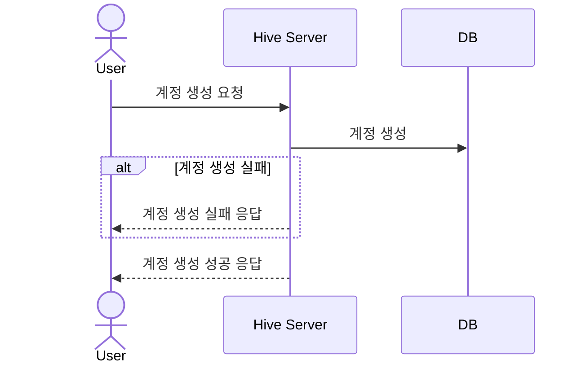
```mermaid
sequenceDiagram
	actor User
	participant Hive Server
	participant DB

	User->> Hive Server: 계정 생성 요청
	Hive Server ->> DB : 계정 생성
	alt 계정 생성 실패
	Hive Server -->> User : 계정 생성 실패 응답
	end

	Hive Server -->> User : 계정 생성 성공 응답
```  
  
  
# 유저의 로그인
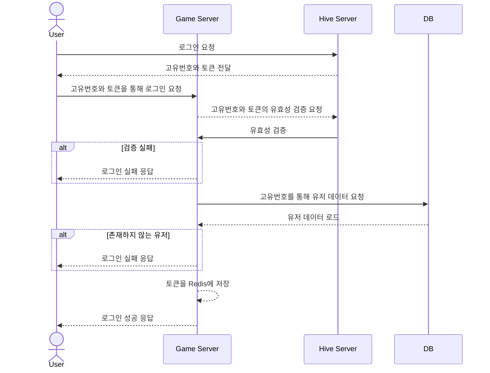
```mermaid
sequenceDiagram
	actor User
	participant Game Server
	participant Hive Server
	participant DB

	User->> Hive Server: 로그인 요청
	Hive Server -->> User : 고유번호와 토큰 전달

	User ->> Game Server : 고유번호와 토큰을 통해 로그인 요청
	Game Server -->> Hive Server : 고유번호와 토큰의 유효성 검증 요청
	Hive Server ->> Game Server : 유효성 검증
	alt 검증 실패
	Game Server -->> User : 로그인 실패 응답
	end
	
	Game Server ->> DB : 고유번호를 통해 유저 데이터 요청
	DB -->> Game Server : 유저 데이터 로드
	alt 존재하지 않는 유저
	Game Server -->> User : 로그인 실패 응답
	end
	Game Server -->> Game Server : 토큰을 Redis에 저장
	Game Server -->> User : 로그인 성공 응답
```   


================================================
File: All.sln
================================================

Microsoft Visual Studio Solution File, Format Version 12.00
# Visual Studio Version 17
VisualStudioVersion = 17.8.34330.188
MinimumVisualStudioVersion = 10.0.40219.1
Project("{9A19103F-16F7-4668-BE54-9A1E7A4F7556}") = "HiveAPIServer", "HiveAPIServer\HiveAPIServer.csproj", "{878AC177-ADB0-48C0-BC97-3DB17E7F454D}"
EndProject
Project("{9A19103F-16F7-4668-BE54-9A1E7A4F7556}") = "MatchAPIServer", "MatchAPIServer\MatchAPIServer.csproj", "{6D479CE6-6377-4F85-A00B-AD4CE85E3410}"
EndProject
Project("{9A19103F-16F7-4668-BE54-9A1E7A4F7556}") = "GameAPIServer", "GameAPIServer\GameAPIServer.csproj", "{2EBA31CE-6F50-4ECE-B77B-F326F455CCDF}"
EndProject
Global
	GlobalSection(SolutionConfigurationPlatforms) = preSolution
		Debug|Any CPU = Debug|Any CPU
		Release|Any CPU = Release|Any CPU
	EndGlobalSection
	GlobalSection(ProjectConfigurationPlatforms) = postSolution
		{878AC177-ADB0-48C0-BC97-3DB17E7F454D}.Debug|Any CPU.ActiveCfg = Debug|Any CPU
		{878AC177-ADB0-48C0-BC97-3DB17E7F454D}.Debug|Any CPU.Build.0 = Debug|Any CPU
		{878AC177-ADB0-48C0-BC97-3DB17E7F454D}.Release|Any CPU.ActiveCfg = Release|Any CPU
		{878AC177-ADB0-48C0-BC97-3DB17E7F454D}.Release|Any CPU.Build.0 = Release|Any CPU
		{6D479CE6-6377-4F85-A00B-AD4CE85E3410}.Debug|Any CPU.ActiveCfg = Debug|Any CPU
		{6D479CE6-6377-4F85-A00B-AD4CE85E3410}.Debug|Any CPU.Build.0 = Debug|Any CPU
		{6D479CE6-6377-4F85-A00B-AD4CE85E3410}.Release|Any CPU.ActiveCfg = Release|Any CPU
		{6D479CE6-6377-4F85-A00B-AD4CE85E3410}.Release|Any CPU.Build.0 = Release|Any CPU
		{2EBA31CE-6F50-4ECE-B77B-F326F455CCDF}.Debug|Any CPU.ActiveCfg = Debug|Any CPU
		{2EBA31CE-6F50-4ECE-B77B-F326F455CCDF}.Debug|Any CPU.Build.0 = Debug|Any CPU
		{2EBA31CE-6F50-4ECE-B77B-F326F455CCDF}.Release|Any CPU.ActiveCfg = Release|Any CPU
		{2EBA31CE-6F50-4ECE-B77B-F326F455CCDF}.Release|Any CPU.Build.0 = Release|Any CPU
	EndGlobalSection
	GlobalSection(SolutionProperties) = preSolution
		HideSolutionNode = FALSE
	EndGlobalSection
	GlobalSection(ExtensibilityGlobals) = postSolution
		SolutionGuid = {560D3881-D190-4C53-BAA7-9BB089C75615}
	EndGlobalSection
EndGlobal


================================================
File: DB_Schema.md
================================================
아래 사용 예를 참고하여 만드는 게임에 맞게 DB 스키마 정보를 만들도록 한다.  
사용하지 않는 것은 삭제한다.  
  
  
  
# account DB

## account_info 테이블
하이브 계정 정보를 가지고 있는 테이블
```sql
-- 테이블 생성 SQL - account
CREATE TABLE account
(
    `player_id`         BIGINT          NOT NULL    AUTO_INCREMENT COMMENT '플레이어 아이디',
    `user_id`             VARCHAR(50)     NOT NULL    COMMENT '유저아이디. 내용은 이메일',
    `salt_value`        VARCHAR(100)    NOT NULL    COMMENT '암호화 값',
    `pw`                VARCHAR(100)    NOT NULL    COMMENT '해싱된 비밀번호',
    `create_dt`         DATETIME        NOT NULL    DEFAULT CURRENT_TIMESTAMP COMMENT '생성 일시',
    `recent_login_dt`   DATETIME        NOT NULL    DEFAULT CURRENT_TIMESTAMP COMMENT '최근 로그인 일시',
     PRIMARY KEY (player_id),
     UNIQUE KEY (user_id)
)
```

# game DB
  
## user_info 테이블
게임에서 생성 된 계정 정보들을 가지고 있는 테이블    
  
```sql
-- 테이블 생성 SQL - user
CREATE TABLE user
(
    `uid`                           INT            NOT NULL    AUTO_INCREMENT COMMENT '유저아이디', 
    `player_id`                     BIGINT         NOT NULL    COMMENT '플레이어 아이디', 
    `nickname`                      VARCHAR(50)    NOT NULL    COMMENT '닉네임', 
    `create_dt`                     DATETIME       NOT NULL    DEFAULT CURRENT_TIMESTAMP COMMENT '생성 일시', 
    `recent_login_dt`               DATETIME       NOT NULL    DEFAULT CURRENT_TIMESTAMP COMMENT '최근 로그인 일시', 
    `total_bestscore`               INT            NOT NULL    DEFAULT 0 COMMENT '최고점수 역대', 
    `total_bestscore_cur_season`    INT            NOT NULL    DEFAULT 0 COMMENT '최고점수 현재 시즌', 
    `total_bestscore_prev_season`   INT            NOT NULL    DEFAULT 0 COMMENT '최고점수 이전 시즌', 
    `star_point`                    INT            NOT NULL    DEFAULT 0 COMMENT '스타 포인트', 
    `main_char_key`                 INT            NOT NULL    COMMENT '메인 캐릭터 키',
     PRIMARY KEY (uid),
     UNIQUE KEY (nickname)
);

```

## user_money 테이블
유저의 재화 정보를 가지고 있는 테이블
```sql
-- 테이블 생성 SQL - user_money
CREATE TABLE user_money
(
    `uid`         INT    NOT NULL    COMMENT '유저아이디', 
    `jewelry`     INT    NOT NULL    DEFAULT 0 COMMENT '보석', 
    `gold_medal`  INT    NOT NULL    DEFAULT 0 COMMENT '금 메달', 
    `cash`        INT    NOT NULL    DEFAULT 0 COMMENT '현금', 
    `sunchip`     INT    NOT NULL    DEFAULT 0 COMMENT '썬칩', 
     PRIMARY KEY (uid)
);
-- Foreign Key 설정 SQL - user_money(uid) -> user(uid)
ALTER TABLE user_money
    ADD CONSTRAINT FK_user_money_uid_user_uid FOREIGN KEY (uid)
        REFERENCES user (uid) ON DELETE RESTRICT ON UPDATE RESTRICT;
```

## friend 테이블
친구 정보를 가지고 있는 테이블  
```sql
-- 테이블 생성 SQL - friend
CREATE TABLE friend
(
    `uid`         INT         NOT NULL    COMMENT '유저아이디', 
    `friend_uid`  INT         NOT NULL    COMMENT '친구 유저아이디', 
    `friend_yn`   TINYINT     NOT NULL    DEFAULT 0  COMMENT '친구 여부', 
    `create_dt`   DATETIME    NOT NULL    DEFAULT CURRENT_TIMESTAMP COMMENT '생성 일시', 
     PRIMARY KEY (uid, friend_uid)
);
-- Foreign Key 설정 SQL - friend(uid) -> user(uid)
ALTER TABLE friend
    ADD CONSTRAINT FK_friend_uid_user_uid FOREIGN KEY (uid)
        REFERENCES user (uid) ON DELETE RESTRICT ON UPDATE RESTRICT;

-- Foreign Key 설정 SQL - friend(friend_uid) -> user(uid)
ALTER TABLE friend
    ADD CONSTRAINT FK_friend_friend_uid_user_uid FOREIGN KEY (friend_uid)
        REFERENCES user (uid) ON DELETE RESTRICT ON UPDATE RESTRICT;
```

## mailbox 테이블
우편함 정보를 가지고 있는 테이블
```sql
-- 테이블 생성 SQL - mailbox
CREATE TABLE mailbox
(
    `mail_seq`    INT             NOT NULL    AUTO_INCREMENT COMMENT '우편 일련번호', 
    `uid`         INT             NOT NULL    COMMENT '유저아이디', 
    `mail_title`  VARCHAR(100)    NOT NULL    COMMENT '우편 제목', 
    `create_dt`   DATETIME        NOT NULL    COMMENT '생성 일시', 
    `expire_dt`   DATETIME        NOT NULL    COMMENT '만료 일시', 
    `receive_dt`  DATETIME        NOT NULL    DEFAULT CURRENT_TIMESTAMP COMMENT '수령 일시', 
    `receive_yn`  TINYINT         NOT NULL    DEFAULT 0 COMMENT '수령 유무',
     PRIMARY KEY (mail_seq)
);
-- Foreign Key 설정 SQL - mailbox(uid) -> user(uid)
ALTER TABLE mailbox
    ADD CONSTRAINT FK_mailbox_uid_user_uid FOREIGN KEY (uid)
        REFERENCES user (uid) ON DELETE RESTRICT ON UPDATE RESTRICT;
```

## mailbox_reward 테이블
우편함의 보상정보를 가지고 있는 테이블
```sql
-- 테이블 생성 SQL - mailbox_reward
CREATE TABLE mailbox_reward
(
    `mail_seq`     INT            NOT NULL    COMMENT '우편 일련번호', 
    `reward_key`   INT            NOT NULL    COMMENT '보상 키', 
    `reward_qty`   INT            NOT NULL    COMMENT '보상 수', 
    `reward_type`  VARCHAR(20)    NOT NULL    COMMENT '보상 타입', 
     PRIMARY KEY (mail_seq, reward_key)
);

-- Foreign Key 설정 SQL - mailbox_reward(mail_seq) -> mailbox(mail_seq)
ALTER TABLE mailbox_reward
    ADD CONSTRAINT FK_mailbox_reward_mail_seq_mailbox_mail_seq FOREIGN KEY (mail_seq)
        REFERENCES mailbox (mail_seq) ON DELETE RESTRICT ON UPDATE RESTRICT;
```

## user_attendance 테이블
유저의 출석 현황을 가지고 있는 테이블
```sql
-- 테이블 생성 SQL - user_attendance
CREATE TABLE user_attendance
(
    `uid`                   INT         NOT NULL    COMMENT '유저아이디', 
    `attendance_cnt`        INT         NOT NULL    COMMENT '출석 횟수', 
    `recent_attendance_dt`  DATETIME    NOT NULL    COMMENT '최근 출석 일시', 
     PRIMARY KEY (uid)
);
-- Foreign Key 설정 SQL - user_attendance(uid) -> user(uid)
ALTER TABLE user_attendance
    ADD CONSTRAINT FK_user_attendance_uid_user_uid FOREIGN KEY (uid)
        REFERENCES user (uid) ON DELETE RESTRICT ON UPDATE RESTRICT;
```

## user_minigame 테이블
유저의 게임 정보를 가지고 있는 테이블
```sql
-- 테이블 생성 SQL - user_minigame
CREATE TABLE user_minigame
(
    `uid`                    INT         NOT NULL    COMMENT '유저아이디', 
    `game_key`               INT         NOT NULL    COMMENT '게임 키', 
    `bestscore`              INT         NOT NULL    COMMENT '최고점수', 
    `bestscore_cur_season`   INT         NOT NULL    COMMENT '최고점수 현재 시즌', 
    `bestscore_prev_season`  INT         NOT NULL    COMMENT '최고점수 이전 시즌', 
    `new_record_dt`          DATETIME    NOT NULL    DEFUALT CURRENT_TIMESTAMP COMMENT '신 기록 일시', 
    `recent_play_dt`         DATETIME    NOT NULL    DEFUALT CURRENT_TIMESTAMP COMMENT '최근 플레이 일시', 
    `play_char_key`          INT         NOT NULL    COMMENT '플레이 캐릭터 키', 
    `create_dt`              DATETIME    NOT NULL    COMMENT '생성 일시', 
     PRIMARY KEY (uid, game_key)
);

-- Foreign Key 설정 SQL - user_minigame(uid) -> user(uid)
ALTER TABLE user_minigame
    ADD CONSTRAINT FK_user_minigame_uid_user_uid FOREIGN KEY (uid)
        REFERENCES user (uid) ON DELETE RESTRICT ON UPDATE RESTRICT;
```

## user_char 테이블
유저의 캐릭터 정보를 가지고 있는 테이블
```sql
-- 테이블 생성 SQL - user_char
CREATE TABLE user_char
(
    `uid`           INT         NOT NULL    COMMENT '유저아이디', 
    `char_key`      INT         NOT NULL    COMMENT '캐릭터 키', 
    `char_level`    INT         NOT NULL    DEFAULT 1 COMMENT '캐릭터 레벨', 
    `char_cnt`      INT         NOT NULL    DEFAULT 1 COMMENT '캐릭터 개수',
    `skin_key`      INT         NOT NULL    DEFAULT 0 COMMENT '스킨 키', 
    `create_dt`     DATETIME    NOT NULL    COMMENT '생성 일시', 
    `costume_json`  JSON        NOT NULL    COMMENT '코스튬 JSON', 
     PRIMARY KEY (uid, char_key)
);
-- Foreign Key 설정 SQL - user_char(uid) -> user(uid)
ALTER TABLE user_char
    ADD CONSTRAINT FK_user_char_uid_user_uid FOREIGN KEY (uid)
        REFERENCES user (uid) ON DELETE RESTRICT ON UPDATE RESTRICT;
```

## user_char_random_skill 테이블
유저의 캐릭터의 랜덤 스킬 정보를 가지고 있는 테이블
```sql
-- 테이블 생성 SQL - user_char_random_skill
CREATE TABLE user_char_random_skill
(
    `uid`        INT         NOT NULL    COMMENT '유저아이디', 
    `char_key`   INT         NOT NULL    COMMENT '캐릭터 키', 
    `index_num`  INT         NOT NULL    COMMENT '순서 숫자', 
    `skill_key`  INT         NOT NULL    COMMENT '스킬 키', 
    `create_dt`  DATETIME    NOT NULL    COMMENT '생성 일시', 
     PRIMARY KEY (uid, char_key, index_num)
);
-- Foreign Key 설정 SQL - user_char_random_skill(uid) -> user(uid)
ALTER TABLE user_char_random_skill
    ADD CONSTRAINT FK_user_char_random_skill_uid_user_uid FOREIGN KEY (uid)
        REFERENCES user (uid) ON DELETE RESTRICT ON UPDATE RESTRICT;
```

## user_costume 테이블
유저의 코스튬 정보를 가지고 있는 테이블
```sql
-- 테이블 생성 SQL - user_costume
CREATE TABLE user_costume
(
    `uid`            INT         NOT NULL    COMMENT '유저아이디', 
    `costume_key`    INT         NOT NULL    COMMENT '코스튬 키', 
    `costume_level`  INT         NOT NULL    DEFAULT 1 COMMENT '코스튬 레벨',
    `costume_cnt`    INT         NOT NULL    DEFAULT 1 COMMENT '코스튬 개수',
    `create_dt`      DATETIME    NOT NULL    COMMENT '생성 일시', 
     PRIMARY KEY (uid, costume_key)
);

-- Foreign Key 설정 SQL - user_costume(uid) -> user(uid)
ALTER TABLE user_costume
    ADD CONSTRAINT FK_user_costume_uid_user_uid FOREIGN KEY (uid)
        REFERENCES user (uid) ON DELETE RESTRICT ON UPDATE RESTRICT;
```

## user_skin 테이블
유저의 스킨 정보를 가지고 있는 테이블
```sql
-- 테이블 생성 SQL - user_skin
CREATE TABLE user_skin
(
    `uid`        INT         NOT NULL    COMMENT '유저아이디', 
    `skin_key`   INT         NOT NULL    COMMENT '스킨 키', 
    `create_dt`  DATETIME    NOT NULL    COMMENT '생성 일시', 
     PRIMARY KEY (uid, skin_key)
);
-- Foreign Key 설정 SQL - user_skin(uid) -> user(uid)
ALTER TABLE user_skin
    ADD CONSTRAINT FK_user_skin_uid_user_uid FOREIGN KEY (uid)
        REFERENCES user (uid) ON DELETE RESTRICT ON UPDATE RESTRICT;
```

## user_food 테이블
유저의 푸드 정보를 가지고 있는 테이블
```sql
-- 테이블 생성 SQL - user_food
CREATE TABLE user_food
(
    `uid`            INT         NOT NULL    COMMENT '유저아이디', 
    `food_key`       INT         NOT NULL    COMMENT '푸드 키', 
    `food_qty`       INT         NOT NULL    COMMENT '푸드 수', 
    `food_gear_qty`  INT         NOT NULL    COMMENT '푸드 기어 수', 
    `food_level`     INT         NOT NULL    COMMENT '푸드 레벨', 
    `create_dt`      DATETIME    NOT NULL    COMMENT '생성 일시', 
     PRIMARY KEY (uid, food_key)
);

-- Foreign Key 설정 SQL - user_food(uid) -> user(uid)
ALTER TABLE user_food
    ADD CONSTRAINT FK_user_food_uid_user_uid FOREIGN KEY (uid)
        REFERENCES user (uid) ON DELETE RESTRICT ON UPDATE RESTRICT;
```


<br>
<br>

# master DB
## version 테이블
앱버전과 데이터 버전을 가지고 있는 테이블
```sql
-- 테이블 생성 SQL - version
CREATE TABLE version
(
    `app_version`            INT         NOT NULL    COMMENT '앱 버전', 
    `master_data_version`    INT         NOT NULL    COMMENT '마스터 데이터 버전', 
);
```

## master_game 테이블
게임 정보를 가지고 있는 테이블
```sql
-- 테이블 생성 SQL - master_game
CREATE TABLE master_game
(
    `game_key`   INT            NOT NULL    COMMENT '게임 키', 
    `game_name`  VARCHAR(50)    NOT NULL    COMMENT '게임 이름', 
     PRIMARY KEY (game_key)
);
```

## master_char 테이블
캐릭터 정보를 가지고 있는 테이블
```sql
-- 테이블 생성 SQL - master_char
CREATE TABLE master_char
(
    `char_key`    INT            NOT NULL    COMMENT '캐릭터 키', 
    `char_name`   VARCHAR(50)    NOT NULL    COMMENT '캐릭터 이름', 
    `char_grade`  VARCHAR(20)    NOT NULL    COMMENT '캐릭터 등급', 
    `game_key`    INT            NOT NULL    COMMENT '게임 키', 
    `stat_run`    INT            NOT NULL    COMMENT '스탯 달리기', 
    `stat_power`  INT            NOT NULL    COMMENT '스탯 힘', 
    `stat_jump`   INT            NOT NULL    COMMENT '스탯 점프', 
    `create_dt`   DATETIME       NOT NULL    COMMENT '생성 일시', 
     PRIMARY KEY (char_key)
);

-- Foreign Key 설정 SQL - master_char(game_key) -> master_game(game_key)
ALTER TABLE master_char
    ADD CONSTRAINT FK_master_char_game_key_master_game_game_key FOREIGN KEY (game_key)
        REFERENCES master_game (game_key) ON DELETE RESTRICT ON UPDATE RESTRICT;
```

## master_costume 테이블
코스튬 정보를 가지고 있는 테이블
```sql
-- 테이블 생성 SQL - master_costume
CREATE TABLE master_costume
(
    `costume_key`   INT            NOT NULL    COMMENT '코스튬 키', 
    `costume_name`  VARCHAR(50)    NOT NULL    COMMENT '코스튬 이름', 
    `costume_type`  INT            NOT NULL    COMMENT '코스튬 종류', 
    `create_dt`     DATETIME       NOT NULL    COMMENT '생성 일시', 
    `set_key`       INT            NOT NULL    DEFAULT 0 COMMENT '세트 키', 
     PRIMARY KEY (costume_key)
);
```

## master_costume_set 테이블
코스튬 세트 정보를 가지고 있는 테이블
```sql
CREATE TABLE master_costume_set
(
    `set_key`             INT            NOT NULL    COMMENT '세트 키', 
    `set_name`            VARCHAR(50)    NOT NULL    COMMENT '세트 이름', 
    `char_key`            INT            NOT NULL    COMMENT '캐릭터 키', 
    `set_bonus_percent`   INT            NOT NULL    COMMENT '세트 보너스 퍼센트', 
    `char_bonus_percent`  INT            NOT NULL    COMMENT '캐릭터 보너스 퍼센트', 
    `create_dt`           DATETIME       NOT NULL    COMMENT '생성 일시', 
     PRIMARY KEY (set_key)
);
-- Foreign Key 설정 SQL - master_costume_set(char_key) -> master_char(char_key)
ALTER TABLE master_costume_set
    ADD CONSTRAINT FK_master_costume_set_char_key_master_char_char_key FOREIGN KEY (char_key)
        REFERENCES master_char (char_key) ON DELETE RESTRICT ON UPDATE RESTRICT;
```

## master_skin 테이블
스킨 정보를 가지고 있는 테이블
```sql
-- 테이블 생성 SQL - master_skin
CREATE TABLE master_skin
(
    `skin_key`            INT            NOT NULL    COMMENT '스킨 키', 
    `skin_name`           VARCHAR(50)    NOT NULL    COMMENT '스킨 이름', 
    `char_key`            INT            NOT NULL    COMMENT '캐릭터 키', 
    `skin_bonus_percent`  INT            NOT NULL    COMMENT '스킨 보너스 퍼센트', 
    `create_dt`           DATETIME       NOT NULL    COMMENT '생성 일시', 
     PRIMARY KEY (skin_key)
);
-- Foreign Key 설정 SQL - master_skin(char_key) -> master_char(char_key)
ALTER TABLE master_skin
    ADD CONSTRAINT FK_master_skin_char_key_master_char_char_key FOREIGN KEY (char_key)
        REFERENCES master_char (char_key) ON DELETE RESTRICT ON UPDATE RESTRICT;
```

## master_skill 테이블
스킬 정보를 가지고 있는 테이블
```sql
-- 테이블 생성 SQL - master_skill
CREATE TABLE master_skill
(
    `skill_key`         INT         NOT NULL    COMMENT '스킬 키', 
    `act_prob_percent`  INT         NOT NULL    COMMENT '발동 확률 퍼센트', 
    `create_dt`         DATETIME    NOT NULL    COMMENT '생성 일시', 
    `char_key`          INT         NOT NULL    DEFAULT 0 COMMENT '캐릭터 키', 
     PRIMARY KEY (skill_key)
);
-- Foreign Key 설정 SQL - master_skill(char_key) -> master_char(char_key)
ALTER TABLE master_skill
    ADD CONSTRAINT FK_master_skill_char_key_master_char_char_key FOREIGN KEY (char_key)
        REFERENCES master_char (char_key) ON DELETE RESTRICT ON UPDATE RESTRICT;
```

## master_food 테이블
푸드 정보를 가지고 있는 테이블
```sql
-- 테이블 생성 SQL - master_food
CREATE TABLE master_food
(
    `food_key`   INT            NOT NULL    COMMENT '푸드 키', 
    `food_name`  VARCHAR(50)    NOT NULL    COMMENT '푸드 이름', 
    `create_dt`  DATETIME       NOT NULL    COMMENT '생성 일시', 
    `game_key`   INT            NOT NULL    COMMENT '게임 키', 
     PRIMARY KEY (food_key)
);
```

## master_gacha_reward 테이블
가챠 보상의 확률 정보와 뽑는 수량을 가지고 있는 테이블
```sql
-- 테이블 생성 SQL - master_gacha_reward
CREATE TABLE master_gacha_reward
(
    `gacha_reward_key`        INT            NOT NULL    COMMENT '가챠 보상 키', 
    `gacha_reward_name`       VARCHAR(50)    NOT NULL    COMMENT '가챠 보상 이름', 
    `char_prob_percent`       INT            NOT NULL    COMMENT '캐릭터 확률 퍼센트', 
    `skin_prob_percent`       INT            NOT NULL    COMMENT '스킨 확률 퍼센트', 
    `costume_prob_percent`    INT            NOT NULL    COMMENT '코스튬 확률 퍼센트', 
    `food_prob_percent`       INT            NOT NULL    COMMENT '푸드 확률 퍼센트', 
    `food_gear_prob_percent`  INT            NOT NULL    COMMENT '푸드 기어 확률 퍼센트', 
    `gacha_count`             INT            NOT NULL    COMMENT '가챠 개수', 
    `create_dt`               DATETIME       NOT NULL    COMMENT '생성 일시', 
     PRIMARY KEY (gacha_reward_key)
);
```

## master_gacha_reward_list 테이블
가챠 보상에 포함되는 보상들의 정보를 가지고 있는 테이블
```sql
-- 테이블 생성 SQL - master_gacha_reward_list
CREATE TABLE master_gacha_reward_list
(
    `gacha_reward_key`  INT            NOT NULL    COMMENT '가챠 보상 키', 
    `reward_key`        INT            NOT NULL    COMMENT '보상 키', 
    `reward_type`       VARCHAR(20)    NOT NULL    COMMENT '보상 종류',
    `reward_qty`        INT             NOT NULL   DEFAULT 1 COMMENT '보상 수',
    `create_dt`         DATETIME       NOT NULL    COMMENT '생성 일시', 
     PRIMARY KEY (gacha_reward_key, reward_key)
);
-- Foreign Key 설정 SQL - master_gacha_reward_list(gacha_reward_key) -> master_gacha_reward(gacha_reward_key)
ALTER TABLE master_gacha_reward_list
    ADD CONSTRAINT FK_master_gacha_reward_list_gacha_reward_key_master_gacha_reward FOREIGN KEY (gacha_reward_key)
        REFERENCES master_gacha_reward (gacha_reward_key) ON DELETE RESTRICT ON UPDATE RESTRICT;
```

## master_attendance_reward 테이블
출석 보상 정보를 가지고 있는 테이블
```sql
-- 테이블 생성 SQL - master_attendance_reward
CREATE TABLE master_attendance_reward
(
    `day_seq`     INT         NOT NULL    COMMENT '날짜 번호', 
    `reward_key`  INT         NOT NULL    COMMENT '보상 키', 
    `reward_qty`  INT         NOT NULL    DEFAULT 0 COMMENT '보상 수',
    `reward_type` VARCHAR(20) NOT NULL    COMMENT '보상 종류',
    `create_dt`   DATETIME    NOT NULL    COMMENT '생성 일시', 
     PRIMARY KEY (day_seq)
);
```

## master_item_level 테이블
아이템(캐릭터, 코스튬, 푸드) 레벨업을 위한 개수의 정보를 가지고 있는 테이블
```sql
-- 테이블 생성 SQL - master_item_level
CREATE TABLE master_item_level
(
    `level`     INT            NOT NULL    COMMENT '레벨', 
    `item_cnt`  VARCHAR(50)    NOT NULL    DEFAULT 1 COMMENT '아이템 개수', 
     PRIMARY KEY (level)
);
```


================================================
File: GameDB_Dump.sql
================================================
-- MySQL dump 10.13  Distrib 8.0.34, for Win64 (x86_64)
--
-- Host: localhost    Database: game_db
-- ------------------------------------------------------
-- Server version	8.2.0

/*!40101 SET @OLD_CHARACTER_SET_CLIENT=@@CHARACTER_SET_CLIENT */;
/*!40101 SET @OLD_CHARACTER_SET_RESULTS=@@CHARACTER_SET_RESULTS */;
/*!40101 SET @OLD_COLLATION_CONNECTION=@@COLLATION_CONNECTION */;
/*!50503 SET NAMES utf8 */;
/*!40103 SET @OLD_TIME_ZONE=@@TIME_ZONE */;
/*!40103 SET TIME_ZONE='+00:00' */;
/*!40014 SET @OLD_UNIQUE_CHECKS=@@UNIQUE_CHECKS, UNIQUE_CHECKS=0 */;
/*!40014 SET @OLD_FOREIGN_KEY_CHECKS=@@FOREIGN_KEY_CHECKS, FOREIGN_KEY_CHECKS=0 */;
/*!40101 SET @OLD_SQL_MODE=@@SQL_MODE, SQL_MODE='NO_AUTO_VALUE_ON_ZERO' */;
/*!40111 SET @OLD_SQL_NOTES=@@SQL_NOTES, SQL_NOTES=0 */;

--
-- Current Database: `game_db`
--

CREATE DATABASE /*!32312 IF NOT EXISTS*/ `game_db` /*!40100 DEFAULT CHARACTER SET utf8mb4 COLLATE utf8mb4_0900_ai_ci */ /*!80016 DEFAULT ENCRYPTION='N' */;

USE `game_db`;

--
-- Table structure for table `friend`
--

DROP TABLE IF EXISTS `friend`;
/*!40101 SET @saved_cs_client     = @@character_set_client */;
/*!50503 SET character_set_client = utf8mb4 */;
CREATE TABLE `friend` (
  `uid` int NOT NULL COMMENT '유저아이디',
  `friend_uid` int NOT NULL COMMENT '친구 유저아이디',
  `friend_yn` tinyint NOT NULL DEFAULT '0' COMMENT '친구 여부',
  `create_dt` datetime NOT NULL COMMENT '생성 일시',
  PRIMARY KEY (`uid`,`friend_uid`),
  KEY `FK_friend_friend_uid_user_info_uid` (`friend_uid`)
) ENGINE=InnoDB DEFAULT CHARSET=utf8mb4 COLLATE=utf8mb4_0900_ai_ci;
/*!40101 SET character_set_client = @saved_cs_client */;

--
-- Dumping data for table `friend`
--

LOCK TABLES `friend` WRITE;
/*!40000 ALTER TABLE `friend` DISABLE KEYS */;
INSERT INTO `friend` VALUES (4,5,0,'2024-01-17 13:29:59'),(6,5,0,'2024-01-17 18:04:09'),(9,5,0,'2024-01-19 15:58:42'),(13,17,0,'2024-01-23 15:56:27'),(14,5,0,'2024-01-23 10:40:36'),(14,17,1,'2024-01-23 15:50:49'),(17,8,0,'2024-01-23 15:48:29'),(17,14,1,'2024-01-23 15:34:53');
/*!40000 ALTER TABLE `friend` ENABLE KEYS */;
UNLOCK TABLES;

--
-- Table structure for table `mailbox`
--

DROP TABLE IF EXISTS `mailbox`;
/*!40101 SET @saved_cs_client     = @@character_set_client */;
/*!50503 SET character_set_client = utf8mb4 */;
CREATE TABLE `mailbox` (
  `mail_seq` int NOT NULL AUTO_INCREMENT COMMENT '우편 일련번호',
  `uid` int NOT NULL COMMENT '유저아이디',
  `mail_title` varchar(100) NOT NULL COMMENT '우편 제목',
  `create_dt` datetime NOT NULL COMMENT '생성 일시',
  `expire_dt` datetime NOT NULL COMMENT '만료 일시',
  `receive_dt` datetime NOT NULL DEFAULT CURRENT_TIMESTAMP COMMENT '수령 일시',
  `receive_yn` tinyint NOT NULL DEFAULT '0' COMMENT '수령 유무',
  PRIMARY KEY (`mail_seq`)
) ENGINE=InnoDB AUTO_INCREMENT=6 DEFAULT CHARSET=utf8mb4 COLLATE=utf8mb4_0900_ai_ci COMMENT='우편함';
/*!40101 SET character_set_client = @saved_cs_client */;

--
-- Dumping data for table `mailbox`
--

LOCK TABLES `mailbox` WRITE;
/*!40000 ALTER TABLE `mailbox` DISABLE KEYS */;
INSERT INTO `mailbox` VALUES (2,13,'두 번째 접속 선물!!!','2024-01-18 13:58:44','2024-02-01 13:58:44','2024-01-23 11:28:00',1),(3,8,'세 번째 접속 선물!!!','2024-01-18 13:58:52','2024-02-01 13:58:52','2024-01-23 11:22:31',0),(4,13,'첫 번째 접속 선물','2024-01-19 15:54:07','2024-02-02 15:54:07','2024-01-23 11:52:04',1),(5,9,'첫 번째 접속 선물','2024-01-19 15:54:21','2024-01-19 15:54:21','2024-01-23 11:22:31',0);
/*!40000 ALTER TABLE `mailbox` ENABLE KEYS */;
UNLOCK TABLES;

--
-- Table structure for table `mailbox_reward`
--

DROP TABLE IF EXISTS `mailbox_reward`;
/*!40101 SET @saved_cs_client     = @@character_set_client */;
/*!50503 SET character_set_client = utf8mb4 */;
CREATE TABLE `mailbox_reward` (
  `mail_seq` int NOT NULL COMMENT '우편 일련번호',
  `reward_key` int NOT NULL COMMENT '보상 키',
  `reward_qty` int NOT NULL COMMENT '보상 수',
  `reward_type` varchar(20) NOT NULL COMMENT '보상 타입',
  PRIMARY KEY (`mail_seq`,`reward_key`)
) ENGINE=InnoDB DEFAULT CHARSET=utf8mb4 COLLATE=utf8mb4_0900_ai_ci COMMENT='우편함 보상';
/*!40101 SET character_set_client = @saved_cs_client */;

--
-- Dumping data for table `mailbox_reward`
--

LOCK TABLES `mailbox_reward` WRITE;
/*!40000 ALTER TABLE `mailbox_reward` DISABLE KEYS */;
INSERT INTO `mailbox_reward` VALUES (2,1,100,'money'),(2,1001,1,'char'),(2,4001,5,'food'),(2,4101,5,'food_gear'),(2,5001,1,'gacha'),(3,1,100,'money'),(3,1001,1,'char'),(3,5001,1,'gacha'),(4,1,100,'money'),(4,1003,1,'char'),(4,5002,1,'gacha');
/*!40000 ALTER TABLE `mailbox_reward` ENABLE KEYS */;
UNLOCK TABLES;

--
-- Table structure for table `user`
--

DROP TABLE IF EXISTS `user`;
/*!40101 SET @saved_cs_client     = @@character_set_client */;
/*!50503 SET character_set_client = utf8mb4 */;
CREATE TABLE `user` (
  `uid` int NOT NULL AUTO_INCREMENT COMMENT '유저아이디',
  `player_id` bigint NOT NULL COMMENT '플레이어 아이디',
  `create_dt` datetime NOT NULL DEFAULT CURRENT_TIMESTAMP COMMENT '생성 일시',
  `recent_login_dt` datetime DEFAULT NULL COMMENT '최근 로그인 일시',
  `nickname` varchar(50) NOT NULL,
  `total_bestscore` int DEFAULT NULL,
  `total_bestscore_cur_season` int DEFAULT NULL,
  `total_bestscore_prev_season` int DEFAULT NULL,
  `star_point` int NOT NULL DEFAULT '0' COMMENT '스타 포인트',
  `main_char_key` int NOT NULL DEFAULT '1' COMMENT '대표 캐릭터 키',
  PRIMARY KEY (`uid`)
) ENGINE=InnoDB AUTO_INCREMENT=25 DEFAULT CHARSET=utf8mb4 COLLATE=utf8mb4_0900_ai_ci;
/*!40101 SET character_set_client = @saved_cs_client */;

--
-- Dumping data for table `user`
--

LOCK TABLES `user` WRITE;
/*!40000 ALTER TABLE `user` DISABLE KEYS */;
INSERT INTO `user` VALUES (4,16,'2024-01-16 18:01:17','2024-01-17 13:29:15','a',1000,0,0,0,1001),(5,17,'2024-01-16 18:02:53','2024-01-16 18:02:53','b',1000,0,0,0,1001),(6,18,'2024-01-17 14:02:09','2024-01-17 18:03:50','ksy',1000,0,0,0,1001),(7,19,'2024-01-18 09:25:18','2024-01-18 09:25:18','sykim',1000,0,0,0,1001),(8,20,'2024-01-18 09:27:30','2024-01-22 15:21:27','sy',1000,0,0,0,1001),(9,21,'2024-01-19 15:49:39','2024-01-22 16:17:14','sy1',10000,0,0,0,1003),(13,22,'2024-01-22 18:01:28','2024-01-23 15:56:18','sya1',0,0,0,0,1001),(14,23,'2024-01-22 18:04:29','2024-01-24 09:39:21','syaa1',0,0,0,0,1001),(17,24,'2024-01-23 12:15:13','2024-01-23 17:07:06','syaaa1',100001,0,0,0,1001),(21,26,'2024-01-23 17:38:59','2024-01-24 09:38:20','26번입니다람쥐',10001,NULL,NULL,0,1001),(22,27,'2024-01-24 11:11:17','2024-01-24 14:22:58','테스트',2000,NULL,NULL,0,1001),(23,28,'2024-01-24 14:25:41','2024-01-24 14:27:28','aadsaa',NULL,NULL,NULL,0,1001),(24,29,'2024-01-24 14:28:43','2024-01-25 13:55:28','bbbb',NULL,NULL,NULL,0,1001);
/*!40000 ALTER TABLE `user` ENABLE KEYS */;
UNLOCK TABLES;

--
-- Table structure for table `user_attendance`
--

DROP TABLE IF EXISTS `user_attendance`;
/*!40101 SET @saved_cs_client     = @@character_set_client */;
/*!50503 SET character_set_client = utf8mb4 */;
CREATE TABLE `user_attendance` (
  `uid` int NOT NULL COMMENT '유저아이디',
  `attendance_cnt` int NOT NULL DEFAULT '0' COMMENT '출석 횟수',
  `recent_attendance_dt` datetime DEFAULT NULL COMMENT '최근 출석 일시',
  PRIMARY KEY (`uid`)
) ENGINE=InnoDB DEFAULT CHARSET=utf8mb4 COLLATE=utf8mb4_0900_ai_ci COMMENT='출석 테이블';
/*!40101 SET character_set_client = @saved_cs_client */;

--
-- Dumping data for table `user_attendance`
--

LOCK TABLES `user_attendance` WRITE;
/*!40000 ALTER TABLE `user_attendance` DISABLE KEYS */;
INSERT INTO `user_attendance` VALUES (6,0,'2024-01-18 11:11:11'),(7,0,'2024-01-18 11:11:11'),(8,14,'2024-01-19 14:02:17'),(9,1,'2024-01-19 15:50:27'),(13,1,'2024-01-23 11:37:41'),(14,0,'2024-01-18 11:11:11'),(17,0,'2024-01-22 12:15:13'),(21,1,'2024-01-23 17:39:29'),(22,1,'2024-01-24 11:12:44'),(23,0,'2024-01-23 14:25:41'),(24,7,'2024-01-24 14:36:45');
/*!40000 ALTER TABLE `user_attendance` ENABLE KEYS */;
UNLOCK TABLES;

--
-- Table structure for table `user_char`
--

DROP TABLE IF EXISTS `user_char`;
/*!40101 SET @saved_cs_client     = @@character_set_client */;
/*!50503 SET character_set_client = utf8mb4 */;
CREATE TABLE `user_char` (
  `uid` int NOT NULL COMMENT '유저아이디',
  `char_key` int NOT NULL,
  `char_level` int NOT NULL DEFAULT '1' COMMENT '캐릭터 레벨',
  `skin_key` int NOT NULL DEFAULT '0' COMMENT '스킨 키',
  `create_dt` datetime NOT NULL COMMENT '생성 일시',
  `costume_json` json NOT NULL COMMENT '코스튬 JSON',
  `char_cnt` int NOT NULL DEFAULT '1' COMMENT '캐릭터 개수',
  PRIMARY KEY (`uid`,`char_key`)
) ENGINE=InnoDB DEFAULT CHARSET=utf8mb4 COLLATE=utf8mb4_0900_ai_ci;
/*!40101 SET character_set_client = @saved_cs_client */;

--
-- Dumping data for table `user_char`
--

LOCK TABLES `user_char` WRITE;
/*!40000 ALTER TABLE `user_char` DISABLE KEYS */;
INSERT INTO `user_char` VALUES (8,1001,7,0,'2024-01-18 18:40:18','{\"face\": 0, \"hand\": 0, \"head\": 0}',22),(9,1001,1,0,'2024-01-19 16:25:57','{\"face\": 0, \"hand\": 0, \"head\": 0}',1),(9,1003,1,0,'2024-01-19 15:57:25','{\"face\": 0, \"hand\": 0, \"head\": 0}',1),(13,1001,2,0,'2024-01-22 18:01:28','{\"face\": 0, \"hand\": 0, \"head\": 0}',2),(13,1003,1,0,'2024-01-23 11:52:03','{\"face\": 0, \"hand\": 0, \"head\": 0}',1),(14,1001,1,0,'2024-01-22 18:04:29','{\"face\": 0, \"hand\": 0, \"head\": 0}',1),(17,1001,1,0,'2024-01-23 12:15:13','{\"face\": 0, \"hand\": 0, \"head\": 0}',1),(21,1001,1,0,'2024-01-23 17:38:59','{\"face\": 0, \"hand\": 0, \"head\": 0}',1),(22,1001,1,0,'2024-01-24 11:11:17','{\"face\": 0, \"hand\": 0, \"head\": 0}',1),(23,1,1,0,'2024-01-24 14:25:41','{\"face\": 0, \"hand\": 0, \"head\": 0}',1),(24,1,1,0,'2024-01-24 14:28:43','{\"face\": 0, \"hand\": 0, \"head\": 0}',1);
/*!40000 ALTER TABLE `user_char` ENABLE KEYS */;
UNLOCK TABLES;

--
-- Table structure for table `user_char_random_skill`
--

DROP TABLE IF EXISTS `user_char_random_skill`;
/*!40101 SET @saved_cs_client     = @@character_set_client */;
/*!50503 SET character_set_client = utf8mb4 */;
CREATE TABLE `user_char_random_skill` (
  `uid` int NOT NULL COMMENT '유저아이디',
  `char_key` int NOT NULL COMMENT '캐릭터 키',
  `index_num` int NOT NULL COMMENT '순서 숫자',
  `skill_key` int NOT NULL COMMENT '스킬 키',
  `create_dt` datetime NOT NULL COMMENT '생성 일시',
  PRIMARY KEY (`uid`,`char_key`,`index_num`)
) ENGINE=InnoDB DEFAULT CHARSET=utf8mb4 COLLATE=utf8mb4_0900_ai_ci COMMENT='유저 캐릭터 랜덤 스킬';
/*!40101 SET character_set_client = @saved_cs_client */;

--
-- Dumping data for table `user_char_random_skill`
--

LOCK TABLES `user_char_random_skill` WRITE;
/*!40000 ALTER TABLE `user_char_random_skill` DISABLE KEYS */;
/*!40000 ALTER TABLE `user_char_random_skill` ENABLE KEYS */;
UNLOCK TABLES;

--
-- Table structure for table `user_costume`
--

DROP TABLE IF EXISTS `user_costume`;
/*!40101 SET @saved_cs_client     = @@character_set_client */;
/*!50503 SET character_set_client = utf8mb4 */;
CREATE TABLE `user_costume` (
  `uid` int NOT NULL COMMENT '유저아이디',
  `costume_key` int NOT NULL,
  `costume_level` int NOT NULL DEFAULT '1' COMMENT '코스튬 레벨',
  `create_dt` datetime NOT NULL COMMENT '생성 일시',
  `costume_cnt` int NOT NULL DEFAULT '1' COMMENT '코스튬 개수',
  PRIMARY KEY (`uid`,`costume_key`)
) ENGINE=InnoDB DEFAULT CHARSET=utf8mb4 COLLATE=utf8mb4_0900_ai_ci;
/*!40101 SET character_set_client = @saved_cs_client */;

--
-- Dumping data for table `user_costume`
--

LOCK TABLES `user_costume` WRITE;
/*!40000 ALTER TABLE `user_costume` DISABLE KEYS */;
INSERT INTO `user_costume` VALUES (8,3001,1,'2024-01-19 13:35:27',1),(8,3002,2,'2024-01-19 13:56:46',2),(8,3003,2,'2024-01-19 13:50:34',2),(8,3004,2,'2024-01-19 13:25:52',2),(8,3005,3,'2024-01-19 13:55:07',3),(8,3006,1,'2024-01-19 14:02:18',1),(8,3010,1,'2024-01-19 13:35:27',1),(9,3005,1,'2024-01-19 15:57:25',1),(9,3007,1,'2024-01-19 15:57:25',1),(9,3009,1,'2024-01-19 15:57:25',1),(13,3002,1,'2024-01-23 11:52:03',1),(13,3003,1,'2024-01-23 11:52:03',1),(13,3007,1,'2024-01-23 11:28:00',1),(13,3009,1,'2024-01-23 11:28:00',1),(24,4,1,'2024-01-24 14:36:45',1),(24,7,2,'2024-01-24 14:35:41',2),(24,9,1,'2024-01-24 14:35:41',1),(24,10,1,'2024-01-24 14:36:39',1);
/*!40000 ALTER TABLE `user_costume` ENABLE KEYS */;
UNLOCK TABLES;

--
-- Table structure for table `user_food`
--

DROP TABLE IF EXISTS `user_food`;
/*!40101 SET @saved_cs_client     = @@character_set_client */;
/*!50503 SET character_set_client = utf8mb4 */;
CREATE TABLE `user_food` (
  `uid` int NOT NULL COMMENT '유저아이디',
  `food_key` int NOT NULL COMMENT '푸드 키',
  `food_qty` int NOT NULL DEFAULT '0' COMMENT '푸드 수',
  `food_gear_qty` int NOT NULL DEFAULT '0' COMMENT '푸드 기어 수',
  `food_level` int NOT NULL DEFAULT '1' COMMENT '푸드 레벨',
  `create_dt` datetime NOT NULL COMMENT '생성 일시',
  PRIMARY KEY (`uid`,`food_key`)
) ENGINE=InnoDB DEFAULT CHARSET=utf8mb4 COLLATE=utf8mb4_0900_ai_ci COMMENT='푸드 정보 테이블';
/*!40101 SET character_set_client = @saved_cs_client */;

--
-- Dumping data for table `user_food`
--

LOCK TABLES `user_food` WRITE;
/*!40000 ALTER TABLE `user_food` DISABLE KEYS */;
INSERT INTO `user_food` VALUES (8,4001,20,20,1,'2024-01-19 13:56:21'),(8,4002,3,0,1,'2024-01-19 13:56:46'),(8,4007,1,0,1,'2024-01-19 13:56:32'),(8,4008,1,0,1,'2024-01-19 13:56:32'),(8,4009,2,0,1,'2024-01-19 13:57:44'),(8,4012,1,0,1,'2024-01-19 14:02:18'),(8,4013,1,0,1,'2024-01-19 13:56:21'),(8,4014,1,0,1,'2024-01-19 13:56:21'),(8,4016,3,0,1,'2024-01-19 13:56:46'),(8,4017,1,0,1,'2024-01-19 14:02:18'),(9,4001,1,0,1,'2024-01-19 15:57:25'),(9,4004,1,0,1,'2024-01-19 15:57:25'),(9,4007,1,0,1,'2024-01-19 15:57:25'),(9,4012,1,0,1,'2024-01-19 15:57:25'),(9,4018,1,0,1,'2024-01-19 15:57:25'),(13,4001,5,5,1,'2024-01-23 11:28:00'),(13,4003,2,0,1,'2024-01-23 11:52:03'),(13,4005,2,0,1,'2024-01-23 11:28:00'),(13,4010,2,0,1,'2024-01-23 11:52:03'),(13,4016,1,0,1,'2024-01-23 11:52:03'),(24,11,1,0,1,'2024-01-24 14:36:45'),(24,13,1,0,1,'2024-01-24 14:36:45'),(24,14,1,0,1,'2024-01-24 14:35:41'),(24,16,1,0,1,'2024-01-24 14:36:39');
/*!40000 ALTER TABLE `user_food` ENABLE KEYS */;
UNLOCK TABLES;

--
-- Table structure for table `user_minigame`
--

DROP TABLE IF EXISTS `user_minigame`;
/*!40101 SET @saved_cs_client     = @@character_set_client */;
/*!50503 SET character_set_client = utf8mb4 */;
CREATE TABLE `user_minigame` (
  `uid` int NOT NULL COMMENT '유저아이디',
  `game_key` int NOT NULL,
  `bestscore` int NOT NULL DEFAULT '0',
  `bestscore_cur_season` int NOT NULL DEFAULT '0' COMMENT '최고점수 현재 시즌',
  `bestscore_prev_season` int NOT NULL DEFAULT '0' COMMENT '최고점수 이전 시즌',
  `create_dt` datetime NOT NULL COMMENT '생성 일시',
  `new_record_dt` datetime NOT NULL DEFAULT CURRENT_TIMESTAMP COMMENT '신기록 일시',
  `recent_play_dt` datetime NOT NULL DEFAULT CURRENT_TIMESTAMP COMMENT '최근 플레이 일시',
  `play_char_key` int DEFAULT NULL,
  PRIMARY KEY (`uid`,`game_key`),
  KEY `FK_game_game_id_game_info_game_id` (`game_key`)
) ENGINE=InnoDB DEFAULT CHARSET=utf8mb4 COLLATE=utf8mb4_0900_ai_ci;
/*!40101 SET character_set_client = @saved_cs_client */;

--
-- Dumping data for table `user_minigame`
--

LOCK TABLES `user_minigame` WRITE;
/*!40000 ALTER TABLE `user_minigame` DISABLE KEYS */;
INSERT INTO `user_minigame` VALUES (4,1,0,0,0,'2024-01-16 18:01:16','2024-01-23 11:41:53','2024-01-23 11:41:53',1),(4,2,0,0,0,'2024-01-16 18:01:16','2024-01-23 11:41:53','2024-01-23 11:41:53',1),(4,3,0,0,0,'2024-01-16 18:01:16','2024-01-23 11:41:53','2024-01-23 11:41:53',1),(4,4,1000,1000,0,'2024-01-16 18:23:09','2024-01-23 11:41:53','2024-01-23 11:41:53',1),(4,5,1000,1000,0,'2024-01-17 13:30:35','2024-01-23 11:41:53','2024-01-23 11:41:53',1),(5,1,0,0,0,'2024-01-16 18:02:52','2024-01-23 11:41:59','2024-01-23 11:41:59',1),(5,2,0,0,0,'2024-01-16 18:02:52','2024-01-23 11:41:59','2024-01-23 11:41:59',1),(5,3,0,0,0,'2024-01-16 18:02:52','2024-01-23 11:41:59','2024-01-23 11:41:59',1),(6,1,0,0,0,'2024-01-17 14:02:08','2024-01-23 11:42:01','2024-01-23 11:42:01',1),(6,2,0,0,0,'2024-01-17 14:02:08','2024-01-23 11:42:01','2024-01-23 11:42:01',1),(6,3,0,0,0,'2024-01-17 14:02:08','2024-01-23 11:42:01','2024-01-23 11:42:01',1),(7,1,0,0,0,'2024-01-18 09:25:17','2024-01-23 11:42:07','2024-01-23 11:42:07',1),(7,2,0,0,0,'2024-01-18 09:25:17','2024-01-23 11:42:07','2024-01-23 11:42:07',1),(7,3,0,0,0,'2024-01-18 09:25:17','2024-01-23 11:42:07','2024-01-23 11:42:07',1),(8,1,0,0,0,'2024-01-18 09:27:30','2024-01-23 11:42:09','2024-01-23 11:42:09',1),(8,2,0,0,0,'2024-01-18 09:27:30','2024-01-23 11:42:09','2024-01-23 11:42:09',1),(8,3,0,0,0,'2024-01-18 09:27:30','2024-01-23 11:42:09','2024-01-23 11:42:09',1),(9,1,0,0,0,'2024-01-19 15:49:38','2024-01-23 11:42:11','2024-01-23 11:42:11',1001),(9,2,0,0,0,'2024-01-19 15:49:38','2024-01-23 11:42:11','2024-01-23 11:42:11',1001),(9,3,10000,10000,0,'2024-01-19 15:49:38','2024-01-23 11:42:11','2024-01-23 11:42:11',1003),(13,1,0,0,0,'2024-01-22 18:01:28','2024-01-23 11:42:19','2024-01-23 11:42:19',1001),(13,2,0,0,0,'2024-01-22 18:01:28','2024-01-23 11:42:19','2024-01-23 11:42:19',1001),(13,3,0,0,0,'2024-01-22 18:01:28','2024-01-23 11:42:19','2024-01-23 11:42:19',1001),(14,1,0,0,0,'2024-01-22 18:04:29','2024-01-23 11:42:20','2024-01-23 11:42:20',1001),(14,2,0,0,0,'2024-01-22 18:04:29','2024-01-23 11:42:20','2024-01-23 11:42:20',1001),(14,3,0,0,0,'2024-01-22 18:04:29','2024-01-23 11:42:20','2024-01-23 11:42:20',1001),(17,1,0,0,0,'2024-01-23 12:15:13','2024-01-23 12:15:13','2024-01-23 12:15:13',1001),(17,2,0,0,0,'2024-01-23 12:15:13','2024-01-23 12:15:13','2024-01-23 12:15:13',1001),(17,3,100001,100001,0,'2024-01-23 12:15:13','2024-01-23 17:21:15','2024-01-23 17:21:15',1001),(17,5,0,0,0,'2024-01-23 17:07:28','2024-01-23 17:07:28','2024-01-23 17:07:28',1001),(21,1,0,0,0,'2024-01-23 17:38:58','2024-01-23 17:38:58','2024-01-23 17:38:58',1001),(21,2,0,0,0,'2024-01-23 17:38:58','2024-01-23 17:38:58','2024-01-23 17:38:58',1001),(21,3,10001,10001,0,'2024-01-23 17:38:58','2024-01-23 17:43:01','2024-01-23 17:43:01',1001),(21,5,0,0,0,'2024-01-23 17:42:30','2024-01-23 17:42:30','2024-01-23 17:42:30',1001),(22,1,0,0,0,'2024-01-24 11:11:16','2024-01-24 11:11:16','2024-01-24 11:11:16',1001),(22,2,0,0,0,'2024-01-24 11:11:16','2024-01-24 11:11:16','2024-01-24 11:11:16',1001),(22,3,2000,2000,0,'2024-01-24 11:11:16','2024-01-24 11:15:55','2024-01-24 11:15:55',1001),(22,5,0,0,0,'2024-01-24 11:15:18','2024-01-24 11:15:17','2024-01-24 11:15:17',1001),(23,1,0,0,0,'2024-01-24 14:25:41','2024-01-24 14:25:41','2024-01-24 14:25:41',1),(23,2,0,0,0,'2024-01-24 14:25:41','2024-01-24 14:25:41','2024-01-24 14:25:41',1),(23,3,0,0,0,'2024-01-24 14:25:41','2024-01-24 14:25:41','2024-01-24 14:25:41',1),(24,1,0,0,0,'2024-01-24 14:28:55','2024-01-24 14:28:55','2024-01-24 14:28:55',1),(24,2,0,0,0,'2024-01-24 14:28:55','2024-01-24 14:28:55','2024-01-24 14:28:55',1),(24,3,0,0,0,'2024-01-24 14:28:55','2024-01-24 14:28:55','2024-01-24 14:28:55',1);
/*!40000 ALTER TABLE `user_minigame` ENABLE KEYS */;
UNLOCK TABLES;

--
-- Table structure for table `user_money`
--

DROP TABLE IF EXISTS `user_money`;
/*!40101 SET @saved_cs_client     = @@character_set_client */;
/*!50503 SET character_set_client = utf8mb4 */;
CREATE TABLE `user_money` (
  `uid` int NOT NULL COMMENT '유저아이디',
  `jewelry` int NOT NULL DEFAULT '0' COMMENT '보석',
  `gold_medal` int NOT NULL DEFAULT '0' COMMENT '금 메달',
  `cash` int NOT NULL DEFAULT '0' COMMENT '현금',
  `sunchip` int NOT NULL DEFAULT '0' COMMENT '썬칩',
  PRIMARY KEY (`uid`)
) ENGINE=InnoDB DEFAULT CHARSET=utf8mb4 COLLATE=utf8mb4_0900_ai_ci;
/*!40101 SET character_set_client = @saved_cs_client */;

--
-- Dumping data for table `user_money`
--

LOCK TABLES `user_money` WRITE;
/*!40000 ALTER TABLE `user_money` DISABLE KEYS */;
INSERT INTO `user_money` VALUES (6,0,0,0,0),(7,0,0,0,0),(8,3400,0,0,0),(9,200,0,0,0),(13,300,0,0,0),(14,0,0,0,0),(17,0,0,0,0),(21,100,0,0,0),(22,100,0,0,0),(23,0,0,0,0),(24,600,0,0,0);
/*!40000 ALTER TABLE `user_money` ENABLE KEYS */;
UNLOCK TABLES;

--
-- Table structure for table `user_skin`
--

DROP TABLE IF EXISTS `user_skin`;
/*!40101 SET @saved_cs_client     = @@character_set_client */;
/*!50503 SET character_set_client = utf8mb4 */;
CREATE TABLE `user_skin` (
  `uid` int NOT NULL COMMENT '유저아이디',
  `skin_key` int NOT NULL,
  `create_dt` datetime NOT NULL COMMENT '생성 일시',
  PRIMARY KEY (`uid`,`skin_key`)
) ENGINE=InnoDB DEFAULT CHARSET=utf8mb4 COLLATE=utf8mb4_0900_ai_ci;
/*!40101 SET character_set_client = @saved_cs_client */;

--
-- Dumping data for table `user_skin`
--

LOCK TABLES `user_skin` WRITE;
/*!40000 ALTER TABLE `user_skin` DISABLE KEYS */;
/*!40000 ALTER TABLE `user_skin` ENABLE KEYS */;
UNLOCK TABLES;

--
-- Dumping events for database 'game_db'
--

--
-- Dumping routines for database 'game_db'
--

--
-- Current Database: `master_db`
--

CREATE DATABASE /*!32312 IF NOT EXISTS*/ `master_db` /*!40100 DEFAULT CHARACTER SET utf8mb4 COLLATE utf8mb4_0900_ai_ci */ /*!80016 DEFAULT ENCRYPTION='N' */;

USE `master_db`;

--
-- Table structure for table `master_attendance_reward`
--

DROP TABLE IF EXISTS `master_attendance_reward`;
/*!40101 SET @saved_cs_client     = @@character_set_client */;
/*!50503 SET character_set_client = utf8mb4 */;
CREATE TABLE `master_attendance_reward` (
  `day_seq` int NOT NULL COMMENT '날짜 번호',
  `reward_key` int NOT NULL COMMENT '보상 키',
  `reward_qty` int NOT NULL DEFAULT '0' COMMENT '보상 수',
  `create_dt` datetime NOT NULL COMMENT '생성 일시',
  `reward_type` varchar(20) NOT NULL COMMENT '보상 종류',
  PRIMARY KEY (`day_seq`)
) ENGINE=InnoDB DEFAULT CHARSET=utf8mb4 COLLATE=utf8mb4_0900_ai_ci COMMENT='출석 보상 정보';
/*!40101 SET character_set_client = @saved_cs_client */;

--
-- Dumping data for table `master_attendance_reward`
--

LOCK TABLES `master_attendance_reward` WRITE;
/*!40000 ALTER TABLE `master_attendance_reward` DISABLE KEYS */;
INSERT INTO `master_attendance_reward` VALUES (1,1,100,'2024-01-17 15:14:00','money'),(2,1,100,'2024-01-17 15:14:00','money'),(3,1,100,'2024-01-17 15:14:00','money'),(4,1,100,'2024-01-17 15:14:00','money'),(5,1,100,'2024-01-17 15:14:00','money'),(6,1,100,'2024-01-17 15:14:00','money'),(7,1,1,'2024-01-17 15:14:00','gacha'),(8,1,100,'2024-01-17 15:14:00','money'),(9,1,100,'2024-01-17 15:14:00','money'),(10,1,100,'2024-01-17 15:14:00','money'),(11,1,100,'2024-01-17 15:14:00','money'),(12,1,100,'2024-01-17 15:14:00','money'),(13,1,100,'2024-01-17 15:14:00','money'),(14,2,1,'2024-01-17 15:14:00','gacha'),(15,1,100,'2024-01-17 15:14:00','money'),(16,1,100,'2024-01-17 15:14:00','money'),(17,1,100,'2024-01-17 15:14:00','money'),(18,1,100,'2024-01-17 15:14:00','money'),(19,1,100,'2024-01-17 15:14:00','money'),(20,1,100,'2024-01-17 15:14:00','money'),(21,3,1,'2024-01-17 15:14:00','gacha'),(22,1,100,'2024-01-17 15:14:00','money'),(23,1,100,'2024-01-17 15:14:00','money'),(24,1,100,'2024-01-17 15:14:00','money'),(25,1,100,'2024-01-17 15:14:00','money'),(26,1,100,'2024-01-17 15:14:00','money'),(27,1,100,'2024-01-17 15:14:00','money'),(28,3,3,'2024-01-17 15:14:00','gacha'),(29,1,1000,'2024-01-17 15:14:00','money'),(30,1,1000,'2024-01-17 15:14:00','money'),(31,1,1000,'2024-01-17 15:14:00','money');
/*!40000 ALTER TABLE `master_attendance_reward` ENABLE KEYS */;
UNLOCK TABLES;

--
-- Table structure for table `master_char`
--

DROP TABLE IF EXISTS `master_char`;
/*!40101 SET @saved_cs_client     = @@character_set_client */;
/*!50503 SET character_set_client = utf8mb4 */;
CREATE TABLE `master_char` (
  `char_key` int NOT NULL,
  `char_name` varchar(30) NOT NULL COMMENT '캐릭터 이름',
  `char_grade` varchar(10) NOT NULL COMMENT '캐릭터 등급',
  `stat_run` int NOT NULL COMMENT '달리기 스탯',
  `stat_power` int NOT NULL COMMENT '힘 스탯',
  `stat_jump` int NOT NULL COMMENT '점프 스탯',
  `create_dt` datetime NOT NULL COMMENT '생성 일시',
  `game_key` int NOT NULL COMMENT '게임 키',
  PRIMARY KEY (`char_key`)
) ENGINE=InnoDB DEFAULT CHARSET=utf8mb4 COLLATE=utf8mb4_0900_ai_ci;
/*!40101 SET character_set_client = @saved_cs_client */;

--
-- Dumping data for table `master_char`
--

LOCK TABLES `master_char` WRITE;
/*!40000 ALTER TABLE `master_char` DISABLE KEYS */;
INSERT INTO `master_char` VALUES (1,'그리','썬',6,4,7,'2024-01-15 11:31:00',1),(2,'양군','문',8,3,3,'2024-01-15 11:31:00',2),(3,'마카롱','스타',9,3,8,'2024-01-15 11:31:00',3);
/*!40000 ALTER TABLE `master_char` ENABLE KEYS */;
UNLOCK TABLES;

--
-- Table structure for table `master_costume`
--

DROP TABLE IF EXISTS `master_costume`;
/*!40101 SET @saved_cs_client     = @@character_set_client */;
/*!50503 SET character_set_client = utf8mb4 */;
CREATE TABLE `master_costume` (
  `costume_key` int NOT NULL,
  `costume_name` varchar(30) NOT NULL COMMENT '코스튬 이름',
  `costume_type` int NOT NULL COMMENT '코스튬 타입',
  `create_dt` datetime NOT NULL COMMENT '생성 일시',
  `set_key` int DEFAULT NULL COMMENT '세트 키',
  PRIMARY KEY (`costume_key`)
) ENGINE=InnoDB DEFAULT CHARSET=utf8mb4 COLLATE=utf8mb4_0900_ai_ci;
/*!40101 SET character_set_client = @saved_cs_client */;

--
-- Dumping data for table `master_costume`
--

LOCK TABLES `master_costume` WRITE;
/*!40000 ALTER TABLE `master_costume` DISABLE KEYS */;
INSERT INTO `master_costume` VALUES (1,'바람개비 모자',1,'2024-01-15 11:13:00',1),(2,'풍선껌',2,'2024-01-15 11:13:00',1),(3,'소용돌이 막대사탕',3,'2024-01-15 11:13:00',1),(4,'마법소녀 두건',1,'2024-01-15 11:13:00',2),(5,'마법소녀 티아라',2,'2024-01-15 11:13:00',2),(6,'마법소녀 마법책',3,'2024-01-15 11:13:00',2),(7,'마카롱의 체리 헤어',1,'2024-01-15 11:13:00',3),(8,'마카롱의 딸기 댄서',2,'2024-01-15 11:13:00',3),(9,'마카롱의 시상식 트로피',3,'2024-01-15 11:13:00',3),(10,'아기 모자',1,'2024-01-15 11:13:00',0);
/*!40000 ALTER TABLE `master_costume` ENABLE KEYS */;
UNLOCK TABLES;

--
-- Table structure for table `master_costume_set`
--

DROP TABLE IF EXISTS `master_costume_set`;
/*!40101 SET @saved_cs_client     = @@character_set_client */;
/*!50503 SET character_set_client = utf8mb4 */;
CREATE TABLE `master_costume_set` (
  `set_key` int NOT NULL,
  `char_key` int NOT NULL,
  `set_name` varchar(30) NOT NULL COMMENT '세트 이름',
  `set_bonus_percent` int NOT NULL COMMENT '세트 보너스 퍼센트',
  `char_bonus_percent` int NOT NULL COMMENT '캐릭터 보너스 점수 퍼센트',
  `create_dt` datetime NOT NULL COMMENT '생성 일시',
  PRIMARY KEY (`set_key`)
) ENGINE=InnoDB DEFAULT CHARSET=utf8mb4 COLLATE=utf8mb4_0900_ai_ci;
/*!40101 SET character_set_client = @saved_cs_client */;

--
-- Dumping data for table `master_costume_set`
--

LOCK TABLES `master_costume_set` WRITE;
/*!40000 ALTER TABLE `master_costume_set` DISABLE KEYS */;
INSERT INTO `master_costume_set` VALUES (1,1,'장난꾸러기 그리 세트',10,10,'2024-01-15 11:14:00'),(2,2,'마법소녀 양군 세트',10,10,'2024-01-15 11:14:00'),(3,3,'프로 아이돌 마카롱 세트',10,10,'2024-01-15 11:14:00');
/*!40000 ALTER TABLE `master_costume_set` ENABLE KEYS */;
UNLOCK TABLES;

--
-- Table structure for table `master_food`
--

DROP TABLE IF EXISTS `master_food`;
/*!40101 SET @saved_cs_client     = @@character_set_client */;
/*!50503 SET character_set_client = utf8mb4 */;
CREATE TABLE `master_food` (
  `food_key` int NOT NULL COMMENT '푸드 키',
  `food_name` varchar(50) NOT NULL COMMENT '푸드 이름',
  `game_key` int DEFAULT NULL,
  `create_dt` datetime NOT NULL COMMENT '생성 일시',
  PRIMARY KEY (`food_key`)
) ENGINE=InnoDB DEFAULT CHARSET=utf8mb4 COLLATE=utf8mb4_0900_ai_ci COMMENT='마스터 푸드';
/*!40101 SET character_set_client = @saved_cs_client */;

--
-- Dumping data for table `master_food`
--

LOCK TABLES `master_food` WRITE;
/*!40000 ALTER TABLE `master_food` DISABLE KEYS */;
INSERT INTO `master_food` VALUES (1,'콜라',1,'2024-01-17 14:24:00'),(2,'바나나',1,'2024-01-17 14:24:00'),(3,'파워워터',2,'2024-01-17 14:24:00'),(4,'사과',2,'2024-01-17 14:24:00'),(5,'무지개젤라또',3,'2024-01-17 14:24:00'),(6,'호두',3,'2024-01-17 14:24:00'),(7,'팝콘',4,'2024-01-17 14:24:00'),(8,'꿀호떡',4,'2024-01-17 14:24:00'),(9,'피자',5,'2024-01-17 14:24:00'),(10,'핫치킨라면',5,'2024-01-17 14:24:00'),(11,'키위',6,'2024-01-17 14:24:00'),(12,'쭈쭈바',6,'2024-01-17 14:24:00'),(13,'아이스커피',7,'2024-01-17 14:24:00'),(14,'포도',7,'2024-01-17 14:24:00'),(15,'딸기',8,'2024-01-17 14:24:00'),(16,'소라빵',8,'2024-01-17 14:24:00'),(17,'오렌지',9,'2024-01-17 14:24:00'),(18,'파티일면조',9,'2024-01-17 14:24:00'),(19,'고구마',10,'2024-01-17 14:24:00'),(20,'별사탕',10,'2024-01-17 14:24:00'),(21,'국화빵',11,'2024-01-17 14:24:00'),(22,'꼬치구이',11,'2024-01-17 14:24:00'),(23,'사각초콜릿',12,'2024-01-17 14:24:00'),(24,'아이스주스',12,'2024-01-17 14:24:00'),(25,'양상추',13,'2024-01-17 14:24:00'),(26,'복숭아',13,'2024-01-17 14:24:00'),(27,'왕고기구이',14,'2024-01-17 14:24:00'),(28,'꿀단지',14,'2024-01-17 14:24:00'),(29,'스테이크',15,'2024-01-17 14:24:00'),(30,'눈꽃빙수',15,'2024-01-17 14:24:00'),(31,'주먹밥',16,'2024-01-17 14:24:00'),(32,'블루레몬슬러시',16,'2024-01-17 14:24:00'),(33,'톡톡사탕',17,'2024-01-17 14:24:00'),(34,'밀크캐러멜',17,'2024-01-17 14:24:00'),(35,'레몬',18,'2024-01-17 14:24:00'),(36,'고래과자',18,'2024-01-17 14:24:00');
/*!40000 ALTER TABLE `master_food` ENABLE KEYS */;
UNLOCK TABLES;

--
-- Table structure for table `master_gacha_reward`
--

DROP TABLE IF EXISTS `master_gacha_reward`;
/*!40101 SET @saved_cs_client     = @@character_set_client */;
/*!50503 SET character_set_client = utf8mb4 */;
CREATE TABLE `master_gacha_reward` (
  `gacha_reward_key` int NOT NULL COMMENT '가챠 보상 키',
  `gacha_reward_name` varchar(50) DEFAULT NULL,
  `char_prob_percent` int NOT NULL COMMENT '캐릭터 확률 퍼센트',
  `skin_prob_percent` int NOT NULL COMMENT '스킨 확률 퍼센트',
  `costume_prob_percent` int NOT NULL COMMENT '코스튬 확률 퍼센트',
  `food_prob_percent` int NOT NULL COMMENT '푸드 확률 퍼센트',
  `food_gear_prob_percent` int NOT NULL COMMENT '푸드 기어 확률 퍼센트',
  `gacha_count` int NOT NULL COMMENT '가챠 개수',
  `create_dt` datetime NOT NULL COMMENT '생성 일시',
  PRIMARY KEY (`gacha_reward_key`)
) ENGINE=InnoDB DEFAULT CHARSET=utf8mb4 COLLATE=utf8mb4_0900_ai_ci COMMENT='마스터 가챠 보상';
/*!40101 SET character_set_client = @saved_cs_client */;

--
-- Dumping data for table `master_gacha_reward`
--

LOCK TABLES `master_gacha_reward` WRITE;
/*!40000 ALTER TABLE `master_gacha_reward` DISABLE KEYS */;
INSERT INTO `master_gacha_reward` VALUES (1,'미니 상자',3,0,32,65,0,3,'2024-01-17 14:41:00'),(2,'일반 상자',3,0,32,65,0,8,'2024-01-17 14:41:00'),(3,'천국 상자',3,0,32,65,0,15,'2024-01-17 14:41:00');
/*!40000 ALTER TABLE `master_gacha_reward` ENABLE KEYS */;
UNLOCK TABLES;

--
-- Table structure for table `master_gacha_reward_list`
--

DROP TABLE IF EXISTS `master_gacha_reward_list`;
/*!40101 SET @saved_cs_client     = @@character_set_client */;
/*!50503 SET character_set_client = utf8mb4 */;
CREATE TABLE `master_gacha_reward_list` (
  `gacha_reward_key` int NOT NULL COMMENT '가챠 보상 키',
  `reward_key` int NOT NULL COMMENT '보상 키',
  `reward_type` varchar(20) NOT NULL COMMENT '보상 종류',
  `reward_qty` int DEFAULT NULL,
  `create_dt` datetime NOT NULL COMMENT '생성 일시',
  PRIMARY KEY (`gacha_reward_key`,`reward_key`)
) ENGINE=InnoDB DEFAULT CHARSET=utf8mb4 COLLATE=utf8mb4_0900_ai_ci COMMENT='마스터 가챠 리스트';
/*!40101 SET character_set_client = @saved_cs_client */;

--
-- Dumping data for table `master_gacha_reward_list`
--

LOCK TABLES `master_gacha_reward_list` WRITE;
/*!40000 ALTER TABLE `master_gacha_reward_list` DISABLE KEYS */;
INSERT INTO `master_gacha_reward_list` VALUES (1,1,'char',1,'2024-01-17 14:45:00'),(1,2,'char',1,'2024-01-17 14:45:00'),(1,3,'char',1,'2024-01-17 14:45:00'),(1,4,'costume',1,'2024-01-17 14:45:00'),(1,5,'costume',1,'2024-01-17 14:45:00'),(1,6,'costume',1,'2024-01-17 14:45:00'),(1,7,'costume',1,'2024-01-17 14:45:00'),(1,8,'costume',1,'2024-01-17 14:45:00'),(1,9,'costume',1,'2024-01-17 14:45:00'),(1,10,'costume',1,'2024-01-17 14:45:00'),(1,11,'food',1,'2024-01-19 13:31:00'),(1,12,'food',1,'2024-01-19 13:31:00'),(1,13,'food',1,'2024-01-19 13:31:00'),(1,14,'food',1,'2024-01-19 13:31:00'),(1,15,'food',1,'2024-01-19 13:31:00'),(1,16,'food',1,'2024-01-19 13:31:00'),(1,17,'food',1,'2024-01-19 13:31:00'),(1,18,'food',1,'2024-01-19 13:31:00'),(2,1,'char',1,'2024-01-17 14:46:00'),(2,2,'char',1,'2024-01-17 14:46:00'),(2,3,'char',1,'2024-01-17 14:46:00'),(2,4,'costume',1,'2024-01-17 14:46:00'),(2,5,'costume',1,'2024-01-17 14:46:00'),(2,6,'costume',1,'2024-01-17 14:46:00'),(2,7,'costume',1,'2024-01-17 14:46:00'),(2,8,'costume',1,'2024-01-17 14:46:00'),(2,9,'costume',1,'2024-01-17 14:46:00'),(2,10,'costume',1,'2024-01-17 14:46:00'),(2,11,'food',1,'2024-01-19 13:32:00'),(2,12,'food',1,'2024-01-19 13:32:00'),(2,13,'food',1,'2024-01-19 13:32:00'),(2,14,'food',1,'2024-01-19 13:32:00'),(2,15,'food',1,'2024-01-19 13:32:00'),(2,16,'food',1,'2024-01-19 13:32:00'),(2,17,'food',1,'2024-01-19 13:32:00'),(2,18,'food',1,'2024-01-19 13:32:00'),(3,1,'char',1,'2024-01-17 14:46:00'),(3,2,'char',1,'2024-01-17 14:46:00'),(3,3,'char',1,'2024-01-17 14:46:00'),(3,4,'costume',1,'2024-01-17 14:46:00'),(3,5,'costume',1,'2024-01-17 14:46:00'),(3,6,'costume',1,'2024-01-17 14:46:00'),(3,7,'costume',1,'2024-01-17 14:46:00'),(3,8,'costume',1,'2024-01-17 14:46:00'),(3,9,'costume',1,'2024-01-17 14:46:00'),(3,10,'costume',1,'2024-01-17 14:46:00'),(3,11,'food',1,'2024-01-19 13:32:00'),(3,12,'food',1,'2024-01-19 13:32:00'),(3,13,'food',1,'2024-01-19 13:32:00'),(3,14,'food',1,'2024-01-19 13:32:00'),(3,15,'food',1,'2024-01-19 13:32:00'),(3,16,'food',1,'2024-01-19 13:32:00'),(3,17,'food',1,'2024-01-19 13:32:00'),(3,18,'food',1,'2024-01-19 13:32:00');
/*!40000 ALTER TABLE `master_gacha_reward_list` ENABLE KEYS */;
UNLOCK TABLES;

--
-- Table structure for table `master_game`
--

DROP TABLE IF EXISTS `master_game`;
/*!40101 SET @saved_cs_client     = @@character_set_client */;
/*!50503 SET character_set_client = utf8mb4 */;
CREATE TABLE `master_game` (
  `game_key` int NOT NULL COMMENT '게임 키',
  `game_name` varchar(20) NOT NULL,
  PRIMARY KEY (`game_key`),
  UNIQUE KEY `game_name` (`game_name`)
) ENGINE=InnoDB DEFAULT CHARSET=utf8mb4 COLLATE=utf8mb4_0900_ai_ci;
/*!40101 SET character_set_client = @saved_cs_client */;

--
-- Dumping data for table `master_game`
--

LOCK TABLES `master_game` WRITE;
/*!40000 ALTER TABLE `master_game` DISABLE KEYS */;
INSERT INTO `master_game` VALUES (18,'건너건너'),(16,'날려날려'),(4,'날아날아'),(2,'넘어넘어'),(10,'높이높이'),(12,'놓아놓아'),(9,'달려달려'),(11,'돌아돌아'),(1,'뚫어뚫어'),(14,'뛰어말어'),(15,'무찔무찔'),(7,'미끌미끌'),(13,'붙어붙어'),(8,'빙글빙글'),(5,'뿌려뿌려'),(17,'뿌셔뿌셔'),(6,'어푸어푸'),(3,'올라올라');
/*!40000 ALTER TABLE `master_game` ENABLE KEYS */;
UNLOCK TABLES;

--
-- Table structure for table `master_item_level`
--

DROP TABLE IF EXISTS `master_item_level`;
/*!40101 SET @saved_cs_client     = @@character_set_client */;
/*!50503 SET character_set_client = utf8mb4 */;
CREATE TABLE `master_item_level` (
  `level` int NOT NULL COMMENT '레벨',
  `item_cnt` varchar(50) NOT NULL DEFAULT '1' COMMENT '아이템 개수',
  PRIMARY KEY (`level`)
) ENGINE=InnoDB DEFAULT CHARSET=utf8mb4 COLLATE=utf8mb4_0900_ai_ci;
/*!40101 SET character_set_client = @saved_cs_client */;

--
-- Dumping data for table `master_item_level`
--

LOCK TABLES `master_item_level` WRITE;
/*!40000 ALTER TABLE `master_item_level` DISABLE KEYS */;
INSERT INTO `master_item_level` VALUES (1,'1'),(2,'2'),(3,'3'),(4,'5'),(5,'8'),(6,'12'),(7,'17'),(8,'23'),(9,'30'),(10,'38'),(11,'47');
/*!40000 ALTER TABLE `master_item_level` ENABLE KEYS */;
UNLOCK TABLES;

--
-- Table structure for table `master_skill`
--

DROP TABLE IF EXISTS `master_skill`;
/*!40101 SET @saved_cs_client     = @@character_set_client */;
/*!50503 SET character_set_client = utf8mb4 */;
CREATE TABLE `master_skill` (
  `skill_key` int NOT NULL,
  `char_key` int DEFAULT NULL,
  `act_prob_percent` int NOT NULL COMMENT '발동 확률 퍼센트',
  `create_dt` datetime NOT NULL COMMENT '생성 일시',
  PRIMARY KEY (`skill_key`)
) ENGINE=InnoDB DEFAULT CHARSET=utf8mb4 COLLATE=utf8mb4_0900_ai_ci COMMENT='마스터 스킬 테이블';
/*!40101 SET character_set_client = @saved_cs_client */;

--
-- Dumping data for table `master_skill`
--

LOCK TABLES `master_skill` WRITE;
/*!40000 ALTER TABLE `master_skill` DISABLE KEYS */;
INSERT INTO `master_skill` VALUES (1,1,4,'2024-01-15 10:45:00'),(2,2,4,'2024-01-15 10:45:00'),(3,3,7,'2024-01-15 10:45:00'),(4,0,6,'2024-01-15 10:45:00'),(5,0,4,'2024-01-15 10:45:00'),(6,0,5,'2024-01-15 10:45:00'),(7,0,4,'2024-01-15 10:45:00'),(8,0,3,'2024-01-15 10:45:00'),(9,0,4,'2024-01-15 10:45:00'),(10,0,3,'2024-01-15 10:45:00');
/*!40000 ALTER TABLE `master_skill` ENABLE KEYS */;
UNLOCK TABLES;

--
-- Table structure for table `master_skin`
--

DROP TABLE IF EXISTS `master_skin`;
/*!40101 SET @saved_cs_client     = @@character_set_client */;
/*!50503 SET character_set_client = utf8mb4 */;
CREATE TABLE `master_skin` (
  `skin_key` int NOT NULL,
  `skin_name` varchar(30) NOT NULL COMMENT '스킨 이름',
  `char_key` int NOT NULL,
  `skin_bonus_percent` int NOT NULL COMMENT '보너스 점수 퍼센트',
  `create_dt` datetime NOT NULL COMMENT '생성 일시',
  PRIMARY KEY (`skin_key`)
) ENGINE=InnoDB DEFAULT CHARSET=utf8mb4 COLLATE=utf8mb4_0900_ai_ci COMMENT='마스터 스킨 테이블';
/*!40101 SET character_set_client = @saved_cs_client */;

--
-- Dumping data for table `master_skin`
--

LOCK TABLES `master_skin` WRITE;
/*!40000 ALTER TABLE `master_skin` DISABLE KEYS */;
INSERT INTO `master_skin` VALUES (1,'장난꾸러기 그리',1,20,'2024-01-15 11:22:00'),(2,'마법소녀 양군',2,20,'2024-01-15 11:22:00'),(3,'프로 아이돌 마카롱',3,30,'2024-01-15 11:22:00');
/*!40000 ALTER TABLE `master_skin` ENABLE KEYS */;
UNLOCK TABLES;

--
-- Table structure for table `version`
--

DROP TABLE IF EXISTS `version`;
/*!40101 SET @saved_cs_client     = @@character_set_client */;
/*!50503 SET character_set_client = utf8mb4 */;
CREATE TABLE `version` (
  `app_version` varchar(10) NOT NULL,
  `master_data_version` varchar(10) NOT NULL
) ENGINE=InnoDB DEFAULT CHARSET=utf8mb4 COLLATE=utf8mb4_0900_ai_ci;
/*!40101 SET character_set_client = @saved_cs_client */;

--
-- Dumping data for table `version`
--

LOCK TABLES `version` WRITE;
/*!40000 ALTER TABLE `version` DISABLE KEYS */;
INSERT INTO `version` VALUES ('0.1','0.1');
/*!40000 ALTER TABLE `version` ENABLE KEYS */;
UNLOCK TABLES;

--
-- Dumping events for database 'master_db'
--

--
-- Dumping routines for database 'master_db'
--

--
-- Current Database: `hive`
--

CREATE DATABASE /*!32312 IF NOT EXISTS*/ `hive` /*!40100 DEFAULT CHARACTER SET utf8mb4 COLLATE utf8mb4_0900_ai_ci */ /*!80016 DEFAULT ENCRYPTION='N' */;

USE `hive`;

--
-- Table structure for table `account_info`
--

DROP TABLE IF EXISTS `account_info`;
/*!40101 SET @saved_cs_client     = @@character_set_client */;
/*!50503 SET character_set_client = utf8mb4 */;
CREATE TABLE `account_info` (
  `player_id` bigint NOT NULL AUTO_INCREMENT COMMENT '플레이어 아이디',
  `email` varchar(50) NOT NULL COMMENT '이메일',
  `salt_value` varchar(100) NOT NULL COMMENT '암호화 값',
  `pw` varchar(100) NOT NULL COMMENT '해싱된 비밀번호',
  `create_dt` datetime NOT NULL DEFAULT CURRENT_TIMESTAMP COMMENT '생성 일시',
  `recent_login_dt` datetime DEFAULT NULL COMMENT '최근 로그인 일시',
  PRIMARY KEY (`player_id`),
  UNIQUE KEY `email` (`email`)
) ENGINE=InnoDB AUTO_INCREMENT=30 DEFAULT CHARSET=utf8mb4 COLLATE=utf8mb4_0900_ai_ci COMMENT='계정 정보 테이블';
/*!40101 SET character_set_client = @saved_cs_client */;

--
-- Dumping data for table `account_info`
--

LOCK TABLES `account_info` WRITE;
/*!40000 ALTER TABLE `account_info` DISABLE KEYS */;
INSERT INTO `account_info` VALUES (1,'abcbd@test.com','7xjgtaxv6oy4cc1c9a2gbdngy4u21xsjnl1k1q5wdxfuico831he2b0asjcvbvel','1be6032e2106d563f1c4c2c755cdc35b2bd3d46e2db8baabd0f6cfaa68d47d6f','2024-01-09 15:50:14','2024-01-09 15:50:14'),(3,'abcbd1@test.com','cztrgxat73701f8um9scj05fv9drnonotsdpzsuwigog4sr845cugmcr8a3pomhf','db885231eec979834eff6dcb0d4c3ec23caf2d147ffc34cae4887519810dc3a5','2024-01-09 16:02:56',NULL),(4,'abcbd1f@test.com','bnpgzhee4chepenj0ph5676lq1zb7no0x7lcayepbru46htvk045j6o56xirust1','4318d0ad61a7cdf863ba038a1e62d6d3af4cfc574a90de9317899650d3ee6b52','2024-01-10 18:11:31',NULL),(5,'abcbd1af@test.com','cyj53j66yhw4grwrdkg76e7f8dxzcsywhobs18fkm7x666z20xks5l3xa3bqsbc4','bbb9dd367b10d423559edc6b54b5e7e30b5c37133480c2f3db47340fe1daa994','2024-01-11 10:08:53',NULL),(6,'abcbd1afa@test.com','citaa2au5ozfdu12s19f7bq5l6o850hx40tkn13rzyrnqcjs4wm1l1zgrdjvbcjo','30e2dffd7ae45d8fd9e8075964cb41db4bbdbd09bf9d832bdbd507b3607fdaf6','2024-01-11 11:38:41',NULL),(7,'1@test.com','d1jkuen5v1m63lbspucd16wkkgnvvra31pm3tosxkgotatlcae2wkfrnpwkhduio','c0ba10b159476d10db60da1d071ea2404c35b7e4059b1ea81132eec24213aa2d','2024-01-11 16:34:11',NULL),(8,'2@test.com','574rsxatxgmubt08v4q8m5bpyc7w0pf6w9mtgno70ii0c6jwxxdhi2eyd465uujs','5a2c97fa6d5fecd108d4b6c5afcf002399a25b9476468e79f62e421c50967fd8','2024-01-11 16:36:05',NULL),(9,'3@test.com','e8nzu0qmc01wi4w15isec6dhshrqz4eol7gb5eztz2rzbitv5zbmypbxh15v1f0j','221801c871a495a52ea8a5bd4dc7b47d09e8b3fe19a54493a59d7f14abcfdd85','2024-01-11 16:43:01',NULL),(10,'4@test.com','tct86xtbfenfwlnnoz3nt035ifds4266i64po32gz2ufjewywausbdqnsbetq2b0','dc33fc3db50300636857f2810dbc89c0371f2b2207ee267146625306cd4d2dec','2024-01-11 16:45:47',NULL),(11,'5@test.com','olbyrf05b44io8rxgvv7umr40dh7rf8ehg0grh7zslql5o4lfdwk3oxrt7vfyu7v','589f7cb829828a62cd1f58290f5c202fc77a8683566ce36632588efbe1564ad4','2024-01-12 14:28:55',NULL),(12,'6@test.com','lsbhutl5m011f1s9xw9mn69fmanpel12b3trgr26cw7ne8auzvkqo74514mc7v3f','b7057c178f28ad2f24beb274f952a535e9088061ac4eac3801ab64005e2bf3c6','2024-01-12 14:46:49',NULL),(13,'7@test.com','v2iq9r4aepu0i0v8zsca3pdu81sm8wnbjuukcfhfhinnq2aff6toiv60za7tc2lb','b1d08dc7d1ff4711c929f9bb1c24937cad329994016d51ca95daa3f49118b03c','2024-01-12 15:16:42',NULL),(14,'8@test.com','a0dczgx8b31r504xewrpociycxno8zhs43sylq7yyot7l97rijtz9c2342tyegpf','fdbe82f08bdfcdcd4d2aaf5ab8162d2b28ab3bbc3b2305b4da4302ad6c615dd5','2024-01-15 16:34:31',NULL),(15,'9@test.com','pbyyd5nn94la951alwjtio4lrfty8ves0msdib28ftbgzqg3vtkrr422yajao1uq','a43e8f9951c98c7b071c356b045dd0c4b54c6fa2abb58d0a35c448ba2d86bf03','2024-01-15 16:48:22',NULL),(16,'10@test.com','0qfc57nse5jtdbcpa5ql27dhjnyv6x7w5zoz7sm6emr651uzkwir25ygxrazd5ao','1f1cede9c45f31736099ca11803c4280729e6e4fcf3e44157fbb72d5a6cc6ea4','2024-01-15 17:01:59',NULL),(17,'11@test.com','xbn9k66ubnjqdc6goxb6727rtala1pzrb2bufm5t0h2yg62de1hcjoo5x09y8lyd','7346084244c453dbcfe34a463b8bf9e82593b4009e76a6ca7f12273f13fb6148','2024-01-16 18:02:27',NULL),(18,'12@test.com','ri4l16cu087teyvv42ix569lyoapf5kcoa8voqhz2j1vpramwbki0atjo5n5o4cm','c699f38be380bba202cda4b350e54622537b581736da4e9954e3a30fcefdc622','2024-01-17 14:01:46',NULL),(19,'13@test.com','cswtuw26jhvcr4p1kd2icrknj3g66kb8c4yum98w452a289mgc10xl7re9gmjd35','474ae3ab870aaa44bf086e52d16707ce12dca6a686b28c421c8ea567b26325ae','2024-01-18 09:24:42',NULL),(20,'14@test.com','mkkyiu14g0f09e8kdxjpcbxuq4prodkg4b13da7b5afr3dco3gxzo70h7ifkb6ky','1f4982d1acdec357970db8794b908845e3a4454881e3761cb7f0b77237bfb8e6','2024-01-18 09:26:53',NULL),(21,'15@test.com','cuxc1pydhs8abbw59odhhe1umh74vdbxciucap0usm6hbyzklopny3qvmg1fkiob','b522af6ffb09fbba204eaaeba7f7b3f159c6f0d6d08b4ed20156a4ca695f69ad','2024-01-19 15:49:03',NULL),(22,'16@test.com','6kfdbrl43itnejewr0uxo9ad33j1nhgf3t0r8p9oapxlfxycl0tbmgi3v227hzds','36a1bf1fea5429e0a74d3908287eb4c336359330b79d45d5a6aaaf8ed30cad44','2024-01-22 17:50:12',NULL),(23,'17@test.com','7d5dbu6e59i4rff26ibmrgxyuchzka40lv281yfanbtnbciezgouzgvy098bit8x','b2da9a00d7ab138d7587112a8c4cd95fb554226d28d7bac077b656784d76fc55','2024-01-22 18:04:15',NULL),(24,'18@test.com','m4t3tplo3t3be3rrwkwhhlgpps7cctcdw50uc62wn7fx6mu47paqft16aew9swl4','eab65c03df4fc16f456dc0e08bb0871472464d7300389a4ba62dd3643ff6d202','2024-01-23 12:12:39',NULL),(25,'20@test.com','ws6djtig1cpzfyk2mp4iu3q586yba1q3taxbp6bcoqdi1uko26766u8tpd3ekqmc','e0b2f84691813f63387fd3fe1216ba4fcb550d252f6439623f886aaeaae91298','2024-01-23 17:34:24',NULL),(26,'19@test.com','4mjgbwe6k60s39v6n4kgmn8uatjyr7b3zuc3qa5t3eth9xs1unixu66s7x1pkwkv','c79cb909a362832be9832ba98ad610623481a786e61df751d3a864007a163c96','2024-01-23 17:34:30',NULL),(27,'0@test.com','yv81il8gw77tq86m2jtjulittxo3tcodqyc79lbr23mux90i0pnvbv084pkusxwe','6edb610cbbfb7c43ec58683ac8627f439f1c91c600a0b3807d547344046a214d','2024-01-24 11:10:58',NULL),(28,'a@test.com','xl1b4ao4p67fotl4csvw9p0c4egs3jvd8y90nataodc3cqirdkbw2oylbd3kv8ui','9b4a40ab304f3b931af89f9d2ffd023427c08206b871f89a0ca9203011ad41f3','2024-01-24 14:23:58',NULL),(29,'b@test.com','08zc4x7tubite7ryaps8r69o4gf7khavdn2mf342zo0z29i276n1arg9ssccegld','dd2ba6209f2f91ba6f3e90fd206aafa7dfcd9a5de4d9479f498dfc7f28dcb897','2024-01-24 14:28:11',NULL);
/*!40000 ALTER TABLE `account_info` ENABLE KEYS */;
UNLOCK TABLES;

--
-- Dumping events for database 'hive'
--

--
-- Dumping routines for database 'hive'
--
/*!40103 SET TIME_ZONE=@OLD_TIME_ZONE */;

/*!40101 SET SQL_MODE=@OLD_SQL_MODE */;
/*!40014 SET FOREIGN_KEY_CHECKS=@OLD_FOREIGN_KEY_CHECKS */;
/*!40014 SET UNIQUE_CHECKS=@OLD_UNIQUE_CHECKS */;
/*!40101 SET CHARACTER_SET_CLIENT=@OLD_CHARACTER_SET_CLIENT */;
/*!40101 SET CHARACTER_SET_RESULTS=@OLD_CHARACTER_SET_RESULTS */;
/*!40101 SET COLLATION_CONNECTION=@OLD_COLLATION_CONNECTION */;
/*!40111 SET SQL_NOTES=@OLD_SQL_NOTES */;

-- Dump completed on 2024-01-26 14:40:07


================================================
File: MasterData.xlsx
================================================
[Non-text file]


================================================
File: GameAPIServer/ErrorCode.cs
================================================
癤퓎sing System;

// 1000 ~ 19999
public enum ErrorCode : UInt16
{
    None = 0,

    // Common 1000 ~
    UnhandleException = 1001,
    RedisFailException = 1002,
    InValidRequestHttpBody = 1003,
    TokenDoesNotExist = 1004,
    UidDoesNotExist = 1005,
    AuthTokenFailWrongAuthToken = 1006,
    Hive_Fail_InvalidResponse = 1010,
    InValidAppVersion = 1011,
    InvalidMasterDataVersion = 1012,

    // Auth 2000 ~
    CreateUserFailException = 2001,
    CreateUserFailNoNickname = 2002,
    CreateUserFailDuplicateNickname = 2003,
    LoginFailException = 2004,
    LoginFailUserNotExist = 2005,
    LoginFailPwNotMatch = 2006,
    LoginFailSetAuthToken = 2007,
    LoginUpdateRecentLoginFail = 2008,
    LoginUpdateRecentLoginFailException = 2009,
    AuthTokenMismatch = 2010,
    AuthTokenKeyNotFound = 2011,
    AuthTokenFailWrongKeyword = 2012,
    AuthTokenFailSetNx = 2013,
    AccountIdMismatch = 2014,
    DuplicatedLogin = 2015,
    CreateUserFailInsert = 2016,
    LoginFailAddRedis = 2017,
    CheckAuthFailNotExist = 2018,
    CheckAuthFailNotMatch = 2019,
    CheckAuthFailException = 2020,
    LogoutRedisDelFail = 2021,
    LogoutRedisDelFailException= 2022,
    DeleteAccountFail = 2023,
    DeleteAccountFailException = 2024,
    InitNewUserGameDataFailException = 2025,
    InitNewUserGameDataFailCharacter = 2026,
    InitNewUserGameDataFailGameList = 2027,
    InitNewUserGameDataFailMoney = 2028,
    InitNewUserGameDataFailAttendance = 2029,

    // Friend 2100
    FriendSendReqFailUserNotExist = 2101,
    FriendSendReqFailInsert = 2102,
    FriendSendReqFailException = 2103,
    FriendSendReqFailAlreadyExist = 2104,
    SendFriendReqFailSameUid = 2105,
    FriendGetListFailOrderby = 2106,
    FriendGetListFailException = 2107,
    FriendGetRequestListFailException = 2108,
    FriendDeleteFailNotFriend = 2109,
    FriendDeleteFailDelete = 2110,
    FriendDeleteFailException = 2111,
    FriendDeleteFailSameUid = 2112,
    FriendDeleteReqFailNotFriend = 2113,
    FriendDeleteReqFailDelete = 2114,
    FriendDeleteReqFailException = 2115,
    FriendAcceptFailException = 2116,
    FriendAcceptFailSameUid = 2117,
    AcceptFriendRequestFailUserNotExist = 2118,
    AcceptFriendRequestFailAlreadyFriend = 2119,
    AcceptFriendRequestFailException = 2120,
    FriendSendReqFailNeedAccept = 2121,

    // Game 2200
    MiniGameListFailException = 2201,
    GameSetNewUserListFailException = 2202,
    GameSetNewUserListFailInsert = 2203,
    MiniGameUnlockFailInsert = 2204,
    MiniGameUnlockFailException = 2205,
    MiniGameInfoFailException = 2206,
    MiniGameSaveFailException = 2207,
    MiniGameSaveFailGameLocked = 2208,
    MiniGameUnlockFailAlreadyUnlocked = 2209,
    MiniGameSetPlayCharFailUpdate = 2210,
    MiniGameSetPlayCharFailException = 2211,
    MiniGameSaveFailFoodDecrement = 2212,

    SetUserScoreFailException = 2301,
    GetRankingFailException = 2302,
    GetUserRankFailException = 2303,

    // Item 3000 ~
    CharReceiveFailInsert = 3011,
    CharReceiveFailLevelUP = 3012,
    CharReceiveFailIncrementCharCnt = 3013,
    CharReceiveFailException= 3014,
    CharListFailException = 3015,
    CharNotExist = 3016,
    CharSetCostumeFailUpdate = 3017,
    CharSetCostumeFailException = 3018,

    SkinReceiveFailAlreadyOwn = 3021,
    SkinReceiveFailInsert = 3022,
    SkinReceiveFailException = 3023,
    SkinListFailException = 3024,

    CostumeReceiveFailInsert = 3031,
    CostumeReceiveFailLevelUP = 3032,
    CostumeReceiveFailIncrementCharCnt = 3033,
    CostumeReceiveFailException = 3034,
    CostumeListFailException = 3035,
    CharSetCostumeFailHeadNotExist= 3036,
    CharSetCostumeFailFaceNotExist = 3037,
    CharSetCostumeFailHandNotExist = 3038,

    FoodReceiveFailInsert = 3041,
    FoodReceiveFailIncrementFoodQty = 3042,
    FoodReceiveFailException = 3043,
    FoodListFailException = 3044,
    FoodGearReceiveFailInsert = 3045,
    FoodGearReceiveFailIncrementFoodGear = 3046,
    FoodGearReceiveFailException = 3047,

    GachaReceiveFailException= 3051,


    //GameDb 4000~ 
    GetGameDbConnectionFail = 4002,


    // MasterDb 5000 ~
    MasterDB_Fail_LoadData = 5001,
    MasterDB_Fail_InvalidData = 5002,

    // User
    UserInfoFailException = 6001,
    UserMoneyInfoFailException = 6002,
    UserUpdateJewelryFailIncremnet = 6003,
    SetMainCharFailException = 6004,
    GetOtherUserInfoFailException = 6005,
    UserNotExist = 6006,

    // Mail
    MailListFailException = 8001,
    MailReceiveFailException = 8002,
    MailReceiveFailAlreadyReceived = 8003,
    MailReceiveFailMailNotExist = 8004,
    MailReceiveFailUpdateReceiveDt = 8005,
    MailRewardListFailException = 8006,
    MailDeleteFailDeleteMail = 8007,
    MailDeleteFailDeleteMailReward = 8008,
    MailDeleteFailException = 8009,
    MailReceiveFailNotMailOwner = 8010,
    MailReceiveRewardsFailException = 8011,

    // Attendance
    AttendanceInfoFailException = 9001,
    AttendanceCheckFailAlreadyChecked = 9002,
    AttendanceCheckFailException = 9003,

    GetRewardFailException = 9004,
}


================================================
File: GameAPIServer/GameAPIServer.csproj
================================================
<Project Sdk="Microsoft.NET.Sdk.Web">

    <PropertyGroup>
        <TargetFramework>net10.0</TargetFramework>
    </PropertyGroup>

    <PropertyGroup Condition="'$(Configuration)|$(Platform)'=='Debug|AnyCPU'">
        <OutputPath>..\00_ServerBin\GameAPIServer\</OutputPath>
    </PropertyGroup>

    <PropertyGroup Condition="'$(Configuration)|$(Platform)'=='Release|AnyCPU'">
        <OutputPath>..\00_ServerBin\GameAPIServer\</OutputPath>
    </PropertyGroup>

    <ItemGroup>
        <PackageReference Include="CloudStructures" Version="3.3.0" />
        <PackageReference Include="Microsoft.Extensions.Logging.Abstractions" Version="8.0.1" />
        <PackageReference Include="MySqlConnector" Version="2.3.7" />
        <PackageReference Include="SqlKata" Version="2.4.0" />
        <PackageReference Include="SqlKata.Execution" Version="2.4.0" />
        <PackageReference Include="System.Configuration.ConfigurationManager" Version="8.0.0" />
        <PackageReference Include="System.Net.Security" Version="4.3.2" />
        <PackageReference Include="ZLogger" Version="2.4.1" />
    </ItemGroup>

</Project>


================================================
File: GameAPIServer/GameAPIServer.sln
================================================

Microsoft Visual Studio Solution File, Format Version 12.00
# Visual Studio Version 17
VisualStudioVersion = 17.8.34330.188
MinimumVisualStudioVersion = 10.0.40219.1
Project("{9A19103F-16F7-4668-BE54-9A1E7A4F7556}") = "GameAPIServer", "GameAPIServer.csproj", "{C4BF4730-21F7-4F00-A236-706420265F0D}"
EndProject

Global
	GlobalSection(SolutionConfigurationPlatforms) = preSolution
		Debug|Any CPU = Debug|Any CPU
		Release|Any CPU = Release|Any CPU
	EndGlobalSection
	GlobalSection(ProjectConfigurationPlatforms) = postSolution
		{C4BF4730-21F7-4F00-A236-706420265F0D}.Debug|Any CPU.ActiveCfg = Debug|Any CPU
		{C4BF4730-21F7-4F00-A236-706420265F0D}.Debug|Any CPU.Build.0 = Debug|Any CPU
		{C4BF4730-21F7-4F00-A236-706420265F0D}.Release|Any CPU.ActiveCfg = Release|Any CPU
		{C4BF4730-21F7-4F00-A236-706420265F0D}.Release|Any CPU.Build.0 = Release|Any CPU
		{EDAEE952-47EB-4524-B8C9-00C73A782988}.Debug|Any CPU.ActiveCfg = Debug|Any CPU
		{EDAEE952-47EB-4524-B8C9-00C73A782988}.Debug|Any CPU.Build.0 = Debug|Any CPU
		{EDAEE952-47EB-4524-B8C9-00C73A782988}.Release|Any CPU.ActiveCfg = Release|Any CPU
		{EDAEE952-47EB-4524-B8C9-00C73A782988}.Release|Any CPU.Build.0 = Release|Any CPU
	EndGlobalSection
	GlobalSection(SolutionProperties) = preSolution
		HideSolutionNode = FALSE
	EndGlobalSection
EndGlobal


================================================
File: GameAPIServer/Program.cs
================================================
using System.IO;
using GameAPIServer.Repository;
using GameAPIServer.Repository.Interfaces;
using GameAPIServer.Services;
using GameAPIServer.Servicies;
using GameAPIServer.Servicies.Interfaces;
using Microsoft.AspNetCore.Builder;
using Microsoft.Extensions.Configuration;
using Microsoft.Extensions.DependencyInjection;
using Microsoft.Extensions.Logging;
using ZLogger;


WebApplicationBuilder builder = WebApplication.CreateBuilder(args);

IConfiguration configuration = builder.Configuration;

// appsettings.json에서 DB 접속 정보를 DbConfig 객체로 바인딩
builder.Services.Configure<DbConfig>(configuration.GetSection(nameof(DbConfig)));

// ── DI 등록: Repository(DB 접근) + Service(비즈니스 로직) ──
builder.Services.AddTransient<IGameDb, GameDb>();       // MySQL 게임 DB
builder.Services.AddSingleton<IMemoryDb, MemoryDb>();   // Redis 캐시
builder.Services.AddSingleton<IMasterDb, MasterDb>();   // 마스터 데이터 (기획 테이블)
builder.Services.AddTransient<IAuthService, AuthService>();
builder.Services.AddTransient<IFriendService, FriendService>();
builder.Services.AddTransient<IGameService, GameService>();
builder.Services.AddTransient<IItemService, ItemService>();
builder.Services.AddTransient<IMailService, MailService>();
builder.Services.AddTransient<IUserService, UserService>();
builder.Services.AddTransient<IAttendanceService, AttendanceService>();
builder.Services.AddTransient<IDataLoadService, DataLoadService>();
builder.Services.AddControllers();

// ZLogger 로깅 설정 (콘솔 + 롤링 파일, JSON 형식)
SettingLogger();

WebApplication app = builder.Build();

// 마스터 데이터 로드 (앱 시작 시 1회 — 실패하면 서버 종료)
if(!await app.Services.GetService<IMasterDb>().Load())
{
    return;
}

ILoggerFactory loggerFactory = app.Services.GetRequiredService<ILoggerFactory>();

// ── 미들웨어 체인 (요청 → 버전 체크 → 인증 체크 → 컨트롤러) ──
app.UseMiddleware<GameAPIServer.Middleware.VersionCheck>();               // 클라이언트 버전 확인
app.UseMiddleware<GameAPIServer.Middleware.CheckUserAuthAndLoadUserData>(); // 토큰 검증 + 유저 데이터 로드

app.UseRouting();

app.MapDefaultControllerRoute();

IMasterDb masterDataDB = app.Services.GetRequiredService<IMasterDb>();
await masterDataDB.Load();

app.Run(configuration["ServerAddress"]);

void SettingLogger()
{
    ILoggingBuilder logging = builder.Logging;
    logging.ClearProviders(); // 기본 로거 제거 (ZLogger만 사용)

    var fileDir = configuration["logdir"];

    var exists = Directory.Exists(fileDir);

    if (!exists)
    {
        Directory.CreateDirectory(fileDir);
    }

    logging.AddZLoggerRollingFile(
        options =>
        {
            options.UseJsonFormatter();
            options.FilePathSelector = (timestamp, sequenceNumber) => $"{fileDir}{timestamp.ToLocalTime():yyyy-MM-dd}_{sequenceNumber:000}.log";
            options.RollingInterval = ZLogger.Providers.RollingInterval.Day;
            options.RollingSizeKB = 1024;
        });

    _ = logging.AddZLoggerConsole(options =>
    {
        options.UseJsonFormatter();
    });


}


================================================
File: GameAPIServer/Security.cs
================================================
using System;
using System.Linq;
using System.Security.Cryptography;
using System.Text;

namespace GameAPIServer.Services;

public class Security
{
    const String AllowableCharacters = "abcdefghijklmnopqrstuvwxyz0123456789";

    public static String MakeHashingPassWord(String saltValue, String pw)
    {
        var sha = SHA256.Create();
        var hash = sha.ComputeHash(Encoding.ASCII.GetBytes(saltValue + pw));
        var stringBuilder = new StringBuilder();
        foreach (var b in hash)
        {
            stringBuilder.AppendFormat("{0:x2}", b);
        }

        return stringBuilder.ToString();
    }

    public static String SaltString()
    {
        var bytes = new Byte[64];
        using (var random = RandomNumberGenerator.Create())
        {
            random.GetBytes(bytes);
        }

        return new String(bytes.Select(x => AllowableCharacters[x % AllowableCharacters.Length]).ToArray());
    }

    public static String CreateAuthToken()
    {
        var bytes = new Byte[25];
        using (var random = RandomNumberGenerator.Create())
        {
            random.GetBytes(bytes);
        }

        return new String(bytes.Select(x => AllowableCharacters[x % AllowableCharacters.Length]).ToArray());
    }

}


================================================
File: GameAPIServer/apiTest.http
================================================
癤풮OST http://localhost:11500/Login
Content-Type: application/json

{
  "ID":"jacking751",
  "PW":"123qwe"
}

###
POST http://localhost:11500/CreateAccount
Content-Type: application/json

{
  "ID":"jacking751",
  "PW":"123qwe",
  "NickName": "aaa"
}


================================================
File: GameAPIServer/appsettings.Development.json
================================================
{
  "Logging": {
    "LogLevel": {
      "Default": "Debug",
      "Microsoft": "Warning",
      "Microsoft.Hosting.Lifetime": "Debug"
    }
  },
  "AllowedHosts": "*",
  "ServerAddress": "http://localhost:11500",
  "HiveServerAddress": "http://localhost:11501",
  "logdir": "./log/",
  "DbConfig": {
    "Redis": "localhost",
    "GameDb": "Server=localhost;Port=3306;user=root;Password=sykim2312;Database=game_db;Pooling=true;Min Pool Size=0;Max Pool Size=100;AllowUserVariables=True;",
    "MasterDb": "Server=localhost;Port=3306;user=root;Password=sykim2312;Database=master_db;Pooling=true;Min Pool Size=0;Max Pool Size=100;AllowUserVariables=True;"
  }
}


================================================
File: GameAPIServer/appsettings.json
================================================
{
  "Logging": {
    "LogLevel": {
      "Default": "Debug",
      "Microsoft": "Warning",
      "Microsoft.Hosting.Lifetime": "Debug"
    },
    "ZLoggerConsole": {
      "LogLevel": {
        "Default": "Information"
      }
    }
  },
  "AllowedHosts": "*",
  "ServerAddress": "http://localhost:11500",
  "HiveServerAddress": "http://localhost:11501",
  "logdir": "./log/",
  "DbConfig": {
    "Redis": "localhost",
    "GameDb": "Server=localhost;Port=3306;user=root;Password=sykim2312;Database=game_db;Pooling=true;Min Pool Size=0;Max Pool Size=100;AllowUserVariables=True;",
    "MasterDb": "Server=localhost;Port=3306;user=root;Password=sykim2312;Database=master_db;Pooling=true;Min Pool Size=0;Max Pool Size=100;AllowUserVariables=True;"
  }
}


================================================
File: GameAPIServer/Controllers/Attendance/AttendanceCheckController.cs
================================================
using GameAPIServer.DTO;
using GameAPIServer.DTO.Attendance;
using GameAPIServer.Servicies.Interfaces;
using Microsoft.AspNetCore.Mvc;
using Microsoft.Extensions.Logging;
using System.Threading.Tasks;
using ZLogger;

namespace GameAPIServer.Controllers.Attendance;

[ApiController]
[Route("[controller]")]
public class AttendanceCheck : ControllerBase
{
    readonly ILogger<AttendanceCheck> _logger;
    readonly IAttendanceService _attendanceService;

    public AttendanceCheck(ILogger<AttendanceCheck> logger, IAttendanceService attendanceService)
    {
        _logger = logger;
        _attendanceService = attendanceService;
    }

    /// <summary>
    /// 출석 체크 API </br>
    /// 출석 체크를 하고 받은 보상을 반환합니다.
    /// </summary>
    [HttpPost]
    public async Task<AttendanceCheckResponse> CheckAttendance([FromHeader] HeaderDTO header)
    {
        AttendanceCheckResponse response = new();
                              
        (response.Result, response.Rewards) = await _attendanceService.CheckAttendanceAndReceiveRewards(header.Uid);

        _logger.ZLogInformation($"[AttendanceCheck] Uid : {header.Uid}");
        return response;
    }

}


================================================
File: GameAPIServer/Controllers/Attendance/AttendanceInfoController.cs
================================================
using GameAPIServer.DTO;
using GameAPIServer.DTO.Attendance;
using GameAPIServer.Servicies.Interfaces;
using Microsoft.AspNetCore.Mvc;
using Microsoft.Extensions.Logging;
using System.Threading.Tasks;
using ZLogger;

namespace GameAPIServer.Controllers.Attendance;

[ApiController]
[Route("[controller]")]
public class AttendanceInfo : ControllerBase
{
    readonly ILogger<AttendanceInfo> _logger;
    readonly IAttendanceService _attendanceService;

    public AttendanceInfo(ILogger<AttendanceInfo> logger, IAttendanceService attendanceService)
    {
        _logger = logger;
        _attendanceService = attendanceService;
    }

    /// <summary>
    /// 출석 정보 API </br>
    /// 유저의 출석 정보(누적 출석일, 최근 출석 일시)를 전달합니다.
    /// </summary>
    [HttpPost]
    public async Task<AttendanceInfoResponse> GetAttendanceInfo([FromHeader] HeaderDTO header)
    {
        AttendanceInfoResponse response = new();

        (response.Result, response.AttendanceInfo) = await _attendanceService.GetAttendanceInfo(header.Uid);
        
        _logger.ZLogInformation($"[AttendanceInfo] Uid : {header.Uid}");
        return response;
    }
}


================================================
File: GameAPIServer/Controllers/Auth/LoginController.cs
================================================
using System.Threading.Tasks;
using GameAPIServer.DTO.Auth;
using GameAPIServer.Repository.Interfaces;
using GameAPIServer.Services;
using GameAPIServer.Servicies.Interfaces;
using Microsoft.AspNetCore.Mvc;
using Microsoft.Extensions.Logging;
using ZLogger;

namespace GameAPIServer.Controllers.Auth;

[ApiController]
[Route("[controller]")]
public class Login : ControllerBase
{
    readonly IMemoryDb _memoryDb;
    readonly ILogger<Login> _logger;
    readonly IAuthService _authService;
    readonly IGameService _gameService;
    readonly IDataLoadService _dataLoadService;

    public Login(ILogger<Login> logger, IMemoryDb memoryDb, IAuthService authService, IGameService gameService, IDataLoadService dataLoadService)
    {
        _logger = logger;
        _memoryDb = memoryDb;
        _authService = authService;
        _gameService = gameService;
        _dataLoadService = dataLoadService;
    }

    /// <summary>
    /// 로그인 API </br>
    /// 하이브 토큰을 검증하고, 유저가 없다면 생성, 토큰 발급, 로그인 시간 업데이트, 유저 데이터 로드를 합니다. 
    /// </summary>
    [HttpPost]
    public async Task<LoginResponse> LoginAndLoadData(LoginRequest request)
    {
        LoginResponse response = new();

        //TODO: 컨트룰러에 구현 코드가 너무 많이 노출 되어 있다. 아래 코드에서는 서비스 객체의 메소드를 여러개 호출하고 있는데 1개 정도의 메소드로 묶어서 호출하는 방법을 생각해보자.
        // 즉 구현은 대부분 서비스 객체에 있어야 하고, 컨트룰러는 필요한 서비스 객체를 호출하고, 응답만 보내는 역할을 해야 한다.

        
        //하이브 토큰 체크
        var errorCode = await _authService.VerifyTokenToHive(request.PlayerId, request.HiveToken);
        if (errorCode != ErrorCode.None)
        {
            response.Result = errorCode;
            return response;
        }

        //유저 있는지 확인
        (errorCode, var uid) = await _authService.VerifyUser(request.PlayerId);
        // 유저가 없다면 유저 데이터 생성
        if(errorCode == ErrorCode.LoginFailUserNotExist)
        {
            (errorCode, uid) = await _gameService.InitNewUserGameData(request.PlayerId, request.Nickname);
        }
        if (errorCode != ErrorCode.None)
        {
            response.Result = errorCode;
            return response;
        }
        response.Uid = uid;

        //토큰 발급
        (errorCode, var token) = await _authService.RegisterToken(uid);
        if (errorCode != ErrorCode.None)
        {
            response.Result = errorCode;
            return response;
        }
        response.Token = token;

        //로그인 시간 업데이트
        errorCode = await _authService.UpdateLastLoginTime(uid);
        if (errorCode != ErrorCode.None)
        {
            response.Result = errorCode;
            return response;
        }

        //유저 데이터 로드
        (errorCode, response.userData) = await _dataLoadService.LoadUserData(uid);
        if (errorCode != ErrorCode.None)
        {
            response.Result = errorCode;
            return response;
        }

        _logger.ZLogInformation($"[Login] Uid : {uid}, Token : {token}, PlayerId : {request.PlayerId}");
        return response;
    }
}


================================================
File: GameAPIServer/Controllers/Auth/LogoutController.cs
================================================
using System.Threading.Tasks;
using GameAPIServer.DTO;
using GameAPIServer.DTO.Auth;
using GameAPIServer.Repository.Interfaces;
using Microsoft.AspNetCore.Mvc;
using Microsoft.Extensions.Logging;
using ZLogger;

namespace GameAPIServer.Controllers.Auth;

[ApiController]
[Route("[controller]")]
public class Logout : ControllerBase
{
    readonly IMemoryDb _memoryDb;
    readonly ILogger<Logout> _logger;

    public Logout(ILogger<Logout> logger, IMemoryDb memoryDb)
    {
        _logger = logger;
        _memoryDb = memoryDb;
    }

    /// <summary>
    /// 로그아웃 API </br>
    /// 해당 유저의 토큰을 Redis에서 삭제합니다.
    /// </summary>
    [HttpPost]
    public async Task<LogoutResponse> DeleteUserToken([FromHeader] HeaderDTO request)
    {
        LogoutResponse response = new();
        var errorCode = await _memoryDb.DelUserAuthAsync(request.Uid);
        if (errorCode != ErrorCode.None)
        {
            response.Result = errorCode;
            return response;
        }

        _logger.ZLogInformation($"[Logout] Uid : {request.Uid}");
        return response;
    }
}


================================================
File: GameAPIServer/Controllers/DataLoad/GameDataLoadController.cs
================================================
using GameAPIServer.DTO;
using GameAPIServer.DTO.DataLoad;
using GameAPIServer.Servicies.Interfaces;
using Microsoft.AspNetCore.Mvc;
using Microsoft.Extensions.Logging;
using System.Threading.Tasks;
using ZLogger;

namespace GameAPIServer.Controllers.DataLoad;

[ApiController]
[Route("[controller]")]
public class GameDataLoad : ControllerBase
{
    readonly ILogger<GameDataLoad> _logger;
    readonly IDataLoadService _dataLoadService;

    public GameDataLoad(ILogger<GameDataLoad> logger, IDataLoadService dataLoadService)
    {
        _logger = logger;
        _dataLoadService = dataLoadService;
    }

    /// <summary>
    /// 아이템 데이터 로드 API
    /// 게임에 필요한 아이템 정보(보유한 게임, 캐릭터, 스킨, 코스튬, 푸드)를 조회합니다.
    /// </summary>
    [HttpPost]
    public async Task<GameDataLoadResponse> LoadGameData([FromHeader] HeaderDTO header)
    {
        GameDataLoadResponse response = new();

        (response.Result, response.GameData) = await _dataLoadService.LoadGameData(header.Uid);

        _logger.ZLogInformation($"[GameDataLoad] Uid : {header.Uid}");
        return response;
    }
}


================================================
File: GameAPIServer/Controllers/DataLoad/SocialDataLoadController.cs
================================================
using GameAPIServer.DTO;
using GameAPIServer.DTO.DataLoad;
using GameAPIServer.Servicies.Interfaces;
using Microsoft.AspNetCore.Mvc;
using Microsoft.Extensions.Logging;
using System.Threading.Tasks;
using ZLogger;

namespace GameAPIServer.Controllers.DataLoad;

[ApiController]
[Route("[controller]")]
public class SocialDataLoad : ControllerBase
{
    readonly ILogger<SocialDataLoad> _logger;
    readonly IDataLoadService _dataLoadService;

    public SocialDataLoad(ILogger<SocialDataLoad> logger, IDataLoadService dataLoadService)
    {
        _logger = logger;
        _dataLoadService = dataLoadService;
    }

    /// <summary>
    /// 소셜 데이터 로드 API
    /// 게임에 필요한 소셜 정보(친구 정보, 메일 정보)를 조회합니다.
    /// </summary>
    [HttpPost]
    public async Task<SocialDataLoadResponse> LoadSocialData([FromHeader] HeaderDTO header)
    {
        SocialDataLoadResponse response = new();

        (response.Result, response.SocialData) = await _dataLoadService.LoadSocialData(header.Uid);

        _logger.ZLogInformation($"[SocialDataLoad] Uid : {header.Uid}");
        return response;
    }
}


================================================
File: GameAPIServer/Controllers/DataLoad/UserDataLoadController.cs
================================================
using GameAPIServer.DTO;
using GameAPIServer.DTO.DataLoad;
using GameAPIServer.Servicies.Interfaces;
using Microsoft.AspNetCore.Mvc;
using Microsoft.Extensions.Logging;
using System.Threading.Tasks;
using ZLogger;

namespace GameAPIServer.Controllers.DataLoad;

[ApiController]
[Route("[controller]")]
public class UserDataLoad : ControllerBase
{
    readonly ILogger<UserDataLoad> _logger;
    readonly IDataLoadService _dataLoadService;

    public UserDataLoad(ILogger<UserDataLoad> logger, IDataLoadService dataLoadService)
    {
        _logger = logger;
        _dataLoadService = dataLoadService;
    }

    /// <summary>
    /// 유저 데이터 로드 API
    /// 게임에 필요한 유저 정보(유저의 정보(점수,재화), 출석 정보)를 조회합니다.
    /// </summary>
    [HttpPost]
    public async Task<UserDataLoadResponse> LoadUserData([FromHeader] HeaderDTO header)
    {
        UserDataLoadResponse response = new();

        (response.Result, response.UserData) = await _dataLoadService.LoadUserData(header.Uid);

        _logger.ZLogInformation($"[UserDataLoad] Uid : {header.Uid}");
        return response;
    }
}


================================================
File: GameAPIServer/Controllers/Friend/FriendAcceptController.cs
================================================
using GameAPIServer.DTO;
using GameAPIServer.DTO.Friend;
using GameAPIServer.Servicies.Interfaces;
using Microsoft.AspNetCore.Mvc;
using Microsoft.Extensions.Logging;
using System.Threading.Tasks;
using ZLogger;

namespace GameAPIServer.Controllers.Friend;

[ApiController]
[Route("[controller]")]
public class FriendAccept : ControllerBase
{
    readonly ILogger<FriendAccept> _logger;
    readonly IFriendService _friendService;

    public FriendAccept(ILogger<FriendAccept> logger, IFriendService friendService)
    {
        _logger = logger;
        _friendService = friendService;
    }

    /// <summary>
    /// 친구 요청을 수락하는 API </br>
    /// 요청이 왔는지, 이미 친구 인지 확인 후 친구 요청을 수락합니다.
    /// </summary>
    [HttpPost]
    public async Task<FriendAcceptResponse> AcceptFriend([FromHeader] HeaderDTO header, FriendAcceptRequest request)
    {
        FriendAcceptResponse response = new();
        
        response.Result = await _friendService.AcceptFriendReq(header.Uid, request.FriendUid);

        _logger.ZLogInformation($"[FriendAccept] Uid : {header.Uid}");
        return response;
    }
}


================================================
File: GameAPIServer/Controllers/Friend/FriendCancelReqController.cs
================================================
using GameAPIServer.DTO;
using GameAPIServer.DTO.Friend;
using GameAPIServer.Servicies.Interfaces;
using Microsoft.AspNetCore.Mvc;
using Microsoft.Extensions.Logging;
using System.Threading.Tasks;
using ZLogger;

namespace GameAPIServer.Controllers.Friend;

[ApiController]
[Route("[controller]")]
public class FriendCancelReq : ControllerBase
{
    readonly ILogger<FriendDelete> _logger;
    readonly IFriendService _friendService;

    public FriendCancelReq(ILogger<FriendDelete> logger, IFriendService friendService)
    {
        _logger = logger;
        _friendService = friendService;
    }

    /// <summary>
    /// 친구 요청 취소 API
    /// 보낸 친구 요청을 취소합니다.
    /// </summary>
    [HttpPost]
    public async Task<FriendDeleteResponse> CancelFriendReq([FromHeader] HeaderDTO header, FriendDeleteRequest request)
    {
        FriendDeleteResponse response = new();

        response.Result = await _friendService.CancelFriendReq(header.Uid, request.FriendUid);

        _logger.ZLogInformation($"[FriendCancelReq] Uid : {header.Uid}");
        return response;
    }
}


================================================
File: GameAPIServer/Controllers/Friend/FriendDeleteController.cs
================================================
using GameAPIServer.DTO;
using GameAPIServer.DTO.Friend;
using GameAPIServer.Servicies.Interfaces;
using Microsoft.AspNetCore.Mvc;
using Microsoft.Extensions.Logging;
using System.Threading.Tasks;
using ZLogger;

[ApiController]
[Route("[controller]")]
public class FriendDelete : ControllerBase
{
    readonly ILogger<FriendDelete> _logger;
    readonly IFriendService _friendService;

    public FriendDelete(ILogger<FriendDelete> logger, IFriendService friendService)
    {
        _logger = logger;
        _friendService = friendService;
    }

    /// <summary>
    /// 친구를 삭제하는 API
    /// 서로 친구를 삭제합니다.
    /// </summary>
    [HttpPost]
    public async Task<FriendDeleteResponse> DeleteFriend([FromHeader] HeaderDTO header, FriendDeleteRequest request)
    {
        FriendDeleteResponse response = new();

        response.Result = await _friendService.DeleteFriend(header.Uid, request.FriendUid);

        _logger.ZLogInformation($"[FriendDelete] Uid : {header.Uid}");
        return response;
    }
}


================================================
File: GameAPIServer/Controllers/Friend/FriendListController.cs
================================================
using GameAPIServer.DTO;
using GameAPIServer.DTO.Friend;
using GameAPIServer.Servicies.Interfaces;
using Microsoft.AspNetCore.Mvc;
using Microsoft.Extensions.Logging;
using System.Threading.Tasks;
using ZLogger;

namespace GameAPIServer.Controllers.Friend;

[ApiController]
[Route("[controller]")]
public class FriendList : ControllerBase
{
    readonly ILogger<FriendList> _logger;
    readonly IFriendService _friendService;

    public FriendList(ILogger<FriendList> logger, IFriendService friendService)
    {
        _logger = logger;
        _friendService = friendService;
    }

    /// <summary>
    /// 친구 목록 조회 API
    /// 보낸 친구 요청, 받은 친구 요청, 친구 목록을 조회합니다.
    /// </summary>
    [HttpPost]
    public async Task<FriendListResponse> GetFriendList([FromHeader] HeaderDTO header)
    {
        FriendListResponse response = new();

        (response.Result, response.FriendList) = await _friendService.GetFriendList(header.Uid);

        _logger.ZLogInformation($"[FriendList] Uid : {header.Uid}");
        return response;
    } 
}


================================================
File: GameAPIServer/Controllers/Friend/FriendSendReqController.cs
================================================
using GameAPIServer.DTO;
using GameAPIServer.DTO.Friend;
using GameAPIServer.Servicies.Interfaces;
using Microsoft.AspNetCore.Mvc;
using Microsoft.Extensions.Logging;
using System.Threading.Tasks;
using ZLogger;

namespace GameAPIServer.Controllers.Friend;

[ApiController]
[Route("[controller]")]
public class FriendSendReq : ControllerBase
{
    readonly ILogger<FriendSendReq> _logger;
    readonly IFriendService _friendService;

    public FriendSendReq(ILogger<FriendSendReq> logger, IFriendService friendService)
    {
        _logger = logger;
        _friendService = friendService;
    }

    /// <summary>
    /// 친구 요청 API </br>
    /// 상대방에게 친구 요청을 보냅니다.
    /// </summary>
    [HttpPost]
    public async Task<SendFriendReqResponse> SendFriendReq([FromHeader] HeaderDTO header, SendFriendReqRequest request)
    {
        SendFriendReqResponse response = new();

        response.Result = await _friendService.SendFriendReq(header.Uid, request.FriendUid);

        _logger.ZLogInformation($"[FriendSendReq] Uid : {header.Uid}");
        return response;
    }
}


================================================
File: GameAPIServer/Controllers/Mail/MailDeleteController.cs
================================================
using GameAPIServer.DTO;
using GameAPIServer.DTO.Mail;
using GameAPIServer.Servicies.Interfaces;
using Microsoft.AspNetCore.Mvc;
using Microsoft.Extensions.Logging;
using System.Threading.Tasks;
using ZLogger;

namespace GameAPIServer.Controllers.Mail;

[ApiController]
[Route("[controller]")]
public class MailDelete : ControllerBase
{
    readonly ILogger<MailDelete> _logger;
    readonly IMailService _mailService;

    public MailDelete(ILogger<MailDelete> logger, IMailService mailService)
    {
        _logger = logger;
        _mailService = mailService;
    }

    /// <summary>
    /// 메일 삭제 API
    /// 메일함에서 메일을 삭제합니다.
    /// </summary>
    [HttpPost]
    public async Task<MailDeleteResponse> DeleteMail([FromHeader] HeaderDTO header, MailDeleteRequest request)
    {
        MailDeleteResponse response = new();

        response.Result = await _mailService.DeleteMail(header.Uid, request.MailSeq);

        _logger.ZLogInformation($"[MailDelete] Uid : {header.Uid}");
        return response;
    }
}


================================================
File: GameAPIServer/Controllers/Mail/MailListController.cs
================================================
using GameAPIServer.DTO;
using GameAPIServer.DTO.Mail;
using GameAPIServer.Servicies.Interfaces;
using Microsoft.AspNetCore.Mvc;
using Microsoft.Extensions.Logging;
using System.Threading.Tasks;
using ZLogger;

namespace GameAPIServer.Controllers.Mail;

[ApiController]
[Route("[controller]")]
public class MailList : ControllerBase
{
    readonly ILogger<MailList> _logger;
    readonly IMailService _mailService;

    public MailList(ILogger<MailList> logger, IMailService mailService)
    {
        _logger = logger;
        _mailService = mailService;
    }

    /// <summary>
    /// 메일 목록 정보 API
    /// 유저의 메일 목록 정보를 가져옵니다.
    /// </summary>
    [HttpPost]
    public async Task<MailboxInfoResponse> GetMailList([FromHeader] HeaderDTO header)
    {
        MailboxInfoResponse response = new();

        (response.Result, response.MailList) = await _mailService.GetMailList(header.Uid);

        _logger.ZLogInformation($"[MailList] Uid : {header.Uid}");
        return response;
    }
}


================================================
File: GameAPIServer/Controllers/Mail/MailReceiveController.cs
================================================
using GameAPIServer.DTO;
using GameAPIServer.DTO.Mail;
using GameAPIServer.Servicies.Interfaces;
using Microsoft.AspNetCore.Mvc;
using Microsoft.Extensions.Logging;
using System.Threading.Tasks;
using ZLogger;

namespace GameAPIServer.Controllers.Mail;

[ApiController]
[Route("[controller]")]
public class MailReceive : ControllerBase
{
    readonly ILogger<MailReceive> _logger;
    readonly IMailService _mailService;

    public MailReceive(ILogger<MailReceive> logger, IMailService mailService)
    {
        _logger = logger;
        _mailService = mailService;
    }

    /// <summary>
    /// 메일 보상 수령 API
    /// 메일에 포함된 보상을 모두 수령하고, 수령한 보상을 반환합니다.
    /// </summary>
    [HttpPost]
    public async Task<MailReceiveResponse> ReceiveMail([FromHeader] HeaderDTO header, MailReceiveRequest request)
    {
        MailReceiveResponse response = new();

        (response.Result, response.Rewards) = await _mailService.ReceiveMail(header.Uid, request.MailSeq);

        _logger.ZLogInformation($"[MailReceive] Uid : {header.Uid}");
        return response;
    }
}


================================================
File: GameAPIServer/Controllers/Ranking/TopRankingController.cs
================================================
using GameAPIServer.DTO.Ranking;
using GameAPIServer.Repository.Interfaces;
using Microsoft.AspNetCore.Mvc;
using Microsoft.Extensions.Logging;
using System.Threading.Tasks;
using ZLogger;

namespace GameAPIServer.Controllers.Ranking;

[ApiController]
[Route("[controller]")]
public class TopRanking : ControllerBase
{
    readonly ILogger<TopRanking> _logger;
    readonly IMemoryDb _memoryDb;

    public TopRanking(ILogger<TopRanking> logger, IMemoryDb memoryDb)
    {
        _logger = logger;
        _memoryDb = memoryDb;
    }

    /// <summary>
    /// 상위 랭킹 조회 API
    /// 상위 100명의 랭킹을 조회합니다.
    /// </summary>
    [HttpPost]
    public async Task<RankingResponse> GetTopRanking()
    {
        RankingResponse response = new();
    
        (response.Result, response.RankingData) = await _memoryDb.GetTopRanking();

        _logger.ZLogInformation($"[TopRanking] GetTopRanking");
        return response;
    }
}


================================================
File: GameAPIServer/Controllers/Ranking/UserRankController.cs
================================================
using GameAPIServer.DTO;
using GameAPIServer.DTO.Ranking;
using GameAPIServer.Repository.Interfaces;
using Microsoft.AspNetCore.Mvc;
using Microsoft.Extensions.Logging;
using System.Threading.Tasks;
using ZLogger;

namespace GameAPIServer.Controllers.Ranking;

[ApiController]
[Route("[controller]")]
public class UserRank : ControllerBase
{
    readonly ILogger<UserRank> _logger;
    readonly IMemoryDb _memoryDb;
    
    public UserRank(ILogger<UserRank> logger, IMemoryDb memoryDb)
    {
        _logger = logger;
        _memoryDb = memoryDb;
    }

    /// <summary>
    /// 유저 랭킹 API
    /// 자신의 등수를 가져옵니다.
    /// </summary>
    [HttpPost]
    public async Task<UserRankResponse> GetUserRank([FromHeader] HeaderDTO request)
    {
        var response = new UserRankResponse();

        (response.Result, response.Rank) = await _memoryDb.GetUserRankAsync(request.Uid);

        _logger.ZLogInformation($"[UserRank] Uid:{request.Uid}, Result:{response.Result}, Rank:{response.Rank}");
        return response;
    }
}


================================================
File: GameAPIServer/Controllers/User/OtherUserInfoController.cs
================================================
using GameAPIServer.DTO.User;
using GameAPIServer.Servicies.Interfaces;
using Microsoft.AspNetCore.Mvc;
using Microsoft.Extensions.Logging;
using System.Threading.Tasks;
using ZLogger;

namespace GameAPIServer.Controllers.User;

[ApiController]
[Route("[controller]")]
public class OtherUserInfo : ControllerBase
{
    readonly ILogger<OtherUserInfo> _logger;
    readonly IUserService _userService;

    public OtherUserInfo(ILogger<OtherUserInfo> logger, IUserService userService)
    {
        _logger = logger;
        _userService = userService;
    }

    /// <summary>
    /// 다른 유저 조회 API
    /// 다른 유저의 정보(uid, 닉네임, 점수 정보, 대표 캐릭터 정보, 등수)를 조회합니다.
    /// </summary>
    [HttpPost]
    public async Task<OtherUserInfoResponse> GetOtherUserInfo(OtherUserInfoRequest request)
    {
        OtherUserInfoResponse response = new();

        (response.Result, response.UserInfo) = await _userService.GetOtherUserInfo(request.Uid);

        _logger.ZLogInformation($"[OtherUserInfo] Uid : {request.Uid}");
        return response;
    }
}


================================================
File: GameAPIServer/Controllers/User/UserSetMainCharController.cs
================================================
using GameAPIServer.DTO;
using GameAPIServer.DTO.User;
using GameAPIServer.Servicies.Interfaces;
using Microsoft.AspNetCore.Mvc;
using Microsoft.Extensions.Logging;
using System.Threading.Tasks;
using ZLogger;

namespace GameAPIServer.Controllers.User;

[ApiController]
[Route("[controller]")]
public class UserSetMainChar : ControllerBase
{
    readonly ILogger<UserSetMainChar> _logger;
    readonly IUserService _userService;

    public UserSetMainChar(ILogger<UserSetMainChar> logger, IUserService userService)
    {
        _logger = logger;
        _userService = userService;
    }

    /// <summary>
    /// 메인 캐릭터 설정 API
    /// 유저의 메인 캐릭터를 설정합니다.
    /// </summary>
    [HttpPost]
    public async Task<UserSetMainCharResponse> SetUserMainChar([FromHeader] HeaderDTO header, UserSetMainCharRequest request)
    {
        UserSetMainCharResponse response = new();

        response.Result = await _userService.SetUserMainChar(header.Uid, request.CharKey);

        _logger.ZLogInformation($"[UserSetMainChar] Uid : {header.Uid}, CharKey : {request.CharKey}");
        return response;
    }
}


================================================
File: GameAPIServer/Middleware/CheckUserAuth.cs
================================================
using GameAPIServer.Models;
using GameAPIServer.Repository.Interfaces;
using Microsoft.AspNetCore.Http;
using System;
using System.IO;
using System.Text.Json;
using System.Threading.Tasks;

namespace GameAPIServer.Middleware;

public class CheckUserAuthAndLoadUserData
{
    readonly IMemoryDb _memoryDb;
    readonly RequestDelegate _next;

    public CheckUserAuthAndLoadUserData(RequestDelegate next, IMemoryDb memoryDb)
    {
        _memoryDb = memoryDb;
        _next = next;
    }

    public async Task Invoke(HttpContext context)
    {
        //로그인, 회원가입 api는 토큰 검사를 하지 않는다.
        var formString = context.Request.Path.Value;
        if (string.Compare(formString, "/Login", StringComparison.OrdinalIgnoreCase) == 0 ||
            string.Compare(formString, "/CreateAccount", StringComparison.OrdinalIgnoreCase) == 0)
        {
            // Call the next delegate/middleware in the pipeline
            await _next(context);

            return;
        }

        // token이 있는지 검사하고 있다면 저장
        var (isTokenNotExist, token) = await IsTokenNotExistOrReturnToken(context);
        if(isTokenNotExist)
        {
            return;
        }

        //uid가 있는지 검사하고 있다면 저장
        var (isUidNotExist, uid) = await IsUidNotExistOrReturnUid(context);
        if (isUidNotExist)
        {
            return;
        }

        //uid를 키로 하는 데이터 없을 때
        (bool isOk, RdbAuthUserData userInfo) = await _memoryDb.GetUserAsync(uid);
        if (await IsInvalidUserAuthTokenNotFound(context, isOk))
        {
            return;
        }

        //토큰이 일치하지 않을 때
        if (await IsInvalidUserAuthTokenThenSendError(context, userInfo, token))
        {
            return;
        }

        //이번 api 호출 끝날 때까지 redis키 잠금 만약 이미 잠겨있다면 에러
        var userLockKey = Services.MemoryDbKeyMaker.MakeUserLockKey(userInfo.Uid.ToString());
        if (await SetLockAndIsFailThenSendError(context, userLockKey))
        {
            return;
        }

        context.Items[nameof(RdbAuthUserData)] = userInfo;

        // Call the next delegate/middleware in the pipeline
        await _next(context);

        // 트랜잭션 해제(Redis 동기화 해제)
        await _memoryDb.UnLockUserReqAsync(userLockKey);
    }

    async Task<(bool,string)> IsTokenNotExistOrReturnToken(HttpContext context)
    {
        if (context.Request.Headers.TryGetValue("token", out var token))
        {
            return (false, token);
        }

        context.Response.StatusCode = StatusCodes.Status400BadRequest;
        var errorJsonResponse = JsonSerializer.Serialize(new MiddlewareResponse
        {
            result = ErrorCode.TokenDoesNotExist
        });
        await context.Response.WriteAsync(errorJsonResponse);

        return (true, "");
    }

    async Task<(bool, string)> IsUidNotExistOrReturnUid(HttpContext context)
    {
        if (context.Request.Headers.TryGetValue("uid", out var uid))
        {
            return (false, uid);
        }

        context.Response.StatusCode = StatusCodes.Status400BadRequest;
        var errorJsonResponse = JsonSerializer.Serialize(new MiddlewareResponse
        {
            result = ErrorCode.UidDoesNotExist
        });
        await context.Response.WriteAsync(errorJsonResponse);

        return (true, "");
    }

    async Task<bool> SetLockAndIsFailThenSendError(HttpContext context, string AuthToken)
    {
        if (await _memoryDb.LockUserReqAsync(AuthToken))
        {
            return false;
        }

        context.Response.StatusCode = StatusCodes.Status429TooManyRequests;
        var errorJsonResponse = JsonSerializer.Serialize(new MiddlewareResponse
        {
            result = ErrorCode.AuthTokenFailSetNx
        });
        await context.Response.WriteAsync(errorJsonResponse);
        return true;
    }

    async Task<bool> IsInvalidUserAuthTokenThenSendError(HttpContext context, RdbAuthUserData userInfo, string token)
    {
        if (string.CompareOrdinal(userInfo.Token, token) == 0)
        {
            return false;
        }

        context.Response.StatusCode = StatusCodes.Status401Unauthorized;
        var errorJsonResponse = JsonSerializer.Serialize(new MiddlewareResponse
        {
            result = ErrorCode.AuthTokenFailWrongAuthToken
        });
        await context.Response.WriteAsync(errorJsonResponse);

        return true;
    }

    async Task<bool> IsInvalidUserAuthTokenNotFound(HttpContext context, bool isOk)
    {
        if (!isOk)
        {
            context.Response.StatusCode = StatusCodes.Status401Unauthorized;
            var errorJsonResponse = JsonSerializer.Serialize(new MiddlewareResponse
            {
                result = ErrorCode.AuthTokenKeyNotFound
            });
            await context.Response.WriteAsync(errorJsonResponse);
        }
        return !isOk;
    }

    class MiddlewareResponse
    {
        public ErrorCode result { get; set; }
    }
}


================================================
File: GameAPIServer/Middleware/VersionCheck.cs
================================================
癤퓎sing GameAPIServer.Repository.Interfaces;
using Microsoft.AspNetCore.Http;
using Microsoft.Extensions.Logging;
using System.Text.Json;
using System.Threading.Tasks;

namespace GameAPIServer.Middleware;


public class VersionCheck
{
    readonly RequestDelegate _next;
    readonly ILogger<VersionCheck> _logger;
    readonly IMasterDb _masterDb;

    public VersionCheck(RequestDelegate next, ILogger<VersionCheck> logger, IMasterDb masterDb)
    {
        _next = next;
        _logger = logger;
        _masterDb = masterDb;
    }

    public async Task Invoke(HttpContext context)
    {
        var appVersion = context.Request.Headers["AppVersion"].ToString();
        var masterDataVersion = context.Request.Headers["MasterDataVersion"].ToString();

        if (!(await VersionCompare(appVersion, masterDataVersion, context)))
        {
            return;
        }

        await _next(context);
    }

    async Task<bool> VersionCompare(string appVersion, string masterDataVersion, HttpContext context)
    {
        if (!appVersion.Equals(_masterDb._version!.app_version))
        {
            context.Response.StatusCode = StatusCodes.Status426UpgradeRequired;
            var errorJsonResponse = JsonSerializer.Serialize(new MiddlewareResponse
            {
                result = ErrorCode.InValidAppVersion
            });
            await context.Response.WriteAsync(errorJsonResponse);
            return false;
        }

        if (!masterDataVersion.Equals(_masterDb._version!.master_data_version))
        {
            context.Response.StatusCode = StatusCodes.Status426UpgradeRequired;
            var errorJsonResponse = JsonSerializer.Serialize(new MiddlewareResponse
            {
                result = ErrorCode.InvalidMasterDataVersion
            });
            await context.Response.WriteAsync(errorJsonResponse);
            return false;
        }

        return true;
    }

    class MiddlewareResponse
    {
        public ErrorCode result { get; set; }
    }
}


================================================
File: GameAPIServer/Models/MasterDB.cs
================================================
癤퓎sing System.Collections.Generic;

namespace GameAPIServer.Models
{
    public class AttendanceRewardData : RewardData
    {
        public int day_seq { get; set; }
    }

    public class RewardData
    {
        public int reward_key { get; set; }
        public int reward_qty { get; set; }
        public string reward_type { get; set; }
    }

    public class CharacterData
    {
        public int char_key { get; set; }
        public string char_name { get; set; }
        public string char_grade { get; set; }
        public int stat_run { get; set; }
        public int stat_power { get; set; }
        public int stat_jump { get; set; }
        public int game_key { get; set; }
    }

    public class SkinData
    {
        public int skin_key { get; set; }
        public string skin_name { get; set; }
        public int char_key { get; set; }
        public int skin_bonus_percent { get; set; }
    }

    public class CostumeData
    {
        public int costume_key { get; set; }
        public string costume_name { get; set; }
        public int costume_type { get; set; }
        public int set_key { get; set; }
    }

    public class CostumeSetData
    {
        public int set_key { get; set; }
        public int char_key { get; set; }
        public string set_name { get; set; }
        public int set_bonus_percent { get; set; }
        public int char_bonus_percent { get; set; }
    }

    public class FoodData
    {
        public int food_key { get; set; }
        public string food_name { get; set; }
        public int game_key { get; set; }
    }

    public class SkillData
    {
        public int skill_key { get; set; }
        public int act_prob_percent { get; set; }
        public int char_key { get; set; } = 0;
    }

    public class GachaRewardData
    {
        public GachaRewardInfo gachaRewardInfo { get; set; }
        public List<RewardData> gachaRewardList { get; set; }
    }

    public class GachaRewardInfo
    {
        public int gacha_reward_key { get; set; }
        public int char_prob_percent { get; set; }
        public int skin_prob_percent { get; set; }
        public int costume_prob_percent { get; set; }
        public int food_prob_percent { get; set; }
        public int food_gear_prob_percent { get; set; }
        public int gacha_count { get; set; }
        public string gacha_reward_name { get; set; }
    }

    public class ItemLevelData
    {
        public int level { get; set; }
        public int item_cnt { get; set; }
    }

    public class ReceivedReward
    {
        public ReceivedReward(int key, List<RewardData> datas)
        {
            rewardKey = key;
            rewardDatas = datas;
        }

        public int rewardKey { get; set; }
        public List<RewardData> rewardDatas { get; set; }
    }

    public class VersionDAO
    {
        public string app_version { get; set; } = "";
        public string master_data_version { get; set; } = "";
    }
}


================================================
File: GameAPIServer/Models/RedisDB.cs
================================================
namespace GameAPIServer.Models;

//RedisDB의 객체는 객체 이름 앞에 Rdb를 붙인다.

public class RdbAuthUserData
{
    public int Uid { get; set; } = 0;
    public string Token { get; set; } = "";
}

public class RdbUserScoreData
{
    public int uid { get; set; } = 0;
    public int total_bestscore { get; set; } = 0;
}


================================================
File: GameAPIServer/Models/DTO/ErrorCodeDTO.cs
================================================
癤퓈ublic class ErrorCodeDTO
{
    public ErrorCode Result { get; set; } = ErrorCode.None;
}


================================================
File: GameAPIServer/Models/DTO/HeaderDTO.cs
================================================
癤퓎sing Microsoft.AspNetCore.Mvc;

namespace GameAPIServer.DTO
{
    public class HeaderDTO
    {
        [FromHeader]
        public int Uid { get; set; }
    }
}


================================================
File: GameAPIServer/Models/DTO/Attendance/AttendanceCheck.cs
================================================
癤퓎sing GameAPIServer.Models;
using System.Collections.Generic;

namespace GameAPIServer.DTO.Attendance
{
    public class AttendanceCheckResponse : ErrorCodeDTO
    {
        public List<ReceivedReward> Rewards { get; set; }
    }
}


================================================
File: GameAPIServer/Models/DTO/Attendance/AttendanceInfo.cs
================================================
癤퓎sing GameAPIServer.Models.GameDB;

namespace GameAPIServer.DTO.Attendance;

public class AttendanceInfoResponse : ErrorCodeDTO
{
    public GdbAttendanceInfo AttendanceInfo { get; set; }
}


================================================
File: GameAPIServer/Models/DTO/Auth/Login.cs
================================================
癤퓎sing GameAPIServer.DTO.DataLoad;
using System;
using System.ComponentModel.DataAnnotations;


namespace GameAPIServer.DTO.Auth;

public class LoginRequest
{
    [Required]
    public Int64 PlayerId { get; set; }

    [Required]
    public string HiveToken { get; set; }
    public string Nickname { get; set; }
}

public class LoginResponse
{
    [Required] public ErrorCode Result { get; set; } = ErrorCode.None;
    [Required] public string Token { get; set; } = "";
    [Required] public int Uid { get; set; } = 0;

    public DataLoadUserInfo userData { get; set; }
}


================================================
File: GameAPIServer/Models/DTO/Auth/Logout.cs
================================================
癤퓆amespace GameAPIServer.DTO.Auth;

public class LogoutResponse : ErrorCodeDTO
{
}


================================================
File: GameAPIServer/Models/DTO/DataLoad/GameDataLoad.cs
================================================
癤퓎sing GameAPIServer.Models.GameDB;
using System.Collections.Generic;

namespace GameAPIServer.DTO.DataLoad
{
    public class GameDataLoadResponse : ErrorCodeDTO
    {
        public DataLoadGameInfo GameData { get; set; }
    }

    public class DataLoadGameInfo
    {
        public IEnumerable<GdbMiniGameInfo> GameList { get; set; }
        public List<UserCharInfo> CharList { get; set; }
        public IEnumerable<GdbUserSkinInfo> SkinList { get; set; }
        public IEnumerable<GdbUserCostumeInfo> CostumeList { get; set; }
        public IEnumerable<GdbUserFoodInfo> FoodList { get; set; }
    }

    public class UserCharInfo
    {
        public GdbUserCharInfo CharInfo { get; set; }
        public IEnumerable<GdbUserCharRandomSkillInfo> RandomSkills { get; set; }
    }
}


================================================
File: GameAPIServer/Models/DTO/DataLoad/SocialDataLoad.cs
================================================
癤퓎sing GameAPIServer.Models.GameDB;
using System.Collections.Generic;

namespace GameAPIServer.DTO.DataLoad
{
    public class SocialDataLoadResponse : ErrorCodeDTO
    {
        public DataLoadSocialInfo SocialData { get; set; }
    }

    public class DataLoadSocialInfo
    {
        public IEnumerable<GdbFriendInfo> FriendList { get; set; }
        public List<UserMailInfo> MailList { get; set; }

    }

    public class UserMailInfo
    {
        public GdbMailboxInfo MailInfo { get; set; }
        public IEnumerable<GdbMailboxRewardInfo> MailItems { get; set; }
    }
}


================================================
File: GameAPIServer/Models/DTO/DataLoad/UserDataLoad.cs
================================================
癤퓎sing GameAPIServer.Models.GameDB;
using System.Collections.Generic;

namespace GameAPIServer.DTO.DataLoad
{
    public class UserDataLoadResponse : ErrorCodeDTO
    {
        public DataLoadUserInfo UserData { get; set; }
    }

    public class DataLoadUserInfo
    {
        public GdbUserInfo UserInfo { get; set; }
        public GdbUserMoneyInfo MoneyInfo { get; set; }
        public GdbAttendanceInfo AttendanceInfo { get; set; }
    }
}


================================================
File: GameAPIServer/Models/DTO/Friend/FreindDelete.cs
================================================
癤퓎sing System.ComponentModel.DataAnnotations;

namespace GameAPIServer.DTO.Friend;

public class FriendDeleteRequest
{
    [Required]
    public int FriendUid { get; set; }
}


public class FriendDeleteResponse : ErrorCodeDTO
{
}


================================================
File: GameAPIServer/Models/DTO/Friend/FriendAccept.cs
================================================
癤퓎sing System.ComponentModel.DataAnnotations;

namespace GameAPIServer.DTO.Friend
{
    public class FriendAcceptRequest
    {
        [Required]
        public int FriendUid { get; set; }
    }

    public class FriendAcceptResponse : ErrorCodeDTO
    {
    }
}


================================================
File: GameAPIServer/Models/DTO/Friend/FriendAdd.cs
================================================
癤퓎sing System.ComponentModel.DataAnnotations;

namespace GameAPIServer.DTO.Friend;

public class SendFriendReqRequest
{
    [Required]
    public int FriendUid { get; set; }
}


public class SendFriendReqResponse : ErrorCodeDTO
{
}


================================================
File: GameAPIServer/Models/DTO/Friend/FriendList.cs
================================================
癤퓎sing GameAPIServer.Models.GameDB;
using System.Collections;
using System.Collections.Generic;
using System.ComponentModel.DataAnnotations;

namespace GameAPIServer.DTO.Friend;

public class FriendListResponse : ErrorCodeDTO
{
    public IEnumerable<GdbFriendInfo> FriendList { get; set; }
}


================================================
File: GameAPIServer/Models/DTO/Mail/MailDelete.cs
================================================
癤퓎sing System.ComponentModel.DataAnnotations;

namespace GameAPIServer.DTO.Mail
{
    public class MailDeleteRequest
    {
        [Required]
        public int MailSeq { get; set; }
    }
    public class MailDeleteResponse : ErrorCodeDTO
    {
    }
}


================================================
File: GameAPIServer/Models/DTO/Mail/MailList.cs
================================================
癤퓎sing GameAPIServer.DTO.DataLoad;

using System.Collections.Generic;

namespace GameAPIServer.DTO.Mail
{
    public class MailboxInfoResponse : ErrorCodeDTO
    {
        public List<UserMailInfo> MailList { get; set; }
    }

}


================================================
File: GameAPIServer/Models/DTO/Mail/MailReceive.cs
================================================
癤퓎sing GameAPIServer.Models;
using Microsoft.AspNetCore.Mvc;
using System.Collections.Generic;
using System.ComponentModel.DataAnnotations;

namespace GameAPIServer.DTO.Mail
{

    public class MailReceiveRequest
    {
        [Required]
        public int MailSeq { get; set; }
    }

    public class MailReceiveResponse : ErrorCodeDTO
    {
        public List<ReceivedReward> Rewards { get; set; }
    }

}


================================================
File: GameAPIServer/Models/DTO/Ranking/Ranking.cs
================================================
癤퓎sing GameAPIServer.Models;
using CloudStructures.Structures;
using System;
using System.Collections.Generic;

namespace GameAPIServer.DTO.Ranking
{
    public class RankingResponse : ErrorCodeDTO
    {
        public List<RankData> RankingData { get; set; }
    }

    public class RankData
    {
        public Int64 rank { get; set; }
        public int uid { get; set; }
        public int score { get; set; }
    }
}


================================================
File: GameAPIServer/Models/DTO/Ranking/UserRank.cs
================================================
癤퓎sing System;

namespace GameAPIServer.DTO.Ranking
{
    public class UserRankResponse : ErrorCodeDTO
    {
        public Int64 Rank { get; set; }
    }
}


================================================
File: GameAPIServer/Models/DTO/User/OtherUserInfo.cs
================================================
癤퓎sing System;
using System.ComponentModel.DataAnnotations;

namespace GameAPIServer.DTO.User
{
    public class OtherUserInfoRequest
    {
        [Required]
        public int Uid { get; set; }
    }

    public class OtherUserInfoResponse : ErrorCodeDTO
    {
        public OtherUserInfo UserInfo { get; set; }
    }

    public class OtherUserInfo
    {
        public int uid { get; set; }
        public string nickname { get; set; }
        public int total_bestscore { get; set; }
        public int total_bestscore_cur_season { get; set; }
        public int total_bestscore_prev_season { get; set; }
        public int main_char_key { get; set; }
        public int main_char_skin_key { get; set; }
        public string main_char_costume_json { get; set; }
        public Int64 rank;
    }
}


================================================
File: GameAPIServer/Models/DTO/User/UserSetMainChar.cs
================================================
癤퓎sing System.ComponentModel.DataAnnotations;

namespace GameAPIServer.DTO.User
{
    public class UserSetMainCharRequest
    {
        [Required]
        public int CharKey { get; set; }
    }

    public class UserSetMainCharResponse : ErrorCodeDTO
    {
    }
}


================================================
File: GameAPIServer/Models/GameDB/Attendance.cs
================================================
癤퓎sing System;

namespace GameAPIServer.Models.GameDB
{
    public class GdbAttendanceInfo
    {
        public int uid { get; set; }
        public int attendance_cnt { get; set; }
        public DateTime recent_attendance_dt { get; set; }
    }
}


================================================
File: GameAPIServer/Models/GameDB/Friend.cs
================================================
癤퓎sing System;

namespace GameAPIServer.Models.GameDB
{

    public class GdbFriendInfo
    {
        public int uid { get; set; }

        public string friend_uid { get; set; }
        public bool friend_yn { get; set; }
        public DateTime create_dt { get; set; }
    }

}


================================================
File: GameAPIServer/Models/GameDB/Game.cs
================================================
癤퓎sing System;

namespace GameAPIServer.Models.GameDB
{
    public class GdbMiniGameInfo
    {
        public int game_key { get; set; }
        public int play_char_key { get; set; }
        public int bestscore { get; set; }
        public DateTime create_dt { get; set; }
        public DateTime new_record_dt { get; set; }
        public DateTime recent_play_dt { get; set; }
        public int bestscore_cur_season { get; set; }
        public int bestscore_prev_season { get; set; }
    }

}


================================================
File: GameAPIServer/Models/GameDB/Item.cs
================================================
癤퓎sing System;

namespace GameAPIServer.Models.GameDB
{
    public class GdbUserCharInfo
    {
        public int uid { get; set; }
        public int char_key { get; set; }
        public int char_level { get; set; }
        public int char_cnt { get; set; }
        public int skin_key { get; set; }
        public string costume_json { get; set; }
    }

    public class GdbUserCostumeInfo
    {
        public int uid { get; set; }
        public int costume_key { get; set; }
        public int costume_level { get; set; }
        public int costume_cnt { get; set; }
        public DateTime create_dt { get; set; }
    }

    public class GdbUserCharRandomSkillInfo
    {
        public int uid { get; set; }
        public int char_key { get; set; }
        public int index_num { get; set; }
        public int skill_key { get; set; }
        public DateTime create_dt { get; set; }
    }

    public class GdbUserSkinInfo
    {
        public int uid { get; set; }
        public int skin_key { get; set; }
        public DateTime create_dt { get; set; }
    }

    public class GdbUserFoodInfo
    {
        public int uid { get; set; }
        public int food_key { get; set; }
        public int food_qty { get; set; }
        public int food_level { get; set; }
        public int food_gear_qty { get; set; }
        public DateTime create_dt { get; set; }
    }

    public class CharCostumeInfo
    {
        public int Head { get; set; }
        public int Face { get; set; }
        public int Hand { get; set; }
    }

}


================================================
File: GameAPIServer/Models/GameDB/Mailbox.cs
================================================
癤퓎sing System;

namespace GameAPIServer.Models.GameDB
{
    public class GdbMailboxInfo
    {
        public int mail_seq { get; set; }
        public int uid { get; set; }
        public string mail_title { get; set; }
        public DateTime create_dt { get; set; }
        public DateTime expire_dt { get; set; }
        public DateTime receive_dt { get; set; }
        public bool receive_yn { get; set; }
    }

    public class GdbMailboxRewardInfo : RewardData
    {
        public int mail_seq { get; set; }
    }
}


================================================
File: GameAPIServer/Models/GameDB/User.cs
================================================
癤퓎sing System;

namespace GameAPIServer.Models.GameDB
{
    public class GdbUserInfo
    {
        public int uid { get; set; }
        public string player_id { get; set; }
        public string nickname { get; set; }
        public int main_char_key { get; set; }
        public DateTime create_dt { get; set; }
        public DateTime recent_login_dt { get; set; }
        public int total_bestscore { get; set; }
        public int total_bestscore_cur_season { get; set; }
        public int total_bestscore_prev_season { get; set; }
        public int star_point { get; set; }
    }

    public class GdbUserMoneyInfo
    {
        public int uid { get; set; }
        public int jewelry { get; set; }
        public int gold_medal { get; set; }
        public int sunchip { get; set; }
        public int cash { get; set; }
    }
}


================================================
File: GameAPIServer/Properties/launchSettings.json
================================================
{
  "$schema": "http://json.schemastore.org/launchsettings.json",
  "iisSettings": {
    "windowsAuthentication": false,
    "anonymousAuthentication": true,
    "iisExpress": {
      "applicationUrl": "http://localhost:55883",
      "sslPort": 44384
    }
  },
  "profiles": {
    "IIS Express": {
      "commandName": "IISExpress",
      "launchBrowser": true,
      "launchUrl": "weatherforecast",
      "environmentVariables": {
        "ASPNETCORE_ENVIRONMENT": "Development"
      }
    },
    "API Server": {
      "commandName": "Project",
      "launchBrowser": false,
      "launchUrl": "Login",
      "applicationUrl": "http://0.0.0.0:11500;",
      "environmentVariables": {
        "ASPNETCORE_ENVIRONMENT": "Development"
      }
    }
  }
}


================================================
File: GameAPIServer/Repository/GameDB_Attendance.cs
================================================
癤퓎sing System;
using System.Threading.Tasks;
using GameAPIServer.Models.GameDB;
using GameAPIServer.Repository.Interfaces;
using SqlKata.Execution;

namespace GameAPIServer.Repository;

public partial class GameDb : IGameDb
{
    public async Task<GdbAttendanceInfo> GetAttendanceById(int uid)
    {
        return await _queryFactory.Query("user_attendance").Where("uid", uid)
                                                .FirstOrDefaultAsync<GdbAttendanceInfo>();
    }

    public async Task<int> CheckAttendanceById(int uid)
    {
        return await _queryFactory.StatementAsync($"UPDATE user_attendance " +
                                                  $"SET attendance_cnt = attendance_cnt +1, " +
                                                      $"recent_attendance_dt = '{DateTime.Now.ToString("yyyy-MM-dd HH:mm:ss")}' " +
                                                  $"WHERE uid = {uid} AND " +
                                                      $"DATE(recent_attendance_dt) < '{DateTime.Today.ToString("yyyy-MM-dd")}';");
    }
}


================================================
File: GameAPIServer/Repository/GameDB_Friend.cs
================================================
癤퓎sing System;
using System.Collections.Generic;
using System.Data;
using System.Threading.Tasks;
using GameAPIServer.Models.GameDB;
using GameAPIServer.Repository.Interfaces;
using SqlKata.Execution;

namespace GameAPIServer.Repository;

public partial class GameDb : IGameDb
{
    public async Task<GdbFriendInfo> GetFriendReqInfo(int uid, int friendUid)
    {
        return await _queryFactory.Query("friend")
                                .Where("uid", uid)
                                .Where("friend_uid", friendUid)
                                .FirstOrDefaultAsync<GdbFriendInfo>();
    }

    public async Task<int> InsertFriendReq(int uid, int friendUid, bool accept = false)
    {
        return await _queryFactory.Query("friend")
                                .InsertAsync(new
                                {
                                    uid = uid,
                                    friend_uid = friendUid,
                                    friend_yn = accept,
                                    create_dt = DateTime.Now,
                                });
    }

    public async Task<int> InsertFriendReq(int uid, int friendUid, IDbTransaction transaction, bool accept = false)
    {
        return await _queryFactory.Query("friend")
                                .InsertAsync(new
                                {
                                    uid = uid,
                                    friend_uid = friendUid,
                                    friend_yn = accept,
                                    create_dt = DateTime.Now,
                                }, transaction);
    }

    public async Task<int> UpdateFriendReqAccept(int uid, int friendUid, IDbTransaction transaction, bool accept = false)
    {
        return await _queryFactory.Query("friend").Where("uid", friendUid).Where("friend_uid", uid).UpdateAsync(new
        {
            friend_yn = accept,
        }, transaction);
    }

    public async Task<IEnumerable<GdbFriendInfo>> GetFriendInfoList(int uid)
    {
        return await _queryFactory.Query("friend").Where("friend_uid", uid)
                                                  .Where("friend_yn", false)
                                                  .OrWhere("uid", uid)
                                                  .GetAsync<GdbFriendInfo>();
    }

    public async Task<int> DeleteFriendEachOther(int uid, int friendUid)
    {
        return await _queryFactory.Query("friend")
                                .WhereRaw($"(uid={uid} AND friend_uid={friendUid}) OR (uid={friendUid} AND friend_uid={uid})")
                                .DeleteAsync();
    }

    public async Task<int> DeleteFriendReq(int uid, int friendUid)
    {
        return await _queryFactory.Query("friend")
                                .Where("uid", uid)
                                .Where("friend_uid", friendUid)
                                .DeleteAsync();
    }
}


================================================
File: GameAPIServer/Repository/GameDB_Game.cs
================================================
癤퓎sing System;
using System.Collections.Generic;
using System.Data;
using System.Threading.Tasks;
using GameAPIServer.Models.GameDB;
using GameAPIServer.Repository.Interfaces;
using SqlKata.Execution;

namespace GameAPIServer.Repository;

public partial class GameDb : IGameDb
{
    public async Task<IEnumerable<GdbMiniGameInfo>> GetMiniGameList(int uid)
    {
        return await _queryFactory.Query("user_minigame")
            .Where("uid", uid)
            .OrderBy("game_key")
            .GetAsync<GdbMiniGameInfo>();
    }

    public async Task<int> InsertInitGameList(int uid, int initCharKey, IDbTransaction transaction)
    {
        var now = DateTime.Now.ToString("yyyy/MM/dd HH:mm:ss");
        return await _queryFactory.Query("user_minigame").InsertAsync(new[] { "uid", "game_key", "create_dt", "play_char_key" }, new[]
        {
            new object[]{uid,1,now, initCharKey},
            new object[]{uid,2,now, initCharKey},
            new object[]{uid,3,now, initCharKey},
        }, transaction);
    }

    public async Task<int> InsertMiniGame(int uid, int initCharKey, int gameKey)
    {
        return await _queryFactory.Query("user_minigame").InsertAsync(
            new
            {
                uid = uid,
                play_char_key = initCharKey,
                game_key = gameKey,
                create_dt = DateTime.Now
            });
    }

    public async Task<GdbMiniGameInfo> GetMiniGameInfo(int uid, int gameKey)
    {
        return await _queryFactory.Query("user_minigame").Where("uid", uid)
                                                .Where("game_key", gameKey)
                                                .FirstOrDefaultAsync<GdbMiniGameInfo>();
    }

    public async Task<int> UpdateBestscore(int uid, int gameKey, int score)
    {
        return await _queryFactory.Query("user_minigame").Where("uid", uid)
                                                .Where("game_key", gameKey)
                                                .Where("bestscore", "<", score)
                                                .UpdateAsync(new
                                                {
                                                    bestscore = score,
                                                    bestscore_cur_season = score,
                                                    new_record_dt = DateTime.Now,
                                                    recent_play_dt = DateTime.Now
                                                });
    }

    public async Task<int> UpdateBestscoreCurSeason(int uid, int gameKey, int score)
    {
        return await _queryFactory.Query("user_minigame").Where("uid", uid)
                                                .Where("game_key", gameKey)
                                                .Where("bestscore_cur_season", "<", score)
                                                .UpdateAsync(new
                                                {
                                                    bestscore_cur_season = score,
                                                    recent_play_dt = DateTime.Now
                                                });
    }

    public async Task<int> UpdateUserTotalBestScore(int uid)
    {
        return await _queryFactory.Query("user").Where("uid",uid).UpdateAsync(new
        {
            total_bestscore = _queryFactory.Query("user_minigame").Where("uid", uid)
                                                             .Sum<int>("bestscore")
        });
    }

    public async Task<int> UpdateUserTotalBestScoreCurSeason(int uid)
    {
        return await _queryFactory.Query("user").Where("uid", uid).UpdateAsync(new
        {
            total_bestscore_cur_season = _queryFactory.Query("user_minigame").Where("uid", uid)
                                                             .SumAsync<int>("bestscore_cur_season")
        });
    }

    public async Task<int> GetTotalBestscore(int uid)
    {
        return await _queryFactory.Query("user").Where("uid", uid).Select("total_bestscore").FirstOrDefaultAsync<int>();
    }

    public async Task<int> UpdateRecentPlayDt(int uid, int gameKey)
    {
        return await _queryFactory.Query("user_minigame").Where("uid", uid)
                                                .Where("game_key", gameKey)
                                                .UpdateAsync(new
                                                {
                                                    recent_play_dt = DateTime.Now
                                                });
    }

    public async Task<int> InsertInitCharacter(int uid, int initCharKey, IDbTransaction transaction)
    {
        return await _queryFactory.Query("user_char").InsertAsync(
            new
            {
                uid = uid,
                char_key = initCharKey,
                create_dt = DateTime.Now,
                costume_json = "{\"face\" : 0, \"hand\" : 0, \"head\" : 0}"
            }, transaction);
    }

    public async Task<int> InsertInitMoneyInfo(int uid, IDbTransaction transaction)
    {
        return await _queryFactory.Query("user_money").InsertAsync(
             new
             {
                 uid = uid
             }, transaction);
    }

    public async Task<int> InsertInitAttendance(int uid, IDbTransaction transaction)
    {
        return await _queryFactory.Query("user_attendance").InsertAsync(
             new
             {
                 uid = uid,
                 recent_attendance_dt = DateTime.Now.AddDays(-1)
             }, transaction);
    }

    public async Task<int> UpdateMiniGamePlayChar(int uid, int gameKey, int charKey)
    {
        return await _queryFactory.Query("user_minigame").Where("uid", uid)
                                                .Where("game_key", gameKey)
                                                .UpdateAsync(new
                                                {
                                                    play_char_key = charKey
                                                });
    }

    public async Task<int> FoodDecrement(int uid, int foodKey, int foodQty)
    {
        return await _queryFactory.Query("user_food").Where("uid", uid)
                                                .Where("food_key", foodKey)
                                                .Where("food_qty", ">=", foodQty)
                                                .DecrementAsync("food_qty", foodQty);
    }
}


================================================
File: GameAPIServer/Repository/GameDB_Item.cs
================================================
癤퓎sing System;
using System.Collections.Generic;
using System.Threading.Tasks;
using GameAPIServer.Models.GameDB;
using GameAPIServer.Repository.Interfaces;
using SqlKata.Execution;

namespace GameAPIServer.Repository;

public partial class GameDb : IGameDb
{
    #region Character
    public async Task<IEnumerable<GdbUserCharInfo>> GetCharList(int uid)
    {
        return await _queryFactory.Query("user_char").Where("uid", uid)
                                                .OrderBy("char_key")
                                                .GetAsync<GdbUserCharInfo>();
    }

    public async Task<IEnumerable<GdbUserCharRandomSkillInfo>> GetCharRandomSkillInfo(int uid, int charKey)
    {
        return await _queryFactory.Query("user_char_random_skill").Where("uid", uid)
                                                .Where("char_key", charKey)
                                                .GetAsync<GdbUserCharRandomSkillInfo>();
    }

    public async Task<GdbUserCharInfo> GetCharInfo(int uid, int charKey)
    {
        return await _queryFactory.Query("user_char").Where("uid", uid)
                                                .Where("char_key", charKey)
                                                .FirstOrDefaultAsync<GdbUserCharInfo>();
    }

    public async Task<int> InsertUserChar(int uid, int charKey, int cnt)
    {
        return await _queryFactory.Query("user_char").InsertAsync(new { uid, char_key = charKey,char_cnt = cnt, create_dt = DateTime.Now, costume_json = "{\"face\" : 0, \"hand\" : 0, \"head\" : 0}" });
    }

    public async Task<int> LevelUpChar(int uid, int charKey, int level, int cnt)
    {
        return await _queryFactory.Query("user_char").Where("uid", uid)
                                                .Where("char_key", charKey)
                                                .UpdateAsync(new { char_level = level, char_cnt = cnt });
    }

    public async Task<int> IncrementCharCnt(int uid, int charKey, int qty)
    {
        return await _queryFactory.Query("user_char").Where("uid", uid)
                                                .Where("char_key", charKey)
                                                .IncrementAsync("char_cnt", qty);
    }

    public async Task<int> SetCharCostume(int uid, int charKey, string costumeJsonString)
    {
        return await _queryFactory.Query("user_char").Where("uid", uid)
                                                .Where("char_key", charKey)
                                                .UpdateAsync(new { costume_json = costumeJsonString });
    }

    #endregion

    #region Skin

    public async Task<IEnumerable<GdbUserSkinInfo>> GetSkinList(int uid)
    {
        return await _queryFactory.Query("user_skin").Where("uid", uid)
                                                .OrderBy("skin_key")
                                                .GetAsync<GdbUserSkinInfo>();
    }

    public async Task<GdbUserSkinInfo> GetSkinInfo(int uid, int skinKey)
    {
        return await _queryFactory.Query("user_skin").Where("uid", uid)
                                                .Where("skin_key", skinKey)
                                                .FirstOrDefaultAsync<GdbUserSkinInfo>();
    }

    public async Task<int> InsertUserSkin(int uid, int skinKey)
    {
        return await _queryFactory.Query("user_skin").InsertAsync(new { uid, skin_key = skinKey, create_dt = DateTime.Now});
    }

    #endregion

    #region Costume

    public async Task<IEnumerable<GdbUserCostumeInfo>> GetCostumeList(int uid)
    {
        return await _queryFactory.Query("user_costume").Where("uid", uid)
                                                .OrderBy("costume_key")
                                                .GetAsync<GdbUserCostumeInfo>();
    }

    public async Task<GdbUserCostumeInfo> GetCostumeInfo(int uid, int costumeKey)
    {
        return await _queryFactory.Query("user_costume").Where("uid", uid)
                                                .Where("costume_key", costumeKey)
                                                .FirstOrDefaultAsync<GdbUserCostumeInfo>();
    }

    public async Task<int> InsertUserCostume(int uid, int costumeKey, int cnt)
    {
        return await _queryFactory.Query("user_costume").InsertAsync(new { uid, costume_key = costumeKey, costume_cnt = cnt, create_dt = DateTime.Now });
    }

    public async Task<int> LevelUpCostume(int uid, int costumeKey, int level, int cnt)
    {
        return await _queryFactory.Query("user_costume").Where("uid", uid)
                                                .Where("costume_key", costumeKey)
                                                .UpdateAsync(new { costume_level = level, costume_cnt = cnt });
    }

    public async Task<int> IncrementCostumeCnt(int uid, int costumeKey, int qty)
    {
        return await _queryFactory.Query("user_costume").Where("uid", uid)
                                                .Where("costume_key", costumeKey)
                                                .IncrementAsync("costume_cnt", qty);
    }

    #endregion

    #region Food

    public async Task<IEnumerable<GdbUserFoodInfo>> GetFoodList(int uid)
    {
        return await _queryFactory.Query("user_food").Where("uid", uid)
                                                .OrderBy("food_key")
                                                .GetAsync<GdbUserFoodInfo>();
    }

    public async Task<GdbUserFoodInfo> GetFoodInfo(int uid, int foodKey)
    {
        return await _queryFactory.Query("user_food").Where("uid", uid)
                                                .Where("food_key", foodKey)
                                                .FirstOrDefaultAsync<GdbUserFoodInfo>();
    }


    public async Task<int> InsertUserFood(int uid, int foodKey, int qty=0, int gearQty=0)
    {
        return await _queryFactory.Query("user_food").InsertAsync(new { uid, 
                                                                        food_key = foodKey, 
                                                                        food_qty = qty, 
                                                                        food_gear_qty = gearQty, 
                                                                        create_dt = DateTime.Now });
    }

    public async Task<int> IncrementFoodQty(int uid, int foodKey, int qty)
    {
        return await _queryFactory.Query("user_food").Where("uid", uid)
                                                .Where("food_key", foodKey)
                                                .IncrementAsync("food_qty", qty);
    }

    public async Task<int> IncrementFoodGearQty(int uid, int foodKey, int gearQty)
    {
        return await _queryFactory.Query("user_food").Where("uid", uid)
                                                .Where("food_key", foodKey)
                                                .IncrementAsync("food_gear_qty", gearQty);
    }

    #endregion
}


================================================
File: GameAPIServer/Repository/GameDB_Mail.cs
================================================
癤퓎sing System;
using System.Collections.Generic;
using System.Threading.Tasks;
using GameAPIServer.Models.GameDB;
using GameAPIServer.Repository.Interfaces;
using SqlKata.Execution;

namespace GameAPIServer.Repository;

public partial class GameDb : IGameDb
{
    public async Task<IEnumerable<GdbMailboxInfo>> GetMailList(int uid)
    {
        return await _queryFactory.Query("mailbox").Where("uid", uid)
                                                .Where("expire_dt", ">", DateTime.Now)
                                                .OrderBy("mail_seq")
                                                .GetAsync<GdbMailboxInfo>();
    }

    public async Task<GdbMailboxInfo> GetMailInfo(int mailSeq)
    {
        return await _queryFactory.Query("mailbox").Where("mail_seq", mailSeq)
                                                .FirstOrDefaultAsync<GdbMailboxInfo>();
    }

    public async Task<IEnumerable<GdbMailboxRewardInfo>> GetMailRewardList(int mailSeq)
    {
        return await _queryFactory.Query("mailbox_reward").Where("mail_seq", mailSeq)
                                                .GetAsync<GdbMailboxRewardInfo>();
    }

    public async Task<int> UpdateReceiveMail(int mailSeq)
    {
        return await _queryFactory.Query("mailbox").Where("mail_seq", mailSeq)
                                                .UpdateAsync(new { receive_dt = DateTime.Now, receive_yn = true });
    }

    public async Task<int> DeleteMail(int mailSeq)
    {
        return await _queryFactory.Query("mailbox").Where("mail_seq", mailSeq)
                                                .DeleteAsync();
    }

    public async Task<int> DeleteMailReward(int mailSeq)
    {
        return await _queryFactory.Query("mailbox_reward").Where("mail_seq", mailSeq)
                                                        .DeleteAsync();
    }
}


================================================
File: GameAPIServer/Repository/GameDB_User.cs
================================================
癤퓎sing System;
using System.Collections.Generic;
using System.Data;
using System.Threading.Tasks;
using GameAPIServer.Models;
using GameAPIServer.Models.GameDB;
using GameAPIServer.Repository.Interfaces;
using Microsoft.Extensions.Logging;
using Microsoft.Extensions.Options;
using MySqlConnector;
using SqlKata.Execution;

namespace GameAPIServer.Repository;
public partial class GameDb : IGameDb
{
    readonly ILogger<GameDb> _logger;
    readonly IOptions<DbConfig> _dbConfig;
    
    IDbConnection _dbConn;
    SqlKata.Compilers.MySqlCompiler _compiler;
    QueryFactory _queryFactory;

    public GameDb(ILogger<GameDb> logger, IOptions<DbConfig> dbConfig)
    {
        _dbConfig = dbConfig;
        _logger = logger;

        Open();

        _compiler = new SqlKata.Compilers.MySqlCompiler();
        _queryFactory = new SqlKata.Execution.QueryFactory(_dbConn, _compiler);
    }

    public void Dispose()
    {
        Close();
    }

    public async Task<GdbUserInfo> GetUserByPlayerId(Int64 playerId)
    {
        return await _queryFactory.Query("user")
                                .Where("player_id", playerId)
                                .FirstOrDefaultAsync<GdbUserInfo>();
    }

    public async Task<GdbUserInfo> GetUserByUid(int uid)
    {
        return await _queryFactory.Query("user")
                                .Where("uid", uid)
                                .FirstOrDefaultAsync<GdbUserInfo>();
    }

    public async Task<GdbUserInfo> GetUserByNickname(string nickname, IDbTransaction transaction)
    {
        return await _queryFactory.Query("user")
                                .Where("nickname", nickname)
                                .FirstOrDefaultAsync<GdbUserInfo>(transaction);
    }

    public async Task<int> InsertUser(Int64 playerId, string nickname, IDbTransaction transaction)
    {
        return await _queryFactory.Query("user")
                                .InsertGetIdAsync<int>(new
                                {
                                    player_id = playerId,
                                    nickname = nickname,
                                    create_dt = DateTime.Now,
                                    recent_login_dt = DateTime.Now,
                                }, transaction);
    }

    public async Task<int> UpdateRecentLogin(int uid)
    {
        return await _queryFactory.Query("user").Where("uid", uid).UpdateAsync(new
        {
            recent_login_dt = DateTime.Now,
        });
    }

    public async Task<GdbUserMoneyInfo> GetUserMoneyById(int uid)
    {
        return await _queryFactory.Query("user_money").Where("uid", uid)
                                                .FirstOrDefaultAsync<GdbUserMoneyInfo>();
    }

    public async Task<int> UpdateUserjewelry(int uid, int rewardQty)
    {
        return await _queryFactory.Query("user_money").Where("uid", uid)
                                                .IncrementAsync("jewelry", rewardQty);
    }

    public async Task<IEnumerable<RdbUserScoreData>> SelectAllUserScore()
    {
        return await _queryFactory.Query("user").Select("uid", "total_bestscore").GetAsync<RdbUserScoreData>();
    }

    public async Task<int> UpdateMainChar(int uid, int charKey)
    {
        return await _queryFactory.Query("user").Where("uid", uid).UpdateAsync(new
        {
            main_char_key = charKey,
        });
    }

    public IDbConnection GDbConnection()
    {
        return _queryFactory.Connection;
    }

    void Open()
    {
        _dbConn = new MySqlConnection(_dbConfig.Value.GameDb);

        _dbConn.Open();
    }

    void Close()
    {
        _dbConn.Close();
    }
}

public class DbConfig
{
    public string MasterDb { get; set; }
    public string GameDb { get; set; }
    public string Redis { get; set; }
}


================================================
File: GameAPIServer/Repository/MasterDb.cs
================================================
癤퓎sing System;
using System.Collections.Generic;
using System.Data;
using System.Linq;
using System.Threading.Tasks;
using GameAPIServer.Models;
using GameAPIServer.Repository.Interfaces;
using GameAPIServer.Services;
using Microsoft.Extensions.Logging;
using Microsoft.Extensions.Options;
using MySqlConnector;
using SqlKata.Execution;
using ZLogger;

namespace GameAPIServer.Repository;

public class MasterDb : IMasterDb
{
    
    readonly IOptions<DbConfig> _dbConfig;
    readonly ILogger<MasterDb> _logger;
    IDbConnection _dbConn;
    readonly SqlKata.Compilers.MySqlCompiler _compiler;
    readonly QueryFactory _queryFactory;
    readonly IMemoryDb _memoryDb;
    readonly IGameDb _gameDb;
    
    public VersionDAO _version { get; set; }
    public List<AttendanceRewardData> _attendanceRewardList { get; set; }
    public List<CharacterData> _characterList { get; set; }
    public List<SkinData> _skinList { get; set; }
    public List<CostumeData> _costumeList { get; set; }
    public List<CostumeSetData> _costumeSetList { get; set; }
    public List<FoodData> _foodList { get; set; }
    public List<SkillData> _skillList { get; set; }
    public List<GachaRewardData> _gachaRewardList { get; set; }
    public List<ItemLevelData> _itemLevelList { get; set; }

    public MasterDb(ILogger<MasterDb> logger, IOptions<DbConfig> dbConfig, IMemoryDb memoryDb, IGameDb gameDb)
    {
        _logger = logger;
        _dbConfig = dbConfig;

        Open();

        _compiler = new SqlKata.Compilers.MySqlCompiler();
        _queryFactory = new QueryFactory(_dbConn, _compiler);
        _memoryDb = memoryDb;
        _gameDb = gameDb;

    }

    public void Dispose()
    {
        Close();
    }

    public async Task<bool> Load()
    {
        try
        {
            _version = await _queryFactory.Query($"version").FirstOrDefaultAsync<VersionDAO>();
            _attendanceRewardList = (await _queryFactory.Query($"master_attendance_reward").GetAsync<AttendanceRewardData>()).ToList();
            _characterList = (await _queryFactory.Query($"master_char").GetAsync<CharacterData>()).ToList();
            _skinList = (await _queryFactory.Query($"master_skin").GetAsync<SkinData>()).ToList();
            _costumeList = (await _queryFactory.Query($"master_costume").GetAsync<CostumeData>()).ToList();
            _costumeSetList = (await _queryFactory.Query($"master_costume_set").GetAsync<CostumeSetData>()).ToList();
            _foodList = (await _queryFactory.Query($"master_food").GetAsync<FoodData>()).ToList();
            _skillList = (await _queryFactory.Query($"master_skill").GetAsync<SkillData>()).ToList();
            _itemLevelList = (await _queryFactory.Query($"master_item_level").GetAsync<ItemLevelData>()).ToList();

            var gachaRewards = await _queryFactory.Query($"master_gacha_reward").GetAsync<GachaRewardInfo>();
            
            _gachaRewardList = new();
            foreach (var gachaRewardInfo in gachaRewards)
            {
                GachaRewardData gachaRewardData = new();
                gachaRewardData.gachaRewardInfo = gachaRewardInfo;
                gachaRewardData.gachaRewardList = (await _queryFactory.Query("master_gacha_reward_list")
                                                   .Where("gacha_reward_key", gachaRewardInfo.gacha_reward_key)
                                                   .GetAsync<RewardData>())
                                                   .ToList();
                _gachaRewardList.Add(gachaRewardData);
            }

            await LoadUserScore();
        }
        catch(Exception e)
        {
            Console.WriteLine(e);
            _logger.ZLogError(e,
                $"[MasterDb.Load] ErrorCode: {ErrorCode.MasterDB_Fail_LoadData}");
            return false;
        }

        if (!ValidateMasterData())
        {
            _logger.ZLogError($"[MasterDb.Load] ErrorCode: {ErrorCode.MasterDB_Fail_InvalidData}");
            return false;
        }

        return true;
    }

    public async Task<ErrorCode> LoadUserScore()
    {
        var usersScore = await _gameDb.SelectAllUserScore();
        foreach (var userScore in usersScore)
        {
            await _memoryDb.SetUserScore(userScore.uid, userScore.total_bestscore);
        }

        return ErrorCode.None;
    }

    bool ValidateMasterData()
    {
        if (_version == null || 
            _attendanceRewardList.Count == 0 ||
            _characterList.Count == 0 ||
            _skinList.Count == 0 ||
            _costumeList.Count == 0 || 
            _costumeSetList.Count == 0 ||
            _foodList.Count == 0 ||
            _skillList.Count == 0 ||
            _gachaRewardList.Count == 0)
        {
            return false;
        }

        return true;
    }

    void Open()
    {
        _dbConn = new MySqlConnection(_dbConfig.Value.MasterDb);

        _dbConn.Open();
    }

    void Close()
    {
        _dbConn.Close();
    }
}


================================================
File: GameAPIServer/Repository/MemoryDBDefine.cs
================================================
namespace GameAPIServer.Repository;

public class RediskeyExpireTime
{
    public const ushort NxKeyExpireSecond = 3;
    public const ushort RegistKeyExpireSecond = 6000;
    public const ushort LoginKeyExpireMin = 60;
    public const ushort TicketKeyExpireSecond = 6000; // 현재 테스트를 위해 티켓은 10분동안 삭제하지 않는다. 
}


================================================
File: GameAPIServer/Repository/MemoryDb.cs
================================================
癤퓎sing GameAPIServer.DTO.Ranking;
using GameAPIServer.Models;
using GameAPIServer.Repository.Interfaces;
using GameAPIServer.Services;
using CloudStructures;
using CloudStructures.Structures;
using Microsoft.Extensions.Logging;
using Microsoft.Extensions.Options;
using System;
using System.Collections.Generic;
using System.Threading.Tasks;
using ZLogger;

namespace GameAPIServer.Repository;

public class MemoryDb : IMemoryDb
{
    readonly RedisConnection _redisConn;
    readonly ILogger<MemoryDb> _logger;
    readonly IOptions<DbConfig> _dbConfig;

    public MemoryDb(ILogger<MemoryDb> logger, IOptions<DbConfig> dbConfig)
    {
        _logger = logger;
        _dbConfig = dbConfig;
        RedisConfig config = new ("default", _dbConfig.Value.Redis);
        _redisConn = new RedisConnection(config);
    }

    public async Task<ErrorCode> RegistUserAsync(string token, int uid)
    {
        var key = MemoryDbKeyMaker.MakeUIDKey(uid.ToString());
        ErrorCode result = ErrorCode.None;

        RdbAuthUserData user = new()
        {
            Uid = uid,
            Token = token
        };

        try
        {
            RedisString<RdbAuthUserData> redis = new(_redisConn, key, LoginTimeSpan());
            if (await redis.SetAsync(user, LoginTimeSpan()) == false)
            {
                _logger.ZLogError($"[RegistUserAsync] Uid:{uid}, Token:{token},ErrorMessage:UserBasicAuth, RedisString set Error");
                result = ErrorCode.LoginFailAddRedis;
                return result;
            }
        }
        catch
        {
            _logger.ZLogError($"[RegistUserAsync] Uid:{uid}, Token:{token},ErrorMessage:Redis Connection Error");
            result = ErrorCode.LoginFailAddRedis;
            return result;
        }

        return result;
    }

    public async Task<ErrorCode> CheckUserAuthAsync(string id, string token)
    {
        var key = MemoryDbKeyMaker.MakeUIDKey(id);
        ErrorCode result = ErrorCode.None;

        try
        {
            RedisString<RdbAuthUserData> redis = new(_redisConn, key, null);
            RedisResult<RdbAuthUserData> user = await redis.GetAsync();

            if (!user.HasValue)
            {
                _logger.ZLogError( $"[CheckUserAuthAsync] Email = {id}, AuthToken = {token}, ErrorMessage:ID does Not Exist");
                result = ErrorCode.CheckAuthFailNotExist;
                return result;
            }

            if (user.Value.Uid.ToString() != id || user.Value.Token != token)
            {
                _logger.ZLogError($"[CheckUserAuthAsync] Email = {id}, AuthToken = {token}, ErrorMessage = Wrong ID or Auth Token");
                result = ErrorCode.CheckAuthFailNotMatch;
                return result;
            }
        }
        catch
        {
            _logger.ZLogError($"[CheckUserAuthAsync] Email = {id}, AuthToken = {token}, ErrorMessage:Redis Connection Error");
            result = ErrorCode.CheckAuthFailException;
            return result;
        }


        return result;
    }

    public async Task<(bool, RdbAuthUserData)> GetUserAsync(string id)
    {
        var uid = MemoryDbKeyMaker.MakeUIDKey(id);

        try
        {
            RedisString<RdbAuthUserData> redis = new(_redisConn, uid, null);
            RedisResult<RdbAuthUserData> user = await redis.GetAsync();
            if (!user.HasValue)
            {
                _logger.ZLogError(
                    $"[GetUserAsync] UID = {uid}, ErrorMessage = Not Assigned User, RedisString get Error");
                return (false, null);
            }

            return (true, user.Value);
        }
        catch
        {
            _logger.ZLogError($"[GetUserAsync] UID:{uid},ErrorMessage:ID does Not Exist");
            return (false, null);
        }
    }

    public async Task<bool> LockUserReqAsync(string key)
    {
        try
        {
            RedisString<RdbAuthUserData> redis = new(_redisConn, key, NxKeyTimeSpan());
            if (await redis.SetAsync(new RdbAuthUserData
            {
                // emtpy value
            }, NxKeyTimeSpan(), StackExchange.Redis.When.NotExists) == false)
            {
                return false;
            }
        }
        catch
        {
            _logger.ZLogError($"[SetUserReqLockAsync] Key = {key}, ErrorMessage:Redis Connection Error");
            return false;
        }

        return true;
    }

    public async Task<bool> UnLockUserReqAsync(string key)
    {
        if (string.IsNullOrEmpty(key))
        {
            return false;
        }

        try
        {
            RedisString<RdbAuthUserData> redis = new(_redisConn, key, null);
            var redisResult = await redis.DeleteAsync();
            return redisResult;
        }
        catch
        {
            _logger.ZLogError($"[DelUserReqLockAsync] Key = {key}, ErrorMessage:Redis Connection Error");
            return false;
        }
    }

    public async Task<ErrorCode> DelUserAuthAsync(int uid)
    {
        try
        {
            RedisString<RdbAuthUserData> redis = new(_redisConn, MemoryDbKeyMaker.MakeUIDKey(uid.ToString()), null);
            await redis.DeleteAsync();
            return ErrorCode.None;
        }
        catch
        {
            _logger.ZLogError(
                   $"[DelUserAuthAsync] UID = {uid}, ErrorCode : {ErrorCode.LogoutRedisDelFailException}");
            return ErrorCode.LogoutRedisDelFailException;
        }
    }

    public TimeSpan LoginTimeSpan()
    {
        return TimeSpan.FromMinutes(RediskeyExpireTime.LoginKeyExpireMin);
    }

    public TimeSpan TicketKeyTimeSpan()
    {
        return TimeSpan.FromSeconds(RediskeyExpireTime.TicketKeyExpireSecond);
    }

    public TimeSpan NxKeyTimeSpan()
    {
        return TimeSpan.FromSeconds(RediskeyExpireTime.NxKeyExpireSecond);
    }

    public async Task<ErrorCode> SetUserScore(int uid, int score)
    {
        try
        {
            var set = new RedisSortedSet<int>(_redisConn, "user-ranking", null);
            await set.AddAsync(uid, score);

            return ErrorCode.None;
        }
        catch (Exception e)
        {
            _logger.ZLogError(e,
                   $"[SetUserScore] UID = {uid}, ErrorCode : {ErrorCode.SetUserScoreFailException}");
            return ErrorCode.SetUserScoreFailException;
        }
    }

    public async Task<(ErrorCode, List<RankData>)> GetTopRanking()
    {
        try
        {
            List<RankData> ranking = new();

            var set = new RedisSortedSet<int>(_redisConn, "user-ranking", null);
            var rankDatas =  await set.RangeByRankWithScoresAsync(0,100,order:StackExchange.Redis.Order.Descending);

            var rank = 0;
            var score = -1;
            var count = 1;
            foreach (var rankData in rankDatas)
            {
                if(rankData.Score == score)
                {
                    count++;
                }
                else
                {
                    rank += count;
                    count = 1;
                    score = (int)rankData.Score;
                }
                ranking.Add(new RankData
                {
                    rank = rank,
                    uid = rankData.Value,
                    score = score
                });
            }

            return (ErrorCode.None, ranking);
        }
        catch (Exception e)
        {
            _logger.ZLogError(e,
                   $"[GetUserRanking] ErrorCode : {ErrorCode.GetRankingFailException}");
            return (ErrorCode.GetRankingFailException, null);
        }
    }

    public async Task<(ErrorCode, Int64)> GetUserRankAsync(int uid)
    {
        try
        {
            var set = new RedisSortedSet<int>(_redisConn, "user-ranking", null);
            var rank = await set.RankAsync(uid, order: StackExchange.Redis.Order.Descending);
            return (ErrorCode.None, rank.Value + 1);
        }
        catch (Exception e)
        {
            _logger.ZLogError(e,
                                  $"[GetUserRankAsync] UID = {uid}, ErrorCode : {ErrorCode.GetUserRankFailException}");
            return (ErrorCode.GetUserRankFailException, 0);
        }
    }
}


================================================
File: GameAPIServer/Repository/MemoryDbKeyMaker.cs
================================================
癤퓆amespace GameAPIServer.Services;

public class MemoryDbKeyMaker
{
    const string loginUID = "UID_";
    const string userLockKey = "ULock_";

    public static string MakeUIDKey(string id)
    {
        return loginUID + id;
    }

    public static string MakeUserLockKey(string id)
    {
        return userLockKey + id;
    }
}


================================================
File: GameAPIServer/Repository/Interfaces/IGameDb.cs
================================================
癤퓎sing GameAPIServer.Models;
using GameAPIServer.Models.GameDB;
using System;
using System.Collections.Generic;
using System.Data;
using System.Threading.Tasks;

namespace GameAPIServer.Repository.Interfaces;

public interface IGameDb
{
    public Task<GdbUserInfo> GetUserByPlayerId(Int64 playerId);
    public Task<GdbUserInfo> GetUserByUid(int uid);
    public Task<GdbUserInfo> GetUserByNickname(string nickname, IDbTransaction transaction);
    public Task<int> InsertUser(Int64 playerId, string nickname, IDbTransaction transaction);
    public Task<int> UpdateRecentLogin(int uid);
    public Task<GdbFriendInfo> GetFriendReqInfo(int uid, int friendUid);
    public Task<int> InsertFriendReq(int uid, int friendUid, bool accept = false);
    public Task<int> InsertFriendReq(int uid, int friendUid, IDbTransaction transaction, bool accept = false);
    public Task<int> UpdateFriendReqAccept(int uid, int friendUid, IDbTransaction transaction, bool accept = false);
    public Task<IEnumerable<GdbFriendInfo>> GetFriendInfoList(int uid);
    public Task<int> DeleteFriendEachOther(int uid, int friendUid);
    public Task<int> DeleteFriendReq(int uid, int friendUid);
    public Task<IEnumerable<GdbMiniGameInfo>> GetMiniGameList(int uid);
    public Task<int> InsertInitGameList(int uid, int initCharKey, IDbTransaction transaction);
    public Task<int> InsertInitMoneyInfo(int uid, IDbTransaction transaction);
    public Task<int> InsertInitAttendance(int uid, IDbTransaction transaction);
    public Task<int> InsertMiniGame(int uid, int initCharKey, int gameKey);
    public Task<GdbMiniGameInfo> GetMiniGameInfo(int uid, int gameKey);
    public Task<int> UpdateBestscore(int uid, int gameKey, int score);
    public Task<int> UpdateBestscoreCurSeason(int uid, int gameKey, int score);
    public Task<int> UpdateUserTotalBestScore(int uid);
    public Task<int> UpdateUserTotalBestScoreCurSeason(int uid);
    public Task<int> GetTotalBestscore(int uid);
    public Task<int> UpdateRecentPlayDt(int uid, int gameKey);
    public Task<int> UpdateMiniGamePlayChar(int uid, int gameKey, int charKey);
    public Task<int> InsertInitCharacter(int uid, int initCharKey, IDbTransaction transaction);
    public Task<IEnumerable<GdbUserCharInfo>> GetCharList(int uid);
    public Task<IEnumerable<GdbUserCharRandomSkillInfo>> GetCharRandomSkillInfo(int uid, int charKey);
    public Task<GdbUserCharInfo> GetCharInfo(int uid, int charKey);
    public Task<int> InsertUserChar(int uid, int charKey, int cnt);
    public Task<int> LevelUpChar(int uid, int charKey, int level, int cnt);
    public Task<int> IncrementCharCnt(int uid, int charKey, int qty);
    public Task<int> SetCharCostume(int uid, int charKey, string costumeJsonString);
    public Task<IEnumerable<GdbUserSkinInfo>> GetSkinList(int uid);
    public Task<GdbUserSkinInfo> GetSkinInfo(int uid, int skinKey);
    public Task<int> InsertUserSkin(int uid, int skinKey);
    public Task<IEnumerable<GdbUserCostumeInfo>> GetCostumeList(int uid);
    public Task<GdbUserCostumeInfo> GetCostumeInfo(int uid, int costumeKey);
    public Task<int> InsertUserCostume(int uid, int costumeKey, int cnt);
    public Task<int> LevelUpCostume(int uid, int costumeKey, int level, int cnt);
    public Task<int> IncrementCostumeCnt(int uid, int costumeKey, int qty);
    public Task<IEnumerable<GdbUserFoodInfo>> GetFoodList(int uid);
    public Task<GdbUserFoodInfo> GetFoodInfo(int uid, int foodKey);
    public Task<int> InsertUserFood(int uid, int foodKey, int qty = 0, int gearQty = 0);
    public Task<int> IncrementFoodQty(int uid, int foodKey, int qty);
    public Task<int> IncrementFoodGearQty(int uid, int foodKey, int qty);
    public Task<int> FoodDecrement(int uid, int foodKey, int foodQty);
    public Task<IEnumerable<GdbMailboxInfo>> GetMailList(int uid);
    public Task<GdbMailboxInfo> GetMailInfo(int mailSeq);
    public Task<IEnumerable<GdbMailboxRewardInfo>> GetMailRewardList(int mailSeq);
    public Task<int> DeleteMail(int mailSeq);
    public Task<int> DeleteMailReward(int mailSeq);
    public Task<int> UpdateReceiveMail(int mailSeq);
    public Task<GdbAttendanceInfo> GetAttendanceById(int uid);
    public Task<GdbUserMoneyInfo> GetUserMoneyById(int uid);
    public Task<int> UpdateMainChar(int uid, int charKey);
    public Task<IEnumerable<RdbUserScoreData>> SelectAllUserScore();
    public Task<int> CheckAttendanceById(int uid);
    public Task<int> UpdateUserjewelry(int uid, int rewardQty);
    public IDbConnection GDbConnection();
}


================================================
File: GameAPIServer/Repository/Interfaces/IMasterDb.cs
================================================
癤퓎sing GameAPIServer.Models;
using System.Collections.Generic;
using System.Threading.Tasks;

namespace GameAPIServer.Repository.Interfaces;

public interface IMasterDb
{
    public VersionDAO _version { get; }
    public List<AttendanceRewardData> _attendanceRewardList { get; }
    public List<CharacterData> _characterList { get; }
    public List<SkinData> _skinList { get; }
    public List<CostumeData> _costumeList { get; }
    public List<CostumeSetData> _costumeSetList { get; }
    public List<FoodData> _foodList { get; }
    public List<SkillData> _skillList { get; }
    public List<GachaRewardData> _gachaRewardList { get; }

    public List<ItemLevelData> _itemLevelList { get; set; }
    public Task<bool> Load();
}


================================================
File: GameAPIServer/Repository/Interfaces/IMemoryDb.cs
================================================
癤퓎sing GameAPIServer.DTO.Ranking;
using GameAPIServer.Models;
using System;
using System.Collections.Generic;
using System.Threading.Tasks;

namespace GameAPIServer.Repository.Interfaces;

public interface IMemoryDb
{
    public Task<ErrorCode> RegistUserAsync(string token, int uid);
    public Task<ErrorCode> CheckUserAuthAsync(string id, string authToken);
    public Task<(bool, RdbAuthUserData)> GetUserAsync(string id);
    public Task<bool> LockUserReqAsync(string key);
    public Task<bool> UnLockUserReqAsync(string key);
    public Task<ErrorCode> DelUserAuthAsync(int uid);
    public  Task<ErrorCode> SetUserScore(int uid, int score);
    public  Task<(ErrorCode, List<RankData>)> GetTopRanking();
    public Task<(ErrorCode, Int64)> GetUserRankAsync(int uid);
}


================================================
File: GameAPIServer/Services/AttendanceService.cs
================================================
using GameAPIServer.Models;
using GameAPIServer.Models.GameDB;
using GameAPIServer.Repository.Interfaces;
using GameAPIServer.Servicies.Interfaces;
using Microsoft.Extensions.Logging;
using System;
using System.Collections.Generic;
using System.Threading.Tasks;
using ZLogger;

namespace GameAPIServer.Servicies;

public class AttendanceService : IAttendanceService
{
    readonly ILogger<AttendanceService> _logger;
    readonly IGameDb _gameDb;
    readonly IMasterDb _masterDb;
    readonly IItemService _itemService;

    public AttendanceService(ILogger<AttendanceService> logger, IGameDb gameDb, IMasterDb masterDb, IItemService itemService)
    {
        _logger = logger;
        _gameDb = gameDb;
        _masterDb = masterDb;
        _itemService = itemService;
    }

    public async Task<(ErrorCode, GdbAttendanceInfo)> GetAttendanceInfo(int uid)
    {
        try
        {
            return (ErrorCode.None, await _gameDb.GetAttendanceById(uid));
        }
        catch (Exception e)
        {
            _logger.ZLogError(e,
                $"[Attendance.GetAttendance] ErrorCode: {ErrorCode.AttendanceInfoFailException}, Uid: {uid}");
            return (ErrorCode.AttendanceInfoFailException, null);
        }
    }

    public async Task<(ErrorCode, List<ReceivedReward>)> CheckAttendanceAndReceiveRewards(int uid)
    {
        try
        {
            List<ReceivedReward> totalRewards = [];

            //출석 체크
            var rowCount = await _gameDb.CheckAttendanceById(uid);
            if (rowCount != 1)
            {
                return (ErrorCode.AttendanceCheckFailAlreadyChecked, null);
            }

            var attendanceInfo = await _gameDb.GetAttendanceById(uid);
            var attendanceCnt = attendanceInfo.attendance_cnt;

            //출석 보상 수령
            var reward = _masterDb._attendanceRewardList.Find(reward => reward.day_seq == attendanceCnt);
            
            // 가챠 보상일 경우
            if(reward.reward_type == "gacha")
            {
                for (int i = 0; i < reward.reward_qty; i++)
                {
                    var (errorCode, rewards) = await _itemService.ReceiveOneGacha(uid, reward.reward_key);
                    if (errorCode != ErrorCode.None)
                    {
                        return (errorCode, null);
                    }
                    totalRewards.Add(new ReceivedReward(reward.reward_key, rewards));
                }
               
                return (ErrorCode.None, totalRewards);
            }
            // 일반 보상일 경우
            else
            {
                await _itemService.ReceiveReward(uid, reward);
                totalRewards.Add(new ReceivedReward(reward.reward_key, [reward]));
                return (ErrorCode.None, totalRewards);
            }
        }
        catch (Exception e)
        {
            _logger.ZLogError(e,
                $"[Attendance.CheckAttendance] ErrorCode: {ErrorCode.AttendanceCheckFailException}, Uid: {uid}");
            return (ErrorCode.AttendanceCheckFailException, null);
        }
    }
}


================================================
File: GameAPIServer/Services/AuthService.cs
================================================
using GameAPIServer.Models.GameDB;
using GameAPIServer.Repository.Interfaces;
using GameAPIServer.Services;
using GameAPIServer.Servicies.Interfaces;
using Microsoft.Extensions.Configuration;
using Microsoft.Extensions.Logging;
using System;
using System.Net.Http;
using System.Net.Http.Json;
using System.Threading.Tasks;
using ZLogger;

namespace GameAPIServer.Servicies;

public class AuthService : IAuthService
{
    readonly ILogger<AuthService> _logger;
    readonly IGameDb _gameDb;
    readonly IMemoryDb _memoryDb;
    string _hiveServerAPIAddress;

    public AuthService(ILogger<AuthService> logger, IConfiguration configuration, IGameDb gameDb, IMemoryDb memoryDb)
    {
        _gameDb = gameDb;
        _logger = logger;
        _hiveServerAPIAddress = configuration.GetSection("HiveServerAddress").Value + "/verifytoken";
        _memoryDb = memoryDb;
    }

    public async Task<ErrorCode> VerifyTokenToHive(Int64 playerId, string token)
    {
        try
        {
            HttpClient client = new();
            var hiveResponse = await client.PostAsJsonAsync(_hiveServerAPIAddress, new { PlayerId = playerId, HiveToken = token });

            if (hiveResponse == null || !ValidateHiveResponse(hiveResponse))
            {
                _logger.ZLogDebug($"[VerifyTokenToHive Service] ErrorCode:{ErrorCode.Hive_Fail_InvalidResponse}, PlayerID = {playerId}, Token = {token}, StatusCode = {hiveResponse?.StatusCode}");
                return ErrorCode.Hive_Fail_InvalidResponse;
            }

            var authResult = await hiveResponse.Content.ReadFromJsonAsync<ErrorCodeDTO>();
            if (!ValidateHiveAuthErrorCode(authResult))
            {
                return ErrorCode.Hive_Fail_InvalidResponse;
            }

            return ErrorCode.None;
        }
        catch
        {
            _logger.ZLogDebug($"[VerifyTokenToHive Service] ErrorCode:{ErrorCode.Hive_Fail_InvalidResponse}, PlayerID = {playerId}, Token = {token}");
            return ErrorCode.Hive_Fail_InvalidResponse;
        }
    }

    public async Task<(ErrorCode, int)> VerifyUser(Int64 playerId)
    {
        try
        {
            //playerId로 userInfo 조회
            GdbUserInfo userInfo = await _gameDb.GetUserByPlayerId(playerId);
            
            if (userInfo is null)
            {
                return (ErrorCode.LoginFailUserNotExist, 0);
            }

            return (ErrorCode.None, userInfo.uid);
        }
        catch (Exception e)
        {
            _logger.ZLogError(e,
                $"[VerifyUser] ErrorCode: {ErrorCode.LoginFailException}, PlayerId: {playerId}");
            return (ErrorCode.LoginFailException, 0);
        }
    }

    public async Task<ErrorCode> UpdateLastLoginTime(int uid)
    {
        try
        {
            var count = await _gameDb.UpdateRecentLogin(uid);

            if (count != 1)
            {
                _logger.ZLogError($"[UpdateLastLoginTime] ErrorCode: {ErrorCode.LoginUpdateRecentLoginFail}, count : {count}");
                return ErrorCode.LoginUpdateRecentLoginFail;
            }

            return ErrorCode.None;
        }
        catch (Exception e)
        {
            _logger.ZLogError(e,
                $"[UpdateLastLoginTime] ErrorCode: {ErrorCode.LoginUpdateRecentLoginFailException}, Uid: {uid}");
            return ErrorCode.CreateUserFailException;
        }
    }

    public bool ValidateHiveResponse(HttpResponseMessage? response)
    {
        if (response.StatusCode != System.Net.HttpStatusCode.OK)
        {
            return false;
        }
        return true;
    }

    bool ValidateHiveAuthErrorCode(ErrorCodeDTO? authResult)
    {
        if (authResult == null || authResult.Result != ErrorCode.None)
        {
            return false;
        }

        return true;
    }

    public async Task<(ErrorCode, string)> RegisterToken(int uid)
    {
        var token = Security.CreateAuthToken();

        return (await _memoryDb.RegistUserAsync(token, uid), token);
    }
}


================================================
File: GameAPIServer/Services/DataLoadService.cs
================================================
癤퓎sing GameAPIServer.DTO.DataLoad;
using GameAPIServer.Servicies.Interfaces;
using System.Threading.Tasks;

namespace GameAPIServer.Servicies;

public class DataLoadService : IDataLoadService
{
    readonly IGameService _gameService;
    readonly IFriendService _friendService;
    readonly IUserService _userService;
    readonly IItemService _itemService;
    readonly IMailService _mailService;
    readonly IAttendanceService _attendanceService;

    public DataLoadService(IMailService mailService, IAttendanceService attendanceService, IUserService userService, IItemService itemService, IGameService gameService, IFriendService friendService)
    {
        _mailService = mailService;
        _attendanceService = attendanceService;
        _userService = userService;
        _itemService = itemService;
        _gameService = gameService;
        _friendService = friendService;
    }

    public async Task<(ErrorCode, DataLoadUserInfo)> LoadUserData(int uid)
    {
        DataLoadUserInfo loadData = new();
        (var errorCode, loadData.UserInfo) = await _userService.GetUserInfo(uid);
        if (errorCode != ErrorCode.None)
        {
            return (errorCode,null);
        }

        (errorCode, loadData.MoneyInfo) = await _userService.GetUserMoneyInfo(uid);
        if (errorCode != ErrorCode.None)
        {
            return (errorCode, null);
        }

        (errorCode, loadData.AttendanceInfo) = await _attendanceService.GetAttendanceInfo(uid);
        if (errorCode != ErrorCode.None)
        {
            return (errorCode, null);
        }

        return (ErrorCode.None, loadData);
    }

    public async Task<(ErrorCode, DataLoadGameInfo)> LoadGameData(int uid)
    {
        DataLoadGameInfo loadData = new();

        (var errorCode, loadData.GameList) = await _gameService.GetMiniGameList(uid);
        if (errorCode != ErrorCode.None)
        {
            return (errorCode, null);
        }

        (errorCode, loadData.CharList) = await _itemService.GetCharList(uid);
        if (errorCode != ErrorCode.None)
        {
            return (errorCode, null);
        }

        (errorCode, loadData.SkinList) = await _itemService.GetSkinList(uid);
        if (errorCode != ErrorCode.None)
        {
            return (errorCode, null);
        }

        (errorCode, loadData.CostumeList) = await _itemService.GetCostumeList(uid);
        if (errorCode != ErrorCode.None)
        {
            return (errorCode, null);
        }

        (errorCode, loadData.FoodList) = await _itemService.GetFoodList(uid);
        if (errorCode != ErrorCode.None)
        {
            return (errorCode, null);
        }

        return (ErrorCode.None, loadData);
    }

    public async Task<(ErrorCode, DataLoadSocialInfo)> LoadSocialData(int uid)
    {
        DataLoadSocialInfo loadData = new();

        (var errorCode, loadData.MailList) = await _mailService.GetMailList(uid);
        if (errorCode != ErrorCode.None)
        {
            return (errorCode, null);
        }

        (errorCode, loadData.FriendList) = await _friendService.GetFriendList(uid);
        if (errorCode != ErrorCode.None)
        {
            return (errorCode, null);
        }

        return (ErrorCode.None, loadData);
    }
}


================================================
File: GameAPIServer/Services/FriendService.cs
================================================
using GameAPIServer.Models.GameDB;
using GameAPIServer.Repository.Interfaces;
using GameAPIServer.Servicies.Interfaces;
using Microsoft.Extensions.Logging;
using System;
using System.Collections.Generic;
using System.Threading.Tasks;
using ZLogger;

namespace GameAPIServer.Servicies;

public class FriendService : IFriendService
{
    readonly ILogger<FriendService> _logger;
    readonly IGameDb _gameDb;
    public FriendService(ILogger<FriendService> logger, IGameDb gameDb)
    {
        _gameDb = gameDb;
        _logger = logger;
    }

    public async Task<ErrorCode> SendFriendReq(int uid, int friendUid)
    {
        try
        {
            if (uid == friendUid)
            {
                _logger.ZLogDebug(
                $"[Friend.AcceptFriendRequest] ErrorCode: {ErrorCode.FriendAcceptFailSameUid}, Uid: {uid}, FriendUid : {friendUid}");
                return ErrorCode.FriendAcceptFailSameUid;
            }

            GdbUserInfo userInfo = await _gameDb.GetUserByUid(friendUid);
            //없는 유저일 때
            if (userInfo is null)
            {
                _logger.ZLogDebug(
                $"[Friend.SendFriendReq] ErrorCode: {ErrorCode.FriendSendReqFailUserNotExist}, Uid: {uid}, FriendUid : {friendUid}");
                return ErrorCode.FriendSendReqFailUserNotExist;
            }
            //이미 친구신청 했거나 친구일 때
            GdbFriendInfo friendReqInfo = await _gameDb.GetFriendReqInfo(uid, friendUid);
            if (friendReqInfo is not null)
            {
                _logger.ZLogDebug(
                $"[Friend.SendFriendReq] ErrorCode: {ErrorCode.FriendSendReqFailAlreadyExist}, Uid: {uid}, FriendUid : {friendUid}");
                return ErrorCode.FriendSendReqFailAlreadyExist;
            }
            //상대의 친구요청이 와있을 때
            friendReqInfo = await _gameDb.GetFriendReqInfo(friendUid, uid);
            if(friendReqInfo is not null)
            {
                _logger.ZLogDebug(
                                   $"[Friend.SendFriendReq] ErrorCode: {ErrorCode.FriendSendReqFailNeedAccept}, Uid: {uid}, FriendUid : {friendUid}");
                return ErrorCode.FriendSendReqFailNeedAccept;
            }
            //친구 요청
            var rowCount = await _gameDb.InsertFriendReq(uid, friendUid);
            if (rowCount != 1)
            {
                _logger.ZLogDebug(
                $"[Friend.SendFriendReq] ErrorCode: {ErrorCode.FriendSendReqFailInsert}, Uid: {uid}, FriendUid : {friendUid}");
                return ErrorCode.FriendSendReqFailInsert;
            }
            return ErrorCode.None;
        }
        catch (Exception e)
        {
            _logger.ZLogError(e,
                $"[Friend.SendFriendReq] ErrorCode: {ErrorCode.FriendSendReqFailException}, Uid: {uid}, FriendUid : {friendUid}");
            return ErrorCode.FriendSendReqFailException;
        }
    }

    public async Task<ErrorCode> AcceptFriendReq(int uid, int friendUid)
    {
        try
        {
            if (uid == friendUid)
            {
                _logger.ZLogDebug(
                $"[Friend.AcceptFriendRequest] ErrorCode: {ErrorCode.FriendAcceptFailSameUid}, Uid: {uid}, FriendUid : {friendUid}");
                return ErrorCode.FriendAcceptFailSameUid;
            }

            GdbUserInfo userInfo = await _gameDb.GetUserByUid(friendUid);
            //없는 유저일 때
            if (userInfo is null)
            {
                _logger.ZLogDebug(
                $"[Friend.AcceptFriendRequest] ErrorCode: {ErrorCode.FriendSendReqFailUserNotExist}, Uid: {uid}, FriendUid : {friendUid}");
                return ErrorCode.AcceptFriendRequestFailUserNotExist;
            }
            //친구 요청이 안왔거나, 이미 친구 일 때
            GdbFriendInfo friendReqInfo = await _gameDb.GetFriendReqInfo(friendUid, uid);
            if (friendReqInfo is null || friendReqInfo.friend_yn == true)
            {
                _logger.ZLogDebug(
                $"[Friend.AcceptFriendRequest] ErrorCode: {ErrorCode.FriendSendReqFailAlreadyExist}, Uid: {uid}, FriendUid : {friendUid}");
                return ErrorCode.AcceptFriendRequestFailAlreadyFriend;
            }
            //친구 요청 수락
            return await AcceptRequest(uid, friendUid);
        }
        catch (Exception e)
        {
            _logger.ZLogError(e,
                $"[Friend.AcceptFriendRequest] ErrorCode: {ErrorCode.AcceptFriendRequestFailException}, Uid: {uid}, FriendUid : {friendUid}");
            return ErrorCode.AcceptFriendRequestFailException;
        }
    }

    public async Task<(ErrorCode, IEnumerable<GdbFriendInfo>)> GetFriendList(int uid)
    {
        try
        {
            return (ErrorCode.None, await _gameDb.GetFriendInfoList(uid));
        }
        catch (Exception e)
        {
            _logger.ZLogError(e,
                               $"[Friend.GetFriendList] ErrorCode: {ErrorCode.FriendGetListFailException}, Uid: {uid}");
            return (ErrorCode.FriendGetListFailException, null);
        }
    }

    public async Task<ErrorCode> DeleteFriend(int uid, int friendUid)
    {
        try
        {
            if (uid == friendUid)
            {
                _logger.ZLogDebug(
                $"[Friend.AcceptFriendRequest] ErrorCode: {ErrorCode.FriendAcceptFailSameUid}, Uid: {uid}, FriendUid : {friendUid}");
                return ErrorCode.FriendAcceptFailSameUid;
            }

            //친구가 아닐 때
            GdbFriendInfo friendInfo = await _gameDb.GetFriendReqInfo(uid, friendUid);
            if (friendInfo is null || friendInfo.friend_yn==false)
            {
                _logger.ZLogDebug(
                $"[Friend.DeleteFriend] ErrorCode: {ErrorCode.FriendDeleteFailNotFriend}, Uid: {uid}, FriendUid : {friendUid}");
                return ErrorCode.FriendDeleteFailNotFriend;
            }

            var rowCount = await _gameDb.DeleteFriendEachOther(uid, friendUid);
            if(rowCount != 2)
            {
                _logger.ZLogDebug(
                                   $"[Friend.DeleteFriend] ErrorCode: {ErrorCode.FriendDeleteFailDelete}, Uid: {uid}, FriendUid : {friendUid}");
                return ErrorCode.FriendDeleteFailDelete;
            }

            return ErrorCode.None;
        }
        catch (Exception e)
        {
            _logger.ZLogError(e, $"[Friend.DeleteFriend] ErrorCode: {ErrorCode.FriendDeleteFailException}, Uid: {uid}, FriendUid : {friendUid}");
            return ErrorCode.FriendDeleteFailException;
        }
    }

    public async Task<ErrorCode> CancelFriendReq(int uid, int friendUid)
    {
        try
        {
            if (uid == friendUid)
            {
                _logger.ZLogDebug(
                $"[Friend.AcceptFriendRequest] ErrorCode: {ErrorCode.FriendAcceptFailSameUid}, Uid: {uid}, FriendUid : {friendUid}");
                return ErrorCode.FriendAcceptFailSameUid;
            }
            //친구 요청을 안했거나 친구 상태 일때
            GdbFriendInfo friendInfo = await _gameDb.GetFriendReqInfo(uid, friendUid);
            if (friendInfo is null || friendInfo.friend_yn == true)
            {
                _logger.ZLogDebug(
                $"[Friend.DeleteFriendReq] ErrorCode: {ErrorCode.FriendDeleteReqFailNotFriend}, Uid: {uid}, FriendUid : {friendUid}");
                return ErrorCode.FriendDeleteReqFailNotFriend;
            }

            var rowCount = await _gameDb.DeleteFriendReq(uid, friendUid);
            if (rowCount != 1)
            {
                _logger.ZLogDebug(
                $"[Friend.DeleteFriendReq] ErrorCode: {ErrorCode.FriendDeleteReqFailDelete}, Uid: {uid}, FriendUid : {friendUid}");
            }

            return ErrorCode.None;
        }
        catch (Exception e)
        {
            _logger.ZLogError(e, $"[Friend.DeleteFriendReq] ErrorCode: {ErrorCode.FriendDeleteReqFailException}, Uid: {uid}, FriendUid : {friendUid}");
            return ErrorCode.FriendDeleteReqFailException;
        }
    }

    async Task<ErrorCode> AcceptRequest(int uid, int friendUid)
    {
        var transaction = _gameDb.GDbConnection().BeginTransaction();
        try
        {
            var rowCount = await _gameDb.InsertFriendReq(uid, friendUid, transaction, true);
            if (rowCount != 1)
            {
                _logger.ZLogDebug(
                $"[Friend.AcceptFriendRequest] ErrorCode: {ErrorCode.FriendSendReqFailInsert}, Uid: {uid}, FriendUid : {friendUid}");
                transaction.Rollback();
                return ErrorCode.FriendSendReqFailInsert;
            }

            rowCount = await _gameDb.UpdateFriendReqAccept(uid, friendUid, transaction, true);
            if (rowCount != 1)
            {
                _logger.ZLogDebug(
                $"[Friend.AcceptFriendRequest] ErrorCode: {ErrorCode.FriendSendReqFailInsert}, Uid: {uid}, FriendUid : {friendUid}");
                transaction.Rollback();
                return ErrorCode.FriendSendReqFailInsert;
            }

            transaction.Commit();
            return ErrorCode.None;
        }
        catch(Exception e)
        {
            _logger.ZLogError(e,
                $"[Friend.AcceptFriendRequest] ErrorCode: {ErrorCode.FriendAcceptFailException}, Uid: {uid}, FriendUid : {friendUid}");
            return ErrorCode.FriendAcceptFailException;
        }
        finally
        {
            transaction.Dispose();
        }
    }
}


================================================
File: GameAPIServer/Services/GameService.cs
================================================
using GameAPIServer.Models.GameDB;
using GameAPIServer.Repository.Interfaces;
using GameAPIServer.Servicies.Interfaces;
using Microsoft.Extensions.Logging;
using System;
using System.Collections.Generic;
using System.Data;
using System.Threading.Tasks;
using ZLogger;

namespace GameAPIServer.Servicies;

public class GameService :IGameService
{
    readonly ILogger<GameService> _logger;
    readonly IGameDb _gameDb;
    readonly IMasterDb _masterDb;
    readonly IMemoryDb _memoryDb;
    int initCharKey;

    public GameService(ILogger<GameService> logger, IGameDb gameDb, IMasterDb masterDb, IMemoryDb memoryDb)
    {
        _logger = logger;
        _gameDb = gameDb;
        _masterDb = masterDb;
        initCharKey = _masterDb._characterList[0].char_key;
        _memoryDb = memoryDb;
    }

    public async Task<(ErrorCode, IEnumerable<GdbMiniGameInfo>)> GetMiniGameList(int uid)
    {
        try
        {
            return (ErrorCode.None, await _gameDb.GetMiniGameList(uid));
        }
        catch (Exception e)
        {
            _logger.ZLogError(e,
                $"[Game.GetMiniGameList] ErrorCode: {ErrorCode.MiniGameListFailException}, Uid: {uid}");
            return (ErrorCode.MiniGameListFailException, null);
        }
    }

    public async Task<ErrorCode> UnlockMiniGame(int uid, int gameKey)
    {
        try
        {
            var gameInfo = await _gameDb.GetMiniGameInfo(uid, gameKey);
            if (gameInfo != null)
            {
                _logger.ZLogDebug($"[Game.UnlockMiniGame] ErrorCode: { ErrorCode.MiniGameUnlockFailAlreadyUnlocked}, Uid: { uid}");
                return ErrorCode.MiniGameUnlockFailAlreadyUnlocked;
            }

            var rowCount = await _gameDb.InsertMiniGame(uid, initCharKey, gameKey);
            if(rowCount != 1)
            {
                _logger.ZLogDebug(
                $"[Game.UnlockMiniGame] ErrorCode: {ErrorCode.MiniGameUnlockFailInsert}, Uid: {uid}");
                return ErrorCode.MiniGameUnlockFailInsert;
            }

            return ErrorCode.None;
        }
        catch (Exception e)
        {
            _logger.ZLogError(e,
                $"[Game.UnlockMiniGame] ErrorCode: {ErrorCode.MiniGameUnlockFailException}, Uid: {uid}");
            return ErrorCode.MiniGameUnlockFailException;
        }
    }

    public async Task<(ErrorCode, GdbMiniGameInfo)> GetMiniGameInfo(int uid, int gameKey)
    {
        try
        {
            return (ErrorCode.None, await _gameDb.GetMiniGameInfo(uid, gameKey));
        }
        catch (Exception e)
        {
            _logger.ZLogError(e,
                $"[Game.GetMiniGameInfo] ErrorCode: {ErrorCode.MiniGameInfoFailException}, Uid: {uid}");
            return (ErrorCode.MiniGameInfoFailException, null);
        }
    }


    public async Task<(ErrorCode, int)> InitNewUserGameData(Int64 playerId, string nickname)
    {
        var transaction = _gameDb.GDbConnection().BeginTransaction();
        try
        {
            var (errorCode, uid) = await CreateUserAsync(playerId, nickname, transaction);
            if(errorCode != ErrorCode.None)
            {
                transaction.Rollback();
                return (errorCode,0);
            }

            var rowCount = await _gameDb.InsertInitCharacter(uid, initCharKey, transaction);
            if (rowCount != 1)
            {
                transaction.Rollback();
                return (ErrorCode.InitNewUserGameDataFailCharacter, 0);
            }

            rowCount = await _gameDb.InsertInitGameList(uid, initCharKey, transaction);
            if (rowCount != 3)
            {
                transaction.Rollback();
                return (ErrorCode.InitNewUserGameDataFailGameList, 0);
            }

            rowCount = await _gameDb.InsertInitMoneyInfo(uid, transaction);
            if (rowCount != 1)
            {
                transaction.Rollback();
                return (ErrorCode.InitNewUserGameDataFailMoney, 0);
            }

            rowCount = await _gameDb.InsertInitAttendance(uid, transaction);
            if (rowCount != 1)
            {
                transaction.Rollback();
                return (ErrorCode.InitNewUserGameDataFailAttendance, 0);
            }

            transaction.Commit();
            return (ErrorCode.None, uid);
        }
        catch (Exception e)
        {
            transaction.Rollback();
            _logger.ZLogError(e,
                $"[Game.InitNewUserGameData] ErrorCode: {ErrorCode.InitNewUserGameDataFailException}, PlayerId : {playerId}");
            return (ErrorCode.GameSetNewUserListFailException, 0);
        }
        finally
        {
            transaction.Dispose();
        }
    }

    async Task<(ErrorCode,int)> CreateUserAsync(Int64 playerId, string nickname, IDbTransaction transaction)
    {
        try
        {
            if (string.IsNullOrEmpty(nickname))
            {
                _logger.ZLogError($"[CreateAccount] ErrorCode: {ErrorCode.CreateUserFailNoNickname}, nickname : {nickname}");
                return (ErrorCode.CreateUserFailNoNickname,0);
            }
            //nickname 중복 체크
            var existUser = await _gameDb.GetUserByNickname(nickname, transaction);
            if (existUser is not null)
            {
                _logger.ZLogError($"[CreateAccount] ErrorCode: {ErrorCode.CreateUserFailDuplicateNickname}, nickname : {nickname}");
                return (ErrorCode.CreateUserFailDuplicateNickname,0);
            }

            //유저 생성
            return (ErrorCode.None, await _gameDb.InsertUser(playerId, nickname, transaction));
        }
        catch (Exception e)
        {
            _logger.ZLogError(e,
                $"[CreateAccount] ErrorCode: {ErrorCode.CreateUserFailException}, PlayerId: {playerId}");
            return (ErrorCode.CreateUserFailException, 0);
        }
    }

    public async Task<ErrorCode> SetMiniGamePlayChar(int uid, int gameKey, int charKey)
    {
        try
        {
            var charInfo = await _gameDb.GetCharInfo(uid, charKey);
            if(charInfo == null)
            {
                return ErrorCode.CharNotExist;
            }

            var rowCount = await _gameDb.UpdateMiniGamePlayChar(uid, gameKey, charKey);
            if (rowCount != 1)
            {
                _logger.ZLogError($"[Game.SetMiniGamePlayChar] ErrorCode: {ErrorCode.MiniGameSetPlayCharFailUpdate}, Uid: {uid}");
                return ErrorCode.MiniGameSetPlayCharFailUpdate;
            }

            return ErrorCode.None;
        }
        catch (Exception e)
        {
            _logger.ZLogError(e,
                               $"[Game.SetMiniGamePlayChar] ErrorCode: {ErrorCode.MiniGameSetPlayCharFailException}, Uid: {uid}");
            return ErrorCode.MiniGameSetPlayCharFailException;
        }
    }
}


================================================
File: GameAPIServer/Services/ItemService.cs
================================================
using GameAPIServer.DTO.DataLoad;
using GameAPIServer.Models;
using GameAPIServer.Models.GameDB;
using GameAPIServer.Repository.Interfaces;
using GameAPIServer.Servicies.Interfaces;
using Microsoft.Extensions.Logging;
using System;
using System.Collections.Generic;
using System.Text.Json.Nodes;
using System.Threading.Tasks;
using ZLogger;

namespace GameAPIServer.Servicies;

public class ItemService : IItemService
{
    readonly ILogger<ItemService> _logger;
    readonly IGameDb _gameDb;
    readonly IMasterDb _masterDb;

    public ItemService(ILogger<ItemService> logger, IGameDb gameDb, IMasterDb masterDb)
    {
        _logger = logger;
        _gameDb = gameDb;
        _masterDb = masterDb;
    }

    #region Character

    public async Task<(ErrorCode,List<UserCharInfo>)> GetCharList(int uid)
    {
        try
        {
            List<UserCharInfo> userCharInfoList = new();
            
            var charList =  await _gameDb.GetCharList(uid);
            foreach (var character in charList)
            {
                UserCharInfo userCharInfo = new();
                userCharInfo.CharInfo = character;
                userCharInfo.RandomSkills = await _gameDb.GetCharRandomSkillInfo(uid, character.char_key);
                userCharInfoList.Add(userCharInfo);
            }

            return (ErrorCode.None, userCharInfoList);
        }
        catch (System.Exception e)
        {
            _logger.ZLogError(e,
                $"[Item.GetCharList] ErrorCode: {ErrorCode.CharListFailException}, Uid: {uid}");
            return (ErrorCode.CharListFailException, null);
        }
    }

    public async Task<ErrorCode> ReceiveChar(int uid, int charKey, int qty)
    {
        try
        {
            var charInfo = await _gameDb.GetCharInfo(uid, charKey);

            // 캐릭터가 없다면 추가
            if (charInfo == null)
            {
                var rowCount = await _gameDb.InsertUserChar(uid, charKey, qty);
                if (rowCount != 1)
                {
                    return ErrorCode.CharReceiveFailInsert;
                }
            }
            // 있다면 수량증가 or 레벨 업
            else
            {
                // 레벨업 가능 레벨
                var level = _masterDb._itemLevelList.FindLast(data => data.item_cnt <= charInfo.char_cnt + qty).level;
                // 레벨업
                if (level > charInfo.char_level)
                {
                    var rowCount = await _gameDb.LevelUpChar(uid, charKey, level, charInfo.char_cnt+qty);
                    if (rowCount != 1)
                    {
                        return ErrorCode.CharReceiveFailLevelUP;
                    }
                }
                // 수량증가
                else
                {
                    var rowCount = await _gameDb.IncrementCharCnt(uid, charKey, qty);
                    if (rowCount != 1)
                    {
                        return ErrorCode.CharReceiveFailIncrementCharCnt;
                    }
                }
            }

            return ErrorCode.None;
        }
        catch (Exception e)
        {
            _logger.ZLogError(e,
                $"[Item.ReceiveChar] ErrorCode: {ErrorCode.CharReceiveFailException}, Uid: {uid}, CharKey: {charKey}");
            return ErrorCode.CharReceiveFailException;
        }
    }

    public async Task<ErrorCode> SetCharCostume(int uid, int charKey, CharCostumeInfo costumeInfo)
    {
        try
        {
            if (costumeInfo.Head != 0)
            {
                if (await _gameDb.GetCostumeInfo(uid, costumeInfo.Head) == null)
                {
                    return ErrorCode.CharSetCostumeFailHeadNotExist;
                }
            }

            if (costumeInfo.Face != 0)
            {
                if (await _gameDb.GetCostumeInfo(uid, costumeInfo.Face) == null)
                {
                    return ErrorCode.CharSetCostumeFailFaceNotExist;
                }
            }

            if (costumeInfo.Hand != 0)
            {
                if (await _gameDb.GetCostumeInfo(uid, costumeInfo.Hand) == null)
                {
                    return ErrorCode.CharSetCostumeFailHandNotExist;
                }
            }

            JsonObject json = new()
            {
                { "head", costumeInfo.Head },
                { "face", costumeInfo.Face },
                { "hand", costumeInfo.Hand }
            };

            var rowCount = await _gameDb.SetCharCostume(uid, charKey, json.ToJsonString());
            if (rowCount != 1)
            {
                return ErrorCode.CharSetCostumeFailUpdate;
            }

            return ErrorCode.None;
        }
        catch (Exception e)
        {
            _logger.ZLogError(e,
                $"[Item.SetCharCostume] ErrorCode: {ErrorCode.CharSetCostumeFailException}, Uid: {uid}, CharKey: {charKey}");
            return ErrorCode.CharSetCostumeFailException;
        }
    }

    #endregion

    #region Skin

    public async Task<(ErrorCode, IEnumerable<GdbUserSkinInfo>)> GetSkinList(int uid)
    {
        try
        {
            return (ErrorCode.None, await _gameDb.GetSkinList(uid));
        }
        catch(System.Exception e)
        {
            _logger.ZLogError(e,
                $"[Item.GetSkinList] ErrorCode: {ErrorCode.SkinListFailException}, Uid: {uid}");
            return (ErrorCode.SkinListFailException, null);
        }
    }

    public async Task<ErrorCode> ReceiveSkin(int uid, int skinKey)
    {
        try
        {
            var skinInfo = await _gameDb.GetSkinInfo(uid, skinKey);

            // 스킨이 있다면 에러
            if (skinInfo != null)
            {
                return ErrorCode.SkinReceiveFailAlreadyOwn;
            }
            // 스킨 추가
            var rowCount = await _gameDb.InsertUserSkin(uid, skinKey);
            if (rowCount != 1)
            {
                return ErrorCode.SkinReceiveFailInsert;
            }

            return ErrorCode.None;
        }
        catch (Exception e)
        {
            _logger.ZLogError(e,
                $"[Item.ReceiveSkin] ErrorCode: {ErrorCode.SkinReceiveFailException}, Uid: {uid}, SkinKey: {skinKey}");
            return ErrorCode.SkinReceiveFailException;
        }
    }

    #endregion

    #region Costume

    public async Task<(ErrorCode,IEnumerable<GdbUserCostumeInfo>)> GetCostumeList(int uid)
    {
        try
        {
            return (ErrorCode.None, await _gameDb.GetCostumeList(uid));
        }
        catch (System.Exception e)
        {
            _logger.ZLogError(e,
                $"[Item.GetCostumeList] ErrorCode: {ErrorCode.CostumeListFailException}, Uid: {uid}");
            return (ErrorCode.CostumeListFailException, null);
        }
    }

    public async Task<ErrorCode> ReceiveCostume(int uid, int costumeKey, int qty)
    {
        try
        {
            var costumeInfo = await _gameDb.GetCostumeInfo(uid, costumeKey);

            // 코스튬이 없다면 추가
            if (costumeInfo == null)
            {
                var rowCount = await _gameDb.InsertUserCostume(uid, costumeKey, qty);
                if (rowCount != 1)
                {
                    return ErrorCode.CostumeReceiveFailInsert;
                }
            }
            // 있다면 수량증가 or 레벨 업
            else
            {
                // 레벨업 가능한 레벨
                var level = _masterDb._itemLevelList.FindLast(data => data.item_cnt <= costumeInfo.costume_cnt + qty).level;
                // 레벨업
                if (level > costumeInfo.costume_level)
                {
                    var rowCount = await _gameDb.LevelUpCostume(uid, costumeKey, level, costumeInfo.costume_cnt + qty);
                    if (rowCount != 1)
                    {
                        return ErrorCode.CostumeReceiveFailLevelUP;
                    }
                }
                // 수량증가
                else
                {
                    var rowCount = await _gameDb.IncrementCostumeCnt(uid, costumeKey, qty);
                    if (rowCount != 1)
                    {
                        return ErrorCode.CostumeReceiveFailIncrementCharCnt;
                    }
                }
            }

            return ErrorCode.None;
        }
        catch (Exception e)
        {
            _logger.ZLogError(e,
                $"[Item.ReceiveCostume] ErrorCode: {ErrorCode.CostumeReceiveFailException}, Uid: {uid}, CostumeKey: {costumeKey}");
            return ErrorCode.CostumeReceiveFailException;
        }
    }

    #endregion

    #region Food

    public async Task<(ErrorCode,IEnumerable<GdbUserFoodInfo>)> GetFoodList(int uid)
    {
        try
        {
            return (ErrorCode.None, await _gameDb.GetFoodList(uid));
        }
        catch (System.Exception e)
        {
            _logger.ZLogError(e,
                $"[Item.GetFoodList] ErrorCode: {ErrorCode.FoodListFailException}, Uid: {uid}");
            return (ErrorCode.FoodListFailException, null);
        }
    }

    public async Task<ErrorCode> ReceiveFood(int uid, int foodKey, int qty)
    {
        try
        {
            var foodInfo = await _gameDb.GetFoodInfo(uid, foodKey);

            // 음식이 없다면 추가
            if (foodInfo == null)
            {
                var rowCount = await _gameDb.InsertUserFood(uid, foodKey, qty);
                if (rowCount != 1)
                {
                    return ErrorCode.FoodReceiveFailInsert;
                }
            }
            // 있다면 수량증가
            else
            {
                var rowCount = await _gameDb.IncrementFoodQty(uid, foodKey, qty);
                if (rowCount != 1)
                {
                    return ErrorCode.FoodReceiveFailIncrementFoodQty;
                }
            }

            return ErrorCode.None;
        }
        catch (Exception e)
        {
            _logger.ZLogError(e,
                $"[Item.ReceiveFood] ErrorCode: {ErrorCode.FoodReceiveFailException}, Uid: {uid}, FoodKey: {foodKey}");
            return ErrorCode.FoodReceiveFailException;
        }
    }

    public async Task<ErrorCode> ReceiveFoodGear(int uid, int foodGearKey, int gearQty)
    {
        try
        {
            var foodKey = foodGearKey - 100;
            var foodInfo = await _gameDb.GetFoodInfo(uid, foodKey);

            // 음식이 없다면 추가
            if (foodInfo == null)
            {
                var rowCount = await _gameDb.InsertUserFood(uid, foodKey, 0, gearQty);
                if (rowCount != 1)
                {
                    return ErrorCode.FoodGearReceiveFailInsert;
                }
            }
            // 있다면 수량증가
            else
            {
                var rowCount = await _gameDb.IncrementFoodGearQty(uid, foodKey, gearQty);
                if (rowCount != 1)
                {
                    return ErrorCode.FoodGearReceiveFailIncrementFoodGear;
                }
            }

            return ErrorCode.None;
        }
        catch (Exception e)
        {
            _logger.ZLogError(e,
                $"[Item.ReceiveFoodGear] ErrorCode: {ErrorCode.FoodGearReceiveFailException}, Uid: {uid}, FoodGearKey: {foodGearKey}");
            return ErrorCode.FoodGearReceiveFailException;
        }
    }

    #endregion

    public async Task<(ErrorCode,List<RewardData>)> ReceiveOneGacha(int uid, int gachaKey)
    {
        try
        {
            List<RewardData> rewardDatas = [];

            // 가챠 정보 가져오기
            var gacha = _masterDb._gachaRewardList.Find(item => item.gachaRewardInfo.gacha_reward_key == gachaKey);
            var gachaInfo = gacha.gachaRewardInfo;

            // 가챠 확률을 위한 총합
            var totalPercent = gachaInfo.char_prob_percent
                             + gachaInfo.skin_prob_percent 
                             + gachaInfo.costume_prob_percent 
                             + gachaInfo.food_prob_percent 
                             + gachaInfo.food_gear_prob_percent;

            // 가챠 확률
            int[] probs = { gachaInfo.char_prob_percent,
                            gachaInfo.skin_prob_percent,
                            gachaInfo.costume_prob_percent,
                            gachaInfo.food_prob_percent,
                            gachaInfo.food_gear_prob_percent };

            // 가챠 타입
            string[] types = { "char", "skin", "costume", "food", "food_gear" };

            // 가챠의 뽑기횟수만큼 반복
            for (int i = 0; i < gachaInfo.gacha_count; i++)
            {
                //숫자를 뽑고 확률 배열에 따라 타입 고르기
                var randomPoint = new Random().Next(1, totalPercent + 1);
                for (int j = 0; j < probs.Length; j++)
                {
                    if (randomPoint <= probs[j])
                    {
                        // 정해진 타입의 보상들 중 다시 랜덤 뽑기
                        var rewards = gacha.gachaRewardList.FindAll(item => item.reward_type == types[j]);
                        var randomIndex = new Random().Next(0, rewards.Count);
                        var reward = rewards[randomIndex];
                        // 보상 지급
                        var errorCode = await ReceiveReward(uid, reward);
                        if (errorCode != ErrorCode.None)
                        {
                            return (errorCode, null);
                        }
                        rewardDatas.Add(reward);
                        break;
                    }
                    randomPoint -= probs[j];
                }
            }
            
            return (ErrorCode.None, rewardDatas);
        }
        catch (Exception e)
        {
            _logger.ZLogError(e,
                $"[Item.ReceiveOneGacha] ErrorCode: {ErrorCode.GachaReceiveFailException}, Uid: {uid}, GachaKey: {gachaKey}");
            return (ErrorCode.GachaReceiveFailException, null);
        }
    }

    public async Task<ErrorCode> ReceiveReward(int uid, RewardData reward)
    {
        int rowCount;
        var errorCode = ErrorCode.None;
        try
        {
            switch (reward.reward_type)
            {
                case "money": //보석
                    rowCount = await _gameDb.UpdateUserjewelry(uid, reward.reward_qty);
                    if (rowCount != 1)
                    {
                        return ErrorCode.UserUpdateJewelryFailIncremnet;
                    }
                    break;
                case "char": //캐릭터
                    errorCode = await ReceiveChar(uid, reward.reward_key, reward.reward_qty);
                    break;
                case "skin": //스킨
                    errorCode = await ReceiveSkin(uid, reward.reward_key);
                    break;
                case "costume": //코스튬
                    errorCode = await ReceiveCostume(uid, reward.reward_key, reward.reward_qty);
                    break;
                case "food": //푸드
                    errorCode = await ReceiveFood(uid, reward.reward_key, reward.reward_qty);
                    break;
                case "food_gear": // 푸드기어
                    errorCode = await ReceiveFoodGear(uid, reward.reward_key, reward.reward_qty);
                    break;
            }
            if(errorCode != ErrorCode.None)
            {
                return errorCode;
            }

            return errorCode;
        }
        catch (Exception e)
        {
            _logger.ZLogError(e,
                $"[GetReward] ErrorCode: {ErrorCode.GetRewardFailException}, Uid: {uid}");
            return ErrorCode.GetRewardFailException;
        }
    }
}


================================================
File: GameAPIServer/Services/MailService.cs
================================================
using GameAPIServer.DTO.DataLoad;
using GameAPIServer.Models;
using GameAPIServer.Repository.Interfaces;
using GameAPIServer.Servicies.Interfaces;
using Microsoft.Extensions.Logging;
using System;
using System.Collections.Generic;
using System.Threading.Tasks;
using ZLogger;

namespace GameAPIServer.Servicies;

public class MailService : IMailService
{
    readonly ILogger<MailService> _logger;
    readonly IGameDb _gameDb;
    readonly IItemService _itemService;

    public MailService(ILogger<MailService> logger, IGameDb gameDb, IItemService itemService)
    {
        _logger = logger;
        _gameDb = gameDb;
        _itemService = itemService;
    }

    public async Task<(ErrorCode,List<UserMailInfo>)> GetMailList(int uid)
    {
        try
        {
            List<UserMailInfo> userMailInfoList = new();
            
            var mailList = await _gameDb.GetMailList(uid);
            foreach (var mail in mailList)
            {
                UserMailInfo userMailInfo = new();
                userMailInfo.MailInfo = mail;
                userMailInfo.MailItems = await _gameDb.GetMailRewardList(mail.mail_seq);
                userMailInfoList.Add(userMailInfo);
            }

            return (ErrorCode.None, userMailInfoList);
        }
        catch (System.Exception e)
        {
            _logger.ZLogError(e,
                                   $"[Mail.GetMailList] ErrorCode: {ErrorCode.MailListFailException}, Uid: {uid}");
            return (ErrorCode.MailListFailException, null);
        }
    }

    public async Task<(ErrorCode,List<ReceivedReward>)> ReceiveMail(int uid, int mailSeq)
    {
        try
        {
            //메일의 존재, 수령여부, 소유권 확인
            var mailInfo = await _gameDb.GetMailInfo(mailSeq);
            if(mailInfo == null)
            {
                return (ErrorCode.MailReceiveFailMailNotExist, null);
            }
            if (mailInfo.receive_yn == true)
            {
                return (ErrorCode.MailReceiveFailAlreadyReceived, null);
            }
            if(mailInfo.uid != uid)
            {
                return ((ErrorCode.MailReceiveFailNotMailOwner, null));
            }

            //메일 보상 확인
            var mailRewards = await _gameDb.GetMailRewardList(mailSeq);

            //메일 보상 수령
            return await ReceiveMailRewards(mailInfo.uid, mailSeq, mailRewards);
        }
        catch (Exception e)
        {
            _logger.ZLogError(e,
                   $"[Mail.ReceiveMail] ErrorCode: {ErrorCode.MailReceiveFailException}, Uid: {uid}, MailSeq: {mailSeq}");
            return (ErrorCode.MailReceiveFailException, null);
        }
    }

    async Task<(ErrorCode,List<ReceivedReward>)> ReceiveMailRewards(int uid, int mailSeq, IEnumerable<RewardData> mailRewards)
    {
        try
        {
            List<ReceivedReward> totalRewards = new();

            //메일 보상 마다 반복 수령
            foreach (var reward in mailRewards)
            {
                // 가챠 보상일 경우
                if (reward.reward_type == "gacha")
                {
                    for (int i = 0; i < reward.reward_qty; i++)
                    {
                        var (errorCode, rewards) = await _itemService.ReceiveOneGacha(uid, reward.reward_key);
                        if (errorCode != ErrorCode.None)
                        {
                            return (errorCode, null);
                        }
                        totalRewards.Add(new ReceivedReward(reward.reward_key,rewards));
                    }
                }
                // 일반 보상일 경우
                else
                {
                    var errorCode = await _itemService.ReceiveReward(uid, reward);
                    if (errorCode != ErrorCode.None)
                    {
                        return (errorCode, null);
                    }
                    totalRewards.Add(new ReceivedReward(reward.reward_key,[reward]));
                }
            }

            //수령일자 및 수령여부 업데이트
            var rowCount = await _gameDb.UpdateReceiveMail(mailSeq);
            if (rowCount != 1)
            {
                return (ErrorCode.MailReceiveFailUpdateReceiveDt, null);
            }

            return (ErrorCode.None, totalRewards);
        }
        catch (Exception e)
        {
            _logger.ZLogError(e,
                $"[Mail.ReceiveMail] ErrorCode: {ErrorCode.MailReceiveRewardsFailException}, MailSeq: {mailSeq}");
            return (ErrorCode.MailReceiveRewardsFailException, null);
        }
    }

    public async Task<ErrorCode> DeleteMail(int uid, int mailSeq)
    {
        try
        {
            //메일의 존재, 소유권 확인
            var mailInfo = await _gameDb.GetMailInfo(mailSeq);
            if (mailInfo == null)
            {
                return ErrorCode.MailReceiveFailMailNotExist;
            }
            if (mailInfo.uid != uid)
            {
                return ErrorCode.MailReceiveFailNotMailOwner;
            }

            //메일 삭제
            var rowCount = await _gameDb.DeleteMail(mailSeq);
            if (rowCount != 1)
            {
                return ErrorCode.MailDeleteFailDeleteMail;
            }

            //메일 보상 삭제
            rowCount = await _gameDb.DeleteMailReward(mailSeq);
            if (rowCount < 1)
            {
                return ErrorCode.MailDeleteFailDeleteMailReward;
            }

            return ErrorCode.None;
        }
        catch (Exception e)
        {
            _logger.ZLogError(e,
                $"[Mail.DeleteMail] ErrorCode: {ErrorCode.MailDeleteFailException}, Uid: {uid}, MailSeq: {mailSeq}");
            return ErrorCode.MailDeleteFailException;
        }
    }
}


================================================
File: GameAPIServer/Services/UserService.cs
================================================
癤퓎sing GameAPIServer.DTO.User;
using GameAPIServer.Models.GameDB;
using GameAPIServer.Repository.Interfaces;
using GameAPIServer.Servicies.Interfaces;
using Microsoft.Extensions.Logging;
using System;
using System.Threading.Tasks;
using ZLogger;

namespace GameAPIServer.Servicies;

public class UserService : IUserService
{
    readonly ILogger<UserService> _logger;
    readonly IGameDb _gameDb;
    readonly IMemoryDb _memoryDb;

    public UserService(ILogger<UserService> logger, IGameDb gameDb, IMemoryDb memoryDb)
    {
        _logger = logger;
        _gameDb = gameDb;
        _memoryDb = memoryDb;
    }

    public async Task<(ErrorCode, GdbUserInfo)> GetUserInfo(int uid)
    {
        try
        {
            return (ErrorCode.None, await _gameDb.GetUserByUid(uid));
        }
        catch (Exception e)
        {
            _logger.ZLogError(e,
                $"[User.GetUserInfo] ErrorCode: {ErrorCode.UserInfoFailException}, Uid: {uid}");
            return (ErrorCode.UserInfoFailException, null);
        }
    }

    public async Task<(ErrorCode, GdbUserMoneyInfo)> GetUserMoneyInfo(int uid)
    {
        try
        {
            return (ErrorCode.None, await _gameDb.GetUserMoneyById(uid));
        }
        catch (Exception e)
        {
            _logger.ZLogError(e,
                $"[User.GetUserMoneyInfo] ErrorCode: {ErrorCode.UserMoneyInfoFailException}, Uid: {uid}");
            return (ErrorCode.UserMoneyInfoFailException, null);
        }
    }

    public async Task<ErrorCode> SetUserMainChar(int uid, int charKey)
    {
        try
        {
            var charInfo = await _gameDb.GetCharInfo(uid, charKey);
            if (charInfo == null)
            {
                _logger.ZLogError($"[User.SetMainChar] ErrorCode: {ErrorCode.CharNotExist}, CharKey: {charKey}");
                return ErrorCode.CharNotExist;
            }

            await _gameDb.UpdateMainChar(uid, charKey);

            return ErrorCode.None;
        }
        catch (Exception e)
        {
            _logger.ZLogError(e,
                $"[User.SetMainChar] ErrorCode: {ErrorCode.SetMainCharFailException}, Uid: {uid}, CharKey: {charKey}");
            return ErrorCode.SetMainCharFailException;
        }
    }

    public async Task<(ErrorCode, OtherUserInfo)> GetOtherUserInfo(int uid)
    {
        try
        {
            var userInfo = await _gameDb.GetUserByUid(uid);
            if (userInfo == null)
            {
                _logger.ZLogError($"[User.GetOtherUserInfo] ErrorCode: {ErrorCode.UserNotExist}, Uid: {uid}");
                return (ErrorCode.UserNotExist, null);
            }

            var charInfo = await _gameDb.GetCharInfo(uid, userInfo.main_char_key);

            var (errorCode, rank) = await _memoryDb.GetUserRankAsync(uid);

            if(errorCode != ErrorCode.None)
            {
                _logger.ZLogError($"[User.GetOtherUserInfo] ErrorCode: {errorCode}, Uid: {uid}");
                return (errorCode, null);
            }

            return (ErrorCode.None, new OtherUserInfo
            {
                uid = uid,
                nickname = userInfo.nickname,
                total_bestscore = userInfo.total_bestscore,
                total_bestscore_cur_season = userInfo.total_bestscore_cur_season,
                total_bestscore_prev_season = userInfo.total_bestscore_prev_season,
                main_char_key = userInfo.main_char_key,
                main_char_skin_key = charInfo.skin_key,
                main_char_costume_json = charInfo.costume_json,
                rank = rank,
            });

        }
        catch (Exception e)
        {
            _logger.ZLogError(e,
                $"[User.GetOtherUserInfo] ErrorCode: {ErrorCode.GetOtherUserInfoFailException}, Uid: {uid}");
            return (ErrorCode.GetOtherUserInfoFailException, null);
        }
    }
}


================================================
File: GameAPIServer/Services/Interfaces/IAttendanceService.cs
================================================
癤퓎sing GameAPIServer.Models;
using GameAPIServer.Models.GameDB;
using System.Collections.Generic;
using System.Threading.Tasks;

namespace GameAPIServer.Servicies.Interfaces
{
    public interface IAttendanceService
    {
        public Task<(ErrorCode, GdbAttendanceInfo)> GetAttendanceInfo(int uid);
        public Task<(ErrorCode, List<ReceivedReward>)> CheckAttendanceAndReceiveRewards(int uid);
    }
}


================================================
File: GameAPIServer/Services/Interfaces/IAuthService.cs
================================================
癤퓎sing System.Threading.Tasks;
using System;

namespace GameAPIServer.Servicies.Interfaces;

public interface IAuthService
{
    public Task<ErrorCode> VerifyTokenToHive(Int64 playerId, string hiveToken);
    public Task<(ErrorCode, int)> VerifyUser(Int64 playerId);
    public Task<ErrorCode> UpdateLastLoginTime(int uid);
    public Task<(ErrorCode, string)> RegisterToken(int uid);
}


================================================
File: GameAPIServer/Services/Interfaces/IDataLoadService.cs
================================================
癤퓎sing GameAPIServer.DTO.DataLoad;
using System.Threading.Tasks;

namespace GameAPIServer.Servicies.Interfaces
{
    public interface IDataLoadService
    {
        public Task<(ErrorCode, DataLoadUserInfo)> LoadUserData(int uid);
        public Task<(ErrorCode, DataLoadGameInfo)> LoadGameData(int uid);
        public Task<(ErrorCode, DataLoadSocialInfo)> LoadSocialData(int uid);
    }
}


================================================
File: GameAPIServer/Services/Interfaces/IFriendService.cs
================================================
癤퓎sing System.Threading.Tasks;
using System.Collections.Generic;
using GameAPIServer.Models.GameDB;

namespace GameAPIServer.Servicies.Interfaces;

public interface IFriendService
{
    public Task<ErrorCode> SendFriendReq(int uid, int friendUid);
    public Task<ErrorCode> AcceptFriendReq(int uid, int friendUid);
    public Task<(ErrorCode, IEnumerable<GdbFriendInfo>)> GetFriendList(int uid);
    public Task<ErrorCode> DeleteFriend(int uid, int friendUid);
    public Task<ErrorCode> CancelFriendReq(int uid, int friendUid);
}


================================================
File: GameAPIServer/Services/Interfaces/IGameService.cs
================================================
癤퓎sing GameAPIServer.Models.GameDB;
using System;
using System.Collections.Generic;
using System.Threading.Tasks;

namespace GameAPIServer.Servicies.Interfaces;

public interface IGameService
{
    public Task<(ErrorCode, IEnumerable<GdbMiniGameInfo>)> GetMiniGameList(int uid);
    public Task<ErrorCode> UnlockMiniGame(int uid, int gameId);
    public Task<(ErrorCode, GdbMiniGameInfo)> GetMiniGameInfo(int uid, int gameId);
    
    public Task<(ErrorCode, int)> InitNewUserGameData(Int64 playerId, string nickname);
    public Task<ErrorCode> SetMiniGamePlayChar(int uid, int gameKey, int charKey);
}
 


================================================
File: GameAPIServer/Services/Interfaces/IItemService.cs
================================================
癤퓎sing GameAPIServer.DTO.DataLoad;
using GameAPIServer.Models;
using GameAPIServer.Models.GameDB;
using System.Collections.Generic;
using System.Threading.Tasks;

namespace GameAPIServer.Servicies.Interfaces
{
    public interface IItemService
    {
        public Task<(ErrorCode, List<UserCharInfo>)> GetCharList(int uid);
        public Task<ErrorCode> ReceiveChar(int uid, int charKey, int qty);
        public Task<(ErrorCode, IEnumerable<GdbUserSkinInfo>)> GetSkinList(int uid);
        public Task<ErrorCode> ReceiveSkin(int uid, int skinKey);
        public Task<(ErrorCode, IEnumerable<GdbUserCostumeInfo>)> GetCostumeList(int uid);
        public Task<ErrorCode> ReceiveCostume(int uid, int costumeKey, int qty);
        public Task<(ErrorCode, IEnumerable<GdbUserFoodInfo>)> GetFoodList(int uid);
        public Task<ErrorCode> ReceiveFood(int uid, int foodKey, int qty);
        public Task<ErrorCode> ReceiveFoodGear(int uid, int foodKey, int gearQty);
        public Task<(ErrorCode, List<RewardData>)> ReceiveOneGacha(int uid, int gachaKey);
        public Task<ErrorCode> ReceiveReward(int uid, RewardData reward);
        public Task<ErrorCode> SetCharCostume(int uid, int charKey, CharCostumeInfo costumeInfo);

    }
}


================================================
File: GameAPIServer/Services/Interfaces/IMailService.cs
================================================
癤퓎sing GameAPIServer.DTO.DataLoad;
using GameAPIServer.Models;
using System.Collections.Generic;
using System.Threading.Tasks;

namespace GameAPIServer.Servicies.Interfaces
{
    public interface IMailService
    {
        public Task<(ErrorCode, List<UserMailInfo>)> GetMailList(int uid);
        public Task<(ErrorCode, List<ReceivedReward>)> ReceiveMail(int uid, int mailSeq);
        public Task<ErrorCode> DeleteMail(int uid, int mailSeq);
    }
}


================================================
File: GameAPIServer/Services/Interfaces/IUserService.cs
================================================
癤퓎sing GameAPIServer.DTO.User;
using GameAPIServer.Models.GameDB;
using System.Threading.Tasks;

namespace GameAPIServer.Servicies.Interfaces
{
    public interface IUserService
    {
        public Task<(ErrorCode, GdbUserInfo)> GetUserInfo(int uid);
        public Task<(ErrorCode, GdbUserMoneyInfo)> GetUserMoneyInfo(int uid);
        public Task<ErrorCode> SetUserMainChar(int uid, int charKey);
        public Task<(ErrorCode, OtherUserInfo)> GetOtherUserInfo(int uid);
    }
}


================================================
File: HiveAPIServer/ErrorCode.cs
================================================
癤퓎sing System;

// 1000 ~ 19999
public enum ErrorCode : UInt16
{
    None = 0,

    AythCheckFail = 21,
    ReceiptCheckFail = 22,

    
    CreateAccountFailException = 2001,
    CreateAccountFailInsert = 2002,
    LoginFailUserNotExist = 2003,
    LoginFailPwNotMatch = 2004,
    LoginFailException = 2005,
    VerifyTokenFail = 3001,

}


================================================
File: HiveAPIServer/HiveAPIServer.csproj
================================================
<Project Sdk="Microsoft.NET.Sdk.Web">

    <PropertyGroup>
        <TargetFramework>net10.0</TargetFramework>
    </PropertyGroup>

    <PropertyGroup Condition="'$(Configuration)|$(Platform)'=='Debug|AnyCPU'">
        <OutputPath>..\00_ServerBin\HiveAPIServer\</OutputPath>
    </PropertyGroup>

    <PropertyGroup Condition="'$(Configuration)|$(Platform)'=='Release|AnyCPU'">
        <OutputPath>..\00_ServerBin\HiveAPIServer\</OutputPath>
    </PropertyGroup>

    <ItemGroup>
      <Compile Remove="log\**" />
      <Content Remove="log\**" />
      <EmbeddedResource Remove="log\**" />
      <None Remove="log\**" />
    </ItemGroup>

    <ItemGroup>
        <PackageReference Include="Microsoft.AspNetCore.Authentication.JwtBearer" Version="8.0.6" />
        <PackageReference Include="Microsoft.Extensions.Logging.Abstractions" Version="8.0.1" />
        <PackageReference Include="MySqlConnector" Version="2.3.7" />
        <PackageReference Include="SqlKata" Version="2.4.0" />
        <PackageReference Include="SqlKata.Execution" Version="2.4.0" />
        <PackageReference Include="System.Configuration.ConfigurationManager" Version="8.0.0" />
        <PackageReference Include="System.Net.Security" Version="4.3.2" />
        <PackageReference Include="ZLogger" Version="2.4.1" />
    </ItemGroup>
    

</Project>


================================================
File: HiveAPIServer/HiveAPIServer.sln
================================================

Microsoft Visual Studio Solution File, Format Version 12.00
# Visual Studio Version 17
VisualStudioVersion = 17.8.34330.188
MinimumVisualStudioVersion = 10.0.40219.1
Project("{9A19103F-16F7-4668-BE54-9A1E7A4F7556}") = "HiveAPIServer", "HiveAPIServer.csproj", "{C4BF4730-21F7-4F00-A236-706420265F0D}"
EndProject
Global
	GlobalSection(SolutionConfigurationPlatforms) = preSolution
		Debug|Any CPU = Debug|Any CPU
		Release|Any CPU = Release|Any CPU
	EndGlobalSection
	GlobalSection(ProjectConfigurationPlatforms) = postSolution
		{C4BF4730-21F7-4F00-A236-706420265F0D}.Debug|Any CPU.ActiveCfg = Debug|Any CPU
		{C4BF4730-21F7-4F00-A236-706420265F0D}.Debug|Any CPU.Build.0 = Debug|Any CPU
		{C4BF4730-21F7-4F00-A236-706420265F0D}.Release|Any CPU.ActiveCfg = Release|Any CPU
		{C4BF4730-21F7-4F00-A236-706420265F0D}.Release|Any CPU.Build.0 = Release|Any CPU
	EndGlobalSection
	GlobalSection(SolutionProperties) = preSolution
		HideSolutionNode = FALSE
	EndGlobalSection
	GlobalSection(ExtensibilityGlobals) = postSolution
		SolutionGuid = {886F9A94-7F55-43A7-8F6A-BC5E13E3F288}
	EndGlobalSection
EndGlobal


================================================
File: HiveAPIServer/Program.cs
================================================
using System;
using System.IO;
using System.Text.Json;
using MatchAPIServer.Repository;
using MatchAPIServer.Services;
using Microsoft.AspNetCore.Builder;
using Microsoft.Extensions.Configuration;
using Microsoft.Extensions.DependencyInjection;
using Microsoft.Extensions.Logging;
using ZLogger;


WebApplicationBuilder builder = WebApplication.CreateBuilder(args);

IConfiguration configuration = builder.Configuration;

builder.Services.Configure<DbConfig>(configuration.GetSection(nameof(DbConfig)));

builder.Services.AddTransient<IHiveDb, HiveDb>();
builder.Services.AddTransient<IAuthService, AuthService>();

builder.Services.AddControllers();

SettingLogger();

WebApplication app = builder.Build();


app.UseRouting();

app.MapDefaultControllerRoute();

app.Run(configuration["ServerAddress"]);


void SettingLogger()
{
    ILoggingBuilder logging = builder.Logging;
    logging.ClearProviders();

    var fileDir = configuration["logdir"];

    var exists = Directory.Exists(fileDir);

    if (!exists)
    {
        Directory.CreateDirectory(fileDir);
    }

    logging.AddZLoggerRollingFile(
        options =>
        {
            options.UseJsonFormatter();
            options.FilePathSelector = (timestamp, sequenceNumber) => $"{fileDir}{timestamp.ToLocalTime():yyyy-MM-dd}_{sequenceNumber:000}.log";
            options.RollingInterval = ZLogger.Providers.RollingInterval.Day;
            options.RollingSizeKB = 1024;
        });

    _ = logging.AddZLoggerConsole(options =>
    {
        options.UseJsonFormatter();
    });


}


================================================
File: HiveAPIServer/Security.cs
================================================
using System;
using System.Linq;
using System.Security.Cryptography;
using System.Text;

namespace MatchAPIServer.Services;

public class Security
{
    const string AllowableCharacters = "abcdefghijklmnopqrstuvwxyz0123456789";

    public static string MakeHashingPassWord(string saltValue, string pw)
    {
        var sha = SHA256.Create();
        var hash = sha.ComputeHash(Encoding.ASCII.GetBytes(saltValue + pw));
        var stringBuilder = new StringBuilder();
        foreach (var b in hash)
        {
            stringBuilder.AppendFormat("{0:x2}", b);
        }

        return stringBuilder.ToString();
    }

    public static string MakeHashingToken(string saltValue, Int64 playerId)
    {
        var sha = SHA256.Create();
        var hash = sha.ComputeHash(Encoding.ASCII.GetBytes(saltValue + playerId));
        var stringBuilder = new StringBuilder();
        foreach (var b in hash)
        {
            stringBuilder.AppendFormat("{0:x2}", b);
        }

        return stringBuilder.ToString();
    }

    public static string SaltString()
    {
        var bytes = new Byte[64];
        using (var random = RandomNumberGenerator.Create())
        {
            random.GetBytes(bytes);
        }

        return new string(bytes.Select(x => AllowableCharacters[x % AllowableCharacters.Length]).ToArray());
    }

    public static string CreateAuthToken()
    {
        var bytes = new Byte[25];
        using (var random = RandomNumberGenerator.Create())
        {
            random.GetBytes(bytes);
        }

        return new string(bytes.Select(x => AllowableCharacters[x % AllowableCharacters.Length]).ToArray());
    }

}


================================================
File: HiveAPIServer/apiTest.http
================================================
癤풮OST http://localhost:11502/CreateAccount
Content-Type: application/json

{
  "UserID":"test03@com2us.com",
  "Password":"5GZF7OFY05P4TT"
}


POST http://localhost:11502/Login
Content-Type: application/json

{
  "UserID":"test03@com2us.com",
  "Password":"5GZF7OFY05P4TT"
}


### GameServer
###
POST http://localhost:11500/CreateAccount
Content-Type: application/json

{
  "ID":"jacking751",
  "PW":"123qwe",
  "NickName": "aaa"
}


================================================
File: HiveAPIServer/appsettings.Development.json
================================================
{
    "Logging": {
        "LogLevel": {
            "Default": "Debug",
            "Microsoft": "Warning",
            "Microsoft.Hosting.Lifetime": "Debug"
        },
        "ZLoggerConsole": {
            "LogLevel": {
                "Default": "Debug"
            }
        }
    },
    "AllowedHosts": "*",
    "logdir": "./log/",
    "ServerAddress": "http://0.0.0.0:11502"
}


================================================
File: HiveAPIServer/appsettings.json
================================================
{
    "Logging": {
        "LogLevel": {
            "Default": "Information",
            "Microsoft": "Warning",
            "Microsoft.Hosting.Lifetime": "Information"
        },
        "ZLoggerConsole": {
            "LogLevel": {
                "Default": "Information"
            }
        }
    },
    "DbConfig": {
        "Redis": "localhost",
        "HiveDb": "Server=localhost;Port=3306;user=root;Password=123qwe;Database=sample_hive_db;Pooling=true;Min Pool Size=0;Max Pool Size=100;AllowUserVariables=True;"
    },

    "AllowedHosts": "*",
    "logdir": "./log/",
    "ServerAddress": "http://0.0.0.0:11502"
}


================================================
File: HiveAPIServer/Controllers/CreateAccountController.cs
================================================
癤퓎sing System.Threading.Tasks;
using MatchAPIServer.Model.DTO;
using MatchAPIServer.Services;
using Microsoft.AspNetCore.Mvc;
using Microsoft.Extensions.Logging;


namespace MatchAPIServer.Controllers;

[ApiController]
[Route("[controller]")]
public class CreateAccountController : ControllerBase
{
    readonly ILogger<CreateAccountController> _logger;
    readonly IAuthService _authService;

    public CreateAccountController(ILogger<CreateAccountController> logger, IAuthService authService)
    {
        _logger = logger;
        _authService = authService;
    }

    [HttpPost]
    public async Task<CreateHiveAccountResponse> Create([FromBody]CreateHiveAccountRequest request)
    {
        CreateHiveAccountResponse response = new();

        response.Result = await _authService.CreateAccount(request.UserID, request.Password);

        return response;
    }

    

    
}


================================================
File: HiveAPIServer/Controllers/LoginController.cs
================================================
癤퓎sing System;
using MatchAPIServer.Model.DTO;
using Microsoft.AspNetCore.Mvc;
using Microsoft.Extensions.Logging;
using System.Threading.Tasks;
using MatchAPIServer.Services;


namespace MatchAPIServer.Controllers;

[ApiController]
[Route("[controller]")]
public class LoginController : ControllerBase
{
    readonly ILogger<LoginController> _logger;
    readonly IAuthService _authService;
    
    public LoginController(ILogger<LoginController> logger, IAuthService authService)
    {
        _logger = logger;
        _authService = authService;
    }

    [HttpPost]
    public async Task<LoginHiveResponse> Login([FromBody] LoginHiveRequest request)
    {
        LoginHiveResponse response = new();

        (response.Result, response.PlayerId, response.HiveToken) = await _authService.Login(request.UserID, request.Password);
          
        return response;

    }
}


================================================
File: HiveAPIServer/Controllers/VerifyToken.cs
================================================
癤퓎sing MatchAPIServer.Model.DTO;
using Microsoft.AspNetCore.Mvc;
using Microsoft.Extensions.Logging;
using System.Threading.Tasks;
using MatchAPIServer.Services;


namespace MatchAPIServer.Controllers;

[ApiController]
[Route("[controller]")]
public class VerifyTokenController : ControllerBase
{
    readonly ILogger<VerifyTokenController> _logger;
    readonly IAuthService _authService;

    public VerifyTokenController(ILogger<VerifyTokenController> logger, IAuthService authService)
    {
        _logger = logger;
        _authService = authService;
    }

    [HttpPost]
    public async Task<VerifyTokenResponse> VerifyToken([FromBody] VerifyTokenRequest request) 
    {
        VerifyTokenResponse response = new();

        response.Result = await _authService.VerifyToken(request.PlayerId, request.HiveToken);

        return response;
    }
}


================================================
File: HiveAPIServer/Model/DAO/HiveDb.cs
================================================
癤퓎sing System;

namespace MatchAPIServer.Model.DAO;


public class HiveDBAccount
{
    public Int64 player_id { get; set; }
    public string user_id { get; set; }
    public string pw { get; set; }
    public string salt_value { get; set; }
    public string recent_login_dt { get; set; }
    public string create_dt { get; set; }
}


================================================
File: HiveAPIServer/Model/DTO/CreateHiveAccount.cs
================================================
using System;
using System.ComponentModel.DataAnnotations;

namespace MatchAPIServer.Model.DTO
{
    public class CreateHiveAccountRequest
    {
        [Required]
        [MinLength(1, ErrorMessage = "EMAIL CANNOT BE EMPTY")]
        [StringLength(50, ErrorMessage = "EMAIL IS TOO LONG")]
        [RegularExpression("^[a-zA-Z0-9_\\.-]+@([a-zA-Z0-9-]+\\.)+[a-zA-Z]{2,6}$", ErrorMessage = "E-mail is not valid")]
        public string UserID { get; set; }

        [Required]
        [MinLength(1, ErrorMessage = "PASSWORD CANNOT BE EMPTY")]
        [StringLength(30, ErrorMessage = "PASSWORD IS TOO LONG")]
        [DataType(DataType.Password)]
        public string Password { get; set; }
    }

    public class CreateHiveAccountResponse
    {
        [Required]
        public ErrorCode Result { get; set; } = ErrorCode.None;
    }

}


================================================
File: HiveAPIServer/Model/DTO/LoginHive.cs
================================================
using System;
using System.ComponentModel.DataAnnotations;

namespace MatchAPIServer.Model.DTO
{
    public class LoginHiveRequest
    {
        [Required]
        [MinLength(1, ErrorMessage = "EMAIL CANNOT BE EMPTY")]
        [StringLength(50, ErrorMessage = "EMAIL IS TOO LONG")]
        [RegularExpression("^[a-zA-Z0-9_\\.-]+@([a-zA-Z0-9-]+\\.)+[a-zA-Z]{2,6}$", ErrorMessage = "E-mail is not valid")]
        public string UserID { get; set; }
        [Required]
        [MinLength(1, ErrorMessage = "PASSWORD CANNOT BE EMPTY")]
        [StringLength(30, ErrorMessage = "PASSWORD IS TOO LONG")]
        [DataType(DataType.Password)]
        public string Password { get; set; }
    }

    public class LoginHiveResponse
    {
        [Required]
        public ErrorCode Result { get; set; } = ErrorCode.None;
        [Required]
        public Int64 PlayerId { get; set; }
        [Required]
        public string HiveToken { get; set; }
    }

}


================================================
File: HiveAPIServer/Model/DTO/VerifyToken.cs
================================================
using System;
using System.ComponentModel.DataAnnotations;

namespace MatchAPIServer.Model.DTO
{
    public class VerifyTokenRequest
    {
        [Required]
        public string HiveToken { get; set; }
        [Required]
        public Int64 PlayerId { get; set; }
    }

    public class VerifyTokenResponse
    {
        [Required]
        public ErrorCode Result { get; set; } = ErrorCode.None;
    }
}


================================================
File: HiveAPIServer/Properties/launchSettings.json
================================================
{
  "$schema": "http://json.schemastore.org/launchsettings.json",
  "iisSettings": {
    "windowsAuthentication": false,
    "anonymousAuthentication": true,
    "iisExpress": {
      "applicationUrl": "http://localhost:11502",
      "sslPort": 44384
    }
  },
  "profiles": {
    "IIS Express": {
      "commandName": "IISExpress",
      "launchBrowser": true,
      "launchUrl": "weatherforecast",
      "environmentVariables": {
        "ASPNETCORE_ENVIRONMENT": "Development"
      }
    },
    "API Server": {
      "commandName": "Project",
      "launchBrowser": false,
      "launchUrl": "Login",
      "applicationUrl": "http://0.0.0.0:11502;",
      "environmentVariables": {
        "ASPNETCORE_ENVIRONMENT": "Development"
      }
    }
  }
}


================================================
File: HiveAPIServer/Repository/HiveDb.cs
================================================
癤퓎sing System.Threading.Tasks;
using System;
using Microsoft.Extensions.Options;
using System.Data;
using MySqlConnector;
using SqlKata.Execution;
using MatchAPIServer.Services;
using Microsoft.Extensions.Logging;
using ZLogger;
using MatchAPIServer.Model.DAO;


namespace MatchAPIServer.Repository;

public class HiveDb : IHiveDb
{
    readonly IOptions<DbConfig> _dbConfig;
    readonly ILogger<HiveDb> _logger;
    IDbConnection _dbConn;
    readonly SqlKata.Compilers.MySqlCompiler _compiler;
    readonly QueryFactory _queryFactory;

    public HiveDb(ILogger<HiveDb> logger, IOptions<DbConfig> dbConfig)
    {
        _logger = logger;
        _dbConfig = dbConfig;

        Open();

        _compiler = new SqlKata.Compilers.MySqlCompiler();
        _queryFactory = new QueryFactory(_dbConn, _compiler);
    }

    public void Dispose()
    {
        Close();
    }

    public async Task<ErrorCode> CreateAccount(string userID, string pw)
    {
        try
        {
            var saltValue = Security.SaltString();
            var hashingPassword = Security.MakeHashingPassWord(saltValue, pw);

            var count = await _queryFactory.Query("account").InsertAsync(new HiveDBAccount
            {
                user_id = userID,
                salt_value = saltValue,
                pw = hashingPassword,
                create_dt = DateTime.Now.ToString("yyyy/MM/dd HH:mm:ss"),
                recent_login_dt = DateTime.Now.ToString("yyyy/MM/dd HH:mm:ss"),
            });

            _logger.ZLogDebug(
            $"[CreateAccount] email: {userID}, salt_value : {saltValue}, hashed_pw:{hashingPassword}");

            return count != 1 ? ErrorCode.CreateAccountFailInsert : ErrorCode.None;
        }
        catch (Exception ex)
        {
            _logger.ZLogError(
            $"[HiveDb.CreateAccount] ErrorCode: {ErrorCode.CreateAccountFailException}, {ex}");
            return ErrorCode.CreateAccountFailException;
        }
    }

    public async Task<(ErrorCode, Int64)> VerifyUser(string userID, string pw)
    {
        try
        {
            Model.DAO.HiveDBAccount userInfo = await _queryFactory.Query("account")
                                    .Where("user_id", userID)
                                    .FirstOrDefaultAsync<Model.DAO.HiveDBAccount>();
                
            if (userInfo is null)
            {
                return (ErrorCode.LoginFailUserNotExist, 0);
            }              

            var hashingPassword = Security.MakeHashingPassWord(userInfo.salt_value, pw);
            if (userInfo.pw != hashingPassword)
            {
                return (ErrorCode.LoginFailPwNotMatch, 0);
            }

            return (ErrorCode.None, userInfo.player_id);
        }
        catch (Exception ex)
        {
            _logger.ZLogError(
            $"[HiveDb.VerifyUser] ErrorCode: {ErrorCode.LoginFailException}, {ex}");
            return (ErrorCode.LoginFailException, 0);
        }
    }

    void Open()
    {
        _dbConn = new MySqlConnection(_dbConfig.Value.HiveDb);
        _dbConn.Open();
    }
    void Close()
    {
        _dbConn.Close();
    }
}


public class DbConfig
{
    public string HiveDb { get; set; }
}


================================================
File: HiveAPIServer/Repository/IHiveDb.cs
================================================
癤퓎sing System;
using System.Threading.Tasks;

namespace MatchAPIServer.Repository;

public interface IHiveDb : IDisposable
{
    public Task<ErrorCode> CreateAccount(string userID, string pw);

    public Task<(ErrorCode, Int64)> VerifyUser(string userID, string pw);
}


================================================
File: HiveAPIServer/Services/AuthService.cs
================================================
using MatchAPIServer.Controllers;
using MatchAPIServer.Repository;
using MatchAPIServer.Services;
using Microsoft.Extensions.Configuration;
using Microsoft.Extensions.Logging;
using System;
using System.Net.Http;
using System.Net.Http.Json;
using System.Threading.Tasks;
using ZLogger;

namespace MatchAPIServer.Services;

public class AuthService : IAuthService
{
    readonly ILogger<AuthService> _logger;
    readonly IHiveDb _hiveDb;

    public AuthService(ILogger<AuthService> logger, IHiveDb hiveDb)
    {
        _hiveDb = hiveDb;
        _logger = logger;        
    }


    public async Task<ErrorCode> CreateAccount(string userID, string passWord)
    {
        var result = await _hiveDb.CreateAccount(userID, passWord);
        return result;
    }

    public async Task<(ErrorCode, Int64, string)> Login(string userID, string passWord)
    {
        (var result, var playerId) = await _hiveDb.VerifyUser(userID, passWord);
        if (result != ErrorCode.None)
        {
            return (result, 0, "");
        }


        var token = Security.CreateAuthToken();

        //TODO: 토큰을 Redis 저장한다
        
        return (result, playerId, token);
    }

    public async Task<ErrorCode> VerifyToken(Int64 playerId, string token)
    {
        //TODO: 토큰을 Redis에서 조회한 후 결과를 반환한다

        await Task.CompletedTask;
        return ErrorCode.None;        
    }

    
}


================================================
File: HiveAPIServer/Services/IAuthService.cs
================================================
癤퓎sing System.Threading.Tasks;
using System;

namespace MatchAPIServer.Services;

public interface IAuthService
{
    public Task<ErrorCode> CreateAccount(string userID, string passWord);

    public Task<(ErrorCode, Int64, string)> Login(string userID, string passWord);


    public Task<ErrorCode> VerifyToken(Int64 playerId, string hiveToken);
}


================================================
File: MatchAPIServer/ErrorCode.cs
================================================
癤퓎sing System;

// 1000 ~ 19999
public enum ErrorCode : UInt16
{
    None = 0,

    AythCheckFail = 21,
    ReceiptCheckFail = 22,


}


================================================
File: MatchAPIServer/MatchAPIServer.csproj
================================================
<Project Sdk="Microsoft.NET.Sdk.Web">

    <PropertyGroup>
        <TargetFramework>net10.0</TargetFramework>
    </PropertyGroup>

    <PropertyGroup Condition="'$(Configuration)|$(Platform)'=='Debug|AnyCPU'">
        <OutputPath>..\00_ServerBin\MatchAPIServer\</OutputPath>
    </PropertyGroup>

    <PropertyGroup Condition="'$(Configuration)|$(Platform)'=='Release|AnyCPU'">
        <OutputPath>..\00_ServerBin\MatchAPIServer\</OutputPath>
    </PropertyGroup>

    <ItemGroup>
        <PackageReference Include="Microsoft.Extensions.Logging.Abstractions" Version="8.0.1" />
        <PackageReference Include="System.Configuration.ConfigurationManager" Version="8.0.0" />
        <PackageReference Include="System.Net.Security" Version="4.3.2" />
        <PackageReference Include="ZLogger" Version="2.4.1" />
    </ItemGroup>

    
</Project>


================================================
File: MatchAPIServer/MatchAPIServer.sln
================================================

Microsoft Visual Studio Solution File, Format Version 12.00
Project("{FAE04EC0-301F-11D3-BF4B-00C04F79EFBC}") = "MatchAPIServer", "MatchAPIServer.csproj", "{C4BF4730-21F7-4F00-A236-706420265F0D}"
EndProject
Global
	GlobalSection(SolutionConfigurationPlatforms) = preSolution
		Debug|Any CPU = Debug|Any CPU
		Release|Any CPU = Release|Any CPU
	EndGlobalSection
	GlobalSection(ProjectConfigurationPlatforms) = postSolution
		{C4BF4730-21F7-4F00-A236-706420265F0D}.Debug|Any CPU.ActiveCfg = Debug|Any CPU
		{C4BF4730-21F7-4F00-A236-706420265F0D}.Debug|Any CPU.Build.0 = Debug|Any CPU
		{C4BF4730-21F7-4F00-A236-706420265F0D}.Release|Any CPU.ActiveCfg = Release|Any CPU
		{C4BF4730-21F7-4F00-A236-706420265F0D}.Release|Any CPU.Build.0 = Release|Any CPU
		{AC7CEAA7-C4E2-4940-BDAE-0DCFDB5FC273}.Debug|Any CPU.ActiveCfg = Debug|Any CPU
		{AC7CEAA7-C4E2-4940-BDAE-0DCFDB5FC273}.Debug|Any CPU.Build.0 = Debug|Any CPU
		{AC7CEAA7-C4E2-4940-BDAE-0DCFDB5FC273}.Release|Any CPU.ActiveCfg = Release|Any CPU
		{AC7CEAA7-C4E2-4940-BDAE-0DCFDB5FC273}.Release|Any CPU.Build.0 = Release|Any CPU
	EndGlobalSection
EndGlobal


================================================
File: MatchAPIServer/MatchWoker.cs
================================================
using Microsoft.Extensions.Options;
using System;
using System.Collections.Concurrent;
using System.Collections.Generic;
using System.Diagnostics;
using System.Reflection.Metadata.Ecma335;

namespace MatchAPIServer;

public interface IMatchWoker : IDisposable
{
    public void AddUser(string userID);

    public (bool, CompleteMatchingData) GetCompleteMatching(string userID);
}

public class MatchWoker : IMatchWoker
{
    List<string> _pvpServerAddressList = new();

    System.Threading.Thread _reqWorker = null;
    ConcurrentQueue<string> _reqQueue = new();

    System.Threading.Thread _completeWorker = null;

    // key는 유저ID
    ConcurrentDictionary<string, string> _completeDic = new();

    //TODO: 2개의 Pub/Sub을 사용하므로 Redis 객체가 2개 있어야 한다.
    // 매칭서버에서 -> 게임서버, 게임서버 -> 매칭서버로

    string _redisAddress = "";
    string _matchingRedisPubKey = "MatchingReq";
    string _matchingRedisSubKey = "MatchingReq";
    


    public MatchWoker(IOptions<MatchingConfig> matchingConfig)
    {
        Console.WriteLine("MatchWoker 생성자 호출");
        
        _redisAddress = matchingConfig.Value.RedisAddress;
        _matchingRedisPubKey = matchingConfig.Value.PubKey;
        _matchingRedisSubKey = matchingConfig.Value.SubKey;


        //TODO: Redis 연결 및 초기화 한다


        _reqWorker = new System.Threading.Thread(this.RunMatching);
        _reqWorker.Start();

        _completeWorker = new System.Threading.Thread(this.RunMatchingComplete);
        _completeWorker.Start();
    }
    
    public void AddUser(string userID)
    {
        _reqQueue.Enqueue(userID);
    }

    public (bool, CompleteMatchingData) GetCompleteMatching(string userID)
    {
        //TODO: _completeDic에서 검색해서 있으면 반환한다.

        return (false, null);
    }

    void RunMatching()
    {
        while (true)
        {
            try
            {

                if (_reqQueue.Count < 2)
                {
                    System.Threading.Thread.Sleep(1);
                    continue;
                }

                //TODO: 큐에서 2명을 가져온다. 두명을 매칭시킨다

                //TODO: Redis의 Pub/Sub을 이용해서 매칭된 유저들을 게임서버에 전달한다.


            }
            catch (Exception ex)
            {

            }
        }
    }

    void RunMatchingComplete()
    {
        while (true)
        {
            try
            {
                //TODO: Redis의 Pub/Sub을 이용해서 매칭된 결과를 게임서버로 받는다

                //TODO: 매칭 결과를 _completeDic에 넣는다
                // 2명이 하므로 각각 유저를 대상으로 총 2개를 _completeDic에 넣어야 한다
            }
            catch (Exception ex)
            {

            }
        }        
    }


    public void Dispose()
    {
        Console.WriteLine("MatchWoker 소멸자 호출");
    }
}


public class CompleteMatchingData
{    
    public string ServerAddress { get; set; }
    public int RoomNumber { get; set; }
}


public class MatchingConfig
{
    public string RedisAddress { get; set; }
    public string PubKey { get; set; }
    public string SubKey { get; set; }
}


================================================
File: MatchAPIServer/Program.cs
================================================
using System;
using System.Collections.Generic;
using System.IO;
using System.Linq;
using System.Text.Json;
using MatchAPIServer;
using Microsoft.AspNetCore.Builder;
using Microsoft.Extensions.Configuration;
using Microsoft.Extensions.DependencyInjection;


WebApplicationBuilder builder = WebApplication.CreateBuilder(args);

IConfiguration configuration = builder.Configuration;

// appsettings.json에서 매칭 설정(큐 주기 등)을 MatchingConfig 객체로 바인딩
builder.Services.Configure<MatchingConfig>(configuration.GetSection(nameof(MatchingConfig)));

// 매칭 워커: 백그라운드에서 매칭 큐를 처리하는 싱글톤 서비스
// GameAPIServer가 매칭 요청을 보내면, MatchWorker가 큐에서 2명을 꺼내 매칭을 성사시킨다
builder.Services.AddSingleton<IMatchWoker, MatchWoker>();

builder.Services.AddControllers();

WebApplication app = builder.Build();

app.MapDefaultControllerRoute();

app.Run(configuration["ServerAddress"]);


================================================
File: MatchAPIServer/appsettings.Development.json
================================================
{
  "Logging": {
    "LogLevel": {
      "Default": "Debug",
      "Microsoft": "Warning",
      "Microsoft.Hosting.Lifetime": "Debug"
    }
  },
  "AllowedHosts": "*",
  "ServerAddress": "http://0.0.0.0:11502"
}


================================================
File: MatchAPIServer/appsettings.json
================================================
{

    "Logging": {
        "LogLevel": {
            "Default": "Information",
            "Microsoft": "Warning",
            "Microsoft.Hosting.Lifetime": "Information"
        }
    },
    "AllowedHosts": "*",
    "ServerAddress": "http://0.0.0.0:11502",
    "MatchingConfig": {
        "RedisAddress": "127.0.0.1:6379",
        "PubKey": "ReqMatching",
        "SubKey": "CompleteMatching"
    }

}


================================================
File: MatchAPIServer/Controllers/CheckMatcingController.cs
================================================
using Microsoft.AspNetCore.Mvc;
using Microsoft.Extensions.Logging;
using System;
using System.Collections.Generic;
using System.Threading.Tasks;
using ZLogger;
using static MatchAPIServer.Controllers.CheckMatching;

namespace MatchAPIServer.Controllers;

[ApiController]
[Route("[controller]")]
public class CheckMatching : Controller
{
    IMatchWoker _matchWorker;


    public CheckMatching(IMatchWoker matchWorker)
    {
        _matchWorker = matchWorker;
    }

    [HttpPost]
    public CheckMatchingRes Post(CheckMatchingReq request)
    {
        CheckMatchingRes response = new();

        (var result, var completeMatchingData) = _matchWorker.GetCompleteMatching(request.UserID);
        
        //TODO: 결과를 담아서 보낸다

        return response;
    }


}

public class CheckMatchingReq
{
    public string UserID { get; set; }
}


public class CheckMatchingRes
{
    public ErrorCode Result { get; set; } = ErrorCode.None;
    public string ServerAddress { get; set; } = "";
    public int RoomNumber { get; set; } = 0;    
}


================================================
File: MatchAPIServer/Controllers/RequestMatchingController.cs
================================================
// 클라이언트가 플랫폼 서버에서 인증을 받았는지 확인해 준다
// 클라이언트는 플랫폼 서버에서 받은 인증토큰과 자신의 인증ID(계정 ID 혹은 플랫폼에서 만들어준 ID)로 보낸다.
// 사용할 수 있는 인증ID와 인증토큰은 이미 정해져 있다.
// 게임 서버는 인증이 성공하면
// - 이 유저의 default 게임데이터가 없다면 생성해줘야 한다.

using System;
using System.Collections.Generic;
using System.ComponentModel.DataAnnotations;
using System.Threading.Tasks;
using Microsoft.AspNetCore.Mvc;
using Microsoft.Extensions.Logging;
using ZLogger;


namespace MatchAPIServer.Controllers;

[ApiController]
[Route("[controller]")]
public class RequestMatching : ControllerBase
{
    IMatchWoker _matchWorker;

    public RequestMatching(IMatchWoker matchWorker)
    {
        _matchWorker = matchWorker;
    }

    [HttpPost]
    public MatchResponse Post(MatchingRequest request)
    {
        MatchResponse response = new();

        _matchWorker.AddUser(request.UserID);

        return response;
    }

    
}

public class MatchingRequest
{
    public string UserID { get; set; }
}

public class MatchResponse
{
    [Required] public ErrorCode Result { get; set; } = ErrorCode.None;
}


================================================
File: MatchAPIServer/Properties/launchSettings.json
================================================
{
  "$schema": "http://json.schemastore.org/launchsettings.json",
  "iisSettings": {
    "windowsAuthentication": false,
    "anonymousAuthentication": true,
    "iisExpress": {
      "applicationUrl": "http://localhost:11502",
      "sslPort": 44384
    }
  },
  "profiles": {
    "IIS Express": {
      "commandName": "IISExpress",
      "launchBrowser": true,
      "launchUrl": "weatherforecast",
      "environmentVariables": {
        "ASPNETCORE_ENVIRONMENT": "Development"
      }
    },
    "API Server": {
      "commandName": "Project",
      "launchBrowser": false,
      "launchUrl": "Login",
      "applicationUrl": "http://0.0.0.0:11502;",
      "environmentVariables": {
        "ASPNETCORE_ENVIRONMENT": "Development"
      }
    }
  }
}


================================================
File: apiTest.http
================================================
# Modern .NET and Cloud development  API development inner-loop  
# https://devblogs.microsoft.com/visualstudio/visual-studio-2022-17-5-released/#api
  
# CreateAccount
POST http://127.0.0.1:11500/CreateAccount
Content-Type: application/json

{
    "Email": "Test6@com2us.com",
    "Password": "TestPassword"
}

###

# Login
POST http://127.0.0.1:11500/Login
Content-Type: application/json

{
    "Email": "Test6@com2us.com",
    "Password": "TestPassword",
    "AppVersion": 1,
    "MasterDataVersion": 1
}

###

# GetMailList
POST http://127.0.0.1:11500/GetMailList
Content-Type: application/json

{
    "Email": "Test6@com2us.com",
    "AuthToken": "grukm5nt9k22i79tmb0fkckef",
    "OpenPage": 1
}

###

# ReceiveMail
POST http://127.0.0.1:11500/ReceiveMail
Content-Type: application/json

{
    "Email": "Test6@com2us.com",
    "AuthToken": "grukm5nt9k22i79tmb0fkckef",
    "MailId": 208
}


================================================
File: api_server_training_tany_farm.md
================================================
Directory structure:
└── api_server_training_tany_farm/
    ├── README.md
    ├── 마스터데이터.xlsx
    ├── FakeHiveServer/
    │   ├── APIServer.csproj
    │   ├── APIServer.sln
    │   ├── ErrorCode.cs
    │   ├── Program.cs
    │   ├── apiTest.http
    │   ├── appsettings.Development.json
    │   ├── appsettings.json
    │   ├── Controllers/
    │   │   ├── AuthCheckController.cs
    │   │   └── InAppCheckController.cs
    │   └── Properties/
    │       └── launchSettings.json
    └── images/

================================================
File: README.md
================================================
# Tany Farm

> **과제 명세 전용.** 이 디렉토리에는 FakeHiveServer만 포함되어 있으며, 게임 서버 코드는 학습자가 직접 구현해야 한다.

- **Web API 서버 실습 용도**이다.
      
<br>

## 필수 구현 조건
- `Web API Server`는 **스케일아웃이 가능**해야 한다. (*로드밸런스를 사용하고 있다고 가정한다.*)
- 계정 생성은 `FakeHiveServer`를 사용하여 여기에서 인증하는 계정만 사용 가능하다.
    - 계정 생성 기능은 구현할 필요가 없다
- 인증 관련해서 **`Redis`를 사용해야 한다**. (**`JWT` 사용 불가**)
- 인증 후(*로그인 이후*)의 모든 클라이언트의 요청은 아래 항목 확인 후 진행한다.
    1. 인증 유저인가?
    2. 클라이언트 앱 버전 확인
    3. 클라이언트 마스터 데이터(기획 데이터) 버전 확인
- 데이터베이스는 **`MySQL`과 `Redis`만 사용**한다.
    - `MySQL`은 샤딩 하지 않는다. 
    - `Redis`는 **in-memory 용도로만 사용**한다
    
<br>

## 기획데이터 ERD


<br>

## 구현 기능 목록

### **필수 참고 사항**
   
1. 게임 기획 데이터는 `마스터데이터.xlsx` 파일을 참고하여 생성한다. (`.csv`, `.json` 등)
2. 서버 실행 후 **마스터데이터는 변경되지 않는다**. 
3. 데이터베이스의 `Transaction` 기능을 사용하지 않으므로 컨트롤러 로직 실패 시 직접 **롤백**해야한다.
4. 해당 게임은 **캐릭터가 존재하지 않는다.**
5. 해당 게임은 클라이언트의 `Email`을 아이디로 사용한다.
6. 해당 문서의 이미지와 텍스트를 읽는 순서는 **[이미지]** > **[텍스트]** 순이다.
7. 해당 문서의 각 기능별 **동작 플로우** 항목은 **참고 사항**이다.
8. 각 기능 별 메시지 프로토콜(`Request`, `Response`)은 직접 설계한다.
9. 각 기능 구현을 위한 `데이터베이스`와 `스키마`는 직접 설계한다.
---

### 기능 1. 유저의 새 게임 데이터 생성

#### 기능 설명
- 로그인 전으로 FakeHiveServer를 통해서 검증해야 한다
- 게임 플레이를 위한 기본 데이터가 데이터베이스에 추가된다.

#### 동작 플로우
1. 클라이언트는 서버에게 `새 게임 데이터 생성`을 요청한다.
2. 서버는 해당 클라이언트에 대한 다음 항목의 기본 데이터를 데이터베이스에 추가한다.
    1. 게임 플레이 데이터(*ex:레벨, 경험치, 소지금 등*)
    2. 인벤토리 데이터
    3. 출석부 데이터
    4. 농장 데이터
    5. 기본 지급 아이템 (*`마스터데이터.xlsx`의 `계정 아이템 유형` 시트에서 자유 선정*)
3. 결과 응답
    
---
      
### 기능 2. 로그인 

#### 기능 설명

- FakeHiveServer에 클라이언트의 인증 정보를 확인한다
- 클라이언트는 로그인 완료 시 서버로부터 다음 항목들을 수신받는다.
    1. 인증 토큰
        - 이후의 모든 요청은 해당 인증 토큰을 포함하여 진행된다.
  
#### 동작 플로우
1. 클라이언트는 서버에게 `로그인`을 요청한다.
2. 서버는 다음 항목을 확인한다.
    1. 앱 버전 확인
    2. 마스터데이터 버전 확인
    3. FakeHiveServer 에 인증 정보를 확인한다
3. 문제없다면 다음 절차를 진행한다.
    1. 인증 토큰 생성
    2. 인증 정보와 간단한 클라이언트 정보를 `Redis`에 저장
    3. 결과 응답
    
---
   
        
### 기능 3. 유저 게임 데이터
  
#### 기능 설명

- 클라이언트는 유저의 게임 데이터를 요청한다.
- 클라이언트는 성공 시 서버로부터 다음 항목들을 수신받는다.
    1. 게임 플레이 데이터
    2. 인벤토리 데이터
    3. 농장 데이터
    4. 먹이를 줄 수 있는 동물 목록 데이터
    5. 재배 완료된 농작물 목록 데이터
  
#### 동작 플로우
1. 클라이언트는 서버에게 `유저 게임 데이터`을 요청한다.
    1. 클라이언트의 데이터 로딩
        1. 게임 플레이 데이터
        2. 인벤토리 데이터
        3. 농장 데이터
        4. 먹이를 줄 수 있는 동물 목록 데이터
        5. 재배 완료된 농작물 목록 데이터
    4. 결과 응답
    
---
    
	
### 기능 3. 우편 목록

#### 기능 설명
  
  

- 유저 별 우편 개수는 **제한이 없다.**
- 우편은 유효 기간이 존재(**생성일로부터 30일**)한다.
    - 유효 기간 초과 시 **우편은 삭제**된다. 
    - 삭제는 외부 프로그램에서 정기적으로 진행된다고 가정한다. (*시간 여유가 있다면 구현*)
- 클라이언트의 우편함은 페이지와 페이지 별 우편 항목으로 표현된다.
    - **1개 페이지는 20개의 우편을 표시**한다. (*전체 페이지 개수는 서버로부터 수신받는다.*)
    - 클라이언트는 우편함 탭을 클릭한 경우에만 서버에 우편 목록을 요청한다.
        - 서버로부터 페이지 개수와 전체 우편물을 수신 받은 클라이언트는 우편 데이터를 캐싱한다고 가정한다. (*즉, 우편함을 닫고 다시 여는 경우가 아니면 서버에게 우편 목록을 요청하지 않는다.*)
- 서버에서 클라이언트가 우편함 탭을 클릭했다는 판단은 **페이지 번호 1**로 판단한다.

#### 동작 플로우 
1. 클라이언트는 서버에게 `우편 목록`을 요청한다.
2. 해당 클라이언트의 전체 우편물 로딩
3. 전체 우편 개수를 기반으로 총 페이지 개수 계산.
4. 결과 응답.
    
---

### 기능 4. 우편물 수신

#### 기능 설명
  
  

- 우편함에서 우편을 수신할 수 있다.
- 우편 내용물은 클라이언트의 인벤토리에 추가된다.

#### 동작 플로우 
1. 클라이언트는 서버에게 `우편물 수신`을 요청한다.
2. 서버는 다음 항목을 확인한다.
    1. 존재하는 우편물인가?
3. 문제 없다면 다음 항목을 진행한다.
    1. 우편 상태 변경 (`None` -> `Received`)
    2. 인벤토리에 우편 내용물 추가
    3. 결과 응답.
    
---
  
### 기능 5. 출석체크

#### 기능 설명
  


- **출석 시작일을 기준으로 30일이 넘으면 1일부터 다시 시작한다**된다.
- **연속으로 출석하지 않으면 1일부터 다시 시작**한다.
- 출석 보상은 **우편함에 지급**된다.

#### 동작 플로우 
1. 클라이언트는 서버에게 `출석체크`를 요청한다.
2. 서버는 다음 항목을 확인한다.
    1. 정확한 날짜인가?
    2. 오늘 이미 출석 체크를 했는가?
3. 문제 없다면 다음 항목을 진행한다.
    1. 마지막 출석 체크 날짜 변경
    2. 우편함에 출석 보상 추가(*`마스터데이터.xlsx`의 `출석 체크 보상` 시트 참고*)
    3. 결과 응답.
    
---
  
### 기능 6. 인앱 결제 아이템 지급

#### 기능 설명
  


- 클라이언트가 구글 혹은 애플 스토어에서 인앱을 샀다고 가정한다.
- 클라이언트는 서버에 인앱 상품 지급 요청을 한다. (인앱 영수증은 임의로 생성)
- 서버는 영수증 검증은 하지않는다. (클라이언트에서 올바른 영수증을 보냈다고 가정)
    - 단, **중복 영수증 여부**는 확인한다.
- 상품 아이템은 **우편함으로 지급**받는다. (*유효 기간은 **무제한**이다.*)
#### 동작 플로우 
1. 클라이언트는 서버에게 `인앱 결제 아이템 지급`를 요청한다.
2. 서버는 다음 항목을 확인한다.
    1. 이미 지급 완료된 영수증인가?
3. 문제 없다면 다음 항목을 진행한다.
    1. 지급 완료된 영수증 목록에 영수증 추가
    2. 우편함에 인앱 상품 내용물 추가  (*`마스터데이터.xlsx`의 `인앱 상품` 시트 참고*)
    3. 결과 응답.
    
---

### 기능 7. 상점 동물 목록 불러오기

#### 기능 설명
  


- 클라이언트는 상점에서 판매중인 동물들을 확인할 수 있다.
    - 클라이언트는 UI에 표시하기 위한 데이터는 이미 가지고 있다고 가정한다.  

#### 동작 플로우
1. 클라이언트에서 상점 탭 클릭 시 서버에게 `상점 동물 목록`을 요청한다.
2. 서버는 상점 동물 목록을 클라이언트에게 응답한다. (*`마스터데이터.xlsx`의 `상점 동물 목록` 시트 참고*)
    
---

### 기능 8. 동물자격증 구매

#### 기능 설명

- 농장에 놓을 수 있는 최대 동물 수는 **동물자격증**에 기반한다.


- 따라서 위와 같이 농장이 꽉 찼다면 상점에서 **동물 자격증**을 구매 해야한다.


- 동물 자격증은 현재 레벨별로 한 번씩 구매할 수 있다. 
    - 예) 현재 레벨이 5이고, 아직 한번도 구매한 적이 없으면 1~

#### 동작 플로우
1. 클라이언트는 서버에게 `동물자격증 구매`를 요청한다.
2. 서버는 다음 항목을 확인한다.
    1. 구매하고자 하는 동물자격증 정보 불러오기 (*`마스터데이터.xlsx`의 `동물자격증` 시트 참고*)
    2. 현재 클라이언트 레벨에서 구매할 수 있는가?
3. 문제없다면 다음 절차를 진행한다.
    1. 클라이언트의 소지 금액 차감
    2. 클라이언트가 농장에 놓을 수 있는 최대 동물 수 갱신
    3. 결과 응답
    
---

### 기능 9. 동물 구매

#### 기능 설명


- 클라이언트는 상점에서 원하는 동물을 구매할 수 있다.
- 구매한 동물은 **클라이언트의 인벤토리에 추가**된다.

#### 동작 플로우
1. 클라이언트는 서버에게 `동물 구매`를 요청한다.
2. 서버는 다음 항목을 확인한다.
    1. 구매하고자 하는 동물 정보 불러오기 (*`마스터데이터.xlsx`의 `상점 동물 목록` 시트 참고*)
    2. 클라이언트의 소지 금액이 충분한가?
4. 문제없다면 다음 절차를 진행한다.
    1. 클라이언트의 소지 금액 차감
    2. 클라이언트의 인벤토리에 구매한 동물 추가
    3. 결과 응답
    
---

### 기능 10. 농장에 동물 놓기

#### 기능 설명


- 클라이언트는 인벤토리의 동물을 농장에 놓을 수 있다.
- **한 번 인벤토리에서 농장으로 이동한 동물은 다시 인벤토리로 이동할 수 없다.**
- 농장에 놓인 동물은 먹이를 줄 수 있다.
- 농장에 놓인 동물은 애정을 줄 수 있다.
- 농장에 놓인 동물은 교배시킬 수 있다.
- 농장에 놓인 동물은 즉시 성장시킬 수 있다.
    
#### 동작 플로우
> **서버에서 위치 판정은 하지 않는다.**

1. 클라이언트는 서버에게 `농장에 동물 놓기`를 요청한다.
2. 서버는 다음 항목을 확인한다.
    1. 클라이언트의 인벤토리에 해당 동물이 존재하는가?
    2. 클라이언트의 농장이 꽉 차지 않았는가?
3. 문제없다면 다음 절차를 진행한다.
    1. 클라이언트의 인벤토리에서 동물 삭제 
        - *만약 해당 동물을 여러 마리 소지하고 있는 경우, 인벤토리 상의 동물 수만 차감한다.*
    2. 클라이언트의 농장에 동물 추가
    3. 해당 동물에게 먹이를 줄 수 있는 시간 계산 후 저장. (*`마스터데이터.xlsx`의 `동물 먹이 간격` 시트 참고*)
    4. 결과 응답
    
---

### 기능 11. 동물 먹이주기

#### 기능 설명


- 농장에 있는 동물에게 먹이를 줄 수 있다.


- 한 번 먹이를 먹인 동물은 **주기(Cycle)** 가 갱신되며, 다시 먹이를 먹이기 위해서는 위 그림과 같이 시간이 지나야한다.

- 먹이를 먹은 동물은 먹이에 따른 경험치가 상승한다.

- 동물이 레벨업하면 클라이언트는 동물 레벨업 보상을 받는다.

#### 동작 플로우 
1. 클라이언트는 서버에게 `동물 먹이주기`를 요청한다.
2. 서버는 다음 항목을 확인한다.
    1. 클라이언트의 농장에 해당 동물이 존재하는가?
    2. 클라이언트의 인벤토리에 해당 먹이가 존재하는가?
    3. 해당 동물이 최대 레벨에 도달했는가?
    4. 해당 동물이 먹이를 먹을 수 있는가? (*ex. 현재 시간이 먹이를 줄 수 있는 시간 이상인가?*)
3. 문제없다면 다음 절차를 진행한다.
    1. 먹이를 줄 수 있는 다음 시간 계산 후 저장 (*`마스터데이터.xlsx`의 `동물 먹이 간격` 시트 참고*)
    2. 먹이에 따른 동물 경험치 상승  (*`마스터데이터.xlsx`의 `동물 먹이` 시트 참고*)
        1. 동물 레벨업 확인 (*`마스터데이터.xlsx`의 `동물 레벨업 필요 경험치` 시트 참고*)
            1. 레벨업했다면 보상 적용 (*`마스터데이터.xlsx`의 `동물 레벨업 보상` 시트 참고*)
    3. 결과 응답
    
---

### 기능 12. 애정주기

#### 기능 설명


- 농장에 있는 동물에게 애정주기 버튼을 클릭하면 애정을 줄 수 있다.

#### 동작 플로우 

1. 클라이언트는 서버에게 `애정주기`을 요청한다.
2. 서버는 다음 항목을 확인한다.
    1. 클라이언트의 농장에 해당 동물이 존재하는가?
    2. 해당 동물의 애정 수치가 최대인가? (*`마스터데이터.xlsx`의 `동물 최대 애정 개수` 시트 참고*)
    3. 클라이언트의 애정 개수가 충분한가?
3. 문제없다면 다음 절차를 진행한다.
    1. 클라이언트의 애정 개수 차감
    2. 동물 애정 수치 증가
    3. 결과 응답
    
---

### 기능 13. 교배하기

#### 기능 설명


- **애정 수치가 최대치**인 **동일한 종류의 동물 두 마리**를 교배시킬 수 있다.
- 교배를 하기 위해서는 농장에 동물을 놓을 수 있어야한다.
- 교배 시 **같은 종**의 레벨 1 동물이 농장에 추가된다.
- 교배 성공률은 100%이며, 일정 확률로 **같은 종**의 다음 단계 동물이 태어날 수 있다. ( *ex: 흰양 + 흰양 > 갈색양* )
- 교배 종료 시 교배를 한 동물들의 애정 수치는 0으로 초기화된다.

#### 동작 플로우 

1. 클라이언트는 서버에게 `교배하기`을 요청한다.
2. 서버는 다음 항목을 확인한다.
    1. 클라이언트의 농장에 동물을 놓을 수 있는가?
    2. 클라이언트의 농장에 교배 대상 동물들이 존재하는가?
    3. 교배 대상 동물들의 애정 수치가 최대인가? (*`마스터데이터.xlsx`의 `동물 최대 애정 개수` 시트 참고*)
    4. 클라이언트에게 교배에 필요한 금액이 존재하는가?  (*`마스터데이터.xlsx`의 `교배 비용` 시트 참고*)
3. 문제없다면 다음 절차를 진행한다.
    1. 교배 대상 동물들의 애정 수치 0으로 초기화
    2. 클라이언트의 소지 금액 차감
    3. 교배 진행 (*`마스터데이터.xlsx`의 `교배 확률` 시트 참고*)
    4. 교배로 태어난 새로운 동물을 클라이언트 농장에 추가
    5. 결과 응답
    
---

### 기능 14. 동물판매

#### 기능 설명


- 인벤토리와 농장에서 동물을 판매할 수 있다.
- **한 번 판매한 동물은 되돌릴 수 없다.**
- **동물의 종류와 레벨에 따라 가격**이 다르다.
- 판매 개수를 정할 수 있다.

#### 동작 플로우 

1. 클라이언트는 서버에게 `동물판매`을 요청한다.
2. 서버는 다음 항목을 확인한다.
    1. 농장Or인벤토리에 동물이 존재하는가?
3. 문제없다면 다음 절차를 진행한다.
    1. 가격 산정 (*`마스터데이터.xlsx`의 `동물 판매 가격` 시트 참고*)
    2. 농장Or인벤토리에서 동물 삭제
    3. 클라이언트 소지 금액 증가
    4. 결과 응답
    
---

### 기능 15. 밭구매

#### 기능 설명


- 클라이언트는 밭을 구매할 수 있다.
- 밭 최대 구매 개수는 클라이언트의 레벨에 기반한다.

#### 동작 플로우 

1. 클라이언트는 서버에게 `밭구매`를 요청한다.
2. 서버는 다음 항목을 확인한다.
    1. 클라이언트의 밭 구매 최대 개수를 초과하는가? (*`마스터데이터.xlsx`의 `밭개수` 시트 참고*)
    2. 클라이언트의 소지 금액이 충분한가?
3. 문제없다면 다음 절차를 진행한다.
    1. 클라이언트 소지 금액 차감
    2. 클라이언트가 소유하고 있는 밭 개수 증가
    3. 결과 응답
    
---

### 기능 16. 작물재배

#### 기능 설명


- 밭에 원하는 작물을 재배할 수 있다.
- 작물마다 **재배 비용**, **재배 완료 시간**, **수확 보상**이 다르다.

#### 동작 플로우 

1. 클라이언트는 서버에게 `작물재배`를 요청한다.
2. 서버는 다음 항목을 확인한다.
    1. 재배할 수 있는 작물인가? (*`마스터데이터.xlsx`의 `작물` 시트 참고*)
    2. 클라이언트에게 존재하는 밭인가?
    3. 클라이언트의 소지 금액이 충분한가?  (*`마스터데이터.xlsx`의 `작물 재배 비용` 시트 참고*)
3. 문제없다면 다음 절차를 진행한다.
    1. 클라이언트의 소지 금액 차감
    2. 클라이언트의 밭 상태 변경 (*ex. `Empty` > `InProgress`*)
    3. 작물 수확 가능 시간 계산 및 저장 (*`마스터데이터.xlsx`의 `작물 재배 시간` 시트 참고*)
    4. 결과 응답
    
---

### 기능 17. 작물수확

#### 기능 설명


- **작물 수확 시간에 도달했다면** 작물을 수확할 수 있다.
- 작물 수확 시 **보상을 얻는다.**
- 작물 종류 별로 수확 보상이 다르다.

#### 동작 플로우 

1. 클라이언트는 서버에게 `작물수확`를 요청한다.
2. 서버는 다음 항목을 확인한다.
    1. 클라이언트가 수확 요청한 작물 정보 불러오기
    2. 클라이언트에게 존재하는 밭인가?
    3. 클라이언트에게 존재하는 작물인가?
    4. 현재 시간이 작물 수확 가능 시간인가?
3. 문제없다면 다음 절차를 진행한다.
    1. 밭 상태 변경 (*ex. `InProgress` > `Empty`*)
    2. 수확 보상 적용 (*`마스터데이터.xlsx`의 `작물 수확 보상` 시트 참고*)
    3. 결과 응답
    
---

### 기능 18. 애정 자동 충전

#### 기능 설명


- 클라이언트의 애정 개수가 **일정 개수 미만 (*ex: 15개*)** 이면, 일정 주기 마다 애정이 자동 충전된다.

#### 동작 플로우 

1. 클라이언트는 서버에게 `애정충전`를 요청한다.
2. 서버는 다음 항목을 확인한다.
    1. 애정 자동 충전 주기에 도달했는가?
    2. 애정 개수가 일정 개수 미만(*알아서 설정*) 인가? 
3. 문제없다면 다음 절차를 진행한다.
    1. 다음 자동 충전 주기 갱신
    2. 클라이언트의 애정 개수 증가
    3. 결과 응답
    
---

### 기능 19. 채팅

#### 기능 설명


- 웹서버만으로 채팅을 구현한다. (*클라이언트에서 주기적으로 서버에 최신 채팅 메시지를 요청한다고 가정한다.*)
- 서버로부터 최신 메시지는 최대 3개까지만 응답 받는다.
- 클라이언트는 로그인 시 자동으로 임의의 채널에 입장된다.
- 채팅은 채널 단위로 구분된다.
- 채널 번호는 `1` ~ `100`까지만 존재한다.
- 채널 하나에 입장 가능 유저는 **100명**이다.
- 채팅 창을 통해서 이전 채팅 히스토리를 볼 수 있다.(단 현재 채팅에서 10개까지만 가능하다.)
    
---

### 기능 20. 채널 변경

#### 기능 설명


- 클라이언트는 채널을 변경할 수 있다.
    
---

### 기능 21. 랭킹 확인

#### 기능 설명


- 랭킹 탭을 통해 전체 유저의 **이번 주** 경험치 누적 순위를 확인할 수 있다.
- 출력 데이터는 **유저 닉네임, 레벨, 획득 경험치 수치**다.
- **1 ~ 100위**까지만 출력한다.
- `Reids`를 사용하여 구현한다.

## More...
- 여기까지 구현을 다했다면 다음 항목을 진행한다.
    1. 유닛테스트 개발.
    2. 신규 콘텐츠 기획 및 개발.


================================================
File: 마스터데이터.xlsx
================================================
[Non-text file]


================================================
File: FakeHiveServer/APIServer.csproj
================================================
<Project Sdk="Microsoft.NET.Sdk.Web">

    <PropertyGroup>
        <TargetFramework>net10.0</TargetFramework>
    </PropertyGroup>

    <PropertyGroup Condition="'$(Configuration)|$(Platform)'=='Debug|AnyCPU'">
        <OutputPath>..\00_ServerBin\APIServer\</OutputPath>
    </PropertyGroup>

    <PropertyGroup Condition="'$(Configuration)|$(Platform)'=='Release|AnyCPU'">
        <OutputPath>..\00_ServerBin\APIServer\</OutputPath>
    </PropertyGroup>

    <ItemGroup>
        <PackageReference Include="Microsoft.Extensions.Logging.Abstractions" Version="8.0.0" />
        <PackageReference Include="System.Configuration.ConfigurationManager" Version="8.0.0" />
        <PackageReference Include="System.Net.Security" Version="4.3.2" />
        <PackageReference Include="ZLogger" Version="1.7.0" />
    </ItemGroup>

    <ItemGroup>
        <Compile Remove="MigratorHostedService.cs" />
        <Compile Remove="Worlds.cs" />
        <Compile Remove="MasterData.cs" />
    </ItemGroup>


</Project>


================================================
File: FakeHiveServer/APIServer.sln
================================================

Microsoft Visual Studio Solution File, Format Version 12.00
Project("{FAE04EC0-301F-11D3-BF4B-00C04F79EFBC}") = "APIServer", "APIServer.csproj", "{C4BF4730-21F7-4F00-A236-706420265F0D}"
EndProject
Global
	GlobalSection(SolutionConfigurationPlatforms) = preSolution
		Debug|Any CPU = Debug|Any CPU
		Release|Any CPU = Release|Any CPU
	EndGlobalSection
	GlobalSection(ProjectConfigurationPlatforms) = postSolution
		{C4BF4730-21F7-4F00-A236-706420265F0D}.Debug|Any CPU.ActiveCfg = Debug|Any CPU
		{C4BF4730-21F7-4F00-A236-706420265F0D}.Debug|Any CPU.Build.0 = Debug|Any CPU
		{C4BF4730-21F7-4F00-A236-706420265F0D}.Release|Any CPU.ActiveCfg = Release|Any CPU
		{C4BF4730-21F7-4F00-A236-706420265F0D}.Release|Any CPU.Build.0 = Release|Any CPU
		{AC7CEAA7-C4E2-4940-BDAE-0DCFDB5FC273}.Debug|Any CPU.ActiveCfg = Debug|Any CPU
		{AC7CEAA7-C4E2-4940-BDAE-0DCFDB5FC273}.Debug|Any CPU.Build.0 = Debug|Any CPU
		{AC7CEAA7-C4E2-4940-BDAE-0DCFDB5FC273}.Release|Any CPU.ActiveCfg = Release|Any CPU
		{AC7CEAA7-C4E2-4940-BDAE-0DCFDB5FC273}.Release|Any CPU.Build.0 = Release|Any CPU
	EndGlobalSection
EndGlobal


================================================
File: FakeHiveServer/ErrorCode.cs
================================================
癤퓎sing System;

// 1000 ~ 19999
public enum ErrorCode : UInt16
{
    None = 0,

    AythCheckFail = 21,
    ReceiptCheckFail = 22,


}


================================================
File: FakeHiveServer/Program.cs
================================================
using System;
using System.IO;
using System.Text.Json;
using Microsoft.AspNetCore.Builder;
using Microsoft.Extensions.Configuration;
using Microsoft.Extensions.DependencyInjection;


WebApplicationBuilder builder = WebApplication.CreateBuilder(args);

IConfiguration configuration = builder.Configuration;

builder.Services.AddControllers();

WebApplication app = builder.Build();

app.UseRouting();
#pragma warning disable ASP0014
app.UseEndpoints(endpoints => { _ = endpoints.MapControllers(); });
#pragma warning restore ASP0014

app.Run(configuration["ServerAddress"]);


================================================
File: FakeHiveServer/apiTest.http
================================================
癤풮OST http://localhost:11502/AuthCheck
Content-Type: application/json

{
  "AuthID":"test03",
  "AuthToken":"5GZF7OFY05P4TT"
}

###
POST http://localhost:11500/CreateAccount
Content-Type: application/json

{
  "ID":"jacking751",
  "PW":"123qwe",
  "NickName": "aaa"
}


================================================
File: FakeHiveServer/appsettings.Development.json
================================================
{
  "Logging": {
    "LogLevel": {
      "Default": "Debug",
      "Microsoft": "Warning",
      "Microsoft.Hosting.Lifetime": "Debug"
    }
  },
  "AllowedHosts": "*",
  "ServerAddress": "http://0.0.0.0:11502"
}


================================================
File: FakeHiveServer/appsettings.json
================================================
{
  "Logging": {
    "LogLevel": {
      "Default": "Information",
      "Microsoft": "Warning",
      "Microsoft.Hosting.Lifetime": "Information"
    }
  },
  "AllowedHosts": "*",
  "ServerAddress": "http://0.0.0.0:11502"
}


================================================
File: FakeHiveServer/Controllers/AuthCheckController.cs
================================================
// 클라이언트가 플랫폼 서버에서 인증을 받았는지 확인해 준다
// 클라이언트는 플랫폼 서버에서 받은 인증토큰과 자신의 인증ID(계정 ID 혹은 플랫폼에서 만들어준 ID)로 보낸다.
// 사용할 수 있는 인증ID와 인증토큰은 이미 정해져 있다.
// 게임 서버는 인증이 성공하면
// - 이 유저의 default 게임데이터가 없다면 생성해줘야 한다.

using System;
using System.Collections.Generic;
using System.ComponentModel.DataAnnotations;
using System.Threading.Tasks;
using Microsoft.AspNetCore.Mvc;
using Microsoft.Extensions.Logging;


namespace APIServer.Controllers;

[ApiController]
[Route("[controller]")]
public class AuthCheck : ControllerBase
{
    Dictionary<string, string> authUserData = new();

    public AuthCheck()
    {
        Init();
    }

    [HttpPost]
    public PkAuthCheckResponse Post(PkAuthCheckRequest request)
    {
        PkAuthCheckResponse response = new();

        response.Result = Authenticate(request.AuthID, request.AuthToken);

        return response;
    }

    void Init()
    {
        authUserData.Add("test01", "DUWPQCFN5DQF4P");
        authUserData.Add("test02", "DYG5R07M7RUV07");
        authUserData.Add("test03", "5GZF7OFY05P4TT");
        authUserData.Add("test04", "94ILRSD4LRXE6N");
        authUserData.Add("test05", "GPKJ442KR1BK0U");
        authUserData.Add("test06", "P2H95LNF6NT8UC");
        authUserData.Add("test07", "JXOU845OYZJUXG");
        authUserData.Add("test08", "N21SK6AXKQWS5B");
        authUserData.Add("test09", "X7S4WCTKMY6YVK");
        authUserData.Add("test10", "HIB0KU1A6FGVT1");
        authUserData.Add("test11", "0HM20Q8A4GFCBX");
        authUserData.Add("test12", "9IPHAAF6P88BMP");
        authUserData.Add("test13", "D58RFSAAAP1RWG");
        authUserData.Add("test14", "MYQOR56M574OIG");
        authUserData.Add("test15", "M0A7BOS0CVVN5L");
        authUserData.Add("test16", "0KJLTAMCVQBRLX");
        authUserData.Add("test17", "1E4XH0PL1XRGI8");
        authUserData.Add("test18", "FK4K9SYSB63L7R");
    }

    ErrorCode Authenticate(string authID, string authToken)
    {
        if (authUserData.TryGetValue(authID, out var authToken_ori))
        {
            if (authToken_ori == authToken)
            {
                return ErrorCode.None;
            }
        }
        return ErrorCode.AythCheckFail;
    }
}

public class PkAuthCheckRequest
{
    public string AuthID { get; set; }
    public string AuthToken { get; set; }
}

public class PkAuthCheckResponse
{
    [Required] public ErrorCode Result { get; set; } = ErrorCode.None;
}


================================================
File: FakeHiveServer/Controllers/InAppCheckController.cs
================================================
癤퓎sing Microsoft.AspNetCore.Mvc;
using Microsoft.Extensions.Logging;
using System;
using System.Collections.Generic;
using System.Threading.Tasks;
using static APIServer.Controllers.InAppCheck;

namespace APIServer.Controllers;

[ApiController]
[Route("[controller]")]
public class InAppCheck : Controller
{ 
    List<string> _receiptList = new();

    public InAppCheck()
    { 
        Init();
    }

    [HttpPost]
    public PkReceiptCheckRes Post(PkReceiptCheckReq request)
    {
        PkReceiptCheckRes response = new();

        if(ReceiptCheck(request.Receipt) == false)
        {
            response.Result = ErrorCode.ReceiptCheckFail;
        }

        return response;
    }


    void Init()
    {
        _receiptList.Add("QKsM2oPCeUiLWlwpTqXN5fIr4w0I7gMEB73573W8hGIn0WU9bQjNnxA7nQxhcvMP");
        _receiptList.Add("WkuOATWDQ909OET9cBjVEXEgI3KqTTbThNFe206bywlkSBiUD1hgrCltj3g1a84d");
        _receiptList.Add("1OjwHKctOp29VE1KLK75BbXYxKpTHufOOAwcCWo32xFAvthQdyX2UaOECIxIl802");
        _receiptList.Add("NuIDV687iXasG5wFuTQbtpiAHBVbAjwfpI5dMUHfw76PBipS7cheFc0SksK6R2Gn");
        _receiptList.Add("FSrhNe0gbFAKjjY7ZN6FPK1ImWHsQrsyMnyWqR14JntyLofloticXJ7oFVUpSLBd");
        _receiptList.Add("KEUqnainhuHKThpCxXnT7vGr0tMQ6IEL3pu764kkGUNTtdhAxcT2umID0LmVNi7K");
        _receiptList.Add("Cmu2JCJsVndrsCpFMg520SAY9nrwVSSFIQor4FXJpaRk4VXpNtsNwa2Yc9gIbLuH");
        _receiptList.Add("7IJi2nTCMVZ5HbE3KF8cUJ73Uw7f84aQhMMatjf21ZxajeBMffQePfN89uROSB5n");
        _receiptList.Add("gXIoGpNMkWcO74FQPlSNvUhUqmGp7kXvh5bZHCJCDr7ePXfkyyJTrwFBGYO5qr8b");
        _receiptList.Add("wglqUxLmKZjr3L6xUwrOT0ijNKqFY9PwDA4f143vUKB6rP4Sd1iScPakuRP0LMF2");
        _receiptList.Add("AFwoseSvylxeyhvssAtLKRUBrq71wXgW5Lrp62IOPYon8U1sNJGC5iMuLpt8yWPZ");
        _receiptList.Add("XbRd1nN5ct0IKWNHiULeuxhnLOfhuqHs5vOvRCKVPh0cSQrZk9Dy8q6atVkY3Bg6");
        _receiptList.Add("lOkJrV8drexk1aAsLrphZijejTYruYGnjXe0G6r27iJiKhJxFTi1Hc3RYhQ5m7hq");
        _receiptList.Add("dk8IbTxH1Kgn9GFqA8VV0EqEDFUI2P5aXAEmf2nhMJsmNO86IgLSwVgNEGpXHxWg");
        _receiptList.Add("YOMGwAkbASNEgMibM63w4PTVKa43cHmv6rfdvHGaZjdU19f5iIE9y1EiXUyALO0R");
        _receiptList.Add("aepIhSInxFk68yvdk66cwfskjti6sBKTqPBHo6vdI5J664EpOVBYN4lwqk89n1YJ");
    }

    bool ReceiptCheck(string receipt)
    {
        return _receiptList.Contains(receipt);
    }
}

public class PkReceiptCheckReq
{
    public string Receipt { get; set; }
}


public class PkReceiptCheckRes
{
    public ErrorCode Result { get; set; } = ErrorCode.None;
}


================================================
File: FakeHiveServer/Properties/launchSettings.json
================================================
{
  "$schema": "http://json.schemastore.org/launchsettings.json",
  "iisSettings": {
    "windowsAuthentication": false,
    "anonymousAuthentication": true,
    "iisExpress": {
      "applicationUrl": "http://localhost:11502",
      "sslPort": 44384
    }
  },
  "profiles": {
    "IIS Express": {
      "commandName": "IISExpress",
      "launchBrowser": true,
      "launchUrl": "weatherforecast",
      "environmentVariables": {
        "ASPNETCORE_ENVIRONMENT": "Development"
      }
    },
    "API Server": {
      "commandName": "Project",
      "launchBrowser": false,
      "launchUrl": "Login",
      "applicationUrl": "http://0.0.0.0:11502;",
      "environmentVariables": {
        "ASPNETCORE_ENVIRONMENT": "Development"
      }
    }
  }
}


================================================
File: docker-compose.yml
================================================
# codes/ 프로젝트 공통 개발 인프라 (MySQL + Redis)
#
# 사용법:
#   cd codes
#   docker compose up -d        # MySQL(3306) + Redis(6379) 실행
#   docker compose down          # 중지
#   docker compose down -v       # 중지 + 데이터 삭제
#
# 각 프로젝트의 appsettings.json에서 localhost:3306, localhost:6379로 접속한다.
# MySQL 초기 비밀번호: 123qwe (교육용 더미 값)

services:
  mysql:
    image: mysql:8.0
    container_name: gameserver-mysql
    environment:
      MYSQL_ROOT_PASSWORD: "123qwe"
      MYSQL_ALLOW_EMPTY_PASSWORD: "no"
    ports:
      - "3306:3306"
    volumes:
      - mysql-data:/var/lib/mysql
    healthcheck:
      test: ["CMD", "mysqladmin", "ping", "-h", "localhost", "-u", "root", "-p123qwe"]
      interval: 10s
      timeout: 5s
      retries: 5
      start_period: 30s

  redis:
    image: redis:latest
    container_name: gameserver-redis
    ports:
      - "6379:6379"
    healthcheck:
      test: ["CMD", "redis-cli", "ping"]
      interval: 10s
      timeout: 5s
      retries: 5

volumes:
  mysql-data:


================================================
File: practice_omok_game-1.md
================================================
Directory structure:
└── practice_omok_game-1/
    ├── README.md
    ├── All.sln
    ├── DB_Schema.md
    ├── MasterData.xlsx
    ├── GameServer/
    │   ├── DbConfig.cs
    │   ├── GameConstants.cs
    │   ├── GameServer.csproj
    │   ├── GameServer.sln
    │   ├── Program.cs
    │   ├── appsettings.Development.json
    │   ├── appsettings.json
    │   ├── Controllers/
    │   │   ├── AttendanceController.cs
    │   │   ├── FriendController.cs
    │   │   ├── GamePlayController.cs
    │   │   ├── ItemController.cs
    │   │   ├── LoginController.cs
    │   │   ├── MailController.cs
    │   │   ├── MatchingController.cs
    │   │   └── PlayerInfoController.cs
    │   ├── DTO/
    │   │   ├── Attendance.cs
    │   │   ├── Friend.cs
    │   │   ├── GameLogin.cs
    │   │   ├── Item.cs
    │   │   ├── Mail.cs
    │   │   ├── Match.cs
    │   │   ├── OmokGame.cs
    │   │   ├── PlayerInfo.cs
    │   │   └── VerifyToken.cs
    │   ├── Middleware/
    │   │   ├── CheckAuth.cs
    │   │   └── CheckVersion.cs
    │   ├── Models/
    │   │   ├── GameDb.cs
    │   │   ├── MasterDb.cs
    │   │   └── MemoryDb.cs
    │   ├── Properties/
    │   │   └── launchSettings.json
    │   ├── Repository/
    │   │   ├── GameDb.cs
    │   │   ├── MasterDb.cs
    │   │   ├── MemoryDb.cs
    │   │   └── Interfaces/
    │   │       ├── IGameDb.cs
    │   │       ├── IMasterDb.cs
    │   │       └── IMemoryDb.cs
    │   └── Services/
    │       ├── AttendanceService.cs
    │       ├── FriendService.cs
    │       ├── GameService.cs
    │       ├── ItemService.cs
    │       ├── LoginService.cs
    │       ├── MailService.cs
    │       ├── MatchingService.cs
    │       ├── PlayerInfoService.cs
    │       └── Interfaces/
    │           ├── IAttendanceService.cs
    │           ├── IFriendService.cs
    │           ├── IGameService.cs
    │           ├── IItemService.cs
    │           ├── ILoginService.cs
    │           ├── IMailService.cs
    │           ├── IMatchingService.cs
    │           └── IPlayerInfoService.cs
    ├── HiveServer/
    │   ├── DbConfig.cs
    │   ├── ErrorCode.cs
    │   ├── HiveServer.csproj
    │   ├── HiveServer.sln
    │   ├── Program.cs
    │   ├── Security.cs
    │   ├── appsettings.Development.json
    │   ├── appsettings.json
    │   ├── Controllers/
    │   │   ├── LoginController.cs
    │   │   ├── RegisterController.cs
    │   │   └── VerifyTokenController.cs
    │   ├── DTO/
    │   │   ├── CreateHiveAccount.cs
    │   │   ├── LoginHive.cs
    │   │   └── VerifyToken.cs
    │   ├── Models/
    │   │   └── HiveDB.cs
    │   ├── Properties/
    │   │   └── launchSettings.json
    │   ├── Repository/
    │   │   ├── HiveDb.cs
    │   │   └── IHiveDb.cs
    │   └── Services/
    │       ├── LoginService.cs
    │       ├── RegisterService.cs
    │       ├── VerifyTokenService.cs
    │       └── Interfaces/
    │           ├── ILoginService.cs
    │           ├── IRegisterService.cs
    │           └── IVerifyTokenService.cs
    ├── MatchServer/
    │   ├── DbConfig.cs
    │   ├── MatchServer.csproj
    │   ├── MatchServer.sln
    │   ├── Program.cs
    │   ├── appsettings.Development.json
    │   ├── appsettings.json
    │   ├── Controllers/
    │   │   └── RequestMatchingController.cs
    │   ├── DTO/
    │   │   └── Match.cs
    │   ├── Models/
    │   │   └── MemoryDb.cs
    │   ├── Properties/
    │   │   └── launchSettings.json
    │   ├── Repository/
    │   │   ├── IMemoryDb.cs
    │   │   └── MemoryDb.cs
    │   └── Services/
    │       ├── MatchWorker.cs
    │       ├── RequestMatchingService.cs
    │       └── Interfaces/
    │           └── IRequestMatchingService.cs
    ├── OmokClient/
    │   ├── App.razor
    │   ├── CustomAuthenticationStateProvider.cs
    │   ├── ErrorCode.cs
    │   ├── MasterData.cs
    │   ├── Omok.cs
    │   ├── OmokClient.csproj
    │   ├── OmokClient.sln
    │   ├── Program.cs
    │   ├── _Imports.razor
    │   ├── Layout/
    │   │   ├── BottomNavBar.razor
    │   │   ├── MainLayout.razor
    │   │   ├── MainLayout.razor.css
    │   │   ├── NavMenu.razor
    │   │   └── NavMenu.razor.css
    │   ├── Pages/
    │   │   ├── GameStart.razor
    │   │   ├── Home.razor
    │   │   ├── Omok.razor
    │   │   └── Register.razor
    │   ├── Properties/
    │   │   └── launchSettings.json
    │   ├── Services/
    │   │   ├── AttendanceService.cs
    │   │   ├── AuthService.cs
    │   │   ├── BaseService.cs
    │   │   ├── FriendService.cs
    │   │   ├── GameService.cs
    │   │   ├── MailService.cs
    │   │   ├── MatchingService.cs
    │   │   └── PlayerService.cs
    │   └── wwwroot/
    │       ├── index.html
    │       ├── css/
    │       │   ├── app.css
    │       │   └── bootstrap/
    │       ├── images/
    │       └── sample-data/
    │           └── weather.json
    ├── SequenceDiagram/
    │   ├── README.md
    │   ├── Attendance.md
    │   ├── Friend.md
    │   ├── GamePlay.md
    │   ├── Item.md
    │   ├── MailBox.md
    │   ├── Match.md
    │   ├── PlayerInfo.md
    │   └── Register-Login.md
    └── ServerShared/
        ├── ErrorCode.cs
        ├── KeyGenerator.cs
        ├── Omok.cs
        ├── RedisExpiry.cs
        ├── ServerShared.csproj
        └── ServerShared.sln

================================================
File: README.md
================================================
# Omok-Game
2024 컴투스 지니어스 - ASP.NET core 를 사용한 API Server 학습을 위한 오목 게임 프로젝트

* [시퀀스 다이어그램](./SequenceDiagram/)
* [데이터베이스 스키마](./DB_Schema.md)

> **외부 참고 자료:** 원본 프로젝트 — https://github.com/yujinS0/Omok-Game

# TODO-LIST
앞으로의 개발 계획 및 진행상황 공유
  
완료한 작업 : ✅

## 구현해야 할 기능
| 기능                          | 완료 여부 | 서버 | 클라 |
| ----------------------------- | --------- | --- | ---|
| 계정 생성 				          |  ✅      |  ✅  |  ✅  |
| 로그인					  	        |  ✅      |  ✅  |  ✅  |
| 매칭요청					        	|  ✅      |  ✅  |  ✅  |
| 오목 게임 플레이				    |  ✅      |  ✅  |  ✅  |
| 게임 결과 저장	  			    |  ✅      |  ✅  |  ✅  |
| 유저 게임 데이터 표시				|  ✅      |  ✅  |  ✅  |
| 마스터 데이터(기획 데이터)		|  ✅      |  ✅  |  ✅  |
| 게임 아이템				      		|   ✅     |  ✅  |  ✅  |
| 우편함		          		    |   ✅     |  ✅  |  ✅  |
| 출석부			              	|   ✅     |  ✅  |  ✅  |
| 친구			            		|    ✅    | ✅   | ✅   |
| 상점  		              	|        |    |    |
| 오목 게임 리플레이 (복기)	|        |    |    |

---------------------------
## 일정 TODO
| 날짜               | 기능                  | 완료 |
| ----------------- | --------------------- | ------- |
| 7/23 화				    |  오목 게임 플레이         |   ✅   |
| 7/23 화  			    |  게임 결과 저장           |  ✅   |
| 7/23 화			    	|   유저 게임 데이터 표시     |  ✅    |
| 7/24 수				    |    시퀀스 다이어그램    |  ✅    |
| 7/26 금				    |    MasterDB       |   ✅    |         
| 7/29 월           |  MasterDB 완료     |   ✅   |
| 7/31 수            |       인벤토리(아이템)       |   ✅      |
| 8/1 목           |       우편함        |    ✅     |
| 8/5 월			     	|    출석부       |   ✅     |
| 8/8 목  		       	|   친구     |   ✅      |
|           	|    상점    |        |
|             	|   오목 게임 리플레이     |        |
<br>


<details>
<summary>완료한 상세 일정</summary>

> ## 7/23 화 - 게임 결과 저장 및 표시 ✅
>> **오목 게임 플레이**
>
>> **게임 결과 저장**
>> * 게임 종료 시 gameDB에 저장하는 스레드 생성
>
>> **유저 게임 데이터 표시**

<br>

> ## 7/24 수 - 리펙토링 및 시퀀스 다이어그램 ✅
>> **매칭 리펙토링**
>
>> **시퀀스 다이어그램**
>

<br>


> ## 7/25 목 
>> **게임 서버 리펙토링** 
> 시퀀스 다이어그램에 맞게 API 수정
>
>> **클라이언트 수정**
>  * API 클라에 맞게 수정
> 

> ## 7/26 금 - 게임 아이템 (MasterDB)
>> **클라이언트 화면 수정**
>  * 게임 UI
>  * 주요 기능 버튼 바 
> 
>> **MasterDB (기획 데이터) 관련 생성**
>
>> **클라 오목 게임 화면에 인벤토리 버튼**

<br>

> ## 7/29 월 - MasterDB 
>> **MasterDb 생성 및 연동**
>
>> **플레이어 아이템 DB 생성**
>
>> **클라 오목 게임 화면에 인벤토리 표시**
>

> ## ~ 8/1 목 - 우편함 + 아이템(인벤토리)

>> **우편함 DB 생성**
>> * 최대 100개까지만 저장 (이후로는 예전 것 삭제)
>> * 각 아이템마다 수령 가능 시간 존재
>
>> **아이템 수령 기능**
>> * 우편함에서 **아이템** 수령 시 인벤토리에 저장되도록

<br>

> ## 8/5 월 - 출석부
>> **클라 연동 및 디자인**
>> * 해상도 고정 및 틀 사이즈 수정
>> * 아이템(인벤토리)
>> * 우편함
>
>> **출석부 시퀀스 다이어그램**
>> * 출석부 열기 (출석 list)
>> * 출석부 출석 처리하기
>
>> **출석부 DB**
>> * 스키마 업로드
>
>> **출석 API**
>> * 요청 시점의 날짜를 바탕으로 DB에 출석 처리하기
>
>> **출석 보상 기능**
>> * 출석 완료 시 보상 자동적으로 우편함에 들어가기
>
>> **클라이언트 표시**
>> * 출석부

<br>

> ## 친구
>> **친구 DB 설계**
>
>> **친구 DB 생성**
>
>> **친구 요청 API**
>
>> **요청 수락 API**
>
>> **클라이언트 친구 페이지**


</details>

<br>


----------------------------------------

## 추가해볼 부분

> ## 상점
>> 상점 페이지 생성
>
>> 완성된 아이템 판매
>
>> 클라이언트 추가
>
>> 상점 클라이언트 완료


<br>

> ## 아이템 컨텐츠 개발
>> * 아이템1 : 한 수 무르기
>>   + 사용 시점 : 자신의 차례
>
>> * 아이템2 : 닉네임 변경권
>
>> * 추가)아이템 : 상대 시간 10초 감소 (총 20초)
>>   + 사용 시점 : 자신의 차례 (사용 시 다음 상태 턴 감소)
>> * 추가)아이템 : 자기 시간 10초 증가 (총 40초)
>>   + 사용 시점 : 자신의 차례 (단 5초 이하 남았을 때는 사용 불가)
>

-------------------------------

## Server 별 API 
**하이브 서버**
 
| 기능                          | 완료 여부 |
| ----------------------------- | --------- |
| [하이브 계정생성 API]   				    | ✅        |
| [하이브 로그인 API]						  	| ✅        |
| [하이브 토큰 검증 API]							| ✅        |

**게임 서버**

| 기능                           | 완료 여부 |
| -------------------------------| --------- |
| [로그인(토큰 검증 API)]						         |  ✅       |
| [매칭 요청 API]								     |   ✅      |
| [매칭 확인 API]								     |   ✅      |

| 기능                           | 완료 여부 |
| -------------------------------| --------- |
| [게임 시작 API]	             |         |
| [돌 두기 API]	             |         |
| ?             |         |


| 기능                           | 완료 여부 |
| -------------------------------| --------- |
| [유저 데이터 로드]	             |         |
| [게임 데이터 로드]	             |         |

**매칭 서버**

| 기능                           | 완료 여부 |
| -------------------------------| --------- |
| [매칭 요청 API]								     |   ✅      |
| [매칭 처리 스레드]								     |   ✅      |


...


<br>  
  
---  
아래는 구현할 기능에 대한 설명이다.    
  
### 하이브 로그인

**컨텐츠 설명**
- 하이브에 로그인 하여 이메일과 토큰을 받습니다.

**로직**
1. 클라이언트가 이메일과 비밀번호를 하이브 서버에 전달한다.
1. 클라이언트의 이메일과 생성된 토큰을 응답한다. 


### 요청 및 응답 예시

- 요청 예시

```
POST http://localhost:5284/Login
Content-Type: application/json

{
  "hive_player_id": "user@example.com",
  "hive_player_pw": "string"
}
```

- 응답 예시

```
{
  "result": 0,
  "hive_player_id": "user@example.com",
  "hive_token": "string"
}
```
  
  
---


================================================
File: All.sln
================================================

Microsoft Visual Studio Solution File, Format Version 12.00
# Visual Studio Version 17
VisualStudioVersion = 17.8.34330.188
MinimumVisualStudioVersion = 10.0.40219.1
Project("{9A19103F-16F7-4668-BE54-9A1E7A4F7556}") = "HiveServer", "HiveServer\HiveServer.csproj", "{20617AD8-6292-456A-ABE0-0493E3697127}"
EndProject
Project("{9A19103F-16F7-4668-BE54-9A1E7A4F7556}") = "MatchServer", "MatchServer\MatchServer.csproj", "{F9B36746-C3A4-46D9-A3B7-5FED6C54B5F7}"
EndProject
Project("{9A19103F-16F7-4668-BE54-9A1E7A4F7556}") = "GameServer", "GameServer\GameServer.csproj", "{212ECDB8-A486-486F-9C1C-54F6A11135E0}"
EndProject
Project("{9A19103F-16F7-4668-BE54-9A1E7A4F7556}") = "ServerShared", "ServerShared\ServerShared.csproj", "{C7D05766-2DB9-47A7-8079-B238AD1484CA}"
EndProject
Global
	GlobalSection(SolutionConfigurationPlatforms) = preSolution
		Debug|Any CPU = Debug|Any CPU
		Release|Any CPU = Release|Any CPU
	EndGlobalSection
	GlobalSection(ProjectConfigurationPlatforms) = postSolution
		{20617AD8-6292-456A-ABE0-0493E3697127}.Debug|Any CPU.ActiveCfg = Debug|Any CPU
		{20617AD8-6292-456A-ABE0-0493E3697127}.Debug|Any CPU.Build.0 = Debug|Any CPU
		{20617AD8-6292-456A-ABE0-0493E3697127}.Release|Any CPU.ActiveCfg = Release|Any CPU
		{20617AD8-6292-456A-ABE0-0493E3697127}.Release|Any CPU.Build.0 = Release|Any CPU
		{F9B36746-C3A4-46D9-A3B7-5FED6C54B5F7}.Debug|Any CPU.ActiveCfg = Debug|Any CPU
		{F9B36746-C3A4-46D9-A3B7-5FED6C54B5F7}.Debug|Any CPU.Build.0 = Debug|Any CPU
		{F9B36746-C3A4-46D9-A3B7-5FED6C54B5F7}.Release|Any CPU.ActiveCfg = Release|Any CPU
		{F9B36746-C3A4-46D9-A3B7-5FED6C54B5F7}.Release|Any CPU.Build.0 = Release|Any CPU
		{212ECDB8-A486-486F-9C1C-54F6A11135E0}.Debug|Any CPU.ActiveCfg = Debug|Any CPU
		{212ECDB8-A486-486F-9C1C-54F6A11135E0}.Debug|Any CPU.Build.0 = Debug|Any CPU
		{212ECDB8-A486-486F-9C1C-54F6A11135E0}.Release|Any CPU.ActiveCfg = Release|Any CPU
		{212ECDB8-A486-486F-9C1C-54F6A11135E0}.Release|Any CPU.Build.0 = Release|Any CPU
		{C7D05766-2DB9-47A7-8079-B238AD1484CA}.Debug|Any CPU.ActiveCfg = Debug|Any CPU
		{C7D05766-2DB9-47A7-8079-B238AD1484CA}.Debug|Any CPU.Build.0 = Debug|Any CPU
		{C7D05766-2DB9-47A7-8079-B238AD1484CA}.Release|Any CPU.ActiveCfg = Release|Any CPU
		{C7D05766-2DB9-47A7-8079-B238AD1484CA}.Release|Any CPU.Build.0 = Release|Any CPU
	EndGlobalSection
	GlobalSection(SolutionProperties) = preSolution
		HideSolutionNode = FALSE
	EndGlobalSection
	GlobalSection(ExtensibilityGlobals) = postSolution
		SolutionGuid = {560D3881-D190-4C53-BAA7-9BB089C75615}
	EndGlobalSection
EndGlobal


================================================
File: DB_Schema.md
================================================
# HiveDB
### account 테이블
```sql
CREATE TABLE account (
  account_uid BIGINT AUTO_INCREMENT PRIMARY KEY,
  hive_user_id VARCHAR(255) NOT NULL UNIQUE,
  hive_user_pw CHAR(64) NOT NULL,  -- SHA-256 해시 결과는 항상 64 길이의 문자열
  create_dt TIMESTAMP DEFAULT CURRENT_TIMESTAMP,
  salt CHAR(64) NOT NULL
);
```

### login_token 테이블
```sql
CREATE TABLE login_token (
    hive_user_id VARCHAR(255) NOT NULL PRIMARY KEY,
    hive_token CHAR(64) NOT NULL,
    create_dt DATETIME NOT NULL DEFAULT CURRENT_TIMESTAMP,
    expires_dt DATETIME NOT NULL
);
```


---------------------------------------

# GameDB

### player_info 테이블

```sql
CREATE TABLE player_info (
  player_uid BIGINT AUTO_INCREMENT PRIMARY KEY,
  player_id VARCHAR(255) NOT NULL UNIQUE,
  nickname VARCHAR(27),
  exp INT,
  level INT,
  win INT,
  lose INT,
  draw INT,
  create_dt TIMESTAMP DEFAULT CURRENT_TIMESTAMP
);
```

### player_money 테이블

```sql
CREATE TABLE player_money (
  player_uid BIGINT NOT NULL PRIMARY KEY COMMENT '플레이어 UID',
  game_money BIGINT DEFAULT 0,
  diamond BIGINT DEFAULT 0
);
```


### player_item 테이블 

```sql
CREATE TABLE player_item (
	player_item_code BIGINT AUTO_INCREMENT PRIMARY KEY,
    	player_uid BIGINT NOT NULL COMMENT '플레이어 UID',
    	item_code INT NOT NULL COMMENT '아이템 ID',
    	item_cnt INT NOT NULL COMMENT '아이템 수'
);
```


### mailbox 테이블

```sql
CREATE TABLE mailbox (
  mail_id BIGINT AUTO_INCREMENT NOT NULL PRIMARY KEY,
  title VARCHAR(150) NOT NULL,
  content TEXT NOT NULL,
  item_code INT NOT NULL,
  item_cnt INT NOT NULL,
  send_dt TIMESTAMP NOT NULL DEFAULT CURRENT_TIMESTAMP,
  expire_dt TIMESTAMP NOT NULL,
  receive_dt TIMESTAMP NULL,
  receive_yn TINYINT NOT NULL DEFAULT 0 COMMENT '수령 유무',
  player_uid BIGINT NOT NULL
);
```

### attendance 테이블

```sql
CREATE TABLE attendance (
    player_uid BIGINT NOT NULL PRIMARY KEY, 
    attendance_cnt INT NOT NULL COMMENT '출석 횟수', 
    recent_attendance_dt DATETIME COMMENT '최근 출석 일시'
);
```


### friend 테이블

```sql
CREATE TABLE friend (
    player_uid BIGINT NOT NULL COMMENT '플레이어 UID',
    friend_player_uid BIGINT NOT NULL COMMENT '친구 UID',
    friend_player_nickname VARCHAR(27) NOT NULL COMMENT '친구 닉네임',
    create_dt TIMESTAMP NOT NULL DEFAULT CURRENT_TIMESTAMP COMMENT '생성 일시',
    PRIMARY KEY (player_uid, friend_player_uid)
);
```


### friend_request 테이블

```sql
CREATE TABLE friend_request (
    send_player_uid BIGINT NOT NULL COMMENT '발송 플레이어 UID',
    receive_player_uid BIGINT NOT NULL COMMENT '수령 플레이어 UID',
    send_player_nickname VARCHAR(27) NOT NULL COMMENT '발송 플레이어 닉네임',
    receive_player_nickname VARCHAR(27) NOT NULL COMMENT '수령 플레이어 닉네임',
    request_state TINYINT NOT NULL DEFAULT 0 COMMENT '요청 상태(0:대기, 1:수락)',
    create_dt TIMESTAMP NOT NULL DEFAULT CURRENT_TIMESTAMP COMMENT '생성 일시',
    PRIMARY KEY (send_player_uid, receive_player_uid)
);
```


--------------------
# MasterData

<details>
<summary> MasterData 테이블 펼쳐서 확인하기 </summary>
	
### attendance_reward 테이블
```sql
  CREATE TABLE IF NOT EXISTS attendance_reward (
      day_seq INT,
      reward_item INT,
      item_count INT
  );
```

* 초기 데이터 (임시 수동 입력)
```sql
  INSERT INTO attendance_reward (day_seq, reward_item, item_count) VALUES
  (1, 1, 100), (2, 1, 100), (3, 1, 100), (4, 1, 100), (5, 1, 100), (6, 1, 100), (7, 1, 200), (8, 1, 200), (9, 1, 200), (10, 1, 200),
  (11, 1, 200), (12, 2, 10), (13, 2, 10), (14, 2, 10), (15, 2, 10), (16, 2, 10), (17, 2, 10), (18, 2, 10), (19, 2, 10), (20, 2, 10),
  (21, 2, 10), (22, 2, 10), (23, 2, 20), (24, 2, 20), (25, 2, 20), (26, 2, 20), (27, 2, 20), (28, 2, 20), (29, 2, 20), (30, 2, 20),
  (31, 3, 1);
```

### item 테이블
```sql
CREATE TABLE item (
  item_code INT,
  name VARCHAR(64) NOT NULL,
  description VARCHAR(128) NOT NULL,
  countable TINYINT NOT NULL COMMENT '합칠 수 있는 아이템 : 1'
);
```

* 초기 데이터 (임시 수동 입력)
```sql
INSERT INTO item (item_code, name, description, countable) VALUES
(1, 'game_money', '게임 머니(인게임 재화)', 1),
(2, 'diamond', '다이아몬드(유료 재화)', 1),
(3, '무르기 아이템', '자신의 차례에 턴을 무를 수 있음', 1),
(4, '닉네임변경', '기본 닉네임에서 변경할 수 있음', 1);
```


### first_item 테이블
```sql
CREATE TABLE first_item (
    item_code INT,
    count INT
  );
```

* 초기 데이터 (임시 수동 입력)
```sql
INSERT INTO first_item (item_code, count) VALUES
  (1, 1000),
  (3, 1),
  (4, 1);
```


### version 테이블
```sql
CREATE TABLE version (
    app_version VARCHAR(64),
    master_data_version VARCHAR(64)
  );
```

* 초기 데이터 (임시 수동 입력)
```sql
INSERT INTO version (app_version, master_data_version) VALUES
  ('0.1.0', '0.1.0');
```

</details>

---------------------------------------


================================================
File: MasterData.xlsx
================================================
[Non-text file]


================================================
File: GameServer/DbConfig.cs
================================================
public class DbConfig
{
    public string MysqlGameDBConnection { get; set; } ="";
    public string RedisGameDBConnection { get; set; } ="";
    public string MasterDBConnection { get; set; } = "";
}


================================================
File: GameServer/GameConstants.cs
================================================
癤퓆amespace GameServer;

public class GameConstants
{
    public const int WinExp = 20;
    public const int LoseExp = 10;

    public const int GameMoneyItemCode = 1;
    public const int DiamondItemCode = 2;
    public const int Countable = 1;

    public const int AttendanceRewardExpireDate = 30;
}


================================================
File: GameServer/GameServer.csproj
================================================
<Project Sdk="Microsoft.NET.Sdk.Web">

  <PropertyGroup>
    <TargetFramework>net10.0</TargetFramework>
    <Nullable>enable</Nullable>
    <ImplicitUsings>enable</ImplicitUsings>
  </PropertyGroup>

	<ItemGroup>
		<PackageReference Include="CloudStructures" Version="3.3.0" />
		<PackageReference Include="Microsoft.AspNetCore.OpenApi" Version="8.0.7" />
		<PackageReference Include="MySqlConnector" Version="2.3.7" />
		<PackageReference Include="SqlKata" Version="2.4.0" />
		<PackageReference Include="SqlKata.Execution" Version="2.4.0" />
		<PackageReference Include="Swashbuckle.AspNetCore.Swagger" Version="6.6.2" />
		<PackageReference Include="Swashbuckle.AspNetCore.SwaggerGen" Version="6.6.2" />
		<PackageReference Include="Swashbuckle.AspNetCore.SwaggerUI" Version="6.6.2" />
	</ItemGroup>

  <ItemGroup>
    <ProjectReference Include="..\ServerShared\ServerShared.csproj" />
  </ItemGroup>

</Project>


================================================
File: GameServer/GameServer.sln
================================================

Microsoft Visual Studio Solution File, Format Version 12.00
# Visual Studio Version 17
VisualStudioVersion = 17.10.35013.160
MinimumVisualStudioVersion = 10.0.40219.1
Project("{9A19103F-16F7-4668-BE54-9A1E7A4F7556}") = "GameServer", "GameServer.csproj", "{CE10EA20-E437-4037-8844-9ABE91F4B838}"
EndProject
Project("{9A19103F-16F7-4668-BE54-9A1E7A4F7556}") = "ServerShared", "..\ServerShared\ServerShared.csproj", "{C1E7E578-A5AF-4FE2-901E-2A5D74329936}"
EndProject
Global
	GlobalSection(SolutionConfigurationPlatforms) = preSolution
		Debug|Any CPU = Debug|Any CPU
		Release|Any CPU = Release|Any CPU
	EndGlobalSection
	GlobalSection(ProjectConfigurationPlatforms) = postSolution
		{CE10EA20-E437-4037-8844-9ABE91F4B838}.Debug|Any CPU.ActiveCfg = Debug|Any CPU
		{CE10EA20-E437-4037-8844-9ABE91F4B838}.Debug|Any CPU.Build.0 = Debug|Any CPU
		{CE10EA20-E437-4037-8844-9ABE91F4B838}.Release|Any CPU.ActiveCfg = Release|Any CPU
		{CE10EA20-E437-4037-8844-9ABE91F4B838}.Release|Any CPU.Build.0 = Release|Any CPU
		{C1E7E578-A5AF-4FE2-901E-2A5D74329936}.Debug|Any CPU.ActiveCfg = Debug|Any CPU
		{C1E7E578-A5AF-4FE2-901E-2A5D74329936}.Debug|Any CPU.Build.0 = Debug|Any CPU
		{C1E7E578-A5AF-4FE2-901E-2A5D74329936}.Release|Any CPU.ActiveCfg = Release|Any CPU
		{C1E7E578-A5AF-4FE2-901E-2A5D74329936}.Release|Any CPU.Build.0 = Release|Any CPU
	EndGlobalSection
	GlobalSection(SolutionProperties) = preSolution
		HideSolutionNode = FALSE
	EndGlobalSection
	GlobalSection(ExtensibilityGlobals) = postSolution
		SolutionGuid = {37922032-E967-4FBB-AABF-E311A845C3CF}
	EndGlobalSection
EndGlobal


================================================
File: GameServer/Program.cs
================================================
using GameServer.Repository;
using GameServer.Services.Interfaces;
using GameServer.Services;
using MatchServer.Services;
using GameServer.Repository.Interfaces;

var builder = WebApplication.CreateBuilder(args);

// CORS 정책 추가 - Blazor 등 외부 클라이언트에서 호출 가능하도록
builder.Services.AddCors(options =>
{
    options.AddPolicy("AllowAllOrigins",
        builder =>
        {
            builder.AllowAnyOrigin()
                   .AllowAnyMethod()
                   .AllowAnyHeader();
        });
});

builder.Services.Configure<DbConfig>(builder.Configuration.GetSection("ConnectionStrings")); 
builder.Services.Configure<DbConfig>(builder.Configuration.GetSection("RedisConfig")); 

builder.Services.AddScoped<IGameDb, GameDb>();
builder.Services.AddSingleton<IMemoryDb, MemoryDb>();
builder.Services.AddSingleton<IMasterDb, MasterDb>();
builder.Services.AddScoped<ILoginService, LoginService>();
builder.Services.AddScoped<IMatchingService, MatchingService>();
builder.Services.AddScoped<IGameService, GameService>();
builder.Services.AddScoped<IPlayerInfoService, PlayerInfoService>();
builder.Services.AddScoped<IItemService, ItemService>();
builder.Services.AddScoped<IMailService, MailService>();
builder.Services.AddScoped<IAttendanceService, AttendanceService>();
builder.Services.AddScoped<IFriendService, FriendService>();

builder.Services.AddHttpClient();

// 로그 설정
builder.Logging.ClearProviders();
builder.Logging.AddConsole();
builder.Logging.SetMinimumLevel(LogLevel.Information);

builder.Services.AddControllers();

var app = builder.Build();

app.UseCors("AllowAllOrigins");

app.UseMiddleware<GameServer.Middleware.CheckVersion>();
app.UseMiddleware<GameServer.Middleware.CheckAuth>();

app.MapControllers();

app.Run();


================================================
File: GameServer/appsettings.Development.json
================================================
{
  "Logging": {
    "LogLevel": {
      "Default": "Information",
      "Microsoft.AspNetCore": "Warning"
    }
  }
}


================================================
File: GameServer/appsettings.json
================================================
{
    "ConnectionStrings": {
        "MysqlGameDBConnection": "Server=localhost;Database=gamedb;User=root;Password=000930;",
        "RedisGameDBConnection": "localhost:6380",
        "MasterDBConnection": "Server=localhost;Database=masterdata;User=root;Password=000930;"
    },
    "RedisConfig": {
        "RedisExpiryHours": 10
    },
    "Logging": {
        "LogLevel": {
            "Default": "Information",
            "Microsoft.AspNetCore": "Warning"
        }
    },
    "AllowedHosts": "*"
}


================================================
File: GameServer/Controllers/AttendanceController.cs
================================================
癤퓎sing GameServer.DTO;
using GameServer.Services;
using GameServer.Services.Interfaces;
using Microsoft.AspNetCore.Mvc;
using ServerShared;

namespace GameServer.Controllers;

[ApiController]
[Route("[controller]")]
public class AttendanceController : ControllerBase
{
    private readonly ILogger<AttendanceController> _logger;
    private readonly IAttendanceService _attendanceService;

    public AttendanceController(ILogger<AttendanceController> logger, IAttendanceService attendanceService)
    {
        _logger = logger;
        _attendanceService = attendanceService;
    }

    [HttpPost("get-info")]
    public async Task<AttendanceInfoResponse> GetAttendanceInfo([FromBody] AttendanceInfoRequest request)
    {
        var playerUid = (long)HttpContext.Items["PlayerUid"];

        var (result, attendanceInfo) = await _attendanceService.GetAttendanceInfo(playerUid);
        
        return new AttendanceInfoResponse
        {
            Result = result,
            AttendanceCnt = attendanceInfo.AttendanceCnt,
            RecentAttendanceDate = attendanceInfo.RecentAttendanceDate
        };
    }

    [HttpPost("check")]
    public async Task<AttendanceCheckResponse> AttendanceCheck([FromBody] AttendanceCheckRequest request)
    {
        var playerUid = (long)HttpContext.Items["PlayerUid"];

        var result = await _attendanceService.AttendanceCheck(playerUid);

        return new AttendanceCheckResponse
        {
            Result = result
        };
    }

    

}


================================================
File: GameServer/Controllers/FriendController.cs
================================================
癤퓎sing GameServer.DTO;
using GameServer.Models;
using GameServer.Services;
using GameServer.Services.Interfaces;
using Microsoft.AspNetCore.Mvc;
using ServerShared;

namespace GameServer.Controllers;

[ApiController]
[Route("[controller]")]
public class FriendController : ControllerBase
{
    private readonly ILogger<FriendController> _logger;
    private readonly IFriendService _friendService;

    public FriendController(ILogger<FriendController> logger, IFriendService friendService)
    {
        _logger = logger;
        _friendService = friendService;
    }

    [HttpPost("get-list")]
    public async Task<GetFriendListResponse> GetFriendList([FromBody] GetFriendListRequest request)
    {
        var playerUid = (long)HttpContext.Items["PlayerUid"];
        (ErrorCode result, List<string> friendNickNames, List<DateTime> createDt) = await _friendService.GetFriendList(playerUid);

        return new GetFriendListResponse
        {
            Result = result,
            FriendNickNames = friendNickNames,
            CreateDt = createDt
        };
    }

    [HttpPost("get-request-list")]
    public async Task<GetFriendRequestListResponse> GetFriendRequestList([FromBody] GetFriendRequestListRequest request)
    {
        var playerUid = (long)HttpContext.Items["PlayerUid"];
        (ErrorCode result, FriendRequestInfo friendRequestInfo) = await _friendService.GetFriendRequestList(playerUid);

        return new GetFriendRequestListResponse
        {
            Result = result,
            ReqFriendNickNames = friendRequestInfo.ReqFriendNickNames,
            ReqFriendUid = friendRequestInfo.ReqFriendUid,
            State = friendRequestInfo.State,
            CreateDt = friendRequestInfo.CreateDt
        };
    }

    [HttpPost("request")]
    public async Task<RequestFriendResponse> RequestFriend([FromBody] RequestFriendRequest request)
    {
        var playerUid = (long)HttpContext.Items["PlayerUid"];
        var result = await _friendService.RequestFriend(playerUid, request.FriendPlayerId);

        return new RequestFriendResponse
        {
            Result = result
        };
    }

    [HttpPost("accept")]
    public async Task<AcceptFriendResponse> AcceptFriend([FromBody] AcceptFriendRequest request)
    {
        var playerUid = (long)HttpContext.Items["PlayerUid"];
        var result = await _friendService.AcceptFriend(playerUid, request.FriendPlayerUid);

        return new AcceptFriendResponse
        {
            Result = result
        };
    }
}


================================================
File: GameServer/Controllers/GamePlayController.cs
================================================
using Microsoft.AspNetCore.Mvc;
using Microsoft.Extensions.Logging;
using System.Threading.Tasks;
using GameServer.DTO;
using GameServer.Services.Interfaces;
using ServerShared;
using GameServer.Services;

namespace GameServer.Controllers;

[ApiController]
[Route("[controller]")]
public class GamePlayController : ControllerBase
{
    private readonly ILogger<GamePlayController> _logger;
    private readonly IGameService _gameService;

    public GamePlayController(ILogger<GamePlayController> logger, IGameService gameService) 
    {
        _logger = logger;
        _gameService = gameService;
    }

    [HttpPost("put-omok")]
    public async Task<PutOmokResponse> PutOmok([FromBody] PutOmokRequest request) 
    {
        var (result, winner) = await _gameService.PutOmok(request.PlayerId, request.X, request.Y); 

        if (result != ErrorCode.None)
        {
            _logger.LogError($"[PutOmok] PlayerId: {request.PlayerId}, ErrorCode: {result}");
        }

        return new PutOmokResponse { Result = result, Winner = winner };
    }

    [HttpPost("giveup-put-omok")]
    public async Task<TurnChangeResponse> GiveUpPutOmok([FromBody] PlayerRequest request)
    {
        var (result, gameInfo) = await _gameService.GiveUpPutOmok(request.PlayerId);
        return new TurnChangeResponse
        {
            Result = result,
            GameInfo = gameInfo
        };
    }

    [HttpPost("turn-checking")]
    public async Task<TurnCheckResponse> TurnChecking([FromBody] PlayerRequest request)
    {
        var (result, isMyTurn) = await _gameService.TurnChecking(request.PlayerId);

        if (result != ErrorCode.None)
        {
            return new TurnCheckResponse
            {
                Result = result
            };
        }

        return new TurnCheckResponse
        {
            Result = ErrorCode.None,
            IsMyTurn = isMyTurn
        };
    }

    [HttpPost("omok-game-data")] // 게임 전체 데이터 가져오는 요청
    public async Task<BoardResponse> GetOmokGameData([FromBody] PlayerRequest request)
    {
        var (result, gameData) = await _gameService.GetGameRawData(request.PlayerId);

        if (result != ErrorCode.None)
        {
            return new BoardResponse
            {
                Result = result
            };
        }

        return new BoardResponse
        {
            Result = ErrorCode.None,
            Board = gameData
        };
    }
}


================================================
File: GameServer/Controllers/ItemController.cs
================================================
癤퓎sing GameServer.DTO;
using GameServer.Services;
using GameServer.Services.Interfaces;
using Microsoft.AspNetCore.Mvc;
using ServerShared;

namespace GameServer.Controllers;

[ApiController]
[Route("[controller]")]
public class ItemController : ControllerBase
{
    private readonly ILogger<ItemController> _logger;
    private readonly IItemService _itemService;

    public ItemController(ILogger<ItemController> logger, IItemService itemService)
    {
        _logger = logger;
        _itemService = itemService;
    }

    [HttpPost("get-list")]
    public async Task<PlayerItemResponse> GetPlayerItems([FromBody] PlayerItemRequest request)
    {

        if (HttpContext.Items.TryGetValue("PlayerUid", out var playerUidObj) && playerUidObj is long playerUid)
        {
            var (result, items) = await _itemService.GetPlayerItems(playerUid, request.ItemPageNum);

            var playerItemCodes = new List<long>();
            var itemCodes = new List<int>();
            var itemCnts = new List<int>();

            if (items != null)
            {
                foreach (var item in items)
                {
                    playerItemCodes.Add(item.PlayerItemCode);
                    itemCodes.Add(item.ItemCode);
                    itemCnts.Add(item.ItemCnt);
                }
            }

            return new PlayerItemResponse
            {
                Result = result,
                PlayerItemCode = playerItemCodes,
                ItemCode = itemCodes,
                ItemCnt = itemCnts
            };
        }
        else
        {
            return new PlayerItemResponse
            {
                Result = ErrorCode.PlayerUidNotFound,
                PlayerItemCode = null,
                ItemCode = null,
                ItemCnt = null
            };
        }
    }
}


================================================
File: GameServer/Controllers/LoginController.cs
================================================
using Microsoft.AspNetCore.Mvc;
using GameServer.Services.Interfaces;
using GameServer.DTO;
using ServerShared;
using System.Text.Json;

namespace GameServer.Controllers;

[ApiController]
[Route("[controller]")]
public class LoginController : ControllerBase
{
    private readonly ILogger<LoginController> _logger;
    private readonly ILoginService _loginService;

    public LoginController(ILogger<LoginController> logger, ILoginService loginService)
    {
        _logger = logger;
        _loginService = loginService;
    }

    [HttpPost]
    public async Task<GameLoginResponse> Login([FromBody] GameLoginRequest request)
    {
        try
        {
            var verifyTokenRequest = new VerifyTokenRequest
            {
                HiveUserId = request.PlayerId,
                HiveToken = request.Token
            };

            var result = await _loginService.login(request.PlayerId, request.Token, request.AppVersion, request.DataVersion);

            if (result == ErrorCode.None)
            {
                _logger.LogInformation("Login successful for PlayerId={PlayerId}", request.PlayerId);
            }
            else
            {
                _logger.LogWarning("Login failed for PlayerId={PlayerId} with ErrorCode={ErrorCode}", request.PlayerId, result);
            }

            return new GameLoginResponse { Result = result };
        }
        catch (HttpRequestException e)
        {
            _logger.LogError(e, "HTTP request to token validation service failed.");
            return new GameLoginResponse { Result = ErrorCode.ServerError };
        }
        catch (JsonException e)
        {
            _logger.LogError(e, "Error parsing JSON from token validation service.");
            return new GameLoginResponse { Result = ErrorCode.JsonParsingError };
        }
        catch (Exception e)
        {
            _logger.LogError(e, "Unexpected error occurred during login.");
            return new GameLoginResponse { Result = ErrorCode.InternalError };
        }
    }
}


================================================
File: GameServer/Controllers/MailController.cs
================================================
癤퓎sing GameServer.DTO;
using GameServer.Models;
using GameServer.Services;
using GameServer.Services.Interfaces;
using Microsoft.AspNetCore.Mvc;
using ServerShared;

namespace GameServer.Controllers;

[ApiController]
[Route("[controller]")]
public class MailController : ControllerBase
{
    private readonly ILogger<MailController> _logger;
    private readonly IMailService _mailService;

    public MailController(ILogger<MailController> logger, IMailService mailService)
    {
        _logger = logger;
        _mailService = mailService;
    }

    [HttpPost("get-mailbox")]
    public async Task<MailBoxResponse> GetPlayerMailBoxList([FromBody] GetPlayerMailBoxRequest request)
    {
        var playerUid = (long)HttpContext.Items["PlayerUid"];
        (ErrorCode result, MailBoxList mailBoxList) = await _mailService.GetPlayerMailBoxList(playerUid, request.PageNum);

        return new MailBoxResponse
        {
            Result = result,
            MailIds = mailBoxList.MailIds,
            Titles = mailBoxList.MailTitles,
            ItemCodes = mailBoxList.ItemCodes,
            SendDates = mailBoxList.SendDates,
            ReceiveYns = mailBoxList.ReceiveYns
        };
    }

    [HttpPost("read")]
    public async Task<MailDetailResponse> ReadPlayerMail([FromBody] ReadMailRequest request)
    {
        var playerUid = (long)HttpContext.Items["PlayerUid"];
        var (errorCode, mailDetail) = await _mailService.ReadMail(playerUid, request.MailId);

            if (mailDetail == null)
            {
                return new MailDetailResponse
                {
                    Result = errorCode,
                    MailId = -1,
                    Title = null,
                    Content = null,
                    ItemCode = -1,
                    ItemCnt = -1,
                    SendDate = null,
                    ExpireDate = null,
                    ReceiveDate = null,
                    ReceiveYn = -1
                };
            }

            return new MailDetailResponse
            {
                Result = errorCode,
                MailId = mailDetail.MailId,
                Title = mailDetail.Title,
                Content = mailDetail.Content,
                ItemCode = mailDetail.ItemCode,
                ItemCnt = mailDetail.ItemCnt,
                SendDate = mailDetail.SendDate,
                ExpireDate = mailDetail.ExpireDate,
                ReceiveDate = mailDetail.ReceiveDate,
                ReceiveYn = mailDetail.ReceiveYn
            };
    }

    [HttpPost("receive-item")]
    public async Task<ReceiveMailItemResponse> ReceiveMailItem([FromBody] ReceiveMailItemRequest request)
    {
        var playerUid = (long)HttpContext.Items["PlayerUid"];

        var (result, isReceived) = await _mailService.ReceiveMailItem(playerUid, request.MailId);

        return new ReceiveMailItemResponse
        {
            Result = result,
            IsAlreadyReceived = isReceived
        };
    }

    [HttpPost("delete")]
    public async Task<DeleteMailResponse> DeleteMail([FromBody] DeleteMailRequest request)
    {
        var playerUid = (long)HttpContext.Items["PlayerUid"];

        var result = await _mailService.DeleteMail(playerUid, request.MailId);
        return new DeleteMailResponse
        {
            Result = result
        };
    }
}


================================================
File: GameServer/Controllers/MatchingController.cs
================================================
癤퓎sing System.Net.Http;
using System.Text.Json;
using System.Text;
using System.Threading.Tasks;
using Microsoft.AspNetCore.Mvc;
using Microsoft.Extensions.Logging;
using GameServer.DTO;
using GameServer.Services.Interfaces;
using ServerShared;

namespace GameServer.Controllers;

[ApiController]
[Route("[controller]")]
public class MatchingController : ControllerBase
{
    private readonly ILogger<MatchingController> _logger;
    private readonly IMatchingService _matchingService;

    public MatchingController(ILogger<MatchingController> logger, IMatchingService matchingService)
    {
        _logger = logger;
        _matchingService = matchingService;
    }

    [HttpPost("check")]
    public async Task<MatchCompleteResponse> CheckAndInitializeMatch([FromBody] MatchRequest request)
    {
        var (result, matchResult) = await _matchingService.CheckAndInitializeMatch(request.PlayerId);

        if (matchResult == null)
        {
            return new MatchCompleteResponse
            {
                Result = result,
                Success = 0
            };
        }

        return new MatchCompleteResponse
        {
            Result = result,
            Success = 1
        };
    }
    [HttpPost("request")]
    public async Task<MatchResponse> RequestMatching([FromBody] MatchRequest request)
    {
        var result = await _matchingService.RequestMatching(request.PlayerId);

        return new MatchResponse
        {
            Result = result
        };
    }
}


================================================
File: GameServer/Controllers/PlayerInfoController.cs
================================================
癤퓎sing GameServer.DTO;
using GameServer.Services;
using GameServer.Services.Interfaces;
using Microsoft.AspNetCore.Mvc;
using ServerShared;

namespace GameServer.Controllers;

[ApiController]
[Route("[controller]")]
public class PlayerInfoController : ControllerBase
{
    private readonly ILogger<PlayerInfoController> _logger;
    private readonly IPlayerInfoService _playerInfoService;

    public PlayerInfoController(ILogger<PlayerInfoController> logger, IPlayerInfoService playerInfoService)
    {
        _logger = logger;
        _playerInfoService = playerInfoService;
    }

    [HttpPost("basic-player-data")]
    public async Task<PlayerBasicInfoResponse> GetBasicPlayerData([FromBody] PlayerBasicInfoRequest request)
    {
        var (result, playerBasicInfo) = await _playerInfoService.GetPlayerBasicData(request.PlayerId);

        if (result != ErrorCode.None)
        {
            return new PlayerBasicInfoResponse
            {
                Result = result,
                PlayerBasicInfo = null
            };
        }

        return new PlayerBasicInfoResponse
        {
            Result = result,
            PlayerBasicInfo = playerBasicInfo
        };
    }

    [HttpPost("update-nickname")]
    public async Task<UpdateNickNameResponse> UpdateNickName([FromBody] UpdateNickNameRequest request)
    {
        var result = await _playerInfoService.UpdateNickName(request.PlayerId, request.NickName);

        return new UpdateNickNameResponse
        {
            Result = result
        };
    }

    

}


================================================
File: GameServer/DTO/Attendance.cs
================================================
癤퓎sing GameServer.Models;
using ServerShared;

namespace GameServer.DTO;

public class AttendanceInfoRequest
{
    public string PlayerId { get; set; }
}

public class AttendanceInfoResponse
{
    public ErrorCode Result { get; set; }
    public int AttendanceCnt { get; set; }
    public DateTime? RecentAttendanceDate { get; set; }
}

public class AttendanceCheckRequest
{
    public string PlayerId { get; set; }
}

public class AttendanceCheckResponse
{
    public ErrorCode Result { get; set; }
}

public class AttendanceInfo
{
    public int AttendanceCnt { get; set; }
    public DateTime? RecentAttendanceDate { get; set; }
}


================================================
File: GameServer/DTO/Friend.cs
================================================
癤퓎sing GameServer.Models;
using ServerShared;

namespace GameServer.DTO;

public class GetFriendListRequest
{
    public string PlayerId { get; set; }
}

public class GetFriendListResponse
{
    public ErrorCode Result { get; set; }
    public List<String> FriendNickNames { get; set; }
    public List<DateTime> CreateDt { get; set; }
}

public class GetFriendRequestListRequest
{
    public string PlayerId { get; set; }
}

public class GetFriendRequestListResponse
{
    public ErrorCode Result { get; set; }
    public List<String> ReqFriendNickNames { get; set; }
    public List<long> ReqFriendUid { get; set; }
    public List<int> State { get; set; }
    public List<DateTime> CreateDt { get; set; }
}
public class RequestFriendRequest
{
    public string PlayerId { get; set; }
    public string FriendPlayerId { get; set; }
}

public class RequestFriendResponse
{
    public ErrorCode Result { get; set; }
}

public class AcceptFriendRequest
{
    public string PlayerId { get; set; }
    public long FriendPlayerUid { get; set; }
}

public class AcceptFriendResponse
{
    public ErrorCode Result { get; set; }
}

public class FriendRequestInfo
{
    public List<String> ReqFriendNickNames { get; set; }
    public List<long> ReqFriendUid { get; set; }
    public List<int> State { get; set; }
    public List<DateTime> CreateDt { get; set; }
}


================================================
File: GameServer/DTO/GameLogin.cs
================================================
using System.ComponentModel.DataAnnotations;
using ServerShared;

namespace GameServer.DTO;

public class GameLoginRequest
{
    [Required]
    [EmailAddress]
    [MinLength(1, ErrorMessage = "EMAIL CANNOT BE EMPTY")]
    [StringLength(50, ErrorMessage = "EMAIL IS TOO LONG")]
    public required string PlayerId { get; set; }

    [Required]
    public required string Token { get; set; }

    [Required]
    public string AppVersion { get; set; } = ""; // "0.1.0";
    public string DataVersion { get; set; } = ""; // "0.1.0";
}

public class GameLoginResponse
{
    [Required]
    public ErrorCode Result { get; set; } = ErrorCode.None;
}


================================================
File: GameServer/DTO/Item.cs
================================================
癤퓎sing GameServer.Models;
using ServerShared;

namespace GameServer.DTO;

public class PlayerItemRequest
{
    public string PlayerId { get; set; }
    public int ItemPageNum { get; set; }
}

public class PlayerItemResponse
{
    public ErrorCode Result {  get; set; }
    public List<Int64> PlayerItemCode { get; set; }
    public List<Int32> ItemCode { get; set; }
    public List<Int32> ItemCnt { get; set; }
}


public class PlayerItem
{
    public Int64 PlayerItemCode { get; set; }
    public Int32 ItemCode { get; set; }
    public Int32 ItemCnt { get; set; }
}


================================================
File: GameServer/DTO/Mail.cs
================================================
癤퓎sing GameServer.Models;
using ServerShared;

namespace GameServer.DTO;


public class GetPlayerMailBoxRequest
{
    public string PlayerId { get; set; }
    public int PageNum { get; set; }
}

public class MailBoxResponse
{
    public ErrorCode Result { get; set; }
    public List<Int64> MailIds { get; set; }
    public List<string> Titles { get; set; }
    public List<int> ItemCodes { get; set; }
    public List<DateTime> SendDates { get; set; }
    public List<int> ReceiveYns { get; set; }
}

public class ReadMailRequest
{
    public string PlayerId { get; set; }
    public Int64 MailId { get; set; }
}

public class MailDetailResponse
{
    public ErrorCode Result { get; set; }
    public Int64 MailId { get; set; }
    public string Title { get; set; }
    public string Content { get; set; }
    public int ItemCode { get; set; }
    public int ItemCnt { get; set; }
    public DateTime? SendDate { get; set; }
    public DateTime? ExpireDate { get; set; }
    public DateTime? ReceiveDate { get; set; }
    public int ReceiveYn { get; set; }
}
public class ReceiveMailItemRequest
{
    public string PlayerId { get; set; }
    public Int64 MailId { get; set; }
}

public class ReceiveMailItemResponse
{
    public ErrorCode Result { get; set; }
    public int? IsAlreadyReceived { get; set; }
}

public class DeleteMailResponse
{
    public ErrorCode Result { get; set; }
}

public class DeleteMailRequest
{
    public string PlayerId { get; set; }
    public Int64 MailId { get; set; }
}

public class MailDetail
{
    public Int64 MailId { get; set; }
    public string Title { get; set; }
    public string Content { get; set; }
    public int ItemCode { get; set; }
    public int ItemCnt { get; set; }
    public DateTime SendDate { get; set; }
    public DateTime ExpireDate { get; set; }
    public DateTime? ReceiveDate { get; set; }
    public int ReceiveYn { get; set; }
}


================================================
File: GameServer/DTO/Match.cs
================================================
using System.ComponentModel.DataAnnotations;
using ServerShared;

namespace GameServer.DTO;

public class MatchRequest
{
    [Required] public string PlayerId { get; set; }
}

public class MatchResponse
{
    [Required] public ErrorCode Result { get; set; } = ErrorCode.None;
}

public class MatchCompleteResponse
{
    [Required] public ErrorCode Result { get; set; } = ErrorCode.None;
    [Required] public int Success { get; set; } // 매칭 성공하면 1
}

public class MatchCancelResponse
{
    [Required] public ErrorCode Result { get; set; } = ErrorCode.None;
    [Required] public string Message { get; set; }
}


================================================
File: GameServer/DTO/OmokGame.cs
================================================
using ServerShared;
using System.ComponentModel.DataAnnotations;

namespace GameServer.DTO;

public class PutOmokRequest
{
    [Required] public string PlayerId { get; set; }
    [Required] public int X { get; set; }
    [Required] public int Y { get; set; }
}

public class PutOmokResponse
{
    [Required] public ErrorCode Result { get; set; } = ErrorCode.None;
    public Winner Winner { get; set; }
}

public class PlayerRequest
{
    public string PlayerId { get; set; }
}

// 추후 이런 식으로 수정 예정
//public class BoardClassResponse
//{
//    public ErrorCode Result { get; set; }
//    public GameData GameData { get; set; }
//}

//public class GameData
//{
//    public byte[] Board { get; set; }
//    public string BlackPlayer { get; set; }
//    public string WhitePlayer { get; set; }
//    public OmokStone CurrentTurn { get; set; }
//    public string WinnerPlayerId { get; set; }
//    public OmokStone WinnerStone { get; set; }
//}

public class BoardResponse
{
    public ErrorCode Result { get; set; }
    public byte[] Board { get; set; }
}

public class PlayerResponse
{
    public ErrorCode Result { get; set; }
    public string PlayerId { get; set; }
}

public class TurnCheckResponse
{
    public ErrorCode Result { get; set; }
    public bool IsMyTurn { get; set; }
}

public class CurrentTurnResponse
{
    public ErrorCode Result { get; set; }
    public OmokStone CurrentTurn { get; set; }
}

public class WinnerResponse
{
    public ErrorCode Result { get; set; }
    public Winner Winner { get; set; }
}

public class Winner
{
    public OmokStone Stone { get; set; }
    public string PlayerId { get; set; }
}

public class GameInfo
{
    public byte[] Board { get; set; }
    public OmokStone CurrentTurn { get; set; }
}

public class CheckTurnResponse
{
    public ErrorCode Result { get; set; }
}

public class TurnChangeResponse
{
    public ErrorCode Result { get; set; }
    public GameInfo GameInfo { get; set; }
}


================================================
File: GameServer/DTO/PlayerInfo.cs
================================================
癤퓎sing GameServer.Models;
using ServerShared;

namespace GameServer.DTO;

public class PlayerBasicInfoRequest
{
    public string PlayerId { get; set; }
}

public class PlayerBasicInfoResponse
{
    public ErrorCode Result { get; set; }
    public PlayerBasicInfo PlayerBasicInfo { get; set; }
}

public class PlayerBasicInfo
{
    public string NickName { get; set; }
    public int Exp { get; set; }
    public int Level { get; set; }
    public int Win { get; set; }
    public int Lose { get; set; }
    public int Draw { get; set; }
    public long GameMoney { get; set; }
    public long Diamond { get; set; }
}

public class UpdateNickNameRequest
{
    public string PlayerId { get; set; }
    public string NickName { get; set; }
}

public class UpdateNickNameResponse
{
    public ErrorCode Result { get; set; }
}


================================================
File: GameServer/DTO/VerifyToken.cs
================================================
using System.ComponentModel.DataAnnotations;
using ServerShared;

namespace GameServer.DTO;

public class VerifyTokenRequest
{
    [Required]
    public string HiveUserId { get; set; }
    [Required]
    public required string HiveToken { get; set; }
}

public class VerifyTokenResponse
{
    [Required]
    public ErrorCode Result { get; set; }
}


================================================
File: GameServer/Middleware/CheckAuth.cs
================================================
癤퓎sing Microsoft.AspNetCore.Http;
using System.Threading.Tasks;
using GameServer.Models;
using System.Text.Json;
using ServerShared;
using GameServer.Repository.Interfaces;

namespace GameServer.Middleware;

public class CheckAuth
{
    private readonly RequestDelegate _next;
    private readonly IMemoryDb _memoryDb;
    private readonly ILogger<CheckAuth> _logger;

    public CheckAuth(RequestDelegate next, IMemoryDb memoryDb, ILogger<CheckAuth> logger)
    {
        _next = next;
        _memoryDb = memoryDb;
        _logger = logger;
    }

    public async Task Invoke(HttpContext context)
    {
        if (IsLoginOrRegisterRequest(context))
        {
            await _next(context);
            return;
        }

        if (!await GetPlayerInfo(context))
        {
            return;
        }

        if (!await CheckAuthentication(context))
        {
            return;
        }

        if (!await SetUserLock(context))
        {
            return;
        }

        await _next(context);

        await ReleaseUserLock(context);
    }

    private async Task<bool> GetPlayerInfo(HttpContext context)
    {
        if (!TryGetHeaders(context, out var playerId, out var token))
        {
            await WriteErrorResponse(context, StatusCodes.Status400BadRequest, ErrorCode.MissingHeader);
            return false;
        }

        string bodyPlayerId = await GetBodyPlayerId(context);

        if (!IsPlayerIdMatch(playerId, bodyPlayerId))
        {
            await WriteErrorResponse(context, StatusCodes.Status400BadRequest, ErrorCode.PlayerIdMismatch);
            return false;
        }

        context.Items["PlayerId"] = playerId;
        context.Items["Token"] = token;
        return true;
    }

    private async Task<bool> CheckAuthentication(HttpContext context)
    {
        var playerId = context.Items["PlayerId"] as string;
        var token = context.Items["Token"] as string;

        var (playerUid, redisToken) = await _memoryDb.GetPlayerUidAndLoginToken(playerId);

        if (!IsValidToken(token, redisToken))
        {
            await WriteErrorResponse(context, StatusCodes.Status401Unauthorized, ErrorCode.AuthTokenFailWrongAuthToken);
            return false;
        }

        context.Items["PlayerUid"] = playerUid;
        return true;
    }

    private async Task<bool> SetUserLock(HttpContext context)
    {
        var playerId = context.Items["PlayerId"] as string;

        var userLockKey = KeyGenerator.UserLockKey(playerId);
        if (!await _memoryDb.SetUserReqLock(userLockKey))
        {
            await WriteErrorResponse(context, StatusCodes.Status429TooManyRequests, ErrorCode.AuthTokenFailSetNx);
            return false;
        }

        return true;
    }

    private async Task ReleaseUserLock(HttpContext context)
    {
        var playerId = context.Items["PlayerId"] as string;

        var userLockKey = KeyGenerator.UserLockKey(playerId);
        var lockReleaseResult = await _memoryDb.DelUserReqLock(userLockKey);
        if (!lockReleaseResult)
        {
            await WriteErrorResponse(context, StatusCodes.Status500InternalServerError, ErrorCode.AuthTokenFailDelNx);
        }
    }

    private bool IsLoginOrRegisterRequest(HttpContext context)
    {
        var formString = context.Request.Path.Value;
        return string.Compare(formString, "/login", StringComparison.OrdinalIgnoreCase) == 0 ||
               string.Compare(formString, "/register", StringComparison.OrdinalIgnoreCase) == 0;
    }

    private bool TryGetHeaders(HttpContext context, out string playerId, out string token)
    {
        bool hasPlayerId = context.Request.Headers.TryGetValue("PlayerId", out var playerIdHeader);
        bool hasToken = context.Request.Headers.TryGetValue("Token", out var tokenHeader);

        playerId = hasPlayerId ? playerIdHeader.ToString() : null;
        token = hasToken ? tokenHeader.ToString() : null;

        return hasPlayerId && hasToken;
    }

    private async Task<string> GetBodyPlayerId(HttpContext context)
    {
        if (context.Request.ContentLength > 0 && context.Request.ContentType != null && context.Request.ContentType.Contains("application/json"))
        {
            context.Request.EnableBuffering();
            using (var reader = new StreamReader(context.Request.Body, leaveOpen: true))
            {
                var body = await reader.ReadToEndAsync();
                context.Request.Body.Position = 0;

                var requestBody = JsonSerializer.Deserialize<JsonElement>(body);
                if (requestBody.TryGetProperty("PlayerId", out var playerIdElement))
                {
                    return playerIdElement.GetString();
                }
            }
        }
        return null;
    }

    private bool IsPlayerIdMatch(string headerPlayerId, string bodyPlayerId)
    {
        if (!string.IsNullOrEmpty(bodyPlayerId) && bodyPlayerId != headerPlayerId)
        {
            _logger.LogWarning("PlayerId mismatch: headerPlayerId = {HeaderPlayerId}, bodyPlayerId = {BodyPlayerId}", headerPlayerId, bodyPlayerId);
            return false;
        }
        return true;
    }

    private bool IsValidToken(string token, string redisToken)
    {
        return !string.IsNullOrEmpty(redisToken) && token == redisToken;
    }

    private async Task<bool> SetUserLock(HttpContext context, string playerId)
    {
        var userLockKey = KeyGenerator.UserLockKey(playerId);
        if (!await _memoryDb.SetUserReqLock(userLockKey))
        {
            return false;
        }
        return true;
    }

    private async Task ReleaseUserLock(HttpContext context, string playerId)
    {
        var userLockKey = KeyGenerator.UserLockKey(playerId);
        var lockReleaseResult = await _memoryDb.DelUserReqLock(userLockKey);
        if (!lockReleaseResult)
        {
            await WriteErrorResponse(context, StatusCodes.Status500InternalServerError, ErrorCode.AuthTokenFailDelNx);
        }
    }

    private async Task WriteErrorResponse(HttpContext context, int statusCode, ErrorCode errorCode)
    {
        context.Response.StatusCode = statusCode;
        var errorJsonResponse = JsonSerializer.Serialize(new MiddlewareResponse
        {
            Result = errorCode
        });
        await context.Response.WriteAsync(errorJsonResponse);
    }

    class MiddlewareResponse
    {
        public ErrorCode Result { get; set; }
    }
}


================================================
File: GameServer/Middleware/CheckVersion.cs
================================================
癤퓎sing System.Text.Json;
using System.Threading.Tasks;
using GameServer.Repository.Interfaces;
using Microsoft.AspNetCore.Builder;
using Microsoft.AspNetCore.Http;
using ServerShared;

namespace GameServer.Middleware;

public class CheckVersion
{
    private readonly RequestDelegate _next;
    private readonly ILogger<CheckVersion> _logger;
    private readonly IMasterDb _masterDb;

    public CheckVersion(RequestDelegate next, ILogger<CheckVersion> logger, IMasterDb masterDb)
    {
        _next = next;
        _logger = logger;
        _masterDb = masterDb;
    }

    public async Task Invoke(HttpContext httpContext)
    {
        var appVersion = httpContext.Request.Headers["AppVersion"].ToString();
        var dataVersion = httpContext.Request.Headers["DataVersion"].ToString();

        if (!(await VersionCompare(appVersion, dataVersion, httpContext)))
        {
            return;
        }

        await _next(httpContext);
    }

    private async Task<bool> VersionCompare(string appVersion, string dataVersion, HttpContext context)
    {
        var currentVersion = _masterDb.GetVersion();
        if (currentVersion == null)
        {
            _logger.LogWarning("Current version is null. Cannot perform version comparison.");
            context.Response.StatusCode = StatusCodes.Status500InternalServerError;
            var errorJsonResponse = JsonSerializer.Serialize(new MiddlewareResponse
            {
                Result = ErrorCode.FailToLoadAppVersionInMasterDb
            });
            await context.Response.WriteAsync(errorJsonResponse);
            return false;
        }

        if (!appVersion.Equals(currentVersion.AppVersion))
        {
            context.Response.StatusCode = StatusCodes.Status426UpgradeRequired;
            var errorJsonResponse = JsonSerializer.Serialize(new MiddlewareResponse
            {
                Result = ErrorCode.InvalidAppVersion
            });
            await context.Response.WriteAsync(errorJsonResponse);
            return false;
        }

        if (!dataVersion.Equals(currentVersion.MasterDataVersion))
        {
            context.Response.StatusCode = StatusCodes.Status426UpgradeRequired;
            var errorJsonResponse = JsonSerializer.Serialize(new MiddlewareResponse
            {
                Result = ErrorCode.InvalidDataVersion
            });
            await context.Response.WriteAsync(errorJsonResponse);
            return false;
        }

        return true;
    }

    private class MiddlewareResponse
    {
        public ErrorCode Result { get; set; }
    }
}


================================================
File: GameServer/Models/GameDb.cs
================================================
namespace GameServer.Models;

public class PlayerInfo
{
    public int PlayerUid { get; set; }
    public string PlayerId { get; set; }
    public string NickName { get; set; }
    public int Exp { get; set; }
    public int Level { get; set; }
    public int Win { get; set; }
    public int Lose { get; set; }
    public int Draw { get; set; }
}

public class MailBoxList
{
    public List<long> MailIds { get; set; }
    public List<string> MailTitles { get; set; }
    public List<int> ItemCodes { get; set; }
    public List<DateTime> SendDates { get; set; }
    public List<int> ReceiveYns { get; set; }

    public MailBoxList()
    {
        MailIds = new List<long>();
        MailTitles = new List<string>();
        ItemCodes = new List<int>();
        SendDates = new List<DateTime>();
        ReceiveYns = new List<int>();
    }
}

public class Friend
{
    public long PlayerUid { get; set; }
    public long FriendPlayerUid { get; set; }
    public string FriendNickName { get; set; }
    public DateTime CreateDt { get; set; }
}

public class FriendRequest
{
    public long SendPlayerUid { get; set; }
    public long ReceivePlayerUid { get; set; }
    public string SendPlayerNickname { get; set; }
    public string ReceivePlayerNickname { get; set; }
    public int RequestState { get; set; }
    public DateTime CreateDt { get; set; }
}


================================================
File: GameServer/Models/MasterDb.cs
================================================
癤퓎sing System.ComponentModel.DataAnnotations;

namespace GameServer.Models; 

public class AttendanceReward
{
    public int DaySeq { get; set; }
    public int RewardItem { get; set; }
    public int ItemCount { get; set; }
}
public class Item
{
    public int ItemCode { get; set; }
    public string Name { get; set; }
    public string Description { get; set; }
    public int Countable { get; set; }
}
public class FirstItem
{
    public int ItemCode { get; set; }
    public int Count { get; set; }
}
public class Version
{
    public string AppVersion { get; set; }
    public string MasterDataVersion { get; set; }
}


================================================
File: GameServer/Models/MemoryDb.cs
================================================
癤퓆amespace GameServer.Models;

public class PlayerLoginInfo
{
    public Int64 PlayerUid { get; set; }
    public string Token { get; set; }
    public string AppVersion { get; set; }
    public string DataVersion { get; set; }
}
public class InGamePlayerInfo
{
    public string GameRoomId { get; set; }
    public DateTime CreatedAt { get; set; }
}

public class MatchResult
{
    public string GameRoomId { get; set; }
    public string Opponent { get; set; }
}


================================================
File: GameServer/Properties/launchSettings.json
================================================
{
  "$schema": "http://json.schemastore.org/launchsettings.json",
  "iisSettings": {
    "windowsAuthentication": false,
    "anonymousAuthentication": true,
    "iisExpress": {
      "applicationUrl": "http://localhost:12516",
      "sslPort": 44349
    }
  },
  "profiles": {
    "http": {
      "commandName": "Project",
      "dotnetRunMessages": true,
      "launchBrowser": true,
      "applicationUrl": "http://localhost:5105",
      "environmentVariables": {
        "ASPNETCORE_ENVIRONMENT": "Development"
      }
    },
    "https": {
      "commandName": "Project",
      "dotnetRunMessages": true,
      "launchBrowser": true,
      "applicationUrl": "https://localhost:7053;http://localhost:5105",
      "environmentVariables": {
        "ASPNETCORE_ENVIRONMENT": "Development"
      }
    },
    "IIS Express": {
      "commandName": "IISExpress",
      "launchBrowser": true,
      "environmentVariables": {
        "ASPNETCORE_ENVIRONMENT": "Development"
      }
    }
  }
}


================================================
File: GameServer/Repository/GameDb.cs
================================================
using MySqlConnector;
using SqlKata.Compilers;
using SqlKata.Execution;
using Microsoft.Extensions.Options;
using GameServer.Models;
using GameServer.DTO;
using ServerShared;
using GameServer.Repository.Interfaces;
using SqlKata.Extensions;

namespace GameServer.Repository;

public class GameDb : IGameDb
{
    private readonly IOptions<DbConfig> _dbConfig;
    private readonly ILogger<GameDb> _logger;
    private MySqlConnection _connection;
    readonly QueryFactory _queryFactory;
    private readonly IMasterDb _masterDb;

    public GameDb(IOptions<DbConfig> dbConfig, ILogger<GameDb> logger, IMasterDb masterDb)
    {
        _dbConfig = dbConfig;
        _logger = logger;

        _connection = new MySqlConnection(_dbConfig.Value.MysqlGameDBConnection);
        _connection.Open();

        _queryFactory = new QueryFactory(_connection, new MySqlCompiler());
        _masterDb = masterDb;
    }

    public void Dispose()
    {
        _connection?.Close();
        _connection?.Dispose();
    }

    public async Task<PlayerInfo> CreatePlayerInfoDataAndStartItems(string playerId)
    {
        using var transaction = await _connection.BeginTransactionAsync();
        try
        {
            var newPlayerInfo = new PlayerInfo
            {
                PlayerId = playerId,
                NickName = Guid.NewGuid().ToString().Replace("-", "").Substring(0, 27),
                Exp = 0,
                Level = 1,
                Win = 0,
                Lose = 0,
                Draw = 0
            };

            var insertId = await _queryFactory.Query("player_info").InsertGetIdAsync<int>(new
            {
                player_id = newPlayerInfo.PlayerId,
                nickname = newPlayerInfo.NickName,
                exp = newPlayerInfo.Exp,
                level = newPlayerInfo.Level,
                win = newPlayerInfo.Win,
                lose = newPlayerInfo.Lose,
                draw = newPlayerInfo.Draw
            }, transaction);

            newPlayerInfo.PlayerUid = insertId;

            var addItemsResult = await AddFirstItemsForPlayer(newPlayerInfo.PlayerUid, transaction);
            if (addItemsResult != ErrorCode.None)
            {
                await transaction.RollbackAsync();
                return null;
            }

            var attendanceResult = await CreatePlayerAttendanceInfo(newPlayerInfo.PlayerUid, transaction);
            if (!attendanceResult)
            {
                await transaction.RollbackAsync();
                return null;
            }

            await transaction.CommitAsync();
            return newPlayerInfo;
        }
        catch (Exception ex)
        {
            await transaction.RollbackAsync();
            _logger.LogError(ex, "Error creating player info for playerId: {PlayerId}", playerId);
            return null;
        }
    }

    private async Task<ErrorCode> AddFirstItemsForPlayer(long playerUid, MySqlTransaction transaction)
    {
        var firstItems = _masterDb.GetFirstItems();

        try
        {
            foreach (var item in firstItems)
            {
                if (item.ItemCode == GameConstants.GameMoneyItemCode)
                {
                    await _queryFactory.Query("player_money").InsertAsync(new
                    {
                        player_uid = playerUid,
                        game_money = item.Count
                    }, transaction);
                }
                else if (item.ItemCode == GameConstants.DiamondItemCode)
                {
                    await _queryFactory.Query("player_money").InsertAsync(new
                    {
                        player_uid = playerUid,
                        diamond = item.Count
                    }, transaction);
                }
                else
                {
                    await _queryFactory.Query("player_item").InsertAsync(new
                    {
                        player_uid = playerUid,
                        item_code = item.ItemCode,
                        item_cnt = item.Count
                    }, transaction);
                }

                _logger.LogInformation($"Added item for player_uid={playerUid}: ItemCode={item.ItemCode}, Count={item.Count}");
            }
            return ErrorCode.None;
        }
        catch (Exception ex)
        {
            _logger.LogError(ex, "Error adding initial items for playerUid: {PlayerUid}", playerUid);
            await transaction.RollbackAsync();
            return ErrorCode.AddFirstItemsForPlayerFail;
        }
    }

    private async Task<bool> CreatePlayerAttendanceInfo(long playerUid, MySqlTransaction transaction)
    {
        try
        {
            var attendanceExists = await _queryFactory.Query("attendance")
                .Where("player_uid", playerUid)
                .ExistsAsync(transaction);

            if (attendanceExists)
            {
                return true;
            }

            await _queryFactory.Query("attendance").InsertAsync(new
            {
                player_uid = playerUid,
                attendance_cnt = 0,
                recent_attendance_dt = (DateTime?)null
            }, transaction);
            return true;
        }
        catch (Exception ex)
        {
            _logger.LogError(ex, "Error creating attendance info for playerUid: {PlayerUid}", playerUid);
            return false;
        }
    }

    public async Task<PlayerInfo> GetPlayerInfoData(string playerId)
    {
        try
        {
            var result = await _queryFactory.Query("player_info")
                .Where("player_id", playerId)
                .Select("player_id", "nickname", "exp", "level", "win", "lose", "draw")
                .FirstOrDefaultAsync();

            if (result == null)
            {
                _logger.LogError("No data found for playerId: {PlayerId}", playerId);
                return null;
            }

            var playerInfo = new PlayerInfo
            {
                PlayerId = result.player_id,
                NickName = result.nickname,
                Exp = result.exp,
                Level = result.level,
                Win = result.win,
                Lose = result.lose,
                Draw = result.draw
            };

            _logger.LogInformation("GetPlayerInfoDataAsync succeeded for playerId: {PlayerId}", playerId);
            return playerInfo;
        }
        catch (Exception ex)
        {
            _logger.LogError(ex, "An error occurred while getting player info data for playerId: {PlayerId}", playerId);
            throw;
        }
    }

    public async Task<bool> UpdateGameResult(string winnerId, string loserId, int WinExp, int LoseExp)
    {
        var winnerData = await GetPlayerInfoData(winnerId);
        var loserData = await GetPlayerInfoData(loserId);

        if (winnerData == null)
        {
            _logger.LogError("Winner data not found for PlayerId: {PlayerId}", winnerId);
            return false;
        }

        if (loserData == null)
        {
            _logger.LogError("Loser data not found for PlayerId: {PlayerId}", loserId);
            return false;
        }

        using (var transaction = await _connection.BeginTransactionAsync())
        {
            try
            {
                winnerData.Win++;
                winnerData.Exp += GameConstants.WinExp;

                loserData.Lose++;
                loserData.Exp += GameConstants.LoseExp;

                var winnerUpdateResult = await _queryFactory.Query("player_info")
                    .Where("player_id", winnerId)
                    .UpdateAsync(new { win = winnerData.Win, exp = winnerData.Exp }, transaction);

                var loserUpdateResult = await _queryFactory.Query("player_info")
                    .Where("player_id", loserId)
                    .UpdateAsync(new { lose = loserData.Lose, exp = loserData.Exp }, transaction);

                if (winnerUpdateResult == 0 || loserUpdateResult == 0)
                {
                    _logger.LogError("Database update failed for winner or loser. WinnerId: {WinnerId}, LoserId: {LoserId}", winnerId, loserId);
                    await transaction.RollbackAsync();
                    return false;
                }

                _logger.LogInformation("Updated game result. Winner: {WinnerId}, Wins: {Wins}, Exp: {WinnerExp}, Loser: {LoserId}, Losses: {Losses}, Exp: {LoserExp}",
                    winnerId, winnerData.Win, winnerData.Exp, loserId, loserData.Lose, loserData.Exp);

                await transaction.CommitAsync();
                return true;
            }
            catch (Exception ex)
            {
                _logger.LogError(ex, "Exception occurred while updating game result for winner: {WinnerId}, loser: {LoserId}", winnerId, loserId);
                await transaction.RollbackAsync();
                return false;
            }
        }
    }

    public async Task<bool> UpdateNickName(string playerId, string newNickName)
    {
        try
        {
            var affectedRows = await _queryFactory.Query("player_info")
                .Where("player_id", playerId)
                .UpdateAsync(new { nickname = newNickName });

            return affectedRows > 0;
        }
        catch (Exception ex)
        {
            _logger.LogError(ex, "An error occurred while updating nickname for playerId: {PlayerId}", playerId);
            return false;
        }
    }

    public async Task<PlayerBasicInfo> GetplayerBasicInfo(string playerId)
    {
        try
        {
            var playerInfoResult = await _queryFactory.Query("player_info")
                .Where("player_id", playerId)
                .Select("player_uid", "nickname", "exp", "level", "win", "lose", "draw")
                .FirstOrDefaultAsync();

            if (playerInfoResult == null)
            {
                _logger.LogWarning("No data found for playerId: {PlayerId}", playerId);
                return null;
            }


            long playerUid = playerInfoResult.player_uid;

            var playerMoneyResult = await _queryFactory.Query("player_money")
                .Where("player_uid", playerUid)
                .Select("game_money", "diamond")
                .FirstOrDefaultAsync();

            if (playerMoneyResult == null)
            {
                _logger.LogWarning("No money data found for playerId: {PlayerId}", playerId);
                return null;
            }


            var playerBasicInfo = new PlayerBasicInfo
            {
                NickName = playerInfoResult.nickname,
                GameMoney = playerMoneyResult.game_money,
                Diamond = playerMoneyResult.diamond,
                Exp = playerInfoResult.exp,
                Level = playerInfoResult.level,
                Win = playerInfoResult.win,
                Lose = playerInfoResult.lose,
                Draw = playerInfoResult.draw
            };

            return playerBasicInfo;
        }
        catch (Exception ex)
        {
            _logger.LogError(ex, "An error occurred while getting player info summary for playerId: {PlayerId}", playerId);
            throw;
        }
    }


    public async Task<long> GetPlayerUidByPlayerId(string playerId)
    {
        try
        {
            var playerUid = await _queryFactory.Query("player_info")
                                                 .Where("player_id", playerId)
                                                 .Select("player_uid")
                                                 .FirstOrDefaultAsync<long>();
            return playerUid;
        }
        catch (Exception ex)
        {
            _logger.LogError(ex, "Error retrieving player UID for PlayerId: {PlayerId}", playerId);
            return -1; 
        }
    }

    public async Task<string> GetPlayerNicknameByPlayerUid(long playerUid)
    {
        try
        {
            var result = await _queryFactory.Query("player_info")
                                            .Where("player_uid", playerUid)
                                            .Select("nickname")
                                            .FirstOrDefaultAsync<string>();

            if (result == null)
            {
                _logger.LogWarning("No nickname found for playerUid: {PlayerUid}", playerUid);
                return null;
            }

            return result;
        }
        catch (Exception ex)
        {
            _logger.LogError(ex, "An error occurred while fetching the nickname for playerUid: {PlayerUid}", playerUid);
            throw;
        }
    }


    public async Task<List<PlayerItem>> GetPlayerItems(long playerUid, int page, int pageSize)
    {
        try
        {
            int skip = (page - 1) * pageSize;

            var rawItems = await _queryFactory.Query("player_item")
                                      .Where("player_uid", playerUid)
                                      .Select("player_item_code", "item_code", "item_cnt")
                                      .Skip(skip)
                                      .Limit(pageSize)
                                      .GetAsync();

            var items = rawItems.Select(item => new PlayerItem
            {
                PlayerItemCode = item.player_item_code,
                ItemCode = item.item_code,
                ItemCnt = item.item_cnt
            }).ToList();

            return items;
        }
        catch (Exception ex)
        {
            _logger.LogError(ex, "An error occurred while getting player items for playerUid: {PlayerUid}", playerUid);
            return new List<PlayerItem>();
        }
    }

    public async Task<MailBoxList> GetPlayerMailBoxList(long playerUid, int skip, int pageSize)
    {
        try
        {
            var results = await _queryFactory.Query("mailbox")
                                          .Where("player_uid", playerUid)
                                          .OrderByDesc("send_dt")
                                          .Select("mail_id", "title", "item_code", "send_dt", "receive_yn")
                                          .Skip(skip)
                                          .Limit(pageSize)
                                          .GetAsync();

            var mailBoxList = new MailBoxList();

            foreach (var result in results)
            {
                long mailId = Convert.ToInt64(result.mail_id);
                string title = Convert.ToString(result.title);
                int itemCode = Convert.ToInt32(result.item_code);
                DateTime sendDate = Convert.ToDateTime(result.send_dt);
                int receiveYn = Convert.ToInt32(result.receive_yn);

                mailBoxList.MailIds.Add(mailId);
                mailBoxList.MailTitles.Add(title);
                mailBoxList.ItemCodes.Add(itemCode);
                mailBoxList.SendDates.Add(sendDate);
                mailBoxList.ReceiveYns.Add(receiveYn);
            }

            return mailBoxList;
        }
        catch (Exception ex)
        {
            _logger.LogError(ex, "An error occurred while getting mailbox list for playerUid: {PlayerUid}", playerUid);
            return new MailBoxList();
        }
    }

    public async Task<MailDetail> ReadMailDetail(long playerUid, Int64 mailId)
    {
        try
        {
            var mailExists = await _queryFactory.Query("mailbox")
                                                .Where("mail_id", mailId)
                                                .Where("player_uid", playerUid)
                                                .ExistsAsync();

            if (!mailExists)
            {
                _logger.LogWarning("Mail with ID {MailId} for Player UID {PlayerUid} not found.", mailId, playerUid);
                return null;
            }


            var result = await _queryFactory.Query("mailbox")
                                        .Where("mail_id", mailId)
                                        .FirstOrDefaultAsync();

            if (result == null)
            {
                _logger.LogError("Mail with ID {MailId} not found.", mailId);
                return null;
            }

            var mailDetail = new MailDetail
            {
                MailId = result.mail_id,
                Title = result.title,
                Content = result.content,
                ItemCode = result.item_code,
                ItemCnt = result.item_cnt,
                SendDate = result.send_dt,
                ExpireDate = result.expire_dt,
                ReceiveDate = result.receive_dt,
                ReceiveYn = result.receive_yn
            };

            return mailDetail;
        }
        catch (Exception ex)
        {
            _logger.LogError(ex, "An error occurred while reading mail detail for playerUid: {PlayerUid}, mailId: {MailId}", playerUid, mailId);
            return null;
        }
    }

    public async Task<(int, int, int)> GetMailItemInfo(long playerUid, long mailId)
    {
        try
        {
            var result = await _queryFactory.Query("mailbox")
            .Where("player_uid", playerUid)
            .Where("mail_id", mailId)
            .Select("receive_yn", "item_code", "item_cnt")
            .FirstOrDefaultAsync();

            if (result == null)
            {
                _logger.LogWarning("Fail to get mail item info : Mail with ID {MailId} not found.", mailId);
                return (-1, -1, -1);
            }

            return (result.receive_yn, result.item_code, result.item_cnt);
        }
        catch (Exception ex)
        {
            _logger.LogError(ex, "An error occurred while getting mail item info for playerUid: {PlayerUid}, mailId: {MailId}", playerUid, mailId);
            return (-1, -1, -1);
        }
    }

    public async Task<bool> UpdateMailReceiveStatus(long playerUid, long mailId, MySqlTransaction transaction)
    {
        try
        {
            var updateResult = await _queryFactory.Query("mailbox")
            .Where("player_uid", playerUid)
            .Where("mail_id", mailId)
            .UpdateAsync(new { receive_yn = true, receive_dt = DateTime.Now }, transaction);

            return updateResult > 0;
        }
        catch (Exception ex)
        {
            _logger.LogError(ex, "An error occurred while updating mail receive status for playerUid: {PlayerUid}, mailId: {MailId}", playerUid, mailId);
            return false;
        }
    }

    public async Task<bool> AddPlayerItem(long playerUid, int itemCode, int itemCnt, MySqlTransaction transaction)
    {
        try
        {
            if (itemCode == GameConstants.GameMoneyItemCode)
            {
                var result = await _queryFactory.Query("player_money")
                .Where("player_uid", playerUid)
                .IncrementAsync("game_money", itemCnt, transaction);
                return result > 0;
            }
            else if (itemCode == GameConstants.DiamondItemCode)
            {
                var result = await _queryFactory.Query("player_money")
                .Where("player_uid", playerUid)
                .IncrementAsync("diamond", itemCnt, transaction);
                return result > 0;
            }
            else
            {
                var itemInfo = _masterDb.GetItems().FirstOrDefault(i => i.ItemCode == itemCode);
                if (itemInfo?.Countable == GameConstants.Countable) // 합칠 수 있는 아이템
                {
                    var existingItem = await _queryFactory.Query("player_item")
                    .Where("item_code", itemCode)
                    .FirstOrDefaultAsync(transaction);

                    if (existingItem != null)
                    {
                        var results = await _queryFactory.Query("player_item")
                        .Where("item_code", itemCode)
                        .IncrementAsync("item_cnt", itemCnt, transaction);
                        return results > 0;
                    }
                }

                var result = await _queryFactory.Query("player_item").InsertAsync(new
                {
                    player_uid = playerUid,
                    item_code = itemCode,
                    item_cnt = itemCnt
                }, transaction);

                return result > 0;
            }
        }
        catch (Exception ex)
        {
            _logger.LogError(ex, "An error occurred while adding player item for playerUid: {PlayerUid}, itemCode: {ItemCode}", playerUid, itemCode);
            return false;
        }
    }

    public async Task<(bool, int)> ReceiveMailItemTransaction(long playerUid, long mailId)
    {
        var (receiveYn, itemCode, itemCnt) = await GetMailItemInfo(playerUid, mailId);

        if (receiveYn == -1)
        {
            _logger.LogWarning("Fail to receive mail item : Mail with ID {MailId} not found.", mailId);
            return (false, receiveYn);
        }

        if (receiveYn == 1) // 이미 수령한 경우
        {
            return (true, receiveYn);
        }

        using (var transaction = await _connection.BeginTransactionAsync())
        {
            try
            {
                var updateStatus = await UpdateMailReceiveStatus(playerUid, mailId, transaction);
                if (!updateStatus)
                {
                    await transaction.RollbackAsync();
                    return (false, receiveYn);
                }

                var addItemResult = await AddPlayerItem(playerUid, itemCode, itemCnt, transaction);
                if (!addItemResult)
                {
                    await transaction.RollbackAsync();
                    return (false, receiveYn);
                }

                await transaction.CommitAsync();
                _logger.LogInformation("First Receive mail item.");
                return (true, 0);
            }
            catch (Exception ex)
            {
                await transaction.RollbackAsync();
                _logger.LogError(ex, "Transaction failed while receiving mail item for playerUid: {PlayerUid}, mailId: {MailId}", playerUid, mailId);
                return (false, receiveYn);
            }
        }
    }

    public async Task<bool> DeleteMail(long playerUid, Int64 mailId)
    {
        try
        {
            var mailExists = await _queryFactory.Query("mailbox")
                                            .Where("mail_id", mailId)
                                            .Where("player_uid", playerUid)
                                            .ExistsAsync();

            if (!mailExists)
            {
                _logger.LogWarning("Mail with ID {MailId} for Player UID {PlayerUid} not found.", mailId, playerUid);
                return false;
            }

            await _queryFactory.Query("mailbox")
                           .Where("mail_id", mailId)
                           .DeleteAsync();
            return true;
        }
        catch (Exception ex)
        {
            _logger.LogError(ex, "An error occurred while deleting mail for playerUid: {PlayerUid}, mailId: {MailId}", playerUid, mailId);
            return false;
        }
    }

    public async Task AddMailInMailBox(long playerUid, string title, string content, int itemCode, int itemCnt, DateTime expireDt) // 아직 사용 안하는 함수 (추후 인자 class)
    {
        try
        {
            await _queryFactory.Query("mailbox").InsertAsync(new
            {
                player_uid = playerUid,
                title = title,
                content = content,
                item_code = itemCode,
                item_cnt = itemCnt,
                send_dt = DateTime.Now,
                expire_dt = expireDt,
                receive_yn = 0
            });
        }
        catch (Exception ex)
        {
            _logger.LogError(ex, "An error occurred while adding mail in mailbox for playerUid: {PlayerUid}", playerUid);
        }
    }


    public async Task<AttendanceInfo?> GetAttendanceInfo(long playerUid)
    {
        try
        {
            var result = await _queryFactory.Query("attendance")
        .Where("player_uid", playerUid)
        .FirstOrDefaultAsync();

            if (result == null)
            {
                _logger.LogError("No attendance Info found with player_uid :{playerUid}.", playerUid);
                return null;
            }

            var attendanceInfo = new AttendanceInfo
            {
                AttendanceCnt = result.attendance_cnt,
                RecentAttendanceDate = result.recent_attendance_dt
            };

            return attendanceInfo;
        }
        catch (Exception ex) 
        {
            _logger.LogError(ex, "An error occurred while fetching attendance info for player_uid: {PlayerUid}.", playerUid);
            return null;
        }
    }

    public async Task<DateTime?> GetRecentAttendanceDate(long playerUid)
    {
        try
        {
            var result = await _queryFactory.Query("attendance")
            .Where("player_uid", playerUid)
            .Select("recent_attendance_dt")
            .FirstOrDefaultAsync<DateTime?>();

            return result;
        }
        catch (Exception ex)
        {
            _logger.LogError(ex, "An error occurred while getting recent attendance date for playerUid: {PlayerUid}", playerUid);
            return null;
        }
    }

    public async Task<bool> UpdateAttendanceInfo(long playerUid, MySqlTransaction transaction)
    {
        try
        {
            var updateResult = await _queryFactory.Query("attendance")
                .Where("player_uid", playerUid)
                .UpdateAsync(new Dictionary<string, object>
                    {
                        { "attendance_cnt", new SqlKata.UnsafeLiteral("attendance_cnt + 1") },
                        { "recent_attendance_dt", DateTime.Now }
                    }, transaction);

                    return updateResult > 0;
        }
        catch (Exception ex)
        {
            _logger.LogError(ex, "An error occurred while updating attendance info for playerUid: {PlayerUid}", playerUid);
            return false;
        }
    }

    public async Task<int> GetTodayAttendanceCount(long playerUid, MySqlTransaction transaction)
    {
        try
        {
            var result = await _queryFactory.Query("attendance")
            .Where("player_uid", playerUid)
            .Select("attendance_cnt")
            .FirstOrDefaultAsync<int>(transaction);

            return result;
        }
        catch (Exception ex)
        {
            _logger.LogError(ex, "An error occurred while getting today's attendance count for playerUid: {PlayerUid}", playerUid);
            return -1;
        }
    }
    private AttendanceReward? GetAttendanceRewardByDaySeq(int count)
    {
        try
        {
            var rewards = _masterDb.GetAttendanceRewards();
            return rewards.FirstOrDefault(reward => reward.DaySeq == count);
        }
        catch (Exception ex)
        {
            _logger.LogError(ex, "An error occurred while getting attendance reward by day sequence.");
            return null;
        }
    }


    public async Task<bool> AddAttendanceRewardToMailbox(long playerUid, int attendanceCount, MySqlTransaction transaction)
    {
        var reward = GetAttendanceRewardByDaySeq(attendanceCount);

        if (reward == null)
        {
            _logger.LogError("No reward found for attendance count {AttendanceCount}.", attendanceCount);
            return false;
        }

        try
        {
            var result = await _queryFactory.Query("mailbox").InsertAsync(new
            {
                player_uid = playerUid,
                title = $"{attendanceCount}차 출석 보상",
                content = $"안녕하세요? 출석 보상 {attendanceCount}일차 입니다.",
                item_code = reward.RewardItem,
                item_cnt = reward.ItemCount,
                send_dt = DateTime.Now,
                expire_dt = DateTime.Now.AddDays(GameConstants.AttendanceRewardExpireDate),
                receive_yn = 0
            }, transaction);

            return result > 0;
        }
        catch (Exception ex)
        {
            _logger.LogError(ex, "An error occurred while adding attendance reward to mailbox for playerUid: {PlayerUid}, attendanceCount: {AttendanceCount}", playerUid, attendanceCount);
            return false;
        }
    }

    public async Task<bool> ExecuteTransaction(Func<MySqlTransaction, Task<bool>> operation)
    {
        using var transaction = await _connection.BeginTransactionAsync();
        try
        {
            var result = await operation(transaction);
            if (result)
            {
                await transaction.CommitAsync();
                return true;
            }
            else
            {
                await transaction.RollbackAsync();
                return false;
            }
        }
        catch (Exception ex)
        {
            await transaction.RollbackAsync();
            _logger.LogError(ex, "Transaction failed");
            return false;
        }
    }


    public async Task<List<Friend>> GetFriendList(long playerUid)
    {
        try
        {
            var results = await _queryFactory.Query("friend")
                                             .Where("player_uid", playerUid)
                                             .GetAsync();

            if (!results.Any())
            {
                _logger.LogInformation("No friends found for playerUid: {PlayerUid}", playerUid);
                return new List<Friend>();
            }

            var friends = results.Select(row => new Friend
            {
                PlayerUid = row.player_uid,
                FriendPlayerUid = row.friend_player_uid,
                FriendNickName = row.friend_player_nickname,
                CreateDt = row.create_dt
            }).ToList();

            return friends;
        }
        catch (Exception ex)
        {
            _logger.LogError(ex, "An error occurred while fetching the friend list for playerUid: {PlayerUid}", playerUid);
            return new List<Friend>();
        }
    }

    public async Task<List<FriendRequest>> GetFriendRequestList(long playerUid)
    {
        try
        {
            var results = await _queryFactory.Query("friend_request")
                                             .Where("receive_player_uid", playerUid)
                                             .GetAsync();

            if (!results.Any())
            {
                _logger.LogInformation("No friend requests found for playerUid: {PlayerUid}", playerUid);
                return new List<FriendRequest>();
            }

            var friendRequests = results.Select(row => new FriendRequest
            {
                SendPlayerUid = row.send_player_uid,
                ReceivePlayerUid = row.receive_player_uid,
                SendPlayerNickname = row.send_player_nickname,
                ReceivePlayerNickname = row.receive_player_nickname,
                RequestState = row.request_state,
                CreateDt = row.create_dt
            }).ToList();

            return friendRequests;
        }
        catch (Exception ex)
        {
            _logger.LogError(ex, "An error occurred while fetching the friend requests for playerUid: {PlayerUid}", playerUid);
            return new List<FriendRequest>();
        }
    }

    public async Task<FriendRequest> GetFriendRequest(long sendPlayerUid, long receivePlayerUid)
    {
        try
        {
            var results = await _queryFactory.Query("friend_request")
                                            .Where("send_player_uid", sendPlayerUid)
                                            .Where("receive_player_uid", receivePlayerUid)
                                            .FirstOrDefaultAsync();

            if (results == null)
            {
                return null;
            }

            var friendRequest = new FriendRequest
            {
                SendPlayerUid = results.send_player_uid,
                ReceivePlayerUid = results.receive_player_uid,
                SendPlayerNickname = results.send_player_nickname,
                ReceivePlayerNickname = results.receive_player_nickname,
                RequestState = results.request_state,
                CreateDt = results.create_dt
            };

            return friendRequest;
        }
        catch (Exception ex)
        {
            _logger.LogError(ex, "An error occurred while fetching the friend request from sendPlayerUid: {SendPlayerUid} to receivePlayerUid: {ReceivePlayerUid}", sendPlayerUid, receivePlayerUid);
            return null;
        }
    }

    public async Task AddFriendRequest(long sendPlayerUid, long receivePlayerUid, string sendPlayerNickname, string receivePlayerNickname)
    {
        try
        {
            await _queryFactory.Query("friend_request").InsertAsync(new
            {
                send_player_uid = sendPlayerUid,
                receive_player_uid = receivePlayerUid,
                send_player_nickname = sendPlayerNickname,
                receive_player_nickname = receivePlayerNickname,
                request_state = 0,
                create_dt = DateTime.Now
            });
        }
        catch (Exception ex)
        {
            _logger.LogError(ex, "An error occurred while adding a friend request from sendPlayerUid: {SendPlayerUid} to receivePlayerUid: {ReceivePlayerUid}", sendPlayerUid, receivePlayerUid);
            throw;
        }
    }

    public async Task UpdateFriendRequestStatus(long sendPlayerUid, long receivePlayerUid, int status)
    {
        try
        {
            await _queryFactory.Query("friend_request")
                               .Where("send_player_uid", sendPlayerUid)
                               .Where("receive_player_uid", receivePlayerUid)
                               .UpdateAsync(new { request_state = status });
        }
        catch (Exception ex)
        {
            _logger.LogError(ex, "An error occurred while updating the friend request status from sendPlayerUid: {SendPlayerUid} to receivePlayerUid: {ReceivePlayerUid}", sendPlayerUid, receivePlayerUid);
            throw;
        }
    }

    public async Task AddFriend(long playerUid, long friendPlayerUid, string friendPlayerNickname)
    {
        try
        {
            await _queryFactory.Query("friend").InsertAsync(new
            {
                player_uid = playerUid,
                friend_player_uid = friendPlayerUid,
                friend_player_nickname = friendPlayerNickname,
                create_dt = DateTime.Now
            });
        }
        catch (Exception ex)
        {
            _logger.LogError(ex, "An error occurred while adding a friend for playerUid: {PlayerUid} with friendPlayerUid: {FriendPlayerUid}", playerUid, friendPlayerUid);
            throw;
        }
    }
}


================================================
File: GameServer/Repository/MasterDb.cs
================================================
癤퓎sing Microsoft.Extensions.Logging;
using Microsoft.Extensions.Options;
using MySqlConnector;
using SqlKata.Compilers;
using ServerShared;
using SqlKata.Execution;
using GameServer.DTO;
using GameServer.Models;
using GameServer.Repository.Interfaces;


namespace GameServer.Repository;

public class MasterDb : IMasterDb
{
    readonly IOptions<DbConfig> _dbConfig;
    readonly ILogger<MasterDb> _logger;

    private GameServer.Models.Version _version { get; set; }
    private List<AttendanceReward> _attendanceRewardList { get; set; }
    private List<Item> _itemList { get; set; }
    private List<FirstItem> _firstItemList { get; set; }

    public MasterDb(ILogger<MasterDb> logger, IOptions<DbConfig> dbConfig)
    {
        _logger = logger;
        _dbConfig = dbConfig;
        
        var loadTask = Load();
        loadTask.Wait();

        if (!loadTask.Result)
        {
            throw new InvalidOperationException("Failed to load master data from the database. Server is shutting down.");
        }
    }

    public async Task<bool> Load()
    {
        MySqlConnection connection = null;
        
        try
        {
            connection = new MySqlConnection(_dbConfig.Value.MasterDBConnection);
            connection.Open();

            var queryFactory = new QueryFactory(connection, new MySqlCompiler());
            
            if (!await LoadVersion(queryFactory) ||
                !await LoadAttendanceRewards(queryFactory) ||
                !await LoadItems(queryFactory) ||
                !await LoadFirstItems(queryFactory))
            {
                return false;
            }
        }
        catch (Exception e)
        {
            _logger.LogError(e, "[MasterDb.Load] Error loading data from database.");
            return false;
        }
        finally
        {
            if (connection != null)
            {
                await connection.CloseAsync();
                await connection.DisposeAsync();
            }
        }
        return true;
    }

    private async Task<bool> LoadVersion(QueryFactory queryFactory)
    {
        var getVersionResult = await queryFactory.Query("version").FirstOrDefaultAsync();
        if (getVersionResult == null)
        {
            _logger.LogWarning("No Version data found [MasterDb]");
            return false;
        }

        _version = new GameServer.Models.Version
        {
            AppVersion = getVersionResult.app_version,
            MasterDataVersion = getVersionResult.master_data_version
        };

        _logger.LogInformation($"Loaded version: AppVersion={_version.AppVersion}, MasterDataVersion={_version.MasterDataVersion}");
        return true;
    }

    private async Task<bool> LoadAttendanceRewards(QueryFactory queryFactory)
    {
        var attendanceRewardsResult = await queryFactory.Query("attendance_reward").GetAsync();
        if (attendanceRewardsResult == null || !attendanceRewardsResult.Any())
        {
            _logger.LogWarning("No AttendanceReward data found [MasterDb]");
            return false;
        }

        _attendanceRewardList = attendanceRewardsResult.Select(ar => new AttendanceReward
        {
            DaySeq = ar.day_seq,
            RewardItem = ar.reward_item,
            ItemCount = ar.item_count
        }).ToList();

        _logger.LogInformation("Loaded attendance rewards:");
        foreach (var reward in _attendanceRewardList)
        {
            _logger.LogInformation($"DaySeq={reward.DaySeq}, RewardItem={reward.RewardItem}, ItemCount={reward.ItemCount}");
        }
        return true;
    }

    private async Task<bool> LoadItems(QueryFactory queryFactory)
    {
        var itemsResult = await queryFactory.Query("item").GetAsync();
        if (itemsResult == null || !itemsResult.Any())
        {
            _logger.LogWarning("No Item data found [MasterDb]");
            return false;
        }

        _itemList = itemsResult.Select(it => new Item
        {
            ItemCode = it.item_code,
            Name = it.name,
            Description = it.description,
            Countable = it.countable
        }).ToList();

        _logger.LogInformation("Loaded items:");
        foreach (var item in _itemList)
        {
            _logger.LogInformation($"ItemCode={item.ItemCode}, Name={item.Name}, Description={item.Description}, Countable={item.Countable}");
        }
        return true;
    }

    private async Task<bool> LoadFirstItems(QueryFactory queryFactory)
    {
        var firstItemsResult = await queryFactory.Query("first_item").GetAsync();
        if (firstItemsResult == null || !firstItemsResult.Any())
        {
            _logger.LogWarning("No FirstItem data found [MasterDb]");
            return false;
        }

        _firstItemList = firstItemsResult.Select(fi => new FirstItem
        {
            ItemCode = fi.item_code,
            Count = fi.count
        }).ToList();

        _logger.LogInformation("Loaded first items:");
        foreach (var firstItem in _firstItemList)
        {
            _logger.LogInformation($"ItemCode={firstItem.ItemCode}, Count={firstItem.Count}");
        }
        return true;
    }

    public GameServer.Models.Version GetVersion()
    {
        return _version;
    }

    public List<AttendanceReward> GetAttendanceRewards()
    {
        return _attendanceRewardList;
    }

    public List<Item> GetItems()
    {
        return _itemList;
    }

    public List<FirstItem> GetFirstItems()
    {
        return _firstItemList;
    }
}


================================================
File: GameServer/Repository/MemoryDb.cs
================================================
using Microsoft.Extensions.Logging;
using CloudStructures.Structures;
using CloudStructures;
using Microsoft.Extensions.Options;
using System.Threading.Tasks;
using GameServer.DTO;
using GameServer.Models;
using ServerShared;
using GameServer.Repository.Interfaces;

namespace GameServer.Repository;

public class MemoryDb : IMemoryDb
{
    private readonly RedisConnection _redisConn;
    private readonly ILogger<MemoryDb> _logger;

    public MemoryDb(IOptions<DbConfig> dbConfig, ILogger<MemoryDb> logger)
    {
        _logger = logger;
        RedisConfig config = new RedisConfig("default", dbConfig.Value.RedisGameDBConnection);
        _redisConn = new RedisConnection(config);
    }

    public async Task<bool> SavePlayerLoginInfo(string playerId, Int64 playerUid, string token, string appVersion, string dataVersion)
    {
        var key = KeyGenerator.PlayerLogin(playerId);
        var playerLoginInfo = new PlayerLoginInfo
        {
            PlayerUid = playerUid,
            Token = token,
            AppVersion = appVersion,
            DataVersion = dataVersion
        };

        var redis = new RedisString<PlayerLoginInfo>(_redisConn, key, RedisExpireTime.PlayerLogin);
        bool result = await redis.SetAsync(playerLoginInfo);
        if (result)
        {
            _logger.LogInformation("Successfully saved login info for playerId: {playerId}", playerId);
        }
        else
        {
            _logger.LogWarning("Failed to save login info for playerId: {playerId}", playerId);
        }
        return result;
    }

    public async Task<bool> DeletePlayerLoginInfo(string playerId)
    {
        var key = KeyGenerator.PlayerLogin(playerId);
        var redisString = new RedisString<PlayerLoginInfo>(_redisConn, key, RedisExpireTime.PlayerLogin);
        bool result = await redisString.DeleteAsync();
        if (result)
        {
            _logger.LogInformation("Successfully deleted login info for playerId: {playerId}", playerId);
        }
        else
        {
            _logger.LogWarning("Failed to delete login info for playerId: {playerId}", playerId);
        }
        return result;
    }

    public async Task<Int64> GetPlayerUid(string playerId)
    {
        var key = KeyGenerator.PlayerLogin(playerId);
        var redisString = new RedisString<PlayerLoginInfo>(_redisConn, key, RedisExpireTime.PlayerLogin);
        var result = await redisString.GetAsync();

        if (result.HasValue)
        {
            _logger.LogInformation("Successfully retrieved token for playerId={playerId}", playerId);
            return result.Value.PlayerUid;
        }
        else
        {
            _logger.LogWarning("No token found for playerId={playerId}", playerId);
            return -1;
        }
    }

    public async Task<string> GetLoginToken(string playerId)
    {
        var key = KeyGenerator.PlayerLogin(playerId);
        var redisString = new RedisString<PlayerLoginInfo>(_redisConn, key, RedisExpireTime.PlayerLogin);
        var result = await redisString.GetAsync();

        if (result.HasValue)
        {
            _logger.LogInformation("Successfully retrieved token for playerId={playerId}", playerId);
            return result.Value.Token;
        }
        else
        {
            _logger.LogWarning("No token found for playerId={playerId}", playerId);
            return null;
        }
    }

    public async Task<(Int64, string)> GetPlayerUidAndLoginToken(string playerId)
    {
        var key = KeyGenerator.PlayerLogin(playerId);
        var redisString = new RedisString<PlayerLoginInfo>(_redisConn, key, RedisExpireTime.PlayerLogin);
        var result = await redisString.GetAsync();

        if (result.HasValue)
        {
            _logger.LogInformation("Successfully retrieved token for playerId={playerId}", playerId);
            return (result.Value.PlayerUid , result.Value.Token);
        }
        else
        {
            _logger.LogWarning("No token found for playerId={playerId}", playerId);
            return (-1, null);
        }
    }

    public async Task<string> GetGameRoomId(string playerId)
    {
        var key = KeyGenerator.InGamePlayerInfo(playerId);
        var inGamePlayerInfo = await GetInGamePlayerInfo(key);
        
        if (inGamePlayerInfo == null)
        {
            _logger.LogWarning("No game room found for PlayerId: {PlayerId}", playerId);
            return null;
        }

        return inGamePlayerInfo.GameRoomId;
    }

    public async Task<byte[]> GetGameData(string key)
    {
        try
        {
            var redisString = new RedisString<byte[]>(_redisConn, key, RedisExpireTime.GameData);
            var result = await redisString.GetAsync();

            if (result.HasValue)
            {
                _logger.LogInformation("Successfully retrieved data for Key={Key}", key);
                return result.Value;
            }
            else
            {
                _logger.LogWarning("No data found for Key={Key}", key);
                return null;
            }
        }
        catch (Exception ex)
        {
            _logger.LogError(ex, "Failed to retrieve data for Key={Key}", key);
            return null;
        }
    }

    public async Task<bool> UpdateGameData(string key, byte[] rawData) 
    {
        try
        {
            //TODO: (08.08) 게임이 끝난 경우에는 재빠르게 데이터가 삭제되어야 하므로 expire 시간을 대략 1,2분 정도로 하는 것이 좋습니다.
            //=> 수정 완료했습니다.

            var redisString = new RedisString<byte[]>(_redisConn, key, RedisExpireTime.GameData);
            var result = await redisString.SetAsync(rawData);
            
            _logger.LogInformation("Update game info: Key={Key}, GamerawData={rawData}", key, rawData);
            return result;
        }
        catch (Exception ex) {
            _logger.LogError(ex, "Failed to update game info: Key={Key}, GamerawData={rawData}", key, rawData);
            return false;
        }
    }

    public async Task<MatchResult> GetMatchResult(string key) // 매칭 결과 조회
    {
        try
        {
            var redisString = new RedisString<MatchResult>(_redisConn, key, RedisExpireTime.MatchResult);
            _logger.LogInformation("Attempting to retrieve match result for Key={Key}", key);
            var matchResult = await redisString.GetAsync();

            if (matchResult.HasValue)
            {
                _logger.LogInformation("Retrieved match result for Key={Key}: MatchResult={MatchResult}", key, matchResult.Value);
                await redisString.DeleteAsync();
                _logger.LogInformation("Deleted match result for Key={Key} from Redis", key);
                return matchResult.Value;
            }
            else
            {
                _logger.LogWarning("No match result found for Key={Key}", key);
                return null;
            }
        }
        catch (Exception ex)
        {
            _logger.LogError(ex, "Failed to retrieve match result for Key={Key}", key);
            return null;
        }
    }

    // 매칭 완료 후 게임중인 유저 게임 데이터 저장하는
    public async Task<bool> StoreInGamePlayerInfo(string key, InGamePlayerInfo inGamePlayerInfo)
    {
        try
        {
            var redisString = new RedisString<InGamePlayerInfo>(_redisConn, key, RedisExpireTime.InGamePlayerInfo);
            _logger.LogInformation("Attempting to store playing player info: Key={Key}, GameInfo={inGamePlayerInfo}", key, inGamePlayerInfo);

            await redisString.SetAsync(inGamePlayerInfo);
            _logger.LogInformation("Stored playing player info: Key={Key}, GameInfo={inGamePlayerInfo}", key, inGamePlayerInfo);
            
            return true;
        }
        catch (Exception ex)
        {
            _logger.LogError(ex, "Failed to store playing player info: Key={Key}", key);
            return false;
        }
    }
    public async Task<InGamePlayerInfo> GetInGamePlayerInfo(string key)
    {
        try
        {
            var redisString = new RedisString<InGamePlayerInfo>(_redisConn, key, RedisExpireTime.InGamePlayerInfo);
            var result = await redisString.GetAsync();

            if (result.HasValue)
            {
                _logger.LogInformation("Successfully retrieved playing player info for Key={Key}", key);
                return result.Value;
            }
            else
            {
                _logger.LogWarning("No playing player info found for Key={Key}", key);
                return null;
            }
        }
        catch (Exception ex)
        {
            _logger.LogError(ex, "Failed to retrieve playing player info for Key={Key}", key);
            return null;
        }
    }

    public async Task<bool> SetUserReqLock(string key)
    {
        try
        {
            var redisString = new RedisString<string>(_redisConn, key, RedisExpireTime.LockTime); // 30초 동안 락 설정
            
            var result = await redisString.SetAsync(key, RedisExpireTime.LockTime, StackExchange.Redis.When.NotExists);
            if (result)
            {
                _logger.LogInformation("Successfully set lock for Key={Key}", key);
            }
            else
            {
                _logger.LogWarning("Failed to set lock for Key={Key}", key);
            }
            return result;
        }
        catch (Exception ex)
        {
            _logger.LogError(ex, "Error setting lock for Key={Key}", key);
            return false;
        }
    }

    public async Task<bool> DelUserReqLock(string key)
    {
        try
        {
            var redisString = new RedisString<string>(_redisConn, key, RedisExpireTime.LockTime);
            var result = await redisString.DeleteAsync();
            if (result)
            {
                _logger.LogInformation("Successfully deleted lock for Key={Key}", key);
            }
            else
            {
                _logger.LogWarning("Failed to delete lock for Key={Key}", key);
            }
            return result;
        }
        catch (Exception ex)
        {
            _logger.LogError(ex, "Error deleting lock for Key={Key}", key);
            return false;
        }
    }

    public void Dispose()
    {
        // _redisConn?.Dispose(); // Redis 연결 해제
    }

}


================================================
File: GameServer/Repository/Interfaces/IGameDb.cs
================================================
using GameServer.DTO;
using GameServer.Models;
using MySqlConnector;
using ServerShared;

namespace GameServer.Repository.Interfaces;

public interface IGameDb : IDisposable
{
    Task<PlayerInfo> CreatePlayerInfoDataAndStartItems(string playerId);
    Task<PlayerInfo> GetPlayerInfoData(string playerId);
    Task<bool> UpdateGameResult(string winnerId, string loserId, int WinExp, int LoseExp);
    Task<bool> UpdateNickName(string playerId, string newNickName);
    Task<PlayerBasicInfo> GetplayerBasicInfo(string playerId);

    Task<long> GetPlayerUidByPlayerId(string playerId);
    Task<string> GetPlayerNicknameByPlayerUid(long playerUid);


    Task<List<PlayerItem>> GetPlayerItems(long playerUid, int page, int pageSize);

    Task<MailBoxList> GetPlayerMailBoxList(long playerUid, int skip, int pageSize);
    Task<MailDetail> ReadMailDetail(long playerUid, Int64 mailId);
    Task<(int, int, int)> GetMailItemInfo(long playerUid, long mailId);
    Task<bool> UpdateMailReceiveStatus(long playerUid, long mailId, MySqlTransaction transaction);
    Task<bool> AddPlayerItem(long playerUid, int itemCode, int itemCnt, MySqlTransaction transaction);
    Task<(bool, int)> ReceiveMailItemTransaction(long playerUid, long mailId);
    Task<bool> DeleteMail(long playerUid, Int64 mailId);


    Task<AttendanceInfo?> GetAttendanceInfo(long playerUid);
    Task<DateTime?> GetRecentAttendanceDate(long playerUid);
    Task<bool> UpdateAttendanceInfo(long playerUid, MySqlTransaction transaction);
    Task<int> GetTodayAttendanceCount(long playerUid, MySqlTransaction transaction);
    Task<bool> AddAttendanceRewardToMailbox(long playerUid, int attendanceCount, MySqlTransaction transaction);


    Task<bool> ExecuteTransaction(Func<MySqlTransaction, Task<bool>> operation);


    Task<List<Friend>> GetFriendList(long playerUid);
    Task<List<FriendRequest>> GetFriendRequestList(long playerUid);
    Task<FriendRequest> GetFriendRequest(long sendPlayerUid, long receivePlayerUid);
    Task AddFriendRequest(long sendPlayerUid, long receivePlayerUid, string sendPlayerNickname, string receivePlayerNickname);
    Task UpdateFriendRequestStatus(long sendPlayerUid, long receivePlayerUid, int status);
    Task AddFriend(long playerUid, long friendPlayerUid, string friendPlayerNickname);
}


================================================
File: GameServer/Repository/Interfaces/IMasterDb.cs
================================================
癤퓎sing GameServer.Models;

namespace GameServer.Repository.Interfaces;

public interface IMasterDb
{
    Task<bool> Load();
    Models.Version GetVersion();
    List<AttendanceReward> GetAttendanceRewards();
    List<Item> GetItems();
    List<FirstItem> GetFirstItems();
}


================================================
File: GameServer/Repository/Interfaces/IMemoryDb.cs
================================================
using GameServer.DTO;
using GameServer.Models;

namespace GameServer.Repository.Interfaces;

public interface IMemoryDb : IDisposable
{
    Task<bool> SavePlayerLoginInfo(string playerId, Int64 playerUid, string token, string appVersion, string dataVersion);
    Task<bool> DeletePlayerLoginInfo(string playerId);
    Task<Int64> GetPlayerUid(string playerId);
    Task<string> GetLoginToken(string playerId);
    Task<(Int64, string)> GetPlayerUidAndLoginToken(string playerId);
    Task<MatchResult> GetMatchResult(string key);
    Task<bool> StoreInGamePlayerInfo(string key, InGamePlayerInfo inGamePlayerInfo);
    Task<byte[]> GetGameData(string key);
    Task<bool> UpdateGameData(string key, byte[] rawData);
    Task<InGamePlayerInfo> GetInGamePlayerInfo(string key);
    Task<string> GetGameRoomId(string playerId);
    Task<bool> SetUserReqLock(string key);
    Task<bool> DelUserReqLock(string key);
}


================================================
File: GameServer/Services/AttendanceService.cs
================================================
癤퓎sing System.Net.Http;
using System.Text.Json;
using System.Text;
using GameServer.DTO;
using GameServer.Models;
using GameServer.Services.Interfaces;
using ServerShared;
using StackExchange.Redis;
using GameServer.Repository.Interfaces;
using MySqlConnector;

namespace GameServer.Services;

public class AttendanceService : IAttendanceService
{
    private readonly IHttpClientFactory _httpClientFactory;
    private readonly ILogger<AttendanceService> _logger;
    private readonly IGameDb _gameDb;

    public AttendanceService(IHttpClientFactory httpClientFactory, ILogger<AttendanceService> logger, IGameDb gameDb)
    {
        _httpClientFactory = httpClientFactory;
        _logger = logger;
        _gameDb = gameDb;
    }

    public async Task<(ErrorCode, AttendanceInfo?)> GetAttendanceInfo(long playerUid)
    {
        var attendanceInfo = await _gameDb.GetAttendanceInfo(playerUid);

        if (attendanceInfo == null)
        {
            return (ErrorCode.AttendanceInfoNotFound, null);
        }
        return (ErrorCode.None, attendanceInfo);
    }

    public async Task<ErrorCode> AttendanceCheck(long playerUid)
    {
        var attendanceInfo = await _gameDb.GetAttendanceInfo(playerUid);

        if (attendanceInfo == null)
        {
            return ErrorCode.AttendanceInfoNotFound;
        }

        if (attendanceInfo.RecentAttendanceDate.HasValue && attendanceInfo.RecentAttendanceDate.Value.Date == DateTime.Today)
        {
            return ErrorCode.AttendanceCheckFailAlreadyChecked;
        }

        var result = await _gameDb.ExecuteTransaction(async transaction =>
        {
            return await UpdateAttendanceInfoAndGiveReward(playerUid, attendanceInfo.AttendanceCnt, transaction);
        });

        if (!result)
        {
            return ErrorCode.AttendanceCheckFailException;
        }

        return ErrorCode.None;
    }

    private async Task<bool> UpdateAttendanceInfoAndGiveReward(long playerUid, int currentAttendanceCnt, MySqlTransaction transaction)
    {
        var updateResult = await _gameDb.UpdateAttendanceInfo(playerUid, transaction);
        if (!updateResult)
        {
            return false;
        }

        
        var rewardResult = await _gameDb.AddAttendanceRewardToMailbox(playerUid, currentAttendanceCnt+1, transaction);
        if (!rewardResult)
        {
            return false;
        }

        return true;
    }
}


================================================
File: GameServer/Services/FriendService.cs
================================================
癤퓎sing GameServer.DTO;
using GameServer.Models;
using GameServer.Services.Interfaces;
using ServerShared;
using GameServer.Repository.Interfaces;
using Microsoft.AspNetCore.Http.HttpResults;

namespace GameServer.Services;

public class FriendService : IFriendService
{
    private readonly ILogger<FriendService> _logger;
    private readonly IGameDb _gameDb;

    public FriendService(ILogger<FriendService> logger, IGameDb gameDb)
    {
        _logger = logger;
        _gameDb = gameDb;
    }

    public async Task<(ErrorCode, List<string>, List<DateTime>)> GetFriendList(long playerUid)
    {
        try
        {
            var friends = await _gameDb.GetFriendList(playerUid);
            return (ErrorCode.None, friends.Select(f => f.FriendNickName).ToList(), friends.Select(f => f.CreateDt).ToList());
        }
        catch (Exception ex)
        {
            _logger.LogError(ex, "An error occurred while fetching the friend list.");
            return (ErrorCode.GameDatabaseError, null, null);
        }
    }

    public async Task<(ErrorCode, FriendRequestInfo)> GetFriendRequestList(long playerUid)
    {
        try
        {
            var friendRequests = await _gameDb.GetFriendRequestList(playerUid);
            FriendRequestInfo friendRequestInfo = new FriendRequestInfo
            {
                ReqFriendNickNames = friendRequests.Select(f => f.SendPlayerNickname).ToList(),
                ReqFriendUid = friendRequests.Select(f => f.SendPlayerUid).ToList(),
                State = friendRequests.Select(f => f.RequestState).ToList(), 
                CreateDt = friendRequests.Select(f => f.CreateDt).ToList()
            };
            return (ErrorCode.None, friendRequestInfo);
        }
        catch (Exception ex)
        {
            _logger.LogError(ex, "An error occurred while fetching the friend request list.");
            return (ErrorCode.GameDatabaseError, null);
        }
    }

    public async Task<ErrorCode> RequestFriend(long playerUid, string friendPlayerId)
    {
        try
        {
            var friendPlayerUid = await _gameDb.GetPlayerUidByPlayerId(friendPlayerId);
            if (friendPlayerUid == -1)
            {
                _logger.LogWarning("Friend player ID not found: {FriendPlayerId}", friendPlayerId);
                return ErrorCode.ReqFriendFailPlayerNotExist;
            }

            var existingRequest = await _gameDb.GetFriendRequest(playerUid, friendPlayerUid);
            if (existingRequest != null)
            {
                if (existingRequest.RequestState == 0)
                {
                    _logger.LogInformation("Friend request is already pending.");
                    return ErrorCode.FriendRequestAlreadyPending;
                }
                if (existingRequest.RequestState == 1)
                {
                    _logger.LogInformation("Already friends.");
                    return ErrorCode.AlreadyFriends;
                }
            }

            var reverseRequest = await _gameDb.GetFriendRequest(friendPlayerUid, playerUid);
            if (reverseRequest != null && reverseRequest.RequestState == 0)
            {
                _logger.LogInformation("Reverse friend request is already pending.");
                return ErrorCode.ReverseFriendRequestPending;
            }

            var playerNickname = await _gameDb.GetPlayerNicknameByPlayerUid(playerUid);
            var friendNickname = await _gameDb.GetPlayerNicknameByPlayerUid(friendPlayerUid);

            await _gameDb.AddFriendRequest(playerUid, friendPlayerUid, playerNickname, friendNickname);
            return ErrorCode.None;
        }
        catch (Exception ex)
        {
            _logger.LogError(ex, "An error occurred while sending friend request.");
            return ErrorCode.GameDatabaseError;
        }
    }

    public async Task<ErrorCode> AcceptFriend(long playerUid, long friendPlayerUid)
    {
        try
        {
            //var friendPlayerUid = await _gameDb.GetPlayerUidByPlayerId(friendPlayerId);
            //if (friendPlayerUid == -1)
            //{
            //    _logger.LogWarning("Friend player ID not found: {FriendPlayerId}", friendPlayerId);
            //    return ErrorCode.PlayerNotFound;
            //}

            var request = await _gameDb.GetFriendRequest(friendPlayerUid, playerUid);
            if (request == null)
            {
                _logger.LogWarning("Friend request not found for sendPlayerUid: {SendPlayerUid}, receivePlayerUid: {ReceivePlayerUid}", friendPlayerUid, playerUid);
                return ErrorCode.FriendRequestNotFound;
            }

            if (request.RequestState == 1)
            {
                _logger.LogInformation("Friend request already accepted.");
                return ErrorCode.AlreadyFriends;
            }

            await _gameDb.UpdateFriendRequestStatus(friendPlayerUid, playerUid, 1);

            var playerNickname = await _gameDb.GetPlayerNicknameByPlayerUid(playerUid);
            var friendNickname = await _gameDb.GetPlayerNicknameByPlayerUid(friendPlayerUid);

            await _gameDb.AddFriend(playerUid, friendPlayerUid, friendNickname);
            await _gameDb.AddFriend(friendPlayerUid, playerUid, playerNickname);

            return ErrorCode.None;
        }
        catch (Exception ex)
        {
            _logger.LogError(ex, "An error occurred while accepting friend request.");
            return ErrorCode.GameDatabaseError;
        }
    }
}


================================================
File: GameServer/Services/GameService.cs
================================================
using GameServer.DTO;
using ServerShared;
using Microsoft.Extensions.Logging;
using System.Threading.Tasks;
using GameServer.Services.Interfaces;
using GameServer.Models;
using StackExchange.Redis;
using GameServer.Repository.Interfaces;

namespace GameServer.Services;

public class GameService : IGameService
{
    private readonly IMemoryDb _memoryDb;
    private readonly IGameDb _gameDb;
    private readonly ILogger<GameService> _logger;

    public GameService(IMemoryDb memoryDb, IGameDb gameDb, ILogger<GameService> logger)
    {
        _memoryDb = memoryDb;
        _gameDb = gameDb;
        _logger = logger;
    }

    public async Task<(ErrorCode, Winner)> PutOmok(string playerId, int x, int y)
    {
        var (validatePlayerTurn, omokGameData, gameRoomId) = await ValidatePlayerTurn(playerId);

        if (validatePlayerTurn != ErrorCode.None)
        {
            _logger.LogError("validatePlayerTurn : Fail");
            return (validatePlayerTurn, null);
        }

        omokGameData.SetStone(playerId, x, y);
        bool updateResult = await _memoryDb.UpdateGameData(gameRoomId, omokGameData.GetRawData());

        if (!updateResult)
        {
            _logger.LogError("Failed to update game data for RoomId: {RoomId}", gameRoomId);
            return (ErrorCode.UpdateGameDataFailException, null);
        }

        var (result, winner) = await CheckForWinner(omokGameData);
        if (result != ErrorCode.None)
        {
            return (result, null);
        }

        return (ErrorCode.None, winner);
    }

    private async Task<(ErrorCode, OmokGameEngine, string)> ValidatePlayerTurn(string playerId)
    {
        string gameRoomId = await _memoryDb.GetGameRoomId(playerId);

        if (gameRoomId == null)
        {
            _logger.LogError("Failed to retrieve playing player info for PlayerId: {PlayerId}", playerId);
            return (ErrorCode.PlayerGameDataNotFound, null, null);
        }


        byte[] rawData = await _memoryDb.GetGameData(gameRoomId);

        if (rawData == null)
        {
            _logger.LogError("Failed to retrieve game data for RoomId: {RoomId}", gameRoomId);
            return (ErrorCode.GameRoomNotFound, null, null);
        }


        var omokGameData = new OmokGameEngine();
        omokGameData.Decoding(rawData);

        // 게임이 끝난 상태인지 체크
        OmokStone winnerStone = omokGameData.GetWinnerStone();
        if (winnerStone != OmokStone.None)
        {
            _logger.LogError("Game End. PlayerId: {PlayerId}", playerId);
            return (ErrorCode.GameAlreadyEnd, null, null);
        }


        string currentTurnPlayerId = omokGameData.GetCurrentTurnPlayerId();
        if (playerId != currentTurnPlayerId)
        {
            _logger.LogError("It is not the player's turn. PlayerId: {PlayerId}", playerId);
            return (ErrorCode.NotYourTurn, null, null);
        }
        
        return (ErrorCode.None, omokGameData, gameRoomId);
    }

    private async Task<(ErrorCode, Winner)> CheckForWinner(OmokGameEngine omokGameData)
    {
        var (winnerPlayerId, loserPlayerId) = omokGameData.GetWinnerAndLoser();

        if (winnerPlayerId == null || loserPlayerId == null)
        {
            return (ErrorCode.None, null);
        }

        try
        {
            var updateResult = await _gameDb.UpdateGameResult(winnerPlayerId, loserPlayerId, GameConstants.WinExp, GameConstants.LoseExp);
            if (!updateResult)
            {
                return (ErrorCode.UpdateGameResultFail, null);
            }
        }
        catch (Exception ex)
        {
            _logger.LogError(ex, "Failed to update game result for winner: {WinnerId}, loser: {LoserId}", winnerPlayerId, loserPlayerId);
            return (ErrorCode.UpdateGameResultFail, null);
        }

        return (ErrorCode.None, new Winner { Stone = omokGameData.GetWinnerStone(), PlayerId = winnerPlayerId });
    }

    public async Task<(ErrorCode, GameInfo)> GiveUpPutOmok(string playerId)
    {
        var gameRoomId = await _memoryDb.GetGameRoomId(playerId);
        if (gameRoomId == null)
        {
            return (ErrorCode.GameRoomNotFound, null);
        }
        var rawData = await _memoryDb.GetGameData(gameRoomId);

        var omokGameData = new OmokGameEngine();

        try
        {
            var (result, updatedRawData) = omokGameData.ChangeTurn(rawData, playerId);
            if (result != ErrorCode.None)
            {
                return (result, null);
            }
            await _memoryDb.UpdateGameData(gameRoomId, updatedRawData);
            _logger.LogInformation("Turn changed successfully for player {PlayerId}", playerId);
        }
        catch (Exception ex)
        {
            _logger.LogError(ex, "Failed to change turn for player {PlayerId}", playerId);
        }

        var (errorCode, gameData) = await GetGameRawData(playerId);

        return (ErrorCode.None, new GameInfo
        {
            Board = gameData,
            CurrentTurn = await GetCurrentTurnStone(playerId)
        });
    }

    public async Task<(ErrorCode, bool)> TurnChecking(string playerId)
    {
        var currentTurnPlayerId = await GetCurrentTurnPlayerId(playerId);

        if (string.IsNullOrEmpty(currentTurnPlayerId))
        {
            return (ErrorCode.GameTurnPlayerNotFound, false);
        }

        if (playerId == currentTurnPlayerId)
        {
            return (ErrorCode.None, true);
        }
        else
        {
            return (ErrorCode.None, false);
        }
    }

    public async Task<(ErrorCode, byte[]?)> GetGameRawData(string playerId)
    {
        var gameRoomId = await _memoryDb.GetGameRoomId(playerId);
        if (gameRoomId == null)
        {
            _logger.LogWarning("Game room not found for player: {PlayerId}", playerId);
            return (ErrorCode.GameRoomNotFound, null);
        }

        var rawData = await _memoryDb.GetGameData(gameRoomId);
        if (rawData == null)
        {
            _logger.LogWarning("Game data not found for game room: {GameRoomId}", gameRoomId);
            return (ErrorCode.GameBoardNotFound, null);
        }

        return (ErrorCode.None, rawData);
    }

    private async Task<OmokGameEngine> GetGameData(string playerId)
    {
        var gameRoomId = await _memoryDb.GetGameRoomId(playerId);
        if (gameRoomId == null)
        {
            return null;
        }

        var rawData = await _memoryDb.GetGameData(gameRoomId);
        if (rawData == null)
        {
            return null;
        }

        var omokGameData = new OmokGameEngine();
        omokGameData.Decoding(rawData);

        return omokGameData;
    }

    private async Task<string> GetCurrentTurnPlayerId(string playerId)
    {
        var omokGameData = await GetGameData(playerId);
        return omokGameData?.GetCurrentTurnPlayerId();
    }

    private async Task<OmokStone> GetCurrentTurnStone(string playerId)
    {
        var omokGameData = await GetGameData(playerId);
        return omokGameData?.GetCurrentTurn() ?? OmokStone.None;
    }
}


================================================
File: GameServer/Services/ItemService.cs
================================================
using System.Net.Http;
using System.Text.Json;
using System.Text;
using GameServer.DTO;
using GameServer.Models;
using GameServer.Services.Interfaces;
using ServerShared;
using StackExchange.Redis;
using GameServer.Repository.Interfaces;

namespace GameServer.Services;

public class ItemService : IItemService
{
    private readonly ILogger<ItemService> _logger;
    private readonly IGameDb _gameDb;
    private readonly IMemoryDb _memoryDb;
    private const int PageSize = 20; // 페이지 당 아이템 수

    public ItemService(ILogger<ItemService> logger, IGameDb gameDb, IMemoryDb memoryDb)
    {
        _logger = logger;
        _gameDb = gameDb;
        _memoryDb = memoryDb;
    }

    public async Task<(ErrorCode, List<PlayerItem>)> GetPlayerItems(Int64 playerUid, int itemPageNum)
    {
        try
        {
            var items = await _gameDb.GetPlayerItems(playerUid, itemPageNum, PageSize);

            if (items != null)
            {
                return (ErrorCode.None, items);
            }
            else
            {
                return (ErrorCode.None, new List<PlayerItem>());
            }
        }
        catch (Exception ex)
        {
            _logger.LogError(ex, "Error occurred while getting player items for playerUid: {PlayerUid}", playerUid);
            return (ErrorCode.GameDatabaseError, null);
        }
    }
}


================================================
File: GameServer/Services/LoginService.cs
================================================
癤퓎sing System.Net.Http;
using System.Text.Json;
using System.Text;
using GameServer.DTO;
using GameServer.Models;
using GameServer.Services.Interfaces;
using ServerShared;
using StackExchange.Redis;
using GameServer.Repository.Interfaces;

namespace GameServer.Services;

public class LoginService : ILoginService
{
    private readonly IHttpClientFactory _httpClientFactory;
    private readonly ILogger<LoginService> _logger;
    private readonly IGameDb _gameDb;
    private readonly IMemoryDb _memoryDb;

    public LoginService(IHttpClientFactory httpClientFactory, ILogger<LoginService> logger, IGameDb gameDb, IMemoryDb memoryDb)
    {
        _httpClientFactory = httpClientFactory;
        _logger = logger;
        _gameDb = gameDb;
        _memoryDb = memoryDb;
    }

    
    public async Task<ErrorCode> login(string playerId, string token, string appVersion, string dataVersion)
    {
        var result = await VerifyToken(playerId, token);
        if (result != ErrorCode.None)
        {
            _logger.LogError("Token verification failed for playerId: {playerId}", playerId);
            return result;
        }

        var initializeResult = await InitializePlayerData(playerId);
        if (initializeResult != ErrorCode.None)
        {
            await _memoryDb.DeletePlayerLoginInfo(playerId);
            return initializeResult;
        }

        var saveResult = await SavePlayerLoginInfoToMemoryDb(playerId, token, appVersion, dataVersion); 
        if (saveResult != ErrorCode.None)
        {
            return saveResult;
        }

        _logger.LogInformation("Successfully authenticated playerId with token");

        return ErrorCode.None;
    }

    private async Task<ErrorCode> VerifyToken(string playerId, string token)
    {
        var client = _httpClientFactory.CreateClient();

        var verifyTokenRequest = new VerifyTokenRequest
        {
            HiveUserId = playerId,
            HiveToken = token
        };

        var response = await client.PostAsJsonAsync("http://localhost:5284/VerifyToken", verifyTokenRequest);
        
        if (!response.IsSuccessStatusCode)
        {
            return ErrorCode.InternalError;
        }
        
        var responseBody = await response.Content.ReadFromJsonAsync<VerifyTokenResponse>();

        if (responseBody != null)
        {
            return responseBody.Result;
        }
        else
        {
            _logger.LogError("Failed to parse VerifyTokenResponse.");
            return ErrorCode.InternalError;
        }
    }

    private async Task<ErrorCode> SavePlayerLoginInfoToMemoryDb(string playerId, string token, string appVersion, string dataVersion)
    {
        var playerUid = await _gameDb.GetPlayerUidByPlayerId(playerId);
        if (playerUid == -1)
        {
            return ErrorCode.PlayerUidNotFound;
        }

        var saveResult = await _memoryDb.SavePlayerLoginInfo(playerId, playerUid, token, appVersion, dataVersion);
        if (!saveResult)
        {
            _logger.LogError("Failed to save login info to Redis for playerId: {playerId}", playerId);
            return ErrorCode.InternalError;
        }
        return ErrorCode.None;
    }
    private async Task<ErrorCode> InitializePlayerData(string playerId)
    {
        var playerInfo = await _gameDb.GetPlayerInfoData(playerId);
        if (playerInfo == null)
        {
            _logger.LogInformation("First login detected, creating new player_info for player_id: {PlayerId}", playerId);
            var newPlayerInfo = await _gameDb.CreatePlayerInfoDataAndStartItems(playerId);
            if (newPlayerInfo == null)
            {
                _logger.LogError("Failed to create new player info for playerId: {playerId}", playerId);
                return ErrorCode.CreatePlayerInfoDataAndStartItemsFail;
            }
        }
        return ErrorCode.None;
    }

}


================================================
File: GameServer/Services/MailService.cs
================================================
using System.Net.Http;
using System.Text.Json;
using System.Text;
using GameServer.DTO;
using GameServer.Models;
using GameServer.Services.Interfaces;
using ServerShared;
using StackExchange.Redis;
using GameServer.Repository.Interfaces;
using System;

namespace GameServer.Services;

public class MailService : IMailService
{
    private readonly ILogger<MailService> _logger;
    private readonly IGameDb _gameDb;
    private readonly IMemoryDb _memoryDb;
    private const int PageSize = 15;

    public MailService(ILogger<MailService> logger, IGameDb gameDb, IMemoryDb memoryDb)
    {
        _logger = logger;
        _gameDb = gameDb;
        _memoryDb = memoryDb;
    }

    public async Task<(ErrorCode, MailBoxList)> GetPlayerMailBoxList(Int64 playerUid, int pageNum)
    {
        try
        {
            int skip = (pageNum - 1) * PageSize; // SYJ 페이징할 때 고려해봐야함!
            MailBoxList mailBoxList = await _gameDb.GetPlayerMailBoxList(playerUid, skip, PageSize);

            if (mailBoxList == null || !mailBoxList.MailIds.Any())
            {
                return (ErrorCode.None, new MailBoxList()); // 비어있는 MailBoxList 반환
            }

            return (ErrorCode.None, mailBoxList);
        }
        catch (Exception ex)
        {
            _logger.LogError(ex, "An error occurred while fetching the player's mailbox.");
            return (ErrorCode.GameDatabaseError, null); // 적절한 오류 코드 반환
        }
    }

    public async Task<(ErrorCode, MailDetail)> ReadMail(Int64 playerUid, Int64 mailId)
    {
        var mailDetail = await _gameDb.ReadMailDetail(playerUid, mailId);
        if (mailDetail == null)
        {
            return (ErrorCode.MailNotFound, null);
        }

        return (ErrorCode.None, mailDetail);
    }

    public async Task<(ErrorCode, int)> ReceiveMailItem(long playerUid, long mailId)
    {
        var (success, receiveYn) = await _gameDb.ReceiveMailItemTransaction(playerUid, mailId); 

        if (!success)
        {
            return (ErrorCode.GameDatabaseError, -1);
        }

        return (ErrorCode.None, receiveYn);         
    }


    public async Task<ErrorCode> DeleteMail(long playerUid, long mailId)
    {
        var (receiveYn, itemCode, itemCnt) = await _gameDb.GetMailItemInfo(playerUid, mailId);
        if (receiveYn == -1)
        {
            return ErrorCode.MailNotFound;
        }

        if (receiveYn == 0) // 보상 미수령 상태 확인
        {
            return ErrorCode.FailToDeleteMailItemNotReceived;
        }

        var deleteResult = await _gameDb.DeleteMail(playerUid, mailId);
        if (!deleteResult)
        {
            return ErrorCode.MailNotFound;
        }

        return ErrorCode.None;
    }

}


================================================
File: GameServer/Services/MatchingService.cs
================================================
癤퓎sing GameServer;
using GameServer.DTO;
using GameServer.Models;
using ServerShared;
using GameServer.Services.Interfaces;
using Microsoft.AspNetCore.DataProtection.KeyManagement;
using GameServer.Services;
using Microsoft.Extensions.Logging;
using System.Text.Json;
using System.Text;
using GameServer.Repository.Interfaces;

namespace MatchServer.Services;
public class MatchingService : IMatchingService
{
    private readonly IMemoryDb _memoryDb;
    private readonly ILogger<MatchingService> _logger;
    private readonly IHttpClientFactory _httpClientFactory;

    public MatchingService(IMemoryDb memoryDb, ILogger<MatchingService> logger, IHttpClientFactory httpClientFactory)
    {
        _memoryDb = memoryDb;
        _logger = logger;
        _httpClientFactory = httpClientFactory;
    }

    public async Task<ErrorCode> RequestMatching(string playerId)
    {
        var client = _httpClientFactory.CreateClient();
        var request = new MatchRequest { PlayerId = playerId };

        var response = await client.PostAsJsonAsync("http://localhost:5259/RequestMatching", request);
        if (!response.IsSuccessStatusCode)
        {
            return ErrorCode.InternalError;
        }
        
        var responseBody = await response.Content.ReadFromJsonAsync<MatchResponse>();

        if (responseBody?.Result == null)
        {
            return ErrorCode.InternalError;
        }
        return responseBody.Result;
    }


    public async Task<(ErrorCode, MatchResult)> CheckAndInitializeMatch(string playerId)
    {
        var (errorCode, matchResult) = await GetMatchResult(playerId);

        if (errorCode == ErrorCode.None && matchResult != null)
        {
            await InitializeInGamePlayerInfo(playerId, matchResult.GameRoomId);
        }

        return (errorCode, matchResult);
    }

    private async Task<(ErrorCode, MatchResult)> GetMatchResult(string playerId)
    {
        var matchResultKey = KeyGenerator.MatchResult(playerId);
        var matchResult = await _memoryDb.GetMatchResult(matchResultKey);

        if (matchResult != null)
        {
            return (ErrorCode.None, matchResult);
        }

        return (ErrorCode.None, null);
    }

    private async Task<ErrorCode> InitializeInGamePlayerInfo(string playerId, string gameRoomId)
    {
        var inGamePlayerKey = KeyGenerator.InGamePlayerInfo(playerId);

        var inGamePlayerInfo = new InGamePlayerInfo
        {
            GameRoomId = gameRoomId
        };

        var success = await _memoryDb.StoreInGamePlayerInfo(inGamePlayerKey, inGamePlayerInfo);
        if (success)
        {
            return ErrorCode.None;
        }
        return ErrorCode.InternalError;
    }

}


================================================
File: GameServer/Services/PlayerInfoService.cs
================================================
癤퓎sing System.Net.Http;
using System.Text.Json;
using System.Text;
using GameServer.DTO;
using GameServer.Models;
using GameServer.Services.Interfaces;
using ServerShared;
using StackExchange.Redis;
using GameServer.Repository.Interfaces;

namespace GameServer.Services;

public class PlayerInfoService : IPlayerInfoService
{
    private readonly IHttpClientFactory _httpClientFactory;
    private readonly ILogger<PlayerInfoService> _logger;
    private readonly IGameDb _gameDb;

    public PlayerInfoService(IHttpClientFactory httpClientFactory, ILogger<PlayerInfoService> logger, IGameDb gameDb)
    {
        _httpClientFactory = httpClientFactory;
        _logger = logger;
        _gameDb = gameDb;
    }

    public async Task<(ErrorCode, PlayerBasicInfo?)> GetPlayerBasicData(string playerId)
    {
        var playerInfo = await _gameDb.GetplayerBasicInfo(playerId);

        if (playerInfo == null)
        {
            return (ErrorCode.PlayerNotFound, null);
        }
        return (ErrorCode.None, playerInfo);
    }

    public async Task<ErrorCode> UpdateNickName(string playerId, string newNickName)
    {
        var result = await _gameDb.UpdateNickName(playerId, newNickName);

        if (!result)
        {
            return ErrorCode.UpdatePlayerNickNameFailed;
        }

        return ErrorCode.None;
    }
    
}


================================================
File: GameServer/Services/Interfaces/IAttendanceService.cs
================================================
癤퓎sing GameServer.DTO;
using GameServer.Models;
using GameServer.Repository;
using ServerShared;

namespace GameServer.Services.Interfaces;

public interface IAttendanceService
{
    Task<(ErrorCode, AttendanceInfo?)> GetAttendanceInfo(long playerUid);
    Task<ErrorCode> AttendanceCheck(long playerUid);
}


================================================
File: GameServer/Services/Interfaces/IFriendService.cs
================================================
癤퓎sing GameServer.DTO;
using ServerShared;

namespace GameServer.Services.Interfaces;

public interface IFriendService
{
    Task<(ErrorCode, List<string>, List<DateTime>)> GetFriendList(long playerUid);
    Task<(ErrorCode, FriendRequestInfo)> GetFriendRequestList(long playerUid);
    Task<ErrorCode> RequestFriend(long playerUid, string friendPlayerId);
    Task<ErrorCode> AcceptFriend(long playerUid, long friendPlayerUid);
}


================================================
File: GameServer/Services/Interfaces/IGameService.cs
================================================
癤퓎sing GameServer.DTO;
using ServerShared;
using System.Collections.Generic;
using System.Threading.Tasks;

namespace GameServer.Services.Interfaces;

public interface IGameService
{
    Task<(ErrorCode, Winner)> PutOmok(string playerId, int x, int y);
    Task<(ErrorCode, GameInfo)> GiveUpPutOmok(string playerId);
    Task<(ErrorCode, bool)> TurnChecking(string playerId);
    Task<(ErrorCode, byte[]?)> GetGameRawData(string playerId);
}


================================================
File: GameServer/Services/Interfaces/IItemService.cs
================================================
癤퓎sing GameServer.DTO;
using GameServer.Models;
using ServerShared;

namespace GameServer.Services.Interfaces;

public interface IItemService
{
    Task<(ErrorCode, List<PlayerItem>)> GetPlayerItems(Int64 playerUid, int itemPageNum);
}


================================================
File: GameServer/Services/Interfaces/ILoginService.cs
================================================
癤퓎sing GameServer.DTO;
using GameServer.Models;
using ServerShared;

namespace GameServer.Services.Interfaces;

public interface ILoginService
{
    Task<ErrorCode> login(string playerId, string token, string appVersion, string dataVersion);
}


================================================
File: GameServer/Services/Interfaces/IMailService.cs
================================================
癤퓎sing GameServer.DTO;
using GameServer.Models;
using ServerShared;

namespace GameServer.Services.Interfaces;

public interface IMailService
{
    Task<(ErrorCode, MailBoxList)> GetPlayerMailBoxList(Int64 playerUid, int pageNum);
    Task<(ErrorCode, MailDetail)> ReadMail(Int64 playerUid, Int64 mailId);
    Task<(ErrorCode, int)> ReceiveMailItem(Int64 playerUid, Int64 mailId);
    Task<ErrorCode> DeleteMail(Int64 playerUid, Int64 mailId);
}


================================================
File: GameServer/Services/Interfaces/IMatchingService.cs
================================================
癤퓎sing System.Threading.Tasks;
using GameServer.DTO;
using GameServer.Models;
using ServerShared;

namespace GameServer.Services.Interfaces;

public interface IMatchingService
{
    Task<ErrorCode> RequestMatching(string playerId);
    Task<(ErrorCode, MatchResult)> CheckAndInitializeMatch(string playerId);
}


================================================
File: GameServer/Services/Interfaces/IPlayerInfoService.cs
================================================
癤퓎sing GameServer.DTO;
using GameServer.Models;
using GameServer.Repository;
using ServerShared;

namespace GameServer.Services.Interfaces;

public interface IPlayerInfoService
{
    Task<(ErrorCode, PlayerBasicInfo?)> GetPlayerBasicData(string playerId);
    Task<ErrorCode> UpdateNickName(string playerId, string newNickName);
}


================================================
File: HiveServer/DbConfig.cs
================================================
public class DbConfig
{
    public string MysqlHiveDBConnection { get; set; } ="";
    public int TokenExpiryHours { get; set; } // 유효 기간을 시간 단위로 설정
}


================================================
File: HiveServer/ErrorCode.cs
================================================
// 1000 ~ 19999
public enum ErrorCode : UInt16
{
    None = 0,

    AythCheckFail = 21,
    ReceiptCheckFail = 22,

    CreateAccountFailException = 2001,
    CreateAccountFailInsert = 2002,
    LoginFailUserNotExist = 2003,
    LoginFailPwNotMatch = 2004,
    LoginFailException = 2005,
    VerifyTokenFail = 3001,
    DatabaseError = 3002,
    UserNotFound = 3003,
    InternalError = 1000
}


================================================
File: HiveServer/HiveServer.csproj
================================================
<Project Sdk="Microsoft.NET.Sdk.Web">

  <PropertyGroup>
    <TargetFramework>net10.0</TargetFramework>
    <Nullable>enable</Nullable>
    <ImplicitUsings>enable</ImplicitUsings>
  </PropertyGroup>

  <ItemGroup>
    <Compile Remove="Middleware\**" />
    <Content Remove="Middleware\**" />
    <EmbeddedResource Remove="Middleware\**" />
    <None Remove="Middleware\**" />
  </ItemGroup>

  <ItemGroup>
    <PackageReference Include="AutoMapper" Version="13.0.1" />
    <PackageReference Include="CloudStructures" Version="3.3.0" />
    <PackageReference Include="Microsoft.AspNetCore.OpenApi" Version="8.0.7" />
    <PackageReference Include="MySqlConnector" Version="2.3.7" />
    <PackageReference Include="SqlKata" Version="2.4.0" />
    <PackageReference Include="SqlKata.Execution" Version="2.4.0" />
    <PackageReference Include="Swashbuckle.AspNetCore.Swagger" Version="6.6.2" />
    <PackageReference Include="Swashbuckle.AspNetCore.SwaggerGen" Version="6.6.2" />
    <PackageReference Include="Swashbuckle.AspNetCore.SwaggerUI" Version="6.6.2" />
  </ItemGroup>

</Project>


================================================
File: HiveServer/HiveServer.sln
================================================

Microsoft Visual Studio Solution File, Format Version 12.00
# Visual Studio Version 17
VisualStudioVersion = 17.10.35013.160
MinimumVisualStudioVersion = 10.0.40219.1
Project("{FAE04EC0-301F-11D3-BF4B-00C04F79EFBC}") = "HiveServer", "HiveServer.csproj", "{A67DCFC3-E1FA-4925-8688-CE25EE8B9448}"
EndProject
Global
	GlobalSection(SolutionConfigurationPlatforms) = preSolution
		Debug|Any CPU = Debug|Any CPU
		Release|Any CPU = Release|Any CPU
	EndGlobalSection
	GlobalSection(ProjectConfigurationPlatforms) = postSolution
		{A67DCFC3-E1FA-4925-8688-CE25EE8B9448}.Debug|Any CPU.ActiveCfg = Debug|Any CPU
		{A67DCFC3-E1FA-4925-8688-CE25EE8B9448}.Debug|Any CPU.Build.0 = Debug|Any CPU
		{A67DCFC3-E1FA-4925-8688-CE25EE8B9448}.Release|Any CPU.ActiveCfg = Release|Any CPU
		{A67DCFC3-E1FA-4925-8688-CE25EE8B9448}.Release|Any CPU.Build.0 = Release|Any CPU
	EndGlobalSection
	GlobalSection(SolutionProperties) = preSolution
		HideSolutionNode = FALSE
	EndGlobalSection
	GlobalSection(ExtensibilityGlobals) = postSolution
		SolutionGuid = {99BD0C47-63B1-426B-A590-B60FE7E0BF38}
	EndGlobalSection
EndGlobal


================================================
File: HiveServer/Program.cs
================================================
using HiveServer.Repository;
using HiveServer.Services.Interfaces;
using HiveServer.Services;
using AutoMapper;
using HiveServer;

var builder = WebApplication.CreateBuilder(args);

// CORS 정책 추가 - Blazor 등 외부 클라이언트에서 호출 가능하도록
builder.Services.AddCors(options =>
{
    options.AddPolicy("AllowAllOrigins",
        builder =>
        {
            builder.AllowAnyOrigin()
                   .AllowAnyMethod()
                   .AllowAnyHeader();
        });
});

//builder.Services.AddAutoMapper(typeof(MappingProfile)); // AutoMapper 등록

builder.Services.Configure<DbConfig>(builder.Configuration.GetSection("ConnectionStrings"));
builder.Services.Configure<DbConfig>(builder.Configuration.GetSection("MysqlConfig"));

builder.Services.AddScoped<IHiveDb, HiveDb>(); // hive mysql
builder.Services.AddScoped<ILoginService, LoginService>();
builder.Services.AddScoped<IRegisterService, RegisterService>();
builder.Services.AddScoped<IVerifyTokenService, VerifyTokenService>();

// 로그 설정
builder.Logging.ClearProviders();
builder.Logging.AddConsole();
builder.Logging.SetMinimumLevel(LogLevel.Information);

builder.Services.AddControllers();

// Swagger 설정 추가
builder.Services.AddEndpointsApiExplorer();
builder.Services.AddSwaggerGen();

var app = builder.Build();

// 개발 환경에서만 Swagger를 사용하도록 설정
if (app.Environment.IsDevelopment())
{
    app.UseSwagger();
    app.UseSwaggerUI(c => c.SwaggerEndpoint("/swagger/v1/swagger.json", "My API V1"));
}

// CORS 미들웨어 추가
app.UseCors("AllowAllOrigins");

//app.UseHttpsRedirection();
app.UseAuthorization();
app.MapControllers();

app.Run();


================================================
File: HiveServer/Security.cs
================================================
using System.Security.Cryptography;
using System.Text;

namespace HiveServer.Services;

public class Security
{
    const string AllowableCharacters = "abcdefghijklmnopqrstuvwxyz0123456789";

    public static string MakeHashingPassWord(string saltValue, string pw) // 비밀번호에 salt 결합하여 SHA256 해시 생성
    {
        var sha = SHA256.Create();
        var hash = sha.ComputeHash(Encoding.ASCII.GetBytes(saltValue + pw));
        var stringBuilder = new StringBuilder();
        foreach (var b in hash)
        {
            stringBuilder.AppendFormat("{0:x2}", b);
        }

        return stringBuilder.ToString();
    }

    public static string MakeHashingToken(string saltValue, string userId) // saltValue와 userId를 결합하여 SHA256 해시 생성
    {
        var sha = SHA256.Create();
        var hash = sha.ComputeHash(Encoding.ASCII.GetBytes(saltValue + userId));
        var stringBuilder = new StringBuilder();
        foreach (var b in hash)
        {
            stringBuilder.AppendFormat("{0:x2}", b);
        }

        return stringBuilder.ToString();
    }

    public static string SaltString() // 랜덤 SaltString 생성
    {
        var bytes = new Byte[64];
        using (var random = RandomNumberGenerator.Create())
        {
            random.GetBytes(bytes);
        }

        return new string(bytes.Select(x => AllowableCharacters[x % AllowableCharacters.Length]).ToArray());
    }

    public static string CreateAuthToken() // 랜덤 인증 토큰 생성
    {
        var bytes = new Byte[25];
        using (var random = RandomNumberGenerator.Create())
        {
            random.GetBytes(bytes);
        }

        return new string(bytes.Select(x => AllowableCharacters[x % AllowableCharacters.Length]).ToArray());
    }

}


================================================
File: HiveServer/appsettings.Development.json
================================================
{
  "Logging": {
    "LogLevel": {
      "Default": "Information",
      "Microsoft.AspNetCore": "Warning"
    }
  }
}


================================================
File: HiveServer/appsettings.json
================================================
{
    "ConnectionStrings": {
        "MysqlHiveDBConnection": "Server=localhost;Database=hivedb;User=root;Password=000930;"
    },
    "MysqlConfig": {
        "TokenExpiryHours": 10
    },
    "Logging": {
        "LogLevel": {
            "Default": "Information",
            "Microsoft.AspNetCore": "Warning"
        }
    },
    "AllowedHosts": "*"
}


================================================
File: HiveServer/Controllers/LoginController.cs
================================================
using Microsoft.AspNetCore.Mvc;
using HiveServer.DTO;
using HiveServer.Services.Interfaces;

namespace HiveServer.Controllers;

[ApiController]
[Route("[controller]")]
public class LoginController : ControllerBase
{
    private readonly ILogger<LoginController> _logger;
    private readonly ILoginService _loginService;

    public LoginController(ILogger<LoginController> logger, ILoginService loginService)
    {
        _logger = logger;
        _loginService = loginService;
    }

    [HttpPost]
    public async Task<LoginResponse> Login([FromBody] LoginRequest request)
    {
        var (result, token) = await _loginService.Login(request.HiveUserId, request.HiveUserPw);
        _logger.LogInformation($"[Login] hive_user_id: {request.HiveUserId}, Result: {result}");

        return new LoginResponse
        {
            Result = result,
            HiveUserId = request.HiveUserId,
            HiveToken = token
        };
    }
}


================================================
File: HiveServer/Controllers/RegisterController.cs
================================================
using Microsoft.AspNetCore.Mvc;
using HiveServer.Services.Interfaces;
using HiveServer.DTO;

namespace HiveServer.Controllers;

[ApiController]
[Route("[controller]")]
public class RegisterController : ControllerBase
{
    private readonly ILogger<RegisterController> _logger;
    private readonly IRegisterService _registerService;

    public RegisterController(ILogger<RegisterController> logger, IRegisterService registerService)
    {
        _logger = logger;
        _registerService = registerService;
    }

    [HttpPost]
    public async Task<AccountResponse> Register([FromBody] AccountRequest request)
    {
        var result = await _registerService.Register(request.HiveUserId, request.HiveUserPw);

        _logger.LogInformation($"[Register] hive_user_id: {request.HiveUserId}, Result: {result}");
        return new AccountResponse 
        {
            Result = result
        };
    }
}


================================================
File: HiveServer/Controllers/VerifyTokenController.cs
================================================
using Microsoft.AspNetCore.Mvc;
using HiveServer.Services.Interfaces;
using HiveServer.DTO;

namespace HiveServer.Controllers;

[ApiController]
[Route("[controller]")]
public class VerifyTokenController : ControllerBase
{
    private readonly ILogger<VerifyTokenController> _logger;
    private readonly IVerifyTokenService _verifyTokenService;

    public VerifyTokenController(ILogger<VerifyTokenController> logger, IVerifyTokenService verifyTokenService)
    {
        _logger = logger;
        _verifyTokenService = verifyTokenService;
    }

    [HttpPost]
    public async Task<VerifyTokenResponse> Verify([FromBody] VerifyTokenRequest request)
    {
        var result = await _verifyTokenService.Verify(request.HiveUserId, request.HiveToken);
        _logger.LogInformation($"[VerifyToken] hive_user_id: {request.HiveUserId}, Result: {result}");
        return new VerifyTokenResponse
        {
            Result = result,
        };
    }
}


================================================
File: HiveServer/DTO/CreateHiveAccount.cs
================================================
using System.ComponentModel.DataAnnotations;

namespace HiveServer.DTO;

public class AccountRequest
{
    [Required]
    [EmailAddress]
    [MinLength(1, ErrorMessage = "EMAIL CANNOT BE EMPTY")]
    [StringLength(50, ErrorMessage = "EMAIL IS TOO LONG")]
    public required string HiveUserId { get; set; }

    [Required]
    [MinLength(6, ErrorMessage = "Password must be at least 6 characters long.")]
    [StringLength(30, ErrorMessage = "PASSWORD IS TOO LONG")]
    [DataType(DataType.Password)]
    public required string HiveUserPw { get; set; }
}

public class AccountResponse
{
    [Required]
    public ErrorCode Result { get; set; } = ErrorCode.None;
}

public class UserNumRequest
{
    public long UserNum { get; set; }
}

public class UserIdResponse
{
    public string HiveUserId { get; set; }
    public ErrorCode Result { get; set; } = ErrorCode.None;
}


================================================
File: HiveServer/DTO/LoginHive.cs
================================================
using System.ComponentModel.DataAnnotations;

namespace HiveServer.DTO;

public class LoginRequest
{
    [Required]
    [EmailAddress]
    [MinLength(1, ErrorMessage = "EMAIL CANNOT BE EMPTY")]
    [StringLength(50, ErrorMessage = "EMAIL IS TOO LONG")]
    public required string HiveUserId { get; set; }

    [Required]
    [MinLength(6, ErrorMessage = "Password must be at least 6 characters long.")]
    [StringLength(30, ErrorMessage = "PASSWORD IS TOO LONG")]
    [DataType(DataType.Password)]
    public required string HiveUserPw { get; set; }
}

public class LoginResponse
{
    [Required]
    public ErrorCode Result { get; set; } = ErrorCode.None;
    [Required]
    public string HiveUserId { get; set; }
    public string HiveToken { get; set; }
}


================================================
File: HiveServer/DTO/VerifyToken.cs
================================================
using System.ComponentModel.DataAnnotations;

namespace HiveServer.DTO;

public class VerifyTokenRequest
{
    [Required]
    public string HiveUserId { get; set; }
    [Required]
    public required string HiveToken { get; set; }
}

public class VerifyTokenResponse
{
    [Required]
    public ErrorCode Result { get; set; } = ErrorCode.None;
}


================================================
File: HiveServer/Models/HiveDB.cs
================================================
namespace HiveServer.Models;
public class HdbAccount
{
    public long AccountUid { get; set; }
    public required string HiveUserId { get; set; }
    public required string HiveUserPw { get; set; }
}


================================================
File: HiveServer/Properties/launchSettings.json
================================================
{
  "$schema": "http://json.schemastore.org/launchsettings.json",
  "iisSettings": {
    "windowsAuthentication": false,
    "anonymousAuthentication": true,
    "iisExpress": {
      "applicationUrl": "http://localhost:21746",
      "sslPort": 44393
    }
  },
  "profiles": {
    "http": {
      "commandName": "Project",
      "dotnetRunMessages": true,
      "launchBrowser": true,
      "applicationUrl": "http://localhost:5284",
      "environmentVariables": {
        "ASPNETCORE_ENVIRONMENT": "Development"
      }
    },
    "https": {
      "commandName": "Project",
      "dotnetRunMessages": true,
      "launchBrowser": true,
      "applicationUrl": "https://localhost:7024;http://localhost:5284",
      "environmentVariables": {
        "ASPNETCORE_ENVIRONMENT": "Development"
      }
    },
    "IIS Express": {
      "commandName": "IISExpress",
      "launchBrowser": true,
      "environmentVariables": {
        "ASPNETCORE_ENVIRONMENT": "Development"
      }
    }
  }
}


================================================
File: HiveServer/Repository/HiveDb.cs
================================================
using MySqlConnector;
using SqlKata.Compilers;
using SqlKata.Execution;
using HiveServer.Services;
using Microsoft.Extensions.Options;

namespace HiveServer.Repository;

public class HiveDb : IHiveDb
{
    private readonly IOptions<DbConfig> _dbConfig;
    private readonly ILogger<HiveDb> _logger;
    private readonly int _tokenExpiryHours;

    public HiveDb(IOptions<DbConfig> dbConfig, ILogger<HiveDb> logger)
    {
        _dbConfig = dbConfig;
        _logger = logger;
        _tokenExpiryHours = dbConfig.Value.TokenExpiryHours;
    }

    public void Dispose()
    {
        // Dispose할 자원이 없습니다.
    }

    public async Task<ErrorCode> RegisterAccount(string hiveUserId, string hiveUserPw)
    {
        using (var connection = new MySqlConnection(_dbConfig.Value.MysqlHiveDBConnection))
        {
            await connection.OpenAsync();

            using (var transaction = await connection.BeginTransactionAsync())
            {
                try
                {
                    var queryFactory = new QueryFactory(connection, new MySqlCompiler());

                    var salt = Security.SaltString();
                    var hashedPassword = Security.MakeHashingPassWord(salt, hiveUserPw);

                    var id = await queryFactory.Query("account")
                        .InsertGetIdAsync<int>(new
                        {
                            hive_user_id = hiveUserId,
                            hive_user_pw = hashedPassword,
                            salt = salt
                        }, transaction: transaction);

                    _logger.LogInformation($"Account successfully registered with ID: {id}.");

                    var tokenResult = await InitializeDefaultAuthToken(queryFactory, hiveUserId, transaction);
                    if (tokenResult != ErrorCode.None)
                    {
                        _logger.LogError("Failed to initialize token entry for UserId: {UserId}", hiveUserId);
                        await transaction.RollbackAsync();
                        return tokenResult;
                    }

                    await transaction.CommitAsync();
                    return ErrorCode.None;
                }
                catch (MySqlException ex)
                {
                    _logger.LogError(ex, "Database error when registering account with UserId: {UserId}", hiveUserId);
                    await transaction.RollbackAsync();
                    return ErrorCode.DatabaseError;
                }
                catch (Exception ex)
                {
                    _logger.LogError(ex, "Failed to register account with UserId: {UserId}", hiveUserId);
                    await transaction.RollbackAsync();
                    return ErrorCode.InternalError;
                }
            }
        }
    }

    private async Task<ErrorCode> InitializeDefaultAuthToken(QueryFactory queryFactory, string hiveUserId, MySqlTransaction transaction)
    {
        try
        {
            await queryFactory.Query("login_token")
                .InsertAsync(new
                {
                    hive_user_id = hiveUserId,
                    hive_token = "",
                    create_dt = DateTime.UtcNow,
                    expires_dt = DateTime.UtcNow.AddHours(_tokenExpiryHours)
                }, transaction: transaction);

            _logger.LogInformation("Token entry initialized successfully for UserId: {UserId}", hiveUserId);
            return ErrorCode.None;
        }
        catch (MySqlException ex)
        {
            _logger.LogError(ex, "Database error when initializing token entry for UserId: {UserId}", hiveUserId);
            return ErrorCode.DatabaseError;
        }
        catch (Exception ex)
        {
            _logger.LogError(ex, "Failed to initialize token entry for UserId: {UserId}", hiveUserId);
            return ErrorCode.InternalError;
        }
    }

    // 다른 메서드들도 동일한 방식으로 수정합니다.
    public async Task<ErrorCode> VerifyUser(string hiveUserId, string hiveUserPw)
    {
        using (var connection = new MySqlConnection(_dbConfig.Value.MysqlHiveDBConnection))
        {
            await connection.OpenAsync();

            var queryFactory = new QueryFactory(connection, new MySqlCompiler());

            try
            {
                var user = await queryFactory.Query("account")
                    .Select("hive_user_id", "hive_user_pw", "salt")
                    .Where("hive_user_id", hiveUserId)
                    .FirstOrDefaultAsync();

                if (user == null)
                {
                    _logger.LogWarning("User not found with ID: {UserId}", hiveUserId);
                    return ErrorCode.UserNotFound;
                }

                var hashedInputPassword = Security.MakeHashingPassWord(user.salt, hiveUserPw);

                if (user.hive_user_pw != hashedInputPassword)
                {
                    _logger.LogWarning("Password mismatch for UserId: {UserId}", hiveUserId);
                    return ErrorCode.LoginFailPwNotMatch;
                }

                _logger.LogInformation("User verified successfully with ID: {UserId}", hiveUserId);
                return ErrorCode.None;
            }
            catch (MySqlException ex)
            {
                _logger.LogError(ex, "Database error when verifying user with UserId: {UserId}", hiveUserId);
                return ErrorCode.DatabaseError;
            }
            catch (Exception ex)
            {
                _logger.LogError(ex, "Failed to verify user with UserId: {UserId}", hiveUserId);
                return ErrorCode.InternalError;
            }
        }
    }


    // login_token 테이블에 token 값 업데이트하는 함수 (실패시 false 반환)
    public async Task<bool> SaveToken(string hiveUserId, string token)
    {
        try
        {
            using (var connection = new MySqlConnection(_dbConfig.Value.MysqlHiveDBConnection))
            {
                await connection.OpenAsync();

                var queryFactory = new QueryFactory(connection, new MySqlCompiler());

                var expirationTime = DateTime.UtcNow.AddHours(_tokenExpiryHours);

                var affectedRows = await queryFactory.Query("login_token")
                    .Where("hive_user_id", hiveUserId)
                    .UpdateAsync(new
                    {
                        hive_token = token,
                        create_dt = DateTime.UtcNow,
                        expires_dt = expirationTime
                    });

                if (affectedRows > 0)
                {
                    _logger.LogInformation("Token successfully saved for UserId: {UserId}", hiveUserId);
                    return true;
                }

                _logger.LogWarning("No rows affected when saving token for UserId: {UserId}", hiveUserId);
                return false;
            }
        }
        catch (MySqlException ex)
        {
            _logger.LogError(ex, "Database error when saving token for UserId: {UserId}", hiveUserId);
            return false;
        }
        catch (Exception ex)
        {
            _logger.LogError(ex, "Failed to save token for UserId: {UserId}", hiveUserId);
            return false;
        }
    }


    // login_token 테이블에서 hive_user_id에 해당하는 토큰 값을 검증하는 함수
    public async Task<bool> ValidateTokenAsync(string hiveUserId, string token)
    {
        try
        {
            using (var connection = new MySqlConnection(_dbConfig.Value.MysqlHiveDBConnection))
            {
                await connection.OpenAsync();

                var queryFactory = new QueryFactory(connection, new MySqlCompiler());

                var tokenData = await queryFactory.Query("login_token")
                    .Select("hive_token", "expires_dt")
                    .Where("hive_user_id", hiveUserId)
                    .FirstOrDefaultAsync();

                if (tokenData == null)
                {
                    _logger.LogWarning("Token not found for UserId: {UserId}", hiveUserId);
                    return false;
                }

                var storedToken = tokenData.hive_token;
                var expirationTime = tokenData.expires_dt;

                if (storedToken == token && expirationTime > DateTime.UtcNow)
                {
                    _logger.LogInformation("Token validated successfully for UserId: {UserId}", hiveUserId);
                    return true;
                }

                _logger.LogWarning("Token validation failed for UserId: {UserId}", hiveUserId);
                return false;
            }
        }
        catch (MySqlException ex)
        {
            _logger.LogError(ex, "Database error when validating token for UserId: {UserId}", hiveUserId);
            return false;
        }
        catch (Exception ex)
        {
            _logger.LogError(ex, "Failed to validate token for UserId: {UserId}", hiveUserId);
            return false;
        }
    }

}


================================================
File: HiveServer/Repository/IHiveDb.cs
================================================
namespace HiveServer.Repository;

public interface IHiveDb : IDisposable
{
    public Task<ErrorCode> RegisterAccount(string hiveUserId, string hiveUserPw);
    public Task<ErrorCode> VerifyUser(string hiveUserId, string hiveUserPw);
    public Task<bool> SaveToken(string hiveUserId, string token);

    public Task<bool> ValidateTokenAsync(string hiveUserId, string token);  
}


================================================
File: HiveServer/Services/LoginService.cs
================================================
癤퓎sing HiveServer.DTO;
using HiveServer.Repository;
using HiveServer.Services.Interfaces;

namespace HiveServer.Services;

public class LoginService : ILoginService
{
    private readonly ILogger<LoginService> _logger;
    private readonly IHiveDb _hiveDb;
    private readonly string _saltValue = "Com2usSalt";

    public LoginService(ILogger<LoginService> logger, IHiveDb hiveDb)
    {
        _logger = logger;
        _hiveDb = hiveDb;
    }

    public async Task<(ErrorCode, string)> Login(string hiveUserId, string hiveUserPw)
    {
        var error = await _hiveDb.VerifyUser(hiveUserId, hiveUserPw);
        if (error != ErrorCode.None)
        {
            return (error, "");
        }

        var token = Security.MakeHashingToken(_saltValue, hiveUserId);
        var tokenSet = await _hiveDb.SaveToken(hiveUserId, token);

        if (!tokenSet)
        {
            return (ErrorCode.InternalError, "");
        }

        return (ErrorCode.None, token);
    }
}


================================================
File: HiveServer/Services/RegisterService.cs
================================================
癤퓎sing HiveServer.DTO;
using HiveServer.Repository;
using HiveServer.Services.Interfaces;

namespace HiveServer.Services;

public class RegisterService : IRegisterService
{
    private readonly ILogger<RegisterService> _logger;
    private readonly IHiveDb _hiveDb;

    public RegisterService(ILogger<RegisterService> logger, IHiveDb hiveDb)
    {
        _logger = logger;
        _hiveDb = hiveDb;
    }

    public async Task<ErrorCode> Register(string hiveUserId, string hiveUserPw)
    {
        AccountResponse response = new();
        ErrorCode result = await _hiveDb.RegisterAccount(hiveUserId, hiveUserPw);
        return result;
    }
}


================================================
File: HiveServer/Services/VerifyTokenService.cs
================================================
癤퓎sing HiveServer.DTO;
using HiveServer.Repository;
using HiveServer.Services.Interfaces;

namespace HiveServer.Services;

public class VerifyTokenService : IVerifyTokenService
{
    private readonly ILogger<VerifyTokenService> _logger;
    private readonly IHiveDb _hiveDb;

    public VerifyTokenService(ILogger<VerifyTokenService> logger, IHiveDb hiveDb)
    {
        _logger = logger;
        _hiveDb = hiveDb;
    }

    public async Task<ErrorCode> Verify(string hiveUserId, string hiveToken)
    {
        bool isValid = await _hiveDb.ValidateTokenAsync(hiveUserId, hiveToken);

        if (!isValid)
        {
            return ErrorCode.VerifyTokenFail;
        }

        return ErrorCode.None;
    }
}


================================================
File: HiveServer/Services/Interfaces/ILoginService.cs
================================================
癤퓎sing System.Threading.Tasks;
using HiveServer.DTO;

namespace HiveServer.Services.Interfaces;
public interface ILoginService
{
    Task<(ErrorCode, string)> Login(string hiveUserId, string hiveUserPw);
}


================================================
File: HiveServer/Services/Interfaces/IRegisterService.cs
================================================
癤퓎sing HiveServer.DTO;

namespace HiveServer.Services.Interfaces;

public interface IRegisterService
{
    Task<ErrorCode> Register(string hiveUserId, string hiveUserPw);
}


================================================
File: HiveServer/Services/Interfaces/IVerifyTokenService.cs
================================================
癤퓎sing HiveServer.DTO;

namespace HiveServer.Services.Interfaces;

public interface IVerifyTokenService
{
    Task<ErrorCode> Verify(string hiveUserId, string hiveToken);
}


================================================
File: MatchServer/DbConfig.cs
================================================
public class DbConfig
{
    public string RedisGameDBConnection { get; set; }
}


================================================
File: MatchServer/MatchServer.csproj
================================================
<Project Sdk="Microsoft.NET.Sdk.Web">

  <PropertyGroup>
    <TargetFramework>net10.0</TargetFramework>
    <Nullable>enable</Nullable>
    <ImplicitUsings>enable</ImplicitUsings>
  </PropertyGroup>

  <ItemGroup>
    <PackageReference Include="CloudStructures" Version="3.3.0" />
  </ItemGroup>

  <ItemGroup>
    <ProjectReference Include="..\ServerShared\ServerShared.csproj" />
  </ItemGroup>

</Project>


================================================
File: MatchServer/MatchServer.sln
================================================

Microsoft Visual Studio Solution File, Format Version 12.00
# Visual Studio Version 17
VisualStudioVersion = 17.10.35013.160
MinimumVisualStudioVersion = 10.0.40219.1
Project("{9A19103F-16F7-4668-BE54-9A1E7A4F7556}") = "MatchServer", "MatchServer.csproj", "{336234A1-7534-4209-8186-EBA6DBE64D3B}"
EndProject
Project("{9A19103F-16F7-4668-BE54-9A1E7A4F7556}") = "ServerShared", "..\ServerShared\ServerShared.csproj", "{FF974A48-BB31-440B-89C1-21024B49F0F0}"
EndProject
Global
	GlobalSection(SolutionConfigurationPlatforms) = preSolution
		Debug|Any CPU = Debug|Any CPU
		Release|Any CPU = Release|Any CPU
	EndGlobalSection
	GlobalSection(ProjectConfigurationPlatforms) = postSolution
		{336234A1-7534-4209-8186-EBA6DBE64D3B}.Debug|Any CPU.ActiveCfg = Debug|Any CPU
		{336234A1-7534-4209-8186-EBA6DBE64D3B}.Debug|Any CPU.Build.0 = Debug|Any CPU
		{336234A1-7534-4209-8186-EBA6DBE64D3B}.Release|Any CPU.ActiveCfg = Release|Any CPU
		{336234A1-7534-4209-8186-EBA6DBE64D3B}.Release|Any CPU.Build.0 = Release|Any CPU
		{FF974A48-BB31-440B-89C1-21024B49F0F0}.Debug|Any CPU.ActiveCfg = Debug|Any CPU
		{FF974A48-BB31-440B-89C1-21024B49F0F0}.Debug|Any CPU.Build.0 = Debug|Any CPU
		{FF974A48-BB31-440B-89C1-21024B49F0F0}.Release|Any CPU.ActiveCfg = Release|Any CPU
		{FF974A48-BB31-440B-89C1-21024B49F0F0}.Release|Any CPU.Build.0 = Release|Any CPU
	EndGlobalSection
	GlobalSection(SolutionProperties) = preSolution
		HideSolutionNode = FALSE
	EndGlobalSection
	GlobalSection(ExtensibilityGlobals) = postSolution
		SolutionGuid = {52395C5E-28FF-4629-B723-ECFA4F3C4363}
	EndGlobalSection
EndGlobal


================================================
File: MatchServer/Program.cs
================================================
using MatchServer.Repository;
using MatchServer;
using MatchServer.Services.Interfaces;
using MatchServer.Services;

var builder = WebApplication.CreateBuilder(args);

// CORS 정책 추가 - Blazor 등 외부 클라이언트에서 호출 가능하도록
builder.Services.AddCors(options =>
{
    options.AddPolicy("AllowAllOrigins",
        builder =>
        {
            builder.AllowAnyOrigin()
                   .AllowAnyMethod()
                   .AllowAnyHeader();
        });
});

builder.Services.Configure<DbConfig>(builder.Configuration.GetSection("ConnectionStrings")); // DbConfig 설정 로드

builder.Services.AddSingleton<IMemoryDb, MemoryDb>(); // Game Redis
builder.Services.AddSingleton<IRequestMatchingService, RequestMatchingService>();
builder.Services.AddSingleton<MatchWorker>(); // MatchWorker 싱글톤

builder.Services.AddHttpClient(); // HttpClientFactory 추가

// 로그 설정
builder.Logging.ClearProviders();
builder.Logging.AddConsole();
builder.Logging.SetMinimumLevel(LogLevel.Information);

builder.Services.AddControllers();

var app = builder.Build();

// CORS 미들웨어 추가
app.UseCors("AllowAllOrigins");

app.MapControllers();

app.Run();


================================================
File: MatchServer/appsettings.Development.json
================================================
{
  "Logging": {
    "LogLevel": {
      "Default": "Information",
      "Microsoft.AspNetCore": "Warning"
    }
  }
}


================================================
File: MatchServer/appsettings.json
================================================
{
    "ConnectionStrings": {
        "RedisGameDBConnection": "localhost:6380"
    },
    "Logging": {
        "LogLevel": {
            "Default": "Information",
            "Microsoft.AspNetCore": "Warning"
        }
    },
    "AllowedHosts": "*"
}


================================================
File: MatchServer/Controllers/RequestMatchingController.cs
================================================
癤퓎sing Microsoft.AspNetCore.Mvc;
using MatchServer.DTO;
using ServerShared;
using MatchServer.Services.Interfaces;

namespace MatchServer.Controllers;

[ApiController]
[Route("[controller]")]
public class RequestMatchingController : ControllerBase
{
    private readonly ILogger<RequestMatchingController> _logger;
    private readonly IRequestMatchingService _matchService;

    public RequestMatchingController(ILogger<RequestMatchingController> logger, IRequestMatchingService matchService)
    {
        _logger = logger;
        _matchService = matchService;
    }

    [HttpPost]
    public MatchResponse RequestMatching([FromBody] MatchRequest request)
    {
        if (request == null || string.IsNullOrEmpty(request.PlayerId))
        {
            return new MatchResponse { Result = ErrorCode.InvalidRequest };
        }
        var result = _matchService.RequestMatching(request.PlayerId);
        return new MatchResponse { Result = result };
    }
}


================================================
File: MatchServer/DTO/Match.cs
================================================
癤퓎sing System.ComponentModel.DataAnnotations;
using ServerShared;

namespace MatchServer.DTO;

public class MatchRequest
{
    [Required] public string PlayerId { get; set; }
}

public class MatchResponse
{
    [Required] public ErrorCode Result { get; set; } = ErrorCode.None;
}


================================================
File: MatchServer/Models/MemoryDb.cs
================================================
癤퓆amespace MatchServer.Models;

public class MatchResult
{
    public string GameRoomId { get; set; }
    public string Opponent { get; set; }
}

public class InGamePlayerInfo
{
    public string PlayerId { get; set; }
    public string GameRoomId { get; set; }
    public DateTime CreatedAt { get; set; }
}


================================================
File: MatchServer/Properties/launchSettings.json
================================================
{
  "$schema": "http://json.schemastore.org/launchsettings.json",
  "iisSettings": {
    "windowsAuthentication": false,
    "anonymousAuthentication": true,
    "iisExpress": {
      "applicationUrl": "http://localhost:37598",
      "sslPort": 44386
    }
  },
  "profiles": {
    "http": {
      "commandName": "Project",
      "dotnetRunMessages": true,
      "launchBrowser": true,
      "applicationUrl": "http://localhost:5259",
      "environmentVariables": {
        "ASPNETCORE_ENVIRONMENT": "Development"
      }
    },
    "https": {
      "commandName": "Project",
      "dotnetRunMessages": true,
      "launchBrowser": true,
      "applicationUrl": "https://localhost:7142;http://localhost:5259",
      "environmentVariables": {
        "ASPNETCORE_ENVIRONMENT": "Development"
      }
    },
    "IIS Express": {
      "commandName": "IISExpress",
      "launchBrowser": true,
      "environmentVariables": {
        "ASPNETCORE_ENVIRONMENT": "Development"
      }
    }
  }
}


================================================
File: MatchServer/Repository/IMemoryDb.cs
================================================
using MatchServer.Models;

namespace MatchServer.Repository;

public interface IMemoryDb : IDisposable
{
    Task StoreMatchResultAsync(string key, MatchResult matchResult, TimeSpan expiry);
    Task<MatchResult> GetMatchResultAsync(string key);
    Task StoreGameDataAsync(string key, byte[] rawData, TimeSpan expiry);
    Task StoreInGamePlayerInfoAsync(string key, InGamePlayerInfo inGamePlayerInfo, TimeSpan expiry);
    Task<bool> DeleteMatchResultAsync(string key);
}


================================================
File: MatchServer/Repository/MemoryDb.cs
================================================
using CloudStructures.Structures;
using CloudStructures;
using Microsoft.Extensions.Options;
using MatchServer.Models;

namespace MatchServer.Repository;

public class MemoryDb : IMemoryDb
{
    private readonly RedisConnection _redisConn;
    private readonly ILogger<MemoryDb> _logger;

    public MemoryDb(IOptions<DbConfig> dbConfig, ILogger<MemoryDb> logger)
    {
        _logger = logger;
        RedisConfig config = new RedisConfig("default", dbConfig.Value.RedisGameDBConnection);
        _redisConn = new RedisConnection(config);
    }

    public async Task StoreMatchResultAsync(string key, MatchResult matchResult, TimeSpan expiry) // key로 matchResult 저장
    {
        try
        {
            var redisString = new RedisString<MatchResult>(_redisConn, key, expiry); 
            _logger.LogInformation("Attempting to store match result: Key={Key}, MatchResult={MatchResult}", key, matchResult);
            await redisString.SetAsync(matchResult);
            _logger.LogInformation("Stored match result: Key={Key}, MatchResult={MatchResult}", key, matchResult);
        }
        catch (Exception ex)
        {
            _logger.LogError(ex, "Failed to store match result: Key={Key}, MatchResult={MatchResult}", key, matchResult);
        }
    }

    public async Task StoreGameDataAsync(string key, byte[] rawData, TimeSpan expiry) // key로 OmokData 저장
    {
        try
        {
            var redisString = new RedisString<byte[]>(_redisConn, key, expiry);
            _logger.LogInformation("Attempting to store game info: Key={Key}, GamerawData={rawData}", key, rawData);
            await redisString.SetAsync(rawData);
            _logger.LogInformation("Stored game info: Key={Key}, GamerawData={rawData}", key, rawData);
        }
        catch (Exception ex)
        {
            _logger.LogError(ex, "Failed to store game info: Key={Key}, GamerawData={rawData}", key, rawData);
        }
    }

    public async Task StoreInGamePlayerInfoAsync(string key, InGamePlayerInfo inGamePlayerInfo, TimeSpan expiry) // key로 InGamePlayerInfo 저장
    {
        try
        {
            var redisString = new RedisString<InGamePlayerInfo>(_redisConn, key, expiry);
            _logger.LogInformation("Attempting to store playing player info: Key={Key}, GameInfo={inGamePlayerInfo}", key, inGamePlayerInfo);
            await redisString.SetAsync(inGamePlayerInfo);
            _logger.LogInformation("Stored playing player info: Key={Key}, GameInfo={inGamePlayerInfo}", key, inGamePlayerInfo);
        }
        catch (Exception ex)
        {
            _logger.LogError(ex, "Failed to store playing player info: Key={Key}", key);
        }
    }


    public async Task<MatchResult> GetMatchResultAsync(string key) // 매칭 결과 조회
    {
        try
        {
            var redisString = new RedisString<MatchResult>(_redisConn, key, null);
            _logger.LogInformation("Attempting to retrieve match result for Key={Key}", key);
            var matchResult = await redisString.GetAsync();

            if (matchResult.HasValue)
            {
                _logger.LogInformation("Retrieved match result for Key={Key}: MatchResult={MatchResult}", key, matchResult.Value);
                await redisString.DeleteAsync();
                _logger.LogInformation("Deleted match result for Key={Key} from Redis", key);
                return matchResult.Value;
            }
            else
            {
                _logger.LogWarning("No match result found for Key={Key}", key);
                return null;
            }
        }
        catch (Exception ex)
        {
            _logger.LogError(ex, "Failed to retrieve match result for Key={Key}", key);
            return null;
        }
    }

    public async Task<bool> DeleteMatchResultAsync(string key)
    {
        try
        {
            var redisString = new RedisString<MatchResult>(_redisConn, key, null);
            await redisString.DeleteAsync();
            _logger.LogInformation("Deleted match result: Key={Key}", key);
            return true;
        }
        catch (Exception ex)
        {
            _logger.LogError(ex, "Failed to delete match result: Key={Key}", key);
            return false;
        }
    }


    public void Dispose()
    {
        // _redisConn?.Dispose(); // Redis 연결 해제
    }
}


================================================
File: MatchServer/Services/MatchWorker.cs
================================================
using System.Collections.Concurrent;
using MatchServer.Models;
using MatchServer.Repository;
using ServerShared;

namespace MatchServer.Services
{
    public class MatchWorker : IDisposable
    {
        private readonly ILogger<MatchWorker> _logger;
        private readonly IMemoryDb _memoryDb;
        private static readonly ConcurrentQueue<string> _reqQueue = new();

        private readonly System.Threading.Thread _matchThread;

        public MatchWorker(ILogger<MatchWorker> logger, IMemoryDb memoryDb)
        {
            _logger = logger;
            _memoryDb = memoryDb;

            _matchThread = new System.Threading.Thread(RunMatching);
            _matchThread.Start();
        }

        public void AddMatchRequest(string playerId)
        {
            _reqQueue.Enqueue(playerId);
        }

        private void RunMatching()
        {
            while (true)
            {
                try
                {
                    if (_reqQueue.Count < 2)
                    {
                        System.Threading.Thread.Sleep(100); // 잠시 대기
                        continue;
                    }

                    if (_reqQueue.TryDequeue(out var playerA) && _reqQueue.TryDequeue(out var playerB))
                    {
                        var gameRoomId = KeyGenerator.GameRoomId();

                        var matchResultA = new MatchResult { GameRoomId = gameRoomId, Opponent = playerB };
                        var matchResultB = new MatchResult { GameRoomId = gameRoomId, Opponent = playerA };

                        // 매칭 결과 저장
                        if (!StoreMatchResults(playerA, playerB, matchResultA, matchResultB).Result)
                        {
                            continue;
                        }

                        // 게임 데이터 저장
                        if (!StoreGameData(gameRoomId, playerA, playerB).Result)
                        {
                            RollbackMatchResults(playerA, playerB).Wait();
                            continue;
                        }

                        _logger.LogInformation("Matched {PlayerA} and {PlayerB} with RoomId: {RoomId}", playerA, playerB, gameRoomId);
                    }
                }
                catch (Exception ex)
                {
                    _logger.LogError(ex, "Error occurred while running matching.");
                }
            }
        }

        private async Task<bool> StoreMatchResults(string playerA, string playerB, MatchResult matchResultA, MatchResult matchResultB)
        {
            try
            {
                var keyA = KeyGenerator.MatchResult(playerA);
                var keyB = KeyGenerator.MatchResult(playerB);

                var taskA = _memoryDb.StoreMatchResultAsync(keyA, matchResultA, RedisExpireTime.MatchResult);
                var taskB = _memoryDb.StoreMatchResultAsync(keyB, matchResultB, RedisExpireTime.MatchResult);

                await Task.WhenAll(taskA, taskB);
                return taskA.IsCompletedSuccessfully && taskB.IsCompletedSuccessfully;
            }
            catch (Exception ex)
            {
                _logger.LogError(ex, "Error occurred while storing match results for {PlayerA} and {PlayerB}", playerA, playerB);
                return false;
            }
        }

        private async Task<bool> StoreGameData(string gameRoomId, string playerA, string playerB)
        {
            try
            {
                var omokGameData = new OmokGameEngine();
                byte[] gameRawData = omokGameData.MakeRawData(playerA, playerB);

                var task = _memoryDb.StoreGameDataAsync(gameRoomId, gameRawData, RedisExpireTime.GameData);
                await task;
                return task.IsCompletedSuccessfully;
            }
            catch (Exception ex)
            {
                _logger.LogError(ex, "Error occurred while storing game data for RoomId: {RoomId}", gameRoomId);
                return false;
            }
        }

        private async Task RollbackMatchResults(string playerA, string playerB)
        {
            try
            {
                var keyA = KeyGenerator.MatchResult(playerA);
                var keyB = KeyGenerator.MatchResult(playerB);

                var taskA = _memoryDb.DeleteMatchResultAsync(keyA);
                var taskB = _memoryDb.DeleteMatchResultAsync(keyB);

                await Task.WhenAll(taskA, taskB);
                _logger.LogInformation("Rolled back match results for {PlayerA} and {PlayerB}", playerA, playerB);
            }
            catch (Exception ex)
            {
                _logger.LogError(ex, "Error occurred while rolling back match results for {PlayerA} and {PlayerB}", playerA, playerB);
            }
        }

        public void Dispose()
        {
            _logger.LogInformation("Disposing MatchWorker");
        }
    }
}


================================================
File: MatchServer/Services/RequestMatchingService.cs
================================================
癤퓎sing ServerShared;
using MatchServer.Services.Interfaces;

namespace MatchServer.Services;

public class RequestMatchingService : IRequestMatchingService
{
    private readonly ILogger<RequestMatchingService> _logger;
    private readonly MatchWorker _matchWorker;

    public RequestMatchingService(ILogger<RequestMatchingService> logger, MatchWorker matchWorker)
    {
        _logger = logger;
        _matchWorker = matchWorker;
    }

    public ErrorCode RequestMatching(string playerId)
    {
        try
        {
            _logger.LogInformation($"POST RequestMatching: {playerId}");
            _matchWorker.AddMatchRequest(playerId);
            _logger.LogInformation("Added {PlayerId} to match request queue.", playerId);
            return ErrorCode.None;
        }
        catch (Exception ex)
        {
            _logger.LogError(ex, "Error occurred while adding match request for {PlayerId}", playerId);
            return ErrorCode.InternalServerError;
        }
    }
}


================================================
File: MatchServer/Services/Interfaces/IRequestMatchingService.cs
================================================
癤퓎sing ServerShared;

namespace MatchServer.Services.Interfaces;

public interface IRequestMatchingService
{
    ErrorCode RequestMatching(string playerId);
}


================================================
File: OmokClient/App.razor
================================================
@using Microsoft.AspNetCore.Components.Authorization
@using AntDesign

<Router AppAssembly="@typeof(App).Assembly">
    <Found Context="routeData">
        <RouteView RouteData="@routeData" DefaultLayout="@typeof(MainLayout)" />
        <FocusOnNavigate RouteData="@routeData" Selector="h1" />
    </Found>
    <NotFound>
        <PageTitle>Not found</PageTitle>
        <LayoutView Layout="@typeof(MainLayout)">
            <p role="alert">Sorry, there's nothing at this address.</p>
        </LayoutView>
    </NotFound>
</Router>
<AntContainer @rendermode="RenderMode.InteractiveAuto" />


================================================
File: OmokClient/CustomAuthenticationStateProvider.cs
================================================
癤퓎sing Microsoft.AspNetCore.Components.Authorization;
using System.Security.Claims;
using System.Threading.Tasks;

public class CustomAuthenticationStateProvider : AuthenticationStateProvider
{
    private ClaimsPrincipal _currentUser = new ClaimsPrincipal(new ClaimsIdentity());

    public override Task<AuthenticationState> GetAuthenticationStateAsync()
    {
        Console.WriteLine("Getting current authentication state.");
        return Task.FromResult(new AuthenticationState(_currentUser));
    }

    public void NotifyUserLoggedIn(string username)
    {
        var identity = new ClaimsIdentity(new[] {
            new Claim(ClaimTypes.Name, username)
        }, "apiauth_type");

        _currentUser = new ClaimsPrincipal(identity);
        Console.WriteLine($"User '{username}' logged in.");
        NotifyAuthenticationStateChanged(Task.FromResult(new AuthenticationState(_currentUser)));
    }

    public void NotifyUserLoggedOut()
    {
        _currentUser = new ClaimsPrincipal(new ClaimsIdentity());
        Console.WriteLine("User logged out.");
        NotifyAuthenticationStateChanged(Task.FromResult(new AuthenticationState(_currentUser)));
    }
}


================================================
File: OmokClient/ErrorCode.cs
================================================
癤퓆amespace OmokClient;

public enum ErrorCode : UInt16
{
    None = 0,
    InvalidCredentials = 1,
    UserNotFound = 2,
    ServerError = 3,
    InternalServerError = 4,
    RequestTurnTimeout = 2505,
    TurnChangedByTimeout = 2510,

    ReqFriendFailPlayerNotExist = 2101,
    FriendRequestAlreadyPending = 2102,
    ReverseFriendRequestPending = 2103,
    AlreadyFriends = 2104,
    FriendRequestNotFound = 2105,

    FailToDeleteMailItemNotReceived = 8021,
    AttendanceCheckFailAlreadyChecked = 9002,

    RequestFailed = 10000,
}


================================================
File: OmokClient/MasterData.cs
================================================
namespace OmokClient;

public static class MasterData
{
    public static readonly Dictionary<int, string> ItemCodeToNameMap = new Dictionary<int, string>
    {
        { 1, "게임 머니" },
        { 2, "다이아몬드" },
        { 3, "무르기" },
        { 4, "닉네임 변경" }
    };
}


================================================
File: OmokClient/Omok.cs
================================================
using System.Text;

public enum OmokStone
{
    None,
    Black,
    White
}

//1.오목 OmokGameData 초기값 설정
// OmokGameData는 바이너리 배열 형태로 현재 게임 정보를 Redis에 저장하기 위한 것
// 매칭 성사 시에 MakeRawData로 데이터를 생성한다
// 데이터 구조 : 오목판 정보 + 흑돌 유저이름 + 백돌 유저이름 + 현재 턴(어떤 돌의 차례인지 1인지 2인지) + 턴 시간(최근 돌 두기 요청이 온 시간) + 이긴 사람 정보(없으면 0, 흑돌 이기면 1, 백돌 이기면 2)
// 돌에 대해서 None이면 0, 흑돌이면 1, 백돌이면 2로 고정한다.
// 초기 값 : 오목판은 모두 0, 현재 턴도 처음 생성 시에는 0, 턴 시간 초기값도 현재 데이터 생성한 시간 + 이긴 사람 정보 0


// 2. 게임 시작 StartGame() 함수
// StartGame() 함수가 호출된다면 
// -> 초기값에서 현재 턴을 1(흑돌)로 바꾸고 턴시간을 해당 함수 호출 시점으로 바꾼다.


// 3. 돌두기 SetStone() 함수
// SetStone() 즉 돌두기 함수가 호출된다면
// -> 초기값에서 오목판 정보를 입력받은 x, y값을 가지고 바꾸기. 현재턴을 다음 돌로 바꾸고 (isBlack이 True면 흑돌이라는 뜻이기 때문에 이제 백돌 차례라서 2로 바꾸기, False라면 1로 바꾸기), 턴시간도 현재 함수 호출 시간으로 바꾼다.

public class OmokGameData
{
    public const int BoardSize = 15;
    public const int BoardSizeSquare = BoardSize * BoardSize;

    const byte BlackStone = 1;
    const byte WhiteStone = 2;

    // 오목판 정보 BoardSize * BoardSize
    // 블랙 플레이어의 이름: 1(이름 바이트 수) + N(앞에서 구한 길이)
    // 화이트 플레이어의 이름: 1(이름 바이트 수) + N(앞에서 구한 길이)
    byte[] _rawData;

    string _blackPlayer;
    string _whitePlayer;


    OmokStone _turnPlayerStone; // 턴 받은 플레이어
    UInt64 _turnTimeMilli; // 턴 받은 시간 유닉스 시간(초)
    OmokStone _winner;


    public byte[] GetRawData()
    {
        return _rawData;
    }

    public byte[] MakeRawData(string blackPlayer, string whitePlayer)  // rawDataSize를 따로 입력받는 것이 아니라 이름 길이에 따라 동적으로 변경하도록 수정했습니다.
    {
        // 플레이어 이름의 길이를 동적으로 계산
        var blackPlayerBytes = Encoding.UTF8.GetBytes(blackPlayer);
        var whitePlayerBytes = Encoding.UTF8.GetBytes(whitePlayer);

        // 데이터 크기 계산
        int rawDataSize = BoardSizeSquare + // 오목판 정보
                          1 + blackPlayerBytes.Length + // 흑돌 플레이어 이름 (길이 1 바이트 + 실제 이름 데이터)
                          1 + whitePlayerBytes.Length + // 백돌 플레이어 이름 (길이 1 바이트 + 실제 이름 데이터)
                          1 + // 현재 턴 정보
                          8 + // 턴 시작 시각 (돌 둔 시간)
                          1;  // 이긴 사람 정보

        var rawData = new byte[rawDataSize];
        var index = 0;

        // 1. 오목판 정보 초기화 (모두 0)
        for (int i = 0; i < BoardSizeSquare; i++)
        {
            rawData[index++] = (byte)OmokStone.None;
        }

        // 2. 흑돌 플레이어 이름 저장
        rawData[index++] = (byte)blackPlayerBytes.Length;
        Array.Copy(blackPlayerBytes, 0, rawData, index, blackPlayerBytes.Length);
        index += blackPlayerBytes.Length;

        // 3. 백돌 플레이어 이름 저장
        rawData[index++] = (byte)whitePlayerBytes.Length;
        Array.Copy(whitePlayerBytes, 0, rawData, index, whitePlayerBytes.Length);
        index += whitePlayerBytes.Length;

        // 4. 현재 턴 정보 저장 (초기값 0)
        rawData[index++] = (byte)OmokStone.None;

        // 5. 턴 시간 저장 (초기값 현재 시간)
        var turnTime = BitConverter.GetBytes((UInt64)DateTimeOffset.UtcNow.ToUnixTimeSeconds());
        Array.Copy(turnTime, 0, rawData, index, turnTime.Length);
        index += turnTime.Length;

        // 6. 이긴 사람 정보 저장 (초기값 0)
        rawData[index++] = (byte)OmokStone.None;


        // TODO StartGame 로직 분리 및 구현 추가하기
        rawData = StartGame(rawData); // 임시 StartGame 처리까지 여기서 진행

        return rawData;
    }

    public OmokStone GetStoneAt(int x, int y) // 좌표의 돌 색
    {
        int index = y * BoardSize + x;
        return (OmokStone)_rawData[index];
    }

    // TODO 현재 턴인 PlayerId 가져오는 함수 추가하기 
    // : GetCurrentTurn() 활용해서 만들기
    // GetCurrentTurnPlayerId() 


    public OmokStone GetCurrentTurn() // 현재 턴 정보 반환
    {
        int index = BoardSizeSquare + 1 + GetBlackPlayerName().Length + 1 + GetWhitePlayerName().Length;
        return (OmokStone)_rawData[index];
    }

    public string GetBlackPlayerName() // 흑돌 플레이어 이름
    {
        int index = BoardSizeSquare;
        int length = _rawData[index];
        index += 1;
        return Encoding.UTF8.GetString(_rawData, index, length);
    }

    public string GetWhitePlayerName() // 백돌 플레이어 이름
    {
        int index = BoardSizeSquare;
        int blackPlayerNameLength = _rawData[index];
        index += 1 + blackPlayerNameLength;
        int whitePlayerNameLength = _rawData[index];
        index += 1;
        return Encoding.UTF8.GetString(_rawData, index, whitePlayerNameLength);
    }

    public string GetCurrentTurnPlayerName()
    {
        return GetCurrentTurn() == OmokStone.Black ? GetBlackPlayerName() : GetWhitePlayerName();
    }

    public UInt64 GetTurnTime() // 현재 턴 시작 시각 반환
    {
        int index = BoardSizeSquare + 1 + GetBlackPlayerName().Length + 1 + GetWhitePlayerName().Length + 1;
        return BitConverter.ToUInt64(_rawData, index);
    }

    public OmokStone GetWinnerStone() // 이긴 사람 정보 반환
    {
        int index = BoardSizeSquare + 1 + GetBlackPlayerName().Length + 1 + GetWhitePlayerName().Length + 1 + 8;
        return (OmokStone)_rawData[index];
    }
    public string GetWinnerPlayerId()
    {
        var winner = GetWinnerStone();
        if (winner == OmokStone.None)
            return null;
        return winner == OmokStone.Black ? GetBlackPlayerName() : GetWhitePlayerName();
    }


    public void Decoding(byte[] rawData)
    {
        _rawData = rawData;

        DecodingUserName();
        DecodingTurnAndTime();
        DecodingWinner();
    }

    public byte[] StartGame(byte[] rawData)
    {
        Decoding(rawData);
        _turnPlayerStone = OmokStone.Black;
        _turnTimeMilli = (UInt64)DateTimeOffset.UtcNow.ToUnixTimeSeconds();
        int turnIndex = BoardSizeSquare + 1 + _blackPlayer.Length + 1 + _whitePlayer.Length;
        rawData[turnIndex] = (byte)OmokStone.Black;

        var turnTimeBytes = BitConverter.GetBytes(_turnTimeMilli);
        Array.Copy(turnTimeBytes, 0, rawData, turnIndex + 1, turnTimeBytes.Length);

        return rawData;
    }

    public byte[] SetStone(byte[] rawData, string playerId, int x, int y) // TODO 가독성/코드 유지보수를 위해 isBlack을 받는 게 아니라. PlayerId 받기
    {
        Decoding(rawData);

        // 현재 턴인 플레이어 이름 확인
        string currentTurnPlayerName = GetCurrentTurnPlayerName();
        if (currentTurnPlayerName != playerId)
        {
            throw new InvalidOperationException("Not the player's turn.");
        }

        // 돌이 이미 놓여진 위치인지 확인
        int index = y * BoardSize + x;
        if (_rawData[index] != (byte)OmokStone.None)
        {
            throw new InvalidOperationException("The position is already occupied.");
        }

        // 돌 두기
        bool isBlack = playerId == GetBlackPlayerName();
        rawData[index] = (byte)(isBlack ? OmokStone.Black : OmokStone.White);

        // 턴 변경
        _turnPlayerStone = isBlack ? OmokStone.White : OmokStone.Black;
        int turnIndex = BoardSizeSquare + 1 + _blackPlayer.Length + 1 + _whitePlayer.Length;
        rawData[turnIndex] = (byte)_turnPlayerStone;

        // 턴 둔 시간 변경
        _turnTimeMilli = (UInt64)DateTimeOffset.UtcNow.ToUnixTimeSeconds();
        var turnTimeBytes = BitConverter.GetBytes(_turnTimeMilli);
        Array.Copy(turnTimeBytes, 0, rawData, turnIndex + 1, turnTimeBytes.Length);

        // 오목 승리 조건 체크하는 함수
        OmokCheck();

        return rawData;
    }

    public void OmokCheck() // 결과 체크
    {
        for (int y = 0; y < BoardSize; y++)
        {
            for (int x = 0; x < BoardSize; x++)
            {
                var stone = GetStoneAt(x, y);
                if (stone == OmokStone.None)
                    continue;

                if (CheckDirection(x, y, 1, 0, stone) || // 가로 방향 체크
                    CheckDirection(x, y, 0, 1, stone) || // 세로 방향 체크
                    CheckDirection(x, y, 1, 1, stone) || // 대각선 방향 체크 (↘)
                    CheckDirection(x, y, 1, -1, stone))  // 대각선 방향 체크 (↗)
                {
                    _winner = stone;
                    int winnerIndex = BoardSizeSquare + 1 + _blackPlayer.Length + 1 + _whitePlayer.Length + 1 + 8;
                    _rawData[winnerIndex] = (byte)stone;
                    return;
                }
            }
        }
    }

    private bool CheckDirection(int startX, int startY, int dx, int dy, OmokStone stone)
    {
        int count = 1;
        for (int step = 1; step < 5; step++)
        {
            int x = startX + step * dx;
            int y = startY + step * dy;

            if (x < 0 || x >= BoardSize || y < 0 || y >= BoardSize)
                break;

            if (GetStoneAt(x, y) == stone)
            {
                count++;
            }
            else
            {
                break;
            }
        }

        return count >= 5;
    }

    public byte[] ChangeTurn(byte[] rawData, string playerId)
    {
        Decoding(rawData);

        // 현재 턴인 플레이어 이름 확인
        string currentTurnPlayerName = GetCurrentTurnPlayerName();
        if (currentTurnPlayerName != playerId)
        {
            throw new InvalidOperationException("Not the player's turn.");
        }

        bool isBlack = playerId == GetBlackPlayerName();

        // 턴 변경
        _turnPlayerStone = isBlack ? OmokStone.White : OmokStone.Black;
        int turnIndex = BoardSizeSquare + 1 + _blackPlayer.Length + 1 + _whitePlayer.Length;
        rawData[turnIndex] = (byte)_turnPlayerStone;

        // 턴 둔 시간 변경
        _turnTimeMilli = (UInt64)DateTimeOffset.UtcNow.ToUnixTimeSeconds();
        var turnTimeBytes = BitConverter.GetBytes(_turnTimeMilli);
        Array.Copy(turnTimeBytes, 0, rawData, turnIndex + 1, turnTimeBytes.Length);

        return rawData;
    }


    void DecodingUserName()
    {
        var index = BoardSizeSquare;

        int blackPlayerNameLength = _rawData[index];
        index += 1;
        _blackPlayer = Encoding.UTF8.GetString(_rawData, index, blackPlayerNameLength);

        index += blackPlayerNameLength;
        int whitePlayerNameLength = _rawData[index];
        index += 1;
        _whitePlayer = Encoding.UTF8.GetString(_rawData, index, whitePlayerNameLength);
    }

    void DecodingTurnAndTime()
    {
        int turnIndex = BoardSizeSquare + 1 + _blackPlayer.Length + 1 + _whitePlayer.Length;
        _turnPlayerStone = (OmokStone)_rawData[turnIndex];

        var turnTimeBytes = new byte[8];
        Array.Copy(_rawData, turnIndex + 1, turnTimeBytes, 0, 8);
        _turnTimeMilli = BitConverter.ToUInt64(turnTimeBytes, 0);
    }

    void DecodingWinner()
    {
        int winnerIndex = BoardSizeSquare + 1 + _blackPlayer.Length + 1 + _whitePlayer.Length + 1 + 8;
        _winner = (OmokStone)_rawData[winnerIndex];
    }
}


================================================
File: OmokClient/OmokClient.csproj
================================================
<Project Sdk="Microsoft.NET.Sdk.BlazorWebAssembly">

  <PropertyGroup>
    <TargetFramework>net10.0</TargetFramework>
    <Nullable>enable</Nullable>
    <ImplicitUsings>enable</ImplicitUsings>
  </PropertyGroup>

  <ItemGroup>
    <Content Remove="Layout\BottomNavBar.razor" />
  </ItemGroup>

  <ItemGroup>
	<PackageReference Include="AntDesign" Version="0.19.4" />
	<PackageReference Include="Blazored.LocalStorage" Version="4.5.0" />
	<PackageReference Include="Blazored.SessionStorage" Version="2.4.0" />
	<PackageReference Include="Blazored.Toast" Version="4.2.1" />
	<PackageReference Include="Microsoft.AspNetCore.Authorization" Version="8.0.7" />
	<PackageReference Include="Microsoft.AspNetCore.Components.Authorization" Version="8.0.7" />
    <PackageReference Include="Microsoft.AspNetCore.Components.WebAssembly" Version="8.0.6" />
    <PackageReference Include="Microsoft.AspNetCore.Components.WebAssembly.DevServer" Version="8.0.6" PrivateAssets="all" />
	<PackageReference Include="Microsoft.AspNetCore.SignalR.Client" Version="8.0.6" />
	<PackageReference Include="Microsoft.Extensions.Http" Version="8.0.0" />
	<PackageReference Include="MudBlazor" Version="7.0.0" />
	<PackageReference Include="Radzen.Blazor" Version="4.34.3" />
	<PackageReference Include="System.Net.Http.Json" Version="8.0.0" />
	<!--<Content Update="Pages\OmokGame.razor.css">
		<CopyToOutputDirectory>PreserveNewest</CopyToOutputDirectory>
	</Content>-->
  </ItemGroup>

  <ItemGroup>
    <Content Update="Pages\Register.razor">
      <ExcludeFromSingleFile>true</ExcludeFromSingleFile>
    </Content>
  </ItemGroup>

  <ItemGroup>
    <UpToDateCheckInput Remove="Layout\BottomNavBar.razor" />
  </ItemGroup>

  <ItemGroup>
    <_ContentIncludedByDefault Remove="Layout\BottomNavBar.razor" />
  </ItemGroup>

  <ItemGroup>
    <None Include="Layout\BottomNavBar.razor" />
  </ItemGroup>

</Project>


================================================
File: OmokClient/OmokClient.sln
================================================

Microsoft Visual Studio Solution File, Format Version 12.00
# Visual Studio Version 17
VisualStudioVersion = 17.10.35013.160
MinimumVisualStudioVersion = 10.0.40219.1
Project("{9A19103F-16F7-4668-BE54-9A1E7A4F7556}") = "OmokClient", "OmokClient.csproj", "{AA9275D5-5584-47E0-9CC5-5898937B020A}"
EndProject
Global
	GlobalSection(SolutionConfigurationPlatforms) = preSolution
		Debug|Any CPU = Debug|Any CPU
		Release|Any CPU = Release|Any CPU
	EndGlobalSection
	GlobalSection(ProjectConfigurationPlatforms) = postSolution
		{AA9275D5-5584-47E0-9CC5-5898937B020A}.Debug|Any CPU.ActiveCfg = Debug|Any CPU
		{AA9275D5-5584-47E0-9CC5-5898937B020A}.Debug|Any CPU.Build.0 = Debug|Any CPU
		{AA9275D5-5584-47E0-9CC5-5898937B020A}.Release|Any CPU.ActiveCfg = Release|Any CPU
		{AA9275D5-5584-47E0-9CC5-5898937B020A}.Release|Any CPU.Build.0 = Release|Any CPU
	EndGlobalSection
	GlobalSection(SolutionProperties) = preSolution
		HideSolutionNode = FALSE
	EndGlobalSection
	GlobalSection(ExtensibilityGlobals) = postSolution
		SolutionGuid = {23CE2FD7-CEE1-4C63-AF88-E99EDEB048B6}
	EndGlobalSection
EndGlobal


================================================
File: OmokClient/Program.cs
================================================
using Blazored.LocalStorage;
using Blazored.SessionStorage;
using Blazored.Toast;
using Microsoft.AspNetCore.Components.Authorization;
using Microsoft.AspNetCore.Components.Web;
using Microsoft.AspNetCore.Components.WebAssembly.Hosting;
using MudBlazor.Services;
using OmokClient;
using OmokClient.Services;
using Radzen;

var builder = WebAssemblyHostBuilder.CreateDefault(args);

builder.Services.AddMudServices();
builder.Services.AddAntDesign();
builder.Services.AddBlazoredLocalStorage();
builder.Services.AddBlazoredSessionStorage();
builder.Services.AddRadzenComponents();

builder.RootComponents.Add<App>("#app");
builder.RootComponents.Add<HeadOutlet>("head::after");

// HttpClient 등록
builder.Services.AddScoped(sp => new HttpClient { BaseAddress = new Uri("http://localhost:5284") });

// 게임 API 주소를 가진 HttpClient 등록
builder.Services.AddHttpClient("GameAPI", client =>
{
    client.BaseAddress = new Uri("http://localhost:5105");
});

// Service 등록
builder.Services.AddScoped<BaseService>();
builder.Services.AddScoped<AuthService>();
builder.Services.AddScoped<MatchingService>();
builder.Services.AddScoped<GameService>();
builder.Services.AddScoped<PlayerService>();
builder.Services.AddScoped<MailService>();
builder.Services.AddScoped<AttendanceService>();
builder.Services.AddScoped<FriendService>();

// CustomAuthenticationStateProvider 등록
builder.Services.AddScoped<CustomAuthenticationStateProvider>();
builder.Services.AddScoped<AuthenticationStateProvider>(provider => provider.GetRequiredService<CustomAuthenticationStateProvider>());

// 인증 및 권한 부여 서비스 등록
builder.Services.AddAuthorizationCore();

await builder.Build().RunAsync();


================================================
File: OmokClient/_Imports.razor
================================================
@using System.Net.Http
@using System.Net.Http.Json
@using Microsoft.AspNetCore.Components.Forms
@using Microsoft.AspNetCore.Components.Routing
@using Microsoft.AspNetCore.Components.Web
@using Microsoft.AspNetCore.Components.Web.Virtualization
@using Microsoft.AspNetCore.Components.WebAssembly.Http
@using Microsoft.JSInterop
@using OmokClient
@using OmokClient.Layout
@using Radzen
@using Radzen.Blazor


================================================
File: OmokClient/Layout/BottomNavBar.razor
================================================
@using Microsoft.AspNetCore.Components.Authorization
@inject AuthenticationStateProvider AuthenticationStateProvider
@inject NavigationManager Navigation
@inject ILogger<BottomNavBar> Logger

<div class="bottom-navbar">
    <nav class="bottom-nav">
        <button class="nav-button" @onclick="() => NavigateAndLog("/", \"Home Button Clicked\")">
            <span class="bi bi-house-door-fill" aria-hidden="true"></span>
            Home
        </button>
        <button class="nav-button" @onclick="() => NavigateAndLog("gamestart", \"Game Start Button Clicked\")">
            <span class="bi bi-play-fill" aria-hidden="true"></span>
            Game Start
        </button>
        <button class="nav-button" @onclick="() => NavigateAndLog("omok", \"Omok Game Button Clicked\")">
            <span class="bi bi-play-fill" aria-hidden="true"></span>
            Omok Game
        </button>
        <button class="nav-button" @onclick="() => LogButtonClick(\"btn1 Clicked\")">
            <span class="bi bi-envelope" aria-hidden="true"></span>
            btn1
        </button>
        <button class="nav-button" @onclick="() => LogButtonClick(\"btn2 Clicked\")">
            <span class="bi bi-envelope" aria-hidden="true"></span>
            btn2
        </button>
        <button class="nav-button" @onclick="() => LogButtonClick(\"btn3 Clicked\")">
            <span class="bi bi-envelope" aria-hidden="true"></span>
            btn3
        </button>
    </nav>
</div>

@code {
    private void Logout()
    {
        ((CustomAuthenticationStateProvider)AuthenticationStateProvider).NotifyUserLoggedOut();
        Navigation.NavigateTo("/");
    }

    private void NavigateAndLog(string url, string logMessage)
    {
        Logger.LogInformation(logMessage);
        Navigation.NavigateTo(url);
    }

    private void LogButtonClick(string logMessage)
    {
        Logger.LogInformation(logMessage);
    }
}


================================================
File: OmokClient/Layout/MainLayout.razor
================================================
@using Microsoft.AspNetCore.Components.Authorization
@using Blazored.SessionStorage
@using OmokClient.Services
@inherits LayoutComponentBase
@inject AuthenticationStateProvider AuthenticationStateProvider
@inject ISessionStorageService sessionStorage
@inject NavigationManager Navigation
@inject PlayerService PlayerService
@inject MailService MailService
@inject AttendanceService AttendanceService
@inject FriendService FriendService
@using AntDesign
@inject MessageService _message

<CascadingValue Value="this">
    <div class="page">
        <header class="top-row px-4">
            @if (!string.IsNullOrEmpty(sessionStorageId))
            {
                <span class="user-email">Welcome, @sessionStorageId!</span>
            }
        </header>
        @if (!IsHomePage && !IsRegisterPage)
        {
            <div class="content-wrapper">
                <div class="player-info">
                    <div class="player-info-text">
                        <h3>플레이어 정보</h3>
                        <!-- Player Information Here -->
                        <div>닉네임: @nickName</div>
                        <div>게임 머니: @gameMoney</div>
                        <div>다이아몬드: @diamond</div>
                        <div>경험치: @exp</div>
                        <div>레벨: @level</div>
                        <div>승리: @win</div>
                        <div>패배: @lose</div>
                        <div>무승부: @draw</div>
                    </div>
                </div>
                @if (OverlayContent != null)
                {
                    <div class="overlay-content">
                        @OverlayContent
                    </div>
                }
                <div class="main-content @(OverlayContent != null ? "with-overlay" : "")">
                    @Body
                </div>
            </div>
        }
        else
        {
            <div class="content-wrapper">
                <div class="main-content">
                    @Body
                </div>
            </div>
        }

        @if (!IsHomePage && !IsRegisterPage)
        {
            <footer class="bottomappbar">
                <div class="bottom-navbar">
                    <button class="nav-button" @onclick="ToggleMailbox">우편함</button>
                    <button class="nav-button" @onclick="ToggleItems">아이템</button>
                    <button class="nav-button" @onclick="ToggleAttendance">출석부</button>
                    <button class="nav-button" @onclick="ToggleFriend">친구</button>
                    <button class="nav-button" @onclick="ToggleShop">상점</button>
                </div>
            </footer>
        }
    </div>
</CascadingValue>

@code {
    private bool isAuthenticated = false;
    private string username = string.Empty;
    private string sessionStorageId = string.Empty;
    private string nickName = string.Empty;
    private long gameMoney;
    private long diamond;
    private int exp;
    private int level;
    private int win;
    private int lose;
    private int draw;
    private RenderFragment? OverlayContent;
    private bool IsHomePage => Navigation.Uri.EndsWith("/");
    private bool IsRegisterPage => Navigation.Uri.EndsWith("/register");
    private string userId = string.Empty;
    private List<PlayerItem> playerItems;
    private List<MailDetail> mailboxItems;
    private MailDetail? selectedMail;
    private AttendanceInfo? attendanceInfo;
    private List<Friend> friends;
    private List<FriendRequest> friendRequests;
    private string newFriendId;

    protected override async Task OnInitializedAsync()
    {
        sessionStorageId = await sessionStorage.GetItemAsync<string>("sessionUserId") ?? string.Empty;
        nickName = await sessionStorage.GetItemAsync<string>("sessionNickName") ?? string.Empty;
        gameMoney = await sessionStorage.GetItemAsync<long>("sessionGameMoney");
        diamond = await sessionStorage.GetItemAsync<long>("sessionDiamond");
        exp = await sessionStorage.GetItemAsync<int>("sessionExp");
        level = await sessionStorage.GetItemAsync<int>("sessionLevel");
        win = await sessionStorage.GetItemAsync<int>("sessionWin");
        lose = await sessionStorage.GetItemAsync<int>("sessionLose");
        draw = await sessionStorage.GetItemAsync<int>("sessionDraw");
        await UpdatePlayerBasicInfo();
    }

    public async Task ForceReload()
    {
        await UpdatePlayerBasicInfo();
        StateHasChanged();
    }

    private async Task UpdatePlayerBasicInfo()
    {
        var playerId = sessionStorageId;
        if (!string.IsNullOrEmpty(playerId))
        {
            var characterInfo = await PlayerService.GetPlayerBasicInfoAsync(playerId);
            if (characterInfo != null && characterInfo.Result == ErrorCode.None)
            {
                nickName = characterInfo.PlayerBasicInfo.NickName;
                gameMoney = characterInfo.PlayerBasicInfo.GameMoney;
                diamond = characterInfo.PlayerBasicInfo.Diamond;
                exp = characterInfo.PlayerBasicInfo.Exp;
                level = characterInfo.PlayerBasicInfo.Level;
                win = characterInfo.PlayerBasicInfo.Win;
                lose = characterInfo.PlayerBasicInfo.Lose;
                draw = characterInfo.PlayerBasicInfo.Draw;
            }
            await sessionStorage.SetItemAsync("sessionNickName", nickName);
            await sessionStorage.SetItemAsync("sessionGameMoney", gameMoney);
            await sessionStorage.SetItemAsync("sessionDiamond", diamond);
            await sessionStorage.SetItemAsync("sessionExp", exp);
            await sessionStorage.SetItemAsync("sessionLevel", level);
            await sessionStorage.SetItemAsync("sessionWin", win);
            await sessionStorage.SetItemAsync("sessionLose", lose);
            await sessionStorage.SetItemAsync("sessionDraw", draw);
        }
    }

    private async Task ToggleOverlayContent(RenderFragment? content)
    {
        if (OverlayContent == content)
        {
            OverlayContent = null;
        }
        else
        {
            OverlayContent = content;
        }
        await InvokeAsync(StateHasChanged); // UI 업데이트 보장
    }

    ////////////////////////////////////////////////////////////////////////////
    //// 우편함
    private async Task ToggleMailbox()
    {
        if (OverlayContent != null)
        {
            OverlayContent = null;
            await InvokeAsync(StateHasChanged);
            return;
        }

        await LoadMailbox(); // 메일박스 목록 불러오기

        await InvokeAsync(StateHasChanged); // UI 업데이트 보장
    }

    private async Task LoadMailbox()
    {
        var playerId = sessionStorageId;
        var response = await MailService.GetMailboxAsync(playerId, 1); // 페이지 번호를 1로 하드코딩

        if (response.Result == ErrorCode.None)
        {
            mailboxItems = response.MailIds.Select((id, index) => new MailDetail
                {
                    MailId = id,
                    Title = response.Titles[index],
                    ItemCode = response.ItemCodes[index],
                    SendDate = response.SendDates[index],
                    ReceiveYn = response.ReceiveYns[index]
                }).ToList();
        }
        else
        {
            mailboxItems = new List<MailDetail>(); // 오류 시 빈 리스트 반환
        }

        OverlayContent = builder =>
        {
            builder.OpenElement(0, "table");
            builder.AddAttribute(1, "class", "table");
            builder.OpenElement(2, "thead");
            builder.OpenElement(3, "tr");
            builder.OpenElement(4, "th");
            builder.AddContent(5, "Title");
            builder.CloseElement();
            builder.OpenElement(6, "th");
            builder.AddContent(7, "Item");
            builder.CloseElement();
            builder.OpenElement(8, "th");
            builder.AddContent(9, "Date");
            builder.CloseElement();
            builder.OpenElement(10, "th");
            builder.AddContent(11, "Actions");
            builder.CloseElement();
            builder.CloseElement();
            builder.CloseElement();
            builder.OpenElement(12, "tbody");
            foreach (var mail in mailboxItems)
            {
                builder.OpenElement(13, "tr");
                builder.OpenElement(14, "td");
                builder.AddContent(15, mail.Title);
                builder.CloseElement();
                builder.OpenElement(16, "td");
                builder.AddContent(17, MasterData.ItemCodeToNameMap.ContainsKey(mail.ItemCode) ? MasterData.ItemCodeToNameMap[mail.ItemCode] : "Unknown Item");
                builder.CloseElement();
                builder.OpenElement(18, "td");
                builder.AddContent(19, mail.SendDate.ToString("yyyy-MM-dd"));
                builder.CloseElement();
                builder.OpenElement(20, "td");
                builder.OpenElement(21, "button");
                builder.AddAttribute(22, "class", "btn btn-primary");
                builder.AddAttribute(23, "onclick", EventCallback.Factory.Create<MouseEventArgs>(this, () => ReadMail(mail.MailId)));
                builder.AddContent(24, "View");
                builder.CloseElement();
                builder.CloseElement();
                builder.CloseElement();
            }
            builder.CloseElement();
            builder.CloseElement();
        };
    }

    private async Task ReadMail(long mailId)
    {
        var playerId = sessionStorageId;
        var response = await MailService.ReadMailAsync(playerId, mailId);

        if (response.Result == ErrorCode.None && response.MailId == mailId)
        {
            selectedMail = new MailDetail
                {
                    MailId = response.MailId,
                    Title = response.Title,
                    Content = response.Content,
                    ItemCode = response.ItemCode,
                    ItemCnt = response.ItemCnt,
                    SendDate = response.SendDate ?? DateTime.MinValue,
                    ExpireDate = response.ExpireDate ?? DateTime.MinValue,
                    ReceiveDate = response.ReceiveDate,
                    ReceiveYn = response.ReceiveYn
                };
        }
        else
        {
            selectedMail = null;
        }

        OverlayContent = builder =>
        {
            if (selectedMail != null)
            {
                builder.OpenElement(0, "div");
                builder.OpenElement(1, "h3");
                builder.AddContent(2, selectedMail.Title);
                builder.CloseElement();
                builder.OpenElement(3, "p");
                builder.AddContent(4, selectedMail.Content);
                builder.CloseElement();
                builder.OpenElement(5, "p");
                builder.AddContent(6, "Item: ");
                if (MasterData.ItemCodeToNameMap.ContainsKey(selectedMail.ItemCode))
                {
                    builder.AddContent(7, MasterData.ItemCodeToNameMap[selectedMail.ItemCode]);
                }
                else
                {
                    builder.AddContent(7, "Unknown Item");
                }
                builder.CloseElement();
                builder.OpenElement(8, "p");
                builder.AddContent(9, "Count: ");
                builder.AddContent(10, selectedMail.ItemCnt);
                builder.CloseElement();
                builder.OpenElement(11, "p");
                builder.AddContent(12, $"Sent: {selectedMail.SendDate:yyyy-MM-dd}");
                builder.CloseElement();
                builder.OpenElement(13, "p");
                builder.AddContent(14, $"Expires: {selectedMail.ExpireDate:yyyy-MM-dd}");
                builder.CloseElement();
                if (selectedMail.ReceiveYn == 0)
                {
                    builder.OpenElement(15, "button");
                    builder.AddAttribute(16, "class", "btn btn-success");
                    builder.AddAttribute(17, "onclick", EventCallback.Factory.Create<MouseEventArgs>(this, () => ReceiveMailItem(selectedMail.MailId)));
                    builder.AddContent(18, "Receive");
                    builder.CloseElement();
                }
                else
                {
                    builder.OpenElement(19, "p");
                    builder.AddContent(20, "Already received.");
                    builder.CloseElement();
                }
                builder.OpenElement(21, "button");
                builder.AddAttribute(22, "class", "btn btn-danger");
                builder.AddAttribute(23, "onclick", EventCallback.Factory.Create<MouseEventArgs>(this, () => DeleteMail(selectedMail.MailId)));
                builder.AddContent(24, "Delete");
                builder.CloseElement();
                builder.OpenElement(25, "button");
                builder.AddAttribute(26, "class", "btn btn-secondary");
                builder.AddAttribute(27, "onclick", EventCallback.Factory.Create<MouseEventArgs>(this, LoadMailbox)); // 목록 다시 불러오기
                builder.AddContent(28, "Back to List");
                builder.CloseElement();
                builder.CloseElement();
            }
        };

        await InvokeAsync(StateHasChanged); // UI 업데이트 보장
    }

    private async Task ReceiveMailItem(long mailId)
    {
        var playerId = sessionStorageId;
        var response = await MailService.ReceiveMailItemAsync(playerId, mailId);

        if (response == null)
        {
            Console.WriteLine("Response is null. Failed to receive mail item.");
            await _message.Error("아이템 수령 실패");
            return;
        }

        if (response.Result == ErrorCode.None)
        {
            await ReadMail(mailId);
            Console.WriteLine("Mail item received successfully.");
            await _message.Success("아이템 수령 성공");
        }
        else
        {
            Console.WriteLine("Failed to receive mail item.");
            await _message.Error("아이템 수령 실패");
        }
    }

    private async Task DeleteMail(long mailId)
    {
        var playerId = sessionStorageId;
        var response = await MailService.DeleteMailAsync(playerId, mailId);

        if (response == null)
        {
            Console.WriteLine("Response is null. Failed to delete mail.");
            await _message.Error("우편 삭제 실패");
            return;
        }

        if (response.Result == ErrorCode.FailToDeleteMailItemNotReceived)
        {
            Console.WriteLine("Failed to delete mail. Item Not Received");
            await _message.Warning("수령하지 않은 아이템이 있습니다!");
        }

        if (response.Result == ErrorCode.None)
        {
            await LoadMailbox();
            Console.WriteLine("Mail deleted successfully.");
            await _message.Success("우편 삭제 성공");
        }
        else
        {
            Console.WriteLine("Failed to delete mail.");
            await _message.Error("우편 삭제 실패");
        }
    }


    ////////////////////////////////////////////////////////////////////////////
    //// 아이템
    private async Task ToggleItems()
    {
        if (OverlayContent != null)
        {
            OverlayContent = null;
            await InvokeAsync(StateHasChanged);
            return;
        }

        var playerId = sessionStorageId;
        var response = await PlayerService.GetPlayerItemsAsync(playerId, 1); // 페이지 번호를 1로 하드코딩

        if (response.Result == ErrorCode.None)
        {
            playerItems = response.PlayerItemCode.Select((code, index) => new PlayerItem
                {
                    PlayerItemCode = code,
                    ItemCode = response.ItemCode[index],
                    ItemCnt = response.ItemCnt[index]
                }).ToList();
        }
        else
        {
            playerItems = new List<PlayerItem>(); // 오류 시 빈 리스트 반환
        }

        OverlayContent = builder =>
        {
            builder.OpenElement(0, "table");
            builder.AddAttribute(1, "class", "table");
            builder.OpenElement(2, "thead");
            builder.OpenElement(3, "tr");
            builder.OpenElement(4, "th");
            builder.AddContent(5, "Player Item Code");
            builder.CloseElement();
            builder.OpenElement(6, "th");
            builder.AddContent(7, "Item Name");
            builder.CloseElement();
            builder.OpenElement(8, "th");
            builder.AddContent(9, "Item Count");
            builder.CloseElement();
            builder.CloseElement();
            builder.CloseElement();
            builder.OpenElement(10, "tbody");
            foreach (var item in playerItems)
            {
                builder.OpenElement(11, "tr");
                builder.OpenElement(12, "td");
                builder.AddContent(13, item.PlayerItemCode);
                builder.CloseElement();
                builder.OpenElement(14, "td");
                builder.AddContent(15, MasterData.ItemCodeToNameMap.ContainsKey(item.ItemCode) ? MasterData.ItemCodeToNameMap[item.ItemCode] : "Unknown Item");
                builder.CloseElement();
                builder.OpenElement(16, "td");
                builder.AddContent(17, item.ItemCnt);
                builder.CloseElement();
                builder.CloseElement();
            }
            builder.CloseElement();
            builder.CloseElement();
        };

        await InvokeAsync(StateHasChanged); // UI 업데이트 보장
    }


    ////////////////////////////////////////////////////////////////////////////
    //// 출석부
    private async Task ToggleAttendance()
    {
        if (OverlayContent != null)
        {
            OverlayContent = null;
            await InvokeAsync(StateHasChanged);
            return;
        }

        await LoadAttendanceInfo(); // 출석 정보 불러오기

        await InvokeAsync(StateHasChanged); // UI 업데이트 보장
    }

    private async Task LoadAttendanceInfo()
    {
        var playerId = sessionStorageId;
        var response = await AttendanceService.GetAttendanceInfoAsync(playerId);

        if (response.Result == ErrorCode.None)
        {
            attendanceInfo = new AttendanceInfo
                {
                    AttendanceCnt = response.AttendanceCnt,
                    RecentAttendanceDate = response.RecentAttendanceDate
                };
        }
        else
        {
            attendanceInfo = null;
        }

        OverlayContent = builder =>
        {
            builder.OpenElement(0, "div");
            builder.OpenElement(1, "h3");
            builder.AddContent(2, "출석부");
            builder.CloseElement();
            if (attendanceInfo != null)
            {
                builder.OpenElement(3, "p");
                builder.AddContent(4, $"이번 달 출석 횟수: {attendanceInfo.AttendanceCnt}");
                builder.CloseElement();
                builder.OpenElement(5, "p");
                builder.AddContent(6, $"최근 출석 날짜: {attendanceInfo.RecentAttendanceDate?.ToString("yyyy-MM-dd") ?? "출석 기록 없음"}");
                builder.CloseElement();
                if (attendanceInfo.RecentAttendanceDate?.Date != DateTime.Today)
                {
                    builder.OpenElement(7, "button");
                    builder.AddAttribute(8, "class", "btn btn-primary");
                    builder.AddAttribute(9, "onclick", EventCallback.Factory.Create<MouseEventArgs>(this, CheckAttendance));
                    builder.AddContent(10, "출석 체크");
                    builder.CloseElement();
                }
                else
                {
                    builder.OpenElement(11, "p");
                    builder.AddContent(12, "오늘 출석 완료!");
                    builder.CloseElement();
                }
            }
            else
            {
                builder.OpenElement(13, "p");
                builder.AddContent(14, "출석 정보를 불러오지 못했습니다.");
                builder.CloseElement();
            }
            builder.CloseElement();
        };
    }

    private async Task CheckAttendance()
    {
        var playerId = sessionStorageId;
        var response = await AttendanceService.CheckAttendanceAsync(playerId);

        if (response.Result == ErrorCode.None)
        {
            Console.WriteLine("Attendance checked successfully.");
            await _message.Success("출석 체크 성공");
        }
        else if (response.Result == ErrorCode.AttendanceCheckFailAlreadyChecked)
        {
            Console.WriteLine("Attendance already checked today.");
            await _message.Warning("오늘 이미 출석 체크를 완료했습니다.");
        }
        else
        {
            Console.WriteLine("Failed to check attendance.");
            await _message.Error("출석 체크 실패");
        }

        await LoadAttendanceInfo(); // 출석 정보 새로고침
        await InvokeAsync(StateHasChanged); // UI 업데이트 보장
    }

    ////////////////////////////////////////////////////////////////////////////
    //// 친구
    private async Task ToggleFriend()
    {
        if (OverlayContent != null)
        {
            OverlayContent = null;
            await InvokeAsync(StateHasChanged);
            return;
        }

        await LoadFriends(); // 친구 목록 및 친구 요청 목록 불러오기

        await InvokeAsync(StateHasChanged); // UI 업데이트 보장
    }

    private async Task LoadFriends()
    {
        var playerId = sessionStorageId;
        var friendResponse = await FriendService.GetFriendListAsync(playerId);
        var requestResponse = await FriendService.GetFriendRequestListAsync(playerId);

        if (friendResponse.Result == ErrorCode.None)
        {
            friends = friendResponse.FriendNickNames.Select((name, index) => new Friend
                {
                    FriendNickName = name,
                    CreateDt = friendResponse.CreateDt[index]
                }).ToList();
        }
        else
        {
            friends = new List<Friend>();
        }

        if (requestResponse.Result == ErrorCode.None)
        {
            friendRequests = requestResponse.ReqFriendNickNames.Select((name, index) => new FriendRequest
                {
                    SendPlayerNickname = name,
                    SendPlayerUid = requestResponse.ReqFriendUid[index],
                    RequestState = requestResponse.State[index],
                    CreateDt = requestResponse.CreateDt[index]
                }).ToList();
        }
        else
        {
            friendRequests = new List<FriendRequest>();
        }

        OverlayContent = builder =>
        {
            builder.OpenElement(0, "div");

            // 친구 목록 섹션
            builder.OpenElement(1, "h3");
            builder.AddContent(2, "친구");
            builder.CloseElement(); // h3 닫기

            builder.OpenElement(3, "button");
            builder.AddAttribute(4, "class", "btn btn-primary");
            builder.AddAttribute(5, "style", "float:right;");
            builder.AddAttribute(6, "onclick", EventCallback.Factory.Create<MouseEventArgs>(this, ShowFriendRequestForm));
            builder.AddContent(7, "친구 요청하기");
            builder.CloseElement(); // button 닫기

            builder.OpenElement(8, "div");
            builder.OpenElement(9, "h4");
            builder.AddContent(10, "친구 목록");
            builder.CloseElement(); // h4 닫기
            if (friends == null || !friends.Any())
            {
                builder.OpenElement(11, "p");
                builder.AddContent(12, "아직 친구가 없습니다");
                builder.CloseElement(); // p 닫기
            }
            else
            {
                builder.OpenElement(13, "table");
                builder.AddAttribute(14, "class", "table");
                builder.OpenElement(15, "thead");
                builder.OpenElement(16, "tr");
                builder.OpenElement(17, "th");
                builder.AddContent(18, "이름");
                builder.CloseElement(); // th 닫기
                builder.OpenElement(19, "th");
                builder.AddContent(20, "친구가 된 날짜");
                builder.CloseElement(); // th 닫기
                builder.CloseElement(); // tr 닫기
                builder.CloseElement(); // thead 닫기
                builder.OpenElement(21, "tbody");
                foreach (var friend in friends)
                {
                    builder.OpenElement(22, "tr");
                    builder.OpenElement(23, "td");
                    builder.AddContent(24, friend.FriendNickName);
                    builder.CloseElement(); // td 닫기
                    builder.OpenElement(25, "td");
                    builder.AddContent(26, friend.CreateDt.ToString("yyyy-MM-dd"));
                    builder.CloseElement(); // td 닫기
                    builder.CloseElement(); // tr 닫기
                }
                builder.CloseElement(); // tbody 닫기
                builder.CloseElement(); // table 닫기
            }
            builder.CloseElement(); // div 닫기

            // 친구 요청 목록 섹션
            builder.OpenElement(27, "div");
            builder.OpenElement(28, "h4");
            builder.AddContent(29, "");
            builder.CloseElement(); // h4 닫기
            if (friendRequests == null || !friendRequests.Any())
            {
                builder.OpenElement(30, "p");
                builder.AddContent(31, "친구 요청이 없습니다");
                builder.CloseElement(); // p 닫기
            }
            else
            {
                builder.OpenElement(32, "table");
                builder.AddAttribute(33, "class", "table");
                builder.OpenElement(34, "thead");
                builder.OpenElement(35, "tr");
                builder.OpenElement(36, "th");
                builder.AddContent(37, "이름");
                builder.CloseElement(); // th 닫기
                builder.OpenElement(38, "th");
                builder.AddContent(39, "요청 날짜");
                builder.CloseElement(); // th 닫기
                builder.OpenElement(40, "th");
                builder.AddContent(41, "상태");
                builder.CloseElement(); // th 닫기
                builder.CloseElement(); // tr 닫기
                builder.CloseElement(); // thead 닫기
                builder.OpenElement(42, "tbody");
                foreach (var request in friendRequests.Where(r => r.RequestState == 0))
                {
                    builder.OpenElement(43, "tr");
                    builder.OpenElement(44, "td");
                    builder.AddContent(45, request.SendPlayerNickname);
                    builder.CloseElement(); // td 닫기
                    builder.OpenElement(46, "td");
                    builder.AddContent(47, request.CreateDt.ToString("yyyy-MM-dd"));
                    builder.CloseElement(); // td 닫기
                    builder.OpenElement(48, "td");
                    builder.OpenElement(49, "button");
                    builder.AddAttribute(50, "class", "btn btn-success");
                    builder.AddAttribute(51, "onclick", EventCallback.Factory.Create<MouseEventArgs>(this, () => AcceptFriend(request.SendPlayerUid)));
                    builder.AddContent(52, "수락");
                    builder.CloseElement(); // button 닫기
                    builder.CloseElement(); // td 닫기
                    builder.CloseElement(); // tr 닫기
                }
                builder.CloseElement(); // tbody 닫기
                builder.CloseElement(); // table 닫기
            }
            builder.CloseElement(); // div 닫기

            builder.CloseElement(); // div 닫기
        };
    }

    private void ShowFriendRequestForm()
    {
        OverlayContent = builder =>
        {
            builder.OpenElement(0, "div");
            builder.OpenElement(1, "h3");
            builder.AddContent(2, "친구 요청하기");
            builder.CloseElement();
            builder.OpenElement(3, "p");
            builder.AddContent(4, "친구 ID를 입력하세요");
            builder.CloseElement();
            builder.OpenElement(5, "input");
            builder.AddAttribute(6, "type", "text");
            builder.AddAttribute(7, "value", newFriendId);
            builder.AddAttribute(8, "oninput", EventCallback.Factory.Create<ChangeEventArgs>(this, e => newFriendId = e.Value.ToString()));
            builder.CloseElement();
            builder.OpenElement(9, "button");
            builder.AddAttribute(10, "class", "btn btn-primary");
            builder.AddAttribute(11, "onclick", EventCallback.Factory.Create<MouseEventArgs>(this, SendFriendRequest));
            builder.AddContent(12, "요청");
            builder.CloseElement();
            builder.OpenElement(13, "button");
            builder.AddAttribute(14, "class", "btn btn-secondary");
            builder.AddAttribute(15, "onclick", EventCallback.Factory.Create<MouseEventArgs>(this, async () => await LoadFriends()));
            builder.AddContent(16, "뒤로가기");
            builder.CloseElement();
            builder.CloseElement();
        };

        InvokeAsync(StateHasChanged); // UI 업데이트 보장
    }

    private async Task SendFriendRequest()
    {
        var playerId = sessionStorageId;
        var response = await FriendService.RequestFriendAsync(playerId, newFriendId);

        if (response.Result == ErrorCode.None)
        {
            await _message.Success("친구 요청 성공");
            newFriendId = string.Empty;
            await LoadFriends();
        }
        else
        {
            await _message.Error("친구 요청 실패");
        }
    }

    private async Task AcceptFriend(long friendPlayerUid)
    {
        var playerId = sessionStorageId;
        var response = await FriendService.AcceptFriendAsync(playerId, friendPlayerUid);

        if (response.Result == ErrorCode.None)
        {
            await _message.Success("친구 요청 수락 성공");
            await LoadFriends();
        }
        else
        {
            await _message.Error("친구 요청 수락 실패");
        }
    }

    

    ////////////////////////////////////////////////////////////////////////////
    //// 상점
    private void ToggleShop()
    {
        ToggleOverlayContent(builder =>
        {
            builder.AddContent(0, "상점 내용");
            builder.AddContent(1, "추후 공개 예정입니다 ^ㅁ^");
        });
    }
}

<style>
    .table th, .table td {
        color: white;
    }
</style>


================================================
File: OmokClient/Layout/MainLayout.razor.css
================================================
.top-row {
    background-color: #333;
}


================================================
File: OmokClient/Layout/NavMenu.razor
================================================
@using Microsoft.AspNetCore.Components.Authorization
@inject AuthenticationStateProvider AuthenticationStateProvider
@inject NavigationManager Navigation

@* <div class="top-row ps-3 navbar navbar-dark">
    <div class="container-fluid">
        <a class="navbar-brand" href="">OmokClient</a>
        <button title="Navigation menu" class="navbar-toggler" @onclick="ToggleNavMenu">
            <span class="navbar-toggler-icon"></span>
        </button>
    </div>
</div>

<div class="@NavMenuCssClass nav-scrollable" @onclick="ToggleNavMenu">
    <nav class="flex-column">
        <div class="nav-item px-3">
            <NavLink class="nav-link" href="" Match="NavLinkMatch.All">
                <span class="bi bi-house-door-fill-nav-menu" aria-hidden="true"></span> Home
            </NavLink>
        </div>
        <div class="nav-item px-3">
            <NavLink class="nav-link" href="gamestart">
                <span class="bi bi-play-fill" aria-hidden="true"></span> Game Start
            </NavLink>
        </div>
        <div class="nav-item px-3">
            <NavLink class="nav-link" href="omok">
                <span class="bi bi-play-fill" aria-hidden="true"></span> Omok Game
            </NavLink>
        </div>
    </nav>
</div> *@

@code {
    private bool collapseNavMenu = true;
    private bool isAuthenticated = false; // 원래 false

    private string? NavMenuCssClass => collapseNavMenu ? "collapse" : null;

    // protected override async Task OnInitializedAsync()
    // {
    //     var authState = await AuthenticationStateProvider.GetAuthenticationStateAsync();
    //     isAuthenticated = authState.User.Identity.IsAuthenticated;
    // }

    private void ToggleNavMenu()
    {
        collapseNavMenu = !collapseNavMenu;
    }

    private void Logout()
    {
        ((CustomAuthenticationStateProvider)AuthenticationStateProvider).NotifyUserLoggedOut();
        Navigation.NavigateTo("/");
    }
}


================================================
File: OmokClient/Layout/NavMenu.razor.css
================================================
.navbar-toggler {
    background-color: rgba(255, 255, 255, 0.1);
}

.top-row {
    height: 3.5rem;
    background-color: #333;
}

.navbar-brand {
    font-size: 1.1rem;
}

.bi {
    display: inline-block;
    position: relative;
    width: 1.25rem;
    height: 1.25rem;
    margin-right: 0.75rem;
    top: -1px;
    background-size: cover;
}

.bi-house-door-fill-nav-menu {
    background-image: url("data:image/svg+xml,%3Csvg xmlns='http://www.w3.org/2000/svg' width='16' height='16' fill='white' class='bi bi-house-door-fill' viewBox='0 0 16 16'%3E%3Cpath d='M6.5 14.5v-3.505c0-.245.25-.495.5-.495h2c.25 0 .5.25.5.5v3.5a.5.5 0 0 0 .5.5h4a.5.5 0 0 0 .5-.5v-7a.5.5 0 0 0-.146-.354L13 5.793V2.5a.5.5 0 0 0-.5-.5h-1a.5.5 0 0 0-.5.5v1.293L8.354 1.146a.5.5 0 0 0-.708 0l-6 6A.5.5 0 0 0 1.5 7.5v7a.5.5 0 0 0 .5.5h4a.5.5 0 0 0 .5-.5Z'/%3E%3C/svg%3E");
}

.bi-plus-square-fill-nav-menu {
    background-image: url("data:image/svg+xml,%3Csvg xmlns='http://www.w3.org/2000/svg' width='16' height='16' fill='white' class='bi bi-plus-square-fill' viewBox='0 0 16 16'%3E%3Cpath d='M2 0a2 2 0 0 0-2 2v12a2 2 0 0 0 2 2h12a2 2 0 0 0 2-2V2a2 2 0 0 0-2-2H2zm6.5 4.5v3h3a.5.5 0 0 1 0 1h-3v3a.5.5 0 0 1-1 0v-3h-3a.5.5 0 0 1 0-1h3v-3a.5.5 0 0 1 1 0z'/%3E%3C/svg%3E");
}

.bi-list-nested-nav-menu {
    background-image: url("data:image/svg+xml,%3Csvg xmlns='http://www.w3.org/2000/svg' width='16' height='16' fill='white' class='bi bi-list-nested' viewBox='0 0 16 16'%3E%3Cpath fill-rule='evenodd' d='M4.5 11.5A.5.5 0 0 1 5 11h10a.5.5 0 0 1 0 1H5a.5.5 0 0 1-.5-.5zm-2-4A.5.5 0 0 1 3 7h10a.5.5 0 0 1 0 1H3a.5.5 0 0 1-.5-.5zm-2-4A.5.5 0 0 1 1 3h10a.5.5 0 0 1 0 1H1a.5.5 0 0 1-.5-.5z'/%3E%3C/svg%3E");
}

.nav-item {
    font-size: 0.9rem;
    padding-bottom: 0.5rem;
}

    .nav-item:first-of-type {
        padding-top: 1rem;
    }

    .nav-item:last-of-type {
        padding-bottom: 1rem;
    }

    .nav-item ::deep a {
        color: #d7d7d7;
        border-radius: 4px;
        height: 3rem;
        display: flex;
        align-items: center;
        line-height: 3rem;
    }

.nav-item ::deep a.active {
    background-color: rgba(255,255,255,0.37);
    color: white;
}

.nav-item ::deep a:hover {
    background-color: rgba(255,255,255,0.1);
    color: white;
}

@media (min-width: 641px) {
    .navbar-toggler {
        display: none;
    }

    .collapse {
        /* Never collapse the sidebar for wide screens */
        display: block;
    }
    
    .nav-scrollable {
        /* Allow sidebar to scroll for tall menus */
        height: calc(100vh - 3.5rem);
        overflow-y: auto;
    }
}


================================================
File: OmokClient/Pages/GameStart.razor
================================================
@page "/gamestart"
@using Microsoft.AspNetCore.Components
@inject IHttpClientFactory ClientFactory
@inject AuthenticationStateProvider AuthenticationStateProvider
@inject NavigationManager Navigation
@inject ILogger<GameStart> Logger
@using AntDesign
@using Blazored.SessionStorage
@using System.Security.Claims
@using Microsoft.AspNetCore.Authorization
@using Microsoft.AspNetCore.Components.Authorization
@using OmokClient.Services
@inject ISessionStorageService sessionStorage
@inject MatchingService MatchingService
@inject PlayerService PlayerService

<PageTitle>Matching</PageTitle>

<div class="main-content">
    <div class="matching-container">
        <h3>오목 게임</h3>

        <p>오목 게임에 오신 것을 환영합니다!!</p>

        <p>매칭을 원하신다면 아래 매칭 버튼을 눌러주세요.</p>
        <Button Type="primary" Size="large" OnClick="StartMatching" disabled="@isMatching"> 매칭 시작 </Button>

        @if (isMatching)
        {
            <Button type="primary" Size="large" loading>
                매칭 상대 찾는 중 ...
            </Button>
        }
    </div>
</div>

@code {
    private string userId = string.Empty;
    private bool isAuthenticated = false;
    private string username = string.Empty;
    private string sessionStorageId = string.Empty;
    private string newNickName = string.Empty;
    private string nickName = string.Empty;
    private long gameMoney;
    private long diamond;
    private int exp;
    private int level;
    private int win;
    private int lose;
    private int draw;
    private bool isMatching = false;
    private bool isLoading = true;
    private Timer? checkMatchTimer;

    [CascadingParameter]
    public MainLayout? MainLayout { get; set; }

    protected override async Task OnInitializedAsync()
    {
        userId = await sessionStorage.GetItemAsync<string>("sessionUserId") ?? string.Empty;
        Navigation.LocationChanged += HandleLocationChanged;
        await LoadSessionDataAsync();
        if (MainLayout != null)
        {
            await MainLayout.ForceReload(); // 강제 리로드 호출
        }
    }

    private async Task LoadSessionDataAsync()
    {
        userId = await sessionStorage.GetItemAsync<string>("sessionUserId") ?? string.Empty;
        sessionStorageId = await sessionStorage.GetItemAsync<string>("sessionUserId") ?? string.Empty;
        nickName = await sessionStorage.GetItemAsync<string>("sessionNickName") ?? string.Empty;
        gameMoney = await sessionStorage.GetItemAsync<long>("sessionGameMoney");
        diamond = await sessionStorage.GetItemAsync<long>("sessionDiamond");
        exp = await sessionStorage.GetItemAsync<int>("sessionExp");
        level = await sessionStorage.GetItemAsync<int>("sessionLevel");
        win = await sessionStorage.GetItemAsync<int>("sessionWin");
        lose = await sessionStorage.GetItemAsync<int>("sessionLose");
        draw = await sessionStorage.GetItemAsync<int>("sessionDraw");
        StateHasChanged();
    }

    private async void HandleLocationChanged(object? sender, LocationChangedEventArgs e)
    {
        await LoadSessionDataAsync();
    }

    public void Dispose()
    {
        Navigation.LocationChanged -= HandleLocationChanged;
    }

    private async Task CreateNickname()
    {
        if (!string.IsNullOrEmpty(newNickName))
        {
            var updateResponse = await PlayerService.UpdateNickNameAsync(userId, newNickName);
            if (updateResponse != null && updateResponse.Result == ErrorCode.None)
            {
                nickName = newNickName;
                StateHasChanged();
            }
        }
    }

    private async Task StartMatching()
    {
        Console.WriteLine("Start matching button clicked.");
        isMatching = true;

        var matchResponse = await MatchingService.RequestMatchingAsync(userId);
        if (matchResponse != null && matchResponse.Result == ErrorCode.None)
        {
            Console.WriteLine("Matching request successful.");
            isMatching = true;
            StartCheckMatching();
        }
        else
        {
            Console.WriteLine($"Matching request failed: {matchResponse?.Result}");
            isMatching = false;
        }

        Console.WriteLine("Matching process completed.");
    }

    private void StartCheckMatching()
    {
        checkMatchTimer = new Timer(async _ =>
        {
            await CheckMatching();
        }, null, 1000, 1000);
    }

    private async Task CheckMatching()
    {
        Console.WriteLine("Checking match status...");

        var matchResponse = await MatchingService.CheckMatchingAsync(userId);
        if (matchResponse != null && matchResponse.Success == 1)
        {
            Console.WriteLine("Match found! Navigating to game page.");
            checkMatchTimer?.Dispose();
            Navigation.NavigateTo("omok", true);
        }
        else
        {
            Console.WriteLine("No match found yet.");
        }
    }
}

<style>
    .matching-container {
        text-align: center;
        padding: 20px;
    }

    h3 {
        font-family: 'Arial', sans-serif;
        font-size: 3em;
        font-weight: bold;
        color: #2c3e50;
    }

    h4 {
        font-family: 'Arial', sans-serif;
        font-size: 2em;
        font-weight: normal;
        color: #34495e;
    }

    p {
        font-family: 'Verdana', sans-serif;
        font-size: 1.2em;
        font-weight: normal;
        line-height: 1.5;
        color: #7f8c8d;
    }
</style>


================================================
File: OmokClient/Pages/Home.razor
================================================
@page "/"
@using AntDesign
@inject MessageService _message
@inject CustomAuthenticationStateProvider CustomAuthProvider
@inject NavigationManager Navigation
@inject Blazored.SessionStorage.ISessionStorageService sessionStorage
@inject OmokClient.Services.AuthService AuthService
@inject OmokClient.Services.PlayerService PlayerService

<PageTitle>Login</PageTitle>

<h3>로그인</h3>

<div>
    <form>
        <Space>
            <GridRow Justify="center">
                <AntDesign.Input Placeholder="Email" @bind-Value="@loginEmail" Size="@AntDesign.InputSize.Large">
                    <Prefix>
                        <Icon Type="user" />
                    </Prefix>
                </AntDesign.Input>
            </GridRow>
            <Space />
            <GridRow Justify="center">
                <InputPassword Placeholder="Password" @bind-Value="@loginPassword" Size="@AntDesign.InputSize.Large">
                    <Prefix>
                        <Icon Type="lock" />
                    </Prefix>
                </InputPassword>
            </GridRow>
            <Space />
            <GridRow Justify="end">
                <SpaceItem>
                    <Button Type="primary" Size="large" OnClick="LoginUser">
                        로그인
                    </Button>
                </SpaceItem>
            </GridRow>
        </Space>
    </form>
    <form>
        <Space>
            <SpaceItem>
                <Button Type="dashed" OnClick="MoveToRegisterPage">
                    아직 계정이 없습니까? 회원가입하기
                </Button>
            </SpaceItem>
        </Space> 
    </form>
</div>

@code {
    private string loginEmail = string.Empty;
    private string loginPassword = string.Empty; 
    private string nickName = string.Empty;
    private int exp;
    private int level;
    private int win;
    private int lose;
    private int draw;
    private long gameMoney;
    private long diamond;

    private async Task LoginUser()
    {
        var loginResponse = await AuthService.LoginUserAsync(loginEmail, loginPassword);
        if (loginResponse?.Result == ErrorCode.None)
        {
            Console.WriteLine("Login successful");
            await _message.Success("하이브 로그인 성공");

            var gameLoginResponse = await AuthService.GameLoginAsync(loginResponse);
            if (gameLoginResponse?.Result == ErrorCode.None)
            {
                Console.WriteLine("Game login successful");
                await _message.Success("게임 로그인 성공");

                CustomAuthProvider.NotifyUserLoggedIn(loginResponse.HiveUserId);

                await sessionStorage.SetItemAsync("sessionUserId", loginEmail);
                Console.WriteLine("Navigating to /gamestart");

                // 플레이어 정보 저장
                var userId = loginResponse.HiveUserId;
                if (!string.IsNullOrEmpty(userId))
                {
                    var characterInfo = await PlayerService.GetPlayerBasicInfoAsync(userId);
                    if (characterInfo != null && characterInfo.Result == ErrorCode.None)
                    {
                        nickName = characterInfo.PlayerBasicInfo.NickName;
                        exp = characterInfo.PlayerBasicInfo.Exp;
                        level = characterInfo.PlayerBasicInfo.Level;
                        win = characterInfo.PlayerBasicInfo.Win;
                        lose = characterInfo.PlayerBasicInfo.Lose;
                        draw = characterInfo.PlayerBasicInfo.Draw;
                    }
                    
                }
                await sessionStorage.SetItemAsync("sessionNickName", nickName);
                await sessionStorage.SetItemAsync("sessionGameMoney", gameMoney);
                await sessionStorage.SetItemAsync("sessionDiamond", diamond);
                await sessionStorage.SetItemAsync("sessionExp", exp);
                await sessionStorage.SetItemAsync("sessionLevel", level);
                await sessionStorage.SetItemAsync("sessionWin", win);
                await sessionStorage.SetItemAsync("sessionLose", lose);
                await sessionStorage.SetItemAsync("sessionDraw", draw);

                Navigation.NavigateTo("gamestart", true);
            }
            else
            {
                Console.WriteLine("Game login failed: " + gameLoginResponse?.Result);
                await _message.Error("게임 로그인 실패: " + gameLoginResponse?.Result, 5);
            }
        }
        else
        {
            Console.WriteLine("Login failed: " + loginResponse?.Result);
            await _message.Error("하이브 로그인 실패: " + loginResponse?.Result, 5);
        }
    }

    private void MoveToRegisterPage()
    {
        Navigation.NavigateTo("register");
    }
}

<style>
    h3 {
        font-family: 'Arial', sans-serif;
        font-size: 3em;
        font-weight: bold;
        color: #2c3e50;
    }

    p {
        font-family: 'Verdana', sans-serif;
        font-size: 1.2em;
        font-weight: normal;
        line-height: 1.5;
        color: #7f8c8d;
    }
</style>


================================================
File: OmokClient/Pages/Omok.razor
================================================
@page "/omok"
@using AntDesign
@using Blazored.SessionStorage
@using OmokClient.Services
@inject ISessionStorageService sessionStorage
@inject GameService GameService
@inject MessageService _message
@inject NavigationManager Navigation

<div class="main-content"
        <div class="omok-container">
            <h3>Omok Game</h3>
            <table class="omok-table">
                @for (int i = 0; i < 15; i++)
                {
                    <tr>
                        @for (int j = 0; j < 15; j++)
                        {
                            var row = i;
                            var col = j;
                            <td>
                                <button @onclick="@(args => PutStone(row, col))" class="omok-button" onmouseover="this.style.border='2px solid #000'" onmouseout="this.style.border='1px solid #ccc'">
                                    
                                </button>
                            </td>
                        }
                    </tr>
                }
            </table>
        </div>
        <div class="info-container">
            <div class="info-item">흑돌: <span class="info-value">@blackPlayer</span></div>
            <div class="info-item">백돌: <span class="info-value">@whitePlayer</span></div>
            <div class="info-item">현재 차례: <span class="info-value">@currentTurnDisplay</span></div>
            <div class="info-item">남은 시간: <span class="info-value">@remainingTime</span></div>
            @if (isMyTurn)
            {
                    <div class="your-turn-message">당신의 차례입니다!</div>
            }
    </div>
</div>

@code {
    private OmokStone[,] board = new OmokStone[15, 15]; // 기본값으로 초기화
    private string playerId = string.Empty;
    private string blackPlayer = string.Empty;
    private string whitePlayer = string.Empty;
    private string currentTurn = string.Empty;
    private string currentTurnDisplay = string.Empty; // 현재 턴 표시용
    private int remainingTime = 30;
    private bool isPollingActive = true;
    private bool isMyTurn = false; // 자신의 차례인지 여부
    private Timer? timer;

    protected override async Task OnInitializedAsync()
    {
        playerId = await sessionStorage.GetItemAsync<string>("sessionUserId") ?? string.Empty;

        blackPlayer = await sessionStorage.GetItemAsync<string>("blackPlayer") ?? string.Empty;
        whitePlayer = await sessionStorage.GetItemAsync<string>("whitePlayer") ?? string.Empty;

        if (string.IsNullOrEmpty(blackPlayer) || string.IsNullOrEmpty(whitePlayer))
        {
            blackPlayer = await GameService.GetBlackPlayerAsync(playerId);
            whitePlayer = await GameService.GetWhitePlayerAsync(playerId);
            await sessionStorage.SetItemAsync("blackPlayer", blackPlayer);
            await sessionStorage.SetItemAsync("whitePlayer", whitePlayer);
        }

        await LoadGameStateAsync();
        _ = StartTurnPollingAsync(); // 턴 확인을 위한 폴링 시작
    }

    private async Task StartTurnPollingAsync()
    {
        Console.WriteLine("== StartTurnPollingAsync ==");
        while (isPollingActive)
        {
            var turnCheckResponse = await GameService.CheckTurnAsync(playerId);
            if (turnCheckResponse.Result != ErrorCode.None)
            {
                await Task.Delay(1000); // 현재 게임이 시작되지 않았으면 1초 대기
                continue;
            }

            isMyTurn = turnCheckResponse.IsMyTurn;
            currentTurnDisplay = isMyTurn ? "내 차례" : "상대 차례";

            Console.WriteLine($"Current turn: {currentTurnDisplay}");
            await InvokeAsync(StateHasChanged); // UI 갱신을 보장

            // Check for winner
            var winnerResponse = await GameService.GetWinnerAsync(playerId);
            if (winnerResponse != null)
            {
                // Load the board state (오목판 업데이트)
                await LoadGameStateAsync();

                string winnerMessage = winnerResponse.PlayerId == playerId
                    ? "축하합니다! 당신이 이겼습니다!"
                    : $"아쉽네요... {winnerResponse.PlayerId} 님이 이겼습니다.";
                await _message.Info(winnerMessage);
                await EndGame();
                return;
            }

            // Load the board state (오목판 업데이트)
            if (isMyTurn)
            {
                Console.WriteLine("이제 내 차례!");
                Console.WriteLine($"Your turn: {currentTurnDisplay}");
                StartTimer();
                await LoadGameStateAsync();
                await InvokeAsync(StateHasChanged); // 자신의 차례가 되었을 때 UI를 갱신
                break;
            }

            await Task.Delay(1000); // 1초마다 턴 확인
        }
    }

    private void StartTimer()
    {
        StopTimer(); // 기존 타이머를 중지
        remainingTime = 30; // 초기화
        timer = new Timer(async _ =>
        {
            if (remainingTime > 0)
            {
                remainingTime--;
                Console.WriteLine($"Timer: {remainingTime} seconds remaining"); // 디버깅 메시지
                await InvokeAsync(StateHasChanged);
            }
            else
            {
                StopTimer();
                Console.WriteLine("Timer expired, changing turn."); // 디버깅 메시지
                                                                    // 타이머가 0이 되면 턴 변경 로직을 추가
                await GameService.TurnChangeAsync(playerId); // 턴을 변경하는 API 호출
                await StartTurnPollingAsync();
            }
        }, null, 0, 1000);
    }

    private void StopTimer()
    {
        if (timer != null)
        {
            timer.Dispose();
            timer = null;
            Console.WriteLine("Timer stopped."); // 디버깅 메시지
            remainingTime = 30; // 초기화
        }
    }

    private async Task EndGame()
    {
        isPollingActive = false;
        StopTimer();
        
        // 세션 스토리지 초기화
        await sessionStorage.RemoveItemAsync("blackPlayer");
        await sessionStorage.RemoveItemAsync("whitePlayer");

        await Task.Delay(2000); // 2초 대기
        Navigation.NavigateTo("/gamestart");
    }

    private async Task LoadGameStateAsync() // 게임 화면 업데이트
    {
        try
        {
            Console.WriteLine("== LoadGameStateAsync ==");

            var rawData = await GameService.GetRawOmokGameData(playerId);
            if (rawData != null)
            {
                DecodeBoard(rawData);
            }

            currentTurn = await GameService.GetCurrentTurnAsync(playerId);
            await InvokeAsync(StateHasChanged); // UI 갱신을 보장
        }
        catch (Exception ex)
        {
            Console.WriteLine($"Error loading game state: {ex.Message}");
        }
    }

    private async Task PutStone(int row, int col)
    {
        Console.WriteLine("== PlaceStone ==");

        if (board == null)
        {
            await _message.Error("오목판이 초기화되지 않았습니다.", 5);
            return;
        }

        if (row < 0 || row >= 15 || col < 0 || col >= 15 || board[row, col] != OmokStone.None)
        {
            return;
        }

        if ((currentTurn == "black" && playerId != blackPlayer) || (currentTurn == "white" && playerId != whitePlayer))
        {
            await _message.Error("당신의 차례가 아닙니다!!", 5);
            return;
        }

        var response = await GameService.PutStoneAsync(playerId, col, row);
        if (response.Result == ErrorCode.None)
        {
            board[row, col] = playerId == blackPlayer ? OmokStone.Black : OmokStone.White;
            currentTurn = currentTurn == "black" ? "white" : "black";
            Console.WriteLine($"Placed stone, next turn: {currentTurn}");
            StopTimer(); // 돌을 둔 후 타이머를 멈춤
            await InvokeAsync(StateHasChanged); // UI 갱신을 보장

            if (response.Winner != null)
            {
                string winnerMessage = response.Winner.PlayerId == playerId
                    ? "축하합니다! 당신이 이겼습니다!"
                    : $"아쉽네요... {response.Winner.PlayerId} 님이 이겼습니다.";
                await _message.Info(winnerMessage);
                await EndGame();
                return;
            }
            await StartTurnPollingAsync(); // 돌을 둔 후, 턴 확인 시작
        }
    }

    private string GetStoneImage(int row, int col)
    {
        if (board == null || row < 0 || row >= 15 || col < 0 || col >= 15)
        {
            return "/images/empty.png"; // 배열 경계 검사 및 board가 null인 경우 처리
        }

        return board[row, col] switch
        {
            OmokStone.Black => "/images/black_stone.png",
            OmokStone.White => "/images/white_stone.png",
            _ => "/images/empty.png"
        };
    }

    private void DecodeBoard(byte[] rawData)
    {
        if (rawData != null)
        {
            Console.WriteLine($"Raw data length: {rawData.Length}");
            Console.WriteLine($"Raw data: {BitConverter.ToString(rawData)}");
        }
        else
        {
            Console.WriteLine("Raw data is null.");
        }

        if (rawData != null && rawData.Length >= 15 * 15)
        {
            Console.WriteLine("Decoding board...");

            board = new OmokStone[15, 15];
            for (int y = 0; y < 15; y++)
            {
                for (int x = 0; x < 15; x++)
                {
                    board[y, x] = (OmokStone)rawData[y * 15 + x];
                    Console.WriteLine($"Stone at ({x}, {y}): {board[y, x]}");
                }
            }
        }
        else
        {
            Console.WriteLine("Invalid raw data length or raw data is null. Initializing board to default.");

            // 데이터가 올바르지 않은 경우 기본값으로 초기화
            board = new OmokStone[15, 15];
        }

        Console.WriteLine("Board decoding complete.");
    }
}

<style>
    h3 {
        font-family: 'Arial', sans-serif;
        font-size: 3em;
        font-weight: bold;
        color: #2c3e50;
    }

    p {
        font-family: 'Verdana', sans-serif;
        font-size: 1.2em;
        font-weight: normal;
        line-height: 1.5;
        color: #7f8c8d;
    }

    body {
        margin: 0;
        padding: 0;
        background-color: #FFF8DC; /* 페이지 전체 배경 색상 */
        overflow: hidden;
    }

    .wrapper {
        display: flex;
        flex-direction: row;
        justify-content: center; /* 중앙 정렬 */
        align-items: flex-start;
        height: calc(100vh - 60px); /* 헤더를 제외한 높이 */
        padding: 20px; /* 원하는 여백 설정 */
    }

    .info-container {
        width: 300px;
        max-width: 20vw; /* 최대 너비 설정 */
        margin-bottom: 20px;
        padding: 10px;
        background-color: #FFD700;
        box-shadow: 0 0 10px rgba(0, 0, 0, 0.1);
        border-radius: 10px;
    }

    .info-item {
        font-family: 'Verdana', sans-serif;
        font-weight: normal;
        line-height: 1.5;
        color: #7f8c8d;
        font-size: 20px;
        margin: 5px 0;
        display: flex;
        justify-content: space-between;
    }

    .info-value {
        font-family: 'Verdana', sans-serif;
        font-size: 20px;
        line-height: 1.5;
        color: #7f8c8d;
        font-weight: bold;
    }

    .red-text {
        color: red;
    }

    .your-turn-message {
        font-family: 'Verdana', sans-serif;
        font-size: 20px;
        font-weight: bold;
        color: #FF0000;
        margin-top: 10px;
    }


    .omok-container {
        background-color: rgba(245, 222, 179, 0.9);
        padding: 20px;
        box-shadow: 0 0 10px rgba(0, 0, 0, 0.1);
        border-radius: 10px;
        margin-right: 20px; /* 여백 설정 */
    }

    .omok-table {
        width: 100%;
        border-collapse: collapse;
    }

        .omok-table td {
            padding: 0;
        }

    .omok-button {
        width: 40px;
        height: 40px;
        padding: 0;
        border: 1px solid #ccc;
        background-color: transparent;
    }

        .omok-button:hover {
            cursor: pointer;
            border: 1px solid #333;
            background-color: #555; /* 호버 시 배경색 설정 */
        }

    .stone-img {
        width: 100%;
        height: 100%;
    }

</style>


================================================
File: OmokClient/Pages/Register.razor
================================================
@page "/register"
@using AntDesign
@inject MessageService _message
@inject CustomAuthenticationStateProvider CustomAuthProvider
@inject NavigationManager Navigation
@inject Blazored.SessionStorage.ISessionStorageService sessionStorage
@inject OmokClient.Services.AuthService AuthService

<PageTitle>Register</PageTitle>

    <div class="main-content">
        <RadzenCard Class="card-container">
            <header class="header">
                <h3>회원가입</h3>
            </header>
            <div class="form-container">
                <RadzenStack Orientation="Orientation.Vertical" Gap="10px">
                    <form>
                        <div class="input-container">
                            <RadzenStack Orientation="Orientation.Horizontal" Gap="10px">
                                <RadzenStack Orientation="Orientation.Vertical" Gap="10px">
                                    <AntDesign.Input Placeholder="Email" @bind-Value="@registerEmail" Size="@AntDesign.InputSize.Default">
                                        <Prefix>
                                            <Icon Type="user" />
                                        </Prefix>
                                    </AntDesign.Input>
                                    <InputPassword Placeholder="Password" @bind-Value="@registerPassword" Size="@AntDesign.InputSize.Default">
                                        <Prefix>
                                            <Icon Type="lock" />
                                        </Prefix>
                                    </InputPassword>
                                </RadzenStack>
                                <div class="btn">
                                    <Button Type="primary" Size="large" OnClick="RegisterUser">
                                        회원가입
                                    </Button>
                                </div>
                            </RadzenStack>
                        </div>
                    </form>
                    <form>
                        <div class="last-btn-info">
                            <Button Type="dashed" OnClick="MoveToHomePage">
                                계정이 이미 있습니다. 로그인하기
                            </Button>
                        </div>
                    </form>
                </RadzenStack>
            </div>
        </RadzenCard>
    </div>

@code {
    private string registerEmail = string.Empty;
    private string registerPassword = string.Empty;

    private async Task RegisterUser()
    {
        var result = await AuthService.RegisterUserAsync(registerEmail, registerPassword);
        if (result?.Result == ErrorCode.None)
        {
            Console.WriteLine("Registration successful");
            await _message.Success("회원가입 성공");
            Navigation.NavigateTo("/");
        }
        else
        {
            Console.WriteLine("Registration failed: " + result?.Result);
            await _message.Error("회원가입 실패: " + result?.Result, 5);
        }
    }

    private void MoveToHomePage()
    {
        Navigation.NavigateTo("/");
    }
}

<style>
    body {
        margin: 0;
        font-family: 'Arial', sans-serif;
    }

    .page-container {
        display: flex;
        flex-direction: column;
        height: 100vh;
    }

    .header {
        padding: 20px;
        text-align: center;
    }

    .card-container {      
        display: flex;
        flex-direction: column;
        align-items: center;
        justify-content: center;
        padding: 20px;
        box-shadow: 0 0 10px rgba(0, 0, 0, 0.1);
        background-color: rgba(255, 255, 255, 0.8); /* 배경색을 약간 투명하게 설정 */
        border-radius: 8px;
    }

    .form-container {
        display: flex;
        flex-direction: column;
        align-items: center;
    }

    .input-container {
        display: flex;
        flex-direction: column;
        gap: 10px;
        align-items: center;
    }

    btn{
        flex-direction: column;
        align-items: center;
    }

    last-btn-info{
        align-items: end;
    }
    /* main-content 클래스의 배경색 제거 */
    .main-content {
        /* background-color: transparent; /* 배경색을 투명하게 설정 */ */
    }
</style>


================================================
File: OmokClient/Properties/launchSettings.json
================================================
{
  "$schema": "http://json.schemastore.org/launchsettings.json",
  "iisSettings": {
    "windowsAuthentication": false,
    "anonymousAuthentication": true,
    "iisExpress": {
      "applicationUrl": "http://localhost:13725",
      "sslPort": 44301
    }
  },
  "profiles": {
    "http": {
      "commandName": "Project",
      "dotnetRunMessages": true,
      "launchBrowser": true,
      "inspectUri": "{wsProtocol}://{url.hostname}:{url.port}/_framework/debug/ws-proxy?browser={browserInspectUri}",
      "applicationUrl": "http://localhost:5275",
      "environmentVariables": {
        "ASPNETCORE_ENVIRONMENT": "Development"
      }
    },
    "https": {
      "commandName": "Project",
      "dotnetRunMessages": true,
      "launchBrowser": true,
      "inspectUri": "{wsProtocol}://{url.hostname}:{url.port}/_framework/debug/ws-proxy?browser={browserInspectUri}",
      "applicationUrl": "https://localhost:7164;http://localhost:5275",
      "environmentVariables": {
        "ASPNETCORE_ENVIRONMENT": "Development"
      }
    },
    "IIS Express": {
      "commandName": "IISExpress",
      "launchBrowser": true,
      "inspectUri": "{wsProtocol}://{url.hostname}:{url.port}/_framework/debug/ws-proxy?browser={browserInspectUri}",
      "environmentVariables": {
        "ASPNETCORE_ENVIRONMENT": "Development"
      }
    }
  }
}


================================================
File: OmokClient/Services/AttendanceService.cs
================================================
癤퓎sing System.Net.Http;
using System.Net.Http.Json;
using System.Threading.Tasks;
using Blazored.SessionStorage;

namespace OmokClient.Services;

public class AttendanceService : BaseService
{
    public AttendanceService(IHttpClientFactory httpClientFactory, ISessionStorageService sessionStorage)
        : base(httpClientFactory, sessionStorage) { }

    public async Task<AttendanceInfoResponse> GetAttendanceInfoAsync(string playerId)
    {
        var client = await CreateClientWithHeadersAsync("GameAPI");
        var response = await client.PostAsJsonAsync("/attendance/get-info", new AttendanceInfoRequest { PlayerId = playerId });

        if (response.IsSuccessStatusCode)
        {
            return await response.Content.ReadFromJsonAsync<AttendanceInfoResponse>();
        }
        else
        {
            return new AttendanceInfoResponse { Result = ErrorCode.InternalServerError };
        }
    }

    public async Task<AttendanceCheckResponse> CheckAttendanceAsync(string playerId)
    {
        var client = await CreateClientWithHeadersAsync("GameAPI");
        var response = await client.PostAsJsonAsync("/attendance/check", new AttendanceCheckRequest { PlayerId = playerId });

        if (response.IsSuccessStatusCode)
        {
            return await response.Content.ReadFromJsonAsync<AttendanceCheckResponse>();
        }
        else
        {
            return new AttendanceCheckResponse { Result = ErrorCode.InternalServerError };
        }
    }
}


public class AttendanceInfoRequest
{
    public string PlayerId { get; set; }
}

public class AttendanceInfoResponse
{
    public ErrorCode Result { get; set; }
    public int AttendanceCnt { get; set; }
    public DateTime? RecentAttendanceDate { get; set; }
}

public class AttendanceCheckRequest
{
    public string PlayerId { get; set; }
}

public class AttendanceCheckResponse
{
    public ErrorCode Result { get; set; }
}

public class AttendanceInfo
{
    public int AttendanceCnt { get; set; }
    public DateTime? RecentAttendanceDate { get; set; }
}


================================================
File: OmokClient/Services/AuthService.cs
================================================
癤퓎sing System.Net.Http;
using System.Net.Http.Json;
using System.Threading.Tasks;
using Blazored.SessionStorage;

namespace OmokClient.Services;

public class AuthService
{
    private readonly HttpClient _httpClient;
    private readonly IHttpClientFactory _httpClientFactory;
    private readonly ISessionStorageService _sessionStorage;

    public AuthService(HttpClient httpClient, IHttpClientFactory httpClientFactory, ISessionStorageService sessionStorage)
    {
        _httpClient = httpClient;
        _httpClientFactory = httpClientFactory;
        _sessionStorage = sessionStorage;
    }

    public async Task<AccountResponse?> RegisterUserAsync(string email, string password)
    {
        var registerData = new AccountRequest
        {
            HiveUserId = email,
            HiveUserPw = password
        };

        var response = await _httpClient.PostAsJsonAsync("register", registerData);
        if (response.IsSuccessStatusCode)
        {
            return await response.Content.ReadFromJsonAsync<AccountResponse>();
        }
        return null;
    }

    public async Task<LoginResponse?> LoginUserAsync(string email, string password)
    {
        var loginData = new LoginRequest
        {
            HiveUserId = email,
            HiveUserPw = password
        };

        var response = await _httpClient.PostAsJsonAsync("login", loginData);
        if (response.IsSuccessStatusCode)
        {
            var loginResponse = await response.Content.ReadFromJsonAsync<LoginResponse>();
            if (loginResponse != null && loginResponse.Result == ErrorCode.None)
            {
                await _sessionStorage.SetItemAsync("UserId", loginResponse.HiveUserId);
                await _sessionStorage.SetItemAsync("Token", loginResponse.HiveToken);
            }
            return loginResponse;
        }
        return null;
    }

    public async Task<GameLoginResponse?> GameLoginAsync(LoginResponse loginResponse)
    {
        var gameLoginData = new GameLoginRequest
        {
            PlayerId = loginResponse.HiveUserId,
            Token = loginResponse.HiveToken,
            AppVersion = "0.1.0",
            DataVersion = "0.1.0"
        };

        var gameClient = _httpClientFactory.CreateClient("GameAPI");
        gameClient.DefaultRequestHeaders.Add("AppVersion", "0.1.0");
        gameClient.DefaultRequestHeaders.Add("DataVersion", "0.1.0");
        var response = await gameClient.PostAsJsonAsync("login", gameLoginData);
        if (response.IsSuccessStatusCode)
        {
            return await response.Content.ReadFromJsonAsync<GameLoginResponse>();
        }
        return null;
    }
}

// Login Register Auth DTO 
public class AccountRequest
{
    public required string HiveUserId { get; set; }
    public required string HiveUserPw { get; set; }
}

public class AccountResponse
{
    public required ErrorCode Result { get; set; }
}

public class LoginRequest
{
    public required string HiveUserId { get; set; }
    public required string HiveUserPw { get; set; }
}

public class LoginResponse
{
    public required ErrorCode Result { get; set; }
    public required string HiveUserId { get; set; }
    public string HiveToken { get; set; } = string.Empty;
}

public class GameLoginRequest
{
    public required string PlayerId { get; set; }
    public required string Token { get; set; }
    public string AppVersion { get; set; } = "0.1.0";
    public string DataVersion { get; set; } = "0.1.0";
}

public class GameLoginResponse
{
    public required ErrorCode Result { get; set; }
}


================================================
File: OmokClient/Services/BaseService.cs
================================================
using System.Net.Http;
using System.Threading.Tasks;
using Blazored.SessionStorage;

namespace OmokClient.Services;

public class BaseService // TODO 로그인 토큰 보내는 부분 추가하기? (모둔 Service의 공통 작업)
{
    private readonly IHttpClientFactory _httpClientFactory;
    private readonly ISessionStorageService _sessionStorage;

    public BaseService(IHttpClientFactory httpClientFactory, ISessionStorageService sessionStorage)
    {
        _httpClientFactory = httpClientFactory;
        _sessionStorage = sessionStorage;
    }

    protected async Task<HttpClient> CreateClientWithHeadersAsync(string clientName)
    {
        var client = _httpClientFactory.CreateClient(clientName);

        var playerId = await _sessionStorage.GetItemAsync<string>("UserId");
        var token = await _sessionStorage.GetItemAsync<string>("Token");
        var appVersion = "0.1.0";
        var dataVersion = "0.1.0";

        if (!string.IsNullOrEmpty(playerId) && !string.IsNullOrEmpty(token))
        {
            client.DefaultRequestHeaders.Add("PlayerId", playerId);
            client.DefaultRequestHeaders.Add("Token", token);
        }
        client.DefaultRequestHeaders.Add("AppVersion", appVersion);
        client.DefaultRequestHeaders.Add("DataVersion", dataVersion);

        // 디버깅 - 헤더가 제대로 추가되었는지 확인
        Console.WriteLine("HttpClient Headers:");
        foreach (var header in client.DefaultRequestHeaders)
        {
            Console.WriteLine($"{header.Key}: {string.Join(", ", header.Value)}");
        }

        return client;
    }
}


================================================
File: OmokClient/Services/FriendService.cs
================================================
癤퓎sing System.Net.Http.Json;
using Blazored.SessionStorage;
using Microsoft.Extensions.Logging;


namespace OmokClient.Services;

public class FriendService : BaseService
{
    private readonly ILogger<FriendService> _logger;

    public FriendService(IHttpClientFactory httpClientFactory, ISessionStorageService sessionStorage)
    : base(httpClientFactory, sessionStorage) { }

    public async Task<GetFriendListResponse> GetFriendListAsync(string playerId)
    {
        var client = await CreateClientWithHeadersAsync("GameAPI");
        var response = await client.PostAsJsonAsync("/friend/get-list", new GetFriendListRequest { PlayerId = playerId });

        if (response.IsSuccessStatusCode)
        {
            return await response.Content.ReadFromJsonAsync<GetFriendListResponse>();
        }
        else
        {
            Console.WriteLine($"Failed to get friend list for playerId: {playerId}");
            return new GetFriendListResponse { Result = ErrorCode.InternalServerError };
        }
    }

    public async Task<GetFriendRequestListResponse> GetFriendRequestListAsync(string playerId)
    {
        var client = await CreateClientWithHeadersAsync("GameAPI");
        var response = await client.PostAsJsonAsync("/friend/get-request-list", new GetFriendRequestListRequest { PlayerId = playerId });

        if (response.IsSuccessStatusCode)
        {
            return await response.Content.ReadFromJsonAsync<GetFriendRequestListResponse>();
        }
        else
        {
            Console.WriteLine($"Failed to get friend request list for playerId: {playerId}");
            return new GetFriendRequestListResponse { Result = ErrorCode.InternalServerError };
        }
    }

    public async Task<RequestFriendResponse> RequestFriendAsync(string playerId, string friendPlayerId)
    {
        var client = await CreateClientWithHeadersAsync("GameAPI");
        var response = await client.PostAsJsonAsync("/friend/request", new RequestFriendRequest { PlayerId = playerId, FriendPlayerId = friendPlayerId });

        if (response.IsSuccessStatusCode)
        {
            return await response.Content.ReadFromJsonAsync<RequestFriendResponse>();
        }
        else
        {
            Console.WriteLine($"Failed to send friend request from playerId: {playerId} to friendPlayerId: {friendPlayerId}");
            return new RequestFriendResponse { Result = ErrorCode.InternalServerError };
        }
    }

    public async Task<AcceptFriendResponse> AcceptFriendAsync(string playerId, long friendPlayerUid)
    {
        var client = await CreateClientWithHeadersAsync("GameAPI");
        var response = await client.PostAsJsonAsync("/friend/accept", new AcceptFriendRequest { PlayerId = playerId, FriendPlayerUid = friendPlayerUid });

        if (response.IsSuccessStatusCode)
        {
            return await response.Content.ReadFromJsonAsync<AcceptFriendResponse>();
        }
        else
        {
            Console.WriteLine($"Failed to accept friend request for playerId: {playerId} and friendPlayerUid: {friendPlayerUid}");
            return new AcceptFriendResponse { Result = ErrorCode.InternalServerError };
        }
    }
}

public class GetFriendListRequest
{
    public string PlayerId { get; set; }
}

public class GetFriendListResponse
{
    public ErrorCode Result { get; set; }
    public List<String> FriendNickNames { get; set; }
    public List<DateTime> CreateDt { get; set; }
}

public class GetFriendRequestListRequest
{
    public string PlayerId { get; set; }
}

public class GetFriendRequestListResponse
{
    public ErrorCode Result { get; set; }
    public List<String> ReqFriendNickNames { get; set; }
    public List<long> ReqFriendUid { get; set; }
    public List<int> State { get; set; }
    public List<DateTime> CreateDt { get; set; }
}

public class RequestFriendRequest
{
    public string PlayerId { get; set; }
    public string FriendPlayerId { get; set; }
}

public class RequestFriendResponse
{
    public ErrorCode Result { get; set; }
}

public class AcceptFriendRequest
{
    public string PlayerId { get; set; }
    public long FriendPlayerUid { get; set; }
}

public class AcceptFriendResponse
{
    public ErrorCode Result { get; set; }
}

public class Friend
{
    public long PlayerUid { get; set; }
    public long FriendPlayerUid { get; set; }
    public string FriendNickName { get; set; }
    public DateTime CreateDt { get; set; }
}

public class FriendRequest
{
    public long SendPlayerUid { get; set; }
    public long ReceivePlayerUid { get; set; }
    public string SendPlayerNickname { get; set; }
    public string ReceivePlayerNickname { get; set; }
    public int RequestState { get; set; }
    public DateTime CreateDt { get; set; }
}


================================================
File: OmokClient/Services/GameService.cs
================================================
癤퓎sing System;
using System.Net.Http;
using System.Net.Http.Json;
using System.Text.Json;
using System.Text;
using System.Threading.Tasks;
using AntDesign;
using Blazored.SessionStorage;
using System.Reflection;
using AntDesign.TableModels;
using OneOf.Types;

namespace OmokClient.Services;

public class GameService : BaseService
{
    private readonly IHttpClientFactory _httpClientFactory;

    public GameService(IHttpClientFactory httpClientFactory, ISessionStorageService sessionStorage)
            : base(httpClientFactory, sessionStorage) { }

    public async Task<PutOmokResponse> PutStoneAsync(string playerId, int x, int y)
    {
        var gameClient = await CreateClientWithHeadersAsync("GameAPI");

        var response = await gameClient.PostAsJsonAsync("GamePlay/put-omok", new { PlayerId = playerId, X = x, Y = y });
        if (response.IsSuccessStatusCode)
        {
            var result = await response.Content.ReadFromJsonAsync<PutOmokResponse>();
            return result;
        }
        return new PutOmokResponse { Result = ErrorCode.RequestFailed };
    }

    public async Task<TurnChangeResponse> TurnChangeAsync(string playerId)
    {
        var gameClient = await CreateClientWithHeadersAsync("GameAPI");
        var response = await gameClient.PostAsJsonAsync("GamePlay/giveup-put-omok", new { PlayerId = playerId });
        if (response.IsSuccessStatusCode)
        {
            var result = await response.Content.ReadFromJsonAsync<TurnChangeResponse>();
            return result;
        }
        return new TurnChangeResponse
        {
            Result = ErrorCode.RequestFailed,
            GameInfo = null
        };
    }

    public async Task<TurnCheckResponse> CheckTurnAsync(string playerId)
    {
        var gameClient = await CreateClientWithHeadersAsync("GameAPI");
        var response = await gameClient.PostAsJsonAsync("GamePlay/turn-checking", new { PlayerId = playerId });
        if (response.IsSuccessStatusCode)
        {
            var result = await response.Content.ReadFromJsonAsync<TurnCheckResponse>();
            return result;
        }
        return new TurnCheckResponse
        {
            Result = ErrorCode.RequestFailed,
            IsMyTurn = false
        };
    }

    public async Task<byte[]> GetRawOmokGameData(string playerId)
    {
        var gameClient = await CreateClientWithHeadersAsync("GameAPI");

        Console.WriteLine($"Sending request to OmokGamePlay/board for PlayerId: {playerId}");

        var response = await gameClient.PostAsJsonAsync("GamePlay/omok-game-data", new { PlayerId = playerId });
        Console.WriteLine($"Response status code: {response.StatusCode}");

        if (response.IsSuccessStatusCode)
        {
            var result = await response.Content.ReadFromJsonAsync<BoardResponse>();
            if (result != null)
            {
                Console.WriteLine($"Received board data. Result: {result.Result}, RawData Length: {result.Board?.Length}");
            }
            else
            {
                Console.WriteLine("Received null result.");
            }

            if (result?.Board != null)
            {
                var decodedData = Convert.FromBase64String(result.Board);
                Console.WriteLine($"Decoded raw data length: {decodedData.Length}");
                Console.WriteLine($"Decoded raw data: {BitConverter.ToString(decodedData)}");
                return decodedData;
            }
        }
        else
        {
            Console.WriteLine("Failed to get board data.");
        }

        return null;
    }

    public async Task<OmokGameData> GetOmokGameDataAsync(string playerId)
    {
        var gameClient = await CreateClientWithHeadersAsync("GameAPI");

        Console.WriteLine($"Sending request to OmokGamePlay/board for PlayerId: {playerId}");

        var response = await gameClient.PostAsJsonAsync("GamePlay/omok-game-data", new { PlayerId = playerId });
        Console.WriteLine($"Response status code: {response.StatusCode}");

        if (response.IsSuccessStatusCode)
        {
            var result = await response.Content.ReadFromJsonAsync<BoardResponse>();
            if (result != null)
            {
                Console.WriteLine($"Received board data. Result: {result.Result}, RawData Length: {result.Board?.Length}");
            }
            else
            {
                Console.WriteLine("Received null result.");
            }

            if (result?.Board != null)
            {
                var decodedData = Convert.FromBase64String(result.Board);
                Console.WriteLine($"Decoded raw data length: {decodedData.Length}");
                Console.WriteLine($"Decoded raw data: {BitConverter.ToString(decodedData)}");

                var omokGameData = new OmokGameData();
                omokGameData.Decoding(decodedData);
                return omokGameData;
            }
        }
        else
        {
            Console.WriteLine("Failed to get board data.");
        }

        return null;
    }

    public async Task<string> GetBlackPlayerAsync(string playerId)
    {
        var omokGameData = await GetOmokGameDataAsync(playerId);

        return omokGameData?.GetBlackPlayerName();
    }

    public async Task<string> GetWhitePlayerAsync(string playerId)
    {
        var omokGameData = await GetOmokGameDataAsync(playerId);

        return omokGameData?.GetWhitePlayerName();
    }

    public async Task<string> GetCurrentTurnAsync(string playerId)
    {
        var omokGameData = await GetOmokGameDataAsync(playerId);

        return omokGameData?.GetCurrentTurn().ToString().ToLower() ?? "none";
    }

    public async Task<Winner> GetWinnerAsync(string playerId)
    {
        var omokGameData = await GetOmokGameDataAsync(playerId);

        var winner = omokGameData.GetWinnerStone();
        if (winner == OmokStone.None)
        {
            return null;
        }

        var winnerPlayerId = winner == OmokStone.Black ? omokGameData.GetBlackPlayerName() : omokGameData.GetWhitePlayerName();
        return new Winner { Stone = winner, PlayerId = winnerPlayerId };
    }
}


// Game DTO

public class GameInfo
{
    public byte[] Board { get; set; }
    public OmokStone CurrentTurn { get; set; }
}

public class BoardResponse
{
    public ErrorCode Result { get; set; }
    public string Board { get; set; }
}

public class PlayerResponse
{
    public ErrorCode Result { get; set; }
    public string PlayerId { get; set; }
}

public class TurnCheckResponse
{
    public ErrorCode Result { get; set; }
    public bool IsMyTurn { get; set; }
}


public class CurrentTurnResponse
{
    public ErrorCode Result { get; set; }
    public OmokStone CurrentTurn { get; set; }
}

public class PutOmokResponse
{
    public ErrorCode Result { get; set; }
    public Winner Winner { get; set; }
}
public class CheckTurnResponse
{
    public ErrorCode Result { get; set; }
}

public class WinnerResponse
{
    public ErrorCode Result { get; set; }
    public Winner Winner { get; set; }
}

public class Winner
{
    public OmokStone Stone { get; set; }
    public string PlayerId { get; set; }
}
public class TurnChangeResponse
{
    public ErrorCode Result { get; set; }
    public GameInfo GameInfo { get; set; }
}


================================================
File: OmokClient/Services/MailService.cs
================================================
癤퓎sing System.Net.Http;
using System.Net.Http.Json;
using System.Threading.Tasks;
using Blazored.SessionStorage;

namespace OmokClient.Services;

public class MailService : BaseService
{
    public MailService(IHttpClientFactory httpClientFactory, ISessionStorageService sessionStorage)
        : base(httpClientFactory, sessionStorage) { }

    public async Task<MailBoxResponse> GetMailboxAsync(string playerId, int pageNum)
    {
        var request = new GetPlayerMailBoxRequest { PlayerId = playerId, PageNum = pageNum };
        var client = await CreateClientWithHeadersAsync("GameAPI");
        var response = await client.PostAsJsonAsync("/mail/get-mailbox", request);

        if (response.IsSuccessStatusCode)
        {
            return await response.Content.ReadFromJsonAsync<MailBoxResponse>();
        }
        else
        {
            return new MailBoxResponse { Result = ErrorCode.InternalServerError };
        }
    }

    public async Task<MailDetailResponse> ReadMailAsync(string playerId, long mailId)
    {
        var request = new ReadMailRequest { PlayerId = playerId, MailId = mailId };
        var client = await CreateClientWithHeadersAsync("GameAPI");
        var response = await client.PostAsJsonAsync("/mail/read", request);

        if (response.IsSuccessStatusCode)
        {
            return await response.Content.ReadFromJsonAsync<MailDetailResponse>();
        }
        else
        {
            return new MailDetailResponse { Result = ErrorCode.InternalServerError };
        }
    }

    public async Task<ReceiveMailItemResponse> ReceiveMailItemAsync(string playerId, long mailId)
    {
        var request = new ReceiveMailItemRequest { PlayerId = playerId, MailId = mailId };
        var client = await CreateClientWithHeadersAsync("GameAPI");
        var response = await client.PostAsJsonAsync("/mail/receive-item", request);

        if (response.IsSuccessStatusCode)
        {
            return await response.Content.ReadFromJsonAsync<ReceiveMailItemResponse>();
        }
        else
        {
            return new ReceiveMailItemResponse { Result = ErrorCode.InternalServerError };
        }
    }

    public async Task<DeleteMailResponse> DeleteMailAsync(string playerId, long mailId)
    {
        var request = new DeleteMailRequest { PlayerId = playerId, MailId = mailId };
        var client = await CreateClientWithHeadersAsync("GameAPI");
        var response = await client.PostAsJsonAsync("/mail/delete", request);

        if (response.IsSuccessStatusCode)
        {
            return await response.Content.ReadFromJsonAsync<DeleteMailResponse>();
        }
        else
        {
            return new DeleteMailResponse { Result = ErrorCode.InternalServerError };
        }
    }
}


public class GetPlayerMailBoxRequest
{
    public string PlayerId { get; set; }
    public int PageNum { get; set; }
}

public class MailBoxResponse
{
    public ErrorCode Result { get; set; }
    public List<Int64> MailIds { get; set; }
    public List<string> Titles { get; set; }
    public List<int> ItemCodes { get; set; }
    public List<DateTime> SendDates { get; set; }
    public List<int> ReceiveYns { get; set; }
}

public class ReadMailRequest
{
    public string PlayerId { get; set; }
    public Int64 MailId { get; set; }
}

public class MailDetailResponse
{
    public ErrorCode Result { get; set; }
    public Int64 MailId { get; set; }
    public string Title { get; set; }
    public string Content { get; set; }
    public int ItemCode { get; set; }
    public int ItemCnt { get; set; }
    public DateTime? SendDate { get; set; }
    public DateTime? ExpireDate { get; set; }
    public DateTime? ReceiveDate { get; set; }
    public int ReceiveYn { get; set; }
}
public class ReceiveMailItemRequest
{
    public string PlayerId { get; set; }
    public Int64 MailId { get; set; }
}

public class ReceiveMailItemResponse
{
    public ErrorCode Result { get; set; }
    public int? IsAlreadyReceived { get; set; }
}

public class DeleteMailResponse
{
    public ErrorCode Result { get; set; }
}

public class DeleteMailRequest
{
    public string PlayerId { get; set; }
    public Int64 MailId { get; set; }
}

public class MailDetail
{
    public Int64 MailId { get; set; }
    public string Title { get; set; }
    public string Content { get; set; }
    public int ItemCode { get; set; }
    public int ItemCnt { get; set; }
    public DateTime SendDate { get; set; }
    public DateTime ExpireDate { get; set; }
    public DateTime? ReceiveDate { get; set; }
    public int ReceiveYn { get; set; }
}


================================================
File: OmokClient/Services/MatchingService.cs
================================================
癤퓎sing System.Net.Http;
using System.Net.Http.Json;
using System.Threading.Tasks;
using Blazored.SessionStorage;

namespace OmokClient.Services;

public class MatchingService : BaseService
{
    public MatchingService(IHttpClientFactory httpClientFactory, ISessionStorageService sessionStorage)
            : base(httpClientFactory, sessionStorage) 
    {
    }

    public async Task<MatchResponse?> RequestMatchingAsync(string playerId)
    {
        var matchRequest = new MatchRequest { PlayerID = playerId };
        var gameClient = await CreateClientWithHeadersAsync("GameAPI");

        var response = await gameClient.PostAsJsonAsync("matching/request", matchRequest);
        if (response.IsSuccessStatusCode)
        {
            return await response.Content.ReadFromJsonAsync<MatchResponse>();
        }
        return null;
    }

    public async Task<MatchResponse?> CheckMatchingAsync(string playerId)
    {
        var checkRequest = new MatchRequest { PlayerID = playerId };
        var gameClient = await CreateClientWithHeadersAsync("GameAPI");

        var response = await gameClient.PostAsJsonAsync("matching/check", checkRequest);
        if (response.IsSuccessStatusCode)
        {
            return await response.Content.ReadFromJsonAsync<MatchResponse>();
        }
        return null;
    }
}

// Match DTO
public class MatchRequest
{
    public string PlayerID { get; set; }
}

public class MatchResponse
{
    public ErrorCode Result { get; set; }
    public int Success { get; set; }
}


================================================
File: OmokClient/Services/PlayerService.cs
================================================
癤퓎sing System;
using System.Net.Http;
using System.Net.Http.Json;
using System.Text.Json;
using System.Text;
using System.Threading.Tasks;
using AntDesign;
using Blazored.SessionStorage;
using System.Reflection;

namespace OmokClient.Services;

public class PlayerService : BaseService
{
    public PlayerService(IHttpClientFactory httpClientFactory, ISessionStorageService sessionStorage)
            : base(httpClientFactory, sessionStorage) { }

    public async Task<string> GetNickNameAsync(string playerId)
    {
        var response = await GetPlayerBasicInfoAsync(playerId);
        if (response != null && response.Result == ErrorCode.None)
        {
            return response.PlayerBasicInfo.NickName;
        }
        return null;
    }

    public async Task<PlayerBasicInfoResponse> GetPlayerBasicInfoAsync(string playerId)
    {
        var client = await CreateClientWithHeadersAsync("GameAPI");
        var response = await client.PostAsJsonAsync("PlayerInfo/basic-player-data", new PlayerBasicInfoRequest { PlayerId = playerId });

        if (response.IsSuccessStatusCode)
        {
            return await response.Content.ReadFromJsonAsync<PlayerBasicInfoResponse>();
        }
        else
        {
            return new PlayerBasicInfoResponse { Result = ErrorCode.InternalServerError };
        }
    }


    public async Task<UpdateNickNameResponse> UpdateNickNameAsync(string playerId, string newNickName)
    {
        var client = await CreateClientWithHeadersAsync("GameAPI");
        var response = await client.PostAsJsonAsync("PlayerInfo/update-nickname", new UpdateNickNameRequest { PlayerId = playerId, NickName = newNickName });

        if (response.IsSuccessStatusCode)
        {
            return await response.Content.ReadFromJsonAsync<UpdateNickNameResponse>();
        }
        else
        {
            return new UpdateNickNameResponse { Result = ErrorCode.InternalServerError };
        }
    }

    public async Task<PlayerItemResponse> GetPlayerItemsAsync(string playerId, int pageNum)
    {
        var request = new PlayerItemRequest { PlayerId = playerId, ItemPageNum = pageNum };
        var client = await CreateClientWithHeadersAsync("GameAPI");
        var response = await client.PostAsJsonAsync("/item/get-list", request);

        if (response.IsSuccessStatusCode)
        {
            return await response.Content.ReadFromJsonAsync<PlayerItemResponse>();
        }
        else
        {
            return new PlayerItemResponse { Result = ErrorCode.InternalServerError };
        }
    }
}

// ItemDTO
public class PlayerItemRequest
{
    public string PlayerId { get; set; }
    public int ItemPageNum { get; set; }
}

public class PlayerItemResponse
{
    public ErrorCode Result { get; set; }
    public List<Int64> PlayerItemCode { get; set; }
    public List<Int32> ItemCode { get; set; }
    public List<Int32> ItemCnt { get; set; }
}

public class PlayerItem
{
    public Int64 PlayerItemCode { get; set; }
    public Int32 ItemCode { get; set; }
    public Int32 ItemCnt { get; set; }
}

// Player DTO
public class PlayerBasicInfoRequest
{
    public required string PlayerId { get; set; }
}

public class PlayerBasicInfoResponse
{
    public ErrorCode Result { get; set; }
    public PlayerBasicInfo PlayerBasicInfo { get; set; }
}

public class PlayerBasicInfo
{
    public string NickName { get; set; }
    public int Exp { get; set; }
    public int Level { get; set; }
    public int Win { get; set; }
    public int Lose { get; set; }
    public int Draw { get; set; }
    public long GameMoney { get; set; }
    public long Diamond { get; set; }
}

public class UpdateNickNameRequest
{
    public string PlayerId { get; set; }
    public string NickName { get; set; }
}

public class UpdateNickNameResponse
{
    public ErrorCode Result { get; set; }
}


================================================
File: OmokClient/wwwroot/index.html
================================================
<!DOCTYPE html>
<html lang="en">

<head>
    <meta charset="utf-8" />
    <meta name="viewport" content="width=device-width, initial-scale=1.0" />
    <title>OmokClient</title>
    <base href="/" />
    <link rel="stylesheet" href="css/bootstrap/bootstrap.min.css" />
    <link rel="stylesheet" href="css/app.css" />
    <link rel="icon" type="image/png" href="favicon.png" />
    <link href="OmokClient.styles.css" rel="stylesheet" />
    <!--<link href="styles.css" rel="stylesheet" />--> <!-- Ensure this line is correct -->
    <!--<link href="Styles.css" rel="stylesheet" />--> <!-- Ensure this line is correct -->
    <!--<link href="OmokBoardLayout.razor.css" rel="stylesheet" />--> <!-- Ensure this line is correct -->
    <link rel="stylesheet" href="_content/Radzen.Blazor/css/material-base.css">
    <!--<link rel="stylesheet" href="_content/Radzen.Blazor/css/standard-base.css">-->
</head>

<body>
    <div id="app">
        <svg class="loading-progress" id="loading-progress">
            <circle r="40%" cx="50%" cy="50%" />
            <circle r="40%" cx="50%" cy="50%" />
        </svg>
        <div class="loading-progress-text" id="loading-progress-text">Loading...</div>
    </div>

    <div id="blazor-error-ui">
        An unhandled error has occurred.
        <a href="" class="reload">Reload</a>
        <a class="dismiss">🗙</a>
    </div>
    <script src="_framework/blazor.webassembly.js"></script>
    <script src="_content/Radzen.Blazor/Radzen.Blazor.js?v=@(typeof(Radzen.Colors).Assembly.GetName().Version)"></script>
    <script>
        document.addEventListener('DOMContentLoaded', function () {
            var path = window.location.pathname;
            if (path === '/omok') {
                document.getElementById('loading-progress').style.display = 'none';
                document.getElementById('loading-progress-text').style.display = 'none';
            }
        });

        // 페이지 이동 시에도 로딩 화면 제어
        Blazor.start().then(() => {
            var path = window.location.pathname;
            if (path === '/omok') {
                document.getElementById('loading-progress').style.display = 'none';
                document.getElementById('loading-progress-text').style.display = 'none';
            }
        });
    </script>
</body>

</html>


================================================
File: OmokClient/wwwroot/css/app.css
================================================
html, body {
    font-family: 'Helvetica Neue', Helvetica, Arial, sans-serif;
    margin: 0;
    padding: 0;
    height: 100vh;
    display: flex; /* FlexBox 사용으로 중앙 정렬 */
    justify-content: center; /* 가로 중앙 정렬 */
    align-items: center; /* 세로 중앙 정렬 */
}

body {
    width: 100vw;
    background-image: url('/images/background_main.png');
    background-size: cover;
    background-position: center;
    background-repeat: no-repeat;
    height: 100vh;
    overflow: hidden; /* 스크롤바 생성 방지 */
    /*align-items: flex-start;*/ /* 상단에 위치하게 설정 */
}

.page {
    position: relative;
    width: 100vw;
    /*이런 식으로 page에서 최대높이고정 시 상단바 깨지는 문제가 있음*/
    /*max-width: 1920px;*/ /* 최대 너비 고정 */ 
    /*max-height: 1080px;*/ /* 최대 높이 고정 */
    display: flex;
    flex-direction: column; /* 세로 배치 */
    height: 100vh;
    /*box-sizing: border-box;*/
}

.top-row {
    width: 100vw;
    display: flex;
    justify-content: flex-end;
    align-items: center;
    background-color: #333;
    padding: 10px;
    height: 80px;
    position: absolute; /* 상단에 고정 */
    border-bottom: 1px solid #e0e0e0; /*하단 테두리 설정*/
}

.user-email {
    font-size: 1rem;
    margin-right: 20px; /*오른쪽 마진*/
    color: #e0e0e0;
}

.content-wrapper {
    display: flex;
    flex: 1;
    flex-direction: row; /* 가로 배치 설정 */
    height: calc(100%);
    width: 100%;
    justify-content: center;
    align-items: center;
    /*margin-top: 80px;*/ /* 상단 바 높이만큼 아래로 이동 */
}

.player-info {
    width: 250px; 
    height: calc(80%); /*부모 요소의 %*/
    background-color: rgba(255, 255, 255, 0.8); /* 배경색 */
    padding: 10px;
    box-shadow: 0 0 10px rgba(0, 0, 0, 0.1);
    border-radius: 8px; /*모서리 둥글게*/
    overflow-y: auto;
    flex-shrink: 0; /* 크기 고정*/
    display: flex; /* Flexbox를 사용하여 자식 요소를 정렬 */
    justify-content: center; /* 자식 요소를 가로로 중앙 정렬 */
    align-items: center; /* 자식 요소를 세로로 중앙 정렬 */
}
player-info-text {
    justify-content: center;
    align-items: center;
}
.main-content {
    flex: 1;
    display: flex;
    justify-content: center;
    align-items: center;
    width: 100%;
    max-width: 80vw;
    height: calc(80%);
    max-height: calc(100vh - 180px); /* 상단과 하단 바를 제외한 최대 높이 */
    background-color: rgba(255, 255, 255, 0.9);
    box-shadow: 0 0 10px rgba(0, 0, 0, 0.1);
    border-radius: 8px;
    padding: 10px;
    margin-left: 5px; /* player-info와의 간격 */
}


.card-container {
    background-color: rgba(255, 255, 255, 0.9);
    padding: 20px;
    box-shadow: 0 0 10px rgba(0, 0, 0, 0.1);
    border-radius: 8px;
}

.omok-container {
    background-color: rgba(245, 222, 179, 0.9);
    padding: 20px;
    box-shadow: 0 0 10px rgba(0, 0, 0, 0.1);
    border-radius: 10px;
    margin-right: 20px; /* 여백 설정 */
}

.info-container {
    background-color: rgba(255, 215, 0, 0.9);
    padding: 20px;
    box-shadow: 0 0 10px rgba(0, 0, 0, 0.1);
    border-radius: 10px;
}


main {
    flex: 1;
    display: flex;
    justify-content: center;
    align-items: center;
    padding: 20px;
}

.content {
    width: 100%;
    max-width: 1200px;
    background-color: rgba(255, 255, 255, 0.9);
    box-shadow: 0 0 10px rgba(0, 0, 0, 0.1);
    border-radius: 8px;
    padding: 20px;
}

.bottomappbar {
    position: fixed;
    bottom: 0;
    left: 0;
    right: 0;
    background-color: #333;
    color: white;
    display: flex;
    justify-content: space-around;
    align-items: center;
    height: 100px;
    z-index: 10;
    /*max-width: 1920px;*/ /* 최대 너비 고정 */
    margin: 0 auto; /* 중앙 정렬 */
}

.bottom-navbar {
    width: 100%;
    display: flex;
    justify-content: space-around; /* 아이템 간격 균등 분배 */
    align-items: center;
}

.nav-button {
    background: none;
    border: none;
    color: white;
    font-size: 16px;
    display: flex;
    flex-direction: column;
    align-items: center;
    cursor: pointer; 
    padding: 10px;
}

    .nav-button:hover {
        background-color: #555; /* 호버 시 배경색 설정 */
    }

code {
    color: #c02d76;
}

/* 기존 CSS 내용 통합 */
h1:focus {
    outline: none;
}

a, .btn-link {
    color: #0071c1;
}

.btn-primary {
    color: #fff;
    background-color: #1b6ec2;
    border-color: #1861ac;
}

.btn:focus, .btn:active:focus, .btn-link.nav-link:focus, .form-control:focus, .form-check-input:focus {
    box-shadow: 0 0 0 0.1rem white, 0 0 0 0.25rem #258cfb;
}

.valid.modified:not([type=checkbox]) {
    outline: 1px solid #26b050;
}

.invalid {
    outline: 1px solid red;
}

.validation-message {
    color: red;
}

#blazor-error-ui {
    background: lightyellow;
    bottom: 0;
    box-shadow: 0 -1px 2px rgba(0, 0, 0, 0.2);
    display: none;
    left: 0;
    padding: 0.6rem 1.25rem 0.7rem 1.25rem;
    position: fixed;
    width: 100%;
    z-index: 1000;
}

    #blazor-error-ui .dismiss {
        cursor: pointer;
        position: absolute;
        right: 0.75rem;
        top: 0.5rem;
    }

.blazor-error-boundary {
    background: url() no-repeat 1rem/1.8rem, #b32121;
    padding: 1rem 1rem 1rem 3.7rem;
    color: white;
}

    .blazor-error-boundary::after {
        content: "An error has occurred."
    }

.loading-progress {
    position: relative;
    display: block;
    width: 8rem;
    height: 8rem;
    margin: 20vh auto 1rem auto;
}

    .loading-progress circle {
        fill: none;
        stroke: #e0e0e0;
        stroke-width: 0.6rem;
        transform-origin: 50% 50%;
        transform: rotate(-90deg);
    }

        .loading-progress circle:last-child {
            stroke: #1b6ec2;
            stroke-dasharray: calc(3.141 * var(--blazor-load-percentage, 0%) * 0.8), 500%;
            transition: stroke-dasharray 0.05s ease-in-out;
        }

.loading-progress-text {
    position: absolute;
    text-align: center;
    font-weight: bold;
    inset: calc(20vh + 3.25rem) 0 auto 0.2rem;
}

    .loading-progress-text:after {
        content: var(--blazor-load-percentage-text, "Loading");
    }

.content-wrapper {
    display: flex;
    flex-direction: row;
}

.overlay-content {
    background-color: rgba(0, 0, 0, 0.85);
    color: white;
    width: calc(50%);
    min-width: 270px;
    height: calc(80%); /* player-info와 같은 높이 */
    padding: 20px;
    margin-right: 20px;
    box-shadow: 0 0 10px rgba(0, 0, 0, 0.1);
    border-radius: 8px; /* 둥근 모서리 */
    overflow-y: auto; /* 내용이 길어질 경우 스크롤 */
}

.main-content.with-overlay {
    flex: 1;
    display: flex;
    justify-content: center;
    align-items: center;
    max-width: calc(100% - 290px); /* 오버레이가 나타날 때 main-content의 가로 사이즈 줄이기 */
}

.player-info {
    width: 270px;
    height: calc(80%); /* 부모 요소의 % */
    background-color: rgba(255, 255, 255, 0.8); /* 배경색 */
    padding: 10px;
    box-shadow: 0 0 10px rgba(0, 0, 0, 0.1);
    border-radius: 8px; /* 모서리 둥글게 */
    overflow-y: auto;
    flex-shrink: 0; /* 크기 고정 */
    display: flex; /* Flexbox를 사용하여 자식 요소를 정렬 */
    justify-content: center; /* 자식 요소를 가로로 중앙 정렬 */
    align-items: center; /* 자식 요소를 세로로 중앙 정렬 */
}

/* 미디어 쿼리 사용 */
/*@media (min-width: 1920px) {
    html, body {
        width: 1920px;
        height: 1080px;
        overflow: hidden;
    }

    .page {
        width: 1920px;
        height: 1080px;
    }
}

@media (max-width: 1920px) {
    .page {
        width: 100%;
        height: 100%;
    }
}*/


================================================
File: OmokClient/wwwroot/sample-data/weather.json
================================================
[
  {
    "date": "2022-01-06",
    "temperatureC": 1,
    "summary": "Freezing"
  },
  {
    "date": "2022-01-07",
    "temperatureC": 14,
    "summary": "Bracing"
  },
  {
    "date": "2022-01-08",
    "temperatureC": -13,
    "summary": "Freezing"
  },
  {
    "date": "2022-01-09",
    "temperatureC": -16,
    "summary": "Balmy"
  },
  {
    "date": "2022-01-10",
    "temperatureC": -2,
    "summary": "Chilly"
  }
]


================================================
File: SequenceDiagram/README.md
================================================
# SequenceDiagram

## [Register-Login](https://github.com/yujinS0/Omok-Game/blob/main/SequenceDiagram/Register-Login.md)
* 계정 생성 (Register)
* 로그인 (Login)

## [Match](https://github.com/yujinS0/Omok-Game/blob/main/SequenceDiagram/Match.md)
* 매칭 시작 요청 (Request Matching)
* 매칭 완료 여부 체크 요청 (Check Matching)


## [GamePlay](https://github.com/yujinS0/Omok-Game/blob/main/SequenceDiagram/GamePlay.md)
* 돌두기 (자기 차례 플레이어) (Put Omok)
* 돌두기 포기 요청 (자기 차례 플레이어) (Giveup Put Omok)
* 현재 턴 상태 요청 (차례 대기 플레이어) (Turn Checking)

* 현재 게임 데이터 가져오는 요청 (보드정보 + 플레이어 등등) (OmokGameData)


## [PlayerInfo](https://github.com/yujinS0/Omok-Game/blob/main/SequenceDiagram/PlayerInfo.md)
* 플레이어 기본 데이터 가져오는 요청  (닉네임, 게임 재화, 레벨, 경험치, 승, 패, 무) (Basic Player Data)
* 닉네임 변경 요청 (Update NickName)

## [Item](https://github.com/yujinS0/Omok-Game/blob/main/SequenceDiagram/Item.md)
* 플레이어의 아이템 리스트를 가져오는 요청 (Get Player Items)

## [MailBox](https://github.com/yujinS0/Omok-Game/blob/main/SequenceDiagram/MailBox.md)
* 플레이어의 우편함 리스트 받아오는 요청 (Get Player MailBox)
* 우편함에서 우편을 열어 내용을 보는 요청 (Read Mail)
* 우편에 있는 아이템 수령하는 요청 (Receive item)
* 우편을 삭제하는 요청 (Delete Mail)

## [Attendance](https://github.com/yujinS0/Omok-Game/blob/main/SequenceDiagram/Attendance.md)
* 출석 체크 요청 (Attendance Check)
* 출석 정보 가져오는 요청 (Attendance get info)

## [Friend](https://github.com/yujinS0/Omok-Game/blob/main/SequenceDiagram/Friend.md)
* 친구 목록 가져오기 (Get Friend List)
* 친구 신청 목록 가져오기 (Get Friend Request List)
* 친구 신청 (Friend Request)
* 친구 신청 수락하기 (Friend Request Accept)


================================================
File: SequenceDiagram/Attendance.md
================================================
# 시퀀스 다이어그램 (Attendance)
* 출석 정보 가져오는 요청 (Attendance get info)
* 출석 체크 요청 (Attendance Check)
------------------------------

## 출석 정보 가져오는 요청
### 플레이어의 출석 정보 가져오는 요청 
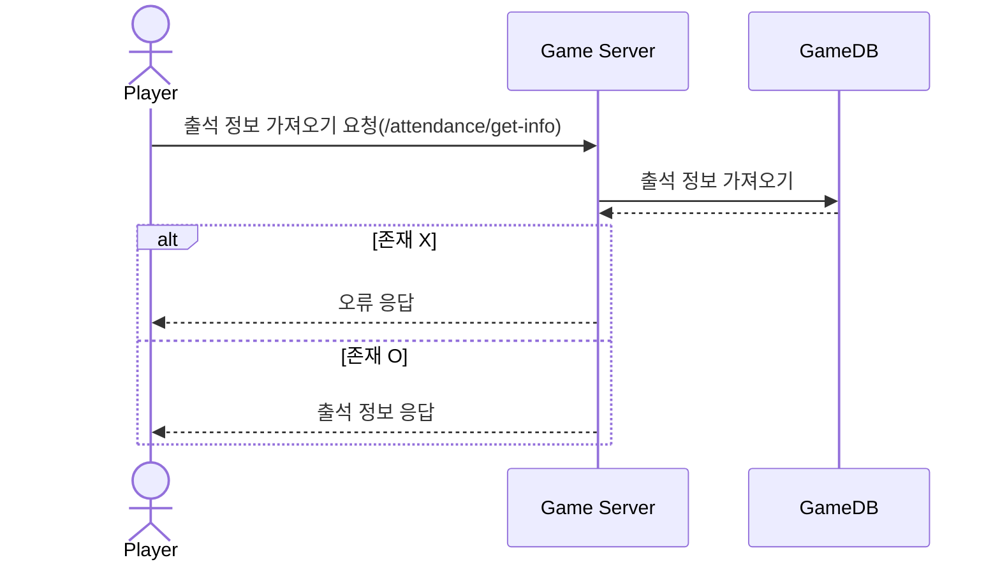
```mermaid
sequenceDiagram
	actor Player
	participant Game Server
  participant GameDB

	Player ->> Game Server : 출석 정보 가져오기 요청(/attendance/get-info) 
	Game Server ->> GameDB : 출석 정보 가져오기
	GameDB -->> Game Server : 
	alt 존재 X
		Game Server -->> Player : 오류 응답
	else 존재 O
		Game Server -->> Player : 출석 정보 응답
	end

```


------------------------------

## 출석 체크 요청
### : 플레이어가 출석 체크를 요청
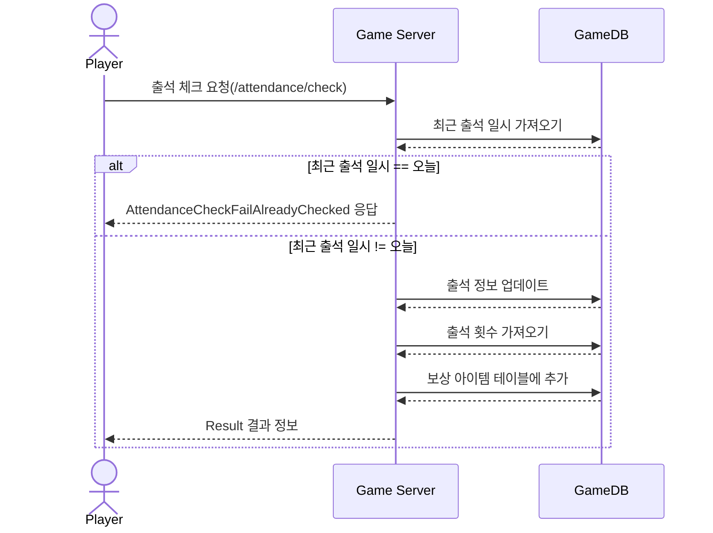
```mermaid
sequenceDiagram
	actor Player
	participant Game Server
  participant GameDB

	Player ->> Game Server : 출석 체크 요청(/attendance/check)
  Game Server ->> GameDB : 최근 출석 일시 가져오기
	GameDB -->> Game Server : 
  alt 최근 출석 일시 == 오늘
    Game Server -->> Player : AttendanceCheckFailAlreadyChecked 응답
  else 최근 출석 일시 != 오늘
	  Game Server ->> GameDB : 출석 정보 업데이트
	  GameDB -->> Game Server : 
	  Game Server ->> GameDB : 출석 횟수 가져오기
	  GameDB -->> Game Server : 
	  Game Server ->> GameDB : 보상 아이템 테이블에 추가
	  GameDB -->> Game Server :  
    Game Server -->> Player : Result 결과 정보
  end

```


------------------------------


================================================
File: SequenceDiagram/Friend.md
================================================
# 시퀀스 다이어그램 (Friend)

* 친구 목록 가져오기 (Get Friend List)
* 친구 신청 목록 가져오기 (Get Friend Request List)
* 친구 신청 (Friend Request)
* 친구 신청 수락하기 (Friend Request Accept)

------------------------------

## 친구 목록 가져오기
### 플레이어의 친구 목록 가져오는 요청 (Get Friend List)
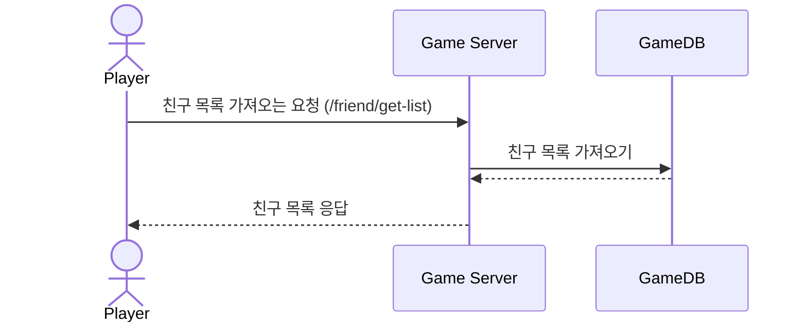
```mermaid
sequenceDiagram
	actor Player
	participant Game Server
  participant GameDB

	Player ->> Game Server : 친구 목록 가져오는 요청 (/friend/get-list)
	Game Server ->> GameDB : 친구 목록 가져오기
	GameDB -->> Game Server : 
	Game Server -->> Player : 친구 목록 응답

```


------------------------------

## 친구 신청 목록 가져오기
### 플레이어의 친구 신청 목록 가져오는 요청(받은 신청) (Get Friend Request List)
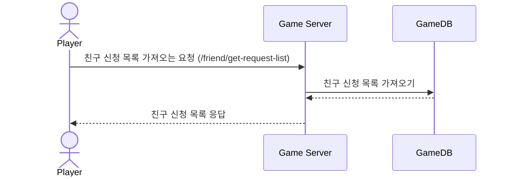
```mermaid
sequenceDiagram
	actor Player
	participant Game Server
  participant GameDB

	Player ->> Game Server : 친구 신청 목록 가져오는 요청 (/friend/get-request-list)
	Game Server ->> GameDB : 친구 신청 목록 가져오기
	GameDB -->> Game Server : 
	Game Server -->> Player : 친구 신청 목록 응답

```


------------------------------


## 친구 신청
### 플레이어가 친구 신청을 보내는 요청
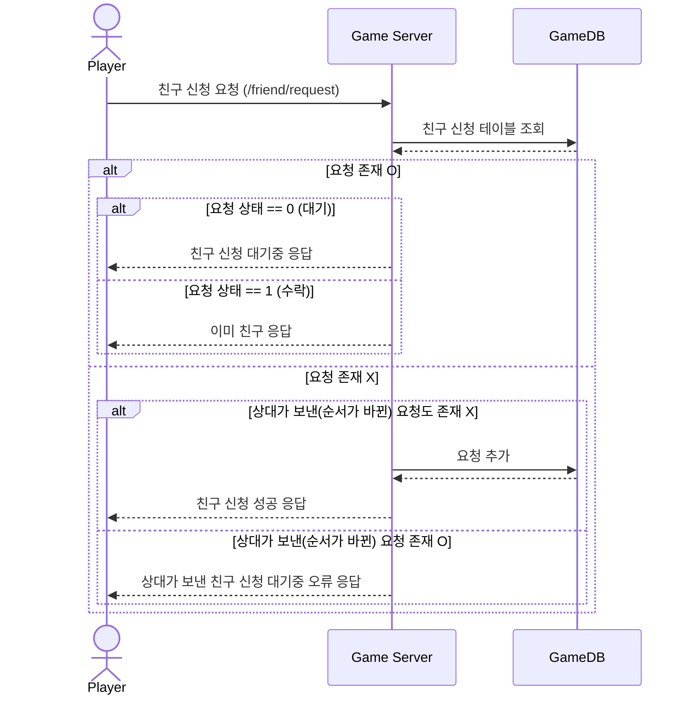
```mermaid
sequenceDiagram
	actor Player
	participant Game Server
  participant GameDB

	Player ->> Game Server : 친구 신청 요청 (/friend/request)
	Game Server ->> GameDB : 친구 신청 테이블 조회
	GameDB -->> Game Server : 

	alt 요청 존재 O
		alt 요청 상태 == 0 (대기)
			Game Server -->> Player : 친구 신청 대기중 응답
	
		else 요청 상태 == 1 (수락)
			Game Server -->> Player : 이미 친구 응답
		end
	
	else 요청 존재 X
		alt 상대가 보낸(순서가 바뀐) 요청도 존재 X
			Game Server ->> GameDB : 요청 추가
			GameDB -->> Game Server :  
			Game Server -->> Player : 친구 신청 성공 응답
		else 상대가 보낸(순서가 바뀐) 요청 존재 O
			Game Server -->> Player : 상대가 보낸 친구 신청 대기중 오류 응답
		end
	
	end

```


------------------------------


## 친구 신청 수락하기
### 플레이어가 받은 친구 신청을 수락하는 요청
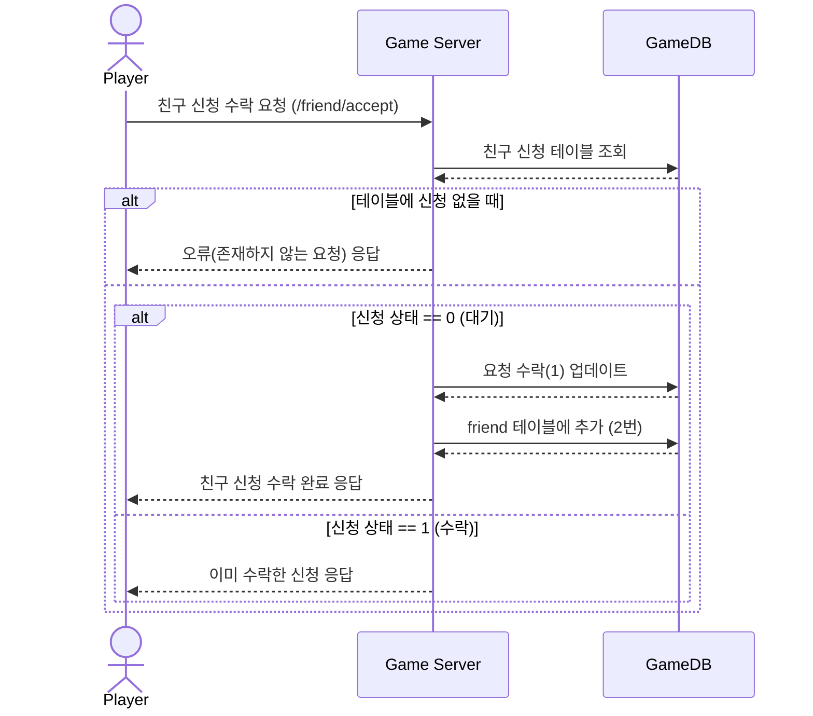
```mermaid
sequenceDiagram
	actor Player
	participant Game Server
  participant GameDB

	Player ->> Game Server : 친구 신청 수락 요청 (/friend/accept)
	Game Server ->> GameDB : 친구 신청 테이블 조회
	GameDB -->> Game Server : 
	
	alt 테이블에 신청 없을 때
		Game Server -->> Player : 오류(존재하지 않는 요청) 응답
	else
		alt 신청 상태 == 0 (대기)
			Game Server ->> GameDB : 요청 수락(1) 업데이트
			GameDB -->> Game Server :  

			Game Server ->> GameDB : friend 테이블에 추가 (2번)
			GameDB -->> Game Server :  
			
			Game Server -->> Player : 친구 신청 수락 완료 응답

		else 신청 상태 == 1 (수락)
			Game Server -->> Player : 이미 수락한 신청 응답
		end
	end

```


================================================
File: SequenceDiagram/GamePlay.md
================================================
# 시퀀스 다이어그램 (GamePlay)

------------------------------
## 게임 데이터 가져오는 요청 
### : 게임 데이터 가져오는 요청 (모든 플레이어) /gamePlay/omok-game-data
게임 데이터 = 오목 보드 정보 + 참가 플레이어 + 현재 턴 + 승자 등등


#### 요청하는 플레이어의 상태
* 기본적으로 LoadGameStateAsync() 라는 함수에서 게임 오목판을 비롯한 게임 데이터를 로드하고 있다.
  + 게임 첫 시작 시 : OnInitializedAsync()
  + 자기 차례 아닐 때 : 턴 상태 요청하면서 StartTurnPollingAsync()
    + 이때 자기 차례가 되었을 때 로드

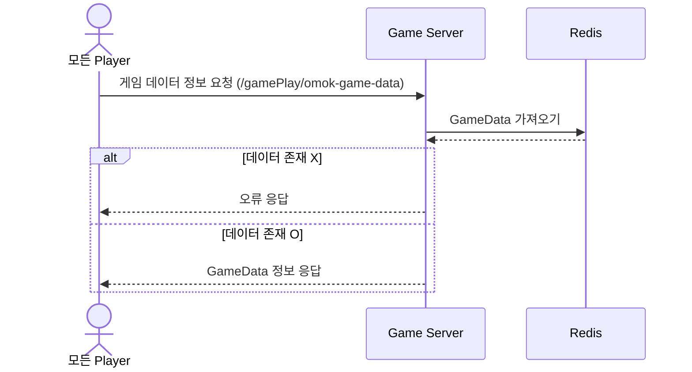
```mermaid
sequenceDiagram
	actor P as 모든 Player
	participant G as Game Server
  	participant R as Redis

	P ->> G: 게임 데이터 정보 요청 (/gamePlay/omok-game-data)
	G ->> R : GameData 가져오기
	R-->>G: 
	alt 데이터 존재 X
		G-->>P: 오류 응답
	else 데이터 존재 O
		G -->> P : GameData 정보 응답
	end
```

------------------------------


## 돌두기
### : 돌두기 (자기 차례 플레이어) 
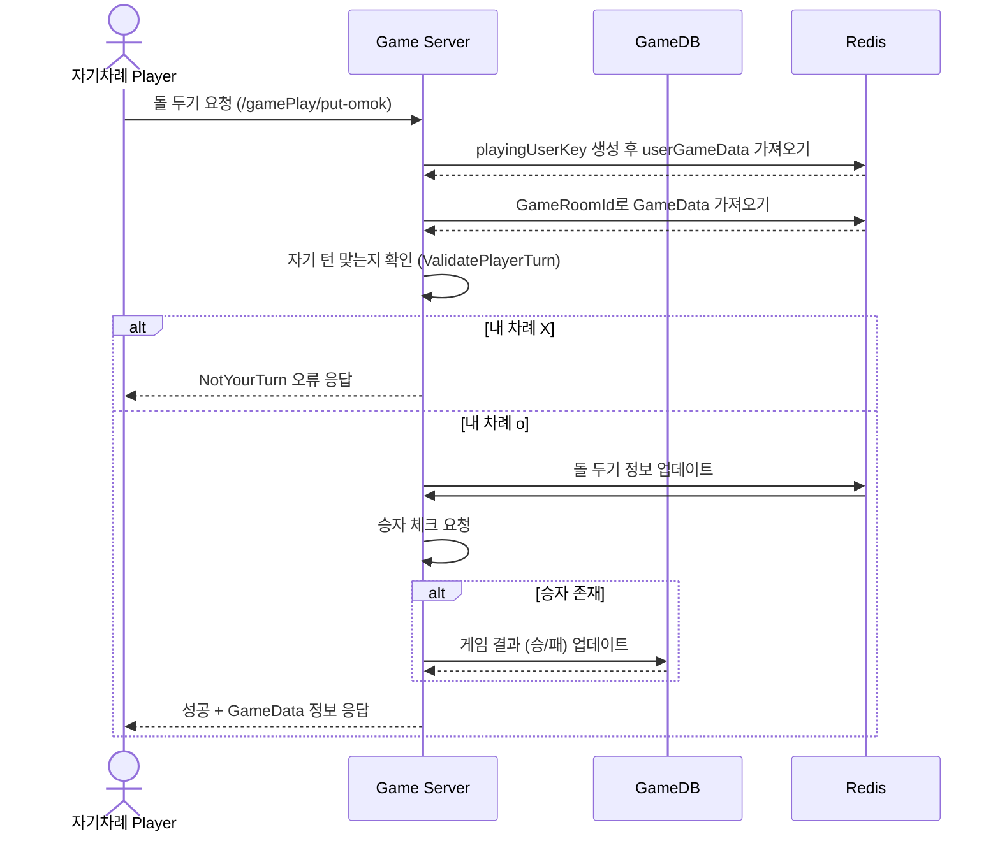
```mermaid
sequenceDiagram
	actor P as 자기차례 Player
	participant G as Game Server
	participant GD as GameDB
  	participant R as Redis

	P ->> G: 돌 두기 요청 (/gamePlay/put-omok)
	G ->> R : playingUserKey 생성 후 userGameData 가져오기
	R -->> G :  
  	G ->> R : GameRoomId로 GameData 가져오기
  	R -->> G: 

	G ->> G : 자기 턴 맞는지 확인 (ValidatePlayerTurn)
	alt 내 차례 X
		G-->>P: NotYourTurn 오류 응답
	else 내 차례 o
		G ->> R : 돌 두기 정보 업데이트
		R ->> G :  
	
		G ->> G : 승자 체크 요청
		alt 승자 존재
		  G ->> GD : 게임 결과 (승/패) 업데이트
		  GD -->> G :   
		end
	
	  	G -->> P : 성공 + GameData 정보 응답
	end
```

------------------------------

## 돌두기 포기 요청 (자기 차례 플레이어)
### : 돌두기 포기 요청 (자기 차례 플레이어) 
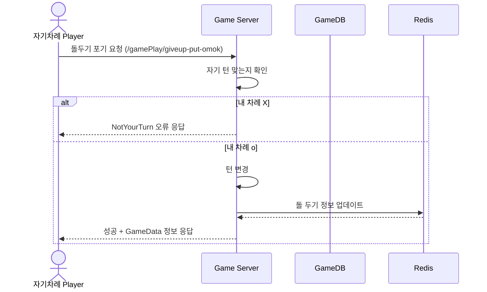
```mermaid
sequenceDiagram
	actor P as 자기차례 Player
	participant G as Game Server
	participant GD as GameDB
  	participant R as Redis

	P ->> G : 돌두기 포기 요청 (/gamePlay/giveup-put-omok)
	G ->> G : 자기 턴 맞는지 확인
	alt 내 차례 X
		G-->>P: NotYourTurn 오류 응답
	else 내 차례 o
		G ->> G : 턴 변경
		G ->> R : 돌 두기 정보 업데이트
		R -->> G :  
	  	G -->> P : 성공 + GameData 정보 응답
	end

```


------------------------------

## 현재 턴 상태 요청 (차례 대기 플레이어) 1초마다 요청
### : 현재 턴 상태 요청 (차례 대기 플레이어) 1초마다 요청 /gamePlay/turn-checking

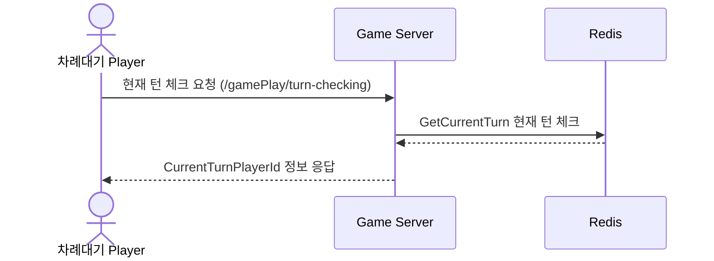
```mermaid
sequenceDiagram
	actor P as 차례대기 Player
	participant G as Game Server
  	participant R as Redis

	P ->> G : 현재 턴 체크 요청 (/gamePlay/turn-checking)
	G ->> R : GetCurrentTurn 현재 턴 체크
  	R -->> G : 
  	G -->> P : CurrentTurnPlayerId 정보 응답

```


------------------------------


================================================
File: SequenceDiagram/Item.md
================================================
# 시퀀스 다이어그램 (Item)

------------------------------

## 플레이어의 아이템(인벤토리) 목록 가져오는 요청
### : 플레이어의 아이템 데이터 가져오는 요청 /GetPlayerItems
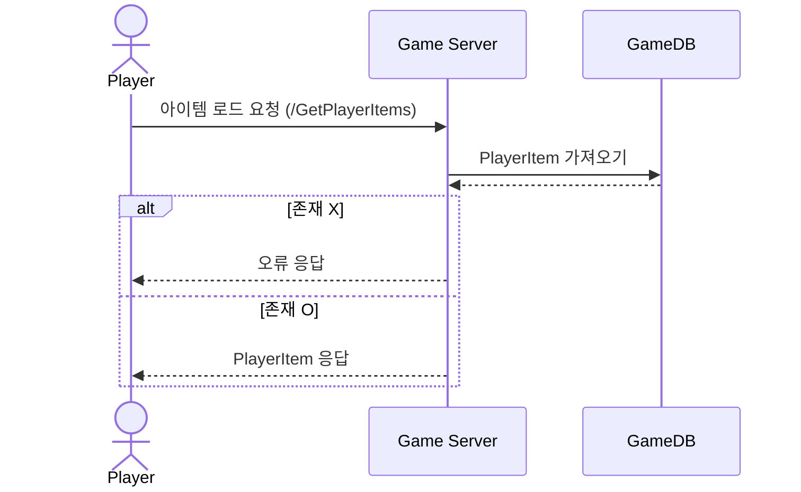
```mermaid
sequenceDiagram
	actor Player
	participant Game Server
  participant GameDB

	Player ->> Game Server : 아이템 로드 요청 (/GetPlayerItems)
	Game Server ->> GameDB : PlayerItem 가져오기
	GameDB -->> Game Server : 
	alt 존재 X
		Game Server -->> Player : 오류 응답
	else 존재 O
		Game Server -->> Player : PlayerItem 응답
	end
```


------------------------------


================================================
File: SequenceDiagram/MailBox.md
================================================
# 시퀀스 다이어그램 (MailBox)


## 플레이어의 우편함 목록을 가져오는 요청
### : 플레이어의 우편함 리스트를 가져오는 요청 /mail/get-mailbox
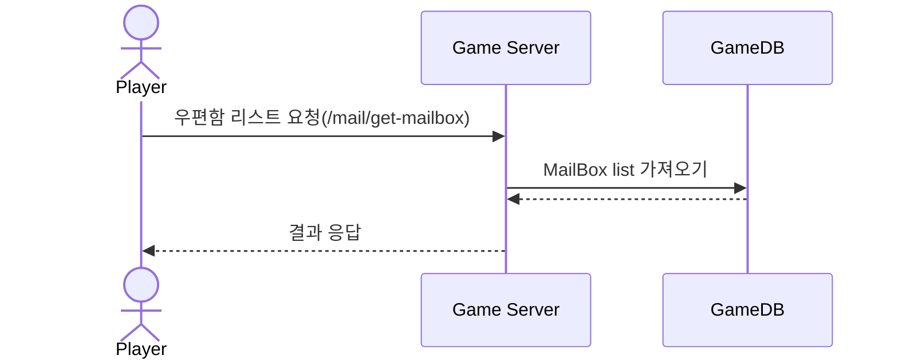
```mermaid
sequenceDiagram
	actor Player
	participant Game Server
  participant GameDB

	Player ->> Game Server : 우편함 리스트 요청(/mail/get-mailbox)
	Game Server ->> GameDB : MailBox list 가져오기
	GameDB -->> Game Server : 
	Game Server -->> Player : 결과 응답
```


------------------------------

## 플레이어가 우편함에서 우편을 열어보는 요청 (우편 내용 보기)
### : 플레이어가 자신의 우편함에서 우편을 읽는 요청 /mail/read
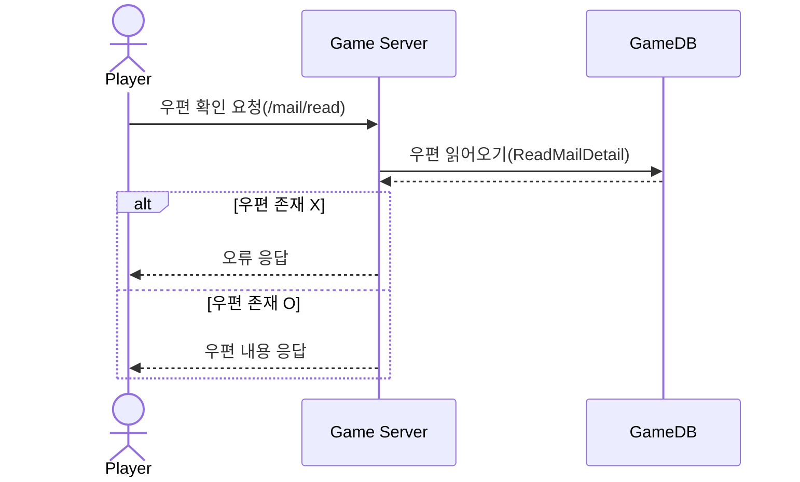
```mermaid
sequenceDiagram
	actor Player
	participant Game Server
  	participant GameDB

	Player ->> Game Server : 우편 확인 요청(/mail/read)
	Game Server ->> GameDB : 우편 읽어오기(ReadMailDetail)
	GameDB -->> Game Server : 
	alt 우편 존재 X
		Game Server -->> Player : 오류 응답
	else 우편 존재 O
		Game Server -->> Player : 우편 내용 응답
	end
```


------------------------------

## 플레이어가 우편 속 아이템을 수령하는 요청
### : 플레이어가 우편 속 아이템을 수령하는 요청 /mail/receive-item
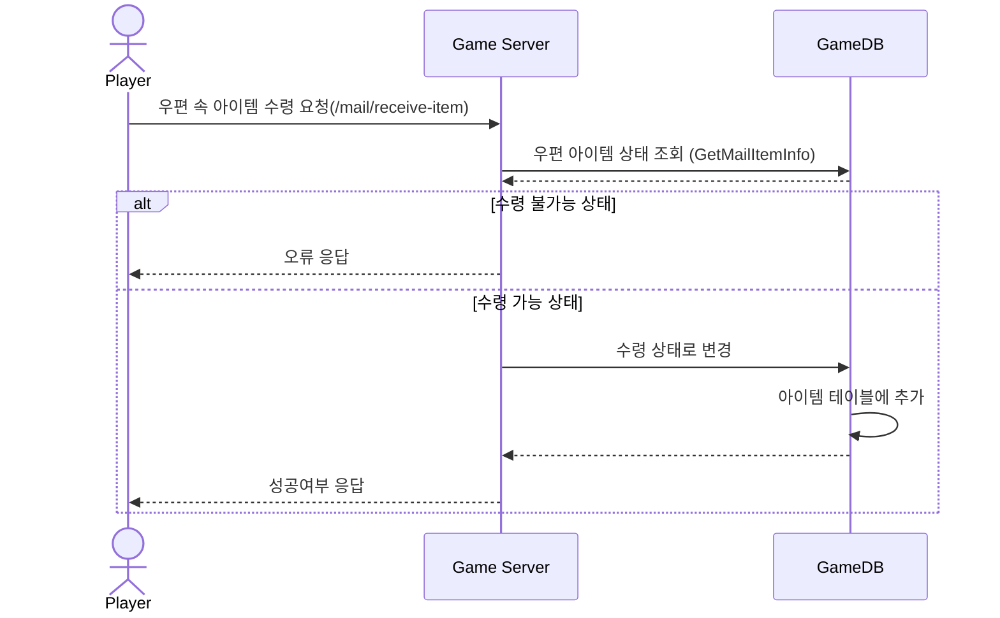
```mermaid
sequenceDiagram
	actor Player
	participant Game Server
  	participant GameDB

	Player ->> Game Server : 우편 속 아이템 수령 요청(/mail/receive-item)
	Game Server ->> GameDB : 우편 아이템 상태 조회 (GetMailItemInfo)
	GameDB -->> Game Server : 
	alt 수령 불가능 상태
		Game Server -->> Player : 오류 응답
	else 수령 가능 상태
		Game Server ->> GameDB : 수령 상태로 변경
		GameDB ->> GameDB : 아이템 테이블에 추가
		GameDB -->> Game Server : 
		
		Game Server -->> Player : 성공여부 응답
	end
```


------------------------------

## 플레이어가 우편을 삭제하는 요청
### : 플레이어가 우편을 삭제하는 요청 /mail/delete
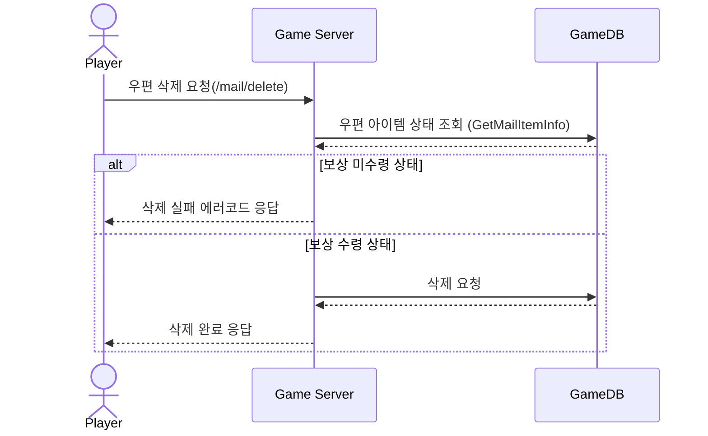
```mermaid
sequenceDiagram
	actor Player
	participant Game Server
  	participant GameDB

	Player ->> Game Server : 우편 삭제 요청(/mail/delete)
	Game Server ->> GameDB : 우편 아이템 상태 조회 (GetMailItemInfo)
	GameDB -->> Game Server :  
	alt 보상 미수령 상태 
		Game Server -->> Player : 삭제 실패 에러코드 응답

	else 보상 수령 상태
		Game Server ->> GameDB : 삭제 요청
		GameDB -->> Game Server:  
		Game Server -->> Player : 삭제 완료 응답
	end
```

--------------------------------


================================================
File: SequenceDiagram/Match.md
================================================
# 시퀀스 다이어그램 (Match)
------------------------------
## 매칭 시작 요청
### : 매칭 시작 요청 /requestMatching

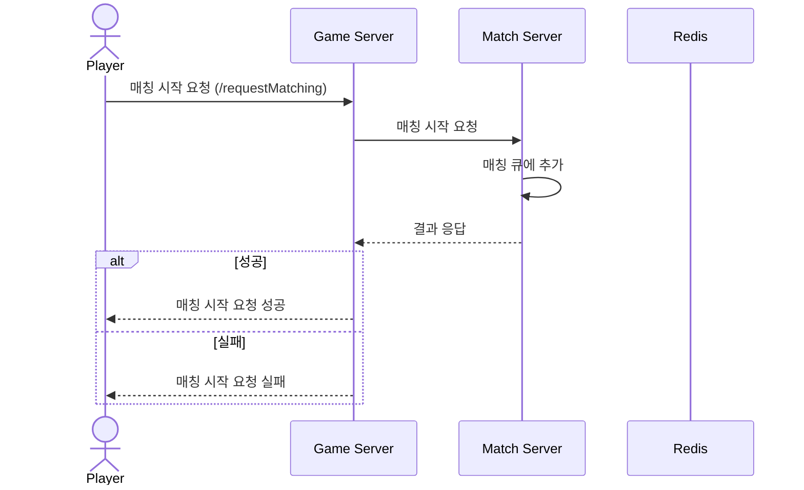
```mermaid
sequenceDiagram
	actor P as Player
	participant G as Game Server
	participant M as Match Server
	participant R as Redis

	P->>G: 매칭 시작 요청 (/requestMatching)
	G->>M: 매칭 시작 요청
	M->>M: 매칭 큐에 추가

	M-->>G: 결과 응답
	alt 성공
		G-->>P: 매칭 시작 요청 성공
	else 실패
		G-->>P: 매칭 시작 요청 실패
	end

```

------------------------------

## 매칭 완료 여부 체크 (매칭 될 때까지 1초마다 요청)
### : 매칭 완료 여부 체크 (매칭 될 때까지 1초마다 요청) /checkMatching
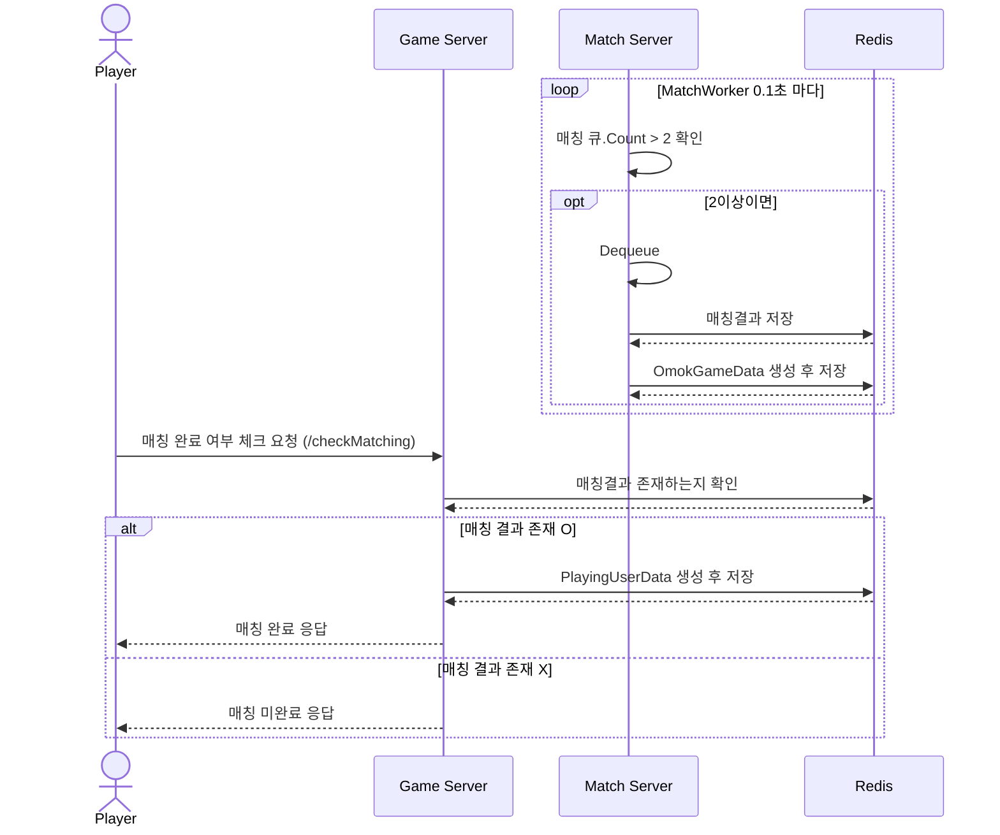
```mermaid
sequenceDiagram
	actor P as Player
	participant G as Game Server
	participant M as Match Server
	participant R as Redis

	loop MatchWorker 0.1초 마다
		M->>M: 매칭 큐.Count > 2 확인
			opt 2이상이면
				M->>M: Dequeue
				M->>R: 매칭결과 저장
				R-->>M: 
				M->>R: OmokGameData 생성 후 저장
				R-->>M: 
			end
	end

	P->>G: 매칭 완료 여부 체크 요청 (/checkMatching)
	G->>R: 매칭결과 존재하는지 확인
	R-->>G: 
	alt 매칭 결과 존재 O
		G->>R: PlayingUserData 생성 후 저장
		R-->>G:  

		G-->>P: 매칭 완료 응답
	
	else 매칭 결과 존재 X
		G-->>P: 매칭 미완료 응답
	end

```

------------------------------


================================================
File: SequenceDiagram/PlayerInfo.md
================================================
# 시퀀스 다이어그램 (PlayerInfo)

------------------------------

## 플레이어 기본 데이터 가져오는 요청
### : 플레이어 기본 데이터 가져오는 요청 (닉네임, 레벨, 경험치, 승, 패, 무)
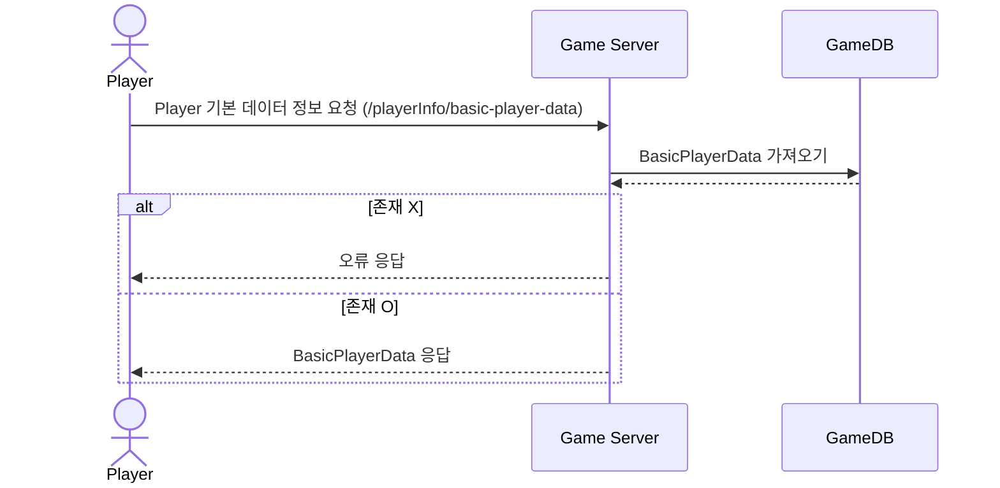
```mermaid
sequenceDiagram
	actor Player
	participant Game Server
  	participant GameDB

	Player ->> Game Server : Player 기본 데이터 정보 요청 (/playerInfo/basic-player-data)
	Game Server ->> GameDB : BasicPlayerData 가져오기
	GameDB -->> Game Server : 
	alt 존재 X
		Game Server -->> Player : 오류 응답
	else 존재 O
		Game Server -->> Player : BasicPlayerData 응답
	end
```


------------------------------


## 닉네임 변경 요청 
### : 닉네임 변경 요청 
```mermaid
sequenceDiagram
	actor Player
	participant Game Server
  	participant GameDB

	Player ->> Game Server : 닉네임 업데이트 요청 (/playerInfo/update-nickname)
	Game Server ->> GameDB : 닉네임 업데이트
	GameDB -->> Game Server :  
	Game Server -->> Player : Result 결과 정보

```


------------------------------


================================================
File: SequenceDiagram/Register-Login.md
================================================
# 시퀀스 다이어그램 (Register-Login)
## 계정 생성 요청
### : 계정 생성 요청 /register

```mermaid
sequenceDiagram
	actor P as Player
	participant H as Hive Server
	participant HD as HiveDB

	P ->> H: 계정 생성 요청 (/register)
	H ->> HD : 유저 정보 생성
	HD -->> H : 
	alt 계정 생성 성공
  		H -->> P: 계정 생성 성공 응답
	else 계정 생성 실패
  		H -->> P: 계정 생성 실패 응답
	end
```

## 로그인 요청
### : 로그인 요청 /login
```mermaid
sequenceDiagram
	actor P as Player
	participant HD as HiveDB
	participant H as Hive Server
	participant G as Game Server
	participant GD as GameDB
	participant R as Redis
	
	P ->> H: 하이브 로그인 요청 (/login)
  	H ->> HD : 회원 정보 요청
  	HD -->> H : 

	alt 하이브 로그인 성공
		H ->> HD : ID와 토큰 저장
		HD -->> H : 
		H -->> P : 하이브 로그인 성공 응답(고유번호와 토큰) 
	else 하이브 로그인 실패
		H -->> P : 하이브 로그인 실패 응답
	end

	P ->> G : ID와 토큰을 통해 게임 로그인 요청 (/login)
	G ->> H : 토큰 유효성 확인 요청 (/VerifyToken)
	H ->> HD : ID와 토큰 정보 확인
	HD -->> H :  
	H -->> G : 토큰 유효 여부 응답

	alt 토큰 유효 O
		opt 첫 로그인이면
			G ->> GD : "플레이어 기본 게임 데이터" 생성
			GD -->> G : 
			G ->> GD : "초기 아이템 데이터" 생성
			GD -->> G : 
			G ->> GD : "초기 출석 데이터" 생성
			GD -->> G :  
		end

		G ->> R : LoginUerKey로 PlayerUid, Token, App/DataVersion 저장
	  	R -->> G :  

		G -->> P : 로그인 성공 응답
	else 토큰 유효 X
		G -->> P : 로그인 실패 응답
	end


```


================================================
File: ServerShared/ErrorCode.cs
================================================
using System;

namespace ServerShared;

// SYJ: 모든 ErrorCode 중복 사용 X = 유니크해야 함!

// 1000 ~ 19999
public enum ErrorCode : UInt16
{
    None = 0,

    // Common 1000 ~
    UnhandleException = 1001,
    RedisFailException = 1002,
    InValidRequestHttpBody = 1003,
    TokenDoesNotExist = 1004,
    UidDoesNotExist = 1005,
    AuthTokenFailWrongAuthToken = 1006,
    Hive_Fail_InvalidResponse = 1010,
    InValidAppVersion = 1011,
    InvalidMasterDataVersion = 1012,
    InvalidResponseFormat = 1013,
    ServerError = 1014,
    JsonParsingError = 1015,
    InternalError = 1020, // HttpRequestException 및 JsonException 이외의 모든 예기치 않은 오류
    InternalServerError = 1021, 
    InvalidRequest = 1030,
    MissingHeader = 1040,

    // Auth 2000 ~
    CreateUserFailException = 2001,
    CreateUserFailNoNickname = 2002,
    CreateUserFailDuplicateNickname = 2003,
    LoginFailException = 2004,
    LoginFailUserNotExist = 2005,
    LoginFailPwNotMatch = 2006,
    LoginFailSetAuthToken = 2007,
    LoginUpdateRecentLoginFail = 2008,
    LoginUpdateRecentLoginFailException = 2009,
    AuthTokenMismatch = 2010,
    AuthTokenKeyNotFound = 2011,
    AuthTokenFailWrongKeyword = 2012,
    AccountIdMismatch = 2014,
    DuplicatedLogin = 2015,
    CreateUserFailInsert = 2016,
    LoginFailAddRedis = 2017,
    CheckAuthFailNotExist = 2018,
    CheckAuthFailNotMatch = 2019,
    CheckAuthFailException = 2020,
    LogoutRedisDelFail = 2021,
    LogoutRedisDelFailException = 2022,
    DeleteAccountFail = 2023,
    DeleteAccountFailException = 2024,
    InitNewUserGameDataFailException = 2025,
    InitNewUserGameDataFailCharacter = 2026,
    InitNewUserGameDataFailGameList = 2027,
    InitNewUserGameDataFailMoney = 2028,
    InitNewUserGameDataFailAttendance = 2029,
    InvalidAppVersion = 2030,
    InvalidDataVersion = 2031,
    AuthTokenFailSetNx = 2032,
    AuthTokenFailDelNx = 2033,
    PlayerIdMismatch = 2034,

    // Match Error 2050
    UpdateStartGameDataFailException = 2050,

    // Friend 2100
    ReqFriendFailPlayerNotExist = 2101,
    FriendRequestAlreadyPending = 2102,
    ReverseFriendRequestPending = 2103,
    AlreadyFriends = 2104,
    FriendRequestNotFound = 2105,

    FriendGetListFailOrderby = 2106,
    FriendGetListFailException = 2107,
    FriendGetRequestListFailException = 2108,
    FriendDeleteFailNotFriend = 2109,
    FriendDeleteFailDelete = 2110,
    FriendDeleteFailException = 2111,
    FriendDeleteFailSameUid = 2112,
    FriendDeleteReqFailNotFriend = 2113,
    FriendDeleteReqFailDelete = 2114,
    FriendDeleteReqFailException = 2115,
    FriendAcceptFailException = 2116,
    FriendAcceptFailSameUid = 2117,
    AcceptFriendRequestFailUserNotExist = 2118,
    AcceptFriendRequestFailAlreadyFriend = 2119,
    AcceptFriendRequestFailException = 2120,
    FriendSendReqFailNeedAccept = 2121,

    // Game 2200
    MiniGameListFailException = 2201,
    GameSetNewUserListFailException = 2202,
    GameSetNewUserListFailInsert = 2203,
    MiniGameUnlockFailInsert = 2204,
    MiniGameUnlockFailException = 2205,
    MiniGameInfoFailException = 2206,
    MiniGameSaveFailException = 2207,
    MiniGameSaveFailGameLocked = 2208,
    MiniGameUnlockFailAlreadyUnlocked = 2209,
    MiniGameSetPlayCharFailUpdate = 2210,
    MiniGameSetPlayCharFailException = 2211,
    MiniGameSaveFailFoodDecrement = 2212,

    SetUserScoreFailException = 2301,
    GetRankingFailException = 2302,
    GetUserRankFailException = 2303,

    GameDataNotFound = 2400,
    GameRoomNotFound = 2402,
    GameBoardNotFound = 2403,
    GameBlackNotFound = 2404,
    GameWhiteNotFound = 2405,
    GameTurnNotFound = 2406,
    GameTurnPlayerNotFound = 2407,
    PlayerGameDataNotFound = 2401,

    GameEnd = 2500,
    GameAlreadyEnd = 2501,
    UpdateGameDataFailException = 2502,
    UpdateGameResultFail = 2503,
    NotYourTurn = 2513,
    RequestTurnEnd = 2515,
    ChangeTurnFailNotYourTurn = 2516,
    TurnChangedByTimeout = 2520,

    SetStoneFailException = 2531,
    InvalidOperationException = 2532,


    // Item 3000 ~
    CharReceiveFailInsert = 3011,
    CharReceiveFailLevelUP = 3012,
    CharReceiveFailIncrementCharCnt = 3013,
    CharReceiveFailException = 3014,
    CharListFailException = 3015,
    CharNotExist = 3016,
    CharSetCostumeFailUpdate = 3017,
    CharSetCostumeFailException = 3018,

    SkinReceiveFailAlreadyOwn = 3021,
    SkinReceiveFailInsert = 3022,
    SkinReceiveFailException = 3023,
    SkinListFailException = 3024,

    CostumeReceiveFailInsert = 3031,
    CostumeReceiveFailLevelUP = 3032,
    CostumeReceiveFailIncrementCharCnt = 3033,
    CostumeReceiveFailException = 3034,
    CostumeListFailException = 3035,
    CharSetCostumeFailHeadNotExist = 3036,
    CharSetCostumeFailFaceNotExist = 3037,
    CharSetCostumeFailHandNotExist = 3038,

    FoodReceiveFailInsert = 3041,
    FoodReceiveFailIncrementFoodQty = 3042,
    FoodReceiveFailException = 3043,
    FoodListFailException = 3044,
    FoodGearReceiveFailInsert = 3045,
    FoodGearReceiveFailIncrementFoodGear = 3046,
    FoodGearReceiveFailException = 3047,

    GachaReceiveFailException = 3051,


    // GameDb 4000 ~ 
    GetGameDbConnectionFail = 4002,
    AddFirstItemsForPlayerFail = 4003,
    CreatePlayerInfoDataAndStartItemsFail = 4004,
    GameDatabaseError = 4010,

    // PlayerInfo 4500 ~
    PlayerNotFound = 4501,
    UpdatePlayerNickNameFailed = 4502,
    
    PlayerUidNotFound = 4551,


    // Redis 4700 ~
    RedisException = 4701,
    InValidPlayerUidError = 4710, 

    // MasterDb 5000 ~
    MasterDB_Fail_LoadData = 5001,
    MasterDB_Fail_InvalidData = 5002,
    FailToLoadAppVersionInMasterDb = 5003,

    // User
    UserInfoFailException = 6001,
    UserMoneyInfoFailException = 6002,
    UserUpdateJewelryFailIncremnet = 6003,
    SetMainCharFailException = 6004,
    GetOtherUserInfoFailException = 6005,
    UserNotExist = 6006,

    // Mail
    MailListFailException = 8001,
    MailReceiveFailException = 8002,
    MailReceiveFailAlreadyReceived = 8003,
    MailReceiveFailMailNotExist = 8004,
    MailReceiveFailUpdateReceiveDt = 8005,
    MailRewardListFailException = 8006,
    MailDeleteFailDeleteMail = 8007,
    MailDeleteFailDeleteMailReward = 8008,
    MailDeleteFailException = 8009,
    MailReceiveFailNotMailOwner = 8010,
    MailReceiveRewardsFailException = 8011,
    MailNotFound = 8020,
    FailToDeleteMailItemNotReceived = 8021,
    FailToReadMailDetail = 8022,

    // Attendance
    AttendanceInfoNotFound = 9000,
    AttendanceInfoFailException = 9001,
    AttendanceCheckFailAlreadyChecked = 9002,
    AttendanceCheckFailException = 9003,

    GetRewardFailException = 9004,
}


================================================
File: ServerShared/KeyGenerator.cs
================================================
using System;
using System.Collections.Generic;
using System.Text;

namespace ServerShared;

public class KeyGenerator
{
    public static string MatchResult(string playerId)
    {
        return $"M_{playerId}_Result";
    }

    public static string InGamePlayerInfo(string playerId)
    {
        return $"GP_{playerId}_Info";
    }
    public static string PlayerLogin(string playerId)
    {
        return $"U_{playerId}_Login";
    }

    public static string GameRoomId()
    {
        return Guid.NewGuid().ToString(); // SYJ Ulid 확인 후, 바꾸기
    }
    public static string UserLockKey(string playerId)
    {
        return $"user_lock:{playerId}";
    }
}


================================================
File: ServerShared/Omok.cs
================================================
using System.Text;

namespace ServerShared;

public enum OmokStone
{
    None,
    Black,
    White
}

public class OmokGameEngine
{
    public const int BoardSize = 15;
    public const int BoardSizeSquare = BoardSize * BoardSize;

    const byte BlackStone = 1;
    const byte WhiteStone = 2;

    // 오목판 정보 BoardSize * BoardSize
    byte[] _rawData;

    string _blackPlayer;
    string _whitePlayer;


    OmokStone _turnPlayerStone;
    UInt64 _turnTimeMilli;
    OmokStone _winner;


    public byte[] GetRawData()
    {
        return _rawData;
    }

    public byte[] MakeRawData(string blackPlayer, string whitePlayer)
    {
        _blackPlayer = blackPlayer;
        _whitePlayer = whitePlayer;

        // 플레이어 이름의 길이를 동적으로 계산
        var blackPlayerBytes = Encoding.UTF8.GetBytes(blackPlayer);
        var whitePlayerBytes = Encoding.UTF8.GetBytes(whitePlayer);

        // 데이터 크기 계산
        int rawDataSize = BoardSizeSquare + // 오목판 정보
                          1 + blackPlayerBytes.Length + // 흑돌 플레이어 이름 (길이 1 바이트 + 실제 이름 데이터)
                          1 + whitePlayerBytes.Length + // 백돌 플레이어 이름 (길이 1 바이트 + 실제 이름 데이터)
                          1 + // 현재 턴 정보
                          8 + // 턴 시작 시각 (돌 둔 시간)
                          1;  // 이긴 사람 정보

        var rawData = new byte[rawDataSize];
        var index = 0;

        // 1. 오목판 정보 초기화 (모두 0)
        for (int i = 0; i < BoardSizeSquare; i++)
        {
            rawData[index++] = (byte)OmokStone.None;
        }

        // 2. 흑돌 플레이어 이름 저장
        rawData[index++] = (byte)blackPlayerBytes.Length;
        Array.Copy(blackPlayerBytes, 0, rawData, index, blackPlayerBytes.Length);
        index += blackPlayerBytes.Length;

        // 3. 백돌 플레이어 이름 저장
        rawData[index++] = (byte)whitePlayerBytes.Length;
        Array.Copy(whitePlayerBytes, 0, rawData, index, whitePlayerBytes.Length);
        index += whitePlayerBytes.Length;

        // 4. 현재 턴 정보 저장 (초기값 0)
        rawData[index++] = (byte)OmokStone.None;

        // 5. 턴 시간 저장 (초기값 현재 시간)
        var turnTime = BitConverter.GetBytes((UInt64)DateTimeOffset.UtcNow.ToUnixTimeSeconds());
        Array.Copy(turnTime, 0, rawData, index, turnTime.Length);
        index += turnTime.Length;

        // 6. 이긴 사람 정보 저장 (초기값 0)
        rawData[index++] = (byte)OmokStone.None;

        _rawData = rawData;
        StartGame();

        return _rawData;
    }

    public OmokStone GetStoneAt(int x, int y)
    {
        int index = y * BoardSize + x;
        return (OmokStone)_rawData[index];
    }

    public OmokStone GetCurrentTurn()
    {
        int index = BoardSizeSquare + 1 + GetBlackPlayerId().Length + 1 + GetWhitePlayerId().Length;
        return (OmokStone)_rawData[index];
    }

    public string GetBlackPlayerId()
    {
        int index = BoardSizeSquare;
        int length = _rawData[index];
        index += 1;
        return Encoding.UTF8.GetString(_rawData, index, length);
    }

    public string GetWhitePlayerId()
    {
        int index = BoardSizeSquare;
        int blackPlayerIdLength = _rawData[index];
        index += 1 + blackPlayerIdLength;
        int whitePlayerIdLength = _rawData[index];
        index += 1;
        return Encoding.UTF8.GetString(_rawData, index, whitePlayerIdLength);
    }

    public string GetCurrentTurnPlayerId()
    {
        return GetCurrentTurn() == OmokStone.Black ? GetBlackPlayerId() : GetWhitePlayerId();
    }

    public UInt64 GetTurnTime()
    {
        int index = BoardSizeSquare + 1 + GetBlackPlayerId().Length + 1 + GetWhitePlayerId().Length + 1;
        return BitConverter.ToUInt64(_rawData, index);
    }

    public OmokStone GetWinnerStone()
    {
        int index = BoardSizeSquare + 1 + GetBlackPlayerId().Length + 1 + GetWhitePlayerId().Length + 1 + 8;
        return (OmokStone)_rawData[index];
    }

    public string GetWinnerPlayerId()
    {
        var winner = GetWinnerStone();
        if (winner == OmokStone.None)
            return null;
        return winner == OmokStone.Black ? GetBlackPlayerId() : GetWhitePlayerId();
    }

    public (string winnerPlayerId, string loserPlayerId) GetWinnerAndLoser()
    {
        var winnerStone = GetWinnerStone();
        if (winnerStone == OmokStone.None)
        {
            return (null, null);
        }

        string winnerPlayerId;
        string loserPlayerId;

        if (winnerStone == OmokStone.Black)
        {
            winnerPlayerId = GetBlackPlayerId();
            loserPlayerId = GetWhitePlayerId();
        }
        else
        {
            winnerPlayerId = GetWhitePlayerId();
            loserPlayerId = GetBlackPlayerId();
        }

        return (winnerPlayerId, loserPlayerId);
    }

    public void Decoding(byte[] rawData)
    {
        _rawData = rawData;

        DecodingUserName();
        DecodingTurnAndTime();
        DecodingWinner();
    }
    public void StartGame()
    {
        if (_blackPlayer == null || _whitePlayer == null)
        {
            throw new InvalidOperationException("Players are not set.");
        }

        _turnPlayerStone = OmokStone.Black;
        _turnTimeMilli = (UInt64)DateTimeOffset.UtcNow.ToUnixTimeSeconds();
        int turnIndex = BoardSizeSquare + 1 + _blackPlayer.Length + 1 + _whitePlayer.Length;
        _rawData[turnIndex] = (byte)OmokStone.Black;

        var turnTimeBytes = BitConverter.GetBytes(_turnTimeMilli);
        Array.Copy(turnTimeBytes, 0, _rawData, turnIndex + 1, turnTimeBytes.Length);
    }

    public void SetStone(string playerId, int x, int y)
    {
        // 현재 턴인 플레이어 이름 확인
        string currentTurnPlayerId = GetCurrentTurnPlayerId();
        if (currentTurnPlayerId != playerId)
        {
            throw new InvalidOperationException("Not the player's turn.");
        }

        // 돌이 이미 놓여진 위치인지 확인
        int index = y * BoardSize + x;
        if (_rawData[index] != (byte)OmokStone.None)
        {
            throw new InvalidOperationException("The position is already occupied.");
        }

        // 돌 두기
        bool isBlack = playerId == GetBlackPlayerId();
        _rawData[index] = (byte)(isBlack ? OmokStone.Black : OmokStone.White);

        // 턴 변경
        _turnPlayerStone = isBlack ? OmokStone.White : OmokStone.Black;
        int turnIndex = BoardSizeSquare + 1 + _blackPlayer.Length + 1 + _whitePlayer.Length;
        _rawData[turnIndex] = (byte)_turnPlayerStone;

        // 턴 둔 시간 변경
        _turnTimeMilli = (UInt64)DateTimeOffset.UtcNow.ToUnixTimeSeconds();
        var turnTimeBytes = BitConverter.GetBytes(_turnTimeMilli);
        Array.Copy(turnTimeBytes, 0, _rawData, turnIndex + 1, turnTimeBytes.Length);

        // 오목 승리 조건 체크하는 함수
        OmokCheck();
    }

    public void OmokCheck() // 결과 체크
    {
        for (int y = 0; y < BoardSize; y++)
        {
            for (int x = 0; x < BoardSize; x++)
            {
                var stone = GetStoneAt(x, y);
                if (stone == OmokStone.None)
                    continue;

                if (CheckDirection(x, y, 1, 0, stone) || // 가로 방향 체크
                    CheckDirection(x, y, 0, 1, stone) || // 세로 방향 체크
                    CheckDirection(x, y, 1, 1, stone) || // 대각선 방향 체크 (↘)
                    CheckDirection(x, y, 1, -1, stone))  // 대각선 방향 체크 (↗)
                {
                    _winner = stone;
                    int winnerIndex = BoardSizeSquare + 1 + _blackPlayer.Length + 1 + _whitePlayer.Length + 1 + 8;
                    _rawData[winnerIndex] = (byte)stone;
                    
                    return;
                }
            }
        }
    }

    private bool CheckDirection(int startX, int startY, int dx, int dy, OmokStone stone)
    {
        int count = 1;
        for (int step = 1; step < 5; step++)
        {
            int x = startX + step * dx;
            int y = startY + step * dy;

            if (x < 0 || x >= BoardSize || y < 0 || y >= BoardSize)
                break;

            if (GetStoneAt(x, y) == stone)
            {
                count++;
            }
            else
            {
                break;
            }
        }

        return count >= 5;
    }

    public (ErrorCode errorCode, byte[] rawData) ChangeTurn(byte[] rawData, string playerId) 
    {
        Decoding(rawData);

        // 현재 턴인 플레이어 이름 확인
        string currentTurnPlayerId = GetCurrentTurnPlayerId();
        
        if (currentTurnPlayerId != playerId)
        {
            return (ErrorCode.ChangeTurnFailNotYourTurn, rawData);
        }

        bool isBlack = playerId == GetBlackPlayerId();

        // 턴 변경
        _turnPlayerStone = isBlack ? OmokStone.White : OmokStone.Black;
        int turnIndex = BoardSizeSquare + 1 + _blackPlayer.Length + 1 + _whitePlayer.Length;
        rawData[turnIndex] = (byte)_turnPlayerStone;

        // 턴 둔 시간 변경
        _turnTimeMilli = (UInt64)DateTimeOffset.UtcNow.ToUnixTimeSeconds();
        var turnTimeBytes = BitConverter.GetBytes(_turnTimeMilli);
        Array.Copy(turnTimeBytes, 0, rawData, turnIndex + 1, turnTimeBytes.Length);

        return (ErrorCode.None, rawData);
    }

    void DecodingUserName()
    {
        var index = BoardSizeSquare;

        int blackPlayerIdLength = _rawData[index];
        index += 1;
        _blackPlayer = Encoding.UTF8.GetString(_rawData, index, blackPlayerIdLength);

        index += blackPlayerIdLength;
        int whitePlayerIdLength = _rawData[index];
        index += 1;
        _whitePlayer = Encoding.UTF8.GetString(_rawData, index, whitePlayerIdLength);
    }

    void DecodingTurnAndTime()
    {
        int turnIndex = BoardSizeSquare + 1 + _blackPlayer.Length + 1 + _whitePlayer.Length;
        _turnPlayerStone = (OmokStone)_rawData[turnIndex];

        var turnTimeBytes = new byte[8];
        Array.Copy(_rawData, turnIndex + 1, turnTimeBytes, 0, 8);
        _turnTimeMilli = BitConverter.ToUInt64(turnTimeBytes, 0);
    }

    void DecodingWinner()
    {
        int winnerIndex = BoardSizeSquare + 1 + _blackPlayer.Length + 1 + _whitePlayer.Length + 1 + 8;
        _winner = (OmokStone)_rawData[winnerIndex];
    }
}


================================================
File: ServerShared/RedisExpiry.cs
================================================
癤퓆amespace ServerShared;

public static class RedisExpireTime
{
    public static readonly TimeSpan PlayerLogin = TimeSpan.FromHours(2);
    public static readonly TimeSpan MatchResult = TimeSpan.FromMinutes(3);
    public static readonly TimeSpan GameData = TimeSpan.FromMinutes(2);
    public static readonly TimeSpan InGamePlayerInfo = TimeSpan.FromHours(2);
    public static readonly TimeSpan LockTime = TimeSpan.FromSeconds(30);
}


================================================
File: ServerShared/ServerShared.csproj
================================================
<Project Sdk="Microsoft.NET.Sdk">

  <PropertyGroup>
    <OutputType>Library</OutputType>
    <TargetFramework>net10.0</TargetFramework>
    <ImplicitUsings>enable</ImplicitUsings>
    <Nullable>enable</Nullable>
  </PropertyGroup>

</Project>


================================================
File: ServerShared/ServerShared.sln
================================================

Microsoft Visual Studio Solution File, Format Version 12.00
# Visual Studio Version 17
VisualStudioVersion = 17.10.35013.160
MinimumVisualStudioVersion = 10.0.40219.1
Project("{FAE04EC0-301F-11D3-BF4B-00C04F79EFBC}") = "ServerShared", "ServerShared.csproj", "{2B182262-60F8-4AE3-B6CB-EF377D758F91}"
EndProject
Global
	GlobalSection(SolutionConfigurationPlatforms) = preSolution
		Debug|Any CPU = Debug|Any CPU
		Release|Any CPU = Release|Any CPU
	EndGlobalSection
	GlobalSection(ProjectConfigurationPlatforms) = postSolution
		{2B182262-60F8-4AE3-B6CB-EF377D758F91}.Debug|Any CPU.ActiveCfg = Debug|Any CPU
		{2B182262-60F8-4AE3-B6CB-EF377D758F91}.Debug|Any CPU.Build.0 = Debug|Any CPU
		{2B182262-60F8-4AE3-B6CB-EF377D758F91}.Release|Any CPU.ActiveCfg = Release|Any CPU
		{2B182262-60F8-4AE3-B6CB-EF377D758F91}.Release|Any CPU.Build.0 = Release|Any CPU
	EndGlobalSection
	GlobalSection(SolutionProperties) = preSolution
		HideSolutionNode = FALSE
	EndGlobalSection
	GlobalSection(ExtensibilityGlobals) = postSolution
		SolutionGuid = {71D4D42F-5423-4FCC-BE22-4C4E8C735305}
	EndGlobalSection
EndGlobal


================================================
File: practice_omok_game-2.md
================================================
Directory structure:
└── practice_omok_game-2/
    ├── README.md
    ├── OmokGame.sln
    ├── Assets/
    ├── Database/
    │   └── dump.sql
    ├── FlowDiagrams/
    │   ├── Match.md
    │   └── Omok.md
    ├── GameAPIServer/
    │   ├── GameAPIServer.csproj
    │   ├── Program.cs
    │   ├── RedisKeyGenerator.cs
    │   ├── Security.cs
    │   ├── apiTest.http
    │   ├── appsettings.Development.json
    │   ├── appsettings.json
    │   ├── Controllers/
    │   │   ├── AttendanceController.cs
    │   │   ├── GameDataController.cs
    │   │   ├── LoginController.cs
    │   │   ├── LogoutController.cs
    │   │   ├── MailController.cs
    │   │   ├── MatchController.cs
    │   │   ├── OmokController.cs
    │   │   ├── SecureController.cs
    │   │   └── UserDataController.cs
    │   ├── Middleware/
    │   │   ├── CheckUserAuth.cs
    │   │   └── VersionCheck.cs
    │   ├── Models/
    │   │   ├── MasterDB.cs
    │   │   ├── RedisDB.cs
    │   │   └── GameDB/
    │   │       ├── Attendance.cs
    │   │       ├── GameResult.cs
    │   │       ├── Mail.cs
    │   │       └── User.cs
    │   ├── Properties/
    │   │   └── launchSettings.json
    │   ├── Repository/
    │   │   ├── AttendanceRepository.cs
    │   │   ├── GameResultRepository.cs
    │   │   ├── ItemRepository.cs
    │   │   ├── MailRepository.cs
    │   │   ├── MasterRepository.cs
    │   │   ├── MemoryRepository.cs
    │   │   ├── UserRepository.cs
    │   │   └── Interfaces/
    │   │       ├── IAttendanceRepository.cs
    │   │       ├── IGameResultRepository.cs
    │   │       ├── IItemRepository.cs
    │   │       ├── IMailRepository.cs
    │   │       ├── IMasterRepository.cs
    │   │       ├── IMemoryRepository.cs
    │   │       └── IUserRepository.cs
    │   └── Services/
    │       ├── AttendanceService.cs
    │       ├── AuthService.cs
    │       ├── DataLoadService.cs
    │       ├── GameDataService.cs
    │       ├── ItemService.cs
    │       ├── MailService.cs
    │       ├── MatchService.cs
    │       ├── OmokService.cs
    │       ├── Service.cs
    │       └── Interfaces/
    │           ├── IAttendanceService.cs
    │           ├── IAuthService.cs
    │           ├── IDataLoadService.cs
    │           ├── IGameDataService.cs
    │           ├── IItemService.cs
    │           ├── IMailService.cs
    │           ├── IMatchService.cs
    │           └── IOmokService.cs
    ├── GameClient/
    │   ├── App.razor
    │   ├── ClientConfig.cs
    │   ├── DAO.cs
    │   ├── GameClient.csproj
    │   ├── Program.cs
    │   ├── _Imports.razor
    │   ├── Components/
    │   │   ├── Header.razor
    │   │   ├── LoadingOverlay.razor
    │   │   ├── LoadingOverlay.razor.css
    │   │   ├── Menu.razor
    │   │   ├── NavMenu.razor
    │   │   ├── ProfileMenu.razor
    │   │   ├── RedirectToLogin.razor
    │   │   ├── RedirectToLogout.razor
    │   │   ├── Game/
    │   │   │   ├── GameMenu.razor
    │   │   │   ├── GameMenu.razor.cs
    │   │   │   ├── OmokBoard.razor
    │   │   │   ├── OmokCell.razor
    │   │   │   ├── OmokPanel.razor
    │   │   │   └── Roulette.razor
    │   │   ├── UI/
    │   │   │   ├── GameItem.razor
    │   │   │   ├── Icon.razor
    │   │   │   ├── Input.razor
    │   │   │   ├── Input.razor.css
    │   │   │   ├── ItemButton.razor
    │   │   │   ├── ItemComponent.razor
    │   │   │   ├── Logo.razor
    │   │   │   ├── LogoWithText.razor
    │   │   │   ├── MailItem.razor
    │   │   │   ├── Popup.razor
    │   │   │   ├── PopupProfile.razor
    │   │   │   └── PopupShort.razor
    │   │   └── User/
    │   │       ├── AttendanceList.razor
    │   │       ├── AttendanceList.razor.cs
    │   │       ├── Inventory.razor
    │   │       ├── Inventory.razor.cs
    │   │       ├── MailList.razor
    │   │       ├── MailList.razor.cs
    │   │       ├── Profile.razor
    │   │       ├── Profile.razor.cs
    │   │       └── Shop.razor
    │   ├── Handlers/
    │   │   ├── CookieHandler.cs
    │   │   └── VersionHandler.cs
    │   ├── Layout/
    │   │   ├── LoginLayout.razor
    │   │   └── MainLayout.razor
    │   ├── Pages/
    │   │   ├── Home.razor
    │   │   ├── Home.razor.cs
    │   │   ├── Login.razor
    │   │   ├── Login.razor.cs
    │   │   ├── Login.razor.css
    │   │   ├── Match.razor
    │   │   ├── Match.razor.cs
    │   │   ├── Omok.razor
    │   │   ├── Omok.razor.cs
    │   │   ├── Register.razor
    │   │   ├── Register.razor.cs
    │   │   └── Register.razor.css
    │   ├── Properties/
    │   │   └── launchSettings.json
    │   ├── Providers/
    │   │   ├── AttendanceProvider.cs
    │   │   ├── CookieStateProvider.cs
    │   │   ├── GameContentProvider.cs
    │   │   ├── GameStateProvider.cs
    │   │   ├── InventoryStateProvider.cs
    │   │   ├── LoadingStateProvider.cs
    │   │   ├── MailStateProvider.cs
    │   │   └── MatchStateProvider.cs
    │   └── wwwroot/
    │       ├── appsettings.json
    │       ├── index.html
    │       ├── css/
    │       │   ├── app.css
    │       │   └── loading.css
    │       ├── images/
    │       │   ├── game/
    │       │   ├── icons/
    │       │   ├── items/
    │       │   └── ui/
    │       └── js/
    │           └── custom-loader.js
    ├── GameShared/
    │   ├── DAO.cs
    │   ├── DTO.cs
    │   ├── ErrorCode.cs
    │   ├── GameExpiry.cs
    │   ├── GameShared.csproj
    │   └── OmokGame.cs
    ├── HiveAPIServer/
    │   ├── HiveAPIServer.csproj
    │   ├── HiveAPIServer.sln
    │   ├── Program.cs
    │   ├── Security.cs
    │   ├── appsettings.Development.json
    │   ├── appsettings.json
    │   ├── Controllers/
    │   │   ├── CreateHiveAccountController.cs
    │   │   ├── LoginHiveController.cs
    │   │   └── VerifyToken.cs
    │   ├── Model/
    │   │   └── DAO/
    │   │       └── HiveDb.cs
    │   ├── Properties/
    │   │   └── launchSettings.json
    │   ├── Repository/
    │   │   ├── HiveDb.cs
    │   │   └── IHiveDb.cs
    │   └── Services/
    │       ├── HiveService.cs
    │       └── IHiveService.cs
    ├── MatchAPIServer/
    │   ├── MatchAPIServer.csproj
    │   ├── MatchAPIServer.sln
    │   ├── MatchWorker.cs
    │   ├── Program.cs
    │   ├── appsettings.Development.json
    │   ├── appsettings.json
    │   ├── Controllers/
    │   │   └── RequestMatchingController.cs
    │   ├── Properties/
    │   │   └── launchSettings.json
    │   ├── Repository/
    │   │   ├── IMemoryRepository.cs
    │   │   └── MemoryRepository.cs
    │   └── Services/
    │       ├── IMatchService.cs
    │       └── MatchService.cs
    ├── Schemas/
    │   ├── GameDb.md
    │   ├── HiveDb.md
    │   └── MasterDb.md
    ├── SequenceDiagrams/
    │   ├── Authentication.md
    │   ├── Mail.md
    │   ├── Match.md
    │   └── Omok.md
    └── ServerShared/
        ├── RedisExpiry.cs
        ├── RedisModels.cs
        ├── ServerShared.csproj
        ├── SharedConfig.cs
        └── SharedKeyGenerator.cs

================================================
File: README.md
================================================
# 

## 📜 Table of Contents

- [About the Project](#about-the-project)
  - [Tech Stack](#tech-stack)
  - [Game Features](#game-features)
- [Implementations](#implementations)
  - [Authentication](#authentication)
  - [Request Match](#request-match)
  - [Complete Match](#complete-match)
  - [Process Game](#process-game)
  - [Complete Game](#complete-game)
  - [User Interface](#user-interface)
  - [GameData](#gamedata)
- [Hive API Documentation](#hive-api-documentation)
  - [Create Hive Account](#create-hive-account)
  - [Login Hive](#login-hive)
  - [Verify Token](#verify-token)
- [Game API Documentation](#game-api-documentation)
- [Getting Started](#getting-started)
  - [Prerequisites](#prerequisites)
  - [Run Locally](#running-locally)
- [Roadmap](#roadmap)
- [Sequence Diagrams](SequenceDiagrams)
  - [Authentication](SequenceDiagrams/Authentication.md)
  - [Match](SequenceDiagrams/Match.md)
- [Schemas](Schemas)

  - [GameDb](Schemas/GameDb.md)
  - [HiveDb](Schemas/HiveDb.md)
  - [MasterDb](Schemas/MasterDb.md)

  <!-- - [Game](SequenceDiagrams/Game.md)
  - [Mail](SequenceDiagrams/Mail.md)
  - [Attendance](SequenceDiagrams/Attendance.md)
  - [Item](SequenceDiagrams/Item.md)
  - [Shop](SequenceDiagrams/Shop.md)
  - [Friend](SequenceDiagrams/Friend.md) -->

<!-- About the Project -->

## About the Project

C# 학습을 위한 게임 프로젝트 입니다.

<!-- TechStack -->

### Tech Stack

<details>
  <summary>Client</summary>
  <ul>
    <li><a href="https://dotnet.microsoft.com/en-us/apps/aspnet/web-apps/blazor/">C# Blazor</a></li>
  </ul>
</details>

<details>
  <summary>Server</summary>
  <ul>
    <li><a href="https://dotnet.microsoft.com/en-us/apps/aspnet">ASP.NET Core 8</a></li>
  </ul>
</details>

<details>
<summary>Database</summary>
  <ul>
    <li><a href="https://www.mysql.com/">MySQL</a></li>
    <li><a href="https://redis.io/">Redis</a></li>
  </ul>
</details>

### Game Features

<details>
  <summary>Implementations</summary>
<!-- Authentication -->

# Implementations

## Authentication

### Concept

인증(Authentication)은 애플리케이션과 상호 작용하려는 사용자 또는 시스템의 신원을 확인하는 핵심 보안 기능입니다. <br/>이를 통해 자원과 서비스를 합법적인 사용자만이 접근할 수 있도록 보장합니다.

### ASP.NET Core Authentication

ASP.NET Core에서 제공하는 Authentication과 Authorization 미들웨어를 통해 다양한 인증 스킴(Authentication Scheme)을 통합하거나 분리하여 관리 할수있습니다. (JWT, 쿠키, OAuth 2.0 등) 본 프로젝트에서는 Cookie-based Authentication(쿠키 기반 인증)을 사용합니다.

쿠키 기반 인증은 서버에서 세션을 유지하며 관리할 수 있기 때문에 세션 상태를 쉽게 변경하거나 무효화할 수 있습니다. 특히 세션을 자주 갱신해야 하거나 세션 만료 후 재로그인이 필요한 경우 유리합니다.

### Server-side Authentication

서버단에서 사용자 확인 프로세스는 크게 인증(Authentication)과 권한 검증(Authorization)이라는 두 가지 단계로 구분할 수 있습니다.

- 인증 (Authentication): 사용자의 신원을 확인하는 과정
- 권한 검증 (Authorization): 사용자의 권한을 확인하는 과정

이 프로세스는 각 미들웨어를 `UseAuthentication()` 및 `UseAuthorization()`을 명시적으로 호출하여 구현됩니다.

```chsarp
  app.UseAuthentication();
  app.UseAuthorization();
```

Authentication 미들웨어에서 사용하는 [IAuthenticationService](https://learn.microsoft.com/en-us/dotnet/api/microsoft.aspnetcore.authentication.iauthenticationservice?view=aspnetcore-8.0)의 핵심 기능은 다음과 같습니다.

- Authenticate: 요청에 대한 인증 데이터를 확인
- Challenge: 인증되지 않은 사용자에게 인증 데이터를 요구
- Forbid: 특정 Authentication Scheme에 대해 접근을 금지
- SignIn: 특정 Authentication Scheme과 ClaimsPrincipal을 연결
- SignOut: 특정 Authentication Scheme에서 연결된 데이터를 제거

각 기능의 세부동작은 사용하는 `Authentication Scheme`에 할당된 `Authentication Handler`(인증 핸들러)에 의해 정해집니다.

`Authentication Scheme` 세팅은 `AddAuthentication()`호출 후 반환되는 [AuthenticationBuilder](https://learn.microsoft.com/en-us/dotnet/api/microsoft.aspnetcore.authentication.authenticationbuilder?view=aspnetcore-8.0)의 확장 메서드를 통해 설정이 가능하며, 아래는 쿠키 기반 `Authentication Scheme` 구성을 위한 `AddCookie()` 확장 메서드 사용 예시입니다.

```csharp
services.AddAuthentication(CookieAuthenticationDefaults.AuthenticationScheme)
    .AddCookie(options =>
    {
        options.SlidingExpiration = true;                       // 쿠키 자동 갱신 여부
        options.ExpireTimeSpan = TimeSpan.FromHours(1);         // 쿠키 만료시간
    })
```

### Authentication Flow

라우팅 미들웨어는 기본적으로 파이프라인의 시작 부분에서 실행되며, 아래의 다이어그램은 UseRouting을 명시적으로 호출하여 구현된 라우팅 미들웨어의 순서를 보여줍니다.


위와 같은 구현을 위하여 UseAuthorization() 및 UseAuthentication()은 엔드포인트 매핑 전에, 라우팅 활성화 후에 호출되어야 합니다.

```csharp
app.UseRouting();
app.UseAuthentication();  // Must come between Routing and Endpoints
app.UseAuthorization();   // Must come after authentication
app.MapDefaultControllerRoute();
```

Authentication 프로세스의 주요 목적은 요청된 엔드포인트에 알맞은 요청자 정보(Claims Principal)를 식별하여 요청자 정보 인증 여부 확인 및 요청자에 대한 권한 검증을 하는것입니다. 아래는 사용자가 브라우저에서 웹앱으로 접근할때 Authentication 미들웨어에서 발생하는 인증 관련 상호작용에 대한 요약입니다.

```mermaid
sequenceDiagram

actor U as User
participant C as Client
participant S as Server


U->>C: 메인화면 URL 요청 <br/> (GET /)
activate C
C->>S: 출력할 정보 요청
activate S
S->>S: 요청자 인증 정보 확인 <br/> (Authentication)
alt 인증 정보 없음
S-->>C: 인증 미완료 응답
Note over S,C: 인증창으로 리디렉션
C-->>U: 로그인 화면 출력
else 인증 정보 있음
S->>S: 요청자 인증 정보 검증 <br/> (Authorization)
break 요청자 권한 없음
S-->>C: 검증 실패 응답
C-->>U: 접근 권한 없음
end

S-->>C: 검증 완료 응답
deactivate S
Note over S,C: 요청자 인증 정보 <br/> 요청한 출력 정보
C-->>U: 메인화면 출력
end
deactivate C

```

본 프로젝트에서는 요청자 인증 정보 검증 단계에서 Authorization 미들웨어를 사용하는 대신, 사용자 지정 미들웨어 [CheckUserAuth](/GameAPIServer/Middlewares/CheckUserAuth.cs)를 통하여 Authentication 에서 제공받은 정보를 검증합니다. 위 과정을 포함한 전체적인 사용자 검증은 다음과 같은 순서로 진행됩니다

```mermaid
flowchart TD
  R[Request]--->A

  subgraph AM[Authentication Middleware]
  A[[Authentication Scheme]]
  AR-->|Authentication Ticket| H[HttpContext]
  AR-->AC{{인증 정보 없음}}
  AR-->AF{{제한된 인증}}
  end

  A-->|Authenticate|AR[Authentication Result]
  H-->Token

  subgraph CM[CheckUserAuth Middleware]
       direction TB
  Token[User Token 검증]-->Lock[User Lock 검증]
  end

CM<-->DB[(Redis)]

Lock[User Lock 검증]--->Sucess[Success Response]
AC-->|Challenge|Redirect[Redirect Response]
AF-->|Forbid|Denied[Denied Response]


```

</br>
</br>
- 요청 엔드포인트에 따라서, 적절한 Authentication Scheme을 구분

- 지정된 Authentication Sceme의 Claims Principal가 존재 하는지 확인

- AuthenticateResult에 정보 식별 성공/실패 여부를 반환.

  - 성공시 해당 Claims Principal가 들어있는 AuthenticationTicket을 함께 반환.

  - 실패시 Challenge(인증 챌린지)를 호출. 어떠한 인증이 필요한지 클라이언트에 다시 반환<br/> (예: 쿠키의 경우 사용자를 로그인 페이지로 리디렉션. JWT Bearer의 경우 www-authenticate:bearer 헤더를 포함한 오류를 반환)

### 인증 정보 만들기

ASP.NET Core에서 사용자 정보를 보유하는 인증 정보를 만들려면, 먼저 Claims Principal을 구성해야 합니다. ClaimsPrincipal 구성을 위해서 필요한 모든 Claim을 생성하고 ClaimsIdentity에 추가한 후, 해당 정보를 Redis 저장소에 저장하여 유효 시간을 관리합니다. 본 프로젝트는 쿠키 기반 인증을 사용하기 때문에, 생성된 사용자 정보는 직렬화되어 암호화된 쿠키에 저정 후 관리하여 인증 상태를 유지합니다.

아래는 인증 쿠키 등록을 위한 Claims 구성 및 생성 예시입니다.

```csharp

    // 사용자 인증 정보를 기반으로 Claim(사용자 속성)을 설정합니다.
    // 'UID'는 사용자 고유 식별자, 'Token'은 사용자 인증 토큰, 역할(Role)은 'User'로 설정합니다.
    var claims = new List<Claim>
    {
        new Claim("UID", userAuth.UID.ToString()),   // 사용자 고유 식별자 (UID)
        new Claim("Token", userAuth.Token),          // 사용자 인증 토큰
        new Claim(ClaimTypes.Role, "User")           // 사용자의 역할 (일반 사용자로 설정)
    };

    // Claim을 사용하여 Identity와 Principal을 생성합니다.
    // ClaimsIdentity는 인증된 사용자의 신원을 나타내고,
    // ClaimsPrincipal은 이 Identity를 포함한 사용자를 나타냅니다.
    var claimsIdentity = new ClaimsIdentity(claims, CookieAuthenticationDefaults.AuthenticationScheme);

    // 인증 속성(AuthenticationProperties)을 설정합니다.
    // 본 서버는 Redis를 활용하여 세션 만료여부를 관리 하기때문에
    // 이 예시에서는 속성값을 설정하지 않았지만, 필요에 따라 세션 유지 또는 만료 시간 등 추가 설정이 가능합니다.
    var authProperties = new AuthenticationProperties
    {
        // IsPersistent = true, ExpiresUtc = DateTime.UtcNow.AddHours(1) 등을 설정 가능
    };

    // ClaimsPrincipal(사용자)와 AuthenticationProperties(인증 속성)를 반환합니다.
    return (new ClaimsPrincipal(claimsIdentity), authProperties);

```

생성된 정보는 아래와 같이 `SignInAsync`를 호출하여 알맞은 Authentication Scheme에 연결이 가능하며, 이후 각 요청마다 실행되는 미들웨어를 통해 안증 및 검증 되게 됩니다.

```csharp
  var (claimsPrincipal, authProperties) = _authService.RegisterUserClaims(result);
  await HttpContext.SignInAsync(CookieAuthenticationDefaults.AuthenticationScheme claimsPrincipal, authProperties);
```

#### Blazor에서의 인증 시스템 활용

클라이언트인 Blazor WebAssembly는 주로 외부 아이덴티티 제공자 또는 API에 의존하여 인증을 관리합니다. <br/>WebAssembly 앱 자체에서는 사용자 데이터를 안전하게 저장할 수 없기 때문에, 많은 경우 토큰 기반 인증이 선호됩니다.

```mermaid
flowchart TD
subgraph C[Client]

A[Update <br/> Authentication State]
U[UserData]-->A
end
C--->R[Request with Cookie]
R--->G
G--->Res[Response with UserData]
Res--->C

subgraph G[GameServer]
Cookie-->T[Get UID and Token]
T-->Check[Check Authentication]
end

```

본 프로젝트의 Authentication을 사용하여 <br/>AuthenticationStateProvider에서 인증 상태를 가져와 전 컴포넌트에 아래와 같이 전파합니다.

```xml
<CascadingAuthenticationState>
	<Router AppAssembly="@typeof(App).Assembly">
		<Found Context="routeData">
			<AuthorizeRouteView RouteData="@routeData" DefaultLayout="@typeof(MainLayout)">
				<NotAuthorized>
					   @{
							Navigation.NavigateTo("/login", true);
					   }
				</NotAuthorized>
				<Authorizing>
					<p>Authorizing...</p>
				</Authorizing>
			</AuthorizeRouteView>
			<FocusOnNavigate RouteData="@routeData" Selector="h1" />
		</Found>
		<NotFound>
			<PageTitle>Not found</PageTitle>
			<LayoutView Layout="@typeof(PublicLayout)">
				<p role="alert">Sorry, there's nothing at this address.</p>
			</LayoutView>
		</NotFound>
	</Router>
</CascadingAuthenticationState>
```

#### AuthorizeRouteView 원리

- AuthorizeRouteView는 특정 경로가 인증된 사용자에게만 허용되도록 설정된 컴포넌트입니다. <br/>이 컴포넌트는 ASP.NET Core 쿠키 인증을 기반으로 사용자 인증 상태를 확인하여, <br/> 사용자가 인증된 경우에만 페이지를 렌더링합니다.

- 사용자가 인증되지 않은 상태에서 인증이 필요한 페이지에 접근하려고 하면, <br/>사용자를 로그인 페이지로 리다이렉트합니다.

- 사용자의 인증 상태를 확인하는 중에는 Authorizing 블록이 실행되어, <br/> 인증 진행중이라는 메시지를 표시합니다. <br/>이 부분은 ASP.NET Core 쿠키 인증 시스템이 사용자의 상태를 확인하는 동안 잠시 나타납니다.

<!-- 매칭 진행 로직-->

### Request Match

클라이언트에서 매치 페이지 진입시에 게임서버는 아래의 사전확인 과정을 거칩니다.

매치서버에 `requestmatching/check`를 통해 매치 요청이 진행 중이면 해당 화면을 띄웁니다.


<br/>
진행중인 요청이 없을 경우 Start Match 버튼을 클릭하여 `/requestmatching` 요청을 전송할 수 있습니다. <br/>

### Complete Match

매칭 진행시 아래와 같은 작업이 진행됩니다.

```mermaid
flowchart TD


subgraph CA[ClientA]
end

subgraph CB[ClientB]

end
CA-->|MatchRequest A|G
CB-->|MatchRequest B|G

subgraph C[Client]
CA
CB
end

subgraph G[Game Server]

end

G-->|/requestmatching|AU

subgraph M[Match Server]
TQ[Background Task Queue]
UQ[User Queue]
PD[Process Dictionary]
AU[AddUser]-->|유저 대기 목록 추가|UQ
AU--->|작업 목록에 있을 경우 <br/> 반려됨|G
AU-->|유저 작업 목록 추가|PD
UQ-->|2명 모이면 작업 대기|TQ
TQ-->|작업 목록에서 제거|PD
end

TQ--->|매치 결과,<br/> 게임 데이터 저장|R
subgraph R[Redis]
subgraph MR[매치 결과]
RMA[RedisMatchData <br/> Key: UserA]
RMB[RedisMatchData <br/> Key: UserB]
end
MR-->|저장된 GameGuid를 <br/> 통해 접근|RG
RG[RedisGameData <br/> 게임 데이터 <br/> Key: GameGuid]

end

```


매치 완료시 아래와 같은 알림이 뜨고, 게임 서버에서는 `RedisMatchData`를 삭제하면서 가져옵니다. <br/> Confirm 시에 게임 페이지로 이동합니다

<!-- 게임 진행 로직 -->

### Process Game


<br/>

매치 결과 수락시에 게임 페이지로 이동되면 출력되는 화면입니다. 해당 화면에서는 로딩시에 게임 시작 여부를 판별 후, 전 인원이 입장 하지 않았을 경우 위 팝업을 띄웁니다.

아래는 게임 첫 입장시 게임 상태 식별 과정을 그린 시퀀스 다이어그램입니다.

```mermaid
sequenceDiagram

actor U as User

box rgb(255, 222, 225) Client
participant P as Omok Page
participant GP as Game State Provider
participant CP as Cookie State Provider
end
participant S as Game Server
participant R as Redis

U->>P:Load Game Page
P->>CP: GetGuid()
CP<<->>S: 쿠키 인증

break Fail Authentication
CP-->>P:쿠키 인증 실패
P-->>U: 로그인 페이지로 이동
Note over P,U:  < RedirectToLogin />
end

CP-->>P:쿠키 인증 완료
P->>GP:Load Game Data
GP->>S:/enter <br/> 게임 입장 요청
S->>R:Retrieve Game Data

break No Game Data
R-->>S: 게임 데이터 없음
S-->>GP: 게임 입장 실패 응답
GP-->>P: Load Game Data 실패
P-->>U: 게임 불러오기 실패
Note over P,U: <> 불러올 데이터가 없습니다 </>
end

R-->>S: 게임 데이터 반환
S-->>GP:게임 입장 성공 응답
Note over S,GP:Game Data
GP-->>P: Load Game Data 성공
GP<<->>P: 필요한 정보 받아오기
P->>U:게임 정보 출력
Note over P,U: < OmokBoard />
```

본 페이지 [Omok.razor](GameClient/Pages/Omok.razor) (/omok) 에서는 게임 로딩 완료 후 [GameStateProvider](/GameClient/Providers/GameStateProvider.cs)를 통해 게임 상태 요청 `/omok/peek` 를 1초에 한번 게임 서버로 보냅니다.

`GameStateProvider`는 게임 상태 변경 사항에 따라 아래의 콜백중 알맞은 콜백을 Omok 페이지로 전달합니다.

- 게임이 종료 되었을 경우 `NotifyGameCompleted`
- 게임이 시작 되었을 경우 `NotifyGameStarted`
- 게임 턴이 바뀌었을 경우 `NotifyTurnChange`


게임이 시작되면 턴에 따라서 바로 시작이 가능하거나 위와 같이 턴 로딩 화면으로 전환 됩니다.

### Complete Game


오목의 승리 조건 달성시 승자 구분과 함께 게임결과가 저장되고 승자에게 보상이 전달됩니다. 더이상 게임이 업데이트 되지 않습니다.

### User Interface

중복 요청들 방지를 위해 FluentUI에서 제공하는 SplashScreen을 활용하여 요청시에 유저 입력을 막습니다.

또한, 로딩 알림을 위해 Overlay 컴포넌트를 사용하여 로그인, 페이지 로딩등의 API 요청이 포함된 프로세스 시작시에는 해당 화면으로 유저에게 로딩이 진행중임을 알립니다.

### GameData

게임 상태 요청에서는 `흑돌`/`백돌` 유저의 정보 `RedisUserCurrentGame`와 함께 </br>
아래의 게임정보를 담은 byte[]로 구성된 데이터를 RedisDB에서 불러옵니다.

#### 게임 전체 정보

진행중인 게임 데이터는 Byte 배열로 저장 및 관리됩니다. <br/>
아래는 해당 배열 구성과 인덱스 정보입니다.

| Name           | GameIndex       | Data Type | Size     | Description                                |
| :------------- | :-------------- | :-------- | :------- | :----------------------------------------- |
| 게임 보드 정보 | 0               | byte[]    | 57 bytes | 15x15 보드에 한칸당 2비트를 차지합니다     |
| 게임 상태 관리 | `GameFlag`      | byte      | 1 byte   | 게임 상태를 불러오거나 변경하는데 쓰입니다 |
| 게임 상태 관리 | `BlackPlayer`   | Int64     | 8 bytes  | 흑돌 플레이어의 UID                        |
| 게임 상태 관리 | `WhitePlayer`   | Int64     | 8 bytes  | 백돌 플레이어의 UID                        |
| 게임 상태 관리 | `GameStartTime` | Int64     | 8 bytes  | 게임 시작 시간                             |
| 게임 상태 관리 | `LastTurnTime`  | Int64     | 8 bytes  | 마지막 돌 두기 시간                        |
| 게임 상태 관리 | `TurnCount`     | Int64     | 8 bytes  | 총 진행된 턴수                             |

#### 게임 상태 플래그

`GameFlag`에 해당하는 각 플래그 정보입니다

| Name           | Bit Number | Description                    |
| :------------- | :--------- | :----------------------------- |
| GameState      | 0          | 게임 상태 식별                 |
| GameEnterBlack | 1          | 흑돌 입장 여부                 |
| GameEnterWhite | 2          | 백돌 입장 여부                 |
| GameWinner     | 3          | 게임 완료시에 게임 승리자 식별 |
| GameWinner     | 4          | 게임 종료 여부                 |

#### 게임 정보 관리

게임 데이터 생성 후 게임정보는 Redis 저장소를 통해서 불러오거나 갱신할 수 있습니다.

게임 정보 전체 배열을 불러오는 경우는 다음과 같습니다

- 게임 입장 (EnterGame)
- 게임 돌 두기 (SetOmokStone)
- 게임 턴 체크 (GetTurnInfo)

#### 공통 확인 정보

게임을 진행할떄는 `RedisUserCurrentGame` 을 통해 현재 진행중인 유저의 게임 정보를 확인합니다.

유저정보는 게임 정보 `RedisGameData`(byte[]) 와 함께 생성 되며,

저장되어있는 GameGuid (게임 인스턴스 고유 식별 번호) 를 통해서 올바른 `RedisGameData`에 접근합니다.

`RedisUserCurrentGame`과 `RedisGameData` 게임서버에서 접근되며,

정보를 불러올때마다 저장 시간이 갱신됩니다.

#### 게임 업데이트 프로세스

```mermaid
flowchart TD


subgraph CA[ClientA]
GA[GameStateProvider]
GA-->TurnA
TurnA[턴확인]
TurnA-->ActionA
ActionA[돌 두기 클릭]
end
ActionA--->|/stone|G

subgraph CB[ClientB]
GB[GameStateProvider]
GB-->TurnB
TurnB[턴확인]
TurnB-->ActionB
ActionB[돌 두기 클릭]
end
ActionB--->|/stone|G

subgraph G[Game Server]
end
G-->| UpdateGame|R
R--->|GameData|G
subgraph R[Redis]
end

G<-->|/peek|GB
G<-->|/peek|GA

```

#### 게임 승리 프로세스

```mermaid
flowchart TD


subgraph CA[Client A]
GA[GameStateProvider]
ActionA[돌두기]
ActionA-->GA
end

GA--->|/stone|END

subgraph CB[Client B]
GB[GameStateProvider]
end

subgraph G[Game Server]
END[게임 승리 업데이트]
CheckGame[게임상태 확인]

end
END--->|승리 결과 전송|GDA
END--->|승리 결과 & <br/> 보상 전송|GDB

subgraph R[Redis]
GDA[게임 데이터]
GDE[게임 종료]
GDA-->GDE
end

subgraph GDB[Game DB]
Mail[우편]
Result[게임 결과]
end

GA--->|/peek|CheckGame[게임상태 확인]
CheckGame--->|게임 종료 확인|GDE

CB--->|/peek|CheckGame

```

</details>


<details>
  <summary> API Documentation</summary>	
 <!-- API Documentation -->

## Hive API Documentation

Hive Server에 요청 가능한 API 목록

### Create Hive Account

#### Request

```http
POST /CreateHiveAccount

{
"Email": "foo@bar.com",
"Password": "1234foobar!"
}
```

| Body Param | Type     | Description                                 |
| :--------- | :------- | :------------------------------------------ |
| Email      | `string` | **Required**. 계정 로그인시 사용할 이메일   |
| Password   | `string` | **Required**. 계정 로그인시 사용할 비밀번호 |

### Login Hive

#### Request

```http
POST /Login

{
"Email": "foo@bar.com",
"Password": "1234foobar!"
}
```

| Body Param | Type     | Description                      |
| :--------- | :------- | :------------------------------- |
| Email      | `string` | **Required**. 가입한 계정 이메일 |
| Password   | `string` | **Required**. 계정 비밀번호      |

#### Response

| Body      | Type        | Description                  |
| :-------- | :---------- | :--------------------------- |
| Result    | `ErrorCode` | 로그인 실패시 오류 코드 반환 |
| PlayerID  | `long`      | Hive 계정 고유 번호          |
| HiveToken | `string`    | 발급된 계정 토큰             |

### Verify Token

#### Request

```http
POST /VerifyToken

{
"PlayerID": "<PlayerID from Login Hive Response>",
"HiveToken": "<HiveToken from Login Hive Response>"
}
```

| Body Param | Type     | Description                     |
| :--------- | :------- | :------------------------------ |
| PlayerID   | `long`   | **Required**. 전달 받은 계정 ID |
| HiveToken  | `string` | **Required**. 발급받은 인증토큰 |

#### Response

| Body   | Type        | Description                |
| :----- | :---------- | :------------------------- |
| Result | `ErrorCode` | 검증 실패시 오류 코드 반환 |

## Game API Documentation

Game Server에 요청 가능한 API 목록

### Login Game

#### Request

```http
POST /Login

{
"PlayerID": "<PlayerID from Login Hive Response>",
"HiveToken": "<HiveToken from Login Hive Response>"
}
```

| Body Param | Type     | Description                                     |
| :--------- | :------- | :---------------------------------------------- |
| PlayerID   | `long`   | **Required**. 하이브 로그인시 전달 받은 계정 ID |
| HiveToken  | `string` | **Required**. 하이브 로그인시 발급받은 인증토큰 |

#### Response

| Body   | Type        | Description                  |
| :----- | :---------- | :--------------------------- |
| Result | `ErrorCode` | 로그인 실패시 오류 코드 반환 |

- 서버에 세션 정보가 저장됩니다.
- 인증 쿠키가 등록됩니다.

### Logout Game

#### Request

```http
GET /Logout
```

#### Response

| Body   | Type        | Description                    |
| :----- | :---------- | :----------------------------- |
| Result | `ErrorCode` | 로그아웃 실패시 오류 코드 반환 |

- 서버에 세션 정보가 삭제됩니다.
- 인증 쿠키가 삭제됩니다.

### Match Game

사용자가 게임을 시작하기 위해 매치서버로 매칭 시작 요청을 합니다.

#### Request

```http
POST /matchstart
```

- 다른유저와 매칭 시작을 요청합니다
- 인증 쿠키에서 UID 를 가져오기 떄문에 별도의 정보를 요구 하지 않습니다.

#### Response

| Body   | Type        | Description                     |
| :----- | :---------- | :------------------------------ |
| Result | `ErrorCode` | 매치 등록 실패시 오류 코드 반환 |

- 매칭이 진행됩니다.

### Check Match

사용자의 매칭 진행 상태를 확인합니다

#### Request

```http
POST /matchcheck
```

#### Response

| Body   | Type        | Description                       |
| :----- | :---------- | :-------------------------------- |
| RoomId | `string`      | 매치 완료시 등록된 게임룸 ID 반환 |
| Result | `ErrorCode` | 완료된 매치 없을시 오류 코드 반환 |

- 현 매칭 상태를 수신합니다.
- 매칭 완료 시에 게임룸 ID를 제공 받습니다.

### Enter Game

매칭 완료된 게임에 입장합니다

#### Request

```http
POST /omok/enter
```

- 인증 쿠키에 포함된 UID 로 입장 가능한 게임을 식별합니다.

#### Response

| Body     | Type        | Description                     |
| :------- | :---------- | :------------------------------ |
| GameData | `byte[] `     | 입장된 게임의 데이터            |
| Result   | `ErrorCode` | 게임 입장 실패시 오류 코드 반환 |

- 입장 완료 시에 게임 데이터를 제공 받습니다.
- 최초 입장시 필요한 플레이어 수가 채워지면 입장과 함께 게임이 시작됩니다.

### Peek Game

진행중인 게임 상태를 1초마다 확인합니다.

#### Request

```http
POST /omok/peek
```

#### Response

| Body     | Type        | Description                     |
| :------- | :---------- | :------------------------------ |
| GameData | `byte[]`      | 진행중인 게임의 데이터            |
| Result   | `ErrorCode` | 게임 입장 실패시 오류 코드 반환 |


### Put Stone
진행중인 게임에서 돌을 둡니다

#### Request
```http
POST /omok/stone
```

| Body Param | Type     | Description                     |
| :--------- | :------- | :------------------------------ |
|   PosX   | `int`  | **Required**. 돌두기 가로축 위치 |
| PosY  | `int` | **Required**. 돌두기 세로축 위치 |

#### Response

| Body     | Type        | Description                     |
| :------- | :---------- | :------------------------------ |
| Result   | `ErrorCode` | 게임 입장 실패시 오류 코드 반환 |


### Get User Data

인증된 사용자의 정보를 불러옵니다.

#### Request

```http
GET /userdata
```

#### Response

| Body   | Type        | Description                    |
| :----- | :---------- | :----------------------------- |
| LoadUserData | `LoadedUserData` | 사용자 데이터 |

| Result | `ErrorCode` |  실패시 오류 코드 반환 |

LoadedUserData 는 사용자 기본 정보인 `UserInfo`, 사용자 출석 정보인 `UserAttendances` 가 포함 되어있습니다.

### Update User Nickname

사용자의 게임 닉네임을 변경합니다.

#### Request

```http
POST /userdata/update/nickname
```

#### Response

| Body   | Type        | Description                    |
| :----- | :---------- | :----------------------------- |
| Result | `ErrorCode` | 로그아웃 실패시 오류 코드 반환 |

### Check Mail

요청한 플레이어가 받은 메일 목록을 불러옵니다

#### Request

```http
POST /mail/check
```

#### Response

| Body     | Type        | Description                     |
| :------- | :---------- | :------------------------------ |
| MailData   | `IEnumerable<MailInfo>` | 받은 메일 목록 |
| Result   | `ErrorCode` | 조회 실패시 오류 코드 반환 |


### Read Mail

메일을 읽습니다. 메일 상태가 읽음으로 갱신됩니다.

#### Request

```http
POST /mail/read
```

| Body Param | Type     | Description                     |
| :--------- | :------- | :------------------------------ |
|   MailUid   | `Int64`  | **Required**. 읽으려는 메일 고유 식별 번호 |

#### Response

| Body     | Type        | Description                     |
| :------- | :---------- | :------------------------------ |
| Result   | `ErrorCode` | 실패시 오류 코드 반환 |

###  Receive Mail Reward

메일에 첨부된 보상을 획득합니다. 메일 상태가 보상받음 으로 갱신됩니다.

획득한 보상은 플레이어의 인벤토리로 옮겨집니다.

#### Request

```http
POST /mail/receive
```

| Body Param | Type     | Description                     |
| :--------- | :------- | :------------------------------ |
|   MailUid   | `Int64`  | **Required**. 수령하려는 메일 고유 식별 번호 |

#### Response

| Body     | Type        | Description                     |
| :------- | :---------- | :------------------------------ |
| Result   | `ErrorCode` | 실패시 오류 코드 반환 |

### Delete Mail 

메일을 삭제합니다.

#### Request

```http
POST /mail/delete
```

| Body Param | Type     | Description                     |
| :--------- | :------- | :------------------------------ |
|   MailUid   | `Int64`  | **Required**. 삭제하려는 메일 고유 식별 번호 |

#### Response

| Body     | Type        | Description                     |
| :------- | :---------- | :------------------------------ |
| Result   | `ErrorCode` | 실패시 오류 코드 반환 |

</details>

<!-- Prerequisites -->
# Getting Started

## Prerequisites

이 서버는 MySql과 Redis 서버가 로컬호스트에서 사전 실행되어야 정상적으로 작동됩니다. 

- [.NET 8 SDK](https://dotnet.microsoft.com/download)
- [MySQL](https://dev.mysql.com/downloads/installer/)
- [Redis](https://redis.io/)
  
### MySQL

#### 설치 방법 Windows

먼저 [MySQL 다운로드 페이지](https://dev.mysql.com/downloads/installer/)에서 MySQL Installer를 다운로드 한후 실행합니다.

연결 유형에서 기본적으로 `TCP/IP`를 사용하고, 포트 번호를 확인한 후 `Root Password`를 설정한 후 기본 구성으로 MySQL 서버 설치를 마칩니다.

설정이 완료되면 MySQL 서버를 시작하고, MySQL Workbench를 사용하여 데이터베이스에 연결합니다. <br/>
MySQL 서버가 자동으로 시작되지 않은 경우, 아래 명령어로 수동으로 시작할 수 있습니다.


```powershell
 net start MySQL
```

서버 이름은 `MySQL` 이후에 버전 suffix 붙는 경우가 있습니다. 설치 시 등록되는 이름을 확인 하여야 합니다

#### 덤프 파일을 활용하여 데이터베이스 셋업

MySQL Workbench에 실행된 MySQL 서버에 연결하고,  상단의 Server 메뉴에서 Data Import를 선택합니다. 입력 필드 옆의 ... 버튼을 클릭하고 [dump.sql 파일이 있는 위치](Database/dump.sql)로 이동하여 파일을 선택합니다.

아래로 스크롤하여 Start Import 버튼을 클릭합니다. 

MySQL Workbench가 이제 dump.sql 파일의 SQL 명령을 실행하여 테이블을 생성하고 데이터를 삽입하며 데이터베이스를 설정합니다.

### Redis

Redis는 기본적으로 Windows에서 직접 지원되지 않지만, Windows용 Redis 포트 또는 WSL(Windows Subsystem for Linux), Docker 등을 통해 설치 및 실행할 수 있습니다.

#### WSL을 통한 설치 방법 

Windows PowerShell을 관리자 권한으로 실행한 후 아래 명령어를 실행하여 WSL을 활성화합니다:
```powershell
wsl --install
```

이후 아래를 실행하여 Redis 설치를 완료합니다

```powershell
curl -fsSL https://packages.redis.io/gpg | sudo gpg --dearmor -o /usr/share/keyrings/redis-archive-keyring.gpg

echo "deb [signed-by=/usr/share/keyrings/redis-archive-keyring.gpg] https://packages.redis.io/deb $(lsb_release -cs) main" | sudo tee /etc/apt/sources.list.d/redis.list

sudo apt-get update
sudo apt-get install redis
```

#### Redis 실행하기

아래의 명령어로 Ubuntu를 통해 설치된 Redis를 실행 합니다

```bash
sudo service redis-server start
```

## Running Locally

솔루션을 빌드 후 실행하거나 
각 프로젝트 디렉터리에서 다음 명령어를 실행하여 API 서버를 로컬에서 실행합니다

```bash
dotnet run
```

각 서버의 주소는 아래와 같이 설정되어있으며, 각 프로젝트에 appsettings.json에서 변경할 수 있습니다.

Game Server: http://localhost:8000
Hive Server: http://localhost:8080
Match Server: http://localhost:9000

## Roadmap

### Data Models

- [x] HiveDb Models
- [x] MasterDb Models
- [x] GameDb Models

### Security

- [x] Custom Authentication Middleware
- [x] User Request Lock Middleware
- [x] App Version Control Middleware

### Server Infrastructrue

- [x] Logger using ZLogger
- [x] Redis
- [x] MySQL

### Content

- [x] Create Account/Login
- [x] Match
- [x] Play Game
- [x] Game Completion (Save Result and Reward)
- [x] Mail
- [x] Attendence
- [ ] Shop
- [ ] Replay Game
- [ ] Friend


================================================
File: OmokGame.sln
================================================

Microsoft Visual Studio Solution File, Format Version 12.00
# Visual Studio Version 17
VisualStudioVersion = 17.9.34902.65
MinimumVisualStudioVersion = 10.0.40219.1
Project("{9A19103F-16F7-4668-BE54-9A1E7A4F7556}") = "HiveAPIServer", "HiveAPIServer\HiveAPIServer.csproj", "{BBCC3676-A2D0-4EBE-A9B1-943F760010FF}"
EndProject
Project("{9A19103F-16F7-4668-BE54-9A1E7A4F7556}") = "MatchAPIServer", "MatchAPIServer\MatchAPIServer.csproj", "{6A2B998C-A089-45C6-B023-9ED30F7F16BB}"
EndProject
Project("{9A19103F-16F7-4668-BE54-9A1E7A4F7556}") = "GameAPIServer", "GameAPIServer\GameAPIServer.csproj", "{F513DAE9-CC0C-45B4-BE9E-95C58B30206F}"
EndProject
Project("{9A19103F-16F7-4668-BE54-9A1E7A4F7556}") = "ServerShared", "ServerShared\ServerShared.csproj", "{08A5D674-0578-4D85-8684-2A5399BC373B}"
EndProject
Project("{9A19103F-16F7-4668-BE54-9A1E7A4F7556}") = "GameShared", "GameShared\GameShared.csproj", "{5CE12DD9-2D72-41AE-89CF-BE80CF9BCF45}"
EndProject
Project("{9A19103F-16F7-4668-BE54-9A1E7A4F7556}") = "GameClient", "GameClient\GameClient.csproj", "{1A8A6D7B-47F5-422D-908A-9720735B3FBD}"
EndProject
Global
	GlobalSection(SolutionConfigurationPlatforms) = preSolution
		Debug|Any CPU = Debug|Any CPU
		Release|Any CPU = Release|Any CPU
	EndGlobalSection
	GlobalSection(ProjectConfigurationPlatforms) = postSolution
		{BBCC3676-A2D0-4EBE-A9B1-943F760010FF}.Debug|Any CPU.ActiveCfg = Debug|Any CPU
		{BBCC3676-A2D0-4EBE-A9B1-943F760010FF}.Debug|Any CPU.Build.0 = Debug|Any CPU
		{BBCC3676-A2D0-4EBE-A9B1-943F760010FF}.Release|Any CPU.ActiveCfg = Release|Any CPU
		{BBCC3676-A2D0-4EBE-A9B1-943F760010FF}.Release|Any CPU.Build.0 = Release|Any CPU
		{6A2B998C-A089-45C6-B023-9ED30F7F16BB}.Debug|Any CPU.ActiveCfg = Debug|Any CPU
		{6A2B998C-A089-45C6-B023-9ED30F7F16BB}.Debug|Any CPU.Build.0 = Debug|Any CPU
		{6A2B998C-A089-45C6-B023-9ED30F7F16BB}.Release|Any CPU.ActiveCfg = Release|Any CPU
		{6A2B998C-A089-45C6-B023-9ED30F7F16BB}.Release|Any CPU.Build.0 = Release|Any CPU
		{F513DAE9-CC0C-45B4-BE9E-95C58B30206F}.Debug|Any CPU.ActiveCfg = Debug|Any CPU
		{F513DAE9-CC0C-45B4-BE9E-95C58B30206F}.Debug|Any CPU.Build.0 = Debug|Any CPU
		{F513DAE9-CC0C-45B4-BE9E-95C58B30206F}.Release|Any CPU.ActiveCfg = Release|Any CPU
		{F513DAE9-CC0C-45B4-BE9E-95C58B30206F}.Release|Any CPU.Build.0 = Release|Any CPU
		{08A5D674-0578-4D85-8684-2A5399BC373B}.Debug|Any CPU.ActiveCfg = Debug|Any CPU
		{08A5D674-0578-4D85-8684-2A5399BC373B}.Debug|Any CPU.Build.0 = Debug|Any CPU
		{08A5D674-0578-4D85-8684-2A5399BC373B}.Release|Any CPU.ActiveCfg = Release|Any CPU
		{08A5D674-0578-4D85-8684-2A5399BC373B}.Release|Any CPU.Build.0 = Release|Any CPU
		{5CE12DD9-2D72-41AE-89CF-BE80CF9BCF45}.Debug|Any CPU.ActiveCfg = Debug|Any CPU
		{5CE12DD9-2D72-41AE-89CF-BE80CF9BCF45}.Debug|Any CPU.Build.0 = Debug|Any CPU
		{5CE12DD9-2D72-41AE-89CF-BE80CF9BCF45}.Release|Any CPU.ActiveCfg = Release|Any CPU
		{5CE12DD9-2D72-41AE-89CF-BE80CF9BCF45}.Release|Any CPU.Build.0 = Release|Any CPU
		{1A8A6D7B-47F5-422D-908A-9720735B3FBD}.Debug|Any CPU.ActiveCfg = Debug|Any CPU
		{1A8A6D7B-47F5-422D-908A-9720735B3FBD}.Debug|Any CPU.Build.0 = Debug|Any CPU
		{1A8A6D7B-47F5-422D-908A-9720735B3FBD}.Release|Any CPU.ActiveCfg = Release|Any CPU
		{1A8A6D7B-47F5-422D-908A-9720735B3FBD}.Release|Any CPU.Build.0 = Release|Any CPU
	EndGlobalSection
	GlobalSection(SolutionProperties) = preSolution
		HideSolutionNode = FALSE
	EndGlobalSection
	GlobalSection(ExtensibilityGlobals) = postSolution
		SolutionGuid = {24424D20-81DE-4E63-8F18-511FD54320A1}
	EndGlobalSection
EndGlobal


================================================
File: Database/dump.sql
================================================
CREATE DATABASE  IF NOT EXISTS `gamedb` /*!40100 DEFAULT CHARACTER SET utf8mb4 COLLATE utf8mb4_0900_ai_ci */ /*!80016 DEFAULT ENCRYPTION='N' */;
USE `gamedb`;
-- MySQL dump 10.13  Distrib 8.0.38, for Win64 (x86_64)
--
-- Host: 127.0.0.1    Database: gamedb
-- ------------------------------------------------------
-- Server version	8.4.2

/*!40101 SET @OLD_CHARACTER_SET_CLIENT=@@CHARACTER_SET_CLIENT */;
/*!40101 SET @OLD_CHARACTER_SET_RESULTS=@@CHARACTER_SET_RESULTS */;
/*!40101 SET @OLD_COLLATION_CONNECTION=@@COLLATION_CONNECTION */;
/*!50503 SET NAMES utf8 */;
/*!40103 SET @OLD_TIME_ZONE=@@TIME_ZONE */;
/*!40103 SET TIME_ZONE='+00:00' */;
/*!40014 SET @OLD_UNIQUE_CHECKS=@@UNIQUE_CHECKS, UNIQUE_CHECKS=0 */;
/*!40014 SET @OLD_FOREIGN_KEY_CHECKS=@@FOREIGN_KEY_CHECKS, FOREIGN_KEY_CHECKS=0 */;
/*!40101 SET @OLD_SQL_MODE=@@SQL_MODE, SQL_MODE='NO_AUTO_VALUE_ON_ZERO' */;
/*!40111 SET @OLD_SQL_NOTES=@@SQL_NOTES, SQL_NOTES=0 */;

--
-- Table structure for table `attendance`
--

DROP TABLE IF EXISTS `attendance`;
/*!40101 SET @saved_cs_client     = @@character_set_client */;
/*!50503 SET character_set_client = utf8mb4 */;
CREATE TABLE `attendance` (
  `attendance_uid` bigint NOT NULL AUTO_INCREMENT,
  `attendance_code` int NOT NULL,
  `user_uid` bigint NOT NULL,
  `attendance_seq` int NOT NULL DEFAULT '0',
  `create_dt` timestamp NOT NULL DEFAULT CURRENT_TIMESTAMP,
  PRIMARY KEY (`attendance_uid`),
  UNIQUE KEY `uq_user_attendance` (`user_uid`,`attendance_code`)
) ENGINE=InnoDB DEFAULT CHARSET=utf8mb4 COLLATE=utf8mb4_0900_ai_ci;
/*!40101 SET character_set_client = @saved_cs_client */;

--
-- Dumping data for table `attendance`
--

LOCK TABLES `attendance` WRITE;
/*!40000 ALTER TABLE `attendance` DISABLE KEYS */;
/*!40000 ALTER TABLE `attendance` ENABLE KEYS */;
UNLOCK TABLES;

--
-- Table structure for table `game_result`
--

DROP TABLE IF EXISTS `game_result`;
/*!40101 SET @saved_cs_client     = @@character_set_client */;
/*!50503 SET character_set_client = utf8mb4 */;
CREATE TABLE `game_result` (
  `game_result_uid` bigint NOT NULL AUTO_INCREMENT,
  `black_user_uid` bigint NOT NULL,
  `white_user_uid` bigint NOT NULL,
  `result_code` int NOT NULL,
  `start_dt` timestamp NOT NULL,
  `end_dt` timestamp NOT NULL DEFAULT CURRENT_TIMESTAMP,
  PRIMARY KEY (`game_result_uid`),
  KEY `idx_user_black` (`black_user_uid`),
  KEY `idx_user_white` (`white_user_uid`)
) ENGINE=InnoDB DEFAULT CHARSET=utf8mb4 COLLATE=utf8mb4_0900_ai_ci;
/*!40101 SET character_set_client = @saved_cs_client */;

--
-- Dumping data for table `game_result`
--

LOCK TABLES `game_result` WRITE;
/*!40000 ALTER TABLE `game_result` DISABLE KEYS */;
/*!40000 ALTER TABLE `game_result` ENABLE KEYS */;
UNLOCK TABLES;

--
-- Table structure for table `mail`
--

DROP TABLE IF EXISTS `mail`;
/*!40101 SET @saved_cs_client     = @@character_set_client */;
/*!50503 SET character_set_client = utf8mb4 */;
CREATE TABLE `mail` (
  `mail_uid` bigint NOT NULL AUTO_INCREMENT,
  `mail_title` varchar(100) NOT NULL,
  `mail_content` varchar(300) DEFAULT NULL,
  `mail_status_code` int DEFAULT '0',
  `send_user_uid` bigint DEFAULT NULL,
  `receive_user_uid` bigint NOT NULL,
  `reward_code` int DEFAULT '0',
  `create_dt` timestamp NOT NULL DEFAULT CURRENT_TIMESTAMP,
  `update_dt` timestamp NULL DEFAULT NULL,
  `expire_dt` timestamp NOT NULL,
  PRIMARY KEY (`mail_uid`),
  KEY `idx_user_receive` (`receive_user_uid`)
) ENGINE=InnoDB DEFAULT CHARSET=utf8mb4 COLLATE=utf8mb4_0900_ai_ci;
/*!40101 SET character_set_client = @saved_cs_client */;

--
-- Dumping data for table `mail`
--

LOCK TABLES `mail` WRITE;
/*!40000 ALTER TABLE `mail` DISABLE KEYS */;
/*!40000 ALTER TABLE `mail` ENABLE KEYS */;
UNLOCK TABLES;

--
-- Table structure for table `user_info`
--

DROP TABLE IF EXISTS `user_info`;
/*!40101 SET @saved_cs_client     = @@character_set_client */;
/*!50503 SET character_set_client = utf8mb4 */;
CREATE TABLE `user_info` (
  `user_uid` bigint NOT NULL AUTO_INCREMENT,
  `hive_player_id` bigint NOT NULL,
  `user_name` varchar(20) DEFAULT NULL,
  `create_dt` timestamp NOT NULL DEFAULT CURRENT_TIMESTAMP,
  `attendance_update_dt` timestamp NULL DEFAULT NULL,
  `recent_login_dt` timestamp NOT NULL,
  `play_total` int DEFAULT '0',
  `win_total` int DEFAULT '0',
  PRIMARY KEY (`user_uid`),
  UNIQUE KEY `hive_player_id` (`hive_player_id`)
) ENGINE=InnoDB DEFAULT CHARSET=utf8mb4 COLLATE=utf8mb4_0900_ai_ci;
/*!40101 SET character_set_client = @saved_cs_client */;

--
-- Dumping data for table `user_info`
--

LOCK TABLES `user_info` WRITE;
/*!40000 ALTER TABLE `user_info` DISABLE KEYS */;
/*!40000 ALTER TABLE `user_info` ENABLE KEYS */;
UNLOCK TABLES;

--
-- Table structure for table `user_item`
--

DROP TABLE IF EXISTS `user_item`;
/*!40101 SET @saved_cs_client     = @@character_set_client */;
/*!50503 SET character_set_client = utf8mb4 */;
CREATE TABLE `user_item` (
  `user_item_uid` bigint NOT NULL AUTO_INCREMENT,
  `user_uid` bigint DEFAULT NULL,
  `item_id` int NOT NULL,
  `item_cnt` int DEFAULT '0',
  PRIMARY KEY (`user_item_uid`),
  UNIQUE KEY `unique_user_item` (`user_uid`,`item_id`),
  KEY `idx_user_uid_item` (`user_uid`)
) ENGINE=InnoDB DEFAULT CHARSET=utf8mb4 COLLATE=utf8mb4_0900_ai_ci;
/*!40101 SET character_set_client = @saved_cs_client */;

--
-- Dumping data for table `user_item`
--

LOCK TABLES `user_item` WRITE;
/*!40000 ALTER TABLE `user_item` DISABLE KEYS */;
/*!40000 ALTER TABLE `user_item` ENABLE KEYS */;
UNLOCK TABLES;

--
-- Table structure for table `user_money`
--

DROP TABLE IF EXISTS `user_money`;
/*!40101 SET @saved_cs_client     = @@character_set_client */;
/*!50503 SET character_set_client = utf8mb4 */;
CREATE TABLE `user_money` (
  `user_money_uid` bigint NOT NULL AUTO_INCREMENT,
  `user_uid` bigint DEFAULT NULL,
  `money_code` int NOT NULL,
  `money_amount` int DEFAULT '0',
  PRIMARY KEY (`user_money_uid`),
  UNIQUE KEY `unique_user_money` (`user_uid`,`money_code`),
  KEY `idx_user_uid_money` (`user_uid`)
) ENGINE=InnoDB DEFAULT CHARSET=utf8mb4 COLLATE=utf8mb4_0900_ai_ci;
/*!40101 SET character_set_client = @saved_cs_client */;

--
-- Dumping data for table `user_money`
--

LOCK TABLES `user_money` WRITE;
/*!40000 ALTER TABLE `user_money` DISABLE KEYS */;
/*!40000 ALTER TABLE `user_money` ENABLE KEYS */;
UNLOCK TABLES;
/*!40103 SET TIME_ZONE=@OLD_TIME_ZONE */;

/*!40101 SET SQL_MODE=@OLD_SQL_MODE */;
/*!40014 SET FOREIGN_KEY_CHECKS=@OLD_FOREIGN_KEY_CHECKS */;
/*!40014 SET UNIQUE_CHECKS=@OLD_UNIQUE_CHECKS */;
/*!40101 SET CHARACTER_SET_CLIENT=@OLD_CHARACTER_SET_CLIENT */;
/*!40101 SET CHARACTER_SET_RESULTS=@OLD_CHARACTER_SET_RESULTS */;
/*!40101 SET COLLATION_CONNECTION=@OLD_COLLATION_CONNECTION */;
/*!40111 SET SQL_NOTES=@OLD_SQL_NOTES */;

-- Dump completed on 2024-09-24 18:58:18
CREATE DATABASE  IF NOT EXISTS `masterdb` /*!40100 DEFAULT CHARACTER SET utf8mb4 COLLATE utf8mb4_0900_ai_ci */ /*!80016 DEFAULT ENCRYPTION='N' */;
USE `masterdb`;
-- MySQL dump 10.13  Distrib 8.0.38, for Win64 (x86_64)
--
-- Host: 127.0.0.1    Database: masterdb
-- ------------------------------------------------------
-- Server version	8.4.2

/*!40101 SET @OLD_CHARACTER_SET_CLIENT=@@CHARACTER_SET_CLIENT */;
/*!40101 SET @OLD_CHARACTER_SET_RESULTS=@@CHARACTER_SET_RESULTS */;
/*!40101 SET @OLD_COLLATION_CONNECTION=@@COLLATION_CONNECTION */;
/*!50503 SET NAMES utf8 */;
/*!40103 SET @OLD_TIME_ZONE=@@TIME_ZONE */;
/*!40103 SET TIME_ZONE='+00:00' */;
/*!40014 SET @OLD_UNIQUE_CHECKS=@@UNIQUE_CHECKS, UNIQUE_CHECKS=0 */;
/*!40014 SET @OLD_FOREIGN_KEY_CHECKS=@@FOREIGN_KEY_CHECKS, FOREIGN_KEY_CHECKS=0 */;
/*!40101 SET @OLD_SQL_MODE=@@SQL_MODE, SQL_MODE='NO_AUTO_VALUE_ON_ZERO' */;
/*!40111 SET @OLD_SQL_NOTES=@@SQL_NOTES, SQL_NOTES=0 */;

--
-- Table structure for table `attendance`
--

DROP TABLE IF EXISTS `attendance`;
/*!40101 SET @saved_cs_client     = @@character_set_client */;
/*!50503 SET character_set_client = utf8mb4 */;
CREATE TABLE `attendance` (
  `attendance_code` int NOT NULL AUTO_INCREMENT,
  `attendance_name` varchar(50) NOT NULL,
  `enabled_yn` tinyint(1) NOT NULL DEFAULT '0',
  `repeatable_yn` tinyint(1) NOT NULL DEFAULT '0',
  PRIMARY KEY (`attendance_code`),
  KEY `idx_enabled_yn` (`enabled_yn`)
) ENGINE=InnoDB AUTO_INCREMENT=4 DEFAULT CHARSET=utf8mb4 COLLATE=utf8mb4_0900_ai_ci;
/*!40101 SET character_set_client = @saved_cs_client */;

--
-- Dumping data for table `attendance`
--

LOCK TABLES `attendance` WRITE;
/*!40000 ALTER TABLE `attendance` DISABLE KEYS */;
INSERT INTO `attendance` VALUES (1,'주간 출석부',1,1),(2,'9월 출석부',1,0),(3,'10월 출석부',0,0);
/*!40000 ALTER TABLE `attendance` ENABLE KEYS */;
UNLOCK TABLES;

--
-- Table structure for table `attendance_detail`
--

DROP TABLE IF EXISTS `attendance_detail`;
/*!40101 SET @saved_cs_client     = @@character_set_client */;
/*!50503 SET character_set_client = utf8mb4 */;
CREATE TABLE `attendance_detail` (
  `attendance_detail_uid` bigint NOT NULL AUTO_INCREMENT,
  `attendance_code` int NOT NULL,
  `attendance_seq` int NOT NULL,
  `reward_code` int NOT NULL,
  PRIMARY KEY (`attendance_detail_uid`),
  UNIQUE KEY `idx_attendance_code_seq` (`attendance_code`,`attendance_seq`)
) ENGINE=InnoDB AUTO_INCREMENT=20 DEFAULT CHARSET=utf8mb4 COLLATE=utf8mb4_0900_ai_ci;
/*!40101 SET character_set_client = @saved_cs_client */;

--
-- Dumping data for table `attendance_detail`
--

LOCK TABLES `attendance_detail` WRITE;
/*!40000 ALTER TABLE `attendance_detail` DISABLE KEYS */;
INSERT INTO `attendance_detail` VALUES (1,1,1,1),(14,1,2,2),(15,1,3,3),(16,1,4,4),(17,1,5,1),(18,1,6,2),(19,1,7,3);
/*!40000 ALTER TABLE `attendance_detail` ENABLE KEYS */;
UNLOCK TABLES;

--
-- Table structure for table `item`
--

DROP TABLE IF EXISTS `item`;
/*!40101 SET @saved_cs_client     = @@character_set_client */;
/*!50503 SET character_set_client = utf8mb4 */;
CREATE TABLE `item` (
  `item_id` int NOT NULL,
  `item_name` varchar(50) NOT NULL,
  `item_image` varchar(100) NOT NULL DEFAULT 'default.png',
  PRIMARY KEY (`item_id`)
) ENGINE=InnoDB DEFAULT CHARSET=utf8mb4 COLLATE=utf8mb4_0900_ai_ci;
/*!40101 SET character_set_client = @saved_cs_client */;

--
-- Dumping data for table `item`
--

LOCK TABLES `item` WRITE;
/*!40000 ALTER TABLE `item` DISABLE KEYS */;
INSERT INTO `item` VALUES (1,'분홍장갑','glove_pink.png'),(2,'푸른장갑','glove_blue.png'),(3,'별','star.png'),(4,'초코 포션','potion_choco.png'),(5,'크림 포션','potion_cream.png'),(6,'핑크 포션','potion_pink.png'),(7,'무지개 포션','potion_rainbow.png');
/*!40000 ALTER TABLE `item` ENABLE KEYS */;
UNLOCK TABLES;

--
-- Table structure for table `money`
--

DROP TABLE IF EXISTS `money`;
/*!40101 SET @saved_cs_client     = @@character_set_client */;
/*!50503 SET character_set_client = utf8mb4 */;
CREATE TABLE `money` (
  `money_code` int NOT NULL,
  `money_name` varchar(50) NOT NULL,
  PRIMARY KEY (`money_code`)
) ENGINE=InnoDB DEFAULT CHARSET=utf8mb4 COLLATE=utf8mb4_0900_ai_ci;
/*!40101 SET character_set_client = @saved_cs_client */;

--
-- Dumping data for table `money`
--

LOCK TABLES `money` WRITE;
/*!40000 ALTER TABLE `money` DISABLE KEYS */;
/*!40000 ALTER TABLE `money` ENABLE KEYS */;
UNLOCK TABLES;

--
-- Table structure for table `reward`
--

DROP TABLE IF EXISTS `reward`;
/*!40101 SET @saved_cs_client     = @@character_set_client */;
/*!50503 SET character_set_client = utf8mb4 */;
CREATE TABLE `reward` (
  `reward_uid` bigint NOT NULL AUTO_INCREMENT,
  `reward_code` int NOT NULL,
  `item_count` int NOT NULL,
  `item_id` int NOT NULL,
  PRIMARY KEY (`reward_uid`),
  KEY `idx_reward_code` (`reward_code`)
) ENGINE=InnoDB AUTO_INCREMENT=8 DEFAULT CHARSET=utf8mb4 COLLATE=utf8mb4_0900_ai_ci;
/*!40101 SET character_set_client = @saved_cs_client */;

--
-- Dumping data for table `reward`
--

LOCK TABLES `reward` WRITE;
/*!40000 ALTER TABLE `reward` DISABLE KEYS */;
INSERT INTO `reward` VALUES (1,1,1,1),(2,1,1,2),(3,1,1,3),(4,2,1,4),(5,3,2,5),(6,4,2,6),(7,4,2,7);
/*!40000 ALTER TABLE `reward` ENABLE KEYS */;
UNLOCK TABLES;

--
-- Table structure for table `version`
--

DROP TABLE IF EXISTS `version`;
/*!40101 SET @saved_cs_client     = @@character_set_client */;
/*!50503 SET character_set_client = utf8mb4 */;
CREATE TABLE `version` (
  `my_row_id` bigint unsigned NOT NULL AUTO_INCREMENT /*!80023 INVISIBLE */,
  `app_version` varchar(10) NOT NULL,
  `master_data_version` varchar(10) NOT NULL,
  PRIMARY KEY (`my_row_id`)
) ENGINE=InnoDB AUTO_INCREMENT=2 DEFAULT CHARSET=utf8mb4 COLLATE=utf8mb4_0900_ai_ci;
/*!40101 SET character_set_client = @saved_cs_client */;

--
-- Dumping data for table `version`
--

LOCK TABLES `version` WRITE;
/*!40000 ALTER TABLE `version` DISABLE KEYS */;
INSERT INTO `version` (`my_row_id`, `app_version`, `master_data_version`) VALUES (1,'1.0.0','1.0.0');
/*!40000 ALTER TABLE `version` ENABLE KEYS */;
UNLOCK TABLES;
/*!40103 SET TIME_ZONE=@OLD_TIME_ZONE */;

/*!40101 SET SQL_MODE=@OLD_SQL_MODE */;
/*!40014 SET FOREIGN_KEY_CHECKS=@OLD_FOREIGN_KEY_CHECKS */;
/*!40014 SET UNIQUE_CHECKS=@OLD_UNIQUE_CHECKS */;
/*!40101 SET CHARACTER_SET_CLIENT=@OLD_CHARACTER_SET_CLIENT */;
/*!40101 SET CHARACTER_SET_RESULTS=@OLD_CHARACTER_SET_RESULTS */;
/*!40101 SET COLLATION_CONNECTION=@OLD_COLLATION_CONNECTION */;
/*!40111 SET SQL_NOTES=@OLD_SQL_NOTES */;

-- Dump completed on 2024-09-24 18:58:18
CREATE DATABASE  IF NOT EXISTS `hivedb` /*!40100 DEFAULT CHARACTER SET utf8mb4 COLLATE utf8mb4_0900_ai_ci */ /*!80016 DEFAULT ENCRYPTION='N' */;
USE `hivedb`;
-- MySQL dump 10.13  Distrib 8.0.38, for Win64 (x86_64)
--
-- Host: 127.0.0.1    Database: hivedb
-- ------------------------------------------------------
-- Server version	8.4.2

/*!40101 SET @OLD_CHARACTER_SET_CLIENT=@@CHARACTER_SET_CLIENT */;
/*!40101 SET @OLD_CHARACTER_SET_RESULTS=@@CHARACTER_SET_RESULTS */;
/*!40101 SET @OLD_COLLATION_CONNECTION=@@COLLATION_CONNECTION */;
/*!50503 SET NAMES utf8 */;
/*!40103 SET @OLD_TIME_ZONE=@@TIME_ZONE */;
/*!40103 SET TIME_ZONE='+00:00' */;
/*!40014 SET @OLD_UNIQUE_CHECKS=@@UNIQUE_CHECKS, UNIQUE_CHECKS=0 */;
/*!40014 SET @OLD_FOREIGN_KEY_CHECKS=@@FOREIGN_KEY_CHECKS, FOREIGN_KEY_CHECKS=0 */;
/*!40101 SET @OLD_SQL_MODE=@@SQL_MODE, SQL_MODE='NO_AUTO_VALUE_ON_ZERO' */;
/*!40111 SET @OLD_SQL_NOTES=@@SQL_NOTES, SQL_NOTES=0 */;

--
-- Table structure for table `account`
--

DROP TABLE IF EXISTS `account`;
/*!40101 SET @saved_cs_client     = @@character_set_client */;
/*!50503 SET character_set_client = utf8mb4 */;
CREATE TABLE `account` (
  `player_id` bigint NOT NULL AUTO_INCREMENT,
  `email` varchar(255) NOT NULL,
  `pw` char(64) NOT NULL,
  `salt` char(64) NOT NULL,
  `create_dt` timestamp NOT NULL DEFAULT CURRENT_TIMESTAMP,
  PRIMARY KEY (`player_id`),
  UNIQUE KEY `email` (`email`)
) ENGINE=InnoDB AUTO_INCREMENT=37 DEFAULT CHARSET=utf8mb4 COLLATE=utf8mb4_0900_ai_ci;
/*!40101 SET character_set_client = @saved_cs_client */;

--
-- Dumping data for table `account`
--

LOCK TABLES `account` WRITE;
/*!40000 ALTER TABLE `account` DISABLE KEYS */;
/*!40000 ALTER TABLE `account` ENABLE KEYS */;
UNLOCK TABLES;

--
-- Table structure for table `auth_token`
--

DROP TABLE IF EXISTS `auth_token`;
/*!40101 SET @saved_cs_client     = @@character_set_client */;
/*!50503 SET character_set_client = utf8mb4 */;
CREATE TABLE `auth_token` (
  `player_id` bigint NOT NULL,
  `token` char(64) NOT NULL,
  `create_dt` timestamp NOT NULL DEFAULT CURRENT_TIMESTAMP,
  `expire_dt` timestamp NOT NULL,
  PRIMARY KEY (`player_id`),
  CONSTRAINT `fk_player` FOREIGN KEY (`player_id`) REFERENCES `account` (`player_id`)
) ENGINE=InnoDB DEFAULT CHARSET=utf8mb4 COLLATE=utf8mb4_0900_ai_ci;
/*!40101 SET character_set_client = @saved_cs_client */;

--
-- Dumping data for table `auth_token`
--

LOCK TABLES `auth_token` WRITE;
/*!40000 ALTER TABLE `auth_token` DISABLE KEYS */;
/*!40000 ALTER TABLE `auth_token` ENABLE KEYS */;
UNLOCK TABLES;
/*!40103 SET TIME_ZONE=@OLD_TIME_ZONE */;

/*!40101 SET SQL_MODE=@OLD_SQL_MODE */;
/*!40014 SET FOREIGN_KEY_CHECKS=@OLD_FOREIGN_KEY_CHECKS */;
/*!40014 SET UNIQUE_CHECKS=@OLD_UNIQUE_CHECKS */;
/*!40101 SET CHARACTER_SET_CLIENT=@OLD_CHARACTER_SET_CLIENT */;
/*!40101 SET CHARACTER_SET_RESULTS=@OLD_CHARACTER_SET_RESULTS */;
/*!40101 SET COLLATION_CONNECTION=@OLD_COLLATION_CONNECTION */;
/*!40111 SET SQL_NOTES=@OLD_SQL_NOTES */;

-- Dump completed on 2024-09-24 18:58:19


================================================
File: FlowDiagrams/Match.md
================================================
## 매칭 과정

```mermaid
flowchart TD


subgraph CA[ClientA]
end

subgraph CB[ClientB]

end
CA-->|MatchRequest A|G
CB-->|MatchRequest B|G

subgraph C[Client]
CA
CB
end

subgraph G[Game Server]

end

G-->|/requestmatching|AU

subgraph M[Match Server]
AU[AddUser]-->|유저 작업 목록 추가|UserQueue
end

UserQueue--->|매치 결과,<br/> 게임 데이터 저장|R
subgraph R[Redis]
subgraph MR[매치 결과]
RMA[RedisMatchData <br/> Key: UserA]
RMB[RedisMatchData <br/> Key: UserB]
end
MR-->|저장된 GameGuid를 <br/> 통해 접근|RG
RG[RedisGameData <br/> 게임 데이터 <br/> Key: GameGuid]

end

```


================================================
File: FlowDiagrams/Omok.md
================================================
## 게임 상태 업데이트

```mermaid
flowchart TD


subgraph CA[ClientA]
GA[GameStateProvider]
GA-->TurnA
TurnA[턴확인]
TurnA-->ActionA
ActionA[돌 두기 클릭]
end
ActionA--->|/stone|G

subgraph CB[ClientB]
GB[GameStateProvider]
GB-->TurnB
TurnB[턴확인]
TurnB-->ActionB
ActionB[돌 두기 클릭]
end
ActionB--->|/stone|G

subgraph G[Game Server]
end
G-->| UpdateGame|R
R--->|GameData|G
subgraph R[Redis]
end

G<-->|/peek|GB
G<-->|/peek|GA

```

## 게임 승리 시

```mermaid
flowchart TD


subgraph CA[Client A]
GA[GameStateProvider]
ActionA[돌두기]
ActionA-->GA
end

GA--->|/stone|END

subgraph CB[Client B]
GB[GameStateProvider]
end

subgraph G[Game Server]
END[게임 승리 업데이트]
CheckGame[게임상태 확인]

end
END--->|승리 결과 전송|GDA
END--->|승리 결과 & <br/> 보상 전송|GDB

subgraph R[Redis]
GDA[게임 데이터]
GDE[게임 종료]
GDA-->GDE
end

subgraph GDB[Game DB]
Mail[우편]
Result[게임 결과]
end

GA--->|/peek|CheckGame[게임상태 확인]
CheckGame--->|게임 종료 확인|GDE

CB--->|/peek|CheckGame

```


================================================
File: GameAPIServer/GameAPIServer.csproj
================================================
<Project Sdk="Microsoft.NET.Sdk.Web">

  <PropertyGroup>
    <TargetFramework>net10.0</TargetFramework>
    <Nullable>enable</Nullable>
    <ImplicitUsings>enable</ImplicitUsings>
  </PropertyGroup>

  <ItemGroup>
    <PackageReference Include="CloudStructures" Version="3.3.0" />
    <PackageReference Include="mysqlconnector" Version="2.3.7" />
    <PackageReference Include="sqlkata" Version="2.4.0" />
    <PackageReference Include="sqlkata.execution" Version="2.4.0" />
    <PackageReference Include="stackexchange.redis" Version="2.8.12" />
    <PackageReference Include="System.Linq" Version="4.3.0" />
    <PackageReference Include="zlogger" Version="2.5.5" />
  </ItemGroup>

  <ItemGroup>
    <ProjectReference Include="..\GameShared\GameShared.csproj" />
    <ProjectReference Include="..\ServerShared\ServerShared.csproj" />
  </ItemGroup>

</Project>


================================================
File: GameAPIServer/Program.cs
================================================
using ZLogger;
using GameAPIServer.Repository.Interfaces;
using GameAPIServer.Services.Interfaces;
using GameAPIServer.Services;
using GameAPIServer.Repository;
using Microsoft.AspNetCore.Authentication.Cookies;
using GameAPIServer.Middleware;

WebApplicationBuilder builder = WebApplication.CreateBuilder(args);

// Cookie Authentication
builder.Services
	.AddAuthentication(CookieAuthenticationDefaults.AuthenticationScheme)
	.AddCookie(options =>
	{
		options.LoginPath = "/login";
		options.LogoutPath = "/logout";
		options.SlidingExpiration = true;                       // 쿠키 자동 갱신
		options.Cookie.HttpOnly = true;
		options.Cookie.SameSite = SameSiteMode.Lax;             // 임시   
		options.Cookie.SecurePolicy = CookieSecurePolicy.None;  // 임시   
		options.Cookie.MaxAge = RedisExpiryTimes.AuthTokenExpiryShort;
		options.Events.OnRedirectToLogin = context =>
		{
			context.Response.StatusCode = 200;
			return Task.CompletedTask;
		};

		options.Events.OnRedirectToAccessDenied = context =>
		{
			context.Response.StatusCode = 200;
			return Task.CompletedTask;
		};
	});

IConfiguration configuration = builder.Configuration;
builder.Services.AddCors(options =>
{
	options.AddPolicy("AllowSpecificOrigin", builder =>
	{
		builder.WithOrigins("http://localhost:3000")            // 임시 
			   .AllowAnyHeader()
			   .AllowAnyMethod()
			   .AllowCredentials();
	});
});

builder.Services.Configure<ServerConfig>(configuration.GetSection(nameof(ServerConfig)));

/* DB */
builder.Services.AddTransient<IUserRepository, UserRepository>();
builder.Services.AddTransient<IGameResultRepository, GameResultRepository>();
builder.Services.AddSingleton<IMemoryRepository, MemoryRepository>();
builder.Services.AddSingleton<IMasterRepository, MasterRepository>();
builder.Services.AddSingleton<IMailRepository, MailRepository>();
builder.Services.AddSingleton<IAttendanceRepository, AttendanceRepository>();
builder.Services.AddSingleton<IItemRepository, ItemRepository>();

/* Service */
builder.Services.AddTransient<IOmokService, OmokService>();
builder.Services.AddTransient<IMatchService, MatchService>();
builder.Services.AddTransient<IDataLoadService, DataLoadService>();
builder.Services.AddTransient<IAuthService, AuthService>();
builder.Services.AddTransient<IMailService, MailService>();
builder.Services.AddTransient<IAttendanceService, AttendanceService>();
builder.Services.AddTransient<IItemService, ItemService>();
builder.Services.AddTransient<IGameDataService, GameDataService>();

/* Http Client */
builder.Services.AddHttpClient<IAuthService, AuthService>();    
builder.Services.AddHttpClient<IMatchService, MatchService>();

builder.Services.AddControllers();

SetLogger();

WebApplication app = builder.Build();

if (false == await app.Services.GetService<IMasterRepository>().Load())
{
	return;
}

ILoggerFactory loggerFactory = app.Services.GetRequiredService<ILoggerFactory>();

app.UseCors("AllowSpecificOrigin");

app.UseRouting();
app.UseAuthentication();  // Must come between Routing and Endpoints
app.UseAuthorization();   // Must come after authentication
app.UseMiddleware<VersionCheck>();
app.UseMiddleware<CheckUserAuthAndLoadUserData>();
app.MapDefaultControllerRoute();

IMasterRepository masterDataDb = app.Services.GetRequiredService<IMasterRepository>();
await masterDataDb.Load();

app.Run();

void SetLogger()
{
	ILoggingBuilder logging = builder.Logging;
	logging.ClearProviders();

	var fileDir = ((IConfiguration)builder.Configuration)["logdir"];

	var exists = Directory.Exists(fileDir);

	if (!exists)
	{
		Directory.CreateDirectory(fileDir);
	}

	logging.AddZLoggerRollingFile(
		options =>
		{
			options.UseJsonFormatter();
			options.FilePathSelector = (timestamp, sequenceNumber) => $"{fileDir}{timestamp.ToLocalTime():yyyy-MM-dd}_{sequenceNumber:000}.log";
			options.RollingInterval = ZLogger.Providers.RollingInterval.Day;
			options.RollingSizeKB = 1024;
		});

	_ = logging.AddZLoggerConsole(options =>
	{
		options.UseJsonFormatter();
	});
}


================================================
File: GameAPIServer/RedisKeyGenerator.cs
================================================
癤퓆amespace GameAPIServer;

public class RedisKeyGenerator
{
	const string loginUid = "Uid_";
	const string userLockKey = "ULOCK_";

	public static string MakeUidKey(string id)
	{
		return loginUid + id;
	}

	public static string MakeUserLockKey(string id)
	{
		return userLockKey + id;
	}

}


================================================
File: GameAPIServer/Security.cs
================================================
癤퓎sing System;
using System.Linq;
using System.Security.Cryptography;
using System.Text;

namespace GameAPIServer.Services;

public class Security
{
	const String AllowableCharacters = "abcdefghijklmnopqrstuvwxyz0123456789";

	public static String MakeHashingPassWord(String saltValue, String pw)
	{
		var sha = SHA256.Create();
		var hash = sha.ComputeHash(Encoding.ASCII.GetBytes(saltValue + pw));
		var stringBuilder = new StringBuilder();
		foreach (var b in hash)
		{
			stringBuilder.AppendFormat("{0:x2}", b);
		}

		return stringBuilder.ToString();
	}

	public static String SaltString()
	{
		var bytes = new Byte[64];
		using (var random = RandomNumberGenerator.Create())
		{
			random.GetBytes(bytes);
		}

		return new String(bytes.Select(x => AllowableCharacters[x % AllowableCharacters.Length]).ToArray());
	}

	public static String CreateAuthToken()
	{
		var bytes = new Byte[25];
		using (var random = RandomNumberGenerator.Create())
		{
			random.GetBytes(bytes);
		}

		return new String(bytes.Select(x => AllowableCharacters[x % AllowableCharacters.Length]).ToArray());
	}

}


================================================
File: GameAPIServer/apiTest.http
================================================
@GameAPIServer_HostAddress = http://localhost:5265

GET {{GameAPIServer_HostAddress}}/weatherforecast/
Accept: application/json

###


================================================
File: GameAPIServer/appsettings.Development.json
================================================
{
  "Logging": {
    "LogLevel": {
      "Default": "Information",
      "Microsoft.AspNetCore": "Warning"
    }
  }
}


================================================
File: GameAPIServer/appsettings.json
================================================
{
    "Logging": {
        "LogLevel": {
            "Default": "Information",
            "Microsoft.AspNetCore": "Warning"
        },
        "ZLoggerConsole": {
            "LogLevel": {
                "Default": "Information"
            }
        }
    },
    "logdir": "./log/",
    "AllowedHosts": "*",
  "ServerConfig": {
    "HiveDb": "Server=localhost;Port=3306;User ID=shanabunny;Password=comsooyoung!1;Database=hivedb;Pooling=true;Min Pool Size=0;Max Pool Size=100;AllowUserVariables=True;",
    "GameDb": "Server=localhost;Port=3306;User ID=shanabunny;Password=comsooyoung!1;Database=gamedb;Pooling=true;Min Pool Size=0;Max Pool Size=100;AllowUserVariables=True;",
    "MasterDb": "Server=localhost;Port=3306;User ID=shanabunny;Password=comsooyoung!1;Database=masterdb;Pooling=true;Min Pool Size=0;Max Pool Size=100;AllowUserVariables=True;",
    "Redis": "localhost",
    "HiveServer": "http://localhost:8080",
    "MatchServer": "http://localhost:9000"
  }
}


================================================
File: GameAPIServer/Controllers/AttendanceController.cs
================================================
using GameAPIServer.Services.Interfaces;
using Microsoft.AspNetCore.Mvc;
using ZLogger;

namespace GameAPIServer.Controllers;

[Route("[controller]")]
[ApiController]
public class Attendance : SecureController<Attendance>
{
	private readonly IAttendanceService _attendanceService;

	public Attendance(ILogger<Attendance> logger, IAttendanceService attendanceService) : base(logger)
	{
		_attendanceService = attendanceService;
	}

	/// <summary>
	/// 異쒖꽍 媛깆떊
	/// </summary>
	[HttpPost]
	public async Task<ErrorCodeDTO> Attend()
	{
		AttendanceResponse response = new();

		Int64 uid = GetUserUid();

		response.Result = await _attendanceService.Attend(uid);

		if (ErrorCode.None != response.Result)
		{
			_logger.ZLogError($"[UpdateUserAttendance] ErrorCode : {response.Result}");
			return response;
		}
		return response;
	}
}


================================================
File: GameAPIServer/Controllers/GameDataController.cs
================================================
using GameAPIServer.Services.Interfaces;
using Microsoft.AspNetCore.Mvc;
using ZLogger;

namespace GameAPIServer.Controllers;

[Route("[controller]")]
[ApiController]
public class GameData : SecureController<UserData>
{
	private readonly IGameDataService _gameDataService;

	public GameData(ILogger<UserData> logger, IGameDataService gameDataService) : base(logger)
	{
		_gameDataService = gameDataService;
	}

	[HttpPost]
	public GameDataLoadResponse LoadGameData()
	{
		GameDataLoadResponse response = new();
		response.GameData = _gameDataService.LoadGameData();
		return response;
	}
}


================================================
File: GameAPIServer/Controllers/LoginController.cs
================================================
using GameAPIServer.Services.Interfaces;
using Microsoft.AspNetCore.Authentication.Cookies;
using Microsoft.AspNetCore.Authentication;
using Microsoft.AspNetCore.Mvc;
using ZLogger;

namespace GameAPIServer.Controllers;

[Route("[controller]")]
[ApiController]
public class Login : ControllerBase
{
	private readonly ILogger<Login> _logger;
	private readonly IAuthService _authService;

	public Login(ILogger<Login> logger, IAuthService authService)
	{
		_logger = logger;
		_authService = authService;
	}

	/// <summary>
	/// 계정 로그인 
	/// </summary>
	/// <remarks>
	/// Hive 계정을 이용하여 게임 계정에 로그인하거나 새로운 게임 계정을 생성합니다.
	/// </remarks>
	[HttpPost]
	public async Task<LoginResponse> LoginUser(LoginRequest request)
	{
		LoginResponse response = new();

		var (errorCode, result) = await _authService.Login(request.PlayerId, request.HiveToken);
		if (errorCode != ErrorCode.None || result == null)
		{
			response.Result = errorCode;
			return response;
		}

		var (claimsPrincipal, authProperties) = _authService.RegisterUserClaims(result);
		await HttpContext.SignInAsync(CookieAuthenticationDefaults.AuthenticationScheme, 
			claimsPrincipal, authProperties);
		
		_logger.ZLogInformation($"[User Login] UserUid : {result.Uid}");

		return response;
	}
}


================================================
File: GameAPIServer/Controllers/LogoutController.cs
================================================
using GameAPIServer.Services.Interfaces;
using Microsoft.AspNetCore.Authentication.Cookies;
using Microsoft.AspNetCore.Authentication;
using Microsoft.AspNetCore.Mvc;
using ZLogger;

namespace GameAPIServer.Controllers;

[Route("[controller]")]
[ApiController]
public class Logout : ControllerBase
{
	private readonly ILogger<Logout> _logger;
	private readonly IAuthService _authService;

	public Logout(ILogger<Logout> logger, IAuthService authService)
	{
		_logger = logger;
		_authService = authService;
	}

	/// <summary>
	/// 계정 로그아웃 
	/// <remarks>
	/// 쿠키 및 토큰을 삭제하여 로그아웃합니다.
	/// </remarks>
	[HttpPost]
	public async Task<LogoutResponse> LogoutUser()
	{
		LogoutResponse response = new();

		var uidClaim = User.FindFirst("uid")?.Value;
		if (string.IsNullOrEmpty(uidClaim))
		{
			response.Result = ErrorCode.ClaimAuthTokenUserNotFound;
			return response;
		}

		response.Result = await _authService.Logout(uidClaim);
		if (response.Result != ErrorCode.None)
		{
			_logger.ZLogError($"[User Logout Fail] Useruid : {uidClaim}");
		}

		await HttpContext.SignOutAsync(CookieAuthenticationDefaults.AuthenticationScheme);

		return response;
	}
}


================================================
File: GameAPIServer/Controllers/MailController.cs
================================================
using GameAPIServer.Services.Interfaces;
using Microsoft.AspNetCore.Mvc;
using ZLogger;

namespace GameAPIServer.Controllers;

[ApiController]
[Route("[controller]")]
public class Mail : SecureController<Mail>
{
	private readonly IMailService _mailService;

	public Mail(ILogger<Mail> logger, IMailService MailService) : base(logger)
	{
		_mailService = MailService;
	}

	[HttpPost("check")]
	public async Task<GetMailResponse> GetMail()
	{
		GetMailResponse response = new();

		Int64 uid = GetUserUid();

		(response.Result, response.MailData) = await _mailService.GetMails(uid);

		if (ErrorCode.None != response.Result)
		{
			_logger.ZLogError($"[CheckMail] Error: {response.Result}");
		}

		return response;
	}

	[HttpPost("receive")]
	public async Task<ReceiveMailResponse> ReceiveMailReward([FromBody] ReceiveMailRequest request)
	{
		ReceiveMailResponse response = new();

		Int64 uid = GetUserUid();

		(response.Result) = await _mailService.ReceiveRewardFromMail(uid, request.MailUid);

		if (ErrorCode.None != response.Result)
		{
			_logger.ZLogError($"[CheckMail] Error: {response.Result}");
		}

		return response;
	}


	[HttpPost("read")]
	public async Task<ReadMailResponse> ReadMail([FromBody] ReadMailRequest request)
	{
		ReadMailResponse response = new();

		Int64 uid = GetUserUid();

		(response.Result, response.MailInfo, response.Items) = await _mailService.ReadMail(uid, request.MailUid);

		if (ErrorCode.None != response.Result)
		{
			_logger.ZLogError($"[CheckMail] Error: {response.Result}");
		}

		return response;
	}

	[HttpPost("send")]
	public async Task<SendMailResponse> SendMail([FromBody] SendMailRequest request)
	{
		SendMailResponse response = new();

		Int64 uid = GetUserUid();

		response.Result = await _mailService.SendMail(uid, request.ReceiveUid, request.Title, request.Content);

		if (ErrorCode.None != response.Result)
		{
			_logger.ZLogError($"[CheckMail] Error: {response.Result}");
		}

		return response;
	}


	[HttpPost("delete")]
	public async Task<DeleteMailResponse> DeleteMail([FromBody] DeleteMailRequest request)
	{
		DeleteMailResponse response = new();

		Int64 uid = GetUserUid();

		response.Result = await _mailService.DeleteMail(uid, request.MailUid);

		if (ErrorCode.None != response.Result)
		{
			_logger.ZLogError($"[CheckMail] Error: {response.Result}");
		}

		return response;
	}
}


================================================
File: GameAPIServer/Controllers/MatchController.cs
================================================
using GameAPIServer.Services.Interfaces;
using Microsoft.AspNetCore.Mvc;
using ZLogger;

namespace GameAPIServer.Controllers;

[ApiController]
[Route("[controller]")]
public class Match : SecureController<Match>
{
	private readonly IMatchService _matchService;

	public Match(ILogger<Match> logger, IMatchService matchService) : base(logger)
	{
		_matchService = matchService;
	}

	/// <summary>
	/// 매치 요청
	/// </summary>
	/// <remarks>
	/// 매칭을 시작 요청합니다
	/// </remarks>
	[HttpPost("start")]
	public async Task<CheckMatchResponse> StartMatch()
	{
		CheckMatchResponse response = new();

		Int64 Uid = GetUserUid();

		response.Result = await _matchService.StartMatch(Uid);

		if (ErrorCode.None != response.Result)
		{
			_logger.ZLogError($"[CheckMatch] Error: {response.Result}");
		}

		return response;
	}

    /// <summary>
    /// 매치 상태 체크
    /// </summary>
    /// <remarks>
    /// 매치 완료 여부를 체크합니다.
    /// </remarks>
    [HttpPost("check")]
	public async Task<CheckMatchResponse> CheckMatchCompletion()
	{
		CheckMatchResponse response = new();

		Int64 Uid = GetUserUid();

		(response.Result, var matchData) = await _matchService.CheckMatch(Uid);

		if (ErrorCode.None != response.Result)
		{
			_logger.ZLogError($"[MatchCheck] Error: {response.Result}");
			return response;
		}

		response.MatchData = matchData;
		return response;
	}

}


================================================
File: GameAPIServer/Controllers/OmokController.cs
================================================
using GameAPIServer.Services.Interfaces;
using Microsoft.AspNetCore.Mvc;
using ZLogger;

namespace GameAPIServer.Controllers;

[Route("[controller]")]
[ApiController]
public class Omok : SecureController<Omok>
{
	private readonly IOmokService _omokService;

	public Omok(ILogger<Omok> logger, IOmokService gameService) : base(logger)
	{
		_omokService = gameService;
	}

	/// <summary>
	/// 게임 참여하기
	/// </summary>
	/// <remarks>
	/// 게임룸에 입장 합니다
	/// </remarks>
	[HttpPost("enter")]
	public async Task<EnterGameResponse> EnterGame()
	{
		var response = new EnterGameResponse();

		Int64 uid = GetUserUid();

		(response.Result, response.GameData) = await _omokService.EnterGame(uid);

		if (response.Result != ErrorCode.None)
		{
			_logger.ZLogError($"[Omok EnterGame] Error: {response.Result}");
			return response;
		}

		return response;
	}

	/// <summary>
	/// 게임 확인
	/// </summary>
	/// <remarks>
	/// 게임 확인을 통해 게임 참여 가능여부 등을 체크 합니다
	/// </remarks>
	[HttpPost("peek")]
	public async Task<PeekGameResponse> CheckGame()
	{
		var response = new PeekGameResponse();

		Int64 uid = GetUserUid();

		(response.Result, response.GameData) = await _omokService.PeekGame(uid);

		if (response.Result != ErrorCode.None)
		{
			_logger.ZLogError($"[Omok CheckGame] Error: {response.Result}");
		}

		return response;
	}

	/// <summary>
	/// 돌 두기
	/// </summary>
	/// <remarks>
	/// 진행중인 게임에서 돌을 둡니다
	/// </remarks>
	[HttpPost("stone")]
	public async Task<PlayOmokResponse> PutGameStone([FromBody] PlayOmokRequest request)
	{
		var response = new PlayOmokResponse();

		Int64 uid = GetUserUid();

		(response.Result, response.GameData) = await _omokService.SetOmokStone(uid, request.PosX, request.PosY);

		if (response.Result != ErrorCode.None)
		{
			_logger.ZLogError($"[Omok PutGameStone] Error: {response.Result}");
		}

		return response;
	}

}


================================================
File: GameAPIServer/Controllers/SecureController.cs
================================================
using Microsoft.AspNetCore.Mvc;
namespace GameAPIServer.Controllers;

[Route("[controller]")]
[ApiController]
public class SecureController<T> : ControllerBase
{
	protected readonly ILogger<T> _logger;

	public SecureController(ILogger<T> logger)
	{
		_logger = logger;
	}

	protected Int64 GetUserUid()
	{
		Int64 uid = 0;

		string? uidClaim = User.FindFirst("Uid")?.Value;
		if (string.IsNullOrEmpty(uidClaim))
		{
			return uid;
		}

		Int64.TryParse(uidClaim, out uid);

		return uid;
	}
}


================================================
File: GameAPIServer/Controllers/UserDataController.cs
================================================
using GameAPIServer.Services.Interfaces;
using Microsoft.AspNetCore.Mvc;
using ZLogger;

namespace GameAPIServer.Controllers;

[Route("[controller]")]
[ApiController]
public class UserData : SecureController<UserData>
{
	private readonly IDataLoadService _dataLoadService;
	private readonly IAuthService _userService;

	public UserData(ILogger<UserData> logger, IDataLoadService dataLoadService, IAuthService authService) : base(logger)
	{
		_dataLoadService = dataLoadService;
		_userService = authService;
	}

	[HttpGet]
	public async Task<UserDataLoadResponse> GetUserInfo()
	{
		UserDataLoadResponse response = new();

		Int64 uid = GetUserUid();

		(response.Result, response.UserData) = await _dataLoadService.LoadUserData(uid);

		if (ErrorCode.None != response.Result)
		{
			_logger.ZLogError($"[UserData Load] ErrorCode : {response.Result}");
			return response;
		}

		return response;
	}

	[HttpPost("items")]
	public async Task<UserItemLoadResponse> GetUserItem()
	{
		UserItemLoadResponse response = new();

		Int64 uid = GetUserUid();

		(response.Result, response.ItemData) = await _dataLoadService.LoadItemData(uid);

		if (ErrorCode.None != response.Result)
		{
			_logger.ZLogError($"[UserData Load] ErrorCode : {response.Result}");
			return response;
		}

		return response;
	}

	[HttpPost("profile")]
	public async Task<UserProfileLoadResponse> GetUserProfile([FromBody] UserProfileLoadRequest request)
	{
		UserProfileLoadResponse response = new();

		(response.Result, response.ProfileData) = await _dataLoadService.LoadUserProfile(request.Uid);

		if (ErrorCode.None != response.Result)
		{
			_logger.ZLogError($"[UserData Load] ErrorCode : {response.Result}");
			return response;
		}

		return response;
	}

	[HttpPost("update/nickname")]
	public async Task<UpdateNicknameResponse> ChangeNickname([FromBody] UpdateNicknameRequest request)
	{
		UpdateNicknameResponse response = new();

		var uid = GetUserUid();

		response.Result = await _userService.UpdateNickname(uid, request.Nickname);

		if (ErrorCode.None != response.Result)
		{
			_logger.ZLogError($"[UserData Load] ErrorCode : {response.Result}");
			return response;
		}

		return response;
	}
}


================================================
File: GameAPIServer/Middleware/CheckUserAuth.cs
================================================
using System.Net;
using GameAPIServer.Models.GameDb;
using GameAPIServer.Models.RedisDb;
using GameAPIServer.Repository.Interfaces;

namespace GameAPIServer.Middleware;
public class CheckUserAuthAndLoadUserData
{
	private readonly IMemoryRepository _memoryDb;
	private readonly RequestDelegate _next;

	public CheckUserAuthAndLoadUserData(RequestDelegate next, IMemoryRepository memoryDb)
	{
		_memoryDb = memoryDb;
		_next = next;
	}

	public async Task Invoke(HttpContext context)
	{
		try
		{
			var path = context.Request.Path.Value;
			var uidClaim = GetUidClaim(context);

			if (IsIgnorePath(path))
			{
				await _next(context);
				return;
			}

			if (false == IsAuthenticated(context))
			{
				await SendError(context, ErrorCode.ClaimInvalid);
				return;
			}

			if (true == string.IsNullOrEmpty(uidClaim))
			{
				await SendError(context, ErrorCode.ClaimUidNotFound);
				return;
			}

			var result = await IsTokenValid(uidClaim, context);
			if (ErrorCode.None != result)
			{
				await SendError(context, result);
				return;
			}

			var userLockKey = RedisKeyGenerator.MakeUserLockKey(uidClaim);
			RedisUserLock userLock = new();

			if (false == await IsUserLockSecure(userLockKey, userLock))
			{
				await SendError(context, ErrorCode.RedisUserLockOccupied);
				return;
			}

			if (Int64.TryParse(uidClaim, out var uid))
			{
				context.Items["Uid"] = uid; 
			}
			else
			{
				await SendError(context, ErrorCode.ClaimUidInvalid);
				return;
			}

			await _next(context);
			await _memoryDb.UnlockDataAsync(userLockKey, userLock);
		}
		catch
		{
			context.Response.StatusCode = StatusCodes.Status500InternalServerError;
			await SendError(context, ErrorCode.UnhandledException);
		}	
	}

	private async Task<bool> IsUserLockSecure(string userLockKey, RedisUserLock userLock)
	{
		return await SetLock(userLockKey, userLock);

	}

	private async Task<ErrorCode> IsTokenValid(string uid, HttpContext context)
	{
		var tokenClaim = GetTokenClaim(context);

		var userAuthData = await GetUserAuth(uid);
		if (null == userAuthData)
		{
			return ErrorCode.ClaimAuthTokenUserNotFound;
		}

		if (userAuthData.Token != tokenClaim)
		{
			return ErrorCode.ClaimAuthTokenInvalid;
		}

		return ErrorCode.None;
	}

	private static string? GetTokenClaim(HttpContext context)
	{
		var tokenClaim = context.User.FindFirst("Token")?.Value;
		return tokenClaim;
	}
	private static string? GetUidClaim(HttpContext context)
	{
		var uidClaim = context.User.FindFirst("Uid")?.Value;
		return uidClaim;
	}

	private static bool IsAuthenticated(HttpContext context)
	{
		if (context.User.Identity?.IsAuthenticated == true)
		{
			return true;
		}

		return false;
	}

	private static bool IsIgnorePath(string? path)
	{
		if (string.IsNullOrEmpty(path))
		{
			return false;
		}

		if (string.Compare(path, "/Login", StringComparison.OrdinalIgnoreCase) == 0)
		{
			return true;
		}

		return false;
	}

	private async Task<RedisUserAuth?> GetUserAuth(string uidClaim)
	{
		var key = RedisKeyGenerator.MakeUidKey(uidClaim);
		var (errorCode, userInfo) = await _memoryDb.GetDataAsync<RedisUserAuth>(key);
		return errorCode == ErrorCode.None ? userInfo : null;
	}

	private async Task<bool> SetLock(string key, RedisUserLock userLock)
	{
		if (await _memoryDb.LockDataAsync(key, userLock, RedisExpiryTimes.RequestLockExpiry))
		{
			return true;
		}

		return false;
	}

	private static async Task<bool> SendError(HttpContext context, ErrorCode errorCode, 
		int statusCode = StatusCodes.Status401Unauthorized)
	{
		context.Response.StatusCode = statusCode;
		await context.Response.WriteAsJsonAsync(new ErrorCodeDTO
		{
			Result = errorCode
		});
		return true;
	}
}


================================================
File: GameAPIServer/Middleware/VersionCheck.cs
================================================
using GameAPIServer.Repository.Interfaces;
using System.Text.Json;

namespace GameAPIServer.Middleware;
public class VersionCheck
{
	readonly RequestDelegate _next;
	readonly ILogger<VersionCheck> _logger;
	readonly IMasterRepository _masterDb;

	public VersionCheck(RequestDelegate next, ILogger<VersionCheck> logger, IMasterRepository masterDb)
	{
		_next = next;
		_logger = logger;
		_masterDb = masterDb;
	}

	public async Task Invoke(HttpContext context)
	{
		var appVersion = context.Request.Headers["AppVersion"].ToString();
		var masterDataVersion = context.Request.Headers["MasterDataVersion"].ToString();

		if (!(await VersionCompare(appVersion, masterDataVersion, context)))
		{
			return;
		}

		await _next(context);
	}

	async Task<bool> VersionCompare(string appVersion, string masterDataVersion, HttpContext context)
	{
		if (!appVersion.Equals(_masterDb._version!.app_version))
		{
			context.Response.StatusCode = StatusCodes.Status426UpgradeRequired;
			var errorJsonResponse = JsonSerializer.Serialize(new MiddlewareResponse
			{
				result = ErrorCode.InvalidAppVersion
			});
			await context.Response.WriteAsync(errorJsonResponse);
			return false;
		}

		if (!masterDataVersion.Equals(_masterDb._version!.master_data_version))
		{
			context.Response.StatusCode = StatusCodes.Status426UpgradeRequired;
			var errorJsonResponse = JsonSerializer.Serialize(new MiddlewareResponse
			{
				result = ErrorCode.InvalidMasterDataVersion
			});
			await context.Response.WriteAsync(errorJsonResponse);
			return false;
		}

		return true;
	}

	class MiddlewareResponse
	{
		public ErrorCode result { get; set; }
	}
}


================================================
File: GameAPIServer/Models/MasterDB.cs
================================================
namespace GameAPIServer.Models.MasterDb;

public class ItemTemplate
{
	public static string[] SelectColumns =
	[
		"item_id as ItemId",
		"item_name as ItemName",
		"item_image as ItemImage",
	];
}

public class MoneyTemplate
{
	public static string[] SelectColumns =
	[
		"money_code as MoneyCode",
		"money_name as MoneyName",
	];
}

public class RewardTemplate
{
	public static string[] SelectColumns =
	[
		"reward_uid as RewardUid",
		"reward_code as RewardCode",
		"item_id as ItemId",
		"item_count as ItemCount",
	];
}

public class AttendanceTemplate
{
	public static string[] SelectColumns =
	[
		"attendance_name as Name",
		"attendance_code as AttendanceCode",
		"enabled_yn as Enabled",
		"repeatable_yn as Repeatable",
	];
}

public class AttendanceDetailTemplate
{
	public static string[] SelectColumns =
	[
		"attendance_code as AttendanceCode",
		"attendance_seq as AttendanceCount",
		"reward_code as RewardCode",
	];
}

public class Shop
{
	public int ShopCode { get; set; }
	public string ShopName { get; set; } = "";
	public bool Enabled { get; set; }

	public static string[] SelectColumns =
	[
		"shop_code as ShopCode",
		"shop_name as ShopName",
		"enabled_yn as Enabled",
	];
}

public class ShopItem
{
	public int ShopCode { get; set; }
	public int RewardCode { get; set; }
	public int CostCode { get; set; }
	public int CostAmount { get; set; }

	public static string[] SelectColumns =
	[
		"shop_code as ShopCode",
		"reward_code as RewardCode",
		"cost_code as CostCode",
		"cost_amount as CostAmount",
	];
}


================================================
File: GameAPIServer/Models/RedisDB.cs
================================================
namespace GameAPIServer.Models.RedisDb;
/*
 * Authentication
 */
public class RedisUserAuth
{
	public Int64 Uid { get; set; } = 0;
	public string Token { get; set; } = "";
}

public class RedisUserLock
{

}


================================================
File: GameAPIServer/Models/GameDB/Attendance.cs
================================================
namespace GameAPIServer.Models.GameDb;

public class UserAttendance 
{
	public Int64 user_uid{ get; set; }
	public int attendance_code { get; set; }
	public int attendance_seq { get; set; }


	public static string[] SelectColumns =
	[
		"user_uid as Uid",
		"attendance_code as AttendanceCode",
		"attendance_seq as AttendanceCount",
	];
}


================================================
File: GameAPIServer/Models/GameDB/GameResult.cs
================================================
namespace GameAPIServer.Models.GameDb;

public class GameResult
{
	public Int64 game_result_uid { get; set; }
	public Int64 black_user_uid{ get; set; }
	public Int64 white_user_uid{ get; set; }
	public DateTime start_dt { get; set; }
	public DateTime end_dt { get; set; }
	public int result_code { get; set; }
}


================================================
File: GameAPIServer/Models/GameDB/Mail.cs
================================================
namespace GameAPIServer.Models.GameDb;


public class Mail
{
    public Int64 mail_uid { get; set; }
    public Int64 receive_user_uid{ get; set; }
	public Int64 send_user_uid{ get; set; }
	public string mail_title { get; set; } = "";
    public string mail_content { get; set; } = "";
    public int mail_status_code { get; set; } = 0;
    public int reward_code { get; set; } = 0;
    public DateTime create_dt { get; set; }
    public DateTime update_dt { get; set; }
    public DateTime expire_dt { get; set; }

	public static string[] SelectColumns =
	{
		"mail_uid as MailUid",
		"receive_user_uid as ReceiveUid",
		"send_user_uid as SendUid",
		"mail_title as Title",
		"mail_content as Content",
		"mail_status_code as StatusCode",
		"reward_code as RewardCode",
		"create_dt as CreateDateTime",
		"update_dt as UpdateDateTime",
		"expire_dt as ExpireDateTime",
	};
}


================================================
File: GameAPIServer/Models/GameDB/User.cs
================================================
namespace GameAPIServer.Models.GameDb;
public class User : UserInfo
{
	public static string[] SelectColumns =
	[
		"user_uid as Uid",
		"user_name as Nickname",
		"create_dt as CreatedDateTime",
		"recent_login_dt as RecentLoginDateTime",
		"attendance_update_dt as AttendanceUpdateTime",
	];
}

public class UserMoney : UserMoneyInfo
{
	public static string[] SelectColumns =
	[
		"money_code as MoneyCode",
		"money_amount as MoneyAmount",
	];
}

public class UserItem 
{
	public Int64 user_uid{ get; set; }
	public int item_id { get; set; }
	public int item_cnt { get; set; }

	public static string[] SelectColumns =
	[
		"item_id as ItemId",
		"item_cnt as ItemCount",
	];
}


================================================
File: GameAPIServer/Properties/launchSettings.json
================================================
{
  "$schema": "http://json.schemastore.org/launchsettings.json",
  "iisSettings": {
    "windowsAuthentication": false,
    "anonymousAuthentication": true,
    "iisExpress": {
      "applicationUrl": "http://localhost:10469",
      "sslPort": 0
    }
  },
  "profiles": {
    "GameAPI Server": {
      "commandName": "Project",
      "dotnetRunMessages": true,
      "launchBrowser": false,
      "applicationUrl": "http://localhost:8000",
      "environmentVariables": {
        "ASPNETCORE_ENVIRONMENT": "Development"
      }
    },
    //"IIS Express": {
    //  "commandName": "IISExpress",
    //  "launchBrowser": true,
    //  "launchUrl": "weatherforecast",
    //  "environmentVariables": {
    //    "ASPNETCORE_ENVIRONMENT": "Development"
    //  }
    //}
  }
}


================================================
File: GameAPIServer/Repository/AttendanceRepository.cs
================================================
using GameAPIServer.Models.GameDb;
using GameAPIServer.Models.MasterDb;
using GameAPIServer.Repository.Interfaces;
using Microsoft.Extensions.Options;
using MySqlConnector;
using SqlKata.Execution;
using System.Data;
using ZLogger;

namespace GameAPIServer.Repository;

public class AttendanceRepository : IAttendanceRepository
{
	readonly ILogger<AttendanceRepository> _logger;
	readonly IOptions<ServerConfig> _dbConfig;

	IDbConnection _dbConn;
	SqlKata.Compilers.MySqlCompiler _compiler;
	QueryFactory _queryFactory;

	public AttendanceRepository(ILogger<AttendanceRepository> logger, IOptions<ServerConfig> dbConfig)
	{
		_dbConfig = dbConfig;
		_logger = logger;

		Open();

		_compiler = new SqlKata.Compilers.MySqlCompiler();
		_queryFactory = new SqlKata.Execution.QueryFactory(_dbConn, _compiler);
	}

	public async Task<IEnumerable<AttendanceInfo>> GetAttendanceList(Int64 uid)
	{
		return await _queryFactory.Query("attendance").Where("user_uid", uid)
													.Select(UserAttendance.SelectColumns)
													.GetAsync<AttendanceInfo>();
	}

	public async Task<(ErrorCode, IEnumerable<AttendanceInfo>)> UpdateAttendanceList(Int64 uid)
	{
		try
		{

			var result = await _queryFactory.Query("attendance")
									.Where("user_uid", uid)
									.IncrementAsync("attendance_seq", 1);

			var rows = await _queryFactory.Query("attendance")
											.Where("user_uid", uid)
											.Select(UserAttendance.SelectColumns)
											.GetAsync<AttendanceInfo>();

			var updateResult = await _queryFactory.Query("user_info").Where("user_uid", uid).UpdateAsync(new
			{
				attendance_update_dt = DateTime.Now,
			});

			return (ErrorCode.None, rows);
		}
		catch (Exception e)
		{
			_logger.ZLogError(e, $"[UpdateAttendence Failed] ErrorMessage: {e.Message}");
			return (ErrorCode.DbAttendanceUpdateException, null);
		}
	}

	public async Task<bool> InsertMissingAttendanceList(Int64 uid, List<Attendance> list)
	{
		if (0 == list.Count)
		{
			return true;
		}

		try
		{
			var cols = new[] { "user_uid", "attendance_code" };
			var data = list.Select(item => new object[] { uid, item.AttendanceCode }).ToArray();
			var result = await _queryFactory.Query("attendance").InsertAsync(cols, data);

			return result > 0;
		}
		catch (Exception e)
		{
			_logger.ZLogError(e, $"[InsertAttendance Failed] ErrorMessage: {e.Message}");
			return false;
		}
	}

	void Open()
	{
		_dbConn = new MySqlConnection(_dbConfig.Value.GameDb);
		_dbConn.Open();
	}

	void Close()
	{
		_dbConn.Close();
	}

	public void Dispose()
	{
		Close();
	}
}


================================================
File: GameAPIServer/Repository/GameResultRepository.cs
================================================
using System.Data;
using GameAPIServer.Models.GameDb;
using GameAPIServer.Repository.Interfaces;
using Microsoft.Extensions.Options;
using MySqlConnector;
using SqlKata.Execution;
using ZLogger;

namespace GameAPIServer.Repository;

public class GameResultRepository : IGameResultRepository
{
	readonly ILogger<GameResultRepository> _logger;
	readonly IOptions<ServerConfig> _dbConfig;

	IDbConnection _dbConn;
	SqlKata.Compilers.MySqlCompiler _compiler;
	QueryFactory _queryFactory;

	public GameResultRepository(ILogger<GameResultRepository> logger, IOptions<ServerConfig> dbConfig)
	{
		_dbConfig = dbConfig;
		_logger = logger;

		Open();

		_compiler = new SqlKata.Compilers.MySqlCompiler();
		_queryFactory = new SqlKata.Execution.QueryFactory(_dbConn, _compiler);
	}

	public async Task<IEnumerable<GameResult>?> GetGameResultByUserUid(Int64 uid)
	{
		try
		{
			return await _queryFactory.Query("game_result")
								.Where("black_user_uid", uid)
								.OrWhere("white_user_uid", uid)
								.GetAsync<GameResult>();
		}
		catch (Exception e)
		{
			_logger.ZLogError(e, $"[GetGameResultByUserUid Failed] Uid:{uid}, ErrorMessage:{e.Message}");
			return null;
		}
	}

	public async Task<ErrorCode> InsertGameResult(GameResult gameResult)
	{
		try
		{
			var result = await _queryFactory.Query("game_result")
								   .InsertGetIdAsync<int>(new
								   {
									   gameResult.black_user_uid,
									   gameResult.white_user_uid,
									   gameResult.result_code,
									   gameResult.start_dt,
								   });

			if (result > 0)
				return ErrorCode.None;

			return ErrorCode.DbGameResultInsertFail;

		}
		catch (Exception e)
		{
			_logger.ZLogError(e, $"[InsertGameResult Failed] ErrorMessage: {e.Message}");
			return ErrorCode.DbGameResultInsertException;
		}
	}

	public void Dispose()
	{
		Close();
	}

	void Open()
	{
		_dbConn = new MySqlConnection(_dbConfig.Value.GameDb);
		_dbConn.Open();
	}

	void Close()
	{
		_dbConn.Close();
	}
}


================================================
File: GameAPIServer/Repository/ItemRepository.cs
================================================
using System.Data;
using GameAPIServer.Controllers;
using GameAPIServer.Models.GameDb;
using GameAPIServer.Repository.Interfaces;
using Microsoft.Extensions.Options;
using MySqlConnector;
using SqlKata.Execution;
using ZLogger;

namespace GameAPIServer.Repository;

public class ItemRepository : IItemRepository
{
	readonly ILogger<ItemRepository> _logger;
	readonly IOptions<ServerConfig> _dbConfig;

	IDbConnection _dbConn;
	SqlKata.Compilers.MySqlCompiler _compiler;
	QueryFactory _queryFactory;

	public ItemRepository(ILogger<ItemRepository> logger, IOptions<ServerConfig> dbConfig)
	{
		_dbConfig = dbConfig;
		_logger = logger;

		Open();

		_compiler = new SqlKata.Compilers.MySqlCompiler();
		_queryFactory = new SqlKata.Execution.QueryFactory(_dbConn, _compiler);
	}
	public async Task<bool> InsertUserItem(UserItem item)
	{
		try
		{
			string query = $@"
            INSERT INTO user_item (user_uid, item_id, item_cnt)
            VALUES ({item.user_uid}, {item.item_id}, {item.item_cnt})
            ON DUPLICATE KEY UPDATE item_cnt = item_cnt + {item.item_cnt};";

			var result = await _queryFactory.StatementAsync(query);
			return result > 0;
		}
		catch (Exception e)
		{
			_logger.ZLogError(e, $"[InsertUserItem Failed] ErrorMessage: {e.Message}");
			return false;
		}
	}

	void Open()
	{
		_dbConn = new MySqlConnection(_dbConfig.Value.GameDb);
		_dbConn.Open();
	}

	void Close()
	{
		_dbConn.Close();
	}

	public void Dispose()
	{
		Close();
	}
}


================================================
File: GameAPIServer/Repository/MailRepository.cs
================================================
using System.Data;
using GameAPIServer.Models.GameDb;
using GameAPIServer.Repository.Interfaces;
using Microsoft.Extensions.Options;
using MySqlConnector;
using SqlKata.Execution;
using ZLogger;

namespace GameAPIServer.Repository;

public class MailRepository : IMailRepository
{
	readonly ILogger<MailRepository> _logger;
	readonly IOptions<ServerConfig> _dbConfig;

	IDbConnection _dbConn;
	SqlKata.Compilers.MySqlCompiler _compiler;
	QueryFactory _queryFactory;

	public MailRepository(ILogger<MailRepository> logger, IOptions<ServerConfig> dbConfig)
	{
		_dbConfig = dbConfig;
		_logger = logger;

		Open();

		_compiler = new SqlKata.Compilers.MySqlCompiler();
		_queryFactory = new SqlKata.Execution.QueryFactory(_dbConn, _compiler);
	}

	public async Task<ErrorCode> InsertMail(Mail mail)
	{
		try
		{
			var result = await _queryFactory.Query("mail")
								   .InsertGetIdAsync<int>(new
								   {
									   mail.mail_title,
									   mail.mail_content,
									   mail.receive_user_uid,
									   mail.reward_code,
									   mail.expire_dt,
									   mail.send_user_uid,
									   create_dt = DateTime.Now
								   });

			if (result > 0)
				return ErrorCode.None;

			return ErrorCode.DbMailInsertFail;

		}
		catch (Exception e)
		{
			_logger.ZLogError(e, $"[InserMail Failed] ErrorMessage: {e.Message}");
			return ErrorCode.DbMailInsertException;
		}
	}

	public async Task<IEnumerable<MailInfo>?> GetReceivedMails(Int64 uid)
	{
		try
		{
			return await _queryFactory.Query("mail").Where("receive_user_uid", uid)
												.Select(Mail.SelectColumns)
												.OrderByDesc("create_dt")
												.GetAsync<MailInfo>();
		}
		catch (Exception e)
		{
			_logger.ZLogError(e, $"[GetReceivedMails Failed] ErrorMessage: {e.Message}");
			return null;
		}
	}

	public async Task<MailInfo?> GetMail(Int64 uid, Int64 mailUid)
	{
		try 
		{
			return await _queryFactory.Query("mail").Where("mail_uid", mailUid)
											.Where("receive_user_uid", uid)
											.Select(Mail.SelectColumns)
											.FirstAsync<MailInfo>();
		}
		catch (Exception e)
		{
			_logger.ZLogError(e, $"[GetMail Failed] ErrorMessage: {e.Message}");
			return null;
		}
	}

	public async Task<ErrorCode> DeleteMail(Int64 uid, Int64 MailUid)
	{
		try
		{
			return await _queryFactory.Query("mail")
										.Where("mail_uid", MailUid)
										.Where("receive_user_uid", uid)
										.DeleteAsync() > 0 ? ErrorCode.None : ErrorCode.DbMailDeleteFail;
		}
		catch (Exception e)
		{
			_logger.ZLogError(e, $"[DeleteMail Failed] ErrorMessage: {e.Message}");
			return ErrorCode.DbMailDeleteException;
		}
	}

	public async Task<ErrorCode> UpdateMailStatus(Int64 mailUid, MailStatusCode statusCode)
	{
		try
		{
			if (statusCode == MailStatusCode.Read)
			{
				var mail = await _queryFactory.Query("mail").Where("mail_uid", mailUid)
											.Select(Mail.SelectColumns)
											.FirstAsync<MailInfo>();
				if (mail == null)
					return ErrorCode.DbMailUpdateFail;

				if (mail.StatusCode == MailStatusCode.Received ||
					mail.StatusCode == MailStatusCode.Read)
					return ErrorCode.None;
			}

			return await _queryFactory.Query("mail")
										.Where("mail_uid", mailUid)
										.UpdateAsync(new
										{
											mail_status_code = statusCode
										}) > 0 ? ErrorCode.None : ErrorCode.DbMailUpdateFail;
		}
		catch (Exception e)
		{
			_logger.ZLogError(e, $"[UpdateMailStatus Failed] ErrorMessage: {e.Message}");
			return ErrorCode.DbMailUpdateException;
		}
	}

	public void Dispose()
	{
		Close();
	}
	void Open()
	{
		_dbConn = new MySqlConnection(_dbConfig.Value.GameDb);
		_dbConn.Open();
	}
	void Close()
	{
		_dbConn.Close();
	}
}


================================================
File: GameAPIServer/Repository/MasterRepository.cs
================================================
using MySqlConnector;
using GameAPIServer.Repository.Interfaces;
using GameAPIServer.Models.MasterDb;
using ZLogger;
using System.Data;
using Microsoft.Extensions.Options;
using SqlKata.Execution;

namespace GameAPIServer.Repository;

public class MasterRepository : IMasterRepository
{
	readonly ILogger<MasterRepository> _logger;
	readonly IOptions<ServerConfig> _dbConfig;
	IDbConnection _dbConn;
	readonly SqlKata.Compilers.MySqlCompiler _compiler;
	readonly QueryFactory _queryFactory;

	public VersionDAO _version { get; set; }

	public MasterRepository(ILogger<MasterRepository> logger, IOptions<ServerConfig> dbConfig)
	{
		_dbConfig = dbConfig;
		_logger = logger;

		Open();

		_compiler = new SqlKata.Compilers.MySqlCompiler();
		_queryFactory = new QueryFactory(_dbConn, _compiler);
	}

	public List<Item> _items { get; set; }
	public List<Money> _money { get; set; }
	public List<Reward> _rewards { get; set; }
	public List<Attendance> _attendances { get; set; }

	public async Task<bool> Load()
	{
		try
		{
			_version = await _queryFactory.Query("version").FirstOrDefaultAsync<VersionDAO>();

			_items = (await _queryFactory.Query("item").Select(ItemTemplate.SelectColumns).GetAsync<Item>()).ToList();
			_money = (await _queryFactory.Query("money").Select(MoneyTemplate.SelectColumns).GetAsync<Money>()).ToList();
			_rewards = (await _queryFactory.Query("reward").Select(RewardTemplate.SelectColumns).GetAsync<Reward>()).ToList();
			_attendances = (await _queryFactory.Query("attendance").Where("enabled_yn", 1).Select(AttendanceTemplate.SelectColumns).GetAsync<Attendance>()).ToList();

			var attendanceDetails = await _queryFactory.Query("attendance_detail").Select(AttendanceDetailTemplate.SelectColumns).GetAsync<AttendanceDetail>();

			foreach (var attendance in _attendances)
			{
				attendance.AttendanceDetails = attendanceDetails.Where(a => a.AttendanceCode == attendance.AttendanceCode).ToList();
			}

			return true;
		}
		catch (Exception e)
		{
			_logger.ZLogError(e, $"[LoadData Failed] ErrorMessage:{e.Message}");

			return false;
		}
	}

	public int GetAttendanceRewardCode(int attendanceCode, int attendanceCount)
	{

		var attendance = _attendances.FirstOrDefault(a => a.AttendanceCode == attendanceCode);
		if (null == attendance)
		{
			return 0;
		}

		var attendanceDetail = attendance.AttendanceDetails.FirstOrDefault(a => a.AttendanceCount == attendanceCount);
		if (null == attendanceDetail)
		{
			return 0;
		}

		return attendanceDetail.RewardCode;

	}
	public List<(Item?, int)> GetRewardItems(int rewardCode)
	{
		return _rewards.FindAll(r => r.RewardCode == rewardCode)
									.Select(r => (GetItem(r.ItemId), r.ItemCount))
									.ToList();
	}

	public Item? GetItem(int itemId)
	{
		return _items.FirstOrDefault(i => i.ItemId == itemId);
	}

	void Open()
	{
		_dbConn = new MySqlConnection(_dbConfig.Value.MasterDb);
		_dbConn.Open();
	}

	void Close()
	{
		_dbConn.Close();
	}

	public void Dispose()
	{
		Close();
	}
}


================================================
File: GameAPIServer/Repository/MemoryRepository.cs
================================================
using Microsoft.Extensions.Options;
using CloudStructures;
using CloudStructures.Structures;
using ZLogger;
using GameAPIServer.Repository.Interfaces;
using StackExchange.Redis;

namespace GameAPIServer.Repository;

public class MemoryRepository : IMemoryRepository
{
	readonly ILogger<MemoryRepository> _logger;
	readonly RedisConnection _redisConnection;

	public MemoryRepository(ILogger<MemoryRepository> logger,IOptions<ServerConfig> dbConfig)
	{
		_redisConnection = new RedisConnection(new RedisConfig("default", dbConfig.Value.Redis));
		_logger = logger;
	}

	public async Task<bool> DeleteDataAsync<T>(string key)
	{
		try
		{
			RedisString<T> redisData = new(_redisConnection, key, null);
			return await redisData.DeleteAsync();
		}
		catch (Exception e)
		{
			_logger.LogError(e, "Failed to delete data: Key={Key}", key);
			return false;
		}
	}

	public async Task<bool> StoreDataAsync<T>(string key, T data, TimeSpan expiry)
	{
		try
		{
			RedisString<T> redisData = new(_redisConnection, key, expiry);
			return await redisData.SetAsync(data, null, When.NotExists);
		}
		catch (Exception e)
		{
			_logger.LogError(e, "Failed to store data: Key={Key}, Data={Data}", key, data);
			return false;
		}
	}

	public async Task<bool> UpdateDataAsync<T>(string key, T data, TimeSpan expiry)
	{
		try
		{
			RedisString<T> redisData = new(_redisConnection, key, expiry);
			return await redisData.SetAsync(data);
		}
		catch (Exception e)
		{
			_logger.LogError(e, "Failed to update data: Key={Key}, Data={Data}", key, data);
			return false;
		}
	}

	public async Task<(ErrorCode, T?)> GetDataAsync<T>(string key)
	{
		try
		{
			RedisString<T> redisData = new(_redisConnection, key, null);
			RedisResult<T> result = await redisData.GetAsync();

			if (result.HasValue)
			{
				return (ErrorCode.None, result.Value);  // Return the match data if found
			}
			else
			{
				return (ErrorCode.RedisDataNotFound, default(T)); // Return an error if the match is not found
			}

		}
		catch (Exception e)
		{
			_logger.ZLogError(e, $"[FailedToRetrieve] KEY:{key}, ErrorMessage: {e.Message}");
			return (ErrorCode.RedisDataGetException, default(T));
		}
	}

	public async Task<bool> LockDataAsync<T>(string key, T data, TimeSpan expiry)
	{
		try
		{
			var lockKey = SharedKeyGenerator.MakeLockKey(key);
			RedisLock<T> redisData = new(_redisConnection, lockKey);
			return await redisData.TakeAsync(data, expiry);
		}
		catch (Exception e)
		{
			_logger.LogError(e, "Failed to store data: Key={Key}, Data={Data}", key, data);
			return false;
		}
	}

	public async Task<bool> UnlockDataAsync<T>(string key, T data)
	{
		try
		{
			var lockKey = SharedKeyGenerator.MakeLockKey(key);
			RedisLock<T> redisData = new(_redisConnection, lockKey);
			return await redisData.ReleaseAsync(data);
		}
		catch (Exception e)
		{
			_logger.LogError(e, "Failed to store data: Key={Key}, Data={Data}", key, data);
			return false;
		}
	}

	public async Task<bool> ExtendLockAsync<T>(string key, T data, TimeSpan expiry)
	{
		try
		{
			var lockKey = SharedKeyGenerator.MakeLockKey(key);
			RedisLock<T> redisData = new(_redisConnection, lockKey);
			return await redisData.ExtendAsync(data, expiry);
		}
		catch (Exception e)
		{
			_logger.LogError(e, "Failed to extend lock data: Key={Key}, Data={Data}", key, data);
			return false;
		}
	}

	public async Task<(ErrorCode, T?)> GetAndDeleteAsync<T>(string key)
	{
		try
		{
			RedisString<T> redisData = new(_redisConnection, key, null);
			RedisResult<T> result = await redisData.GetAndDeleteAsync();

			if (result.HasValue)
			{
				return (ErrorCode.None, result.Value);  // Return the match data if found
			}
			else
			{
				return (ErrorCode.RedisDataNotFound, default(T)); // Return an error if the match is not found
			}

		}
		catch (Exception e)
		{
			_logger.ZLogError(e, $"[FailedToRetrieve] KEY:{key}, ErrorMessage: {e.Message}");
			return (ErrorCode.RedisDataGetException, default(T));
		}
	}

	public async Task<(ErrorCode, T?, TimeSpan?)> GetWithExpiry<T>(string key)
	{
		try
		{
			RedisString<T> redisData = new(_redisConnection, key, null);
			RedisResultWithExpiry<T> result = await redisData.GetWithExpiryAsync();

			if (result.HasValue)
			{
				return (ErrorCode.None, result.Value, result.Expiry);  // Return the match data if found
			}
			else
			{
				return (ErrorCode.RedisDataNotFound, default, null ); // Return an error if the match is not found
			}

		}
		catch (Exception e)
		{
			_logger.ZLogError(e, $"[FailedToRetrieve] KEY:{key}, ErrorMessage: {e.Message}");
			return (ErrorCode.RedisDataGetException, default, null);
		}
	}

	public async Task<(ErrorCode, byte[]?)> GetGameAsync(string gameGuid)
	{
		try
		{
			var key = SharedKeyGenerator.MakeGameDataKey(gameGuid);

			var redisData = new RedisString<byte[]>(_redisConnection, key, null);
			var result = await redisData.GetAsync();

			if (result.HasValue)
			{
				return (ErrorCode.None, result.Value);
			}

			return (ErrorCode.RedisGameNotFound, null);

		}
		catch (Exception e)
		{
			_logger.LogError(e, "Failed to get game data: gameGuid={gameGuid}", gameGuid);
			return (ErrorCode.RedisGameEnterException, null);
		}
	}
	public async Task<bool> SetGameAsync(string gameGuid, byte[] gameData)
	{
		try
		{
			var key = SharedKeyGenerator.MakeGameDataKey(gameGuid);
			var redisData = new RedisString<byte[]>(_redisConnection, key, RedisExpiryTimes.GameDataExpiry);

			if (false == await redisData.SetAsync(gameData))
			{
				return false;
			}

			return true;
		}
		catch (Exception e)
		{
			_logger.LogError(e, "Failed to get game data: gameGuid={gameGuid}", gameGuid);
			return false;
		}
	}

	public async Task<(ErrorCode, RedisMatchData?)> GetMatchInfo(Int64 uid)
	{
		try
		{
			var key = SharedKeyGenerator.MakeMatchDataKey(uid.ToString());
			var redisData = new RedisString<RedisMatchData>(_redisConnection, key, null);
			var result = await redisData.GetAsync();

			if (result.HasValue)
			{
				return (ErrorCode.None, result.Value);
			}

			return (ErrorCode.RedisMatchNotFound, null);
		}
		catch (Exception e)
		{
			_logger.LogError(e, "Failed to get match: Uid={Uid}", uid);
			return (ErrorCode.RedisMatchGetException, null);
		}
	}

	public async Task<(ErrorCode, RedisUserCurrentGame?)> GetUserGameInfo(Int64 uid)
	{
		try
		{
			var key = SharedKeyGenerator.MakeUserGameKey(uid.ToString());
			var redisData = new RedisString<RedisUserCurrentGame>(_redisConnection, key, RedisExpiryTimes.UserDataExpiry);
			var result = await redisData.GetAsync();

			if (result.HasValue)
			{
				await SetUserGameInfo(result.Value);
				return (ErrorCode.None, result.Value);
			}

			return (ErrorCode.RedisUserGameNotFound, null);
		}
		catch (Exception e)
		{
			_logger.LogError(e, "Failed to get current user game: Uid={Uid}", uid);
			return (ErrorCode.RedisUserGameGetException, null);
		}
	}

	public async Task<ErrorCode> SetUserGameInfo(RedisUserCurrentGame userInfo)
	{
		try
		{
			var key = SharedKeyGenerator.MakeUserGameKey(userInfo.Uid.ToString());
			var redisData = new RedisString<RedisUserCurrentGame>(_redisConnection, key, RedisExpiryTimes.UserDataExpiry);
			var result = await redisData.SetAsync(userInfo);

			if (true == result)
			{
				return ErrorCode.None;
			}

			return ErrorCode.RedisUserGameStoreFail;
		}
		catch (Exception e)
		{
			_logger.LogError(e, "Failed to set current user game: Uid={Uid}", userInfo.Uid);
			return ErrorCode.RedisUserGameSetException;
		}
	}

}


================================================
File: GameAPIServer/Repository/UserRepository.cs
================================================
using GameAPIServer.Models.GameDb;
using Microsoft.Extensions.Options;
using MySqlConnector;
using SqlKata.Execution;
using System.Data;
using ZLogger;

namespace GameAPIServer.Repository.Interfaces;

public  class UserRepository : IUserRepository
{
	readonly ILogger<UserRepository> _logger;
	readonly IOptions<ServerConfig> _dbConfig;

	IDbConnection _dbConn;
	SqlKata.Compilers.MySqlCompiler _compiler;
	QueryFactory _queryFactory;

	public UserRepository(ILogger<UserRepository> logger, IOptions<ServerConfig> dbConfig)
	{
		_dbConfig = dbConfig;
		_logger = logger;

		Open();

		_compiler = new SqlKata.Compilers.MySqlCompiler();
		_queryFactory = new SqlKata.Execution.QueryFactory(_dbConn, _compiler);
	}

	public async Task<UserInfo?> GetUserByNickname(string nickname)
	{
		try
		{
			return await _queryFactory.Query("user_info")
								.Where("user_name", nickname)
								.Select(User.SelectColumns)
								.FirstOrDefaultAsync<User>();
		}
		catch (Exception e)
		{
			_logger.ZLogError(e, $"[GetUserByNickname Failed] Nickname:{nickname}, ErrorMessage:{e.Message}");
			return null;
		}
	}

	public async Task<UserInfo?> GetUserByPlayerId(Int64 playerId)
	{
		try
		{
			return await _queryFactory.Query("user_info")
								  .Where("hive_player_id", playerId)
								  .Select(User.SelectColumns)
								  .FirstOrDefaultAsync<UserInfo>();

		}
		catch (Exception e)
		{
			_logger.ZLogError(e, $"[GetUserByPlayerId Failed] Player ID:{playerId}, ErrorMessage:{e.Message}");
			return null;
		}
	}

	public async Task<UserInfo?> GetUserByUid(Int64 uid)
	{
		try
		{
			return  await _queryFactory.Query("user_info")
								.Where("user_uid", uid)
								.Select(User.SelectColumns)
								.FirstOrDefaultAsync<UserInfo>();
		}
		catch (Exception e)
		{
			_logger.ZLogError(e, $"[GetUserByUid Failed] Uid:{uid}, ErrorMessage:{e.Message}");
			return null;
		}
	}

	public async Task<IEnumerable<UserMoneyInfo>?> GetUserMoneyByUid(Int64 uid)
	{
		try
		{
			return await _queryFactory.Query("user_money")
								.Where("user_uid", uid)
								.Select(UserMoney.SelectColumns)
								.GetAsync<UserMoneyInfo>();

		}
		catch (Exception e)
		{
			_logger.ZLogError(e, $"[GetUserMoneyByUid Failed] Uid:{uid}, ErrorMessage:{e.Message}");
			return null;
		}
	}

	public async Task<IEnumerable<UserItemInfo>?> GetUserItemByUid(Int64 uid)
	{
		try
		{
			return await _queryFactory.Query("user_item")
								.Where("user_uid", uid)
								.Select(UserItem.SelectColumns)
								.GetAsync<UserItemInfo>();
		}
		catch (Exception e)
		{
			_logger.ZLogError(e, $"[GetUserItemByUid Failed] Uid:{uid}, ErrorMessage:{e.Message}");
			return null;
		}
	}

	public async Task<(ErrorCode, int)> InsertUser(Int64 playerId)
	{
		try
		{
			var result = await _queryFactory.Query("user_info")
								   .InsertGetIdAsync<int>(new
								   {
									   hive_player_id = playerId,
									   create_dt = DateTime.Now,
									   recent_login_dt = DateTime.Now,
									   user_name = $"Player_{playerId}",
								   });
			return (ErrorCode.None, result);
		}
		catch (Exception e)
		{
			_logger.ZLogError(e, $"[InsertUser Failed] Player ID:{playerId}, ErrorMessage: {e.Message}");
			return (ErrorCode.DbUserInsertException, 0);
		}
	}

	public async Task<bool> UpdateRecentLoginTime(Int64 uid)
	{
		try
		{
			var result = await _queryFactory.Query("user_info").Where("user_uid", uid).UpdateAsync(new
			{
				recent_login_dt = DateTime.Now,
			});

			return true;
		}
		catch (Exception e)
		{
			_logger.ZLogError(e, $"[UpdateRecentLoginTime Failed] user_uid:{uid}, ErrorMessage: {e.Message}");
			return false;
		}
	}

	public async Task<bool> UpdateUserNickname(Int64 uid, string nickname)
	{
		try
		{
			var result = await _queryFactory.Query("user_info").Where("user_uid", uid).UpdateAsync(new
			{
				user_name = nickname,
			});

			return true;
		}
		catch (Exception e)
		{
			_logger.ZLogError(e, $"[UpdateUserNickname Failed] user_uid:{uid}, ErrorMessage: {e.Message}");
			return false;
		}
	}

	public async Task<int> GetTotalUserPlayCountByUid(long uid)
	{
		try
		{
			return await _queryFactory.Query("game_result")
								.Where("black_user_uid", uid)
								.OrWhere("white_user_uid",uid)
								.CountAsync<int>();
		}
		catch (Exception e)
		{
			_logger.ZLogError(e, $"[GetTotalUserGameByUid Failed] Uid:{uid}, ErrorMessage:{e.Message}");
			return 0;
		}
	}

	public async Task<int> GetTotalUserWinCountByUid(long uid)
	{
		try
		{
			return await _queryFactory.Query("game_result")
				.Where("black_user_uid", uid).Where("result_code", (int)GameResultCode.BlackWin)
				.OrWhere("white_user_uid", uid).Where("result_code", (int)GameResultCode.WhiteWin)
				.CountAsync<int>();
		}
		catch (Exception e)
		{
			_logger.ZLogError(e, $"[GetTotalUserGameByUid Failed] Uid:{uid}, ErrorMessage:{e.Message}");
			return 0;
		}
	}
	void Open()
	{
		_dbConn = new MySqlConnection(_dbConfig.Value.GameDb);
		_dbConn.Open();
	}

	void Close()
	{
		_dbConn.Close();
	}

	public void Dispose()
	{
		Close();
	}
}


================================================
File: GameAPIServer/Repository/Interfaces/IAttendanceRepository.cs
================================================
namespace GameAPIServer.Repository.Interfaces;

public interface IAttendanceRepository : IDisposable
{
	public Task<IEnumerable<AttendanceInfo>> GetAttendanceList(Int64 uid);
	public Task<(ErrorCode, IEnumerable<AttendanceInfo>)> UpdateAttendanceList(Int64 uid);
	public Task<bool> InsertMissingAttendanceList(Int64 uid, List<Attendance> list);
}


================================================
File: GameAPIServer/Repository/Interfaces/IGameResultRepository.cs
================================================
using GameAPIServer.Models.GameDb;
namespace GameAPIServer.Repository.Interfaces;

public interface IGameResultRepository : IDisposable
{
	public Task<IEnumerable<GameResult>?> GetGameResultByUserUid(Int64 uid);

	public Task<ErrorCode> InsertGameResult(GameResult gameResult);
}


================================================
File: GameAPIServer/Repository/Interfaces/IItemRepository.cs
================================================
using GameAPIServer.Models.GameDb;

namespace GameAPIServer.Repository.Interfaces;

public interface IItemRepository : IDisposable
{
	public Task<bool> InsertUserItem(UserItem item);
}


================================================
File: GameAPIServer/Repository/Interfaces/IMailRepository.cs
================================================
using GameAPIServer.Models.GameDb;

namespace GameAPIServer.Repository.Interfaces;

public interface IMailRepository : IDisposable
{
	public Task<ErrorCode> InsertMail(Mail mail);

	public Task<IEnumerable<MailInfo>?> GetReceivedMails(Int64 uid);

	public Task<MailInfo?> GetMail(Int64 uid, Int64 mailUid);

	public Task<ErrorCode> DeleteMail(Int64 uid, Int64 mailUid);

	public Task<ErrorCode> UpdateMailStatus(Int64 mailUid, MailStatusCode statusCode);
}


================================================
File: GameAPIServer/Repository/Interfaces/IMasterRepository.cs
================================================
using GameAPIServer.Models.MasterDb;

namespace GameAPIServer.Repository.Interfaces
{
	public interface IMasterRepository : IDisposable
	{
		public VersionDAO _version { get; }
		public List<Item> _items { get; }
		public List<Money> _money { get; }
		public List<Reward> _rewards { get; }
		public List<Attendance> _attendances { get; }

		public Task<bool> Load();
		public int GetAttendanceRewardCode(int attendanceCode, int attendanceCount);
		public List<(Item, int)> GetRewardItems(int rewardCode);

		public Item? GetItem(int itemId);

	}
}


================================================
File: GameAPIServer/Repository/Interfaces/IMemoryRepository.cs
================================================
namespace GameAPIServer.Repository.Interfaces;

public interface IMemoryRepository
{
	/* Generic */
	public Task<(ErrorCode, T?)> GetDataAsync<T>(string key);
	public Task<(ErrorCode, T?, TimeSpan?)> GetWithExpiry<T>(string key);
	public Task<(ErrorCode, T?)> GetAndDeleteAsync<T>(string key);
	public Task<bool> DeleteDataAsync<T>(string key);
	public Task<bool> StoreDataAsync<T>(string key, T data, TimeSpan expiry);
	public Task<bool> UpdateDataAsync<T>(string key, T data, TimeSpan expiry);

	/* Lock */
	public Task<bool> LockDataAsync<T>(string key, T data, TimeSpan expiry);
	public Task<bool> ExtendLockAsync<T>(string key, T data, TimeSpan expiry);
	public Task<bool> UnlockDataAsync<T>(string key, T data);

	/* User */
	public Task<(ErrorCode, RedisMatchData?)> GetMatchInfo(Int64 uid);
	public Task<(ErrorCode, RedisUserCurrentGame?)> GetUserGameInfo(Int64 uid);
	public Task<ErrorCode> SetUserGameInfo(RedisUserCurrentGame userInfo);

	/* Game */
	public Task<(ErrorCode, byte[]?)> GetGameAsync(string gameGuid);
	public Task<bool> SetGameAsync(string gameGuid, byte[] gameData);
}


================================================
File: GameAPIServer/Repository/Interfaces/IUserRepository.cs
================================================
namespace GameAPIServer.Repository.Interfaces;

public interface IUserRepository : IDisposable
{
	public Task<UserInfo?> GetUserByUid(Int64 uid);
	public Task<IEnumerable<UserMoneyInfo>?> GetUserMoneyByUid(Int64 uid);
	public Task<IEnumerable<UserItemInfo>?> GetUserItemByUid(Int64 uid);
	public Task<UserInfo?> GetUserByPlayerId(Int64 playerId);
	public Task<UserInfo?> GetUserByNickname(string nickname);
	public Task<(ErrorCode, int)> InsertUser(Int64 playerId);
	public Task<bool> UpdateRecentLoginTime(Int64 uid);
	public Task<bool> UpdateUserNickname(Int64 uid, string nickname);

	public Task<int> GetTotalUserPlayCountByUid(Int64 uid);
	public Task<int> GetTotalUserWinCountByUid(Int64 uid);

}


================================================
File: GameAPIServer/Services/AttendanceService.cs
================================================
using GameAPIServer.Repository.Interfaces;
using GameAPIServer.Services.Interfaces;
using ZLogger;

namespace GameAPIServer.Services;

public class AttendanceService : IAttendanceService
{
	readonly ILogger<AttendanceService> _logger;
	private readonly IAttendanceRepository _attendanceDb;
	private readonly IMasterRepository _masterDb;
	private readonly IUserRepository _userDb;
	private readonly IMailService _mailService;

	public AttendanceService(ILogger<AttendanceService> logger, IAttendanceRepository attendanceDb,
		IMailService mailService,
		IUserRepository userDb,
		IMasterRepository masterDb)
	{
		_logger = logger;
		_attendanceDb = attendanceDb;
		_masterDb = masterDb;
		_userDb = userDb;
		_mailService = mailService;
	}

	public async Task<ErrorCode> Attend(Int64 uid)
	{
		try
		{
			var user = await _userDb.GetUserByUid(uid);

			if (user == null)
			{
				return ErrorCode.AttendanceUpdateFailUserNotFound;
			}

			if (user.AttendanceUpdateTime >= DateTime.Today)
			{
				_logger.ZLogError($"[Attend] Already attend. Uid: {uid}");
				return ErrorCode.AttendanceUpdateFailAlreadyAttended;
			}

			var (errorCode, updatedRows) = await _attendanceDb.UpdateAttendanceList(uid);

			if (ErrorCode.None != errorCode)
			{
				_logger.ZLogError($"[UpdateAttendanceList] Uid: {uid}");
				return ErrorCode.AttendanceUpdateFail;
			}

			if (updatedRows.Any())
			{
				foreach (var row in updatedRows)
				{
					var rewardCode = _masterDb.GetAttendanceRewardCode(row.AttendanceCode, row.AttendanceCount);
					errorCode = await SendReward(uid, rewardCode);
				}
			}

			return errorCode;
		}
		catch (Exception e)
		{
			_logger.ZLogError(e, $"[Attend] ErrorCode: {ErrorCode.AttendanceUpdateException}, Uid: {uid}");
			return ErrorCode.AttendanceUpdateException;
		}
	}

	public async Task<(ErrorCode, IEnumerable<AttendanceInfo>?)> GetAttendance(Int64 uid)
	{
		try
		{
			var result = await _attendanceDb.InsertMissingAttendanceList(uid, _masterDb._attendances);

			if (false == result)
			{
				_logger.ZLogError($"[InsertMissingAttendanceList] No data to insert. Uid: {uid}");
			}

			var attendance = await _attendanceDb.GetAttendanceList(uid);

			if (attendance == null)
			{
				_logger.ZLogError($"[GetAttendance] Uid: {uid}");
				return (ErrorCode.AttendanceGetFail, null);
			}

			return (ErrorCode.None, attendance);
		}
		catch (Exception e)
		{
			_logger.ZLogError(e, $"[GetAttendance] ErrorCode: {ErrorCode.AttendanceGetException}, Uid: {uid}");
			return (ErrorCode.AttendanceGetException, null);
		}
	}
	private async Task<ErrorCode> SendReward(Int64 uid, int rewardCode)
	{
		if (0 == rewardCode)
		{
			return ErrorCode.None;
		}

		var result = await _mailService.SendReward(uid, rewardCode);

		if (ErrorCode.None != result)
		{
			_logger.ZLogError($"[Fail Send Attendance Reward] Uid: {uid}, RewardCode: {rewardCode}");
		}
		else
		{
			_logger.ZLogInformation($"[Success Send Attendance Reward] Uid: {uid}, RewardCode: {rewardCode}");
		}

		return result;
	}
}


================================================
File: GameAPIServer/Services/AuthService.cs
================================================

using GameAPIServer.Repository.Interfaces;
using GameAPIServer.Services.Interfaces;
using GameAPIServer.Models.RedisDb;
using Microsoft.Extensions.Options;
using ZLogger;
using System.Security.Claims;
using Microsoft.AspNetCore.Authentication.Cookies;
using Microsoft.AspNetCore.Authentication;

namespace GameAPIServer.Services;

public class AuthService : IAuthService
{
	readonly ILogger<AuthService> _logger;
	private readonly IUserRepository _userDb;
	private readonly IMemoryRepository _memoryDb;
	private readonly HttpClient _httpClient;

	public AuthService(ILogger<AuthService> logger, IOptions<ServerConfig> dbConfig, IUserRepository userDb, IMemoryRepository memoryDb, HttpClient httpClient)
	{
		_logger = logger;
		_userDb = userDb;
		_memoryDb = memoryDb;
		_httpClient = httpClient;
		_httpClient.BaseAddress = new Uri(dbConfig.Value.HiveServer);
	}

	public async Task<(ErrorCode, RedisUserAuth?)> RegisterToken(Int64 uid)
	{
		var key = RedisKeyGenerator.MakeUidKey(uid.ToString());
		var token = Security.CreateAuthToken();
		RedisUserAuth userAuth = new() { Token = token, Uid = uid };

		if (true == await _memoryDb.StoreDataAsync(key, userAuth, RedisExpiryTimes.AuthTokenExpiryShort))
			return (ErrorCode.None, userAuth);

		return (ErrorCode.RedisTokenStoreFail, null);
	}

	public async Task<ErrorCode> UpdateLastLoginTime(Int64 uid)
	{
		try
		{
			if (false == await _userDb.UpdateRecentLoginTime(uid))
			{
				_logger.ZLogError($"[UpdateLastLoginTime] ErrorCode: {ErrorCode.DbUserRecentLoginUpdateFail}");
				return ErrorCode.DbUserRecentLoginUpdateFail;
			}

			return ErrorCode.None;
		}
		catch (Exception e)
		{
			_logger.ZLogError(e,
				$"[UpdateLastLoginTime] ErrorCode: {ErrorCode.DbUserRecentLoginUpdateException}, Uid: {uid}");

			return ErrorCode.DbUserRecentLoginUpdateException;
		}
	}

	public async Task<(ErrorCode, Int64)> VerifyUser(Int64 playerId)
	{
		try
		{
			var user = await _userDb.GetUserByPlayerId(playerId);
			if (null == user)
			{
				return (ErrorCode.DbUserNotFound, 0);
			}

			return (ErrorCode.None, user.Uid);
		}
		catch (Exception e)
		{
			_logger.ZLogError(e,
				$"[VerifyUser] ErrorCode: {ErrorCode.DbUserFindPlayerIdException}, PlayerId: {playerId}");

			return (ErrorCode.DbUserFindPlayerIdException, 0);
		}
	}

	public async Task<ErrorCode> VerifyTokenToHive(Int64 playerId, string hiveToken)
	{
		try
		{
			var response = await _httpClient.PostAsJsonAsync("/verifytoken", new
			{
				PlayerId = playerId,
				HiveToken = hiveToken
			});

			if (null != response && response.IsSuccessStatusCode)
			{
				return ErrorCode.None;
			}

			return ErrorCode.DbUserHiveTokenNotFound;
		}
		catch (Exception e)
		{
			_logger.ZLogError(e,
				$"[GDbUser.VerifyTokenToHive] ErrorCode: {ErrorCode.DbUserHiveTokenException}, PlayerId: {playerId}");

			return ErrorCode.DbUserHiveTokenException;
		}
	}

	public async Task<(ErrorCode, RedisUserAuth?)> Login(Int64 playerId, string hiveToken)
	{
		var errorCode = await VerifyTokenToHive(playerId, hiveToken);
		if (ErrorCode.None != errorCode)
		{
			return (errorCode , null);
		}

		(errorCode, Int64 uid) = await VerifyUser(playerId);

		if (errorCode == ErrorCode.DbUserNotFound)
		{
			(errorCode, uid) = await _userDb.InsertUser(playerId);
		}

		if (ErrorCode.None != errorCode)
		{
			return (errorCode, null);
		}

		errorCode = await UpdateLastLoginTime(uid);

		if (ErrorCode.None != errorCode)
		{
			return (errorCode, null);
		}

		var key = RedisKeyGenerator.MakeUidKey(uid.ToString());
		(errorCode, RedisUserAuth? userAuth) = await _memoryDb.GetDataAsync<RedisUserAuth>(key);

		if (null != userAuth)
		{
			return (ErrorCode.None, userAuth);
		}

		(errorCode, var result) = await RegisterToken(uid);
		if (ErrorCode.None != errorCode)
		{
			return (errorCode, null);
		}

		return (ErrorCode.None, result);
	}

	public (ClaimsPrincipal, AuthenticationProperties) RegisterUserClaims(RedisUserAuth userAuth)
	{
		var claims = new List<Claim>
		{
			new("Uid", userAuth.Uid.ToString()),
			new("Token", userAuth.Token),
			new(ClaimTypes.Role, "User")
		};

		var claimsIdentity = new ClaimsIdentity(claims, CookieAuthenticationDefaults.AuthenticationScheme);

		var authProperties = new AuthenticationProperties
		{
		};

		return (new ClaimsPrincipal(claimsIdentity), authProperties);
	}

	public async Task<ErrorCode> Logout(string uidClaim)
	{
		var key = RedisKeyGenerator.MakeUidKey(uidClaim);
		if (false == await _memoryDb.DeleteDataAsync<RedisUserAuth>(key))
		{
			return ErrorCode.RedisDataDeleteFail;
		}

		return ErrorCode.None;
	}

	public async Task<ErrorCode> UpdateNickname(long uid, string nickname)
	{
		try
		{
			if (false == await _userDb.UpdateUserNickname(uid, nickname))
			{
				_logger.ZLogError($"[UpdateNickname] ErrorCode: {ErrorCode.DbUserNicknameUpdateFail}");
				return ErrorCode.DbUserNicknameUpdateFail;
			}

			return ErrorCode.None;
		}
		catch (Exception e)
		{
			_logger.ZLogError(e,
				$"[UpdateNickname] ErrorCode: {ErrorCode.DbUserNicknameUpdateException}, Uid: {uid}");

			return ErrorCode.DbUserNicknameUpdateException;
		}
	}
}


================================================
File: GameAPIServer/Services/DataLoadService.cs
================================================
using System;
using System.Security.Cryptography;
using GameAPIServer.Models.GameDb;
using GameAPIServer.Repository.Interfaces;
using GameAPIServer.Services.Interfaces;
using ZLogger;

namespace GameAPIServer.Services;

public class DataLoadService : IDataLoadService
{
	readonly ILogger<DataLoadService> _logger;
	private readonly IUserRepository _userDb;
	private readonly IAttendanceService _attendanceService;

	public DataLoadService(ILogger<DataLoadService> logger, IUserRepository userDb, IAttendanceService attendanceService)
	{
		_logger = logger;
		_userDb = userDb;
		_attendanceService = attendanceService;
	}

	public async Task<(ErrorCode, LoadedUserData?)> LoadUserData(Int64 uid)
	{
		try
		{
			var user = await _userDb.GetUserByUid(uid);
			if (null == user)
			{
				_logger.ZLogError($"[LoadUserData] Uid: {uid}");
				return (ErrorCode.DbLoadUserInfoFail, null);
			}

			user.WinCount = await _userDb.GetTotalUserWinCountByUid(uid);
			user.PlayCount = await _userDb.GetTotalUserPlayCountByUid(uid);

			var userMoney = await _userDb.GetUserMoneyByUid(uid);
			if (null == userMoney)
			{
				_logger.ZLogError($"[LoadUserMoney] Uid: {uid}");
				return (ErrorCode.DbLoadUserMoneyFail, new LoadedUserData());
			}

			var (errorCode, attendances) = await LoadAttendanceData(uid, user.AttendanceUpdateTime);

			var userData = new LoadedUserData
			{
				User = user,
				UserMoney = userMoney,
				UserAttendances = attendances
			};

			return (ErrorCode.None, userData);
		}
		catch (Exception e)
		{
			_logger.ZLogError(e, $"[LoadUserData] ErrorCode: {ErrorCode.DbLoadUserException}, Uid: {uid}");
			return (ErrorCode.None, null);
		}
	}

	private async Task<(ErrorCode, IEnumerable<AttendanceInfo>?)> LoadAttendanceData(Int64 uid, DateTime updateTime)
	{
		try
		{
			var (errorCode, attendance) = await _attendanceService.GetAttendance(uid);

			if (ErrorCode.None != errorCode)
			{
				_logger.ZLogError($"[LoadAttendanceData] ErrorCode: {errorCode}, Uid: {uid}");
				return (errorCode, null);
			}

			return (errorCode, attendance);
		}
		catch (Exception e)
		{
			_logger.ZLogError(e, $"[LoadAttendanceData] ErrorCode: {ErrorCode.AttendanceGetException}, Uid: {uid}");
			return (ErrorCode.AttendanceGetException, null);
		}
	}
	public async Task<(ErrorCode, LoadedItemData?)> LoadItemData(Int64 uid)
	{
		try
		{
			var result = await _userDb.GetUserItemByUid(uid);

			if (null == result)
			{
				_logger.ZLogError($"[LoadUserItem] Uid: {uid}");
				return (ErrorCode.DbLoadUserItemFail, null);
			}

			var itemData = new LoadedItemData
			{
				UserItem = result,
			};

			return (ErrorCode.None, itemData);
		}
		catch (Exception e)
		{
			_logger.ZLogError(e, $"[LoadAttendanceData] ErrorCode: {ErrorCode.AttendanceGetException}, Uid: {uid}");
			return (ErrorCode.AttendanceGetException, null);
		}

	}

	public async Task<(ErrorCode, LoadedProfileData?)> LoadUserProfile(Int64 uid)
	{
		try
		{
			var user = await _userDb.GetUserByUid(uid);
			if (null == user)
			{
				_logger.ZLogError($"[LoadUserData] Uid: {uid}");
				return (ErrorCode.DbLoadUserNotFound, null);
			}

			var userData = new LoadedProfileData
			{
				User = user,
			};

			return (ErrorCode.None, userData);
		}
		catch (Exception e)
		{
			_logger.ZLogError(e, $"[LoadUserData] ErrorCode: {ErrorCode.DbLoadUserException}, Uid: {uid}");
			return (ErrorCode.None, null);
		}
	}
}


================================================
File: GameAPIServer/Services/GameDataService.cs
================================================
using GameAPIServer.Repository.Interfaces;
using GameAPIServer.Services.Interfaces;
using GameAPIServer.Services;

public class GameDataService : IGameDataService
{
	readonly ILogger<DataLoadService> _logger;
	private readonly IMasterRepository _masterDb;

	public GameDataService(ILogger<DataLoadService> logger, IMasterRepository masterDb)
	{
		_logger = logger;
		_masterDb = masterDb;
	}

	public LoadedGameData LoadGameData()
	{
		LoadedGameData loadGameData = new LoadedGameData
		{
			Attendances = _masterDb._attendances,
			Items = _masterDb._items,
			Rewards = _masterDb._rewards
		};

		return loadGameData;
	}
}


================================================
File: GameAPIServer/Services/ItemService.cs
================================================
using GameAPIServer.Models.GameDb;
using GameAPIServer.Models.MasterDb;
using GameAPIServer.Repository.Interfaces;
using GameAPIServer.Services.Interfaces;
using ZLogger;

namespace GameAPIServer.Services;

public class ItemService: IItemService
{
	private readonly ILogger<ItemService> _logger;
	private readonly IItemRepository _itemRepository;

	public ItemService(ILogger<ItemService> logger,  IItemRepository postGameRepository)
	{
		_logger = logger;
		_itemRepository = postGameRepository;
	}

	public async Task<ErrorCode> InsertUserItem(Int64 uid, int itemId, int itemCount = 1)
	{
		try
		{
			UserItem item = new UserItem
			{
				user_uid = uid,
				item_id = itemId,
				item_cnt = itemCount
			};

			if (false == await _itemRepository.InsertUserItem(item))
			{
				return ErrorCode.DbItemInsertFail;
			}

			return ErrorCode.None;

		}
		catch (Exception e)
		{
			_logger.ZLogError(e, $"[InsertUserItem] ErrorCode: {ErrorCode.DbItemInsertException}, Uid: {uid}");
			return ErrorCode.DbItemInsertException;
		}
	}
}


================================================
File: GameAPIServer/Services/MailService.cs
================================================
using GameAPIServer.Models.GameDb;
using GameAPIServer.Services.Interfaces;
using GameAPIServer.Repository.Interfaces;
using ZLogger;

namespace GameAPIServer.Services;

public class MailService : IMailService
{
	private readonly ILogger<MailService> _logger;
	private readonly IMailRepository _mailDb;
	private readonly IMasterRepository _masterDb;
	private readonly IItemService _itemService;

	public MailService(ILogger<MailService> logger, IMailRepository postGameRepository, IItemService itemService, IMasterRepository masterDb)
	{
		_logger = logger;
		_mailDb = postGameRepository;
		_itemService = itemService;
		_masterDb = masterDb;
	}

	public async Task<(ErrorCode, IEnumerable<MailInfo>?)> GetMails(Int64 uid)
	{
		try
		{
			var mails = await _mailDb.GetReceivedMails(uid);

			if (mails == null)
			{
				_logger.ZLogError($"[GetMails] Uid: {uid}");
				return (ErrorCode.MailGetFail, null);
			}

			var list = mails.Select((mailInfo) =>
			{
				if (mailInfo.ExpireDateTime < DateTime.Now)
				{
					mailInfo.StatusCode = MailStatusCode.Expired;
				}

				if (mailInfo.SendUid > 0)
				{
					mailInfo.Type = MailType.User;
				}

				return mailInfo;
			});

			return (ErrorCode.None, list);
		}
		catch (Exception e)
		{
			_logger.ZLogError(e, $"[GetMails] ErrorCode: {ErrorCode.MailGetException}, Uid: {uid}");
			return (ErrorCode.MailGetException, null);
		}

	}

	public async Task<ErrorCode> SendReward(Int64 uid, int rewardCode, string title = "System Reward")
	{
		try
		{
			var mail = new Mail
			{
				mail_title = title,
				receive_user_uid = uid,
				reward_code = rewardCode,
				expire_dt = DateTime.Now.AddDays(7)
			};

			return await _mailDb.InsertMail(mail);
		}
		catch (Exception e)
		{
			_logger.ZLogError(e, $"[SendReward] ErrorCode: {ErrorCode.MailSendRewardException}, Uid: {uid}");
			return ErrorCode.MailSendRewardException;
		}

	}

	public async Task<ErrorCode> DeleteMail(Int64 uid, Int64 mailUid)
	{
		try
		{
			return await _mailDb.DeleteMail(uid, mailUid);
		}
		catch (Exception e)
		{
			_logger.ZLogError(e, $"[DeletesMail] ErrorCode: {ErrorCode.MailDeleteException}, Uid: {uid}, MailUid: {mailUid}");
			return ErrorCode.MailDeleteException;
		}
	}

	public async Task<ErrorCode> SendMail(Int64 sendUid, Int64 receiveUid, string title, string content)
	{
		try
		{
			var mail = new Mail
			{
				mail_title = title,
				mail_content = content,
				send_user_uid = sendUid,
				receive_user_uid = receiveUid,
				expire_dt = DateTime.Now.AddDays(7)
			};

			return await _mailDb.InsertMail(mail);
		}
		catch (Exception e)
		{
			_logger.ZLogError(e, $"[SendReward] ErrorCode: {ErrorCode.MailSendRewardException}, Uid: {sendUid}");
			return ErrorCode.MailSendRewardException;
		}

	}

	public async Task<ErrorCode> ReceiveRewardFromMail(Int64 uid, Int64 mailUid)
	{
		try
		{
			var (result, mail, items) = await GetMailDetails(uid, mailUid);

			if (ErrorCode.None != result)
			{
				_logger.ZLogError($"[ReceiveReward] ErrorCode: {result}, Uid: {uid}, MailUid: {mailUid}");
				return result;
			}

			result = CheckMailAvailability(mail, items);

			if (ErrorCode.None != result)
			{
				return result;
			}

			if (false == await InsertItems(uid, items))
			{
				_logger.ZLogError($"[ReceiveReward] ErrorCode: {result}, Uid: {uid}, MailUid: {mailUid}");
				return result;
			}

			result = await _mailDb.UpdateMailStatus(mailUid, MailStatusCode.Received);

			if (ErrorCode.None != result)
			{
				_logger.ZLogError($"[ReceiveReward] ErrorCode: {result}, Uid: {uid}, MailUid: {mailUid}");
			}

			return result;
		}
		catch (Exception e)
		{
			_logger.ZLogError(e, $"[ReceiveReward] ErrorCode: {ErrorCode.MailReceiveException}, Uid: {uid}, MailUid: {mailUid}");
			return ErrorCode.MailReceiveException;
		}
	}

	public async Task<(ErrorCode, MailInfo?, List<(Item, int)>?)> ReadMail(Int64 uid, Int64 mailUid)
	{
		try
		{
			var (result, mail, items) = await GetMailDetails(uid, mailUid);

			if (ErrorCode.None != result				
			&& ErrorCode.MailReceiveFailRewardNotFound != result) 
			{
				_logger.ZLogError($"[ReadMail] ErrorCode: {result}, Uid: {uid}, MailUid: {mailUid}");
				return (result, null, null);
			}

			result = await _mailDb.UpdateMailStatus(mailUid, MailStatusCode.Read);

			if (ErrorCode.None != result)
			{
				_logger.ZLogError($"[ReadMail] ErrorCode: {result}, Uid: {uid}, MailUid: {mailUid}");
			}

			return (result, mail, items);
		}
		catch (Exception e)
		{
			_logger.ZLogError(e, $"[ReadMail] ErrorCode: {ErrorCode.MailReadException}, Uid: {uid}, MailUid: {mailUid}");
			return (ErrorCode.MailReadException, null, null);
		}
	}

	private async Task<(ErrorCode, MailInfo?, List<(Item, int)>?)> GetMailDetails(Int64 uid, Int64 mailUid)
	{

		MailInfo? mail = await _mailDb.GetMail(uid, mailUid);

		if (null == mail)
		{
			return (ErrorCode.MailReceiveFailMailNotFound, mail, null);
		}

		if (mail.ExpireDateTime < DateTime.Now)
		{
			return (ErrorCode.MailGetFailMailExpired, mail, null);
		}


		if (mail.RewardCode == 0)
		{
			return (ErrorCode.MailReceiveFailRewardNotFound, mail, null);
		}

		List<(Item, int)> items = _masterDb.GetRewardItems(mail.RewardCode);

		return (ErrorCode.None, mail, items);
	}

	private async Task<bool> InsertItems(Int64 uid, List<(Item, int)> items)
	{
		foreach (var (item, count) in items)
		{
			if (null == item)
				continue;
			
			if (ErrorCode.None != await _itemService.InsertUserItem(uid, item.ItemId, count))
			{
				_logger.ZLogError($"[InsertItem] Uid: {uid} ItemId:{item.ItemId}");
				return false;
			}
		}
		return true;
	}

	private ErrorCode CheckMailAvailability(MailInfo? mail, List<(Item, int)>? items)
	{

		if (null == items || items.Count == 0)
		{
			return ErrorCode.MailReceiveFailRewardNotFound;
		}

		if (null == mail)
		{
			return ErrorCode.MailReceiveFailMailNotFound;
		}

		if (mail.StatusCode == MailStatusCode.Received)
		{
			return ErrorCode.MailReceiveFailAlreadyReceived;
		}

		if (mail.StatusCode == MailStatusCode.Expired)
		{
			return ErrorCode.MailReceiveFailExpired;
		}

		return ErrorCode.None;
	}
}


================================================
File: GameAPIServer/Services/MatchService.cs
================================================

using GameAPIServer.Services.Interfaces;
using GameAPIServer.Repository.Interfaces;
using ZLogger;
using Microsoft.Extensions.Options;

namespace GameAPIServer.Services;

public class MatchService : IMatchService
{
	readonly ILogger<MatchService> _logger;
	private readonly IMemoryRepository _memoryDb;
	private readonly HttpClient _httpClient;

	public MatchService(ILogger<MatchService> logger, IMemoryRepository memoryDb, IOptions<ServerConfig> dbConfig, HttpClient httpClient)
	{
		_logger = logger;
		_memoryDb = memoryDb;
		_httpClient = httpClient;
		_httpClient.BaseAddress = new Uri(dbConfig.Value.MatchServer);
	}

	public async Task<(ErrorCode, MatchData?)> CheckMatch(Int64 uid)
	{
		try
		{
			var matchKey = SharedKeyGenerator.MakeMatchDataKey(uid.ToString());
			var (errorCode, result, expiry) =  await _memoryDb.GetWithExpiry<RedisMatchData>(matchKey);

			if (errorCode != ErrorCode.None)
			{
				return (errorCode, null);
			}

			if (result.MatchedUserID == 0)
			{
				return (ErrorCode.GameMatchUserNotFound, null);
			}

			var response = new MatchData
			{
				MatchedUserID = result.MatchedUserID,
				GameGuid = result.GameGuid,
				RemainTime = expiry
			};

            var userGameKey = SharedKeyGenerator.MakeUserGameKey(uid.ToString());
			if (false == await _memoryDb.StoreDataAsync(userGameKey, new RedisUserCurrentGame
				{
					Uid = uid,
					GameGuid = result.GameGuid,
				}, RedisExpiryTimes.UserDataExpiry))
			{
				return (ErrorCode.GameMatchCreateUserDataFail, null);
			}

            var deleteResult = await _memoryDb.DeleteDataAsync<RedisMatchData>(matchKey);

			return (errorCode, response);
		}
		catch (Exception e)
		{
			_logger.ZLogError(e, $"[CheckMatch] Uid:{uid}, ErrorMessage:{e.Message}");
			return (ErrorCode.RedisMatchGetException, null);
		}
	}

    public async Task<ErrorCode> StartMatch(Int64 uid)
	{
		try
		{
            if (false == await CheckUserStatus(uid))
				return ErrorCode.GameMatchInvalidUserStatus;

            var response = await _httpClient.PostAsJsonAsync("/RequestMatching", new MatchRequest
			{
				Uid = uid
			});

			if (response.IsSuccessStatusCode)
			{
				var result = await response.Content.ReadFromJsonAsync<ErrorCodeDTO>();

				if (null == result)
				{
					return ErrorCode.MatchServerInternalError;
				}

				return result.Result;
			}

			return ErrorCode.MatchServerRequestFail;

		}
		catch (Exception e)
		{
			_logger.ZLogError(e, $"[StartMatch] Uid:{uid}, ErrorMessage:{e.Message}");
			return ErrorCode.MatchServerRequestException;
		}
	}

    private async Task<bool> CheckUserStatus(Int64 uid)
    {
        var userGameKey = SharedKeyGenerator.MakeUserGameKey(uid.ToString());
        var (errorCode, userGame) = await _memoryDb.GetDataAsync<RedisUserCurrentGame>(userGameKey);

        if (ErrorCode.None == errorCode)
		{
			(errorCode, var game) = await _memoryDb.GetDataAsync<byte[]>(SharedKeyGenerator.MakeGameDataKey(userGame.GameGuid));
			
			if (null == game ||
				true == OmokGame.IsGameEnded(game))
			{
				_ = await _memoryDb.DeleteDataAsync<RedisUserCurrentGame>(userGameKey);
				return true;
			}

        }

        var matchKey = SharedKeyGenerator.MakeMatchDataKey(uid.ToString());
        (errorCode, var match) = await _memoryDb.GetDataAsync<RedisMatchData>(matchKey);

        if (errorCode == ErrorCode.None)
            return false;

        return true;
    }
}


================================================
File: GameAPIServer/Services/OmokService.cs
================================================
using GameAPIServer.Models.GameDb;
using GameAPIServer.Repository.Interfaces;
using GameAPIServer.Services.Interfaces;

namespace GameAPIServer.Services;

public class OmokService : IOmokService
{
	private readonly ILogger<OmokService> _logger;
	private readonly IMemoryRepository _memoryRepository;
	private readonly IGameResultRepository _gameResultRepository;
	private readonly IMailService _mailService;

	public OmokService(ILogger<OmokService> logger, IMemoryRepository memoryRepository, IGameResultRepository gameResultRepository, IMailService mailService)
	{
		_logger = logger;
		_memoryRepository = memoryRepository;
		_gameResultRepository = gameResultRepository;
		_mailService = mailService;
	}

	public async Task<(ErrorCode, byte[]?)> EnterGame(Int64 uid)
	{
		try
		{
			var (errorCode, gameGuid) = await GetGameGuidFromUserGame(uid);

			if (ErrorCode.None != errorCode)
			{
				return (errorCode, null);
			}

			(errorCode, var game) = await _memoryRepository.GetGameAsync(gameGuid);

			if (ErrorCode.None != errorCode)
			{
				return (errorCode, null);
			}

			if (true == OmokGame.IsGameStarted(game))
			{
				return (ErrorCode.None, game);
			}
			
			if (false == OmokGame.TryEnterPlayer(game, uid))
			{
				return (ErrorCode.GameEnterPlayerFail, null);
			}

			if (OmokGame.IsGameReady(game))
			{
                OmokGame.StartGame(game);

            }

            if (false == await _memoryRepository.SetGameAsync(gameGuid, game))
			{
				return (ErrorCode.GameSaveGameFail, null);
			}

			return (ErrorCode.None, game);

		}
		catch (Exception e)
		{
			_logger.LogError(e, "Failed to enter game: Uid={Uid}", uid);
			return (ErrorCode.GameEnterGameException, null);
		}
	}

	public async Task<(ErrorCode, byte[]?)> SetOmokStone(Int64 uid, int x, int y)
	{
		try
		{
			var (errorCode, userGameInfo) = await _memoryRepository.GetUserGameInfo(uid);

			if (ErrorCode.None != errorCode)
			{
				return (errorCode, null);
			}

            (errorCode, var game) = await _memoryRepository.GetGameAsync(userGameInfo.GameGuid);

			if (ErrorCode.None != errorCode)
			{
				return (errorCode, null);
			}

			var stone = OmokGame.GetPlayerStone(game, uid);

			errorCode = OmokGame.TryPutStone(game, x, y, OmokGame.GetPlayerStone(game, uid));

			if (ErrorCode.None != errorCode)
			{
				return (errorCode, null);
			}

            if (true == OmokGame.IsGameEnded(game))
			{
				_ = await SaveGameResult(game);
				_ = await SendGameReward(game);
			}

			if (false == await _memoryRepository.SetGameAsync(userGameInfo.GameGuid, game))
			{
				return (ErrorCode.GameSaveStoneFail, null);
			}

			return (ErrorCode.None, game);
		}
		catch (Exception e)
		{
			_logger.LogError(e, "Failed to set stone: Uid={Uid}", uid);
			return (ErrorCode.GameSaveStoneException, null);
		}
	}

	public async Task<(ErrorCode, byte[]?)> PeekGame(Int64 uid)
	{
		try
		{
			var (errorCode, gameGuid) = await GetGameGuidFromUserGame(uid);

			if (ErrorCode.None != errorCode)
			{
				return (errorCode, null);
			}

			(errorCode, var game) = await _memoryRepository.GetGameAsync(gameGuid);

			if (ErrorCode.None != errorCode)
			{
				return (errorCode, null);
			}

			if (true == OmokGame.IsGameStarted(game) &&
				true == OmokGame.CheckExpiry(game , uid))
			{
				_ = await _memoryRepository.SetGameAsync(gameGuid, game);
			}

			return (ErrorCode.None, game);
		}
		catch (Exception e)
		{
			_logger.LogError(e, "Failed to get game: Uid={Uid}", uid);
			return (ErrorCode.GameGetException, null);
		}
	}

	private async Task<ErrorCode> SaveGameResult(byte[] game)
	{
		if (true == OmokGame.IsGameResultSaved(game))
		{ 
			return ErrorCode.GameSaveResultFail;
		}

        var gameResult = new GameResult
		{
			result_code = (int)OmokGame.GetGameResultCode(game),
			black_user_uid= OmokGame.GetBlackPlayerUid(game),
			white_user_uid= OmokGame.GetWhitePlayerUid(game),
			start_dt = DateTimeOffset.FromUnixTimeMilliseconds(OmokGame.GetGameStartTime(game)).UtcDateTime
		};

		var saveResult = await _gameResultRepository.InsertGameResult(gameResult);

		if (ErrorCode.None == saveResult)
		{
			OmokGame.SetGameResultSaved(game);
		}

		return saveResult;
	}

	private async Task<ErrorCode> SendGameReward(byte[] game)
	{
		if (true == OmokGame.IsGameRewardSent(game))
		{
			return ErrorCode.GameSendRewardFail;
		}


		var mailResponse = await _mailService.SendReward(
			OmokGame.GetGameWinnerUid(game),
			OmokGame.OmokRewardCode,
			"Omok Game Reward");

		if (ErrorCode.None == mailResponse)
		{
			OmokGame.SetGameRewardSent(game);
		}

		return mailResponse;
	}

	private async Task<(ErrorCode, string)> GetGameGuidFromUserGame(Int64 uid)
	{
		var (errorCode, userGameInfo) = await _memoryRepository.GetUserGameInfo(uid);

		if (ErrorCode.None != errorCode)
		{
			return (errorCode, "");
		}

		if (null == userGameInfo)
		{
			return (ErrorCode.GameEnterFailGameNotFound, "");
		}

		return (ErrorCode.None, userGameInfo.GameGuid);
	}
}


================================================
File: GameAPIServer/Services/Service.cs
================================================
癤퓆amespace GameAPIServer.Services;

//public class Service<T,S> where T: class where S : Repository<T>
//{
//	readonly ILogger<T> _logger;
//	private readonly S _repository;

//	public Service(ILogger<T> logger, S repository)
//	{
//		_logger = logger;
//		_repository = repository;
//	}
//}


================================================
File: GameAPIServer/Services/Interfaces/IAttendanceService.cs
================================================
namespace GameAPIServer.Services.Interfaces;

public interface IAttendanceService
{
	public Task<ErrorCode> Attend(Int64 uid);
	public Task<(ErrorCode, IEnumerable<AttendanceInfo>?)> GetAttendance(Int64 uid);
}


================================================
File: GameAPIServer/Services/Interfaces/IAuthService.cs
================================================
using GameAPIServer.Models.RedisDb;
using Microsoft.AspNetCore.Authentication;
using System.Security.Claims;

namespace GameAPIServer.Services.Interfaces;

public interface IAuthService
{
	public Task<ErrorCode> VerifyTokenToHive(Int64 playerId, string hiveToken);
	public Task<(ErrorCode, Int64)> VerifyUser(Int64 playerId);
	public Task<ErrorCode> UpdateLastLoginTime(Int64 uid);
	public Task<ErrorCode> UpdateNickname(Int64 uid, string nickname);
	public Task<(ErrorCode, RedisUserAuth?)> RegisterToken(Int64 uid);
	public Task<(ErrorCode, RedisUserAuth?)> Login(Int64 playerId, string hiveToken);
	public Task<ErrorCode> Logout(string uidClaim);
	public (ClaimsPrincipal, AuthenticationProperties) RegisterUserClaims(RedisUserAuth userAuth);
}


================================================
File: GameAPIServer/Services/Interfaces/IDataLoadService.cs
================================================
namespace GameAPIServer.Services.Interfaces;

public interface IDataLoadService
{
	public Task<(ErrorCode, LoadedUserData?)> LoadUserData(Int64 uid);

	public Task<(ErrorCode, LoadedItemData?)> LoadItemData(Int64 uid);

	public Task<(ErrorCode, LoadedProfileData?)> LoadUserProfile(Int64 uid);

}


================================================
File: GameAPIServer/Services/Interfaces/IGameDataService.cs
================================================
namespace GameAPIServer.Services.Interfaces;

public interface IGameDataService
{
	public LoadedGameData LoadGameData();
}


================================================
File: GameAPIServer/Services/Interfaces/IItemService.cs
================================================
using GameAPIServer.Repository.Interfaces;

namespace GameAPIServer.Services.Interfaces;

public interface IItemService
{
	public Task<ErrorCode> InsertUserItem(Int64 uid, int itemId, int itemCount = 1);

}


================================================
File: GameAPIServer/Services/Interfaces/IMailService.cs
================================================
using GameAPIServer.Models.MasterDb;

namespace GameAPIServer.Services.Interfaces;

public interface IMailService
{
	public Task<ErrorCode> SendReward(Int64 uid, int rewardCode, string title = "System Reward");

	public Task<ErrorCode> SendMail(Int64 sendUid, Int64 receiveUid, string title, string content);

	public Task<(ErrorCode, IEnumerable<MailInfo>?)> GetMails(Int64 uid);

	public Task<(ErrorCode, MailInfo?, List<(Item, int)>?)> ReadMail(Int64 uid, Int64 mailUid);

	public Task<ErrorCode> DeleteMail(Int64 uid, Int64 mailUid);

	public Task<ErrorCode> ReceiveRewardFromMail(Int64 uid, Int64 mailUid);
}


================================================
File: GameAPIServer/Services/Interfaces/IMatchService.cs
================================================
namespace GameAPIServer.Services.Interfaces;

public interface IMatchService
{
	public Task<(ErrorCode, MatchData?)> CheckMatch(Int64 uid);

	public Task<ErrorCode> StartMatch(Int64 uid);

}


================================================
File: GameAPIServer/Services/Interfaces/IOmokService.cs
================================================

namespace GameAPIServer.Services.Interfaces;

public interface IOmokService
{
	public Task<(ErrorCode, byte[]?)> EnterGame(Int64 uid);
	public Task<(ErrorCode, byte[]?)> SetOmokStone(Int64 uid, int x, int y);
	public Task<(ErrorCode, byte[]?)> PeekGame(Int64 uid);
}


================================================
File: GameClient/App.razor
================================================
@using GameClient.Components
@using Microsoft.AspNetCore.Components.Authorization
@inject IJSRuntime JS

<FluentDesignTheme Mode="DesignThemeModes.Light" StorageName="omok" CustomColor="#ff91a7"  />
<FluentDesignSystemProvider AccentBaseColor="#e75480" NeutralBaseColor="#fdeef2">
<Router AppAssembly="@typeof(App).Assembly">
	<Found Context="routeData">
		<AuthorizeRouteView RouteData="@routeData" DefaultLayout="@typeof(MainLayout)">
			<NotAuthorized>
				<RedirectToLogin/>
			</NotAuthorized>
		</AuthorizeRouteView>
	</Found>
	<NotFound>
		<PageTitle>Not found</PageTitle>
		<LayoutView Layout="@typeof(MainLayout)">
			<p role="alert">Sorry, there's nothing at this address.</p>
		</LayoutView>
	</NotFound>
</Router>
</FluentDesignSystemProvider>

@code {
	protected override async Task OnAfterRenderAsync(bool firstRender)
	{
		if (firstRender)
		{
			await JS.InvokeVoidAsync("hideLoadingScreen");
		}
	}
}


================================================
File: GameClient/ClientConfig.cs
================================================
癤퓆amespace GameClient;

public class ClientConfig
{
	public string HiveServer { get; set; } = "";
	public string GameServer { get; set; } = "";
}


================================================
File: GameClient/DAO.cs
================================================
namespace GameClient;

public class UserDisplayData
{
	public string Nickname { get; set; }
	public Int64 Uid { get; set; }
}

public class MailDisplayData
{
	public MailInfo MailInfo { get; set; }
	public List<(Item, int)> Items { get; set; }
}


================================================
File: GameClient/GameClient.csproj
================================================
<Project Sdk="Microsoft.NET.Sdk.BlazorWebAssembly">

  <PropertyGroup>
    <TargetFramework>net10.0</TargetFramework>
    <Nullable>enable</Nullable>
    <ImplicitUsings>enable</ImplicitUsings>
  </PropertyGroup>

  <ItemGroup>
    <PackageReference Include="Microsoft.AspNetCore.Components.WebAssembly" Version="8.0.8" />
    <PackageReference Include="Microsoft.AspNetCore.Components.WebAssembly.DevServer" Version="8.0.8" PrivateAssets="all" />
    <PackageReference Include="Microsoft.AspNetCore.Components.WebAssembly.Authentication" Version="8.0.8" />
    <PackageReference Include="Microsoft.FluentUI.AspNetCore.Components" Version="4.*-*" />
    <PackageReference Include="Microsoft.FluentUI.AspNetCore.Components.Icons" Version="4.*-*" />
  </ItemGroup>

  <ItemGroup>
    <ProjectReference Include="..\GameShared\GameShared.csproj" />
  </ItemGroup>

</Project>


================================================
File: GameClient/Program.cs
================================================
using Microsoft.AspNetCore.Components.Web;
using Microsoft.AspNetCore.Components.WebAssembly.Hosting;
using Microsoft.AspNetCore.Components.Authorization;
using Microsoft.FluentUI.AspNetCore.Components;
using GameClient.Providers;
using GameClient;
using GameClient.Handlers;
using Microsoft.FluentUI.AspNetCore.Components.Components.Tooltip;

var builder = WebAssemblyHostBuilder.CreateDefault(args);
builder.RootComponents.Add<App>("#app");
builder.RootComponents.Add<HeadOutlet>("head::after");
var apiConfig = builder.Configuration.GetSection("ClientConfig").Get<ClientConfig>()!;

// Authentication
builder.Services.AddAuthorizationCore();
builder.Services.AddCascadingAuthenticationState();

// Providers
builder.Services.AddScoped<AuthenticationStateProvider, CookieStateProvider>();
builder.Services.AddScoped<MatchStateProvider>();
builder.Services.AddScoped<AttendanceProvider>();
builder.Services.AddScoped<LoadingStateProvider>();
builder.Services.AddScoped<GameStateProvider>();
builder.Services.AddScoped<MailStateProvider>();
builder.Services.AddScoped<InventoryStateProvider>();
builder.Services.AddScoped<GameContentProvider>();
builder.Services.AddScoped<CookieStateProvider>();

// Handlers
builder.Services.AddTransient<CookieHandler>();
builder.Services.AddTransient<VersionHandler>();

// Http
builder.Services.AddScoped(sp => new HttpClient { BaseAddress = new Uri(builder.HostEnvironment.BaseAddress) });
builder.Services.AddHttpClient("Game", client => client.BaseAddress = new Uri(apiConfig.GameServer))
				.AddHttpMessageHandler<CookieHandler>()
				.AddHttpMessageHandler<VersionHandler>();
builder.Services.AddHttpClient("Hive", client => client.BaseAddress = new Uri(apiConfig.HiveServer));

// UI
builder.Services.AddFluentUIComponents();

await builder.Build().RunAsync();


================================================
File: GameClient/_Imports.razor
================================================
@using System.Net.Http
@using System.Net.Http.Json
@using Microsoft.AspNetCore.Components.Forms
@using Microsoft.AspNetCore.Components.Routing
@using Microsoft.AspNetCore.Components.Web
@using Microsoft.AspNetCore.Components.Web.Virtualization
@using Microsoft.AspNetCore.Components.WebAssembly.Http
@using Microsoft.FluentUI.AspNetCore.Components
@using Microsoft.JSInterop
@using GameClient
@using GameClient.Layout
@using GameClient.Pages
@using GameClient.Components
@using GameClient.Components.UI
@using GameClient.Components.Game
@using GameClient.Components.User
@using GameClient.Providers


================================================
File: GameClient/Components/Header.razor
================================================
@using Microsoft.AspNetCore.Components.Authorization;
@inject CookieStateProvider CookieStateProvider
@inject NavigationManager NavigationManager


<FluentStack Orientation="@Orientation.Horizontal" VerticalAlignment="@VerticalAlignment.Center" Style="position:fixed; height:48px" >
	<LogoWithText/>
	<FluentSpacer/>
	<AuthorizeView>
		<Authorized>
			<ProfileMenu/>
			<FluentButton OnClick="HandleLogout">Logout</FluentButton>
		</Authorized>
		<NotAuthorized>
			<FluentNavLink Href="/login">Login</FluentNavLink>
			<FluentNavLink Href="/register">Register</FluentNavLink>
		</NotAuthorized>
	</AuthorizeView>
</FluentStack>


@code {
	protected async Task HandleLogout()
	{
		await CookieStateProvider.LogoutAsync();
		NavigationManager.NavigateTo("Login", true);
	}
}


================================================
File: GameClient/Components/LoadingOverlay.razor
================================================
@inject LoadingStateProvider LoadingStateProvider


<FluentOverlay @bind-Visible=@(this.LoadingStateProvider.IsLoading)
			   Opacity="0"
			   Alignment="Align.Center"
			   Justification="JustifyContent.Center"
			   Dismissable="false"
		>
	
</FluentOverlay>

@code {
	protected override void OnInitialized()
	{
		LoadingStateProvider.OnChange += StateHasChanged;
	}

	public void Dispose()
	{
		LoadingStateProvider.OnChange -= StateHasChanged;
	}
}


================================================
File: GameClient/Components/LoadingOverlay.razor.css
================================================
@keyframes infinite-rotate {
    from {
        transform: rotate(0deg);
    }

    to {
        transform: rotate(360deg);
    }
}

.rotate {
    width: 100px;
    height: 100px;
    animation: infinite-rotate 2s linear infinite; /* Infinite rotation */
}


================================================
File: GameClient/Components/Menu.razor
================================================
@inject MailStateProvider MailStateProvider


<FluentStack Orientation="Orientation.Vertical" Width="150"
			 Style="
					height: 330px;
					background-color:transparent;
					position: fixed;
					left:0;
					top: 15%;
					z-index: 1000;
">
	<Icon Source="/images/icons/profile.png" Size="100" OnClick=@(()=>ShowMenu.InvokeAsync(MenuType.Profile)) />
	<FluentStack Orientation="@Orientation.Horizontal" VerticalAlignment="@VerticalAlignment.Top">
		<Icon Source="/images/icons/mail.png" Size="100" OnClick=@(()=>ShowMenu.InvokeAsync(MenuType.Mail)) />

		@if (@MailStateProvider.UnreadMailCount > 0)
		{
			<h1 style="position: fixed; color:red; left: 20px;">
				@MailStateProvider.UnreadMailCount
			</h1>
		}

	</FluentStack>
	<Icon Source="/images/icons/inventory.png" Size="100" OnClick=@(()=>ShowMenu.InvokeAsync(MenuType.Inventory)) />
	<Icon Source="/images/icons/attendance.png" Size="100" OnClick=@(()=>ShowMenu.InvokeAsync(MenuType.Attendance)) />
</FluentStack>


@code {
	[Parameter]
	public EventCallback<MenuType> ShowMenu { get; set; }
}


================================================
File: GameClient/Components/NavMenu.razor
================================================
@inject IToastService ToastService

<FluentStack Orientation="Orientation.Vertical" Width="150"
				 Style="
					height: 330px;
					background-color:transparent;
					position: fixed;
					left:0;
					top: 20%;">
		<Icon Source="/images/icons/profile.png" Size="100"/>
		<Icon Source="/images/icons/mail.png" Size="100"/>
		<Icon Source="/images/icons/inventory.png" Size="100"/>
		<Icon Source="/images/icons/attendance.png" Size="100"/>
		<Icon Source="/images/icons/shop.png" Size="100"/>
</FluentStack>


@code {
}


================================================
File: GameClient/Components/ProfileMenu.razor
================================================
@using Microsoft.AspNetCore.Components.Authorization

<AuthorizeView>
	<Authorized>
		<FluentLabel>@context.User.Identity?.Name</FluentLabel>
		<FluentProfileMenu Image="images/logo_icon.png"
						   Status="@PresenceStatus.Available"
						   HeaderLabel="Microsoft"
						   FullName="@context.User.Identity?.Name"
						   PopoverStyle="min-width: 330px;" />
	</Authorized>
</AuthorizeView>


================================================
File: GameClient/Components/RedirectToLogin.razor
================================================
@inject NavigationManager NavigationManager

@code {
	protected override void OnInitialized()
	{
		NavigationManager.NavigateTo("Login", true);
	}
}


================================================
File: GameClient/Components/RedirectToLogout.razor
================================================
@inject NavigationManager NavigationManager
@inject CookieStateProvider CookieStateProvider

@code {
	protected override async Task OnInitializedAsync()
	{
		await CookieStateProvider.LogoutAsync();
		NavigationManager.NavigateTo("Login");
	}
}


================================================
File: GameClient/Components/Game/GameMenu.razor
================================================

<FluentStack Orientation="Orientation.Horizontal" Width="150"
				 Style="
					height: 330px;
					background-color:transparent;
					position: fixed;
					left:0;
					top: 20%;">
		<Icon Source="/images/ui/button_pink.png" Size="50" />
		<Icon Source="/images/ui/button_pink.png" Size="50" />
		<Icon Source="/images/ui/button_pink.png" Size="50" />
</FluentStack>


================================================
File: GameClient/Components/Game/GameMenu.razor.cs
================================================
癤퓆amespace GameClient.Components.Game;

public partial class GameMenu 
{

}


================================================
File: GameClient/Components/Game/OmokBoard.razor
================================================
@using Microsoft.AspNetCore.Components
@using System

<FluentStack 
	VerticalAlignment="@VerticalAlignment.Center"
	HorizontalAlignment="@HorizontalAlignment.Center"
	Orientation="Orientation.Vertical" class="omok-board" HorizontalGap="0" VerticalGap="0"
	Style="background-image: url('/images/game/board.png');
					padding: 1px;
					width: 628px;
					height: 628px;	
					background-size: 628px 628px;
					background-repeat: no-repeat;
					background-position: fixed;
					background-color: transparent;
					display:inline-block"

>
	@if (GameData != null && GameData.Length > 0)
	{
		@for (int posY = 0; posY < BoardSize; posY++)
		{
			int currentPosY = posY;
				<FluentStack Orientation="Orientation.Horizontal" HorizontalGap="1" VerticalGap="1">
				@for (int posX = 0; posX < BoardSize; posX++)
				{
					int currentPosX = posX;
					OmokStone cellValue = GetCellValue(currentPosX, currentPosY);

					<OmokCell CellValue="cellValue" OnCellClick="() => OnCellClicked(currentPosX, currentPosY)" />
				}
				</FluentStack>
		}
	}
	else
	{
					<p>Loading game data...</p>
	}
</FluentStack>

@code {

	[Parameter]
	public byte[]? GameData { get; set; }

	[Parameter]
	public EventCallback<(int X, int Y)> OnCellClick { get; set; }

	private const int BoardSize = 15;

	private void OnCellClicked(int posX, int posY)
	{
		OnCellClick.InvokeAsync((posX, posY));
	}

	private OmokStone GetCellValue(int posX, int posY)
	{
		if (GameData == null)
		{
			return OmokStone.Empty;
		}

		return OmokGame.GetStone(GameData, posX, posY);
	}
}


================================================
File: GameClient/Components/Game/OmokCell.razor
================================================
<div class="omok-cell" style="height: 40px !important; width: 40px !important;" 
	@onclick="() => OnCellClicked()">
	@RenderCellContent(CellValue)	
</div>


@code {
	[Parameter]
	public EventCallback OnCellClick { get; set; }

	[Parameter]
	public OmokStone CellValue { get; set; }

	private readonly int CellSize = 40;

	private void OnCellClicked()
	{
		OnCellClick.InvokeAsync();
	}

	private RenderFragment RenderCellContent(OmokStone cellValue)
	{
		RenderFragment content = cellValue switch
		{
			OmokStone.Black => @,
			OmokStone.White => @,
			_ => @<div></div> // Empty cell
		};
		return content;
	}
}


================================================
File: GameClient/Components/Game/OmokPanel.razor
================================================
<FluentStack Orientation="@Orientation.Vertical"
			 VerticalAlignment="@VerticalAlignment.Center"
			 HorizontalAlignment="@HorizontalAlignment.Center"
			 Width="25%" Style="height:100%;">

	<FluentStack Orientation="@Orientation.Vertical"
				 HorizontalAlignment="@HorizontalAlignment.Center">
		@if(IsMyProfile)
		{

			
		}
		else
		{
			
		})
	</FluentStack>
	<FluentStack Orientation="@Orientation.Vertical" VerticalAlignment="@VerticalAlignment.Center"
	HorizontalAlignment="@HorizontalAlignment.Center"
	>
		<div style=" width:200px; border-radius: 16px;
						background: #9e5649;">
			<h1 style="text-align: center; color:white;"> @UserInfo?.Nickname</h1>
		</div>
		@if (IsMyTurn)
		{
			<span class="fredoka" style="font-size: 26px;">@RemainingTime seconds</span>
		}
		else
		{
			<span class="fredoka" style="font-size: 26px;">Waiting</span>
		}
	</FluentStack>
</FluentStack>


@code
{
	[Parameter]
	public UserInfo? UserInfo { get; set; }

	[Parameter]
	public bool IsMyTurn { get; set; } = false;

	[Parameter]
	public bool IsMyProfile { get; set; } = false;

	private PeriodicTimer? timer;
	private int RemainingTime = (int)OmokGame.TurnExpiry / 1000;

	public async Task Start()
	{
		if (timer == null)
		{
			timer = new PeriodicTimer(TimeSpan.FromSeconds(1));

			RemainingTime = (int)OmokGame.TurnExpiry / 1000;

			using (timer)
			{
				while (await timer.WaitForNextTickAsync())
				{
					if (RemainingTime == 0)
					{
						break;
					}
					RemainingTime--;
					StateHasChanged();	
				}
			}
		}
	}

	protected override void OnParametersSet()
	{
		if (IsMyTurn)
		{
			_ = Task.Run(Start);
		}
		else
		{
			DisposeTimer();
		}
	}

	private void DisposeTimer()
	{
		timer?.Dispose();
		timer = null;
	}
}


================================================
File: GameClient/Components/Game/Roulette.razor
================================================


@code {

}


================================================
File: GameClient/Components/UI/GameItem.razor
================================================
<FluentStack HorizontalAlignment="@HorizontalAlignment.Center" VerticalAlignment="@VerticalAlignment.Center" Style="height:100%">
	@if (ItemCount > 0 && Item != null)
	{
		<div
			 class="game-item"
			 style="
				background-image: url('images/items/@Item.ItemImage');
				width: 50px;
				height: 50px;
				background-size: contain;
				background-repeat: no-repeat;
				background-position: center;"
			 @onclick="@OnClickAsync">
			<h1 style="float:right;
				color:#4a1d0f; text-align:right;
				vertical-align:bottom;
				-webkit-text-stroke-width: 1px;
				-webkit-text-stroke-color: white;">
				@ItemCount
			</h1>
		</div>
	}
	else
	{
		<div style="
				background: transparent;
				width: 50px;
				height: 50px;">
		</div>
	}
</FluentStack>

@code {
	[Parameter]
	public Item? Item { get; set; }

	[Parameter]
	public int ItemCount { get; set; } = 0;

	[Parameter]
	public EventCallback OnClick { get; set; }

	private async Task OnClickAsync()
	{
		await OnClick.InvokeAsync();
	}
}


================================================
File: GameClient/Components/UI/Icon.razor
================================================


<div class="menu-icon" @onclick="@_onclick">
	
</div>

@code {

	[Parameter]
	public EventCallback OnClick { get; set; }

	[Parameter]
	public string Source { get; set; }

	[Parameter]
	public string Alt { get; set; } = "";

	[Parameter]
	public int Size { get; set; }

	private void _onclick()
	{
		OnClick.InvokeAsync();
	}
}


================================================
File: GameClient/Components/UI/Input.razor
================================================



<input type="email" name="email" placeholder="E-mail">

@code {

}


================================================
File: GameClient/Components/UI/Input.razor.css
================================================
/* Inputs */
a,
input {
    font-family: 'Open Sans Condensed', sans-serif;
    text-decoration: none;
    position: relative;
    width: 80%;
    display: block;
    margin: 9px auto;
    font-size: 17px;
    color: #fff;
    padding: 8px;
    border-radius: 6px;
    border: none;
    background: rgba(3,3,3,.1);
    -webkit-transition: all 2s ease-in-out;
    -moz-transition: all 2s ease-in-out;
    -o-transition: all 2s ease-in-out;
    transition: all 0.2s ease-in-out;
}

    input:focus {
        outline: none;
        box-shadow: 3px 3px 10px #333;
        background: rgba(3,3,3,.18);
    }

/* Placeholders */
::-webkit-input-placeholder {
    color: #ddd;
}

:-moz-placeholder { /* Firefox 18- */
    color: red;
}

::-moz-placeholder { /* Firefox 19+ */
    color: red;
}

:-ms-input-placeholder {
    color: #333;
}


================================================
File: GameClient/Components/UI/ItemButton.razor
================================================

	<button 
		style="
				width: 160px;
				height: 80px;
				color:white;
				background-color:transparent;
				text-align: center;
				background-image: url('images/ui/button_pink.png');
				background-size: contain;
				background-repeat: no-repeat;
				font-family: 'Cherry Bomb One', system-ui;
				font-weight: 400;
				font-style: normal;
				margin:auto;
				border:none; outline:none;
				z-index: 999;
				cursor:pointer;" @onclick="@OnClickHandler">
		
		@ChildContent
	</button>

@code {
	[Parameter]
	public RenderFragment? ChildContent { get; set; }

	[Parameter]
	public bool IsDisabled { get; set; } = false;

	[Parameter]
	public EventCallback OnClick { get; set; }

	private async Task OnClickHandler()
	{
		if (!IsDisabled)
		{
			await OnClick.InvokeAsync(null);
		}
	}
}


================================================
File: GameClient/Components/UI/ItemComponent.razor
================================================
@if (IsDisabled)
{
	<div style="width:400px;
				border-radius: 16px;
				padding-left: 16px;
				border-style: dashed;
				border-color:white;
				border-width: 2px;
				background-image: linear-gradient(to right, #ffecd280 0%, #ff6b7e80 100%);
				background-size: 100% auto; opacity: 0.2;">

		@ChildContent
	</div>
}
else
{
	<div class="menu-item"
		 style="width:400px;
				padding-left: 16px;
				border-radius: 16px;
				border-style: dashed;
				border-color:white;
				border-width: 2px;
				background-image: linear-gradient(to right, #ffecd280 0%, #fcb69f80 100%);
				background-size: 100% auto;">

		@ChildContent
	</div>
}

@code {

	[Parameter]
	public RenderFragment? ChildContent { get; set; }

	[Parameter]
	public bool IsDisabled { get; set; } = false;
}


================================================
File: GameClient/Components/UI/Logo.razor
================================================



================================================
File: GameClient/Components/UI/LogoWithText.razor
================================================
@inject NavigationManager NavigationManager

<div onclick=@(() => NavigationManager.NavigateTo("/")) style="cursor: pointer;">
	
	
</div>


================================================
File: GameClient/Components/UI/MailItem.razor
================================================
@if (Mail != null)
{

	<ItemComponent IsDisabled="Mail.StatusCode == MailStatusCode.Expired">
		<FluentStack Orientation="@Orientation.Horizontal"
					 VerticalAlignment="@VerticalAlignment.Center"
					 Style="height:80px;">

			<FluentStack Orientation="@Orientation.Horizontal" Width="80%"
						 HorizontalAlignment="@HorizontalAlignment.Start"
						 VerticalAlignment="@VerticalAlignment.Center">
				@if (Mail.StatusCode == MailStatusCode.Unread)
				{
					<span style="font-size: 28px;
							color:#4a1d0f;
							font-family: 'Cherry Bomb One', system-ui;"
						  @onclick="@ReadMailAsync">
						@Mail.Title
					</span>

				}
				else
				{
					<span style="font-size: 28px;
							color:#8a7169;
							font-family: 'Cherry Bomb One', system-ui;"
						  @onclick="@ReadMailAsync">
						@Mail.Title
					</span>
				}
				<p style="cursor:pointer;
						-webkit-text-stroke-width: 1px;
						-webkit-text-stroke-color: white;
						color:#8a7169;
						font-style: normal; font-size: 16px;">
					@(CalculateDaysRemaining(Mail.ExpireDateTime)) Days
				</p>
			</FluentStack>
			<FluentStack Orientation="@Orientation.Horizontal" Width="20%"
						 VerticalAlignment="@VerticalAlignment.Center"
						 HorizontalAlignment="@HorizontalAlignment.End">


				@if (Mail.RewardCode > 0)
				{
					@if (Mail.StatusCode == MailStatusCode.Received)
					{
						
					}
					else
					{
						
					}
				}
				
			</FluentStack>
		</FluentStack>
	</ItemComponent>

}

@code {
	[Parameter]
	public MailInfo? Mail { get; set; }

	[Parameter]
	public RenderFragment ChildContent { get; set; }

	[Parameter]
	public EventCallback OnRead { get; set; }

	[Parameter]
	public EventCallback OnReceive { get; set; }

	[Parameter]
	public EventCallback OnDelete { get; set; }

	private int CalculateDaysRemaining(DateTime expireDateTime)
	{
		var remainingTime = expireDateTime - DateTime.UtcNow;
		return Math.Max(remainingTime.Days, 0);
	}

	private async Task ReadMailAsync()
	{
		await OnRead.InvokeAsync();
	}

	private async Task ReceiveMailAsync()
	{
		await OnReceive.InvokeAsync();
	}

	private async Task DeleteMailAsync()
	{
		await OnDelete.InvokeAsync();
	}
}


================================================
File: GameClient/Components/UI/Popup.razor
================================================
<FluentOverlay @bind-Visible=@(@IsOpen)
			   Opacity="0"
			   Alignment="Align.Center"
			   Justification="JustifyContent.Center"
			   OnClose="@OnClose"
			   Interactive=true
			   InteractiveExceptId="popup">
	<div id="popup" style="height: 800px; width:600px;
				background: url('images/ui/popup_v1.svg') no-repeat;
				background-size:auto 100%;
				background-position: center;
">
		<FluentStack Orientation="Orientation.Vertical"
					 VerticalGap="2"

					HorizontalGap="2"
					 HorizontalAlignment="HorizontalAlignment.Center" VerticalAlignment="VerticalAlignment.Center">
			<div style="height: 150px; width:600px;
						margin-top: -16px;
						background: url('images/ui/popup_topping.svg') no-repeat;
						background-position: center;
						background-size:100%;">
				
				<h1 style="text-align: center; padding-top: 20px; color:white;
						font-family: 'Fredoka',  system-ui;
						font-optical-sizing: auto;
						font-weight: 600;
						font-size: 36px;">
					@Title
				</h1>
			</div>
			@ChildContent
		</FluentStack>
	</div>
</FluentOverlay>

@code
{
	[Parameter]
	public string Title { get; set; } = "Title";

	[Parameter]
	public bool IsOpen { get; set; } = true;

	[Parameter]
	public EventCallback OnClose { get; set; }

	[Parameter]
	public RenderFragment? ChildContent { get; set; }
}


================================================
File: GameClient/Components/UI/PopupProfile.razor
================================================
<FluentOverlay @bind-Visible=@(@IsOpen)
			   Opacity="0"
			   Alignment="Align.Center"
			   Justification="JustifyContent.Center"
			   OnClose="@OnClose"
			   Interactive=true
			   InteractiveExceptId="popup">
	<div id="popup" style="height: 800px; width:600px;
				background: url('images/ui/popup_v2.svg') no-repeat;
				background-size:auto 100%;
				background-position: center;
">
		<FluentStack Orientation="Orientation.Vertical"
					 VerticalGap="2"
					 HorizontalGap="2"
					 HorizontalAlignment="HorizontalAlignment.Center" VerticalAlignment="VerticalAlignment.Center">
			<div style="height: 150px; width:600px;
						margin-top: -16px;
						background: url('images/ui/popup_topping_v2.svg') no-repeat;
						background-position: center;
						background-size:100%;">
				
				<h1 style="text-align: center; padding-top: 20px; color:#4a1d0f;
						font-family: 'Fredoka',  system-ui;
						font-optical-sizing: auto;
						font-weight: 600;
						font-size: 36px;">
					@Title
				</h1>
			</div>
			@ChildContent
		</FluentStack>
	</div>
</FluentOverlay>

@code
{
	[Parameter]
	public string Title { get; set; } = "Title";

	[Parameter]
	public bool IsOpen { get; set; } = true;

	[Parameter]
	public EventCallback OnClose { get; set; }

	[Parameter]
	public RenderFragment? ChildContent { get; set; }
}


================================================
File: GameClient/Components/UI/PopupShort.razor
================================================

<FluentOverlay @bind-Visible=@(@IsOpen)
			   Opacity="0"
			   Alignment="Align.Center"
			   Justification="JustifyContent.Center"
			   OnClose="@OnClose"
			   Interactive=true
			   InteractiveExceptId="popup"
			   Dismissable=@IsDissmissable>
	<div id="popup" style="height: 200px; width:800px;
				background: url('images/ui/popup_short.svg') no-repeat;
				background-size:100% auto;
				background-position: top center;
">
		<FluentStack Orientation="Orientation.Vertical" HorizontalAlignment="HorizontalAlignment.Center" VerticalAlignment="VerticalAlignment.Center">
			<h1 style="text-align: center; padding-top: 20px; color:white;">
				@ChildContent
			</h1>
		</FluentStack>
	</div>
</FluentOverlay>

@code
{
	[Parameter]
	public bool IsOpen { get; set; } = true;

	[Parameter]
	public EventCallback OnClose { get; set; }

	[Parameter]
	public bool IsDissmissable { get; set; } = true;

	[Parameter]
	public RenderFragment? ChildContent { get; set; }
}


================================================
File: GameClient/Components/User/AttendanceList.razor
================================================

<FluentStack Orientation="@Orientation.Vertical"
			 VerticalGap="4" HorizontalGap="0"
Style="height: 600px; width: 450px; overflow-y: auto;
overflow-x:hidden" HorizontalAlignment="@HorizontalAlignment.Center">
	@if (GameContentProvider.GameData != null &&
			GameContentProvider.GameData.Attendances != null &&
			GameContentProvider.GameData.Attendances.Any() &&
			_attendance != null && _current != null)
	{
		@foreach (var detail in _attendance.AttendanceDetails)
		{
			<ItemComponent>
				<FluentStack Orientation="@Orientation.Horizontal" VerticalGap="0" HorizontalGap="1"
				
			VerticalAlignment="@VerticalAlignment.Center"
				>
					<FluentStack Orientation="@Orientation.Horizontal" Width="35%">
						<h1 style="font-size: 24px; color:#4a1d0f;">DAY @detail.AttendanceCount</h1>
						<FluentSpacer />

					</FluentStack>
					<FluentStack Orientation="@Orientation.Horizontal"
								 Width="35%"
								 Style="overflow-x: auto;overflow-y:hidden; white-space: nowrap; border-radius: 16px;background: #a36a58;">
						@foreach (var item in GameContentProvider.GetItemsFromRewardCode(detail.RewardCode))
						{

							<div style="
								border-radius: 6px;
								width:60px;
								height:60px;

											">
								<GameItem ItemCount="@item.Item2" Item="@item.Item1" />
							</div>

						}
					</FluentStack>
					<FluentStack Orientation="@Orientation.Horizontal" Width="30%"
					HorizontalAlignment="@HorizontalAlignment.Center"
					>
						@if (detail.AttendanceCount < _current.AttendanceCount + 1)
						{
							
						}
						else if (detail.AttendanceCount == _current.AttendanceCount + 1)
						{
							
						}
						else
						{
							
						}
					</FluentStack>

				</FluentStack>

			</ItemComponent>
		}
	}
	else
	{
		<h1 style="text-align: center; color:white;">No attendance available</h1>
	}

</FluentStack>


================================================
File: GameClient/Components/User/AttendanceList.razor.cs
================================================
using GameClient.Providers;
using Microsoft.AspNetCore.Components;
using Microsoft.FluentUI.AspNetCore.Components;

namespace GameClient.Components.User;

public partial class AttendanceList
{
	private Attendance? _attendance;
	private AttendanceInfo? _current;

	[Inject]
	private AttendanceProvider AttendanceProvider { get; set; }
	[Inject]
	private GameContentProvider GameContentProvider { get; set; }
	[Inject]
	private LoadingStateProvider LoadingStateProvider { get; set; }
	[Inject]
	private MailStateProvider MailStateProvider { get; set; }

	[Inject]
	private IToastService ToastService { get; set; }


	protected override void OnInitialized()
	{
		if (null == GameContentProvider.GameData ||
			null == GameContentProvider.GameData.Attendances)
				return;

		_attendance = GameContentProvider.GameData.Attendances.First();
		_current = AttendanceProvider.GetAttendanceInfo(_attendance.AttendanceCode);
	}

	private async Task AttendAsync()
	{
		try
		{
			LoadingStateProvider.SetLoading(true);

			if (null == _attendance)
				return;
	
			var response = await AttendanceProvider.AttendAsync();
	
			if (ErrorCode.None != response)
			{
				ToastService.ShowError(response.ToString());
			}
			else
			{
				await MailStateProvider.GetMailsAsync();
				ToastService.ShowSuccess("Attendance success!");
			}
		}
		catch (Exception ex)
		{
			ToastService.ShowError(ex.Message);
		}
		finally
		{
			LoadingStateProvider.SetLoading(false);
		}

	}
}


================================================
File: GameClient/Components/User/Inventory.razor
================================================
<FluentGrid Id="inventory" Style="height: 600px; width: 450px; margin:auto" Spacing="1" Justify="JustifyContent.Center">
	@if (_list != null && _list.Any())
	{
		@foreach (var item in _list)
		{
			<FluentGridItem>
				<div style="background-color: #85442425;
				border-radius: 6px;
				width:60px;
				height:60px;
				border-style: dashed;
				border-color:white;
				border-width: 2px;

		">
					<GameItem Item="@GetItem(item.ItemId)" ItemCount="item.ItemCount" 
							  OnClick="() => OnClickItem(item)" />
				</div>
			</FluentGridItem>
		}
		@if (_list.Count % 6 > 0)
		{
			@for (int i = 0; i < (6 - (_list.Count % 6)); i++)
			{
				<FluentGridItem>
									<div style="background-color: #85442425;
				border-radius: 6px;
				width:60px;
				height:60px;
				border-style: dashed;
				border-color:white;
				border-width: 2px;

		">
					<GameItem />
					</div>
				</FluentGridItem>
			}
		}

		@for (int i = 0; i < 6 - (int)(_list.Count / 6); i++)
		{
			@for (int j = 0; j < 6; j++)
			{
				<FluentGridItem>
					<div style="background-color: #85442425;
					border-radius: 6px;
					width:60px;
					height:60px;
					border-style: dashed;
					border-color:white;
					border-width: 2px;

					">
						<GameItem />
					</div>
				</FluentGridItem>
			}
		}
	}
	else
	{
		<h1 style="text-align: center; color:white;">No items available</h1>
	}
</FluentGrid>


================================================
File: GameClient/Components/User/Inventory.razor.cs
================================================
using GameClient.Providers;
using Microsoft.AspNetCore.Components;
using Microsoft.FluentUI.AspNetCore.Components;

namespace GameClient.Components.User;

public partial class Inventory
{
	private UserItemInfo? _selectedItem { get; set; }

	[Inject]
	private IToastService ToastService { get; set; }
	[Inject]
	private InventoryStateProvider InventoryStateProvider { get; set; }
	[Inject]
	private GameContentProvider GameContentProvider { get; set; }

	private List<UserItemInfo>? _list { get; set; }

	protected override async Task OnInitializedAsync()
	{
		_list = InventoryStateProvider.Items;
	}

	private Item? GetItem(int itemId)
	{
		if (null == GameContentProvider.GameData)
			return null;

		var items = GameContentProvider.GameData.Items;

		if (null == items)
			return null;

		return items.Find(x => x.ItemId == itemId);
	}

	private string GetItemImg(int itemId)
	{
		return GetItem(itemId)?.ItemImage ?? "";
	}

	private string GetItemName(int itemId)
	{
		return GetItem(itemId)?.ItemName ?? "";
	}

	private void OnClickItem(UserItemInfo item)
	{
		if (item == _selectedItem)
		{
			_selectedItem = null;
			return;
		}

		_selectedItem = item;
		ToastService.ShowSuccess($"Item {item.ItemId} clicked");
	}
}


================================================
File: GameClient/Components/User/MailList.razor
================================================
<FluentStack Orientation="@Orientation.Vertical" Style="height: 600px; width: 450px; overflow-y: auto; overflow-x:hidden" HorizontalAlignment="@HorizontalAlignment.Center">	
	<FluentStack Orientation="@Orientation.Horizontal" >
		<h1 onclick=@(() => ChangeMailType(MailType.System)) style="cursor:pointer;color:#4a1d0f;">
			System
		</h1>
		<h1 onclick=@(() => ChangeMailType(MailType.User)) style="cursor:pointer;color:#4a1d0f;">
			User
		</h1>
	</FluentStack>

	@if (_currentList != null && _currentList.Any())
	{
		@foreach (var mail in _currentList)
		{
			<MailItem Mail="mail" 
				OnDelete="() => DeleteMail(mail.MailUid)" 
				OnRead="() => ReadMail(mail.MailUid)"
				OnReceive="() => ReceiveMail(mail.MailUid)"/>
		}
	}
	else
	{
		<h1 style="text-align: center; color:white;">No mails available</h1>
	}
	<FluentSpacer />
	<FluentStack Orientation="@Orientation.Horizontal">
	</FluentStack>
	<Popup IsOpen="@IsMailOpened()" OnClose="@CloseMail" Title="@(_selectedMail != null ? _selectedMail.MailInfo.Title : string.Empty)">
		@if (_selectedMail != null)
		{
			<FluentStack Orientation="@Orientation.Vertical" Style="width: 450px; height: 100%">
				<FluentStack Orientation="@Orientation.Horizontal" HorizontalAlignment="@HorizontalAlignment.Start">
					
					<FluentSpacer/>
				</FluentStack>
				<FluentStack Style="width: 100%; height: 100%; background-color:bisque; border-radius:8px;">
					<p style="text-align: center; color:#8a7169;">@_selectedMail.MailInfo.Content</p>
				</FluentStack>
			</FluentStack>
		}
	</Popup>
</FluentStack>


================================================
File: GameClient/Components/User/MailList.razor.cs
================================================
using GameClient.Providers;
using Microsoft.AspNetCore.Components;
using Microsoft.FluentUI.AspNetCore.Components;

namespace GameClient.Components.User;

public partial class MailList
{
	[Inject]
	private IToastService ToastService { get; set; }
	[Inject]
	private MailStateProvider MailStateProvider { get; set; }
	[Inject]
	private InventoryStateProvider InventoryStateProvider { get; set; }

	private List<MailInfo>? _list { get; set; } = null;

	private List<MailInfo>? _currentList => _list?.Where(e => e.Type == CurrentMailType).ToList();

	private MailDisplayData? _selectedMail { get; set; } = null;

	private MailType CurrentMailType { get; set; } = MailType.System;

	protected override async Task OnInitializedAsync()
	{
		await RefreshMail();
	}

	private async Task ReadMail(Int64 mailUid)
	{
		try
		{
			var (result, mail) = await MailStateProvider.ReadMailAsync(mailUid);

			if (result == ErrorCode.None)
			{
				_selectedMail = mail;
				await RefreshMail();
				StateHasChanged();
			}
			else
			{
				ToastService.ShowError(result.ToString());
			}
		}
		catch (Exception ex)
		{
			ToastService.ShowError(ex.Message);
		}
	}

	private async Task ReceiveMail(Int64 mailUid)
	{
		try
		{
			var result = await MailStateProvider.ReceiveMailAsync(mailUid);

			if (result == ErrorCode.None)
			{
				await RefreshMail();
				await InventoryStateProvider.GetUserItemsAsync();
				ToastService.ShowSuccess("Received mail");
			}
			else
			{
				ToastService.ShowError(result.ToString());
			}
		}
		catch (Exception ex)
		{
			ToastService.ShowError(ex.Message);
		}
	}

	private async Task DeleteMail(Int64 mailUid)
	{
		try
		{
			var result = await MailStateProvider.DeleteMailAsync(mailUid);

			if (result == ErrorCode.None)
			{
				await RefreshMail();
			}
			else
			{
				ToastService.ShowError(result.ToString());
			}
		}
		catch (Exception ex)
		{
			ToastService.ShowError(ex.Message);
		}
	}

	private bool IsMailOpened()
	{
		return _selectedMail != null;
	}
	
	private void CloseMail()
	{
		_selectedMail = null;
		StateHasChanged();
	}

	private void ChangeMailType(MailType type)
	{
		CurrentMailType = type;
		StateHasChanged();
	}

	private async Task RefreshMail()
	{
		try
		{
			var (result, list) = await MailStateProvider.GetMailsAsync();

			if (result == ErrorCode.None)
			{
				this._list = list;
			}
			else
			{
				ToastService.ShowError(result.ToString());
			}
		}
		catch (Exception ex)
		{
			ToastService.ShowError(ex.Message);
		}

	}
}


================================================
File: GameClient/Components/User/Profile.razor
================================================
@using Microsoft.AspNetCore.Components.Authorization

<FluentStack Orientation="@Orientation.Vertical" Style="height: 100%; width: 400px;" HorizontalAlignment="@HorizontalAlignment.Center">
	<FluentStack Orientation="@Orientation.Horizontal" HorizontalAlignment="@HorizontalAlignment.Center">
		<FluentStack Orientation="@Orientation.Vertical" VerticalAlignment="@VerticalAlignment.Center" Width="50%">
			
		</FluentStack>
		<FluentStack Orientation="@Orientation.Vertical" VerticalAlignment="@VerticalAlignment.Center" VerticalGap="0" HorizontalGap="0">
			<FluentStack Orientation="@Orientation.Horizontal" VerticalAlignment="@VerticalAlignment.Center" HorizontalAlignment="@HorizontalAlignment.Center" Style=" width:200px; border-radius: 16px;background: #9e5649;" VerticalGap="2" HorizontalGap="0">
			
				@if (IsEditMode())
				{
					<FluentTextField @bind-Value="@UserInfo.Nickname" />
				}
				else
				{
					<h1 style="text-align: center; color:white;"> @UserInfo?.Nickname</h1>
				}

				
			</FluentStack>
			<FluentSpacer />
			<FluentStack Orientation="@Orientation.Horizontal" VerticalGap="0" HorizontalGap="0" VerticalAlignment="@VerticalAlignment.Center">
				
				
				

			</FluentStack>
		</FluentStack>
	</FluentStack>
	<FluentStack Orientation="@Orientation.Horizontal"
				 Style="background: #ffecd9; height: 250px; border-radius: 16px;">

	</FluentStack>
	<FluentSpacer />
	<FluentStack Orientation="@Orientation.Vertical" VerticalAlignment="@VerticalAlignment.Center"
				 HorizontalAlignment="@HorizontalAlignment.Start"
				 VerticalGap="20">
		@if (((CookieStateProvider)CookieStateProvider).AuthenticatedUser != null)
		{
			<span style="font-size: 48px; line-height:48px">
				Win Rate: @(((@UserInfo?.WinCount * 100.0) / @UserInfo?.PlayCount)?.ToString("0.##"))%
			</span>
		}
		<FluentSpacer />
		<FluentStack Orientation="@Orientation.Horizontal">
			<span style="font-size: 48px;" class="fredoka">Wins: @UserInfo?.WinCount</span>
			<span style="font-size: 48px;" class="fredoka">Total: @UserInfo?.PlayCount</span>
		</FluentStack>

	</FluentStack>

	<Popup IsOpen="@IsMailMode()" OnClose="@QuitMailMode" Title="@(SendMail != null ? SendMail.Title : string.Empty)">
		@if (SendMail != null)
		{
			<FluentStack Orientation="@Orientation.Vertical" Style="width: 450px; height: 100%">
				<FluentStack Orientation="@Orientation.Horizontal" HorizontalAlignment="@HorizontalAlignment.Start">
					
					<FluentSpacer />
				</FluentStack>
				<FluentStack Style="background-color:bisque; border-radius:8px; height:100%"
							 Orientation="@Orientation.Vertical"
				
				HorizontalAlignment="@HorizontalAlignment.Center"
				VerticalAlignment="VerticalAlignment.Center"
				>
					<FluentStack Orientation="@Orientation.Horizontal" Width="100%">
						<FluentTextArea @bind-Value="@SendMail.Content" Rows="6" Style="width: 100%" />
					</FluentStack>


				</FluentStack>		
				<FluentSpacer />
				<FluentStack Orientation="@Orientation.Horizontal">
					
					
				</FluentStack>
			</FluentStack>
		}
	</Popup>

</FluentStack>


================================================
File: GameClient/Components/User/Profile.razor.cs
================================================


using GameClient.Providers;
using Microsoft.AspNetCore.Components;
using Microsoft.AspNetCore.Components.Authorization;
using Microsoft.FluentUI.AspNetCore.Components;

namespace GameClient.Components.User;

public partial class Profile
{

	private UserInfo? UserInfo { get; set; }

	private MailInfo? SendMail { get; set; } = null;

	private bool _isEditMode { get; set; } = false;
	private bool _isMailMode { get; set; } = false;

	[Inject]
	IToastService ToastService { get; set; }

	[Inject]
	MailStateProvider MailStateProvider { get; set; }

	[Inject]
	AuthenticationStateProvider CookieStateProvider { get; set; }

	protected override void OnInitialized()
	{
		UserInfo = ((CookieStateProvider)CookieStateProvider).AuthenticatedUser;
	}

	private bool IsMailMode()
	{
		return _isMailMode;
	}

	private bool IsEditMode()
	{
		return _isEditMode;
	}

	private void ToggleEditMode()
	{
		_isEditMode = !_isEditMode;

		if (false == _isEditMode)
		{
			_ = SaveNickname();
		}
	}
	private void StartMailMode()
	{
		SendMail = new MailInfo()
		{
			SendUid = UserInfo.Uid,
			ReceiveUid = UserInfo.Uid,
			Title = "Send Mail",
			Content = ""
		};

		_isMailMode = true;
	}

	private void QuitMailMode()
	{
		_isMailMode = false;
		SendMail = null;
	}

	private async Task SendMailToUser()
	{
		if (null == SendMail ||
			false == _isMailMode)
			return;

		try
		{
			var result = await MailStateProvider.SendMailAsync(SendMail);

			if (result == ErrorCode.None)
			{
				ToastService.ShowSuccess("Mail sent successfully");
				await MailStateProvider.GetMailsAsync();
			}
			else
			{
				ToastService.ShowError(result.ToString());
			}
		}
		catch(Exception e)
		{
			ToastService.ShowError(e.Message);
		}
		finally 
		{ 
			_isMailMode = false;
			SendMail = null;
		}

	}

	private async Task SaveNickname()
	{
		try
		{
			var result = await ((CookieStateProvider)CookieStateProvider).UpdateNicknameAsync(UserInfo.Nickname);

			if (result == ErrorCode.None)
			{
				ToastService.ShowSuccess("Nickname updated");
			}
			else
			{
				ToastService.ShowError(result.ToString());
			}
		}
		catch(Exception e)
		{
			ToastService.ShowError(e.Message);
		}
	}
}


================================================
File: GameClient/Components/User/Shop.razor
================================================
<h3>Shop</h3>

@code {

}


================================================
File: GameClient/Handlers/CookieHandler.cs
================================================
癤퓎sing Microsoft.AspNetCore.Components.WebAssembly.Http;
using System.Net;


public class CookieHandler : DelegatingHandler
{
	protected override async Task<HttpResponseMessage> SendAsync(HttpRequestMessage request, CancellationToken cancellationToken)
	{
		request.SetBrowserRequestCredentials(BrowserRequestCredentials.Include);
		return await base.SendAsync(request, cancellationToken);
	}
}


================================================
File: GameClient/Handlers/VersionHandler.cs
================================================
癤퓆amespace GameClient.Handlers;

public class VersionHandler : DelegatingHandler
{
	protected override async Task<HttpResponseMessage> SendAsync(HttpRequestMessage request, CancellationToken cancellationToken)
	{
		request.Headers.Add("AppVersion", "1.0.0");
		request.Headers.Add("MasterDataVersion", "1.0.0");
		return await base.SendAsync(request, cancellationToken);
	}
}


================================================
File: GameClient/Layout/LoginLayout.razor
================================================
@inherits LayoutComponentBase;

<FluentBodyContent Class="body-content">
	<ErrorBoundary>
		<ChildContent>
			<div class="content" 
				style="overflow:hidden"
			 >
				@Body
			</div>
			<LoadingOverlay/>
		</ChildContent>
		<ErrorContent Context="ex">
			<div class="blazor-error-boundary">@ex.Message</div>
		</ErrorContent>
	</ErrorBoundary>
</FluentBodyContent>

 <FluentToastProvider MaxToastCount="5" />
<FluentDialogProvider />


================================================
File: GameClient/Layout/MainLayout.razor
================================================
@inherits LayoutComponentBase;

@using Microsoft.AspNetCore.Components.Authorization;

<AuthorizeView>
	<Authorized>
		<div style="background-image: url('/images/background_v2.png');
					background-size:  cover;
					background-repeat: no-repeat;
					background-position: top center;
					background-attachment: fixed;
					background-color: transparent;
					overflow:hidden; 
					padding:0;
				margin:0;
">		

					<FluentBodyContent Class="body-content" Style="background-image: url('/images/tree_v2.png');
					background-size: auto 100%;
					background-repeat: no-repeat;
					background-position: right bottom;
					background-color: transparent;
					maring: 0; padding 0; overflow:hidden;

">		
						<ErrorBoundary>
							<ChildContent>
								<div class="content" style="overflow:hidden">
									@Body
								</div>
								<LoadingOverlay />
							</ChildContent>
							<ErrorContent Context="ex">
								<div class="blazor-error-boundary">@ex.Message</div>
							</ErrorContent>
						</ErrorBoundary>
					</FluentBodyContent>
			
			
			
		</div>
	</Authorized>
	<NotAuthorized>
		<FluentBodyContent Class="body-content">
			<ErrorBoundary>
				<ChildContent>
					<div class="content" 
						style="overflow:hidden"
					 >
						@Body
					</div>
					<LoadingOverlay/>
				</ChildContent>
				<ErrorContent Context="ex">
					<div class="blazor-error-boundary">@ex.Message</div>
				</ErrorContent>
			</ErrorBoundary>
		</FluentBodyContent>
	</NotAuthorized>

</AuthorizeView>

<FluentToastProvider MaxToastCount="5" />


================================================
File: GameClient/Pages/Home.razor
================================================
@page "/"

@using Microsoft.AspNetCore.Authorization;
@using Microsoft.AspNetCore.Components.Authorization;
@inject NavigationManager NavigationManager

<PageTitle>Home</PageTitle>

<AuthorizeView>
	<Authorized>
		<Header />
		<FluentStack VerticalAlignment="@VerticalAlignment.Center"
					 HorizontalAlignment="@HorizontalAlignment.Center"
					 Orientation="@Orientation.Vertical"
					 Style="height:100%;">
			<Roulette />
			<Match />
			@if (_currentMenu == MenuType.Profile)
			{
				<PopupProfile IsOpen=@IsOpen() OnClose=@CloseMenu Title="@_currentMenu.ToString()">
					<Profile />
				</PopupProfile>
			}
			else
			{
				<Popup IsOpen=@IsOpen() OnClose=@CloseMenu Title="@_currentMenu.ToString()">
					@switch (_currentMenu)
					{
						case MenuType.Profile:
							<Profile />
							break;
						case MenuType.Mail:
							<MailList />
							break;
						case MenuType.Inventory:
							<Inventory />
							break;
						case MenuType.Attendance:
							<AttendanceList />
							break;
						case MenuType.Shop:
							<Shop />
							break;
						default:
							<div></div>
							break;
					}
				</Popup>
			}
			<Menu ShowMenu="@ShowMenu" />
		</FluentStack>

	</Authorized>
	<NotAuthorized>
		<RedirectToLogin />
	</NotAuthorized>
</AuthorizeView>


================================================
File: GameClient/Pages/Home.razor.cs
================================================
using GameClient.Providers;
using Microsoft.AspNetCore.Components;

namespace GameClient.Pages;

public enum MenuType
{
	None,
	Profile,
	Mail,
	Inventory,
	Attendance,
	Shop,
	Setting,
}

public partial class Home
{
	private MenuType _currentMenu = MenuType.None;
	[Inject]
	private LoadingStateProvider LoadingStateProvider { get; set; } = null!;
	[Inject]
	private InventoryStateProvider InventoryStateProvider { get; set; } = null!;
	[Inject]
	private MailStateProvider MailStateProvider { get; set; }

	[Inject]
	private GameContentProvider GameContentProvider { get; set; }

	protected override async Task OnInitializedAsync()
	{
		try
		{
			await GameContentProvider.LoadContent();
			await MailStateProvider.GetMailsAsync();
			_ = await InventoryStateProvider.GetUserItemsAsync();
		}
		catch (Exception ex)
		{
		}
	}

	private bool IsOpen()
	{
		return _currentMenu != MenuType.None;
	}

	private void CloseMenu()
	{
		_currentMenu = MenuType.None;
		StateHasChanged();
	}

	private void ShowMenu(MenuType menu)
	{
		_currentMenu = menu;
		StateHasChanged();
	}
}


================================================
File: GameClient/Pages/Login.razor
================================================
@page "/login"

<PageTitle>Login</PageTitle>

<FluentBodyContent Style="overflow: hidden; max-width: 100vw; margin:0; padding:0;">
	<div class="wrapper">
		<div class="bubble"><span class="dot"></span></div>
		<div class="bubble"><span class="dot"></span></div>
		<div class="bubble"><span class="dot"></span></div>
		<div class="bubble"><span class="dot"></span></div>
		<div class="bubble"><span class="dot"></span></div>
		<div class="bubble"><span class="dot"></span></div>
		<div class="bubble"><span class="dot"></span></div>
		<div class="bubble"><span class="dot"></span></div>
		<div class="bubble"><span class="dot"></span></div>
		<div class="bubble"><span class="dot"></span></div>
		<div class="bubble"><span class="dot"></span></div>
		<div class="bubble"><span class="dot"></span></div>
		<div class="bubble"><span class="dot"></span></div>
		<div class="bubble"><span class="dot"></span></div>
		<div class="bubble"><span class="dot"></span></div>
	</div>

	<FluentStack VerticalAlignment="@VerticalAlignment.Center" HorizontalAlignment="@HorizontalAlignment.Center" Orientation="@Orientation.Vertical"
				 Style="overflow: hidden; height: 100%">
		<Logo />
		<FluentStack Orientation="@Orientation.Vertical" VerticalAlignment="@VerticalAlignment.Center" HorizontalAlignment="@HorizontalAlignment.Center" Style="
					overflow:hidden; width:450px;
					">
			<FluentTextField Placeholder="Email"
							 Appearance="FluentInputAppearance.Filled" Label="Email" @bind-Value="User.Email" Style="width: 100%; min-width: 400px" Id="Email" />

			<FluentTextField Placeholder="Password"
							 Appearance="FluentInputAppearance.Filled" Label="Password" @bind-Value="User.Password" Type="Password" Style="width: 100%; min-width: 400px" Id="Password" />

			<FluentStack Orientation="@Orientation.Horizontal" HorizontalAlignment="@HorizontalAlignment.Center"
						 VerticalAlignment="@VerticalAlignment.Center" Style="width:400px">

				<ItemButton OnClick="@HandleLoginAsync">
					<span class="fredoka menu-icon" style="font-size: 24px; margin:auto;">Login</span>
				</ItemButton>
				<ItemButton OnClick="@RedirectToRegister">
					<span class="fredoka menu-icon" style="font-size: 24px; margin:auto;">Register</span>
				</ItemButton>
			</FluentStack>
		</FluentStack>
	</FluentStack>

</FluentBodyContent>


================================================
File: GameClient/Pages/Login.razor.cs
================================================
using Microsoft.AspNetCore.Components;
using Microsoft.AspNetCore.Components.Authorization;
using Microsoft.FluentUI.AspNetCore.Components;
using GameClient.Providers;
using Microsoft.JSInterop;

namespace GameClient.Pages;

public partial class Login
{
	[Inject]
	protected AuthenticationStateProvider AuthenticationStateProvider { get; set; } = null!;
	[Inject]
	protected NavigationManager? Navigation { get; set; }
	[Inject]
	protected IToastService? ToastService { get; set; }
	[Inject]
    protected IJSRuntime? JS { get; set; }

    [Inject]
	protected LoadingStateProvider? LoadingStateProvider { get; set; }

	protected HiveLoginRequest User { get; set; } = new HiveLoginRequest();


    private async Task HandleLoginAsync()
	{
		try
		{
			LoadingStateProvider?.SetLoading(true);

			var response = await ((CookieStateProvider)AuthenticationStateProvider)
				.LoginAsync(User.Email, User.Password);

			if (ErrorCode.None != response)
			{
				HandleInvalidResponse(response);
			}
			else
			{
				ToastService?.ShowSuccess("Login successful!");
				Navigation?.NavigateTo("/");
			}
		}
		catch (Exception ex)
		{
			Console.WriteLine(ex.Message);
			HandleInvalidSubmit(ex.Message);
		}
		finally
		{
			LoadingStateProvider?.SetLoading(false);
		}
	}

	private void RedirectToRegister()
	{
		Navigation?.NavigateTo("/register");
	}

	private void HandleInvalidSubmit(string message)
	{
		ToastService?.ShowError($"Failed to login. Please try again: {message} ");
	}

	private void HandleInvalidResponse(ErrorCode error)
	{
		ToastService?.ShowError($"Failed to login. ErrorCode:{error}");
	}

}


================================================
File: GameClient/Pages/Login.razor.css
================================================
* {
    margin: 0;
    padding: 0;
}

.wrapper {
    height: 100%;
    width: 100%;
    position: fixed;
    top: 0;
    left: 0;
    background: url('images/background_v5.png') no-repeat;
    background-size: cover;
}

.wrapper .bubble {
    height: 60px;
    width: 60px;
    border: 2px solid rgba(255, 255, 255, 0.7);
    border-radius: 50px;
    position: fixed;
    top: 10%;
    left: 10%;
    animation: 4s linear infinite;
}


    .wrapper .bubble:nth-child(1) {
        top: 20%;
        left: 20%;
        animation: animate 8s linear infinite;
    }

    .wrapper .bubble:nth-child(2) {
        top: 60%;
        left: 80%;
        animation: animate 10s linear infinite;
    }

    .wrapper .bubble:nth-child(3) {
        top: 40%;
        left: 40%;
        animation: animate 3s linear infinite;
    }

    .wrapper .bubble:nth-child(4) {
        top: 66%;
        left: 30%;
        animation: animate 7s linear infinite;
    }

    .wrapper .bubble:nth-child(5) {
        top: 90%;
        left: 10%;
        animation: animate 9s linear infinite;
    }

    .wrapper .bubble:nth-child(6) {
        top: 30%;
        left: 60%;
        animation: animate 5s linear infinite;
    }

    .wrapper .bubble:nth-child(7) {
        top: 70%;
        left: 20%;
        animation: animate 8s linear infinite;
    }

    .wrapper .bubble:nth-child(8) {
        top: 75%;
        left: 60%;
        animation: animate 10s linear infinite;
    }

    .wrapper .bubble:nth-child(9) {
        top: 50%;
        left: 50%;
        animation: animate 6s linear infinite;
    }

    .wrapper .bubble:nth-child(10) {
        top: 45%;
        left: 20%;
        animation: animate 10s linear infinite;
    }

    .wrapper .bubble:nth-child(11) {
        top: 10%;
        left: 90%;
        animation: animate 9s linear infinite;
    }

    .wrapper .bubble:nth-child(12) {
        top: 20%;
        left: 70%;
        animation: animate 7s linear infinite;
    }

    .wrapper .bubble:nth-child(13) {
        top: 20%;
        left: 20%;
        animation: animate 8s linear infinite;
    }

    .wrapper .bubble:nth-child(14) {
        top: 60%;
        left: 5%;
        animation: animate 6s linear infinite;
    }

    .wrapper .bubble:nth-child(15) {
        top: 90%;
        left: 80%;
        animation: animate 9s linear infinite;
    }

.bubble .dot {
    height: 10px;
    width: 10px;
    border-radius: 50px;
    background: rgba(255, 255, 255, 0.5);
    position: absolute;
    top: 20%;
    right: 20%;
}

@keyframes animate {
    0% {
        transform: scale(0) translateY(0) rotate(70deg);
    }

    100% {
        transform: scale(1.3) translateY(-100px) rotate(360deg);
    }
}

.menu-icon {
    margin: 1rem;
    transition: transform 0.3s;
}

    .menu-icon:hover {
        cursor: pointer;
        transform: scale(1.2);
    }


================================================
File: GameClient/Pages/Match.razor
================================================
<FluentStack Orientation="@Orientation.Vertical"
			 VerticalAlignment="@VerticalAlignment.Center"
			 HorizontalAlignment="@HorizontalAlignment.Center"
			 Style="width:100%; border-radius: 25px; margin:30px; padding:30px">


	<button style="width: 200px;margin:auto;
			opacity: 0.8;
			padding: 10px;
			min-height: 60px;
			min-width: 120px;
			background: url('/images/button_bg.png');
			background-size: 100% 100%;" @onclick="@HandleMatchRequest">
		START
	</button>

	<PopupShort IsOpen="@_isMatched" OnClose="@AcceptGame">
		Match Completed!
	</PopupShort>
</FluentStack>


================================================
File: GameClient/Pages/Match.razor.cs
================================================
using GameClient.Providers;
using Microsoft.AspNetCore.Components;
using Microsoft.FluentUI.AspNetCore.Components;

namespace GameClient.Pages;

public partial class Match : IDisposable
{
	private bool _isMatched = false;
	private CancellationTokenSource? _cancellationTokenSource;

	[Inject]
	protected IToastService ToastService { get; set; }
	[Inject]
	protected MatchStateProvider MatchStateProvider { get; set; }
	[Inject]
	protected LoadingStateProvider LoadingStateProvider { get; set; }
	[Inject]
	protected NavigationManager NavigationManager { get; set; }

	public void Dispose()
	{
		MatchStateProvider.OnMatchCompleted -= HandleMatchComplete;
		MatchStateProvider.OnMatchStart -= HandleMatchStart;
		_cancellationTokenSource?.Dispose();
		DisposeCancelllationToken();
	}

	protected override void OnInitialized()
	{
		MatchStateProvider.OnMatchCompleted += HandleMatchComplete;
		MatchStateProvider.OnMatchStart += HandleMatchStart;
	}

	protected async void HandleMatchRequest()
	{
		LoadingStateProvider?.SetLoading(true);

		try
		{
			if (null != _cancellationTokenSource)
			{
				DisposeCancelllationToken();
			}

			_cancellationTokenSource = new CancellationTokenSource();

			var response = await MatchStateProvider.RequestMatchAsync(_cancellationTokenSource.Token);

			if (ErrorCode.None != response)
			{
				ToastService?.ShowError($"Match request failed, ERROR: {response}");
			}
		}
		catch (Exception ex)
		{
			ToastService?.ShowError($"Match request failed, ERROR: {ex.Message}");
			LoadingStateProvider?.SetLoading(false);
		}
	}

	private void HandleMatchStart()
	{
		LoadingStateProvider?.SetLoading(true);
	}

	private void HandleMatchComplete(ErrorCode errorCode, MatchData? matchData)
	{
		if (ErrorCode.None == errorCode &&
			null != matchData)
		{
			ShowMatchResult(matchData);
		}
		else
		{
			ToastService?.ShowError($"Match has been completed with error: {errorCode}");
		}

		LoadingStateProvider?.SetLoading(false);
		DisposeCancelllationToken();
	}

	private void ShowMatchResult(MatchData matchData)
	{
		_isMatched = true;
		StateHasChanged();
	}

	private void AcceptGame()
	{
		DisposeCancelllationToken();

		string url = $"/omok";
		NavigationManager.NavigateTo(url);
	}

	private void CancelGame()
	{
		DisposeCancelllationToken();
		LoadingStateProvider?.SetLoading(false);
		ToastService?.ShowError("Game has been cancelled.");
		StateHasChanged();
	}

	private void DisposeCancelllationToken()
	{
		if (null != _cancellationTokenSource)
		{
			if (_cancellationTokenSource.Token.CanBeCanceled)
			{
				_cancellationTokenSource.Cancel();
			};

			_cancellationTokenSource.Dispose();
			_cancellationTokenSource = null;
		}
	}
}


================================================
File: GameClient/Pages/Omok.razor
================================================
@page "/omok"

@using GameClient.Components.Game
@using Microsoft.AspNetCore.Authorization;
@using Microsoft.AspNetCore.Components.Authorization;

<PageTitle>Omok</PageTitle>

<AuthorizeView>
	<Authorized>
		<FluentBodyContent>
			<FluentStack Orientation="@Orientation.Horizontal"
						 VerticalAlignment="@VerticalAlignment.Center"
						 HorizontalAlignment="@HorizontalAlignment.Center" Style="height:100%;">
				<OmokPanel UserInfo="((CookieStateProvider)AuthenticationStateProvider).AuthenticatedUser" IsMyTurn="GameStateProvider.IsMyTurn(GetUid()) && GameStateProvider.GameStart" />
				<FluentStack VerticalAlignment="@VerticalAlignment.Center"
							 HorizontalAlignment="@HorizontalAlignment.Center"
							 Orientation="@Orientation.Vertical"
							 Style="height:100%;"
							 Width="50%">
					<OmokBoard GameData="this.GameStateProvider.Game" OnCellClick="@HandleCellClick" />
				</FluentStack>
				<OmokPanel UserInfo="Opponent" IsMyTurn="!GameStateProvider.IsMyTurn(GetUid()) && GameStateProvider.GameStart" />
			</FluentStack>

		</FluentBodyContent>
		<PopupShort IsOpen="_isGameComplete" OnClose="@HandleExitGame">
			Game Is Complete
		</PopupShort>
	</Authorized>
	<NotAuthorized>
		<RedirectToLogin />
	</NotAuthorized>
</AuthorizeView>


================================================
File: GameClient/Pages/Omok.razor.cs
================================================
using GameClient.Providers;
using GameShared;
using Microsoft.AspNetCore.Components;
using Microsoft.AspNetCore.Components.Authorization;
using Microsoft.FluentUI.AspNetCore.Components;

namespace GameClient.Pages;

public partial class Omok : IDisposable
{
	private bool _isGameComplete = false;
	private CancellationTokenSource? _cancellationTokenSource;
	private UserInfo? Opponent;

	[Inject]
	protected IToastService ToastService { get; set; }
	[Inject]
	protected LoadingStateProvider LoadingStateProvider { get; set; }
	[Inject]
	protected AuthenticationStateProvider AuthenticationStateProvider { get; set; }	
	[Inject]
	protected GameStateProvider GameStateProvider { get; set; }

	[Inject]
	private NavigationManager NavigationManager { get; set; }

	protected override async Task OnInitializedAsync()
	{
		GameStateProvider.OnGameStarted += HandleGameStart;
		GameStateProvider.OnGameCompleted += HandleGameComplete;
		GameStateProvider.OnTurnChange += HandleTurnChange;

		await LoadGameDataAsync();
	}

	private async Task LoadGameDataAsync()
	{
		LoadingStateProvider?.SetLoading(true);

		try
		{
			if (null != _cancellationTokenSource)
			{
				DisposeCancelllationToken();
			}

			_cancellationTokenSource = new CancellationTokenSource();

			var errorCode = await GameStateProvider.EnterGameAsync(_cancellationTokenSource.Token);

			if (errorCode != ErrorCode.None)
			{
				ToastService?.ShowError($"Failed to load game data. Error: {errorCode}");
				return;
			}

			await LoadOpponentDataAsync();

			ToastService?.ShowSuccess("Game data loaded successfully");

		}
		catch(Exception e)
		{
			ToastService?.ShowError($"Failed to load game data. Error: {e.Message}");
		}
        finally
        {
			LoadingStateProvider?.SetLoading(false);
		}

		if (false == GameStateProvider.GameStart)
		{
			LoadingStateProvider?.SetLoading(true);
		}
	}

	private async Task LoadOpponentDataAsync()
	{
		if (null == GameStateProvider.Game)
		{
			ToastService?.ShowError("Game data is not loaded yet. Please try again later.");
			return;
		}

		try
		{
			var (result, opponent) = await GameStateProvider.LoadUserInfoAsync(OmokGame.GetOpponentUid(GameStateProvider.Game, GetUid()));

			if (result != ErrorCode.None)
			{
				ToastService?.ShowError($"Failed to load opponent data. Error: {result}");
				return;
			}

			Opponent = opponent;
		}
		catch (Exception e)
		{
			ToastService?.ShowError($"Failed to load game data. Error: {e.Message}");
		}
	}

	private async Task HandleCellClick((int X, int Y) pos)
	{
        if (false == GameStateProvider.IsMyTurn(GetUid()))
        {
            ToastService?.ShowError("Not your turn");
            return;
        }

        try
		{
			LoadingStateProvider?.SetLoading(true);

            var errorCode = await GameStateProvider.PlayGameAsync(pos.X, pos.Y);
            if (errorCode != ErrorCode.None)
            {
                ToastService?.ShowError($"Failed to play move at ({pos.X}, {pos.Y}). Error: {errorCode}");
                return;
            }

            ToastService?.ShowSuccess($"Move played at ({pos.X}, {pos.Y})");
        }
		catch(Exception e)
		{
            ToastService?.ShowError($"Failed to play move at ({pos.X}, {pos.Y}). Error: {e.Message}");
        }
		finally
		{
			if (GameStateProvider.IsMyTurn(GetUid()))
				LoadingStateProvider?.SetLoading(false);
		}
	}

	private void HandleGameComplete(OmokStone winner)
	{
		DisposeCancelllationToken();
		ToastService?.ShowEvent($"Game has been completed, {winner} won!");
		_isGameComplete = true;
		StateHasChanged();
    }

	private void HandleExitGame()
	{
		LoadingStateProvider?.SetLoading(false);
		DisposeCancelllationToken();
		string url = $"/";
		NavigationManager.NavigateTo(url , true);
	}

	private void HandleGameStart()
	{
		ToastService?.ShowEvent("Game has been started");
		StateHasChanged();
	}

	private void HandleTurnChange()
	{
		if (true == GameStateProvider.IsMyTurn(GetUid()))
		{
			LoadingStateProvider?.SetLoading(false);
		}
		else
		{
			LoadingStateProvider?.SetLoading(true);
		}

		StateHasChanged();
	}

	private Int64 GetUid()
	{
		if (AuthenticationStateProvider == null)
		{
			return 0;
		}

		var uid = ((CookieStateProvider)AuthenticationStateProvider).AuthenticatedUser?.Uid;

		if (uid == null)
		{
			return 0;
		}

		return uid.Value;
	}

	public void Dispose()
	{
		GameStateProvider.OnGameStarted -= HandleGameStart;
		GameStateProvider.OnGameCompleted -= HandleGameComplete;
		GameStateProvider.OnTurnChange -= HandleTurnChange;
		LoadingStateProvider?.SetLoading(false);
		DisposeCancelllationToken();
	}

	private void DisposeCancelllationToken()
	{
		if (null != _cancellationTokenSource)
		{
			if (_cancellationTokenSource.Token.CanBeCanceled)
			{
				_cancellationTokenSource.Cancel();
			};

			_cancellationTokenSource.Dispose();
			_cancellationTokenSource = null;
		}
	}
}


================================================
File: GameClient/Pages/Register.razor
================================================
@page "/register"

<PageTitle>Register</PageTitle>

<FluentBodyContent Style="overflow: hidden; max-width: 100vw; margin:0; padding:0;">
	<div class="wrapper">
		<div class="bubble"><span class="dot"></span></div>
		<div class="bubble"><span class="dot"></span></div>
		<div class="bubble"><span class="dot"></span></div>
		<div class="bubble"><span class="dot"></span></div>
		<div class="bubble"><span class="dot"></span></div>
		<div class="bubble"><span class="dot"></span></div>
		<div class="bubble"><span class="dot"></span></div>
		<div class="bubble"><span class="dot"></span></div>
		<div class="bubble"><span class="dot"></span></div>
		<div class="bubble"><span class="dot"></span></div>
		<div class="bubble"><span class="dot"></span></div>
		<div class="bubble"><span class="dot"></span></div>
		<div class="bubble"><span class="dot"></span></div>
		<div class="bubble"><span class="dot"></span></div>
		<div class="bubble"><span class="dot"></span></div>
	</div>

	<FluentStack VerticalAlignment="@VerticalAlignment.Center" HorizontalAlignment="@HorizontalAlignment.Center" Orientation="@Orientation.Vertical"
				 Style="overflow: hidden; height: 100%">
		<Logo />
		<FluentStack Orientation="@Orientation.Vertical" VerticalAlignment="@VerticalAlignment.Center" HorizontalAlignment="@HorizontalAlignment.Center" Style="
					overflow:hidden; width:450px;
					">
			<FluentTextField Placeholder="Email"
							 Appearance="FluentInputAppearance.Filled" Label="Email" @bind-Value="User.Email" Style="width: 100%; min-width: 400px" Id="Email" />

			<FluentTextField Placeholder="Password"
							 Appearance="FluentInputAppearance.Filled" Label="Password" @bind-Value="User.Password" Type="Password" Style="width: 100%; min-width: 400px" Id="Password" />

			<FluentStack Orientation="@Orientation.Horizontal" HorizontalAlignment="@HorizontalAlignment.Center"
						 VerticalAlignment="@VerticalAlignment.Center" Style="width:400px">

				<ItemButton OnClick="@HandleRegisterAsync">
					<span class="fredoka menu-icon" style="font-size: 24px; margin:auto;">Register</span>
				</ItemButton>
			</FluentStack>
		</FluentStack>
	</FluentStack>

</FluentBodyContent>


================================================
File: GameClient/Pages/Register.razor.cs
================================================
癤퓎sing Microsoft.AspNetCore.Components.Authorization;
using Microsoft.AspNetCore.Components;
using Microsoft.FluentUI.AspNetCore.Components;
using GameClient.Providers;

namespace GameClient.Pages;

public partial class Register
{
	[Inject]
	protected AuthenticationStateProvider AuthenticationStateProvider { get; set; } = null!;
	[Inject]
	protected NavigationManager Navigation { get; set; }
	[Inject]
	protected IToastService ToastService { get; set; }

	protected HiveRegisterRequest User { get; set; } = new HiveRegisterRequest();

	private async Task HandleRegisterAsync()
	{
		try
		{
			var response = await ((CookieStateProvider)AuthenticationStateProvider)
				.RegisterAsync(User.Email, User.Password);

			if (ErrorCode.None != response)
			{
				HandleInvalidResponse(response);
			}
			else
			{
				ToastService.ShowSuccess("Account created successfully!");
				Navigation.NavigateTo("/");
			}
		}
		catch (Exception ex)
		{
			Console.WriteLine(ex.Message);
			HandleInvalidSubmit();
		}

	}

	private void HandleInvalidSubmit()
	{
		ToastService.ShowError("Failed to create account. Please try again.");
	}

	private void HandleInvalidResponse(ErrorCode error)
	{
		ToastService.ShowError($"Failed to create account. Error Code:{error}");
	}

}


================================================
File: GameClient/Pages/Register.razor.css
================================================
* {
    margin: 0;
    padding: 0;
}

.wrapper {
    height: 100%;
    width: 100%;
    position: fixed;
    top: 0;
    left: 0;
    background: url('images/loading_v2.png') no-repeat;
    background-size: cover;
}

    .wrapper .bubble {
        height: 60px;
        width: 60px;
        border: 2px solid rgba(255, 255, 255, 0.7);
        border-radius: 50px;
        position: fixed;
        top: 10%;
        left: 10%;
        animation: 4s linear infinite;
    }


        .wrapper .bubble:nth-child(1) {
            top: 20%;
            left: 20%;
            animation: animate 8s linear infinite;
        }

        .wrapper .bubble:nth-child(2) {
            top: 60%;
            left: 80%;
            animation: animate 10s linear infinite;
        }

        .wrapper .bubble:nth-child(3) {
            top: 40%;
            left: 40%;
            animation: animate 3s linear infinite;
        }

        .wrapper .bubble:nth-child(4) {
            top: 66%;
            left: 30%;
            animation: animate 7s linear infinite;
        }

        .wrapper .bubble:nth-child(5) {
            top: 90%;
            left: 10%;
            animation: animate 9s linear infinite;
        }

        .wrapper .bubble:nth-child(6) {
            top: 30%;
            left: 60%;
            animation: animate 5s linear infinite;
        }

        .wrapper .bubble:nth-child(7) {
            top: 70%;
            left: 20%;
            animation: animate 8s linear infinite;
        }

        .wrapper .bubble:nth-child(8) {
            top: 75%;
            left: 60%;
            animation: animate 10s linear infinite;
        }

        .wrapper .bubble:nth-child(9) {
            top: 50%;
            left: 50%;
            animation: animate 6s linear infinite;
        }

        .wrapper .bubble:nth-child(10) {
            top: 45%;
            left: 20%;
            animation: animate 10s linear infinite;
        }

        .wrapper .bubble:nth-child(11) {
            top: 10%;
            left: 90%;
            animation: animate 9s linear infinite;
        }

        .wrapper .bubble:nth-child(12) {
            top: 20%;
            left: 70%;
            animation: animate 7s linear infinite;
        }

        .wrapper .bubble:nth-child(13) {
            top: 20%;
            left: 20%;
            animation: animate 8s linear infinite;
        }

        .wrapper .bubble:nth-child(14) {
            top: 60%;
            left: 5%;
            animation: animate 6s linear infinite;
        }

        .wrapper .bubble:nth-child(15) {
            top: 90%;
            left: 80%;
            animation: animate 9s linear infinite;
        }

.bubble .dot {
    height: 10px;
    width: 10px;
    border-radius: 50px;
    background: rgba(255, 255, 255, 0.5);
    position: absolute;
    top: 20%;
    right: 20%;
}

@keyframes animate {
    0% {
        transform: scale(0) translateY(0) rotate(70deg);
    }

    100% {
        transform: scale(1.3) translateY(-100px) rotate(360deg);
    }
}

.menu-icon {
    margin: 1rem;
    transition: transform 0.3s;
}

    .menu-icon:hover {
        cursor: pointer;
        transform: scale(1.2);
    }


================================================
File: GameClient/Properties/launchSettings.json
================================================
{
  "$schema": "http://json.schemastore.org/launchsettings.json",
  "iisSettings": {
    "windowsAuthentication": false,
    "anonymousAuthentication": true,
    "iisExpress": {
      "applicationUrl": "http://localhost:53597",
      "sslPort": 44347
    }
  },
  "profiles": {
    "http": {
      "commandName": "Project",
      "dotnetRunMessages": true,
      "launchBrowser": true,
      "inspectUri": "{wsProtocol}://{url.hostname}:{url.port}/_framework/debug/ws-proxy?browser={browserInspectUri}",
      "applicationUrl": "http://localhost:3000",
      "environmentVariables": {
        "ASPNETCORE_ENVIRONMENT": "Development"
      }
    },
    //"https": {
    //  "commandName": "Project",
    //  "dotnetRunMessages": true,
    //  "launchBrowser": true,
    //  "inspectUri": "{wsProtocol}://{url.hostname}:{url.port}/_framework/debug/ws-proxy?browser={browserInspectUri}",
    //  "applicationUrl": "https://localhost:7112;http://localhost:5156",
    //  "environmentVariables": {
    //    "ASPNETCORE_ENVIRONMENT": "Development"
    //  }
    //},
    "IIS Express": {
      "commandName": "IISExpress",
      "launchBrowser": true,
      "inspectUri": "{wsProtocol}://{url.hostname}:{url.port}/_framework/debug/ws-proxy?browser={browserInspectUri}",
      "environmentVariables": {
        "ASPNETCORE_ENVIRONMENT": "Development"
      }
    }
  }
}


================================================
File: GameClient/Providers/AttendanceProvider.cs
================================================
using System.Net.Http.Json;
namespace GameClient.Providers;

public class AttendanceProvider
{
	private readonly IHttpClientFactory _httpClientFactory;
	private IEnumerable<AttendanceInfo>? _attendanceInfos;


	public AttendanceProvider(IHttpClientFactory httpClientFactory)
	{
		_httpClientFactory = httpClientFactory;
	}

	public async Task<ErrorCode> AttendAsync()
	{
		try
		{
			var gameClient = _httpClientFactory.CreateClient("Game");
			var response = await gameClient.PostAsync("/attendance", null);

			if (!response.IsSuccessStatusCode)
			{
				return ErrorCode.AttendanceUpdateBadRequest;
			}

			var result = await response.Content.ReadFromJsonAsync<AttendanceResponse>();
			return result.Result;
		}
		catch (Exception e)
		{
			return ErrorCode.AttendanceUpdateException;
		}
	}

	public void SetAttendanceInfos(IEnumerable<AttendanceInfo>? attendanceInfos)
	{
		_attendanceInfos = attendanceInfos;
	}

	public IEnumerable<AttendanceInfo>? GetAttendanceInfos()
	{
		return _attendanceInfos;
	}

	public AttendanceInfo? GetAttendanceInfo(int attendanceCode)
	{
		if (_attendanceInfos == null)
		{
			return null;
		}

		foreach (var info in _attendanceInfos)
		{
			if (info.AttendanceCode == attendanceCode)
			{
				return info;
			}
		}

		return null;
	}
}


================================================
File: GameClient/Providers/CookieStateProvider.cs
================================================
using Microsoft.AspNetCore.Components;
using Microsoft.AspNetCore.Components.Authorization;
using System.Net.Http.Json;
using System.Security.Claims;

namespace GameClient.Providers;
public class CookieStateProvider : AuthenticationStateProvider
{
	private readonly IHttpClientFactory _httpClientFactory;
	private readonly AttendanceProvider _attendanceProvider; 
	private ClaimsPrincipal _anonymousUser = new ClaimsPrincipal(new ClaimsIdentity());
	private bool _authenticated = false;

	public UserInfo? AuthenticatedUser { get; private set; }

	public CookieStateProvider(IHttpClientFactory httpClientFactory, AttendanceProvider attendanceProvider)
	{
		_httpClientFactory = httpClientFactory;
		_attendanceProvider = attendanceProvider;
	}

	public async Task<bool> CheckAuthenticatedAsync()
	{
		try
		{
			await GetAuthenticationStateAsync();
			return _authenticated;
		}
		catch (Exception e)
		{
			Console.WriteLine(e.Message);
			return false;
		}
	}

	public void NotifyAuthenticationStateChanged()
	{
		NotifyAuthenticationStateChanged(GetAuthenticationStateAsync());
	}

	public override async Task<AuthenticationState> GetAuthenticationStateAsync()
	{
		_authenticated = false;
		var user = _anonymousUser;
		try
		{
			var gameClient = _httpClientFactory.CreateClient("Game");
		
			var response = await gameClient.GetAsync("/userdata");

			if (response.IsSuccessStatusCode)
			{
				var result = await response.Content.ReadFromJsonAsync<UserDataLoadResponse>();

				if (null == result)
				{
					return new AuthenticationState(user);
				}

				var userInfo = result.UserData?.User;
				var attendanceInfo = result.UserData?.UserAttendances;

				if (null == userInfo)
				{
					return new AuthenticationState(user);
				}

				if (null != attendanceInfo)
				{
					_attendanceProvider.SetAttendanceInfos(attendanceInfo);
				}

				var claims = new List<Claim>
				{
					new(ClaimTypes.Name, userInfo.Nickname),
					new(ClaimTypes.NameIdentifier, userInfo.Uid.ToString()),
				};

				var identity = new ClaimsIdentity(claims, "ServerCookie");
				user = new ClaimsPrincipal(identity);

				AuthenticatedUser = userInfo;
				_authenticated = true;
				return new AuthenticationState(user);
			}
		}
		catch (Exception e)
		{
			Console.WriteLine(e.Message);
			_authenticated = false;
			return new AuthenticationState(user);
		}

		return new AuthenticationState(user);
	}

	public async Task<ErrorCode> LoginAsync(string email, string password)
	{
		try
		{
			var hiveClient = _httpClientFactory.CreateClient("Hive");
			var hiveResult = await hiveClient.PostAsJsonAsync(
				"/LoginHive", new HiveLoginRequest
				{
					Email = email,
					Password = password
				});

			var hiveResponse = await hiveResult.Content.ReadFromJsonAsync<HiveLoginResponse>();

			if (null == hiveResponse)
			{
				return ErrorCode.HiveLoginFail;
			}

			if (ErrorCode.None != hiveResponse.Result)
			{
				return hiveResponse.Result;
			}

			var gameClient = _httpClientFactory.CreateClient("Game");

			var gameResult = await gameClient.PostAsJsonAsync(
				"/Login", new LoginRequest
				{
					PlayerId = hiveResponse.PlayerId,
					HiveToken = hiveResponse.HiveToken
				});

			if (false == gameResult.IsSuccessStatusCode)
			{
				return ErrorCode.LoginFailBadRequest;
			}

			var result = await gameResult.Content.ReadFromJsonAsync<LoginResponse>();

			if (null == result)
			{
				return ErrorCode.LoginFailInvalidResponse;
			}

			NotifyAuthenticationStateChanged(GetAuthenticationStateAsync());

			return result.Result;
		}
		catch (Exception e)
		{
			Console.WriteLine(e.Message);
			return ErrorCode.LoginFailException;
		}
	}

	public async Task<ErrorCode> RegisterAsync(string email, string password)
	{
		try
		{
			var hiveClient = _httpClientFactory.CreateClient("Hive");
			var hiveResult = await hiveClient.PostAsJsonAsync(
				"/CreateHiveAccount", new HiveRegisterRequest
				{
					Email = email,
					Password = password
				});

			if (true == hiveResult.IsSuccessStatusCode)
			{
				return ErrorCode.None;
			}

			return ErrorCode.LoginFail;
		}
		catch (Exception e)
		{
			Console.WriteLine(e.Message);
			return ErrorCode.LoginFailException;
		}
	}

	public async Task<ErrorCode> UpdateNicknameAsync(string nickname)
	{
		try
		{
			var gameClient = _httpClientFactory.CreateClient("Game");
			var response = await gameClient.PostAsJsonAsync("userdata/update/nickname", new UpdateNicknameRequest
			{
				Nickname = nickname
			});

			if (!response.IsSuccessStatusCode)
			{
				return ErrorCode.UpdateUserFailBadRequest;
			}

			var result = await response.Content.ReadFromJsonAsync<UpdateNicknameResponse>();
			return result.Result;
		}
		catch (Exception e)
		{
			Console.WriteLine(e.Message);
			return ErrorCode.UpdateUserException;
		}
	}

	public async Task LogoutAsync()
	{
		try
		{
			var gameClient = _httpClientFactory.CreateClient("Game");
			await gameClient.PostAsync("/logout", null);
		}
		catch (Exception e)
		{
			Console.WriteLine(e.Message);
		}
	}
}


================================================
File: GameClient/Providers/GameContentProvider.cs
================================================
using System.Net.Http.Json;

namespace GameClient.Providers;

public class GameContentProvider
{
	private bool _initialized = false;
	private readonly IHttpClientFactory _httpClientFactory;

	public LoadedGameData? GameData { get; private set; }

	public GameContentProvider(IHttpClientFactory httpClientFactory)
	{
		_httpClientFactory = httpClientFactory;
	}

	public async Task LoadContent()
	{
		if (true == _initialized)
			return;
		try
		{
			var gameClient = _httpClientFactory.CreateClient("Game");
			var response = await gameClient.PostAsync("/gamedata" , null);

			if (response.IsSuccessStatusCode)
			{
				var result = await response.Content.ReadFromJsonAsync<GameDataLoadResponse>();

				if (ErrorCode.None != result.Result)
				{
					return;
				}

				GameData = result.GameData;
				_initialized = true;
			}

		}
		catch (Exception ex)
		{

		}
	}

	public List<(Item, int)> GetItemsFromRewardCode(int rewardCode)
	{
		var items = new List<(Item, int)>();

		if (null == GameData?.Items)
			return items;

		if (null == GameData?.Rewards)
			return items;

		var rewards = GameData.Rewards.Where(x => x.RewardCode == rewardCode);

		if (!rewards.Any())
			return items;

		foreach (var reward in rewards)
		{
			var template = GameData.Items.FirstOrDefault(x => x.ItemId == reward.ItemId);

			if (null == template)
				continue;

			items.Add((template, reward.ItemCount));
		}

		return items;
	}
}


================================================
File: GameClient/Providers/GameStateProvider.cs
================================================
using System.Net.Http.Json;
namespace GameClient.Providers;

public class GameStateProvider
{
	private readonly IHttpClientFactory _httpClientFactory;

	public byte[]? Game { get; set; }
	public LoadedProfileData? Opponent { get; set; }
	public bool GameStart = false;
	public OmokStone CurrentTurn = OmokStone.Empty;
	public OmokStone Winner = OmokStone.Empty;

	public event Action? OnGameStarted;
	public event Action<OmokStone>? OnGameCompleted;
	public event Action? OnTurnChange;

	public GameStateProvider(IHttpClientFactory httpClientFactory)
	{
		_httpClientFactory = httpClientFactory;
	}
	public async Task<ErrorCode> EnterGameAsync(CancellationToken cancellationToken)
	{
		try
		{
			var gameClient = _httpClientFactory.CreateClient("Game");
			var response = await gameClient.PostAsJsonAsync("/omok/enter", new { });

			if (!response.IsSuccessStatusCode)
			{
				return ErrorCode.GameGetFail;
			}

			var result = await response.Content.ReadFromJsonAsync<EnterGameResponse>();

			if (null == result)
			{
				return ErrorCode.GameGetFailGameNotFound;
			}

			if (ErrorCode.None != result.Result)
			{
				return result.Result;
			}

			if (null == result.GameData)
			{
				return ErrorCode.GameGetFailInvalidGameData;
			}

			Game = result.GameData;

			CheckGameUpdate();
			_ = MonitorGameAsync(cancellationToken);
			return result.Result;

		}
		catch (Exception e)
		{
			Console.WriteLine(e.Message);
			return ErrorCode.GameGetException;
		}
	}

	public async Task<ErrorCode> PlayGameAsync(int x, int y)
	{
		if (null == Game)
		{
			return ErrorCode.GamePlayFailGameLoadFail;
		}

		try
		{
			var gameClient = _httpClientFactory.CreateClient("Game");
			var response = await gameClient.PostAsJsonAsync("/omok/stone", new PlayOmokRequest
			{
				PosX = x,
				PosY = y
			});

			if (!response.IsSuccessStatusCode)
			{
				return ErrorCode.GamePlayFail;
			}

			var result = await response.Content.ReadFromJsonAsync<PlayOmokResponse>();

			if (null == result)
			{
				return ErrorCode.GamePlayFailGameNotFound;
			}

			if (ErrorCode.None != result.Result)
			{
				return result.Result;
			}

			if (null == result.GameData)
			{
				return ErrorCode.GamePlayFailInvalidData;
			}

			Game = result.GameData;
			CheckGameUpdate();

			return result.Result;
		}
		catch (Exception e)
		{
			Console.WriteLine(e.Message);
			return ErrorCode.GamePlayException;
		}
	}

	private void HandleMonitorTimeout(CancellationToken cancellationToken)
	{
		_ = MonitorGameAsync(cancellationToken);
	}

	private async Task MonitorGameAsync(CancellationToken cancellationToken)
	{
		try
		{
			var errorCode = await PeekGameAsync(cancellationToken);
		}
		catch (Exception e)
		{
			Console.WriteLine(e.Message);
		}

		if (null != Game && cancellationToken.IsCancellationRequested == false)
		{
			await Task.Delay(1000, cancellationToken);
			HandleMonitorTimeout(cancellationToken);
		}
	}

	private async Task<ErrorCode> PeekGameAsync(CancellationToken cancellationToken)
	{
		try
		{
			using PeriodicTimer timer = new(TimeSpan.FromSeconds(1));

			while (await timer.WaitForNextTickAsync(cancellationToken))
			{
				if (cancellationToken.IsCancellationRequested)
				{
					return ErrorCode.GamePeekCancelled;
				}

				var gameClient = _httpClientFactory.CreateClient("Game");
				var response = await gameClient.PostAsync("/omok/peek", null);

				if (!response.IsSuccessStatusCode)
				{
					return (ErrorCode.GamePeekFailInvalidData);
				}

				var result = await response.Content.ReadFromJsonAsync<PeekGameResponse>();

				if (null == result || null == result.GameData)
				{
					return (ErrorCode.GamePeekFailInvalidData);
				}

				Game = result.GameData;
				CheckGameUpdate();

				return result.Result;
			}

			return ErrorCode.GamePeekFail;
		}
		catch (OperationCanceledException)
		{
			return ErrorCode.GamePeekCancelled;
		}
		catch (Exception e)
		{
			Console.WriteLine(e.Message);
			return ErrorCode.GamePeekException;
		}
	}

	public async Task<(ErrorCode, UserInfo?)> LoadUserInfoAsync(Int64 uid)
	{
		if (null == Game)
		{
			return (ErrorCode.GameLoadOpponentFailGameNotFound, null);
		}

		try
		{
			var gameClient = _httpClientFactory.CreateClient("Game");
			var response = await gameClient.PostAsJsonAsync("/userdata/profile", new UserProfileLoadRequest {
			
				Uid = uid
			});

			if (!response.IsSuccessStatusCode)
			{
				return ((ErrorCode.GamePeekFailInvalidData, null));
			}

			var result = await response.Content.ReadFromJsonAsync<UserProfileLoadResponse>();

			if (null == result)
			{
				return (ErrorCode.GamePeekFailInvalidData, null);
			}

			return (result.Result, result.ProfileData?.User);
		}
		catch (Exception e)
		{
			Console.WriteLine(e.Message);
			return (ErrorCode.GameLoadOpponentProfileException, null);
		}
	}

	private void CheckGameUpdate()
	{
		if (null == Game)
			return;

		if (OmokGame.IsGameEnded(Game))
		{
			Winner = OmokGame.GetGameWinner(Game);

			NotifyGameCompleted(Winner);
			return;
		}

		if (false == GameStart)
		{
			if (true == OmokGame.IsGameStarted(Game))
			{
				GameStart = true;
				NotifyGameStarted();
			}
		}
		else if (CurrentTurn != OmokGame.GetCurrentTurn(Game))
		{
			CurrentTurn = OmokGame.GetCurrentTurn(Game);
			NotifyTurnChange();
		}
	}

	private void NotifyGameStarted()
	{
		OnGameStarted?.Invoke();
	}

	public OmokStone GetOmokStone(Int64 uid)
	{
		if (null == Game)
		{
			return OmokStone.Empty;
		}

		return OmokGame.GetPlayerStone(Game, uid);
	}

	public bool IsMyTurn(Int64 uid)
	{
		if (null == Game)
		{
			return false;
		}

		return OmokGame.GetCurrentTurn(Game) == GetOmokStone(uid);
	}

	private void NotifyTurnChange()
	{
		OnTurnChange?.Invoke();
	}

	private void NotifyGameCompleted(OmokStone winner)
	{
		OnGameCompleted?.Invoke(winner);
	}

}


================================================
File: GameClient/Providers/InventoryStateProvider.cs
================================================
using System.Net.Http.Json;

namespace GameClient.Providers;

public class InventoryStateProvider
{
	private readonly IHttpClientFactory _httpClientFactory;
	
	public List<UserItemInfo> Items { get; private set; }

	public InventoryStateProvider(IHttpClientFactory httpClientFactory)
	{
		_httpClientFactory = httpClientFactory;
	}
	public async Task<(ErrorCode, List<UserItemInfo>)> GetUserItemsAsync()
	{
		try
		{
			List<UserItemInfo> items = new List<UserItemInfo>();

			var gameClient = _httpClientFactory.CreateClient("Game");
			var response = await gameClient.PostAsync("/userdata/items", null);

			if (!response.IsSuccessStatusCode)
			{
				return (ErrorCode.UserItemGetBadRequest, items);
			}

			var result = await response.Content.ReadFromJsonAsync<UserItemLoadResponse>();

			if (ErrorCode.None != result.Result)
			{
				return (result.Result, items);
			}

			items.AddRange(result.ItemData.UserItem);

			Items = items;

			return (ErrorCode.None, items);
		}
		catch (Exception e)
		{
			return (ErrorCode.UserItemGetException, null);
		}
	}
}


================================================
File: GameClient/Providers/LoadingStateProvider.cs
================================================
namespace GameClient.Providers;

public class LoadingStateProvider
{
	public bool IsLoading { get; set; } = false;

	public Action? OnChange;

	public void SetLoading(bool isLoading)
	{
		IsLoading = isLoading;
		OnChange?.Invoke();
	}
}


================================================
File: GameClient/Providers/MailStateProvider.cs
================================================
using System.Net.Http.Json;
namespace GameClient.Providers;

public class MailStateProvider
{
	private readonly IHttpClientFactory _httpClientFactory;
	public int UnreadMailCount { get; private set; }

	public MailStateProvider(IHttpClientFactory httpClientFactory)
	{
		_httpClientFactory = httpClientFactory;
	}

	public async Task<(ErrorCode, List<MailInfo>)> GetMailsAsync()
	{
		try
		{
			List<MailInfo> mails = new List<MailInfo>();

			var gameClient = _httpClientFactory.CreateClient("Game");
			var response = await gameClient.PostAsync("/mail/check", null);

			if (!response.IsSuccessStatusCode)
			{
				return (ErrorCode.MailGetBadRequest, mails);
			}

			var result = await response.Content.ReadFromJsonAsync<GetMailResponse>();

			if (result == null || result.MailData == null)
			{
				return (ErrorCode.MailGetNotFound, mails);
			}

			if (ErrorCode.None != result.Result)
			{
				return (result.Result, mails);
			}

			mails.AddRange(result.MailData);

			UnreadMailCount = result.MailData.Count((e) => e.StatusCode == MailStatusCode.Unread);

			return (ErrorCode.None, mails);
		}
		catch (Exception e)
		{
			return (ErrorCode.MailGetException, null);
		}
	}

	public async Task<(ErrorCode, MailDisplayData?)> ReadMailAsync(Int64 mailUid)
	{
		try
		{
			var gameClient = _httpClientFactory.CreateClient("Game");
			var response = await gameClient.PostAsJsonAsync("/mail/read", new ReadMailRequest
			{
				MailUid = mailUid
			});

			if (!response.IsSuccessStatusCode)
			{
				return (ErrorCode.MailReadBadRequest, null);
			}

			var result = await response.Content.ReadFromJsonAsync<ReadMailResponse>();

			if (ErrorCode.None != result.Result)
			{
				return (result.Result, null);
			}

			var mailDisplayData = new MailDisplayData
			{
				MailInfo = result.MailInfo,
				Items = result.Items
			};

			return (ErrorCode.None, mailDisplayData);
		}
		catch (Exception e)
		{
			return (ErrorCode.MailReadException, null);
		}
	}

	public async Task<ErrorCode> ReceiveMailAsync(Int64 mailUid)
	{
		try
		{
			var gameClient = _httpClientFactory.CreateClient("Game");
			var response = await gameClient.PostAsJsonAsync("/mail/receive", new ReceiveMailRequest
			{
				MailUid = mailUid
			});

			if (!response.IsSuccessStatusCode)
			{
				return ErrorCode.MailReceiveBadRequest;
			}

			var result = await response.Content.ReadFromJsonAsync<ReceiveMailResponse>();

			return result.Result;

		}
		catch (Exception e)
		{
			return ErrorCode.MailReceiveException;
		}
	}

	public async Task<ErrorCode> SendMailAsync(MailInfo mail)
	{
		try
		{
			var gameClient = _httpClientFactory.CreateClient("Game");
			var response = await gameClient.PostAsJsonAsync("/mail/send", new SendMailRequest
			{
				ReceiveUid = mail.ReceiveUid,
				Title = mail.Title,
				Content = mail.Content
			});

			if (!response.IsSuccessStatusCode)
			{
				return ErrorCode.MailSendBadRequest;
			}

			var result = await response.Content.ReadFromJsonAsync<SendMailResponse>();

			return result.Result;

		}
		catch (Exception e)
		{
			return ErrorCode.MailSendException;
		}
	}

	public async Task<ErrorCode> DeleteMailAsync(Int64 mailUid)
	{
		try
		{
			var gameClient = _httpClientFactory.CreateClient("Game");
			var response = await gameClient.PostAsJsonAsync("/mail/delete", new DeleteMailRequest
			{
				MailUid = mailUid
			});

			if (!response.IsSuccessStatusCode)
			{
				return ErrorCode.MailDeleteBadRequest;
			}

			var result = await response.Content.ReadFromJsonAsync<DeleteMailResponse>();

			return result.Result;
		}
		catch (Exception e)
		{
			return ErrorCode.MailDeleteException;
		}
	}
}


================================================
File: GameClient/Providers/MatchStateProvider.cs
================================================

using System.Net.Http.Json;
using System.Threading;
namespace GameClient.Providers;

public class MatchStateProvider
{
	private readonly IHttpClientFactory _httpClientFactory;

	public bool IsMatching { get; set; }
	public event Action<ErrorCode, MatchData?>? OnMatchCompleted;
	public event Action? OnMatchStart;

	public MatchStateProvider(IHttpClientFactory httpClientFactory)
	{
		_httpClientFactory = httpClientFactory;
	}

	public async Task<ErrorCode> RequestMatchAsync(CancellationToken cancellationToken)
	{
		if (IsMatching)
		{
			return ErrorCode.GameMatchDuplicate;
		}

		try
		{
			IsMatching = false;

			var gameClient = _httpClientFactory.CreateClient("Game");
			var response = await gameClient.PostAsync("/match/start", null);

			if (!response.IsSuccessStatusCode)
			{
				return ErrorCode.GameMatchBadRequest;
			}

			var result = await response.Content.ReadFromJsonAsync<ErrorCodeDTO>();

			if (null == result)
			{
				return ErrorCode.GameMatchInvalidResponse;
			}

			if (ErrorCode.None == result.Result)
			{
				IsMatching = true;
				_ = MonitorMatchStatusAsync(cancellationToken);
				NotifyMatchStart();
			}

			return result.Result;

		}
		catch (Exception e)
		{
			IsMatching = false;
			return ErrorCode.MatchServerRequestException;
		}
	}

	private async Task MonitorMatchStatusAsync(CancellationToken cancellationToken)
	{
		try
		{
			var (errorCode, gameGuid) = await CheckMatch(cancellationToken);

			if (ErrorCode.GameMatchTimeout == errorCode)
			{
				HandleMonitorTimeout();
				return;
			}
			else
			{
				IsMatching = false;
				NotifyMatchCompleted(errorCode, gameGuid);
			}


		}
		catch (Exception e)
		{
			Console.WriteLine(e);
			IsMatching = false;
			NotifyMatchCompleted(ErrorCode.MatchServerInternalError, null);
		}

	}

	private async Task<(ErrorCode, MatchData?)> CheckMatch(CancellationToken cancellationToken)
	{
		try
		{
			using PeriodicTimer timer = new(TimeSpan.FromSeconds(1));


			while (await timer.WaitForNextTickAsync(cancellationToken))
			{

				var gameClient = _httpClientFactory.CreateClient("Game");
				var response = await gameClient.PostAsync("/match/check", null, cancellationToken);

				if (!response.IsSuccessStatusCode)
				{
					return (ErrorCode.GameMatchCheckFailBadRequest, null);
				}

				var result = await response.Content.ReadFromJsonAsync<CheckMatchResponse>(cancellationToken);

				if (null == result)
				{
					return (ErrorCode.GameMatchCheckFailInvalidData, null);
				}

				if (ErrorCode.None == result.Result)
				{
					return (result.Result, result.MatchData);
				}
			}

			return (ErrorCode.GameMatchTimeout, null);
		}
		catch (OperationCanceledException)
		{
			Console.WriteLine("Match checking task was cancelled.");
			return (ErrorCode.GameMatchCancelled, null);
		}
		catch (Exception e)
		{
			Console.WriteLine(e);
			return (ErrorCode.MatchServerRequestFail, null);
		}
	}

	private void HandleMonitorTimeout()
	{
		_ = MonitorMatchStatusAsync(CancellationToken.None);
	}

	private void NotifyMatchCompleted(ErrorCode error, MatchData? matchData)
	{
		OnMatchCompleted?.Invoke(error, matchData);
	}

	private void NotifyMatchStart()
	{
		OnMatchStart?.Invoke();
	}

}


================================================
File: GameClient/wwwroot/appsettings.json
================================================
{
  "Logging": {
    "LogLevel": {
      "Default": "Information",
      "Microsoft.AspNetCore": "Warning"
    }
  },
  "ClientConfig": {
    "GameServer": "http://localhost:8000",
    "HiveServer": "http://localhost:8080",
    "MatchServer": "http://localhost:9000"
  }
}


================================================
File: GameClient/wwwroot/index.html
================================================
<!DOCTYPE html>
<html lang="en">
<head>
	<meta charset="utf-8" />
	<meta name="viewport" content="width=device-width, initial-scale=1.0" />
	<title>GameClient</title>
	<base href="/" />
	<!--<link href="_content/Microsoft.FluentUI.AspNetCore.Components/css/reboot.css" rel="stylesheet" />-->
	<link rel="stylesheet" href="css/app.css" />
	<link rel="icon" type="image/x-icon" href="favicon.ico" />
	<link href="GameClient.styles.css" rel="stylesheet" />
	<link href="https://unpkg.com/aos@2.3.1/dist/aos.css" rel="stylesheet">
	<link rel="preconnect" href="https://fonts.googleapis.com">
	<link rel="preconnect" href="https://fonts.gstatic.com" crossorigin>
	<link href="https://fonts.googleapis.com/css2?family=Fredoka:wght@600&display=swap" rel="stylesheet">
	<link href="https://fonts.googleapis.com/css2?family=Cherry+Bomb+One&display=swap" rel="stylesheet">
	<style>
		#loading-screen {
			position: fixed;
			top: 0;
			left: 0;
			width: 100%;
			height: 100%;
			background: url("images/background_v1.png") no-repeat center center fixed;
			background-size: cover;
			display: flex;
			align-items: center;
			justify-content: center;
			flex-direction: column;
			z-index: 9999;
		}
	</style>
</head>
<body>
	<div id="loading-screen" style="width: 100vw; height: 100vh; overflow: hidden;">
		<!-- Logo Image -->
		
		<!-- Progress Bar -->
		<div id="progress-container">
			<div id="progress-bar">
				<div id="progress-fill"></div>
			</div>
		</div>
	</div>
	<div id="app">
	</div>

	<div id="blazor-error-ui">
		An unhandled error has occurred.
		<a href="." class="reload">Reload</a>
		<span class="dismiss">🗙</span>
	</div>
	<script src="https://unpkg.com/aos@2.3.1/dist/aos.js"></script>
	<!-- Add Animation -->
	<script src="_framework/blazor.webassembly.js"></script>
	<!-- Set Custom Loading Screen -->
	<script src="js/custom-loader.js"></script>
	<!-- Set the default theme -->
	<script src="_content/Microsoft.FluentUI.AspNetCore.Components/js/loading-theme.js" type="text/javascript"></script>
	<loading-theme storage-name="omok"></loading-theme>
	<script type="text/javascript">
		caches.delete("blazor-resources-/");
	</script>
</body>

</html>


================================================
File: GameClient/wwwroot/css/app.css
================================================

		#loading-screen {
			position: fixed;
			top: 0;
			left: 0;
			width: 100%;
			height: 100%;
			background: url("images/background_v1.png") no-repeat center center fixed;
			background-size: cover;
			display: flex;
			align-items: center;
			justify-content: center;
			flex-direction: column;
			z-index: 9999;
		}

		/* Logo styles */
		#loading-logo {
			width: 200px; /* Adjust the size as needed */
			height: auto;
			margin-bottom: 20px; /* Space between logo and progress indicator */
		}

		/* Progress bar styles */
		#progress-container {
			width: 80%;
			max-width: 600px;
			background-color: #ddd;
			border-radius: 10px;
			overflow: hidden;
			margin-top: 20px;
		}

		#progress-bar {
			width: 100%;
			height: 20px;
		}

		#progress-fill {
			height: 100%;
			width: var(--blazor-load-percentage, 0%);
			background-color: #e68392;
			transition: width 0.2s;
		}

		@media only screen and (max-width: 1200px) {
			#hide-sm {
				display: none;
			}
		}

		button:focus {
			outline: none;
		}

		button {
			border: none;
			background-position: center bottom;
			background-repeat: no-repeat;
			text-align: center;
			vertical-align:central;
		}

			button:hover {
				opacity: 1;
				cursor: pointer;
			}

			button  {
				font-family: "Cherry Bomb One", system-ui;
				font-weight: 400;
				font-style: normal;
				color: white;
				font-size: 3em;
			}

		.menu-icon {
			margin: 1rem;
			transition: transform 0.3s;
		}

			.menu-icon:hover {
				cursor: pointer;
				transform: scale(1.2);
			}

        .omok-cell {
            margin: 1px;
            padding: 0;
            cursor: pointer;
        }

		h1 {
			font-family: "Cherry Bomb One", system-ui;
            font-weight: 400;
            font-style: normal;
            color: white;
		}
body {
	--body-font: "Segoe UI Variable", "Segoe UI", sans-serif;
	font-family: var(--body-font);
	font-size: var(--type-ramp-base-font-size);
	line-height: var(--type-ramp-base-line-height);
	margin: 0;
	padding: 0;
	color: #ff6993;
	background-color: #a3f1ff;
}

.navmenu-icon {
	display: none;
}

.main {
	min-height: 100dvh;
	color: var(--neutral-foreground-rest);
	align-items: stretch !important;
}

.body-content {
	min-height: 100dvh;
	align-self: stretch;
	display: flex;
	overflow: hidden;
}

.content {
	align-self: stretch !important;
	width: 100%;
}

.alert {
	border: 1px dashed var(--accent-fill-rest);
	padding: 5px;
}


#blazor-error-ui {
	background: lightyellow;
	bottom: 0;
	box-shadow: 0 -1px 2px rgba(0, 0, 0, 0.2);
	display: none;
	left: 0;
	padding: 0.6rem 1.25rem 0.7rem 1.25rem;
	position: fixed;
	width: 100%;
	z-index: 1000;
/*	margin: 20px 0;*/
}

	#blazor-error-ui .dismiss {
		cursor: pointer;
		position: absolute;
/*		right: 0.75rem;
		top: 0.5rem;*/
	}

.blazor-error-boundary {
	background: url() no-repeat 1rem/1.8rem, #b32121;
/*	padding: 1rem 1rem 1rem 3.7rem;*/
	color: white;
}

	.blazor-error-boundary::before {
		content: "An error has occurred. "
	}

.loading-progress {
	position: relative;
	display: block;
	width: 8rem;
	height: 8rem;
	margin: 20vh auto 1rem auto;
}

	.loading-progress circle {
		fill: none;
		stroke: #e0e0e0;
		stroke-width: 0.6rem;
		transform-origin: 50% 50%;
		transform: rotate(-90deg);
	}

		.loading-progress circle:last-child {
			stroke: #1b6ec2;
			stroke-dasharray: calc(3.141 * var(--blazor-load-percentage, 0%) * 0.8), 500%;
			transition: stroke-dasharray 0.05s ease-in-out;
		}

.loading-progress-text {
	position: absolute;
	text-align: center;
	font-weight: bold;
	inset: calc(20vh + 3.25rem) 0 auto 0.2rem;
}

	.loading-progress-text:after {
		content: var(--blazor-load-percentage-text, "Loading");
	}

code {
	color: #c02d76;
}

@media (max-width: 600px) {

	.main {
		flex-direction: column !important;
		row-gap: 0 !important;
	}

	nav.sitenav {
		width: 100%;
		height: 100%;
	}

	#main-menu {
		width: 100% !important;
	}

		#main-menu > div:first-child:is(.expander) {
			display: none;
		}
}

#loading-screen {
	position: fixed;
	top: 0;
	left: 0;
	width: 100%;
	height: 100%;
	background: url("images/background_v1.png") no-repeat center center fixed;
	background-size: cover;
	display: flex;
	align-items: center;
	justify-content: center;
	flex-direction: column;
	z-index: 9999;
}

/* Logo styles */
#loading-logo {
	width: 200px; /* Adjust the size as needed */
	height: auto;
	margin-bottom: 20px; /* Space between logo and progress indicator */
}

/* Progress bar styles */
#progress-container {
	width: 80%;
	max-width: 600px;
	background-color: #ddd;
	border-radius: 10px;
	overflow: hidden;
	margin-top: 20px;
}

#progress-bar {
	width: 100%;
	height: 20px;
}

#progress-fill {
	height: 100%;
	width: var(--blazor-load-percentage, 0%);
	background-color: #e68392;
	transition: width 0.2s;
}

@media only screen and (max-width: 1200px) {
	#hide-sm {
		display: none;
	}
}

button:focus {
	outline: none;
}

button {
	border: none;
	background-position: center bottom;
	background-repeat: no-repeat;
	text-align: center;
	vertical-align: central;
}

	button:hover {
		opacity: 1;
		cursor: pointer;
	}

button {
	font-family: "Cherry Bomb One", system-ui;
	font-weight: 400;
	font-style: normal;
	color: white;
	font-size: 3em;
}

.menu-icon {
	margin: 1rem;
	transition: transform 0.3s;
}

	.menu-icon:hover {
		cursor: pointer;
		transform: scale(1.2);
	}

.omok-cell {
	margin: 1px;
	padding: 0;
	cursor: pointer;
}

h1 {
	font-family: "Cherry Bomb One", system-ui;
	font-weight: 400;
	font-style: normal;
	color: white;
}


.fredoka {
	font-family: "Fredoka", system-ui;
	font-optical-sizing: auto;
	font-weight: 600;
	font-style: normal;
}

.menu-item {
	transition: transform 0.3s;
}
	.menu-item:hover {
		transform: translateX(10px)
	}

.game-item {
	margin:auto;
	transition: transform 0.1s;
	cursor: pointer;
}

.game-item:hover {
	transform: scale(1.1);
}


/* width */
::-webkit-scrollbar {
	width: 10px;
}

/* Track */
::-webkit-scrollbar-track {
	box-shadow: inset 0 0 5px grey;
	border-radius: 10px;
}

/* Handle */
::-webkit-scrollbar-thumb {
	background: #4a1d0f;
	border-radius: 10px;
}


================================================
File: GameClient/wwwroot/css/loading.css
================================================
/* Loading screen styles */
#loading-screen {
	position: fixed;
	top: 0;
	left: 0;
	width: 100%;
	height: 100%;
	background: url("images/background_v1.png") no-repeat center center fixed;
	background-size: 100% auto;
	display: flex;
	align-items: center;
	justify-content: center;
	flex-direction: column;
	z-index: 9999;
}

/* Logo styles */
#loading-logo {
	width: 200px; /* Adjust the size as needed */
	height: auto;
	margin-bottom: 20px; /* Space between logo and progress indicator */
}

/* Progress bar styles */
#progress-container {
	width: 80%;
	max-width: 600px;
	background-color: #ddd;
	border-radius: 10px;
	overflow: hidden;
	margin-top: 20px;
}

#progress-bar {
	width: 100%;
	height: 20px;
}

#progress-fill {
	height: 100%;
	width: var(--blazor-load-percentage, 0%);
	background-color: #e68392;
	transition: width 0.2s;
}

@media only screen and (max-width: 1200px) {
	#hide-sm {
		display: none;
	}
}


================================================
File: GameClient/wwwroot/js/custom-loader.js
================================================
(function () {
    document.getElementById('loading-screen').style.display = 'flex';
    document.getElementById('app').style.display = 'none';

    let progress = 0;
    const progressFill = document.getElementById('progress-fill');

    function updateProgress() {
        if (progress < 90) {
            progress += Math.random() * 5;
            if (progress > 90) {
                progress = 90;
            }

            progressFill.style.width = progress + '%';
            setTimeout(updateProgress, 300);
        }
    }

    updateProgress();

    window.hideLoadingScreen = function () {
        progressFill.style.width = '100%';
        document.documentElement.style.setProperty('--blazor-load-percentage', '100%');

        setTimeout(() => {
            document.getElementById('loading-screen').style.display = 'none';
            document.getElementById('app').style.display = 'block';
        }, 100);
    };
})();


================================================
File: GameShared/DAO.cs
================================================
癤퓈ublic class VersionDAO
{
	public string app_version { get; set; } = "";
	public string master_data_version { get; set; } = "";
}


================================================
File: GameShared/DTO.cs
================================================
using System.ComponentModel.DataAnnotations;

/**
 * 
 * Common 
 * 
 */

public class ErrorCodeDTO
{
	public ErrorCode Result { get; set; } = ErrorCode.None;
}


/**
 * 
 * User 
 * 
 */
public class UserDataLoadResponse : ErrorCodeDTO
{
	public LoadedUserData? UserData { get; set; }

}

public class UserItemLoadResponse : ErrorCodeDTO
{
	public LoadedItemData? ItemData { get; set; }
}

public class GameDataLoadResponse : ErrorCodeDTO
{
	public LoadedGameData? GameData { get; set; }
}

public class UserProfileLoadRequest
{
	public Int64 Uid { get; set; }
}

public class UserProfileLoadResponse : ErrorCodeDTO
{
	public LoadedProfileData? ProfileData { get; set; }
}

public class UpdateNicknameRequest
{
	public string Nickname { get; set; } = "";
}

public class UpdateNicknameResponse : ErrorCodeDTO;

public class LoadedUserData
{
	public UserInfo? User { get; set; }
	public IEnumerable<UserMoneyInfo>? UserMoney { get; set; }

	public IEnumerable<AttendanceInfo>? UserAttendances { get; set; }
}

public class LoadedGameData
{
	public List<Item>? Items { get; set; }
	public List<Attendance>? Attendances { get; set; }
	public List<Reward>? Rewards { get; set; }
}

public class LoadedItemData
{
	public IEnumerable<UserItemInfo>? UserItem { get; set; }
}

public class LoadedProfileData
{
	public UserInfo? User { get; set; }
}

public class UserInfo
{
	public Int64 Uid { get; set; }
	public Int64 PlayerId { get; set; }
	public string Nickname { get; set; } = "";
	public DateTime CreatedDateTime { get; set; }
	public DateTime RecentLoginDateTime { get; set; }
	public DateTime AttendanceUpdateTime { get; set; }

	public int WinCount { get; set; }
	public int PlayCount { get; set; }
}

public class UserMoneyInfo
{
	public int MoneyCode { get; set; }
	public int MoneyAmount { get; set; }
}
public class UserItemInfo
{
	public int ItemId { get; set; }
	public int ItemCount { get; set; }

}

/**
 * 
 * Game Content 
 * 
 */

public class Item
{
	public int ItemId { get; set; }
	public string ItemName { get; set; } = "";
	public string ItemImage { get; set; } = "";
}

public class Money
{
	public int MoneyCode { get; set; }
	public string MoneyName { get; set; } = "";
}

public class Reward
{
	public int RewardUid { get; set; }
	public int RewardCode { get; set; }
	public int ItemId { get; set; }
	public int ItemCount { get; set; }
}

public class Attendance
{
	public string Name { get; set; } = "";
	public int AttendanceCode { get; set; }
	public bool Enabled { get; set; }
	public bool Repeatable { get; set; }

	public List<AttendanceDetail> AttendanceDetails { get; set; } = new List<AttendanceDetail>();
}

public class AttendanceDetail
{
	public int AttendanceCode { get; set; }
	public int AttendanceCount { get; set; }
	public int RewardCode { get; set; }

}

/**
 * 
 * Mail 
 * 
 */

public enum MailStatusCode : int
{
	Unread = 0,
	Read = 1,
	Received = 2,
	Expired = 3,
}

public enum MailType : int
{
	System = 0,
	User = 1,
}

public class GetMailResponse : ErrorCodeDTO
{
	public IEnumerable<MailInfo>? MailData { get; set; }
}
public class ReadMailRequest
{
	public Int64 MailUid { get; set; }
}
public class ReadMailResponse : ErrorCodeDTO
{
	public MailInfo? MailInfo { get; set; }
	public List<(Item, int)>? Items { get; set; }
}


public class ReceiveMailRequest
{
	public Int64 MailUid { get; set; }
}


public class ReceiveMailResponse : ErrorCodeDTO
{
}

public class SendMailRequest
{
	public Int64 ReceiveUid { get; set; }
	public string Title { get; set; } = "";
	public string Content { get; set; } = "";
}

public class SendMailResponse : ErrorCodeDTO
{
}

public class DeleteMailRequest
{
	public Int64 MailUid { get; set; }
}


public class DeleteMailResponse : ErrorCodeDTO
{
}


public class MailInfo
{
	public Int64 MailUid { get; set; }
	public Int64 ReceiveUid { get; set; }
	public Int64 SendUid { get; set; }
	public string Title { get; set; } = "";
	public string Content { get; set; } = "";
	public MailStatusCode StatusCode { get; set; } = 0;
	public MailType Type { get; set; } = 0;
	public int RewardCode { get; set; } = 0;
	public DateTime CreatedDateTime { get; set; }
	public DateTime UpdatedDateTime { get; set; }
	public DateTime ExpireDateTime { get; set; }
}

/**
 * 
 * Attendance 
 * 
 */
public class AttendanceInfo
{
	public Int64 Uid { get; set; }
	public int AttendanceCode { get; set; }
	public int AttendanceCount { get; set; }
}


public class AttendanceResponse : ErrorCodeDTO
{
}


/**
 * 
 * Game
 * 
 */


public class GameResponse : ErrorCodeDTO
{
	public byte[]? GameData { get; set; }
}

public class GetGameResponse : GameResponse
{
}

public class EnterGameResponse : GameResponse
{
}

public class PlayOmokRequest
{
	public int PosX { get; set; }

	public int PosY { get; set; }
}

public class PlayOmokResponse : GameResponse
{
}

public class PeekGameRequest
{
}

public class PeekGameResponse : GameResponse
{
}
public class GameResultInfo
{
	public Int64 GameResultUid { get; set; }
	public Int64 BlackPlayerUid { get; set; }
	public Int64 WhitePlayerUid { get; set; }
	public DateTime StartTime { get; set; }
	public DateTime EndTime { get; set; }
	public int ResultCode { get; set; }
}


/**
 * 
 * Auth  
 * 
 */

public class LoginRequest
{
	[Required]
	public Int64 PlayerId { get; set; }

	[Required]
	public string HiveToken { get; set; }
}

public class LoginResponse : ErrorCodeDTO
{
}

public class LogoutResponse : ErrorCodeDTO
{
}

/**
 * 
 * Match
 * 
 */

public class StartMatchRequest
{

}
public class PeekMatchRequest
{

}

public class StartMatchResponse : ErrorCodeDTO
{
}

public class CheckMatchRequest
{

}

public class MatchData
{
	public Int64 MatchedUserID { get; set; }
	public string GameGuid { get; set; } = "";

	public TimeSpan? RemainTime { get; set; }
}


public class CheckMatchResponse : ErrorCodeDTO
{
	public MatchData? MatchData { get; set; }
}

/**
 * 
 * Hive  
 * 
 */

public class HiveRegisterRequest : HiveCredentials { }

public class HiveRegisterResponse : ErrorCodeDTO { }

public class HiveLoginRequest : HiveCredentials { }

public class HiveLoginResponse : ErrorCodeDTO
{
	[Required]
	public Int64 PlayerId { get; set; }
	[Required]
	public string HiveToken { get; set; }
}

public class HiveVerifyTokenRequest : HiveLoginResponse { }

public class HiveVerifyTokenResponse : ErrorCodeDTO { }

public class HiveCredentials
{
	[Required]
	[MinLength(1, ErrorMessage = "EMAIL CANNOT BE EMPTY")]
	[StringLength(50, ErrorMessage = "EMAIL IS TOO LONG")]
	[RegularExpression("^[a-zA-Z0-9_\\.-]+@([a-zA-Z0-9-]+\\.)+[a-zA-Z]{2,6}$", ErrorMessage = "E-mail is not valid")]
	public string Email { get; set; }
	[Required]
	[MinLength(1, ErrorMessage = "PASSWORD CANNOT BE EMPTY")]
	[StringLength(30, ErrorMessage = "PASSWORD IS TOO LONG")]
	[DataType(DataType.Password)]
	public string Password { get; set; }
}


================================================
File: GameShared/ErrorCode.cs
================================================

public enum ErrorCode : UInt16
{

	None = 0,

	////////////////////////////////////////////////////////////////
	// Hive 100 ~

	HiveTokenNotFound = 100,
	HiveTokenInvalid = 101,
	HiveTokenExpired = 102,
	HiveTokenMismatch = 103,
	HiveTokenInvalidPlayerId = 104,
	HiveVerifyTokenFail = 105,
	HiveVerifyTokenFailException = 106,
	HiveSaveTokenFail = 107,
	HiveSaveTokenException = 108,

	HiveLoginFail = 110,
	HiveLoginFailUserNotFound = 111,
	HiveLoginFailPasswordInvalid = 112,
	HiveLoginFailException = 113,

	HiveCreateAccountFail = 120,
	HiveCreateAccountException = 121,

	HiveInsertFailException = 128,
	HiveSelectFailException = 129,
	HiveUpdateFailException = 130,

	////////////////////////////////////////////////////////////////
	// System 500 ~

	UnhandledException = 500,
	InvalidAppVersion = 501,
	InvalidMasterDataVersion = 502,
	MatchServerInternalError = 503,
	MatchServerRequestFail = 504,
	MatchServerRequestException = 505,
    MatchServerUserNotFound = 506,

    ////////////////////////////////////////////////////////////////
    // Authentication 1000 ~

    ClaimNotFound = 1000,
	ClaimInvalid = 1001,

	ClaimUidNotFound = 1010,
	ClaimUidInvalid = 1011,

	ClaimAuthTokenNotFound = 1020,
	ClaimAuthTokenInvalid = 1021,
	ClaimAuthTokenNull = 1022,
	ClaimAuthTokenExpired = 1023,
	ClaimAuthTokenUserNotFound = 1024,

	LoginFail = 1030,
	LoginFailUserNotFound = 1031,
	LoginFailPasswordInvalid = 1032,
	LoginFailException = 1033,
	LoginFailInvalidResponse = 1034,
	LoginFailBadRequest = 1035,

	RegisterFail = 1040,
	RegisterFailException = 1041,

	UpdateUserFail = 1050,
	UpdateUserException = 1051,
	UpdateUserFailBadRequest = 1052,

	////////////////////////////////////////////////////////////////
	// Database 2000 ~

	DbUserNotFound = 2000,
	DbUserFindPlayerIdFail = 2001,
	DbUserFindPlayerIdException = 2002,

	DbUserHiveTokenNotFound = 2050,
	DbUserHiveTokenException = 2051,

	DbUserInsertFail = 2060,
	DbUserInsertException = 2061,

	DbUserRecentLoginUpdateFail = 2070,
	DbUserRecentLoginUpdateException = 2071,
	DbUserNicknameUpdateFail = 2072,
	DbUserNicknameUpdateException = 2073,

	DbUserLoginFailPasswordInvalid = 2080,

	DbLoadUserInfoFail = 2100,
	DbLoadUserMoneyFail = 2101,
	DbLoadUserItemFail = 2102,
	DbLoadUserException = 2103,
	DbLoadUserNotFound = 2104,
	DbLoadUserProfileFail = 2105,
	DbLoadUserProfileException = 2106,

	DbGameResultInsertFail = 2110,
	DbGameResultInsertException = 2111,

    DbGameRewardInsertFail = 2120,
    DbGameRewardInsertException = 2121,

	DbAttendanceUpdateFail = 2130,
	DbAttendanceUpdateException = 2131,

	DbAttendanceGetFail = 2140,
	DbAttendanceGetException = 2141,

	DbAttendanceInsertFail = 2150,
	DbAttendanceInsertException = 2151,

	DbUserGameUpdateFail = 2160,
	DbUserGameUpdateException = 2161,

	DbMailGetFail = 2170,
	DbMailGetException = 2171,
	DbMailGetFailMailNotFound = 2172,

	DbMailInsertFail = 2180,
	DbMailInsertException = 2181,

	DbMailReceiveFail = 2190,
	DbMailReceiveException = 2191,

	DbItemInsertFail = 2200,
	DbItemInsertException = 2201,
	DbItemInsertItemNotFound = 2202,
	DbItemInsertTemplateNotFound = 2203,

	DbMailUpdateFail = 2210,
	DbMailUpdateException = 2211,

	DbMailDeleteFail = 2220,
	DbMailDeleteException = 2221,


	////////////////////////////////////////////////////////////////
	// Redis 3000 ~

	RedisUserLockNotFound = 3000,
	RedisUserLockInvalid = 3001,
	RedisUserLockOccupied = 3002,

	RedisDataNotFound = 3010,
	RedisDataInvalid = 3011,
	RedisDataDeleteFail = 3012,
	RedisDataGetException = 3013,
	RedisDataSetException = 3014,

	RedisMatchNotFound = 3020,
	RedisMatchInvalid = 3021,
	RedisMatchExpired = 3022,
	RedisMatchGetException = 3023,
	RedisMatchSetException = 3024,

	RedisGameNotFound = 3030,
	RedisGameInvalid = 3031,
	RedisGameNull = 3032,
	RedisGameGetException = 3033,
	RedisGameSetException = 3034,

	RedisGameEnterFailLock = 3040,
	RedisGameEnterException = 3041,

	RedisUserGameNotFound = 3050,
	RedisUserGameInvalid = 3051,
	RedisUserGameNull = 3052,

	RedisUserGameGetException = 3060,
	RedisUserGameSetException = 3061,

	RedisUserGameStoreFail = 3070,
	RedisTokenStoreFail = 3071,


	RedisGameLockOccupied = 3080,

	////////////////////////////////////////////////////////////////
	// Game 4000 ~

	GameNotFound = 4000,
	GameInvalidGameRoomId = 4001,

	GameGetException = 4010,
	GameGetFail = 4011,
	GameGetFailGameNotFound = 4012,
	GameGetFailInvalidGameData = 4013,

	GameEnterFail = 4020,
	GameEnterFailMatchNotFound = 4021,
	GameEnterFailGameNotFound = 4022,
	GameEnterGameException = 4023,
	GameEnterFailPlayerNotFound = 4024,
	GameEnterPlayerFail = 4025,
	GameEnterFailInvalidGameStatus = 4026,

	GameSaveGameFail = 4030,
	GameSaveGameException = 4031,
	GameSaveUserGameFail = 4032,
	GameSaveUserGameException = 4033,

	GameGetStoneFail = 4040,
	GameGetStoneFailGameNotFound = 4041,
	GameGetStoneFailInvalidPostion = 4042,
	GameGetStoneException = 4043,

	GameSaveStoneFail = 4050,
	GameSaveStoneException = 4051,
	GameSaveStoneFailGameNotFound = 4052,
	GameSaveStoneFailInvalidUser = 4053,
	GameSaveStoneFailInvalidPosition = 4054,
	GameSaveStoneFailInvalidTurn = 4055,
	GameSaveStoneFailInvalidGameStatus = 4056,
	GameSaveStoneFailInvalidParameters = 4057,
	GameSaveStoneFailExpiredTurn = 4058,

	GameCheckTurnFail = 4060,
	GameCheckTurnFailInvalidUser = 4061,
	GameCheckTurnFailGameNotFound = 4062,
	GameCheckTurnFailInvalidGameStatus = 4063,
	GameCheckTurnFailInvalidTurn = 4064,
	GameCheckTurnException = 4065,
	
	GameMatchCancelled = 4070,
	GameMatchTimeout = 4071,
	GameMatchDuplicate = 4072,
	GameMatchUserNotFound = 4073,
	GameMatchInvalidResponse = 4074,
	GameMatchInvalidData = 4075,
	GameMatchRequestFail = 4076,
	GameMatchCreateUserDataFail = 4077,
	GameMatchInvalidUserStatus = 4048,
    GameMatchBadRequest = 4079,

    GameMatchCheckFail = 4080,
	GameMatchCheckException = 4081,
	GameMatchCheckFailInvalidData = 4082,
	GameMatchCheckFailBadRequest = 4083,

	GamePlayFail = 4090,
	GamePlayException = 4091,
	GamePlayFailGameNotFound = 4092,
	GamePlayFailGameLoadFail = 4093,
	GamePlayFailInvalidData = 4094,
	GamePlayFailInvalidTurn = 4095,

	GamePeekFail = 4100,
	GamePeekFailGameNotFound = 4101,
	GamePeekFailInvalidData = 4102,
	GamePeekException = 4103,
	GamePeekCancelled = 4104,


	GameStartFail = 4110,
	GameStartException = 4111,

	GameSaveResultFail = 4120,
	GameSendRewardFail = 4121,

	GameLoadOpponentProfileFail = 4130,
	GameLoadOpponentProfileException = 4131,
	GameLoadOpponentFailGameNotFound = 4132,
	GameLoadOpponentFailBadRequest = 4133,


	////////////////////////////////////////////////////////////////
	// Attendance 5000 ~

	AttendanceGetNotFound = 5000,
	AttendanceGetBadRequest = 5001,
	AttendanceGetFail = 5002,
	AttendanceGetException = 5003,

	AttendanceUpdateFail = 5010,
	AttendanceUpdateException = 5011,
	AttendanceUpdateBadRequest = 5012,
	AttendanceUpdateFailAlreadyAttended = 5013,
	AttendanceUpdateFailUserNotFound = 5014,


	////////////////////////////////////////////////////////////////
	// Mail 6000 ~

	MailGetNotFound = 6000,
	MailGetBadRequest = 6001,
	MailGetFail = 6002,
	MailGetException = 6003,
	MailGetFailMailExpired = 6004,

	MailReceiveFailMailNotFound = 6004,
	MailReceiveFailRewardNotFound = 6005,
	MailReceiveFailItemNotFound = 6006,
	MailReceiveFail = 6007,
	MailReceiveException = 6008,
	MailReceiveBadRequest = 6009,

	MailReadFail = 6010,
	MailReadException = 6011,
	MailReadBadRequest = 6012,

	MailSendFail = 6020,
	MailSendException = 6021,
	MailSendBadRequest = 6022,

	MailSendRewardFail = 6030,
	MailSendRewardException = 6031,

	MailDeleteFail = 6040,
	MailDeleteException = 6041,
	MailDeleteBadRequest = 6042,

	MailReceiveFailAlreadyReceived = 6050,
	MailReceiveFailExpired = 6051,


	////////////////////////////////////////////////////////////////
	// User Item 7000 ~

	UserItemGetNotFound = 7000,
	UserItemGetBadRequest = 7001,
	UserItemGetFail = 7002,
	UserItemGetException = 7003,

}


================================================
File: GameShared/GameExpiry.cs
================================================
癤퓆amespace GameShared;

public static class GameExpiry
{
	/* Match */
	public static readonly TimeSpan MatchWaitExpiry = TimeSpan.FromMinutes(2);

	/* Game */
	public static readonly TimeSpan GameWaitExpiry = TimeSpan.FromMinutes(2);
	public static readonly TimeSpan GameTurnExpiry = TimeSpan.FromSeconds(30);
}


================================================
File: GameShared/GameShared.csproj
================================================
<Project Sdk="Microsoft.NET.Sdk">

  <PropertyGroup>
    <TargetFramework>net10.0</TargetFramework>
    <ImplicitUsings>enable</ImplicitUsings>
    <Nullable>enable</Nullable>
  </PropertyGroup>

</Project>


================================================
File: GameShared/OmokGame.cs
================================================
public enum OmokStone 
{				
	Empty,		
	Black,		
	White		
}

public enum GameResultCode
{
	Draw = 0,
	BlackWin = 1,
	WhiteWin = 2

}

[Flags]
public enum GameFlag : byte
{
	GameStart = 1 << 0,			
	GameEnterBlack = 1 << 1,    
	GameEnterWhite = 1 << 2,    
	GameWinner = 1 << 3,				
	GameEnd = 1 << 4,				
	GameResultSaved = 1 << 5,
	GameRewardSent = 1 << 6,             
	Flag8 = 1 << 7              
}

public enum GameIndex : int
{
	GameFlag = OmokGame.BoardByteSize,          // BoardByteSize + 1
	BlackPlayer = 58,							// GameFlag + 1
	WhitePlayer = 66,							// BlackPlayer + sizeof(Int64) (8 bytes)
	GameStartTime = 74,							// WhitePlayer + sizeof(Int64) (8 bytes)
	LastTurnTime = 82,							// GameStartTime + sizeof(Int64) (8 bytes)
	TurnCount = 90,								// LastTurnTime + sizeof(Int64) (8 bytes)
	TotalByteSize = 91							// TurnCount + 1 (1 byte)
}

public static class OmokGame
{
	public static readonly Int64 TurnExpiry = 1000 * 10 * 3; // 30 seconds

	public const int BoardSize = 15;
	private const int BitsPerStone = 2;
	public const int BoardByteSize = 57;
	public const int OmokRewardCode = 1;

	public static byte[]? MakeOmokGame(Int64 blackUid, Int64 whiteUid)
	{
		byte[] gameData = new byte[(int)GameIndex.TotalByteSize];

		Buffer.BlockCopy(BitConverter.GetBytes(blackUid), 0, gameData, 
			(int)GameIndex.BlackPlayer, sizeof(Int64));

		Buffer.BlockCopy(BitConverter.GetBytes(whiteUid), 0, gameData, 
			(int)GameIndex.WhitePlayer, sizeof(Int64));

		return gameData;
	}

	#region Game Logic

	/// <summary>
	///	게임 입장
	/// </summary>
	public static bool TryEnterPlayer(byte[] gameData, Int64 uid)
	{
		if (IsPlayerEntered(gameData, uid))
		{
			return false;
		}

		EnterPlayer(gameData, uid);

		return true;
	}

	/// <summary>
	///	돌 배치 하기 
	/// </summary>
	public static ErrorCode TryPutStone(byte[] gameData, int posX, int posY, OmokStone stone)
	{
		if (true == IsTurnExpired(gameData))
		{
			return ErrorCode.GameSaveStoneFailExpiredTurn;
		}

		var errorCode = CanPutStone(gameData, posX, posY, stone);
		
		if (ErrorCode.None != errorCode)
		{
			return errorCode;
		}

		SetStone(gameData, posX, posY , stone);

		if (CheckWin(gameData, stone))
		{
			EndGame(gameData, stone);
		}
		else
		{
			UpdateTurn(gameData);
		}

		return ErrorCode.None;
	}

	/// <summary>
	///	승리 여부 확인
	/// </summary>
	public static bool CheckWin(byte[] gameData, OmokStone stone)
	{
		for (int posX = 0; posX < BoardSize; posX++)
		{
			for (int posY = 0; posY < BoardSize; posY++)
			{
				if (GetStone(gameData, posX, posY) == stone)
				{		
					if (CheckDirection(gameData, stone, posX, posY, 1, 0) ||  
						CheckDirection(gameData, stone, posX, posY, 0, 1) ||  
						CheckDirection(gameData, stone, posX, posY, 1, 1) ||  
						CheckDirection(gameData, stone, posX, posY, 1, -1))   
					{
						return true;
					}
				}
			}
		}

		return false;
	}

	/// <summary>
	///	턴 만료 여부 확인 (1턴 이상 턴이 지났을 경우)
	/// </summary>
	public static bool CheckAndUpdateTurnExpiry(byte[] gameData, Int64 uid)
	{
		if (GetCurrentTurn(gameData) == GetPlayerStone(gameData, uid))
		{
			return false;
		}

		if (false == IsTurnExpired(gameData))
		{
			return false;
		}

		UpdateTurn(gameData);
		return true;
	}

	/// <summary>
	///	게임 만료 여부 확인 (2턴 이상 턴이 지났을 경우)
	/// </summary>
	public static bool CheckAndUpdateGameExpiry(byte[] gameData)
	{
		if (IsGameExpired(gameData))
		{
			EndGame(gameData, OmokStone.Empty);
			return true;
		}

		return false;
	}

	#endregion

	#region GET

	public static bool IsPosValid(int posX, int posY)
	{
		return posX >= 0 && posX < BoardSize && posY >= 0 && posY < BoardSize;
	}

	public static bool IsStoneValid(OmokStone stone)
	{
		return stone == OmokStone.Black || stone == OmokStone.White;
	}

	public static Int64 GetWhitePlayerUid(byte[] gameData)
	{
		return BitConverter.ToInt64(gameData, (int)GameIndex.WhitePlayer);
	}

	public static Int64 GetBlackPlayerUid(byte[] gameData)
	{
		return BitConverter.ToInt64(gameData, (int)GameIndex.BlackPlayer);
	}

	public static Int64 GetGameStartTime(byte[] gameData)
	{
		return BitConverter.ToInt64(gameData, (int)GameIndex.GameStartTime);
	}

	public static Int64 GetOpponentUid(byte[] gameData, Int64 uid)
	{
		if (GetWhitePlayerUid(gameData) == uid)
		{
			return GetBlackPlayerUid(gameData);
		}

		if (GetBlackPlayerUid(gameData) == uid)
		{
			return GetWhitePlayerUid(gameData);
		}

		return 0;
	}

	public static OmokStone GetStone(byte[] gameData, int posX, int posY)
	{
		int bitIndex = GetIndex(posX, posY);
		int byteIndex = bitIndex / 8;
		int bitOffset = bitIndex % 8;

		if (byteIndex >= gameData.Length)
		{
		}

		int occupiedMask = 1 << (byte)bitOffset;
		int colorMask = 1 << (byte)bitOffset + 1;

		if ((gameData[byteIndex] & (byte)occupiedMask ) == 0)
		{
			return OmokStone.Empty;
		}

		return (gameData[byteIndex] & (byte)colorMask) == 0 ? OmokStone.Black : OmokStone.White;
	}

	public static OmokStone GetCurrentTurn(byte[] gameData)
	{
		byte turnCount = gameData[(int)GameIndex.TurnCount];
		return (turnCount & 1) == 0 ? OmokStone.White : OmokStone.Black;
	}

	public static OmokStone GetPlayerStone(byte[] gameData, Int64 uid)
	{
		if (GetWhitePlayerUid(gameData) == uid)
		{
			return OmokStone.White;

		}
		 
		if (GetBlackPlayerUid(gameData) == uid)
		{
			return OmokStone.Black;

		}

		return OmokStone.Empty;
	}

	public static bool GetGameState(byte[] gameData, GameFlag flag)
	{
		return (gameData[(int)GameIndex.GameFlag] & (byte)flag) != 0;
	}

	public static bool IsPlayerEntered(byte[] gameData, Int64 uid)
	{
		if (GetWhitePlayerUid(gameData) == uid)
		{
			return GetGameState(gameData, GameFlag.GameEnterWhite);
		}

		if (GetBlackPlayerUid(gameData) == uid)
		{
			return GetGameState(gameData, GameFlag.GameEnterBlack);
		}

		return false;
	}

	public static bool IsGameReady(byte[] gameData)
	{
		return IsFlagSet(gameData, GameFlag.GameEnterBlack) && IsFlagSet(gameData, GameFlag.GameEnterWhite);
	}

	public static bool IsGameStarted(byte[] gameData)
	{
		return IsFlagSet(gameData, GameFlag.GameStart) && !IsFlagSet(gameData, GameFlag.GameEnd);
	}

	public static bool IsGameEnded(byte[] gameData)
	{
		return IsFlagSet(gameData, GameFlag.GameEnd);
	}

	public static GameResultCode GetGameResultCode(byte[] gameData)
	{
		if (true == IsFlagSet(gameData, GameFlag.GameEnd))
		{
			if (IsFlagSet(gameData, GameFlag.GameWinner))
			{
				return GameResultCode.WhiteWin;
			}
			else
			{
				return GameResultCode.BlackWin;
			}
		}

		return GameResultCode.Draw;
	}

	public static bool IsGameResultSaved(byte[] gameData)
	{
		return IsFlagSet(gameData, GameFlag.GameResultSaved);
	}

	public static bool IsGameRewardSent(byte[] gameData)
	{
		return IsFlagSet(gameData, GameFlag.GameRewardSent);
	}

	public static OmokStone GetGameWinner(byte[] gameData)
	{
		return IsFlagSet(gameData, GameFlag.GameWinner) ? OmokStone.White : OmokStone.Black;
	}

	public static Int64 GetGameWinnerUid(byte[] gameData)
	{
		return GetGameWinner(gameData) == OmokStone.White ? GetWhitePlayerUid(gameData) : GetBlackPlayerUid(gameData);
	}

	public static bool IsGameExpired(byte[] gameData)
	{
		Int64 lastTurnTime = BitConverter.ToInt64(gameData, (int)GameIndex.LastTurnTime);
		return DateTimeOffset.UtcNow.ToUnixTimeMilliseconds() - lastTurnTime > TurnExpiry * 2;

	}

	public static bool CheckExpiry(byte[] gameData, Int64 uid)
	{
		return true == OmokGame.CheckAndUpdateGameExpiry(gameData) || true == OmokGame.CheckAndUpdateTurnExpiry(gameData, uid);
	}

	public static bool IsTurnExpired(byte[] gameData)
	{
		Int64 lastTurnTime = BitConverter.ToInt64(gameData, (int)GameIndex.LastTurnTime);
		return DateTimeOffset.UtcNow.ToUnixTimeMilliseconds() - lastTurnTime > TurnExpiry;
	}

	public static ErrorCode CanPutStone(byte[] gameData, int posX, int posY, OmokStone stone)
	{
		if (true == IsGameEnded(gameData))
		{
			return ErrorCode.GameSaveStoneFailInvalidGameStatus;
		}

		if (false == IsGameStarted(gameData))
		{
			return ErrorCode.GameSaveStoneFailInvalidGameStatus;
		}

		if (GetCurrentTurn(gameData) != stone)
		{
			return ErrorCode.GameSaveStoneFailInvalidTurn;
		}

		if (!IsPosValid(posX, posY) || !IsStoneValid(stone) || !IsCellEmpty(gameData, posX, posY))
		{
			return ErrorCode.GameSaveStoneFailInvalidParameters;
		}

		return ErrorCode.None;
	}

	#endregion

	#region SET

	public static void SetLastTurnChangeTime(byte[] gameData, Int64 turnTimeInMillis)
	{
		byte[] turnTimeBytes = BitConverter.GetBytes(turnTimeInMillis);
		Buffer.BlockCopy(turnTimeBytes, 0, gameData, (int)GameIndex.LastTurnTime, sizeof(Int64)); 
	}

	public static void SetGameStartTime(byte[] gameData, Int64 startTimeInMillis)
	{
		byte[] startTimeBytes = BitConverter.GetBytes(startTimeInMillis);
		Buffer.BlockCopy(startTimeBytes, 0, gameData, (int)GameIndex.GameStartTime, sizeof(Int64)); 
	}

	public static void StartGame(byte[] gameData)
	{
		SetFlag(gameData, GameFlag.GameStart);
		SetGameStartTime(gameData, (Int64)DateTimeOffset.UtcNow.ToUnixTimeMilliseconds());
		UpdateTurn(gameData);
	}

	public static void EndGame(byte[] gameData, OmokStone winner)
	{
		UnsetFlag(gameData, GameFlag.GameStart);
		SetFlag(gameData, GameFlag.GameEnd);

		if (winner == OmokStone.White)
		{
			SetFlag(gameData, GameFlag.GameWinner);
		}
		else 
		{
			UnsetFlag(gameData, GameFlag.GameWinner);
		}
	}

	public static void SetGameResultSaved(byte[] gameData)
	{
		SetFlag(gameData, GameFlag.GameResultSaved);
	}

	public static void SetGameRewardSent(byte[] gameData)
	{
		SetFlag(gameData, GameFlag.GameRewardSent);
	}

	public static void EnterPlayer(byte[] gameData, Int64 uid)
	{
		if (GetWhitePlayerUid(gameData) == uid)
		{
		
			SetFlag(gameData, GameFlag.GameEnterWhite);
		}
		else if (GetBlackPlayerUid(gameData) == uid)
		{			
			SetFlag(gameData, GameFlag.GameEnterBlack);
		}
	}


	#endregion

	#region GameFlag 관리
	private static void SetFlag(byte[] gameData, GameFlag flag)
	{
		gameData[(int)GameIndex.GameFlag] |= (byte)flag;
	}

	private static void UnsetFlag(byte[] gameData, GameFlag flag)
	{
		gameData[(int)GameIndex.GameFlag] &= (byte)~flag;
	}

	private static bool IsFlagSet(byte[] gameData, GameFlag flag)
	{
		return (gameData[(int)GameIndex.GameFlag] & (byte)flag) != 0;
	}

	#endregion

	#region PRIVATE

	private static int GetIndex(int posX, int posY)
	{
		return (posY * BoardSize + posX) * BitsPerStone;
	}

	private static bool IsCellEmpty(byte[] gameData, int posX, int posY)
	{
		int bitIndex = GetIndex(posX, posY);
		int byteIndex = bitIndex / 8;
		int bitOffset = bitIndex % 8;

		if (byteIndex >= gameData.Length)
		{
			return false;
		}

		int occupiedMask = 1 << (byte)bitOffset;
		return (gameData[byteIndex] & (byte)occupiedMask) == 0;
	}
	
	private static bool CheckDirection(byte[] gameData, OmokStone stone, int posX, int posY, int dx, int dy)
	{
		int consecutive = 0;

		for (int i = 0; i < 5; i++)
		{
			int newX = posX + i * dx;
			int newY = posY + i * dy;

			if (IsPosValid(newX, newY) &&
				GetStone(gameData, newX, newY) == stone)
			{
				consecutive++;
			}
			else
			{
				break;
			}
		}

		return consecutive == 5;
	}

	private static void SetStone(byte[] gameData, int posX, int posY, OmokStone stone)
	{
		int bitIndex = GetIndex(posX, posY);
		int byteIndex = bitIndex / 8;
		int bitOffset = bitIndex % 8;

		int occupiedMask = 1 << (byte)bitOffset;
		int colorMask = 1 << (byte)bitOffset + 1;

		gameData[byteIndex] |= (byte)occupiedMask;

		if (stone == OmokStone.White)
		{
			gameData[byteIndex] |= (byte)colorMask;
		}
		else
		{
			gameData[byteIndex] &= (byte)~colorMask;
		}
	}

	private static void UpdateTurn(byte[] gameData)
	{
		SetLastTurnChangeTime(gameData, (Int64)DateTimeOffset.UtcNow.ToUnixTimeMilliseconds());
		gameData[(int)GameIndex.TurnCount]++;
	}

	#endregion
}


================================================
File: HiveAPIServer/HiveAPIServer.csproj
================================================
<Project Sdk="Microsoft.NET.Sdk.Web">

    <PropertyGroup>
        <TargetFramework>net10.0</TargetFramework>
    </PropertyGroup>

    <PropertyGroup Condition="'$(Configuration)|$(Platform)'=='Debug|AnyCPU'">
        <OutputPath>..\00_ServerBin\HiveAPIServer\</OutputPath>
    </PropertyGroup>

    <PropertyGroup Condition="'$(Configuration)|$(Platform)'=='Release|AnyCPU'">
        <OutputPath>..\00_ServerBin\HiveAPIServer\</OutputPath>
    </PropertyGroup>

    <ItemGroup>
      <Compile Remove="log\**" />
      <Content Remove="log\**" />
      <EmbeddedResource Remove="log\**" />
      <None Remove="log\**" />
    </ItemGroup>

    <ItemGroup>
        <PackageReference Include="Microsoft.AspNetCore.Authentication.JwtBearer" Version="8.0.6" />
        <PackageReference Include="Microsoft.Extensions.Logging.Abstractions" Version="8.0.1" />
        <PackageReference Include="MySqlConnector" Version="2.3.7" />
        <PackageReference Include="SqlKata" Version="2.4.0" />
        <PackageReference Include="SqlKata.Execution" Version="2.4.0" />
        <PackageReference Include="System.Configuration.ConfigurationManager" Version="8.0.0" />
        <PackageReference Include="System.Net.Security" Version="4.3.2" />
        <PackageReference Include="ZLogger" Version="2.4.1" />
    </ItemGroup>

    <ItemGroup>
      <ProjectReference Include="..\GameShared\GameShared.csproj" />
      <ProjectReference Include="..\ServerShared\ServerShared.csproj" />
    </ItemGroup>
    

</Project>


================================================
File: HiveAPIServer/HiveAPIServer.sln
================================================

Microsoft Visual Studio Solution File, Format Version 12.00
# Visual Studio Version 17
VisualStudioVersion = 17.8.34330.188
MinimumVisualStudioVersion = 10.0.40219.1
Project("{9A19103F-16F7-4668-BE54-9A1E7A4F7556}") = "HiveAPIServer", "HiveAPIServer.csproj", "{C4BF4730-21F7-4F00-A236-706420265F0D}"
EndProject
Global
	GlobalSection(SolutionConfigurationPlatforms) = preSolution
		Debug|Any CPU = Debug|Any CPU
		Release|Any CPU = Release|Any CPU
	EndGlobalSection
	GlobalSection(ProjectConfigurationPlatforms) = postSolution
		{C4BF4730-21F7-4F00-A236-706420265F0D}.Debug|Any CPU.ActiveCfg = Debug|Any CPU
		{C4BF4730-21F7-4F00-A236-706420265F0D}.Debug|Any CPU.Build.0 = Debug|Any CPU
		{C4BF4730-21F7-4F00-A236-706420265F0D}.Release|Any CPU.ActiveCfg = Release|Any CPU
		{C4BF4730-21F7-4F00-A236-706420265F0D}.Release|Any CPU.Build.0 = Release|Any CPU
	EndGlobalSection
	GlobalSection(SolutionProperties) = preSolution
		HideSolutionNode = FALSE
	EndGlobalSection
	GlobalSection(ExtensibilityGlobals) = postSolution
		SolutionGuid = {886F9A94-7F55-43A7-8F6A-BC5E13E3F288}
	EndGlobalSection
EndGlobal


================================================
File: HiveAPIServer/Program.cs
================================================
using System.IO;
using Microsoft.AspNetCore.Builder;
using Microsoft.Extensions.Configuration;
using Microsoft.Extensions.DependencyInjection;
using Microsoft.Extensions.Logging;
using ZLogger;
using HiveAPIServer.Repository;
using HiveAPIServer.Services;

WebApplicationBuilder builder = WebApplication.CreateBuilder(args);
IConfiguration configuration = builder.Configuration;
builder.Services.AddCors(options =>
{
	options.AddPolicy("AllowAll", builder =>
	{
		builder.AllowAnyOrigin()
			   .AllowAnyMethod()
			   .AllowAnyHeader();
	});

	options.AddPolicy("AllowSpecificOrigin", builder =>
	{
		builder.WithOrigins("http://localhost:3000") // Blazor WebAssembly client origin
			   .AllowAnyHeader()
			   .AllowAnyMethod()
			   .AllowCredentials();
	});
});
builder.Services.Configure<ServerConfig>(configuration.GetSection(nameof(ServerConfig)));
builder.Services.AddTransient<IHiveDb, HiveDb>();
builder.Services.AddTransient<IHiveService, HiveService>();
builder.Services.AddControllers();

SetLogger();

WebApplication app = builder.Build();
app.UseCors("AllowSpecificOrigin");
app.UseRouting();
app.MapDefaultControllerRoute();
app.Run(configuration["ServerAddress"]);

void SetLogger()
{
    ILoggingBuilder logging = builder.Logging;
    logging.ClearProviders();

    var fileDir = configuration["logdir"];

    var exists = Directory.Exists(fileDir);

    if (!exists)
    {
        Directory.CreateDirectory(fileDir);
    }

    logging.AddZLoggerRollingFile(
        options =>
        {
            options.UseJsonFormatter();
            options.FilePathSelector = (timestamp, sequenceNumber) => $"{fileDir}{timestamp.ToLocalTime():yyyy-MM-dd}_{sequenceNumber:000}.log";
            options.RollingInterval = ZLogger.Providers.RollingInterval.Day;
            options.RollingSizeKB = 1024;
        });

    _ = logging.AddZLoggerConsole(options =>
    {
        options.UseJsonFormatter();
    });
}


================================================
File: HiveAPIServer/Security.cs
================================================
using System;
using System.Linq;
using System.Security.Cryptography;
using System.Text;

namespace HiveAPIServer.Services;

public class Security
{
    const string AllowableCharacters = "abcdefghijklmnopqrstuvwxyz0123456789";

    public static string MakeHashingPassWord(string saltValue, string pw)
    {
        var sha = SHA256.Create();
        var hash = sha.ComputeHash(Encoding.ASCII.GetBytes(saltValue + pw));
        var stringBuilder = new StringBuilder();
        foreach (var b in hash)
        {
            stringBuilder.AppendFormat("{0:x2}", b);
        }

        return stringBuilder.ToString();
    }

    public static string MakeHashingToken(string saltValue, Int64 playerId)
    {
        var sha = SHA256.Create();
        var hash = sha.ComputeHash(Encoding.ASCII.GetBytes(saltValue + playerId));
        var stringBuilder = new StringBuilder();
        foreach (var b in hash)
        {
            stringBuilder.AppendFormat("{0:x2}", b);
        }

        return stringBuilder.ToString();
    }

    public static string SaltString()
    {
        var bytes = new Byte[64];
        using (var random = RandomNumberGenerator.Create())
        {
            random.GetBytes(bytes);
        }

        return new string(bytes.Select(x => AllowableCharacters[x % AllowableCharacters.Length]).ToArray());
    }

    public static string CreateAuthToken()
    {
        var bytes = new Byte[25];
        using (var random = RandomNumberGenerator.Create())
        {
            random.GetBytes(bytes);
        }

        return new string(bytes.Select(x => AllowableCharacters[x % AllowableCharacters.Length]).ToArray());
    }

}


================================================
File: HiveAPIServer/appsettings.Development.json
================================================
{
    "Logging": {
        "LogLevel": {
            "Default": "Debug",
            "Microsoft": "Warning",
            "Microsoft.Hosting.Lifetime": "Debug"
        },
        "ZLoggerConsole": {
            "LogLevel": {
                "Default": "Debug"
            }
        }
    },
    "AllowedHosts": "*",
    "logdir": "./log/",
}


================================================
File: HiveAPIServer/appsettings.json
================================================
{
    "Logging": {
        "LogLevel": {
            "Default": "Information",
            "Microsoft": "Warning",
            "Microsoft.Hosting.Lifetime": "Information"
        },
        "ZLoggerConsole": {
            "LogLevel": {
                "Default": "Information"
            }
        }
    },
    "logdir": "./log/",
    "AllowedHosts": "*",
    "ServerAddress": "http://0.0.0.0:8080",
  "ServerConfig": {
    "HiveDb": "Server=localhost;Port=3306;User ID=shanabunny;Password=comsooyoung!1;Database=hivedb;Pooling=true;Min Pool Size=0;Max Pool Size=100;AllowUserVariables=True;",
    "Redis": "localhost"
  }
}


================================================
File: HiveAPIServer/Controllers/CreateHiveAccountController.cs
================================================
using System.Threading.Tasks;
using HiveAPIServer.Services;
using Microsoft.AspNetCore.Mvc;
using Microsoft.Extensions.Logging;

namespace HiveAPIServer.Controllers;

[ApiController]
[Route("[controller]")]
public class CreateHiveAccount : ControllerBase
{
    readonly ILogger<CreateHiveAccount> _logger;
    readonly IHiveService _hiveService;
    public CreateHiveAccount(ILogger<CreateHiveAccount> logger, IHiveService hiveService)
    {
        _logger = logger;
		_hiveService = hiveService;
    }

    [HttpPost]
    public async Task<HiveRegisterResponse> Create([FromBody] HiveRegisterRequest request)
    {
		HiveRegisterResponse response = new();

        response.Result = await _hiveService.CreateAccount(request.Email, request.Password);

        return response;
    }
}


================================================
File: HiveAPIServer/Controllers/LoginHiveController.cs
================================================
using Microsoft.AspNetCore.Mvc;
using Microsoft.Extensions.Logging;
using System.Threading.Tasks;
using HiveAPIServer.Services;
using HiveAPIServer.Model.DAO;

namespace HiveAPIServer.Controllers;

[ApiController]
[Route("[controller]")]
public class LoginHive : ControllerBase
{
	readonly ILogger<LoginHive> _logger;
	readonly IHiveService _hiveService;
	
	public LoginHive(ILogger<LoginHive> logger, IHiveService hiveService)
	{
		_logger = logger;
		_hiveService = hiveService;
	}

	[HttpPost]
	public async Task<HiveLoginResponse> Login([FromBody] HiveLoginRequest request)
	{
		HiveLoginResponse response = new();

		(response.Result, HdbTokenInfo data) = await _hiveService.LoginHive(request.Email, request.Password);

		if (ErrorCode.None == response.Result)
		{
			response.HiveToken = data.token;
			response.PlayerId = data.player_id;
		}

		return response;
	}
}


================================================
File: HiveAPIServer/Controllers/VerifyToken.cs
================================================
using Microsoft.AspNetCore.Mvc;
using Microsoft.Extensions.Logging;
using HiveAPIServer.Services;
using ZLogger;
using System.Threading.Tasks;


namespace HiveAPIServer.Controllers;

[ApiController]
[Route("[controller]")]
public class VerifyToken : ControllerBase
{
    readonly ILogger<VerifyToken> _logger;
    readonly IHiveService _hiveService;

    public VerifyToken(ILogger<VerifyToken> logger, IHiveService hiveService)
    {
        _logger = logger;
		_hiveService = hiveService;
    }

    [HttpPost]
    public async Task<HiveVerifyTokenResponse> Verify([FromBody] HiveVerifyTokenRequest request)
    {
		HiveVerifyTokenResponse response = new();
        response.Result = await _hiveService.VerifyToken(request.PlayerId, request.HiveToken);


		if (ErrorCode.None != response.Result)
        {
            _logger.ZLogError($"[VerifyToken] ErrorCode: {response.Result}");
            //response.Result = ErrorCode.Hive_VerifyTokenFail;
        }

        return response;
    }
}


================================================
File: HiveAPIServer/Model/DAO/HiveDb.cs
================================================
using System;

namespace HiveAPIServer.Model.DAO;

//HiveDb의 객체는 객체 이름 앞에 Hdb를 붙인다.

public class HdbAccountInfo
{
    public Int64 player_id { get; set; }
    public string email { get; set; }
    public string pw { get; set; }
    public string salt { get; set; }
    
    public string create_dt { get; set; }
}

public class HdbTokenInfo
{
	public Int64 player_id { get; set; }

	public string token { get; set; }
	public string expire_dt { get; set; }
}


================================================
File: HiveAPIServer/Properties/launchSettings.json
================================================
{
  "$schema": "http://json.schemastore.org/launchsettings.json",
  "iisSettings": {
    "windowsAuthentication": false,
    "anonymousAuthentication": true,
    "iisExpress": {
      "applicationUrl": "http://localhost:11502",
      "sslPort": 44384
    }
  },
  "profiles": {
    "HiveAPI Server": {
      "commandName": "Project",
      "launchBrowser": false,
      "applicationUrl": "http://0.0.0.0:8080;",
      "environmentVariables": {
        "ASPNETCORE_ENVIRONMENT": "Development"
      }
    }
    //"IIS Express": {
    //  "commandName": "IISExpress",
    //  "launchBrowser": true,
    //  "launchUrl": "weatherforecast",
    //  "environmentVariables": {
    //    "ASPNETCORE_ENVIRONMENT": "Development"
    //  }
    //}
  }
}


================================================
File: HiveAPIServer/Repository/HiveDb.cs
================================================
癤퓎sing System.Threading.Tasks;
using System;
using Microsoft.Extensions.Options;
using System.Data;
using MySqlConnector;
using SqlKata.Execution;
using Microsoft.Extensions.Logging;
using ZLogger;

namespace HiveAPIServer.Repository;

public class HiveDb : IHiveDb
{
	readonly IOptions<ServerConfig> _dbConfig;
	readonly ILogger<HiveDb> _logger;
	IDbConnection _dbConn;
	readonly SqlKata.Compilers.MySqlCompiler _compiler;
	readonly QueryFactory _queryFactory;

	public HiveDb(ILogger<HiveDb> logger, IOptions<ServerConfig> dbConfig)
	{
		_logger = logger;
		_dbConfig = dbConfig;

		Open();

		_compiler = new SqlKata.Compilers.MySqlCompiler();
		_queryFactory = new QueryFactory(_dbConn, _compiler);
	}

	public void Dispose()
	{
		Close();
	}

	void Open()
	{
		_dbConn = new MySqlConnection(_dbConfig.Value.HiveDb);
		_dbConn.Open();
	}

	void Close()
	{
		_dbConn.Close();
	}

	public async Task<bool> CreateAsync<T>(string table, T data)
	{
		try
		{
			return 1 == await _queryFactory.Query(table).InsertAsync(data);
		}
		catch (Exception e)
		{
			_logger.ZLogError(e,
			$"[InsertFailException] Table: {table} ErrorCode: {ErrorCode.HiveInsertFailException}");
			return false;
		}
	}

	public async Task<T> SelectAsync<T, S>(string table, string where, S value)
	{
		try
		{
			T result = await _queryFactory.Query(table)
									.Where(where, value)
									.FirstOrDefaultAsync<T>();
			return result;
		}
		catch (Exception e)
		{
			_logger.ZLogError(e,
			$"[InsertFailException] Table: {table} ErrorCode: {ErrorCode.HiveSelectFailException}");
			return default;
		}
	}

	public async Task<bool> UpsertAsync<T>(string table, string primaryKey, T data)
	{
		try
		{
			var pkValue = data.GetType().GetProperty(primaryKey).GetValue(data, null);
			var record = await _queryFactory.Query(table).Where(primaryKey, pkValue).FirstOrDefaultAsync<T>();

			if (null == record)
			{
				return 1 == await _queryFactory.Query(table).InsertAsync(data);
			}

			return 1 == await _queryFactory.Query(table).Where(primaryKey, pkValue).UpdateAsync(data);
		}
		catch (Exception e)
		{
			_logger.ZLogError(e,
			$"[InsertFailException] Table: {table} ErrorCode: {ErrorCode.HiveUpdateFailException}");
			return false;
		}
	}
}


================================================
File: HiveAPIServer/Repository/IHiveDb.cs
================================================
癤퓎sing System;
using System.Threading.Tasks;

namespace HiveAPIServer.Repository
{
	public interface IHiveDb : IDisposable
	{
		public Task<bool> CreateAsync<T>(string table, T data);

		public Task<bool> UpsertAsync<T>(string table, string primaryKey, T data);

		public Task<T> SelectAsync<T, S>(string table, string where, S value);

	}
}


================================================
File: HiveAPIServer/Services/HiveService.cs
================================================
癤퓎sing HiveAPIServer.Model.DAO;
using System;
using System.Threading.Tasks;
using ZLogger;
using HiveAPIServer.Repository;
using Microsoft.Extensions.Logging;
using Microsoft.Extensions.Configuration;

namespace HiveAPIServer.Services
{
	public class HiveService : IHiveService
	{
		private readonly ILogger<HiveService> _logger;
		private readonly IHiveDb _hiveDb;
		readonly string _saltValue;

		public HiveService(ILogger<HiveService> logger, IHiveDb hiveDb, IConfiguration config)
		{
			_logger = logger;
			_hiveDb = hiveDb;
			_saltValue = config.GetSection("TokenSaltValue").Value;
		}

		public async Task<ErrorCode> VerifyToken(Int64 playerId, string token)
		{
			try
			{
				var tokenInfo = await _hiveDb.SelectAsync<HdbTokenInfo, Int64>("auth_token", "player_id", playerId);

				if (null == tokenInfo)
				{
					return ErrorCode.HiveTokenNotFound;
				}

				if (tokenInfo.token != token)
				{
					return ErrorCode.HiveTokenMismatch;
				}

				if (DateTime.TryParse(tokenInfo.expire_dt, out DateTime expireDateTime) &&
					expireDateTime < DateTime.Now)
				{
					return ErrorCode.HiveTokenExpired;
				}

				var hashingToken = Security.MakeHashingToken(_saltValue, playerId);
				if (token != hashingToken)
				{
					return ErrorCode.HiveTokenInvalid;
				}

				return ErrorCode.None;
			}
			catch (Exception e)
			{
				_logger.ZLogError(e,
				$"[HiveService.VerifyToken] PlayerId:{playerId} ErrorCode: {ErrorCode.HiveVerifyTokenFailException}");
				return ErrorCode.HiveVerifyTokenFailException;
			}
		}

		public async Task<(ErrorCode, HdbTokenInfo)> LoginHive(string email, string pw)
		{
			var (result, playerId) = await VerifyUser(email, pw);

			if (result != ErrorCode.None)
			{
				_logger.ZLogError($"[LoginHive.VerifyUser] email: {email} ErrorCode: {result}");
				return (result, null);
			}

			(result, var token) = await CreateToken(playerId);
			if (result != ErrorCode.None)
			{
				_logger.ZLogError($"[LoginHive.CreateTokenAsync] email: {email} ErrorCode: {result}");
				return (result, null);
			}

			return (result, new HdbTokenInfo { 
			player_id = playerId,
			token = token
			});
		}

		public async Task<ErrorCode> CreateAccount(string email, string pw)
		{
			var saltValue = Security.SaltString();
			var hashingPassword = Security.MakeHashingPassWord(saltValue, pw);

			try
			{
				var result = await _hiveDb.CreateAsync("account", new HdbAccountInfo
				{
					player_id = 0,
					email = email,
					salt = saltValue,
					pw = hashingPassword,
					create_dt = DateTime.Now.ToString("yyyy/MM/dd HH:mm:ss"),
				});

				if (false == result)
				{
					_logger.ZLogError($"[CreateAccount] email: {email}, salt : {saltValue}, hashed_pw:{hashingPassword}");
					return ErrorCode.HiveCreateAccountFail;
				}

				_logger.ZLogDebug( $"[CreateAccount] email: {email}, salt : {saltValue}, hashed_pw:{hashingPassword}");
				return ErrorCode.None;
			}
			catch (Exception e)
			{
				_logger.ZLogError(e,
				$"[AccoutDb.CreateAccount] ErrorCode: {ErrorCode.HiveCreateAccountException}");
				return ErrorCode.HiveCreateAccountException;
			}
		}

		private async Task<(ErrorCode, string)> CreateToken(Int64 playerId)
		{
			try
			{
				var token = Security.MakeHashingToken(_saltValue, playerId);
				var tokenInfo = new HdbTokenInfo
				{
					player_id = playerId,
					token = token,
					expire_dt = DateTime.Now.AddHours(1).ToString("yyyy/MM/dd HH:mm:ss"),
				};

				if (false == await _hiveDb.UpsertAsync("auth_token","player_id", tokenInfo))
				{
					return (ErrorCode.HiveSaveTokenFail, null);
				}
		
				return (ErrorCode.None, token);
			}
			catch (Exception e)
			{
				_logger.ZLogError(e, $"[HiveService.SaveTokenException] PlayerId: {playerId}");
				return (ErrorCode.HiveSaveTokenException, null);
			}
		}

		private async Task<(ErrorCode, Int64)> VerifyUser(string email, string pw)
		{
			try
			{
				var userInfo = await _hiveDb.SelectAsync<HdbAccountInfo, string>("account", "email", email);
				if (null == userInfo)
				{
					return (ErrorCode.HiveLoginFailUserNotFound, 0);
				}

				var hashingPassword = Security.MakeHashingPassWord(userInfo.salt, pw);
				if (userInfo.pw != hashingPassword)
				{
					return (ErrorCode.HiveLoginFailPasswordInvalid, 0);
				}

				return (ErrorCode.None, userInfo.player_id);
			}
			catch (Exception e)
			{
				_logger.ZLogError(e,
				$"[HiveService.VerifyUser] Email:{email} ErrorCode: {ErrorCode.HiveLoginFailException}");
				return (ErrorCode.HiveLoginFailException, 0);
			}
		}
	}
}


================================================
File: HiveAPIServer/Services/IHiveService.cs
================================================
癤퓎sing System;
using System.Threading.Tasks;
using HiveAPIServer.Model.DAO;

namespace HiveAPIServer.Services
{
	public interface IHiveService
	{
		public Task<ErrorCode> CreateAccount(string email, string pw);
		public Task<(ErrorCode, HdbTokenInfo)> LoginHive(string email, string pw);
		public Task<ErrorCode> VerifyToken(Int64 playerId, string token);
	}
}


================================================
File: MatchAPIServer/MatchAPIServer.csproj
================================================
<Project Sdk="Microsoft.NET.Sdk.Web">

    <PropertyGroup>
        <TargetFramework>net10.0</TargetFramework>
    </PropertyGroup>

    <PropertyGroup Condition="'$(Configuration)|$(Platform)'=='Debug|AnyCPU'">
        <OutputPath>..\00_ServerBin\MatchAPIServer\</OutputPath>
    </PropertyGroup>

    <PropertyGroup Condition="'$(Configuration)|$(Platform)'=='Release|AnyCPU'">
        <OutputPath>..\00_ServerBin\MatchAPIServer\</OutputPath>
    </PropertyGroup>

    <ItemGroup>
        <PackageReference Include="cloudstructures" Version="3.3.0" />
        <PackageReference Include="Microsoft.Extensions.Logging.Abstractions" Version="8.0.1" />
        <PackageReference Include="stackexchange.redis" Version="2.8.12" />
        <PackageReference Include="System.Configuration.ConfigurationManager" Version="8.0.0" />
        <PackageReference Include="System.Net.Security" Version="4.3.2" />
        <PackageReference Include="ZLogger" Version="2.4.1" />
    </ItemGroup>

    <ItemGroup>
      <ProjectReference Include="..\GameShared\GameShared.csproj" />
      <ProjectReference Include="..\ServerShared\ServerShared.csproj" />
    </ItemGroup>

    
</Project>


================================================
File: MatchAPIServer/MatchAPIServer.sln
================================================

Microsoft Visual Studio Solution File, Format Version 12.00
Project("{FAE04EC0-301F-11D3-BF4B-00C04F79EFBC}") = "MatchAPIServer", "MatchAPIServer.csproj", "{C4BF4730-21F7-4F00-A236-706420265F0D}"
EndProject
Global
	GlobalSection(SolutionConfigurationPlatforms) = preSolution
		Debug|Any CPU = Debug|Any CPU
		Release|Any CPU = Release|Any CPU
	EndGlobalSection
	GlobalSection(ProjectConfigurationPlatforms) = postSolution
		{C4BF4730-21F7-4F00-A236-706420265F0D}.Debug|Any CPU.ActiveCfg = Debug|Any CPU
		{C4BF4730-21F7-4F00-A236-706420265F0D}.Debug|Any CPU.Build.0 = Debug|Any CPU
		{C4BF4730-21F7-4F00-A236-706420265F0D}.Release|Any CPU.ActiveCfg = Release|Any CPU
		{C4BF4730-21F7-4F00-A236-706420265F0D}.Release|Any CPU.Build.0 = Release|Any CPU
		{AC7CEAA7-C4E2-4940-BDAE-0DCFDB5FC273}.Debug|Any CPU.ActiveCfg = Debug|Any CPU
		{AC7CEAA7-C4E2-4940-BDAE-0DCFDB5FC273}.Debug|Any CPU.Build.0 = Debug|Any CPU
		{AC7CEAA7-C4E2-4940-BDAE-0DCFDB5FC273}.Release|Any CPU.ActiveCfg = Release|Any CPU
		{AC7CEAA7-C4E2-4940-BDAE-0DCFDB5FC273}.Release|Any CPU.Build.0 = Release|Any CPU
	EndGlobalSection
EndGlobal


================================================
File: MatchAPIServer/MatchWorker.cs
================================================
using System.Threading.Tasks;
using System;
using Microsoft.Extensions.Logging;
using MatchAPIServer.Repository;
using System.Collections.Concurrent;
using ZLogger;

namespace MatchAPIServer;

public class MatchWorker
{
	private readonly ILogger<MatchWorker> _logger;
	private readonly IMemoryRepository _memoryDb;
	private static readonly ConcurrentQueue<Int64> _userQueue = new();

	private readonly System.Threading.Thread _matchThread;

	public MatchWorker(ILogger<MatchWorker> logger, IMemoryRepository memoryDb)
	{
		_logger = logger;
		_memoryDb = memoryDb;

		_matchThread = new System.Threading.Thread(MonitorMatchQueue);
		_matchThread.Start();
	}

	private void MonitorMatchQueue()
	{
		while (true)
		{
			if (_userQueue.Count < 2)
			{
				System.Threading.Thread.Sleep(100); // 잠시 대기
				continue;
			}

			if (false == _userQueue.TryDequeue(out Int64 userA))
				continue;
			;

			if (false == _userQueue.TryDequeue(out Int64 userB))
			{
				_userQueue.Enqueue(userA);
				continue;
			}

			if (userA == userB)
			{
				_userQueue.Enqueue(userA);
				continue;
			}

			var gameGuid = Guid.NewGuid().ToString();

			if (false ==  StoreMatchData(userA, gameGuid).Result)
			{
				continue;
	
			}

			if (false ==  StoreMatchData(userB, gameGuid).Result)
			{
				continue;
			}

			if (false ==  StoreGameData(userA, userB, gameGuid).Result)
			{
				DeleteMatchData(userA, userB).Wait();
				_logger.ZLogError($"[StoreGameData] Rollback Matching for User:{userA} and User:{userB}");
				return;
			}
		}
	}
	public bool AddUser(Int64 uid)
	{
		_userQueue.Enqueue(uid);
		return true;
	}


	private async Task<bool> StoreGameData(Int64 userA, Int64 userB, string gameGuid)
	{
		var gamaDataKey = SharedKeyGenerator.MakeGameDataKey(gameGuid);

		var gameData = OmokGame.MakeOmokGame(userA, userB);
		if (gameData == null)
		{
			return false;
		}

		if (false == await _memoryDb.StoreDataAsync(gamaDataKey, gameData, RedisExpiryTimes.GameDataExpiry))
		{
			return false;
		}

		return true;
	}

	private async Task<bool> StoreMatchData(Int64 userUid, string gameGuid)
	{
		var key = SharedKeyGenerator.MakeMatchDataKey(userUid.ToString());
		var matchData = new RedisMatchData
		{
			MatchedUserID = userUid,
			GameGuid = gameGuid
		};

		return await _memoryDb.StoreDataAsync(key, matchData, RedisExpiryTimes.MatchDataExpiry);
	}

	private async Task DeleteMatchData(Int64 userA, Int64 userB)
	{
		var keyA = SharedKeyGenerator.MakeMatchDataKey(userA.ToString());
		var keyB = SharedKeyGenerator.MakeMatchDataKey(userB.ToString());

		await _memoryDb.DeleteDataAsync<Int64>(keyA);
		await _memoryDb.DeleteDataAsync<Int64>(keyB);
	}

}


================================================
File: MatchAPIServer/Program.cs
================================================
using System.IO;
using ZLogger;
using Microsoft.AspNetCore.Builder;
using Microsoft.Extensions.Configuration;
using Microsoft.Extensions.DependencyInjection;
using Microsoft.Extensions.Logging;
using MatchAPIServer.Repository;
using MatchAPIServer.Service;
using MatchAPIServer;


WebApplicationBuilder builder = WebApplication.CreateBuilder(args);
IConfiguration configuration = builder.Configuration;

builder.Services.Configure<ServerConfig>(configuration.GetSection(nameof(ServerConfig)));
builder.Services.AddSingleton<IMemoryRepository, MemoryRepository>();
builder.Services.AddSingleton<IMatchService, MatchService>();
builder.Services.AddSingleton<MatchWorker>();

builder.Services.AddControllers();

SetLogger();

WebApplication app = builder.Build();

app.UseRouting();
app.MapDefaultControllerRoute();
app.Run(configuration["ServerAddress"]);

void SetLogger()
{
	ILoggingBuilder logging = builder.Logging;
	logging.ClearProviders();

	var fileDir = configuration["logdir"];

	var exists = Directory.Exists(fileDir);

	if (!exists)
	{
		Directory.CreateDirectory(fileDir);
	}

	logging.AddZLoggerRollingFile(
		options =>
		{
			options.UseJsonFormatter();
			options.FilePathSelector = (timestamp, sequenceNumber) => $"{fileDir}{timestamp.ToLocalTime():yyyy-MM-dd}_{sequenceNumber:000}.log";
			options.RollingInterval = ZLogger.Providers.RollingInterval.Day;
			options.RollingSizeKB = 1024;
		});

	_ = logging.AddZLoggerConsole(options =>
	{
		options.UseJsonFormatter();
	});
}


================================================
File: MatchAPIServer/appsettings.Development.json
================================================
{
  "Logging": {
    "LogLevel": {
      "Default": "Debug",
      "Microsoft": "Warning",
      "Microsoft.Hosting.Lifetime": "Debug"
    }
  },
  "AllowedHosts": "*",
}


================================================
File: MatchAPIServer/appsettings.json
================================================
{
    "Logging": {
        "LogLevel": {
            "Default": "Information",
            "Microsoft": "Warning",
            "Microsoft.Hosting.Lifetime": "Information"
        },
        "ZLoggerConsole": {
            "LogLevel": {
                "Default": "Information"
            }
        }
    },
    "logdir": "./log/",
    "AllowedHosts": "*",
    "ServerAddress": "http://0.0.0.0:9000",
    "ServerConfig": {
        "GameServer": "http://localhost:8000",
        "Redis": "localhost"
    }
}


================================================
File: MatchAPIServer/Controllers/RequestMatchingController.cs
================================================

using MatchAPIServer.Service;
using Microsoft.AspNetCore.Mvc;

namespace MatchAPIServer.Controllers;

[ApiController]
[Route("[controller]")]
public class RequestMatching : ControllerBase
{
	IMatchService _matchService;
	public RequestMatching(IMatchService matchService)
	{
		_matchService = matchService;
	}

	[HttpPost]
	public ErrorCodeDTO Post(MatchRequest request)
	{
		ErrorCodeDTO response = new();

		if (false == _matchService.AddUser(request.Uid))
		{
			response.Result = ErrorCode.MatchServerInternalError;
		}

		return response;
	}
}


================================================
File: MatchAPIServer/Properties/launchSettings.json
================================================
{
  "$schema": "http://json.schemastore.org/launchsettings.json",
  "iisSettings": {
    "windowsAuthentication": false,
    "anonymousAuthentication": true,
    "iisExpress": {
      "applicationUrl": "http://localhost:11502",
      "sslPort": 44384
    }
  },
  "profiles": {
    //"IIS Express": {
    //  "commandName": "IISExpress",
    //  "launchBrowser": true,
    //  "launchUrl": "weatherforecast",
    //  "environmentVariables": {
    //    "ASPNETCORE_ENVIRONMENT": "Development"
    //  }
    //},
    "API Server": {
      "commandName": "Project",
      "launchBrowser": false,
      "launchUrl": "Login",
      "applicationUrl": "http://0.0.0.0:9000;",
      "environmentVariables": {
        "ASPNETCORE_ENVIRONMENT": "Development"
      }
    }
  }
}


================================================
File: MatchAPIServer/Repository/IMemoryRepository.cs
================================================
using System;
using System.Threading.Tasks;

namespace MatchAPIServer.Repository;

public interface IMemoryRepository
{
	public Task DeleteDataAsync<T>(string key);
	public Task<bool> StoreDataAsync<T>(string key, T data, TimeSpan expiry);
	public Task<(ErrorCode, T)> GetDataAsync<T>(string key);
	
	public Task<bool> LockDataAsync<T>(string key, T data, TimeSpan expiry);
	public Task<bool> ExtendLockAsync<T>(string key, T data, TimeSpan expiry);
	public Task<bool> UnlockDataAsync<T>(string key, T data);

}


================================================
File: MatchAPIServer/Repository/MemoryRepository.cs
================================================
using CloudStructures;
using CloudStructures.Structures;
using Microsoft.Extensions.Logging;
using Microsoft.Extensions.Options;
using System;
using System.Threading.Tasks;
using ZLogger;
using StackExchange.Redis;

namespace MatchAPIServer.Repository;


public class MemoryRepository : IMemoryRepository
{
	private readonly RedisConnection _redisConnection;
	private readonly ILogger<MemoryRepository> _logger;

	public MemoryRepository(IOptions<ServerConfig> dbConfig, ILogger<MemoryRepository> logger)
	{
		_redisConnection = new RedisConnection(new RedisConfig("default", dbConfig.Value.Redis));
		_logger = logger;
	}

	public async Task DeleteDataAsync<T>(string key)
	{
		try
		{
			RedisString<T> redisString = new(_redisConnection, key, null);
			await redisString.DeleteAsync();
		}
		catch (Exception e)
		{
			_logger.LogError(e, "Failed to delete data: Key={Key}", key);
		}
	}

	public async Task<bool> StoreDataAsync<T>(string key, T data, TimeSpan expiry)
	{
		try
		{
			RedisString<T> redisString = new(_redisConnection, key, expiry);
			return await redisString.SetAsync(data, null, When.NotExists);
		}
		catch (Exception e)
		{
			_logger.LogError(e, "Failed to store data: Key={Key}, Data={Data}", key, data);
			return false;
		}
	}
	public async Task<(ErrorCode, T?)> GetDataAsync<T>(string key)
	{
		try
		{
			RedisString<T> redisData = new(_redisConnection, key, null);
			RedisResult<T> result = await redisData.GetAsync();

			if (result.HasValue)
			{
				_logger.ZLogInformation(
				 $"[[Redis.GetDataAsync] Key = {key} Retrieved");
				return (ErrorCode.None, result.Value);  // Return the match data if found
			}
			else
			{
				return (ErrorCode.RedisMatchNotFound, default(T)); // Return an error if the match is not found
			}

		}
		catch (Exception e)
		{
			_logger.ZLogError(e, $"[FailedToRetrieve] KEY:{key}, ErrorMessage: {e.Message}");
			return (ErrorCode.RedisMatchGetException, default(T));
		}
	}

	public async Task<bool> LockDataAsync<T>(string key, T token, TimeSpan expiry)
	{
		try
		{
			var lockKey = SharedKeyGenerator.MakeLockKey(key);
			RedisLock<T> redisLock = new(_redisConnection, lockKey);
			return await redisLock.TakeAsync(token, expiry);
		}
		catch (Exception e)
		{
			_logger.LogError(e, "Failed to lock data: Key={Key}, token={token}", key, token);
			return false;
		}
	}

	public async Task<bool> UnlockDataAsync<T>(string key, T token)
	{
		try
		{
			var lockKey = SharedKeyGenerator.MakeLockKey(key);
			RedisLock<T> redisData = new(_redisConnection, lockKey);
			return await redisData.ReleaseAsync(token);
		}
		catch (Exception e)
		{
			_logger.LogError(e, "Failed to unlock data: Key={Key}, token={token}", key, token);
			return false;
		}
	}
	public async Task<bool> ExtendLockAsync<T>(string key, T token, TimeSpan expiry)
	{
		try
		{
			var lockKey = SharedKeyGenerator.MakeLockKey(key);
			RedisLock<T> redisData = new(_redisConnection, lockKey);
			return await redisData.ExtendAsync(token, expiry);
		}
		catch (Exception e)
		{
			_logger.LogError(e, "Failed to extend lock data: Key={Key}, Data={token}", key, token);
			return false;
		}
	}
}


================================================
File: MatchAPIServer/Services/IMatchService.cs
================================================
using System;

namespace MatchAPIServer.Service;

public interface IMatchService
{
	public bool AddUser(Int64 uid);
}


================================================
File: MatchAPIServer/Services/MatchService.cs
================================================
using Microsoft.Extensions.Logging;
using System.Collections.Concurrent;
using System;

namespace MatchAPIServer.Service;

public class MatchService : IMatchService
{
	readonly ILogger<MatchService> _logger;
	private readonly MatchWorker _matchWorker;

    private readonly ConcurrentQueue<Int64> _userQueue = new();
    private readonly ConcurrentDictionary<Int64, bool> _processDictionary = new();

    public MatchService(ILogger<MatchService> logger, MatchWorker matchWorker)
	{
		_logger = logger;
		_matchWorker = matchWorker;
	}

	public bool AddUser(Int64 uid)
	{
		if (false == _matchWorker.AddUser(uid))
			return false;

		return true;
	}

}


================================================
File: Schemas/GameDb.md
================================================
## Game Database

### Entity-Relationship Diagram

```mermaid
erDiagram
    "USER_INFO" {
        BIGINT user_uid PK
        BIGINT hive_player_id UK
        VARCHAR(20) user_name
        TIMESTAMP create_dt
        TIMESTAMP recent_login_dt
        INT play_total
        INT win_rirak
    }

    "USER_ITEM" {
        BIGINT user_item_uid PK
        BIGINT user_uid FK
        INT item_id
        INT item_cnt
    }

    "USER_MONEY" {
        BIGINT user_money_uid PK
        BIGINT user_uid FK
        INT money_code
        INT money_amount
    }

    USER_INFO ||--o{ USER_ITEM : "has"
    USER_INFO ||--o{ USER_MONEY : "has"

```

Foreign key applications are considered but may lack in practicality.

### USER_INFO Table

```sql
CREATE TABLE user_info (
    user_uid BIGINT AUTO_INCREMENT PRIMARY KEY,
    hive_player_id BIGINT NOT NULL UNIQUE,
    user_name VARCHAR(20) NOT NULL UNIQUE,
    create_dt TIMESTAMP NOT NULL DEFAULT CURRENT_TIMESTAMP,
    attendance_update_dt TIMESTAMP NOT NULL DEFAULT CURRENT_TIMESTAMP,
    recent_login_dt TIMESTAMP NOT NULL,
    play_total INT DEFAULT 0,
    win_total INT DEFAULT 0
);
```

### USER_ITEM Table

```sql
CREATE TABLE user_item (
    user_item_uid BIGINT AUTO_INCREMENT PRIMARY KEY,
    user_uid BIGINT NOT NULL,
    item_id INT NOT NULL,
    item_cnt INT DEFAULT 0,
    -- CONSTRAINT fk_user_item_user FOREIGN KEY (user_uid)
    -- REFERENCES user_info(user_uid),
    INDEX idx_user_uid_item (user_uid),
    UNIQUE KEY unique_user_item (user_uid, item_id)
);
```

### USER_MONEY Table

```sql
CREATE TABLE user_money (
    user_money_uid BIGINT AUTO_INCREMENT PRIMARY KEY,
    user_uid BIGINT NOT NULL,
    money_code INT NOT NULL,
    money_amount INT DEFAULT 0,
    -- CONSTRAINT fk_user_money_user FOREIGN KEY (user_uid)
    -- REFERENCES user_info(user_uid),
    INDEX idx_user_uid_money (user_uid),
    UNIQUE KEY unique_user_money (user_uid, money_code)
);

```

### GAME_RESULT Table

```sql
CREATE TABLE game_result (
    game_result_uid BIGINT AUTO_INCREMENT PRIMARY KEY,
    black_user_uid BIGINT NOT NULL,
    white_user_uid BIGINT NOT NULL,
    result_code INT NOT NULL,
    start_dt TIMESTAMP NOT NULL,
    end_dt TIMESTAMP NOT NULL DEFAULT CURRENT_TIMESTAMP,
    INDEX idx_user_black (black_user_uid),
    INDEX idx_user_white (white_user_uid)
);
```

### MAIL Table

```sql
CREATE TABLE mail (
    mail_uid BIGINT AUTO_INCREMENT PRIMARY KEY,
    mail_title VARCHAR(100) NOT NULL,
    mail_content VARCHAR(300),
    mail_status_code INT DEFAULT 0,
    send_user_uid BIGINT,
    receive_user_uid BIGINT NOT NULL,
    reward_code INT DEFAULT 0,
    create_dt TIMESTAMP NOT NULL DEFAULT CURRENT_TIMESTAMP,
    update_dt TIMESTAMP,
    expire_dt TIMESTAMP NOT NULL,
    INDEX idx_user_receive (receive_user_uid)
);
```

### ATTENDANCE Table

```sql
CREATE TABLE attendance (
    attendance_uid BIGINT AUTO_INCREMENT PRIMARY KEY,
    attendance_code INT NOT NULL,
    user_uid BIGINT NOT NULL,
    attendance_seq INT NOT NULL DEFAULT 0,
    create_dt TIMESTAMP NOT NULL DEFAULT CURRENT_TIMESTAMP,

    UNIQUE INDEX uq_user_attendance (user_uid, attendance_code)
);
```


================================================
File: Schemas/HiveDb.md
================================================
## Hive Database

### Entity-Relationship Diagram

```mermaid
erDiagram
"ACCOUNT" {
    BIGINT player_id PK
    VARCHAR(255) email
    CHAR(64) password
    CHAR(64) salt
    TIMESTAMP create_dt
}

"AUTH_TOKEN" {
    BIGINT player_id PK,FK
    CHAR(64) token
    TIMESTAMP create_dt
    TIMESTAMP expire_dt
}

ACCOUNT ||--o{ AUTH_TOKEN : "has"

```

### ACCOUNT Table

```sql
CREATE TABLE `account` (
  player_id BIGINT NOT NULL AUTO_INCREMENT PRIMARY KEY,
  email VARCHAR(255) NOT NULL,
  pw CHAR(64) NOT NULL,
  salt CHAR(64) NOT NULL,
  create_dt TIMESTAMP NOT NULL DEFAULT CURRENT_TIMESTAMP,
  UNIQUE KEY email (email)
);
```

### AUTH_TOKEN Table

```sql
CREATE TABLE `auth_token` (
    player_id BIGINT NOT NULL PRIMARY KEY,
    token CHAR(64) NOT NULL,
    create_dt TIMESTAMP NOT NULL DEFAULT CURRENT_TIMESTAMP,
    expire_dt TIMESTAMP NOT NULL,
    CONSTRAINT fk_player FOREIGN KEY (player_id) REFERENCES account(player_id)
);
```


================================================
File: Schemas/MasterDb.md
================================================
## Master Database

Master Database는 각 게임 컨텐츠 세팅을 위한 게임 설정 데이터가 저장 됩니다.

### Money Template

```sql
CREATE TABLE money (
    money_code INT PRIMARY KEY,
    money_name VARCHAR(50) NOT NULL,
);
```

### Item Template

```sql
CREATE TABLE item (
    item_id INT PRIMARY KEY,
    item_name VARCHAR(50) NOT NULL,
    item_image VARCHAR(100) NOT NULL,
);
```

### Reward Template

```sql
CREATE TABLE reward (
    reward_uid BIGINT AUTO_INCREMENT PRIMARY KEY,
    reward_code INT NOT NULL,
    item_amount INT NOT NULL,
    item_id INT NOT NULL,
    INDEX idx_reward_code (reward_code)
);
```

### Attendance Template

```sql
CREATE TABLE attendance (
    attendance_code INT AUTO_INCREMENT PRIMARY KEY,
    attendance_name VARCHAR(50) NOT NULL,
    enabled_yn TINYINT(1) NOT NULL DEFAULT 0,
    repeatable_yn TINYINT(1) NOT NULL DEFAULT 0,
    INDEX idx_enabled_yn (enabled_yn)
);
```

### Attendance Detail Template

```sql
CREATE TABLE attendance_detail (
    attendance_detail_uid BIGINT AUTO_INCREMENT PRIMARY KEY,
    attendance_code INT NOT NULL,
    attendance_seq INT NOT NULL,
    reward_code INT NOT NULL,
    UNIQUE INDEX idx_attendance_code_seq (attendance_code, attendance_seq)
);
```


================================================
File: SequenceDiagrams/Authentication.md
================================================
## Authentication Sequence Diagrams

### Create Hive Account

```mermaid
sequenceDiagram
actor Player
participant Hive Server
participant HiveDb

Player->>Hive Server:Hive 계정 생성 요청 <br/> (/CreateHiveAccount)
activate Hive Server
Note over Player,Hive Server: Email <br/> Password

break Invalid Email/Password
 Hive Server-->>Player:Hive 계정 생성 실패 응답
end

Hive Server->>HiveDb:계정 데이터 생성 요청 
activate HiveDb
break 계정 데이터 생성 실패
    HiveDb-->>Hive Server: 계정 데이터 생성 실패
    Hive Server-->>Player:Hive 계정 생성 실패 응답
end
HiveDb-->>Hive Server: 계정 데이터 생성 성공
deactivate HiveDb


Hive Server->>Player:Hive 계정 생성 성공 응답
deactivate Hive Server
```

### Login

```mermaid
sequenceDiagram
actor Player
participant Hive Server
participant HiveDb
participant Game Server
participant GameDb
participant Redis

Player->>Hive Server:Hive 로그인 요청 <br/> (/LoginHive)
activate Hive Server
Note over Player,Hive Server: Email <br/> Password

Hive Server->>HiveDb:계정 정보 요청
activate HiveDb

alt Hive 로그인 실패
    HiveDb-->>Hive Server:계정 정보 없음
    Hive Server-->>Player:Hive 로그인 실패 응답
else Hive 로그인 성공

    HiveDb-->>Hive Server:계정 정보 반환
    deactivate HiveDb
    Hive Server-->>Player:Hive 로그인 성공 응답
Note over Player,Hive Server: 계정 ID <br/> Token
    deactivate Hive Server
end

    Player->>Game Server:Game 로그인 요청 <br/> (/Login)
    Note over Player,Game Server: 계정 ID <br/> Token

    Game Server->>Hive Server:계정 ID/Token 검증 요청 <br/> (/VerifyToken)
    activate Game Server

    activate Hive Server
        break Token 검증 실패

            Hive Server-->>Game Server:Token 검증 실패
            Game Server-->>Player:Game 로그인 실패 응답
        end

    Hive Server-->>Game Server:Token 검증 성공
    deactivate Hive Server

    Game Server->>GameDb: 유저 데이터 요청
    activate GameDb

        opt 첫 로그인 시
            GameDb-->>Game Server: 유저 데이터 없음
            Game Server->>GameDb:신규 유저 데이터 생성 요청

        end
            GameDb-->>Game Server:유저 데이터 반환

    deactivate GameDb

    Game Server->>Redis:유저ID/토큰 저장 요청
    activate Redis
    Redis-->>Game Server:유저ID/토큰 저장 성공
    deactivate Redis
    Game Server-->>Player:Game 로그인 성공 응답
    Note over Game Server, Player: 유저 데이터

deactivate Game Server

```


================================================
File: SequenceDiagrams/Mail.md
================================================


================================================
File: SequenceDiagrams/Match.md
================================================
## Match Sequence Diagram

### Request Match

```mermaid
sequenceDiagram

    actor P as Player
    participant G as GameServer
    participant M as MatchServer
    participant R as Redis

activate M
activate G
P->>G: /match/start/ 매칭 시작 요청
G->>M: /check <br/> 매칭 요청 여부 확인
M->>M: 프로세스 목록에서 유저 확인
alt 
M-->>G: 이미 매칭 진행중
G->>P: 매칭 불가 응답
else
M-->>G: 요청 가능 응답
end
G->>M: 매칭 시작 요청
Note over G,M: UID
M->>M:매칭 요청 큐에 추가
M->>M:프로세스 목록에 추가
M-->>G: 매칭 요청 시작 성공
G-->>P: 매칭 요청 시작 성공 응답
deactivate G


loop 매칭 요청 큐에 2명 이상 존재
    M->>R: 매칭 데이터 생성 후 저장
    activate R
    Note over R,M: GameRoomID <br/> 흑돌 UID
        Note over R,M: GameRoomID <br/> 백돌 UID
    M->>R: 진행될 게임 데이터 생성 후 저장
    Note over M,R: GameData
    deactivate R
end

deactivate M
```

### Check Match

```mermaid
sequenceDiagram

    actor P as Player
    participant G as GameServer
    participant R as Redis

activate G

P->>G: 매칭 완료 여부 요청
G->>R: 매칭 완료 결과 중 해당 플레이어 확인
activate R

Note over G,R: UID

alt 매칭 성공
    R-->>G: 매칭 결과 존재함
    G-->>P: 매칭 완료 응답
    Note over G,P: GameRoomID

    else 매칭 실패
    R-->>G: 매칭 결과 없음
    G-->>P: 매칭 미완료 응답
end

deactivate G
deactivate R

```


================================================
File: SequenceDiagrams/Omok.md
================================================
## Omok Sequence Diagrams

### Enter Game

```mermaid
sequenceDiagram
actor P as Player
participant G as Game Server
participant R as Redis


P->>G:게임 입장 요청 <br/> (/omok)
activate G
G->>R:유저 매치 정보 확인
break 매치 정보 없음
G-->>P:게임 입장 실패 응답
end
R-->>G: 매치 정보 반환
G->>R:게임 정보 확인
activate R
break 게임 정보 없음
G-->>P:게임 입장 실패 응답
end

R-->>G: 게임 정보 반환
G->>R: 유저 게임 정보 저장
Note over G,R: 게임 GUID <br/> 유저 UID <br/> 유저 돌 (흑돌/백돌)
R-->>G: 저장 성공
G->>R: 게임 정보 저장
Note over G,R: 유저 입장 여부 갱신
R-->>G: 저장 성공
deactivate R
G-->>P:게임 입장 성공
Note over G,P: 게임데이터


Deactivate G

```

### Start Game

```mermaid
sequenceDiagram
actor P as Player
participant G as Game Server
participant R as Redis


P->>G:게임 입장 요청 <br/> (/omok)
activate G
R-->>G: 게임 정보 반환
G-->>G: Process Enter Game
Note over G: 게임데이터 <br/> 플레이어 입장
G-->>G:입장 인원 확인
opt 입장 인원 2명인경우
Note over G: 게임데이터 <br/> 게임시작
end

G->>R: 게임 정보 저장
R-->>G: 저장 성공

G-->>P: 게임 데이터 반환
Note over G,P: 게임데이터

```

### Set Stone in Game

```mermaid
sequenceDiagram
actor P as Player
participant G as Game Server
participant R as Redis
participant GDB as GameDB

activate G
P->>G: 돌두기 요청(/stone)
G->>R: 유저 게임 정보 확인
activate R
R-->>G: 유저 게임 정보 반환
Note over G: 게임 데이터
G->>G: 돌두기 가능 여부 판별
break 돌두기 실패
Note left of G: 유저 턴이 아님 <br/> 진행 가능한 게임이 아님 <br/> 둘두기 가능한 위치가 아님
deactivate R
G-->>P: 돌두기 실패 응답
end

G->>G: 게임 승리 여부 판별
G->>R: 유저 게임 정보 저장
activate R
R-->>G: 게임 정보 저장 성공
deactivate R

opt 승자 있을 경우
G->>GDB: 게임 결과 저장
activate GDB
GDB-->>G: 데이터 저장 성공
G->>GDB: 보상 우편 저장
GDB-->>G: 데이터 저장 성공
deactivate GDB
end

G-->>P: 돌두기 성공 응답
```

### Check Game State

```mermaid
sequenceDiagram
actor P as Player
participant G as Game Server
participant R as Redis

activate G
P->>G: 유저 턴 확인 요청(/peek)
G->>R: 유저 게임 정보 확인
R-->>G: 유저 게임 정보 반환


G-->>P: 게임 정보 응답
Note over G,P: 게임데이터
```

### Game Process with Client
```mermaid
sequenceDiagram

actor U as User

box rgb(255, 222, 225) Client
participant P as Omok Page
participant GP as Game State Provider
participant CP as Cookie State Provider
end
participant S as Game Server
participant R as Redis

U->>P:Load Game Page
P->>CP: GetGuid()
CP<<->>S: 쿠키 인증

break Fail Authentication
CP-->>P:쿠키 인증 실패
P-->>U: 로그인 페이지로 이동
Note over P,U:  < RedirectToLogin />
end

CP-->>P:쿠키 인증 완료
P->>GP:Load Game Data
GP->>S:/enter <br/> 게임 입장 요청
S->>R:Retrieve Game Data

break No Game Data
R-->>S: 게임 데이터 없음
S-->>GP: 게임 입장 실패 응답
GP-->>P: Load Game Data 실패
P-->>U: 게임 불러오기 실패
Note over P,U: <> 불러올 데이터가 없습니다 </>
end 

R-->>S: 게임 데이터 반환
S-->>GP:게임 입장 성공 응답
Note over S,GP:Game Data
GP-->>P: Load Game Data 성공
GP<<->>P: 필요한 정보 받아오기
P->>U:게임 정보 출력
Note over P,U: < OmokBoard />
```


================================================
File: ServerShared/RedisExpiry.cs
================================================


public static class RedisExpiryTimes
{
	public static readonly TimeSpan DefaultExpiry = TimeSpan.FromMinutes(2);

	/* Auth */
	public static readonly TimeSpan AuthTokenExpiryLong = TimeSpan.FromDays(7);
	public static readonly TimeSpan AuthTokenExpiryShort = TimeSpan.FromHours(2);
	public static readonly TimeSpan RequestLockExpiry = TimeSpan.FromSeconds(3);

    /* User */
    public static readonly TimeSpan UserDataExpiry = TimeSpan.FromMinutes(1);

    /* Match */
    public static readonly TimeSpan MatchDataExpiry = TimeSpan.FromSeconds(30);

	/* Game */
	public static readonly TimeSpan GameDataExpiry = TimeSpan.FromMinutes(5);
}


================================================
File: ServerShared/RedisModels.cs
================================================
/*
 * Game
 */
using System.ComponentModel.DataAnnotations;

public class RedisMatchData
{
	public string GameGuid { get; set; } = "";
	public Int64 MatchedUserID { get; set; } = 0;
}

public class RedisGameLock
{
	public Int64 CurrentPlayerUid { get; set; } = 0;
}

public class RedisUserCurrentGame
{
	public Int64 Uid { get; set; } = 0;

	public string GameGuid { get; set; } = "";

}


public class MatchRequest
{
	[Required]
    public Int64 Uid { get; set; } = 0;
}


================================================
File: ServerShared/ServerShared.csproj
================================================
<Project Sdk="Microsoft.NET.Sdk">

  <PropertyGroup>
    <TargetFramework>net10.0</TargetFramework>
    <ImplicitUsings>enable</ImplicitUsings>
    <Nullable>enable</Nullable>
  </PropertyGroup>

</Project>


================================================
File: ServerShared/SharedConfig.cs
================================================
癤퓈ublic class ServerConfig
{
	public string HiveDb { get; set; } = "";
	public string GameDb { get; set; } = "";
	public string MasterDb { get; set; } = "";
	public string Redis { get; set; } = "";
	public string HiveServer { get; set; } = "";
	public string GameServer { get; set; } = "";
	public string MatchServer { get; set; } = "";

}


================================================
File: ServerShared/SharedKeyGenerator.cs
================================================

public class SharedKeyGenerator
{
    const string matchKey = "MATCH_";
    const string gameKey = "GAME_";
	const string lockKey = "LOCK:";
	const string userGameKey = "UGAME_";

	public static string MakeMatchDataKey(string id)
    {
        return matchKey + id;
    }

    public static string MakeGameDataKey(string id)
    {
        return gameKey + id;
    }

	public static string MakeUserGameKey(string id)
	{
		return userGameKey + id;
	}

	public static string MakeLockKey(string key)
	{
		return lockKey + key;
	}
}


================================================
File: zlogger_test.md
================================================
Directory structure:
└── zlogger_test/
    ├── README.md
    ├── ErrorCode.cs
    ├── LogManager.cs
    ├── Program.cs
    ├── apiTest.http
    ├── appsettings.Development.json
    ├── appsettings.json
    ├── zlogger_test.csproj
    ├── zlogger_test.sln
    ├── Controllers/
    │   └── CreateAccountController.cs
    ├── Model/
    │   ├── DAO/
    │   │   ├── AccountDB.cs
    │   │   ├── GameDB_UserGameData.cs
    │   │   └── RedisDB.cs
    │   └── DTO/
    │       ├── CreateAccount.cs
    │       ├── CreateCharacter.cs
    │       ├── EnterField.cs
    │       └── Login.cs
    └── Properties/
        └── launchSettings.json

================================================
File: README.md
================================================
# ZLogger 로깅 테스트 프로젝트

ZLogger 라이브러리의 기본 사용법을 빠르게 확인하기 위한 간단한 예제 프로젝트.

> ZLogger의 체계적인 학습은 [`/ZLogger/`](../../ZLogger/) 디렉토리의 README.md와 SampleServer를 참고한다.

## 학습 포인트

| 파일 | 내용 |
|---|---|
| `Program.cs` | ZLogger 콘솔/롤링파일 출력 설정 (`AddZLoggerConsole`, `AddZLoggerRollingFile`) |
| `LogManager.cs` | EventId를 Dictionary로 관리하는 패턴 (이벤트별 고유 ID 부여) |
| `Controllers/CreateAccountController.cs` | `ZLogInformation` 3가지 사용법: 문자열 보간, `:json` 포맷, EventId 활용 |

### 로그 출력 예시

```json
// 기본 문자열 보간
{"Timestamp":"...","LogLevel":"Information","Message":"EventType:CreateAccount, Email:test@test.com"}

// :json 포맷 (객체를 JSON으로 직렬화)
{"Timestamp":"...","Message":"[EventType:CreateAccount] {\"Email\":\"test@test.com\",\"Password\":\"123qwe\"}"}

// EventId 활용
{"Timestamp":"...","Message":"CreateAccount: {\"Email\":\"test@test.com\"}","EventId":{"Id":101,"Name":"CreateAccount"}}
```

## 실행 방법

```bash
cd codes/zlogger_test
dotnet run
# 서버 주소: http://localhost:11500 (appsettings.json에서 설정)
```

## API 테스트

`apiTest.http` 파일을 VS Code REST Client 또는 Rider에서 열어 실행한다.

```bash
POST http://localhost:11500/CreateAccount
Content-Type: application/json

{ "Email": "test@test.com", "Password": "123qwe" }
```

서버 콘솔과 `./log/` 폴더의 로그 파일에서 JSON 형식의 로그 출력을 확인할 수 있다.


================================================
File: ErrorCode.cs
================================================
癤퓎sing System;

// 1000 ~ 19999
public enum ErrorCode : UInt16
{
    None = 0,

    // Common 1000 ~
    UnhandleException = 1001,
    RedisFailException = 1002,
    InValidRequestHttpBody = 1003,
    AuthTokenFailWrongAuthToken = 1006,

    // Account 2000 ~
    CreateAccountFailException = 2001,    
    LoginFailException = 2002,
    LoginFailUserNotExist = 2003,
    LoginFailPwNotMatch = 2004,
    LoginFailSetAuthToken = 2005,
    AuthTokenMismatch = 2006,
    AuthTokenNotFound = 2007,
    AuthTokenFailWrongKeyword = 2008,
    AuthTokenFailSetNx = 2009,
    AccountIdMismatch = 2010,
    DuplicatedLogin = 2011,
    CreateAccountFailInsert = 2012,
    LoginFailAddRedis = 2014,
    CheckAuthFailNotExist = 2015,
    CheckAuthFailNotMatch = 2016,
    CheckAuthFailException = 2017,

    // Character 3000 ~
    CreateCharacterRollbackFail = 3001,
    CreateCharacterFailNoSlot = 3002,
    CreateCharacterFailException = 3003,
    CharacterNotExist = 3004,
    CountCharactersFail = 3005,
    DeleteCharacterFail = 3006,
    GetCharacterInfoFail = 3007,
    InvalidCharacterInfo = 3008,
    GetCharacterItemsFail = 3009,
    CharacterCountOver = 3010,
    CharacterArmorTypeMisMatch = 3011,
    CharacterHelmetTypeMisMatch = 3012,
    CharacterCloakTypeMisMatch = 3012,
    CharacterDressTypeMisMatch = 3013,
    CharacterPantsTypeMisMatch = 3012,
    CharacterMustacheTypeMisMatch = 3012,
    CharacterArmorCodeMisMatch = 3013,
    CharacterHelmetCodeMisMatch = 3014,
    CharacterCloakCodeMisMatch = 3015,
    CharacterDressCodeMisMatch = 3016,
    CharacterPantsCodeMisMatch = 3017,
    CharacterMustacheCodeMisMatch = 3018,
    CharacterHairCodeMisMatch = 3019,
    CharacterCheckCodeError = 3010,
    CharacterLookTypeError = 3011,

    CharacterStatusChangeFail = 3012,
    CharacterIsExistGame = 3013,
    GetCharacterListFail = 3014,

    //GameDb 4000~ 
    GetGameDbConnectionFail = 4002
}


================================================
File: LogManager.cs
================================================
using System.Collections.Generic;
using Microsoft.Extensions.Logging;

public static class LogManager
{
    public enum EventType
    {
        CreateAccount = 101,
    }

    public static Dictionary<EventType, EventId> EventIdDic = new()
    {
        { EventType.CreateAccount, new EventId((int)EventType.CreateAccount, nameof(EventType.CreateAccount)) },
    };
}


================================================
File: Program.cs
================================================
using System;
using System.IO;
using Microsoft.AspNetCore.Builder;
using Microsoft.Extensions.Configuration;
using Microsoft.Extensions.DependencyInjection;
using Microsoft.Extensions.Logging;
using ZLogger;


WebApplicationBuilder builder = WebApplication.CreateBuilder(args);

IConfiguration configuration = builder.Configuration;

builder.Services.AddControllers();

// ZLogger 로깅 설정 (콘솔 + 롤링 파일, JSON 형식)
SettingLogger();

WebApplication app = builder.Build();


app.MapDefaultControllerRoute();

app.Run(configuration["ServerAddress"]);


void SettingLogger()
{
    ILoggingBuilder logging = builder.Logging;
    _ = logging.ClearProviders(); // 기본 로거 제거 (ZLogger만 사용)

    // appsettings.json의 "logdir" 설정에서 로그 파일 저장 경로를 가져옴
    string fileDir = configuration["logdir"];

    bool exists = Directory.Exists(fileDir);

    if (!exists)
    {
        _ = Directory.CreateDirectory(fileDir);
    }

    // 롤링 파일: 일 단위 교체, 1MB 초과 시 새 파일, JSON 형식
    // 생성 예: ./log/2024-10-10_000.log, ./log/2024-10-10_001.log
    _ = logging.AddZLoggerRollingFile(
        options =>
        {
            options.UseJsonFormatter();
            options.FilePathSelector = (timestamp, sequenceNumber) => $"{fileDir}{timestamp.ToLocalTime():yyyy-MM-dd}_{sequenceNumber:000}.log";
            options.RollingInterval = ZLogger.Providers.RollingInterval.Day;
            options.RollingSizeKB = 1024;
        });

    // 콘솔 출력: JSON 형식 (개발 중 터미널에서 확인)
    _ = logging.AddZLoggerConsole(options =>
    {
        options.UseJsonFormatter();
    });

}


================================================
File: apiTest.http
================================================
癤풮OST http://localhost:11500/Login
Content-Type: application/json

{
  "ID":"jacking751",
  "PW":"123qwe"
}

###
POST http://localhost:11500/CreateAccount
Content-Type: application/json

{
  "Email":"jacking751@gmail.com",
  "Password":"123qwe"
}


================================================
File: appsettings.Development.json
================================================
{
  "Logging": {
    "LogLevel": {
      "Default": "Debug",
      "Microsoft": "Warning",
      "Microsoft.Hosting.Lifetime": "Debug"
    }
  },
  "AllowedHosts": "*",
  "ServerAddress": "http://0.0.0.0:11500",
  "logdir": "./log/", 
  "DbConfig": {
    "Redis": "127.0.0.1",
    "GameDb": "Server=127.0.0.1;user=root;Password=123qwe;Database=game_db;Pooling=true;Min Pool Size=0;Max Pool Size=40;AllowUserVariables=True;",
    "AccountDb": "Server=127.0.0.1;user=root;Password=123qwe;Database=account_db;Pooling=true;Min Pool Size=0;Max Pool Size=40;AllowUserVariables=True;", 
  }
}


================================================
File: appsettings.json
================================================
{
  "Logging": {
    "LogLevel": {
      "Default": "Information",
      "Microsoft": "Warning",
      "Microsoft.Hosting.Lifetime": "Information"
    }, 
	"ZLoggerConsole": {
      "LogLevel": {
        "Default": "Information"
      }
    }
  },
  "AllowedHosts": "*",
  "ServerAddress": "http://0.0.0.0:11500",
  "logdir": "./log/",
    "DbConfig": {
        "Redis": "127.0.0.1",
        "GameDb": "Server=127.0.0.1;user=root;Password=123qwe;Database=game_db;Pooling=true;Min Pool Size=0;Max Pool Size=40;AllowUserVariables=True;",
        "AccountDb": "Server=127.0.0.1;user=root;Password=123qwe;Database=account_db;Pooling=true;Min Pool Size=0;Max Pool Size=40;AllowUserVariables=True;",
        "MasterDataDb": "Server=127.0.0.1;user=root;Password=123qwe;Database=master_data_db;Pooling=false;Min Pool Size=1;Max Pool Size=1;AllowUserVariables=True;"
    }
}


================================================
File: zlogger_test.csproj
================================================
<Project Sdk="Microsoft.NET.Sdk.Web">

    <PropertyGroup>
        <TargetFramework>net10.0</TargetFramework>
    </PropertyGroup>

    <PropertyGroup Condition="'$(Configuration)|$(Platform)'=='Debug|AnyCPU'">
        <OutputPath>bin\</OutputPath>
    </PropertyGroup>

    <PropertyGroup Condition="'$(Configuration)|$(Platform)'=='Release|AnyCPU'">
        <OutputPath>bin\</OutputPath>
    </PropertyGroup>

    <ItemGroup>
        <PackageReference Include="CloudStructures" Version="3.3.0" />
        <PackageReference Include="Microsoft.Extensions.Logging.Abstractions" Version="8.0.1" />
        <PackageReference Include="MySqlConnector" Version="2.3.6" />
        <PackageReference Include="SqlKata" Version="2.4.0" />
        <PackageReference Include="SqlKata.Execution" Version="2.4.0" />
        <PackageReference Include="System.Configuration.ConfigurationManager" Version="8.0.0" />
        <PackageReference Include="System.Net.Security" Version="4.3.2" />
        <PackageReference Include="ZLogger" Version="2.4.1" />
    </ItemGroup>

    <ItemGroup>
      <Folder Include="Model\DTO\" />
      <Folder Include="Model\DAO\" />
    </ItemGroup>


</Project>


================================================
File: zlogger_test.sln
================================================

Microsoft Visual Studio Solution File, Format Version 12.00
Project("{FAE04EC0-301F-11D3-BF4B-00C04F79EFBC}") = "zlogger_test", "zlogger_test.csproj", "{C4BF4730-21F7-4F00-A236-706420265F0D}"
EndProject
Global
	GlobalSection(SolutionConfigurationPlatforms) = preSolution
		Debug|Any CPU = Debug|Any CPU
		Release|Any CPU = Release|Any CPU
	EndGlobalSection
	GlobalSection(ProjectConfigurationPlatforms) = postSolution
		{C4BF4730-21F7-4F00-A236-706420265F0D}.Debug|Any CPU.ActiveCfg = Debug|Any CPU
		{C4BF4730-21F7-4F00-A236-706420265F0D}.Debug|Any CPU.Build.0 = Debug|Any CPU
		{C4BF4730-21F7-4F00-A236-706420265F0D}.Release|Any CPU.ActiveCfg = Release|Any CPU
		{C4BF4730-21F7-4F00-A236-706420265F0D}.Release|Any CPU.Build.0 = Release|Any CPU
		{AC7CEAA7-C4E2-4940-BDAE-0DCFDB5FC273}.Debug|Any CPU.ActiveCfg = Debug|Any CPU
		{AC7CEAA7-C4E2-4940-BDAE-0DCFDB5FC273}.Debug|Any CPU.Build.0 = Debug|Any CPU
		{AC7CEAA7-C4E2-4940-BDAE-0DCFDB5FC273}.Release|Any CPU.ActiveCfg = Release|Any CPU
		{AC7CEAA7-C4E2-4940-BDAE-0DCFDB5FC273}.Release|Any CPU.Build.0 = Release|Any CPU
	EndGlobalSection
EndGlobal


================================================
File: Controllers/CreateAccountController.cs
================================================
癤퓎sing System;
using System.Threading.Tasks;
using APIServer.Model.DTO;
using Microsoft.AspNetCore.Mvc;
using Microsoft.Extensions.Logging;
using ZLogger;
using static LogManager;

namespace APIServer.Controllers;

[ApiController]
[Route("[controller]")]
public class CreateAccount : ControllerBase
{
    private readonly ILogger<CreateAccount> _logger;

    public CreateAccount(ILogger<CreateAccount> logger)
    {
        _logger = logger;
    }

    [HttpPost]
    public async Task<CreateAccountRes> Post(CreateAccountReq request)
    {
        var response = new CreateAccountRes();

        /*
         {"Timestamp":"2024-04-17T13:46:25.3337031+09:00","LogLevel":"Information","Category":"APIServer.Controllers.CreateAccount","Message":"EventType:CreateAccount, Email:jacking751@gmail.com","request.Email":"jacking751@gmail.com"}

        {"Timestamp":"2024-04-17T13:46:25.3340705+09:00","LogLevel":"Information","Category":"APIServer.Controllers.CreateAccount","Message":"[EventType:CreateAccount] {\u0022Email\u0022:\u0022jacking751@gmail.com\u0022,\u0022Password\u0022:\u0022123qwe\u0022}","request":{"Email":"jacking751@gmail.com","Password":"123qwe"}}

        {"Timestamp":"2024-04-17T13:46:25.3354687+09:00","LogLevel":"Information","Category":"APIServer.Controllers.CreateAccount","Message":"CreateAccount: {\u0022Email\u0022:\u0022jacking751@gmail.com\u0022}","EventIdDic[EventType.CreateAccount]":{"Id":101,"Name":"CreateAccount"},"new { request.Email }":{"Email":"jacking751@gmail.com"}} 
         */
        _logger.ZLogInformation($"EventType:CreateAccount, Email:{request.Email}");
        _logger.ZLogInformation($"[EventType:CreateAccount] {request:json}");
        _logger.ZLogInformation($"{EventIdDic[EventType.CreateAccount]}: {new { request.Email }:json}");
        return response;
    }
}


================================================
File: Model/DAO/AccountDB.cs
================================================
namespace APIServer.Model.DAO;

//AccountDB의 객체는 객체 이름 앞에 Adb를 붙인다.

public class AdbUser
{
    public long user_id { get; set; }

    public string email { get; set; }
    public string hashed_pw { get; set; }
    public string salt_value { get; set; }
}


================================================
File: Model/DAO/GameDB_UserGameData.cs
================================================
namespace APIServer.Model.DAO;

//GameDB의 객체는 객체 이름 앞에 Gdb를 붙인다.

public class GdbUserGameData
{
    public long id { get; set; }
    public long money { get; set; }
}


================================================
File: Model/DAO/RedisDB.cs
================================================
namespace APIServer.Model.DAO;

//RedisDB의 객체는 객체 이름 앞에 Rdb를 붙인다.

public class RdbAuthUserData
{
    public string Email { get; set; } = "";
    public string AuthToken { get; set; } = "";
    public long AccountId { get; set; } = 0;
    public string State { get; set; } = ""; // enum UserState    
}


================================================
File: Model/DTO/CreateAccount.cs
================================================
癤퓎sing System;
using System.ComponentModel.DataAnnotations;

namespace APIServer.Model.DTO;

public class CreateAccountReq
{
    [Required]
    [MinLength(1, ErrorMessage = "EMAIL CANNOT BE EMPTY")]
    [StringLength(50, ErrorMessage = "EMAIL IS TOO LONG")]
    [RegularExpression("^[a-zA-Z0-9_\\.-]+@([a-zA-Z0-9-]+\\.)+[a-zA-Z]{2,6}$", ErrorMessage = "E-mail is not valid")]
    public string Email { get; set; }

    [Required]
    [MinLength(1, ErrorMessage = "PASSWORD CANNOT BE EMPTY")]
    [StringLength(30, ErrorMessage = "PASSWORD IS TOO LONG")]
    [DataType(DataType.Password)]
    public string Password { get; set; }
}

public class CreateAccountRes
{
    public ErrorCode Result { get; set; } = ErrorCode.None;
}


================================================
File: Model/DTO/CreateCharacter.cs
================================================
//TODO 사용하지 않으면 삭제할 것
using System;
using System.ComponentModel.DataAnnotations;

namespace APIServer.Model.DTO;

public class CreateCharacterReq
{
    [Required] public string Email { get; set; }

    [Required] public string AuthToken { get; set; }

    public string NickName { get; set; }
}

public class CreateCharacterRes
{
    public ErrorCode Result { get; set; } = ErrorCode.None;
}

public class CreateCharacterInfo
{
    [Required]
    [MinLength(1, ErrorMessage = "NICKNAME CANNOT BE EMPTY")]
    [StringLength(8, ErrorMessage = "NICKNAME CANNOT EXCEED 18 CHARACTERS")]
    public string Nickname { get; set; }

    public int Eye { get; set; }

    public int HairStyle { get; set; }

    public int Mustache { get; set; }

    public int Cloak { get; set; }
    public int Pants { get; set; }
    public int Dress { get; set; }
    public int Armor { get; set; }
    public int Helmet { get; set; }
}


================================================
File: Model/DTO/EnterField.cs
================================================
//TODO 사용하지 않으면 삭제할 것
using System;
using System.ComponentModel.DataAnnotations;

namespace APIServer.Model.DTO;

public class EnterFieldReq
{
    [Required] public string Email { get; set; }
    [Required] public string AuthToken { get; set; }
}

public class EnterFieldRes
{
    [Required] public ErrorCode Result { get; set; }
    [Required] public string EnterFieldToken { get; set; }
    [Required] public string WorldAddressIp { get; set; }
    [Required] public string WorldAddressPort { get; set; }
}


================================================
File: Model/DTO/Login.cs
================================================
癤퓎sing System;
using System.ComponentModel.DataAnnotations;


namespace APIServer.Model.DTO;

public class LoginRequest
{
    [Required]
    [MinLength(1, ErrorMessage = "EMAIL CANNOT BE EMPTY")]
    [StringLength(50, ErrorMessage = "EMAIL IS TOO LONG")]
    [RegularExpression("^[a-zA-Z0-9_\\.-]+@([a-zA-Z0-9-]+\\.)+[a-zA-Z]{2,6}$", ErrorMessage = "E-mail is not valid")]
    public string Email { get; set; }

    [Required]
    [MinLength(1, ErrorMessage = "PASSWORD CANNOT BE EMPTY")]
    [StringLength(30, ErrorMessage = "PASSWORD IS TOO LONG")]
    [DataType(DataType.Password)]
    public string Password { get; set; }
}

public class LoginResponse
{
    [Required] public ErrorCode Result { get; set; } = ErrorCode.None;
    [Required] public string AuthToken { get; set; } = "";
}


================================================
File: Properties/launchSettings.json
================================================
{
  "$schema": "http://json.schemastore.org/launchsettings.json",
  "iisSettings": {
    "windowsAuthentication": false,
    "anonymousAuthentication": true,
    "iisExpress": {
      "applicationUrl": "http://localhost:55883",
      "sslPort": 44384
    }
  },
  "profiles": {
    "IIS Express": {
      "commandName": "IISExpress",
      "launchBrowser": true,
      "launchUrl": "weatherforecast",
      "environmentVariables": {
        "ASPNETCORE_ENVIRONMENT": "Development"
      }
    },
    "API Server": {
      "commandName": "Project",
      "launchBrowser": false,
      "launchUrl": "Login",
      "applicationUrl": "http://0.0.0.0:11500;",
      "environmentVariables": {
        "ASPNETCORE_ENVIRONMENT": "Development"
      }
    }
  }
}


