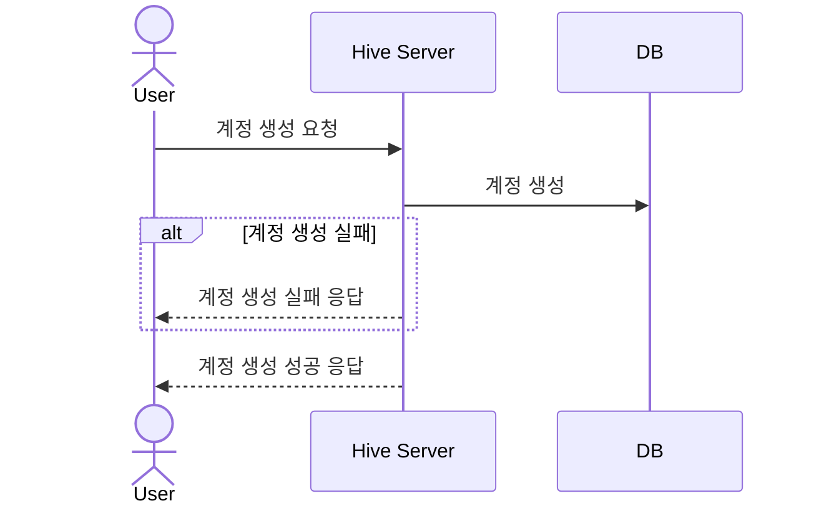
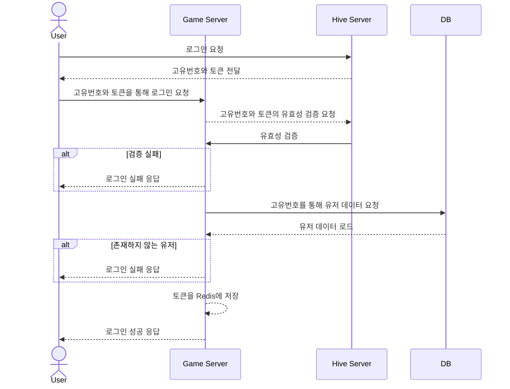

Directory structure:
└── MultiAPIServer_Template/
    ├── README.md
    ├── All.sln
    ├── DB_Schema.md
    ├── GameDB_Dump.sql
    ├── MasterData.xlsx
    ├── GameAPIServer/
    │   ├── ErrorCode.cs
    │   ├── GameAPIServer.csproj
    │   ├── GameAPIServer.sln
    │   ├── Program.cs
    │   ├── Security.cs
    │   ├── apiTest.http
    │   ├── appsettings.Development.json
    │   ├── appsettings.json
    │   ├── Controllers/
    │   │   ├── Attendance/
    │   │   │   ├── AttendanceCheckController.cs
    │   │   │   └── AttendanceInfoController.cs
    │   │   ├── Auth/
    │   │   │   ├── LoginController.cs
    │   │   │   └── LogoutController.cs
    │   │   ├── DataLoad/
    │   │   │   ├── GameDataLoadController.cs
    │   │   │   ├── SocialDataLoadController.cs
    │   │   │   └── UserDataLoadController.cs
    │   │   ├── Friend/
    │   │   │   ├── FriendAcceptController.cs
    │   │   │   ├── FriendCancelReqController.cs
    │   │   │   ├── FriendDeleteController.cs
    │   │   │   ├── FriendListController.cs
    │   │   │   └── FriendSendReqController.cs
    │   │   ├── Mail/
    │   │   │   ├── MailDeleteController.cs
    │   │   │   ├── MailListController.cs
    │   │   │   └── MailReceiveController.cs
    │   │   ├── Ranking/
    │   │   │   ├── TopRankingController.cs
    │   │   │   └── UserRankController.cs
    │   │   └── User/
    │   │       ├── OtherUserInfoController.cs
    │   │       └── UserSetMainCharController.cs
    │   ├── Middleware/
    │   │   ├── CheckUserAuth.cs
    │   │   └── VersionCheck.cs
    │   ├── Models/
    │   │   ├── MasterDB.cs
    │   │   ├── RedisDB.cs
    │   │   ├── DTO/
    │   │   │   ├── ErrorCodeDTO.cs
    │   │   │   ├── HeaderDTO.cs
    │   │   │   ├── Attendance/
    │   │   │   │   ├── AttendanceCheck.cs
    │   │   │   │   └── AttendanceInfo.cs
    │   │   │   ├── Auth/
    │   │   │   │   ├── Login.cs
    │   │   │   │   └── Logout.cs
    │   │   │   ├── DataLoad/
    │   │   │   │   ├── GameDataLoad.cs
    │   │   │   │   ├── SocialDataLoad.cs
    │   │   │   │   └── UserDataLoad.cs
    │   │   │   ├── Friend/
    │   │   │   │   ├── FreindDelete.cs
    │   │   │   │   ├── FriendAccept.cs
    │   │   │   │   ├── FriendAdd.cs
    │   │   │   │   └── FriendList.cs
    │   │   │   ├── Mail/
    │   │   │   │   ├── MailDelete.cs
    │   │   │   │   ├── MailList.cs
    │   │   │   │   └── MailReceive.cs
    │   │   │   ├── Ranking/
    │   │   │   │   ├── Ranking.cs
    │   │   │   │   └── UserRank.cs
    │   │   │   └── User/
    │   │   │       ├── OtherUserInfo.cs
    │   │   │       └── UserSetMainChar.cs
    │   │   └── GameDB/
    │   │       ├── Attendance.cs
    │   │       ├── Friend.cs
    │   │       ├── Game.cs
    │   │       ├── Item.cs
    │   │       ├── Mailbox.cs
    │   │       └── User.cs
    │   ├── Properties/
    │   │   └── launchSettings.json
    │   ├── Repository/
    │   │   ├── GameDB_Attendance.cs
    │   │   ├── GameDB_Friend.cs
    │   │   ├── GameDB_Game.cs
    │   │   ├── GameDB_Item.cs
    │   │   ├── GameDB_Mail.cs
    │   │   ├── GameDB_User.cs
    │   │   ├── MasterDb.cs
    │   │   ├── MemoryDBDefine.cs
    │   │   ├── MemoryDb.cs
    │   │   ├── MemoryDbKeyMaker.cs
    │   │   └── Interfaces/
    │   │       ├── IGameDb.cs
    │   │       ├── IMasterDb.cs
    │   │       └── IMemoryDb.cs
    │   └── Services/
    │       ├── AttendanceService.cs
    │       ├── AuthService.cs
    │       ├── DataLoadService.cs
    │       ├── FriendService.cs
    │       ├── GameService.cs
    │       ├── ItemService.cs
    │       ├── MailService.cs
    │       ├── UserService.cs
    │       └── Interfaces/
    │           ├── IAttendanceService.cs
    │           ├── IAuthService.cs
    │           ├── IDataLoadService.cs
    │           ├── IFriendService.cs
    │           ├── IGameService.cs
    │           ├── IItemService.cs
    │           ├── IMailService.cs
    │           └── IUserService.cs
    ├── HiveAPIServer/
    │   ├── ErrorCode.cs
    │   ├── HiveAPIServer.csproj
    │   ├── HiveAPIServer.sln
    │   ├── Program.cs
    │   ├── Security.cs
    │   ├── apiTest.http
    │   ├── appsettings.Development.json
    │   ├── appsettings.json
    │   ├── Controllers/
    │   │   ├── CreateAccountController.cs
    │   │   ├── LoginController.cs
    │   │   └── VerifyToken.cs
    │   ├── Model/
    │   │   ├── DAO/
    │   │   │   └── HiveDb.cs
    │   │   └── DTO/
    │   │       ├── CreateHiveAccount.cs
    │   │       ├── LoginHive.cs
    │   │       └── VerifyToken.cs
    │   ├── Properties/
    │   │   └── launchSettings.json
    │   ├── Repository/
    │   │   ├── HiveDb.cs
    │   │   └── IHiveDb.cs
    │   └── Services/
    │       ├── AuthService.cs
    │       └── IAuthService.cs
    └── MatchAPIServer/
        ├── ErrorCode.cs
        ├── MatchAPIServer.csproj
        ├── MatchAPIServer.sln
        ├── MatchWoker.cs
        ├── Program.cs
        ├── appsettings.Development.json
        ├── appsettings.json
        ├── Controllers/
        │   ├── CheckMatcingController.cs
        │   └── RequestMatchingController.cs
        └── Properties/
            └── launchSettings.json

================================================
File: README.md
================================================
# API 서버 템플릿
이것을 기반으로 원하는 API 서버를 개발하면 빠르게 개발할 수 있다.  
단 필요 없는 코드와 파일은 싹 지워야 한다.  
   
    	 
# TODO-LIST
개발할 것을 계획하고, 해야할 것을 세분화 하여 TODO 리스트를 만든다.   
개발이 진행되면 완료한 항목은 체크한다. 또 필요하면 새롭게 추가한다.  
아래는 사용 예이다.     

  
완료한 작업 : ✅

- **하이브 서버 기능**
 
| 기능                                         | 완료 여부 |
| -------------------------------------------- | --------- |
| 하이브 계정생성   						| ✅        |
| [하이브 로그인]							| ✅        |
| [하이브 토큰 검증]								 | ✅        |

- **계정 기능**

| 기능                                         | 완료 여부 |
| -------------------------------------------- | --------- |
| [로그인]						              | ✅        |
| [로그아웃]								       | ✅        |

- **데이터 로드**

| 기능                                         | 완료 여부 |
| -------------------------------------------- | --------- |
| [유저 데이터 로드]	                		 | ✅        |
| [게임 데이터 로드]	                		 | ✅        |
| [소셜 데이터 로드]	                		 | ✅        |

- **친구 기능**

| 기능                                            | 완료 여부 |
| ----------------------------------------------- | --------- |
| [친구 목록 조회]								  | ✅        |
| [친구 요청]								  | ✅        |
| [친구 요청 수락]								  | ✅        |
| [친구 삭제]								  | ✅        |
| [친구 요청 취소]								  | ✅        |


<br>  
  
---  
아래는 구현할 기능에 대한 설명이다.    
  
## 가챠
- 가챠는 포함된 아이템들중 하나만을 뽑아내는 것이다.
- 아이템의 종류에 따라 그 확률을 정할 수 있다. (캐릭터 5%, 스킨 1%,...)
- 확률을 통해 타입을 정하고, 그 타입의 아이템들 중 하나를 뽑는 방식으로 구현.
  
  
---
## 하이브 로그인

**컨텐츠 설명**
- 하이브에 로그인 하여 고유번호와 토큰을 받습니다.

**로직**
1. 클라이언트가 이메일과 비밀번호를 하이브 서버에 전달한다.
1. 클라이언트의 고유번호와 생성된 토큰을 응답한다. 


클라이언트 → 서버 전송 데이터

| 종류                  | 설명                             |
| --------------------- | -------------------------------- |
| 이메일               | 로그인 이메일 |
| 비밀번호             | 로그인 비밀번호 |


### 요청 및 응답 예시

- 요청 예시

```
POST http://localhost:11502/LoginHive
Content-Type: application/json

{
    "Email" : "example@test.com",
    "Password" : "Aslj3kldiu!",
}
```

- 응답 예시

```
{
    "result": 0,
    "playerId": 7,
    "hiveToken": "efaee4517404318a8d14f6053767ff74dcf9aw30910b9116dafd3fa4ce408a45"
}
```    
  
---  
# 시퀸스 다이얼그램
   
## 새로운 유저의 계정 생성


  
  
# 유저의 로그인



================================================
File: All.sln
================================================

Microsoft Visual Studio Solution File, Format Version 12.00
# Visual Studio Version 17
VisualStudioVersion = 17.8.34330.188
MinimumVisualStudioVersion = 10.0.40219.1
Project("{9A19103F-16F7-4668-BE54-9A1E7A4F7556}") = "HiveAPIServer", "HiveAPIServer\HiveAPIServer.csproj", "{878AC177-ADB0-48C0-BC97-3DB17E7F454D}"
EndProject
Project("{9A19103F-16F7-4668-BE54-9A1E7A4F7556}") = "MatchAPIServer", "MatchAPIServer\MatchAPIServer.csproj", "{6D479CE6-6377-4F85-A00B-AD4CE85E3410}"
EndProject
Project("{9A19103F-16F7-4668-BE54-9A1E7A4F7556}") = "GameAPIServer", "GameAPIServer\GameAPIServer.csproj", "{2EBA31CE-6F50-4ECE-B77B-F326F455CCDF}"
EndProject
Global
	GlobalSection(SolutionConfigurationPlatforms) = preSolution
		Debug|Any CPU = Debug|Any CPU
		Release|Any CPU = Release|Any CPU
	EndGlobalSection
	GlobalSection(ProjectConfigurationPlatforms) = postSolution
		{878AC177-ADB0-48C0-BC97-3DB17E7F454D}.Debug|Any CPU.ActiveCfg = Debug|Any CPU
		{878AC177-ADB0-48C0-BC97-3DB17E7F454D}.Debug|Any CPU.Build.0 = Debug|Any CPU
		{878AC177-ADB0-48C0-BC97-3DB17E7F454D}.Release|Any CPU.ActiveCfg = Release|Any CPU
		{878AC177-ADB0-48C0-BC97-3DB17E7F454D}.Release|Any CPU.Build.0 = Release|Any CPU
		{6D479CE6-6377-4F85-A00B-AD4CE85E3410}.Debug|Any CPU.ActiveCfg = Debug|Any CPU
		{6D479CE6-6377-4F85-A00B-AD4CE85E3410}.Debug|Any CPU.Build.0 = Debug|Any CPU
		{6D479CE6-6377-4F85-A00B-AD4CE85E3410}.Release|Any CPU.ActiveCfg = Release|Any CPU
		{6D479CE6-6377-4F85-A00B-AD4CE85E3410}.Release|Any CPU.Build.0 = Release|Any CPU
		{2EBA31CE-6F50-4ECE-B77B-F326F455CCDF}.Debug|Any CPU.ActiveCfg = Debug|Any CPU
		{2EBA31CE-6F50-4ECE-B77B-F326F455CCDF}.Debug|Any CPU.Build.0 = Debug|Any CPU
		{2EBA31CE-6F50-4ECE-B77B-F326F455CCDF}.Release|Any CPU.ActiveCfg = Release|Any CPU
		{2EBA31CE-6F50-4ECE-B77B-F326F455CCDF}.Release|Any CPU.Build.0 = Release|Any CPU
	EndGlobalSection
	GlobalSection(SolutionProperties) = preSolution
		HideSolutionNode = FALSE
	EndGlobalSection
	GlobalSection(ExtensibilityGlobals) = postSolution
		SolutionGuid = {560D3881-D190-4C53-BAA7-9BB089C75615}
	EndGlobalSection
EndGlobal


================================================
File: DB_Schema.md
================================================
아래 사용 예를 참고하여 만드는 게임에 맞게 DB 스키마 정보를 만들도록 한다.  
사용하지 않는 것은 삭제한다.  
  
  
  
# account DB

## account_info 테이블
하이브 계정 정보를 가지고 있는 테이블
```sql
-- 테이블 생성 SQL - account
CREATE TABLE account
(
    `player_id`         BIGINT          NOT NULL    AUTO_INCREMENT COMMENT '플레이어 아이디',
    `user_id`             VARCHAR(50)     NOT NULL    COMMENT '유저아이디. 내용은 이메일',
    `salt_value`        VARCHAR(100)    NOT NULL    COMMENT '암호화 값',
    `pw`                VARCHAR(100)    NOT NULL    COMMENT '해싱된 비밀번호',
    `create_dt`         DATETIME        NOT NULL    DEFAULT CURRENT_TIMESTAMP COMMENT '생성 일시',
    `recent_login_dt`   DATETIME        NOT NULL    DEFAULT CURRENT_TIMESTAMP COMMENT '최근 로그인 일시',
     PRIMARY KEY (player_id),
     UNIQUE KEY (user_id)
)
```

# game DB
  
## user_info 테이블
게임에서 생성 된 계정 정보들을 가지고 있는 테이블    
  
```sql
-- 테이블 생성 SQL - user
CREATE TABLE user
(
    `uid`                           INT            NOT NULL    AUTO_INCREMENT COMMENT '유저아이디', 
    `player_id`                     BIGINT         NOT NULL    COMMENT '플레이어 아이디', 
    `nickname`                      VARCHAR(50)    NOT NULL    COMMENT '닉네임', 
    `create_dt`                     DATETIME       NOT NULL    DEFAULT CURRENT_TIMESTAMP COMMENT '생성 일시', 
    `recent_login_dt`               DATETIME       NOT NULL    DEFAULT CURRENT_TIMESTAMP COMMENT '최근 로그인 일시', 
    `total_bestscore`               INT            NOT NULL    DEFAULT 0 COMMENT '최고점수 역대', 
    `total_bestscore_cur_season`    INT            NOT NULL    DEFAULT 0 COMMENT '최고점수 현재 시즌', 
    `total_bestscore_prev_season`   INT            NOT NULL    DEFAULT 0 COMMENT '최고점수 이전 시즌', 
    `star_point`                    INT            NOT NULL    DEFAULT 0 COMMENT '스타 포인트', 
    `main_char_key`                 INT            NOT NULL    COMMENT '메인 캐릭터 키',
     PRIMARY KEY (uid),
     UNIQUE KEY (nickname)
);

```

## user_money 테이블
유저의 재화 정보를 가지고 있는 테이블
```sql
-- 테이블 생성 SQL - user_money
CREATE TABLE user_money
(
    `uid`         INT    NOT NULL    COMMENT '유저아이디', 
    `jewelry`     INT    NOT NULL    DEFAULT 0 COMMENT '보석', 
    `gold_medal`  INT    NOT NULL    DEFAULT 0 COMMENT '금 메달', 
    `cash`        INT    NOT NULL    DEFAULT 0 COMMENT '현금', 
    `sunchip`     INT    NOT NULL    DEFAULT 0 COMMENT '썬칩', 
     PRIMARY KEY (uid)
);
-- Foreign Key 설정 SQL - user_money(uid) -> user(uid)
ALTER TABLE user_money
    ADD CONSTRAINT FK_user_money_uid_user_uid FOREIGN KEY (uid)
        REFERENCES user (uid) ON DELETE RESTRICT ON UPDATE RESTRICT;
```

## friend 테이블
친구 정보를 가지고 있는 테이블  
```sql
-- 테이블 생성 SQL - friend
CREATE TABLE friend
(
    `uid`         INT         NOT NULL    COMMENT '유저아이디', 
    `friend_uid`  INT         NOT NULL    COMMENT '친구 유저아이디', 
    `friend_yn`   TINYINT     NOT NULL    DEFAULT 0  COMMENT '친구 여부', 
    `create_dt`   DATETIME    NOT NULL    DEFAULT CURRENT_TIMESTAMP COMMENT '생성 일시', 
     PRIMARY KEY (uid, friend_uid)
);
-- Foreign Key 설정 SQL - friend(uid) -> user(uid)
ALTER TABLE friend
    ADD CONSTRAINT FK_friend_uid_user_uid FOREIGN KEY (uid)
        REFERENCES user (uid) ON DELETE RESTRICT ON UPDATE RESTRICT;

-- Foreign Key 설정 SQL - friend(friend_uid) -> user(uid)
ALTER TABLE friend
    ADD CONSTRAINT FK_friend_friend_uid_user_uid FOREIGN KEY (friend_uid)
        REFERENCES user (uid) ON DELETE RESTRICT ON UPDATE RESTRICT;
```

## mailbox 테이블
우편함 정보를 가지고 있는 테이블
```sql
-- 테이블 생성 SQL - mailbox
CREATE TABLE mailbox
(
    `mail_seq`    INT             NOT NULL    AUTO_INCREMENT COMMENT '우편 일련번호', 
    `uid`         INT             NOT NULL    COMMENT '유저아이디', 
    `mail_title`  VARCHAR(100)    NOT NULL    COMMENT '우편 제목', 
    `create_dt`   DATETIME        NOT NULL    COMMENT '생성 일시', 
    `expire_dt`   DATETIME        NOT NULL    COMMENT '만료 일시', 
    `receive_dt`  DATETIME        NOT NULL    DEFAULT CURRENT_TIMESTAMP COMMENT '수령 일시', 
    `receive_yn`  TINYINT         NOT NULL    DEFAULT 0 COMMENT '수령 유무',
     PRIMARY KEY (mail_seq)
);
-- Foreign Key 설정 SQL - mailbox(uid) -> user(uid)
ALTER TABLE mailbox
    ADD CONSTRAINT FK_mailbox_uid_user_uid FOREIGN KEY (uid)
        REFERENCES user (uid) ON DELETE RESTRICT ON UPDATE RESTRICT;
```

## mailbox_reward 테이블
우편함의 보상정보를 가지고 있는 테이블
```sql
-- 테이블 생성 SQL - mailbox_reward
CREATE TABLE mailbox_reward
(
    `mail_seq`     INT            NOT NULL    COMMENT '우편 일련번호', 
    `reward_key`   INT            NOT NULL    COMMENT '보상 키', 
    `reward_qty`   INT            NOT NULL    COMMENT '보상 수', 
    `reward_type`  VARCHAR(20)    NOT NULL    COMMENT '보상 타입', 
     PRIMARY KEY (mail_seq, reward_key)
);

-- Foreign Key 설정 SQL - mailbox_reward(mail_seq) -> mailbox(mail_seq)
ALTER TABLE mailbox_reward
    ADD CONSTRAINT FK_mailbox_reward_mail_seq_mailbox_mail_seq FOREIGN KEY (mail_seq)
        REFERENCES mailbox (mail_seq) ON DELETE RESTRICT ON UPDATE RESTRICT;
```

## user_attendance 테이블
유저의 출석 현황을 가지고 있는 테이블
```sql
-- 테이블 생성 SQL - user_attendance
CREATE TABLE user_attendance
(
    `uid`                   INT         NOT NULL    COMMENT '유저아이디', 
    `attendance_cnt`        INT         NOT NULL    COMMENT '출석 횟수', 
    `recent_attendance_dt`  DATETIME    NOT NULL    COMMENT '최근 출석 일시', 
     PRIMARY KEY (uid)
);
-- Foreign Key 설정 SQL - user_attendance(uid) -> user(uid)
ALTER TABLE user_attendance
    ADD CONSTRAINT FK_user_attendance_uid_user_uid FOREIGN KEY (uid)
        REFERENCES user (uid) ON DELETE RESTRICT ON UPDATE RESTRICT;
```

## user_minigame 테이블
유저의 게임 정보를 가지고 있는 테이블
```sql
-- 테이블 생성 SQL - user_minigame
CREATE TABLE user_minigame
(
    `uid`                    INT         NOT NULL    COMMENT '유저아이디', 
    `game_key`               INT         NOT NULL    COMMENT '게임 키', 
    `bestscore`              INT         NOT NULL    COMMENT '최고점수', 
    `bestscore_cur_season`   INT         NOT NULL    COMMENT '최고점수 현재 시즌', 
    `bestscore_prev_season`  INT         NOT NULL    COMMENT '최고점수 이전 시즌', 
    `new_record_dt`          DATETIME    NOT NULL    DEFUALT CURRENT_TIMESTAMP COMMENT '신 기록 일시', 
    `recent_play_dt`         DATETIME    NOT NULL    DEFUALT CURRENT_TIMESTAMP COMMENT '최근 플레이 일시', 
    `play_char_key`          INT         NOT NULL    COMMENT '플레이 캐릭터 키', 
    `create_dt`              DATETIME    NOT NULL    COMMENT '생성 일시', 
     PRIMARY KEY (uid, game_key)
);

-- Foreign Key 설정 SQL - user_minigame(uid) -> user(uid)
ALTER TABLE user_minigame
    ADD CONSTRAINT FK_user_minigame_uid_user_uid FOREIGN KEY (uid)
        REFERENCES user (uid) ON DELETE RESTRICT ON UPDATE RESTRICT;
```

## user_char 테이블
유저의 캐릭터 정보를 가지고 있는 테이블
```sql
-- 테이블 생성 SQL - user_char
CREATE TABLE user_char
(
    `uid`           INT         NOT NULL    COMMENT '유저아이디', 
    `char_key`      INT         NOT NULL    COMMENT '캐릭터 키', 
    `char_level`    INT         NOT NULL    DEFAULT 1 COMMENT '캐릭터 레벨', 
    `char_cnt`      INT         NOT NULL    DEFAULT 1 COMMENT '캐릭터 개수',
    `skin_key`      INT         NOT NULL    DEFAULT 0 COMMENT '스킨 키', 
    `create_dt`     DATETIME    NOT NULL    COMMENT '생성 일시', 
    `costume_json`  JSON        NOT NULL    COMMENT '코스튬 JSON', 
     PRIMARY KEY (uid, char_key)
);
-- Foreign Key 설정 SQL - user_char(uid) -> user(uid)
ALTER TABLE user_char
    ADD CONSTRAINT FK_user_char_uid_user_uid FOREIGN KEY (uid)
        REFERENCES user (uid) ON DELETE RESTRICT ON UPDATE RESTRICT;
```

## user_char_random_skill 테이블
유저의 캐릭터의 랜덤 스킬 정보를 가지고 있는 테이블
```sql
-- 테이블 생성 SQL - user_char_random_skill
CREATE TABLE user_char_random_skill
(
    `uid`        INT         NOT NULL    COMMENT '유저아이디', 
    `char_key`   INT         NOT NULL    COMMENT '캐릭터 키', 
    `index_num`  INT         NOT NULL    COMMENT '순서 숫자', 
    `skill_key`  INT         NOT NULL    COMMENT '스킬 키', 
    `create_dt`  DATETIME    NOT NULL    COMMENT '생성 일시', 
     PRIMARY KEY (uid, char_key, index_num)
);
-- Foreign Key 설정 SQL - user_char_random_skill(uid) -> user(uid)
ALTER TABLE user_char_random_skill
    ADD CONSTRAINT FK_user_char_random_skill_uid_user_uid FOREIGN KEY (uid)
        REFERENCES user (uid) ON DELETE RESTRICT ON UPDATE RESTRICT;
```

## user_costume 테이블
유저의 코스튬 정보를 가지고 있는 테이블
```sql
-- 테이블 생성 SQL - user_costume
CREATE TABLE user_costume
(
    `uid`            INT         NOT NULL    COMMENT '유저아이디', 
    `costume_key`    INT         NOT NULL    COMMENT '코스튬 키', 
    `costume_level`  INT         NOT NULL    DEFAULT 1 COMMENT '코스튬 레벨',
    `costume_cnt`    INT         NOT NULL    DEFAULT 1 COMMENT '코스튬 개수',
    `create_dt`      DATETIME    NOT NULL    COMMENT '생성 일시', 
     PRIMARY KEY (uid, costume_key)
);

-- Foreign Key 설정 SQL - user_costume(uid) -> user(uid)
ALTER TABLE user_costume
    ADD CONSTRAINT FK_user_costume_uid_user_uid FOREIGN KEY (uid)
        REFERENCES user (uid) ON DELETE RESTRICT ON UPDATE RESTRICT;
```

## user_skin 테이블
유저의 스킨 정보를 가지고 있는 테이블
```sql
-- 테이블 생성 SQL - user_skin
CREATE TABLE user_skin
(
    `uid`        INT         NOT NULL    COMMENT '유저아이디', 
    `skin_key`   INT         NOT NULL    COMMENT '스킨 키', 
    `create_dt`  DATETIME    NOT NULL    COMMENT '생성 일시', 
     PRIMARY KEY (uid, skin_key)
);
-- Foreign Key 설정 SQL - user_skin(uid) -> user(uid)
ALTER TABLE user_skin
    ADD CONSTRAINT FK_user_skin_uid_user_uid FOREIGN KEY (uid)
        REFERENCES user (uid) ON DELETE RESTRICT ON UPDATE RESTRICT;
```

## user_food 테이블
유저의 푸드 정보를 가지고 있는 테이블
```sql
-- 테이블 생성 SQL - user_food
CREATE TABLE user_food
(
    `uid`            INT         NOT NULL    COMMENT '유저아이디', 
    `food_key`       INT         NOT NULL    COMMENT '푸드 키', 
    `food_qty`       INT         NOT NULL    COMMENT '푸드 수', 
    `food_gear_qty`  INT         NOT NULL    COMMENT '푸드 기어 수', 
    `food_level`     INT         NOT NULL    COMMENT '푸드 레벨', 
    `create_dt`      DATETIME    NOT NULL    COMMENT '생성 일시', 
     PRIMARY KEY (uid, food_key)
);

-- Foreign Key 설정 SQL - user_food(uid) -> user(uid)
ALTER TABLE user_food
    ADD CONSTRAINT FK_user_food_uid_user_uid FOREIGN KEY (uid)
        REFERENCES user (uid) ON DELETE RESTRICT ON UPDATE RESTRICT;
```


<br>
<br>

# master DB
## version 테이블
앱버전과 데이터 버전을 가지고 있는 테이블
```sql
-- 테이블 생성 SQL - version
CREATE TABLE version
(
    `app_version`            INT         NOT NULL    COMMENT '앱 버전', 
    `master_data_version`    INT         NOT NULL    COMMENT '마스터 데이터 버전', 
);
```

## master_game 테이블
게임 정보를 가지고 있는 테이블
```sql
-- 테이블 생성 SQL - master_game
CREATE TABLE master_game
(
    `game_key`   INT            NOT NULL    COMMENT '게임 키', 
    `game_name`  VARCHAR(50)    NOT NULL    COMMENT '게임 이름', 
     PRIMARY KEY (game_key)
);
```

## master_char 테이블
캐릭터 정보를 가지고 있는 테이블
```sql
-- 테이블 생성 SQL - master_char
CREATE TABLE master_char
(
    `char_key`    INT            NOT NULL    COMMENT '캐릭터 키', 
    `char_name`   VARCHAR(50)    NOT NULL    COMMENT '캐릭터 이름', 
    `char_grade`  VARCHAR(20)    NOT NULL    COMMENT '캐릭터 등급', 
    `game_key`    INT            NOT NULL    COMMENT '게임 키', 
    `stat_run`    INT            NOT NULL    COMMENT '스탯 달리기', 
    `stat_power`  INT            NOT NULL    COMMENT '스탯 힘', 
    `stat_jump`   INT            NOT NULL    COMMENT '스탯 점프', 
    `create_dt`   DATETIME       NOT NULL    COMMENT '생성 일시', 
     PRIMARY KEY (char_key)
);

-- Foreign Key 설정 SQL - master_char(game_key) -> master_game(game_key)
ALTER TABLE master_char
    ADD CONSTRAINT FK_master_char_game_key_master_game_game_key FOREIGN KEY (game_key)
        REFERENCES master_game (game_key) ON DELETE RESTRICT ON UPDATE RESTRICT;
```

## master_costume 테이블
코스튬 정보를 가지고 있는 테이블
```sql
-- 테이블 생성 SQL - master_costume
CREATE TABLE master_costume
(
    `costume_key`   INT            NOT NULL    COMMENT '코스튬 키', 
    `costume_name`  VARCHAR(50)    NOT NULL    COMMENT '코스튬 이름', 
    `costume_type`  INT            NOT NULL    COMMENT '코스튬 종류', 
    `create_dt`     DATETIME       NOT NULL    COMMENT '생성 일시', 
    `set_key`       INT            NOT NULL    DEFAULT 0 COMMENT '세트 키', 
     PRIMARY KEY (costume_key)
);
```

## master_costume_set 테이블
코스튬 세트 정보를 가지고 있는 테이블
```sql
CREATE TABLE master_costume_set
(
    `set_key`             INT            NOT NULL    COMMENT '세트 키', 
    `set_name`            VARCHAR(50)    NOT NULL    COMMENT '세트 이름', 
    `char_key`            INT            NOT NULL    COMMENT '캐릭터 키', 
    `set_bonus_percent`   INT            NOT NULL    COMMENT '세트 보너스 퍼센트', 
    `char_bonus_percent`  INT            NOT NULL    COMMENT '캐릭터 보너스 퍼센트', 
    `create_dt`           DATETIME       NOT NULL    COMMENT '생성 일시', 
     PRIMARY KEY (set_key)
);
-- Foreign Key 설정 SQL - master_costume_set(char_key) -> master_char(char_key)
ALTER TABLE master_costume_set
    ADD CONSTRAINT FK_master_costume_set_char_key_master_char_char_key FOREIGN KEY (char_key)
        REFERENCES master_char (char_key) ON DELETE RESTRICT ON UPDATE RESTRICT;
```

## master_skin 테이블
스킨 정보를 가지고 있는 테이블
```sql
-- 테이블 생성 SQL - master_skin
CREATE TABLE master_skin
(
    `skin_key`            INT            NOT NULL    COMMENT '스킨 키', 
    `skin_name`           VARCHAR(50)    NOT NULL    COMMENT '스킨 이름', 
    `char_key`            INT            NOT NULL    COMMENT '캐릭터 키', 
    `skin_bonus_percent`  INT            NOT NULL    COMMENT '스킨 보너스 퍼센트', 
    `create_dt`           DATETIME       NOT NULL    COMMENT '생성 일시', 
     PRIMARY KEY (skin_key)
);
-- Foreign Key 설정 SQL - master_skin(char_key) -> master_char(char_key)
ALTER TABLE master_skin
    ADD CONSTRAINT FK_master_skin_char_key_master_char_char_key FOREIGN KEY (char_key)
        REFERENCES master_char (char_key) ON DELETE RESTRICT ON UPDATE RESTRICT;
```

## master_skill 테이블
스킬 정보를 가지고 있는 테이블
```sql
-- 테이블 생성 SQL - master_skill
CREATE TABLE master_skill
(
    `skill_key`         INT         NOT NULL    COMMENT '스킬 키', 
    `act_prob_percent`  INT         NOT NULL    COMMENT '발동 확률 퍼센트', 
    `create_dt`         DATETIME    NOT NULL    COMMENT '생성 일시', 
    `char_key`          INT         NOT NULL    DEFAULT 0 COMMENT '캐릭터 키', 
     PRIMARY KEY (skill_key)
);
-- Foreign Key 설정 SQL - master_skill(char_key) -> master_char(char_key)
ALTER TABLE master_skill
    ADD CONSTRAINT FK_master_skill_char_key_master_char_char_key FOREIGN KEY (char_key)
        REFERENCES master_char (char_key) ON DELETE RESTRICT ON UPDATE RESTRICT;
```

## master_food 테이블
푸드 정보를 가지고 있는 테이블
```sql
-- 테이블 생성 SQL - master_food
CREATE TABLE master_food
(
    `food_key`   INT            NOT NULL    COMMENT '푸드 키', 
    `food_name`  VARCHAR(50)    NOT NULL    COMMENT '푸드 이름', 
    `create_dt`  DATETIME       NOT NULL    COMMENT '생성 일시', 
    `game_key`   INT            NOT NULL    COMMENT '게임 키', 
     PRIMARY KEY (food_key)
);
```

## master_gacha_reward 테이블
가챠 보상의 확률 정보와 뽑는 수량을 가지고 있는 테이블
```sql
-- 테이블 생성 SQL - master_gacha_reward
CREATE TABLE master_gacha_reward
(
    `gacha_reward_key`        INT            NOT NULL    COMMENT '가챠 보상 키', 
    `gacha_reward_name`       VARCHAR(50)    NOT NULL    COMMENT '가챠 보상 이름', 
    `char_prob_percent`       INT            NOT NULL    COMMENT '캐릭터 확률 퍼센트', 
    `skin_prob_percent`       INT            NOT NULL    COMMENT '스킨 확률 퍼센트', 
    `costume_prob_percent`    INT            NOT NULL    COMMENT '코스튬 확률 퍼센트', 
    `food_prob_percent`       INT            NOT NULL    COMMENT '푸드 확률 퍼센트', 
    `food_gear_prob_percent`  INT            NOT NULL    COMMENT '푸드 기어 확률 퍼센트', 
    `gacha_count`             INT            NOT NULL    COMMENT '가챠 개수', 
    `create_dt`               DATETIME       NOT NULL    COMMENT '생성 일시', 
     PRIMARY KEY (gacha_reward_key)
);
```

## master_gacha_reward_list 테이블
가챠 보상에 포함되는 보상들의 정보를 가지고 있는 테이블
```sql
-- 테이블 생성 SQL - master_gacha_reward_list
CREATE TABLE master_gacha_reward_list
(
    `gacha_reward_key`  INT            NOT NULL    COMMENT '가챠 보상 키', 
    `reward_key`        INT            NOT NULL    COMMENT '보상 키', 
    `reward_type`       VARCHAR(20)    NOT NULL    COMMENT '보상 종류',
    `reward_qty`        INT             NOT NULL   DEFAULT 1 COMMENT '보상 수',
    `create_dt`         DATETIME       NOT NULL    COMMENT '생성 일시', 
     PRIMARY KEY (gacha_reward_key, reward_key)
);
-- Foreign Key 설정 SQL - master_gacha_reward_list(gacha_reward_key) -> master_gacha_reward(gacha_reward_key)
ALTER TABLE master_gacha_reward_list
    ADD CONSTRAINT FK_master_gacha_reward_list_gacha_reward_key_master_gacha_reward FOREIGN KEY (gacha_reward_key)
        REFERENCES master_gacha_reward (gacha_reward_key) ON DELETE RESTRICT ON UPDATE RESTRICT;
```

## master_attendance_reward 테이블
출석 보상 정보를 가지고 있는 테이블
```sql
-- 테이블 생성 SQL - master_attendance_reward
CREATE TABLE master_attendance_reward
(
    `day_seq`     INT         NOT NULL    COMMENT '날짜 번호', 
    `reward_key`  INT         NOT NULL    COMMENT '보상 키', 
    `reward_qty`  INT         NOT NULL    DEFAULT 0 COMMENT '보상 수',
    `reward_type` VARCHAR(20) NOT NULL    COMMENT '보상 종류',
    `create_dt`   DATETIME    NOT NULL    COMMENT '생성 일시', 
     PRIMARY KEY (day_seq)
);
```

## master_item_level 테이블
아이템(캐릭터, 코스튬, 푸드) 레벨업을 위한 개수의 정보를 가지고 있는 테이블
```sql
-- 테이블 생성 SQL - master_item_level
CREATE TABLE master_item_level
(
    `level`     INT            NOT NULL    COMMENT '레벨', 
    `item_cnt`  VARCHAR(50)    NOT NULL    DEFAULT 1 COMMENT '아이템 개수', 
     PRIMARY KEY (level)
);
```


================================================
File: GameDB_Dump.sql
================================================
-- MySQL dump 10.13  Distrib 8.0.34, for Win64 (x86_64)
--
-- Host: localhost    Database: game_db
-- ------------------------------------------------------
-- Server version	8.2.0

/*!40101 SET @OLD_CHARACTER_SET_CLIENT=@@CHARACTER_SET_CLIENT */;
/*!40101 SET @OLD_CHARACTER_SET_RESULTS=@@CHARACTER_SET_RESULTS */;
/*!40101 SET @OLD_COLLATION_CONNECTION=@@COLLATION_CONNECTION */;
/*!50503 SET NAMES utf8 */;
/*!40103 SET @OLD_TIME_ZONE=@@TIME_ZONE */;
/*!40103 SET TIME_ZONE='+00:00' */;
/*!40014 SET @OLD_UNIQUE_CHECKS=@@UNIQUE_CHECKS, UNIQUE_CHECKS=0 */;
/*!40014 SET @OLD_FOREIGN_KEY_CHECKS=@@FOREIGN_KEY_CHECKS, FOREIGN_KEY_CHECKS=0 */;
/*!40101 SET @OLD_SQL_MODE=@@SQL_MODE, SQL_MODE='NO_AUTO_VALUE_ON_ZERO' */;
/*!40111 SET @OLD_SQL_NOTES=@@SQL_NOTES, SQL_NOTES=0 */;

--
-- Current Database: `game_db`
--

CREATE DATABASE /*!32312 IF NOT EXISTS*/ `game_db` /*!40100 DEFAULT CHARACTER SET utf8mb4 COLLATE utf8mb4_0900_ai_ci */ /*!80016 DEFAULT ENCRYPTION='N' */;

USE `game_db`;

--
-- Table structure for table `friend`
--

DROP TABLE IF EXISTS `friend`;
/*!40101 SET @saved_cs_client     = @@character_set_client */;
/*!50503 SET character_set_client = utf8mb4 */;
CREATE TABLE `friend` (
  `uid` int NOT NULL COMMENT '유저아이디',
  `friend_uid` int NOT NULL COMMENT '친구 유저아이디',
  `friend_yn` tinyint NOT NULL DEFAULT '0' COMMENT '친구 여부',
  `create_dt` datetime NOT NULL COMMENT '생성 일시',
  PRIMARY KEY (`uid`,`friend_uid`),
  KEY `FK_friend_friend_uid_user_info_uid` (`friend_uid`)
) ENGINE=InnoDB DEFAULT CHARSET=utf8mb4 COLLATE=utf8mb4_0900_ai_ci;
/*!40101 SET character_set_client = @saved_cs_client */;

--
-- Dumping data for table `friend`
--

LOCK TABLES `friend` WRITE;
/*!40000 ALTER TABLE `friend` DISABLE KEYS */;
INSERT INTO `friend` VALUES (4,5,0,'2024-01-17 13:29:59'),(6,5,0,'2024-01-17 18:04:09'),(9,5,0,'2024-01-19 15:58:42'),(13,17,0,'2024-01-23 15:56:27'),(14,5,0,'2024-01-23 10:40:36'),(14,17,1,'2024-01-23 15:50:49'),(17,8,0,'2024-01-23 15:48:29'),(17,14,1,'2024-01-23 15:34:53');
/*!40000 ALTER TABLE `friend` ENABLE KEYS */;
UNLOCK TABLES;

--
-- Table structure for table `mailbox`
--

DROP TABLE IF EXISTS `mailbox`;
/*!40101 SET @saved_cs_client     = @@character_set_client */;
/*!50503 SET character_set_client = utf8mb4 */;
CREATE TABLE `mailbox` (
  `mail_seq` int NOT NULL AUTO_INCREMENT COMMENT '우편 일련번호',
  `uid` int NOT NULL COMMENT '유저아이디',
  `mail_title` varchar(100) NOT NULL COMMENT '우편 제목',
  `create_dt` datetime NOT NULL COMMENT '생성 일시',
  `expire_dt` datetime NOT NULL COMMENT '만료 일시',
  `receive_dt` datetime NOT NULL DEFAULT CURRENT_TIMESTAMP COMMENT '수령 일시',
  `receive_yn` tinyint NOT NULL DEFAULT '0' COMMENT '수령 유무',
  PRIMARY KEY (`mail_seq`)
) ENGINE=InnoDB AUTO_INCREMENT=6 DEFAULT CHARSET=utf8mb4 COLLATE=utf8mb4_0900_ai_ci COMMENT='우편함';
/*!40101 SET character_set_client = @saved_cs_client */;

--
-- Dumping data for table `mailbox`
--

LOCK TABLES `mailbox` WRITE;
/*!40000 ALTER TABLE `mailbox` DISABLE KEYS */;
INSERT INTO `mailbox` VALUES (2,13,'두 번째 접속 선물!!!','2024-01-18 13:58:44','2024-02-01 13:58:44','2024-01-23 11:28:00',1),(3,8,'세 번째 접속 선물!!!','2024-01-18 13:58:52','2024-02-01 13:58:52','2024-01-23 11:22:31',0),(4,13,'첫 번째 접속 선물','2024-01-19 15:54:07','2024-02-02 15:54:07','2024-01-23 11:52:04',1),(5,9,'첫 번째 접속 선물','2024-01-19 15:54:21','2024-01-19 15:54:21','2024-01-23 11:22:31',0);
/*!40000 ALTER TABLE `mailbox` ENABLE KEYS */;
UNLOCK TABLES;

--
-- Table structure for table `mailbox_reward`
--

DROP TABLE IF EXISTS `mailbox_reward`;
/*!40101 SET @saved_cs_client     = @@character_set_client */;
/*!50503 SET character_set_client = utf8mb4 */;
CREATE TABLE `mailbox_reward` (
  `mail_seq` int NOT NULL COMMENT '우편 일련번호',
  `reward_key` int NOT NULL COMMENT '보상 키',
  `reward_qty` int NOT NULL COMMENT '보상 수',
  `reward_type` varchar(20) NOT NULL COMMENT '보상 타입',
  PRIMARY KEY (`mail_seq`,`reward_key`)
) ENGINE=InnoDB DEFAULT CHARSET=utf8mb4 COLLATE=utf8mb4_0900_ai_ci COMMENT='우편함 보상';
/*!40101 SET character_set_client = @saved_cs_client */;

--
-- Dumping data for table `mailbox_reward`
--

LOCK TABLES `mailbox_reward` WRITE;
/*!40000 ALTER TABLE `mailbox_reward` DISABLE KEYS */;
INSERT INTO `mailbox_reward` VALUES (2,1,100,'money'),(2,1001,1,'char'),(2,4001,5,'food'),(2,4101,5,'food_gear'),(2,5001,1,'gacha'),(3,1,100,'money'),(3,1001,1,'char'),(3,5001,1,'gacha'),(4,1,100,'money'),(4,1003,1,'char'),(4,5002,1,'gacha');
/*!40000 ALTER TABLE `mailbox_reward` ENABLE KEYS */;
UNLOCK TABLES;

--
-- Table structure for table `user`
--

DROP TABLE IF EXISTS `user`;
/*!40101 SET @saved_cs_client     = @@character_set_client */;
/*!50503 SET character_set_client = utf8mb4 */;
CREATE TABLE `user` (
  `uid` int NOT NULL AUTO_INCREMENT COMMENT '유저아이디',
  `player_id` bigint NOT NULL COMMENT '플레이어 아이디',
  `create_dt` datetime NOT NULL DEFAULT CURRENT_TIMESTAMP COMMENT '생성 일시',
  `recent_login_dt` datetime DEFAULT NULL COMMENT '최근 로그인 일시',
  `nickname` varchar(50) NOT NULL,
  `total_bestscore` int DEFAULT NULL,
  `total_bestscore_cur_season` int DEFAULT NULL,
  `total_bestscore_prev_season` int DEFAULT NULL,
  `star_point` int NOT NULL DEFAULT '0' COMMENT '스타 포인트',
  `main_char_key` int NOT NULL DEFAULT '1' COMMENT '대표 캐릭터 키',
  PRIMARY KEY (`uid`)
) ENGINE=InnoDB AUTO_INCREMENT=25 DEFAULT CHARSET=utf8mb4 COLLATE=utf8mb4_0900_ai_ci;
/*!40101 SET character_set_client = @saved_cs_client */;

--
-- Dumping data for table `user`
--

LOCK TABLES `user` WRITE;
/*!40000 ALTER TABLE `user` DISABLE KEYS */;
INSERT INTO `user` VALUES (4,16,'2024-01-16 18:01:17','2024-01-17 13:29:15','a',1000,0,0,0,1001),(5,17,'2024-01-16 18:02:53','2024-01-16 18:02:53','b',1000,0,0,0,1001),(6,18,'2024-01-17 14:02:09','2024-01-17 18:03:50','ksy',1000,0,0,0,1001),(7,19,'2024-01-18 09:25:18','2024-01-18 09:25:18','sykim',1000,0,0,0,1001),(8,20,'2024-01-18 09:27:30','2024-01-22 15:21:27','sy',1000,0,0,0,1001),(9,21,'2024-01-19 15:49:39','2024-01-22 16:17:14','sy1',10000,0,0,0,1003),(13,22,'2024-01-22 18:01:28','2024-01-23 15:56:18','sya1',0,0,0,0,1001),(14,23,'2024-01-22 18:04:29','2024-01-24 09:39:21','syaa1',0,0,0,0,1001),(17,24,'2024-01-23 12:15:13','2024-01-23 17:07:06','syaaa1',100001,0,0,0,1001),(21,26,'2024-01-23 17:38:59','2024-01-24 09:38:20','26번입니다람쥐',10001,NULL,NULL,0,1001),(22,27,'2024-01-24 11:11:17','2024-01-24 14:22:58','테스트',2000,NULL,NULL,0,1001),(23,28,'2024-01-24 14:25:41','2024-01-24 14:27:28','aadsaa',NULL,NULL,NULL,0,1001),(24,29,'2024-01-24 14:28:43','2024-01-25 13:55:28','bbbb',NULL,NULL,NULL,0,1001);
/*!40000 ALTER TABLE `user` ENABLE KEYS */;
UNLOCK TABLES;

--
-- Table structure for table `user_attendance`
--

DROP TABLE IF EXISTS `user_attendance`;
/*!40101 SET @saved_cs_client     = @@character_set_client */;
/*!50503 SET character_set_client = utf8mb4 */;
CREATE TABLE `user_attendance` (
  `uid` int NOT NULL COMMENT '유저아이디',
  `attendance_cnt` int NOT NULL DEFAULT '0' COMMENT '출석 횟수',
  `recent_attendance_dt` datetime DEFAULT NULL COMMENT '최근 출석 일시',
  PRIMARY KEY (`uid`)
) ENGINE=InnoDB DEFAULT CHARSET=utf8mb4 COLLATE=utf8mb4_0900_ai_ci COMMENT='출석 테이블';
/*!40101 SET character_set_client = @saved_cs_client */;

--
-- Dumping data for table `user_attendance`
--

LOCK TABLES `user_attendance` WRITE;
/*!40000 ALTER TABLE `user_attendance` DISABLE KEYS */;
INSERT INTO `user_attendance` VALUES (6,0,'2024-01-18 11:11:11'),(7,0,'2024-01-18 11:11:11'),(8,14,'2024-01-19 14:02:17'),(9,1,'2024-01-19 15:50:27'),(13,1,'2024-01-23 11:37:41'),(14,0,'2024-01-18 11:11:11'),(17,0,'2024-01-22 12:15:13'),(21,1,'2024-01-23 17:39:29'),(22,1,'2024-01-24 11:12:44'),(23,0,'2024-01-23 14:25:41'),(24,7,'2024-01-24 14:36:45');
/*!40000 ALTER TABLE `user_attendance` ENABLE KEYS */;
UNLOCK TABLES;

--
-- Table structure for table `user_char`
--

DROP TABLE IF EXISTS `user_char`;
/*!40101 SET @saved_cs_client     = @@character_set_client */;
/*!50503 SET character_set_client = utf8mb4 */;
CREATE TABLE `user_char` (
  `uid` int NOT NULL COMMENT '유저아이디',
  `char_key` int NOT NULL,
  `char_level` int NOT NULL DEFAULT '1' COMMENT '캐릭터 레벨',
  `skin_key` int NOT NULL DEFAULT '0' COMMENT '스킨 키',
  `create_dt` datetime NOT NULL COMMENT '생성 일시',
  `costume_json` json NOT NULL COMMENT '코스튬 JSON',
  `char_cnt` int NOT NULL DEFAULT '1' COMMENT '캐릭터 개수',
  PRIMARY KEY (`uid`,`char_key`)
) ENGINE=InnoDB DEFAULT CHARSET=utf8mb4 COLLATE=utf8mb4_0900_ai_ci;
/*!40101 SET character_set_client = @saved_cs_client */;

--
-- Dumping data for table `user_char`
--

LOCK TABLES `user_char` WRITE;
/*!40000 ALTER TABLE `user_char` DISABLE KEYS */;
INSERT INTO `user_char` VALUES (8,1001,7,0,'2024-01-18 18:40:18','{\"face\": 0, \"hand\": 0, \"head\": 0}',22),(9,1001,1,0,'2024-01-19 16:25:57','{\"face\": 0, \"hand\": 0, \"head\": 0}',1),(9,1003,1,0,'2024-01-19 15:57:25','{\"face\": 0, \"hand\": 0, \"head\": 0}',1),(13,1001,2,0,'2024-01-22 18:01:28','{\"face\": 0, \"hand\": 0, \"head\": 0}',2),(13,1003,1,0,'2024-01-23 11:52:03','{\"face\": 0, \"hand\": 0, \"head\": 0}',1),(14,1001,1,0,'2024-01-22 18:04:29','{\"face\": 0, \"hand\": 0, \"head\": 0}',1),(17,1001,1,0,'2024-01-23 12:15:13','{\"face\": 0, \"hand\": 0, \"head\": 0}',1),(21,1001,1,0,'2024-01-23 17:38:59','{\"face\": 0, \"hand\": 0, \"head\": 0}',1),(22,1001,1,0,'2024-01-24 11:11:17','{\"face\": 0, \"hand\": 0, \"head\": 0}',1),(23,1,1,0,'2024-01-24 14:25:41','{\"face\": 0, \"hand\": 0, \"head\": 0}',1),(24,1,1,0,'2024-01-24 14:28:43','{\"face\": 0, \"hand\": 0, \"head\": 0}',1);
/*!40000 ALTER TABLE `user_char` ENABLE KEYS */;
UNLOCK TABLES;

--
-- Table structure for table `user_char_random_skill`
--

DROP TABLE IF EXISTS `user_char_random_skill`;
/*!40101 SET @saved_cs_client     = @@character_set_client */;
/*!50503 SET character_set_client = utf8mb4 */;
CREATE TABLE `user_char_random_skill` (
  `uid` int NOT NULL COMMENT '유저아이디',
  `char_key` int NOT NULL COMMENT '캐릭터 키',
  `index_num` int NOT NULL COMMENT '순서 숫자',
  `skill_key` int NOT NULL COMMENT '스킬 키',
  `create_dt` datetime NOT NULL COMMENT '생성 일시',
  PRIMARY KEY (`uid`,`char_key`,`index_num`)
) ENGINE=InnoDB DEFAULT CHARSET=utf8mb4 COLLATE=utf8mb4_0900_ai_ci COMMENT='유저 캐릭터 랜덤 스킬';
/*!40101 SET character_set_client = @saved_cs_client */;

--
-- Dumping data for table `user_char_random_skill`
--

LOCK TABLES `user_char_random_skill` WRITE;
/*!40000 ALTER TABLE `user_char_random_skill` DISABLE KEYS */;
/*!40000 ALTER TABLE `user_char_random_skill` ENABLE KEYS */;
UNLOCK TABLES;

--
-- Table structure for table `user_costume`
--

DROP TABLE IF EXISTS `user_costume`;
/*!40101 SET @saved_cs_client     = @@character_set_client */;
/*!50503 SET character_set_client = utf8mb4 */;
CREATE TABLE `user_costume` (
  `uid` int NOT NULL COMMENT '유저아이디',
  `costume_key` int NOT NULL,
  `costume_level` int NOT NULL DEFAULT '1' COMMENT '코스튬 레벨',
  `create_dt` datetime NOT NULL COMMENT '생성 일시',
  `costume_cnt` int NOT NULL DEFAULT '1' COMMENT '코스튬 개수',
  PRIMARY KEY (`uid`,`costume_key`)
) ENGINE=InnoDB DEFAULT CHARSET=utf8mb4 COLLATE=utf8mb4_0900_ai_ci;
/*!40101 SET character_set_client = @saved_cs_client */;

--
-- Dumping data for table `user_costume`
--

LOCK TABLES `user_costume` WRITE;
/*!40000 ALTER TABLE `user_costume` DISABLE KEYS */;
INSERT INTO `user_costume` VALUES (8,3001,1,'2024-01-19 13:35:27',1),(8,3002,2,'2024-01-19 13:56:46',2),(8,3003,2,'2024-01-19 13:50:34',2),(8,3004,2,'2024-01-19 13:25:52',2),(8,3005,3,'2024-01-19 13:55:07',3),(8,3006,1,'2024-01-19 14:02:18',1),(8,3010,1,'2024-01-19 13:35:27',1),(9,3005,1,'2024-01-19 15:57:25',1),(9,3007,1,'2024-01-19 15:57:25',1),(9,3009,1,'2024-01-19 15:57:25',1),(13,3002,1,'2024-01-23 11:52:03',1),(13,3003,1,'2024-01-23 11:52:03',1),(13,3007,1,'2024-01-23 11:28:00',1),(13,3009,1,'2024-01-23 11:28:00',1),(24,4,1,'2024-01-24 14:36:45',1),(24,7,2,'2024-01-24 14:35:41',2),(24,9,1,'2024-01-24 14:35:41',1),(24,10,1,'2024-01-24 14:36:39',1);
/*!40000 ALTER TABLE `user_costume` ENABLE KEYS */;
UNLOCK TABLES;

--
-- Table structure for table `user_food`
--

DROP TABLE IF EXISTS `user_food`;
/*!40101 SET @saved_cs_client     = @@character_set_client */;
/*!50503 SET character_set_client = utf8mb4 */;
CREATE TABLE `user_food` (
  `uid` int NOT NULL COMMENT '유저아이디',
  `food_key` int NOT NULL COMMENT '푸드 키',
  `food_qty` int NOT NULL DEFAULT '0' COMMENT '푸드 수',
  `food_gear_qty` int NOT NULL DEFAULT '0' COMMENT '푸드 기어 수',
  `food_level` int NOT NULL DEFAULT '1' COMMENT '푸드 레벨',
  `create_dt` datetime NOT NULL COMMENT '생성 일시',
  PRIMARY KEY (`uid`,`food_key`)
) ENGINE=InnoDB DEFAULT CHARSET=utf8mb4 COLLATE=utf8mb4_0900_ai_ci COMMENT='푸드 정보 테이블';
/*!40101 SET character_set_client = @saved_cs_client */;

--
-- Dumping data for table `user_food`
--

LOCK TABLES `user_food` WRITE;
/*!40000 ALTER TABLE `user_food` DISABLE KEYS */;
INSERT INTO `user_food` VALUES (8,4001,20,20,1,'2024-01-19 13:56:21'),(8,4002,3,0,1,'2024-01-19 13:56:46'),(8,4007,1,0,1,'2024-01-19 13:56:32'),(8,4008,1,0,1,'2024-01-19 13:56:32'),(8,4009,2,0,1,'2024-01-19 13:57:44'),(8,4012,1,0,1,'2024-01-19 14:02:18'),(8,4013,1,0,1,'2024-01-19 13:56:21'),(8,4014,1,0,1,'2024-01-19 13:56:21'),(8,4016,3,0,1,'2024-01-19 13:56:46'),(8,4017,1,0,1,'2024-01-19 14:02:18'),(9,4001,1,0,1,'2024-01-19 15:57:25'),(9,4004,1,0,1,'2024-01-19 15:57:25'),(9,4007,1,0,1,'2024-01-19 15:57:25'),(9,4012,1,0,1,'2024-01-19 15:57:25'),(9,4018,1,0,1,'2024-01-19 15:57:25'),(13,4001,5,5,1,'2024-01-23 11:28:00'),(13,4003,2,0,1,'2024-01-23 11:52:03'),(13,4005,2,0,1,'2024-01-23 11:28:00'),(13,4010,2,0,1,'2024-01-23 11:52:03'),(13,4016,1,0,1,'2024-01-23 11:52:03'),(24,11,1,0,1,'2024-01-24 14:36:45'),(24,13,1,0,1,'2024-01-24 14:36:45'),(24,14,1,0,1,'2024-01-24 14:35:41'),(24,16,1,0,1,'2024-01-24 14:36:39');
/*!40000 ALTER TABLE `user_food` ENABLE KEYS */;
UNLOCK TABLES;

--
-- Table structure for table `user_minigame`
--

DROP TABLE IF EXISTS `user_minigame`;
/*!40101 SET @saved_cs_client     = @@character_set_client */;
/*!50503 SET character_set_client = utf8mb4 */;
CREATE TABLE `user_minigame` (
  `uid` int NOT NULL COMMENT '유저아이디',
  `game_key` int NOT NULL,
  `bestscore` int NOT NULL DEFAULT '0',
  `bestscore_cur_season` int NOT NULL DEFAULT '0' COMMENT '최고점수 현재 시즌',
  `bestscore_prev_season` int NOT NULL DEFAULT '0' COMMENT '최고점수 이전 시즌',
  `create_dt` datetime NOT NULL COMMENT '생성 일시',
  `new_record_dt` datetime NOT NULL DEFAULT CURRENT_TIMESTAMP COMMENT '신기록 일시',
  `recent_play_dt` datetime NOT NULL DEFAULT CURRENT_TIMESTAMP COMMENT '최근 플레이 일시',
  `play_char_key` int DEFAULT NULL,
  PRIMARY KEY (`uid`,`game_key`),
  KEY `FK_game_game_id_game_info_game_id` (`game_key`)
) ENGINE=InnoDB DEFAULT CHARSET=utf8mb4 COLLATE=utf8mb4_0900_ai_ci;
/*!40101 SET character_set_client = @saved_cs_client */;

--
-- Dumping data for table `user_minigame`
--

LOCK TABLES `user_minigame` WRITE;
/*!40000 ALTER TABLE `user_minigame` DISABLE KEYS */;
INSERT INTO `user_minigame` VALUES (4,1,0,0,0,'2024-01-16 18:01:16','2024-01-23 11:41:53','2024-01-23 11:41:53',1),(4,2,0,0,0,'2024-01-16 18:01:16','2024-01-23 11:41:53','2024-01-23 11:41:53',1),(4,3,0,0,0,'2024-01-16 18:01:16','2024-01-23 11:41:53','2024-01-23 11:41:53',1),(4,4,1000,1000,0,'2024-01-16 18:23:09','2024-01-23 11:41:53','2024-01-23 11:41:53',1),(4,5,1000,1000,0,'2024-01-17 13:30:35','2024-01-23 11:41:53','2024-01-23 11:41:53',1),(5,1,0,0,0,'2024-01-16 18:02:52','2024-01-23 11:41:59','2024-01-23 11:41:59',1),(5,2,0,0,0,'2024-01-16 18:02:52','2024-01-23 11:41:59','2024-01-23 11:41:59',1),(5,3,0,0,0,'2024-01-16 18:02:52','2024-01-23 11:41:59','2024-01-23 11:41:59',1),(6,1,0,0,0,'2024-01-17 14:02:08','2024-01-23 11:42:01','2024-01-23 11:42:01',1),(6,2,0,0,0,'2024-01-17 14:02:08','2024-01-23 11:42:01','2024-01-23 11:42:01',1),(6,3,0,0,0,'2024-01-17 14:02:08','2024-01-23 11:42:01','2024-01-23 11:42:01',1),(7,1,0,0,0,'2024-01-18 09:25:17','2024-01-23 11:42:07','2024-01-23 11:42:07',1),(7,2,0,0,0,'2024-01-18 09:25:17','2024-01-23 11:42:07','2024-01-23 11:42:07',1),(7,3,0,0,0,'2024-01-18 09:25:17','2024-01-23 11:42:07','2024-01-23 11:42:07',1),(8,1,0,0,0,'2024-01-18 09:27:30','2024-01-23 11:42:09','2024-01-23 11:42:09',1),(8,2,0,0,0,'2024-01-18 09:27:30','2024-01-23 11:42:09','2024-01-23 11:42:09',1),(8,3,0,0,0,'2024-01-18 09:27:30','2024-01-23 11:42:09','2024-01-23 11:42:09',1),(9,1,0,0,0,'2024-01-19 15:49:38','2024-01-23 11:42:11','2024-01-23 11:42:11',1001),(9,2,0,0,0,'2024-01-19 15:49:38','2024-01-23 11:42:11','2024-01-23 11:42:11',1001),(9,3,10000,10000,0,'2024-01-19 15:49:38','2024-01-23 11:42:11','2024-01-23 11:42:11',1003),(13,1,0,0,0,'2024-01-22 18:01:28','2024-01-23 11:42:19','2024-01-23 11:42:19',1001),(13,2,0,0,0,'2024-01-22 18:01:28','2024-01-23 11:42:19','2024-01-23 11:42:19',1001),(13,3,0,0,0,'2024-01-22 18:01:28','2024-01-23 11:42:19','2024-01-23 11:42:19',1001),(14,1,0,0,0,'2024-01-22 18:04:29','2024-01-23 11:42:20','2024-01-23 11:42:20',1001),(14,2,0,0,0,'2024-01-22 18:04:29','2024-01-23 11:42:20','2024-01-23 11:42:20',1001),(14,3,0,0,0,'2024-01-22 18:04:29','2024-01-23 11:42:20','2024-01-23 11:42:20',1001),(17,1,0,0,0,'2024-01-23 12:15:13','2024-01-23 12:15:13','2024-01-23 12:15:13',1001),(17,2,0,0,0,'2024-01-23 12:15:13','2024-01-23 12:15:13','2024-01-23 12:15:13',1001),(17,3,100001,100001,0,'2024-01-23 12:15:13','2024-01-23 17:21:15','2024-01-23 17:21:15',1001),(17,5,0,0,0,'2024-01-23 17:07:28','2024-01-23 17:07:28','2024-01-23 17:07:28',1001),(21,1,0,0,0,'2024-01-23 17:38:58','2024-01-23 17:38:58','2024-01-23 17:38:58',1001),(21,2,0,0,0,'2024-01-23 17:38:58','2024-01-23 17:38:58','2024-01-23 17:38:58',1001),(21,3,10001,10001,0,'2024-01-23 17:38:58','2024-01-23 17:43:01','2024-01-23 17:43:01',1001),(21,5,0,0,0,'2024-01-23 17:42:30','2024-01-23 17:42:30','2024-01-23 17:42:30',1001),(22,1,0,0,0,'2024-01-24 11:11:16','2024-01-24 11:11:16','2024-01-24 11:11:16',1001),(22,2,0,0,0,'2024-01-24 11:11:16','2024-01-24 11:11:16','2024-01-24 11:11:16',1001),(22,3,2000,2000,0,'2024-01-24 11:11:16','2024-01-24 11:15:55','2024-01-24 11:15:55',1001),(22,5,0,0,0,'2024-01-24 11:15:18','2024-01-24 11:15:17','2024-01-24 11:15:17',1001),(23,1,0,0,0,'2024-01-24 14:25:41','2024-01-24 14:25:41','2024-01-24 14:25:41',1),(23,2,0,0,0,'2024-01-24 14:25:41','2024-01-24 14:25:41','2024-01-24 14:25:41',1),(23,3,0,0,0,'2024-01-24 14:25:41','2024-01-24 14:25:41','2024-01-24 14:25:41',1),(24,1,0,0,0,'2024-01-24 14:28:55','2024-01-24 14:28:55','2024-01-24 14:28:55',1),(24,2,0,0,0,'2024-01-24 14:28:55','2024-01-24 14:28:55','2024-01-24 14:28:55',1),(24,3,0,0,0,'2024-01-24 14:28:55','2024-01-24 14:28:55','2024-01-24 14:28:55',1);
/*!40000 ALTER TABLE `user_minigame` ENABLE KEYS */;
UNLOCK TABLES;

--
-- Table structure for table `user_money`
--

DROP TABLE IF EXISTS `user_money`;
/*!40101 SET @saved_cs_client     = @@character_set_client */;
/*!50503 SET character_set_client = utf8mb4 */;
CREATE TABLE `user_money` (
  `uid` int NOT NULL COMMENT '유저아이디',
  `jewelry` int NOT NULL DEFAULT '0' COMMENT '보석',
  `gold_medal` int NOT NULL DEFAULT '0' COMMENT '금 메달',
  `cash` int NOT NULL DEFAULT '0' COMMENT '현금',
  `sunchip` int NOT NULL DEFAULT '0' COMMENT '썬칩',
  PRIMARY KEY (`uid`)
) ENGINE=InnoDB DEFAULT CHARSET=utf8mb4 COLLATE=utf8mb4_0900_ai_ci;
/*!40101 SET character_set_client = @saved_cs_client */;

--
-- Dumping data for table `user_money`
--

LOCK TABLES `user_money` WRITE;
/*!40000 ALTER TABLE `user_money` DISABLE KEYS */;
INSERT INTO `user_money` VALUES (6,0,0,0,0),(7,0,0,0,0),(8,3400,0,0,0),(9,200,0,0,0),(13,300,0,0,0),(14,0,0,0,0),(17,0,0,0,0),(21,100,0,0,0),(22,100,0,0,0),(23,0,0,0,0),(24,600,0,0,0);
/*!40000 ALTER TABLE `user_money` ENABLE KEYS */;
UNLOCK TABLES;

--
-- Table structure for table `user_skin`
--

DROP TABLE IF EXISTS `user_skin`;
/*!40101 SET @saved_cs_client     = @@character_set_client */;
/*!50503 SET character_set_client = utf8mb4 */;
CREATE TABLE `user_skin` (
  `uid` int NOT NULL COMMENT '유저아이디',
  `skin_key` int NOT NULL,
  `create_dt` datetime NOT NULL COMMENT '생성 일시',
  PRIMARY KEY (`uid`,`skin_key`)
) ENGINE=InnoDB DEFAULT CHARSET=utf8mb4 COLLATE=utf8mb4_0900_ai_ci;
/*!40101 SET character_set_client = @saved_cs_client */;

--
-- Dumping data for table `user_skin`
--

LOCK TABLES `user_skin` WRITE;
/*!40000 ALTER TABLE `user_skin` DISABLE KEYS */;
/*!40000 ALTER TABLE `user_skin` ENABLE KEYS */;
UNLOCK TABLES;

--
-- Dumping events for database 'game_db'
--

--
-- Dumping routines for database 'game_db'
--

--
-- Current Database: `master_db`
--

CREATE DATABASE /*!32312 IF NOT EXISTS*/ `master_db` /*!40100 DEFAULT CHARACTER SET utf8mb4 COLLATE utf8mb4_0900_ai_ci */ /*!80016 DEFAULT ENCRYPTION='N' */;

USE `master_db`;

--
-- Table structure for table `master_attendance_reward`
--

DROP TABLE IF EXISTS `master_attendance_reward`;
/*!40101 SET @saved_cs_client     = @@character_set_client */;
/*!50503 SET character_set_client = utf8mb4 */;
CREATE TABLE `master_attendance_reward` (
  `day_seq` int NOT NULL COMMENT '날짜 번호',
  `reward_key` int NOT NULL COMMENT '보상 키',
  `reward_qty` int NOT NULL DEFAULT '0' COMMENT '보상 수',
  `create_dt` datetime NOT NULL COMMENT '생성 일시',
  `reward_type` varchar(20) NOT NULL COMMENT '보상 종류',
  PRIMARY KEY (`day_seq`)
) ENGINE=InnoDB DEFAULT CHARSET=utf8mb4 COLLATE=utf8mb4_0900_ai_ci COMMENT='출석 보상 정보';
/*!40101 SET character_set_client = @saved_cs_client */;

--
-- Dumping data for table `master_attendance_reward`
--

LOCK TABLES `master_attendance_reward` WRITE;
/*!40000 ALTER TABLE `master_attendance_reward` DISABLE KEYS */;
INSERT INTO `master_attendance_reward` VALUES (1,1,100,'2024-01-17 15:14:00','money'),(2,1,100,'2024-01-17 15:14:00','money'),(3,1,100,'2024-01-17 15:14:00','money'),(4,1,100,'2024-01-17 15:14:00','money'),(5,1,100,'2024-01-17 15:14:00','money'),(6,1,100,'2024-01-17 15:14:00','money'),(7,1,1,'2024-01-17 15:14:00','gacha'),(8,1,100,'2024-01-17 15:14:00','money'),(9,1,100,'2024-01-17 15:14:00','money'),(10,1,100,'2024-01-17 15:14:00','money'),(11,1,100,'2024-01-17 15:14:00','money'),(12,1,100,'2024-01-17 15:14:00','money'),(13,1,100,'2024-01-17 15:14:00','money'),(14,2,1,'2024-01-17 15:14:00','gacha'),(15,1,100,'2024-01-17 15:14:00','money'),(16,1,100,'2024-01-17 15:14:00','money'),(17,1,100,'2024-01-17 15:14:00','money'),(18,1,100,'2024-01-17 15:14:00','money'),(19,1,100,'2024-01-17 15:14:00','money'),(20,1,100,'2024-01-17 15:14:00','money'),(21,3,1,'2024-01-17 15:14:00','gacha'),(22,1,100,'2024-01-17 15:14:00','money'),(23,1,100,'2024-01-17 15:14:00','money'),(24,1,100,'2024-01-17 15:14:00','money'),(25,1,100,'2024-01-17 15:14:00','money'),(26,1,100,'2024-01-17 15:14:00','money'),(27,1,100,'2024-01-17 15:14:00','money'),(28,3,3,'2024-01-17 15:14:00','gacha'),(29,1,1000,'2024-01-17 15:14:00','money'),(30,1,1000,'2024-01-17 15:14:00','money'),(31,1,1000,'2024-01-17 15:14:00','money');
/*!40000 ALTER TABLE `master_attendance_reward` ENABLE KEYS */;
UNLOCK TABLES;

--
-- Table structure for table `master_char`
--

DROP TABLE IF EXISTS `master_char`;
/*!40101 SET @saved_cs_client     = @@character_set_client */;
/*!50503 SET character_set_client = utf8mb4 */;
CREATE TABLE `master_char` (
  `char_key` int NOT NULL,
  `char_name` varchar(30) NOT NULL COMMENT '캐릭터 이름',
  `char_grade` varchar(10) NOT NULL COMMENT '캐릭터 등급',
  `stat_run` int NOT NULL COMMENT '달리기 스탯',
  `stat_power` int NOT NULL COMMENT '힘 스탯',
  `stat_jump` int NOT NULL COMMENT '점프 스탯',
  `create_dt` datetime NOT NULL COMMENT '생성 일시',
  `game_key` int NOT NULL COMMENT '게임 키',
  PRIMARY KEY (`char_key`)
) ENGINE=InnoDB DEFAULT CHARSET=utf8mb4 COLLATE=utf8mb4_0900_ai_ci;
/*!40101 SET character_set_client = @saved_cs_client */;

--
-- Dumping data for table `master_char`
--

LOCK TABLES `master_char` WRITE;
/*!40000 ALTER TABLE `master_char` DISABLE KEYS */;
INSERT INTO `master_char` VALUES (1,'그리','썬',6,4,7,'2024-01-15 11:31:00',1),(2,'양군','문',8,3,3,'2024-01-15 11:31:00',2),(3,'마카롱','스타',9,3,8,'2024-01-15 11:31:00',3);
/*!40000 ALTER TABLE `master_char` ENABLE KEYS */;
UNLOCK TABLES;

--
-- Table structure for table `master_costume`
--

DROP TABLE IF EXISTS `master_costume`;
/*!40101 SET @saved_cs_client     = @@character_set_client */;
/*!50503 SET character_set_client = utf8mb4 */;
CREATE TABLE `master_costume` (
  `costume_key` int NOT NULL,
  `costume_name` varchar(30) NOT NULL COMMENT '코스튬 이름',
  `costume_type` int NOT NULL COMMENT '코스튬 타입',
  `create_dt` datetime NOT NULL COMMENT '생성 일시',
  `set_key` int DEFAULT NULL COMMENT '세트 키',
  PRIMARY KEY (`costume_key`)
) ENGINE=InnoDB DEFAULT CHARSET=utf8mb4 COLLATE=utf8mb4_0900_ai_ci;
/*!40101 SET character_set_client = @saved_cs_client */;

--
-- Dumping data for table `master_costume`
--

LOCK TABLES `master_costume` WRITE;
/*!40000 ALTER TABLE `master_costume` DISABLE KEYS */;
INSERT INTO `master_costume` VALUES (1,'바람개비 모자',1,'2024-01-15 11:13:00',1),(2,'풍선껌',2,'2024-01-15 11:13:00',1),(3,'소용돌이 막대사탕',3,'2024-01-15 11:13:00',1),(4,'마법소녀 두건',1,'2024-01-15 11:13:00',2),(5,'마법소녀 티아라',2,'2024-01-15 11:13:00',2),(6,'마법소녀 마법책',3,'2024-01-15 11:13:00',2),(7,'마카롱의 체리 헤어',1,'2024-01-15 11:13:00',3),(8,'마카롱의 딸기 댄서',2,'2024-01-15 11:13:00',3),(9,'마카롱의 시상식 트로피',3,'2024-01-15 11:13:00',3),(10,'아기 모자',1,'2024-01-15 11:13:00',0);
/*!40000 ALTER TABLE `master_costume` ENABLE KEYS */;
UNLOCK TABLES;

--
-- Table structure for table `master_costume_set`
--

DROP TABLE IF EXISTS `master_costume_set`;
/*!40101 SET @saved_cs_client     = @@character_set_client */;
/*!50503 SET character_set_client = utf8mb4 */;
CREATE TABLE `master_costume_set` (
  `set_key` int NOT NULL,
  `char_key` int NOT NULL,
  `set_name` varchar(30) NOT NULL COMMENT '세트 이름',
  `set_bonus_percent` int NOT NULL COMMENT '세트 보너스 퍼센트',
  `char_bonus_percent` int NOT NULL COMMENT '캐릭터 보너스 점수 퍼센트',
  `create_dt` datetime NOT NULL COMMENT '생성 일시',
  PRIMARY KEY (`set_key`)
) ENGINE=InnoDB DEFAULT CHARSET=utf8mb4 COLLATE=utf8mb4_0900_ai_ci;
/*!40101 SET character_set_client = @saved_cs_client */;

--
-- Dumping data for table `master_costume_set`
--

LOCK TABLES `master_costume_set` WRITE;
/*!40000 ALTER TABLE `master_costume_set` DISABLE KEYS */;
INSERT INTO `master_costume_set` VALUES (1,1,'장난꾸러기 그리 세트',10,10,'2024-01-15 11:14:00'),(2,2,'마법소녀 양군 세트',10,10,'2024-01-15 11:14:00'),(3,3,'프로 아이돌 마카롱 세트',10,10,'2024-01-15 11:14:00');
/*!40000 ALTER TABLE `master_costume_set` ENABLE KEYS */;
UNLOCK TABLES;

--
-- Table structure for table `master_food`
--

DROP TABLE IF EXISTS `master_food`;
/*!40101 SET @saved_cs_client     = @@character_set_client */;
/*!50503 SET character_set_client = utf8mb4 */;
CREATE TABLE `master_food` (
  `food_key` int NOT NULL COMMENT '푸드 키',
  `food_name` varchar(50) NOT NULL COMMENT '푸드 이름',
  `game_key` int DEFAULT NULL,
  `create_dt` datetime NOT NULL COMMENT '생성 일시',
  PRIMARY KEY (`food_key`)
) ENGINE=InnoDB DEFAULT CHARSET=utf8mb4 COLLATE=utf8mb4_0900_ai_ci COMMENT='마스터 푸드';
/*!40101 SET character_set_client = @saved_cs_client */;

--
-- Dumping data for table `master_food`
--

LOCK TABLES `master_food` WRITE;
/*!40000 ALTER TABLE `master_food` DISABLE KEYS */;
INSERT INTO `master_food` VALUES (1,'콜라',1,'2024-01-17 14:24:00'),(2,'바나나',1,'2024-01-17 14:24:00'),(3,'파워워터',2,'2024-01-17 14:24:00'),(4,'사과',2,'2024-01-17 14:24:00'),(5,'무지개젤라또',3,'2024-01-17 14:24:00'),(6,'호두',3,'2024-01-17 14:24:00'),(7,'팝콘',4,'2024-01-17 14:24:00'),(8,'꿀호떡',4,'2024-01-17 14:24:00'),(9,'피자',5,'2024-01-17 14:24:00'),(10,'핫치킨라면',5,'2024-01-17 14:24:00'),(11,'키위',6,'2024-01-17 14:24:00'),(12,'쭈쭈바',6,'2024-01-17 14:24:00'),(13,'아이스커피',7,'2024-01-17 14:24:00'),(14,'포도',7,'2024-01-17 14:24:00'),(15,'딸기',8,'2024-01-17 14:24:00'),(16,'소라빵',8,'2024-01-17 14:24:00'),(17,'오렌지',9,'2024-01-17 14:24:00'),(18,'파티일면조',9,'2024-01-17 14:24:00'),(19,'고구마',10,'2024-01-17 14:24:00'),(20,'별사탕',10,'2024-01-17 14:24:00'),(21,'국화빵',11,'2024-01-17 14:24:00'),(22,'꼬치구이',11,'2024-01-17 14:24:00'),(23,'사각초콜릿',12,'2024-01-17 14:24:00'),(24,'아이스주스',12,'2024-01-17 14:24:00'),(25,'양상추',13,'2024-01-17 14:24:00'),(26,'복숭아',13,'2024-01-17 14:24:00'),(27,'왕고기구이',14,'2024-01-17 14:24:00'),(28,'꿀단지',14,'2024-01-17 14:24:00'),(29,'스테이크',15,'2024-01-17 14:24:00'),(30,'눈꽃빙수',15,'2024-01-17 14:24:00'),(31,'주먹밥',16,'2024-01-17 14:24:00'),(32,'블루레몬슬러시',16,'2024-01-17 14:24:00'),(33,'톡톡사탕',17,'2024-01-17 14:24:00'),(34,'밀크캐러멜',17,'2024-01-17 14:24:00'),(35,'레몬',18,'2024-01-17 14:24:00'),(36,'고래과자',18,'2024-01-17 14:24:00');
/*!40000 ALTER TABLE `master_food` ENABLE KEYS */;
UNLOCK TABLES;

--
-- Table structure for table `master_gacha_reward`
--

DROP TABLE IF EXISTS `master_gacha_reward`;
/*!40101 SET @saved_cs_client     = @@character_set_client */;
/*!50503 SET character_set_client = utf8mb4 */;
CREATE TABLE `master_gacha_reward` (
  `gacha_reward_key` int NOT NULL COMMENT '가챠 보상 키',
  `gacha_reward_name` varchar(50) DEFAULT NULL,
  `char_prob_percent` int NOT NULL COMMENT '캐릭터 확률 퍼센트',
  `skin_prob_percent` int NOT NULL COMMENT '스킨 확률 퍼센트',
  `costume_prob_percent` int NOT NULL COMMENT '코스튬 확률 퍼센트',
  `food_prob_percent` int NOT NULL COMMENT '푸드 확률 퍼센트',
  `food_gear_prob_percent` int NOT NULL COMMENT '푸드 기어 확률 퍼센트',
  `gacha_count` int NOT NULL COMMENT '가챠 개수',
  `create_dt` datetime NOT NULL COMMENT '생성 일시',
  PRIMARY KEY (`gacha_reward_key`)
) ENGINE=InnoDB DEFAULT CHARSET=utf8mb4 COLLATE=utf8mb4_0900_ai_ci COMMENT='마스터 가챠 보상';
/*!40101 SET character_set_client = @saved_cs_client */;

--
-- Dumping data for table `master_gacha_reward`
--

LOCK TABLES `master_gacha_reward` WRITE;
/*!40000 ALTER TABLE `master_gacha_reward` DISABLE KEYS */;
INSERT INTO `master_gacha_reward` VALUES (1,'미니 상자',3,0,32,65,0,3,'2024-01-17 14:41:00'),(2,'일반 상자',3,0,32,65,0,8,'2024-01-17 14:41:00'),(3,'천국 상자',3,0,32,65,0,15,'2024-01-17 14:41:00');
/*!40000 ALTER TABLE `master_gacha_reward` ENABLE KEYS */;
UNLOCK TABLES;

--
-- Table structure for table `master_gacha_reward_list`
--

DROP TABLE IF EXISTS `master_gacha_reward_list`;
/*!40101 SET @saved_cs_client     = @@character_set_client */;
/*!50503 SET character_set_client = utf8mb4 */;
CREATE TABLE `master_gacha_reward_list` (
  `gacha_reward_key` int NOT NULL COMMENT '가챠 보상 키',
  `reward_key` int NOT NULL COMMENT '보상 키',
  `reward_type` varchar(20) NOT NULL COMMENT '보상 종류',
  `reward_qty` int DEFAULT NULL,
  `create_dt` datetime NOT NULL COMMENT '생성 일시',
  PRIMARY KEY (`gacha_reward_key`,`reward_key`)
) ENGINE=InnoDB DEFAULT CHARSET=utf8mb4 COLLATE=utf8mb4_0900_ai_ci COMMENT='마스터 가챠 리스트';
/*!40101 SET character_set_client = @saved_cs_client */;

--
-- Dumping data for table `master_gacha_reward_list`
--

LOCK TABLES `master_gacha_reward_list` WRITE;
/*!40000 ALTER TABLE `master_gacha_reward_list` DISABLE KEYS */;
INSERT INTO `master_gacha_reward_list` VALUES (1,1,'char',1,'2024-01-17 14:45:00'),(1,2,'char',1,'2024-01-17 14:45:00'),(1,3,'char',1,'2024-01-17 14:45:00'),(1,4,'costume',1,'2024-01-17 14:45:00'),(1,5,'costume',1,'2024-01-17 14:45:00'),(1,6,'costume',1,'2024-01-17 14:45:00'),(1,7,'costume',1,'2024-01-17 14:45:00'),(1,8,'costume',1,'2024-01-17 14:45:00'),(1,9,'costume',1,'2024-01-17 14:45:00'),(1,10,'costume',1,'2024-01-17 14:45:00'),(1,11,'food',1,'2024-01-19 13:31:00'),(1,12,'food',1,'2024-01-19 13:31:00'),(1,13,'food',1,'2024-01-19 13:31:00'),(1,14,'food',1,'2024-01-19 13:31:00'),(1,15,'food',1,'2024-01-19 13:31:00'),(1,16,'food',1,'2024-01-19 13:31:00'),(1,17,'food',1,'2024-01-19 13:31:00'),(1,18,'food',1,'2024-01-19 13:31:00'),(2,1,'char',1,'2024-01-17 14:46:00'),(2,2,'char',1,'2024-01-17 14:46:00'),(2,3,'char',1,'2024-01-17 14:46:00'),(2,4,'costume',1,'2024-01-17 14:46:00'),(2,5,'costume',1,'2024-01-17 14:46:00'),(2,6,'costume',1,'2024-01-17 14:46:00'),(2,7,'costume',1,'2024-01-17 14:46:00'),(2,8,'costume',1,'2024-01-17 14:46:00'),(2,9,'costume',1,'2024-01-17 14:46:00'),(2,10,'costume',1,'2024-01-17 14:46:00'),(2,11,'food',1,'2024-01-19 13:32:00'),(2,12,'food',1,'2024-01-19 13:32:00'),(2,13,'food',1,'2024-01-19 13:32:00'),(2,14,'food',1,'2024-01-19 13:32:00'),(2,15,'food',1,'2024-01-19 13:32:00'),(2,16,'food',1,'2024-01-19 13:32:00'),(2,17,'food',1,'2024-01-19 13:32:00'),(2,18,'food',1,'2024-01-19 13:32:00'),(3,1,'char',1,'2024-01-17 14:46:00'),(3,2,'char',1,'2024-01-17 14:46:00'),(3,3,'char',1,'2024-01-17 14:46:00'),(3,4,'costume',1,'2024-01-17 14:46:00'),(3,5,'costume',1,'2024-01-17 14:46:00'),(3,6,'costume',1,'2024-01-17 14:46:00'),(3,7,'costume',1,'2024-01-17 14:46:00'),(3,8,'costume',1,'2024-01-17 14:46:00'),(3,9,'costume',1,'2024-01-17 14:46:00'),(3,10,'costume',1,'2024-01-17 14:46:00'),(3,11,'food',1,'2024-01-19 13:32:00'),(3,12,'food',1,'2024-01-19 13:32:00'),(3,13,'food',1,'2024-01-19 13:32:00'),(3,14,'food',1,'2024-01-19 13:32:00'),(3,15,'food',1,'2024-01-19 13:32:00'),(3,16,'food',1,'2024-01-19 13:32:00'),(3,17,'food',1,'2024-01-19 13:32:00'),(3,18,'food',1,'2024-01-19 13:32:00');
/*!40000 ALTER TABLE `master_gacha_reward_list` ENABLE KEYS */;
UNLOCK TABLES;

--
-- Table structure for table `master_game`
--

DROP TABLE IF EXISTS `master_game`;
/*!40101 SET @saved_cs_client     = @@character_set_client */;
/*!50503 SET character_set_client = utf8mb4 */;
CREATE TABLE `master_game` (
  `game_key` int NOT NULL COMMENT '게임 키',
  `game_name` varchar(20) NOT NULL,
  PRIMARY KEY (`game_key`),
  UNIQUE KEY `game_name` (`game_name`)
) ENGINE=InnoDB DEFAULT CHARSET=utf8mb4 COLLATE=utf8mb4_0900_ai_ci;
/*!40101 SET character_set_client = @saved_cs_client */;

--
-- Dumping data for table `master_game`
--

LOCK TABLES `master_game` WRITE;
/*!40000 ALTER TABLE `master_game` DISABLE KEYS */;
INSERT INTO `master_game` VALUES (18,'건너건너'),(16,'날려날려'),(4,'날아날아'),(2,'넘어넘어'),(10,'높이높이'),(12,'놓아놓아'),(9,'달려달려'),(11,'돌아돌아'),(1,'뚫어뚫어'),(14,'뛰어말어'),(15,'무찔무찔'),(7,'미끌미끌'),(13,'붙어붙어'),(8,'빙글빙글'),(5,'뿌려뿌려'),(17,'뿌셔뿌셔'),(6,'어푸어푸'),(3,'올라올라');
/*!40000 ALTER TABLE `master_game` ENABLE KEYS */;
UNLOCK TABLES;

--
-- Table structure for table `master_item_level`
--

DROP TABLE IF EXISTS `master_item_level`;
/*!40101 SET @saved_cs_client     = @@character_set_client */;
/*!50503 SET character_set_client = utf8mb4 */;
CREATE TABLE `master_item_level` (
  `level` int NOT NULL COMMENT '레벨',
  `item_cnt` varchar(50) NOT NULL DEFAULT '1' COMMENT '아이템 개수',
  PRIMARY KEY (`level`)
) ENGINE=InnoDB DEFAULT CHARSET=utf8mb4 COLLATE=utf8mb4_0900_ai_ci;
/*!40101 SET character_set_client = @saved_cs_client */;

--
-- Dumping data for table `master_item_level`
--

LOCK TABLES `master_item_level` WRITE;
/*!40000 ALTER TABLE `master_item_level` DISABLE KEYS */;
INSERT INTO `master_item_level` VALUES (1,'1'),(2,'2'),(3,'3'),(4,'5'),(5,'8'),(6,'12'),(7,'17'),(8,'23'),(9,'30'),(10,'38'),(11,'47');
/*!40000 ALTER TABLE `master_item_level` ENABLE KEYS */;
UNLOCK TABLES;

--
-- Table structure for table `master_skill`
--

DROP TABLE IF EXISTS `master_skill`;
/*!40101 SET @saved_cs_client     = @@character_set_client */;
/*!50503 SET character_set_client = utf8mb4 */;
CREATE TABLE `master_skill` (
  `skill_key` int NOT NULL,
  `char_key` int DEFAULT NULL,
  `act_prob_percent` int NOT NULL COMMENT '발동 확률 퍼센트',
  `create_dt` datetime NOT NULL COMMENT '생성 일시',
  PRIMARY KEY (`skill_key`)
) ENGINE=InnoDB DEFAULT CHARSET=utf8mb4 COLLATE=utf8mb4_0900_ai_ci COMMENT='마스터 스킬 테이블';
/*!40101 SET character_set_client = @saved_cs_client */;

--
-- Dumping data for table `master_skill`
--

LOCK TABLES `master_skill` WRITE;
/*!40000 ALTER TABLE `master_skill` DISABLE KEYS */;
INSERT INTO `master_skill` VALUES (1,1,4,'2024-01-15 10:45:00'),(2,2,4,'2024-01-15 10:45:00'),(3,3,7,'2024-01-15 10:45:00'),(4,0,6,'2024-01-15 10:45:00'),(5,0,4,'2024-01-15 10:45:00'),(6,0,5,'2024-01-15 10:45:00'),(7,0,4,'2024-01-15 10:45:00'),(8,0,3,'2024-01-15 10:45:00'),(9,0,4,'2024-01-15 10:45:00'),(10,0,3,'2024-01-15 10:45:00');
/*!40000 ALTER TABLE `master_skill` ENABLE KEYS */;
UNLOCK TABLES;

--
-- Table structure for table `master_skin`
--

DROP TABLE IF EXISTS `master_skin`;
/*!40101 SET @saved_cs_client     = @@character_set_client */;
/*!50503 SET character_set_client = utf8mb4 */;
CREATE TABLE `master_skin` (
  `skin_key` int NOT NULL,
  `skin_name` varchar(30) NOT NULL COMMENT '스킨 이름',
  `char_key` int NOT NULL,
  `skin_bonus_percent` int NOT NULL COMMENT '보너스 점수 퍼센트',
  `create_dt` datetime NOT NULL COMMENT '생성 일시',
  PRIMARY KEY (`skin_key`)
) ENGINE=InnoDB DEFAULT CHARSET=utf8mb4 COLLATE=utf8mb4_0900_ai_ci COMMENT='마스터 스킨 테이블';
/*!40101 SET character_set_client = @saved_cs_client */;

--
-- Dumping data for table `master_skin`
--

LOCK TABLES `master_skin` WRITE;
/*!40000 ALTER TABLE `master_skin` DISABLE KEYS */;
INSERT INTO `master_skin` VALUES (1,'장난꾸러기 그리',1,20,'2024-01-15 11:22:00'),(2,'마법소녀 양군',2,20,'2024-01-15 11:22:00'),(3,'프로 아이돌 마카롱',3,30,'2024-01-15 11:22:00');
/*!40000 ALTER TABLE `master_skin` ENABLE KEYS */;
UNLOCK TABLES;

--
-- Table structure for table `version`
--

DROP TABLE IF EXISTS `version`;
/*!40101 SET @saved_cs_client     = @@character_set_client */;
/*!50503 SET character_set_client = utf8mb4 */;
CREATE TABLE `version` (
  `app_version` varchar(10) NOT NULL,
  `master_data_version` varchar(10) NOT NULL
) ENGINE=InnoDB DEFAULT CHARSET=utf8mb4 COLLATE=utf8mb4_0900_ai_ci;
/*!40101 SET character_set_client = @saved_cs_client */;

--
-- Dumping data for table `version`
--

LOCK TABLES `version` WRITE;
/*!40000 ALTER TABLE `version` DISABLE KEYS */;
INSERT INTO `version` VALUES ('0.1','0.1');
/*!40000 ALTER TABLE `version` ENABLE KEYS */;
UNLOCK TABLES;

--
-- Dumping events for database 'master_db'
--

--
-- Dumping routines for database 'master_db'
--

--
-- Current Database: `hive`
--

CREATE DATABASE /*!32312 IF NOT EXISTS*/ `hive` /*!40100 DEFAULT CHARACTER SET utf8mb4 COLLATE utf8mb4_0900_ai_ci */ /*!80016 DEFAULT ENCRYPTION='N' */;

USE `hive`;

--
-- Table structure for table `account_info`
--

DROP TABLE IF EXISTS `account_info`;
/*!40101 SET @saved_cs_client     = @@character_set_client */;
/*!50503 SET character_set_client = utf8mb4 */;
CREATE TABLE `account_info` (
  `player_id` bigint NOT NULL AUTO_INCREMENT COMMENT '플레이어 아이디',
  `email` varchar(50) NOT NULL COMMENT '이메일',
  `salt_value` varchar(100) NOT NULL COMMENT '암호화 값',
  `pw` varchar(100) NOT NULL COMMENT '해싱된 비밀번호',
  `create_dt` datetime NOT NULL DEFAULT CURRENT_TIMESTAMP COMMENT '생성 일시',
  `recent_login_dt` datetime DEFAULT NULL COMMENT '최근 로그인 일시',
  PRIMARY KEY (`player_id`),
  UNIQUE KEY `email` (`email`)
) ENGINE=InnoDB AUTO_INCREMENT=30 DEFAULT CHARSET=utf8mb4 COLLATE=utf8mb4_0900_ai_ci COMMENT='계정 정보 테이블';
/*!40101 SET character_set_client = @saved_cs_client */;

--
-- Dumping data for table `account_info`
--

LOCK TABLES `account_info` WRITE;
/*!40000 ALTER TABLE `account_info` DISABLE KEYS */;
INSERT INTO `account_info` VALUES (1,'abcbd@test.com','7xjgtaxv6oy4cc1c9a2gbdngy4u21xsjnl1k1q5wdxfuico831he2b0asjcvbvel','1be6032e2106d563f1c4c2c755cdc35b2bd3d46e2db8baabd0f6cfaa68d47d6f','2024-01-09 15:50:14','2024-01-09 15:50:14'),(3,'abcbd1@test.com','cztrgxat73701f8um9scj05fv9drnonotsdpzsuwigog4sr845cugmcr8a3pomhf','db885231eec979834eff6dcb0d4c3ec23caf2d147ffc34cae4887519810dc3a5','2024-01-09 16:02:56',NULL),(4,'abcbd1f@test.com','bnpgzhee4chepenj0ph5676lq1zb7no0x7lcayepbru46htvk045j6o56xirust1','4318d0ad61a7cdf863ba038a1e62d6d3af4cfc574a90de9317899650d3ee6b52','2024-01-10 18:11:31',NULL),(5,'abcbd1af@test.com','cyj53j66yhw4grwrdkg76e7f8dxzcsywhobs18fkm7x666z20xks5l3xa3bqsbc4','bbb9dd367b10d423559edc6b54b5e7e30b5c37133480c2f3db47340fe1daa994','2024-01-11 10:08:53',NULL),(6,'abcbd1afa@test.com','citaa2au5ozfdu12s19f7bq5l6o850hx40tkn13rzyrnqcjs4wm1l1zgrdjvbcjo','30e2dffd7ae45d8fd9e8075964cb41db4bbdbd09bf9d832bdbd507b3607fdaf6','2024-01-11 11:38:41',NULL),(7,'1@test.com','d1jkuen5v1m63lbspucd16wkkgnvvra31pm3tosxkgotatlcae2wkfrnpwkhduio','c0ba10b159476d10db60da1d071ea2404c35b7e4059b1ea81132eec24213aa2d','2024-01-11 16:34:11',NULL),(8,'2@test.com','574rsxatxgmubt08v4q8m5bpyc7w0pf6w9mtgno70ii0c6jwxxdhi2eyd465uujs','5a2c97fa6d5fecd108d4b6c5afcf002399a25b9476468e79f62e421c50967fd8','2024-01-11 16:36:05',NULL),(9,'3@test.com','e8nzu0qmc01wi4w15isec6dhshrqz4eol7gb5eztz2rzbitv5zbmypbxh15v1f0j','221801c871a495a52ea8a5bd4dc7b47d09e8b3fe19a54493a59d7f14abcfdd85','2024-01-11 16:43:01',NULL),(10,'4@test.com','tct86xtbfenfwlnnoz3nt035ifds4266i64po32gz2ufjewywausbdqnsbetq2b0','dc33fc3db50300636857f2810dbc89c0371f2b2207ee267146625306cd4d2dec','2024-01-11 16:45:47',NULL),(11,'5@test.com','olbyrf05b44io8rxgvv7umr40dh7rf8ehg0grh7zslql5o4lfdwk3oxrt7vfyu7v','589f7cb829828a62cd1f58290f5c202fc77a8683566ce36632588efbe1564ad4','2024-01-12 14:28:55',NULL),(12,'6@test.com','lsbhutl5m011f1s9xw9mn69fmanpel12b3trgr26cw7ne8auzvkqo74514mc7v3f','b7057c178f28ad2f24beb274f952a535e9088061ac4eac3801ab64005e2bf3c6','2024-01-12 14:46:49',NULL),(13,'7@test.com','v2iq9r4aepu0i0v8zsca3pdu81sm8wnbjuukcfhfhinnq2aff6toiv60za7tc2lb','b1d08dc7d1ff4711c929f9bb1c24937cad329994016d51ca95daa3f49118b03c','2024-01-12 15:16:42',NULL),(14,'8@test.com','a0dczgx8b31r504xewrpociycxno8zhs43sylq7yyot7l97rijtz9c2342tyegpf','fdbe82f08bdfcdcd4d2aaf5ab8162d2b28ab3bbc3b2305b4da4302ad6c615dd5','2024-01-15 16:34:31',NULL),(15,'9@test.com','pbyyd5nn94la951alwjtio4lrfty8ves0msdib28ftbgzqg3vtkrr422yajao1uq','a43e8f9951c98c7b071c356b045dd0c4b54c6fa2abb58d0a35c448ba2d86bf03','2024-01-15 16:48:22',NULL),(16,'10@test.com','0qfc57nse5jtdbcpa5ql27dhjnyv6x7w5zoz7sm6emr651uzkwir25ygxrazd5ao','1f1cede9c45f31736099ca11803c4280729e6e4fcf3e44157fbb72d5a6cc6ea4','2024-01-15 17:01:59',NULL),(17,'11@test.com','xbn9k66ubnjqdc6goxb6727rtala1pzrb2bufm5t0h2yg62de1hcjoo5x09y8lyd','7346084244c453dbcfe34a463b8bf9e82593b4009e76a6ca7f12273f13fb6148','2024-01-16 18:02:27',NULL),(18,'12@test.com','ri4l16cu087teyvv42ix569lyoapf5kcoa8voqhz2j1vpramwbki0atjo5n5o4cm','c699f38be380bba202cda4b350e54622537b581736da4e9954e3a30fcefdc622','2024-01-17 14:01:46',NULL),(19,'13@test.com','cswtuw26jhvcr4p1kd2icrknj3g66kb8c4yum98w452a289mgc10xl7re9gmjd35','474ae3ab870aaa44bf086e52d16707ce12dca6a686b28c421c8ea567b26325ae','2024-01-18 09:24:42',NULL),(20,'14@test.com','mkkyiu14g0f09e8kdxjpcbxuq4prodkg4b13da7b5afr3dco3gxzo70h7ifkb6ky','1f4982d1acdec357970db8794b908845e3a4454881e3761cb7f0b77237bfb8e6','2024-01-18 09:26:53',NULL),(21,'15@test.com','cuxc1pydhs8abbw59odhhe1umh74vdbxciucap0usm6hbyzklopny3qvmg1fkiob','b522af6ffb09fbba204eaaeba7f7b3f159c6f0d6d08b4ed20156a4ca695f69ad','2024-01-19 15:49:03',NULL),(22,'16@test.com','6kfdbrl43itnejewr0uxo9ad33j1nhgf3t0r8p9oapxlfxycl0tbmgi3v227hzds','36a1bf1fea5429e0a74d3908287eb4c336359330b79d45d5a6aaaf8ed30cad44','2024-01-22 17:50:12',NULL),(23,'17@test.com','7d5dbu6e59i4rff26ibmrgxyuchzka40lv281yfanbtnbciezgouzgvy098bit8x','b2da9a00d7ab138d7587112a8c4cd95fb554226d28d7bac077b656784d76fc55','2024-01-22 18:04:15',NULL),(24,'18@test.com','m4t3tplo3t3be3rrwkwhhlgpps7cctcdw50uc62wn7fx6mu47paqft16aew9swl4','eab65c03df4fc16f456dc0e08bb0871472464d7300389a4ba62dd3643ff6d202','2024-01-23 12:12:39',NULL),(25,'20@test.com','ws6djtig1cpzfyk2mp4iu3q586yba1q3taxbp6bcoqdi1uko26766u8tpd3ekqmc','e0b2f84691813f63387fd3fe1216ba4fcb550d252f6439623f886aaeaae91298','2024-01-23 17:34:24',NULL),(26,'19@test.com','4mjgbwe6k60s39v6n4kgmn8uatjyr7b3zuc3qa5t3eth9xs1unixu66s7x1pkwkv','c79cb909a362832be9832ba98ad610623481a786e61df751d3a864007a163c96','2024-01-23 17:34:30',NULL),(27,'0@test.com','yv81il8gw77tq86m2jtjulittxo3tcodqyc79lbr23mux90i0pnvbv084pkusxwe','6edb610cbbfb7c43ec58683ac8627f439f1c91c600a0b3807d547344046a214d','2024-01-24 11:10:58',NULL),(28,'a@test.com','xl1b4ao4p67fotl4csvw9p0c4egs3jvd8y90nataodc3cqirdkbw2oylbd3kv8ui','9b4a40ab304f3b931af89f9d2ffd023427c08206b871f89a0ca9203011ad41f3','2024-01-24 14:23:58',NULL),(29,'b@test.com','08zc4x7tubite7ryaps8r69o4gf7khavdn2mf342zo0z29i276n1arg9ssccegld','dd2ba6209f2f91ba6f3e90fd206aafa7dfcd9a5de4d9479f498dfc7f28dcb897','2024-01-24 14:28:11',NULL);
/*!40000 ALTER TABLE `account_info` ENABLE KEYS */;
UNLOCK TABLES;

--
-- Dumping events for database 'hive'
--

--
-- Dumping routines for database 'hive'
--
/*!40103 SET TIME_ZONE=@OLD_TIME_ZONE */;

/*!40101 SET SQL_MODE=@OLD_SQL_MODE */;
/*!40014 SET FOREIGN_KEY_CHECKS=@OLD_FOREIGN_KEY_CHECKS */;
/*!40014 SET UNIQUE_CHECKS=@OLD_UNIQUE_CHECKS */;
/*!40101 SET CHARACTER_SET_CLIENT=@OLD_CHARACTER_SET_CLIENT */;
/*!40101 SET CHARACTER_SET_RESULTS=@OLD_CHARACTER_SET_RESULTS */;
/*!40101 SET COLLATION_CONNECTION=@OLD_COLLATION_CONNECTION */;
/*!40111 SET SQL_NOTES=@OLD_SQL_NOTES */;

-- Dump completed on 2024-01-26 14:40:07


================================================
File: MasterData.xlsx
================================================
[Non-text file]


================================================
File: GameAPIServer/ErrorCode.cs
================================================
癤퓎sing System;

// 1000 ~ 19999
public enum ErrorCode : UInt16
{
    None = 0,

    // Common 1000 ~
    UnhandleException = 1001,
    RedisFailException = 1002,
    InValidRequestHttpBody = 1003,
    TokenDoesNotExist = 1004,
    UidDoesNotExist = 1005,
    AuthTokenFailWrongAuthToken = 1006,
    Hive_Fail_InvalidResponse = 1010,
    InValidAppVersion = 1011,
    InvalidMasterDataVersion = 1012,

    // Auth 2000 ~
    CreateUserFailException = 2001,
    CreateUserFailNoNickname = 2002,
    CreateUserFailDuplicateNickname = 2003,
    LoginFailException = 2004,
    LoginFailUserNotExist = 2005,
    LoginFailPwNotMatch = 2006,
    LoginFailSetAuthToken = 2007,
    LoginUpdateRecentLoginFail = 2008,
    LoginUpdateRecentLoginFailException = 2009,
    AuthTokenMismatch = 2010,
    AuthTokenKeyNotFound = 2011,
    AuthTokenFailWrongKeyword = 2012,
    AuthTokenFailSetNx = 2013,
    AccountIdMismatch = 2014,
    DuplicatedLogin = 2015,
    CreateUserFailInsert = 2016,
    LoginFailAddRedis = 2017,
    CheckAuthFailNotExist = 2018,
    CheckAuthFailNotMatch = 2019,
    CheckAuthFailException = 2020,
    LogoutRedisDelFail = 2021,
    LogoutRedisDelFailException= 2022,
    DeleteAccountFail = 2023,
    DeleteAccountFailException = 2024,
    InitNewUserGameDataFailException = 2025,
    InitNewUserGameDataFailCharacter = 2026,
    InitNewUserGameDataFailGameList = 2027,
    InitNewUserGameDataFailMoney = 2028,
    InitNewUserGameDataFailAttendance = 2029,

    // Friend 2100
    FriendSendReqFailUserNotExist = 2101,
    FriendSendReqFailInsert = 2102,
    FriendSendReqFailException = 2103,
    FriendSendReqFailAlreadyExist = 2104,
    SendFriendReqFailSameUid = 2105,
    FriendGetListFailOrderby = 2106,
    FriendGetListFailException = 2107,
    FriendGetRequestListFailException = 2108,
    FriendDeleteFailNotFriend = 2109,
    FriendDeleteFailDelete = 2110,
    FriendDeleteFailException = 2111,
    FriendDeleteFailSameUid = 2112,
    FriendDeleteReqFailNotFriend = 2113,
    FriendDeleteReqFailDelete = 2114,
    FriendDeleteReqFailException = 2115,
    FriendAcceptFailException = 2116,
    FriendAcceptFailSameUid = 2117,
    AcceptFriendRequestFailUserNotExist = 2118,
    AcceptFriendRequestFailAlreadyFriend = 2119,
    AcceptFriendRequestFailException = 2120,
    FriendSendReqFailNeedAccept = 2121,

    // Game 2200
    MiniGameListFailException = 2201,
    GameSetNewUserListFailException = 2202,
    GameSetNewUserListFailInsert = 2203,
    MiniGameUnlockFailInsert = 2204,
    MiniGameUnlockFailException = 2205,
    MiniGameInfoFailException = 2206,
    MiniGameSaveFailException = 2207,
    MiniGameSaveFailGameLocked = 2208,
    MiniGameUnlockFailAlreadyUnlocked = 2209,
    MiniGameSetPlayCharFailUpdate = 2210,
    MiniGameSetPlayCharFailException = 2211,
    MiniGameSaveFailFoodDecrement = 2212,

    SetUserScoreFailException = 2301,
    GetRankingFailException = 2302,
    GetUserRankFailException = 2303,

    // Item 3000 ~
    CharReceiveFailInsert = 3011,
    CharReceiveFailLevelUP = 3012,
    CharReceiveFailIncrementCharCnt = 3013,
    CharReceiveFailException= 3014,
    CharListFailException = 3015,
    CharNotExist = 3016,
    CharSetCostumeFailUpdate = 3017,
    CharSetCostumeFailException = 3018,

    SkinReceiveFailAlreadyOwn = 3021,
    SkinReceiveFailInsert = 3022,
    SkinReceiveFailException = 3023,
    SkinListFailException = 3024,

    CostumeReceiveFailInsert = 3031,
    CostumeReceiveFailLevelUP = 3032,
    CostumeReceiveFailIncrementCharCnt = 3033,
    CostumeReceiveFailException = 3034,
    CostumeListFailException = 3035,
    CharSetCostumeFailHeadNotExist= 3036,
    CharSetCostumeFailFaceNotExist = 3037,
    CharSetCostumeFailHandNotExist = 3038,

    FoodReceiveFailInsert = 3041,
    FoodReceiveFailIncrementFoodQty = 3042,
    FoodReceiveFailException = 3043,
    FoodListFailException = 3044,
    FoodGearReceiveFailInsert = 3045,
    FoodGearReceiveFailIncrementFoodGear = 3046,
    FoodGearReceiveFailException = 3047,

    GachaReceiveFailException= 3051,


    //GameDb 4000~ 
    GetGameDbConnectionFail = 4002,


    // MasterDb 5000 ~
    MasterDB_Fail_LoadData = 5001,
    MasterDB_Fail_InvalidData = 5002,

    // User
    UserInfoFailException = 6001,
    UserMoneyInfoFailException = 6002,
    UserUpdateJewelryFailIncremnet = 6003,
    SetMainCharFailException = 6004,
    GetOtherUserInfoFailException = 6005,
    UserNotExist = 6006,

    // Mail
    MailListFailException = 8001,
    MailReceiveFailException = 8002,
    MailReceiveFailAlreadyReceived = 8003,
    MailReceiveFailMailNotExist = 8004,
    MailReceiveFailUpdateReceiveDt = 8005,
    MailRewardListFailException = 8006,
    MailDeleteFailDeleteMail = 8007,
    MailDeleteFailDeleteMailReward = 8008,
    MailDeleteFailException = 8009,
    MailReceiveFailNotMailOwner = 8010,
    MailReceiveRewardsFailException = 8011,

    // Attendance
    AttendanceInfoFailException = 9001,
    AttendanceCheckFailAlreadyChecked = 9002,
    AttendanceCheckFailException = 9003,

    GetRewardFailException = 9004,
}


================================================
File: GameAPIServer/GameAPIServer.csproj
================================================
<Project Sdk="Microsoft.NET.Sdk.Web">

    <PropertyGroup>
        <TargetFramework>net10.0</TargetFramework>
    </PropertyGroup>

    <PropertyGroup Condition="'$(Configuration)|$(Platform)'=='Debug|AnyCPU'">
        <OutputPath>..\00_ServerBin\GameAPIServer\</OutputPath>
    </PropertyGroup>

    <PropertyGroup Condition="'$(Configuration)|$(Platform)'=='Release|AnyCPU'">
        <OutputPath>..\00_ServerBin\GameAPIServer\</OutputPath>
    </PropertyGroup>

    <ItemGroup>
        <PackageReference Include="CloudStructures" Version="3.3.0" />
        <PackageReference Include="Microsoft.Extensions.Logging.Abstractions" Version="8.0.1" />
        <PackageReference Include="MySqlConnector" Version="2.3.7" />
        <PackageReference Include="SqlKata" Version="2.4.0" />
        <PackageReference Include="SqlKata.Execution" Version="2.4.0" />
        <PackageReference Include="System.Configuration.ConfigurationManager" Version="8.0.0" />
        <PackageReference Include="System.Net.Security" Version="4.3.2" />
        <PackageReference Include="ZLogger" Version="2.4.1" />
    </ItemGroup>

</Project>


================================================
File: GameAPIServer/GameAPIServer.sln
================================================

Microsoft Visual Studio Solution File, Format Version 12.00
# Visual Studio Version 17
VisualStudioVersion = 17.8.34330.188
MinimumVisualStudioVersion = 10.0.40219.1
Project("{9A19103F-16F7-4668-BE54-9A1E7A4F7556}") = "GameAPIServer", "GameAPIServer.csproj", "{C4BF4730-21F7-4F00-A236-706420265F0D}"
EndProject

Global
	GlobalSection(SolutionConfigurationPlatforms) = preSolution
		Debug|Any CPU = Debug|Any CPU
		Release|Any CPU = Release|Any CPU
	EndGlobalSection
	GlobalSection(ProjectConfigurationPlatforms) = postSolution
		{C4BF4730-21F7-4F00-A236-706420265F0D}.Debug|Any CPU.ActiveCfg = Debug|Any CPU
		{C4BF4730-21F7-4F00-A236-706420265F0D}.Debug|Any CPU.Build.0 = Debug|Any CPU
		{C4BF4730-21F7-4F00-A236-706420265F0D}.Release|Any CPU.ActiveCfg = Release|Any CPU
		{C4BF4730-21F7-4F00-A236-706420265F0D}.Release|Any CPU.Build.0 = Release|Any CPU
		{EDAEE952-47EB-4524-B8C9-00C73A782988}.Debug|Any CPU.ActiveCfg = Debug|Any CPU
		{EDAEE952-47EB-4524-B8C9-00C73A782988}.Debug|Any CPU.Build.0 = Debug|Any CPU
		{EDAEE952-47EB-4524-B8C9-00C73A782988}.Release|Any CPU.ActiveCfg = Release|Any CPU
		{EDAEE952-47EB-4524-B8C9-00C73A782988}.Release|Any CPU.Build.0 = Release|Any CPU
	EndGlobalSection
	GlobalSection(SolutionProperties) = preSolution
		HideSolutionNode = FALSE
	EndGlobalSection
EndGlobal


================================================
File: GameAPIServer/Program.cs
================================================
using System.IO;
using GameAPIServer.Repository;
using GameAPIServer.Repository.Interfaces;
using GameAPIServer.Services;
using GameAPIServer.Servicies;
using GameAPIServer.Servicies.Interfaces;
using Microsoft.AspNetCore.Builder;
using Microsoft.Extensions.Configuration;
using Microsoft.Extensions.DependencyInjection;
using Microsoft.Extensions.Logging;
using ZLogger;


WebApplicationBuilder builder = WebApplication.CreateBuilder(args);

IConfiguration configuration = builder.Configuration;

// appsettings.json에서 DB 접속 정보를 DbConfig 객체로 바인딩
builder.Services.Configure<DbConfig>(configuration.GetSection(nameof(DbConfig)));

// ── DI 등록: Repository(DB 접근) + Service(비즈니스 로직) ──
builder.Services.AddTransient<IGameDb, GameDb>();       // MySQL 게임 DB
builder.Services.AddSingleton<IMemoryDb, MemoryDb>();   // Redis 캐시
builder.Services.AddSingleton<IMasterDb, MasterDb>();   // 마스터 데이터 (기획 테이블)
builder.Services.AddTransient<IAuthService, AuthService>();
builder.Services.AddTransient<IFriendService, FriendService>();
builder.Services.AddTransient<IGameService, GameService>();
builder.Services.AddTransient<IItemService, ItemService>();
builder.Services.AddTransient<IMailService, MailService>();
builder.Services.AddTransient<IUserService, UserService>();
builder.Services.AddTransient<IAttendanceService, AttendanceService>();
builder.Services.AddTransient<IDataLoadService, DataLoadService>();
builder.Services.AddControllers();

// ZLogger 로깅 설정 (콘솔 + 롤링 파일, JSON 형식)
SettingLogger();

WebApplication app = builder.Build();

// 마스터 데이터 로드 (앱 시작 시 1회 — 실패하면 서버 종료)
if(!await app.Services.GetService<IMasterDb>().Load())
{
    return;
}

ILoggerFactory loggerFactory = app.Services.GetRequiredService<ILoggerFactory>();

// ── 미들웨어 체인 (요청 → 버전 체크 → 인증 체크 → 컨트롤러) ──
app.UseMiddleware<GameAPIServer.Middleware.VersionCheck>();               // 클라이언트 버전 확인
app.UseMiddleware<GameAPIServer.Middleware.CheckUserAuthAndLoadUserData>(); // 토큰 검증 + 유저 데이터 로드

app.UseRouting();

app.MapDefaultControllerRoute();

IMasterDb masterDataDB = app.Services.GetRequiredService<IMasterDb>();
await masterDataDB.Load();

app.Run(configuration["ServerAddress"]);

void SettingLogger()
{
    ILoggingBuilder logging = builder.Logging;
    logging.ClearProviders(); // 기본 로거 제거 (ZLogger만 사용)

    var fileDir = configuration["logdir"];

    var exists = Directory.Exists(fileDir);

    if (!exists)
    {
        Directory.CreateDirectory(fileDir);
    }

    logging.AddZLoggerRollingFile(
        options =>
        {
            options.UseJsonFormatter();
            options.FilePathSelector = (timestamp, sequenceNumber) => $"{fileDir}{timestamp.ToLocalTime():yyyy-MM-dd}_{sequenceNumber:000}.log";
            options.RollingInterval = ZLogger.Providers.RollingInterval.Day;
            options.RollingSizeKB = 1024;
        });

    _ = logging.AddZLoggerConsole(options =>
    {
        options.UseJsonFormatter();
    });


}


================================================
File: GameAPIServer/Security.cs
================================================
using System;
using System.Linq;
using System.Security.Cryptography;
using System.Text;

namespace GameAPIServer.Services;

public class Security
{
    const String AllowableCharacters = "abcdefghijklmnopqrstuvwxyz0123456789";

    public static String MakeHashingPassWord(String saltValue, String pw)
    {
        var sha = SHA256.Create();
        var hash = sha.ComputeHash(Encoding.ASCII.GetBytes(saltValue + pw));
        var stringBuilder = new StringBuilder();
        foreach (var b in hash)
        {
            stringBuilder.AppendFormat("{0:x2}", b);
        }

        return stringBuilder.ToString();
    }

    public static String SaltString()
    {
        var bytes = new Byte[64];
        using (var random = RandomNumberGenerator.Create())
        {
            random.GetBytes(bytes);
        }

        return new String(bytes.Select(x => AllowableCharacters[x % AllowableCharacters.Length]).ToArray());
    }

    public static String CreateAuthToken()
    {
        var bytes = new Byte[25];
        using (var random = RandomNumberGenerator.Create())
        {
            random.GetBytes(bytes);
        }

        return new String(bytes.Select(x => AllowableCharacters[x % AllowableCharacters.Length]).ToArray());
    }

}


================================================
File: GameAPIServer/apiTest.http
================================================
癤풮OST http://localhost:11500/Login
Content-Type: application/json

{
  "ID":"jacking751",
  "PW":"123qwe"
}

###
POST http://localhost:11500/CreateAccount
Content-Type: application/json

{
  "ID":"jacking751",
  "PW":"123qwe",
  "NickName": "aaa"
}


================================================
File: GameAPIServer/appsettings.Development.json
================================================
{
  "Logging": {
    "LogLevel": {
      "Default": "Debug",
      "Microsoft": "Warning",
      "Microsoft.Hosting.Lifetime": "Debug"
    }
  },
  "AllowedHosts": "*",
  "ServerAddress": "http://localhost:11500",
  "HiveServerAddress": "http://localhost:11501",
  "logdir": "./log/",
  "DbConfig": {
    "Redis": "localhost",
    "GameDb": "Server=localhost;Port=3306;user=root;Password=sykim2312;Database=game_db;Pooling=true;Min Pool Size=0;Max Pool Size=100;AllowUserVariables=True;",
    "MasterDb": "Server=localhost;Port=3306;user=root;Password=sykim2312;Database=master_db;Pooling=true;Min Pool Size=0;Max Pool Size=100;AllowUserVariables=True;"
  }
}


================================================
File: GameAPIServer/appsettings.json
================================================
{
  "Logging": {
    "LogLevel": {
      "Default": "Debug",
      "Microsoft": "Warning",
      "Microsoft.Hosting.Lifetime": "Debug"
    },
    "ZLoggerConsole": {
      "LogLevel": {
        "Default": "Information"
      }
    }
  },
  "AllowedHosts": "*",
  "ServerAddress": "http://localhost:11500",
  "HiveServerAddress": "http://localhost:11501",
  "logdir": "./log/",
  "DbConfig": {
    "Redis": "localhost",
    "GameDb": "Server=localhost;Port=3306;user=root;Password=sykim2312;Database=game_db;Pooling=true;Min Pool Size=0;Max Pool Size=100;AllowUserVariables=True;",
    "MasterDb": "Server=localhost;Port=3306;user=root;Password=sykim2312;Database=master_db;Pooling=true;Min Pool Size=0;Max Pool Size=100;AllowUserVariables=True;"
  }
}


================================================
File: GameAPIServer/Controllers/Attendance/AttendanceCheckController.cs
================================================
using GameAPIServer.DTO;
using GameAPIServer.DTO.Attendance;
using GameAPIServer.Servicies.Interfaces;
using Microsoft.AspNetCore.Mvc;
using Microsoft.Extensions.Logging;
using System.Threading.Tasks;
using ZLogger;

namespace GameAPIServer.Controllers.Attendance;

[ApiController]
[Route("[controller]")]
public class AttendanceCheck : ControllerBase
{
    readonly ILogger<AttendanceCheck> _logger;
    readonly IAttendanceService _attendanceService;

    public AttendanceCheck(ILogger<AttendanceCheck> logger, IAttendanceService attendanceService)
    {
        _logger = logger;
        _attendanceService = attendanceService;
    }

    /// <summary>
    /// 출석 체크 API </br>
    /// 출석 체크를 하고 받은 보상을 반환합니다.
    /// </summary>
    [HttpPost]
    public async Task<AttendanceCheckResponse> CheckAttendance([FromHeader] HeaderDTO header)
    {
        AttendanceCheckResponse response = new();
                              
        (response.Result, response.Rewards) = await _attendanceService.CheckAttendanceAndReceiveRewards(header.Uid);

        _logger.ZLogInformation($"[AttendanceCheck] Uid : {header.Uid}");
        return response;
    }

}


================================================
File: GameAPIServer/Controllers/Attendance/AttendanceInfoController.cs
================================================
using GameAPIServer.DTO;
using GameAPIServer.DTO.Attendance;
using GameAPIServer.Servicies.Interfaces;
using Microsoft.AspNetCore.Mvc;
using Microsoft.Extensions.Logging;
using System.Threading.Tasks;
using ZLogger;

namespace GameAPIServer.Controllers.Attendance;

[ApiController]
[Route("[controller]")]
public class AttendanceInfo : ControllerBase
{
    readonly ILogger<AttendanceInfo> _logger;
    readonly IAttendanceService _attendanceService;

    public AttendanceInfo(ILogger<AttendanceInfo> logger, IAttendanceService attendanceService)
    {
        _logger = logger;
        _attendanceService = attendanceService;
    }

    /// <summary>
    /// 출석 정보 API </br>
    /// 유저의 출석 정보(누적 출석일, 최근 출석 일시)를 전달합니다.
    /// </summary>
    [HttpPost]
    public async Task<AttendanceInfoResponse> GetAttendanceInfo([FromHeader] HeaderDTO header)
    {
        AttendanceInfoResponse response = new();

        (response.Result, response.AttendanceInfo) = await _attendanceService.GetAttendanceInfo(header.Uid);
        
        _logger.ZLogInformation($"[AttendanceInfo] Uid : {header.Uid}");
        return response;
    }
}


================================================
File: GameAPIServer/Controllers/Auth/LoginController.cs
================================================
using System.Threading.Tasks;
using GameAPIServer.DTO.Auth;
using GameAPIServer.Repository.Interfaces;
using GameAPIServer.Services;
using GameAPIServer.Servicies.Interfaces;
using Microsoft.AspNetCore.Mvc;
using Microsoft.Extensions.Logging;
using ZLogger;

namespace GameAPIServer.Controllers.Auth;

[ApiController]
[Route("[controller]")]
public class Login : ControllerBase
{
    readonly IMemoryDb _memoryDb;
    readonly ILogger<Login> _logger;
    readonly IAuthService _authService;
    readonly IGameService _gameService;
    readonly IDataLoadService _dataLoadService;

    public Login(ILogger<Login> logger, IMemoryDb memoryDb, IAuthService authService, IGameService gameService, IDataLoadService dataLoadService)
    {
        _logger = logger;
        _memoryDb = memoryDb;
        _authService = authService;
        _gameService = gameService;
        _dataLoadService = dataLoadService;
    }

    /// <summary>
    /// 로그인 API </br>
    /// 하이브 토큰을 검증하고, 유저가 없다면 생성, 토큰 발급, 로그인 시간 업데이트, 유저 데이터 로드를 합니다. 
    /// </summary>
    [HttpPost]
    public async Task<LoginResponse> LoginAndLoadData(LoginRequest request)
    {
        LoginResponse response = new();

        //TODO: 컨트룰러에 구현 코드가 너무 많이 노출 되어 있다. 아래 코드에서는 서비스 객체의 메소드를 여러개 호출하고 있는데 1개 정도의 메소드로 묶어서 호출하는 방법을 생각해보자.
        // 즉 구현은 대부분 서비스 객체에 있어야 하고, 컨트룰러는 필요한 서비스 객체를 호출하고, 응답만 보내는 역할을 해야 한다.

        
        //하이브 토큰 체크
        var errorCode = await _authService.VerifyTokenToHive(request.PlayerId, request.HiveToken);
        if (errorCode != ErrorCode.None)
        {
            response.Result = errorCode;
            return response;
        }

        //유저 있는지 확인
        (errorCode, var uid) = await _authService.VerifyUser(request.PlayerId);
        // 유저가 없다면 유저 데이터 생성
        if(errorCode == ErrorCode.LoginFailUserNotExist)
        {
            (errorCode, uid) = await _gameService.InitNewUserGameData(request.PlayerId, request.Nickname);
        }
        if (errorCode != ErrorCode.None)
        {
            response.Result = errorCode;
            return response;
        }
        response.Uid = uid;

        //토큰 발급
        (errorCode, var token) = await _authService.RegisterToken(uid);
        if (errorCode != ErrorCode.None)
        {
            response.Result = errorCode;
            return response;
        }
        response.Token = token;

        //로그인 시간 업데이트
        errorCode = await _authService.UpdateLastLoginTime(uid);
        if (errorCode != ErrorCode.None)
        {
            response.Result = errorCode;
            return response;
        }

        //유저 데이터 로드
        (errorCode, response.userData) = await _dataLoadService.LoadUserData(uid);
        if (errorCode != ErrorCode.None)
        {
            response.Result = errorCode;
            return response;
        }

        _logger.ZLogInformation($"[Login] Uid : {uid}, Token : {token}, PlayerId : {request.PlayerId}");
        return response;
    }
}


================================================
File: GameAPIServer/Controllers/Auth/LogoutController.cs
================================================
using System.Threading.Tasks;
using GameAPIServer.DTO;
using GameAPIServer.DTO.Auth;
using GameAPIServer.Repository.Interfaces;
using Microsoft.AspNetCore.Mvc;
using Microsoft.Extensions.Logging;
using ZLogger;

namespace GameAPIServer.Controllers.Auth;

[ApiController]
[Route("[controller]")]
public class Logout : ControllerBase
{
    readonly IMemoryDb _memoryDb;
    readonly ILogger<Logout> _logger;

    public Logout(ILogger<Logout> logger, IMemoryDb memoryDb)
    {
        _logger = logger;
        _memoryDb = memoryDb;
    }

    /// <summary>
    /// 로그아웃 API </br>
    /// 해당 유저의 토큰을 Redis에서 삭제합니다.
    /// </summary>
    [HttpPost]
    public async Task<LogoutResponse> DeleteUserToken([FromHeader] HeaderDTO request)
    {
        LogoutResponse response = new();
        var errorCode = await _memoryDb.DelUserAuthAsync(request.Uid);
        if (errorCode != ErrorCode.None)
        {
            response.Result = errorCode;
            return response;
        }

        _logger.ZLogInformation($"[Logout] Uid : {request.Uid}");
        return response;
    }
}


================================================
File: GameAPIServer/Controllers/DataLoad/GameDataLoadController.cs
================================================
using GameAPIServer.DTO;
using GameAPIServer.DTO.DataLoad;
using GameAPIServer.Servicies.Interfaces;
using Microsoft.AspNetCore.Mvc;
using Microsoft.Extensions.Logging;
using System.Threading.Tasks;
using ZLogger;

namespace GameAPIServer.Controllers.DataLoad;

[ApiController]
[Route("[controller]")]
public class GameDataLoad : ControllerBase
{
    readonly ILogger<GameDataLoad> _logger;
    readonly IDataLoadService _dataLoadService;

    public GameDataLoad(ILogger<GameDataLoad> logger, IDataLoadService dataLoadService)
    {
        _logger = logger;
        _dataLoadService = dataLoadService;
    }

    /// <summary>
    /// 아이템 데이터 로드 API
    /// 게임에 필요한 아이템 정보(보유한 게임, 캐릭터, 스킨, 코스튬, 푸드)를 조회합니다.
    /// </summary>
    [HttpPost]
    public async Task<GameDataLoadResponse> LoadGameData([FromHeader] HeaderDTO header)
    {
        GameDataLoadResponse response = new();

        (response.Result, response.GameData) = await _dataLoadService.LoadGameData(header.Uid);

        _logger.ZLogInformation($"[GameDataLoad] Uid : {header.Uid}");
        return response;
    }
}


================================================
File: GameAPIServer/Controllers/DataLoad/SocialDataLoadController.cs
================================================
using GameAPIServer.DTO;
using GameAPIServer.DTO.DataLoad;
using GameAPIServer.Servicies.Interfaces;
using Microsoft.AspNetCore.Mvc;
using Microsoft.Extensions.Logging;
using System.Threading.Tasks;
using ZLogger;

namespace GameAPIServer.Controllers.DataLoad;

[ApiController]
[Route("[controller]")]
public class SocialDataLoad : ControllerBase
{
    readonly ILogger<SocialDataLoad> _logger;
    readonly IDataLoadService _dataLoadService;

    public SocialDataLoad(ILogger<SocialDataLoad> logger, IDataLoadService dataLoadService)
    {
        _logger = logger;
        _dataLoadService = dataLoadService;
    }

    /// <summary>
    /// 소셜 데이터 로드 API
    /// 게임에 필요한 소셜 정보(친구 정보, 메일 정보)를 조회합니다.
    /// </summary>
    [HttpPost]
    public async Task<SocialDataLoadResponse> LoadSocialData([FromHeader] HeaderDTO header)
    {
        SocialDataLoadResponse response = new();

        (response.Result, response.SocialData) = await _dataLoadService.LoadSocialData(header.Uid);

        _logger.ZLogInformation($"[SocialDataLoad] Uid : {header.Uid}");
        return response;
    }
}


================================================
File: GameAPIServer/Controllers/DataLoad/UserDataLoadController.cs
================================================
using GameAPIServer.DTO;
using GameAPIServer.DTO.DataLoad;
using GameAPIServer.Servicies.Interfaces;
using Microsoft.AspNetCore.Mvc;
using Microsoft.Extensions.Logging;
using System.Threading.Tasks;
using ZLogger;

namespace GameAPIServer.Controllers.DataLoad;

[ApiController]
[Route("[controller]")]
public class UserDataLoad : ControllerBase
{
    readonly ILogger<UserDataLoad> _logger;
    readonly IDataLoadService _dataLoadService;

    public UserDataLoad(ILogger<UserDataLoad> logger, IDataLoadService dataLoadService)
    {
        _logger = logger;
        _dataLoadService = dataLoadService;
    }

    /// <summary>
    /// 유저 데이터 로드 API
    /// 게임에 필요한 유저 정보(유저의 정보(점수,재화), 출석 정보)를 조회합니다.
    /// </summary>
    [HttpPost]
    public async Task<UserDataLoadResponse> LoadUserData([FromHeader] HeaderDTO header)
    {
        UserDataLoadResponse response = new();

        (response.Result, response.UserData) = await _dataLoadService.LoadUserData(header.Uid);

        _logger.ZLogInformation($"[UserDataLoad] Uid : {header.Uid}");
        return response;
    }
}


================================================
File: GameAPIServer/Controllers/Friend/FriendAcceptController.cs
================================================
using GameAPIServer.DTO;
using GameAPIServer.DTO.Friend;
using GameAPIServer.Servicies.Interfaces;
using Microsoft.AspNetCore.Mvc;
using Microsoft.Extensions.Logging;
using System.Threading.Tasks;
using ZLogger;

namespace GameAPIServer.Controllers.Friend;

[ApiController]
[Route("[controller]")]
public class FriendAccept : ControllerBase
{
    readonly ILogger<FriendAccept> _logger;
    readonly IFriendService _friendService;

    public FriendAccept(ILogger<FriendAccept> logger, IFriendService friendService)
    {
        _logger = logger;
        _friendService = friendService;
    }

    /// <summary>
    /// 친구 요청을 수락하는 API </br>
    /// 요청이 왔는지, 이미 친구 인지 확인 후 친구 요청을 수락합니다.
    /// </summary>
    [HttpPost]
    public async Task<FriendAcceptResponse> AcceptFriend([FromHeader] HeaderDTO header, FriendAcceptRequest request)
    {
        FriendAcceptResponse response = new();
        
        response.Result = await _friendService.AcceptFriendReq(header.Uid, request.FriendUid);

        _logger.ZLogInformation($"[FriendAccept] Uid : {header.Uid}");
        return response;
    }
}


================================================
File: GameAPIServer/Controllers/Friend/FriendCancelReqController.cs
================================================
using GameAPIServer.DTO;
using GameAPIServer.DTO.Friend;
using GameAPIServer.Servicies.Interfaces;
using Microsoft.AspNetCore.Mvc;
using Microsoft.Extensions.Logging;
using System.Threading.Tasks;
using ZLogger;

namespace GameAPIServer.Controllers.Friend;

[ApiController]
[Route("[controller]")]
public class FriendCancelReq : ControllerBase
{
    readonly ILogger<FriendDelete> _logger;
    readonly IFriendService _friendService;

    public FriendCancelReq(ILogger<FriendDelete> logger, IFriendService friendService)
    {
        _logger = logger;
        _friendService = friendService;
    }

    /// <summary>
    /// 친구 요청 취소 API
    /// 보낸 친구 요청을 취소합니다.
    /// </summary>
    [HttpPost]
    public async Task<FriendDeleteResponse> CancelFriendReq([FromHeader] HeaderDTO header, FriendDeleteRequest request)
    {
        FriendDeleteResponse response = new();

        response.Result = await _friendService.CancelFriendReq(header.Uid, request.FriendUid);

        _logger.ZLogInformation($"[FriendCancelReq] Uid : {header.Uid}");
        return response;
    }
}


================================================
File: GameAPIServer/Controllers/Friend/FriendDeleteController.cs
================================================
using GameAPIServer.DTO;
using GameAPIServer.DTO.Friend;
using GameAPIServer.Servicies.Interfaces;
using Microsoft.AspNetCore.Mvc;
using Microsoft.Extensions.Logging;
using System.Threading.Tasks;
using ZLogger;

[ApiController]
[Route("[controller]")]
public class FriendDelete : ControllerBase
{
    readonly ILogger<FriendDelete> _logger;
    readonly IFriendService _friendService;

    public FriendDelete(ILogger<FriendDelete> logger, IFriendService friendService)
    {
        _logger = logger;
        _friendService = friendService;
    }

    /// <summary>
    /// 친구를 삭제하는 API
    /// 서로 친구를 삭제합니다.
    /// </summary>
    [HttpPost]
    public async Task<FriendDeleteResponse> DeleteFriend([FromHeader] HeaderDTO header, FriendDeleteRequest request)
    {
        FriendDeleteResponse response = new();

        response.Result = await _friendService.DeleteFriend(header.Uid, request.FriendUid);

        _logger.ZLogInformation($"[FriendDelete] Uid : {header.Uid}");
        return response;
    }
}


================================================
File: GameAPIServer/Controllers/Friend/FriendListController.cs
================================================
using GameAPIServer.DTO;
using GameAPIServer.DTO.Friend;
using GameAPIServer.Servicies.Interfaces;
using Microsoft.AspNetCore.Mvc;
using Microsoft.Extensions.Logging;
using System.Threading.Tasks;
using ZLogger;

namespace GameAPIServer.Controllers.Friend;

[ApiController]
[Route("[controller]")]
public class FriendList : ControllerBase
{
    readonly ILogger<FriendList> _logger;
    readonly IFriendService _friendService;

    public FriendList(ILogger<FriendList> logger, IFriendService friendService)
    {
        _logger = logger;
        _friendService = friendService;
    }

    /// <summary>
    /// 친구 목록 조회 API
    /// 보낸 친구 요청, 받은 친구 요청, 친구 목록을 조회합니다.
    /// </summary>
    [HttpPost]
    public async Task<FriendListResponse> GetFriendList([FromHeader] HeaderDTO header)
    {
        FriendListResponse response = new();

        (response.Result, response.FriendList) = await _friendService.GetFriendList(header.Uid);

        _logger.ZLogInformation($"[FriendList] Uid : {header.Uid}");
        return response;
    } 
}


================================================
File: GameAPIServer/Controllers/Friend/FriendSendReqController.cs
================================================
using GameAPIServer.DTO;
using GameAPIServer.DTO.Friend;
using GameAPIServer.Servicies.Interfaces;
using Microsoft.AspNetCore.Mvc;
using Microsoft.Extensions.Logging;
using System.Threading.Tasks;
using ZLogger;

namespace GameAPIServer.Controllers.Friend;

[ApiController]
[Route("[controller]")]
public class FriendSendReq : ControllerBase
{
    readonly ILogger<FriendSendReq> _logger;
    readonly IFriendService _friendService;

    public FriendSendReq(ILogger<FriendSendReq> logger, IFriendService friendService)
    {
        _logger = logger;
        _friendService = friendService;
    }

    /// <summary>
    /// 친구 요청 API </br>
    /// 상대방에게 친구 요청을 보냅니다.
    /// </summary>
    [HttpPost]
    public async Task<SendFriendReqResponse> SendFriendReq([FromHeader] HeaderDTO header, SendFriendReqRequest request)
    {
        SendFriendReqResponse response = new();

        response.Result = await _friendService.SendFriendReq(header.Uid, request.FriendUid);

        _logger.ZLogInformation($"[FriendSendReq] Uid : {header.Uid}");
        return response;
    }
}


================================================
File: GameAPIServer/Controllers/Mail/MailDeleteController.cs
================================================
using GameAPIServer.DTO;
using GameAPIServer.DTO.Mail;
using GameAPIServer.Servicies.Interfaces;
using Microsoft.AspNetCore.Mvc;
using Microsoft.Extensions.Logging;
using System.Threading.Tasks;
using ZLogger;

namespace GameAPIServer.Controllers.Mail;

[ApiController]
[Route("[controller]")]
public class MailDelete : ControllerBase
{
    readonly ILogger<MailDelete> _logger;
    readonly IMailService _mailService;

    public MailDelete(ILogger<MailDelete> logger, IMailService mailService)
    {
        _logger = logger;
        _mailService = mailService;
    }

    /// <summary>
    /// 메일 삭제 API
    /// 메일함에서 메일을 삭제합니다.
    /// </summary>
    [HttpPost]
    public async Task<MailDeleteResponse> DeleteMail([FromHeader] HeaderDTO header, MailDeleteRequest request)
    {
        MailDeleteResponse response = new();

        response.Result = await _mailService.DeleteMail(header.Uid, request.MailSeq);

        _logger.ZLogInformation($"[MailDelete] Uid : {header.Uid}");
        return response;
    }
}


================================================
File: GameAPIServer/Controllers/Mail/MailListController.cs
================================================
using GameAPIServer.DTO;
using GameAPIServer.DTO.Mail;
using GameAPIServer.Servicies.Interfaces;
using Microsoft.AspNetCore.Mvc;
using Microsoft.Extensions.Logging;
using System.Threading.Tasks;
using ZLogger;

namespace GameAPIServer.Controllers.Mail;

[ApiController]
[Route("[controller]")]
public class MailList : ControllerBase
{
    readonly ILogger<MailList> _logger;
    readonly IMailService _mailService;

    public MailList(ILogger<MailList> logger, IMailService mailService)
    {
        _logger = logger;
        _mailService = mailService;
    }

    /// <summary>
    /// 메일 목록 정보 API
    /// 유저의 메일 목록 정보를 가져옵니다.
    /// </summary>
    [HttpPost]
    public async Task<MailboxInfoResponse> GetMailList([FromHeader] HeaderDTO header)
    {
        MailboxInfoResponse response = new();

        (response.Result, response.MailList) = await _mailService.GetMailList(header.Uid);

        _logger.ZLogInformation($"[MailList] Uid : {header.Uid}");
        return response;
    }
}


================================================
File: GameAPIServer/Controllers/Mail/MailReceiveController.cs
================================================
using GameAPIServer.DTO;
using GameAPIServer.DTO.Mail;
using GameAPIServer.Servicies.Interfaces;
using Microsoft.AspNetCore.Mvc;
using Microsoft.Extensions.Logging;
using System.Threading.Tasks;
using ZLogger;

namespace GameAPIServer.Controllers.Mail;

[ApiController]
[Route("[controller]")]
public class MailReceive : ControllerBase
{
    readonly ILogger<MailReceive> _logger;
    readonly IMailService _mailService;

    public MailReceive(ILogger<MailReceive> logger, IMailService mailService)
    {
        _logger = logger;
        _mailService = mailService;
    }

    /// <summary>
    /// 메일 보상 수령 API
    /// 메일에 포함된 보상을 모두 수령하고, 수령한 보상을 반환합니다.
    /// </summary>
    [HttpPost]
    public async Task<MailReceiveResponse> ReceiveMail([FromHeader] HeaderDTO header, MailReceiveRequest request)
    {
        MailReceiveResponse response = new();

        (response.Result, response.Rewards) = await _mailService.ReceiveMail(header.Uid, request.MailSeq);

        _logger.ZLogInformation($"[MailReceive] Uid : {header.Uid}");
        return response;
    }
}


================================================
File: GameAPIServer/Controllers/Ranking/TopRankingController.cs
================================================
using GameAPIServer.DTO.Ranking;
using GameAPIServer.Repository.Interfaces;
using Microsoft.AspNetCore.Mvc;
using Microsoft.Extensions.Logging;
using System.Threading.Tasks;
using ZLogger;

namespace GameAPIServer.Controllers.Ranking;

[ApiController]
[Route("[controller]")]
public class TopRanking : ControllerBase
{
    readonly ILogger<TopRanking> _logger;
    readonly IMemoryDb _memoryDb;

    public TopRanking(ILogger<TopRanking> logger, IMemoryDb memoryDb)
    {
        _logger = logger;
        _memoryDb = memoryDb;
    }

    /// <summary>
    /// 상위 랭킹 조회 API
    /// 상위 100명의 랭킹을 조회합니다.
    /// </summary>
    [HttpPost]
    public async Task<RankingResponse> GetTopRanking()
    {
        RankingResponse response = new();
    
        (response.Result, response.RankingData) = await _memoryDb.GetTopRanking();

        _logger.ZLogInformation($"[TopRanking] GetTopRanking");
        return response;
    }
}


================================================
File: GameAPIServer/Controllers/Ranking/UserRankController.cs
================================================
using GameAPIServer.DTO;
using GameAPIServer.DTO.Ranking;
using GameAPIServer.Repository.Interfaces;
using Microsoft.AspNetCore.Mvc;
using Microsoft.Extensions.Logging;
using System.Threading.Tasks;
using ZLogger;

namespace GameAPIServer.Controllers.Ranking;

[ApiController]
[Route("[controller]")]
public class UserRank : ControllerBase
{
    readonly ILogger<UserRank> _logger;
    readonly IMemoryDb _memoryDb;
    
    public UserRank(ILogger<UserRank> logger, IMemoryDb memoryDb)
    {
        _logger = logger;
        _memoryDb = memoryDb;
    }

    /// <summary>
    /// 유저 랭킹 API
    /// 자신의 등수를 가져옵니다.
    /// </summary>
    [HttpPost]
    public async Task<UserRankResponse> GetUserRank([FromHeader] HeaderDTO request)
    {
        var response = new UserRankResponse();

        (response.Result, response.Rank) = await _memoryDb.GetUserRankAsync(request.Uid);

        _logger.ZLogInformation($"[UserRank] Uid:{request.Uid}, Result:{response.Result}, Rank:{response.Rank}");
        return response;
    }
}


================================================
File: GameAPIServer/Controllers/User/OtherUserInfoController.cs
================================================
using GameAPIServer.DTO.User;
using GameAPIServer.Servicies.Interfaces;
using Microsoft.AspNetCore.Mvc;
using Microsoft.Extensions.Logging;
using System.Threading.Tasks;
using ZLogger;

namespace GameAPIServer.Controllers.User;

[ApiController]
[Route("[controller]")]
public class OtherUserInfo : ControllerBase
{
    readonly ILogger<OtherUserInfo> _logger;
    readonly IUserService _userService;

    public OtherUserInfo(ILogger<OtherUserInfo> logger, IUserService userService)
    {
        _logger = logger;
        _userService = userService;
    }

    /// <summary>
    /// 다른 유저 조회 API
    /// 다른 유저의 정보(uid, 닉네임, 점수 정보, 대표 캐릭터 정보, 등수)를 조회합니다.
    /// </summary>
    [HttpPost]
    public async Task<OtherUserInfoResponse> GetOtherUserInfo(OtherUserInfoRequest request)
    {
        OtherUserInfoResponse response = new();

        (response.Result, response.UserInfo) = await _userService.GetOtherUserInfo(request.Uid);

        _logger.ZLogInformation($"[OtherUserInfo] Uid : {request.Uid}");
        return response;
    }
}


================================================
File: GameAPIServer/Controllers/User/UserSetMainCharController.cs
================================================
using GameAPIServer.DTO;
using GameAPIServer.DTO.User;
using GameAPIServer.Servicies.Interfaces;
using Microsoft.AspNetCore.Mvc;
using Microsoft.Extensions.Logging;
using System.Threading.Tasks;
using ZLogger;

namespace GameAPIServer.Controllers.User;

[ApiController]
[Route("[controller]")]
public class UserSetMainChar : ControllerBase
{
    readonly ILogger<UserSetMainChar> _logger;
    readonly IUserService _userService;

    public UserSetMainChar(ILogger<UserSetMainChar> logger, IUserService userService)
    {
        _logger = logger;
        _userService = userService;
    }

    /// <summary>
    /// 메인 캐릭터 설정 API
    /// 유저의 메인 캐릭터를 설정합니다.
    /// </summary>
    [HttpPost]
    public async Task<UserSetMainCharResponse> SetUserMainChar([FromHeader] HeaderDTO header, UserSetMainCharRequest request)
    {
        UserSetMainCharResponse response = new();

        response.Result = await _userService.SetUserMainChar(header.Uid, request.CharKey);

        _logger.ZLogInformation($"[UserSetMainChar] Uid : {header.Uid}, CharKey : {request.CharKey}");
        return response;
    }
}


================================================
File: GameAPIServer/Middleware/CheckUserAuth.cs
================================================
using GameAPIServer.Models;
using GameAPIServer.Repository.Interfaces;
using Microsoft.AspNetCore.Http;
using System;
using System.IO;
using System.Text.Json;
using System.Threading.Tasks;

namespace GameAPIServer.Middleware;

public class CheckUserAuthAndLoadUserData
{
    readonly IMemoryDb _memoryDb;
    readonly RequestDelegate _next;

    public CheckUserAuthAndLoadUserData(RequestDelegate next, IMemoryDb memoryDb)
    {
        _memoryDb = memoryDb;
        _next = next;
    }

    public async Task Invoke(HttpContext context)
    {
        //로그인, 회원가입 api는 토큰 검사를 하지 않는다.
        var formString = context.Request.Path.Value;
        if (string.Compare(formString, "/Login", StringComparison.OrdinalIgnoreCase) == 0 ||
            string.Compare(formString, "/CreateAccount", StringComparison.OrdinalIgnoreCase) == 0)
        {
            // Call the next delegate/middleware in the pipeline
            await _next(context);

            return;
        }

        // token이 있는지 검사하고 있다면 저장
        var (isTokenNotExist, token) = await IsTokenNotExistOrReturnToken(context);
        if(isTokenNotExist)
        {
            return;
        }

        //uid가 있는지 검사하고 있다면 저장
        var (isUidNotExist, uid) = await IsUidNotExistOrReturnUid(context);
        if (isUidNotExist)
        {
            return;
        }

        //uid를 키로 하는 데이터 없을 때
        (bool isOk, RdbAuthUserData userInfo) = await _memoryDb.GetUserAsync(uid);
        if (await IsInvalidUserAuthTokenNotFound(context, isOk))
        {
            return;
        }

        //토큰이 일치하지 않을 때
        if (await IsInvalidUserAuthTokenThenSendError(context, userInfo, token))
        {
            return;
        }

        //이번 api 호출 끝날 때까지 redis키 잠금 만약 이미 잠겨있다면 에러
        var userLockKey = Services.MemoryDbKeyMaker.MakeUserLockKey(userInfo.Uid.ToString());
        if (await SetLockAndIsFailThenSendError(context, userLockKey))
        {
            return;
        }

        context.Items[nameof(RdbAuthUserData)] = userInfo;

        // Call the next delegate/middleware in the pipeline
        await _next(context);

        // 트랜잭션 해제(Redis 동기화 해제)
        await _memoryDb.UnLockUserReqAsync(userLockKey);
    }

    async Task<(bool,string)> IsTokenNotExistOrReturnToken(HttpContext context)
    {
        if (context.Request.Headers.TryGetValue("token", out var token))
        {
            return (false, token);
        }

        context.Response.StatusCode = StatusCodes.Status400BadRequest;
        var errorJsonResponse = JsonSerializer.Serialize(new MiddlewareResponse
        {
            result = ErrorCode.TokenDoesNotExist
        });
        await context.Response.WriteAsync(errorJsonResponse);

        return (true, "");
    }

    async Task<(bool, string)> IsUidNotExistOrReturnUid(HttpContext context)
    {
        if (context.Request.Headers.TryGetValue("uid", out var uid))
        {
            return (false, uid);
        }

        context.Response.StatusCode = StatusCodes.Status400BadRequest;
        var errorJsonResponse = JsonSerializer.Serialize(new MiddlewareResponse
        {
            result = ErrorCode.UidDoesNotExist
        });
        await context.Response.WriteAsync(errorJsonResponse);

        return (true, "");
    }

    async Task<bool> SetLockAndIsFailThenSendError(HttpContext context, string AuthToken)
    {
        if (await _memoryDb.LockUserReqAsync(AuthToken))
        {
            return false;
        }

        context.Response.StatusCode = StatusCodes.Status429TooManyRequests;
        var errorJsonResponse = JsonSerializer.Serialize(new MiddlewareResponse
        {
            result = ErrorCode.AuthTokenFailSetNx
        });
        await context.Response.WriteAsync(errorJsonResponse);
        return true;
    }

    async Task<bool> IsInvalidUserAuthTokenThenSendError(HttpContext context, RdbAuthUserData userInfo, string token)
    {
        if (string.CompareOrdinal(userInfo.Token, token) == 0)
        {
            return false;
        }

        context.Response.StatusCode = StatusCodes.Status401Unauthorized;
        var errorJsonResponse = JsonSerializer.Serialize(new MiddlewareResponse
        {
            result = ErrorCode.AuthTokenFailWrongAuthToken
        });
        await context.Response.WriteAsync(errorJsonResponse);

        return true;
    }

    async Task<bool> IsInvalidUserAuthTokenNotFound(HttpContext context, bool isOk)
    {
        if (!isOk)
        {
            context.Response.StatusCode = StatusCodes.Status401Unauthorized;
            var errorJsonResponse = JsonSerializer.Serialize(new MiddlewareResponse
            {
                result = ErrorCode.AuthTokenKeyNotFound
            });
            await context.Response.WriteAsync(errorJsonResponse);
        }
        return !isOk;
    }

    class MiddlewareResponse
    {
        public ErrorCode result { get; set; }
    }
}


================================================
File: GameAPIServer/Middleware/VersionCheck.cs
================================================
癤퓎sing GameAPIServer.Repository.Interfaces;
using Microsoft.AspNetCore.Http;
using Microsoft.Extensions.Logging;
using System.Text.Json;
using System.Threading.Tasks;

namespace GameAPIServer.Middleware;


public class VersionCheck
{
    readonly RequestDelegate _next;
    readonly ILogger<VersionCheck> _logger;
    readonly IMasterDb _masterDb;

    public VersionCheck(RequestDelegate next, ILogger<VersionCheck> logger, IMasterDb masterDb)
    {
        _next = next;
        _logger = logger;
        _masterDb = masterDb;
    }

    public async Task Invoke(HttpContext context)
    {
        var appVersion = context.Request.Headers["AppVersion"].ToString();
        var masterDataVersion = context.Request.Headers["MasterDataVersion"].ToString();

        if (!(await VersionCompare(appVersion, masterDataVersion, context)))
        {
            return;
        }

        await _next(context);
    }

    async Task<bool> VersionCompare(string appVersion, string masterDataVersion, HttpContext context)
    {
        if (!appVersion.Equals(_masterDb._version!.app_version))
        {
            context.Response.StatusCode = StatusCodes.Status426UpgradeRequired;
            var errorJsonResponse = JsonSerializer.Serialize(new MiddlewareResponse
            {
                result = ErrorCode.InValidAppVersion
            });
            await context.Response.WriteAsync(errorJsonResponse);
            return false;
        }

        if (!masterDataVersion.Equals(_masterDb._version!.master_data_version))
        {
            context.Response.StatusCode = StatusCodes.Status426UpgradeRequired;
            var errorJsonResponse = JsonSerializer.Serialize(new MiddlewareResponse
            {
                result = ErrorCode.InvalidMasterDataVersion
            });
            await context.Response.WriteAsync(errorJsonResponse);
            return false;
        }

        return true;
    }

    class MiddlewareResponse
    {
        public ErrorCode result { get; set; }
    }
}


================================================
File: GameAPIServer/Models/MasterDB.cs
================================================
癤퓎sing System.Collections.Generic;

namespace GameAPIServer.Models
{
    public class AttendanceRewardData : RewardData
    {
        public int day_seq { get; set; }
    }

    public class RewardData
    {
        public int reward_key { get; set; }
        public int reward_qty { get; set; }
        public string reward_type { get; set; }
    }

    public class CharacterData
    {
        public int char_key { get; set; }
        public string char_name { get; set; }
        public string char_grade { get; set; }
        public int stat_run { get; set; }
        public int stat_power { get; set; }
        public int stat_jump { get; set; }
        public int game_key { get; set; }
    }

    public class SkinData
    {
        public int skin_key { get; set; }
        public string skin_name { get; set; }
        public int char_key { get; set; }
        public int skin_bonus_percent { get; set; }
    }

    public class CostumeData
    {
        public int costume_key { get; set; }
        public string costume_name { get; set; }
        public int costume_type { get; set; }
        public int set_key { get; set; }
    }

    public class CostumeSetData
    {
        public int set_key { get; set; }
        public int char_key { get; set; }
        public string set_name { get; set; }
        public int set_bonus_percent { get; set; }
        public int char_bonus_percent { get; set; }
    }

    public class FoodData
    {
        public int food_key { get; set; }
        public string food_name { get; set; }
        public int game_key { get; set; }
    }

    public class SkillData
    {
        public int skill_key { get; set; }
        public int act_prob_percent { get; set; }
        public int char_key { get; set; } = 0;
    }

    public class GachaRewardData
    {
        public GachaRewardInfo gachaRewardInfo { get; set; }
        public List<RewardData> gachaRewardList { get; set; }
    }

    public class GachaRewardInfo
    {
        public int gacha_reward_key { get; set; }
        public int char_prob_percent { get; set; }
        public int skin_prob_percent { get; set; }
        public int costume_prob_percent { get; set; }
        public int food_prob_percent { get; set; }
        public int food_gear_prob_percent { get; set; }
        public int gacha_count { get; set; }
        public string gacha_reward_name { get; set; }
    }

    public class ItemLevelData
    {
        public int level { get; set; }
        public int item_cnt { get; set; }
    }

    public class ReceivedReward
    {
        public ReceivedReward(int key, List<RewardData> datas)
        {
            rewardKey = key;
            rewardDatas = datas;
        }

        public int rewardKey { get; set; }
        public List<RewardData> rewardDatas { get; set; }
    }

    public class VersionDAO
    {
        public string app_version { get; set; } = "";
        public string master_data_version { get; set; } = "";
    }
}


================================================
File: GameAPIServer/Models/RedisDB.cs
================================================
namespace GameAPIServer.Models;

//RedisDB의 객체는 객체 이름 앞에 Rdb를 붙인다.

public class RdbAuthUserData
{
    public int Uid { get; set; } = 0;
    public string Token { get; set; } = "";
}

public class RdbUserScoreData
{
    public int uid { get; set; } = 0;
    public int total_bestscore { get; set; } = 0;
}


================================================
File: GameAPIServer/Models/DTO/ErrorCodeDTO.cs
================================================
癤퓈ublic class ErrorCodeDTO
{
    public ErrorCode Result { get; set; } = ErrorCode.None;
}


================================================
File: GameAPIServer/Models/DTO/HeaderDTO.cs
================================================
癤퓎sing Microsoft.AspNetCore.Mvc;

namespace GameAPIServer.DTO
{
    public class HeaderDTO
    {
        [FromHeader]
        public int Uid { get; set; }
    }
}


================================================
File: GameAPIServer/Models/DTO/Attendance/AttendanceCheck.cs
================================================
癤퓎sing GameAPIServer.Models;
using System.Collections.Generic;

namespace GameAPIServer.DTO.Attendance
{
    public class AttendanceCheckResponse : ErrorCodeDTO
    {
        public List<ReceivedReward> Rewards { get; set; }
    }
}


================================================
File: GameAPIServer/Models/DTO/Attendance/AttendanceInfo.cs
================================================
癤퓎sing GameAPIServer.Models.GameDB;

namespace GameAPIServer.DTO.Attendance;

public class AttendanceInfoResponse : ErrorCodeDTO
{
    public GdbAttendanceInfo AttendanceInfo { get; set; }
}


================================================
File: GameAPIServer/Models/DTO/Auth/Login.cs
================================================
癤퓎sing GameAPIServer.DTO.DataLoad;
using System;
using System.ComponentModel.DataAnnotations;


namespace GameAPIServer.DTO.Auth;

public class LoginRequest
{
    [Required]
    public Int64 PlayerId { get; set; }

    [Required]
    public string HiveToken { get; set; }
    public string Nickname { get; set; }
}

public class LoginResponse
{
    [Required] public ErrorCode Result { get; set; } = ErrorCode.None;
    [Required] public string Token { get; set; } = "";
    [Required] public int Uid { get; set; } = 0;

    public DataLoadUserInfo userData { get; set; }
}


================================================
File: GameAPIServer/Models/DTO/Auth/Logout.cs
================================================
癤퓆amespace GameAPIServer.DTO.Auth;

public class LogoutResponse : ErrorCodeDTO
{
}


================================================
File: GameAPIServer/Models/DTO/DataLoad/GameDataLoad.cs
================================================
癤퓎sing GameAPIServer.Models.GameDB;
using System.Collections.Generic;

namespace GameAPIServer.DTO.DataLoad
{
    public class GameDataLoadResponse : ErrorCodeDTO
    {
        public DataLoadGameInfo GameData { get; set; }
    }

    public class DataLoadGameInfo
    {
        public IEnumerable<GdbMiniGameInfo> GameList { get; set; }
        public List<UserCharInfo> CharList { get; set; }
        public IEnumerable<GdbUserSkinInfo> SkinList { get; set; }
        public IEnumerable<GdbUserCostumeInfo> CostumeList { get; set; }
        public IEnumerable<GdbUserFoodInfo> FoodList { get; set; }
    }

    public class UserCharInfo
    {
        public GdbUserCharInfo CharInfo { get; set; }
        public IEnumerable<GdbUserCharRandomSkillInfo> RandomSkills { get; set; }
    }
}


================================================
File: GameAPIServer/Models/DTO/DataLoad/SocialDataLoad.cs
================================================
癤퓎sing GameAPIServer.Models.GameDB;
using System.Collections.Generic;

namespace GameAPIServer.DTO.DataLoad
{
    public class SocialDataLoadResponse : ErrorCodeDTO
    {
        public DataLoadSocialInfo SocialData { get; set; }
    }

    public class DataLoadSocialInfo
    {
        public IEnumerable<GdbFriendInfo> FriendList { get; set; }
        public List<UserMailInfo> MailList { get; set; }

    }

    public class UserMailInfo
    {
        public GdbMailboxInfo MailInfo { get; set; }
        public IEnumerable<GdbMailboxRewardInfo> MailItems { get; set; }
    }
}


================================================
File: GameAPIServer/Models/DTO/DataLoad/UserDataLoad.cs
================================================
癤퓎sing GameAPIServer.Models.GameDB;
using System.Collections.Generic;

namespace GameAPIServer.DTO.DataLoad
{
    public class UserDataLoadResponse : ErrorCodeDTO
    {
        public DataLoadUserInfo UserData { get; set; }
    }

    public class DataLoadUserInfo
    {
        public GdbUserInfo UserInfo { get; set; }
        public GdbUserMoneyInfo MoneyInfo { get; set; }
        public GdbAttendanceInfo AttendanceInfo { get; set; }
    }
}


================================================
File: GameAPIServer/Models/DTO/Friend/FreindDelete.cs
================================================
癤퓎sing System.ComponentModel.DataAnnotations;

namespace GameAPIServer.DTO.Friend;

public class FriendDeleteRequest
{
    [Required]
    public int FriendUid { get; set; }
}


public class FriendDeleteResponse : ErrorCodeDTO
{
}


================================================
File: GameAPIServer/Models/DTO/Friend/FriendAccept.cs
================================================
癤퓎sing System.ComponentModel.DataAnnotations;

namespace GameAPIServer.DTO.Friend
{
    public class FriendAcceptRequest
    {
        [Required]
        public int FriendUid { get; set; }
    }

    public class FriendAcceptResponse : ErrorCodeDTO
    {
    }
}


================================================
File: GameAPIServer/Models/DTO/Friend/FriendAdd.cs
================================================
癤퓎sing System.ComponentModel.DataAnnotations;

namespace GameAPIServer.DTO.Friend;

public class SendFriendReqRequest
{
    [Required]
    public int FriendUid { get; set; }
}


public class SendFriendReqResponse : ErrorCodeDTO
{
}


================================================
File: GameAPIServer/Models/DTO/Friend/FriendList.cs
================================================
癤퓎sing GameAPIServer.Models.GameDB;
using System.Collections;
using System.Collections.Generic;
using System.ComponentModel.DataAnnotations;

namespace GameAPIServer.DTO.Friend;

public class FriendListResponse : ErrorCodeDTO
{
    public IEnumerable<GdbFriendInfo> FriendList { get; set; }
}


================================================
File: GameAPIServer/Models/DTO/Mail/MailDelete.cs
================================================
癤퓎sing System.ComponentModel.DataAnnotations;

namespace GameAPIServer.DTO.Mail
{
    public class MailDeleteRequest
    {
        [Required]
        public int MailSeq { get; set; }
    }
    public class MailDeleteResponse : ErrorCodeDTO
    {
    }
}


================================================
File: GameAPIServer/Models/DTO/Mail/MailList.cs
================================================
癤퓎sing GameAPIServer.DTO.DataLoad;

using System.Collections.Generic;

namespace GameAPIServer.DTO.Mail
{
    public class MailboxInfoResponse : ErrorCodeDTO
    {
        public List<UserMailInfo> MailList { get; set; }
    }

}


================================================
File: GameAPIServer/Models/DTO/Mail/MailReceive.cs
================================================
癤퓎sing GameAPIServer.Models;
using Microsoft.AspNetCore.Mvc;
using System.Collections.Generic;
using System.ComponentModel.DataAnnotations;

namespace GameAPIServer.DTO.Mail
{

    public class MailReceiveRequest
    {
        [Required]
        public int MailSeq { get; set; }
    }

    public class MailReceiveResponse : ErrorCodeDTO
    {
        public List<ReceivedReward> Rewards { get; set; }
    }

}


================================================
File: GameAPIServer/Models/DTO/Ranking/Ranking.cs
================================================
癤퓎sing GameAPIServer.Models;
using CloudStructures.Structures;
using System;
using System.Collections.Generic;

namespace GameAPIServer.DTO.Ranking
{
    public class RankingResponse : ErrorCodeDTO
    {
        public List<RankData> RankingData { get; set; }
    }

    public class RankData
    {
        public Int64 rank { get; set; }
        public int uid { get; set; }
        public int score { get; set; }
    }
}


================================================
File: GameAPIServer/Models/DTO/Ranking/UserRank.cs
================================================
癤퓎sing System;

namespace GameAPIServer.DTO.Ranking
{
    public class UserRankResponse : ErrorCodeDTO
    {
        public Int64 Rank { get; set; }
    }
}


================================================
File: GameAPIServer/Models/DTO/User/OtherUserInfo.cs
================================================
癤퓎sing System;
using System.ComponentModel.DataAnnotations;

namespace GameAPIServer.DTO.User
{
    public class OtherUserInfoRequest
    {
        [Required]
        public int Uid { get; set; }
    }

    public class OtherUserInfoResponse : ErrorCodeDTO
    {
        public OtherUserInfo UserInfo { get; set; }
    }

    public class OtherUserInfo
    {
        public int uid { get; set; }
        public string nickname { get; set; }
        public int total_bestscore { get; set; }
        public int total_bestscore_cur_season { get; set; }
        public int total_bestscore_prev_season { get; set; }
        public int main_char_key { get; set; }
        public int main_char_skin_key { get; set; }
        public string main_char_costume_json { get; set; }
        public Int64 rank;
    }
}


================================================
File: GameAPIServer/Models/DTO/User/UserSetMainChar.cs
================================================
癤퓎sing System.ComponentModel.DataAnnotations;

namespace GameAPIServer.DTO.User
{
    public class UserSetMainCharRequest
    {
        [Required]
        public int CharKey { get; set; }
    }

    public class UserSetMainCharResponse : ErrorCodeDTO
    {
    }
}


================================================
File: GameAPIServer/Models/GameDB/Attendance.cs
================================================
癤퓎sing System;

namespace GameAPIServer.Models.GameDB
{
    public class GdbAttendanceInfo
    {
        public int uid { get; set; }
        public int attendance_cnt { get; set; }
        public DateTime recent_attendance_dt { get; set; }
    }
}


================================================
File: GameAPIServer/Models/GameDB/Friend.cs
================================================
癤퓎sing System;

namespace GameAPIServer.Models.GameDB
{

    public class GdbFriendInfo
    {
        public int uid { get; set; }

        public string friend_uid { get; set; }
        public bool friend_yn { get; set; }
        public DateTime create_dt { get; set; }
    }

}


================================================
File: GameAPIServer/Models/GameDB/Game.cs
================================================
癤퓎sing System;

namespace GameAPIServer.Models.GameDB
{
    public class GdbMiniGameInfo
    {
        public int game_key { get; set; }
        public int play_char_key { get; set; }
        public int bestscore { get; set; }
        public DateTime create_dt { get; set; }
        public DateTime new_record_dt { get; set; }
        public DateTime recent_play_dt { get; set; }
        public int bestscore_cur_season { get; set; }
        public int bestscore_prev_season { get; set; }
    }

}


================================================
File: GameAPIServer/Models/GameDB/Item.cs
================================================
癤퓎sing System;

namespace GameAPIServer.Models.GameDB
{
    public class GdbUserCharInfo
    {
        public int uid { get; set; }
        public int char_key { get; set; }
        public int char_level { get; set; }
        public int char_cnt { get; set; }
        public int skin_key { get; set; }
        public string costume_json { get; set; }
    }

    public class GdbUserCostumeInfo
    {
        public int uid { get; set; }
        public int costume_key { get; set; }
        public int costume_level { get; set; }
        public int costume_cnt { get; set; }
        public DateTime create_dt { get; set; }
    }

    public class GdbUserCharRandomSkillInfo
    {
        public int uid { get; set; }
        public int char_key { get; set; }
        public int index_num { get; set; }
        public int skill_key { get; set; }
        public DateTime create_dt { get; set; }
    }

    public class GdbUserSkinInfo
    {
        public int uid { get; set; }
        public int skin_key { get; set; }
        public DateTime create_dt { get; set; }
    }

    public class GdbUserFoodInfo
    {
        public int uid { get; set; }
        public int food_key { get; set; }
        public int food_qty { get; set; }
        public int food_level { get; set; }
        public int food_gear_qty { get; set; }
        public DateTime create_dt { get; set; }
    }

    public class CharCostumeInfo
    {
        public int Head { get; set; }
        public int Face { get; set; }
        public int Hand { get; set; }
    }

}


================================================
File: GameAPIServer/Models/GameDB/Mailbox.cs
================================================
癤퓎sing System;

namespace GameAPIServer.Models.GameDB
{
    public class GdbMailboxInfo
    {
        public int mail_seq { get; set; }
        public int uid { get; set; }
        public string mail_title { get; set; }
        public DateTime create_dt { get; set; }
        public DateTime expire_dt { get; set; }
        public DateTime receive_dt { get; set; }
        public bool receive_yn { get; set; }
    }

    public class GdbMailboxRewardInfo : RewardData
    {
        public int mail_seq { get; set; }
    }
}


================================================
File: GameAPIServer/Models/GameDB/User.cs
================================================
癤퓎sing System;

namespace GameAPIServer.Models.GameDB
{
    public class GdbUserInfo
    {
        public int uid { get; set; }
        public string player_id { get; set; }
        public string nickname { get; set; }
        public int main_char_key { get; set; }
        public DateTime create_dt { get; set; }
        public DateTime recent_login_dt { get; set; }
        public int total_bestscore { get; set; }
        public int total_bestscore_cur_season { get; set; }
        public int total_bestscore_prev_season { get; set; }
        public int star_point { get; set; }
    }

    public class GdbUserMoneyInfo
    {
        public int uid { get; set; }
        public int jewelry { get; set; }
        public int gold_medal { get; set; }
        public int sunchip { get; set; }
        public int cash { get; set; }
    }
}


================================================
File: GameAPIServer/Properties/launchSettings.json
================================================
{
  "$schema": "http://json.schemastore.org/launchsettings.json",
  "iisSettings": {
    "windowsAuthentication": false,
    "anonymousAuthentication": true,
    "iisExpress": {
      "applicationUrl": "http://localhost:55883",
      "sslPort": 44384
    }
  },
  "profiles": {
    "IIS Express": {
      "commandName": "IISExpress",
      "launchBrowser": true,
      "launchUrl": "weatherforecast",
      "environmentVariables": {
        "ASPNETCORE_ENVIRONMENT": "Development"
      }
    },
    "API Server": {
      "commandName": "Project",
      "launchBrowser": false,
      "launchUrl": "Login",
      "applicationUrl": "http://0.0.0.0:11500;",
      "environmentVariables": {
        "ASPNETCORE_ENVIRONMENT": "Development"
      }
    }
  }
}


================================================
File: GameAPIServer/Repository/GameDB_Attendance.cs
================================================
癤퓎sing System;
using System.Threading.Tasks;
using GameAPIServer.Models.GameDB;
using GameAPIServer.Repository.Interfaces;
using SqlKata.Execution;

namespace GameAPIServer.Repository;

public partial class GameDb : IGameDb
{
    public async Task<GdbAttendanceInfo> GetAttendanceById(int uid)
    {
        return await _queryFactory.Query("user_attendance").Where("uid", uid)
                                                .FirstOrDefaultAsync<GdbAttendanceInfo>();
    }

    public async Task<int> CheckAttendanceById(int uid)
    {
        return await _queryFactory.StatementAsync($"UPDATE user_attendance " +
                                                  $"SET attendance_cnt = attendance_cnt +1, " +
                                                      $"recent_attendance_dt = '{DateTime.Now.ToString("yyyy-MM-dd HH:mm:ss")}' " +
                                                  $"WHERE uid = {uid} AND " +
                                                      $"DATE(recent_attendance_dt) < '{DateTime.Today.ToString("yyyy-MM-dd")}';");
    }
}


================================================
File: GameAPIServer/Repository/GameDB_Friend.cs
================================================
癤퓎sing System;
using System.Collections.Generic;
using System.Data;
using System.Threading.Tasks;
using GameAPIServer.Models.GameDB;
using GameAPIServer.Repository.Interfaces;
using SqlKata.Execution;

namespace GameAPIServer.Repository;

public partial class GameDb : IGameDb
{
    public async Task<GdbFriendInfo> GetFriendReqInfo(int uid, int friendUid)
    {
        return await _queryFactory.Query("friend")
                                .Where("uid", uid)
                                .Where("friend_uid", friendUid)
                                .FirstOrDefaultAsync<GdbFriendInfo>();
    }

    public async Task<int> InsertFriendReq(int uid, int friendUid, bool accept = false)
    {
        return await _queryFactory.Query("friend")
                                .InsertAsync(new
                                {
                                    uid = uid,
                                    friend_uid = friendUid,
                                    friend_yn = accept,
                                    create_dt = DateTime.Now,
                                });
    }

    public async Task<int> InsertFriendReq(int uid, int friendUid, IDbTransaction transaction, bool accept = false)
    {
        return await _queryFactory.Query("friend")
                                .InsertAsync(new
                                {
                                    uid = uid,
                                    friend_uid = friendUid,
                                    friend_yn = accept,
                                    create_dt = DateTime.Now,
                                }, transaction);
    }

    public async Task<int> UpdateFriendReqAccept(int uid, int friendUid, IDbTransaction transaction, bool accept = false)
    {
        return await _queryFactory.Query("friend").Where("uid", friendUid).Where("friend_uid", uid).UpdateAsync(new
        {
            friend_yn = accept,
        }, transaction);
    }

    public async Task<IEnumerable<GdbFriendInfo>> GetFriendInfoList(int uid)
    {
        return await _queryFactory.Query("friend").Where("friend_uid", uid)
                                                  .Where("friend_yn", false)
                                                  .OrWhere("uid", uid)
                                                  .GetAsync<GdbFriendInfo>();
    }

    public async Task<int> DeleteFriendEachOther(int uid, int friendUid)
    {
        return await _queryFactory.Query("friend")
                                .WhereRaw($"(uid={uid} AND friend_uid={friendUid}) OR (uid={friendUid} AND friend_uid={uid})")
                                .DeleteAsync();
    }

    public async Task<int> DeleteFriendReq(int uid, int friendUid)
    {
        return await _queryFactory.Query("friend")
                                .Where("uid", uid)
                                .Where("friend_uid", friendUid)
                                .DeleteAsync();
    }
}


================================================
File: GameAPIServer/Repository/GameDB_Game.cs
================================================
癤퓎sing System;
using System.Collections.Generic;
using System.Data;
using System.Threading.Tasks;
using GameAPIServer.Models.GameDB;
using GameAPIServer.Repository.Interfaces;
using SqlKata.Execution;

namespace GameAPIServer.Repository;

public partial class GameDb : IGameDb
{
    public async Task<IEnumerable<GdbMiniGameInfo>> GetMiniGameList(int uid)
    {
        return await _queryFactory.Query("user_minigame")
            .Where("uid", uid)
            .OrderBy("game_key")
            .GetAsync<GdbMiniGameInfo>();
    }

    public async Task<int> InsertInitGameList(int uid, int initCharKey, IDbTransaction transaction)
    {
        var now = DateTime.Now.ToString("yyyy/MM/dd HH:mm:ss");
        return await _queryFactory.Query("user_minigame").InsertAsync(new[] { "uid", "game_key", "create_dt", "play_char_key" }, new[]
        {
            new object[]{uid,1,now, initCharKey},
            new object[]{uid,2,now, initCharKey},
            new object[]{uid,3,now, initCharKey},
        }, transaction);
    }

    public async Task<int> InsertMiniGame(int uid, int initCharKey, int gameKey)
    {
        return await _queryFactory.Query("user_minigame").InsertAsync(
            new
            {
                uid = uid,
                play_char_key = initCharKey,
                game_key = gameKey,
                create_dt = DateTime.Now
            });
    }

    public async Task<GdbMiniGameInfo> GetMiniGameInfo(int uid, int gameKey)
    {
        return await _queryFactory.Query("user_minigame").Where("uid", uid)
                                                .Where("game_key", gameKey)
                                                .FirstOrDefaultAsync<GdbMiniGameInfo>();
    }

    public async Task<int> UpdateBestscore(int uid, int gameKey, int score)
    {
        return await _queryFactory.Query("user_minigame").Where("uid", uid)
                                                .Where("game_key", gameKey)
                                                .Where("bestscore", "<", score)
                                                .UpdateAsync(new
                                                {
                                                    bestscore = score,
                                                    bestscore_cur_season = score,
                                                    new_record_dt = DateTime.Now,
                                                    recent_play_dt = DateTime.Now
                                                });
    }

    public async Task<int> UpdateBestscoreCurSeason(int uid, int gameKey, int score)
    {
        return await _queryFactory.Query("user_minigame").Where("uid", uid)
                                                .Where("game_key", gameKey)
                                                .Where("bestscore_cur_season", "<", score)
                                                .UpdateAsync(new
                                                {
                                                    bestscore_cur_season = score,
                                                    recent_play_dt = DateTime.Now
                                                });
    }

    public async Task<int> UpdateUserTotalBestScore(int uid)
    {
        return await _queryFactory.Query("user").Where("uid",uid).UpdateAsync(new
        {
            total_bestscore = _queryFactory.Query("user_minigame").Where("uid", uid)
                                                             .Sum<int>("bestscore")
        });
    }

    public async Task<int> UpdateUserTotalBestScoreCurSeason(int uid)
    {
        return await _queryFactory.Query("user").Where("uid", uid).UpdateAsync(new
        {
            total_bestscore_cur_season = _queryFactory.Query("user_minigame").Where("uid", uid)
                                                             .SumAsync<int>("bestscore_cur_season")
        });
    }

    public async Task<int> GetTotalBestscore(int uid)
    {
        return await _queryFactory.Query("user").Where("uid", uid).Select("total_bestscore").FirstOrDefaultAsync<int>();
    }

    public async Task<int> UpdateRecentPlayDt(int uid, int gameKey)
    {
        return await _queryFactory.Query("user_minigame").Where("uid", uid)
                                                .Where("game_key", gameKey)
                                                .UpdateAsync(new
                                                {
                                                    recent_play_dt = DateTime.Now
                                                });
    }

    public async Task<int> InsertInitCharacter(int uid, int initCharKey, IDbTransaction transaction)
    {
        return await _queryFactory.Query("user_char").InsertAsync(
            new
            {
                uid = uid,
                char_key = initCharKey,
                create_dt = DateTime.Now,
                costume_json = "{\"face\" : 0, \"hand\" : 0, \"head\" : 0}"
            }, transaction);
    }

    public async Task<int> InsertInitMoneyInfo(int uid, IDbTransaction transaction)
    {
        return await _queryFactory.Query("user_money").InsertAsync(
             new
             {
                 uid = uid
             }, transaction);
    }

    public async Task<int> InsertInitAttendance(int uid, IDbTransaction transaction)
    {
        return await _queryFactory.Query("user_attendance").InsertAsync(
             new
             {
                 uid = uid,
                 recent_attendance_dt = DateTime.Now.AddDays(-1)
             }, transaction);
    }

    public async Task<int> UpdateMiniGamePlayChar(int uid, int gameKey, int charKey)
    {
        return await _queryFactory.Query("user_minigame").Where("uid", uid)
                                                .Where("game_key", gameKey)
                                                .UpdateAsync(new
                                                {
                                                    play_char_key = charKey
                                                });
    }

    public async Task<int> FoodDecrement(int uid, int foodKey, int foodQty)
    {
        return await _queryFactory.Query("user_food").Where("uid", uid)
                                                .Where("food_key", foodKey)
                                                .Where("food_qty", ">=", foodQty)
                                                .DecrementAsync("food_qty", foodQty);
    }
}


================================================
File: GameAPIServer/Repository/GameDB_Item.cs
================================================
癤퓎sing System;
using System.Collections.Generic;
using System.Threading.Tasks;
using GameAPIServer.Models.GameDB;
using GameAPIServer.Repository.Interfaces;
using SqlKata.Execution;

namespace GameAPIServer.Repository;

public partial class GameDb : IGameDb
{
    #region Character
    public async Task<IEnumerable<GdbUserCharInfo>> GetCharList(int uid)
    {
        return await _queryFactory.Query("user_char").Where("uid", uid)
                                                .OrderBy("char_key")
                                                .GetAsync<GdbUserCharInfo>();
    }

    public async Task<IEnumerable<GdbUserCharRandomSkillInfo>> GetCharRandomSkillInfo(int uid, int charKey)
    {
        return await _queryFactory.Query("user_char_random_skill").Where("uid", uid)
                                                .Where("char_key", charKey)
                                                .GetAsync<GdbUserCharRandomSkillInfo>();
    }

    public async Task<GdbUserCharInfo> GetCharInfo(int uid, int charKey)
    {
        return await _queryFactory.Query("user_char").Where("uid", uid)
                                                .Where("char_key", charKey)
                                                .FirstOrDefaultAsync<GdbUserCharInfo>();
    }

    public async Task<int> InsertUserChar(int uid, int charKey, int cnt)
    {
        return await _queryFactory.Query("user_char").InsertAsync(new { uid, char_key = charKey,char_cnt = cnt, create_dt = DateTime.Now, costume_json = "{\"face\" : 0, \"hand\" : 0, \"head\" : 0}" });
    }

    public async Task<int> LevelUpChar(int uid, int charKey, int level, int cnt)
    {
        return await _queryFactory.Query("user_char").Where("uid", uid)
                                                .Where("char_key", charKey)
                                                .UpdateAsync(new { char_level = level, char_cnt = cnt });
    }

    public async Task<int> IncrementCharCnt(int uid, int charKey, int qty)
    {
        return await _queryFactory.Query("user_char").Where("uid", uid)
                                                .Where("char_key", charKey)
                                                .IncrementAsync("char_cnt", qty);
    }

    public async Task<int> SetCharCostume(int uid, int charKey, string costumeJsonString)
    {
        return await _queryFactory.Query("user_char").Where("uid", uid)
                                                .Where("char_key", charKey)
                                                .UpdateAsync(new { costume_json = costumeJsonString });
    }

    #endregion

    #region Skin

    public async Task<IEnumerable<GdbUserSkinInfo>> GetSkinList(int uid)
    {
        return await _queryFactory.Query("user_skin").Where("uid", uid)
                                                .OrderBy("skin_key")
                                                .GetAsync<GdbUserSkinInfo>();
    }

    public async Task<GdbUserSkinInfo> GetSkinInfo(int uid, int skinKey)
    {
        return await _queryFactory.Query("user_skin").Where("uid", uid)
                                                .Where("skin_key", skinKey)
                                                .FirstOrDefaultAsync<GdbUserSkinInfo>();
    }

    public async Task<int> InsertUserSkin(int uid, int skinKey)
    {
        return await _queryFactory.Query("user_skin").InsertAsync(new { uid, skin_key = skinKey, create_dt = DateTime.Now});
    }

    #endregion

    #region Costume

    public async Task<IEnumerable<GdbUserCostumeInfo>> GetCostumeList(int uid)
    {
        return await _queryFactory.Query("user_costume").Where("uid", uid)
                                                .OrderBy("costume_key")
                                                .GetAsync<GdbUserCostumeInfo>();
    }

    public async Task<GdbUserCostumeInfo> GetCostumeInfo(int uid, int costumeKey)
    {
        return await _queryFactory.Query("user_costume").Where("uid", uid)
                                                .Where("costume_key", costumeKey)
                                                .FirstOrDefaultAsync<GdbUserCostumeInfo>();
    }

    public async Task<int> InsertUserCostume(int uid, int costumeKey, int cnt)
    {
        return await _queryFactory.Query("user_costume").InsertAsync(new { uid, costume_key = costumeKey, costume_cnt = cnt, create_dt = DateTime.Now });
    }

    public async Task<int> LevelUpCostume(int uid, int costumeKey, int level, int cnt)
    {
        return await _queryFactory.Query("user_costume").Where("uid", uid)
                                                .Where("costume_key", costumeKey)
                                                .UpdateAsync(new { costume_level = level, costume_cnt = cnt });
    }

    public async Task<int> IncrementCostumeCnt(int uid, int costumeKey, int qty)
    {
        return await _queryFactory.Query("user_costume").Where("uid", uid)
                                                .Where("costume_key", costumeKey)
                                                .IncrementAsync("costume_cnt", qty);
    }

    #endregion

    #region Food

    public async Task<IEnumerable<GdbUserFoodInfo>> GetFoodList(int uid)
    {
        return await _queryFactory.Query("user_food").Where("uid", uid)
                                                .OrderBy("food_key")
                                                .GetAsync<GdbUserFoodInfo>();
    }

    public async Task<GdbUserFoodInfo> GetFoodInfo(int uid, int foodKey)
    {
        return await _queryFactory.Query("user_food").Where("uid", uid)
                                                .Where("food_key", foodKey)
                                                .FirstOrDefaultAsync<GdbUserFoodInfo>();
    }


    public async Task<int> InsertUserFood(int uid, int foodKey, int qty=0, int gearQty=0)
    {
        return await _queryFactory.Query("user_food").InsertAsync(new { uid, 
                                                                        food_key = foodKey, 
                                                                        food_qty = qty, 
                                                                        food_gear_qty = gearQty, 
                                                                        create_dt = DateTime.Now });
    }

    public async Task<int> IncrementFoodQty(int uid, int foodKey, int qty)
    {
        return await _queryFactory.Query("user_food").Where("uid", uid)
                                                .Where("food_key", foodKey)
                                                .IncrementAsync("food_qty", qty);
    }

    public async Task<int> IncrementFoodGearQty(int uid, int foodKey, int gearQty)
    {
        return await _queryFactory.Query("user_food").Where("uid", uid)
                                                .Where("food_key", foodKey)
                                                .IncrementAsync("food_gear_qty", gearQty);
    }

    #endregion
}


================================================
File: GameAPIServer/Repository/GameDB_Mail.cs
================================================
癤퓎sing System;
using System.Collections.Generic;
using System.Threading.Tasks;
using GameAPIServer.Models.GameDB;
using GameAPIServer.Repository.Interfaces;
using SqlKata.Execution;

namespace GameAPIServer.Repository;

public partial class GameDb : IGameDb
{
    public async Task<IEnumerable<GdbMailboxInfo>> GetMailList(int uid)
    {
        return await _queryFactory.Query("mailbox").Where("uid", uid)
                                                .Where("expire_dt", ">", DateTime.Now)
                                                .OrderBy("mail_seq")
                                                .GetAsync<GdbMailboxInfo>();
    }

    public async Task<GdbMailboxInfo> GetMailInfo(int mailSeq)
    {
        return await _queryFactory.Query("mailbox").Where("mail_seq", mailSeq)
                                                .FirstOrDefaultAsync<GdbMailboxInfo>();
    }

    public async Task<IEnumerable<GdbMailboxRewardInfo>> GetMailRewardList(int mailSeq)
    {
        return await _queryFactory.Query("mailbox_reward").Where("mail_seq", mailSeq)
                                                .GetAsync<GdbMailboxRewardInfo>();
    }

    public async Task<int> UpdateReceiveMail(int mailSeq)
    {
        return await _queryFactory.Query("mailbox").Where("mail_seq", mailSeq)
                                                .UpdateAsync(new { receive_dt = DateTime.Now, receive_yn = true });
    }

    public async Task<int> DeleteMail(int mailSeq)
    {
        return await _queryFactory.Query("mailbox").Where("mail_seq", mailSeq)
                                                .DeleteAsync();
    }

    public async Task<int> DeleteMailReward(int mailSeq)
    {
        return await _queryFactory.Query("mailbox_reward").Where("mail_seq", mailSeq)
                                                        .DeleteAsync();
    }
}


================================================
File: GameAPIServer/Repository/GameDB_User.cs
================================================
癤퓎sing System;
using System.Collections.Generic;
using System.Data;
using System.Threading.Tasks;
using GameAPIServer.Models;
using GameAPIServer.Models.GameDB;
using GameAPIServer.Repository.Interfaces;
using Microsoft.Extensions.Logging;
using Microsoft.Extensions.Options;
using MySqlConnector;
using SqlKata.Execution;

namespace GameAPIServer.Repository;
public partial class GameDb : IGameDb
{
    readonly ILogger<GameDb> _logger;
    readonly IOptions<DbConfig> _dbConfig;
    
    IDbConnection _dbConn;
    SqlKata.Compilers.MySqlCompiler _compiler;
    QueryFactory _queryFactory;

    public GameDb(ILogger<GameDb> logger, IOptions<DbConfig> dbConfig)
    {
        _dbConfig = dbConfig;
        _logger = logger;

        Open();

        _compiler = new SqlKata.Compilers.MySqlCompiler();
        _queryFactory = new SqlKata.Execution.QueryFactory(_dbConn, _compiler);
    }

    public void Dispose()
    {
        Close();
    }

    public async Task<GdbUserInfo> GetUserByPlayerId(Int64 playerId)
    {
        return await _queryFactory.Query("user")
                                .Where("player_id", playerId)
                                .FirstOrDefaultAsync<GdbUserInfo>();
    }

    public async Task<GdbUserInfo> GetUserByUid(int uid)
    {
        return await _queryFactory.Query("user")
                                .Where("uid", uid)
                                .FirstOrDefaultAsync<GdbUserInfo>();
    }

    public async Task<GdbUserInfo> GetUserByNickname(string nickname, IDbTransaction transaction)
    {
        return await _queryFactory.Query("user")
                                .Where("nickname", nickname)
                                .FirstOrDefaultAsync<GdbUserInfo>(transaction);
    }

    public async Task<int> InsertUser(Int64 playerId, string nickname, IDbTransaction transaction)
    {
        return await _queryFactory.Query("user")
                                .InsertGetIdAsync<int>(new
                                {
                                    player_id = playerId,
                                    nickname = nickname,
                                    create_dt = DateTime.Now,
                                    recent_login_dt = DateTime.Now,
                                }, transaction);
    }

    public async Task<int> UpdateRecentLogin(int uid)
    {
        return await _queryFactory.Query("user").Where("uid", uid).UpdateAsync(new
        {
            recent_login_dt = DateTime.Now,
        });
    }

    public async Task<GdbUserMoneyInfo> GetUserMoneyById(int uid)
    {
        return await _queryFactory.Query("user_money").Where("uid", uid)
                                                .FirstOrDefaultAsync<GdbUserMoneyInfo>();
    }

    public async Task<int> UpdateUserjewelry(int uid, int rewardQty)
    {
        return await _queryFactory.Query("user_money").Where("uid", uid)
                                                .IncrementAsync("jewelry", rewardQty);
    }

    public async Task<IEnumerable<RdbUserScoreData>> SelectAllUserScore()
    {
        return await _queryFactory.Query("user").Select("uid", "total_bestscore").GetAsync<RdbUserScoreData>();
    }

    public async Task<int> UpdateMainChar(int uid, int charKey)
    {
        return await _queryFactory.Query("user").Where("uid", uid).UpdateAsync(new
        {
            main_char_key = charKey,
        });
    }

    public IDbConnection GDbConnection()
    {
        return _queryFactory.Connection;
    }

    void Open()
    {
        _dbConn = new MySqlConnection(_dbConfig.Value.GameDb);

        _dbConn.Open();
    }

    void Close()
    {
        _dbConn.Close();
    }
}

public class DbConfig
{
    public string MasterDb { get; set; }
    public string GameDb { get; set; }
    public string Redis { get; set; }
}


================================================
File: GameAPIServer/Repository/MasterDb.cs
================================================
癤퓎sing System;
using System.Collections.Generic;
using System.Data;
using System.Linq;
using System.Threading.Tasks;
using GameAPIServer.Models;
using GameAPIServer.Repository.Interfaces;
using GameAPIServer.Services;
using Microsoft.Extensions.Logging;
using Microsoft.Extensions.Options;
using MySqlConnector;
using SqlKata.Execution;
using ZLogger;

namespace GameAPIServer.Repository;

public class MasterDb : IMasterDb
{
    
    readonly IOptions<DbConfig> _dbConfig;
    readonly ILogger<MasterDb> _logger;
    IDbConnection _dbConn;
    readonly SqlKata.Compilers.MySqlCompiler _compiler;
    readonly QueryFactory _queryFactory;
    readonly IMemoryDb _memoryDb;
    readonly IGameDb _gameDb;
    
    public VersionDAO _version { get; set; }
    public List<AttendanceRewardData> _attendanceRewardList { get; set; }
    public List<CharacterData> _characterList { get; set; }
    public List<SkinData> _skinList { get; set; }
    public List<CostumeData> _costumeList { get; set; }
    public List<CostumeSetData> _costumeSetList { get; set; }
    public List<FoodData> _foodList { get; set; }
    public List<SkillData> _skillList { get; set; }
    public List<GachaRewardData> _gachaRewardList { get; set; }
    public List<ItemLevelData> _itemLevelList { get; set; }

    public MasterDb(ILogger<MasterDb> logger, IOptions<DbConfig> dbConfig, IMemoryDb memoryDb, IGameDb gameDb)
    {
        _logger = logger;
        _dbConfig = dbConfig;

        Open();

        _compiler = new SqlKata.Compilers.MySqlCompiler();
        _queryFactory = new QueryFactory(_dbConn, _compiler);
        _memoryDb = memoryDb;
        _gameDb = gameDb;

    }

    public void Dispose()
    {
        Close();
    }

    public async Task<bool> Load()
    {
        try
        {
            _version = await _queryFactory.Query($"version").FirstOrDefaultAsync<VersionDAO>();
            _attendanceRewardList = (await _queryFactory.Query($"master_attendance_reward").GetAsync<AttendanceRewardData>()).ToList();
            _characterList = (await _queryFactory.Query($"master_char").GetAsync<CharacterData>()).ToList();
            _skinList = (await _queryFactory.Query($"master_skin").GetAsync<SkinData>()).ToList();
            _costumeList = (await _queryFactory.Query($"master_costume").GetAsync<CostumeData>()).ToList();
            _costumeSetList = (await _queryFactory.Query($"master_costume_set").GetAsync<CostumeSetData>()).ToList();
            _foodList = (await _queryFactory.Query($"master_food").GetAsync<FoodData>()).ToList();
            _skillList = (await _queryFactory.Query($"master_skill").GetAsync<SkillData>()).ToList();
            _itemLevelList = (await _queryFactory.Query($"master_item_level").GetAsync<ItemLevelData>()).ToList();

            var gachaRewards = await _queryFactory.Query($"master_gacha_reward").GetAsync<GachaRewardInfo>();
            
            _gachaRewardList = new();
            foreach (var gachaRewardInfo in gachaRewards)
            {
                GachaRewardData gachaRewardData = new();
                gachaRewardData.gachaRewardInfo = gachaRewardInfo;
                gachaRewardData.gachaRewardList = (await _queryFactory.Query("master_gacha_reward_list")
                                                   .Where("gacha_reward_key", gachaRewardInfo.gacha_reward_key)
                                                   .GetAsync<RewardData>())
                                                   .ToList();
                _gachaRewardList.Add(gachaRewardData);
            }

            await LoadUserScore();
        }
        catch(Exception e)
        {
            Console.WriteLine(e);
            _logger.ZLogError(e,
                $"[MasterDb.Load] ErrorCode: {ErrorCode.MasterDB_Fail_LoadData}");
            return false;
        }

        if (!ValidateMasterData())
        {
            _logger.ZLogError($"[MasterDb.Load] ErrorCode: {ErrorCode.MasterDB_Fail_InvalidData}");
            return false;
        }

        return true;
    }

    public async Task<ErrorCode> LoadUserScore()
    {
        var usersScore = await _gameDb.SelectAllUserScore();
        foreach (var userScore in usersScore)
        {
            await _memoryDb.SetUserScore(userScore.uid, userScore.total_bestscore);
        }

        return ErrorCode.None;
    }

    bool ValidateMasterData()
    {
        if (_version == null || 
            _attendanceRewardList.Count == 0 ||
            _characterList.Count == 0 ||
            _skinList.Count == 0 ||
            _costumeList.Count == 0 || 
            _costumeSetList.Count == 0 ||
            _foodList.Count == 0 ||
            _skillList.Count == 0 ||
            _gachaRewardList.Count == 0)
        {
            return false;
        }

        return true;
    }

    void Open()
    {
        _dbConn = new MySqlConnection(_dbConfig.Value.MasterDb);

        _dbConn.Open();
    }

    void Close()
    {
        _dbConn.Close();
    }
}


================================================
File: GameAPIServer/Repository/MemoryDBDefine.cs
================================================
namespace GameAPIServer.Repository;

public class RediskeyExpireTime
{
    public const ushort NxKeyExpireSecond = 3;
    public const ushort RegistKeyExpireSecond = 6000;
    public const ushort LoginKeyExpireMin = 60;
    public const ushort TicketKeyExpireSecond = 6000; // 현재 테스트를 위해 티켓은 10분동안 삭제하지 않는다. 
}


================================================
File: GameAPIServer/Repository/MemoryDb.cs
================================================
癤퓎sing GameAPIServer.DTO.Ranking;
using GameAPIServer.Models;
using GameAPIServer.Repository.Interfaces;
using GameAPIServer.Services;
using CloudStructures;
using CloudStructures.Structures;
using Microsoft.Extensions.Logging;
using Microsoft.Extensions.Options;
using System;
using System.Collections.Generic;
using System.Threading.Tasks;
using ZLogger;

namespace GameAPIServer.Repository;

public class MemoryDb : IMemoryDb
{
    readonly RedisConnection _redisConn;
    readonly ILogger<MemoryDb> _logger;
    readonly IOptions<DbConfig> _dbConfig;

    public MemoryDb(ILogger<MemoryDb> logger, IOptions<DbConfig> dbConfig)
    {
        _logger = logger;
        _dbConfig = dbConfig;
        RedisConfig config = new ("default", _dbConfig.Value.Redis);
        _redisConn = new RedisConnection(config);
    }

    public async Task<ErrorCode> RegistUserAsync(string token, int uid)
    {
        var key = MemoryDbKeyMaker.MakeUIDKey(uid.ToString());
        ErrorCode result = ErrorCode.None;

        RdbAuthUserData user = new()
        {
            Uid = uid,
            Token = token
        };

        try
        {
            RedisString<RdbAuthUserData> redis = new(_redisConn, key, LoginTimeSpan());
            if (await redis.SetAsync(user, LoginTimeSpan()) == false)
            {
                _logger.ZLogError($"[RegistUserAsync] Uid:{uid}, Token:{token},ErrorMessage:UserBasicAuth, RedisString set Error");
                result = ErrorCode.LoginFailAddRedis;
                return result;
            }
        }
        catch
        {
            _logger.ZLogError($"[RegistUserAsync] Uid:{uid}, Token:{token},ErrorMessage:Redis Connection Error");
            result = ErrorCode.LoginFailAddRedis;
            return result;
        }

        return result;
    }

    public async Task<ErrorCode> CheckUserAuthAsync(string id, string token)
    {
        var key = MemoryDbKeyMaker.MakeUIDKey(id);
        ErrorCode result = ErrorCode.None;

        try
        {
            RedisString<RdbAuthUserData> redis = new(_redisConn, key, null);
            RedisResult<RdbAuthUserData> user = await redis.GetAsync();

            if (!user.HasValue)
            {
                _logger.ZLogError( $"[CheckUserAuthAsync] Email = {id}, AuthToken = {token}, ErrorMessage:ID does Not Exist");
                result = ErrorCode.CheckAuthFailNotExist;
                return result;
            }

            if (user.Value.Uid.ToString() != id || user.Value.Token != token)
            {
                _logger.ZLogError($"[CheckUserAuthAsync] Email = {id}, AuthToken = {token}, ErrorMessage = Wrong ID or Auth Token");
                result = ErrorCode.CheckAuthFailNotMatch;
                return result;
            }
        }
        catch
        {
            _logger.ZLogError($"[CheckUserAuthAsync] Email = {id}, AuthToken = {token}, ErrorMessage:Redis Connection Error");
            result = ErrorCode.CheckAuthFailException;
            return result;
        }


        return result;
    }

    public async Task<(bool, RdbAuthUserData)> GetUserAsync(string id)
    {
        var uid = MemoryDbKeyMaker.MakeUIDKey(id);

        try
        {
            RedisString<RdbAuthUserData> redis = new(_redisConn, uid, null);
            RedisResult<RdbAuthUserData> user = await redis.GetAsync();
            if (!user.HasValue)
            {
                _logger.ZLogError(
                    $"[GetUserAsync] UID = {uid}, ErrorMessage = Not Assigned User, RedisString get Error");
                return (false, null);
            }

            return (true, user.Value);
        }
        catch
        {
            _logger.ZLogError($"[GetUserAsync] UID:{uid},ErrorMessage:ID does Not Exist");
            return (false, null);
        }
    }

    public async Task<bool> LockUserReqAsync(string key)
    {
        try
        {
            RedisString<RdbAuthUserData> redis = new(_redisConn, key, NxKeyTimeSpan());
            if (await redis.SetAsync(new RdbAuthUserData
            {
                // emtpy value
            }, NxKeyTimeSpan(), StackExchange.Redis.When.NotExists) == false)
            {
                return false;
            }
        }
        catch
        {
            _logger.ZLogError($"[SetUserReqLockAsync] Key = {key}, ErrorMessage:Redis Connection Error");
            return false;
        }

        return true;
    }

    public async Task<bool> UnLockUserReqAsync(string key)
    {
        if (string.IsNullOrEmpty(key))
        {
            return false;
        }

        try
        {
            RedisString<RdbAuthUserData> redis = new(_redisConn, key, null);
            var redisResult = await redis.DeleteAsync();
            return redisResult;
        }
        catch
        {
            _logger.ZLogError($"[DelUserReqLockAsync] Key = {key}, ErrorMessage:Redis Connection Error");
            return false;
        }
    }

    public async Task<ErrorCode> DelUserAuthAsync(int uid)
    {
        try
        {
            RedisString<RdbAuthUserData> redis = new(_redisConn, MemoryDbKeyMaker.MakeUIDKey(uid.ToString()), null);
            await redis.DeleteAsync();
            return ErrorCode.None;
        }
        catch
        {
            _logger.ZLogError(
                   $"[DelUserAuthAsync] UID = {uid}, ErrorCode : {ErrorCode.LogoutRedisDelFailException}");
            return ErrorCode.LogoutRedisDelFailException;
        }
    }

    public TimeSpan LoginTimeSpan()
    {
        return TimeSpan.FromMinutes(RediskeyExpireTime.LoginKeyExpireMin);
    }

    public TimeSpan TicketKeyTimeSpan()
    {
        return TimeSpan.FromSeconds(RediskeyExpireTime.TicketKeyExpireSecond);
    }

    public TimeSpan NxKeyTimeSpan()
    {
        return TimeSpan.FromSeconds(RediskeyExpireTime.NxKeyExpireSecond);
    }

    public async Task<ErrorCode> SetUserScore(int uid, int score)
    {
        try
        {
            var set = new RedisSortedSet<int>(_redisConn, "user-ranking", null);
            await set.AddAsync(uid, score);

            return ErrorCode.None;
        }
        catch (Exception e)
        {
            _logger.ZLogError(e,
                   $"[SetUserScore] UID = {uid}, ErrorCode : {ErrorCode.SetUserScoreFailException}");
            return ErrorCode.SetUserScoreFailException;
        }
    }

    public async Task<(ErrorCode, List<RankData>)> GetTopRanking()
    {
        try
        {
            List<RankData> ranking = new();

            var set = new RedisSortedSet<int>(_redisConn, "user-ranking", null);
            var rankDatas =  await set.RangeByRankWithScoresAsync(0,100,order:StackExchange.Redis.Order.Descending);

            var rank = 0;
            var score = -1;
            var count = 1;
            foreach (var rankData in rankDatas)
            {
                if(rankData.Score == score)
                {
                    count++;
                }
                else
                {
                    rank += count;
                    count = 1;
                    score = (int)rankData.Score;
                }
                ranking.Add(new RankData
                {
                    rank = rank,
                    uid = rankData.Value,
                    score = score
                });
            }

            return (ErrorCode.None, ranking);
        }
        catch (Exception e)
        {
            _logger.ZLogError(e,
                   $"[GetUserRanking] ErrorCode : {ErrorCode.GetRankingFailException}");
            return (ErrorCode.GetRankingFailException, null);
        }
    }

    public async Task<(ErrorCode, Int64)> GetUserRankAsync(int uid)
    {
        try
        {
            var set = new RedisSortedSet<int>(_redisConn, "user-ranking", null);
            var rank = await set.RankAsync(uid, order: StackExchange.Redis.Order.Descending);
            return (ErrorCode.None, rank.Value + 1);
        }
        catch (Exception e)
        {
            _logger.ZLogError(e,
                                  $"[GetUserRankAsync] UID = {uid}, ErrorCode : {ErrorCode.GetUserRankFailException}");
            return (ErrorCode.GetUserRankFailException, 0);
        }
    }
}


================================================
File: GameAPIServer/Repository/MemoryDbKeyMaker.cs
================================================
癤퓆amespace GameAPIServer.Services;

public class MemoryDbKeyMaker
{
    const string loginUID = "UID_";
    const string userLockKey = "ULock_";

    public static string MakeUIDKey(string id)
    {
        return loginUID + id;
    }

    public static string MakeUserLockKey(string id)
    {
        return userLockKey + id;
    }
}


================================================
File: GameAPIServer/Repository/Interfaces/IGameDb.cs
================================================
癤퓎sing GameAPIServer.Models;
using GameAPIServer.Models.GameDB;
using System;
using System.Collections.Generic;
using System.Data;
using System.Threading.Tasks;

namespace GameAPIServer.Repository.Interfaces;

public interface IGameDb
{
    public Task<GdbUserInfo> GetUserByPlayerId(Int64 playerId);
    public Task<GdbUserInfo> GetUserByUid(int uid);
    public Task<GdbUserInfo> GetUserByNickname(string nickname, IDbTransaction transaction);
    public Task<int> InsertUser(Int64 playerId, string nickname, IDbTransaction transaction);
    public Task<int> UpdateRecentLogin(int uid);
    public Task<GdbFriendInfo> GetFriendReqInfo(int uid, int friendUid);
    public Task<int> InsertFriendReq(int uid, int friendUid, bool accept = false);
    public Task<int> InsertFriendReq(int uid, int friendUid, IDbTransaction transaction, bool accept = false);
    public Task<int> UpdateFriendReqAccept(int uid, int friendUid, IDbTransaction transaction, bool accept = false);
    public Task<IEnumerable<GdbFriendInfo>> GetFriendInfoList(int uid);
    public Task<int> DeleteFriendEachOther(int uid, int friendUid);
    public Task<int> DeleteFriendReq(int uid, int friendUid);
    public Task<IEnumerable<GdbMiniGameInfo>> GetMiniGameList(int uid);
    public Task<int> InsertInitGameList(int uid, int initCharKey, IDbTransaction transaction);
    public Task<int> InsertInitMoneyInfo(int uid, IDbTransaction transaction);
    public Task<int> InsertInitAttendance(int uid, IDbTransaction transaction);
    public Task<int> InsertMiniGame(int uid, int initCharKey, int gameKey);
    public Task<GdbMiniGameInfo> GetMiniGameInfo(int uid, int gameKey);
    public Task<int> UpdateBestscore(int uid, int gameKey, int score);
    public Task<int> UpdateBestscoreCurSeason(int uid, int gameKey, int score);
    public Task<int> UpdateUserTotalBestScore(int uid);
    public Task<int> UpdateUserTotalBestScoreCurSeason(int uid);
    public Task<int> GetTotalBestscore(int uid);
    public Task<int> UpdateRecentPlayDt(int uid, int gameKey);
    public Task<int> UpdateMiniGamePlayChar(int uid, int gameKey, int charKey);
    public Task<int> InsertInitCharacter(int uid, int initCharKey, IDbTransaction transaction);
    public Task<IEnumerable<GdbUserCharInfo>> GetCharList(int uid);
    public Task<IEnumerable<GdbUserCharRandomSkillInfo>> GetCharRandomSkillInfo(int uid, int charKey);
    public Task<GdbUserCharInfo> GetCharInfo(int uid, int charKey);
    public Task<int> InsertUserChar(int uid, int charKey, int cnt);
    public Task<int> LevelUpChar(int uid, int charKey, int level, int cnt);
    public Task<int> IncrementCharCnt(int uid, int charKey, int qty);
    public Task<int> SetCharCostume(int uid, int charKey, string costumeJsonString);
    public Task<IEnumerable<GdbUserSkinInfo>> GetSkinList(int uid);
    public Task<GdbUserSkinInfo> GetSkinInfo(int uid, int skinKey);
    public Task<int> InsertUserSkin(int uid, int skinKey);
    public Task<IEnumerable<GdbUserCostumeInfo>> GetCostumeList(int uid);
    public Task<GdbUserCostumeInfo> GetCostumeInfo(int uid, int costumeKey);
    public Task<int> InsertUserCostume(int uid, int costumeKey, int cnt);
    public Task<int> LevelUpCostume(int uid, int costumeKey, int level, int cnt);
    public Task<int> IncrementCostumeCnt(int uid, int costumeKey, int qty);
    public Task<IEnumerable<GdbUserFoodInfo>> GetFoodList(int uid);
    public Task<GdbUserFoodInfo> GetFoodInfo(int uid, int foodKey);
    public Task<int> InsertUserFood(int uid, int foodKey, int qty = 0, int gearQty = 0);
    public Task<int> IncrementFoodQty(int uid, int foodKey, int qty);
    public Task<int> IncrementFoodGearQty(int uid, int foodKey, int qty);
    public Task<int> FoodDecrement(int uid, int foodKey, int foodQty);
    public Task<IEnumerable<GdbMailboxInfo>> GetMailList(int uid);
    public Task<GdbMailboxInfo> GetMailInfo(int mailSeq);
    public Task<IEnumerable<GdbMailboxRewardInfo>> GetMailRewardList(int mailSeq);
    public Task<int> DeleteMail(int mailSeq);
    public Task<int> DeleteMailReward(int mailSeq);
    public Task<int> UpdateReceiveMail(int mailSeq);
    public Task<GdbAttendanceInfo> GetAttendanceById(int uid);
    public Task<GdbUserMoneyInfo> GetUserMoneyById(int uid);
    public Task<int> UpdateMainChar(int uid, int charKey);
    public Task<IEnumerable<RdbUserScoreData>> SelectAllUserScore();
    public Task<int> CheckAttendanceById(int uid);
    public Task<int> UpdateUserjewelry(int uid, int rewardQty);
    public IDbConnection GDbConnection();
}


================================================
File: GameAPIServer/Repository/Interfaces/IMasterDb.cs
================================================
癤퓎sing GameAPIServer.Models;
using System.Collections.Generic;
using System.Threading.Tasks;

namespace GameAPIServer.Repository.Interfaces;

public interface IMasterDb
{
    public VersionDAO _version { get; }
    public List<AttendanceRewardData> _attendanceRewardList { get; }
    public List<CharacterData> _characterList { get; }
    public List<SkinData> _skinList { get; }
    public List<CostumeData> _costumeList { get; }
    public List<CostumeSetData> _costumeSetList { get; }
    public List<FoodData> _foodList { get; }
    public List<SkillData> _skillList { get; }
    public List<GachaRewardData> _gachaRewardList { get; }

    public List<ItemLevelData> _itemLevelList { get; set; }
    public Task<bool> Load();
}


================================================
File: GameAPIServer/Repository/Interfaces/IMemoryDb.cs
================================================
癤퓎sing GameAPIServer.DTO.Ranking;
using GameAPIServer.Models;
using System;
using System.Collections.Generic;
using System.Threading.Tasks;

namespace GameAPIServer.Repository.Interfaces;

public interface IMemoryDb
{
    public Task<ErrorCode> RegistUserAsync(string token, int uid);
    public Task<ErrorCode> CheckUserAuthAsync(string id, string authToken);
    public Task<(bool, RdbAuthUserData)> GetUserAsync(string id);
    public Task<bool> LockUserReqAsync(string key);
    public Task<bool> UnLockUserReqAsync(string key);
    public Task<ErrorCode> DelUserAuthAsync(int uid);
    public  Task<ErrorCode> SetUserScore(int uid, int score);
    public  Task<(ErrorCode, List<RankData>)> GetTopRanking();
    public Task<(ErrorCode, Int64)> GetUserRankAsync(int uid);
}


================================================
File: GameAPIServer/Services/AttendanceService.cs
================================================
using GameAPIServer.Models;
using GameAPIServer.Models.GameDB;
using GameAPIServer.Repository.Interfaces;
using GameAPIServer.Servicies.Interfaces;
using Microsoft.Extensions.Logging;
using System;
using System.Collections.Generic;
using System.Threading.Tasks;
using ZLogger;

namespace GameAPIServer.Servicies;

public class AttendanceService : IAttendanceService
{
    readonly ILogger<AttendanceService> _logger;
    readonly IGameDb _gameDb;
    readonly IMasterDb _masterDb;
    readonly IItemService _itemService;

    public AttendanceService(ILogger<AttendanceService> logger, IGameDb gameDb, IMasterDb masterDb, IItemService itemService)
    {
        _logger = logger;
        _gameDb = gameDb;
        _masterDb = masterDb;
        _itemService = itemService;
    }

    public async Task<(ErrorCode, GdbAttendanceInfo)> GetAttendanceInfo(int uid)
    {
        try
        {
            return (ErrorCode.None, await _gameDb.GetAttendanceById(uid));
        }
        catch (Exception e)
        {
            _logger.ZLogError(e,
                $"[Attendance.GetAttendance] ErrorCode: {ErrorCode.AttendanceInfoFailException}, Uid: {uid}");
            return (ErrorCode.AttendanceInfoFailException, null);
        }
    }

    public async Task<(ErrorCode, List<ReceivedReward>)> CheckAttendanceAndReceiveRewards(int uid)
    {
        try
        {
            List<ReceivedReward> totalRewards = [];

            //출석 체크
            var rowCount = await _gameDb.CheckAttendanceById(uid);
            if (rowCount != 1)
            {
                return (ErrorCode.AttendanceCheckFailAlreadyChecked, null);
            }

            var attendanceInfo = await _gameDb.GetAttendanceById(uid);
            var attendanceCnt = attendanceInfo.attendance_cnt;

            //출석 보상 수령
            var reward = _masterDb._attendanceRewardList.Find(reward => reward.day_seq == attendanceCnt);
            
            // 가챠 보상일 경우
            if(reward.reward_type == "gacha")
            {
                for (int i = 0; i < reward.reward_qty; i++)
                {
                    var (errorCode, rewards) = await _itemService.ReceiveOneGacha(uid, reward.reward_key);
                    if (errorCode != ErrorCode.None)
                    {
                        return (errorCode, null);
                    }
                    totalRewards.Add(new ReceivedReward(reward.reward_key, rewards));
                }
               
                return (ErrorCode.None, totalRewards);
            }
            // 일반 보상일 경우
            else
            {
                await _itemService.ReceiveReward(uid, reward);
                totalRewards.Add(new ReceivedReward(reward.reward_key, [reward]));
                return (ErrorCode.None, totalRewards);
            }
        }
        catch (Exception e)
        {
            _logger.ZLogError(e,
                $"[Attendance.CheckAttendance] ErrorCode: {ErrorCode.AttendanceCheckFailException}, Uid: {uid}");
            return (ErrorCode.AttendanceCheckFailException, null);
        }
    }
}


================================================
File: GameAPIServer/Services/AuthService.cs
================================================
using GameAPIServer.Models.GameDB;
using GameAPIServer.Repository.Interfaces;
using GameAPIServer.Services;
using GameAPIServer.Servicies.Interfaces;
using Microsoft.Extensions.Configuration;
using Microsoft.Extensions.Logging;
using System;
using System.Net.Http;
using System.Net.Http.Json;
using System.Threading.Tasks;
using ZLogger;

namespace GameAPIServer.Servicies;

public class AuthService : IAuthService
{
    readonly ILogger<AuthService> _logger;
    readonly IGameDb _gameDb;
    readonly IMemoryDb _memoryDb;
    string _hiveServerAPIAddress;

    public AuthService(ILogger<AuthService> logger, IConfiguration configuration, IGameDb gameDb, IMemoryDb memoryDb)
    {
        _gameDb = gameDb;
        _logger = logger;
        _hiveServerAPIAddress = configuration.GetSection("HiveServerAddress").Value + "/verifytoken";
        _memoryDb = memoryDb;
    }

    public async Task<ErrorCode> VerifyTokenToHive(Int64 playerId, string token)
    {
        try
        {
            HttpClient client = new();
            var hiveResponse = await client.PostAsJsonAsync(_hiveServerAPIAddress, new { PlayerId = playerId, HiveToken = token });

            if (hiveResponse == null || !ValidateHiveResponse(hiveResponse))
            {
                _logger.ZLogDebug($"[VerifyTokenToHive Service] ErrorCode:{ErrorCode.Hive_Fail_InvalidResponse}, PlayerID = {playerId}, Token = {token}, StatusCode = {hiveResponse?.StatusCode}");
                return ErrorCode.Hive_Fail_InvalidResponse;
            }

            var authResult = await hiveResponse.Content.ReadFromJsonAsync<ErrorCodeDTO>();
            if (!ValidateHiveAuthErrorCode(authResult))
            {
                return ErrorCode.Hive_Fail_InvalidResponse;
            }

            return ErrorCode.None;
        }
        catch
        {
            _logger.ZLogDebug($"[VerifyTokenToHive Service] ErrorCode:{ErrorCode.Hive_Fail_InvalidResponse}, PlayerID = {playerId}, Token = {token}");
            return ErrorCode.Hive_Fail_InvalidResponse;
        }
    }

    public async Task<(ErrorCode, int)> VerifyUser(Int64 playerId)
    {
        try
        {
            //playerId로 userInfo 조회
            GdbUserInfo userInfo = await _gameDb.GetUserByPlayerId(playerId);
            
            if (userInfo is null)
            {
                return (ErrorCode.LoginFailUserNotExist, 0);
            }

            return (ErrorCode.None, userInfo.uid);
        }
        catch (Exception e)
        {
            _logger.ZLogError(e,
                $"[VerifyUser] ErrorCode: {ErrorCode.LoginFailException}, PlayerId: {playerId}");
            return (ErrorCode.LoginFailException, 0);
        }
    }

    public async Task<ErrorCode> UpdateLastLoginTime(int uid)
    {
        try
        {
            var count = await _gameDb.UpdateRecentLogin(uid);

            if (count != 1)
            {
                _logger.ZLogError($"[UpdateLastLoginTime] ErrorCode: {ErrorCode.LoginUpdateRecentLoginFail}, count : {count}");
                return ErrorCode.LoginUpdateRecentLoginFail;
            }

            return ErrorCode.None;
        }
        catch (Exception e)
        {
            _logger.ZLogError(e,
                $"[UpdateLastLoginTime] ErrorCode: {ErrorCode.LoginUpdateRecentLoginFailException}, Uid: {uid}");
            return ErrorCode.CreateUserFailException;
        }
    }

    public bool ValidateHiveResponse(HttpResponseMessage? response)
    {
        if (response.StatusCode != System.Net.HttpStatusCode.OK)
        {
            return false;
        }
        return true;
    }

    bool ValidateHiveAuthErrorCode(ErrorCodeDTO? authResult)
    {
        if (authResult == null || authResult.Result != ErrorCode.None)
        {
            return false;
        }

        return true;
    }

    public async Task<(ErrorCode, string)> RegisterToken(int uid)
    {
        var token = Security.CreateAuthToken();

        return (await _memoryDb.RegistUserAsync(token, uid), token);
    }
}


================================================
File: GameAPIServer/Services/DataLoadService.cs
================================================
癤퓎sing GameAPIServer.DTO.DataLoad;
using GameAPIServer.Servicies.Interfaces;
using System.Threading.Tasks;

namespace GameAPIServer.Servicies;

public class DataLoadService : IDataLoadService
{
    readonly IGameService _gameService;
    readonly IFriendService _friendService;
    readonly IUserService _userService;
    readonly IItemService _itemService;
    readonly IMailService _mailService;
    readonly IAttendanceService _attendanceService;

    public DataLoadService(IMailService mailService, IAttendanceService attendanceService, IUserService userService, IItemService itemService, IGameService gameService, IFriendService friendService)
    {
        _mailService = mailService;
        _attendanceService = attendanceService;
        _userService = userService;
        _itemService = itemService;
        _gameService = gameService;
        _friendService = friendService;
    }

    public async Task<(ErrorCode, DataLoadUserInfo)> LoadUserData(int uid)
    {
        DataLoadUserInfo loadData = new();
        (var errorCode, loadData.UserInfo) = await _userService.GetUserInfo(uid);
        if (errorCode != ErrorCode.None)
        {
            return (errorCode,null);
        }

        (errorCode, loadData.MoneyInfo) = await _userService.GetUserMoneyInfo(uid);
        if (errorCode != ErrorCode.None)
        {
            return (errorCode, null);
        }

        (errorCode, loadData.AttendanceInfo) = await _attendanceService.GetAttendanceInfo(uid);
        if (errorCode != ErrorCode.None)
        {
            return (errorCode, null);
        }

        return (ErrorCode.None, loadData);
    }

    public async Task<(ErrorCode, DataLoadGameInfo)> LoadGameData(int uid)
    {
        DataLoadGameInfo loadData = new();

        (var errorCode, loadData.GameList) = await _gameService.GetMiniGameList(uid);
        if (errorCode != ErrorCode.None)
        {
            return (errorCode, null);
        }

        (errorCode, loadData.CharList) = await _itemService.GetCharList(uid);
        if (errorCode != ErrorCode.None)
        {
            return (errorCode, null);
        }

        (errorCode, loadData.SkinList) = await _itemService.GetSkinList(uid);
        if (errorCode != ErrorCode.None)
        {
            return (errorCode, null);
        }

        (errorCode, loadData.CostumeList) = await _itemService.GetCostumeList(uid);
        if (errorCode != ErrorCode.None)
        {
            return (errorCode, null);
        }

        (errorCode, loadData.FoodList) = await _itemService.GetFoodList(uid);
        if (errorCode != ErrorCode.None)
        {
            return (errorCode, null);
        }

        return (ErrorCode.None, loadData);
    }

    public async Task<(ErrorCode, DataLoadSocialInfo)> LoadSocialData(int uid)
    {
        DataLoadSocialInfo loadData = new();

        (var errorCode, loadData.MailList) = await _mailService.GetMailList(uid);
        if (errorCode != ErrorCode.None)
        {
            return (errorCode, null);
        }

        (errorCode, loadData.FriendList) = await _friendService.GetFriendList(uid);
        if (errorCode != ErrorCode.None)
        {
            return (errorCode, null);
        }

        return (ErrorCode.None, loadData);
    }
}


================================================
File: GameAPIServer/Services/FriendService.cs
================================================
using GameAPIServer.Models.GameDB;
using GameAPIServer.Repository.Interfaces;
using GameAPIServer.Servicies.Interfaces;
using Microsoft.Extensions.Logging;
using System;
using System.Collections.Generic;
using System.Threading.Tasks;
using ZLogger;

namespace GameAPIServer.Servicies;

public class FriendService : IFriendService
{
    readonly ILogger<FriendService> _logger;
    readonly IGameDb _gameDb;
    public FriendService(ILogger<FriendService> logger, IGameDb gameDb)
    {
        _gameDb = gameDb;
        _logger = logger;
    }

    public async Task<ErrorCode> SendFriendReq(int uid, int friendUid)
    {
        try
        {
            if (uid == friendUid)
            {
                _logger.ZLogDebug(
                $"[Friend.AcceptFriendRequest] ErrorCode: {ErrorCode.FriendAcceptFailSameUid}, Uid: {uid}, FriendUid : {friendUid}");
                return ErrorCode.FriendAcceptFailSameUid;
            }

            GdbUserInfo userInfo = await _gameDb.GetUserByUid(friendUid);
            //없는 유저일 때
            if (userInfo is null)
            {
                _logger.ZLogDebug(
                $"[Friend.SendFriendReq] ErrorCode: {ErrorCode.FriendSendReqFailUserNotExist}, Uid: {uid}, FriendUid : {friendUid}");
                return ErrorCode.FriendSendReqFailUserNotExist;
            }
            //이미 친구신청 했거나 친구일 때
            GdbFriendInfo friendReqInfo = await _gameDb.GetFriendReqInfo(uid, friendUid);
            if (friendReqInfo is not null)
            {
                _logger.ZLogDebug(
                $"[Friend.SendFriendReq] ErrorCode: {ErrorCode.FriendSendReqFailAlreadyExist}, Uid: {uid}, FriendUid : {friendUid}");
                return ErrorCode.FriendSendReqFailAlreadyExist;
            }
            //상대의 친구요청이 와있을 때
            friendReqInfo = await _gameDb.GetFriendReqInfo(friendUid, uid);
            if(friendReqInfo is not null)
            {
                _logger.ZLogDebug(
                                   $"[Friend.SendFriendReq] ErrorCode: {ErrorCode.FriendSendReqFailNeedAccept}, Uid: {uid}, FriendUid : {friendUid}");
                return ErrorCode.FriendSendReqFailNeedAccept;
            }
            //친구 요청
            var rowCount = await _gameDb.InsertFriendReq(uid, friendUid);
            if (rowCount != 1)
            {
                _logger.ZLogDebug(
                $"[Friend.SendFriendReq] ErrorCode: {ErrorCode.FriendSendReqFailInsert}, Uid: {uid}, FriendUid : {friendUid}");
                return ErrorCode.FriendSendReqFailInsert;
            }
            return ErrorCode.None;
        }
        catch (Exception e)
        {
            _logger.ZLogError(e,
                $"[Friend.SendFriendReq] ErrorCode: {ErrorCode.FriendSendReqFailException}, Uid: {uid}, FriendUid : {friendUid}");
            return ErrorCode.FriendSendReqFailException;
        }
    }

    public async Task<ErrorCode> AcceptFriendReq(int uid, int friendUid)
    {
        try
        {
            if (uid == friendUid)
            {
                _logger.ZLogDebug(
                $"[Friend.AcceptFriendRequest] ErrorCode: {ErrorCode.FriendAcceptFailSameUid}, Uid: {uid}, FriendUid : {friendUid}");
                return ErrorCode.FriendAcceptFailSameUid;
            }

            GdbUserInfo userInfo = await _gameDb.GetUserByUid(friendUid);
            //없는 유저일 때
            if (userInfo is null)
            {
                _logger.ZLogDebug(
                $"[Friend.AcceptFriendRequest] ErrorCode: {ErrorCode.FriendSendReqFailUserNotExist}, Uid: {uid}, FriendUid : {friendUid}");
                return ErrorCode.AcceptFriendRequestFailUserNotExist;
            }
            //친구 요청이 안왔거나, 이미 친구 일 때
            GdbFriendInfo friendReqInfo = await _gameDb.GetFriendReqInfo(friendUid, uid);
            if (friendReqInfo is null || friendReqInfo.friend_yn == true)
            {
                _logger.ZLogDebug(
                $"[Friend.AcceptFriendRequest] ErrorCode: {ErrorCode.FriendSendReqFailAlreadyExist}, Uid: {uid}, FriendUid : {friendUid}");
                return ErrorCode.AcceptFriendRequestFailAlreadyFriend;
            }
            //친구 요청 수락
            return await AcceptRequest(uid, friendUid);
        }
        catch (Exception e)
        {
            _logger.ZLogError(e,
                $"[Friend.AcceptFriendRequest] ErrorCode: {ErrorCode.AcceptFriendRequestFailException}, Uid: {uid}, FriendUid : {friendUid}");
            return ErrorCode.AcceptFriendRequestFailException;
        }
    }

    public async Task<(ErrorCode, IEnumerable<GdbFriendInfo>)> GetFriendList(int uid)
    {
        try
        {
            return (ErrorCode.None, await _gameDb.GetFriendInfoList(uid));
        }
        catch (Exception e)
        {
            _logger.ZLogError(e,
                               $"[Friend.GetFriendList] ErrorCode: {ErrorCode.FriendGetListFailException}, Uid: {uid}");
            return (ErrorCode.FriendGetListFailException, null);
        }
    }

    public async Task<ErrorCode> DeleteFriend(int uid, int friendUid)
    {
        try
        {
            if (uid == friendUid)
            {
                _logger.ZLogDebug(
                $"[Friend.AcceptFriendRequest] ErrorCode: {ErrorCode.FriendAcceptFailSameUid}, Uid: {uid}, FriendUid : {friendUid}");
                return ErrorCode.FriendAcceptFailSameUid;
            }

            //친구가 아닐 때
            GdbFriendInfo friendInfo = await _gameDb.GetFriendReqInfo(uid, friendUid);
            if (friendInfo is null || friendInfo.friend_yn==false)
            {
                _logger.ZLogDebug(
                $"[Friend.DeleteFriend] ErrorCode: {ErrorCode.FriendDeleteFailNotFriend}, Uid: {uid}, FriendUid : {friendUid}");
                return ErrorCode.FriendDeleteFailNotFriend;
            }

            var rowCount = await _gameDb.DeleteFriendEachOther(uid, friendUid);
            if(rowCount != 2)
            {
                _logger.ZLogDebug(
                                   $"[Friend.DeleteFriend] ErrorCode: {ErrorCode.FriendDeleteFailDelete}, Uid: {uid}, FriendUid : {friendUid}");
                return ErrorCode.FriendDeleteFailDelete;
            }

            return ErrorCode.None;
        }
        catch (Exception e)
        {
            _logger.ZLogError(e, $"[Friend.DeleteFriend] ErrorCode: {ErrorCode.FriendDeleteFailException}, Uid: {uid}, FriendUid : {friendUid}");
            return ErrorCode.FriendDeleteFailException;
        }
    }

    public async Task<ErrorCode> CancelFriendReq(int uid, int friendUid)
    {
        try
        {
            if (uid == friendUid)
            {
                _logger.ZLogDebug(
                $"[Friend.AcceptFriendRequest] ErrorCode: {ErrorCode.FriendAcceptFailSameUid}, Uid: {uid}, FriendUid : {friendUid}");
                return ErrorCode.FriendAcceptFailSameUid;
            }
            //친구 요청을 안했거나 친구 상태 일때
            GdbFriendInfo friendInfo = await _gameDb.GetFriendReqInfo(uid, friendUid);
            if (friendInfo is null || friendInfo.friend_yn == true)
            {
                _logger.ZLogDebug(
                $"[Friend.DeleteFriendReq] ErrorCode: {ErrorCode.FriendDeleteReqFailNotFriend}, Uid: {uid}, FriendUid : {friendUid}");
                return ErrorCode.FriendDeleteReqFailNotFriend;
            }

            var rowCount = await _gameDb.DeleteFriendReq(uid, friendUid);
            if (rowCount != 1)
            {
                _logger.ZLogDebug(
                $"[Friend.DeleteFriendReq] ErrorCode: {ErrorCode.FriendDeleteReqFailDelete}, Uid: {uid}, FriendUid : {friendUid}");
            }

            return ErrorCode.None;
        }
        catch (Exception e)
        {
            _logger.ZLogError(e, $"[Friend.DeleteFriendReq] ErrorCode: {ErrorCode.FriendDeleteReqFailException}, Uid: {uid}, FriendUid : {friendUid}");
            return ErrorCode.FriendDeleteReqFailException;
        }
    }

    async Task<ErrorCode> AcceptRequest(int uid, int friendUid)
    {
        var transaction = _gameDb.GDbConnection().BeginTransaction();
        try
        {
            var rowCount = await _gameDb.InsertFriendReq(uid, friendUid, transaction, true);
            if (rowCount != 1)
            {
                _logger.ZLogDebug(
                $"[Friend.AcceptFriendRequest] ErrorCode: {ErrorCode.FriendSendReqFailInsert}, Uid: {uid}, FriendUid : {friendUid}");
                transaction.Rollback();
                return ErrorCode.FriendSendReqFailInsert;
            }

            rowCount = await _gameDb.UpdateFriendReqAccept(uid, friendUid, transaction, true);
            if (rowCount != 1)
            {
                _logger.ZLogDebug(
                $"[Friend.AcceptFriendRequest] ErrorCode: {ErrorCode.FriendSendReqFailInsert}, Uid: {uid}, FriendUid : {friendUid}");
                transaction.Rollback();
                return ErrorCode.FriendSendReqFailInsert;
            }

            transaction.Commit();
            return ErrorCode.None;
        }
        catch(Exception e)
        {
            _logger.ZLogError(e,
                $"[Friend.AcceptFriendRequest] ErrorCode: {ErrorCode.FriendAcceptFailException}, Uid: {uid}, FriendUid : {friendUid}");
            return ErrorCode.FriendAcceptFailException;
        }
        finally
        {
            transaction.Dispose();
        }
    }
}


================================================
File: GameAPIServer/Services/GameService.cs
================================================
using GameAPIServer.Models.GameDB;
using GameAPIServer.Repository.Interfaces;
using GameAPIServer.Servicies.Interfaces;
using Microsoft.Extensions.Logging;
using System;
using System.Collections.Generic;
using System.Data;
using System.Threading.Tasks;
using ZLogger;

namespace GameAPIServer.Servicies;

public class GameService :IGameService
{
    readonly ILogger<GameService> _logger;
    readonly IGameDb _gameDb;
    readonly IMasterDb _masterDb;
    readonly IMemoryDb _memoryDb;
    int initCharKey;

    public GameService(ILogger<GameService> logger, IGameDb gameDb, IMasterDb masterDb, IMemoryDb memoryDb)
    {
        _logger = logger;
        _gameDb = gameDb;
        _masterDb = masterDb;
        initCharKey = _masterDb._characterList[0].char_key;
        _memoryDb = memoryDb;
    }

    public async Task<(ErrorCode, IEnumerable<GdbMiniGameInfo>)> GetMiniGameList(int uid)
    {
        try
        {
            return (ErrorCode.None, await _gameDb.GetMiniGameList(uid));
        }
        catch (Exception e)
        {
            _logger.ZLogError(e,
                $"[Game.GetMiniGameList] ErrorCode: {ErrorCode.MiniGameListFailException}, Uid: {uid}");
            return (ErrorCode.MiniGameListFailException, null);
        }
    }

    public async Task<ErrorCode> UnlockMiniGame(int uid, int gameKey)
    {
        try
        {
            var gameInfo = await _gameDb.GetMiniGameInfo(uid, gameKey);
            if (gameInfo != null)
            {
                _logger.ZLogDebug($"[Game.UnlockMiniGame] ErrorCode: { ErrorCode.MiniGameUnlockFailAlreadyUnlocked}, Uid: { uid}");
                return ErrorCode.MiniGameUnlockFailAlreadyUnlocked;
            }

            var rowCount = await _gameDb.InsertMiniGame(uid, initCharKey, gameKey);
            if(rowCount != 1)
            {
                _logger.ZLogDebug(
                $"[Game.UnlockMiniGame] ErrorCode: {ErrorCode.MiniGameUnlockFailInsert}, Uid: {uid}");
                return ErrorCode.MiniGameUnlockFailInsert;
            }

            return ErrorCode.None;
        }
        catch (Exception e)
        {
            _logger.ZLogError(e,
                $"[Game.UnlockMiniGame] ErrorCode: {ErrorCode.MiniGameUnlockFailException}, Uid: {uid}");
            return ErrorCode.MiniGameUnlockFailException;
        }
    }

    public async Task<(ErrorCode, GdbMiniGameInfo)> GetMiniGameInfo(int uid, int gameKey)
    {
        try
        {
            return (ErrorCode.None, await _gameDb.GetMiniGameInfo(uid, gameKey));
        }
        catch (Exception e)
        {
            _logger.ZLogError(e,
                $"[Game.GetMiniGameInfo] ErrorCode: {ErrorCode.MiniGameInfoFailException}, Uid: {uid}");
            return (ErrorCode.MiniGameInfoFailException, null);
        }
    }


    public async Task<(ErrorCode, int)> InitNewUserGameData(Int64 playerId, string nickname)
    {
        var transaction = _gameDb.GDbConnection().BeginTransaction();
        try
        {
            var (errorCode, uid) = await CreateUserAsync(playerId, nickname, transaction);
            if(errorCode != ErrorCode.None)
            {
                transaction.Rollback();
                return (errorCode,0);
            }

            var rowCount = await _gameDb.InsertInitCharacter(uid, initCharKey, transaction);
            if (rowCount != 1)
            {
                transaction.Rollback();
                return (ErrorCode.InitNewUserGameDataFailCharacter, 0);
            }

            rowCount = await _gameDb.InsertInitGameList(uid, initCharKey, transaction);
            if (rowCount != 3)
            {
                transaction.Rollback();
                return (ErrorCode.InitNewUserGameDataFailGameList, 0);
            }

            rowCount = await _gameDb.InsertInitMoneyInfo(uid, transaction);
            if (rowCount != 1)
            {
                transaction.Rollback();
                return (ErrorCode.InitNewUserGameDataFailMoney, 0);
            }

            rowCount = await _gameDb.InsertInitAttendance(uid, transaction);
            if (rowCount != 1)
            {
                transaction.Rollback();
                return (ErrorCode.InitNewUserGameDataFailAttendance, 0);
            }

            transaction.Commit();
            return (ErrorCode.None, uid);
        }
        catch (Exception e)
        {
            transaction.Rollback();
            _logger.ZLogError(e,
                $"[Game.InitNewUserGameData] ErrorCode: {ErrorCode.InitNewUserGameDataFailException}, PlayerId : {playerId}");
            return (ErrorCode.GameSetNewUserListFailException, 0);
        }
        finally
        {
            transaction.Dispose();
        }
    }

    async Task<(ErrorCode,int)> CreateUserAsync(Int64 playerId, string nickname, IDbTransaction transaction)
    {
        try
        {
            if (string.IsNullOrEmpty(nickname))
            {
                _logger.ZLogError($"[CreateAccount] ErrorCode: {ErrorCode.CreateUserFailNoNickname}, nickname : {nickname}");
                return (ErrorCode.CreateUserFailNoNickname,0);
            }
            //nickname 중복 체크
            var existUser = await _gameDb.GetUserByNickname(nickname, transaction);
            if (existUser is not null)
            {
                _logger.ZLogError($"[CreateAccount] ErrorCode: {ErrorCode.CreateUserFailDuplicateNickname}, nickname : {nickname}");
                return (ErrorCode.CreateUserFailDuplicateNickname,0);
            }

            //유저 생성
            return (ErrorCode.None, await _gameDb.InsertUser(playerId, nickname, transaction));
        }
        catch (Exception e)
        {
            _logger.ZLogError(e,
                $"[CreateAccount] ErrorCode: {ErrorCode.CreateUserFailException}, PlayerId: {playerId}");
            return (ErrorCode.CreateUserFailException, 0);
        }
    }

    public async Task<ErrorCode> SetMiniGamePlayChar(int uid, int gameKey, int charKey)
    {
        try
        {
            var charInfo = await _gameDb.GetCharInfo(uid, charKey);
            if(charInfo == null)
            {
                return ErrorCode.CharNotExist;
            }

            var rowCount = await _gameDb.UpdateMiniGamePlayChar(uid, gameKey, charKey);
            if (rowCount != 1)
            {
                _logger.ZLogError($"[Game.SetMiniGamePlayChar] ErrorCode: {ErrorCode.MiniGameSetPlayCharFailUpdate}, Uid: {uid}");
                return ErrorCode.MiniGameSetPlayCharFailUpdate;
            }

            return ErrorCode.None;
        }
        catch (Exception e)
        {
            _logger.ZLogError(e,
                               $"[Game.SetMiniGamePlayChar] ErrorCode: {ErrorCode.MiniGameSetPlayCharFailException}, Uid: {uid}");
            return ErrorCode.MiniGameSetPlayCharFailException;
        }
    }
}


================================================
File: GameAPIServer/Services/ItemService.cs
================================================
using GameAPIServer.DTO.DataLoad;
using GameAPIServer.Models;
using GameAPIServer.Models.GameDB;
using GameAPIServer.Repository.Interfaces;
using GameAPIServer.Servicies.Interfaces;
using Microsoft.Extensions.Logging;
using System;
using System.Collections.Generic;
using System.Text.Json.Nodes;
using System.Threading.Tasks;
using ZLogger;

namespace GameAPIServer.Servicies;

public class ItemService : IItemService
{
    readonly ILogger<ItemService> _logger;
    readonly IGameDb _gameDb;
    readonly IMasterDb _masterDb;

    public ItemService(ILogger<ItemService> logger, IGameDb gameDb, IMasterDb masterDb)
    {
        _logger = logger;
        _gameDb = gameDb;
        _masterDb = masterDb;
    }

    #region Character

    public async Task<(ErrorCode,List<UserCharInfo>)> GetCharList(int uid)
    {
        try
        {
            List<UserCharInfo> userCharInfoList = new();
            
            var charList =  await _gameDb.GetCharList(uid);
            foreach (var character in charList)
            {
                UserCharInfo userCharInfo = new();
                userCharInfo.CharInfo = character;
                userCharInfo.RandomSkills = await _gameDb.GetCharRandomSkillInfo(uid, character.char_key);
                userCharInfoList.Add(userCharInfo);
            }

            return (ErrorCode.None, userCharInfoList);
        }
        catch (System.Exception e)
        {
            _logger.ZLogError(e,
                $"[Item.GetCharList] ErrorCode: {ErrorCode.CharListFailException}, Uid: {uid}");
            return (ErrorCode.CharListFailException, null);
        }
    }

    public async Task<ErrorCode> ReceiveChar(int uid, int charKey, int qty)
    {
        try
        {
            var charInfo = await _gameDb.GetCharInfo(uid, charKey);

            // 캐릭터가 없다면 추가
            if (charInfo == null)
            {
                var rowCount = await _gameDb.InsertUserChar(uid, charKey, qty);
                if (rowCount != 1)
                {
                    return ErrorCode.CharReceiveFailInsert;
                }
            }
            // 있다면 수량증가 or 레벨 업
            else
            {
                // 레벨업 가능 레벨
                var level = _masterDb._itemLevelList.FindLast(data => data.item_cnt <= charInfo.char_cnt + qty).level;
                // 레벨업
                if (level > charInfo.char_level)
                {
                    var rowCount = await _gameDb.LevelUpChar(uid, charKey, level, charInfo.char_cnt+qty);
                    if (rowCount != 1)
                    {
                        return ErrorCode.CharReceiveFailLevelUP;
                    }
                }
                // 수량증가
                else
                {
                    var rowCount = await _gameDb.IncrementCharCnt(uid, charKey, qty);
                    if (rowCount != 1)
                    {
                        return ErrorCode.CharReceiveFailIncrementCharCnt;
                    }
                }
            }

            return ErrorCode.None;
        }
        catch (Exception e)
        {
            _logger.ZLogError(e,
                $"[Item.ReceiveChar] ErrorCode: {ErrorCode.CharReceiveFailException}, Uid: {uid}, CharKey: {charKey}");
            return ErrorCode.CharReceiveFailException;
        }
    }

    public async Task<ErrorCode> SetCharCostume(int uid, int charKey, CharCostumeInfo costumeInfo)
    {
        try
        {
            if (costumeInfo.Head != 0)
            {
                if (await _gameDb.GetCostumeInfo(uid, costumeInfo.Head) == null)
                {
                    return ErrorCode.CharSetCostumeFailHeadNotExist;
                }
            }

            if (costumeInfo.Face != 0)
            {
                if (await _gameDb.GetCostumeInfo(uid, costumeInfo.Face) == null)
                {
                    return ErrorCode.CharSetCostumeFailFaceNotExist;
                }
            }

            if (costumeInfo.Hand != 0)
            {
                if (await _gameDb.GetCostumeInfo(uid, costumeInfo.Hand) == null)
                {
                    return ErrorCode.CharSetCostumeFailHandNotExist;
                }
            }

            JsonObject json = new()
            {
                { "head", costumeInfo.Head },
                { "face", costumeInfo.Face },
                { "hand", costumeInfo.Hand }
            };

            var rowCount = await _gameDb.SetCharCostume(uid, charKey, json.ToJsonString());
            if (rowCount != 1)
            {
                return ErrorCode.CharSetCostumeFailUpdate;
            }

            return ErrorCode.None;
        }
        catch (Exception e)
        {
            _logger.ZLogError(e,
                $"[Item.SetCharCostume] ErrorCode: {ErrorCode.CharSetCostumeFailException}, Uid: {uid}, CharKey: {charKey}");
            return ErrorCode.CharSetCostumeFailException;
        }
    }

    #endregion

    #region Skin

    public async Task<(ErrorCode, IEnumerable<GdbUserSkinInfo>)> GetSkinList(int uid)
    {
        try
        {
            return (ErrorCode.None, await _gameDb.GetSkinList(uid));
        }
        catch(System.Exception e)
        {
            _logger.ZLogError(e,
                $"[Item.GetSkinList] ErrorCode: {ErrorCode.SkinListFailException}, Uid: {uid}");
            return (ErrorCode.SkinListFailException, null);
        }
    }

    public async Task<ErrorCode> ReceiveSkin(int uid, int skinKey)
    {
        try
        {
            var skinInfo = await _gameDb.GetSkinInfo(uid, skinKey);

            // 스킨이 있다면 에러
            if (skinInfo != null)
            {
                return ErrorCode.SkinReceiveFailAlreadyOwn;
            }
            // 스킨 추가
            var rowCount = await _gameDb.InsertUserSkin(uid, skinKey);
            if (rowCount != 1)
            {
                return ErrorCode.SkinReceiveFailInsert;
            }

            return ErrorCode.None;
        }
        catch (Exception e)
        {
            _logger.ZLogError(e,
                $"[Item.ReceiveSkin] ErrorCode: {ErrorCode.SkinReceiveFailException}, Uid: {uid}, SkinKey: {skinKey}");
            return ErrorCode.SkinReceiveFailException;
        }
    }

    #endregion

    #region Costume

    public async Task<(ErrorCode,IEnumerable<GdbUserCostumeInfo>)> GetCostumeList(int uid)
    {
        try
        {
            return (ErrorCode.None, await _gameDb.GetCostumeList(uid));
        }
        catch (System.Exception e)
        {
            _logger.ZLogError(e,
                $"[Item.GetCostumeList] ErrorCode: {ErrorCode.CostumeListFailException}, Uid: {uid}");
            return (ErrorCode.CostumeListFailException, null);
        }
    }

    public async Task<ErrorCode> ReceiveCostume(int uid, int costumeKey, int qty)
    {
        try
        {
            var costumeInfo = await _gameDb.GetCostumeInfo(uid, costumeKey);

            // 코스튬이 없다면 추가
            if (costumeInfo == null)
            {
                var rowCount = await _gameDb.InsertUserCostume(uid, costumeKey, qty);
                if (rowCount != 1)
                {
                    return ErrorCode.CostumeReceiveFailInsert;
                }
            }
            // 있다면 수량증가 or 레벨 업
            else
            {
                // 레벨업 가능한 레벨
                var level = _masterDb._itemLevelList.FindLast(data => data.item_cnt <= costumeInfo.costume_cnt + qty).level;
                // 레벨업
                if (level > costumeInfo.costume_level)
                {
                    var rowCount = await _gameDb.LevelUpCostume(uid, costumeKey, level, costumeInfo.costume_cnt + qty);
                    if (rowCount != 1)
                    {
                        return ErrorCode.CostumeReceiveFailLevelUP;
                    }
                }
                // 수량증가
                else
                {
                    var rowCount = await _gameDb.IncrementCostumeCnt(uid, costumeKey, qty);
                    if (rowCount != 1)
                    {
                        return ErrorCode.CostumeReceiveFailIncrementCharCnt;
                    }
                }
            }

            return ErrorCode.None;
        }
        catch (Exception e)
        {
            _logger.ZLogError(e,
                $"[Item.ReceiveCostume] ErrorCode: {ErrorCode.CostumeReceiveFailException}, Uid: {uid}, CostumeKey: {costumeKey}");
            return ErrorCode.CostumeReceiveFailException;
        }
    }

    #endregion

    #region Food

    public async Task<(ErrorCode,IEnumerable<GdbUserFoodInfo>)> GetFoodList(int uid)
    {
        try
        {
            return (ErrorCode.None, await _gameDb.GetFoodList(uid));
        }
        catch (System.Exception e)
        {
            _logger.ZLogError(e,
                $"[Item.GetFoodList] ErrorCode: {ErrorCode.FoodListFailException}, Uid: {uid}");
            return (ErrorCode.FoodListFailException, null);
        }
    }

    public async Task<ErrorCode> ReceiveFood(int uid, int foodKey, int qty)
    {
        try
        {
            var foodInfo = await _gameDb.GetFoodInfo(uid, foodKey);

            // 음식이 없다면 추가
            if (foodInfo == null)
            {
                var rowCount = await _gameDb.InsertUserFood(uid, foodKey, qty);
                if (rowCount != 1)
                {
                    return ErrorCode.FoodReceiveFailInsert;
                }
            }
            // 있다면 수량증가
            else
            {
                var rowCount = await _gameDb.IncrementFoodQty(uid, foodKey, qty);
                if (rowCount != 1)
                {
                    return ErrorCode.FoodReceiveFailIncrementFoodQty;
                }
            }

            return ErrorCode.None;
        }
        catch (Exception e)
        {
            _logger.ZLogError(e,
                $"[Item.ReceiveFood] ErrorCode: {ErrorCode.FoodReceiveFailException}, Uid: {uid}, FoodKey: {foodKey}");
            return ErrorCode.FoodReceiveFailException;
        }
    }

    public async Task<ErrorCode> ReceiveFoodGear(int uid, int foodGearKey, int gearQty)
    {
        try
        {
            var foodKey = foodGearKey - 100;
            var foodInfo = await _gameDb.GetFoodInfo(uid, foodKey);

            // 음식이 없다면 추가
            if (foodInfo == null)
            {
                var rowCount = await _gameDb.InsertUserFood(uid, foodKey, 0, gearQty);
                if (rowCount != 1)
                {
                    return ErrorCode.FoodGearReceiveFailInsert;
                }
            }
            // 있다면 수량증가
            else
            {
                var rowCount = await _gameDb.IncrementFoodGearQty(uid, foodKey, gearQty);
                if (rowCount != 1)
                {
                    return ErrorCode.FoodGearReceiveFailIncrementFoodGear;
                }
            }

            return ErrorCode.None;
        }
        catch (Exception e)
        {
            _logger.ZLogError(e,
                $"[Item.ReceiveFoodGear] ErrorCode: {ErrorCode.FoodGearReceiveFailException}, Uid: {uid}, FoodGearKey: {foodGearKey}");
            return ErrorCode.FoodGearReceiveFailException;
        }
    }

    #endregion

    public async Task<(ErrorCode,List<RewardData>)> ReceiveOneGacha(int uid, int gachaKey)
    {
        try
        {
            List<RewardData> rewardDatas = [];

            // 가챠 정보 가져오기
            var gacha = _masterDb._gachaRewardList.Find(item => item.gachaRewardInfo.gacha_reward_key == gachaKey);
            var gachaInfo = gacha.gachaRewardInfo;

            // 가챠 확률을 위한 총합
            var totalPercent = gachaInfo.char_prob_percent
                             + gachaInfo.skin_prob_percent 
                             + gachaInfo.costume_prob_percent 
                             + gachaInfo.food_prob_percent 
                             + gachaInfo.food_gear_prob_percent;

            // 가챠 확률
            int[] probs = { gachaInfo.char_prob_percent,
                            gachaInfo.skin_prob_percent,
                            gachaInfo.costume_prob_percent,
                            gachaInfo.food_prob_percent,
                            gachaInfo.food_gear_prob_percent };

            // 가챠 타입
            string[] types = { "char", "skin", "costume", "food", "food_gear" };

            // 가챠의 뽑기횟수만큼 반복
            for (int i = 0; i < gachaInfo.gacha_count; i++)
            {
                //숫자를 뽑고 확률 배열에 따라 타입 고르기
                var randomPoint = new Random().Next(1, totalPercent + 1);
                for (int j = 0; j < probs.Length; j++)
                {
                    if (randomPoint <= probs[j])
                    {
                        // 정해진 타입의 보상들 중 다시 랜덤 뽑기
                        var rewards = gacha.gachaRewardList.FindAll(item => item.reward_type == types[j]);
                        var randomIndex = new Random().Next(0, rewards.Count);
                        var reward = rewards[randomIndex];
                        // 보상 지급
                        var errorCode = await ReceiveReward(uid, reward);
                        if (errorCode != ErrorCode.None)
                        {
                            return (errorCode, null);
                        }
                        rewardDatas.Add(reward);
                        break;
                    }
                    randomPoint -= probs[j];
                }
            }
            
            return (ErrorCode.None, rewardDatas);
        }
        catch (Exception e)
        {
            _logger.ZLogError(e,
                $"[Item.ReceiveOneGacha] ErrorCode: {ErrorCode.GachaReceiveFailException}, Uid: {uid}, GachaKey: {gachaKey}");
            return (ErrorCode.GachaReceiveFailException, null);
        }
    }

    public async Task<ErrorCode> ReceiveReward(int uid, RewardData reward)
    {
        int rowCount;
        var errorCode = ErrorCode.None;
        try
        {
            switch (reward.reward_type)
            {
                case "money": //보석
                    rowCount = await _gameDb.UpdateUserjewelry(uid, reward.reward_qty);
                    if (rowCount != 1)
                    {
                        return ErrorCode.UserUpdateJewelryFailIncremnet;
                    }
                    break;
                case "char": //캐릭터
                    errorCode = await ReceiveChar(uid, reward.reward_key, reward.reward_qty);
                    break;
                case "skin": //스킨
                    errorCode = await ReceiveSkin(uid, reward.reward_key);
                    break;
                case "costume": //코스튬
                    errorCode = await ReceiveCostume(uid, reward.reward_key, reward.reward_qty);
                    break;
                case "food": //푸드
                    errorCode = await ReceiveFood(uid, reward.reward_key, reward.reward_qty);
                    break;
                case "food_gear": // 푸드기어
                    errorCode = await ReceiveFoodGear(uid, reward.reward_key, reward.reward_qty);
                    break;
            }
            if(errorCode != ErrorCode.None)
            {
                return errorCode;
            }

            return errorCode;
        }
        catch (Exception e)
        {
            _logger.ZLogError(e,
                $"[GetReward] ErrorCode: {ErrorCode.GetRewardFailException}, Uid: {uid}");
            return ErrorCode.GetRewardFailException;
        }
    }
}


================================================
File: GameAPIServer/Services/MailService.cs
================================================
using GameAPIServer.DTO.DataLoad;
using GameAPIServer.Models;
using GameAPIServer.Repository.Interfaces;
using GameAPIServer.Servicies.Interfaces;
using Microsoft.Extensions.Logging;
using System;
using System.Collections.Generic;
using System.Threading.Tasks;
using ZLogger;

namespace GameAPIServer.Servicies;

public class MailService : IMailService
{
    readonly ILogger<MailService> _logger;
    readonly IGameDb _gameDb;
    readonly IItemService _itemService;

    public MailService(ILogger<MailService> logger, IGameDb gameDb, IItemService itemService)
    {
        _logger = logger;
        _gameDb = gameDb;
        _itemService = itemService;
    }

    public async Task<(ErrorCode,List<UserMailInfo>)> GetMailList(int uid)
    {
        try
        {
            List<UserMailInfo> userMailInfoList = new();
            
            var mailList = await _gameDb.GetMailList(uid);
            foreach (var mail in mailList)
            {
                UserMailInfo userMailInfo = new();
                userMailInfo.MailInfo = mail;
                userMailInfo.MailItems = await _gameDb.GetMailRewardList(mail.mail_seq);
                userMailInfoList.Add(userMailInfo);
            }

            return (ErrorCode.None, userMailInfoList);
        }
        catch (System.Exception e)
        {
            _logger.ZLogError(e,
                                   $"[Mail.GetMailList] ErrorCode: {ErrorCode.MailListFailException}, Uid: {uid}");
            return (ErrorCode.MailListFailException, null);
        }
    }

    public async Task<(ErrorCode,List<ReceivedReward>)> ReceiveMail(int uid, int mailSeq)
    {
        try
        {
            //메일의 존재, 수령여부, 소유권 확인
            var mailInfo = await _gameDb.GetMailInfo(mailSeq);
            if(mailInfo == null)
            {
                return (ErrorCode.MailReceiveFailMailNotExist, null);
            }
            if (mailInfo.receive_yn == true)
            {
                return (ErrorCode.MailReceiveFailAlreadyReceived, null);
            }
            if(mailInfo.uid != uid)
            {
                return ((ErrorCode.MailReceiveFailNotMailOwner, null));
            }

            //메일 보상 확인
            var mailRewards = await _gameDb.GetMailRewardList(mailSeq);

            //메일 보상 수령
            return await ReceiveMailRewards(mailInfo.uid, mailSeq, mailRewards);
        }
        catch (Exception e)
        {
            _logger.ZLogError(e,
                   $"[Mail.ReceiveMail] ErrorCode: {ErrorCode.MailReceiveFailException}, Uid: {uid}, MailSeq: {mailSeq}");
            return (ErrorCode.MailReceiveFailException, null);
        }
    }

    async Task<(ErrorCode,List<ReceivedReward>)> ReceiveMailRewards(int uid, int mailSeq, IEnumerable<RewardData> mailRewards)
    {
        try
        {
            List<ReceivedReward> totalRewards = new();

            //메일 보상 마다 반복 수령
            foreach (var reward in mailRewards)
            {
                // 가챠 보상일 경우
                if (reward.reward_type == "gacha")
                {
                    for (int i = 0; i < reward.reward_qty; i++)
                    {
                        var (errorCode, rewards) = await _itemService.ReceiveOneGacha(uid, reward.reward_key);
                        if (errorCode != ErrorCode.None)
                        {
                            return (errorCode, null);
                        }
                        totalRewards.Add(new ReceivedReward(reward.reward_key,rewards));
                    }
                }
                // 일반 보상일 경우
                else
                {
                    var errorCode = await _itemService.ReceiveReward(uid, reward);
                    if (errorCode != ErrorCode.None)
                    {
                        return (errorCode, null);
                    }
                    totalRewards.Add(new ReceivedReward(reward.reward_key,[reward]));
                }
            }

            //수령일자 및 수령여부 업데이트
            var rowCount = await _gameDb.UpdateReceiveMail(mailSeq);
            if (rowCount != 1)
            {
                return (ErrorCode.MailReceiveFailUpdateReceiveDt, null);
            }

            return (ErrorCode.None, totalRewards);
        }
        catch (Exception e)
        {
            _logger.ZLogError(e,
                $"[Mail.ReceiveMail] ErrorCode: {ErrorCode.MailReceiveRewardsFailException}, MailSeq: {mailSeq}");
            return (ErrorCode.MailReceiveRewardsFailException, null);
        }
    }

    public async Task<ErrorCode> DeleteMail(int uid, int mailSeq)
    {
        try
        {
            //메일의 존재, 소유권 확인
            var mailInfo = await _gameDb.GetMailInfo(mailSeq);
            if (mailInfo == null)
            {
                return ErrorCode.MailReceiveFailMailNotExist;
            }
            if (mailInfo.uid != uid)
            {
                return ErrorCode.MailReceiveFailNotMailOwner;
            }

            //메일 삭제
            var rowCount = await _gameDb.DeleteMail(mailSeq);
            if (rowCount != 1)
            {
                return ErrorCode.MailDeleteFailDeleteMail;
            }

            //메일 보상 삭제
            rowCount = await _gameDb.DeleteMailReward(mailSeq);
            if (rowCount < 1)
            {
                return ErrorCode.MailDeleteFailDeleteMailReward;
            }

            return ErrorCode.None;
        }
        catch (Exception e)
        {
            _logger.ZLogError(e,
                $"[Mail.DeleteMail] ErrorCode: {ErrorCode.MailDeleteFailException}, Uid: {uid}, MailSeq: {mailSeq}");
            return ErrorCode.MailDeleteFailException;
        }
    }
}


================================================
File: GameAPIServer/Services/UserService.cs
================================================
癤퓎sing GameAPIServer.DTO.User;
using GameAPIServer.Models.GameDB;
using GameAPIServer.Repository.Interfaces;
using GameAPIServer.Servicies.Interfaces;
using Microsoft.Extensions.Logging;
using System;
using System.Threading.Tasks;
using ZLogger;

namespace GameAPIServer.Servicies;

public class UserService : IUserService
{
    readonly ILogger<UserService> _logger;
    readonly IGameDb _gameDb;
    readonly IMemoryDb _memoryDb;

    public UserService(ILogger<UserService> logger, IGameDb gameDb, IMemoryDb memoryDb)
    {
        _logger = logger;
        _gameDb = gameDb;
        _memoryDb = memoryDb;
    }

    public async Task<(ErrorCode, GdbUserInfo)> GetUserInfo(int uid)
    {
        try
        {
            return (ErrorCode.None, await _gameDb.GetUserByUid(uid));
        }
        catch (Exception e)
        {
            _logger.ZLogError(e,
                $"[User.GetUserInfo] ErrorCode: {ErrorCode.UserInfoFailException}, Uid: {uid}");
            return (ErrorCode.UserInfoFailException, null);
        }
    }

    public async Task<(ErrorCode, GdbUserMoneyInfo)> GetUserMoneyInfo(int uid)
    {
        try
        {
            return (ErrorCode.None, await _gameDb.GetUserMoneyById(uid));
        }
        catch (Exception e)
        {
            _logger.ZLogError(e,
                $"[User.GetUserMoneyInfo] ErrorCode: {ErrorCode.UserMoneyInfoFailException}, Uid: {uid}");
            return (ErrorCode.UserMoneyInfoFailException, null);
        }
    }

    public async Task<ErrorCode> SetUserMainChar(int uid, int charKey)
    {
        try
        {
            var charInfo = await _gameDb.GetCharInfo(uid, charKey);
            if (charInfo == null)
            {
                _logger.ZLogError($"[User.SetMainChar] ErrorCode: {ErrorCode.CharNotExist}, CharKey: {charKey}");
                return ErrorCode.CharNotExist;
            }

            await _gameDb.UpdateMainChar(uid, charKey);

            return ErrorCode.None;
        }
        catch (Exception e)
        {
            _logger.ZLogError(e,
                $"[User.SetMainChar] ErrorCode: {ErrorCode.SetMainCharFailException}, Uid: {uid}, CharKey: {charKey}");
            return ErrorCode.SetMainCharFailException;
        }
    }

    public async Task<(ErrorCode, OtherUserInfo)> GetOtherUserInfo(int uid)
    {
        try
        {
            var userInfo = await _gameDb.GetUserByUid(uid);
            if (userInfo == null)
            {
                _logger.ZLogError($"[User.GetOtherUserInfo] ErrorCode: {ErrorCode.UserNotExist}, Uid: {uid}");
                return (ErrorCode.UserNotExist, null);
            }

            var charInfo = await _gameDb.GetCharInfo(uid, userInfo.main_char_key);

            var (errorCode, rank) = await _memoryDb.GetUserRankAsync(uid);

            if(errorCode != ErrorCode.None)
            {
                _logger.ZLogError($"[User.GetOtherUserInfo] ErrorCode: {errorCode}, Uid: {uid}");
                return (errorCode, null);
            }

            return (ErrorCode.None, new OtherUserInfo
            {
                uid = uid,
                nickname = userInfo.nickname,
                total_bestscore = userInfo.total_bestscore,
                total_bestscore_cur_season = userInfo.total_bestscore_cur_season,
                total_bestscore_prev_season = userInfo.total_bestscore_prev_season,
                main_char_key = userInfo.main_char_key,
                main_char_skin_key = charInfo.skin_key,
                main_char_costume_json = charInfo.costume_json,
                rank = rank,
            });

        }
        catch (Exception e)
        {
            _logger.ZLogError(e,
                $"[User.GetOtherUserInfo] ErrorCode: {ErrorCode.GetOtherUserInfoFailException}, Uid: {uid}");
            return (ErrorCode.GetOtherUserInfoFailException, null);
        }
    }
}


================================================
File: GameAPIServer/Services/Interfaces/IAttendanceService.cs
================================================
癤퓎sing GameAPIServer.Models;
using GameAPIServer.Models.GameDB;
using System.Collections.Generic;
using System.Threading.Tasks;

namespace GameAPIServer.Servicies.Interfaces
{
    public interface IAttendanceService
    {
        public Task<(ErrorCode, GdbAttendanceInfo)> GetAttendanceInfo(int uid);
        public Task<(ErrorCode, List<ReceivedReward>)> CheckAttendanceAndReceiveRewards(int uid);
    }
}


================================================
File: GameAPIServer/Services/Interfaces/IAuthService.cs
================================================
癤퓎sing System.Threading.Tasks;
using System;

namespace GameAPIServer.Servicies.Interfaces;

public interface IAuthService
{
    public Task<ErrorCode> VerifyTokenToHive(Int64 playerId, string hiveToken);
    public Task<(ErrorCode, int)> VerifyUser(Int64 playerId);
    public Task<ErrorCode> UpdateLastLoginTime(int uid);
    public Task<(ErrorCode, string)> RegisterToken(int uid);
}


================================================
File: GameAPIServer/Services/Interfaces/IDataLoadService.cs
================================================
癤퓎sing GameAPIServer.DTO.DataLoad;
using System.Threading.Tasks;

namespace GameAPIServer.Servicies.Interfaces
{
    public interface IDataLoadService
    {
        public Task<(ErrorCode, DataLoadUserInfo)> LoadUserData(int uid);
        public Task<(ErrorCode, DataLoadGameInfo)> LoadGameData(int uid);
        public Task<(ErrorCode, DataLoadSocialInfo)> LoadSocialData(int uid);
    }
}


================================================
File: GameAPIServer/Services/Interfaces/IFriendService.cs
================================================
癤퓎sing System.Threading.Tasks;
using System.Collections.Generic;
using GameAPIServer.Models.GameDB;

namespace GameAPIServer.Servicies.Interfaces;

public interface IFriendService
{
    public Task<ErrorCode> SendFriendReq(int uid, int friendUid);
    public Task<ErrorCode> AcceptFriendReq(int uid, int friendUid);
    public Task<(ErrorCode, IEnumerable<GdbFriendInfo>)> GetFriendList(int uid);
    public Task<ErrorCode> DeleteFriend(int uid, int friendUid);
    public Task<ErrorCode> CancelFriendReq(int uid, int friendUid);
}


================================================
File: GameAPIServer/Services/Interfaces/IGameService.cs
================================================
癤퓎sing GameAPIServer.Models.GameDB;
using System;
using System.Collections.Generic;
using System.Threading.Tasks;

namespace GameAPIServer.Servicies.Interfaces;

public interface IGameService
{
    public Task<(ErrorCode, IEnumerable<GdbMiniGameInfo>)> GetMiniGameList(int uid);
    public Task<ErrorCode> UnlockMiniGame(int uid, int gameId);
    public Task<(ErrorCode, GdbMiniGameInfo)> GetMiniGameInfo(int uid, int gameId);
    
    public Task<(ErrorCode, int)> InitNewUserGameData(Int64 playerId, string nickname);
    public Task<ErrorCode> SetMiniGamePlayChar(int uid, int gameKey, int charKey);
}
 


================================================
File: GameAPIServer/Services/Interfaces/IItemService.cs
================================================
癤퓎sing GameAPIServer.DTO.DataLoad;
using GameAPIServer.Models;
using GameAPIServer.Models.GameDB;
using System.Collections.Generic;
using System.Threading.Tasks;

namespace GameAPIServer.Servicies.Interfaces
{
    public interface IItemService
    {
        public Task<(ErrorCode, List<UserCharInfo>)> GetCharList(int uid);
        public Task<ErrorCode> ReceiveChar(int uid, int charKey, int qty);
        public Task<(ErrorCode, IEnumerable<GdbUserSkinInfo>)> GetSkinList(int uid);
        public Task<ErrorCode> ReceiveSkin(int uid, int skinKey);
        public Task<(ErrorCode, IEnumerable<GdbUserCostumeInfo>)> GetCostumeList(int uid);
        public Task<ErrorCode> ReceiveCostume(int uid, int costumeKey, int qty);
        public Task<(ErrorCode, IEnumerable<GdbUserFoodInfo>)> GetFoodList(int uid);
        public Task<ErrorCode> ReceiveFood(int uid, int foodKey, int qty);
        public Task<ErrorCode> ReceiveFoodGear(int uid, int foodKey, int gearQty);
        public Task<(ErrorCode, List<RewardData>)> ReceiveOneGacha(int uid, int gachaKey);
        public Task<ErrorCode> ReceiveReward(int uid, RewardData reward);
        public Task<ErrorCode> SetCharCostume(int uid, int charKey, CharCostumeInfo costumeInfo);

    }
}


================================================
File: GameAPIServer/Services/Interfaces/IMailService.cs
================================================
癤퓎sing GameAPIServer.DTO.DataLoad;
using GameAPIServer.Models;
using System.Collections.Generic;
using System.Threading.Tasks;

namespace GameAPIServer.Servicies.Interfaces
{
    public interface IMailService
    {
        public Task<(ErrorCode, List<UserMailInfo>)> GetMailList(int uid);
        public Task<(ErrorCode, List<ReceivedReward>)> ReceiveMail(int uid, int mailSeq);
        public Task<ErrorCode> DeleteMail(int uid, int mailSeq);
    }
}


================================================
File: GameAPIServer/Services/Interfaces/IUserService.cs
================================================
癤퓎sing GameAPIServer.DTO.User;
using GameAPIServer.Models.GameDB;
using System.Threading.Tasks;

namespace GameAPIServer.Servicies.Interfaces
{
    public interface IUserService
    {
        public Task<(ErrorCode, GdbUserInfo)> GetUserInfo(int uid);
        public Task<(ErrorCode, GdbUserMoneyInfo)> GetUserMoneyInfo(int uid);
        public Task<ErrorCode> SetUserMainChar(int uid, int charKey);
        public Task<(ErrorCode, OtherUserInfo)> GetOtherUserInfo(int uid);
    }
}


================================================
File: HiveAPIServer/ErrorCode.cs
================================================
癤퓎sing System;

// 1000 ~ 19999
public enum ErrorCode : UInt16
{
    None = 0,

    AythCheckFail = 21,
    ReceiptCheckFail = 22,

    
    CreateAccountFailException = 2001,
    CreateAccountFailInsert = 2002,
    LoginFailUserNotExist = 2003,
    LoginFailPwNotMatch = 2004,
    LoginFailException = 2005,
    VerifyTokenFail = 3001,

}


================================================
File: HiveAPIServer/HiveAPIServer.csproj
================================================
<Project Sdk="Microsoft.NET.Sdk.Web">

    <PropertyGroup>
        <TargetFramework>net10.0</TargetFramework>
    </PropertyGroup>

    <PropertyGroup Condition="'$(Configuration)|$(Platform)'=='Debug|AnyCPU'">
        <OutputPath>..\00_ServerBin\HiveAPIServer\</OutputPath>
    </PropertyGroup>

    <PropertyGroup Condition="'$(Configuration)|$(Platform)'=='Release|AnyCPU'">
        <OutputPath>..\00_ServerBin\HiveAPIServer\</OutputPath>
    </PropertyGroup>

    <ItemGroup>
      <Compile Remove="log\**" />
      <Content Remove="log\**" />
      <EmbeddedResource Remove="log\**" />
      <None Remove="log\**" />
    </ItemGroup>

    <ItemGroup>
        <PackageReference Include="Microsoft.AspNetCore.Authentication.JwtBearer" Version="8.0.6" />
        <PackageReference Include="Microsoft.Extensions.Logging.Abstractions" Version="8.0.1" />
        <PackageReference Include="MySqlConnector" Version="2.3.7" />
        <PackageReference Include="SqlKata" Version="2.4.0" />
        <PackageReference Include="SqlKata.Execution" Version="2.4.0" />
        <PackageReference Include="System.Configuration.ConfigurationManager" Version="8.0.0" />
        <PackageReference Include="System.Net.Security" Version="4.3.2" />
        <PackageReference Include="ZLogger" Version="2.4.1" />
    </ItemGroup>
    

</Project>


================================================
File: HiveAPIServer/HiveAPIServer.sln
================================================

Microsoft Visual Studio Solution File, Format Version 12.00
# Visual Studio Version 17
VisualStudioVersion = 17.8.34330.188
MinimumVisualStudioVersion = 10.0.40219.1
Project("{9A19103F-16F7-4668-BE54-9A1E7A4F7556}") = "HiveAPIServer", "HiveAPIServer.csproj", "{C4BF4730-21F7-4F00-A236-706420265F0D}"
EndProject
Global
	GlobalSection(SolutionConfigurationPlatforms) = preSolution
		Debug|Any CPU = Debug|Any CPU
		Release|Any CPU = Release|Any CPU
	EndGlobalSection
	GlobalSection(ProjectConfigurationPlatforms) = postSolution
		{C4BF4730-21F7-4F00-A236-706420265F0D}.Debug|Any CPU.ActiveCfg = Debug|Any CPU
		{C4BF4730-21F7-4F00-A236-706420265F0D}.Debug|Any CPU.Build.0 = Debug|Any CPU
		{C4BF4730-21F7-4F00-A236-706420265F0D}.Release|Any CPU.ActiveCfg = Release|Any CPU
		{C4BF4730-21F7-4F00-A236-706420265F0D}.Release|Any CPU.Build.0 = Release|Any CPU
	EndGlobalSection
	GlobalSection(SolutionProperties) = preSolution
		HideSolutionNode = FALSE
	EndGlobalSection
	GlobalSection(ExtensibilityGlobals) = postSolution
		SolutionGuid = {886F9A94-7F55-43A7-8F6A-BC5E13E3F288}
	EndGlobalSection
EndGlobal


================================================
File: HiveAPIServer/Program.cs
================================================
using System;
using System.IO;
using System.Text.Json;
using MatchAPIServer.Repository;
using MatchAPIServer.Services;
using Microsoft.AspNetCore.Builder;
using Microsoft.Extensions.Configuration;
using Microsoft.Extensions.DependencyInjection;
using Microsoft.Extensions.Logging;
using ZLogger;


WebApplicationBuilder builder = WebApplication.CreateBuilder(args);

IConfiguration configuration = builder.Configuration;

builder.Services.Configure<DbConfig>(configuration.GetSection(nameof(DbConfig)));

builder.Services.AddTransient<IHiveDb, HiveDb>();
builder.Services.AddTransient<IAuthService, AuthService>();

builder.Services.AddControllers();

SettingLogger();

WebApplication app = builder.Build();


app.UseRouting();

app.MapDefaultControllerRoute();

app.Run(configuration["ServerAddress"]);


void SettingLogger()
{
    ILoggingBuilder logging = builder.Logging;
    logging.ClearProviders();

    var fileDir = configuration["logdir"];

    var exists = Directory.Exists(fileDir);

    if (!exists)
    {
        Directory.CreateDirectory(fileDir);
    }

    logging.AddZLoggerRollingFile(
        options =>
        {
            options.UseJsonFormatter();
            options.FilePathSelector = (timestamp, sequenceNumber) => $"{fileDir}{timestamp.ToLocalTime():yyyy-MM-dd}_{sequenceNumber:000}.log";
            options.RollingInterval = ZLogger.Providers.RollingInterval.Day;
            options.RollingSizeKB = 1024;
        });

    _ = logging.AddZLoggerConsole(options =>
    {
        options.UseJsonFormatter();
    });


}


================================================
File: HiveAPIServer/Security.cs
================================================
using System;
using System.Linq;
using System.Security.Cryptography;
using System.Text;

namespace MatchAPIServer.Services;

public class Security
{
    const string AllowableCharacters = "abcdefghijklmnopqrstuvwxyz0123456789";

    public static string MakeHashingPassWord(string saltValue, string pw)
    {
        var sha = SHA256.Create();
        var hash = sha.ComputeHash(Encoding.ASCII.GetBytes(saltValue + pw));
        var stringBuilder = new StringBuilder();
        foreach (var b in hash)
        {
            stringBuilder.AppendFormat("{0:x2}", b);
        }

        return stringBuilder.ToString();
    }

    public static string MakeHashingToken(string saltValue, Int64 playerId)
    {
        var sha = SHA256.Create();
        var hash = sha.ComputeHash(Encoding.ASCII.GetBytes(saltValue + playerId));
        var stringBuilder = new StringBuilder();
        foreach (var b in hash)
        {
            stringBuilder.AppendFormat("{0:x2}", b);
        }

        return stringBuilder.ToString();
    }

    public static string SaltString()
    {
        var bytes = new Byte[64];
        using (var random = RandomNumberGenerator.Create())
        {
            random.GetBytes(bytes);
        }

        return new string(bytes.Select(x => AllowableCharacters[x % AllowableCharacters.Length]).ToArray());
    }

    public static string CreateAuthToken()
    {
        var bytes = new Byte[25];
        using (var random = RandomNumberGenerator.Create())
        {
            random.GetBytes(bytes);
        }

        return new string(bytes.Select(x => AllowableCharacters[x % AllowableCharacters.Length]).ToArray());
    }

}


================================================
File: HiveAPIServer/apiTest.http
================================================
癤풮OST http://localhost:11502/CreateAccount
Content-Type: application/json

{
  "UserID":"test03@com2us.com",
  "Password":"5GZF7OFY05P4TT"
}


POST http://localhost:11502/Login
Content-Type: application/json

{
  "UserID":"test03@com2us.com",
  "Password":"5GZF7OFY05P4TT"
}


### GameServer
###
POST http://localhost:11500/CreateAccount
Content-Type: application/json

{
  "ID":"jacking751",
  "PW":"123qwe",
  "NickName": "aaa"
}


================================================
File: HiveAPIServer/appsettings.Development.json
================================================
{
    "Logging": {
        "LogLevel": {
            "Default": "Debug",
            "Microsoft": "Warning",
            "Microsoft.Hosting.Lifetime": "Debug"
        },
        "ZLoggerConsole": {
            "LogLevel": {
                "Default": "Debug"
            }
        }
    },
    "AllowedHosts": "*",
    "logdir": "./log/",
    "ServerAddress": "http://0.0.0.0:11502"
}


================================================
File: HiveAPIServer/appsettings.json
================================================
{
    "Logging": {
        "LogLevel": {
            "Default": "Information",
            "Microsoft": "Warning",
            "Microsoft.Hosting.Lifetime": "Information"
        },
        "ZLoggerConsole": {
            "LogLevel": {
                "Default": "Information"
            }
        }
    },
    "DbConfig": {
        "Redis": "localhost",
        "HiveDb": "Server=localhost;Port=3306;user=root;Password=123qwe;Database=sample_hive_db;Pooling=true;Min Pool Size=0;Max Pool Size=100;AllowUserVariables=True;"
    },

    "AllowedHosts": "*",
    "logdir": "./log/",
    "ServerAddress": "http://0.0.0.0:11502"
}


================================================
File: HiveAPIServer/Controllers/CreateAccountController.cs
================================================
癤퓎sing System.Threading.Tasks;
using MatchAPIServer.Model.DTO;
using MatchAPIServer.Services;
using Microsoft.AspNetCore.Mvc;
using Microsoft.Extensions.Logging;


namespace MatchAPIServer.Controllers;

[ApiController]
[Route("[controller]")]
public class CreateAccountController : ControllerBase
{
    readonly ILogger<CreateAccountController> _logger;
    readonly IAuthService _authService;

    public CreateAccountController(ILogger<CreateAccountController> logger, IAuthService authService)
    {
        _logger = logger;
        _authService = authService;
    }

    [HttpPost]
    public async Task<CreateHiveAccountResponse> Create([FromBody]CreateHiveAccountRequest request)
    {
        CreateHiveAccountResponse response = new();

        response.Result = await _authService.CreateAccount(request.UserID, request.Password);

        return response;
    }

    

    
}


================================================
File: HiveAPIServer/Controllers/LoginController.cs
================================================
癤퓎sing System;
using MatchAPIServer.Model.DTO;
using Microsoft.AspNetCore.Mvc;
using Microsoft.Extensions.Logging;
using System.Threading.Tasks;
using MatchAPIServer.Services;


namespace MatchAPIServer.Controllers;

[ApiController]
[Route("[controller]")]
public class LoginController : ControllerBase
{
    readonly ILogger<LoginController> _logger;
    readonly IAuthService _authService;
    
    public LoginController(ILogger<LoginController> logger, IAuthService authService)
    {
        _logger = logger;
        _authService = authService;
    }

    [HttpPost]
    public async Task<LoginHiveResponse> Login([FromBody] LoginHiveRequest request)
    {
        LoginHiveResponse response = new();

        (response.Result, response.PlayerId, response.HiveToken) = await _authService.Login(request.UserID, request.Password);
          
        return response;

    }
}


================================================
File: HiveAPIServer/Controllers/VerifyToken.cs
================================================
癤퓎sing MatchAPIServer.Model.DTO;
using Microsoft.AspNetCore.Mvc;
using Microsoft.Extensions.Logging;
using System.Threading.Tasks;
using MatchAPIServer.Services;


namespace MatchAPIServer.Controllers;

[ApiController]
[Route("[controller]")]
public class VerifyTokenController : ControllerBase
{
    readonly ILogger<VerifyTokenController> _logger;
    readonly IAuthService _authService;

    public VerifyTokenController(ILogger<VerifyTokenController> logger, IAuthService authService)
    {
        _logger = logger;
        _authService = authService;
    }

    [HttpPost]
    public async Task<VerifyTokenResponse> VerifyToken([FromBody] VerifyTokenRequest request) 
    {
        VerifyTokenResponse response = new();

        response.Result = await _authService.VerifyToken(request.PlayerId, request.HiveToken);

        return response;
    }
}


================================================
File: HiveAPIServer/Model/DAO/HiveDb.cs
================================================
癤퓎sing System;

namespace MatchAPIServer.Model.DAO;


public class HiveDBAccount
{
    public Int64 player_id { get; set; }
    public string user_id { get; set; }
    public string pw { get; set; }
    public string salt_value { get; set; }
    public string recent_login_dt { get; set; }
    public string create_dt { get; set; }
}


================================================
File: HiveAPIServer/Model/DTO/CreateHiveAccount.cs
================================================
using System;
using System.ComponentModel.DataAnnotations;

namespace MatchAPIServer.Model.DTO
{
    public class CreateHiveAccountRequest
    {
        [Required]
        [MinLength(1, ErrorMessage = "EMAIL CANNOT BE EMPTY")]
        [StringLength(50, ErrorMessage = "EMAIL IS TOO LONG")]
        [RegularExpression("^[a-zA-Z0-9_\\.-]+@([a-zA-Z0-9-]+\\.)+[a-zA-Z]{2,6}$", ErrorMessage = "E-mail is not valid")]
        public string UserID { get; set; }

        [Required]
        [MinLength(1, ErrorMessage = "PASSWORD CANNOT BE EMPTY")]
        [StringLength(30, ErrorMessage = "PASSWORD IS TOO LONG")]
        [DataType(DataType.Password)]
        public string Password { get; set; }
    }

    public class CreateHiveAccountResponse
    {
        [Required]
        public ErrorCode Result { get; set; } = ErrorCode.None;
    }

}


================================================
File: HiveAPIServer/Model/DTO/LoginHive.cs
================================================
using System;
using System.ComponentModel.DataAnnotations;

namespace MatchAPIServer.Model.DTO
{
    public class LoginHiveRequest
    {
        [Required]
        [MinLength(1, ErrorMessage = "EMAIL CANNOT BE EMPTY")]
        [StringLength(50, ErrorMessage = "EMAIL IS TOO LONG")]
        [RegularExpression("^[a-zA-Z0-9_\\.-]+@([a-zA-Z0-9-]+\\.)+[a-zA-Z]{2,6}$", ErrorMessage = "E-mail is not valid")]
        public string UserID { get; set; }
        [Required]
        [MinLength(1, ErrorMessage = "PASSWORD CANNOT BE EMPTY")]
        [StringLength(30, ErrorMessage = "PASSWORD IS TOO LONG")]
        [DataType(DataType.Password)]
        public string Password { get; set; }
    }

    public class LoginHiveResponse
    {
        [Required]
        public ErrorCode Result { get; set; } = ErrorCode.None;
        [Required]
        public Int64 PlayerId { get; set; }
        [Required]
        public string HiveToken { get; set; }
    }

}


================================================
File: HiveAPIServer/Model/DTO/VerifyToken.cs
================================================
using System;
using System.ComponentModel.DataAnnotations;

namespace MatchAPIServer.Model.DTO
{
    public class VerifyTokenRequest
    {
        [Required]
        public string HiveToken { get; set; }
        [Required]
        public Int64 PlayerId { get; set; }
    }

    public class VerifyTokenResponse
    {
        [Required]
        public ErrorCode Result { get; set; } = ErrorCode.None;
    }
}


================================================
File: HiveAPIServer/Properties/launchSettings.json
================================================
{
  "$schema": "http://json.schemastore.org/launchsettings.json",
  "iisSettings": {
    "windowsAuthentication": false,
    "anonymousAuthentication": true,
    "iisExpress": {
      "applicationUrl": "http://localhost:11502",
      "sslPort": 44384
    }
  },
  "profiles": {
    "IIS Express": {
      "commandName": "IISExpress",
      "launchBrowser": true,
      "launchUrl": "weatherforecast",
      "environmentVariables": {
        "ASPNETCORE_ENVIRONMENT": "Development"
      }
    },
    "API Server": {
      "commandName": "Project",
      "launchBrowser": false,
      "launchUrl": "Login",
      "applicationUrl": "http://0.0.0.0:11502;",
      "environmentVariables": {
        "ASPNETCORE_ENVIRONMENT": "Development"
      }
    }
  }
}


================================================
File: HiveAPIServer/Repository/HiveDb.cs
================================================
癤퓎sing System.Threading.Tasks;
using System;
using Microsoft.Extensions.Options;
using System.Data;
using MySqlConnector;
using SqlKata.Execution;
using MatchAPIServer.Services;
using Microsoft.Extensions.Logging;
using ZLogger;
using MatchAPIServer.Model.DAO;


namespace MatchAPIServer.Repository;

public class HiveDb : IHiveDb
{
    readonly IOptions<DbConfig> _dbConfig;
    readonly ILogger<HiveDb> _logger;
    IDbConnection _dbConn;
    readonly SqlKata.Compilers.MySqlCompiler _compiler;
    readonly QueryFactory _queryFactory;

    public HiveDb(ILogger<HiveDb> logger, IOptions<DbConfig> dbConfig)
    {
        _logger = logger;
        _dbConfig = dbConfig;

        Open();

        _compiler = new SqlKata.Compilers.MySqlCompiler();
        _queryFactory = new QueryFactory(_dbConn, _compiler);
    }

    public void Dispose()
    {
        Close();
    }

    public async Task<ErrorCode> CreateAccount(string userID, string pw)
    {
        try
        {
            var saltValue = Security.SaltString();
            var hashingPassword = Security.MakeHashingPassWord(saltValue, pw);

            var count = await _queryFactory.Query("account").InsertAsync(new HiveDBAccount
            {
                user_id = userID,
                salt_value = saltValue,
                pw = hashingPassword,
                create_dt = DateTime.Now.ToString("yyyy/MM/dd HH:mm:ss"),
                recent_login_dt = DateTime.Now.ToString("yyyy/MM/dd HH:mm:ss"),
            });

            _logger.ZLogDebug(
            $"[CreateAccount] email: {userID}, salt_value : {saltValue}, hashed_pw:{hashingPassword}");

            return count != 1 ? ErrorCode.CreateAccountFailInsert : ErrorCode.None;
        }
        catch (Exception ex)
        {
            _logger.ZLogError(
            $"[HiveDb.CreateAccount] ErrorCode: {ErrorCode.CreateAccountFailException}, {ex}");
            return ErrorCode.CreateAccountFailException;
        }
    }

    public async Task<(ErrorCode, Int64)> VerifyUser(string userID, string pw)
    {
        try
        {
            Model.DAO.HiveDBAccount userInfo = await _queryFactory.Query("account")
                                    .Where("user_id", userID)
                                    .FirstOrDefaultAsync<Model.DAO.HiveDBAccount>();
                
            if (userInfo is null)
            {
                return (ErrorCode.LoginFailUserNotExist, 0);
            }              

            var hashingPassword = Security.MakeHashingPassWord(userInfo.salt_value, pw);
            if (userInfo.pw != hashingPassword)
            {
                return (ErrorCode.LoginFailPwNotMatch, 0);
            }

            return (ErrorCode.None, userInfo.player_id);
        }
        catch (Exception ex)
        {
            _logger.ZLogError(
            $"[HiveDb.VerifyUser] ErrorCode: {ErrorCode.LoginFailException}, {ex}");
            return (ErrorCode.LoginFailException, 0);
        }
    }

    void Open()
    {
        _dbConn = new MySqlConnection(_dbConfig.Value.HiveDb);
        _dbConn.Open();
    }
    void Close()
    {
        _dbConn.Close();
    }
}


public class DbConfig
{
    public string HiveDb { get; set; }
}


================================================
File: HiveAPIServer/Repository/IHiveDb.cs
================================================
癤퓎sing System;
using System.Threading.Tasks;

namespace MatchAPIServer.Repository;

public interface IHiveDb : IDisposable
{
    public Task<ErrorCode> CreateAccount(string userID, string pw);

    public Task<(ErrorCode, Int64)> VerifyUser(string userID, string pw);
}


================================================
File: HiveAPIServer/Services/AuthService.cs
================================================
using MatchAPIServer.Controllers;
using MatchAPIServer.Repository;
using MatchAPIServer.Services;
using Microsoft.Extensions.Configuration;
using Microsoft.Extensions.Logging;
using System;
using System.Net.Http;
using System.Net.Http.Json;
using System.Threading.Tasks;
using ZLogger;

namespace MatchAPIServer.Services;

public class AuthService : IAuthService
{
    readonly ILogger<AuthService> _logger;
    readonly IHiveDb _hiveDb;

    public AuthService(ILogger<AuthService> logger, IHiveDb hiveDb)
    {
        _hiveDb = hiveDb;
        _logger = logger;        
    }


    public async Task<ErrorCode> CreateAccount(string userID, string passWord)
    {
        var result = await _hiveDb.CreateAccount(userID, passWord);
        return result;
    }

    public async Task<(ErrorCode, Int64, string)> Login(string userID, string passWord)
    {
        (var result, var playerId) = await _hiveDb.VerifyUser(userID, passWord);
        if (result != ErrorCode.None)
        {
            return (result, 0, "");
        }


        var token = Security.CreateAuthToken();

        //TODO: 토큰을 Redis 저장한다
        
        return (result, playerId, token);
    }

    public async Task<ErrorCode> VerifyToken(Int64 playerId, string token)
    {
        //TODO: 토큰을 Redis에서 조회한 후 결과를 반환한다

        await Task.CompletedTask;
        return ErrorCode.None;        
    }

    
}


================================================
File: HiveAPIServer/Services/IAuthService.cs
================================================
癤퓎sing System.Threading.Tasks;
using System;

namespace MatchAPIServer.Services;

public interface IAuthService
{
    public Task<ErrorCode> CreateAccount(string userID, string passWord);

    public Task<(ErrorCode, Int64, string)> Login(string userID, string passWord);


    public Task<ErrorCode> VerifyToken(Int64 playerId, string hiveToken);
}


================================================
File: MatchAPIServer/ErrorCode.cs
================================================
癤퓎sing System;

// 1000 ~ 19999
public enum ErrorCode : UInt16
{
    None = 0,

    AythCheckFail = 21,
    ReceiptCheckFail = 22,


}


================================================
File: MatchAPIServer/MatchAPIServer.csproj
================================================
<Project Sdk="Microsoft.NET.Sdk.Web">

    <PropertyGroup>
        <TargetFramework>net10.0</TargetFramework>
    </PropertyGroup>

    <PropertyGroup Condition="'$(Configuration)|$(Platform)'=='Debug|AnyCPU'">
        <OutputPath>..\00_ServerBin\MatchAPIServer\</OutputPath>
    </PropertyGroup>

    <PropertyGroup Condition="'$(Configuration)|$(Platform)'=='Release|AnyCPU'">
        <OutputPath>..\00_ServerBin\MatchAPIServer\</OutputPath>
    </PropertyGroup>

    <ItemGroup>
        <PackageReference Include="Microsoft.Extensions.Logging.Abstractions" Version="8.0.1" />
        <PackageReference Include="System.Configuration.ConfigurationManager" Version="8.0.0" />
        <PackageReference Include="System.Net.Security" Version="4.3.2" />
        <PackageReference Include="ZLogger" Version="2.4.1" />
    </ItemGroup>

    
</Project>


================================================
File: MatchAPIServer/MatchAPIServer.sln
================================================

Microsoft Visual Studio Solution File, Format Version 12.00
Project("{FAE04EC0-301F-11D3-BF4B-00C04F79EFBC}") = "MatchAPIServer", "MatchAPIServer.csproj", "{C4BF4730-21F7-4F00-A236-706420265F0D}"
EndProject
Global
	GlobalSection(SolutionConfigurationPlatforms) = preSolution
		Debug|Any CPU = Debug|Any CPU
		Release|Any CPU = Release|Any CPU
	EndGlobalSection
	GlobalSection(ProjectConfigurationPlatforms) = postSolution
		{C4BF4730-21F7-4F00-A236-706420265F0D}.Debug|Any CPU.ActiveCfg = Debug|Any CPU
		{C4BF4730-21F7-4F00-A236-706420265F0D}.Debug|Any CPU.Build.0 = Debug|Any CPU
		{C4BF4730-21F7-4F00-A236-706420265F0D}.Release|Any CPU.ActiveCfg = Release|Any CPU
		{C4BF4730-21F7-4F00-A236-706420265F0D}.Release|Any CPU.Build.0 = Release|Any CPU
		{AC7CEAA7-C4E2-4940-BDAE-0DCFDB5FC273}.Debug|Any CPU.ActiveCfg = Debug|Any CPU
		{AC7CEAA7-C4E2-4940-BDAE-0DCFDB5FC273}.Debug|Any CPU.Build.0 = Debug|Any CPU
		{AC7CEAA7-C4E2-4940-BDAE-0DCFDB5FC273}.Release|Any CPU.ActiveCfg = Release|Any CPU
		{AC7CEAA7-C4E2-4940-BDAE-0DCFDB5FC273}.Release|Any CPU.Build.0 = Release|Any CPU
	EndGlobalSection
EndGlobal


================================================
File: MatchAPIServer/MatchWoker.cs
================================================
using Microsoft.Extensions.Options;
using System;
using System.Collections.Concurrent;
using System.Collections.Generic;
using System.Diagnostics;
using System.Reflection.Metadata.Ecma335;

namespace MatchAPIServer;

public interface IMatchWoker : IDisposable
{
    public void AddUser(string userID);

    public (bool, CompleteMatchingData) GetCompleteMatching(string userID);
}

public class MatchWoker : IMatchWoker
{
    List<string> _pvpServerAddressList = new();

    System.Threading.Thread _reqWorker = null;
    ConcurrentQueue<string> _reqQueue = new();

    System.Threading.Thread _completeWorker = null;

    // key는 유저ID
    ConcurrentDictionary<string, string> _completeDic = new();

    //TODO: 2개의 Pub/Sub을 사용하므로 Redis 객체가 2개 있어야 한다.
    // 매칭서버에서 -> 게임서버, 게임서버 -> 매칭서버로

    string _redisAddress = "";
    string _matchingRedisPubKey = "MatchingReq";
    string _matchingRedisSubKey = "MatchingReq";
    


    public MatchWoker(IOptions<MatchingConfig> matchingConfig)
    {
        Console.WriteLine("MatchWoker 생성자 호출");
        
        _redisAddress = matchingConfig.Value.RedisAddress;
        _matchingRedisPubKey = matchingConfig.Value.PubKey;
        _matchingRedisSubKey = matchingConfig.Value.SubKey;


        //TODO: Redis 연결 및 초기화 한다


        _reqWorker = new System.Threading.Thread(this.RunMatching);
        _reqWorker.Start();

        _completeWorker = new System.Threading.Thread(this.RunMatchingComplete);
        _completeWorker.Start();
    }
    
    public void AddUser(string userID)
    {
        _reqQueue.Enqueue(userID);
    }

    public (bool, CompleteMatchingData) GetCompleteMatching(string userID)
    {
        //TODO: _completeDic에서 검색해서 있으면 반환한다.

        return (false, null);
    }

    void RunMatching()
    {
        while (true)
        {
            try
            {

                if (_reqQueue.Count < 2)
                {
                    System.Threading.Thread.Sleep(1);
                    continue;
                }

                //TODO: 큐에서 2명을 가져온다. 두명을 매칭시킨다

                //TODO: Redis의 Pub/Sub을 이용해서 매칭된 유저들을 게임서버에 전달한다.


            }
            catch (Exception ex)
            {

            }
        }
    }

    void RunMatchingComplete()
    {
        while (true)
        {
            try
            {
                //TODO: Redis의 Pub/Sub을 이용해서 매칭된 결과를 게임서버로 받는다

                //TODO: 매칭 결과를 _completeDic에 넣는다
                // 2명이 하므로 각각 유저를 대상으로 총 2개를 _completeDic에 넣어야 한다
            }
            catch (Exception ex)
            {

            }
        }        
    }


    public void Dispose()
    {
        Console.WriteLine("MatchWoker 소멸자 호출");
    }
}


public class CompleteMatchingData
{    
    public string ServerAddress { get; set; }
    public int RoomNumber { get; set; }
}


public class MatchingConfig
{
    public string RedisAddress { get; set; }
    public string PubKey { get; set; }
    public string SubKey { get; set; }
}


================================================
File: MatchAPIServer/Program.cs
================================================
using System;
using System.Collections.Generic;
using System.IO;
using System.Linq;
using System.Text.Json;
using MatchAPIServer;
using Microsoft.AspNetCore.Builder;
using Microsoft.Extensions.Configuration;
using Microsoft.Extensions.DependencyInjection;


WebApplicationBuilder builder = WebApplication.CreateBuilder(args);

IConfiguration configuration = builder.Configuration;

// appsettings.json에서 매칭 설정(큐 주기 등)을 MatchingConfig 객체로 바인딩
builder.Services.Configure<MatchingConfig>(configuration.GetSection(nameof(MatchingConfig)));

// 매칭 워커: 백그라운드에서 매칭 큐를 처리하는 싱글톤 서비스
// GameAPIServer가 매칭 요청을 보내면, MatchWorker가 큐에서 2명을 꺼내 매칭을 성사시킨다
builder.Services.AddSingleton<IMatchWoker, MatchWoker>();

builder.Services.AddControllers();

WebApplication app = builder.Build();

app.MapDefaultControllerRoute();

app.Run(configuration["ServerAddress"]);


================================================
File: MatchAPIServer/appsettings.Development.json
================================================
{
  "Logging": {
    "LogLevel": {
      "Default": "Debug",
      "Microsoft": "Warning",
      "Microsoft.Hosting.Lifetime": "Debug"
    }
  },
  "AllowedHosts": "*",
  "ServerAddress": "http://0.0.0.0:11502"
}


================================================
File: MatchAPIServer/appsettings.json
================================================
{

    "Logging": {
        "LogLevel": {
            "Default": "Information",
            "Microsoft": "Warning",
            "Microsoft.Hosting.Lifetime": "Information"
        }
    },
    "AllowedHosts": "*",
    "ServerAddress": "http://0.0.0.0:11502",
    "MatchingConfig": {
        "RedisAddress": "127.0.0.1:6379",
        "PubKey": "ReqMatching",
        "SubKey": "CompleteMatching"
    }

}


================================================
File: MatchAPIServer/Controllers/CheckMatcingController.cs
================================================
using Microsoft.AspNetCore.Mvc;
using Microsoft.Extensions.Logging;
using System;
using System.Collections.Generic;
using System.Threading.Tasks;
using ZLogger;
using static MatchAPIServer.Controllers.CheckMatching;

namespace MatchAPIServer.Controllers;

[ApiController]
[Route("[controller]")]
public class CheckMatching : Controller
{
    IMatchWoker _matchWorker;


    public CheckMatching(IMatchWoker matchWorker)
    {
        _matchWorker = matchWorker;
    }

    [HttpPost]
    public CheckMatchingRes Post(CheckMatchingReq request)
    {
        CheckMatchingRes response = new();

        (var result, var completeMatchingData) = _matchWorker.GetCompleteMatching(request.UserID);
        
        //TODO: 결과를 담아서 보낸다

        return response;
    }


}

public class CheckMatchingReq
{
    public string UserID { get; set; }
}


public class CheckMatchingRes
{
    public ErrorCode Result { get; set; } = ErrorCode.None;
    public string ServerAddress { get; set; } = "";
    public int RoomNumber { get; set; } = 0;    
}


================================================
File: MatchAPIServer/Controllers/RequestMatchingController.cs
================================================
// 클라이언트가 플랫폼 서버에서 인증을 받았는지 확인해 준다
// 클라이언트는 플랫폼 서버에서 받은 인증토큰과 자신의 인증ID(계정 ID 혹은 플랫폼에서 만들어준 ID)로 보낸다.
// 사용할 수 있는 인증ID와 인증토큰은 이미 정해져 있다.
// 게임 서버는 인증이 성공하면
// - 이 유저의 default 게임데이터가 없다면 생성해줘야 한다.

using System;
using System.Collections.Generic;
using System.ComponentModel.DataAnnotations;
using System.Threading.Tasks;
using Microsoft.AspNetCore.Mvc;
using Microsoft.Extensions.Logging;
using ZLogger;


namespace MatchAPIServer.Controllers;

[ApiController]
[Route("[controller]")]
public class RequestMatching : ControllerBase
{
    IMatchWoker _matchWorker;

    public RequestMatching(IMatchWoker matchWorker)
    {
        _matchWorker = matchWorker;
    }

    [HttpPost]
    public MatchResponse Post(MatchingRequest request)
    {
        MatchResponse response = new();

        _matchWorker.AddUser(request.UserID);

        return response;
    }

    
}

public class MatchingRequest
{
    public string UserID { get; set; }
}

public class MatchResponse
{
    [Required] public ErrorCode Result { get; set; } = ErrorCode.None;
}


================================================
File: MatchAPIServer/Properties/launchSettings.json
================================================
{
  "$schema": "http://json.schemastore.org/launchsettings.json",
  "iisSettings": {
    "windowsAuthentication": false,
    "anonymousAuthentication": true,
    "iisExpress": {
      "applicationUrl": "http://localhost:11502",
      "sslPort": 44384
    }
  },
  "profiles": {
    "IIS Express": {
      "commandName": "IISExpress",
      "launchBrowser": true,
      "launchUrl": "weatherforecast",
      "environmentVariables": {
        "ASPNETCORE_ENVIRONMENT": "Development"
      }
    },
    "API Server": {
      "commandName": "Project",
      "launchBrowser": false,
      "launchUrl": "Login",
      "applicationUrl": "http://0.0.0.0:11502;",
      "environmentVariables": {
        "ASPNETCORE_ENVIRONMENT": "Development"
      }
    }
  }
}


