Directory structure:
└── practice_omok_game-1/
    ├── README.md
    ├── All.sln
    ├── DB_Schema.md
    ├── MasterData.xlsx
    ├── GameServer/
    │   ├── DbConfig.cs
    │   ├── GameConstants.cs
    │   ├── GameServer.csproj
    │   ├── GameServer.sln
    │   ├── Program.cs
    │   ├── appsettings.Development.json
    │   ├── appsettings.json
    │   ├── Controllers/
    │   │   ├── AttendanceController.cs
    │   │   ├── FriendController.cs
    │   │   ├── GamePlayController.cs
    │   │   ├── ItemController.cs
    │   │   ├── LoginController.cs
    │   │   ├── MailController.cs
    │   │   ├── MatchingController.cs
    │   │   └── PlayerInfoController.cs
    │   ├── DTO/
    │   │   ├── Attendance.cs
    │   │   ├── Friend.cs
    │   │   ├── GameLogin.cs
    │   │   ├── Item.cs
    │   │   ├── Mail.cs
    │   │   ├── Match.cs
    │   │   ├── OmokGame.cs
    │   │   ├── PlayerInfo.cs
    │   │   └── VerifyToken.cs
    │   ├── Middleware/
    │   │   ├── CheckAuth.cs
    │   │   └── CheckVersion.cs
    │   ├── Models/
    │   │   ├── GameDb.cs
    │   │   ├── MasterDb.cs
    │   │   └── MemoryDb.cs
    │   ├── Properties/
    │   │   └── launchSettings.json
    │   ├── Repository/
    │   │   ├── GameDb.cs
    │   │   ├── MasterDb.cs
    │   │   ├── MemoryDb.cs
    │   │   └── Interfaces/
    │   │       ├── IGameDb.cs
    │   │       ├── IMasterDb.cs
    │   │       └── IMemoryDb.cs
    │   └── Services/
    │       ├── AttendanceService.cs
    │       ├── FriendService.cs
    │       ├── GameService.cs
    │       ├── ItemService.cs
    │       ├── LoginService.cs
    │       ├── MailService.cs
    │       ├── MatchingService.cs
    │       ├── PlayerInfoService.cs
    │       └── Interfaces/
    │           ├── IAttendanceService.cs
    │           ├── IFriendService.cs
    │           ├── IGameService.cs
    │           ├── IItemService.cs
    │           ├── ILoginService.cs
    │           ├── IMailService.cs
    │           ├── IMatchingService.cs
    │           └── IPlayerInfoService.cs
    ├── HiveServer/
    │   ├── DbConfig.cs
    │   ├── ErrorCode.cs
    │   ├── HiveServer.csproj
    │   ├── HiveServer.sln
    │   ├── Program.cs
    │   ├── Security.cs
    │   ├── appsettings.Development.json
    │   ├── appsettings.json
    │   ├── Controllers/
    │   │   ├── LoginController.cs
    │   │   ├── RegisterController.cs
    │   │   └── VerifyTokenController.cs
    │   ├── DTO/
    │   │   ├── CreateHiveAccount.cs
    │   │   ├── LoginHive.cs
    │   │   └── VerifyToken.cs
    │   ├── Models/
    │   │   └── HiveDB.cs
    │   ├── Properties/
    │   │   └── launchSettings.json
    │   ├── Repository/
    │   │   ├── HiveDb.cs
    │   │   └── IHiveDb.cs
    │   └── Services/
    │       ├── LoginService.cs
    │       ├── RegisterService.cs
    │       ├── VerifyTokenService.cs
    │       └── Interfaces/
    │           ├── ILoginService.cs
    │           ├── IRegisterService.cs
    │           └── IVerifyTokenService.cs
    ├── MatchServer/
    │   ├── DbConfig.cs
    │   ├── MatchServer.csproj
    │   ├── MatchServer.sln
    │   ├── Program.cs
    │   ├── appsettings.Development.json
    │   ├── appsettings.json
    │   ├── Controllers/
    │   │   └── RequestMatchingController.cs
    │   ├── DTO/
    │   │   └── Match.cs
    │   ├── Models/
    │   │   └── MemoryDb.cs
    │   ├── Properties/
    │   │   └── launchSettings.json
    │   ├── Repository/
    │   │   ├── IMemoryDb.cs
    │   │   └── MemoryDb.cs
    │   └── Services/
    │       ├── MatchWorker.cs
    │       ├── RequestMatchingService.cs
    │       └── Interfaces/
    │           └── IRequestMatchingService.cs
    ├── OmokClient/
    │   ├── App.razor
    │   ├── CustomAuthenticationStateProvider.cs
    │   ├── ErrorCode.cs
    │   ├── MasterData.cs
    │   ├── Omok.cs
    │   ├── OmokClient.csproj
    │   ├── OmokClient.sln
    │   ├── Program.cs
    │   ├── _Imports.razor
    │   ├── Layout/
    │   │   ├── BottomNavBar.razor
    │   │   ├── MainLayout.razor
    │   │   ├── MainLayout.razor.css
    │   │   ├── NavMenu.razor
    │   │   └── NavMenu.razor.css
    │   ├── Pages/
    │   │   ├── GameStart.razor
    │   │   ├── Home.razor
    │   │   ├── Omok.razor
    │   │   └── Register.razor
    │   ├── Properties/
    │   │   └── launchSettings.json
    │   ├── Services/
    │   │   ├── AttendanceService.cs
    │   │   ├── AuthService.cs
    │   │   ├── BaseService.cs
    │   │   ├── FriendService.cs
    │   │   ├── GameService.cs
    │   │   ├── MailService.cs
    │   │   ├── MatchingService.cs
    │   │   └── PlayerService.cs
    │   └── wwwroot/
    │       ├── index.html
    │       ├── css/
    │       │   ├── app.css
    │       │   └── bootstrap/
    │       ├── images/
    │       └── sample-data/
    │           └── weather.json
    ├── SequenceDiagram/
    │   ├── README.md
    │   ├── Attendance.md
    │   ├── Friend.md
    │   ├── GamePlay.md
    │   ├── Item.md
    │   ├── MailBox.md
    │   ├── Match.md
    │   ├── PlayerInfo.md
    │   └── Register-Login.md
    └── ServerShared/
        ├── ErrorCode.cs
        ├── KeyGenerator.cs
        ├── Omok.cs
        ├── RedisExpiry.cs
        ├── ServerShared.csproj
        └── ServerShared.sln

================================================
File: README.md
================================================
# Omok-Game
2024 컴투스 지니어스 - ASP.NET core 를 사용한 API Server 학습을 위한 오목 게임 프로젝트

* [시퀀스 다이어그램](./SequenceDiagram/)
* [데이터베이스 스키마](./DB_Schema.md)

> **외부 참고 자료:** 원본 프로젝트 — https://github.com/yujinS0/Omok-Game

# TODO-LIST
앞으로의 개발 계획 및 진행상황 공유
  
완료한 작업 : ✅

## 구현해야 할 기능
| 기능                          | 완료 여부 | 서버 | 클라 |
| ----------------------------- | --------- | --- | ---|
| 계정 생성 				          |  ✅      |  ✅  |  ✅  |
| 로그인					  	        |  ✅      |  ✅  |  ✅  |
| 매칭요청					        	|  ✅      |  ✅  |  ✅  |
| 오목 게임 플레이				    |  ✅      |  ✅  |  ✅  |
| 게임 결과 저장	  			    |  ✅      |  ✅  |  ✅  |
| 유저 게임 데이터 표시				|  ✅      |  ✅  |  ✅  |
| 마스터 데이터(기획 데이터)		|  ✅      |  ✅  |  ✅  |
| 게임 아이템				      		|   ✅     |  ✅  |  ✅  |
| 우편함		          		    |   ✅     |  ✅  |  ✅  |
| 출석부			              	|   ✅     |  ✅  |  ✅  |
| 친구			            		|    ✅    | ✅   | ✅   |
| 상점  		              	|        |    |    |
| 오목 게임 리플레이 (복기)	|        |    |    |

---------------------------
## 일정 TODO
| 날짜               | 기능                  | 완료 |
| ----------------- | --------------------- | ------- |
| 7/23 화				    |  오목 게임 플레이         |   ✅   |
| 7/23 화  			    |  게임 결과 저장           |  ✅   |
| 7/23 화			    	|   유저 게임 데이터 표시     |  ✅    |
| 7/24 수				    |    시퀀스 다이어그램    |  ✅    |
| 7/26 금				    |    MasterDB       |   ✅    |         
| 7/29 월           |  MasterDB 완료     |   ✅   |
| 7/31 수            |       인벤토리(아이템)       |   ✅      |
| 8/1 목           |       우편함        |    ✅     |
| 8/5 월			     	|    출석부       |   ✅     |
| 8/8 목  		       	|   친구     |   ✅      |
|           	|    상점    |        |
|             	|   오목 게임 리플레이     |        |
<br>


<details>
<summary>완료한 상세 일정</summary>

> ## 7/23 화 - 게임 결과 저장 및 표시 ✅
>> **오목 게임 플레이**
>
>> **게임 결과 저장**
>> * 게임 종료 시 gameDB에 저장하는 스레드 생성
>
>> **유저 게임 데이터 표시**

<br>

> ## 7/24 수 - 리펙토링 및 시퀀스 다이어그램 ✅
>> **매칭 리펙토링**
>
>> **시퀀스 다이어그램**
>

<br>


> ## 7/25 목 
>> **게임 서버 리펙토링** 
> 시퀀스 다이어그램에 맞게 API 수정
>
>> **클라이언트 수정**
>  * API 클라에 맞게 수정
> 

> ## 7/26 금 - 게임 아이템 (MasterDB)
>> **클라이언트 화면 수정**
>  * 게임 UI
>  * 주요 기능 버튼 바 
> 
>> **MasterDB (기획 데이터) 관련 생성**
>
>> **클라 오목 게임 화면에 인벤토리 버튼**

<br>

> ## 7/29 월 - MasterDB 
>> **MasterDb 생성 및 연동**
>
>> **플레이어 아이템 DB 생성**
>
>> **클라 오목 게임 화면에 인벤토리 표시**
>

> ## ~ 8/1 목 - 우편함 + 아이템(인벤토리)

>> **우편함 DB 생성**
>> * 최대 100개까지만 저장 (이후로는 예전 것 삭제)
>> * 각 아이템마다 수령 가능 시간 존재
>
>> **아이템 수령 기능**
>> * 우편함에서 **아이템** 수령 시 인벤토리에 저장되도록

<br>

> ## 8/5 월 - 출석부
>> **클라 연동 및 디자인**
>> * 해상도 고정 및 틀 사이즈 수정
>> * 아이템(인벤토리)
>> * 우편함
>
>> **출석부 시퀀스 다이어그램**
>> * 출석부 열기 (출석 list)
>> * 출석부 출석 처리하기
>
>> **출석부 DB**
>> * 스키마 업로드
>
>> **출석 API**
>> * 요청 시점의 날짜를 바탕으로 DB에 출석 처리하기
>
>> **출석 보상 기능**
>> * 출석 완료 시 보상 자동적으로 우편함에 들어가기
>
>> **클라이언트 표시**
>> * 출석부

<br>

> ## 친구
>> **친구 DB 설계**
>
>> **친구 DB 생성**
>
>> **친구 요청 API**
>
>> **요청 수락 API**
>
>> **클라이언트 친구 페이지**


</details>

<br>


----------------------------------------

## 추가해볼 부분

> ## 상점
>> 상점 페이지 생성
>
>> 완성된 아이템 판매
>
>> 클라이언트 추가
>
>> 상점 클라이언트 완료


<br>

> ## 아이템 컨텐츠 개발
>> * 아이템1 : 한 수 무르기
>>   + 사용 시점 : 자신의 차례
>
>> * 아이템2 : 닉네임 변경권
>
>> * 추가)아이템 : 상대 시간 10초 감소 (총 20초)
>>   + 사용 시점 : 자신의 차례 (사용 시 다음 상태 턴 감소)
>> * 추가)아이템 : 자기 시간 10초 증가 (총 40초)
>>   + 사용 시점 : 자신의 차례 (단 5초 이하 남았을 때는 사용 불가)
>

-------------------------------

## Server 별 API 
**하이브 서버**
 
| 기능                          | 완료 여부 |
| ----------------------------- | --------- |
| [하이브 계정생성 API]   				    | ✅        |
| [하이브 로그인 API]						  	| ✅        |
| [하이브 토큰 검증 API]							| ✅        |

**게임 서버**

| 기능                           | 완료 여부 |
| -------------------------------| --------- |
| [로그인(토큰 검증 API)]						         |  ✅       |
| [매칭 요청 API]								     |   ✅      |
| [매칭 확인 API]								     |   ✅      |

| 기능                           | 완료 여부 |
| -------------------------------| --------- |
| [게임 시작 API]	             |         |
| [돌 두기 API]	             |         |
| ?             |         |


| 기능                           | 완료 여부 |
| -------------------------------| --------- |
| [유저 데이터 로드]	             |         |
| [게임 데이터 로드]	             |         |

**매칭 서버**

| 기능                           | 완료 여부 |
| -------------------------------| --------- |
| [매칭 요청 API]								     |   ✅      |
| [매칭 처리 스레드]								     |   ✅      |


...


<br>  
  
---  
아래는 구현할 기능에 대한 설명이다.    
  
### 하이브 로그인

**컨텐츠 설명**
- 하이브에 로그인 하여 이메일과 토큰을 받습니다.

**로직**
1. 클라이언트가 이메일과 비밀번호를 하이브 서버에 전달한다.
1. 클라이언트의 이메일과 생성된 토큰을 응답한다. 


### 요청 및 응답 예시

- 요청 예시

```
POST http://localhost:5284/Login
Content-Type: application/json

{
  "hive_player_id": "user@example.com",
  "hive_player_pw": "string"
}
```

- 응답 예시

```
{
  "result": 0,
  "hive_player_id": "user@example.com",
  "hive_token": "string"
}
```
  
  
---


================================================
File: All.sln
================================================

Microsoft Visual Studio Solution File, Format Version 12.00
# Visual Studio Version 17
VisualStudioVersion = 17.8.34330.188
MinimumVisualStudioVersion = 10.0.40219.1
Project("{9A19103F-16F7-4668-BE54-9A1E7A4F7556}") = "HiveServer", "HiveServer\HiveServer.csproj", "{20617AD8-6292-456A-ABE0-0493E3697127}"
EndProject
Project("{9A19103F-16F7-4668-BE54-9A1E7A4F7556}") = "MatchServer", "MatchServer\MatchServer.csproj", "{F9B36746-C3A4-46D9-A3B7-5FED6C54B5F7}"
EndProject
Project("{9A19103F-16F7-4668-BE54-9A1E7A4F7556}") = "GameServer", "GameServer\GameServer.csproj", "{212ECDB8-A486-486F-9C1C-54F6A11135E0}"
EndProject
Project("{9A19103F-16F7-4668-BE54-9A1E7A4F7556}") = "ServerShared", "ServerShared\ServerShared.csproj", "{C7D05766-2DB9-47A7-8079-B238AD1484CA}"
EndProject
Global
	GlobalSection(SolutionConfigurationPlatforms) = preSolution
		Debug|Any CPU = Debug|Any CPU
		Release|Any CPU = Release|Any CPU
	EndGlobalSection
	GlobalSection(ProjectConfigurationPlatforms) = postSolution
		{20617AD8-6292-456A-ABE0-0493E3697127}.Debug|Any CPU.ActiveCfg = Debug|Any CPU
		{20617AD8-6292-456A-ABE0-0493E3697127}.Debug|Any CPU.Build.0 = Debug|Any CPU
		{20617AD8-6292-456A-ABE0-0493E3697127}.Release|Any CPU.ActiveCfg = Release|Any CPU
		{20617AD8-6292-456A-ABE0-0493E3697127}.Release|Any CPU.Build.0 = Release|Any CPU
		{F9B36746-C3A4-46D9-A3B7-5FED6C54B5F7}.Debug|Any CPU.ActiveCfg = Debug|Any CPU
		{F9B36746-C3A4-46D9-A3B7-5FED6C54B5F7}.Debug|Any CPU.Build.0 = Debug|Any CPU
		{F9B36746-C3A4-46D9-A3B7-5FED6C54B5F7}.Release|Any CPU.ActiveCfg = Release|Any CPU
		{F9B36746-C3A4-46D9-A3B7-5FED6C54B5F7}.Release|Any CPU.Build.0 = Release|Any CPU
		{212ECDB8-A486-486F-9C1C-54F6A11135E0}.Debug|Any CPU.ActiveCfg = Debug|Any CPU
		{212ECDB8-A486-486F-9C1C-54F6A11135E0}.Debug|Any CPU.Build.0 = Debug|Any CPU
		{212ECDB8-A486-486F-9C1C-54F6A11135E0}.Release|Any CPU.ActiveCfg = Release|Any CPU
		{212ECDB8-A486-486F-9C1C-54F6A11135E0}.Release|Any CPU.Build.0 = Release|Any CPU
		{C7D05766-2DB9-47A7-8079-B238AD1484CA}.Debug|Any CPU.ActiveCfg = Debug|Any CPU
		{C7D05766-2DB9-47A7-8079-B238AD1484CA}.Debug|Any CPU.Build.0 = Debug|Any CPU
		{C7D05766-2DB9-47A7-8079-B238AD1484CA}.Release|Any CPU.ActiveCfg = Release|Any CPU
		{C7D05766-2DB9-47A7-8079-B238AD1484CA}.Release|Any CPU.Build.0 = Release|Any CPU
	EndGlobalSection
	GlobalSection(SolutionProperties) = preSolution
		HideSolutionNode = FALSE
	EndGlobalSection
	GlobalSection(ExtensibilityGlobals) = postSolution
		SolutionGuid = {560D3881-D190-4C53-BAA7-9BB089C75615}
	EndGlobalSection
EndGlobal


================================================
File: DB_Schema.md
================================================
# HiveDB
### account 테이블
```sql
CREATE TABLE account (
  account_uid BIGINT AUTO_INCREMENT PRIMARY KEY,
  hive_user_id VARCHAR(255) NOT NULL UNIQUE,
  hive_user_pw CHAR(64) NOT NULL,  -- SHA-256 해시 결과는 항상 64 길이의 문자열
  create_dt TIMESTAMP DEFAULT CURRENT_TIMESTAMP,
  salt CHAR(64) NOT NULL
);
```

### login_token 테이블
```sql
CREATE TABLE login_token (
    hive_user_id VARCHAR(255) NOT NULL PRIMARY KEY,
    hive_token CHAR(64) NOT NULL,
    create_dt DATETIME NOT NULL DEFAULT CURRENT_TIMESTAMP,
    expires_dt DATETIME NOT NULL
);
```


---------------------------------------

# GameDB

### player_info 테이블

```sql
CREATE TABLE player_info (
  player_uid BIGINT AUTO_INCREMENT PRIMARY KEY,
  player_id VARCHAR(255) NOT NULL UNIQUE,
  nickname VARCHAR(27),
  exp INT,
  level INT,
  win INT,
  lose INT,
  draw INT,
  create_dt TIMESTAMP DEFAULT CURRENT_TIMESTAMP
);
```

### player_money 테이블

```sql
CREATE TABLE player_money (
  player_uid BIGINT NOT NULL PRIMARY KEY COMMENT '플레이어 UID',
  game_money BIGINT DEFAULT 0,
  diamond BIGINT DEFAULT 0
);
```


### player_item 테이블 

```sql
CREATE TABLE player_item (
	player_item_code BIGINT AUTO_INCREMENT PRIMARY KEY,
    	player_uid BIGINT NOT NULL COMMENT '플레이어 UID',
    	item_code INT NOT NULL COMMENT '아이템 ID',
    	item_cnt INT NOT NULL COMMENT '아이템 수'
);
```


### mailbox 테이블

```sql
CREATE TABLE mailbox (
  mail_id BIGINT AUTO_INCREMENT NOT NULL PRIMARY KEY,
  title VARCHAR(150) NOT NULL,
  content TEXT NOT NULL,
  item_code INT NOT NULL,
  item_cnt INT NOT NULL,
  send_dt TIMESTAMP NOT NULL DEFAULT CURRENT_TIMESTAMP,
  expire_dt TIMESTAMP NOT NULL,
  receive_dt TIMESTAMP NULL,
  receive_yn TINYINT NOT NULL DEFAULT 0 COMMENT '수령 유무',
  player_uid BIGINT NOT NULL
);
```

### attendance 테이블

```sql
CREATE TABLE attendance (
    player_uid BIGINT NOT NULL PRIMARY KEY, 
    attendance_cnt INT NOT NULL COMMENT '출석 횟수', 
    recent_attendance_dt DATETIME COMMENT '최근 출석 일시'
);
```


### friend 테이블

```sql
CREATE TABLE friend (
    player_uid BIGINT NOT NULL COMMENT '플레이어 UID',
    friend_player_uid BIGINT NOT NULL COMMENT '친구 UID',
    friend_player_nickname VARCHAR(27) NOT NULL COMMENT '친구 닉네임',
    create_dt TIMESTAMP NOT NULL DEFAULT CURRENT_TIMESTAMP COMMENT '생성 일시',
    PRIMARY KEY (player_uid, friend_player_uid)
);
```


### friend_request 테이블

```sql
CREATE TABLE friend_request (
    send_player_uid BIGINT NOT NULL COMMENT '발송 플레이어 UID',
    receive_player_uid BIGINT NOT NULL COMMENT '수령 플레이어 UID',
    send_player_nickname VARCHAR(27) NOT NULL COMMENT '발송 플레이어 닉네임',
    receive_player_nickname VARCHAR(27) NOT NULL COMMENT '수령 플레이어 닉네임',
    request_state TINYINT NOT NULL DEFAULT 0 COMMENT '요청 상태(0:대기, 1:수락)',
    create_dt TIMESTAMP NOT NULL DEFAULT CURRENT_TIMESTAMP COMMENT '생성 일시',
    PRIMARY KEY (send_player_uid, receive_player_uid)
);
```


--------------------
# MasterData

<details>
<summary> MasterData 테이블 펼쳐서 확인하기 </summary>
	
### attendance_reward 테이블
```sql
  CREATE TABLE IF NOT EXISTS attendance_reward (
      day_seq INT,
      reward_item INT,
      item_count INT
  );
```

* 초기 데이터 (임시 수동 입력)
```sql
  INSERT INTO attendance_reward (day_seq, reward_item, item_count) VALUES
  (1, 1, 100), (2, 1, 100), (3, 1, 100), (4, 1, 100), (5, 1, 100), (6, 1, 100), (7, 1, 200), (8, 1, 200), (9, 1, 200), (10, 1, 200),
  (11, 1, 200), (12, 2, 10), (13, 2, 10), (14, 2, 10), (15, 2, 10), (16, 2, 10), (17, 2, 10), (18, 2, 10), (19, 2, 10), (20, 2, 10),
  (21, 2, 10), (22, 2, 10), (23, 2, 20), (24, 2, 20), (25, 2, 20), (26, 2, 20), (27, 2, 20), (28, 2, 20), (29, 2, 20), (30, 2, 20),
  (31, 3, 1);
```

### item 테이블
```sql
CREATE TABLE item (
  item_code INT,
  name VARCHAR(64) NOT NULL,
  description VARCHAR(128) NOT NULL,
  countable TINYINT NOT NULL COMMENT '합칠 수 있는 아이템 : 1'
);
```

* 초기 데이터 (임시 수동 입력)
```sql
INSERT INTO item (item_code, name, description, countable) VALUES
(1, 'game_money', '게임 머니(인게임 재화)', 1),
(2, 'diamond', '다이아몬드(유료 재화)', 1),
(3, '무르기 아이템', '자신의 차례에 턴을 무를 수 있음', 1),
(4, '닉네임변경', '기본 닉네임에서 변경할 수 있음', 1);
```


### first_item 테이블
```sql
CREATE TABLE first_item (
    item_code INT,
    count INT
  );
```

* 초기 데이터 (임시 수동 입력)
```sql
INSERT INTO first_item (item_code, count) VALUES
  (1, 1000),
  (3, 1),
  (4, 1);
```


### version 테이블
```sql
CREATE TABLE version (
    app_version VARCHAR(64),
    master_data_version VARCHAR(64)
  );
```

* 초기 데이터 (임시 수동 입력)
```sql
INSERT INTO version (app_version, master_data_version) VALUES
  ('0.1.0', '0.1.0');
```

</details>

---------------------------------------


================================================
File: MasterData.xlsx
================================================
[Non-text file]


================================================
File: GameServer/DbConfig.cs
================================================
public class DbConfig
{
    public string MysqlGameDBConnection { get; set; } ="";
    public string RedisGameDBConnection { get; set; } ="";
    public string MasterDBConnection { get; set; } = "";
}


================================================
File: GameServer/GameConstants.cs
================================================
癤퓆amespace GameServer;

public class GameConstants
{
    public const int WinExp = 20;
    public const int LoseExp = 10;

    public const int GameMoneyItemCode = 1;
    public const int DiamondItemCode = 2;
    public const int Countable = 1;

    public const int AttendanceRewardExpireDate = 30;
}


================================================
File: GameServer/GameServer.csproj
================================================
<Project Sdk="Microsoft.NET.Sdk.Web">

  <PropertyGroup>
    <TargetFramework>net10.0</TargetFramework>
    <Nullable>enable</Nullable>
    <ImplicitUsings>enable</ImplicitUsings>
  </PropertyGroup>

	<ItemGroup>
		<PackageReference Include="CloudStructures" Version="3.3.0" />
		<PackageReference Include="Microsoft.AspNetCore.OpenApi" Version="8.0.7" />
		<PackageReference Include="MySqlConnector" Version="2.3.7" />
		<PackageReference Include="SqlKata" Version="2.4.0" />
		<PackageReference Include="SqlKata.Execution" Version="2.4.0" />
		<PackageReference Include="Swashbuckle.AspNetCore.Swagger" Version="6.6.2" />
		<PackageReference Include="Swashbuckle.AspNetCore.SwaggerGen" Version="6.6.2" />
		<PackageReference Include="Swashbuckle.AspNetCore.SwaggerUI" Version="6.6.2" />
	</ItemGroup>

  <ItemGroup>
    <ProjectReference Include="..\ServerShared\ServerShared.csproj" />
  </ItemGroup>

</Project>


================================================
File: GameServer/GameServer.sln
================================================

Microsoft Visual Studio Solution File, Format Version 12.00
# Visual Studio Version 17
VisualStudioVersion = 17.10.35013.160
MinimumVisualStudioVersion = 10.0.40219.1
Project("{9A19103F-16F7-4668-BE54-9A1E7A4F7556}") = "GameServer", "GameServer.csproj", "{CE10EA20-E437-4037-8844-9ABE91F4B838}"
EndProject
Project("{9A19103F-16F7-4668-BE54-9A1E7A4F7556}") = "ServerShared", "..\ServerShared\ServerShared.csproj", "{C1E7E578-A5AF-4FE2-901E-2A5D74329936}"
EndProject
Global
	GlobalSection(SolutionConfigurationPlatforms) = preSolution
		Debug|Any CPU = Debug|Any CPU
		Release|Any CPU = Release|Any CPU
	EndGlobalSection
	GlobalSection(ProjectConfigurationPlatforms) = postSolution
		{CE10EA20-E437-4037-8844-9ABE91F4B838}.Debug|Any CPU.ActiveCfg = Debug|Any CPU
		{CE10EA20-E437-4037-8844-9ABE91F4B838}.Debug|Any CPU.Build.0 = Debug|Any CPU
		{CE10EA20-E437-4037-8844-9ABE91F4B838}.Release|Any CPU.ActiveCfg = Release|Any CPU
		{CE10EA20-E437-4037-8844-9ABE91F4B838}.Release|Any CPU.Build.0 = Release|Any CPU
		{C1E7E578-A5AF-4FE2-901E-2A5D74329936}.Debug|Any CPU.ActiveCfg = Debug|Any CPU
		{C1E7E578-A5AF-4FE2-901E-2A5D74329936}.Debug|Any CPU.Build.0 = Debug|Any CPU
		{C1E7E578-A5AF-4FE2-901E-2A5D74329936}.Release|Any CPU.ActiveCfg = Release|Any CPU
		{C1E7E578-A5AF-4FE2-901E-2A5D74329936}.Release|Any CPU.Build.0 = Release|Any CPU
	EndGlobalSection
	GlobalSection(SolutionProperties) = preSolution
		HideSolutionNode = FALSE
	EndGlobalSection
	GlobalSection(ExtensibilityGlobals) = postSolution
		SolutionGuid = {37922032-E967-4FBB-AABF-E311A845C3CF}
	EndGlobalSection
EndGlobal


================================================
File: GameServer/Program.cs
================================================
using GameServer.Repository;
using GameServer.Services.Interfaces;
using GameServer.Services;
using MatchServer.Services;
using GameServer.Repository.Interfaces;

var builder = WebApplication.CreateBuilder(args);

// CORS 정책 추가 - Blazor 등 외부 클라이언트에서 호출 가능하도록
builder.Services.AddCors(options =>
{
    options.AddPolicy("AllowAllOrigins",
        builder =>
        {
            builder.AllowAnyOrigin()
                   .AllowAnyMethod()
                   .AllowAnyHeader();
        });
});

builder.Services.Configure<DbConfig>(builder.Configuration.GetSection("ConnectionStrings")); 
builder.Services.Configure<DbConfig>(builder.Configuration.GetSection("RedisConfig")); 

builder.Services.AddScoped<IGameDb, GameDb>();
builder.Services.AddSingleton<IMemoryDb, MemoryDb>();
builder.Services.AddSingleton<IMasterDb, MasterDb>();
builder.Services.AddScoped<ILoginService, LoginService>();
builder.Services.AddScoped<IMatchingService, MatchingService>();
builder.Services.AddScoped<IGameService, GameService>();
builder.Services.AddScoped<IPlayerInfoService, PlayerInfoService>();
builder.Services.AddScoped<IItemService, ItemService>();
builder.Services.AddScoped<IMailService, MailService>();
builder.Services.AddScoped<IAttendanceService, AttendanceService>();
builder.Services.AddScoped<IFriendService, FriendService>();

builder.Services.AddHttpClient();

// 로그 설정
builder.Logging.ClearProviders();
builder.Logging.AddConsole();
builder.Logging.SetMinimumLevel(LogLevel.Information);

builder.Services.AddControllers();

var app = builder.Build();

app.UseCors("AllowAllOrigins");

app.UseMiddleware<GameServer.Middleware.CheckVersion>();
app.UseMiddleware<GameServer.Middleware.CheckAuth>();

app.MapControllers();

app.Run();


================================================
File: GameServer/appsettings.Development.json
================================================
{
  "Logging": {
    "LogLevel": {
      "Default": "Information",
      "Microsoft.AspNetCore": "Warning"
    }
  }
}


================================================
File: GameServer/appsettings.json
================================================
{
    "ConnectionStrings": {
        "MysqlGameDBConnection": "Server=localhost;Database=gamedb;User=root;Password=000930;",
        "RedisGameDBConnection": "localhost:6380",
        "MasterDBConnection": "Server=localhost;Database=masterdata;User=root;Password=000930;"
    },
    "RedisConfig": {
        "RedisExpiryHours": 10
    },
    "Logging": {
        "LogLevel": {
            "Default": "Information",
            "Microsoft.AspNetCore": "Warning"
        }
    },
    "AllowedHosts": "*"
}


================================================
File: GameServer/Controllers/AttendanceController.cs
================================================
癤퓎sing GameServer.DTO;
using GameServer.Services;
using GameServer.Services.Interfaces;
using Microsoft.AspNetCore.Mvc;
using ServerShared;

namespace GameServer.Controllers;

[ApiController]
[Route("[controller]")]
public class AttendanceController : ControllerBase
{
    private readonly ILogger<AttendanceController> _logger;
    private readonly IAttendanceService _attendanceService;

    public AttendanceController(ILogger<AttendanceController> logger, IAttendanceService attendanceService)
    {
        _logger = logger;
        _attendanceService = attendanceService;
    }

    [HttpPost("get-info")]
    public async Task<AttendanceInfoResponse> GetAttendanceInfo([FromBody] AttendanceInfoRequest request)
    {
        var playerUid = (long)HttpContext.Items["PlayerUid"];

        var (result, attendanceInfo) = await _attendanceService.GetAttendanceInfo(playerUid);
        
        return new AttendanceInfoResponse
        {
            Result = result,
            AttendanceCnt = attendanceInfo.AttendanceCnt,
            RecentAttendanceDate = attendanceInfo.RecentAttendanceDate
        };
    }

    [HttpPost("check")]
    public async Task<AttendanceCheckResponse> AttendanceCheck([FromBody] AttendanceCheckRequest request)
    {
        var playerUid = (long)HttpContext.Items["PlayerUid"];

        var result = await _attendanceService.AttendanceCheck(playerUid);

        return new AttendanceCheckResponse
        {
            Result = result
        };
    }

    

}


================================================
File: GameServer/Controllers/FriendController.cs
================================================
癤퓎sing GameServer.DTO;
using GameServer.Models;
using GameServer.Services;
using GameServer.Services.Interfaces;
using Microsoft.AspNetCore.Mvc;
using ServerShared;

namespace GameServer.Controllers;

[ApiController]
[Route("[controller]")]
public class FriendController : ControllerBase
{
    private readonly ILogger<FriendController> _logger;
    private readonly IFriendService _friendService;

    public FriendController(ILogger<FriendController> logger, IFriendService friendService)
    {
        _logger = logger;
        _friendService = friendService;
    }

    [HttpPost("get-list")]
    public async Task<GetFriendListResponse> GetFriendList([FromBody] GetFriendListRequest request)
    {
        var playerUid = (long)HttpContext.Items["PlayerUid"];
        (ErrorCode result, List<string> friendNickNames, List<DateTime> createDt) = await _friendService.GetFriendList(playerUid);

        return new GetFriendListResponse
        {
            Result = result,
            FriendNickNames = friendNickNames,
            CreateDt = createDt
        };
    }

    [HttpPost("get-request-list")]
    public async Task<GetFriendRequestListResponse> GetFriendRequestList([FromBody] GetFriendRequestListRequest request)
    {
        var playerUid = (long)HttpContext.Items["PlayerUid"];
        (ErrorCode result, FriendRequestInfo friendRequestInfo) = await _friendService.GetFriendRequestList(playerUid);

        return new GetFriendRequestListResponse
        {
            Result = result,
            ReqFriendNickNames = friendRequestInfo.ReqFriendNickNames,
            ReqFriendUid = friendRequestInfo.ReqFriendUid,
            State = friendRequestInfo.State,
            CreateDt = friendRequestInfo.CreateDt
        };
    }

    [HttpPost("request")]
    public async Task<RequestFriendResponse> RequestFriend([FromBody] RequestFriendRequest request)
    {
        var playerUid = (long)HttpContext.Items["PlayerUid"];
        var result = await _friendService.RequestFriend(playerUid, request.FriendPlayerId);

        return new RequestFriendResponse
        {
            Result = result
        };
    }

    [HttpPost("accept")]
    public async Task<AcceptFriendResponse> AcceptFriend([FromBody] AcceptFriendRequest request)
    {
        var playerUid = (long)HttpContext.Items["PlayerUid"];
        var result = await _friendService.AcceptFriend(playerUid, request.FriendPlayerUid);

        return new AcceptFriendResponse
        {
            Result = result
        };
    }
}


================================================
File: GameServer/Controllers/GamePlayController.cs
================================================
using Microsoft.AspNetCore.Mvc;
using Microsoft.Extensions.Logging;
using System.Threading.Tasks;
using GameServer.DTO;
using GameServer.Services.Interfaces;
using ServerShared;
using GameServer.Services;

namespace GameServer.Controllers;

[ApiController]
[Route("[controller]")]
public class GamePlayController : ControllerBase
{
    private readonly ILogger<GamePlayController> _logger;
    private readonly IGameService _gameService;

    public GamePlayController(ILogger<GamePlayController> logger, IGameService gameService) 
    {
        _logger = logger;
        _gameService = gameService;
    }

    [HttpPost("put-omok")]
    public async Task<PutOmokResponse> PutOmok([FromBody] PutOmokRequest request) 
    {
        var (result, winner) = await _gameService.PutOmok(request.PlayerId, request.X, request.Y); 

        if (result != ErrorCode.None)
        {
            _logger.LogError($"[PutOmok] PlayerId: {request.PlayerId}, ErrorCode: {result}");
        }

        return new PutOmokResponse { Result = result, Winner = winner };
    }

    [HttpPost("giveup-put-omok")]
    public async Task<TurnChangeResponse> GiveUpPutOmok([FromBody] PlayerRequest request)
    {
        var (result, gameInfo) = await _gameService.GiveUpPutOmok(request.PlayerId);
        return new TurnChangeResponse
        {
            Result = result,
            GameInfo = gameInfo
        };
    }

    [HttpPost("turn-checking")]
    public async Task<TurnCheckResponse> TurnChecking([FromBody] PlayerRequest request)
    {
        var (result, isMyTurn) = await _gameService.TurnChecking(request.PlayerId);

        if (result != ErrorCode.None)
        {
            return new TurnCheckResponse
            {
                Result = result
            };
        }

        return new TurnCheckResponse
        {
            Result = ErrorCode.None,
            IsMyTurn = isMyTurn
        };
    }

    [HttpPost("omok-game-data")] // 게임 전체 데이터 가져오는 요청
    public async Task<BoardResponse> GetOmokGameData([FromBody] PlayerRequest request)
    {
        var (result, gameData) = await _gameService.GetGameRawData(request.PlayerId);

        if (result != ErrorCode.None)
        {
            return new BoardResponse
            {
                Result = result
            };
        }

        return new BoardResponse
        {
            Result = ErrorCode.None,
            Board = gameData
        };
    }
}


================================================
File: GameServer/Controllers/ItemController.cs
================================================
癤퓎sing GameServer.DTO;
using GameServer.Services;
using GameServer.Services.Interfaces;
using Microsoft.AspNetCore.Mvc;
using ServerShared;

namespace GameServer.Controllers;

[ApiController]
[Route("[controller]")]
public class ItemController : ControllerBase
{
    private readonly ILogger<ItemController> _logger;
    private readonly IItemService _itemService;

    public ItemController(ILogger<ItemController> logger, IItemService itemService)
    {
        _logger = logger;
        _itemService = itemService;
    }

    [HttpPost("get-list")]
    public async Task<PlayerItemResponse> GetPlayerItems([FromBody] PlayerItemRequest request)
    {

        if (HttpContext.Items.TryGetValue("PlayerUid", out var playerUidObj) && playerUidObj is long playerUid)
        {
            var (result, items) = await _itemService.GetPlayerItems(playerUid, request.ItemPageNum);

            var playerItemCodes = new List<long>();
            var itemCodes = new List<int>();
            var itemCnts = new List<int>();

            if (items != null)
            {
                foreach (var item in items)
                {
                    playerItemCodes.Add(item.PlayerItemCode);
                    itemCodes.Add(item.ItemCode);
                    itemCnts.Add(item.ItemCnt);
                }
            }

            return new PlayerItemResponse
            {
                Result = result,
                PlayerItemCode = playerItemCodes,
                ItemCode = itemCodes,
                ItemCnt = itemCnts
            };
        }
        else
        {
            return new PlayerItemResponse
            {
                Result = ErrorCode.PlayerUidNotFound,
                PlayerItemCode = null,
                ItemCode = null,
                ItemCnt = null
            };
        }
    }
}


================================================
File: GameServer/Controllers/LoginController.cs
================================================
using Microsoft.AspNetCore.Mvc;
using GameServer.Services.Interfaces;
using GameServer.DTO;
using ServerShared;
using System.Text.Json;

namespace GameServer.Controllers;

[ApiController]
[Route("[controller]")]
public class LoginController : ControllerBase
{
    private readonly ILogger<LoginController> _logger;
    private readonly ILoginService _loginService;

    public LoginController(ILogger<LoginController> logger, ILoginService loginService)
    {
        _logger = logger;
        _loginService = loginService;
    }

    [HttpPost]
    public async Task<GameLoginResponse> Login([FromBody] GameLoginRequest request)
    {
        try
        {
            var verifyTokenRequest = new VerifyTokenRequest
            {
                HiveUserId = request.PlayerId,
                HiveToken = request.Token
            };

            var result = await _loginService.login(request.PlayerId, request.Token, request.AppVersion, request.DataVersion);

            if (result == ErrorCode.None)
            {
                _logger.LogInformation("Login successful for PlayerId={PlayerId}", request.PlayerId);
            }
            else
            {
                _logger.LogWarning("Login failed for PlayerId={PlayerId} with ErrorCode={ErrorCode}", request.PlayerId, result);
            }

            return new GameLoginResponse { Result = result };
        }
        catch (HttpRequestException e)
        {
            _logger.LogError(e, "HTTP request to token validation service failed.");
            return new GameLoginResponse { Result = ErrorCode.ServerError };
        }
        catch (JsonException e)
        {
            _logger.LogError(e, "Error parsing JSON from token validation service.");
            return new GameLoginResponse { Result = ErrorCode.JsonParsingError };
        }
        catch (Exception e)
        {
            _logger.LogError(e, "Unexpected error occurred during login.");
            return new GameLoginResponse { Result = ErrorCode.InternalError };
        }
    }
}


================================================
File: GameServer/Controllers/MailController.cs
================================================
癤퓎sing GameServer.DTO;
using GameServer.Models;
using GameServer.Services;
using GameServer.Services.Interfaces;
using Microsoft.AspNetCore.Mvc;
using ServerShared;

namespace GameServer.Controllers;

[ApiController]
[Route("[controller]")]
public class MailController : ControllerBase
{
    private readonly ILogger<MailController> _logger;
    private readonly IMailService _mailService;

    public MailController(ILogger<MailController> logger, IMailService mailService)
    {
        _logger = logger;
        _mailService = mailService;
    }

    [HttpPost("get-mailbox")]
    public async Task<MailBoxResponse> GetPlayerMailBoxList([FromBody] GetPlayerMailBoxRequest request)
    {
        var playerUid = (long)HttpContext.Items["PlayerUid"];
        (ErrorCode result, MailBoxList mailBoxList) = await _mailService.GetPlayerMailBoxList(playerUid, request.PageNum);

        return new MailBoxResponse
        {
            Result = result,
            MailIds = mailBoxList.MailIds,
            Titles = mailBoxList.MailTitles,
            ItemCodes = mailBoxList.ItemCodes,
            SendDates = mailBoxList.SendDates,
            ReceiveYns = mailBoxList.ReceiveYns
        };
    }

    [HttpPost("read")]
    public async Task<MailDetailResponse> ReadPlayerMail([FromBody] ReadMailRequest request)
    {
        var playerUid = (long)HttpContext.Items["PlayerUid"];
        var (errorCode, mailDetail) = await _mailService.ReadMail(playerUid, request.MailId);

            if (mailDetail == null)
            {
                return new MailDetailResponse
                {
                    Result = errorCode,
                    MailId = -1,
                    Title = null,
                    Content = null,
                    ItemCode = -1,
                    ItemCnt = -1,
                    SendDate = null,
                    ExpireDate = null,
                    ReceiveDate = null,
                    ReceiveYn = -1
                };
            }

            return new MailDetailResponse
            {
                Result = errorCode,
                MailId = mailDetail.MailId,
                Title = mailDetail.Title,
                Content = mailDetail.Content,
                ItemCode = mailDetail.ItemCode,
                ItemCnt = mailDetail.ItemCnt,
                SendDate = mailDetail.SendDate,
                ExpireDate = mailDetail.ExpireDate,
                ReceiveDate = mailDetail.ReceiveDate,
                ReceiveYn = mailDetail.ReceiveYn
            };
    }

    [HttpPost("receive-item")]
    public async Task<ReceiveMailItemResponse> ReceiveMailItem([FromBody] ReceiveMailItemRequest request)
    {
        var playerUid = (long)HttpContext.Items["PlayerUid"];

        var (result, isReceived) = await _mailService.ReceiveMailItem(playerUid, request.MailId);

        return new ReceiveMailItemResponse
        {
            Result = result,
            IsAlreadyReceived = isReceived
        };
    }

    [HttpPost("delete")]
    public async Task<DeleteMailResponse> DeleteMail([FromBody] DeleteMailRequest request)
    {
        var playerUid = (long)HttpContext.Items["PlayerUid"];

        var result = await _mailService.DeleteMail(playerUid, request.MailId);
        return new DeleteMailResponse
        {
            Result = result
        };
    }
}


================================================
File: GameServer/Controllers/MatchingController.cs
================================================
癤퓎sing System.Net.Http;
using System.Text.Json;
using System.Text;
using System.Threading.Tasks;
using Microsoft.AspNetCore.Mvc;
using Microsoft.Extensions.Logging;
using GameServer.DTO;
using GameServer.Services.Interfaces;
using ServerShared;

namespace GameServer.Controllers;

[ApiController]
[Route("[controller]")]
public class MatchingController : ControllerBase
{
    private readonly ILogger<MatchingController> _logger;
    private readonly IMatchingService _matchingService;

    public MatchingController(ILogger<MatchingController> logger, IMatchingService matchingService)
    {
        _logger = logger;
        _matchingService = matchingService;
    }

    [HttpPost("check")]
    public async Task<MatchCompleteResponse> CheckAndInitializeMatch([FromBody] MatchRequest request)
    {
        var (result, matchResult) = await _matchingService.CheckAndInitializeMatch(request.PlayerId);

        if (matchResult == null)
        {
            return new MatchCompleteResponse
            {
                Result = result,
                Success = 0
            };
        }

        return new MatchCompleteResponse
        {
            Result = result,
            Success = 1
        };
    }
    [HttpPost("request")]
    public async Task<MatchResponse> RequestMatching([FromBody] MatchRequest request)
    {
        var result = await _matchingService.RequestMatching(request.PlayerId);

        return new MatchResponse
        {
            Result = result
        };
    }
}


================================================
File: GameServer/Controllers/PlayerInfoController.cs
================================================
癤퓎sing GameServer.DTO;
using GameServer.Services;
using GameServer.Services.Interfaces;
using Microsoft.AspNetCore.Mvc;
using ServerShared;

namespace GameServer.Controllers;

[ApiController]
[Route("[controller]")]
public class PlayerInfoController : ControllerBase
{
    private readonly ILogger<PlayerInfoController> _logger;
    private readonly IPlayerInfoService _playerInfoService;

    public PlayerInfoController(ILogger<PlayerInfoController> logger, IPlayerInfoService playerInfoService)
    {
        _logger = logger;
        _playerInfoService = playerInfoService;
    }

    [HttpPost("basic-player-data")]
    public async Task<PlayerBasicInfoResponse> GetBasicPlayerData([FromBody] PlayerBasicInfoRequest request)
    {
        var (result, playerBasicInfo) = await _playerInfoService.GetPlayerBasicData(request.PlayerId);

        if (result != ErrorCode.None)
        {
            return new PlayerBasicInfoResponse
            {
                Result = result,
                PlayerBasicInfo = null
            };
        }

        return new PlayerBasicInfoResponse
        {
            Result = result,
            PlayerBasicInfo = playerBasicInfo
        };
    }

    [HttpPost("update-nickname")]
    public async Task<UpdateNickNameResponse> UpdateNickName([FromBody] UpdateNickNameRequest request)
    {
        var result = await _playerInfoService.UpdateNickName(request.PlayerId, request.NickName);

        return new UpdateNickNameResponse
        {
            Result = result
        };
    }

    

}


================================================
File: GameServer/DTO/Attendance.cs
================================================
癤퓎sing GameServer.Models;
using ServerShared;

namespace GameServer.DTO;

public class AttendanceInfoRequest
{
    public string PlayerId { get; set; }
}

public class AttendanceInfoResponse
{
    public ErrorCode Result { get; set; }
    public int AttendanceCnt { get; set; }
    public DateTime? RecentAttendanceDate { get; set; }
}

public class AttendanceCheckRequest
{
    public string PlayerId { get; set; }
}

public class AttendanceCheckResponse
{
    public ErrorCode Result { get; set; }
}

public class AttendanceInfo
{
    public int AttendanceCnt { get; set; }
    public DateTime? RecentAttendanceDate { get; set; }
}


================================================
File: GameServer/DTO/Friend.cs
================================================
癤퓎sing GameServer.Models;
using ServerShared;

namespace GameServer.DTO;

public class GetFriendListRequest
{
    public string PlayerId { get; set; }
}

public class GetFriendListResponse
{
    public ErrorCode Result { get; set; }
    public List<String> FriendNickNames { get; set; }
    public List<DateTime> CreateDt { get; set; }
}

public class GetFriendRequestListRequest
{
    public string PlayerId { get; set; }
}

public class GetFriendRequestListResponse
{
    public ErrorCode Result { get; set; }
    public List<String> ReqFriendNickNames { get; set; }
    public List<long> ReqFriendUid { get; set; }
    public List<int> State { get; set; }
    public List<DateTime> CreateDt { get; set; }
}
public class RequestFriendRequest
{
    public string PlayerId { get; set; }
    public string FriendPlayerId { get; set; }
}

public class RequestFriendResponse
{
    public ErrorCode Result { get; set; }
}

public class AcceptFriendRequest
{
    public string PlayerId { get; set; }
    public long FriendPlayerUid { get; set; }
}

public class AcceptFriendResponse
{
    public ErrorCode Result { get; set; }
}

public class FriendRequestInfo
{
    public List<String> ReqFriendNickNames { get; set; }
    public List<long> ReqFriendUid { get; set; }
    public List<int> State { get; set; }
    public List<DateTime> CreateDt { get; set; }
}


================================================
File: GameServer/DTO/GameLogin.cs
================================================
using System.ComponentModel.DataAnnotations;
using ServerShared;

namespace GameServer.DTO;

public class GameLoginRequest
{
    [Required]
    [EmailAddress]
    [MinLength(1, ErrorMessage = "EMAIL CANNOT BE EMPTY")]
    [StringLength(50, ErrorMessage = "EMAIL IS TOO LONG")]
    public required string PlayerId { get; set; }

    [Required]
    public required string Token { get; set; }

    [Required]
    public string AppVersion { get; set; } = ""; // "0.1.0";
    public string DataVersion { get; set; } = ""; // "0.1.0";
}

public class GameLoginResponse
{
    [Required]
    public ErrorCode Result { get; set; } = ErrorCode.None;
}


================================================
File: GameServer/DTO/Item.cs
================================================
癤퓎sing GameServer.Models;
using ServerShared;

namespace GameServer.DTO;

public class PlayerItemRequest
{
    public string PlayerId { get; set; }
    public int ItemPageNum { get; set; }
}

public class PlayerItemResponse
{
    public ErrorCode Result {  get; set; }
    public List<Int64> PlayerItemCode { get; set; }
    public List<Int32> ItemCode { get; set; }
    public List<Int32> ItemCnt { get; set; }
}


public class PlayerItem
{
    public Int64 PlayerItemCode { get; set; }
    public Int32 ItemCode { get; set; }
    public Int32 ItemCnt { get; set; }
}


================================================
File: GameServer/DTO/Mail.cs
================================================
癤퓎sing GameServer.Models;
using ServerShared;

namespace GameServer.DTO;


public class GetPlayerMailBoxRequest
{
    public string PlayerId { get; set; }
    public int PageNum { get; set; }
}

public class MailBoxResponse
{
    public ErrorCode Result { get; set; }
    public List<Int64> MailIds { get; set; }
    public List<string> Titles { get; set; }
    public List<int> ItemCodes { get; set; }
    public List<DateTime> SendDates { get; set; }
    public List<int> ReceiveYns { get; set; }
}

public class ReadMailRequest
{
    public string PlayerId { get; set; }
    public Int64 MailId { get; set; }
}

public class MailDetailResponse
{
    public ErrorCode Result { get; set; }
    public Int64 MailId { get; set; }
    public string Title { get; set; }
    public string Content { get; set; }
    public int ItemCode { get; set; }
    public int ItemCnt { get; set; }
    public DateTime? SendDate { get; set; }
    public DateTime? ExpireDate { get; set; }
    public DateTime? ReceiveDate { get; set; }
    public int ReceiveYn { get; set; }
}
public class ReceiveMailItemRequest
{
    public string PlayerId { get; set; }
    public Int64 MailId { get; set; }
}

public class ReceiveMailItemResponse
{
    public ErrorCode Result { get; set; }
    public int? IsAlreadyReceived { get; set; }
}

public class DeleteMailResponse
{
    public ErrorCode Result { get; set; }
}

public class DeleteMailRequest
{
    public string PlayerId { get; set; }
    public Int64 MailId { get; set; }
}

public class MailDetail
{
    public Int64 MailId { get; set; }
    public string Title { get; set; }
    public string Content { get; set; }
    public int ItemCode { get; set; }
    public int ItemCnt { get; set; }
    public DateTime SendDate { get; set; }
    public DateTime ExpireDate { get; set; }
    public DateTime? ReceiveDate { get; set; }
    public int ReceiveYn { get; set; }
}


================================================
File: GameServer/DTO/Match.cs
================================================
using System.ComponentModel.DataAnnotations;
using ServerShared;

namespace GameServer.DTO;

public class MatchRequest
{
    [Required] public string PlayerId { get; set; }
}

public class MatchResponse
{
    [Required] public ErrorCode Result { get; set; } = ErrorCode.None;
}

public class MatchCompleteResponse
{
    [Required] public ErrorCode Result { get; set; } = ErrorCode.None;
    [Required] public int Success { get; set; } // 매칭 성공하면 1
}

public class MatchCancelResponse
{
    [Required] public ErrorCode Result { get; set; } = ErrorCode.None;
    [Required] public string Message { get; set; }
}


================================================
File: GameServer/DTO/OmokGame.cs
================================================
using ServerShared;
using System.ComponentModel.DataAnnotations;

namespace GameServer.DTO;

public class PutOmokRequest
{
    [Required] public string PlayerId { get; set; }
    [Required] public int X { get; set; }
    [Required] public int Y { get; set; }
}

public class PutOmokResponse
{
    [Required] public ErrorCode Result { get; set; } = ErrorCode.None;
    public Winner Winner { get; set; }
}

public class PlayerRequest
{
    public string PlayerId { get; set; }
}

// 추후 이런 식으로 수정 예정
//public class BoardClassResponse
//{
//    public ErrorCode Result { get; set; }
//    public GameData GameData { get; set; }
//}

//public class GameData
//{
//    public byte[] Board { get; set; }
//    public string BlackPlayer { get; set; }
//    public string WhitePlayer { get; set; }
//    public OmokStone CurrentTurn { get; set; }
//    public string WinnerPlayerId { get; set; }
//    public OmokStone WinnerStone { get; set; }
//}

public class BoardResponse
{
    public ErrorCode Result { get; set; }
    public byte[] Board { get; set; }
}

public class PlayerResponse
{
    public ErrorCode Result { get; set; }
    public string PlayerId { get; set; }
}

public class TurnCheckResponse
{
    public ErrorCode Result { get; set; }
    public bool IsMyTurn { get; set; }
}

public class CurrentTurnResponse
{
    public ErrorCode Result { get; set; }
    public OmokStone CurrentTurn { get; set; }
}

public class WinnerResponse
{
    public ErrorCode Result { get; set; }
    public Winner Winner { get; set; }
}

public class Winner
{
    public OmokStone Stone { get; set; }
    public string PlayerId { get; set; }
}

public class GameInfo
{
    public byte[] Board { get; set; }
    public OmokStone CurrentTurn { get; set; }
}

public class CheckTurnResponse
{
    public ErrorCode Result { get; set; }
}

public class TurnChangeResponse
{
    public ErrorCode Result { get; set; }
    public GameInfo GameInfo { get; set; }
}


================================================
File: GameServer/DTO/PlayerInfo.cs
================================================
癤퓎sing GameServer.Models;
using ServerShared;

namespace GameServer.DTO;

public class PlayerBasicInfoRequest
{
    public string PlayerId { get; set; }
}

public class PlayerBasicInfoResponse
{
    public ErrorCode Result { get; set; }
    public PlayerBasicInfo PlayerBasicInfo { get; set; }
}

public class PlayerBasicInfo
{
    public string NickName { get; set; }
    public int Exp { get; set; }
    public int Level { get; set; }
    public int Win { get; set; }
    public int Lose { get; set; }
    public int Draw { get; set; }
    public long GameMoney { get; set; }
    public long Diamond { get; set; }
}

public class UpdateNickNameRequest
{
    public string PlayerId { get; set; }
    public string NickName { get; set; }
}

public class UpdateNickNameResponse
{
    public ErrorCode Result { get; set; }
}


================================================
File: GameServer/DTO/VerifyToken.cs
================================================
using System.ComponentModel.DataAnnotations;
using ServerShared;

namespace GameServer.DTO;

public class VerifyTokenRequest
{
    [Required]
    public string HiveUserId { get; set; }
    [Required]
    public required string HiveToken { get; set; }
}

public class VerifyTokenResponse
{
    [Required]
    public ErrorCode Result { get; set; }
}


================================================
File: GameServer/Middleware/CheckAuth.cs
================================================
癤퓎sing Microsoft.AspNetCore.Http;
using System.Threading.Tasks;
using GameServer.Models;
using System.Text.Json;
using ServerShared;
using GameServer.Repository.Interfaces;

namespace GameServer.Middleware;

public class CheckAuth
{
    private readonly RequestDelegate _next;
    private readonly IMemoryDb _memoryDb;
    private readonly ILogger<CheckAuth> _logger;

    public CheckAuth(RequestDelegate next, IMemoryDb memoryDb, ILogger<CheckAuth> logger)
    {
        _next = next;
        _memoryDb = memoryDb;
        _logger = logger;
    }

    public async Task Invoke(HttpContext context)
    {
        if (IsLoginOrRegisterRequest(context))
        {
            await _next(context);
            return;
        }

        if (!await GetPlayerInfo(context))
        {
            return;
        }

        if (!await CheckAuthentication(context))
        {
            return;
        }

        if (!await SetUserLock(context))
        {
            return;
        }

        await _next(context);

        await ReleaseUserLock(context);
    }

    private async Task<bool> GetPlayerInfo(HttpContext context)
    {
        if (!TryGetHeaders(context, out var playerId, out var token))
        {
            await WriteErrorResponse(context, StatusCodes.Status400BadRequest, ErrorCode.MissingHeader);
            return false;
        }

        string bodyPlayerId = await GetBodyPlayerId(context);

        if (!IsPlayerIdMatch(playerId, bodyPlayerId))
        {
            await WriteErrorResponse(context, StatusCodes.Status400BadRequest, ErrorCode.PlayerIdMismatch);
            return false;
        }

        context.Items["PlayerId"] = playerId;
        context.Items["Token"] = token;
        return true;
    }

    private async Task<bool> CheckAuthentication(HttpContext context)
    {
        var playerId = context.Items["PlayerId"] as string;
        var token = context.Items["Token"] as string;

        var (playerUid, redisToken) = await _memoryDb.GetPlayerUidAndLoginToken(playerId);

        if (!IsValidToken(token, redisToken))
        {
            await WriteErrorResponse(context, StatusCodes.Status401Unauthorized, ErrorCode.AuthTokenFailWrongAuthToken);
            return false;
        }

        context.Items["PlayerUid"] = playerUid;
        return true;
    }

    private async Task<bool> SetUserLock(HttpContext context)
    {
        var playerId = context.Items["PlayerId"] as string;

        var userLockKey = KeyGenerator.UserLockKey(playerId);
        if (!await _memoryDb.SetUserReqLock(userLockKey))
        {
            await WriteErrorResponse(context, StatusCodes.Status429TooManyRequests, ErrorCode.AuthTokenFailSetNx);
            return false;
        }

        return true;
    }

    private async Task ReleaseUserLock(HttpContext context)
    {
        var playerId = context.Items["PlayerId"] as string;

        var userLockKey = KeyGenerator.UserLockKey(playerId);
        var lockReleaseResult = await _memoryDb.DelUserReqLock(userLockKey);
        if (!lockReleaseResult)
        {
            await WriteErrorResponse(context, StatusCodes.Status500InternalServerError, ErrorCode.AuthTokenFailDelNx);
        }
    }

    private bool IsLoginOrRegisterRequest(HttpContext context)
    {
        var formString = context.Request.Path.Value;
        return string.Compare(formString, "/login", StringComparison.OrdinalIgnoreCase) == 0 ||
               string.Compare(formString, "/register", StringComparison.OrdinalIgnoreCase) == 0;
    }

    private bool TryGetHeaders(HttpContext context, out string playerId, out string token)
    {
        bool hasPlayerId = context.Request.Headers.TryGetValue("PlayerId", out var playerIdHeader);
        bool hasToken = context.Request.Headers.TryGetValue("Token", out var tokenHeader);

        playerId = hasPlayerId ? playerIdHeader.ToString() : null;
        token = hasToken ? tokenHeader.ToString() : null;

        return hasPlayerId && hasToken;
    }

    private async Task<string> GetBodyPlayerId(HttpContext context)
    {
        if (context.Request.ContentLength > 0 && context.Request.ContentType != null && context.Request.ContentType.Contains("application/json"))
        {
            context.Request.EnableBuffering();
            using (var reader = new StreamReader(context.Request.Body, leaveOpen: true))
            {
                var body = await reader.ReadToEndAsync();
                context.Request.Body.Position = 0;

                var requestBody = JsonSerializer.Deserialize<JsonElement>(body);
                if (requestBody.TryGetProperty("PlayerId", out var playerIdElement))
                {
                    return playerIdElement.GetString();
                }
            }
        }
        return null;
    }

    private bool IsPlayerIdMatch(string headerPlayerId, string bodyPlayerId)
    {
        if (!string.IsNullOrEmpty(bodyPlayerId) && bodyPlayerId != headerPlayerId)
        {
            _logger.LogWarning("PlayerId mismatch: headerPlayerId = {HeaderPlayerId}, bodyPlayerId = {BodyPlayerId}", headerPlayerId, bodyPlayerId);
            return false;
        }
        return true;
    }

    private bool IsValidToken(string token, string redisToken)
    {
        return !string.IsNullOrEmpty(redisToken) && token == redisToken;
    }

    private async Task<bool> SetUserLock(HttpContext context, string playerId)
    {
        var userLockKey = KeyGenerator.UserLockKey(playerId);
        if (!await _memoryDb.SetUserReqLock(userLockKey))
        {
            return false;
        }
        return true;
    }

    private async Task ReleaseUserLock(HttpContext context, string playerId)
    {
        var userLockKey = KeyGenerator.UserLockKey(playerId);
        var lockReleaseResult = await _memoryDb.DelUserReqLock(userLockKey);
        if (!lockReleaseResult)
        {
            await WriteErrorResponse(context, StatusCodes.Status500InternalServerError, ErrorCode.AuthTokenFailDelNx);
        }
    }

    private async Task WriteErrorResponse(HttpContext context, int statusCode, ErrorCode errorCode)
    {
        context.Response.StatusCode = statusCode;
        var errorJsonResponse = JsonSerializer.Serialize(new MiddlewareResponse
        {
            Result = errorCode
        });
        await context.Response.WriteAsync(errorJsonResponse);
    }

    class MiddlewareResponse
    {
        public ErrorCode Result { get; set; }
    }
}


================================================
File: GameServer/Middleware/CheckVersion.cs
================================================
癤퓎sing System.Text.Json;
using System.Threading.Tasks;
using GameServer.Repository.Interfaces;
using Microsoft.AspNetCore.Builder;
using Microsoft.AspNetCore.Http;
using ServerShared;

namespace GameServer.Middleware;

public class CheckVersion
{
    private readonly RequestDelegate _next;
    private readonly ILogger<CheckVersion> _logger;
    private readonly IMasterDb _masterDb;

    public CheckVersion(RequestDelegate next, ILogger<CheckVersion> logger, IMasterDb masterDb)
    {
        _next = next;
        _logger = logger;
        _masterDb = masterDb;
    }

    public async Task Invoke(HttpContext httpContext)
    {
        var appVersion = httpContext.Request.Headers["AppVersion"].ToString();
        var dataVersion = httpContext.Request.Headers["DataVersion"].ToString();

        if (!(await VersionCompare(appVersion, dataVersion, httpContext)))
        {
            return;
        }

        await _next(httpContext);
    }

    private async Task<bool> VersionCompare(string appVersion, string dataVersion, HttpContext context)
    {
        var currentVersion = _masterDb.GetVersion();
        if (currentVersion == null)
        {
            _logger.LogWarning("Current version is null. Cannot perform version comparison.");
            context.Response.StatusCode = StatusCodes.Status500InternalServerError;
            var errorJsonResponse = JsonSerializer.Serialize(new MiddlewareResponse
            {
                Result = ErrorCode.FailToLoadAppVersionInMasterDb
            });
            await context.Response.WriteAsync(errorJsonResponse);
            return false;
        }

        if (!appVersion.Equals(currentVersion.AppVersion))
        {
            context.Response.StatusCode = StatusCodes.Status426UpgradeRequired;
            var errorJsonResponse = JsonSerializer.Serialize(new MiddlewareResponse
            {
                Result = ErrorCode.InvalidAppVersion
            });
            await context.Response.WriteAsync(errorJsonResponse);
            return false;
        }

        if (!dataVersion.Equals(currentVersion.MasterDataVersion))
        {
            context.Response.StatusCode = StatusCodes.Status426UpgradeRequired;
            var errorJsonResponse = JsonSerializer.Serialize(new MiddlewareResponse
            {
                Result = ErrorCode.InvalidDataVersion
            });
            await context.Response.WriteAsync(errorJsonResponse);
            return false;
        }

        return true;
    }

    private class MiddlewareResponse
    {
        public ErrorCode Result { get; set; }
    }
}


================================================
File: GameServer/Models/GameDb.cs
================================================
namespace GameServer.Models;

public class PlayerInfo
{
    public int PlayerUid { get; set; }
    public string PlayerId { get; set; }
    public string NickName { get; set; }
    public int Exp { get; set; }
    public int Level { get; set; }
    public int Win { get; set; }
    public int Lose { get; set; }
    public int Draw { get; set; }
}

public class MailBoxList
{
    public List<long> MailIds { get; set; }
    public List<string> MailTitles { get; set; }
    public List<int> ItemCodes { get; set; }
    public List<DateTime> SendDates { get; set; }
    public List<int> ReceiveYns { get; set; }

    public MailBoxList()
    {
        MailIds = new List<long>();
        MailTitles = new List<string>();
        ItemCodes = new List<int>();
        SendDates = new List<DateTime>();
        ReceiveYns = new List<int>();
    }
}

public class Friend
{
    public long PlayerUid { get; set; }
    public long FriendPlayerUid { get; set; }
    public string FriendNickName { get; set; }
    public DateTime CreateDt { get; set; }
}

public class FriendRequest
{
    public long SendPlayerUid { get; set; }
    public long ReceivePlayerUid { get; set; }
    public string SendPlayerNickname { get; set; }
    public string ReceivePlayerNickname { get; set; }
    public int RequestState { get; set; }
    public DateTime CreateDt { get; set; }
}


================================================
File: GameServer/Models/MasterDb.cs
================================================
癤퓎sing System.ComponentModel.DataAnnotations;

namespace GameServer.Models; 

public class AttendanceReward
{
    public int DaySeq { get; set; }
    public int RewardItem { get; set; }
    public int ItemCount { get; set; }
}
public class Item
{
    public int ItemCode { get; set; }
    public string Name { get; set; }
    public string Description { get; set; }
    public int Countable { get; set; }
}
public class FirstItem
{
    public int ItemCode { get; set; }
    public int Count { get; set; }
}
public class Version
{
    public string AppVersion { get; set; }
    public string MasterDataVersion { get; set; }
}


================================================
File: GameServer/Models/MemoryDb.cs
================================================
癤퓆amespace GameServer.Models;

public class PlayerLoginInfo
{
    public Int64 PlayerUid { get; set; }
    public string Token { get; set; }
    public string AppVersion { get; set; }
    public string DataVersion { get; set; }
}
public class InGamePlayerInfo
{
    public string GameRoomId { get; set; }
    public DateTime CreatedAt { get; set; }
}

public class MatchResult
{
    public string GameRoomId { get; set; }
    public string Opponent { get; set; }
}


================================================
File: GameServer/Properties/launchSettings.json
================================================
{
  "$schema": "http://json.schemastore.org/launchsettings.json",
  "iisSettings": {
    "windowsAuthentication": false,
    "anonymousAuthentication": true,
    "iisExpress": {
      "applicationUrl": "http://localhost:12516",
      "sslPort": 44349
    }
  },
  "profiles": {
    "http": {
      "commandName": "Project",
      "dotnetRunMessages": true,
      "launchBrowser": true,
      "applicationUrl": "http://localhost:5105",
      "environmentVariables": {
        "ASPNETCORE_ENVIRONMENT": "Development"
      }
    },
    "https": {
      "commandName": "Project",
      "dotnetRunMessages": true,
      "launchBrowser": true,
      "applicationUrl": "https://localhost:7053;http://localhost:5105",
      "environmentVariables": {
        "ASPNETCORE_ENVIRONMENT": "Development"
      }
    },
    "IIS Express": {
      "commandName": "IISExpress",
      "launchBrowser": true,
      "environmentVariables": {
        "ASPNETCORE_ENVIRONMENT": "Development"
      }
    }
  }
}


================================================
File: GameServer/Repository/GameDb.cs
================================================
using MySqlConnector;
using SqlKata.Compilers;
using SqlKata.Execution;
using Microsoft.Extensions.Options;
using GameServer.Models;
using GameServer.DTO;
using ServerShared;
using GameServer.Repository.Interfaces;
using SqlKata.Extensions;

namespace GameServer.Repository;

public class GameDb : IGameDb
{
    private readonly IOptions<DbConfig> _dbConfig;
    private readonly ILogger<GameDb> _logger;
    private MySqlConnection _connection;
    readonly QueryFactory _queryFactory;
    private readonly IMasterDb _masterDb;

    public GameDb(IOptions<DbConfig> dbConfig, ILogger<GameDb> logger, IMasterDb masterDb)
    {
        _dbConfig = dbConfig;
        _logger = logger;

        _connection = new MySqlConnection(_dbConfig.Value.MysqlGameDBConnection);
        _connection.Open();

        _queryFactory = new QueryFactory(_connection, new MySqlCompiler());
        _masterDb = masterDb;
    }

    public void Dispose()
    {
        _connection?.Close();
        _connection?.Dispose();
    }

    public async Task<PlayerInfo> CreatePlayerInfoDataAndStartItems(string playerId)
    {
        using var transaction = await _connection.BeginTransactionAsync();
        try
        {
            var newPlayerInfo = new PlayerInfo
            {
                PlayerId = playerId,
                NickName = Guid.NewGuid().ToString().Replace("-", "").Substring(0, 27),
                Exp = 0,
                Level = 1,
                Win = 0,
                Lose = 0,
                Draw = 0
            };

            var insertId = await _queryFactory.Query("player_info").InsertGetIdAsync<int>(new
            {
                player_id = newPlayerInfo.PlayerId,
                nickname = newPlayerInfo.NickName,
                exp = newPlayerInfo.Exp,
                level = newPlayerInfo.Level,
                win = newPlayerInfo.Win,
                lose = newPlayerInfo.Lose,
                draw = newPlayerInfo.Draw
            }, transaction);

            newPlayerInfo.PlayerUid = insertId;

            var addItemsResult = await AddFirstItemsForPlayer(newPlayerInfo.PlayerUid, transaction);
            if (addItemsResult != ErrorCode.None)
            {
                await transaction.RollbackAsync();
                return null;
            }

            var attendanceResult = await CreatePlayerAttendanceInfo(newPlayerInfo.PlayerUid, transaction);
            if (!attendanceResult)
            {
                await transaction.RollbackAsync();
                return null;
            }

            await transaction.CommitAsync();
            return newPlayerInfo;
        }
        catch (Exception ex)
        {
            await transaction.RollbackAsync();
            _logger.LogError(ex, "Error creating player info for playerId: {PlayerId}", playerId);
            return null;
        }
    }

    private async Task<ErrorCode> AddFirstItemsForPlayer(long playerUid, MySqlTransaction transaction)
    {
        var firstItems = _masterDb.GetFirstItems();

        try
        {
            foreach (var item in firstItems)
            {
                if (item.ItemCode == GameConstants.GameMoneyItemCode)
                {
                    await _queryFactory.Query("player_money").InsertAsync(new
                    {
                        player_uid = playerUid,
                        game_money = item.Count
                    }, transaction);
                }
                else if (item.ItemCode == GameConstants.DiamondItemCode)
                {
                    await _queryFactory.Query("player_money").InsertAsync(new
                    {
                        player_uid = playerUid,
                        diamond = item.Count
                    }, transaction);
                }
                else
                {
                    await _queryFactory.Query("player_item").InsertAsync(new
                    {
                        player_uid = playerUid,
                        item_code = item.ItemCode,
                        item_cnt = item.Count
                    }, transaction);
                }

                _logger.LogInformation($"Added item for player_uid={playerUid}: ItemCode={item.ItemCode}, Count={item.Count}");
            }
            return ErrorCode.None;
        }
        catch (Exception ex)
        {
            _logger.LogError(ex, "Error adding initial items for playerUid: {PlayerUid}", playerUid);
            await transaction.RollbackAsync();
            return ErrorCode.AddFirstItemsForPlayerFail;
        }
    }

    private async Task<bool> CreatePlayerAttendanceInfo(long playerUid, MySqlTransaction transaction)
    {
        try
        {
            var attendanceExists = await _queryFactory.Query("attendance")
                .Where("player_uid", playerUid)
                .ExistsAsync(transaction);

            if (attendanceExists)
            {
                return true;
            }

            await _queryFactory.Query("attendance").InsertAsync(new
            {
                player_uid = playerUid,
                attendance_cnt = 0,
                recent_attendance_dt = (DateTime?)null
            }, transaction);
            return true;
        }
        catch (Exception ex)
        {
            _logger.LogError(ex, "Error creating attendance info for playerUid: {PlayerUid}", playerUid);
            return false;
        }
    }

    public async Task<PlayerInfo> GetPlayerInfoData(string playerId)
    {
        try
        {
            var result = await _queryFactory.Query("player_info")
                .Where("player_id", playerId)
                .Select("player_id", "nickname", "exp", "level", "win", "lose", "draw")
                .FirstOrDefaultAsync();

            if (result == null)
            {
                _logger.LogError("No data found for playerId: {PlayerId}", playerId);
                return null;
            }

            var playerInfo = new PlayerInfo
            {
                PlayerId = result.player_id,
                NickName = result.nickname,
                Exp = result.exp,
                Level = result.level,
                Win = result.win,
                Lose = result.lose,
                Draw = result.draw
            };

            _logger.LogInformation("GetPlayerInfoDataAsync succeeded for playerId: {PlayerId}", playerId);
            return playerInfo;
        }
        catch (Exception ex)
        {
            _logger.LogError(ex, "An error occurred while getting player info data for playerId: {PlayerId}", playerId);
            throw;
        }
    }

    public async Task<bool> UpdateGameResult(string winnerId, string loserId, int WinExp, int LoseExp)
    {
        var winnerData = await GetPlayerInfoData(winnerId);
        var loserData = await GetPlayerInfoData(loserId);

        if (winnerData == null)
        {
            _logger.LogError("Winner data not found for PlayerId: {PlayerId}", winnerId);
            return false;
        }

        if (loserData == null)
        {
            _logger.LogError("Loser data not found for PlayerId: {PlayerId}", loserId);
            return false;
        }

        using (var transaction = await _connection.BeginTransactionAsync())
        {
            try
            {
                winnerData.Win++;
                winnerData.Exp += GameConstants.WinExp;

                loserData.Lose++;
                loserData.Exp += GameConstants.LoseExp;

                var winnerUpdateResult = await _queryFactory.Query("player_info")
                    .Where("player_id", winnerId)
                    .UpdateAsync(new { win = winnerData.Win, exp = winnerData.Exp }, transaction);

                var loserUpdateResult = await _queryFactory.Query("player_info")
                    .Where("player_id", loserId)
                    .UpdateAsync(new { lose = loserData.Lose, exp = loserData.Exp }, transaction);

                if (winnerUpdateResult == 0 || loserUpdateResult == 0)
                {
                    _logger.LogError("Database update failed for winner or loser. WinnerId: {WinnerId}, LoserId: {LoserId}", winnerId, loserId);
                    await transaction.RollbackAsync();
                    return false;
                }

                _logger.LogInformation("Updated game result. Winner: {WinnerId}, Wins: {Wins}, Exp: {WinnerExp}, Loser: {LoserId}, Losses: {Losses}, Exp: {LoserExp}",
                    winnerId, winnerData.Win, winnerData.Exp, loserId, loserData.Lose, loserData.Exp);

                await transaction.CommitAsync();
                return true;
            }
            catch (Exception ex)
            {
                _logger.LogError(ex, "Exception occurred while updating game result for winner: {WinnerId}, loser: {LoserId}", winnerId, loserId);
                await transaction.RollbackAsync();
                return false;
            }
        }
    }

    public async Task<bool> UpdateNickName(string playerId, string newNickName)
    {
        try
        {
            var affectedRows = await _queryFactory.Query("player_info")
                .Where("player_id", playerId)
                .UpdateAsync(new { nickname = newNickName });

            return affectedRows > 0;
        }
        catch (Exception ex)
        {
            _logger.LogError(ex, "An error occurred while updating nickname for playerId: {PlayerId}", playerId);
            return false;
        }
    }

    public async Task<PlayerBasicInfo> GetplayerBasicInfo(string playerId)
    {
        try
        {
            var playerInfoResult = await _queryFactory.Query("player_info")
                .Where("player_id", playerId)
                .Select("player_uid", "nickname", "exp", "level", "win", "lose", "draw")
                .FirstOrDefaultAsync();

            if (playerInfoResult == null)
            {
                _logger.LogWarning("No data found for playerId: {PlayerId}", playerId);
                return null;
            }


            long playerUid = playerInfoResult.player_uid;

            var playerMoneyResult = await _queryFactory.Query("player_money")
                .Where("player_uid", playerUid)
                .Select("game_money", "diamond")
                .FirstOrDefaultAsync();

            if (playerMoneyResult == null)
            {
                _logger.LogWarning("No money data found for playerId: {PlayerId}", playerId);
                return null;
            }


            var playerBasicInfo = new PlayerBasicInfo
            {
                NickName = playerInfoResult.nickname,
                GameMoney = playerMoneyResult.game_money,
                Diamond = playerMoneyResult.diamond,
                Exp = playerInfoResult.exp,
                Level = playerInfoResult.level,
                Win = playerInfoResult.win,
                Lose = playerInfoResult.lose,
                Draw = playerInfoResult.draw
            };

            return playerBasicInfo;
        }
        catch (Exception ex)
        {
            _logger.LogError(ex, "An error occurred while getting player info summary for playerId: {PlayerId}", playerId);
            throw;
        }
    }


    public async Task<long> GetPlayerUidByPlayerId(string playerId)
    {
        try
        {
            var playerUid = await _queryFactory.Query("player_info")
                                                 .Where("player_id", playerId)
                                                 .Select("player_uid")
                                                 .FirstOrDefaultAsync<long>();
            return playerUid;
        }
        catch (Exception ex)
        {
            _logger.LogError(ex, "Error retrieving player UID for PlayerId: {PlayerId}", playerId);
            return -1; 
        }
    }

    public async Task<string> GetPlayerNicknameByPlayerUid(long playerUid)
    {
        try
        {
            var result = await _queryFactory.Query("player_info")
                                            .Where("player_uid", playerUid)
                                            .Select("nickname")
                                            .FirstOrDefaultAsync<string>();

            if (result == null)
            {
                _logger.LogWarning("No nickname found for playerUid: {PlayerUid}", playerUid);
                return null;
            }

            return result;
        }
        catch (Exception ex)
        {
            _logger.LogError(ex, "An error occurred while fetching the nickname for playerUid: {PlayerUid}", playerUid);
            throw;
        }
    }


    public async Task<List<PlayerItem>> GetPlayerItems(long playerUid, int page, int pageSize)
    {
        try
        {
            int skip = (page - 1) * pageSize;

            var rawItems = await _queryFactory.Query("player_item")
                                      .Where("player_uid", playerUid)
                                      .Select("player_item_code", "item_code", "item_cnt")
                                      .Skip(skip)
                                      .Limit(pageSize)
                                      .GetAsync();

            var items = rawItems.Select(item => new PlayerItem
            {
                PlayerItemCode = item.player_item_code,
                ItemCode = item.item_code,
                ItemCnt = item.item_cnt
            }).ToList();

            return items;
        }
        catch (Exception ex)
        {
            _logger.LogError(ex, "An error occurred while getting player items for playerUid: {PlayerUid}", playerUid);
            return new List<PlayerItem>();
        }
    }

    public async Task<MailBoxList> GetPlayerMailBoxList(long playerUid, int skip, int pageSize)
    {
        try
        {
            var results = await _queryFactory.Query("mailbox")
                                          .Where("player_uid", playerUid)
                                          .OrderByDesc("send_dt")
                                          .Select("mail_id", "title", "item_code", "send_dt", "receive_yn")
                                          .Skip(skip)
                                          .Limit(pageSize)
                                          .GetAsync();

            var mailBoxList = new MailBoxList();

            foreach (var result in results)
            {
                long mailId = Convert.ToInt64(result.mail_id);
                string title = Convert.ToString(result.title);
                int itemCode = Convert.ToInt32(result.item_code);
                DateTime sendDate = Convert.ToDateTime(result.send_dt);
                int receiveYn = Convert.ToInt32(result.receive_yn);

                mailBoxList.MailIds.Add(mailId);
                mailBoxList.MailTitles.Add(title);
                mailBoxList.ItemCodes.Add(itemCode);
                mailBoxList.SendDates.Add(sendDate);
                mailBoxList.ReceiveYns.Add(receiveYn);
            }

            return mailBoxList;
        }
        catch (Exception ex)
        {
            _logger.LogError(ex, "An error occurred while getting mailbox list for playerUid: {PlayerUid}", playerUid);
            return new MailBoxList();
        }
    }

    public async Task<MailDetail> ReadMailDetail(long playerUid, Int64 mailId)
    {
        try
        {
            var mailExists = await _queryFactory.Query("mailbox")
                                                .Where("mail_id", mailId)
                                                .Where("player_uid", playerUid)
                                                .ExistsAsync();

            if (!mailExists)
            {
                _logger.LogWarning("Mail with ID {MailId} for Player UID {PlayerUid} not found.", mailId, playerUid);
                return null;
            }


            var result = await _queryFactory.Query("mailbox")
                                        .Where("mail_id", mailId)
                                        .FirstOrDefaultAsync();

            if (result == null)
            {
                _logger.LogError("Mail with ID {MailId} not found.", mailId);
                return null;
            }

            var mailDetail = new MailDetail
            {
                MailId = result.mail_id,
                Title = result.title,
                Content = result.content,
                ItemCode = result.item_code,
                ItemCnt = result.item_cnt,
                SendDate = result.send_dt,
                ExpireDate = result.expire_dt,
                ReceiveDate = result.receive_dt,
                ReceiveYn = result.receive_yn
            };

            return mailDetail;
        }
        catch (Exception ex)
        {
            _logger.LogError(ex, "An error occurred while reading mail detail for playerUid: {PlayerUid}, mailId: {MailId}", playerUid, mailId);
            return null;
        }
    }

    public async Task<(int, int, int)> GetMailItemInfo(long playerUid, long mailId)
    {
        try
        {
            var result = await _queryFactory.Query("mailbox")
            .Where("player_uid", playerUid)
            .Where("mail_id", mailId)
            .Select("receive_yn", "item_code", "item_cnt")
            .FirstOrDefaultAsync();

            if (result == null)
            {
                _logger.LogWarning("Fail to get mail item info : Mail with ID {MailId} not found.", mailId);
                return (-1, -1, -1);
            }

            return (result.receive_yn, result.item_code, result.item_cnt);
        }
        catch (Exception ex)
        {
            _logger.LogError(ex, "An error occurred while getting mail item info for playerUid: {PlayerUid}, mailId: {MailId}", playerUid, mailId);
            return (-1, -1, -1);
        }
    }

    public async Task<bool> UpdateMailReceiveStatus(long playerUid, long mailId, MySqlTransaction transaction)
    {
        try
        {
            var updateResult = await _queryFactory.Query("mailbox")
            .Where("player_uid", playerUid)
            .Where("mail_id", mailId)
            .UpdateAsync(new { receive_yn = true, receive_dt = DateTime.Now }, transaction);

            return updateResult > 0;
        }
        catch (Exception ex)
        {
            _logger.LogError(ex, "An error occurred while updating mail receive status for playerUid: {PlayerUid}, mailId: {MailId}", playerUid, mailId);
            return false;
        }
    }

    public async Task<bool> AddPlayerItem(long playerUid, int itemCode, int itemCnt, MySqlTransaction transaction)
    {
        try
        {
            if (itemCode == GameConstants.GameMoneyItemCode)
            {
                var result = await _queryFactory.Query("player_money")
                .Where("player_uid", playerUid)
                .IncrementAsync("game_money", itemCnt, transaction);
                return result > 0;
            }
            else if (itemCode == GameConstants.DiamondItemCode)
            {
                var result = await _queryFactory.Query("player_money")
                .Where("player_uid", playerUid)
                .IncrementAsync("diamond", itemCnt, transaction);
                return result > 0;
            }
            else
            {
                var itemInfo = _masterDb.GetItems().FirstOrDefault(i => i.ItemCode == itemCode);
                if (itemInfo?.Countable == GameConstants.Countable) // 합칠 수 있는 아이템
                {
                    var existingItem = await _queryFactory.Query("player_item")
                    .Where("item_code", itemCode)
                    .FirstOrDefaultAsync(transaction);

                    if (existingItem != null)
                    {
                        var results = await _queryFactory.Query("player_item")
                        .Where("item_code", itemCode)
                        .IncrementAsync("item_cnt", itemCnt, transaction);
                        return results > 0;
                    }
                }

                var result = await _queryFactory.Query("player_item").InsertAsync(new
                {
                    player_uid = playerUid,
                    item_code = itemCode,
                    item_cnt = itemCnt
                }, transaction);

                return result > 0;
            }
        }
        catch (Exception ex)
        {
            _logger.LogError(ex, "An error occurred while adding player item for playerUid: {PlayerUid}, itemCode: {ItemCode}", playerUid, itemCode);
            return false;
        }
    }

    public async Task<(bool, int)> ReceiveMailItemTransaction(long playerUid, long mailId)
    {
        var (receiveYn, itemCode, itemCnt) = await GetMailItemInfo(playerUid, mailId);

        if (receiveYn == -1)
        {
            _logger.LogWarning("Fail to receive mail item : Mail with ID {MailId} not found.", mailId);
            return (false, receiveYn);
        }

        if (receiveYn == 1) // 이미 수령한 경우
        {
            return (true, receiveYn);
        }

        using (var transaction = await _connection.BeginTransactionAsync())
        {
            try
            {
                var updateStatus = await UpdateMailReceiveStatus(playerUid, mailId, transaction);
                if (!updateStatus)
                {
                    await transaction.RollbackAsync();
                    return (false, receiveYn);
                }

                var addItemResult = await AddPlayerItem(playerUid, itemCode, itemCnt, transaction);
                if (!addItemResult)
                {
                    await transaction.RollbackAsync();
                    return (false, receiveYn);
                }

                await transaction.CommitAsync();
                _logger.LogInformation("First Receive mail item.");
                return (true, 0);
            }
            catch (Exception ex)
            {
                await transaction.RollbackAsync();
                _logger.LogError(ex, "Transaction failed while receiving mail item for playerUid: {PlayerUid}, mailId: {MailId}", playerUid, mailId);
                return (false, receiveYn);
            }
        }
    }

    public async Task<bool> DeleteMail(long playerUid, Int64 mailId)
    {
        try
        {
            var mailExists = await _queryFactory.Query("mailbox")
                                            .Where("mail_id", mailId)
                                            .Where("player_uid", playerUid)
                                            .ExistsAsync();

            if (!mailExists)
            {
                _logger.LogWarning("Mail with ID {MailId} for Player UID {PlayerUid} not found.", mailId, playerUid);
                return false;
            }

            await _queryFactory.Query("mailbox")
                           .Where("mail_id", mailId)
                           .DeleteAsync();
            return true;
        }
        catch (Exception ex)
        {
            _logger.LogError(ex, "An error occurred while deleting mail for playerUid: {PlayerUid}, mailId: {MailId}", playerUid, mailId);
            return false;
        }
    }

    public async Task AddMailInMailBox(long playerUid, string title, string content, int itemCode, int itemCnt, DateTime expireDt) // 아직 사용 안하는 함수 (추후 인자 class)
    {
        try
        {
            await _queryFactory.Query("mailbox").InsertAsync(new
            {
                player_uid = playerUid,
                title = title,
                content = content,
                item_code = itemCode,
                item_cnt = itemCnt,
                send_dt = DateTime.Now,
                expire_dt = expireDt,
                receive_yn = 0
            });
        }
        catch (Exception ex)
        {
            _logger.LogError(ex, "An error occurred while adding mail in mailbox for playerUid: {PlayerUid}", playerUid);
        }
    }


    public async Task<AttendanceInfo?> GetAttendanceInfo(long playerUid)
    {
        try
        {
            var result = await _queryFactory.Query("attendance")
        .Where("player_uid", playerUid)
        .FirstOrDefaultAsync();

            if (result == null)
            {
                _logger.LogError("No attendance Info found with player_uid :{playerUid}.", playerUid);
                return null;
            }

            var attendanceInfo = new AttendanceInfo
            {
                AttendanceCnt = result.attendance_cnt,
                RecentAttendanceDate = result.recent_attendance_dt
            };

            return attendanceInfo;
        }
        catch (Exception ex) 
        {
            _logger.LogError(ex, "An error occurred while fetching attendance info for player_uid: {PlayerUid}.", playerUid);
            return null;
        }
    }

    public async Task<DateTime?> GetRecentAttendanceDate(long playerUid)
    {
        try
        {
            var result = await _queryFactory.Query("attendance")
            .Where("player_uid", playerUid)
            .Select("recent_attendance_dt")
            .FirstOrDefaultAsync<DateTime?>();

            return result;
        }
        catch (Exception ex)
        {
            _logger.LogError(ex, "An error occurred while getting recent attendance date for playerUid: {PlayerUid}", playerUid);
            return null;
        }
    }

    public async Task<bool> UpdateAttendanceInfo(long playerUid, MySqlTransaction transaction)
    {
        try
        {
            var updateResult = await _queryFactory.Query("attendance")
                .Where("player_uid", playerUid)
                .UpdateAsync(new Dictionary<string, object>
                    {
                        { "attendance_cnt", new SqlKata.UnsafeLiteral("attendance_cnt + 1") },
                        { "recent_attendance_dt", DateTime.Now }
                    }, transaction);

                    return updateResult > 0;
        }
        catch (Exception ex)
        {
            _logger.LogError(ex, "An error occurred while updating attendance info for playerUid: {PlayerUid}", playerUid);
            return false;
        }
    }

    public async Task<int> GetTodayAttendanceCount(long playerUid, MySqlTransaction transaction)
    {
        try
        {
            var result = await _queryFactory.Query("attendance")
            .Where("player_uid", playerUid)
            .Select("attendance_cnt")
            .FirstOrDefaultAsync<int>(transaction);

            return result;
        }
        catch (Exception ex)
        {
            _logger.LogError(ex, "An error occurred while getting today's attendance count for playerUid: {PlayerUid}", playerUid);
            return -1;
        }
    }
    private AttendanceReward? GetAttendanceRewardByDaySeq(int count)
    {
        try
        {
            var rewards = _masterDb.GetAttendanceRewards();
            return rewards.FirstOrDefault(reward => reward.DaySeq == count);
        }
        catch (Exception ex)
        {
            _logger.LogError(ex, "An error occurred while getting attendance reward by day sequence.");
            return null;
        }
    }


    public async Task<bool> AddAttendanceRewardToMailbox(long playerUid, int attendanceCount, MySqlTransaction transaction)
    {
        var reward = GetAttendanceRewardByDaySeq(attendanceCount);

        if (reward == null)
        {
            _logger.LogError("No reward found for attendance count {AttendanceCount}.", attendanceCount);
            return false;
        }

        try
        {
            var result = await _queryFactory.Query("mailbox").InsertAsync(new
            {
                player_uid = playerUid,
                title = $"{attendanceCount}차 출석 보상",
                content = $"안녕하세요? 출석 보상 {attendanceCount}일차 입니다.",
                item_code = reward.RewardItem,
                item_cnt = reward.ItemCount,
                send_dt = DateTime.Now,
                expire_dt = DateTime.Now.AddDays(GameConstants.AttendanceRewardExpireDate),
                receive_yn = 0
            }, transaction);

            return result > 0;
        }
        catch (Exception ex)
        {
            _logger.LogError(ex, "An error occurred while adding attendance reward to mailbox for playerUid: {PlayerUid}, attendanceCount: {AttendanceCount}", playerUid, attendanceCount);
            return false;
        }
    }

    public async Task<bool> ExecuteTransaction(Func<MySqlTransaction, Task<bool>> operation)
    {
        using var transaction = await _connection.BeginTransactionAsync();
        try
        {
            var result = await operation(transaction);
            if (result)
            {
                await transaction.CommitAsync();
                return true;
            }
            else
            {
                await transaction.RollbackAsync();
                return false;
            }
        }
        catch (Exception ex)
        {
            await transaction.RollbackAsync();
            _logger.LogError(ex, "Transaction failed");
            return false;
        }
    }


    public async Task<List<Friend>> GetFriendList(long playerUid)
    {
        try
        {
            var results = await _queryFactory.Query("friend")
                                             .Where("player_uid", playerUid)
                                             .GetAsync();

            if (!results.Any())
            {
                _logger.LogInformation("No friends found for playerUid: {PlayerUid}", playerUid);
                return new List<Friend>();
            }

            var friends = results.Select(row => new Friend
            {
                PlayerUid = row.player_uid,
                FriendPlayerUid = row.friend_player_uid,
                FriendNickName = row.friend_player_nickname,
                CreateDt = row.create_dt
            }).ToList();

            return friends;
        }
        catch (Exception ex)
        {
            _logger.LogError(ex, "An error occurred while fetching the friend list for playerUid: {PlayerUid}", playerUid);
            return new List<Friend>();
        }
    }

    public async Task<List<FriendRequest>> GetFriendRequestList(long playerUid)
    {
        try
        {
            var results = await _queryFactory.Query("friend_request")
                                             .Where("receive_player_uid", playerUid)
                                             .GetAsync();

            if (!results.Any())
            {
                _logger.LogInformation("No friend requests found for playerUid: {PlayerUid}", playerUid);
                return new List<FriendRequest>();
            }

            var friendRequests = results.Select(row => new FriendRequest
            {
                SendPlayerUid = row.send_player_uid,
                ReceivePlayerUid = row.receive_player_uid,
                SendPlayerNickname = row.send_player_nickname,
                ReceivePlayerNickname = row.receive_player_nickname,
                RequestState = row.request_state,
                CreateDt = row.create_dt
            }).ToList();

            return friendRequests;
        }
        catch (Exception ex)
        {
            _logger.LogError(ex, "An error occurred while fetching the friend requests for playerUid: {PlayerUid}", playerUid);
            return new List<FriendRequest>();
        }
    }

    public async Task<FriendRequest> GetFriendRequest(long sendPlayerUid, long receivePlayerUid)
    {
        try
        {
            var results = await _queryFactory.Query("friend_request")
                                            .Where("send_player_uid", sendPlayerUid)
                                            .Where("receive_player_uid", receivePlayerUid)
                                            .FirstOrDefaultAsync();

            if (results == null)
            {
                return null;
            }

            var friendRequest = new FriendRequest
            {
                SendPlayerUid = results.send_player_uid,
                ReceivePlayerUid = results.receive_player_uid,
                SendPlayerNickname = results.send_player_nickname,
                ReceivePlayerNickname = results.receive_player_nickname,
                RequestState = results.request_state,
                CreateDt = results.create_dt
            };

            return friendRequest;
        }
        catch (Exception ex)
        {
            _logger.LogError(ex, "An error occurred while fetching the friend request from sendPlayerUid: {SendPlayerUid} to receivePlayerUid: {ReceivePlayerUid}", sendPlayerUid, receivePlayerUid);
            return null;
        }
    }

    public async Task AddFriendRequest(long sendPlayerUid, long receivePlayerUid, string sendPlayerNickname, string receivePlayerNickname)
    {
        try
        {
            await _queryFactory.Query("friend_request").InsertAsync(new
            {
                send_player_uid = sendPlayerUid,
                receive_player_uid = receivePlayerUid,
                send_player_nickname = sendPlayerNickname,
                receive_player_nickname = receivePlayerNickname,
                request_state = 0,
                create_dt = DateTime.Now
            });
        }
        catch (Exception ex)
        {
            _logger.LogError(ex, "An error occurred while adding a friend request from sendPlayerUid: {SendPlayerUid} to receivePlayerUid: {ReceivePlayerUid}", sendPlayerUid, receivePlayerUid);
            throw;
        }
    }

    public async Task UpdateFriendRequestStatus(long sendPlayerUid, long receivePlayerUid, int status)
    {
        try
        {
            await _queryFactory.Query("friend_request")
                               .Where("send_player_uid", sendPlayerUid)
                               .Where("receive_player_uid", receivePlayerUid)
                               .UpdateAsync(new { request_state = status });
        }
        catch (Exception ex)
        {
            _logger.LogError(ex, "An error occurred while updating the friend request status from sendPlayerUid: {SendPlayerUid} to receivePlayerUid: {ReceivePlayerUid}", sendPlayerUid, receivePlayerUid);
            throw;
        }
    }

    public async Task AddFriend(long playerUid, long friendPlayerUid, string friendPlayerNickname)
    {
        try
        {
            await _queryFactory.Query("friend").InsertAsync(new
            {
                player_uid = playerUid,
                friend_player_uid = friendPlayerUid,
                friend_player_nickname = friendPlayerNickname,
                create_dt = DateTime.Now
            });
        }
        catch (Exception ex)
        {
            _logger.LogError(ex, "An error occurred while adding a friend for playerUid: {PlayerUid} with friendPlayerUid: {FriendPlayerUid}", playerUid, friendPlayerUid);
            throw;
        }
    }
}


================================================
File: GameServer/Repository/MasterDb.cs
================================================
癤퓎sing Microsoft.Extensions.Logging;
using Microsoft.Extensions.Options;
using MySqlConnector;
using SqlKata.Compilers;
using ServerShared;
using SqlKata.Execution;
using GameServer.DTO;
using GameServer.Models;
using GameServer.Repository.Interfaces;


namespace GameServer.Repository;

public class MasterDb : IMasterDb
{
    readonly IOptions<DbConfig> _dbConfig;
    readonly ILogger<MasterDb> _logger;

    private GameServer.Models.Version _version { get; set; }
    private List<AttendanceReward> _attendanceRewardList { get; set; }
    private List<Item> _itemList { get; set; }
    private List<FirstItem> _firstItemList { get; set; }

    public MasterDb(ILogger<MasterDb> logger, IOptions<DbConfig> dbConfig)
    {
        _logger = logger;
        _dbConfig = dbConfig;
        
        var loadTask = Load();
        loadTask.Wait();

        if (!loadTask.Result)
        {
            throw new InvalidOperationException("Failed to load master data from the database. Server is shutting down.");
        }
    }

    public async Task<bool> Load()
    {
        MySqlConnection connection = null;
        
        try
        {
            connection = new MySqlConnection(_dbConfig.Value.MasterDBConnection);
            connection.Open();

            var queryFactory = new QueryFactory(connection, new MySqlCompiler());
            
            if (!await LoadVersion(queryFactory) ||
                !await LoadAttendanceRewards(queryFactory) ||
                !await LoadItems(queryFactory) ||
                !await LoadFirstItems(queryFactory))
            {
                return false;
            }
        }
        catch (Exception e)
        {
            _logger.LogError(e, "[MasterDb.Load] Error loading data from database.");
            return false;
        }
        finally
        {
            if (connection != null)
            {
                await connection.CloseAsync();
                await connection.DisposeAsync();
            }
        }
        return true;
    }

    private async Task<bool> LoadVersion(QueryFactory queryFactory)
    {
        var getVersionResult = await queryFactory.Query("version").FirstOrDefaultAsync();
        if (getVersionResult == null)
        {
            _logger.LogWarning("No Version data found [MasterDb]");
            return false;
        }

        _version = new GameServer.Models.Version
        {
            AppVersion = getVersionResult.app_version,
            MasterDataVersion = getVersionResult.master_data_version
        };

        _logger.LogInformation($"Loaded version: AppVersion={_version.AppVersion}, MasterDataVersion={_version.MasterDataVersion}");
        return true;
    }

    private async Task<bool> LoadAttendanceRewards(QueryFactory queryFactory)
    {
        var attendanceRewardsResult = await queryFactory.Query("attendance_reward").GetAsync();
        if (attendanceRewardsResult == null || !attendanceRewardsResult.Any())
        {
            _logger.LogWarning("No AttendanceReward data found [MasterDb]");
            return false;
        }

        _attendanceRewardList = attendanceRewardsResult.Select(ar => new AttendanceReward
        {
            DaySeq = ar.day_seq,
            RewardItem = ar.reward_item,
            ItemCount = ar.item_count
        }).ToList();

        _logger.LogInformation("Loaded attendance rewards:");
        foreach (var reward in _attendanceRewardList)
        {
            _logger.LogInformation($"DaySeq={reward.DaySeq}, RewardItem={reward.RewardItem}, ItemCount={reward.ItemCount}");
        }
        return true;
    }

    private async Task<bool> LoadItems(QueryFactory queryFactory)
    {
        var itemsResult = await queryFactory.Query("item").GetAsync();
        if (itemsResult == null || !itemsResult.Any())
        {
            _logger.LogWarning("No Item data found [MasterDb]");
            return false;
        }

        _itemList = itemsResult.Select(it => new Item
        {
            ItemCode = it.item_code,
            Name = it.name,
            Description = it.description,
            Countable = it.countable
        }).ToList();

        _logger.LogInformation("Loaded items:");
        foreach (var item in _itemList)
        {
            _logger.LogInformation($"ItemCode={item.ItemCode}, Name={item.Name}, Description={item.Description}, Countable={item.Countable}");
        }
        return true;
    }

    private async Task<bool> LoadFirstItems(QueryFactory queryFactory)
    {
        var firstItemsResult = await queryFactory.Query("first_item").GetAsync();
        if (firstItemsResult == null || !firstItemsResult.Any())
        {
            _logger.LogWarning("No FirstItem data found [MasterDb]");
            return false;
        }

        _firstItemList = firstItemsResult.Select(fi => new FirstItem
        {
            ItemCode = fi.item_code,
            Count = fi.count
        }).ToList();

        _logger.LogInformation("Loaded first items:");
        foreach (var firstItem in _firstItemList)
        {
            _logger.LogInformation($"ItemCode={firstItem.ItemCode}, Count={firstItem.Count}");
        }
        return true;
    }

    public GameServer.Models.Version GetVersion()
    {
        return _version;
    }

    public List<AttendanceReward> GetAttendanceRewards()
    {
        return _attendanceRewardList;
    }

    public List<Item> GetItems()
    {
        return _itemList;
    }

    public List<FirstItem> GetFirstItems()
    {
        return _firstItemList;
    }
}


================================================
File: GameServer/Repository/MemoryDb.cs
================================================
using Microsoft.Extensions.Logging;
using CloudStructures.Structures;
using CloudStructures;
using Microsoft.Extensions.Options;
using System.Threading.Tasks;
using GameServer.DTO;
using GameServer.Models;
using ServerShared;
using GameServer.Repository.Interfaces;

namespace GameServer.Repository;

public class MemoryDb : IMemoryDb
{
    private readonly RedisConnection _redisConn;
    private readonly ILogger<MemoryDb> _logger;

    public MemoryDb(IOptions<DbConfig> dbConfig, ILogger<MemoryDb> logger)
    {
        _logger = logger;
        RedisConfig config = new RedisConfig("default", dbConfig.Value.RedisGameDBConnection);
        _redisConn = new RedisConnection(config);
    }

    public async Task<bool> SavePlayerLoginInfo(string playerId, Int64 playerUid, string token, string appVersion, string dataVersion)
    {
        var key = KeyGenerator.PlayerLogin(playerId);
        var playerLoginInfo = new PlayerLoginInfo
        {
            PlayerUid = playerUid,
            Token = token,
            AppVersion = appVersion,
            DataVersion = dataVersion
        };

        var redis = new RedisString<PlayerLoginInfo>(_redisConn, key, RedisExpireTime.PlayerLogin);
        bool result = await redis.SetAsync(playerLoginInfo);
        if (result)
        {
            _logger.LogInformation("Successfully saved login info for playerId: {playerId}", playerId);
        }
        else
        {
            _logger.LogWarning("Failed to save login info for playerId: {playerId}", playerId);
        }
        return result;
    }

    public async Task<bool> DeletePlayerLoginInfo(string playerId)
    {
        var key = KeyGenerator.PlayerLogin(playerId);
        var redisString = new RedisString<PlayerLoginInfo>(_redisConn, key, RedisExpireTime.PlayerLogin);
        bool result = await redisString.DeleteAsync();
        if (result)
        {
            _logger.LogInformation("Successfully deleted login info for playerId: {playerId}", playerId);
        }
        else
        {
            _logger.LogWarning("Failed to delete login info for playerId: {playerId}", playerId);
        }
        return result;
    }

    public async Task<Int64> GetPlayerUid(string playerId)
    {
        var key = KeyGenerator.PlayerLogin(playerId);
        var redisString = new RedisString<PlayerLoginInfo>(_redisConn, key, RedisExpireTime.PlayerLogin);
        var result = await redisString.GetAsync();

        if (result.HasValue)
        {
            _logger.LogInformation("Successfully retrieved token for playerId={playerId}", playerId);
            return result.Value.PlayerUid;
        }
        else
        {
            _logger.LogWarning("No token found for playerId={playerId}", playerId);
            return -1;
        }
    }

    public async Task<string> GetLoginToken(string playerId)
    {
        var key = KeyGenerator.PlayerLogin(playerId);
        var redisString = new RedisString<PlayerLoginInfo>(_redisConn, key, RedisExpireTime.PlayerLogin);
        var result = await redisString.GetAsync();

        if (result.HasValue)
        {
            _logger.LogInformation("Successfully retrieved token for playerId={playerId}", playerId);
            return result.Value.Token;
        }
        else
        {
            _logger.LogWarning("No token found for playerId={playerId}", playerId);
            return null;
        }
    }

    public async Task<(Int64, string)> GetPlayerUidAndLoginToken(string playerId)
    {
        var key = KeyGenerator.PlayerLogin(playerId);
        var redisString = new RedisString<PlayerLoginInfo>(_redisConn, key, RedisExpireTime.PlayerLogin);
        var result = await redisString.GetAsync();

        if (result.HasValue)
        {
            _logger.LogInformation("Successfully retrieved token for playerId={playerId}", playerId);
            return (result.Value.PlayerUid , result.Value.Token);
        }
        else
        {
            _logger.LogWarning("No token found for playerId={playerId}", playerId);
            return (-1, null);
        }
    }

    public async Task<string> GetGameRoomId(string playerId)
    {
        var key = KeyGenerator.InGamePlayerInfo(playerId);
        var inGamePlayerInfo = await GetInGamePlayerInfo(key);
        
        if (inGamePlayerInfo == null)
        {
            _logger.LogWarning("No game room found for PlayerId: {PlayerId}", playerId);
            return null;
        }

        return inGamePlayerInfo.GameRoomId;
    }

    public async Task<byte[]> GetGameData(string key)
    {
        try
        {
            var redisString = new RedisString<byte[]>(_redisConn, key, RedisExpireTime.GameData);
            var result = await redisString.GetAsync();

            if (result.HasValue)
            {
                _logger.LogInformation("Successfully retrieved data for Key={Key}", key);
                return result.Value;
            }
            else
            {
                _logger.LogWarning("No data found for Key={Key}", key);
                return null;
            }
        }
        catch (Exception ex)
        {
            _logger.LogError(ex, "Failed to retrieve data for Key={Key}", key);
            return null;
        }
    }

    public async Task<bool> UpdateGameData(string key, byte[] rawData) 
    {
        try
        {
            //TODO: (08.08) 게임이 끝난 경우에는 재빠르게 데이터가 삭제되어야 하므로 expire 시간을 대략 1,2분 정도로 하는 것이 좋습니다.
            //=> 수정 완료했습니다.

            var redisString = new RedisString<byte[]>(_redisConn, key, RedisExpireTime.GameData);
            var result = await redisString.SetAsync(rawData);
            
            _logger.LogInformation("Update game info: Key={Key}, GamerawData={rawData}", key, rawData);
            return result;
        }
        catch (Exception ex) {
            _logger.LogError(ex, "Failed to update game info: Key={Key}, GamerawData={rawData}", key, rawData);
            return false;
        }
    }

    public async Task<MatchResult> GetMatchResult(string key) // 매칭 결과 조회
    {
        try
        {
            var redisString = new RedisString<MatchResult>(_redisConn, key, RedisExpireTime.MatchResult);
            _logger.LogInformation("Attempting to retrieve match result for Key={Key}", key);
            var matchResult = await redisString.GetAsync();

            if (matchResult.HasValue)
            {
                _logger.LogInformation("Retrieved match result for Key={Key}: MatchResult={MatchResult}", key, matchResult.Value);
                await redisString.DeleteAsync();
                _logger.LogInformation("Deleted match result for Key={Key} from Redis", key);
                return matchResult.Value;
            }
            else
            {
                _logger.LogWarning("No match result found for Key={Key}", key);
                return null;
            }
        }
        catch (Exception ex)
        {
            _logger.LogError(ex, "Failed to retrieve match result for Key={Key}", key);
            return null;
        }
    }

    // 매칭 완료 후 게임중인 유저 게임 데이터 저장하는
    public async Task<bool> StoreInGamePlayerInfo(string key, InGamePlayerInfo inGamePlayerInfo)
    {
        try
        {
            var redisString = new RedisString<InGamePlayerInfo>(_redisConn, key, RedisExpireTime.InGamePlayerInfo);
            _logger.LogInformation("Attempting to store playing player info: Key={Key}, GameInfo={inGamePlayerInfo}", key, inGamePlayerInfo);

            await redisString.SetAsync(inGamePlayerInfo);
            _logger.LogInformation("Stored playing player info: Key={Key}, GameInfo={inGamePlayerInfo}", key, inGamePlayerInfo);
            
            return true;
        }
        catch (Exception ex)
        {
            _logger.LogError(ex, "Failed to store playing player info: Key={Key}", key);
            return false;
        }
    }
    public async Task<InGamePlayerInfo> GetInGamePlayerInfo(string key)
    {
        try
        {
            var redisString = new RedisString<InGamePlayerInfo>(_redisConn, key, RedisExpireTime.InGamePlayerInfo);
            var result = await redisString.GetAsync();

            if (result.HasValue)
            {
                _logger.LogInformation("Successfully retrieved playing player info for Key={Key}", key);
                return result.Value;
            }
            else
            {
                _logger.LogWarning("No playing player info found for Key={Key}", key);
                return null;
            }
        }
        catch (Exception ex)
        {
            _logger.LogError(ex, "Failed to retrieve playing player info for Key={Key}", key);
            return null;
        }
    }

    public async Task<bool> SetUserReqLock(string key)
    {
        try
        {
            var redisString = new RedisString<string>(_redisConn, key, RedisExpireTime.LockTime); // 30초 동안 락 설정
            
            var result = await redisString.SetAsync(key, RedisExpireTime.LockTime, StackExchange.Redis.When.NotExists);
            if (result)
            {
                _logger.LogInformation("Successfully set lock for Key={Key}", key);
            }
            else
            {
                _logger.LogWarning("Failed to set lock for Key={Key}", key);
            }
            return result;
        }
        catch (Exception ex)
        {
            _logger.LogError(ex, "Error setting lock for Key={Key}", key);
            return false;
        }
    }

    public async Task<bool> DelUserReqLock(string key)
    {
        try
        {
            var redisString = new RedisString<string>(_redisConn, key, RedisExpireTime.LockTime);
            var result = await redisString.DeleteAsync();
            if (result)
            {
                _logger.LogInformation("Successfully deleted lock for Key={Key}", key);
            }
            else
            {
                _logger.LogWarning("Failed to delete lock for Key={Key}", key);
            }
            return result;
        }
        catch (Exception ex)
        {
            _logger.LogError(ex, "Error deleting lock for Key={Key}", key);
            return false;
        }
    }

    public void Dispose()
    {
        // _redisConn?.Dispose(); // Redis 연결 해제
    }

}


================================================
File: GameServer/Repository/Interfaces/IGameDb.cs
================================================
using GameServer.DTO;
using GameServer.Models;
using MySqlConnector;
using ServerShared;

namespace GameServer.Repository.Interfaces;

public interface IGameDb : IDisposable
{
    Task<PlayerInfo> CreatePlayerInfoDataAndStartItems(string playerId);
    Task<PlayerInfo> GetPlayerInfoData(string playerId);
    Task<bool> UpdateGameResult(string winnerId, string loserId, int WinExp, int LoseExp);
    Task<bool> UpdateNickName(string playerId, string newNickName);
    Task<PlayerBasicInfo> GetplayerBasicInfo(string playerId);

    Task<long> GetPlayerUidByPlayerId(string playerId);
    Task<string> GetPlayerNicknameByPlayerUid(long playerUid);


    Task<List<PlayerItem>> GetPlayerItems(long playerUid, int page, int pageSize);

    Task<MailBoxList> GetPlayerMailBoxList(long playerUid, int skip, int pageSize);
    Task<MailDetail> ReadMailDetail(long playerUid, Int64 mailId);
    Task<(int, int, int)> GetMailItemInfo(long playerUid, long mailId);
    Task<bool> UpdateMailReceiveStatus(long playerUid, long mailId, MySqlTransaction transaction);
    Task<bool> AddPlayerItem(long playerUid, int itemCode, int itemCnt, MySqlTransaction transaction);
    Task<(bool, int)> ReceiveMailItemTransaction(long playerUid, long mailId);
    Task<bool> DeleteMail(long playerUid, Int64 mailId);


    Task<AttendanceInfo?> GetAttendanceInfo(long playerUid);
    Task<DateTime?> GetRecentAttendanceDate(long playerUid);
    Task<bool> UpdateAttendanceInfo(long playerUid, MySqlTransaction transaction);
    Task<int> GetTodayAttendanceCount(long playerUid, MySqlTransaction transaction);
    Task<bool> AddAttendanceRewardToMailbox(long playerUid, int attendanceCount, MySqlTransaction transaction);


    Task<bool> ExecuteTransaction(Func<MySqlTransaction, Task<bool>> operation);


    Task<List<Friend>> GetFriendList(long playerUid);
    Task<List<FriendRequest>> GetFriendRequestList(long playerUid);
    Task<FriendRequest> GetFriendRequest(long sendPlayerUid, long receivePlayerUid);
    Task AddFriendRequest(long sendPlayerUid, long receivePlayerUid, string sendPlayerNickname, string receivePlayerNickname);
    Task UpdateFriendRequestStatus(long sendPlayerUid, long receivePlayerUid, int status);
    Task AddFriend(long playerUid, long friendPlayerUid, string friendPlayerNickname);
}


================================================
File: GameServer/Repository/Interfaces/IMasterDb.cs
================================================
癤퓎sing GameServer.Models;

namespace GameServer.Repository.Interfaces;

public interface IMasterDb
{
    Task<bool> Load();
    Models.Version GetVersion();
    List<AttendanceReward> GetAttendanceRewards();
    List<Item> GetItems();
    List<FirstItem> GetFirstItems();
}


================================================
File: GameServer/Repository/Interfaces/IMemoryDb.cs
================================================
using GameServer.DTO;
using GameServer.Models;

namespace GameServer.Repository.Interfaces;

public interface IMemoryDb : IDisposable
{
    Task<bool> SavePlayerLoginInfo(string playerId, Int64 playerUid, string token, string appVersion, string dataVersion);
    Task<bool> DeletePlayerLoginInfo(string playerId);
    Task<Int64> GetPlayerUid(string playerId);
    Task<string> GetLoginToken(string playerId);
    Task<(Int64, string)> GetPlayerUidAndLoginToken(string playerId);
    Task<MatchResult> GetMatchResult(string key);
    Task<bool> StoreInGamePlayerInfo(string key, InGamePlayerInfo inGamePlayerInfo);
    Task<byte[]> GetGameData(string key);
    Task<bool> UpdateGameData(string key, byte[] rawData);
    Task<InGamePlayerInfo> GetInGamePlayerInfo(string key);
    Task<string> GetGameRoomId(string playerId);
    Task<bool> SetUserReqLock(string key);
    Task<bool> DelUserReqLock(string key);
}


================================================
File: GameServer/Services/AttendanceService.cs
================================================
癤퓎sing System.Net.Http;
using System.Text.Json;
using System.Text;
using GameServer.DTO;
using GameServer.Models;
using GameServer.Services.Interfaces;
using ServerShared;
using StackExchange.Redis;
using GameServer.Repository.Interfaces;
using MySqlConnector;

namespace GameServer.Services;

public class AttendanceService : IAttendanceService
{
    private readonly IHttpClientFactory _httpClientFactory;
    private readonly ILogger<AttendanceService> _logger;
    private readonly IGameDb _gameDb;

    public AttendanceService(IHttpClientFactory httpClientFactory, ILogger<AttendanceService> logger, IGameDb gameDb)
    {
        _httpClientFactory = httpClientFactory;
        _logger = logger;
        _gameDb = gameDb;
    }

    public async Task<(ErrorCode, AttendanceInfo?)> GetAttendanceInfo(long playerUid)
    {
        var attendanceInfo = await _gameDb.GetAttendanceInfo(playerUid);

        if (attendanceInfo == null)
        {
            return (ErrorCode.AttendanceInfoNotFound, null);
        }
        return (ErrorCode.None, attendanceInfo);
    }

    public async Task<ErrorCode> AttendanceCheck(long playerUid)
    {
        var attendanceInfo = await _gameDb.GetAttendanceInfo(playerUid);

        if (attendanceInfo == null)
        {
            return ErrorCode.AttendanceInfoNotFound;
        }

        if (attendanceInfo.RecentAttendanceDate.HasValue && attendanceInfo.RecentAttendanceDate.Value.Date == DateTime.Today)
        {
            return ErrorCode.AttendanceCheckFailAlreadyChecked;
        }

        var result = await _gameDb.ExecuteTransaction(async transaction =>
        {
            return await UpdateAttendanceInfoAndGiveReward(playerUid, attendanceInfo.AttendanceCnt, transaction);
        });

        if (!result)
        {
            return ErrorCode.AttendanceCheckFailException;
        }

        return ErrorCode.None;
    }

    private async Task<bool> UpdateAttendanceInfoAndGiveReward(long playerUid, int currentAttendanceCnt, MySqlTransaction transaction)
    {
        var updateResult = await _gameDb.UpdateAttendanceInfo(playerUid, transaction);
        if (!updateResult)
        {
            return false;
        }

        
        var rewardResult = await _gameDb.AddAttendanceRewardToMailbox(playerUid, currentAttendanceCnt+1, transaction);
        if (!rewardResult)
        {
            return false;
        }

        return true;
    }
}


================================================
File: GameServer/Services/FriendService.cs
================================================
癤퓎sing GameServer.DTO;
using GameServer.Models;
using GameServer.Services.Interfaces;
using ServerShared;
using GameServer.Repository.Interfaces;
using Microsoft.AspNetCore.Http.HttpResults;

namespace GameServer.Services;

public class FriendService : IFriendService
{
    private readonly ILogger<FriendService> _logger;
    private readonly IGameDb _gameDb;

    public FriendService(ILogger<FriendService> logger, IGameDb gameDb)
    {
        _logger = logger;
        _gameDb = gameDb;
    }

    public async Task<(ErrorCode, List<string>, List<DateTime>)> GetFriendList(long playerUid)
    {
        try
        {
            var friends = await _gameDb.GetFriendList(playerUid);
            return (ErrorCode.None, friends.Select(f => f.FriendNickName).ToList(), friends.Select(f => f.CreateDt).ToList());
        }
        catch (Exception ex)
        {
            _logger.LogError(ex, "An error occurred while fetching the friend list.");
            return (ErrorCode.GameDatabaseError, null, null);
        }
    }

    public async Task<(ErrorCode, FriendRequestInfo)> GetFriendRequestList(long playerUid)
    {
        try
        {
            var friendRequests = await _gameDb.GetFriendRequestList(playerUid);
            FriendRequestInfo friendRequestInfo = new FriendRequestInfo
            {
                ReqFriendNickNames = friendRequests.Select(f => f.SendPlayerNickname).ToList(),
                ReqFriendUid = friendRequests.Select(f => f.SendPlayerUid).ToList(),
                State = friendRequests.Select(f => f.RequestState).ToList(), 
                CreateDt = friendRequests.Select(f => f.CreateDt).ToList()
            };
            return (ErrorCode.None, friendRequestInfo);
        }
        catch (Exception ex)
        {
            _logger.LogError(ex, "An error occurred while fetching the friend request list.");
            return (ErrorCode.GameDatabaseError, null);
        }
    }

    public async Task<ErrorCode> RequestFriend(long playerUid, string friendPlayerId)
    {
        try
        {
            var friendPlayerUid = await _gameDb.GetPlayerUidByPlayerId(friendPlayerId);
            if (friendPlayerUid == -1)
            {
                _logger.LogWarning("Friend player ID not found: {FriendPlayerId}", friendPlayerId);
                return ErrorCode.ReqFriendFailPlayerNotExist;
            }

            var existingRequest = await _gameDb.GetFriendRequest(playerUid, friendPlayerUid);
            if (existingRequest != null)
            {
                if (existingRequest.RequestState == 0)
                {
                    _logger.LogInformation("Friend request is already pending.");
                    return ErrorCode.FriendRequestAlreadyPending;
                }
                if (existingRequest.RequestState == 1)
                {
                    _logger.LogInformation("Already friends.");
                    return ErrorCode.AlreadyFriends;
                }
            }

            var reverseRequest = await _gameDb.GetFriendRequest(friendPlayerUid, playerUid);
            if (reverseRequest != null && reverseRequest.RequestState == 0)
            {
                _logger.LogInformation("Reverse friend request is already pending.");
                return ErrorCode.ReverseFriendRequestPending;
            }

            var playerNickname = await _gameDb.GetPlayerNicknameByPlayerUid(playerUid);
            var friendNickname = await _gameDb.GetPlayerNicknameByPlayerUid(friendPlayerUid);

            await _gameDb.AddFriendRequest(playerUid, friendPlayerUid, playerNickname, friendNickname);
            return ErrorCode.None;
        }
        catch (Exception ex)
        {
            _logger.LogError(ex, "An error occurred while sending friend request.");
            return ErrorCode.GameDatabaseError;
        }
    }

    public async Task<ErrorCode> AcceptFriend(long playerUid, long friendPlayerUid)
    {
        try
        {
            //var friendPlayerUid = await _gameDb.GetPlayerUidByPlayerId(friendPlayerId);
            //if (friendPlayerUid == -1)
            //{
            //    _logger.LogWarning("Friend player ID not found: {FriendPlayerId}", friendPlayerId);
            //    return ErrorCode.PlayerNotFound;
            //}

            var request = await _gameDb.GetFriendRequest(friendPlayerUid, playerUid);
            if (request == null)
            {
                _logger.LogWarning("Friend request not found for sendPlayerUid: {SendPlayerUid}, receivePlayerUid: {ReceivePlayerUid}", friendPlayerUid, playerUid);
                return ErrorCode.FriendRequestNotFound;
            }

            if (request.RequestState == 1)
            {
                _logger.LogInformation("Friend request already accepted.");
                return ErrorCode.AlreadyFriends;
            }

            await _gameDb.UpdateFriendRequestStatus(friendPlayerUid, playerUid, 1);

            var playerNickname = await _gameDb.GetPlayerNicknameByPlayerUid(playerUid);
            var friendNickname = await _gameDb.GetPlayerNicknameByPlayerUid(friendPlayerUid);

            await _gameDb.AddFriend(playerUid, friendPlayerUid, friendNickname);
            await _gameDb.AddFriend(friendPlayerUid, playerUid, playerNickname);

            return ErrorCode.None;
        }
        catch (Exception ex)
        {
            _logger.LogError(ex, "An error occurred while accepting friend request.");
            return ErrorCode.GameDatabaseError;
        }
    }
}


================================================
File: GameServer/Services/GameService.cs
================================================
using GameServer.DTO;
using ServerShared;
using Microsoft.Extensions.Logging;
using System.Threading.Tasks;
using GameServer.Services.Interfaces;
using GameServer.Models;
using StackExchange.Redis;
using GameServer.Repository.Interfaces;

namespace GameServer.Services;

public class GameService : IGameService
{
    private readonly IMemoryDb _memoryDb;
    private readonly IGameDb _gameDb;
    private readonly ILogger<GameService> _logger;

    public GameService(IMemoryDb memoryDb, IGameDb gameDb, ILogger<GameService> logger)
    {
        _memoryDb = memoryDb;
        _gameDb = gameDb;
        _logger = logger;
    }

    public async Task<(ErrorCode, Winner)> PutOmok(string playerId, int x, int y)
    {
        var (validatePlayerTurn, omokGameData, gameRoomId) = await ValidatePlayerTurn(playerId);

        if (validatePlayerTurn != ErrorCode.None)
        {
            _logger.LogError("validatePlayerTurn : Fail");
            return (validatePlayerTurn, null);
        }

        omokGameData.SetStone(playerId, x, y);
        bool updateResult = await _memoryDb.UpdateGameData(gameRoomId, omokGameData.GetRawData());

        if (!updateResult)
        {
            _logger.LogError("Failed to update game data for RoomId: {RoomId}", gameRoomId);
            return (ErrorCode.UpdateGameDataFailException, null);
        }

        var (result, winner) = await CheckForWinner(omokGameData);
        if (result != ErrorCode.None)
        {
            return (result, null);
        }

        return (ErrorCode.None, winner);
    }

    private async Task<(ErrorCode, OmokGameEngine, string)> ValidatePlayerTurn(string playerId)
    {
        string gameRoomId = await _memoryDb.GetGameRoomId(playerId);

        if (gameRoomId == null)
        {
            _logger.LogError("Failed to retrieve playing player info for PlayerId: {PlayerId}", playerId);
            return (ErrorCode.PlayerGameDataNotFound, null, null);
        }


        byte[] rawData = await _memoryDb.GetGameData(gameRoomId);

        if (rawData == null)
        {
            _logger.LogError("Failed to retrieve game data for RoomId: {RoomId}", gameRoomId);
            return (ErrorCode.GameRoomNotFound, null, null);
        }


        var omokGameData = new OmokGameEngine();
        omokGameData.Decoding(rawData);

        // 게임이 끝난 상태인지 체크
        OmokStone winnerStone = omokGameData.GetWinnerStone();
        if (winnerStone != OmokStone.None)
        {
            _logger.LogError("Game End. PlayerId: {PlayerId}", playerId);
            return (ErrorCode.GameAlreadyEnd, null, null);
        }


        string currentTurnPlayerId = omokGameData.GetCurrentTurnPlayerId();
        if (playerId != currentTurnPlayerId)
        {
            _logger.LogError("It is not the player's turn. PlayerId: {PlayerId}", playerId);
            return (ErrorCode.NotYourTurn, null, null);
        }
        
        return (ErrorCode.None, omokGameData, gameRoomId);
    }

    private async Task<(ErrorCode, Winner)> CheckForWinner(OmokGameEngine omokGameData)
    {
        var (winnerPlayerId, loserPlayerId) = omokGameData.GetWinnerAndLoser();

        if (winnerPlayerId == null || loserPlayerId == null)
        {
            return (ErrorCode.None, null);
        }

        try
        {
            var updateResult = await _gameDb.UpdateGameResult(winnerPlayerId, loserPlayerId, GameConstants.WinExp, GameConstants.LoseExp);
            if (!updateResult)
            {
                return (ErrorCode.UpdateGameResultFail, null);
            }
        }
        catch (Exception ex)
        {
            _logger.LogError(ex, "Failed to update game result for winner: {WinnerId}, loser: {LoserId}", winnerPlayerId, loserPlayerId);
            return (ErrorCode.UpdateGameResultFail, null);
        }

        return (ErrorCode.None, new Winner { Stone = omokGameData.GetWinnerStone(), PlayerId = winnerPlayerId });
    }

    public async Task<(ErrorCode, GameInfo)> GiveUpPutOmok(string playerId)
    {
        var gameRoomId = await _memoryDb.GetGameRoomId(playerId);
        if (gameRoomId == null)
        {
            return (ErrorCode.GameRoomNotFound, null);
        }
        var rawData = await _memoryDb.GetGameData(gameRoomId);

        var omokGameData = new OmokGameEngine();

        try
        {
            var (result, updatedRawData) = omokGameData.ChangeTurn(rawData, playerId);
            if (result != ErrorCode.None)
            {
                return (result, null);
            }
            await _memoryDb.UpdateGameData(gameRoomId, updatedRawData);
            _logger.LogInformation("Turn changed successfully for player {PlayerId}", playerId);
        }
        catch (Exception ex)
        {
            _logger.LogError(ex, "Failed to change turn for player {PlayerId}", playerId);
        }

        var (errorCode, gameData) = await GetGameRawData(playerId);

        return (ErrorCode.None, new GameInfo
        {
            Board = gameData,
            CurrentTurn = await GetCurrentTurnStone(playerId)
        });
    }

    public async Task<(ErrorCode, bool)> TurnChecking(string playerId)
    {
        var currentTurnPlayerId = await GetCurrentTurnPlayerId(playerId);

        if (string.IsNullOrEmpty(currentTurnPlayerId))
        {
            return (ErrorCode.GameTurnPlayerNotFound, false);
        }

        if (playerId == currentTurnPlayerId)
        {
            return (ErrorCode.None, true);
        }
        else
        {
            return (ErrorCode.None, false);
        }
    }

    public async Task<(ErrorCode, byte[]?)> GetGameRawData(string playerId)
    {
        var gameRoomId = await _memoryDb.GetGameRoomId(playerId);
        if (gameRoomId == null)
        {
            _logger.LogWarning("Game room not found for player: {PlayerId}", playerId);
            return (ErrorCode.GameRoomNotFound, null);
        }

        var rawData = await _memoryDb.GetGameData(gameRoomId);
        if (rawData == null)
        {
            _logger.LogWarning("Game data not found for game room: {GameRoomId}", gameRoomId);
            return (ErrorCode.GameBoardNotFound, null);
        }

        return (ErrorCode.None, rawData);
    }

    private async Task<OmokGameEngine> GetGameData(string playerId)
    {
        var gameRoomId = await _memoryDb.GetGameRoomId(playerId);
        if (gameRoomId == null)
        {
            return null;
        }

        var rawData = await _memoryDb.GetGameData(gameRoomId);
        if (rawData == null)
        {
            return null;
        }

        var omokGameData = new OmokGameEngine();
        omokGameData.Decoding(rawData);

        return omokGameData;
    }

    private async Task<string> GetCurrentTurnPlayerId(string playerId)
    {
        var omokGameData = await GetGameData(playerId);
        return omokGameData?.GetCurrentTurnPlayerId();
    }

    private async Task<OmokStone> GetCurrentTurnStone(string playerId)
    {
        var omokGameData = await GetGameData(playerId);
        return omokGameData?.GetCurrentTurn() ?? OmokStone.None;
    }
}


================================================
File: GameServer/Services/ItemService.cs
================================================
using System.Net.Http;
using System.Text.Json;
using System.Text;
using GameServer.DTO;
using GameServer.Models;
using GameServer.Services.Interfaces;
using ServerShared;
using StackExchange.Redis;
using GameServer.Repository.Interfaces;

namespace GameServer.Services;

public class ItemService : IItemService
{
    private readonly ILogger<ItemService> _logger;
    private readonly IGameDb _gameDb;
    private readonly IMemoryDb _memoryDb;
    private const int PageSize = 20; // 페이지 당 아이템 수

    public ItemService(ILogger<ItemService> logger, IGameDb gameDb, IMemoryDb memoryDb)
    {
        _logger = logger;
        _gameDb = gameDb;
        _memoryDb = memoryDb;
    }

    public async Task<(ErrorCode, List<PlayerItem>)> GetPlayerItems(Int64 playerUid, int itemPageNum)
    {
        try
        {
            var items = await _gameDb.GetPlayerItems(playerUid, itemPageNum, PageSize);

            if (items != null)
            {
                return (ErrorCode.None, items);
            }
            else
            {
                return (ErrorCode.None, new List<PlayerItem>());
            }
        }
        catch (Exception ex)
        {
            _logger.LogError(ex, "Error occurred while getting player items for playerUid: {PlayerUid}", playerUid);
            return (ErrorCode.GameDatabaseError, null);
        }
    }
}


================================================
File: GameServer/Services/LoginService.cs
================================================
癤퓎sing System.Net.Http;
using System.Text.Json;
using System.Text;
using GameServer.DTO;
using GameServer.Models;
using GameServer.Services.Interfaces;
using ServerShared;
using StackExchange.Redis;
using GameServer.Repository.Interfaces;

namespace GameServer.Services;

public class LoginService : ILoginService
{
    private readonly IHttpClientFactory _httpClientFactory;
    private readonly ILogger<LoginService> _logger;
    private readonly IGameDb _gameDb;
    private readonly IMemoryDb _memoryDb;

    public LoginService(IHttpClientFactory httpClientFactory, ILogger<LoginService> logger, IGameDb gameDb, IMemoryDb memoryDb)
    {
        _httpClientFactory = httpClientFactory;
        _logger = logger;
        _gameDb = gameDb;
        _memoryDb = memoryDb;
    }

    
    public async Task<ErrorCode> login(string playerId, string token, string appVersion, string dataVersion)
    {
        var result = await VerifyToken(playerId, token);
        if (result != ErrorCode.None)
        {
            _logger.LogError("Token verification failed for playerId: {playerId}", playerId);
            return result;
        }

        var initializeResult = await InitializePlayerData(playerId);
        if (initializeResult != ErrorCode.None)
        {
            await _memoryDb.DeletePlayerLoginInfo(playerId);
            return initializeResult;
        }

        var saveResult = await SavePlayerLoginInfoToMemoryDb(playerId, token, appVersion, dataVersion); 
        if (saveResult != ErrorCode.None)
        {
            return saveResult;
        }

        _logger.LogInformation("Successfully authenticated playerId with token");

        return ErrorCode.None;
    }

    private async Task<ErrorCode> VerifyToken(string playerId, string token)
    {
        var client = _httpClientFactory.CreateClient();

        var verifyTokenRequest = new VerifyTokenRequest
        {
            HiveUserId = playerId,
            HiveToken = token
        };

        var response = await client.PostAsJsonAsync("http://localhost:5284/VerifyToken", verifyTokenRequest);
        
        if (!response.IsSuccessStatusCode)
        {
            return ErrorCode.InternalError;
        }
        
        var responseBody = await response.Content.ReadFromJsonAsync<VerifyTokenResponse>();

        if (responseBody != null)
        {
            return responseBody.Result;
        }
        else
        {
            _logger.LogError("Failed to parse VerifyTokenResponse.");
            return ErrorCode.InternalError;
        }
    }

    private async Task<ErrorCode> SavePlayerLoginInfoToMemoryDb(string playerId, string token, string appVersion, string dataVersion)
    {
        var playerUid = await _gameDb.GetPlayerUidByPlayerId(playerId);
        if (playerUid == -1)
        {
            return ErrorCode.PlayerUidNotFound;
        }

        var saveResult = await _memoryDb.SavePlayerLoginInfo(playerId, playerUid, token, appVersion, dataVersion);
        if (!saveResult)
        {
            _logger.LogError("Failed to save login info to Redis for playerId: {playerId}", playerId);
            return ErrorCode.InternalError;
        }
        return ErrorCode.None;
    }
    private async Task<ErrorCode> InitializePlayerData(string playerId)
    {
        var playerInfo = await _gameDb.GetPlayerInfoData(playerId);
        if (playerInfo == null)
        {
            _logger.LogInformation("First login detected, creating new player_info for player_id: {PlayerId}", playerId);
            var newPlayerInfo = await _gameDb.CreatePlayerInfoDataAndStartItems(playerId);
            if (newPlayerInfo == null)
            {
                _logger.LogError("Failed to create new player info for playerId: {playerId}", playerId);
                return ErrorCode.CreatePlayerInfoDataAndStartItemsFail;
            }
        }
        return ErrorCode.None;
    }

}


================================================
File: GameServer/Services/MailService.cs
================================================
using System.Net.Http;
using System.Text.Json;
using System.Text;
using GameServer.DTO;
using GameServer.Models;
using GameServer.Services.Interfaces;
using ServerShared;
using StackExchange.Redis;
using GameServer.Repository.Interfaces;
using System;

namespace GameServer.Services;

public class MailService : IMailService
{
    private readonly ILogger<MailService> _logger;
    private readonly IGameDb _gameDb;
    private readonly IMemoryDb _memoryDb;
    private const int PageSize = 15;

    public MailService(ILogger<MailService> logger, IGameDb gameDb, IMemoryDb memoryDb)
    {
        _logger = logger;
        _gameDb = gameDb;
        _memoryDb = memoryDb;
    }

    public async Task<(ErrorCode, MailBoxList)> GetPlayerMailBoxList(Int64 playerUid, int pageNum)
    {
        try
        {
            int skip = (pageNum - 1) * PageSize; // SYJ 페이징할 때 고려해봐야함!
            MailBoxList mailBoxList = await _gameDb.GetPlayerMailBoxList(playerUid, skip, PageSize);

            if (mailBoxList == null || !mailBoxList.MailIds.Any())
            {
                return (ErrorCode.None, new MailBoxList()); // 비어있는 MailBoxList 반환
            }

            return (ErrorCode.None, mailBoxList);
        }
        catch (Exception ex)
        {
            _logger.LogError(ex, "An error occurred while fetching the player's mailbox.");
            return (ErrorCode.GameDatabaseError, null); // 적절한 오류 코드 반환
        }
    }

    public async Task<(ErrorCode, MailDetail)> ReadMail(Int64 playerUid, Int64 mailId)
    {
        var mailDetail = await _gameDb.ReadMailDetail(playerUid, mailId);
        if (mailDetail == null)
        {
            return (ErrorCode.MailNotFound, null);
        }

        return (ErrorCode.None, mailDetail);
    }

    public async Task<(ErrorCode, int)> ReceiveMailItem(long playerUid, long mailId)
    {
        var (success, receiveYn) = await _gameDb.ReceiveMailItemTransaction(playerUid, mailId); 

        if (!success)
        {
            return (ErrorCode.GameDatabaseError, -1);
        }

        return (ErrorCode.None, receiveYn);         
    }


    public async Task<ErrorCode> DeleteMail(long playerUid, long mailId)
    {
        var (receiveYn, itemCode, itemCnt) = await _gameDb.GetMailItemInfo(playerUid, mailId);
        if (receiveYn == -1)
        {
            return ErrorCode.MailNotFound;
        }

        if (receiveYn == 0) // 보상 미수령 상태 확인
        {
            return ErrorCode.FailToDeleteMailItemNotReceived;
        }

        var deleteResult = await _gameDb.DeleteMail(playerUid, mailId);
        if (!deleteResult)
        {
            return ErrorCode.MailNotFound;
        }

        return ErrorCode.None;
    }

}


================================================
File: GameServer/Services/MatchingService.cs
================================================
癤퓎sing GameServer;
using GameServer.DTO;
using GameServer.Models;
using ServerShared;
using GameServer.Services.Interfaces;
using Microsoft.AspNetCore.DataProtection.KeyManagement;
using GameServer.Services;
using Microsoft.Extensions.Logging;
using System.Text.Json;
using System.Text;
using GameServer.Repository.Interfaces;

namespace MatchServer.Services;
public class MatchingService : IMatchingService
{
    private readonly IMemoryDb _memoryDb;
    private readonly ILogger<MatchingService> _logger;
    private readonly IHttpClientFactory _httpClientFactory;

    public MatchingService(IMemoryDb memoryDb, ILogger<MatchingService> logger, IHttpClientFactory httpClientFactory)
    {
        _memoryDb = memoryDb;
        _logger = logger;
        _httpClientFactory = httpClientFactory;
    }

    public async Task<ErrorCode> RequestMatching(string playerId)
    {
        var client = _httpClientFactory.CreateClient();
        var request = new MatchRequest { PlayerId = playerId };

        var response = await client.PostAsJsonAsync("http://localhost:5259/RequestMatching", request);
        if (!response.IsSuccessStatusCode)
        {
            return ErrorCode.InternalError;
        }
        
        var responseBody = await response.Content.ReadFromJsonAsync<MatchResponse>();

        if (responseBody?.Result == null)
        {
            return ErrorCode.InternalError;
        }
        return responseBody.Result;
    }


    public async Task<(ErrorCode, MatchResult)> CheckAndInitializeMatch(string playerId)
    {
        var (errorCode, matchResult) = await GetMatchResult(playerId);

        if (errorCode == ErrorCode.None && matchResult != null)
        {
            await InitializeInGamePlayerInfo(playerId, matchResult.GameRoomId);
        }

        return (errorCode, matchResult);
    }

    private async Task<(ErrorCode, MatchResult)> GetMatchResult(string playerId)
    {
        var matchResultKey = KeyGenerator.MatchResult(playerId);
        var matchResult = await _memoryDb.GetMatchResult(matchResultKey);

        if (matchResult != null)
        {
            return (ErrorCode.None, matchResult);
        }

        return (ErrorCode.None, null);
    }

    private async Task<ErrorCode> InitializeInGamePlayerInfo(string playerId, string gameRoomId)
    {
        var inGamePlayerKey = KeyGenerator.InGamePlayerInfo(playerId);

        var inGamePlayerInfo = new InGamePlayerInfo
        {
            GameRoomId = gameRoomId
        };

        var success = await _memoryDb.StoreInGamePlayerInfo(inGamePlayerKey, inGamePlayerInfo);
        if (success)
        {
            return ErrorCode.None;
        }
        return ErrorCode.InternalError;
    }

}


================================================
File: GameServer/Services/PlayerInfoService.cs
================================================
癤퓎sing System.Net.Http;
using System.Text.Json;
using System.Text;
using GameServer.DTO;
using GameServer.Models;
using GameServer.Services.Interfaces;
using ServerShared;
using StackExchange.Redis;
using GameServer.Repository.Interfaces;

namespace GameServer.Services;

public class PlayerInfoService : IPlayerInfoService
{
    private readonly IHttpClientFactory _httpClientFactory;
    private readonly ILogger<PlayerInfoService> _logger;
    private readonly IGameDb _gameDb;

    public PlayerInfoService(IHttpClientFactory httpClientFactory, ILogger<PlayerInfoService> logger, IGameDb gameDb)
    {
        _httpClientFactory = httpClientFactory;
        _logger = logger;
        _gameDb = gameDb;
    }

    public async Task<(ErrorCode, PlayerBasicInfo?)> GetPlayerBasicData(string playerId)
    {
        var playerInfo = await _gameDb.GetplayerBasicInfo(playerId);

        if (playerInfo == null)
        {
            return (ErrorCode.PlayerNotFound, null);
        }
        return (ErrorCode.None, playerInfo);
    }

    public async Task<ErrorCode> UpdateNickName(string playerId, string newNickName)
    {
        var result = await _gameDb.UpdateNickName(playerId, newNickName);

        if (!result)
        {
            return ErrorCode.UpdatePlayerNickNameFailed;
        }

        return ErrorCode.None;
    }
    
}


================================================
File: GameServer/Services/Interfaces/IAttendanceService.cs
================================================
癤퓎sing GameServer.DTO;
using GameServer.Models;
using GameServer.Repository;
using ServerShared;

namespace GameServer.Services.Interfaces;

public interface IAttendanceService
{
    Task<(ErrorCode, AttendanceInfo?)> GetAttendanceInfo(long playerUid);
    Task<ErrorCode> AttendanceCheck(long playerUid);
}


================================================
File: GameServer/Services/Interfaces/IFriendService.cs
================================================
癤퓎sing GameServer.DTO;
using ServerShared;

namespace GameServer.Services.Interfaces;

public interface IFriendService
{
    Task<(ErrorCode, List<string>, List<DateTime>)> GetFriendList(long playerUid);
    Task<(ErrorCode, FriendRequestInfo)> GetFriendRequestList(long playerUid);
    Task<ErrorCode> RequestFriend(long playerUid, string friendPlayerId);
    Task<ErrorCode> AcceptFriend(long playerUid, long friendPlayerUid);
}


================================================
File: GameServer/Services/Interfaces/IGameService.cs
================================================
癤퓎sing GameServer.DTO;
using ServerShared;
using System.Collections.Generic;
using System.Threading.Tasks;

namespace GameServer.Services.Interfaces;

public interface IGameService
{
    Task<(ErrorCode, Winner)> PutOmok(string playerId, int x, int y);
    Task<(ErrorCode, GameInfo)> GiveUpPutOmok(string playerId);
    Task<(ErrorCode, bool)> TurnChecking(string playerId);
    Task<(ErrorCode, byte[]?)> GetGameRawData(string playerId);
}


================================================
File: GameServer/Services/Interfaces/IItemService.cs
================================================
癤퓎sing GameServer.DTO;
using GameServer.Models;
using ServerShared;

namespace GameServer.Services.Interfaces;

public interface IItemService
{
    Task<(ErrorCode, List<PlayerItem>)> GetPlayerItems(Int64 playerUid, int itemPageNum);
}


================================================
File: GameServer/Services/Interfaces/ILoginService.cs
================================================
癤퓎sing GameServer.DTO;
using GameServer.Models;
using ServerShared;

namespace GameServer.Services.Interfaces;

public interface ILoginService
{
    Task<ErrorCode> login(string playerId, string token, string appVersion, string dataVersion);
}


================================================
File: GameServer/Services/Interfaces/IMailService.cs
================================================
癤퓎sing GameServer.DTO;
using GameServer.Models;
using ServerShared;

namespace GameServer.Services.Interfaces;

public interface IMailService
{
    Task<(ErrorCode, MailBoxList)> GetPlayerMailBoxList(Int64 playerUid, int pageNum);
    Task<(ErrorCode, MailDetail)> ReadMail(Int64 playerUid, Int64 mailId);
    Task<(ErrorCode, int)> ReceiveMailItem(Int64 playerUid, Int64 mailId);
    Task<ErrorCode> DeleteMail(Int64 playerUid, Int64 mailId);
}


================================================
File: GameServer/Services/Interfaces/IMatchingService.cs
================================================
癤퓎sing System.Threading.Tasks;
using GameServer.DTO;
using GameServer.Models;
using ServerShared;

namespace GameServer.Services.Interfaces;

public interface IMatchingService
{
    Task<ErrorCode> RequestMatching(string playerId);
    Task<(ErrorCode, MatchResult)> CheckAndInitializeMatch(string playerId);
}


================================================
File: GameServer/Services/Interfaces/IPlayerInfoService.cs
================================================
癤퓎sing GameServer.DTO;
using GameServer.Models;
using GameServer.Repository;
using ServerShared;

namespace GameServer.Services.Interfaces;

public interface IPlayerInfoService
{
    Task<(ErrorCode, PlayerBasicInfo?)> GetPlayerBasicData(string playerId);
    Task<ErrorCode> UpdateNickName(string playerId, string newNickName);
}


================================================
File: HiveServer/DbConfig.cs
================================================
public class DbConfig
{
    public string MysqlHiveDBConnection { get; set; } ="";
    public int TokenExpiryHours { get; set; } // 유효 기간을 시간 단위로 설정
}


================================================
File: HiveServer/ErrorCode.cs
================================================
// 1000 ~ 19999
public enum ErrorCode : UInt16
{
    None = 0,

    AythCheckFail = 21,
    ReceiptCheckFail = 22,

    CreateAccountFailException = 2001,
    CreateAccountFailInsert = 2002,
    LoginFailUserNotExist = 2003,
    LoginFailPwNotMatch = 2004,
    LoginFailException = 2005,
    VerifyTokenFail = 3001,
    DatabaseError = 3002,
    UserNotFound = 3003,
    InternalError = 1000
}


================================================
File: HiveServer/HiveServer.csproj
================================================
<Project Sdk="Microsoft.NET.Sdk.Web">

  <PropertyGroup>
    <TargetFramework>net10.0</TargetFramework>
    <Nullable>enable</Nullable>
    <ImplicitUsings>enable</ImplicitUsings>
  </PropertyGroup>

  <ItemGroup>
    <Compile Remove="Middleware\**" />
    <Content Remove="Middleware\**" />
    <EmbeddedResource Remove="Middleware\**" />
    <None Remove="Middleware\**" />
  </ItemGroup>

  <ItemGroup>
    <PackageReference Include="AutoMapper" Version="13.0.1" />
    <PackageReference Include="CloudStructures" Version="3.3.0" />
    <PackageReference Include="Microsoft.AspNetCore.OpenApi" Version="8.0.7" />
    <PackageReference Include="MySqlConnector" Version="2.3.7" />
    <PackageReference Include="SqlKata" Version="2.4.0" />
    <PackageReference Include="SqlKata.Execution" Version="2.4.0" />
    <PackageReference Include="Swashbuckle.AspNetCore.Swagger" Version="6.6.2" />
    <PackageReference Include="Swashbuckle.AspNetCore.SwaggerGen" Version="6.6.2" />
    <PackageReference Include="Swashbuckle.AspNetCore.SwaggerUI" Version="6.6.2" />
  </ItemGroup>

</Project>


================================================
File: HiveServer/HiveServer.sln
================================================

Microsoft Visual Studio Solution File, Format Version 12.00
# Visual Studio Version 17
VisualStudioVersion = 17.10.35013.160
MinimumVisualStudioVersion = 10.0.40219.1
Project("{FAE04EC0-301F-11D3-BF4B-00C04F79EFBC}") = "HiveServer", "HiveServer.csproj", "{A67DCFC3-E1FA-4925-8688-CE25EE8B9448}"
EndProject
Global
	GlobalSection(SolutionConfigurationPlatforms) = preSolution
		Debug|Any CPU = Debug|Any CPU
		Release|Any CPU = Release|Any CPU
	EndGlobalSection
	GlobalSection(ProjectConfigurationPlatforms) = postSolution
		{A67DCFC3-E1FA-4925-8688-CE25EE8B9448}.Debug|Any CPU.ActiveCfg = Debug|Any CPU
		{A67DCFC3-E1FA-4925-8688-CE25EE8B9448}.Debug|Any CPU.Build.0 = Debug|Any CPU
		{A67DCFC3-E1FA-4925-8688-CE25EE8B9448}.Release|Any CPU.ActiveCfg = Release|Any CPU
		{A67DCFC3-E1FA-4925-8688-CE25EE8B9448}.Release|Any CPU.Build.0 = Release|Any CPU
	EndGlobalSection
	GlobalSection(SolutionProperties) = preSolution
		HideSolutionNode = FALSE
	EndGlobalSection
	GlobalSection(ExtensibilityGlobals) = postSolution
		SolutionGuid = {99BD0C47-63B1-426B-A590-B60FE7E0BF38}
	EndGlobalSection
EndGlobal


================================================
File: HiveServer/Program.cs
================================================
using HiveServer.Repository;
using HiveServer.Services.Interfaces;
using HiveServer.Services;
using AutoMapper;
using HiveServer;

var builder = WebApplication.CreateBuilder(args);

// CORS 정책 추가 - Blazor 등 외부 클라이언트에서 호출 가능하도록
builder.Services.AddCors(options =>
{
    options.AddPolicy("AllowAllOrigins",
        builder =>
        {
            builder.AllowAnyOrigin()
                   .AllowAnyMethod()
                   .AllowAnyHeader();
        });
});

//builder.Services.AddAutoMapper(typeof(MappingProfile)); // AutoMapper 등록

builder.Services.Configure<DbConfig>(builder.Configuration.GetSection("ConnectionStrings"));
builder.Services.Configure<DbConfig>(builder.Configuration.GetSection("MysqlConfig"));

builder.Services.AddScoped<IHiveDb, HiveDb>(); // hive mysql
builder.Services.AddScoped<ILoginService, LoginService>();
builder.Services.AddScoped<IRegisterService, RegisterService>();
builder.Services.AddScoped<IVerifyTokenService, VerifyTokenService>();

// 로그 설정
builder.Logging.ClearProviders();
builder.Logging.AddConsole();
builder.Logging.SetMinimumLevel(LogLevel.Information);

builder.Services.AddControllers();

// Swagger 설정 추가
builder.Services.AddEndpointsApiExplorer();
builder.Services.AddSwaggerGen();

var app = builder.Build();

// 개발 환경에서만 Swagger를 사용하도록 설정
if (app.Environment.IsDevelopment())
{
    app.UseSwagger();
    app.UseSwaggerUI(c => c.SwaggerEndpoint("/swagger/v1/swagger.json", "My API V1"));
}

// CORS 미들웨어 추가
app.UseCors("AllowAllOrigins");

//app.UseHttpsRedirection();
app.UseAuthorization();
app.MapControllers();

app.Run();


================================================
File: HiveServer/Security.cs
================================================
using System.Security.Cryptography;
using System.Text;

namespace HiveServer.Services;

public class Security
{
    const string AllowableCharacters = "abcdefghijklmnopqrstuvwxyz0123456789";

    public static string MakeHashingPassWord(string saltValue, string pw) // 비밀번호에 salt 결합하여 SHA256 해시 생성
    {
        var sha = SHA256.Create();
        var hash = sha.ComputeHash(Encoding.ASCII.GetBytes(saltValue + pw));
        var stringBuilder = new StringBuilder();
        foreach (var b in hash)
        {
            stringBuilder.AppendFormat("{0:x2}", b);
        }

        return stringBuilder.ToString();
    }

    public static string MakeHashingToken(string saltValue, string userId) // saltValue와 userId를 결합하여 SHA256 해시 생성
    {
        var sha = SHA256.Create();
        var hash = sha.ComputeHash(Encoding.ASCII.GetBytes(saltValue + userId));
        var stringBuilder = new StringBuilder();
        foreach (var b in hash)
        {
            stringBuilder.AppendFormat("{0:x2}", b);
        }

        return stringBuilder.ToString();
    }

    public static string SaltString() // 랜덤 SaltString 생성
    {
        var bytes = new Byte[64];
        using (var random = RandomNumberGenerator.Create())
        {
            random.GetBytes(bytes);
        }

        return new string(bytes.Select(x => AllowableCharacters[x % AllowableCharacters.Length]).ToArray());
    }

    public static string CreateAuthToken() // 랜덤 인증 토큰 생성
    {
        var bytes = new Byte[25];
        using (var random = RandomNumberGenerator.Create())
        {
            random.GetBytes(bytes);
        }

        return new string(bytes.Select(x => AllowableCharacters[x % AllowableCharacters.Length]).ToArray());
    }

}


================================================
File: HiveServer/appsettings.Development.json
================================================
{
  "Logging": {
    "LogLevel": {
      "Default": "Information",
      "Microsoft.AspNetCore": "Warning"
    }
  }
}


================================================
File: HiveServer/appsettings.json
================================================
{
    "ConnectionStrings": {
        "MysqlHiveDBConnection": "Server=localhost;Database=hivedb;User=root;Password=000930;"
    },
    "MysqlConfig": {
        "TokenExpiryHours": 10
    },
    "Logging": {
        "LogLevel": {
            "Default": "Information",
            "Microsoft.AspNetCore": "Warning"
        }
    },
    "AllowedHosts": "*"
}


================================================
File: HiveServer/Controllers/LoginController.cs
================================================
using Microsoft.AspNetCore.Mvc;
using HiveServer.DTO;
using HiveServer.Services.Interfaces;

namespace HiveServer.Controllers;

[ApiController]
[Route("[controller]")]
public class LoginController : ControllerBase
{
    private readonly ILogger<LoginController> _logger;
    private readonly ILoginService _loginService;

    public LoginController(ILogger<LoginController> logger, ILoginService loginService)
    {
        _logger = logger;
        _loginService = loginService;
    }

    [HttpPost]
    public async Task<LoginResponse> Login([FromBody] LoginRequest request)
    {
        var (result, token) = await _loginService.Login(request.HiveUserId, request.HiveUserPw);
        _logger.LogInformation($"[Login] hive_user_id: {request.HiveUserId}, Result: {result}");

        return new LoginResponse
        {
            Result = result,
            HiveUserId = request.HiveUserId,
            HiveToken = token
        };
    }
}


================================================
File: HiveServer/Controllers/RegisterController.cs
================================================
using Microsoft.AspNetCore.Mvc;
using HiveServer.Services.Interfaces;
using HiveServer.DTO;

namespace HiveServer.Controllers;

[ApiController]
[Route("[controller]")]
public class RegisterController : ControllerBase
{
    private readonly ILogger<RegisterController> _logger;
    private readonly IRegisterService _registerService;

    public RegisterController(ILogger<RegisterController> logger, IRegisterService registerService)
    {
        _logger = logger;
        _registerService = registerService;
    }

    [HttpPost]
    public async Task<AccountResponse> Register([FromBody] AccountRequest request)
    {
        var result = await _registerService.Register(request.HiveUserId, request.HiveUserPw);

        _logger.LogInformation($"[Register] hive_user_id: {request.HiveUserId}, Result: {result}");
        return new AccountResponse 
        {
            Result = result
        };
    }
}


================================================
File: HiveServer/Controllers/VerifyTokenController.cs
================================================
using Microsoft.AspNetCore.Mvc;
using HiveServer.Services.Interfaces;
using HiveServer.DTO;

namespace HiveServer.Controllers;

[ApiController]
[Route("[controller]")]
public class VerifyTokenController : ControllerBase
{
    private readonly ILogger<VerifyTokenController> _logger;
    private readonly IVerifyTokenService _verifyTokenService;

    public VerifyTokenController(ILogger<VerifyTokenController> logger, IVerifyTokenService verifyTokenService)
    {
        _logger = logger;
        _verifyTokenService = verifyTokenService;
    }

    [HttpPost]
    public async Task<VerifyTokenResponse> Verify([FromBody] VerifyTokenRequest request)
    {
        var result = await _verifyTokenService.Verify(request.HiveUserId, request.HiveToken);
        _logger.LogInformation($"[VerifyToken] hive_user_id: {request.HiveUserId}, Result: {result}");
        return new VerifyTokenResponse
        {
            Result = result,
        };
    }
}


================================================
File: HiveServer/DTO/CreateHiveAccount.cs
================================================
using System.ComponentModel.DataAnnotations;

namespace HiveServer.DTO;

public class AccountRequest
{
    [Required]
    [EmailAddress]
    [MinLength(1, ErrorMessage = "EMAIL CANNOT BE EMPTY")]
    [StringLength(50, ErrorMessage = "EMAIL IS TOO LONG")]
    public required string HiveUserId { get; set; }

    [Required]
    [MinLength(6, ErrorMessage = "Password must be at least 6 characters long.")]
    [StringLength(30, ErrorMessage = "PASSWORD IS TOO LONG")]
    [DataType(DataType.Password)]
    public required string HiveUserPw { get; set; }
}

public class AccountResponse
{
    [Required]
    public ErrorCode Result { get; set; } = ErrorCode.None;
}

public class UserNumRequest
{
    public long UserNum { get; set; }
}

public class UserIdResponse
{
    public string HiveUserId { get; set; }
    public ErrorCode Result { get; set; } = ErrorCode.None;
}


================================================
File: HiveServer/DTO/LoginHive.cs
================================================
using System.ComponentModel.DataAnnotations;

namespace HiveServer.DTO;

public class LoginRequest
{
    [Required]
    [EmailAddress]
    [MinLength(1, ErrorMessage = "EMAIL CANNOT BE EMPTY")]
    [StringLength(50, ErrorMessage = "EMAIL IS TOO LONG")]
    public required string HiveUserId { get; set; }

    [Required]
    [MinLength(6, ErrorMessage = "Password must be at least 6 characters long.")]
    [StringLength(30, ErrorMessage = "PASSWORD IS TOO LONG")]
    [DataType(DataType.Password)]
    public required string HiveUserPw { get; set; }
}

public class LoginResponse
{
    [Required]
    public ErrorCode Result { get; set; } = ErrorCode.None;
    [Required]
    public string HiveUserId { get; set; }
    public string HiveToken { get; set; }
}


================================================
File: HiveServer/DTO/VerifyToken.cs
================================================
using System.ComponentModel.DataAnnotations;

namespace HiveServer.DTO;

public class VerifyTokenRequest
{
    [Required]
    public string HiveUserId { get; set; }
    [Required]
    public required string HiveToken { get; set; }
}

public class VerifyTokenResponse
{
    [Required]
    public ErrorCode Result { get; set; } = ErrorCode.None;
}


================================================
File: HiveServer/Models/HiveDB.cs
================================================
namespace HiveServer.Models;
public class HdbAccount
{
    public long AccountUid { get; set; }
    public required string HiveUserId { get; set; }
    public required string HiveUserPw { get; set; }
}


================================================
File: HiveServer/Properties/launchSettings.json
================================================
{
  "$schema": "http://json.schemastore.org/launchsettings.json",
  "iisSettings": {
    "windowsAuthentication": false,
    "anonymousAuthentication": true,
    "iisExpress": {
      "applicationUrl": "http://localhost:21746",
      "sslPort": 44393
    }
  },
  "profiles": {
    "http": {
      "commandName": "Project",
      "dotnetRunMessages": true,
      "launchBrowser": true,
      "applicationUrl": "http://localhost:5284",
      "environmentVariables": {
        "ASPNETCORE_ENVIRONMENT": "Development"
      }
    },
    "https": {
      "commandName": "Project",
      "dotnetRunMessages": true,
      "launchBrowser": true,
      "applicationUrl": "https://localhost:7024;http://localhost:5284",
      "environmentVariables": {
        "ASPNETCORE_ENVIRONMENT": "Development"
      }
    },
    "IIS Express": {
      "commandName": "IISExpress",
      "launchBrowser": true,
      "environmentVariables": {
        "ASPNETCORE_ENVIRONMENT": "Development"
      }
    }
  }
}


================================================
File: HiveServer/Repository/HiveDb.cs
================================================
using MySqlConnector;
using SqlKata.Compilers;
using SqlKata.Execution;
using HiveServer.Services;
using Microsoft.Extensions.Options;

namespace HiveServer.Repository;

public class HiveDb : IHiveDb
{
    private readonly IOptions<DbConfig> _dbConfig;
    private readonly ILogger<HiveDb> _logger;
    private readonly int _tokenExpiryHours;

    public HiveDb(IOptions<DbConfig> dbConfig, ILogger<HiveDb> logger)
    {
        _dbConfig = dbConfig;
        _logger = logger;
        _tokenExpiryHours = dbConfig.Value.TokenExpiryHours;
    }

    public void Dispose()
    {
        // Dispose할 자원이 없습니다.
    }

    public async Task<ErrorCode> RegisterAccount(string hiveUserId, string hiveUserPw)
    {
        using (var connection = new MySqlConnection(_dbConfig.Value.MysqlHiveDBConnection))
        {
            await connection.OpenAsync();

            using (var transaction = await connection.BeginTransactionAsync())
            {
                try
                {
                    var queryFactory = new QueryFactory(connection, new MySqlCompiler());

                    var salt = Security.SaltString();
                    var hashedPassword = Security.MakeHashingPassWord(salt, hiveUserPw);

                    var id = await queryFactory.Query("account")
                        .InsertGetIdAsync<int>(new
                        {
                            hive_user_id = hiveUserId,
                            hive_user_pw = hashedPassword,
                            salt = salt
                        }, transaction: transaction);

                    _logger.LogInformation($"Account successfully registered with ID: {id}.");

                    var tokenResult = await InitializeDefaultAuthToken(queryFactory, hiveUserId, transaction);
                    if (tokenResult != ErrorCode.None)
                    {
                        _logger.LogError("Failed to initialize token entry for UserId: {UserId}", hiveUserId);
                        await transaction.RollbackAsync();
                        return tokenResult;
                    }

                    await transaction.CommitAsync();
                    return ErrorCode.None;
                }
                catch (MySqlException ex)
                {
                    _logger.LogError(ex, "Database error when registering account with UserId: {UserId}", hiveUserId);
                    await transaction.RollbackAsync();
                    return ErrorCode.DatabaseError;
                }
                catch (Exception ex)
                {
                    _logger.LogError(ex, "Failed to register account with UserId: {UserId}", hiveUserId);
                    await transaction.RollbackAsync();
                    return ErrorCode.InternalError;
                }
            }
        }
    }

    private async Task<ErrorCode> InitializeDefaultAuthToken(QueryFactory queryFactory, string hiveUserId, MySqlTransaction transaction)
    {
        try
        {
            await queryFactory.Query("login_token")
                .InsertAsync(new
                {
                    hive_user_id = hiveUserId,
                    hive_token = "",
                    create_dt = DateTime.UtcNow,
                    expires_dt = DateTime.UtcNow.AddHours(_tokenExpiryHours)
                }, transaction: transaction);

            _logger.LogInformation("Token entry initialized successfully for UserId: {UserId}", hiveUserId);
            return ErrorCode.None;
        }
        catch (MySqlException ex)
        {
            _logger.LogError(ex, "Database error when initializing token entry for UserId: {UserId}", hiveUserId);
            return ErrorCode.DatabaseError;
        }
        catch (Exception ex)
        {
            _logger.LogError(ex, "Failed to initialize token entry for UserId: {UserId}", hiveUserId);
            return ErrorCode.InternalError;
        }
    }

    // 다른 메서드들도 동일한 방식으로 수정합니다.
    public async Task<ErrorCode> VerifyUser(string hiveUserId, string hiveUserPw)
    {
        using (var connection = new MySqlConnection(_dbConfig.Value.MysqlHiveDBConnection))
        {
            await connection.OpenAsync();

            var queryFactory = new QueryFactory(connection, new MySqlCompiler());

            try
            {
                var user = await queryFactory.Query("account")
                    .Select("hive_user_id", "hive_user_pw", "salt")
                    .Where("hive_user_id", hiveUserId)
                    .FirstOrDefaultAsync();

                if (user == null)
                {
                    _logger.LogWarning("User not found with ID: {UserId}", hiveUserId);
                    return ErrorCode.UserNotFound;
                }

                var hashedInputPassword = Security.MakeHashingPassWord(user.salt, hiveUserPw);

                if (user.hive_user_pw != hashedInputPassword)
                {
                    _logger.LogWarning("Password mismatch for UserId: {UserId}", hiveUserId);
                    return ErrorCode.LoginFailPwNotMatch;
                }

                _logger.LogInformation("User verified successfully with ID: {UserId}", hiveUserId);
                return ErrorCode.None;
            }
            catch (MySqlException ex)
            {
                _logger.LogError(ex, "Database error when verifying user with UserId: {UserId}", hiveUserId);
                return ErrorCode.DatabaseError;
            }
            catch (Exception ex)
            {
                _logger.LogError(ex, "Failed to verify user with UserId: {UserId}", hiveUserId);
                return ErrorCode.InternalError;
            }
        }
    }


    // login_token 테이블에 token 값 업데이트하는 함수 (실패시 false 반환)
    public async Task<bool> SaveToken(string hiveUserId, string token)
    {
        try
        {
            using (var connection = new MySqlConnection(_dbConfig.Value.MysqlHiveDBConnection))
            {
                await connection.OpenAsync();

                var queryFactory = new QueryFactory(connection, new MySqlCompiler());

                var expirationTime = DateTime.UtcNow.AddHours(_tokenExpiryHours);

                var affectedRows = await queryFactory.Query("login_token")
                    .Where("hive_user_id", hiveUserId)
                    .UpdateAsync(new
                    {
                        hive_token = token,
                        create_dt = DateTime.UtcNow,
                        expires_dt = expirationTime
                    });

                if (affectedRows > 0)
                {
                    _logger.LogInformation("Token successfully saved for UserId: {UserId}", hiveUserId);
                    return true;
                }

                _logger.LogWarning("No rows affected when saving token for UserId: {UserId}", hiveUserId);
                return false;
            }
        }
        catch (MySqlException ex)
        {
            _logger.LogError(ex, "Database error when saving token for UserId: {UserId}", hiveUserId);
            return false;
        }
        catch (Exception ex)
        {
            _logger.LogError(ex, "Failed to save token for UserId: {UserId}", hiveUserId);
            return false;
        }
    }


    // login_token 테이블에서 hive_user_id에 해당하는 토큰 값을 검증하는 함수
    public async Task<bool> ValidateTokenAsync(string hiveUserId, string token)
    {
        try
        {
            using (var connection = new MySqlConnection(_dbConfig.Value.MysqlHiveDBConnection))
            {
                await connection.OpenAsync();

                var queryFactory = new QueryFactory(connection, new MySqlCompiler());

                var tokenData = await queryFactory.Query("login_token")
                    .Select("hive_token", "expires_dt")
                    .Where("hive_user_id", hiveUserId)
                    .FirstOrDefaultAsync();

                if (tokenData == null)
                {
                    _logger.LogWarning("Token not found for UserId: {UserId}", hiveUserId);
                    return false;
                }

                var storedToken = tokenData.hive_token;
                var expirationTime = tokenData.expires_dt;

                if (storedToken == token && expirationTime > DateTime.UtcNow)
                {
                    _logger.LogInformation("Token validated successfully for UserId: {UserId}", hiveUserId);
                    return true;
                }

                _logger.LogWarning("Token validation failed for UserId: {UserId}", hiveUserId);
                return false;
            }
        }
        catch (MySqlException ex)
        {
            _logger.LogError(ex, "Database error when validating token for UserId: {UserId}", hiveUserId);
            return false;
        }
        catch (Exception ex)
        {
            _logger.LogError(ex, "Failed to validate token for UserId: {UserId}", hiveUserId);
            return false;
        }
    }

}


================================================
File: HiveServer/Repository/IHiveDb.cs
================================================
namespace HiveServer.Repository;

public interface IHiveDb : IDisposable
{
    public Task<ErrorCode> RegisterAccount(string hiveUserId, string hiveUserPw);
    public Task<ErrorCode> VerifyUser(string hiveUserId, string hiveUserPw);
    public Task<bool> SaveToken(string hiveUserId, string token);

    public Task<bool> ValidateTokenAsync(string hiveUserId, string token);  
}


================================================
File: HiveServer/Services/LoginService.cs
================================================
癤퓎sing HiveServer.DTO;
using HiveServer.Repository;
using HiveServer.Services.Interfaces;

namespace HiveServer.Services;

public class LoginService : ILoginService
{
    private readonly ILogger<LoginService> _logger;
    private readonly IHiveDb _hiveDb;
    private readonly string _saltValue = "Com2usSalt";

    public LoginService(ILogger<LoginService> logger, IHiveDb hiveDb)
    {
        _logger = logger;
        _hiveDb = hiveDb;
    }

    public async Task<(ErrorCode, string)> Login(string hiveUserId, string hiveUserPw)
    {
        var error = await _hiveDb.VerifyUser(hiveUserId, hiveUserPw);
        if (error != ErrorCode.None)
        {
            return (error, "");
        }

        var token = Security.MakeHashingToken(_saltValue, hiveUserId);
        var tokenSet = await _hiveDb.SaveToken(hiveUserId, token);

        if (!tokenSet)
        {
            return (ErrorCode.InternalError, "");
        }

        return (ErrorCode.None, token);
    }
}


================================================
File: HiveServer/Services/RegisterService.cs
================================================
癤퓎sing HiveServer.DTO;
using HiveServer.Repository;
using HiveServer.Services.Interfaces;

namespace HiveServer.Services;

public class RegisterService : IRegisterService
{
    private readonly ILogger<RegisterService> _logger;
    private readonly IHiveDb _hiveDb;

    public RegisterService(ILogger<RegisterService> logger, IHiveDb hiveDb)
    {
        _logger = logger;
        _hiveDb = hiveDb;
    }

    public async Task<ErrorCode> Register(string hiveUserId, string hiveUserPw)
    {
        AccountResponse response = new();
        ErrorCode result = await _hiveDb.RegisterAccount(hiveUserId, hiveUserPw);
        return result;
    }
}


================================================
File: HiveServer/Services/VerifyTokenService.cs
================================================
癤퓎sing HiveServer.DTO;
using HiveServer.Repository;
using HiveServer.Services.Interfaces;

namespace HiveServer.Services;

public class VerifyTokenService : IVerifyTokenService
{
    private readonly ILogger<VerifyTokenService> _logger;
    private readonly IHiveDb _hiveDb;

    public VerifyTokenService(ILogger<VerifyTokenService> logger, IHiveDb hiveDb)
    {
        _logger = logger;
        _hiveDb = hiveDb;
    }

    public async Task<ErrorCode> Verify(string hiveUserId, string hiveToken)
    {
        bool isValid = await _hiveDb.ValidateTokenAsync(hiveUserId, hiveToken);

        if (!isValid)
        {
            return ErrorCode.VerifyTokenFail;
        }

        return ErrorCode.None;
    }
}


================================================
File: HiveServer/Services/Interfaces/ILoginService.cs
================================================
癤퓎sing System.Threading.Tasks;
using HiveServer.DTO;

namespace HiveServer.Services.Interfaces;
public interface ILoginService
{
    Task<(ErrorCode, string)> Login(string hiveUserId, string hiveUserPw);
}


================================================
File: HiveServer/Services/Interfaces/IRegisterService.cs
================================================
癤퓎sing HiveServer.DTO;

namespace HiveServer.Services.Interfaces;

public interface IRegisterService
{
    Task<ErrorCode> Register(string hiveUserId, string hiveUserPw);
}


================================================
File: HiveServer/Services/Interfaces/IVerifyTokenService.cs
================================================
癤퓎sing HiveServer.DTO;

namespace HiveServer.Services.Interfaces;

public interface IVerifyTokenService
{
    Task<ErrorCode> Verify(string hiveUserId, string hiveToken);
}


================================================
File: MatchServer/DbConfig.cs
================================================
public class DbConfig
{
    public string RedisGameDBConnection { get; set; }
}


================================================
File: MatchServer/MatchServer.csproj
================================================
<Project Sdk="Microsoft.NET.Sdk.Web">

  <PropertyGroup>
    <TargetFramework>net10.0</TargetFramework>
    <Nullable>enable</Nullable>
    <ImplicitUsings>enable</ImplicitUsings>
  </PropertyGroup>

  <ItemGroup>
    <PackageReference Include="CloudStructures" Version="3.3.0" />
  </ItemGroup>

  <ItemGroup>
    <ProjectReference Include="..\ServerShared\ServerShared.csproj" />
  </ItemGroup>

</Project>


================================================
File: MatchServer/MatchServer.sln
================================================

Microsoft Visual Studio Solution File, Format Version 12.00
# Visual Studio Version 17
VisualStudioVersion = 17.10.35013.160
MinimumVisualStudioVersion = 10.0.40219.1
Project("{9A19103F-16F7-4668-BE54-9A1E7A4F7556}") = "MatchServer", "MatchServer.csproj", "{336234A1-7534-4209-8186-EBA6DBE64D3B}"
EndProject
Project("{9A19103F-16F7-4668-BE54-9A1E7A4F7556}") = "ServerShared", "..\ServerShared\ServerShared.csproj", "{FF974A48-BB31-440B-89C1-21024B49F0F0}"
EndProject
Global
	GlobalSection(SolutionConfigurationPlatforms) = preSolution
		Debug|Any CPU = Debug|Any CPU
		Release|Any CPU = Release|Any CPU
	EndGlobalSection
	GlobalSection(ProjectConfigurationPlatforms) = postSolution
		{336234A1-7534-4209-8186-EBA6DBE64D3B}.Debug|Any CPU.ActiveCfg = Debug|Any CPU
		{336234A1-7534-4209-8186-EBA6DBE64D3B}.Debug|Any CPU.Build.0 = Debug|Any CPU
		{336234A1-7534-4209-8186-EBA6DBE64D3B}.Release|Any CPU.ActiveCfg = Release|Any CPU
		{336234A1-7534-4209-8186-EBA6DBE64D3B}.Release|Any CPU.Build.0 = Release|Any CPU
		{FF974A48-BB31-440B-89C1-21024B49F0F0}.Debug|Any CPU.ActiveCfg = Debug|Any CPU
		{FF974A48-BB31-440B-89C1-21024B49F0F0}.Debug|Any CPU.Build.0 = Debug|Any CPU
		{FF974A48-BB31-440B-89C1-21024B49F0F0}.Release|Any CPU.ActiveCfg = Release|Any CPU
		{FF974A48-BB31-440B-89C1-21024B49F0F0}.Release|Any CPU.Build.0 = Release|Any CPU
	EndGlobalSection
	GlobalSection(SolutionProperties) = preSolution
		HideSolutionNode = FALSE
	EndGlobalSection
	GlobalSection(ExtensibilityGlobals) = postSolution
		SolutionGuid = {52395C5E-28FF-4629-B723-ECFA4F3C4363}
	EndGlobalSection
EndGlobal


================================================
File: MatchServer/Program.cs
================================================
using MatchServer.Repository;
using MatchServer;
using MatchServer.Services.Interfaces;
using MatchServer.Services;

var builder = WebApplication.CreateBuilder(args);

// CORS 정책 추가 - Blazor 등 외부 클라이언트에서 호출 가능하도록
builder.Services.AddCors(options =>
{
    options.AddPolicy("AllowAllOrigins",
        builder =>
        {
            builder.AllowAnyOrigin()
                   .AllowAnyMethod()
                   .AllowAnyHeader();
        });
});

builder.Services.Configure<DbConfig>(builder.Configuration.GetSection("ConnectionStrings")); // DbConfig 설정 로드

builder.Services.AddSingleton<IMemoryDb, MemoryDb>(); // Game Redis
builder.Services.AddSingleton<IRequestMatchingService, RequestMatchingService>();
builder.Services.AddSingleton<MatchWorker>(); // MatchWorker 싱글톤

builder.Services.AddHttpClient(); // HttpClientFactory 추가

// 로그 설정
builder.Logging.ClearProviders();
builder.Logging.AddConsole();
builder.Logging.SetMinimumLevel(LogLevel.Information);

builder.Services.AddControllers();

var app = builder.Build();

// CORS 미들웨어 추가
app.UseCors("AllowAllOrigins");

app.MapControllers();

app.Run();


================================================
File: MatchServer/appsettings.Development.json
================================================
{
  "Logging": {
    "LogLevel": {
      "Default": "Information",
      "Microsoft.AspNetCore": "Warning"
    }
  }
}


================================================
File: MatchServer/appsettings.json
================================================
{
    "ConnectionStrings": {
        "RedisGameDBConnection": "localhost:6380"
    },
    "Logging": {
        "LogLevel": {
            "Default": "Information",
            "Microsoft.AspNetCore": "Warning"
        }
    },
    "AllowedHosts": "*"
}


================================================
File: MatchServer/Controllers/RequestMatchingController.cs
================================================
癤퓎sing Microsoft.AspNetCore.Mvc;
using MatchServer.DTO;
using ServerShared;
using MatchServer.Services.Interfaces;

namespace MatchServer.Controllers;

[ApiController]
[Route("[controller]")]
public class RequestMatchingController : ControllerBase
{
    private readonly ILogger<RequestMatchingController> _logger;
    private readonly IRequestMatchingService _matchService;

    public RequestMatchingController(ILogger<RequestMatchingController> logger, IRequestMatchingService matchService)
    {
        _logger = logger;
        _matchService = matchService;
    }

    [HttpPost]
    public MatchResponse RequestMatching([FromBody] MatchRequest request)
    {
        if (request == null || string.IsNullOrEmpty(request.PlayerId))
        {
            return new MatchResponse { Result = ErrorCode.InvalidRequest };
        }
        var result = _matchService.RequestMatching(request.PlayerId);
        return new MatchResponse { Result = result };
    }
}


================================================
File: MatchServer/DTO/Match.cs
================================================
癤퓎sing System.ComponentModel.DataAnnotations;
using ServerShared;

namespace MatchServer.DTO;

public class MatchRequest
{
    [Required] public string PlayerId { get; set; }
}

public class MatchResponse
{
    [Required] public ErrorCode Result { get; set; } = ErrorCode.None;
}


================================================
File: MatchServer/Models/MemoryDb.cs
================================================
癤퓆amespace MatchServer.Models;

public class MatchResult
{
    public string GameRoomId { get; set; }
    public string Opponent { get; set; }
}

public class InGamePlayerInfo
{
    public string PlayerId { get; set; }
    public string GameRoomId { get; set; }
    public DateTime CreatedAt { get; set; }
}


================================================
File: MatchServer/Properties/launchSettings.json
================================================
{
  "$schema": "http://json.schemastore.org/launchsettings.json",
  "iisSettings": {
    "windowsAuthentication": false,
    "anonymousAuthentication": true,
    "iisExpress": {
      "applicationUrl": "http://localhost:37598",
      "sslPort": 44386
    }
  },
  "profiles": {
    "http": {
      "commandName": "Project",
      "dotnetRunMessages": true,
      "launchBrowser": true,
      "applicationUrl": "http://localhost:5259",
      "environmentVariables": {
        "ASPNETCORE_ENVIRONMENT": "Development"
      }
    },
    "https": {
      "commandName": "Project",
      "dotnetRunMessages": true,
      "launchBrowser": true,
      "applicationUrl": "https://localhost:7142;http://localhost:5259",
      "environmentVariables": {
        "ASPNETCORE_ENVIRONMENT": "Development"
      }
    },
    "IIS Express": {
      "commandName": "IISExpress",
      "launchBrowser": true,
      "environmentVariables": {
        "ASPNETCORE_ENVIRONMENT": "Development"
      }
    }
  }
}


================================================
File: MatchServer/Repository/IMemoryDb.cs
================================================
using MatchServer.Models;

namespace MatchServer.Repository;

public interface IMemoryDb : IDisposable
{
    Task StoreMatchResultAsync(string key, MatchResult matchResult, TimeSpan expiry);
    Task<MatchResult> GetMatchResultAsync(string key);
    Task StoreGameDataAsync(string key, byte[] rawData, TimeSpan expiry);
    Task StoreInGamePlayerInfoAsync(string key, InGamePlayerInfo inGamePlayerInfo, TimeSpan expiry);
    Task<bool> DeleteMatchResultAsync(string key);
}


================================================
File: MatchServer/Repository/MemoryDb.cs
================================================
using CloudStructures.Structures;
using CloudStructures;
using Microsoft.Extensions.Options;
using MatchServer.Models;

namespace MatchServer.Repository;

public class MemoryDb : IMemoryDb
{
    private readonly RedisConnection _redisConn;
    private readonly ILogger<MemoryDb> _logger;

    public MemoryDb(IOptions<DbConfig> dbConfig, ILogger<MemoryDb> logger)
    {
        _logger = logger;
        RedisConfig config = new RedisConfig("default", dbConfig.Value.RedisGameDBConnection);
        _redisConn = new RedisConnection(config);
    }

    public async Task StoreMatchResultAsync(string key, MatchResult matchResult, TimeSpan expiry) // key로 matchResult 저장
    {
        try
        {
            var redisString = new RedisString<MatchResult>(_redisConn, key, expiry); 
            _logger.LogInformation("Attempting to store match result: Key={Key}, MatchResult={MatchResult}", key, matchResult);
            await redisString.SetAsync(matchResult);
            _logger.LogInformation("Stored match result: Key={Key}, MatchResult={MatchResult}", key, matchResult);
        }
        catch (Exception ex)
        {
            _logger.LogError(ex, "Failed to store match result: Key={Key}, MatchResult={MatchResult}", key, matchResult);
        }
    }

    public async Task StoreGameDataAsync(string key, byte[] rawData, TimeSpan expiry) // key로 OmokData 저장
    {
        try
        {
            var redisString = new RedisString<byte[]>(_redisConn, key, expiry);
            _logger.LogInformation("Attempting to store game info: Key={Key}, GamerawData={rawData}", key, rawData);
            await redisString.SetAsync(rawData);
            _logger.LogInformation("Stored game info: Key={Key}, GamerawData={rawData}", key, rawData);
        }
        catch (Exception ex)
        {
            _logger.LogError(ex, "Failed to store game info: Key={Key}, GamerawData={rawData}", key, rawData);
        }
    }

    public async Task StoreInGamePlayerInfoAsync(string key, InGamePlayerInfo inGamePlayerInfo, TimeSpan expiry) // key로 InGamePlayerInfo 저장
    {
        try
        {
            var redisString = new RedisString<InGamePlayerInfo>(_redisConn, key, expiry);
            _logger.LogInformation("Attempting to store playing player info: Key={Key}, GameInfo={inGamePlayerInfo}", key, inGamePlayerInfo);
            await redisString.SetAsync(inGamePlayerInfo);
            _logger.LogInformation("Stored playing player info: Key={Key}, GameInfo={inGamePlayerInfo}", key, inGamePlayerInfo);
        }
        catch (Exception ex)
        {
            _logger.LogError(ex, "Failed to store playing player info: Key={Key}", key);
        }
    }


    public async Task<MatchResult> GetMatchResultAsync(string key) // 매칭 결과 조회
    {
        try
        {
            var redisString = new RedisString<MatchResult>(_redisConn, key, null);
            _logger.LogInformation("Attempting to retrieve match result for Key={Key}", key);
            var matchResult = await redisString.GetAsync();

            if (matchResult.HasValue)
            {
                _logger.LogInformation("Retrieved match result for Key={Key}: MatchResult={MatchResult}", key, matchResult.Value);
                await redisString.DeleteAsync();
                _logger.LogInformation("Deleted match result for Key={Key} from Redis", key);
                return matchResult.Value;
            }
            else
            {
                _logger.LogWarning("No match result found for Key={Key}", key);
                return null;
            }
        }
        catch (Exception ex)
        {
            _logger.LogError(ex, "Failed to retrieve match result for Key={Key}", key);
            return null;
        }
    }

    public async Task<bool> DeleteMatchResultAsync(string key)
    {
        try
        {
            var redisString = new RedisString<MatchResult>(_redisConn, key, null);
            await redisString.DeleteAsync();
            _logger.LogInformation("Deleted match result: Key={Key}", key);
            return true;
        }
        catch (Exception ex)
        {
            _logger.LogError(ex, "Failed to delete match result: Key={Key}", key);
            return false;
        }
    }


    public void Dispose()
    {
        // _redisConn?.Dispose(); // Redis 연결 해제
    }
}


================================================
File: MatchServer/Services/MatchWorker.cs
================================================
using System.Collections.Concurrent;
using MatchServer.Models;
using MatchServer.Repository;
using ServerShared;

namespace MatchServer.Services
{
    public class MatchWorker : IDisposable
    {
        private readonly ILogger<MatchWorker> _logger;
        private readonly IMemoryDb _memoryDb;
        private static readonly ConcurrentQueue<string> _reqQueue = new();

        private readonly System.Threading.Thread _matchThread;

        public MatchWorker(ILogger<MatchWorker> logger, IMemoryDb memoryDb)
        {
            _logger = logger;
            _memoryDb = memoryDb;

            _matchThread = new System.Threading.Thread(RunMatching);
            _matchThread.Start();
        }

        public void AddMatchRequest(string playerId)
        {
            _reqQueue.Enqueue(playerId);
        }

        private void RunMatching()
        {
            while (true)
            {
                try
                {
                    if (_reqQueue.Count < 2)
                    {
                        System.Threading.Thread.Sleep(100); // 잠시 대기
                        continue;
                    }

                    if (_reqQueue.TryDequeue(out var playerA) && _reqQueue.TryDequeue(out var playerB))
                    {
                        var gameRoomId = KeyGenerator.GameRoomId();

                        var matchResultA = new MatchResult { GameRoomId = gameRoomId, Opponent = playerB };
                        var matchResultB = new MatchResult { GameRoomId = gameRoomId, Opponent = playerA };

                        // 매칭 결과 저장
                        if (!StoreMatchResults(playerA, playerB, matchResultA, matchResultB).Result)
                        {
                            continue;
                        }

                        // 게임 데이터 저장
                        if (!StoreGameData(gameRoomId, playerA, playerB).Result)
                        {
                            RollbackMatchResults(playerA, playerB).Wait();
                            continue;
                        }

                        _logger.LogInformation("Matched {PlayerA} and {PlayerB} with RoomId: {RoomId}", playerA, playerB, gameRoomId);
                    }
                }
                catch (Exception ex)
                {
                    _logger.LogError(ex, "Error occurred while running matching.");
                }
            }
        }

        private async Task<bool> StoreMatchResults(string playerA, string playerB, MatchResult matchResultA, MatchResult matchResultB)
        {
            try
            {
                var keyA = KeyGenerator.MatchResult(playerA);
                var keyB = KeyGenerator.MatchResult(playerB);

                var taskA = _memoryDb.StoreMatchResultAsync(keyA, matchResultA, RedisExpireTime.MatchResult);
                var taskB = _memoryDb.StoreMatchResultAsync(keyB, matchResultB, RedisExpireTime.MatchResult);

                await Task.WhenAll(taskA, taskB);
                return taskA.IsCompletedSuccessfully && taskB.IsCompletedSuccessfully;
            }
            catch (Exception ex)
            {
                _logger.LogError(ex, "Error occurred while storing match results for {PlayerA} and {PlayerB}", playerA, playerB);
                return false;
            }
        }

        private async Task<bool> StoreGameData(string gameRoomId, string playerA, string playerB)
        {
            try
            {
                var omokGameData = new OmokGameEngine();
                byte[] gameRawData = omokGameData.MakeRawData(playerA, playerB);

                var task = _memoryDb.StoreGameDataAsync(gameRoomId, gameRawData, RedisExpireTime.GameData);
                await task;
                return task.IsCompletedSuccessfully;
            }
            catch (Exception ex)
            {
                _logger.LogError(ex, "Error occurred while storing game data for RoomId: {RoomId}", gameRoomId);
                return false;
            }
        }

        private async Task RollbackMatchResults(string playerA, string playerB)
        {
            try
            {
                var keyA = KeyGenerator.MatchResult(playerA);
                var keyB = KeyGenerator.MatchResult(playerB);

                var taskA = _memoryDb.DeleteMatchResultAsync(keyA);
                var taskB = _memoryDb.DeleteMatchResultAsync(keyB);

                await Task.WhenAll(taskA, taskB);
                _logger.LogInformation("Rolled back match results for {PlayerA} and {PlayerB}", playerA, playerB);
            }
            catch (Exception ex)
            {
                _logger.LogError(ex, "Error occurred while rolling back match results for {PlayerA} and {PlayerB}", playerA, playerB);
            }
        }

        public void Dispose()
        {
            _logger.LogInformation("Disposing MatchWorker");
        }
    }
}


================================================
File: MatchServer/Services/RequestMatchingService.cs
================================================
癤퓎sing ServerShared;
using MatchServer.Services.Interfaces;

namespace MatchServer.Services;

public class RequestMatchingService : IRequestMatchingService
{
    private readonly ILogger<RequestMatchingService> _logger;
    private readonly MatchWorker _matchWorker;

    public RequestMatchingService(ILogger<RequestMatchingService> logger, MatchWorker matchWorker)
    {
        _logger = logger;
        _matchWorker = matchWorker;
    }

    public ErrorCode RequestMatching(string playerId)
    {
        try
        {
            _logger.LogInformation($"POST RequestMatching: {playerId}");
            _matchWorker.AddMatchRequest(playerId);
            _logger.LogInformation("Added {PlayerId} to match request queue.", playerId);
            return ErrorCode.None;
        }
        catch (Exception ex)
        {
            _logger.LogError(ex, "Error occurred while adding match request for {PlayerId}", playerId);
            return ErrorCode.InternalServerError;
        }
    }
}


================================================
File: MatchServer/Services/Interfaces/IRequestMatchingService.cs
================================================
癤퓎sing ServerShared;

namespace MatchServer.Services.Interfaces;

public interface IRequestMatchingService
{
    ErrorCode RequestMatching(string playerId);
}


================================================
File: OmokClient/App.razor
================================================
@using Microsoft.AspNetCore.Components.Authorization
@using AntDesign

<Router AppAssembly="@typeof(App).Assembly">
    <Found Context="routeData">
        <RouteView RouteData="@routeData" DefaultLayout="@typeof(MainLayout)" />
        <FocusOnNavigate RouteData="@routeData" Selector="h1" />
    </Found>
    <NotFound>
        <PageTitle>Not found</PageTitle>
        <LayoutView Layout="@typeof(MainLayout)">
            <p role="alert">Sorry, there's nothing at this address.</p>
        </LayoutView>
    </NotFound>
</Router>
<AntContainer @rendermode="RenderMode.InteractiveAuto" />


================================================
File: OmokClient/CustomAuthenticationStateProvider.cs
================================================
癤퓎sing Microsoft.AspNetCore.Components.Authorization;
using System.Security.Claims;
using System.Threading.Tasks;

public class CustomAuthenticationStateProvider : AuthenticationStateProvider
{
    private ClaimsPrincipal _currentUser = new ClaimsPrincipal(new ClaimsIdentity());

    public override Task<AuthenticationState> GetAuthenticationStateAsync()
    {
        Console.WriteLine("Getting current authentication state.");
        return Task.FromResult(new AuthenticationState(_currentUser));
    }

    public void NotifyUserLoggedIn(string username)
    {
        var identity = new ClaimsIdentity(new[] {
            new Claim(ClaimTypes.Name, username)
        }, "apiauth_type");

        _currentUser = new ClaimsPrincipal(identity);
        Console.WriteLine($"User '{username}' logged in.");
        NotifyAuthenticationStateChanged(Task.FromResult(new AuthenticationState(_currentUser)));
    }

    public void NotifyUserLoggedOut()
    {
        _currentUser = new ClaimsPrincipal(new ClaimsIdentity());
        Console.WriteLine("User logged out.");
        NotifyAuthenticationStateChanged(Task.FromResult(new AuthenticationState(_currentUser)));
    }
}


================================================
File: OmokClient/ErrorCode.cs
================================================
癤퓆amespace OmokClient;

public enum ErrorCode : UInt16
{
    None = 0,
    InvalidCredentials = 1,
    UserNotFound = 2,
    ServerError = 3,
    InternalServerError = 4,
    RequestTurnTimeout = 2505,
    TurnChangedByTimeout = 2510,

    ReqFriendFailPlayerNotExist = 2101,
    FriendRequestAlreadyPending = 2102,
    ReverseFriendRequestPending = 2103,
    AlreadyFriends = 2104,
    FriendRequestNotFound = 2105,

    FailToDeleteMailItemNotReceived = 8021,
    AttendanceCheckFailAlreadyChecked = 9002,

    RequestFailed = 10000,
}


================================================
File: OmokClient/MasterData.cs
================================================
namespace OmokClient;

public static class MasterData
{
    public static readonly Dictionary<int, string> ItemCodeToNameMap = new Dictionary<int, string>
    {
        { 1, "게임 머니" },
        { 2, "다이아몬드" },
        { 3, "무르기" },
        { 4, "닉네임 변경" }
    };
}


================================================
File: OmokClient/Omok.cs
================================================
using System.Text;

public enum OmokStone
{
    None,
    Black,
    White
}

//1.오목 OmokGameData 초기값 설정
// OmokGameData는 바이너리 배열 형태로 현재 게임 정보를 Redis에 저장하기 위한 것
// 매칭 성사 시에 MakeRawData로 데이터를 생성한다
// 데이터 구조 : 오목판 정보 + 흑돌 유저이름 + 백돌 유저이름 + 현재 턴(어떤 돌의 차례인지 1인지 2인지) + 턴 시간(최근 돌 두기 요청이 온 시간) + 이긴 사람 정보(없으면 0, 흑돌 이기면 1, 백돌 이기면 2)
// 돌에 대해서 None이면 0, 흑돌이면 1, 백돌이면 2로 고정한다.
// 초기 값 : 오목판은 모두 0, 현재 턴도 처음 생성 시에는 0, 턴 시간 초기값도 현재 데이터 생성한 시간 + 이긴 사람 정보 0


// 2. 게임 시작 StartGame() 함수
// StartGame() 함수가 호출된다면 
// -> 초기값에서 현재 턴을 1(흑돌)로 바꾸고 턴시간을 해당 함수 호출 시점으로 바꾼다.


// 3. 돌두기 SetStone() 함수
// SetStone() 즉 돌두기 함수가 호출된다면
// -> 초기값에서 오목판 정보를 입력받은 x, y값을 가지고 바꾸기. 현재턴을 다음 돌로 바꾸고 (isBlack이 True면 흑돌이라는 뜻이기 때문에 이제 백돌 차례라서 2로 바꾸기, False라면 1로 바꾸기), 턴시간도 현재 함수 호출 시간으로 바꾼다.

public class OmokGameData
{
    public const int BoardSize = 15;
    public const int BoardSizeSquare = BoardSize * BoardSize;

    const byte BlackStone = 1;
    const byte WhiteStone = 2;

    // 오목판 정보 BoardSize * BoardSize
    // 블랙 플레이어의 이름: 1(이름 바이트 수) + N(앞에서 구한 길이)
    // 화이트 플레이어의 이름: 1(이름 바이트 수) + N(앞에서 구한 길이)
    byte[] _rawData;

    string _blackPlayer;
    string _whitePlayer;


    OmokStone _turnPlayerStone; // 턴 받은 플레이어
    UInt64 _turnTimeMilli; // 턴 받은 시간 유닉스 시간(초)
    OmokStone _winner;


    public byte[] GetRawData()
    {
        return _rawData;
    }

    public byte[] MakeRawData(string blackPlayer, string whitePlayer)  // rawDataSize를 따로 입력받는 것이 아니라 이름 길이에 따라 동적으로 변경하도록 수정했습니다.
    {
        // 플레이어 이름의 길이를 동적으로 계산
        var blackPlayerBytes = Encoding.UTF8.GetBytes(blackPlayer);
        var whitePlayerBytes = Encoding.UTF8.GetBytes(whitePlayer);

        // 데이터 크기 계산
        int rawDataSize = BoardSizeSquare + // 오목판 정보
                          1 + blackPlayerBytes.Length + // 흑돌 플레이어 이름 (길이 1 바이트 + 실제 이름 데이터)
                          1 + whitePlayerBytes.Length + // 백돌 플레이어 이름 (길이 1 바이트 + 실제 이름 데이터)
                          1 + // 현재 턴 정보
                          8 + // 턴 시작 시각 (돌 둔 시간)
                          1;  // 이긴 사람 정보

        var rawData = new byte[rawDataSize];
        var index = 0;

        // 1. 오목판 정보 초기화 (모두 0)
        for (int i = 0; i < BoardSizeSquare; i++)
        {
            rawData[index++] = (byte)OmokStone.None;
        }

        // 2. 흑돌 플레이어 이름 저장
        rawData[index++] = (byte)blackPlayerBytes.Length;
        Array.Copy(blackPlayerBytes, 0, rawData, index, blackPlayerBytes.Length);
        index += blackPlayerBytes.Length;

        // 3. 백돌 플레이어 이름 저장
        rawData[index++] = (byte)whitePlayerBytes.Length;
        Array.Copy(whitePlayerBytes, 0, rawData, index, whitePlayerBytes.Length);
        index += whitePlayerBytes.Length;

        // 4. 현재 턴 정보 저장 (초기값 0)
        rawData[index++] = (byte)OmokStone.None;

        // 5. 턴 시간 저장 (초기값 현재 시간)
        var turnTime = BitConverter.GetBytes((UInt64)DateTimeOffset.UtcNow.ToUnixTimeSeconds());
        Array.Copy(turnTime, 0, rawData, index, turnTime.Length);
        index += turnTime.Length;

        // 6. 이긴 사람 정보 저장 (초기값 0)
        rawData[index++] = (byte)OmokStone.None;


        // TODO StartGame 로직 분리 및 구현 추가하기
        rawData = StartGame(rawData); // 임시 StartGame 처리까지 여기서 진행

        return rawData;
    }

    public OmokStone GetStoneAt(int x, int y) // 좌표의 돌 색
    {
        int index = y * BoardSize + x;
        return (OmokStone)_rawData[index];
    }

    // TODO 현재 턴인 PlayerId 가져오는 함수 추가하기 
    // : GetCurrentTurn() 활용해서 만들기
    // GetCurrentTurnPlayerId() 


    public OmokStone GetCurrentTurn() // 현재 턴 정보 반환
    {
        int index = BoardSizeSquare + 1 + GetBlackPlayerName().Length + 1 + GetWhitePlayerName().Length;
        return (OmokStone)_rawData[index];
    }

    public string GetBlackPlayerName() // 흑돌 플레이어 이름
    {
        int index = BoardSizeSquare;
        int length = _rawData[index];
        index += 1;
        return Encoding.UTF8.GetString(_rawData, index, length);
    }

    public string GetWhitePlayerName() // 백돌 플레이어 이름
    {
        int index = BoardSizeSquare;
        int blackPlayerNameLength = _rawData[index];
        index += 1 + blackPlayerNameLength;
        int whitePlayerNameLength = _rawData[index];
        index += 1;
        return Encoding.UTF8.GetString(_rawData, index, whitePlayerNameLength);
    }

    public string GetCurrentTurnPlayerName()
    {
        return GetCurrentTurn() == OmokStone.Black ? GetBlackPlayerName() : GetWhitePlayerName();
    }

    public UInt64 GetTurnTime() // 현재 턴 시작 시각 반환
    {
        int index = BoardSizeSquare + 1 + GetBlackPlayerName().Length + 1 + GetWhitePlayerName().Length + 1;
        return BitConverter.ToUInt64(_rawData, index);
    }

    public OmokStone GetWinnerStone() // 이긴 사람 정보 반환
    {
        int index = BoardSizeSquare + 1 + GetBlackPlayerName().Length + 1 + GetWhitePlayerName().Length + 1 + 8;
        return (OmokStone)_rawData[index];
    }
    public string GetWinnerPlayerId()
    {
        var winner = GetWinnerStone();
        if (winner == OmokStone.None)
            return null;
        return winner == OmokStone.Black ? GetBlackPlayerName() : GetWhitePlayerName();
    }


    public void Decoding(byte[] rawData)
    {
        _rawData = rawData;

        DecodingUserName();
        DecodingTurnAndTime();
        DecodingWinner();
    }

    public byte[] StartGame(byte[] rawData)
    {
        Decoding(rawData);
        _turnPlayerStone = OmokStone.Black;
        _turnTimeMilli = (UInt64)DateTimeOffset.UtcNow.ToUnixTimeSeconds();
        int turnIndex = BoardSizeSquare + 1 + _blackPlayer.Length + 1 + _whitePlayer.Length;
        rawData[turnIndex] = (byte)OmokStone.Black;

        var turnTimeBytes = BitConverter.GetBytes(_turnTimeMilli);
        Array.Copy(turnTimeBytes, 0, rawData, turnIndex + 1, turnTimeBytes.Length);

        return rawData;
    }

    public byte[] SetStone(byte[] rawData, string playerId, int x, int y) // TODO 가독성/코드 유지보수를 위해 isBlack을 받는 게 아니라. PlayerId 받기
    {
        Decoding(rawData);

        // 현재 턴인 플레이어 이름 확인
        string currentTurnPlayerName = GetCurrentTurnPlayerName();
        if (currentTurnPlayerName != playerId)
        {
            throw new InvalidOperationException("Not the player's turn.");
        }

        // 돌이 이미 놓여진 위치인지 확인
        int index = y * BoardSize + x;
        if (_rawData[index] != (byte)OmokStone.None)
        {
            throw new InvalidOperationException("The position is already occupied.");
        }

        // 돌 두기
        bool isBlack = playerId == GetBlackPlayerName();
        rawData[index] = (byte)(isBlack ? OmokStone.Black : OmokStone.White);

        // 턴 변경
        _turnPlayerStone = isBlack ? OmokStone.White : OmokStone.Black;
        int turnIndex = BoardSizeSquare + 1 + _blackPlayer.Length + 1 + _whitePlayer.Length;
        rawData[turnIndex] = (byte)_turnPlayerStone;

        // 턴 둔 시간 변경
        _turnTimeMilli = (UInt64)DateTimeOffset.UtcNow.ToUnixTimeSeconds();
        var turnTimeBytes = BitConverter.GetBytes(_turnTimeMilli);
        Array.Copy(turnTimeBytes, 0, rawData, turnIndex + 1, turnTimeBytes.Length);

        // 오목 승리 조건 체크하는 함수
        OmokCheck();

        return rawData;
    }

    public void OmokCheck() // 결과 체크
    {
        for (int y = 0; y < BoardSize; y++)
        {
            for (int x = 0; x < BoardSize; x++)
            {
                var stone = GetStoneAt(x, y);
                if (stone == OmokStone.None)
                    continue;

                if (CheckDirection(x, y, 1, 0, stone) || // 가로 방향 체크
                    CheckDirection(x, y, 0, 1, stone) || // 세로 방향 체크
                    CheckDirection(x, y, 1, 1, stone) || // 대각선 방향 체크 (↘)
                    CheckDirection(x, y, 1, -1, stone))  // 대각선 방향 체크 (↗)
                {
                    _winner = stone;
                    int winnerIndex = BoardSizeSquare + 1 + _blackPlayer.Length + 1 + _whitePlayer.Length + 1 + 8;
                    _rawData[winnerIndex] = (byte)stone;
                    return;
                }
            }
        }
    }

    private bool CheckDirection(int startX, int startY, int dx, int dy, OmokStone stone)
    {
        int count = 1;
        for (int step = 1; step < 5; step++)
        {
            int x = startX + step * dx;
            int y = startY + step * dy;

            if (x < 0 || x >= BoardSize || y < 0 || y >= BoardSize)
                break;

            if (GetStoneAt(x, y) == stone)
            {
                count++;
            }
            else
            {
                break;
            }
        }

        return count >= 5;
    }

    public byte[] ChangeTurn(byte[] rawData, string playerId)
    {
        Decoding(rawData);

        // 현재 턴인 플레이어 이름 확인
        string currentTurnPlayerName = GetCurrentTurnPlayerName();
        if (currentTurnPlayerName != playerId)
        {
            throw new InvalidOperationException("Not the player's turn.");
        }

        bool isBlack = playerId == GetBlackPlayerName();

        // 턴 변경
        _turnPlayerStone = isBlack ? OmokStone.White : OmokStone.Black;
        int turnIndex = BoardSizeSquare + 1 + _blackPlayer.Length + 1 + _whitePlayer.Length;
        rawData[turnIndex] = (byte)_turnPlayerStone;

        // 턴 둔 시간 변경
        _turnTimeMilli = (UInt64)DateTimeOffset.UtcNow.ToUnixTimeSeconds();
        var turnTimeBytes = BitConverter.GetBytes(_turnTimeMilli);
        Array.Copy(turnTimeBytes, 0, rawData, turnIndex + 1, turnTimeBytes.Length);

        return rawData;
    }


    void DecodingUserName()
    {
        var index = BoardSizeSquare;

        int blackPlayerNameLength = _rawData[index];
        index += 1;
        _blackPlayer = Encoding.UTF8.GetString(_rawData, index, blackPlayerNameLength);

        index += blackPlayerNameLength;
        int whitePlayerNameLength = _rawData[index];
        index += 1;
        _whitePlayer = Encoding.UTF8.GetString(_rawData, index, whitePlayerNameLength);
    }

    void DecodingTurnAndTime()
    {
        int turnIndex = BoardSizeSquare + 1 + _blackPlayer.Length + 1 + _whitePlayer.Length;
        _turnPlayerStone = (OmokStone)_rawData[turnIndex];

        var turnTimeBytes = new byte[8];
        Array.Copy(_rawData, turnIndex + 1, turnTimeBytes, 0, 8);
        _turnTimeMilli = BitConverter.ToUInt64(turnTimeBytes, 0);
    }

    void DecodingWinner()
    {
        int winnerIndex = BoardSizeSquare + 1 + _blackPlayer.Length + 1 + _whitePlayer.Length + 1 + 8;
        _winner = (OmokStone)_rawData[winnerIndex];
    }
}


================================================
File: OmokClient/OmokClient.csproj
================================================
<Project Sdk="Microsoft.NET.Sdk.BlazorWebAssembly">

  <PropertyGroup>
    <TargetFramework>net10.0</TargetFramework>
    <Nullable>enable</Nullable>
    <ImplicitUsings>enable</ImplicitUsings>
  </PropertyGroup>

  <ItemGroup>
    <Content Remove="Layout\BottomNavBar.razor" />
  </ItemGroup>

  <ItemGroup>
	<PackageReference Include="AntDesign" Version="0.19.4" />
	<PackageReference Include="Blazored.LocalStorage" Version="4.5.0" />
	<PackageReference Include="Blazored.SessionStorage" Version="2.4.0" />
	<PackageReference Include="Blazored.Toast" Version="4.2.1" />
	<PackageReference Include="Microsoft.AspNetCore.Authorization" Version="8.0.7" />
	<PackageReference Include="Microsoft.AspNetCore.Components.Authorization" Version="8.0.7" />
    <PackageReference Include="Microsoft.AspNetCore.Components.WebAssembly" Version="8.0.6" />
    <PackageReference Include="Microsoft.AspNetCore.Components.WebAssembly.DevServer" Version="8.0.6" PrivateAssets="all" />
	<PackageReference Include="Microsoft.AspNetCore.SignalR.Client" Version="8.0.6" />
	<PackageReference Include="Microsoft.Extensions.Http" Version="8.0.0" />
	<PackageReference Include="MudBlazor" Version="7.0.0" />
	<PackageReference Include="Radzen.Blazor" Version="4.34.3" />
	<PackageReference Include="System.Net.Http.Json" Version="8.0.0" />
	<!--<Content Update="Pages\OmokGame.razor.css">
		<CopyToOutputDirectory>PreserveNewest</CopyToOutputDirectory>
	</Content>-->
  </ItemGroup>

  <ItemGroup>
    <Content Update="Pages\Register.razor">
      <ExcludeFromSingleFile>true</ExcludeFromSingleFile>
    </Content>
  </ItemGroup>

  <ItemGroup>
    <UpToDateCheckInput Remove="Layout\BottomNavBar.razor" />
  </ItemGroup>

  <ItemGroup>
    <_ContentIncludedByDefault Remove="Layout\BottomNavBar.razor" />
  </ItemGroup>

  <ItemGroup>
    <None Include="Layout\BottomNavBar.razor" />
  </ItemGroup>

</Project>


================================================
File: OmokClient/OmokClient.sln
================================================

Microsoft Visual Studio Solution File, Format Version 12.00
# Visual Studio Version 17
VisualStudioVersion = 17.10.35013.160
MinimumVisualStudioVersion = 10.0.40219.1
Project("{9A19103F-16F7-4668-BE54-9A1E7A4F7556}") = "OmokClient", "OmokClient.csproj", "{AA9275D5-5584-47E0-9CC5-5898937B020A}"
EndProject
Global
	GlobalSection(SolutionConfigurationPlatforms) = preSolution
		Debug|Any CPU = Debug|Any CPU
		Release|Any CPU = Release|Any CPU
	EndGlobalSection
	GlobalSection(ProjectConfigurationPlatforms) = postSolution
		{AA9275D5-5584-47E0-9CC5-5898937B020A}.Debug|Any CPU.ActiveCfg = Debug|Any CPU
		{AA9275D5-5584-47E0-9CC5-5898937B020A}.Debug|Any CPU.Build.0 = Debug|Any CPU
		{AA9275D5-5584-47E0-9CC5-5898937B020A}.Release|Any CPU.ActiveCfg = Release|Any CPU
		{AA9275D5-5584-47E0-9CC5-5898937B020A}.Release|Any CPU.Build.0 = Release|Any CPU
	EndGlobalSection
	GlobalSection(SolutionProperties) = preSolution
		HideSolutionNode = FALSE
	EndGlobalSection
	GlobalSection(ExtensibilityGlobals) = postSolution
		SolutionGuid = {23CE2FD7-CEE1-4C63-AF88-E99EDEB048B6}
	EndGlobalSection
EndGlobal


================================================
File: OmokClient/Program.cs
================================================
using Blazored.LocalStorage;
using Blazored.SessionStorage;
using Blazored.Toast;
using Microsoft.AspNetCore.Components.Authorization;
using Microsoft.AspNetCore.Components.Web;
using Microsoft.AspNetCore.Components.WebAssembly.Hosting;
using MudBlazor.Services;
using OmokClient;
using OmokClient.Services;
using Radzen;

var builder = WebAssemblyHostBuilder.CreateDefault(args);

builder.Services.AddMudServices();
builder.Services.AddAntDesign();
builder.Services.AddBlazoredLocalStorage();
builder.Services.AddBlazoredSessionStorage();
builder.Services.AddRadzenComponents();

builder.RootComponents.Add<App>("#app");
builder.RootComponents.Add<HeadOutlet>("head::after");

// HttpClient 등록
builder.Services.AddScoped(sp => new HttpClient { BaseAddress = new Uri("http://localhost:5284") });

// 게임 API 주소를 가진 HttpClient 등록
builder.Services.AddHttpClient("GameAPI", client =>
{
    client.BaseAddress = new Uri("http://localhost:5105");
});

// Service 등록
builder.Services.AddScoped<BaseService>();
builder.Services.AddScoped<AuthService>();
builder.Services.AddScoped<MatchingService>();
builder.Services.AddScoped<GameService>();
builder.Services.AddScoped<PlayerService>();
builder.Services.AddScoped<MailService>();
builder.Services.AddScoped<AttendanceService>();
builder.Services.AddScoped<FriendService>();

// CustomAuthenticationStateProvider 등록
builder.Services.AddScoped<CustomAuthenticationStateProvider>();
builder.Services.AddScoped<AuthenticationStateProvider>(provider => provider.GetRequiredService<CustomAuthenticationStateProvider>());

// 인증 및 권한 부여 서비스 등록
builder.Services.AddAuthorizationCore();

await builder.Build().RunAsync();


================================================
File: OmokClient/_Imports.razor
================================================
@using System.Net.Http
@using System.Net.Http.Json
@using Microsoft.AspNetCore.Components.Forms
@using Microsoft.AspNetCore.Components.Routing
@using Microsoft.AspNetCore.Components.Web
@using Microsoft.AspNetCore.Components.Web.Virtualization
@using Microsoft.AspNetCore.Components.WebAssembly.Http
@using Microsoft.JSInterop
@using OmokClient
@using OmokClient.Layout
@using Radzen
@using Radzen.Blazor


================================================
File: OmokClient/Layout/BottomNavBar.razor
================================================
@using Microsoft.AspNetCore.Components.Authorization
@inject AuthenticationStateProvider AuthenticationStateProvider
@inject NavigationManager Navigation
@inject ILogger<BottomNavBar> Logger

<div class="bottom-navbar">
    <nav class="bottom-nav">
        <button class="nav-button" @onclick="() => NavigateAndLog("/", \"Home Button Clicked\")">
            <span class="bi bi-house-door-fill" aria-hidden="true"></span>
            Home
        </button>
        <button class="nav-button" @onclick="() => NavigateAndLog("gamestart", \"Game Start Button Clicked\")">
            <span class="bi bi-play-fill" aria-hidden="true"></span>
            Game Start
        </button>
        <button class="nav-button" @onclick="() => NavigateAndLog("omok", \"Omok Game Button Clicked\")">
            <span class="bi bi-play-fill" aria-hidden="true"></span>
            Omok Game
        </button>
        <button class="nav-button" @onclick="() => LogButtonClick(\"btn1 Clicked\")">
            <span class="bi bi-envelope" aria-hidden="true"></span>
            btn1
        </button>
        <button class="nav-button" @onclick="() => LogButtonClick(\"btn2 Clicked\")">
            <span class="bi bi-envelope" aria-hidden="true"></span>
            btn2
        </button>
        <button class="nav-button" @onclick="() => LogButtonClick(\"btn3 Clicked\")">
            <span class="bi bi-envelope" aria-hidden="true"></span>
            btn3
        </button>
    </nav>
</div>

@code {
    private void Logout()
    {
        ((CustomAuthenticationStateProvider)AuthenticationStateProvider).NotifyUserLoggedOut();
        Navigation.NavigateTo("/");
    }

    private void NavigateAndLog(string url, string logMessage)
    {
        Logger.LogInformation(logMessage);
        Navigation.NavigateTo(url);
    }

    private void LogButtonClick(string logMessage)
    {
        Logger.LogInformation(logMessage);
    }
}


================================================
File: OmokClient/Layout/MainLayout.razor
================================================
@using Microsoft.AspNetCore.Components.Authorization
@using Blazored.SessionStorage
@using OmokClient.Services
@inherits LayoutComponentBase
@inject AuthenticationStateProvider AuthenticationStateProvider
@inject ISessionStorageService sessionStorage
@inject NavigationManager Navigation
@inject PlayerService PlayerService
@inject MailService MailService
@inject AttendanceService AttendanceService
@inject FriendService FriendService
@using AntDesign
@inject MessageService _message

<CascadingValue Value="this">
    <div class="page">
        <header class="top-row px-4">
            @if (!string.IsNullOrEmpty(sessionStorageId))
            {
                <span class="user-email">Welcome, @sessionStorageId!</span>
            }
        </header>
        @if (!IsHomePage && !IsRegisterPage)
        {
            <div class="content-wrapper">
                <div class="player-info">
                    <div class="player-info-text">
                        <h3>플레이어 정보</h3>
                        <!-- Player Information Here -->
                        <div>닉네임: @nickName</div>
                        <div>게임 머니: @gameMoney</div>
                        <div>다이아몬드: @diamond</div>
                        <div>경험치: @exp</div>
                        <div>레벨: @level</div>
                        <div>승리: @win</div>
                        <div>패배: @lose</div>
                        <div>무승부: @draw</div>
                    </div>
                </div>
                @if (OverlayContent != null)
                {
                    <div class="overlay-content">
                        @OverlayContent
                    </div>
                }
                <div class="main-content @(OverlayContent != null ? "with-overlay" : "")">
                    @Body
                </div>
            </div>
        }
        else
        {
            <div class="content-wrapper">
                <div class="main-content">
                    @Body
                </div>
            </div>
        }

        @if (!IsHomePage && !IsRegisterPage)
        {
            <footer class="bottomappbar">
                <div class="bottom-navbar">
                    <button class="nav-button" @onclick="ToggleMailbox">우편함</button>
                    <button class="nav-button" @onclick="ToggleItems">아이템</button>
                    <button class="nav-button" @onclick="ToggleAttendance">출석부</button>
                    <button class="nav-button" @onclick="ToggleFriend">친구</button>
                    <button class="nav-button" @onclick="ToggleShop">상점</button>
                </div>
            </footer>
        }
    </div>
</CascadingValue>

@code {
    private bool isAuthenticated = false;
    private string username = string.Empty;
    private string sessionStorageId = string.Empty;
    private string nickName = string.Empty;
    private long gameMoney;
    private long diamond;
    private int exp;
    private int level;
    private int win;
    private int lose;
    private int draw;
    private RenderFragment? OverlayContent;
    private bool IsHomePage => Navigation.Uri.EndsWith("/");
    private bool IsRegisterPage => Navigation.Uri.EndsWith("/register");
    private string userId = string.Empty;
    private List<PlayerItem> playerItems;
    private List<MailDetail> mailboxItems;
    private MailDetail? selectedMail;
    private AttendanceInfo? attendanceInfo;
    private List<Friend> friends;
    private List<FriendRequest> friendRequests;
    private string newFriendId;

    protected override async Task OnInitializedAsync()
    {
        sessionStorageId = await sessionStorage.GetItemAsync<string>("sessionUserId") ?? string.Empty;
        nickName = await sessionStorage.GetItemAsync<string>("sessionNickName") ?? string.Empty;
        gameMoney = await sessionStorage.GetItemAsync<long>("sessionGameMoney");
        diamond = await sessionStorage.GetItemAsync<long>("sessionDiamond");
        exp = await sessionStorage.GetItemAsync<int>("sessionExp");
        level = await sessionStorage.GetItemAsync<int>("sessionLevel");
        win = await sessionStorage.GetItemAsync<int>("sessionWin");
        lose = await sessionStorage.GetItemAsync<int>("sessionLose");
        draw = await sessionStorage.GetItemAsync<int>("sessionDraw");
        await UpdatePlayerBasicInfo();
    }

    public async Task ForceReload()
    {
        await UpdatePlayerBasicInfo();
        StateHasChanged();
    }

    private async Task UpdatePlayerBasicInfo()
    {
        var playerId = sessionStorageId;
        if (!string.IsNullOrEmpty(playerId))
        {
            var characterInfo = await PlayerService.GetPlayerBasicInfoAsync(playerId);
            if (characterInfo != null && characterInfo.Result == ErrorCode.None)
            {
                nickName = characterInfo.PlayerBasicInfo.NickName;
                gameMoney = characterInfo.PlayerBasicInfo.GameMoney;
                diamond = characterInfo.PlayerBasicInfo.Diamond;
                exp = characterInfo.PlayerBasicInfo.Exp;
                level = characterInfo.PlayerBasicInfo.Level;
                win = characterInfo.PlayerBasicInfo.Win;
                lose = characterInfo.PlayerBasicInfo.Lose;
                draw = characterInfo.PlayerBasicInfo.Draw;
            }
            await sessionStorage.SetItemAsync("sessionNickName", nickName);
            await sessionStorage.SetItemAsync("sessionGameMoney", gameMoney);
            await sessionStorage.SetItemAsync("sessionDiamond", diamond);
            await sessionStorage.SetItemAsync("sessionExp", exp);
            await sessionStorage.SetItemAsync("sessionLevel", level);
            await sessionStorage.SetItemAsync("sessionWin", win);
            await sessionStorage.SetItemAsync("sessionLose", lose);
            await sessionStorage.SetItemAsync("sessionDraw", draw);
        }
    }

    private async Task ToggleOverlayContent(RenderFragment? content)
    {
        if (OverlayContent == content)
        {
            OverlayContent = null;
        }
        else
        {
            OverlayContent = content;
        }
        await InvokeAsync(StateHasChanged); // UI 업데이트 보장
    }

    ////////////////////////////////////////////////////////////////////////////
    //// 우편함
    private async Task ToggleMailbox()
    {
        if (OverlayContent != null)
        {
            OverlayContent = null;
            await InvokeAsync(StateHasChanged);
            return;
        }

        await LoadMailbox(); // 메일박스 목록 불러오기

        await InvokeAsync(StateHasChanged); // UI 업데이트 보장
    }

    private async Task LoadMailbox()
    {
        var playerId = sessionStorageId;
        var response = await MailService.GetMailboxAsync(playerId, 1); // 페이지 번호를 1로 하드코딩

        if (response.Result == ErrorCode.None)
        {
            mailboxItems = response.MailIds.Select((id, index) => new MailDetail
                {
                    MailId = id,
                    Title = response.Titles[index],
                    ItemCode = response.ItemCodes[index],
                    SendDate = response.SendDates[index],
                    ReceiveYn = response.ReceiveYns[index]
                }).ToList();
        }
        else
        {
            mailboxItems = new List<MailDetail>(); // 오류 시 빈 리스트 반환
        }

        OverlayContent = builder =>
        {
            builder.OpenElement(0, "table");
            builder.AddAttribute(1, "class", "table");
            builder.OpenElement(2, "thead");
            builder.OpenElement(3, "tr");
            builder.OpenElement(4, "th");
            builder.AddContent(5, "Title");
            builder.CloseElement();
            builder.OpenElement(6, "th");
            builder.AddContent(7, "Item");
            builder.CloseElement();
            builder.OpenElement(8, "th");
            builder.AddContent(9, "Date");
            builder.CloseElement();
            builder.OpenElement(10, "th");
            builder.AddContent(11, "Actions");
            builder.CloseElement();
            builder.CloseElement();
            builder.CloseElement();
            builder.OpenElement(12, "tbody");
            foreach (var mail in mailboxItems)
            {
                builder.OpenElement(13, "tr");
                builder.OpenElement(14, "td");
                builder.AddContent(15, mail.Title);
                builder.CloseElement();
                builder.OpenElement(16, "td");
                builder.AddContent(17, MasterData.ItemCodeToNameMap.ContainsKey(mail.ItemCode) ? MasterData.ItemCodeToNameMap[mail.ItemCode] : "Unknown Item");
                builder.CloseElement();
                builder.OpenElement(18, "td");
                builder.AddContent(19, mail.SendDate.ToString("yyyy-MM-dd"));
                builder.CloseElement();
                builder.OpenElement(20, "td");
                builder.OpenElement(21, "button");
                builder.AddAttribute(22, "class", "btn btn-primary");
                builder.AddAttribute(23, "onclick", EventCallback.Factory.Create<MouseEventArgs>(this, () => ReadMail(mail.MailId)));
                builder.AddContent(24, "View");
                builder.CloseElement();
                builder.CloseElement();
                builder.CloseElement();
            }
            builder.CloseElement();
            builder.CloseElement();
        };
    }

    private async Task ReadMail(long mailId)
    {
        var playerId = sessionStorageId;
        var response = await MailService.ReadMailAsync(playerId, mailId);

        if (response.Result == ErrorCode.None && response.MailId == mailId)
        {
            selectedMail = new MailDetail
                {
                    MailId = response.MailId,
                    Title = response.Title,
                    Content = response.Content,
                    ItemCode = response.ItemCode,
                    ItemCnt = response.ItemCnt,
                    SendDate = response.SendDate ?? DateTime.MinValue,
                    ExpireDate = response.ExpireDate ?? DateTime.MinValue,
                    ReceiveDate = response.ReceiveDate,
                    ReceiveYn = response.ReceiveYn
                };
        }
        else
        {
            selectedMail = null;
        }

        OverlayContent = builder =>
        {
            if (selectedMail != null)
            {
                builder.OpenElement(0, "div");
                builder.OpenElement(1, "h3");
                builder.AddContent(2, selectedMail.Title);
                builder.CloseElement();
                builder.OpenElement(3, "p");
                builder.AddContent(4, selectedMail.Content);
                builder.CloseElement();
                builder.OpenElement(5, "p");
                builder.AddContent(6, "Item: ");
                if (MasterData.ItemCodeToNameMap.ContainsKey(selectedMail.ItemCode))
                {
                    builder.AddContent(7, MasterData.ItemCodeToNameMap[selectedMail.ItemCode]);
                }
                else
                {
                    builder.AddContent(7, "Unknown Item");
                }
                builder.CloseElement();
                builder.OpenElement(8, "p");
                builder.AddContent(9, "Count: ");
                builder.AddContent(10, selectedMail.ItemCnt);
                builder.CloseElement();
                builder.OpenElement(11, "p");
                builder.AddContent(12, $"Sent: {selectedMail.SendDate:yyyy-MM-dd}");
                builder.CloseElement();
                builder.OpenElement(13, "p");
                builder.AddContent(14, $"Expires: {selectedMail.ExpireDate:yyyy-MM-dd}");
                builder.CloseElement();
                if (selectedMail.ReceiveYn == 0)
                {
                    builder.OpenElement(15, "button");
                    builder.AddAttribute(16, "class", "btn btn-success");
                    builder.AddAttribute(17, "onclick", EventCallback.Factory.Create<MouseEventArgs>(this, () => ReceiveMailItem(selectedMail.MailId)));
                    builder.AddContent(18, "Receive");
                    builder.CloseElement();
                }
                else
                {
                    builder.OpenElement(19, "p");
                    builder.AddContent(20, "Already received.");
                    builder.CloseElement();
                }
                builder.OpenElement(21, "button");
                builder.AddAttribute(22, "class", "btn btn-danger");
                builder.AddAttribute(23, "onclick", EventCallback.Factory.Create<MouseEventArgs>(this, () => DeleteMail(selectedMail.MailId)));
                builder.AddContent(24, "Delete");
                builder.CloseElement();
                builder.OpenElement(25, "button");
                builder.AddAttribute(26, "class", "btn btn-secondary");
                builder.AddAttribute(27, "onclick", EventCallback.Factory.Create<MouseEventArgs>(this, LoadMailbox)); // 목록 다시 불러오기
                builder.AddContent(28, "Back to List");
                builder.CloseElement();
                builder.CloseElement();
            }
        };

        await InvokeAsync(StateHasChanged); // UI 업데이트 보장
    }

    private async Task ReceiveMailItem(long mailId)
    {
        var playerId = sessionStorageId;
        var response = await MailService.ReceiveMailItemAsync(playerId, mailId);

        if (response == null)
        {
            Console.WriteLine("Response is null. Failed to receive mail item.");
            await _message.Error("아이템 수령 실패");
            return;
        }

        if (response.Result == ErrorCode.None)
        {
            await ReadMail(mailId);
            Console.WriteLine("Mail item received successfully.");
            await _message.Success("아이템 수령 성공");
        }
        else
        {
            Console.WriteLine("Failed to receive mail item.");
            await _message.Error("아이템 수령 실패");
        }
    }

    private async Task DeleteMail(long mailId)
    {
        var playerId = sessionStorageId;
        var response = await MailService.DeleteMailAsync(playerId, mailId);

        if (response == null)
        {
            Console.WriteLine("Response is null. Failed to delete mail.");
            await _message.Error("우편 삭제 실패");
            return;
        }

        if (response.Result == ErrorCode.FailToDeleteMailItemNotReceived)
        {
            Console.WriteLine("Failed to delete mail. Item Not Received");
            await _message.Warning("수령하지 않은 아이템이 있습니다!");
        }

        if (response.Result == ErrorCode.None)
        {
            await LoadMailbox();
            Console.WriteLine("Mail deleted successfully.");
            await _message.Success("우편 삭제 성공");
        }
        else
        {
            Console.WriteLine("Failed to delete mail.");
            await _message.Error("우편 삭제 실패");
        }
    }


    ////////////////////////////////////////////////////////////////////////////
    //// 아이템
    private async Task ToggleItems()
    {
        if (OverlayContent != null)
        {
            OverlayContent = null;
            await InvokeAsync(StateHasChanged);
            return;
        }

        var playerId = sessionStorageId;
        var response = await PlayerService.GetPlayerItemsAsync(playerId, 1); // 페이지 번호를 1로 하드코딩

        if (response.Result == ErrorCode.None)
        {
            playerItems = response.PlayerItemCode.Select((code, index) => new PlayerItem
                {
                    PlayerItemCode = code,
                    ItemCode = response.ItemCode[index],
                    ItemCnt = response.ItemCnt[index]
                }).ToList();
        }
        else
        {
            playerItems = new List<PlayerItem>(); // 오류 시 빈 리스트 반환
        }

        OverlayContent = builder =>
        {
            builder.OpenElement(0, "table");
            builder.AddAttribute(1, "class", "table");
            builder.OpenElement(2, "thead");
            builder.OpenElement(3, "tr");
            builder.OpenElement(4, "th");
            builder.AddContent(5, "Player Item Code");
            builder.CloseElement();
            builder.OpenElement(6, "th");
            builder.AddContent(7, "Item Name");
            builder.CloseElement();
            builder.OpenElement(8, "th");
            builder.AddContent(9, "Item Count");
            builder.CloseElement();
            builder.CloseElement();
            builder.CloseElement();
            builder.OpenElement(10, "tbody");
            foreach (var item in playerItems)
            {
                builder.OpenElement(11, "tr");
                builder.OpenElement(12, "td");
                builder.AddContent(13, item.PlayerItemCode);
                builder.CloseElement();
                builder.OpenElement(14, "td");
                builder.AddContent(15, MasterData.ItemCodeToNameMap.ContainsKey(item.ItemCode) ? MasterData.ItemCodeToNameMap[item.ItemCode] : "Unknown Item");
                builder.CloseElement();
                builder.OpenElement(16, "td");
                builder.AddContent(17, item.ItemCnt);
                builder.CloseElement();
                builder.CloseElement();
            }
            builder.CloseElement();
            builder.CloseElement();
        };

        await InvokeAsync(StateHasChanged); // UI 업데이트 보장
    }


    ////////////////////////////////////////////////////////////////////////////
    //// 출석부
    private async Task ToggleAttendance()
    {
        if (OverlayContent != null)
        {
            OverlayContent = null;
            await InvokeAsync(StateHasChanged);
            return;
        }

        await LoadAttendanceInfo(); // 출석 정보 불러오기

        await InvokeAsync(StateHasChanged); // UI 업데이트 보장
    }

    private async Task LoadAttendanceInfo()
    {
        var playerId = sessionStorageId;
        var response = await AttendanceService.GetAttendanceInfoAsync(playerId);

        if (response.Result == ErrorCode.None)
        {
            attendanceInfo = new AttendanceInfo
                {
                    AttendanceCnt = response.AttendanceCnt,
                    RecentAttendanceDate = response.RecentAttendanceDate
                };
        }
        else
        {
            attendanceInfo = null;
        }

        OverlayContent = builder =>
        {
            builder.OpenElement(0, "div");
            builder.OpenElement(1, "h3");
            builder.AddContent(2, "출석부");
            builder.CloseElement();
            if (attendanceInfo != null)
            {
                builder.OpenElement(3, "p");
                builder.AddContent(4, $"이번 달 출석 횟수: {attendanceInfo.AttendanceCnt}");
                builder.CloseElement();
                builder.OpenElement(5, "p");
                builder.AddContent(6, $"최근 출석 날짜: {attendanceInfo.RecentAttendanceDate?.ToString("yyyy-MM-dd") ?? "출석 기록 없음"}");
                builder.CloseElement();
                if (attendanceInfo.RecentAttendanceDate?.Date != DateTime.Today)
                {
                    builder.OpenElement(7, "button");
                    builder.AddAttribute(8, "class", "btn btn-primary");
                    builder.AddAttribute(9, "onclick", EventCallback.Factory.Create<MouseEventArgs>(this, CheckAttendance));
                    builder.AddContent(10, "출석 체크");
                    builder.CloseElement();
                }
                else
                {
                    builder.OpenElement(11, "p");
                    builder.AddContent(12, "오늘 출석 완료!");
                    builder.CloseElement();
                }
            }
            else
            {
                builder.OpenElement(13, "p");
                builder.AddContent(14, "출석 정보를 불러오지 못했습니다.");
                builder.CloseElement();
            }
            builder.CloseElement();
        };
    }

    private async Task CheckAttendance()
    {
        var playerId = sessionStorageId;
        var response = await AttendanceService.CheckAttendanceAsync(playerId);

        if (response.Result == ErrorCode.None)
        {
            Console.WriteLine("Attendance checked successfully.");
            await _message.Success("출석 체크 성공");
        }
        else if (response.Result == ErrorCode.AttendanceCheckFailAlreadyChecked)
        {
            Console.WriteLine("Attendance already checked today.");
            await _message.Warning("오늘 이미 출석 체크를 완료했습니다.");
        }
        else
        {
            Console.WriteLine("Failed to check attendance.");
            await _message.Error("출석 체크 실패");
        }

        await LoadAttendanceInfo(); // 출석 정보 새로고침
        await InvokeAsync(StateHasChanged); // UI 업데이트 보장
    }

    ////////////////////////////////////////////////////////////////////////////
    //// 친구
    private async Task ToggleFriend()
    {
        if (OverlayContent != null)
        {
            OverlayContent = null;
            await InvokeAsync(StateHasChanged);
            return;
        }

        await LoadFriends(); // 친구 목록 및 친구 요청 목록 불러오기

        await InvokeAsync(StateHasChanged); // UI 업데이트 보장
    }

    private async Task LoadFriends()
    {
        var playerId = sessionStorageId;
        var friendResponse = await FriendService.GetFriendListAsync(playerId);
        var requestResponse = await FriendService.GetFriendRequestListAsync(playerId);

        if (friendResponse.Result == ErrorCode.None)
        {
            friends = friendResponse.FriendNickNames.Select((name, index) => new Friend
                {
                    FriendNickName = name,
                    CreateDt = friendResponse.CreateDt[index]
                }).ToList();
        }
        else
        {
            friends = new List<Friend>();
        }

        if (requestResponse.Result == ErrorCode.None)
        {
            friendRequests = requestResponse.ReqFriendNickNames.Select((name, index) => new FriendRequest
                {
                    SendPlayerNickname = name,
                    SendPlayerUid = requestResponse.ReqFriendUid[index],
                    RequestState = requestResponse.State[index],
                    CreateDt = requestResponse.CreateDt[index]
                }).ToList();
        }
        else
        {
            friendRequests = new List<FriendRequest>();
        }

        OverlayContent = builder =>
        {
            builder.OpenElement(0, "div");

            // 친구 목록 섹션
            builder.OpenElement(1, "h3");
            builder.AddContent(2, "친구");
            builder.CloseElement(); // h3 닫기

            builder.OpenElement(3, "button");
            builder.AddAttribute(4, "class", "btn btn-primary");
            builder.AddAttribute(5, "style", "float:right;");
            builder.AddAttribute(6, "onclick", EventCallback.Factory.Create<MouseEventArgs>(this, ShowFriendRequestForm));
            builder.AddContent(7, "친구 요청하기");
            builder.CloseElement(); // button 닫기

            builder.OpenElement(8, "div");
            builder.OpenElement(9, "h4");
            builder.AddContent(10, "친구 목록");
            builder.CloseElement(); // h4 닫기
            if (friends == null || !friends.Any())
            {
                builder.OpenElement(11, "p");
                builder.AddContent(12, "아직 친구가 없습니다");
                builder.CloseElement(); // p 닫기
            }
            else
            {
                builder.OpenElement(13, "table");
                builder.AddAttribute(14, "class", "table");
                builder.OpenElement(15, "thead");
                builder.OpenElement(16, "tr");
                builder.OpenElement(17, "th");
                builder.AddContent(18, "이름");
                builder.CloseElement(); // th 닫기
                builder.OpenElement(19, "th");
                builder.AddContent(20, "친구가 된 날짜");
                builder.CloseElement(); // th 닫기
                builder.CloseElement(); // tr 닫기
                builder.CloseElement(); // thead 닫기
                builder.OpenElement(21, "tbody");
                foreach (var friend in friends)
                {
                    builder.OpenElement(22, "tr");
                    builder.OpenElement(23, "td");
                    builder.AddContent(24, friend.FriendNickName);
                    builder.CloseElement(); // td 닫기
                    builder.OpenElement(25, "td");
                    builder.AddContent(26, friend.CreateDt.ToString("yyyy-MM-dd"));
                    builder.CloseElement(); // td 닫기
                    builder.CloseElement(); // tr 닫기
                }
                builder.CloseElement(); // tbody 닫기
                builder.CloseElement(); // table 닫기
            }
            builder.CloseElement(); // div 닫기

            // 친구 요청 목록 섹션
            builder.OpenElement(27, "div");
            builder.OpenElement(28, "h4");
            builder.AddContent(29, "");
            builder.CloseElement(); // h4 닫기
            if (friendRequests == null || !friendRequests.Any())
            {
                builder.OpenElement(30, "p");
                builder.AddContent(31, "친구 요청이 없습니다");
                builder.CloseElement(); // p 닫기
            }
            else
            {
                builder.OpenElement(32, "table");
                builder.AddAttribute(33, "class", "table");
                builder.OpenElement(34, "thead");
                builder.OpenElement(35, "tr");
                builder.OpenElement(36, "th");
                builder.AddContent(37, "이름");
                builder.CloseElement(); // th 닫기
                builder.OpenElement(38, "th");
                builder.AddContent(39, "요청 날짜");
                builder.CloseElement(); // th 닫기
                builder.OpenElement(40, "th");
                builder.AddContent(41, "상태");
                builder.CloseElement(); // th 닫기
                builder.CloseElement(); // tr 닫기
                builder.CloseElement(); // thead 닫기
                builder.OpenElement(42, "tbody");
                foreach (var request in friendRequests.Where(r => r.RequestState == 0))
                {
                    builder.OpenElement(43, "tr");
                    builder.OpenElement(44, "td");
                    builder.AddContent(45, request.SendPlayerNickname);
                    builder.CloseElement(); // td 닫기
                    builder.OpenElement(46, "td");
                    builder.AddContent(47, request.CreateDt.ToString("yyyy-MM-dd"));
                    builder.CloseElement(); // td 닫기
                    builder.OpenElement(48, "td");
                    builder.OpenElement(49, "button");
                    builder.AddAttribute(50, "class", "btn btn-success");
                    builder.AddAttribute(51, "onclick", EventCallback.Factory.Create<MouseEventArgs>(this, () => AcceptFriend(request.SendPlayerUid)));
                    builder.AddContent(52, "수락");
                    builder.CloseElement(); // button 닫기
                    builder.CloseElement(); // td 닫기
                    builder.CloseElement(); // tr 닫기
                }
                builder.CloseElement(); // tbody 닫기
                builder.CloseElement(); // table 닫기
            }
            builder.CloseElement(); // div 닫기

            builder.CloseElement(); // div 닫기
        };
    }

    private void ShowFriendRequestForm()
    {
        OverlayContent = builder =>
        {
            builder.OpenElement(0, "div");
            builder.OpenElement(1, "h3");
            builder.AddContent(2, "친구 요청하기");
            builder.CloseElement();
            builder.OpenElement(3, "p");
            builder.AddContent(4, "친구 ID를 입력하세요");
            builder.CloseElement();
            builder.OpenElement(5, "input");
            builder.AddAttribute(6, "type", "text");
            builder.AddAttribute(7, "value", newFriendId);
            builder.AddAttribute(8, "oninput", EventCallback.Factory.Create<ChangeEventArgs>(this, e => newFriendId = e.Value.ToString()));
            builder.CloseElement();
            builder.OpenElement(9, "button");
            builder.AddAttribute(10, "class", "btn btn-primary");
            builder.AddAttribute(11, "onclick", EventCallback.Factory.Create<MouseEventArgs>(this, SendFriendRequest));
            builder.AddContent(12, "요청");
            builder.CloseElement();
            builder.OpenElement(13, "button");
            builder.AddAttribute(14, "class", "btn btn-secondary");
            builder.AddAttribute(15, "onclick", EventCallback.Factory.Create<MouseEventArgs>(this, async () => await LoadFriends()));
            builder.AddContent(16, "뒤로가기");
            builder.CloseElement();
            builder.CloseElement();
        };

        InvokeAsync(StateHasChanged); // UI 업데이트 보장
    }

    private async Task SendFriendRequest()
    {
        var playerId = sessionStorageId;
        var response = await FriendService.RequestFriendAsync(playerId, newFriendId);

        if (response.Result == ErrorCode.None)
        {
            await _message.Success("친구 요청 성공");
            newFriendId = string.Empty;
            await LoadFriends();
        }
        else
        {
            await _message.Error("친구 요청 실패");
        }
    }

    private async Task AcceptFriend(long friendPlayerUid)
    {
        var playerId = sessionStorageId;
        var response = await FriendService.AcceptFriendAsync(playerId, friendPlayerUid);

        if (response.Result == ErrorCode.None)
        {
            await _message.Success("친구 요청 수락 성공");
            await LoadFriends();
        }
        else
        {
            await _message.Error("친구 요청 수락 실패");
        }
    }

    

    ////////////////////////////////////////////////////////////////////////////
    //// 상점
    private void ToggleShop()
    {
        ToggleOverlayContent(builder =>
        {
            builder.AddContent(0, "상점 내용");
            builder.AddContent(1, "추후 공개 예정입니다 ^ㅁ^");
        });
    }
}

<style>
    .table th, .table td {
        color: white;
    }
</style>


================================================
File: OmokClient/Layout/MainLayout.razor.css
================================================
.top-row {
    background-color: #333;
}


================================================
File: OmokClient/Layout/NavMenu.razor
================================================
@using Microsoft.AspNetCore.Components.Authorization
@inject AuthenticationStateProvider AuthenticationStateProvider
@inject NavigationManager Navigation

@* <div class="top-row ps-3 navbar navbar-dark">
    <div class="container-fluid">
        <a class="navbar-brand" href="">OmokClient</a>
        <button title="Navigation menu" class="navbar-toggler" @onclick="ToggleNavMenu">
            <span class="navbar-toggler-icon"></span>
        </button>
    </div>
</div>

<div class="@NavMenuCssClass nav-scrollable" @onclick="ToggleNavMenu">
    <nav class="flex-column">
        <div class="nav-item px-3">
            <NavLink class="nav-link" href="" Match="NavLinkMatch.All">
                <span class="bi bi-house-door-fill-nav-menu" aria-hidden="true"></span> Home
            </NavLink>
        </div>
        <div class="nav-item px-3">
            <NavLink class="nav-link" href="gamestart">
                <span class="bi bi-play-fill" aria-hidden="true"></span> Game Start
            </NavLink>
        </div>
        <div class="nav-item px-3">
            <NavLink class="nav-link" href="omok">
                <span class="bi bi-play-fill" aria-hidden="true"></span> Omok Game
            </NavLink>
        </div>
    </nav>
</div> *@

@code {
    private bool collapseNavMenu = true;
    private bool isAuthenticated = false; // 원래 false

    private string? NavMenuCssClass => collapseNavMenu ? "collapse" : null;

    // protected override async Task OnInitializedAsync()
    // {
    //     var authState = await AuthenticationStateProvider.GetAuthenticationStateAsync();
    //     isAuthenticated = authState.User.Identity.IsAuthenticated;
    // }

    private void ToggleNavMenu()
    {
        collapseNavMenu = !collapseNavMenu;
    }

    private void Logout()
    {
        ((CustomAuthenticationStateProvider)AuthenticationStateProvider).NotifyUserLoggedOut();
        Navigation.NavigateTo("/");
    }
}


================================================
File: OmokClient/Layout/NavMenu.razor.css
================================================
.navbar-toggler {
    background-color: rgba(255, 255, 255, 0.1);
}

.top-row {
    height: 3.5rem;
    background-color: #333;
}

.navbar-brand {
    font-size: 1.1rem;
}

.bi {
    display: inline-block;
    position: relative;
    width: 1.25rem;
    height: 1.25rem;
    margin-right: 0.75rem;
    top: -1px;
    background-size: cover;
}

.bi-house-door-fill-nav-menu {
    background-image: url("data:image/svg+xml,%3Csvg xmlns='http://www.w3.org/2000/svg' width='16' height='16' fill='white' class='bi bi-house-door-fill' viewBox='0 0 16 16'%3E%3Cpath d='M6.5 14.5v-3.505c0-.245.25-.495.5-.495h2c.25 0 .5.25.5.5v3.5a.5.5 0 0 0 .5.5h4a.5.5 0 0 0 .5-.5v-7a.5.5 0 0 0-.146-.354L13 5.793V2.5a.5.5 0 0 0-.5-.5h-1a.5.5 0 0 0-.5.5v1.293L8.354 1.146a.5.5 0 0 0-.708 0l-6 6A.5.5 0 0 0 1.5 7.5v7a.5.5 0 0 0 .5.5h4a.5.5 0 0 0 .5-.5Z'/%3E%3C/svg%3E");
}

.bi-plus-square-fill-nav-menu {
    background-image: url("data:image/svg+xml,%3Csvg xmlns='http://www.w3.org/2000/svg' width='16' height='16' fill='white' class='bi bi-plus-square-fill' viewBox='0 0 16 16'%3E%3Cpath d='M2 0a2 2 0 0 0-2 2v12a2 2 0 0 0 2 2h12a2 2 0 0 0 2-2V2a2 2 0 0 0-2-2H2zm6.5 4.5v3h3a.5.5 0 0 1 0 1h-3v3a.5.5 0 0 1-1 0v-3h-3a.5.5 0 0 1 0-1h3v-3a.5.5 0 0 1 1 0z'/%3E%3C/svg%3E");
}

.bi-list-nested-nav-menu {
    background-image: url("data:image/svg+xml,%3Csvg xmlns='http://www.w3.org/2000/svg' width='16' height='16' fill='white' class='bi bi-list-nested' viewBox='0 0 16 16'%3E%3Cpath fill-rule='evenodd' d='M4.5 11.5A.5.5 0 0 1 5 11h10a.5.5 0 0 1 0 1H5a.5.5 0 0 1-.5-.5zm-2-4A.5.5 0 0 1 3 7h10a.5.5 0 0 1 0 1H3a.5.5 0 0 1-.5-.5zm-2-4A.5.5 0 0 1 1 3h10a.5.5 0 0 1 0 1H1a.5.5 0 0 1-.5-.5z'/%3E%3C/svg%3E");
}

.nav-item {
    font-size: 0.9rem;
    padding-bottom: 0.5rem;
}

    .nav-item:first-of-type {
        padding-top: 1rem;
    }

    .nav-item:last-of-type {
        padding-bottom: 1rem;
    }

    .nav-item ::deep a {
        color: #d7d7d7;
        border-radius: 4px;
        height: 3rem;
        display: flex;
        align-items: center;
        line-height: 3rem;
    }

.nav-item ::deep a.active {
    background-color: rgba(255,255,255,0.37);
    color: white;
}

.nav-item ::deep a:hover {
    background-color: rgba(255,255,255,0.1);
    color: white;
}

@media (min-width: 641px) {
    .navbar-toggler {
        display: none;
    }

    .collapse {
        /* Never collapse the sidebar for wide screens */
        display: block;
    }
    
    .nav-scrollable {
        /* Allow sidebar to scroll for tall menus */
        height: calc(100vh - 3.5rem);
        overflow-y: auto;
    }
}


================================================
File: OmokClient/Pages/GameStart.razor
================================================
@page "/gamestart"
@using Microsoft.AspNetCore.Components
@inject IHttpClientFactory ClientFactory
@inject AuthenticationStateProvider AuthenticationStateProvider
@inject NavigationManager Navigation
@inject ILogger<GameStart> Logger
@using AntDesign
@using Blazored.SessionStorage
@using System.Security.Claims
@using Microsoft.AspNetCore.Authorization
@using Microsoft.AspNetCore.Components.Authorization
@using OmokClient.Services
@inject ISessionStorageService sessionStorage
@inject MatchingService MatchingService
@inject PlayerService PlayerService

<PageTitle>Matching</PageTitle>

<div class="main-content">
    <div class="matching-container">
        <h3>오목 게임</h3>

        <p>오목 게임에 오신 것을 환영합니다!!</p>

        <p>매칭을 원하신다면 아래 매칭 버튼을 눌러주세요.</p>
        <Button Type="primary" Size="large" OnClick="StartMatching" disabled="@isMatching"> 매칭 시작 </Button>

        @if (isMatching)
        {
            <Button type="primary" Size="large" loading>
                매칭 상대 찾는 중 ...
            </Button>
        }
    </div>
</div>

@code {
    private string userId = string.Empty;
    private bool isAuthenticated = false;
    private string username = string.Empty;
    private string sessionStorageId = string.Empty;
    private string newNickName = string.Empty;
    private string nickName = string.Empty;
    private long gameMoney;
    private long diamond;
    private int exp;
    private int level;
    private int win;
    private int lose;
    private int draw;
    private bool isMatching = false;
    private bool isLoading = true;
    private Timer? checkMatchTimer;

    [CascadingParameter]
    public MainLayout? MainLayout { get; set; }

    protected override async Task OnInitializedAsync()
    {
        userId = await sessionStorage.GetItemAsync<string>("sessionUserId") ?? string.Empty;
        Navigation.LocationChanged += HandleLocationChanged;
        await LoadSessionDataAsync();
        if (MainLayout != null)
        {
            await MainLayout.ForceReload(); // 강제 리로드 호출
        }
    }

    private async Task LoadSessionDataAsync()
    {
        userId = await sessionStorage.GetItemAsync<string>("sessionUserId") ?? string.Empty;
        sessionStorageId = await sessionStorage.GetItemAsync<string>("sessionUserId") ?? string.Empty;
        nickName = await sessionStorage.GetItemAsync<string>("sessionNickName") ?? string.Empty;
        gameMoney = await sessionStorage.GetItemAsync<long>("sessionGameMoney");
        diamond = await sessionStorage.GetItemAsync<long>("sessionDiamond");
        exp = await sessionStorage.GetItemAsync<int>("sessionExp");
        level = await sessionStorage.GetItemAsync<int>("sessionLevel");
        win = await sessionStorage.GetItemAsync<int>("sessionWin");
        lose = await sessionStorage.GetItemAsync<int>("sessionLose");
        draw = await sessionStorage.GetItemAsync<int>("sessionDraw");
        StateHasChanged();
    }

    private async void HandleLocationChanged(object? sender, LocationChangedEventArgs e)
    {
        await LoadSessionDataAsync();
    }

    public void Dispose()
    {
        Navigation.LocationChanged -= HandleLocationChanged;
    }

    private async Task CreateNickname()
    {
        if (!string.IsNullOrEmpty(newNickName))
        {
            var updateResponse = await PlayerService.UpdateNickNameAsync(userId, newNickName);
            if (updateResponse != null && updateResponse.Result == ErrorCode.None)
            {
                nickName = newNickName;
                StateHasChanged();
            }
        }
    }

    private async Task StartMatching()
    {
        Console.WriteLine("Start matching button clicked.");
        isMatching = true;

        var matchResponse = await MatchingService.RequestMatchingAsync(userId);
        if (matchResponse != null && matchResponse.Result == ErrorCode.None)
        {
            Console.WriteLine("Matching request successful.");
            isMatching = true;
            StartCheckMatching();
        }
        else
        {
            Console.WriteLine($"Matching request failed: {matchResponse?.Result}");
            isMatching = false;
        }

        Console.WriteLine("Matching process completed.");
    }

    private void StartCheckMatching()
    {
        checkMatchTimer = new Timer(async _ =>
        {
            await CheckMatching();
        }, null, 1000, 1000);
    }

    private async Task CheckMatching()
    {
        Console.WriteLine("Checking match status...");

        var matchResponse = await MatchingService.CheckMatchingAsync(userId);
        if (matchResponse != null && matchResponse.Success == 1)
        {
            Console.WriteLine("Match found! Navigating to game page.");
            checkMatchTimer?.Dispose();
            Navigation.NavigateTo("omok", true);
        }
        else
        {
            Console.WriteLine("No match found yet.");
        }
    }
}

<style>
    .matching-container {
        text-align: center;
        padding: 20px;
    }

    h3 {
        font-family: 'Arial', sans-serif;
        font-size: 3em;
        font-weight: bold;
        color: #2c3e50;
    }

    h4 {
        font-family: 'Arial', sans-serif;
        font-size: 2em;
        font-weight: normal;
        color: #34495e;
    }

    p {
        font-family: 'Verdana', sans-serif;
        font-size: 1.2em;
        font-weight: normal;
        line-height: 1.5;
        color: #7f8c8d;
    }
</style>


================================================
File: OmokClient/Pages/Home.razor
================================================
@page "/"
@using AntDesign
@inject MessageService _message
@inject CustomAuthenticationStateProvider CustomAuthProvider
@inject NavigationManager Navigation
@inject Blazored.SessionStorage.ISessionStorageService sessionStorage
@inject OmokClient.Services.AuthService AuthService
@inject OmokClient.Services.PlayerService PlayerService

<PageTitle>Login</PageTitle>

<h3>로그인</h3>

<div>
    <form>
        <Space>
            <GridRow Justify="center">
                <AntDesign.Input Placeholder="Email" @bind-Value="@loginEmail" Size="@AntDesign.InputSize.Large">
                    <Prefix>
                        <Icon Type="user" />
                    </Prefix>
                </AntDesign.Input>
            </GridRow>
            <Space />
            <GridRow Justify="center">
                <InputPassword Placeholder="Password" @bind-Value="@loginPassword" Size="@AntDesign.InputSize.Large">
                    <Prefix>
                        <Icon Type="lock" />
                    </Prefix>
                </InputPassword>
            </GridRow>
            <Space />
            <GridRow Justify="end">
                <SpaceItem>
                    <Button Type="primary" Size="large" OnClick="LoginUser">
                        로그인
                    </Button>
                </SpaceItem>
            </GridRow>
        </Space>
    </form>
    <form>
        <Space>
            <SpaceItem>
                <Button Type="dashed" OnClick="MoveToRegisterPage">
                    아직 계정이 없습니까? 회원가입하기
                </Button>
            </SpaceItem>
        </Space> 
    </form>
</div>

@code {
    private string loginEmail = string.Empty;
    private string loginPassword = string.Empty; 
    private string nickName = string.Empty;
    private int exp;
    private int level;
    private int win;
    private int lose;
    private int draw;
    private long gameMoney;
    private long diamond;

    private async Task LoginUser()
    {
        var loginResponse = await AuthService.LoginUserAsync(loginEmail, loginPassword);
        if (loginResponse?.Result == ErrorCode.None)
        {
            Console.WriteLine("Login successful");
            await _message.Success("하이브 로그인 성공");

            var gameLoginResponse = await AuthService.GameLoginAsync(loginResponse);
            if (gameLoginResponse?.Result == ErrorCode.None)
            {
                Console.WriteLine("Game login successful");
                await _message.Success("게임 로그인 성공");

                CustomAuthProvider.NotifyUserLoggedIn(loginResponse.HiveUserId);

                await sessionStorage.SetItemAsync("sessionUserId", loginEmail);
                Console.WriteLine("Navigating to /gamestart");

                // 플레이어 정보 저장
                var userId = loginResponse.HiveUserId;
                if (!string.IsNullOrEmpty(userId))
                {
                    var characterInfo = await PlayerService.GetPlayerBasicInfoAsync(userId);
                    if (characterInfo != null && characterInfo.Result == ErrorCode.None)
                    {
                        nickName = characterInfo.PlayerBasicInfo.NickName;
                        exp = characterInfo.PlayerBasicInfo.Exp;
                        level = characterInfo.PlayerBasicInfo.Level;
                        win = characterInfo.PlayerBasicInfo.Win;
                        lose = characterInfo.PlayerBasicInfo.Lose;
                        draw = characterInfo.PlayerBasicInfo.Draw;
                    }
                    
                }
                await sessionStorage.SetItemAsync("sessionNickName", nickName);
                await sessionStorage.SetItemAsync("sessionGameMoney", gameMoney);
                await sessionStorage.SetItemAsync("sessionDiamond", diamond);
                await sessionStorage.SetItemAsync("sessionExp", exp);
                await sessionStorage.SetItemAsync("sessionLevel", level);
                await sessionStorage.SetItemAsync("sessionWin", win);
                await sessionStorage.SetItemAsync("sessionLose", lose);
                await sessionStorage.SetItemAsync("sessionDraw", draw);

                Navigation.NavigateTo("gamestart", true);
            }
            else
            {
                Console.WriteLine("Game login failed: " + gameLoginResponse?.Result);
                await _message.Error("게임 로그인 실패: " + gameLoginResponse?.Result, 5);
            }
        }
        else
        {
            Console.WriteLine("Login failed: " + loginResponse?.Result);
            await _message.Error("하이브 로그인 실패: " + loginResponse?.Result, 5);
        }
    }

    private void MoveToRegisterPage()
    {
        Navigation.NavigateTo("register");
    }
}

<style>
    h3 {
        font-family: 'Arial', sans-serif;
        font-size: 3em;
        font-weight: bold;
        color: #2c3e50;
    }

    p {
        font-family: 'Verdana', sans-serif;
        font-size: 1.2em;
        font-weight: normal;
        line-height: 1.5;
        color: #7f8c8d;
    }
</style>


================================================
File: OmokClient/Pages/Omok.razor
================================================
@page "/omok"
@using AntDesign
@using Blazored.SessionStorage
@using OmokClient.Services
@inject ISessionStorageService sessionStorage
@inject GameService GameService
@inject MessageService _message
@inject NavigationManager Navigation

<div class="main-content"
        <div class="omok-container">
            <h3>Omok Game</h3>
            <table class="omok-table">
                @for (int i = 0; i < 15; i++)
                {
                    <tr>
                        @for (int j = 0; j < 15; j++)
                        {
                            var row = i;
                            var col = j;
                            <td>
                                <button @onclick="@(args => PutStone(row, col))" class="omok-button" onmouseover="this.style.border='2px solid #000'" onmouseout="this.style.border='1px solid #ccc'">
                                    
                                </button>
                            </td>
                        }
                    </tr>
                }
            </table>
        </div>
        <div class="info-container">
            <div class="info-item">흑돌: <span class="info-value">@blackPlayer</span></div>
            <div class="info-item">백돌: <span class="info-value">@whitePlayer</span></div>
            <div class="info-item">현재 차례: <span class="info-value">@currentTurnDisplay</span></div>
            <div class="info-item">남은 시간: <span class="info-value">@remainingTime</span></div>
            @if (isMyTurn)
            {
                    <div class="your-turn-message">당신의 차례입니다!</div>
            }
    </div>
</div>

@code {
    private OmokStone[,] board = new OmokStone[15, 15]; // 기본값으로 초기화
    private string playerId = string.Empty;
    private string blackPlayer = string.Empty;
    private string whitePlayer = string.Empty;
    private string currentTurn = string.Empty;
    private string currentTurnDisplay = string.Empty; // 현재 턴 표시용
    private int remainingTime = 30;
    private bool isPollingActive = true;
    private bool isMyTurn = false; // 자신의 차례인지 여부
    private Timer? timer;

    protected override async Task OnInitializedAsync()
    {
        playerId = await sessionStorage.GetItemAsync<string>("sessionUserId") ?? string.Empty;

        blackPlayer = await sessionStorage.GetItemAsync<string>("blackPlayer") ?? string.Empty;
        whitePlayer = await sessionStorage.GetItemAsync<string>("whitePlayer") ?? string.Empty;

        if (string.IsNullOrEmpty(blackPlayer) || string.IsNullOrEmpty(whitePlayer))
        {
            blackPlayer = await GameService.GetBlackPlayerAsync(playerId);
            whitePlayer = await GameService.GetWhitePlayerAsync(playerId);
            await sessionStorage.SetItemAsync("blackPlayer", blackPlayer);
            await sessionStorage.SetItemAsync("whitePlayer", whitePlayer);
        }

        await LoadGameStateAsync();
        _ = StartTurnPollingAsync(); // 턴 확인을 위한 폴링 시작
    }

    private async Task StartTurnPollingAsync()
    {
        Console.WriteLine("== StartTurnPollingAsync ==");
        while (isPollingActive)
        {
            var turnCheckResponse = await GameService.CheckTurnAsync(playerId);
            if (turnCheckResponse.Result != ErrorCode.None)
            {
                await Task.Delay(1000); // 현재 게임이 시작되지 않았으면 1초 대기
                continue;
            }

            isMyTurn = turnCheckResponse.IsMyTurn;
            currentTurnDisplay = isMyTurn ? "내 차례" : "상대 차례";

            Console.WriteLine($"Current turn: {currentTurnDisplay}");
            await InvokeAsync(StateHasChanged); // UI 갱신을 보장

            // Check for winner
            var winnerResponse = await GameService.GetWinnerAsync(playerId);
            if (winnerResponse != null)
            {
                // Load the board state (오목판 업데이트)
                await LoadGameStateAsync();

                string winnerMessage = winnerResponse.PlayerId == playerId
                    ? "축하합니다! 당신이 이겼습니다!"
                    : $"아쉽네요... {winnerResponse.PlayerId} 님이 이겼습니다.";
                await _message.Info(winnerMessage);
                await EndGame();
                return;
            }

            // Load the board state (오목판 업데이트)
            if (isMyTurn)
            {
                Console.WriteLine("이제 내 차례!");
                Console.WriteLine($"Your turn: {currentTurnDisplay}");
                StartTimer();
                await LoadGameStateAsync();
                await InvokeAsync(StateHasChanged); // 자신의 차례가 되었을 때 UI를 갱신
                break;
            }

            await Task.Delay(1000); // 1초마다 턴 확인
        }
    }

    private void StartTimer()
    {
        StopTimer(); // 기존 타이머를 중지
        remainingTime = 30; // 초기화
        timer = new Timer(async _ =>
        {
            if (remainingTime > 0)
            {
                remainingTime--;
                Console.WriteLine($"Timer: {remainingTime} seconds remaining"); // 디버깅 메시지
                await InvokeAsync(StateHasChanged);
            }
            else
            {
                StopTimer();
                Console.WriteLine("Timer expired, changing turn."); // 디버깅 메시지
                                                                    // 타이머가 0이 되면 턴 변경 로직을 추가
                await GameService.TurnChangeAsync(playerId); // 턴을 변경하는 API 호출
                await StartTurnPollingAsync();
            }
        }, null, 0, 1000);
    }

    private void StopTimer()
    {
        if (timer != null)
        {
            timer.Dispose();
            timer = null;
            Console.WriteLine("Timer stopped."); // 디버깅 메시지
            remainingTime = 30; // 초기화
        }
    }

    private async Task EndGame()
    {
        isPollingActive = false;
        StopTimer();
        
        // 세션 스토리지 초기화
        await sessionStorage.RemoveItemAsync("blackPlayer");
        await sessionStorage.RemoveItemAsync("whitePlayer");

        await Task.Delay(2000); // 2초 대기
        Navigation.NavigateTo("/gamestart");
    }

    private async Task LoadGameStateAsync() // 게임 화면 업데이트
    {
        try
        {
            Console.WriteLine("== LoadGameStateAsync ==");

            var rawData = await GameService.GetRawOmokGameData(playerId);
            if (rawData != null)
            {
                DecodeBoard(rawData);
            }

            currentTurn = await GameService.GetCurrentTurnAsync(playerId);
            await InvokeAsync(StateHasChanged); // UI 갱신을 보장
        }
        catch (Exception ex)
        {
            Console.WriteLine($"Error loading game state: {ex.Message}");
        }
    }

    private async Task PutStone(int row, int col)
    {
        Console.WriteLine("== PlaceStone ==");

        if (board == null)
        {
            await _message.Error("오목판이 초기화되지 않았습니다.", 5);
            return;
        }

        if (row < 0 || row >= 15 || col < 0 || col >= 15 || board[row, col] != OmokStone.None)
        {
            return;
        }

        if ((currentTurn == "black" && playerId != blackPlayer) || (currentTurn == "white" && playerId != whitePlayer))
        {
            await _message.Error("당신의 차례가 아닙니다!!", 5);
            return;
        }

        var response = await GameService.PutStoneAsync(playerId, col, row);
        if (response.Result == ErrorCode.None)
        {
            board[row, col] = playerId == blackPlayer ? OmokStone.Black : OmokStone.White;
            currentTurn = currentTurn == "black" ? "white" : "black";
            Console.WriteLine($"Placed stone, next turn: {currentTurn}");
            StopTimer(); // 돌을 둔 후 타이머를 멈춤
            await InvokeAsync(StateHasChanged); // UI 갱신을 보장

            if (response.Winner != null)
            {
                string winnerMessage = response.Winner.PlayerId == playerId
                    ? "축하합니다! 당신이 이겼습니다!"
                    : $"아쉽네요... {response.Winner.PlayerId} 님이 이겼습니다.";
                await _message.Info(winnerMessage);
                await EndGame();
                return;
            }
            await StartTurnPollingAsync(); // 돌을 둔 후, 턴 확인 시작
        }
    }

    private string GetStoneImage(int row, int col)
    {
        if (board == null || row < 0 || row >= 15 || col < 0 || col >= 15)
        {
            return "/images/empty.png"; // 배열 경계 검사 및 board가 null인 경우 처리
        }

        return board[row, col] switch
        {
            OmokStone.Black => "/images/black_stone.png",
            OmokStone.White => "/images/white_stone.png",
            _ => "/images/empty.png"
        };
    }

    private void DecodeBoard(byte[] rawData)
    {
        if (rawData != null)
        {
            Console.WriteLine($"Raw data length: {rawData.Length}");
            Console.WriteLine($"Raw data: {BitConverter.ToString(rawData)}");
        }
        else
        {
            Console.WriteLine("Raw data is null.");
        }

        if (rawData != null && rawData.Length >= 15 * 15)
        {
            Console.WriteLine("Decoding board...");

            board = new OmokStone[15, 15];
            for (int y = 0; y < 15; y++)
            {
                for (int x = 0; x < 15; x++)
                {
                    board[y, x] = (OmokStone)rawData[y * 15 + x];
                    Console.WriteLine($"Stone at ({x}, {y}): {board[y, x]}");
                }
            }
        }
        else
        {
            Console.WriteLine("Invalid raw data length or raw data is null. Initializing board to default.");

            // 데이터가 올바르지 않은 경우 기본값으로 초기화
            board = new OmokStone[15, 15];
        }

        Console.WriteLine("Board decoding complete.");
    }
}

<style>
    h3 {
        font-family: 'Arial', sans-serif;
        font-size: 3em;
        font-weight: bold;
        color: #2c3e50;
    }

    p {
        font-family: 'Verdana', sans-serif;
        font-size: 1.2em;
        font-weight: normal;
        line-height: 1.5;
        color: #7f8c8d;
    }

    body {
        margin: 0;
        padding: 0;
        background-color: #FFF8DC; /* 페이지 전체 배경 색상 */
        overflow: hidden;
    }

    .wrapper {
        display: flex;
        flex-direction: row;
        justify-content: center; /* 중앙 정렬 */
        align-items: flex-start;
        height: calc(100vh - 60px); /* 헤더를 제외한 높이 */
        padding: 20px; /* 원하는 여백 설정 */
    }

    .info-container {
        width: 300px;
        max-width: 20vw; /* 최대 너비 설정 */
        margin-bottom: 20px;
        padding: 10px;
        background-color: #FFD700;
        box-shadow: 0 0 10px rgba(0, 0, 0, 0.1);
        border-radius: 10px;
    }

    .info-item {
        font-family: 'Verdana', sans-serif;
        font-weight: normal;
        line-height: 1.5;
        color: #7f8c8d;
        font-size: 20px;
        margin: 5px 0;
        display: flex;
        justify-content: space-between;
    }

    .info-value {
        font-family: 'Verdana', sans-serif;
        font-size: 20px;
        line-height: 1.5;
        color: #7f8c8d;
        font-weight: bold;
    }

    .red-text {
        color: red;
    }

    .your-turn-message {
        font-family: 'Verdana', sans-serif;
        font-size: 20px;
        font-weight: bold;
        color: #FF0000;
        margin-top: 10px;
    }


    .omok-container {
        background-color: rgba(245, 222, 179, 0.9);
        padding: 20px;
        box-shadow: 0 0 10px rgba(0, 0, 0, 0.1);
        border-radius: 10px;
        margin-right: 20px; /* 여백 설정 */
    }

    .omok-table {
        width: 100%;
        border-collapse: collapse;
    }

        .omok-table td {
            padding: 0;
        }

    .omok-button {
        width: 40px;
        height: 40px;
        padding: 0;
        border: 1px solid #ccc;
        background-color: transparent;
    }

        .omok-button:hover {
            cursor: pointer;
            border: 1px solid #333;
            background-color: #555; /* 호버 시 배경색 설정 */
        }

    .stone-img {
        width: 100%;
        height: 100%;
    }

</style>


================================================
File: OmokClient/Pages/Register.razor
================================================
@page "/register"
@using AntDesign
@inject MessageService _message
@inject CustomAuthenticationStateProvider CustomAuthProvider
@inject NavigationManager Navigation
@inject Blazored.SessionStorage.ISessionStorageService sessionStorage
@inject OmokClient.Services.AuthService AuthService

<PageTitle>Register</PageTitle>

    <div class="main-content">
        <RadzenCard Class="card-container">
            <header class="header">
                <h3>회원가입</h3>
            </header>
            <div class="form-container">
                <RadzenStack Orientation="Orientation.Vertical" Gap="10px">
                    <form>
                        <div class="input-container">
                            <RadzenStack Orientation="Orientation.Horizontal" Gap="10px">
                                <RadzenStack Orientation="Orientation.Vertical" Gap="10px">
                                    <AntDesign.Input Placeholder="Email" @bind-Value="@registerEmail" Size="@AntDesign.InputSize.Default">
                                        <Prefix>
                                            <Icon Type="user" />
                                        </Prefix>
                                    </AntDesign.Input>
                                    <InputPassword Placeholder="Password" @bind-Value="@registerPassword" Size="@AntDesign.InputSize.Default">
                                        <Prefix>
                                            <Icon Type="lock" />
                                        </Prefix>
                                    </InputPassword>
                                </RadzenStack>
                                <div class="btn">
                                    <Button Type="primary" Size="large" OnClick="RegisterUser">
                                        회원가입
                                    </Button>
                                </div>
                            </RadzenStack>
                        </div>
                    </form>
                    <form>
                        <div class="last-btn-info">
                            <Button Type="dashed" OnClick="MoveToHomePage">
                                계정이 이미 있습니다. 로그인하기
                            </Button>
                        </div>
                    </form>
                </RadzenStack>
            </div>
        </RadzenCard>
    </div>

@code {
    private string registerEmail = string.Empty;
    private string registerPassword = string.Empty;

    private async Task RegisterUser()
    {
        var result = await AuthService.RegisterUserAsync(registerEmail, registerPassword);
        if (result?.Result == ErrorCode.None)
        {
            Console.WriteLine("Registration successful");
            await _message.Success("회원가입 성공");
            Navigation.NavigateTo("/");
        }
        else
        {
            Console.WriteLine("Registration failed: " + result?.Result);
            await _message.Error("회원가입 실패: " + result?.Result, 5);
        }
    }

    private void MoveToHomePage()
    {
        Navigation.NavigateTo("/");
    }
}

<style>
    body {
        margin: 0;
        font-family: 'Arial', sans-serif;
    }

    .page-container {
        display: flex;
        flex-direction: column;
        height: 100vh;
    }

    .header {
        padding: 20px;
        text-align: center;
    }

    .card-container {      
        display: flex;
        flex-direction: column;
        align-items: center;
        justify-content: center;
        padding: 20px;
        box-shadow: 0 0 10px rgba(0, 0, 0, 0.1);
        background-color: rgba(255, 255, 255, 0.8); /* 배경색을 약간 투명하게 설정 */
        border-radius: 8px;
    }

    .form-container {
        display: flex;
        flex-direction: column;
        align-items: center;
    }

    .input-container {
        display: flex;
        flex-direction: column;
        gap: 10px;
        align-items: center;
    }

    btn{
        flex-direction: column;
        align-items: center;
    }

    last-btn-info{
        align-items: end;
    }
    /* main-content 클래스의 배경색 제거 */
    .main-content {
        /* background-color: transparent; /* 배경색을 투명하게 설정 */ */
    }
</style>


================================================
File: OmokClient/Properties/launchSettings.json
================================================
{
  "$schema": "http://json.schemastore.org/launchsettings.json",
  "iisSettings": {
    "windowsAuthentication": false,
    "anonymousAuthentication": true,
    "iisExpress": {
      "applicationUrl": "http://localhost:13725",
      "sslPort": 44301
    }
  },
  "profiles": {
    "http": {
      "commandName": "Project",
      "dotnetRunMessages": true,
      "launchBrowser": true,
      "inspectUri": "{wsProtocol}://{url.hostname}:{url.port}/_framework/debug/ws-proxy?browser={browserInspectUri}",
      "applicationUrl": "http://localhost:5275",
      "environmentVariables": {
        "ASPNETCORE_ENVIRONMENT": "Development"
      }
    },
    "https": {
      "commandName": "Project",
      "dotnetRunMessages": true,
      "launchBrowser": true,
      "inspectUri": "{wsProtocol}://{url.hostname}:{url.port}/_framework/debug/ws-proxy?browser={browserInspectUri}",
      "applicationUrl": "https://localhost:7164;http://localhost:5275",
      "environmentVariables": {
        "ASPNETCORE_ENVIRONMENT": "Development"
      }
    },
    "IIS Express": {
      "commandName": "IISExpress",
      "launchBrowser": true,
      "inspectUri": "{wsProtocol}://{url.hostname}:{url.port}/_framework/debug/ws-proxy?browser={browserInspectUri}",
      "environmentVariables": {
        "ASPNETCORE_ENVIRONMENT": "Development"
      }
    }
  }
}


================================================
File: OmokClient/Services/AttendanceService.cs
================================================
癤퓎sing System.Net.Http;
using System.Net.Http.Json;
using System.Threading.Tasks;
using Blazored.SessionStorage;

namespace OmokClient.Services;

public class AttendanceService : BaseService
{
    public AttendanceService(IHttpClientFactory httpClientFactory, ISessionStorageService sessionStorage)
        : base(httpClientFactory, sessionStorage) { }

    public async Task<AttendanceInfoResponse> GetAttendanceInfoAsync(string playerId)
    {
        var client = await CreateClientWithHeadersAsync("GameAPI");
        var response = await client.PostAsJsonAsync("/attendance/get-info", new AttendanceInfoRequest { PlayerId = playerId });

        if (response.IsSuccessStatusCode)
        {
            return await response.Content.ReadFromJsonAsync<AttendanceInfoResponse>();
        }
        else
        {
            return new AttendanceInfoResponse { Result = ErrorCode.InternalServerError };
        }
    }

    public async Task<AttendanceCheckResponse> CheckAttendanceAsync(string playerId)
    {
        var client = await CreateClientWithHeadersAsync("GameAPI");
        var response = await client.PostAsJsonAsync("/attendance/check", new AttendanceCheckRequest { PlayerId = playerId });

        if (response.IsSuccessStatusCode)
        {
            return await response.Content.ReadFromJsonAsync<AttendanceCheckResponse>();
        }
        else
        {
            return new AttendanceCheckResponse { Result = ErrorCode.InternalServerError };
        }
    }
}


public class AttendanceInfoRequest
{
    public string PlayerId { get; set; }
}

public class AttendanceInfoResponse
{
    public ErrorCode Result { get; set; }
    public int AttendanceCnt { get; set; }
    public DateTime? RecentAttendanceDate { get; set; }
}

public class AttendanceCheckRequest
{
    public string PlayerId { get; set; }
}

public class AttendanceCheckResponse
{
    public ErrorCode Result { get; set; }
}

public class AttendanceInfo
{
    public int AttendanceCnt { get; set; }
    public DateTime? RecentAttendanceDate { get; set; }
}


================================================
File: OmokClient/Services/AuthService.cs
================================================
癤퓎sing System.Net.Http;
using System.Net.Http.Json;
using System.Threading.Tasks;
using Blazored.SessionStorage;

namespace OmokClient.Services;

public class AuthService
{
    private readonly HttpClient _httpClient;
    private readonly IHttpClientFactory _httpClientFactory;
    private readonly ISessionStorageService _sessionStorage;

    public AuthService(HttpClient httpClient, IHttpClientFactory httpClientFactory, ISessionStorageService sessionStorage)
    {
        _httpClient = httpClient;
        _httpClientFactory = httpClientFactory;
        _sessionStorage = sessionStorage;
    }

    public async Task<AccountResponse?> RegisterUserAsync(string email, string password)
    {
        var registerData = new AccountRequest
        {
            HiveUserId = email,
            HiveUserPw = password
        };

        var response = await _httpClient.PostAsJsonAsync("register", registerData);
        if (response.IsSuccessStatusCode)
        {
            return await response.Content.ReadFromJsonAsync<AccountResponse>();
        }
        return null;
    }

    public async Task<LoginResponse?> LoginUserAsync(string email, string password)
    {
        var loginData = new LoginRequest
        {
            HiveUserId = email,
            HiveUserPw = password
        };

        var response = await _httpClient.PostAsJsonAsync("login", loginData);
        if (response.IsSuccessStatusCode)
        {
            var loginResponse = await response.Content.ReadFromJsonAsync<LoginResponse>();
            if (loginResponse != null && loginResponse.Result == ErrorCode.None)
            {
                await _sessionStorage.SetItemAsync("UserId", loginResponse.HiveUserId);
                await _sessionStorage.SetItemAsync("Token", loginResponse.HiveToken);
            }
            return loginResponse;
        }
        return null;
    }

    public async Task<GameLoginResponse?> GameLoginAsync(LoginResponse loginResponse)
    {
        var gameLoginData = new GameLoginRequest
        {
            PlayerId = loginResponse.HiveUserId,
            Token = loginResponse.HiveToken,
            AppVersion = "0.1.0",
            DataVersion = "0.1.0"
        };

        var gameClient = _httpClientFactory.CreateClient("GameAPI");
        gameClient.DefaultRequestHeaders.Add("AppVersion", "0.1.0");
        gameClient.DefaultRequestHeaders.Add("DataVersion", "0.1.0");
        var response = await gameClient.PostAsJsonAsync("login", gameLoginData);
        if (response.IsSuccessStatusCode)
        {
            return await response.Content.ReadFromJsonAsync<GameLoginResponse>();
        }
        return null;
    }
}

// Login Register Auth DTO 
public class AccountRequest
{
    public required string HiveUserId { get; set; }
    public required string HiveUserPw { get; set; }
}

public class AccountResponse
{
    public required ErrorCode Result { get; set; }
}

public class LoginRequest
{
    public required string HiveUserId { get; set; }
    public required string HiveUserPw { get; set; }
}

public class LoginResponse
{
    public required ErrorCode Result { get; set; }
    public required string HiveUserId { get; set; }
    public string HiveToken { get; set; } = string.Empty;
}

public class GameLoginRequest
{
    public required string PlayerId { get; set; }
    public required string Token { get; set; }
    public string AppVersion { get; set; } = "0.1.0";
    public string DataVersion { get; set; } = "0.1.0";
}

public class GameLoginResponse
{
    public required ErrorCode Result { get; set; }
}


================================================
File: OmokClient/Services/BaseService.cs
================================================
using System.Net.Http;
using System.Threading.Tasks;
using Blazored.SessionStorage;

namespace OmokClient.Services;

public class BaseService // TODO 로그인 토큰 보내는 부분 추가하기? (모둔 Service의 공통 작업)
{
    private readonly IHttpClientFactory _httpClientFactory;
    private readonly ISessionStorageService _sessionStorage;

    public BaseService(IHttpClientFactory httpClientFactory, ISessionStorageService sessionStorage)
    {
        _httpClientFactory = httpClientFactory;
        _sessionStorage = sessionStorage;
    }

    protected async Task<HttpClient> CreateClientWithHeadersAsync(string clientName)
    {
        var client = _httpClientFactory.CreateClient(clientName);

        var playerId = await _sessionStorage.GetItemAsync<string>("UserId");
        var token = await _sessionStorage.GetItemAsync<string>("Token");
        var appVersion = "0.1.0";
        var dataVersion = "0.1.0";

        if (!string.IsNullOrEmpty(playerId) && !string.IsNullOrEmpty(token))
        {
            client.DefaultRequestHeaders.Add("PlayerId", playerId);
            client.DefaultRequestHeaders.Add("Token", token);
        }
        client.DefaultRequestHeaders.Add("AppVersion", appVersion);
        client.DefaultRequestHeaders.Add("DataVersion", dataVersion);

        // 디버깅 - 헤더가 제대로 추가되었는지 확인
        Console.WriteLine("HttpClient Headers:");
        foreach (var header in client.DefaultRequestHeaders)
        {
            Console.WriteLine($"{header.Key}: {string.Join(", ", header.Value)}");
        }

        return client;
    }
}


================================================
File: OmokClient/Services/FriendService.cs
================================================
癤퓎sing System.Net.Http.Json;
using Blazored.SessionStorage;
using Microsoft.Extensions.Logging;


namespace OmokClient.Services;

public class FriendService : BaseService
{
    private readonly ILogger<FriendService> _logger;

    public FriendService(IHttpClientFactory httpClientFactory, ISessionStorageService sessionStorage)
    : base(httpClientFactory, sessionStorage) { }

    public async Task<GetFriendListResponse> GetFriendListAsync(string playerId)
    {
        var client = await CreateClientWithHeadersAsync("GameAPI");
        var response = await client.PostAsJsonAsync("/friend/get-list", new GetFriendListRequest { PlayerId = playerId });

        if (response.IsSuccessStatusCode)
        {
            return await response.Content.ReadFromJsonAsync<GetFriendListResponse>();
        }
        else
        {
            Console.WriteLine($"Failed to get friend list for playerId: {playerId}");
            return new GetFriendListResponse { Result = ErrorCode.InternalServerError };
        }
    }

    public async Task<GetFriendRequestListResponse> GetFriendRequestListAsync(string playerId)
    {
        var client = await CreateClientWithHeadersAsync("GameAPI");
        var response = await client.PostAsJsonAsync("/friend/get-request-list", new GetFriendRequestListRequest { PlayerId = playerId });

        if (response.IsSuccessStatusCode)
        {
            return await response.Content.ReadFromJsonAsync<GetFriendRequestListResponse>();
        }
        else
        {
            Console.WriteLine($"Failed to get friend request list for playerId: {playerId}");
            return new GetFriendRequestListResponse { Result = ErrorCode.InternalServerError };
        }
    }

    public async Task<RequestFriendResponse> RequestFriendAsync(string playerId, string friendPlayerId)
    {
        var client = await CreateClientWithHeadersAsync("GameAPI");
        var response = await client.PostAsJsonAsync("/friend/request", new RequestFriendRequest { PlayerId = playerId, FriendPlayerId = friendPlayerId });

        if (response.IsSuccessStatusCode)
        {
            return await response.Content.ReadFromJsonAsync<RequestFriendResponse>();
        }
        else
        {
            Console.WriteLine($"Failed to send friend request from playerId: {playerId} to friendPlayerId: {friendPlayerId}");
            return new RequestFriendResponse { Result = ErrorCode.InternalServerError };
        }
    }

    public async Task<AcceptFriendResponse> AcceptFriendAsync(string playerId, long friendPlayerUid)
    {
        var client = await CreateClientWithHeadersAsync("GameAPI");
        var response = await client.PostAsJsonAsync("/friend/accept", new AcceptFriendRequest { PlayerId = playerId, FriendPlayerUid = friendPlayerUid });

        if (response.IsSuccessStatusCode)
        {
            return await response.Content.ReadFromJsonAsync<AcceptFriendResponse>();
        }
        else
        {
            Console.WriteLine($"Failed to accept friend request for playerId: {playerId} and friendPlayerUid: {friendPlayerUid}");
            return new AcceptFriendResponse { Result = ErrorCode.InternalServerError };
        }
    }
}

public class GetFriendListRequest
{
    public string PlayerId { get; set; }
}

public class GetFriendListResponse
{
    public ErrorCode Result { get; set; }
    public List<String> FriendNickNames { get; set; }
    public List<DateTime> CreateDt { get; set; }
}

public class GetFriendRequestListRequest
{
    public string PlayerId { get; set; }
}

public class GetFriendRequestListResponse
{
    public ErrorCode Result { get; set; }
    public List<String> ReqFriendNickNames { get; set; }
    public List<long> ReqFriendUid { get; set; }
    public List<int> State { get; set; }
    public List<DateTime> CreateDt { get; set; }
}

public class RequestFriendRequest
{
    public string PlayerId { get; set; }
    public string FriendPlayerId { get; set; }
}

public class RequestFriendResponse
{
    public ErrorCode Result { get; set; }
}

public class AcceptFriendRequest
{
    public string PlayerId { get; set; }
    public long FriendPlayerUid { get; set; }
}

public class AcceptFriendResponse
{
    public ErrorCode Result { get; set; }
}

public class Friend
{
    public long PlayerUid { get; set; }
    public long FriendPlayerUid { get; set; }
    public string FriendNickName { get; set; }
    public DateTime CreateDt { get; set; }
}

public class FriendRequest
{
    public long SendPlayerUid { get; set; }
    public long ReceivePlayerUid { get; set; }
    public string SendPlayerNickname { get; set; }
    public string ReceivePlayerNickname { get; set; }
    public int RequestState { get; set; }
    public DateTime CreateDt { get; set; }
}


================================================
File: OmokClient/Services/GameService.cs
================================================
癤퓎sing System;
using System.Net.Http;
using System.Net.Http.Json;
using System.Text.Json;
using System.Text;
using System.Threading.Tasks;
using AntDesign;
using Blazored.SessionStorage;
using System.Reflection;
using AntDesign.TableModels;
using OneOf.Types;

namespace OmokClient.Services;

public class GameService : BaseService
{
    private readonly IHttpClientFactory _httpClientFactory;

    public GameService(IHttpClientFactory httpClientFactory, ISessionStorageService sessionStorage)
            : base(httpClientFactory, sessionStorage) { }

    public async Task<PutOmokResponse> PutStoneAsync(string playerId, int x, int y)
    {
        var gameClient = await CreateClientWithHeadersAsync("GameAPI");

        var response = await gameClient.PostAsJsonAsync("GamePlay/put-omok", new { PlayerId = playerId, X = x, Y = y });
        if (response.IsSuccessStatusCode)
        {
            var result = await response.Content.ReadFromJsonAsync<PutOmokResponse>();
            return result;
        }
        return new PutOmokResponse { Result = ErrorCode.RequestFailed };
    }

    public async Task<TurnChangeResponse> TurnChangeAsync(string playerId)
    {
        var gameClient = await CreateClientWithHeadersAsync("GameAPI");
        var response = await gameClient.PostAsJsonAsync("GamePlay/giveup-put-omok", new { PlayerId = playerId });
        if (response.IsSuccessStatusCode)
        {
            var result = await response.Content.ReadFromJsonAsync<TurnChangeResponse>();
            return result;
        }
        return new TurnChangeResponse
        {
            Result = ErrorCode.RequestFailed,
            GameInfo = null
        };
    }

    public async Task<TurnCheckResponse> CheckTurnAsync(string playerId)
    {
        var gameClient = await CreateClientWithHeadersAsync("GameAPI");
        var response = await gameClient.PostAsJsonAsync("GamePlay/turn-checking", new { PlayerId = playerId });
        if (response.IsSuccessStatusCode)
        {
            var result = await response.Content.ReadFromJsonAsync<TurnCheckResponse>();
            return result;
        }
        return new TurnCheckResponse
        {
            Result = ErrorCode.RequestFailed,
            IsMyTurn = false
        };
    }

    public async Task<byte[]> GetRawOmokGameData(string playerId)
    {
        var gameClient = await CreateClientWithHeadersAsync("GameAPI");

        Console.WriteLine($"Sending request to OmokGamePlay/board for PlayerId: {playerId}");

        var response = await gameClient.PostAsJsonAsync("GamePlay/omok-game-data", new { PlayerId = playerId });
        Console.WriteLine($"Response status code: {response.StatusCode}");

        if (response.IsSuccessStatusCode)
        {
            var result = await response.Content.ReadFromJsonAsync<BoardResponse>();
            if (result != null)
            {
                Console.WriteLine($"Received board data. Result: {result.Result}, RawData Length: {result.Board?.Length}");
            }
            else
            {
                Console.WriteLine("Received null result.");
            }

            if (result?.Board != null)
            {
                var decodedData = Convert.FromBase64String(result.Board);
                Console.WriteLine($"Decoded raw data length: {decodedData.Length}");
                Console.WriteLine($"Decoded raw data: {BitConverter.ToString(decodedData)}");
                return decodedData;
            }
        }
        else
        {
            Console.WriteLine("Failed to get board data.");
        }

        return null;
    }

    public async Task<OmokGameData> GetOmokGameDataAsync(string playerId)
    {
        var gameClient = await CreateClientWithHeadersAsync("GameAPI");

        Console.WriteLine($"Sending request to OmokGamePlay/board for PlayerId: {playerId}");

        var response = await gameClient.PostAsJsonAsync("GamePlay/omok-game-data", new { PlayerId = playerId });
        Console.WriteLine($"Response status code: {response.StatusCode}");

        if (response.IsSuccessStatusCode)
        {
            var result = await response.Content.ReadFromJsonAsync<BoardResponse>();
            if (result != null)
            {
                Console.WriteLine($"Received board data. Result: {result.Result}, RawData Length: {result.Board?.Length}");
            }
            else
            {
                Console.WriteLine("Received null result.");
            }

            if (result?.Board != null)
            {
                var decodedData = Convert.FromBase64String(result.Board);
                Console.WriteLine($"Decoded raw data length: {decodedData.Length}");
                Console.WriteLine($"Decoded raw data: {BitConverter.ToString(decodedData)}");

                var omokGameData = new OmokGameData();
                omokGameData.Decoding(decodedData);
                return omokGameData;
            }
        }
        else
        {
            Console.WriteLine("Failed to get board data.");
        }

        return null;
    }

    public async Task<string> GetBlackPlayerAsync(string playerId)
    {
        var omokGameData = await GetOmokGameDataAsync(playerId);

        return omokGameData?.GetBlackPlayerName();
    }

    public async Task<string> GetWhitePlayerAsync(string playerId)
    {
        var omokGameData = await GetOmokGameDataAsync(playerId);

        return omokGameData?.GetWhitePlayerName();
    }

    public async Task<string> GetCurrentTurnAsync(string playerId)
    {
        var omokGameData = await GetOmokGameDataAsync(playerId);

        return omokGameData?.GetCurrentTurn().ToString().ToLower() ?? "none";
    }

    public async Task<Winner> GetWinnerAsync(string playerId)
    {
        var omokGameData = await GetOmokGameDataAsync(playerId);

        var winner = omokGameData.GetWinnerStone();
        if (winner == OmokStone.None)
        {
            return null;
        }

        var winnerPlayerId = winner == OmokStone.Black ? omokGameData.GetBlackPlayerName() : omokGameData.GetWhitePlayerName();
        return new Winner { Stone = winner, PlayerId = winnerPlayerId };
    }
}


// Game DTO

public class GameInfo
{
    public byte[] Board { get; set; }
    public OmokStone CurrentTurn { get; set; }
}

public class BoardResponse
{
    public ErrorCode Result { get; set; }
    public string Board { get; set; }
}

public class PlayerResponse
{
    public ErrorCode Result { get; set; }
    public string PlayerId { get; set; }
}

public class TurnCheckResponse
{
    public ErrorCode Result { get; set; }
    public bool IsMyTurn { get; set; }
}


public class CurrentTurnResponse
{
    public ErrorCode Result { get; set; }
    public OmokStone CurrentTurn { get; set; }
}

public class PutOmokResponse
{
    public ErrorCode Result { get; set; }
    public Winner Winner { get; set; }
}
public class CheckTurnResponse
{
    public ErrorCode Result { get; set; }
}

public class WinnerResponse
{
    public ErrorCode Result { get; set; }
    public Winner Winner { get; set; }
}

public class Winner
{
    public OmokStone Stone { get; set; }
    public string PlayerId { get; set; }
}
public class TurnChangeResponse
{
    public ErrorCode Result { get; set; }
    public GameInfo GameInfo { get; set; }
}


================================================
File: OmokClient/Services/MailService.cs
================================================
癤퓎sing System.Net.Http;
using System.Net.Http.Json;
using System.Threading.Tasks;
using Blazored.SessionStorage;

namespace OmokClient.Services;

public class MailService : BaseService
{
    public MailService(IHttpClientFactory httpClientFactory, ISessionStorageService sessionStorage)
        : base(httpClientFactory, sessionStorage) { }

    public async Task<MailBoxResponse> GetMailboxAsync(string playerId, int pageNum)
    {
        var request = new GetPlayerMailBoxRequest { PlayerId = playerId, PageNum = pageNum };
        var client = await CreateClientWithHeadersAsync("GameAPI");
        var response = await client.PostAsJsonAsync("/mail/get-mailbox", request);

        if (response.IsSuccessStatusCode)
        {
            return await response.Content.ReadFromJsonAsync<MailBoxResponse>();
        }
        else
        {
            return new MailBoxResponse { Result = ErrorCode.InternalServerError };
        }
    }

    public async Task<MailDetailResponse> ReadMailAsync(string playerId, long mailId)
    {
        var request = new ReadMailRequest { PlayerId = playerId, MailId = mailId };
        var client = await CreateClientWithHeadersAsync("GameAPI");
        var response = await client.PostAsJsonAsync("/mail/read", request);

        if (response.IsSuccessStatusCode)
        {
            return await response.Content.ReadFromJsonAsync<MailDetailResponse>();
        }
        else
        {
            return new MailDetailResponse { Result = ErrorCode.InternalServerError };
        }
    }

    public async Task<ReceiveMailItemResponse> ReceiveMailItemAsync(string playerId, long mailId)
    {
        var request = new ReceiveMailItemRequest { PlayerId = playerId, MailId = mailId };
        var client = await CreateClientWithHeadersAsync("GameAPI");
        var response = await client.PostAsJsonAsync("/mail/receive-item", request);

        if (response.IsSuccessStatusCode)
        {
            return await response.Content.ReadFromJsonAsync<ReceiveMailItemResponse>();
        }
        else
        {
            return new ReceiveMailItemResponse { Result = ErrorCode.InternalServerError };
        }
    }

    public async Task<DeleteMailResponse> DeleteMailAsync(string playerId, long mailId)
    {
        var request = new DeleteMailRequest { PlayerId = playerId, MailId = mailId };
        var client = await CreateClientWithHeadersAsync("GameAPI");
        var response = await client.PostAsJsonAsync("/mail/delete", request);

        if (response.IsSuccessStatusCode)
        {
            return await response.Content.ReadFromJsonAsync<DeleteMailResponse>();
        }
        else
        {
            return new DeleteMailResponse { Result = ErrorCode.InternalServerError };
        }
    }
}


public class GetPlayerMailBoxRequest
{
    public string PlayerId { get; set; }
    public int PageNum { get; set; }
}

public class MailBoxResponse
{
    public ErrorCode Result { get; set; }
    public List<Int64> MailIds { get; set; }
    public List<string> Titles { get; set; }
    public List<int> ItemCodes { get; set; }
    public List<DateTime> SendDates { get; set; }
    public List<int> ReceiveYns { get; set; }
}

public class ReadMailRequest
{
    public string PlayerId { get; set; }
    public Int64 MailId { get; set; }
}

public class MailDetailResponse
{
    public ErrorCode Result { get; set; }
    public Int64 MailId { get; set; }
    public string Title { get; set; }
    public string Content { get; set; }
    public int ItemCode { get; set; }
    public int ItemCnt { get; set; }
    public DateTime? SendDate { get; set; }
    public DateTime? ExpireDate { get; set; }
    public DateTime? ReceiveDate { get; set; }
    public int ReceiveYn { get; set; }
}
public class ReceiveMailItemRequest
{
    public string PlayerId { get; set; }
    public Int64 MailId { get; set; }
}

public class ReceiveMailItemResponse
{
    public ErrorCode Result { get; set; }
    public int? IsAlreadyReceived { get; set; }
}

public class DeleteMailResponse
{
    public ErrorCode Result { get; set; }
}

public class DeleteMailRequest
{
    public string PlayerId { get; set; }
    public Int64 MailId { get; set; }
}

public class MailDetail
{
    public Int64 MailId { get; set; }
    public string Title { get; set; }
    public string Content { get; set; }
    public int ItemCode { get; set; }
    public int ItemCnt { get; set; }
    public DateTime SendDate { get; set; }
    public DateTime ExpireDate { get; set; }
    public DateTime? ReceiveDate { get; set; }
    public int ReceiveYn { get; set; }
}


================================================
File: OmokClient/Services/MatchingService.cs
================================================
癤퓎sing System.Net.Http;
using System.Net.Http.Json;
using System.Threading.Tasks;
using Blazored.SessionStorage;

namespace OmokClient.Services;

public class MatchingService : BaseService
{
    public MatchingService(IHttpClientFactory httpClientFactory, ISessionStorageService sessionStorage)
            : base(httpClientFactory, sessionStorage) 
    {
    }

    public async Task<MatchResponse?> RequestMatchingAsync(string playerId)
    {
        var matchRequest = new MatchRequest { PlayerID = playerId };
        var gameClient = await CreateClientWithHeadersAsync("GameAPI");

        var response = await gameClient.PostAsJsonAsync("matching/request", matchRequest);
        if (response.IsSuccessStatusCode)
        {
            return await response.Content.ReadFromJsonAsync<MatchResponse>();
        }
        return null;
    }

    public async Task<MatchResponse?> CheckMatchingAsync(string playerId)
    {
        var checkRequest = new MatchRequest { PlayerID = playerId };
        var gameClient = await CreateClientWithHeadersAsync("GameAPI");

        var response = await gameClient.PostAsJsonAsync("matching/check", checkRequest);
        if (response.IsSuccessStatusCode)
        {
            return await response.Content.ReadFromJsonAsync<MatchResponse>();
        }
        return null;
    }
}

// Match DTO
public class MatchRequest
{
    public string PlayerID { get; set; }
}

public class MatchResponse
{
    public ErrorCode Result { get; set; }
    public int Success { get; set; }
}


================================================
File: OmokClient/Services/PlayerService.cs
================================================
癤퓎sing System;
using System.Net.Http;
using System.Net.Http.Json;
using System.Text.Json;
using System.Text;
using System.Threading.Tasks;
using AntDesign;
using Blazored.SessionStorage;
using System.Reflection;

namespace OmokClient.Services;

public class PlayerService : BaseService
{
    public PlayerService(IHttpClientFactory httpClientFactory, ISessionStorageService sessionStorage)
            : base(httpClientFactory, sessionStorage) { }

    public async Task<string> GetNickNameAsync(string playerId)
    {
        var response = await GetPlayerBasicInfoAsync(playerId);
        if (response != null && response.Result == ErrorCode.None)
        {
            return response.PlayerBasicInfo.NickName;
        }
        return null;
    }

    public async Task<PlayerBasicInfoResponse> GetPlayerBasicInfoAsync(string playerId)
    {
        var client = await CreateClientWithHeadersAsync("GameAPI");
        var response = await client.PostAsJsonAsync("PlayerInfo/basic-player-data", new PlayerBasicInfoRequest { PlayerId = playerId });

        if (response.IsSuccessStatusCode)
        {
            return await response.Content.ReadFromJsonAsync<PlayerBasicInfoResponse>();
        }
        else
        {
            return new PlayerBasicInfoResponse { Result = ErrorCode.InternalServerError };
        }
    }


    public async Task<UpdateNickNameResponse> UpdateNickNameAsync(string playerId, string newNickName)
    {
        var client = await CreateClientWithHeadersAsync("GameAPI");
        var response = await client.PostAsJsonAsync("PlayerInfo/update-nickname", new UpdateNickNameRequest { PlayerId = playerId, NickName = newNickName });

        if (response.IsSuccessStatusCode)
        {
            return await response.Content.ReadFromJsonAsync<UpdateNickNameResponse>();
        }
        else
        {
            return new UpdateNickNameResponse { Result = ErrorCode.InternalServerError };
        }
    }

    public async Task<PlayerItemResponse> GetPlayerItemsAsync(string playerId, int pageNum)
    {
        var request = new PlayerItemRequest { PlayerId = playerId, ItemPageNum = pageNum };
        var client = await CreateClientWithHeadersAsync("GameAPI");
        var response = await client.PostAsJsonAsync("/item/get-list", request);

        if (response.IsSuccessStatusCode)
        {
            return await response.Content.ReadFromJsonAsync<PlayerItemResponse>();
        }
        else
        {
            return new PlayerItemResponse { Result = ErrorCode.InternalServerError };
        }
    }
}

// ItemDTO
public class PlayerItemRequest
{
    public string PlayerId { get; set; }
    public int ItemPageNum { get; set; }
}

public class PlayerItemResponse
{
    public ErrorCode Result { get; set; }
    public List<Int64> PlayerItemCode { get; set; }
    public List<Int32> ItemCode { get; set; }
    public List<Int32> ItemCnt { get; set; }
}

public class PlayerItem
{
    public Int64 PlayerItemCode { get; set; }
    public Int32 ItemCode { get; set; }
    public Int32 ItemCnt { get; set; }
}

// Player DTO
public class PlayerBasicInfoRequest
{
    public required string PlayerId { get; set; }
}

public class PlayerBasicInfoResponse
{
    public ErrorCode Result { get; set; }
    public PlayerBasicInfo PlayerBasicInfo { get; set; }
}

public class PlayerBasicInfo
{
    public string NickName { get; set; }
    public int Exp { get; set; }
    public int Level { get; set; }
    public int Win { get; set; }
    public int Lose { get; set; }
    public int Draw { get; set; }
    public long GameMoney { get; set; }
    public long Diamond { get; set; }
}

public class UpdateNickNameRequest
{
    public string PlayerId { get; set; }
    public string NickName { get; set; }
}

public class UpdateNickNameResponse
{
    public ErrorCode Result { get; set; }
}


================================================
File: OmokClient/wwwroot/index.html
================================================
<!DOCTYPE html>
<html lang="en">

<head>
    <meta charset="utf-8" />
    <meta name="viewport" content="width=device-width, initial-scale=1.0" />
    <title>OmokClient</title>
    <base href="/" />
    <link rel="stylesheet" href="css/bootstrap/bootstrap.min.css" />
    <link rel="stylesheet" href="css/app.css" />
    <link rel="icon" type="image/png" href="favicon.png" />
    <link href="OmokClient.styles.css" rel="stylesheet" />
    <!--<link href="styles.css" rel="stylesheet" />--> <!-- Ensure this line is correct -->
    <!--<link href="Styles.css" rel="stylesheet" />--> <!-- Ensure this line is correct -->
    <!--<link href="OmokBoardLayout.razor.css" rel="stylesheet" />--> <!-- Ensure this line is correct -->
    <link rel="stylesheet" href="_content/Radzen.Blazor/css/material-base.css">
    <!--<link rel="stylesheet" href="_content/Radzen.Blazor/css/standard-base.css">-->
</head>

<body>
    <div id="app">
        <svg class="loading-progress" id="loading-progress">
            <circle r="40%" cx="50%" cy="50%" />
            <circle r="40%" cx="50%" cy="50%" />
        </svg>
        <div class="loading-progress-text" id="loading-progress-text">Loading...</div>
    </div>

    <div id="blazor-error-ui">
        An unhandled error has occurred.
        <a href="" class="reload">Reload</a>
        <a class="dismiss">🗙</a>
    </div>
    <script src="_framework/blazor.webassembly.js"></script>
    <script src="_content/Radzen.Blazor/Radzen.Blazor.js?v=@(typeof(Radzen.Colors).Assembly.GetName().Version)"></script>
    <script>
        document.addEventListener('DOMContentLoaded', function () {
            var path = window.location.pathname;
            if (path === '/omok') {
                document.getElementById('loading-progress').style.display = 'none';
                document.getElementById('loading-progress-text').style.display = 'none';
            }
        });

        // 페이지 이동 시에도 로딩 화면 제어
        Blazor.start().then(() => {
            var path = window.location.pathname;
            if (path === '/omok') {
                document.getElementById('loading-progress').style.display = 'none';
                document.getElementById('loading-progress-text').style.display = 'none';
            }
        });
    </script>
</body>

</html>


================================================
File: OmokClient/wwwroot/css/app.css
================================================
html, body {
    font-family: 'Helvetica Neue', Helvetica, Arial, sans-serif;
    margin: 0;
    padding: 0;
    height: 100vh;
    display: flex; /* FlexBox 사용으로 중앙 정렬 */
    justify-content: center; /* 가로 중앙 정렬 */
    align-items: center; /* 세로 중앙 정렬 */
}

body {
    width: 100vw;
    background-image: url('/images/background_main.png');
    background-size: cover;
    background-position: center;
    background-repeat: no-repeat;
    height: 100vh;
    overflow: hidden; /* 스크롤바 생성 방지 */
    /*align-items: flex-start;*/ /* 상단에 위치하게 설정 */
}

.page {
    position: relative;
    width: 100vw;
    /*이런 식으로 page에서 최대높이고정 시 상단바 깨지는 문제가 있음*/
    /*max-width: 1920px;*/ /* 최대 너비 고정 */ 
    /*max-height: 1080px;*/ /* 최대 높이 고정 */
    display: flex;
    flex-direction: column; /* 세로 배치 */
    height: 100vh;
    /*box-sizing: border-box;*/
}

.top-row {
    width: 100vw;
    display: flex;
    justify-content: flex-end;
    align-items: center;
    background-color: #333;
    padding: 10px;
    height: 80px;
    position: absolute; /* 상단에 고정 */
    border-bottom: 1px solid #e0e0e0; /*하단 테두리 설정*/
}

.user-email {
    font-size: 1rem;
    margin-right: 20px; /*오른쪽 마진*/
    color: #e0e0e0;
}

.content-wrapper {
    display: flex;
    flex: 1;
    flex-direction: row; /* 가로 배치 설정 */
    height: calc(100%);
    width: 100%;
    justify-content: center;
    align-items: center;
    /*margin-top: 80px;*/ /* 상단 바 높이만큼 아래로 이동 */
}

.player-info {
    width: 250px; 
    height: calc(80%); /*부모 요소의 %*/
    background-color: rgba(255, 255, 255, 0.8); /* 배경색 */
    padding: 10px;
    box-shadow: 0 0 10px rgba(0, 0, 0, 0.1);
    border-radius: 8px; /*모서리 둥글게*/
    overflow-y: auto;
    flex-shrink: 0; /* 크기 고정*/
    display: flex; /* Flexbox를 사용하여 자식 요소를 정렬 */
    justify-content: center; /* 자식 요소를 가로로 중앙 정렬 */
    align-items: center; /* 자식 요소를 세로로 중앙 정렬 */
}
player-info-text {
    justify-content: center;
    align-items: center;
}
.main-content {
    flex: 1;
    display: flex;
    justify-content: center;
    align-items: center;
    width: 100%;
    max-width: 80vw;
    height: calc(80%);
    max-height: calc(100vh - 180px); /* 상단과 하단 바를 제외한 최대 높이 */
    background-color: rgba(255, 255, 255, 0.9);
    box-shadow: 0 0 10px rgba(0, 0, 0, 0.1);
    border-radius: 8px;
    padding: 10px;
    margin-left: 5px; /* player-info와의 간격 */
}


.card-container {
    background-color: rgba(255, 255, 255, 0.9);
    padding: 20px;
    box-shadow: 0 0 10px rgba(0, 0, 0, 0.1);
    border-radius: 8px;
}

.omok-container {
    background-color: rgba(245, 222, 179, 0.9);
    padding: 20px;
    box-shadow: 0 0 10px rgba(0, 0, 0, 0.1);
    border-radius: 10px;
    margin-right: 20px; /* 여백 설정 */
}

.info-container {
    background-color: rgba(255, 215, 0, 0.9);
    padding: 20px;
    box-shadow: 0 0 10px rgba(0, 0, 0, 0.1);
    border-radius: 10px;
}


main {
    flex: 1;
    display: flex;
    justify-content: center;
    align-items: center;
    padding: 20px;
}

.content {
    width: 100%;
    max-width: 1200px;
    background-color: rgba(255, 255, 255, 0.9);
    box-shadow: 0 0 10px rgba(0, 0, 0, 0.1);
    border-radius: 8px;
    padding: 20px;
}

.bottomappbar {
    position: fixed;
    bottom: 0;
    left: 0;
    right: 0;
    background-color: #333;
    color: white;
    display: flex;
    justify-content: space-around;
    align-items: center;
    height: 100px;
    z-index: 10;
    /*max-width: 1920px;*/ /* 최대 너비 고정 */
    margin: 0 auto; /* 중앙 정렬 */
}

.bottom-navbar {
    width: 100%;
    display: flex;
    justify-content: space-around; /* 아이템 간격 균등 분배 */
    align-items: center;
}

.nav-button {
    background: none;
    border: none;
    color: white;
    font-size: 16px;
    display: flex;
    flex-direction: column;
    align-items: center;
    cursor: pointer; 
    padding: 10px;
}

    .nav-button:hover {
        background-color: #555; /* 호버 시 배경색 설정 */
    }

code {
    color: #c02d76;
}

/* 기존 CSS 내용 통합 */
h1:focus {
    outline: none;
}

a, .btn-link {
    color: #0071c1;
}

.btn-primary {
    color: #fff;
    background-color: #1b6ec2;
    border-color: #1861ac;
}

.btn:focus, .btn:active:focus, .btn-link.nav-link:focus, .form-control:focus, .form-check-input:focus {
    box-shadow: 0 0 0 0.1rem white, 0 0 0 0.25rem #258cfb;
}

.valid.modified:not([type=checkbox]) {
    outline: 1px solid #26b050;
}

.invalid {
    outline: 1px solid red;
}

.validation-message {
    color: red;
}

#blazor-error-ui {
    background: lightyellow;
    bottom: 0;
    box-shadow: 0 -1px 2px rgba(0, 0, 0, 0.2);
    display: none;
    left: 0;
    padding: 0.6rem 1.25rem 0.7rem 1.25rem;
    position: fixed;
    width: 100%;
    z-index: 1000;
}

    #blazor-error-ui .dismiss {
        cursor: pointer;
        position: absolute;
        right: 0.75rem;
        top: 0.5rem;
    }

.blazor-error-boundary {
    background: url() no-repeat 1rem/1.8rem, #b32121;
    padding: 1rem 1rem 1rem 3.7rem;
    color: white;
}

    .blazor-error-boundary::after {
        content: "An error has occurred."
    }

.loading-progress {
    position: relative;
    display: block;
    width: 8rem;
    height: 8rem;
    margin: 20vh auto 1rem auto;
}

    .loading-progress circle {
        fill: none;
        stroke: #e0e0e0;
        stroke-width: 0.6rem;
        transform-origin: 50% 50%;
        transform: rotate(-90deg);
    }

        .loading-progress circle:last-child {
            stroke: #1b6ec2;
            stroke-dasharray: calc(3.141 * var(--blazor-load-percentage, 0%) * 0.8), 500%;
            transition: stroke-dasharray 0.05s ease-in-out;
        }

.loading-progress-text {
    position: absolute;
    text-align: center;
    font-weight: bold;
    inset: calc(20vh + 3.25rem) 0 auto 0.2rem;
}

    .loading-progress-text:after {
        content: var(--blazor-load-percentage-text, "Loading");
    }

.content-wrapper {
    display: flex;
    flex-direction: row;
}

.overlay-content {
    background-color: rgba(0, 0, 0, 0.85);
    color: white;
    width: calc(50%);
    min-width: 270px;
    height: calc(80%); /* player-info와 같은 높이 */
    padding: 20px;
    margin-right: 20px;
    box-shadow: 0 0 10px rgba(0, 0, 0, 0.1);
    border-radius: 8px; /* 둥근 모서리 */
    overflow-y: auto; /* 내용이 길어질 경우 스크롤 */
}

.main-content.with-overlay {
    flex: 1;
    display: flex;
    justify-content: center;
    align-items: center;
    max-width: calc(100% - 290px); /* 오버레이가 나타날 때 main-content의 가로 사이즈 줄이기 */
}

.player-info {
    width: 270px;
    height: calc(80%); /* 부모 요소의 % */
    background-color: rgba(255, 255, 255, 0.8); /* 배경색 */
    padding: 10px;
    box-shadow: 0 0 10px rgba(0, 0, 0, 0.1);
    border-radius: 8px; /* 모서리 둥글게 */
    overflow-y: auto;
    flex-shrink: 0; /* 크기 고정 */
    display: flex; /* Flexbox를 사용하여 자식 요소를 정렬 */
    justify-content: center; /* 자식 요소를 가로로 중앙 정렬 */
    align-items: center; /* 자식 요소를 세로로 중앙 정렬 */
}

/* 미디어 쿼리 사용 */
/*@media (min-width: 1920px) {
    html, body {
        width: 1920px;
        height: 1080px;
        overflow: hidden;
    }

    .page {
        width: 1920px;
        height: 1080px;
    }
}

@media (max-width: 1920px) {
    .page {
        width: 100%;
        height: 100%;
    }
}*/


================================================
File: OmokClient/wwwroot/sample-data/weather.json
================================================
[
  {
    "date": "2022-01-06",
    "temperatureC": 1,
    "summary": "Freezing"
  },
  {
    "date": "2022-01-07",
    "temperatureC": 14,
    "summary": "Bracing"
  },
  {
    "date": "2022-01-08",
    "temperatureC": -13,
    "summary": "Freezing"
  },
  {
    "date": "2022-01-09",
    "temperatureC": -16,
    "summary": "Balmy"
  },
  {
    "date": "2022-01-10",
    "temperatureC": -2,
    "summary": "Chilly"
  }
]


================================================
File: SequenceDiagram/README.md
================================================
# SequenceDiagram

## [Register-Login](https://github.com/yujinS0/Omok-Game/blob/main/SequenceDiagram/Register-Login.md)
* 계정 생성 (Register)
* 로그인 (Login)

## [Match](https://github.com/yujinS0/Omok-Game/blob/main/SequenceDiagram/Match.md)
* 매칭 시작 요청 (Request Matching)
* 매칭 완료 여부 체크 요청 (Check Matching)


## [GamePlay](https://github.com/yujinS0/Omok-Game/blob/main/SequenceDiagram/GamePlay.md)
* 돌두기 (자기 차례 플레이어) (Put Omok)
* 돌두기 포기 요청 (자기 차례 플레이어) (Giveup Put Omok)
* 현재 턴 상태 요청 (차례 대기 플레이어) (Turn Checking)

* 현재 게임 데이터 가져오는 요청 (보드정보 + 플레이어 등등) (OmokGameData)


## [PlayerInfo](https://github.com/yujinS0/Omok-Game/blob/main/SequenceDiagram/PlayerInfo.md)
* 플레이어 기본 데이터 가져오는 요청  (닉네임, 게임 재화, 레벨, 경험치, 승, 패, 무) (Basic Player Data)
* 닉네임 변경 요청 (Update NickName)

## [Item](https://github.com/yujinS0/Omok-Game/blob/main/SequenceDiagram/Item.md)
* 플레이어의 아이템 리스트를 가져오는 요청 (Get Player Items)

## [MailBox](https://github.com/yujinS0/Omok-Game/blob/main/SequenceDiagram/MailBox.md)
* 플레이어의 우편함 리스트 받아오는 요청 (Get Player MailBox)
* 우편함에서 우편을 열어 내용을 보는 요청 (Read Mail)
* 우편에 있는 아이템 수령하는 요청 (Receive item)
* 우편을 삭제하는 요청 (Delete Mail)

## [Attendance](https://github.com/yujinS0/Omok-Game/blob/main/SequenceDiagram/Attendance.md)
* 출석 체크 요청 (Attendance Check)
* 출석 정보 가져오는 요청 (Attendance get info)

## [Friend](https://github.com/yujinS0/Omok-Game/blob/main/SequenceDiagram/Friend.md)
* 친구 목록 가져오기 (Get Friend List)
* 친구 신청 목록 가져오기 (Get Friend Request List)
* 친구 신청 (Friend Request)
* 친구 신청 수락하기 (Friend Request Accept)


================================================
File: SequenceDiagram/Attendance.md
================================================
# 시퀀스 다이어그램 (Attendance)
* 출석 정보 가져오는 요청 (Attendance get info)
* 출석 체크 요청 (Attendance Check)
------------------------------

## 출석 정보 가져오는 요청
### 플레이어의 출석 정보 가져오는 요청 
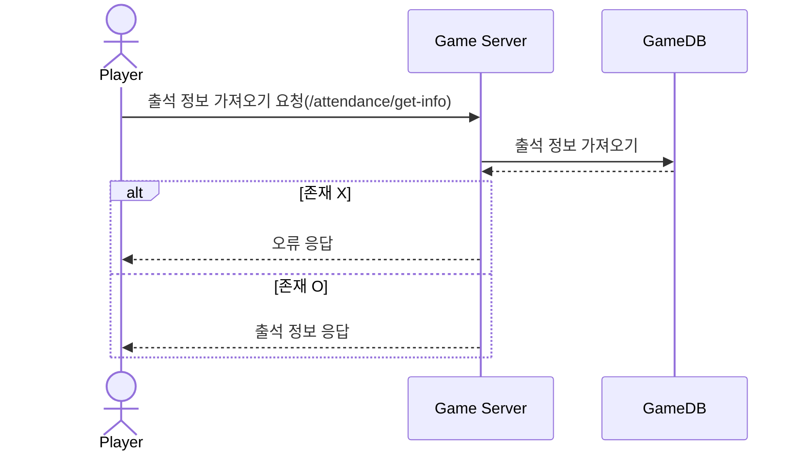
```mermaid
sequenceDiagram
	actor Player
	participant Game Server
  participant GameDB

	Player ->> Game Server : 출석 정보 가져오기 요청(/attendance/get-info) 
	Game Server ->> GameDB : 출석 정보 가져오기
	GameDB -->> Game Server : 
	alt 존재 X
		Game Server -->> Player : 오류 응답
	else 존재 O
		Game Server -->> Player : 출석 정보 응답
	end

```


------------------------------

## 출석 체크 요청
### : 플레이어가 출석 체크를 요청
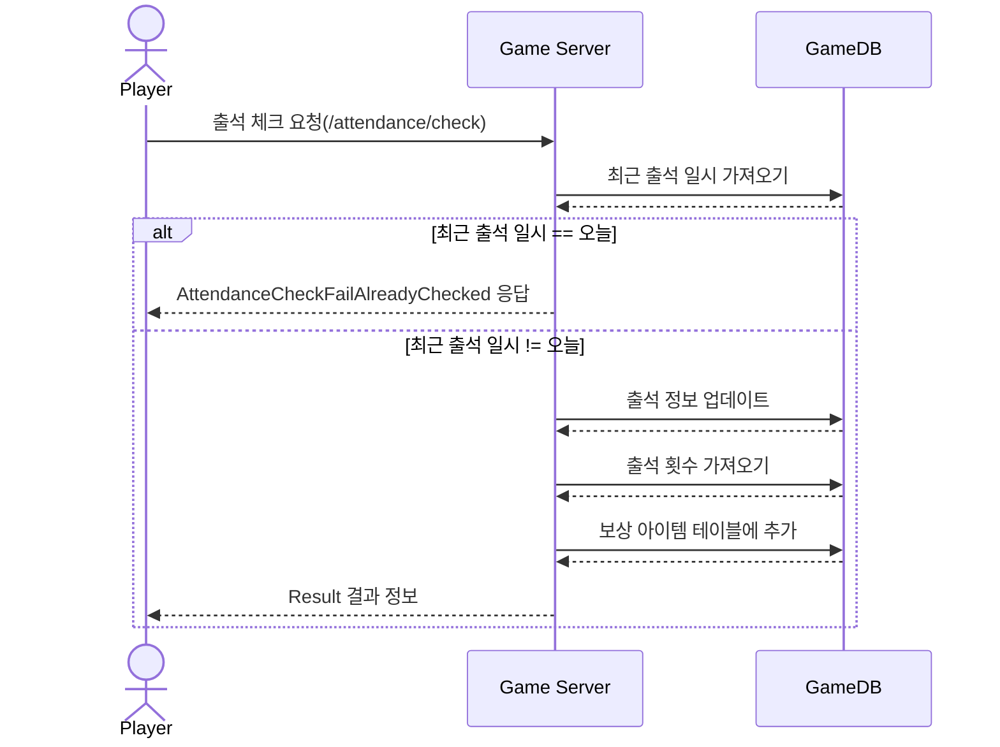
```mermaid
sequenceDiagram
	actor Player
	participant Game Server
  participant GameDB

	Player ->> Game Server : 출석 체크 요청(/attendance/check)
  Game Server ->> GameDB : 최근 출석 일시 가져오기
	GameDB -->> Game Server : 
  alt 최근 출석 일시 == 오늘
    Game Server -->> Player : AttendanceCheckFailAlreadyChecked 응답
  else 최근 출석 일시 != 오늘
	  Game Server ->> GameDB : 출석 정보 업데이트
	  GameDB -->> Game Server : 
	  Game Server ->> GameDB : 출석 횟수 가져오기
	  GameDB -->> Game Server : 
	  Game Server ->> GameDB : 보상 아이템 테이블에 추가
	  GameDB -->> Game Server :  
    Game Server -->> Player : Result 결과 정보
  end

```


------------------------------


================================================
File: SequenceDiagram/Friend.md
================================================
# 시퀀스 다이어그램 (Friend)

* 친구 목록 가져오기 (Get Friend List)
* 친구 신청 목록 가져오기 (Get Friend Request List)
* 친구 신청 (Friend Request)
* 친구 신청 수락하기 (Friend Request Accept)

------------------------------

## 친구 목록 가져오기
### 플레이어의 친구 목록 가져오는 요청 (Get Friend List)
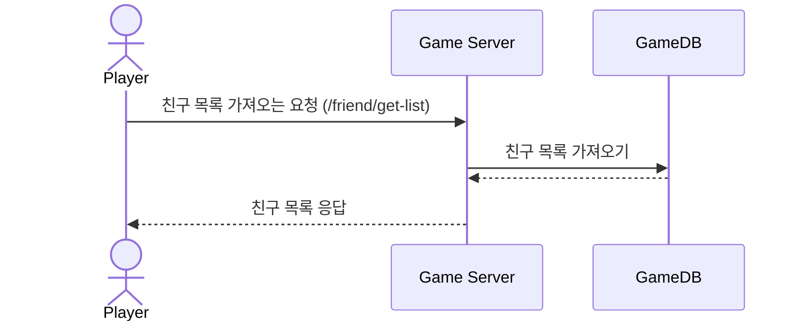
```mermaid
sequenceDiagram
	actor Player
	participant Game Server
  participant GameDB

	Player ->> Game Server : 친구 목록 가져오는 요청 (/friend/get-list)
	Game Server ->> GameDB : 친구 목록 가져오기
	GameDB -->> Game Server : 
	Game Server -->> Player : 친구 목록 응답

```


------------------------------

## 친구 신청 목록 가져오기
### 플레이어의 친구 신청 목록 가져오는 요청(받은 신청) (Get Friend Request List)
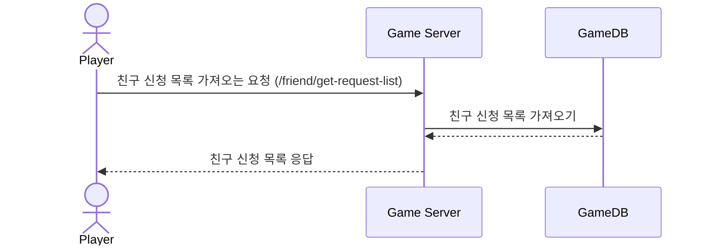
```mermaid
sequenceDiagram
	actor Player
	participant Game Server
  participant GameDB

	Player ->> Game Server : 친구 신청 목록 가져오는 요청 (/friend/get-request-list)
	Game Server ->> GameDB : 친구 신청 목록 가져오기
	GameDB -->> Game Server : 
	Game Server -->> Player : 친구 신청 목록 응답

```


------------------------------


## 친구 신청
### 플레이어가 친구 신청을 보내는 요청
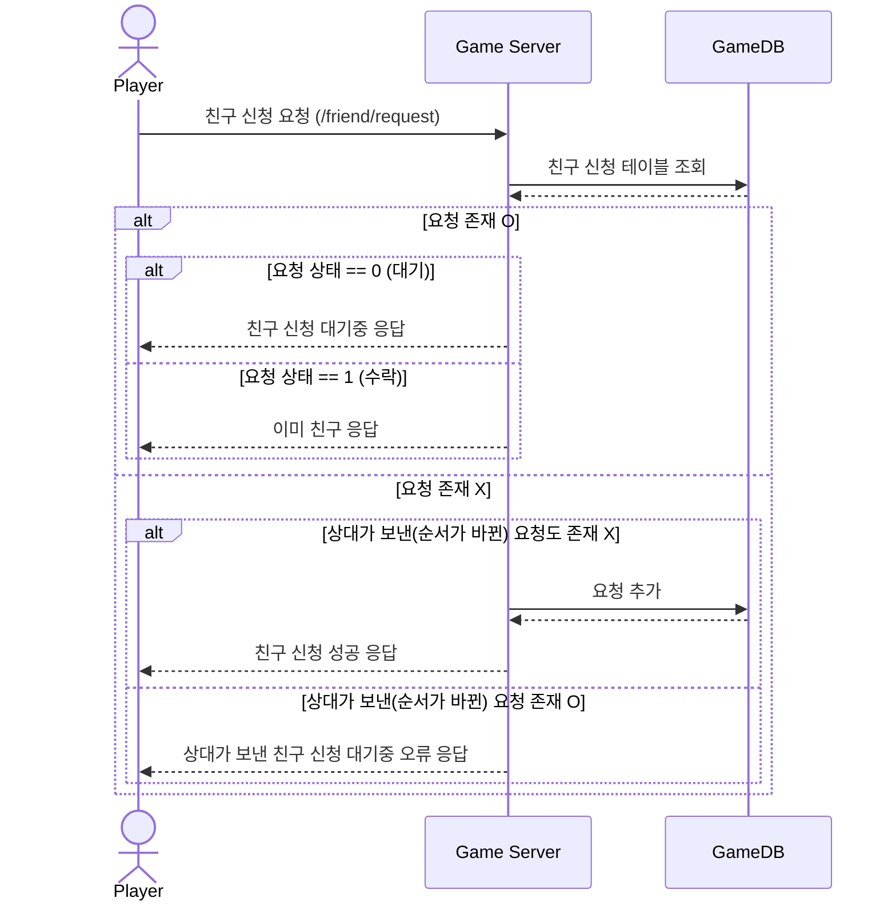
```mermaid
sequenceDiagram
	actor Player
	participant Game Server
  participant GameDB

	Player ->> Game Server : 친구 신청 요청 (/friend/request)
	Game Server ->> GameDB : 친구 신청 테이블 조회
	GameDB -->> Game Server : 

	alt 요청 존재 O
		alt 요청 상태 == 0 (대기)
			Game Server -->> Player : 친구 신청 대기중 응답
	
		else 요청 상태 == 1 (수락)
			Game Server -->> Player : 이미 친구 응답
		end
	
	else 요청 존재 X
		alt 상대가 보낸(순서가 바뀐) 요청도 존재 X
			Game Server ->> GameDB : 요청 추가
			GameDB -->> Game Server :  
			Game Server -->> Player : 친구 신청 성공 응답
		else 상대가 보낸(순서가 바뀐) 요청 존재 O
			Game Server -->> Player : 상대가 보낸 친구 신청 대기중 오류 응답
		end
	
	end

```


------------------------------


## 친구 신청 수락하기
### 플레이어가 받은 친구 신청을 수락하는 요청
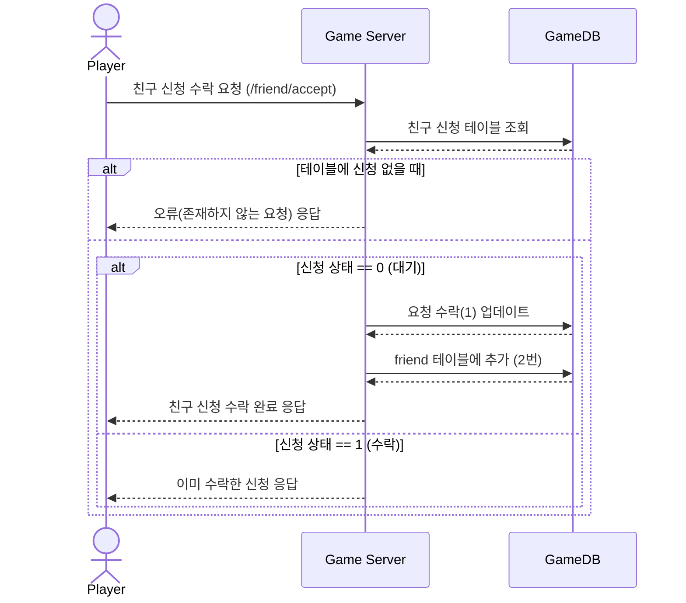
```mermaid
sequenceDiagram
	actor Player
	participant Game Server
  participant GameDB

	Player ->> Game Server : 친구 신청 수락 요청 (/friend/accept)
	Game Server ->> GameDB : 친구 신청 테이블 조회
	GameDB -->> Game Server : 
	
	alt 테이블에 신청 없을 때
		Game Server -->> Player : 오류(존재하지 않는 요청) 응답
	else
		alt 신청 상태 == 0 (대기)
			Game Server ->> GameDB : 요청 수락(1) 업데이트
			GameDB -->> Game Server :  

			Game Server ->> GameDB : friend 테이블에 추가 (2번)
			GameDB -->> Game Server :  
			
			Game Server -->> Player : 친구 신청 수락 완료 응답

		else 신청 상태 == 1 (수락)
			Game Server -->> Player : 이미 수락한 신청 응답
		end
	end

```


================================================
File: SequenceDiagram/GamePlay.md
================================================
# 시퀀스 다이어그램 (GamePlay)

------------------------------
## 게임 데이터 가져오는 요청 
### : 게임 데이터 가져오는 요청 (모든 플레이어) /gamePlay/omok-game-data
게임 데이터 = 오목 보드 정보 + 참가 플레이어 + 현재 턴 + 승자 등등


#### 요청하는 플레이어의 상태
* 기본적으로 LoadGameStateAsync() 라는 함수에서 게임 오목판을 비롯한 게임 데이터를 로드하고 있다.
  + 게임 첫 시작 시 : OnInitializedAsync()
  + 자기 차례 아닐 때 : 턴 상태 요청하면서 StartTurnPollingAsync()
    + 이때 자기 차례가 되었을 때 로드

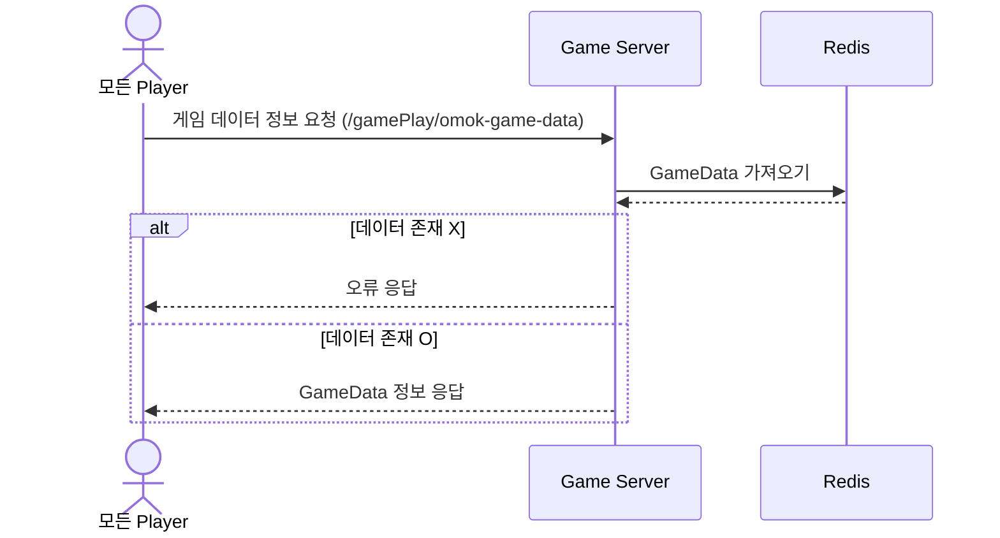
```mermaid
sequenceDiagram
	actor P as 모든 Player
	participant G as Game Server
  	participant R as Redis

	P ->> G: 게임 데이터 정보 요청 (/gamePlay/omok-game-data)
	G ->> R : GameData 가져오기
	R-->>G: 
	alt 데이터 존재 X
		G-->>P: 오류 응답
	else 데이터 존재 O
		G -->> P : GameData 정보 응답
	end
```

------------------------------


## 돌두기
### : 돌두기 (자기 차례 플레이어) 
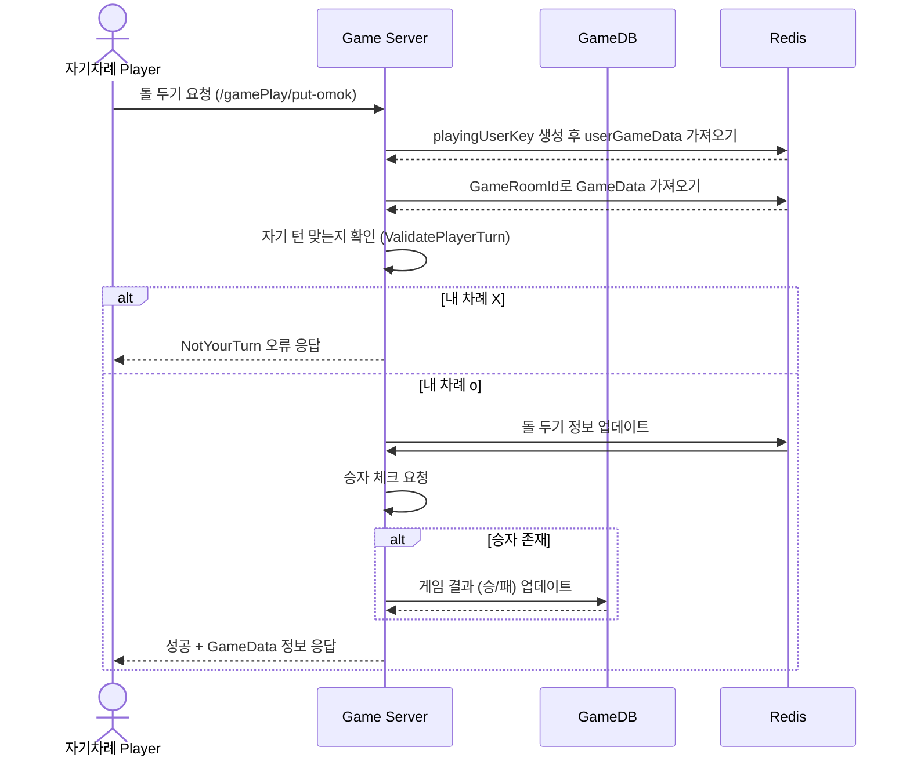
```mermaid
sequenceDiagram
	actor P as 자기차례 Player
	participant G as Game Server
	participant GD as GameDB
  	participant R as Redis

	P ->> G: 돌 두기 요청 (/gamePlay/put-omok)
	G ->> R : playingUserKey 생성 후 userGameData 가져오기
	R -->> G :  
  	G ->> R : GameRoomId로 GameData 가져오기
  	R -->> G: 

	G ->> G : 자기 턴 맞는지 확인 (ValidatePlayerTurn)
	alt 내 차례 X
		G-->>P: NotYourTurn 오류 응답
	else 내 차례 o
		G ->> R : 돌 두기 정보 업데이트
		R ->> G :  
	
		G ->> G : 승자 체크 요청
		alt 승자 존재
		  G ->> GD : 게임 결과 (승/패) 업데이트
		  GD -->> G :   
		end
	
	  	G -->> P : 성공 + GameData 정보 응답
	end
```

------------------------------

## 돌두기 포기 요청 (자기 차례 플레이어)
### : 돌두기 포기 요청 (자기 차례 플레이어) 
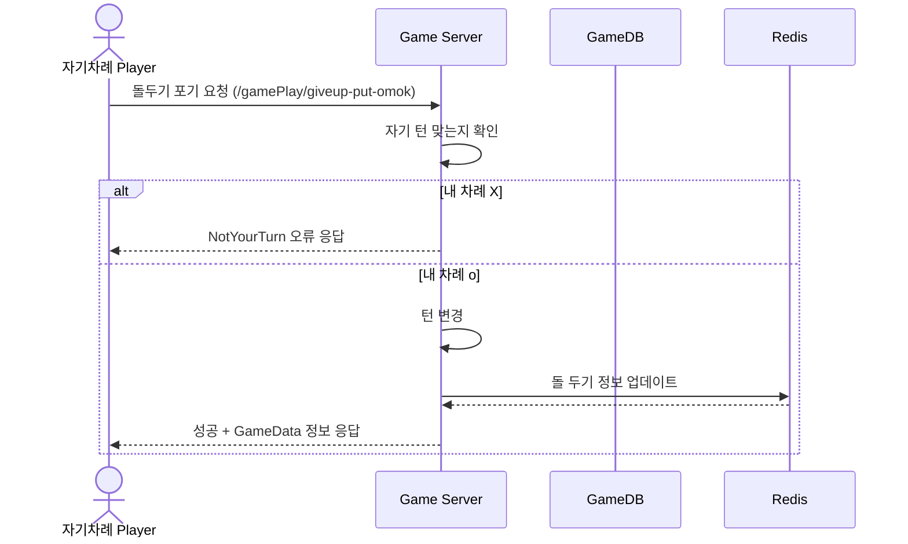
```mermaid
sequenceDiagram
	actor P as 자기차례 Player
	participant G as Game Server
	participant GD as GameDB
  	participant R as Redis

	P ->> G : 돌두기 포기 요청 (/gamePlay/giveup-put-omok)
	G ->> G : 자기 턴 맞는지 확인
	alt 내 차례 X
		G-->>P: NotYourTurn 오류 응답
	else 내 차례 o
		G ->> G : 턴 변경
		G ->> R : 돌 두기 정보 업데이트
		R -->> G :  
	  	G -->> P : 성공 + GameData 정보 응답
	end

```


------------------------------

## 현재 턴 상태 요청 (차례 대기 플레이어) 1초마다 요청
### : 현재 턴 상태 요청 (차례 대기 플레이어) 1초마다 요청 /gamePlay/turn-checking

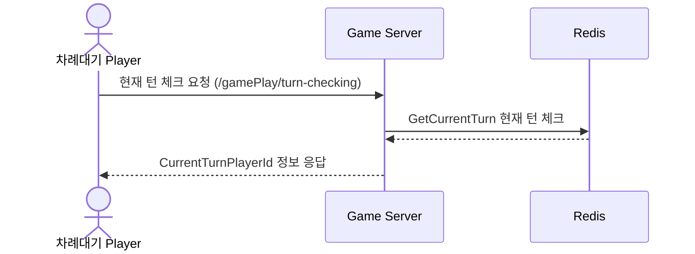
```mermaid
sequenceDiagram
	actor P as 차례대기 Player
	participant G as Game Server
  	participant R as Redis

	P ->> G : 현재 턴 체크 요청 (/gamePlay/turn-checking)
	G ->> R : GetCurrentTurn 현재 턴 체크
  	R -->> G : 
  	G -->> P : CurrentTurnPlayerId 정보 응답

```


------------------------------


================================================
File: SequenceDiagram/Item.md
================================================
# 시퀀스 다이어그램 (Item)

------------------------------

## 플레이어의 아이템(인벤토리) 목록 가져오는 요청
### : 플레이어의 아이템 데이터 가져오는 요청 /GetPlayerItems
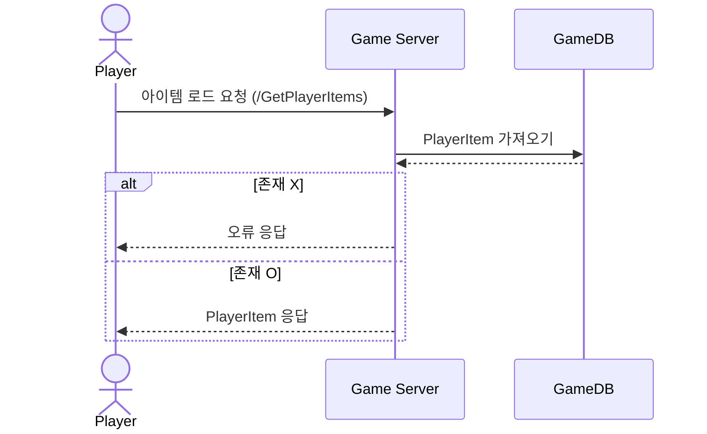
```mermaid
sequenceDiagram
	actor Player
	participant Game Server
  participant GameDB

	Player ->> Game Server : 아이템 로드 요청 (/GetPlayerItems)
	Game Server ->> GameDB : PlayerItem 가져오기
	GameDB -->> Game Server : 
	alt 존재 X
		Game Server -->> Player : 오류 응답
	else 존재 O
		Game Server -->> Player : PlayerItem 응답
	end
```


------------------------------


================================================
File: SequenceDiagram/MailBox.md
================================================
# 시퀀스 다이어그램 (MailBox)


## 플레이어의 우편함 목록을 가져오는 요청
### : 플레이어의 우편함 리스트를 가져오는 요청 /mail/get-mailbox
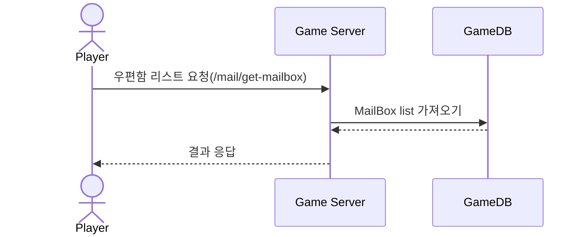
```mermaid
sequenceDiagram
	actor Player
	participant Game Server
  participant GameDB

	Player ->> Game Server : 우편함 리스트 요청(/mail/get-mailbox)
	Game Server ->> GameDB : MailBox list 가져오기
	GameDB -->> Game Server : 
	Game Server -->> Player : 결과 응답
```


------------------------------

## 플레이어가 우편함에서 우편을 열어보는 요청 (우편 내용 보기)
### : 플레이어가 자신의 우편함에서 우편을 읽는 요청 /mail/read
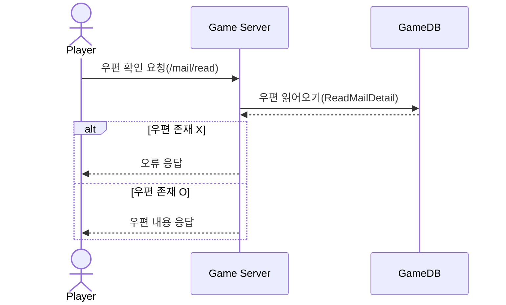
```mermaid
sequenceDiagram
	actor Player
	participant Game Server
  	participant GameDB

	Player ->> Game Server : 우편 확인 요청(/mail/read)
	Game Server ->> GameDB : 우편 읽어오기(ReadMailDetail)
	GameDB -->> Game Server : 
	alt 우편 존재 X
		Game Server -->> Player : 오류 응답
	else 우편 존재 O
		Game Server -->> Player : 우편 내용 응답
	end
```


------------------------------

## 플레이어가 우편 속 아이템을 수령하는 요청
### : 플레이어가 우편 속 아이템을 수령하는 요청 /mail/receive-item
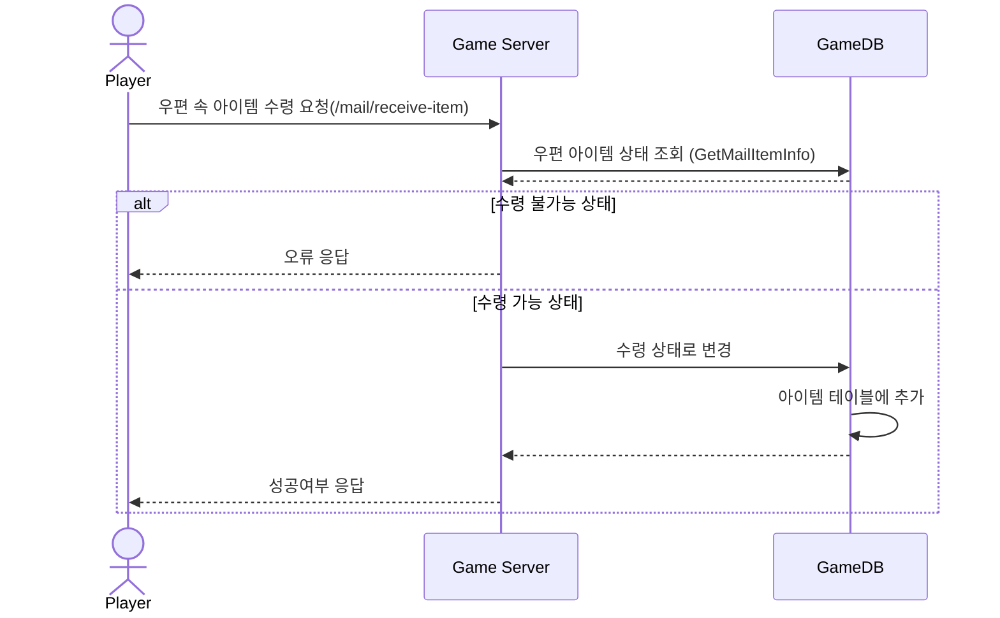
```mermaid
sequenceDiagram
	actor Player
	participant Game Server
  	participant GameDB

	Player ->> Game Server : 우편 속 아이템 수령 요청(/mail/receive-item)
	Game Server ->> GameDB : 우편 아이템 상태 조회 (GetMailItemInfo)
	GameDB -->> Game Server : 
	alt 수령 불가능 상태
		Game Server -->> Player : 오류 응답
	else 수령 가능 상태
		Game Server ->> GameDB : 수령 상태로 변경
		GameDB ->> GameDB : 아이템 테이블에 추가
		GameDB -->> Game Server : 
		
		Game Server -->> Player : 성공여부 응답
	end
```


------------------------------

## 플레이어가 우편을 삭제하는 요청
### : 플레이어가 우편을 삭제하는 요청 /mail/delete
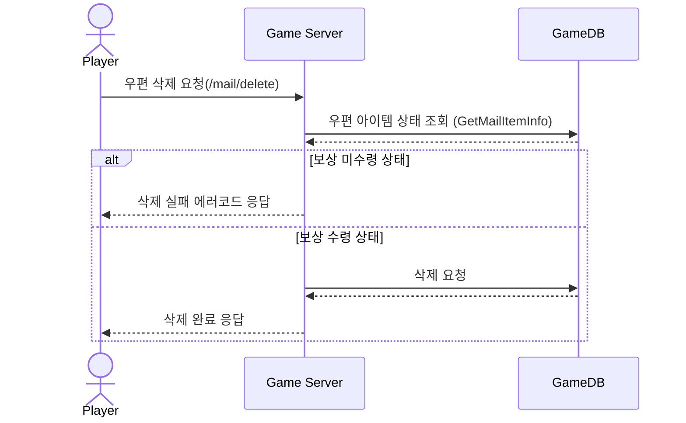
```mermaid
sequenceDiagram
	actor Player
	participant Game Server
  	participant GameDB

	Player ->> Game Server : 우편 삭제 요청(/mail/delete)
	Game Server ->> GameDB : 우편 아이템 상태 조회 (GetMailItemInfo)
	GameDB -->> Game Server :  
	alt 보상 미수령 상태 
		Game Server -->> Player : 삭제 실패 에러코드 응답

	else 보상 수령 상태
		Game Server ->> GameDB : 삭제 요청
		GameDB -->> Game Server:  
		Game Server -->> Player : 삭제 완료 응답
	end
```

--------------------------------


================================================
File: SequenceDiagram/Match.md
================================================
# 시퀀스 다이어그램 (Match)
------------------------------
## 매칭 시작 요청
### : 매칭 시작 요청 /requestMatching

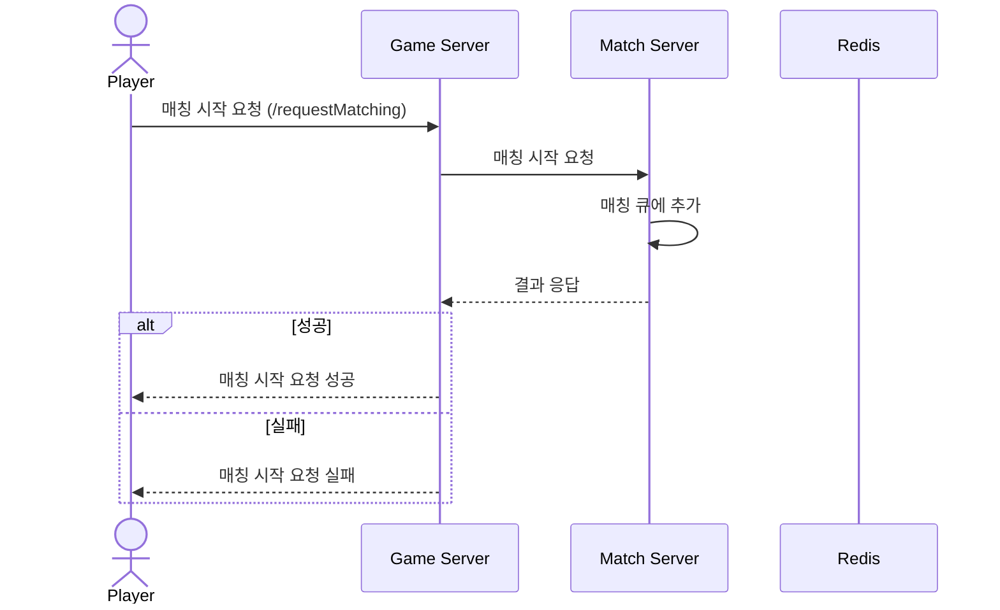
```mermaid
sequenceDiagram
	actor P as Player
	participant G as Game Server
	participant M as Match Server
	participant R as Redis

	P->>G: 매칭 시작 요청 (/requestMatching)
	G->>M: 매칭 시작 요청
	M->>M: 매칭 큐에 추가

	M-->>G: 결과 응답
	alt 성공
		G-->>P: 매칭 시작 요청 성공
	else 실패
		G-->>P: 매칭 시작 요청 실패
	end

```

------------------------------

## 매칭 완료 여부 체크 (매칭 될 때까지 1초마다 요청)
### : 매칭 완료 여부 체크 (매칭 될 때까지 1초마다 요청) /checkMatching
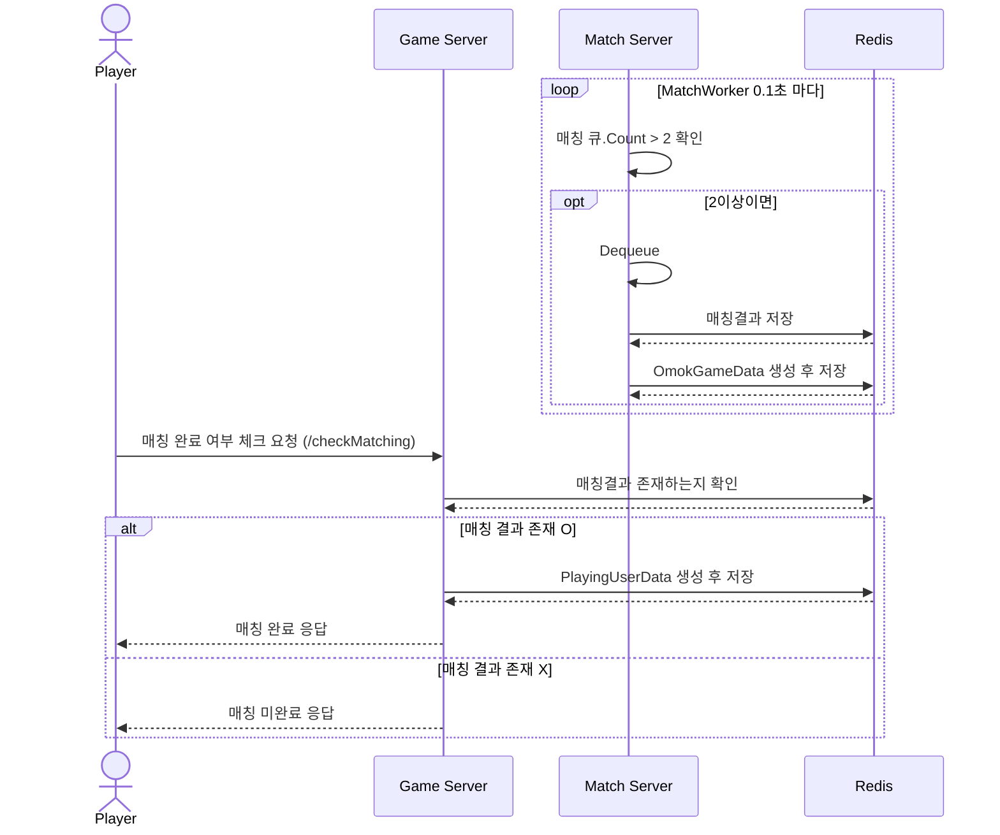
```mermaid
sequenceDiagram
	actor P as Player
	participant G as Game Server
	participant M as Match Server
	participant R as Redis

	loop MatchWorker 0.1초 마다
		M->>M: 매칭 큐.Count > 2 확인
			opt 2이상이면
				M->>M: Dequeue
				M->>R: 매칭결과 저장
				R-->>M: 
				M->>R: OmokGameData 생성 후 저장
				R-->>M: 
			end
	end

	P->>G: 매칭 완료 여부 체크 요청 (/checkMatching)
	G->>R: 매칭결과 존재하는지 확인
	R-->>G: 
	alt 매칭 결과 존재 O
		G->>R: PlayingUserData 생성 후 저장
		R-->>G:  

		G-->>P: 매칭 완료 응답
	
	else 매칭 결과 존재 X
		G-->>P: 매칭 미완료 응답
	end

```

------------------------------


================================================
File: SequenceDiagram/PlayerInfo.md
================================================
# 시퀀스 다이어그램 (PlayerInfo)

------------------------------

## 플레이어 기본 데이터 가져오는 요청
### : 플레이어 기본 데이터 가져오는 요청 (닉네임, 레벨, 경험치, 승, 패, 무)
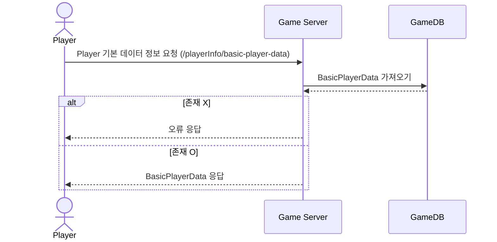
```mermaid
sequenceDiagram
	actor Player
	participant Game Server
  	participant GameDB

	Player ->> Game Server : Player 기본 데이터 정보 요청 (/playerInfo/basic-player-data)
	Game Server ->> GameDB : BasicPlayerData 가져오기
	GameDB -->> Game Server : 
	alt 존재 X
		Game Server -->> Player : 오류 응답
	else 존재 O
		Game Server -->> Player : BasicPlayerData 응답
	end
```


------------------------------


## 닉네임 변경 요청 
### : 닉네임 변경 요청 
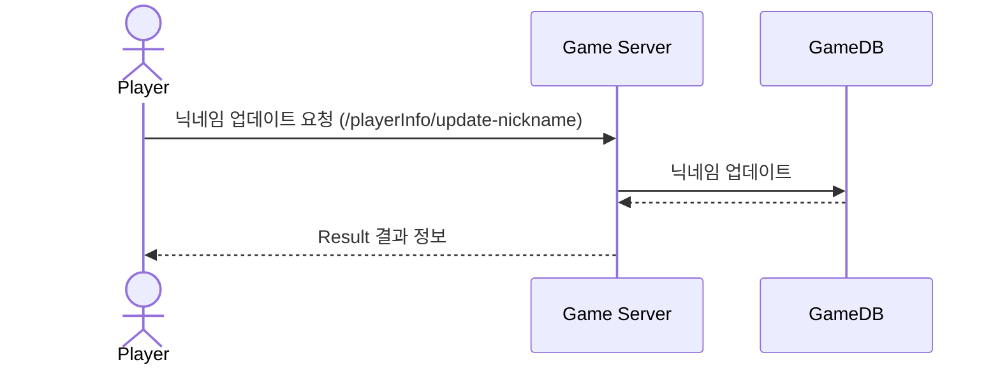
```mermaid
sequenceDiagram
	actor Player
	participant Game Server
  	participant GameDB

	Player ->> Game Server : 닉네임 업데이트 요청 (/playerInfo/update-nickname)
	Game Server ->> GameDB : 닉네임 업데이트
	GameDB -->> Game Server :  
	Game Server -->> Player : Result 결과 정보

```


------------------------------


================================================
File: SequenceDiagram/Register-Login.md
================================================
# 시퀀스 다이어그램 (Register-Login)
## 계정 생성 요청
### : 계정 생성 요청 /register

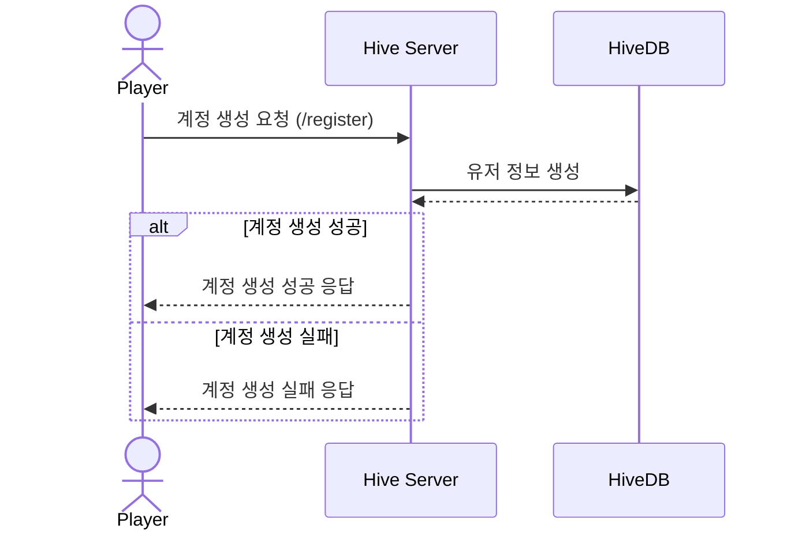
```mermaid
sequenceDiagram
	actor P as Player
	participant H as Hive Server
	participant HD as HiveDB

	P ->> H: 계정 생성 요청 (/register)
	H ->> HD : 유저 정보 생성
	HD -->> H : 
	alt 계정 생성 성공
  		H -->> P: 계정 생성 성공 응답
	else 계정 생성 실패
  		H -->> P: 계정 생성 실패 응답
	end
```

## 로그인 요청
### : 로그인 요청 /login
```mermaid
sequenceDiagram
	actor P as Player
	participant HD as HiveDB
	participant H as Hive Server
	participant G as Game Server
	participant GD as GameDB
	participant R as Redis
	
	P ->> H: 하이브 로그인 요청 (/login)
  	H ->> HD : 회원 정보 요청
  	HD -->> H : 

	alt 하이브 로그인 성공
		H ->> HD : ID와 토큰 저장
		HD -->> H : 
		H -->> P : 하이브 로그인 성공 응답(고유번호와 토큰) 
	else 하이브 로그인 실패
		H -->> P : 하이브 로그인 실패 응답
	end

	P ->> G : ID와 토큰을 통해 게임 로그인 요청 (/login)
	G ->> H : 토큰 유효성 확인 요청 (/VerifyToken)
	H ->> HD : ID와 토큰 정보 확인
	HD -->> H :  
	H -->> G : 토큰 유효 여부 응답

	alt 토큰 유효 O
		opt 첫 로그인이면
			G ->> GD : "플레이어 기본 게임 데이터" 생성
			GD -->> G : 
			G ->> GD : "초기 아이템 데이터" 생성
			GD -->> G : 
			G ->> GD : "초기 출석 데이터" 생성
			GD -->> G :  
		end

		G ->> R : LoginUerKey로 PlayerUid, Token, App/DataVersion 저장
	  	R -->> G :  

		G -->> P : 로그인 성공 응답
	else 토큰 유효 X
		G -->> P : 로그인 실패 응답
	end


```


================================================
File: ServerShared/ErrorCode.cs
================================================
using System;

namespace ServerShared;

// SYJ: 모든 ErrorCode 중복 사용 X = 유니크해야 함!

// 1000 ~ 19999
public enum ErrorCode : UInt16
{
    None = 0,

    // Common 1000 ~
    UnhandleException = 1001,
    RedisFailException = 1002,
    InValidRequestHttpBody = 1003,
    TokenDoesNotExist = 1004,
    UidDoesNotExist = 1005,
    AuthTokenFailWrongAuthToken = 1006,
    Hive_Fail_InvalidResponse = 1010,
    InValidAppVersion = 1011,
    InvalidMasterDataVersion = 1012,
    InvalidResponseFormat = 1013,
    ServerError = 1014,
    JsonParsingError = 1015,
    InternalError = 1020, // HttpRequestException 및 JsonException 이외의 모든 예기치 않은 오류
    InternalServerError = 1021, 
    InvalidRequest = 1030,
    MissingHeader = 1040,

    // Auth 2000 ~
    CreateUserFailException = 2001,
    CreateUserFailNoNickname = 2002,
    CreateUserFailDuplicateNickname = 2003,
    LoginFailException = 2004,
    LoginFailUserNotExist = 2005,
    LoginFailPwNotMatch = 2006,
    LoginFailSetAuthToken = 2007,
    LoginUpdateRecentLoginFail = 2008,
    LoginUpdateRecentLoginFailException = 2009,
    AuthTokenMismatch = 2010,
    AuthTokenKeyNotFound = 2011,
    AuthTokenFailWrongKeyword = 2012,
    AccountIdMismatch = 2014,
    DuplicatedLogin = 2015,
    CreateUserFailInsert = 2016,
    LoginFailAddRedis = 2017,
    CheckAuthFailNotExist = 2018,
    CheckAuthFailNotMatch = 2019,
    CheckAuthFailException = 2020,
    LogoutRedisDelFail = 2021,
    LogoutRedisDelFailException = 2022,
    DeleteAccountFail = 2023,
    DeleteAccountFailException = 2024,
    InitNewUserGameDataFailException = 2025,
    InitNewUserGameDataFailCharacter = 2026,
    InitNewUserGameDataFailGameList = 2027,
    InitNewUserGameDataFailMoney = 2028,
    InitNewUserGameDataFailAttendance = 2029,
    InvalidAppVersion = 2030,
    InvalidDataVersion = 2031,
    AuthTokenFailSetNx = 2032,
    AuthTokenFailDelNx = 2033,
    PlayerIdMismatch = 2034,

    // Match Error 2050
    UpdateStartGameDataFailException = 2050,

    // Friend 2100
    ReqFriendFailPlayerNotExist = 2101,
    FriendRequestAlreadyPending = 2102,
    ReverseFriendRequestPending = 2103,
    AlreadyFriends = 2104,
    FriendRequestNotFound = 2105,

    FriendGetListFailOrderby = 2106,
    FriendGetListFailException = 2107,
    FriendGetRequestListFailException = 2108,
    FriendDeleteFailNotFriend = 2109,
    FriendDeleteFailDelete = 2110,
    FriendDeleteFailException = 2111,
    FriendDeleteFailSameUid = 2112,
    FriendDeleteReqFailNotFriend = 2113,
    FriendDeleteReqFailDelete = 2114,
    FriendDeleteReqFailException = 2115,
    FriendAcceptFailException = 2116,
    FriendAcceptFailSameUid = 2117,
    AcceptFriendRequestFailUserNotExist = 2118,
    AcceptFriendRequestFailAlreadyFriend = 2119,
    AcceptFriendRequestFailException = 2120,
    FriendSendReqFailNeedAccept = 2121,

    // Game 2200
    MiniGameListFailException = 2201,
    GameSetNewUserListFailException = 2202,
    GameSetNewUserListFailInsert = 2203,
    MiniGameUnlockFailInsert = 2204,
    MiniGameUnlockFailException = 2205,
    MiniGameInfoFailException = 2206,
    MiniGameSaveFailException = 2207,
    MiniGameSaveFailGameLocked = 2208,
    MiniGameUnlockFailAlreadyUnlocked = 2209,
    MiniGameSetPlayCharFailUpdate = 2210,
    MiniGameSetPlayCharFailException = 2211,
    MiniGameSaveFailFoodDecrement = 2212,

    SetUserScoreFailException = 2301,
    GetRankingFailException = 2302,
    GetUserRankFailException = 2303,

    GameDataNotFound = 2400,
    GameRoomNotFound = 2402,
    GameBoardNotFound = 2403,
    GameBlackNotFound = 2404,
    GameWhiteNotFound = 2405,
    GameTurnNotFound = 2406,
    GameTurnPlayerNotFound = 2407,
    PlayerGameDataNotFound = 2401,

    GameEnd = 2500,
    GameAlreadyEnd = 2501,
    UpdateGameDataFailException = 2502,
    UpdateGameResultFail = 2503,
    NotYourTurn = 2513,
    RequestTurnEnd = 2515,
    ChangeTurnFailNotYourTurn = 2516,
    TurnChangedByTimeout = 2520,

    SetStoneFailException = 2531,
    InvalidOperationException = 2532,


    // Item 3000 ~
    CharReceiveFailInsert = 3011,
    CharReceiveFailLevelUP = 3012,
    CharReceiveFailIncrementCharCnt = 3013,
    CharReceiveFailException = 3014,
    CharListFailException = 3015,
    CharNotExist = 3016,
    CharSetCostumeFailUpdate = 3017,
    CharSetCostumeFailException = 3018,

    SkinReceiveFailAlreadyOwn = 3021,
    SkinReceiveFailInsert = 3022,
    SkinReceiveFailException = 3023,
    SkinListFailException = 3024,

    CostumeReceiveFailInsert = 3031,
    CostumeReceiveFailLevelUP = 3032,
    CostumeReceiveFailIncrementCharCnt = 3033,
    CostumeReceiveFailException = 3034,
    CostumeListFailException = 3035,
    CharSetCostumeFailHeadNotExist = 3036,
    CharSetCostumeFailFaceNotExist = 3037,
    CharSetCostumeFailHandNotExist = 3038,

    FoodReceiveFailInsert = 3041,
    FoodReceiveFailIncrementFoodQty = 3042,
    FoodReceiveFailException = 3043,
    FoodListFailException = 3044,
    FoodGearReceiveFailInsert = 3045,
    FoodGearReceiveFailIncrementFoodGear = 3046,
    FoodGearReceiveFailException = 3047,

    GachaReceiveFailException = 3051,


    // GameDb 4000 ~ 
    GetGameDbConnectionFail = 4002,
    AddFirstItemsForPlayerFail = 4003,
    CreatePlayerInfoDataAndStartItemsFail = 4004,
    GameDatabaseError = 4010,

    // PlayerInfo 4500 ~
    PlayerNotFound = 4501,
    UpdatePlayerNickNameFailed = 4502,
    
    PlayerUidNotFound = 4551,


    // Redis 4700 ~
    RedisException = 4701,
    InValidPlayerUidError = 4710, 

    // MasterDb 5000 ~
    MasterDB_Fail_LoadData = 5001,
    MasterDB_Fail_InvalidData = 5002,
    FailToLoadAppVersionInMasterDb = 5003,

    // User
    UserInfoFailException = 6001,
    UserMoneyInfoFailException = 6002,
    UserUpdateJewelryFailIncremnet = 6003,
    SetMainCharFailException = 6004,
    GetOtherUserInfoFailException = 6005,
    UserNotExist = 6006,

    // Mail
    MailListFailException = 8001,
    MailReceiveFailException = 8002,
    MailReceiveFailAlreadyReceived = 8003,
    MailReceiveFailMailNotExist = 8004,
    MailReceiveFailUpdateReceiveDt = 8005,
    MailRewardListFailException = 8006,
    MailDeleteFailDeleteMail = 8007,
    MailDeleteFailDeleteMailReward = 8008,
    MailDeleteFailException = 8009,
    MailReceiveFailNotMailOwner = 8010,
    MailReceiveRewardsFailException = 8011,
    MailNotFound = 8020,
    FailToDeleteMailItemNotReceived = 8021,
    FailToReadMailDetail = 8022,

    // Attendance
    AttendanceInfoNotFound = 9000,
    AttendanceInfoFailException = 9001,
    AttendanceCheckFailAlreadyChecked = 9002,
    AttendanceCheckFailException = 9003,

    GetRewardFailException = 9004,
}


================================================
File: ServerShared/KeyGenerator.cs
================================================
using System;
using System.Collections.Generic;
using System.Text;

namespace ServerShared;

public class KeyGenerator
{
    public static string MatchResult(string playerId)
    {
        return $"M_{playerId}_Result";
    }

    public static string InGamePlayerInfo(string playerId)
    {
        return $"GP_{playerId}_Info";
    }
    public static string PlayerLogin(string playerId)
    {
        return $"U_{playerId}_Login";
    }

    public static string GameRoomId()
    {
        return Guid.NewGuid().ToString(); // SYJ Ulid 확인 후, 바꾸기
    }
    public static string UserLockKey(string playerId)
    {
        return $"user_lock:{playerId}";
    }
}


================================================
File: ServerShared/Omok.cs
================================================
using System.Text;

namespace ServerShared;

public enum OmokStone
{
    None,
    Black,
    White
}

public class OmokGameEngine
{
    public const int BoardSize = 15;
    public const int BoardSizeSquare = BoardSize * BoardSize;

    const byte BlackStone = 1;
    const byte WhiteStone = 2;

    // 오목판 정보 BoardSize * BoardSize
    byte[] _rawData;

    string _blackPlayer;
    string _whitePlayer;


    OmokStone _turnPlayerStone;
    UInt64 _turnTimeMilli;
    OmokStone _winner;


    public byte[] GetRawData()
    {
        return _rawData;
    }

    public byte[] MakeRawData(string blackPlayer, string whitePlayer)
    {
        _blackPlayer = blackPlayer;
        _whitePlayer = whitePlayer;

        // 플레이어 이름의 길이를 동적으로 계산
        var blackPlayerBytes = Encoding.UTF8.GetBytes(blackPlayer);
        var whitePlayerBytes = Encoding.UTF8.GetBytes(whitePlayer);

        // 데이터 크기 계산
        int rawDataSize = BoardSizeSquare + // 오목판 정보
                          1 + blackPlayerBytes.Length + // 흑돌 플레이어 이름 (길이 1 바이트 + 실제 이름 데이터)
                          1 + whitePlayerBytes.Length + // 백돌 플레이어 이름 (길이 1 바이트 + 실제 이름 데이터)
                          1 + // 현재 턴 정보
                          8 + // 턴 시작 시각 (돌 둔 시간)
                          1;  // 이긴 사람 정보

        var rawData = new byte[rawDataSize];
        var index = 0;

        // 1. 오목판 정보 초기화 (모두 0)
        for (int i = 0; i < BoardSizeSquare; i++)
        {
            rawData[index++] = (byte)OmokStone.None;
        }

        // 2. 흑돌 플레이어 이름 저장
        rawData[index++] = (byte)blackPlayerBytes.Length;
        Array.Copy(blackPlayerBytes, 0, rawData, index, blackPlayerBytes.Length);
        index += blackPlayerBytes.Length;

        // 3. 백돌 플레이어 이름 저장
        rawData[index++] = (byte)whitePlayerBytes.Length;
        Array.Copy(whitePlayerBytes, 0, rawData, index, whitePlayerBytes.Length);
        index += whitePlayerBytes.Length;

        // 4. 현재 턴 정보 저장 (초기값 0)
        rawData[index++] = (byte)OmokStone.None;

        // 5. 턴 시간 저장 (초기값 현재 시간)
        var turnTime = BitConverter.GetBytes((UInt64)DateTimeOffset.UtcNow.ToUnixTimeSeconds());
        Array.Copy(turnTime, 0, rawData, index, turnTime.Length);
        index += turnTime.Length;

        // 6. 이긴 사람 정보 저장 (초기값 0)
        rawData[index++] = (byte)OmokStone.None;

        _rawData = rawData;
        StartGame();

        return _rawData;
    }

    public OmokStone GetStoneAt(int x, int y)
    {
        int index = y * BoardSize + x;
        return (OmokStone)_rawData[index];
    }

    public OmokStone GetCurrentTurn()
    {
        int index = BoardSizeSquare + 1 + GetBlackPlayerId().Length + 1 + GetWhitePlayerId().Length;
        return (OmokStone)_rawData[index];
    }

    public string GetBlackPlayerId()
    {
        int index = BoardSizeSquare;
        int length = _rawData[index];
        index += 1;
        return Encoding.UTF8.GetString(_rawData, index, length);
    }

    public string GetWhitePlayerId()
    {
        int index = BoardSizeSquare;
        int blackPlayerIdLength = _rawData[index];
        index += 1 + blackPlayerIdLength;
        int whitePlayerIdLength = _rawData[index];
        index += 1;
        return Encoding.UTF8.GetString(_rawData, index, whitePlayerIdLength);
    }

    public string GetCurrentTurnPlayerId()
    {
        return GetCurrentTurn() == OmokStone.Black ? GetBlackPlayerId() : GetWhitePlayerId();
    }

    public UInt64 GetTurnTime()
    {
        int index = BoardSizeSquare + 1 + GetBlackPlayerId().Length + 1 + GetWhitePlayerId().Length + 1;
        return BitConverter.ToUInt64(_rawData, index);
    }

    public OmokStone GetWinnerStone()
    {
        int index = BoardSizeSquare + 1 + GetBlackPlayerId().Length + 1 + GetWhitePlayerId().Length + 1 + 8;
        return (OmokStone)_rawData[index];
    }

    public string GetWinnerPlayerId()
    {
        var winner = GetWinnerStone();
        if (winner == OmokStone.None)
            return null;
        return winner == OmokStone.Black ? GetBlackPlayerId() : GetWhitePlayerId();
    }

    public (string winnerPlayerId, string loserPlayerId) GetWinnerAndLoser()
    {
        var winnerStone = GetWinnerStone();
        if (winnerStone == OmokStone.None)
        {
            return (null, null);
        }

        string winnerPlayerId;
        string loserPlayerId;

        if (winnerStone == OmokStone.Black)
        {
            winnerPlayerId = GetBlackPlayerId();
            loserPlayerId = GetWhitePlayerId();
        }
        else
        {
            winnerPlayerId = GetWhitePlayerId();
            loserPlayerId = GetBlackPlayerId();
        }

        return (winnerPlayerId, loserPlayerId);
    }

    public void Decoding(byte[] rawData)
    {
        _rawData = rawData;

        DecodingUserName();
        DecodingTurnAndTime();
        DecodingWinner();
    }
    public void StartGame()
    {
        if (_blackPlayer == null || _whitePlayer == null)
        {
            throw new InvalidOperationException("Players are not set.");
        }

        _turnPlayerStone = OmokStone.Black;
        _turnTimeMilli = (UInt64)DateTimeOffset.UtcNow.ToUnixTimeSeconds();
        int turnIndex = BoardSizeSquare + 1 + _blackPlayer.Length + 1 + _whitePlayer.Length;
        _rawData[turnIndex] = (byte)OmokStone.Black;

        var turnTimeBytes = BitConverter.GetBytes(_turnTimeMilli);
        Array.Copy(turnTimeBytes, 0, _rawData, turnIndex + 1, turnTimeBytes.Length);
    }

    public void SetStone(string playerId, int x, int y)
    {
        // 현재 턴인 플레이어 이름 확인
        string currentTurnPlayerId = GetCurrentTurnPlayerId();
        if (currentTurnPlayerId != playerId)
        {
            throw new InvalidOperationException("Not the player's turn.");
        }

        // 돌이 이미 놓여진 위치인지 확인
        int index = y * BoardSize + x;
        if (_rawData[index] != (byte)OmokStone.None)
        {
            throw new InvalidOperationException("The position is already occupied.");
        }

        // 돌 두기
        bool isBlack = playerId == GetBlackPlayerId();
        _rawData[index] = (byte)(isBlack ? OmokStone.Black : OmokStone.White);

        // 턴 변경
        _turnPlayerStone = isBlack ? OmokStone.White : OmokStone.Black;
        int turnIndex = BoardSizeSquare + 1 + _blackPlayer.Length + 1 + _whitePlayer.Length;
        _rawData[turnIndex] = (byte)_turnPlayerStone;

        // 턴 둔 시간 변경
        _turnTimeMilli = (UInt64)DateTimeOffset.UtcNow.ToUnixTimeSeconds();
        var turnTimeBytes = BitConverter.GetBytes(_turnTimeMilli);
        Array.Copy(turnTimeBytes, 0, _rawData, turnIndex + 1, turnTimeBytes.Length);

        // 오목 승리 조건 체크하는 함수
        OmokCheck();
    }

    public void OmokCheck() // 결과 체크
    {
        for (int y = 0; y < BoardSize; y++)
        {
            for (int x = 0; x < BoardSize; x++)
            {
                var stone = GetStoneAt(x, y);
                if (stone == OmokStone.None)
                    continue;

                if (CheckDirection(x, y, 1, 0, stone) || // 가로 방향 체크
                    CheckDirection(x, y, 0, 1, stone) || // 세로 방향 체크
                    CheckDirection(x, y, 1, 1, stone) || // 대각선 방향 체크 (↘)
                    CheckDirection(x, y, 1, -1, stone))  // 대각선 방향 체크 (↗)
                {
                    _winner = stone;
                    int winnerIndex = BoardSizeSquare + 1 + _blackPlayer.Length + 1 + _whitePlayer.Length + 1 + 8;
                    _rawData[winnerIndex] = (byte)stone;
                    
                    return;
                }
            }
        }
    }

    private bool CheckDirection(int startX, int startY, int dx, int dy, OmokStone stone)
    {
        int count = 1;
        for (int step = 1; step < 5; step++)
        {
            int x = startX + step * dx;
            int y = startY + step * dy;

            if (x < 0 || x >= BoardSize || y < 0 || y >= BoardSize)
                break;

            if (GetStoneAt(x, y) == stone)
            {
                count++;
            }
            else
            {
                break;
            }
        }

        return count >= 5;
    }

    public (ErrorCode errorCode, byte[] rawData) ChangeTurn(byte[] rawData, string playerId) 
    {
        Decoding(rawData);

        // 현재 턴인 플레이어 이름 확인
        string currentTurnPlayerId = GetCurrentTurnPlayerId();
        
        if (currentTurnPlayerId != playerId)
        {
            return (ErrorCode.ChangeTurnFailNotYourTurn, rawData);
        }

        bool isBlack = playerId == GetBlackPlayerId();

        // 턴 변경
        _turnPlayerStone = isBlack ? OmokStone.White : OmokStone.Black;
        int turnIndex = BoardSizeSquare + 1 + _blackPlayer.Length + 1 + _whitePlayer.Length;
        rawData[turnIndex] = (byte)_turnPlayerStone;

        // 턴 둔 시간 변경
        _turnTimeMilli = (UInt64)DateTimeOffset.UtcNow.ToUnixTimeSeconds();
        var turnTimeBytes = BitConverter.GetBytes(_turnTimeMilli);
        Array.Copy(turnTimeBytes, 0, rawData, turnIndex + 1, turnTimeBytes.Length);

        return (ErrorCode.None, rawData);
    }

    void DecodingUserName()
    {
        var index = BoardSizeSquare;

        int blackPlayerIdLength = _rawData[index];
        index += 1;
        _blackPlayer = Encoding.UTF8.GetString(_rawData, index, blackPlayerIdLength);

        index += blackPlayerIdLength;
        int whitePlayerIdLength = _rawData[index];
        index += 1;
        _whitePlayer = Encoding.UTF8.GetString(_rawData, index, whitePlayerIdLength);
    }

    void DecodingTurnAndTime()
    {
        int turnIndex = BoardSizeSquare + 1 + _blackPlayer.Length + 1 + _whitePlayer.Length;
        _turnPlayerStone = (OmokStone)_rawData[turnIndex];

        var turnTimeBytes = new byte[8];
        Array.Copy(_rawData, turnIndex + 1, turnTimeBytes, 0, 8);
        _turnTimeMilli = BitConverter.ToUInt64(turnTimeBytes, 0);
    }

    void DecodingWinner()
    {
        int winnerIndex = BoardSizeSquare + 1 + _blackPlayer.Length + 1 + _whitePlayer.Length + 1 + 8;
        _winner = (OmokStone)_rawData[winnerIndex];
    }
}


================================================
File: ServerShared/RedisExpiry.cs
================================================
癤퓆amespace ServerShared;

public static class RedisExpireTime
{
    public static readonly TimeSpan PlayerLogin = TimeSpan.FromHours(2);
    public static readonly TimeSpan MatchResult = TimeSpan.FromMinutes(3);
    public static readonly TimeSpan GameData = TimeSpan.FromMinutes(2);
    public static readonly TimeSpan InGamePlayerInfo = TimeSpan.FromHours(2);
    public static readonly TimeSpan LockTime = TimeSpan.FromSeconds(30);
}


================================================
File: ServerShared/ServerShared.csproj
================================================
<Project Sdk="Microsoft.NET.Sdk">

  <PropertyGroup>
    <OutputType>Library</OutputType>
    <TargetFramework>net10.0</TargetFramework>
    <ImplicitUsings>enable</ImplicitUsings>
    <Nullable>enable</Nullable>
  </PropertyGroup>

</Project>


================================================
File: ServerShared/ServerShared.sln
================================================

Microsoft Visual Studio Solution File, Format Version 12.00
# Visual Studio Version 17
VisualStudioVersion = 17.10.35013.160
MinimumVisualStudioVersion = 10.0.40219.1
Project("{FAE04EC0-301F-11D3-BF4B-00C04F79EFBC}") = "ServerShared", "ServerShared.csproj", "{2B182262-60F8-4AE3-B6CB-EF377D758F91}"
EndProject
Global
	GlobalSection(SolutionConfigurationPlatforms) = preSolution
		Debug|Any CPU = Debug|Any CPU
		Release|Any CPU = Release|Any CPU
	EndGlobalSection
	GlobalSection(ProjectConfigurationPlatforms) = postSolution
		{2B182262-60F8-4AE3-B6CB-EF377D758F91}.Debug|Any CPU.ActiveCfg = Debug|Any CPU
		{2B182262-60F8-4AE3-B6CB-EF377D758F91}.Debug|Any CPU.Build.0 = Debug|Any CPU
		{2B182262-60F8-4AE3-B6CB-EF377D758F91}.Release|Any CPU.ActiveCfg = Release|Any CPU
		{2B182262-60F8-4AE3-B6CB-EF377D758F91}.Release|Any CPU.Build.0 = Release|Any CPU
	EndGlobalSection
	GlobalSection(SolutionProperties) = preSolution
		HideSolutionNode = FALSE
	EndGlobalSection
	GlobalSection(ExtensibilityGlobals) = postSolution
		SolutionGuid = {71D4D42F-5423-4FCC-BE22-4C4E8C735305}
	EndGlobalSection
EndGlobal


