Directory structure:
└── practice_omok_game-2/
    ├── README.md
    ├── OmokGame.sln
    ├── Assets/
    ├── Database/
    │   └── dump.sql
    ├── FlowDiagrams/
    │   ├── Match.md
    │   └── Omok.md
    ├── GameAPIServer/
    │   ├── GameAPIServer.csproj
    │   ├── Program.cs
    │   ├── RedisKeyGenerator.cs
    │   ├── Security.cs
    │   ├── apiTest.http
    │   ├── appsettings.Development.json
    │   ├── appsettings.json
    │   ├── Controllers/
    │   │   ├── AttendanceController.cs
    │   │   ├── GameDataController.cs
    │   │   ├── LoginController.cs
    │   │   ├── LogoutController.cs
    │   │   ├── MailController.cs
    │   │   ├── MatchController.cs
    │   │   ├── OmokController.cs
    │   │   ├── SecureController.cs
    │   │   └── UserDataController.cs
    │   ├── Middleware/
    │   │   ├── CheckUserAuth.cs
    │   │   └── VersionCheck.cs
    │   ├── Models/
    │   │   ├── MasterDB.cs
    │   │   ├── RedisDB.cs
    │   │   └── GameDB/
    │   │       ├── Attendance.cs
    │   │       ├── GameResult.cs
    │   │       ├── Mail.cs
    │   │       └── User.cs
    │   ├── Properties/
    │   │   └── launchSettings.json
    │   ├── Repository/
    │   │   ├── AttendanceRepository.cs
    │   │   ├── GameResultRepository.cs
    │   │   ├── ItemRepository.cs
    │   │   ├── MailRepository.cs
    │   │   ├── MasterRepository.cs
    │   │   ├── MemoryRepository.cs
    │   │   ├── UserRepository.cs
    │   │   └── Interfaces/
    │   │       ├── IAttendanceRepository.cs
    │   │       ├── IGameResultRepository.cs
    │   │       ├── IItemRepository.cs
    │   │       ├── IMailRepository.cs
    │   │       ├── IMasterRepository.cs
    │   │       ├── IMemoryRepository.cs
    │   │       └── IUserRepository.cs
    │   └── Services/
    │       ├── AttendanceService.cs
    │       ├── AuthService.cs
    │       ├── DataLoadService.cs
    │       ├── GameDataService.cs
    │       ├── ItemService.cs
    │       ├── MailService.cs
    │       ├── MatchService.cs
    │       ├── OmokService.cs
    │       ├── Service.cs
    │       └── Interfaces/
    │           ├── IAttendanceService.cs
    │           ├── IAuthService.cs
    │           ├── IDataLoadService.cs
    │           ├── IGameDataService.cs
    │           ├── IItemService.cs
    │           ├── IMailService.cs
    │           ├── IMatchService.cs
    │           └── IOmokService.cs
    ├── GameClient/
    │   ├── App.razor
    │   ├── ClientConfig.cs
    │   ├── DAO.cs
    │   ├── GameClient.csproj
    │   ├── Program.cs
    │   ├── _Imports.razor
    │   ├── Components/
    │   │   ├── Header.razor
    │   │   ├── LoadingOverlay.razor
    │   │   ├── LoadingOverlay.razor.css
    │   │   ├── Menu.razor
    │   │   ├── NavMenu.razor
    │   │   ├── ProfileMenu.razor
    │   │   ├── RedirectToLogin.razor
    │   │   ├── RedirectToLogout.razor
    │   │   ├── Game/
    │   │   │   ├── GameMenu.razor
    │   │   │   ├── GameMenu.razor.cs
    │   │   │   ├── OmokBoard.razor
    │   │   │   ├── OmokCell.razor
    │   │   │   ├── OmokPanel.razor
    │   │   │   └── Roulette.razor
    │   │   ├── UI/
    │   │   │   ├── GameItem.razor
    │   │   │   ├── Icon.razor
    │   │   │   ├── Input.razor
    │   │   │   ├── Input.razor.css
    │   │   │   ├── ItemButton.razor
    │   │   │   ├── ItemComponent.razor
    │   │   │   ├── Logo.razor
    │   │   │   ├── LogoWithText.razor
    │   │   │   ├── MailItem.razor
    │   │   │   ├── Popup.razor
    │   │   │   ├── PopupProfile.razor
    │   │   │   └── PopupShort.razor
    │   │   └── User/
    │   │       ├── AttendanceList.razor
    │   │       ├── AttendanceList.razor.cs
    │   │       ├── Inventory.razor
    │   │       ├── Inventory.razor.cs
    │   │       ├── MailList.razor
    │   │       ├── MailList.razor.cs
    │   │       ├── Profile.razor
    │   │       ├── Profile.razor.cs
    │   │       └── Shop.razor
    │   ├── Handlers/
    │   │   ├── CookieHandler.cs
    │   │   └── VersionHandler.cs
    │   ├── Layout/
    │   │   ├── LoginLayout.razor
    │   │   └── MainLayout.razor
    │   ├── Pages/
    │   │   ├── Home.razor
    │   │   ├── Home.razor.cs
    │   │   ├── Login.razor
    │   │   ├── Login.razor.cs
    │   │   ├── Login.razor.css
    │   │   ├── Match.razor
    │   │   ├── Match.razor.cs
    │   │   ├── Omok.razor
    │   │   ├── Omok.razor.cs
    │   │   ├── Register.razor
    │   │   ├── Register.razor.cs
    │   │   └── Register.razor.css
    │   ├── Properties/
    │   │   └── launchSettings.json
    │   ├── Providers/
    │   │   ├── AttendanceProvider.cs
    │   │   ├── CookieStateProvider.cs
    │   │   ├── GameContentProvider.cs
    │   │   ├── GameStateProvider.cs
    │   │   ├── InventoryStateProvider.cs
    │   │   ├── LoadingStateProvider.cs
    │   │   ├── MailStateProvider.cs
    │   │   └── MatchStateProvider.cs
    │   └── wwwroot/
    │       ├── appsettings.json
    │       ├── index.html
    │       ├── css/
    │       │   ├── app.css
    │       │   └── loading.css
    │       ├── images/
    │       │   ├── game/
    │       │   ├── icons/
    │       │   ├── items/
    │       │   └── ui/
    │       └── js/
    │           └── custom-loader.js
    ├── GameShared/
    │   ├── DAO.cs
    │   ├── DTO.cs
    │   ├── ErrorCode.cs
    │   ├── GameExpiry.cs
    │   ├── GameShared.csproj
    │   └── OmokGame.cs
    ├── HiveAPIServer/
    │   ├── HiveAPIServer.csproj
    │   ├── HiveAPIServer.sln
    │   ├── Program.cs
    │   ├── Security.cs
    │   ├── appsettings.Development.json
    │   ├── appsettings.json
    │   ├── Controllers/
    │   │   ├── CreateHiveAccountController.cs
    │   │   ├── LoginHiveController.cs
    │   │   └── VerifyToken.cs
    │   ├── Model/
    │   │   └── DAO/
    │   │       └── HiveDb.cs
    │   ├── Properties/
    │   │   └── launchSettings.json
    │   ├── Repository/
    │   │   ├── HiveDb.cs
    │   │   └── IHiveDb.cs
    │   └── Services/
    │       ├── HiveService.cs
    │       └── IHiveService.cs
    ├── MatchAPIServer/
    │   ├── MatchAPIServer.csproj
    │   ├── MatchAPIServer.sln
    │   ├── MatchWorker.cs
    │   ├── Program.cs
    │   ├── appsettings.Development.json
    │   ├── appsettings.json
    │   ├── Controllers/
    │   │   └── RequestMatchingController.cs
    │   ├── Properties/
    │   │   └── launchSettings.json
    │   ├── Repository/
    │   │   ├── IMemoryRepository.cs
    │   │   └── MemoryRepository.cs
    │   └── Services/
    │       ├── IMatchService.cs
    │       └── MatchService.cs
    ├── Schemas/
    │   ├── GameDb.md
    │   ├── HiveDb.md
    │   └── MasterDb.md
    ├── SequenceDiagrams/
    │   ├── Authentication.md
    │   ├── Mail.md
    │   ├── Match.md
    │   └── Omok.md
    └── ServerShared/
        ├── RedisExpiry.cs
        ├── RedisModels.cs
        ├── ServerShared.csproj
        ├── SharedConfig.cs
        └── SharedKeyGenerator.cs

================================================
File: README.md
================================================
# 

## 📜 Table of Contents

- [About the Project](#about-the-project)
  - [Tech Stack](#tech-stack)
  - [Game Features](#game-features)
- [Implementations](#implementations)
  - [Authentication](#authentication)
  - [Request Match](#request-match)
  - [Complete Match](#complete-match)
  - [Process Game](#process-game)
  - [Complete Game](#complete-game)
  - [User Interface](#user-interface)
  - [GameData](#gamedata)
- [Hive API Documentation](#hive-api-documentation)
  - [Create Hive Account](#create-hive-account)
  - [Login Hive](#login-hive)
  - [Verify Token](#verify-token)
- [Game API Documentation](#game-api-documentation)
- [Getting Started](#getting-started)
  - [Prerequisites](#prerequisites)
  - [Run Locally](#running-locally)
- [Roadmap](#roadmap)
- [Sequence Diagrams](SequenceDiagrams)
  - [Authentication](SequenceDiagrams/Authentication.md)
  - [Match](SequenceDiagrams/Match.md)
- [Schemas](Schemas)

  - [GameDb](Schemas/GameDb.md)
  - [HiveDb](Schemas/HiveDb.md)
  - [MasterDb](Schemas/MasterDb.md)

  <!-- - [Game](SequenceDiagrams/Game.md)
  - [Mail](SequenceDiagrams/Mail.md)
  - [Attendance](SequenceDiagrams/Attendance.md)
  - [Item](SequenceDiagrams/Item.md)
  - [Shop](SequenceDiagrams/Shop.md)
  - [Friend](SequenceDiagrams/Friend.md) -->

<!-- About the Project -->

## About the Project

C# 학습을 위한 게임 프로젝트 입니다.

<!-- TechStack -->

### Tech Stack

<details>
  <summary>Client</summary>
  <ul>
    <li><a href="https://dotnet.microsoft.com/en-us/apps/aspnet/web-apps/blazor/">C# Blazor</a></li>
  </ul>
</details>

<details>
  <summary>Server</summary>
  <ul>
    <li><a href="https://dotnet.microsoft.com/en-us/apps/aspnet">ASP.NET Core 8</a></li>
  </ul>
</details>

<details>
<summary>Database</summary>
  <ul>
    <li><a href="https://www.mysql.com/">MySQL</a></li>
    <li><a href="https://redis.io/">Redis</a></li>
  </ul>
</details>

### Game Features

<details>
  <summary>Implementations</summary>
<!-- Authentication -->

# Implementations

## Authentication

### Concept

인증(Authentication)은 애플리케이션과 상호 작용하려는 사용자 또는 시스템의 신원을 확인하는 핵심 보안 기능입니다. <br/>이를 통해 자원과 서비스를 합법적인 사용자만이 접근할 수 있도록 보장합니다.

### ASP.NET Core Authentication

ASP.NET Core에서 제공하는 Authentication과 Authorization 미들웨어를 통해 다양한 인증 스킴(Authentication Scheme)을 통합하거나 분리하여 관리 할수있습니다. (JWT, 쿠키, OAuth 2.0 등) 본 프로젝트에서는 Cookie-based Authentication(쿠키 기반 인증)을 사용합니다.

쿠키 기반 인증은 서버에서 세션을 유지하며 관리할 수 있기 때문에 세션 상태를 쉽게 변경하거나 무효화할 수 있습니다. 특히 세션을 자주 갱신해야 하거나 세션 만료 후 재로그인이 필요한 경우 유리합니다.

### Server-side Authentication

서버단에서 사용자 확인 프로세스는 크게 인증(Authentication)과 권한 검증(Authorization)이라는 두 가지 단계로 구분할 수 있습니다.

- 인증 (Authentication): 사용자의 신원을 확인하는 과정
- 권한 검증 (Authorization): 사용자의 권한을 확인하는 과정

이 프로세스는 각 미들웨어를 `UseAuthentication()` 및 `UseAuthorization()`을 명시적으로 호출하여 구현됩니다.

```chsarp
  app.UseAuthentication();
  app.UseAuthorization();
```

Authentication 미들웨어에서 사용하는 [IAuthenticationService](https://learn.microsoft.com/en-us/dotnet/api/microsoft.aspnetcore.authentication.iauthenticationservice?view=aspnetcore-8.0)의 핵심 기능은 다음과 같습니다.

- Authenticate: 요청에 대한 인증 데이터를 확인
- Challenge: 인증되지 않은 사용자에게 인증 데이터를 요구
- Forbid: 특정 Authentication Scheme에 대해 접근을 금지
- SignIn: 특정 Authentication Scheme과 ClaimsPrincipal을 연결
- SignOut: 특정 Authentication Scheme에서 연결된 데이터를 제거

각 기능의 세부동작은 사용하는 `Authentication Scheme`에 할당된 `Authentication Handler`(인증 핸들러)에 의해 정해집니다.

`Authentication Scheme` 세팅은 `AddAuthentication()`호출 후 반환되는 [AuthenticationBuilder](https://learn.microsoft.com/en-us/dotnet/api/microsoft.aspnetcore.authentication.authenticationbuilder?view=aspnetcore-8.0)의 확장 메서드를 통해 설정이 가능하며, 아래는 쿠키 기반 `Authentication Scheme` 구성을 위한 `AddCookie()` 확장 메서드 사용 예시입니다.

```csharp
services.AddAuthentication(CookieAuthenticationDefaults.AuthenticationScheme)
    .AddCookie(options =>
    {
        options.SlidingExpiration = true;                       // 쿠키 자동 갱신 여부
        options.ExpireTimeSpan = TimeSpan.FromHours(1);         // 쿠키 만료시간
    })
```

### Authentication Flow

라우팅 미들웨어는 기본적으로 파이프라인의 시작 부분에서 실행되며, 아래의 다이어그램은 UseRouting을 명시적으로 호출하여 구현된 라우팅 미들웨어의 순서를 보여줍니다.


위와 같은 구현을 위하여 UseAuthorization() 및 UseAuthentication()은 엔드포인트 매핑 전에, 라우팅 활성화 후에 호출되어야 합니다.

```csharp
app.UseRouting();
app.UseAuthentication();  // Must come between Routing and Endpoints
app.UseAuthorization();   // Must come after authentication
app.MapDefaultControllerRoute();
```

Authentication 프로세스의 주요 목적은 요청된 엔드포인트에 알맞은 요청자 정보(Claims Principal)를 식별하여 요청자 정보 인증 여부 확인 및 요청자에 대한 권한 검증을 하는것입니다. 아래는 사용자가 브라우저에서 웹앱으로 접근할때 Authentication 미들웨어에서 발생하는 인증 관련 상호작용에 대한 요약입니다.

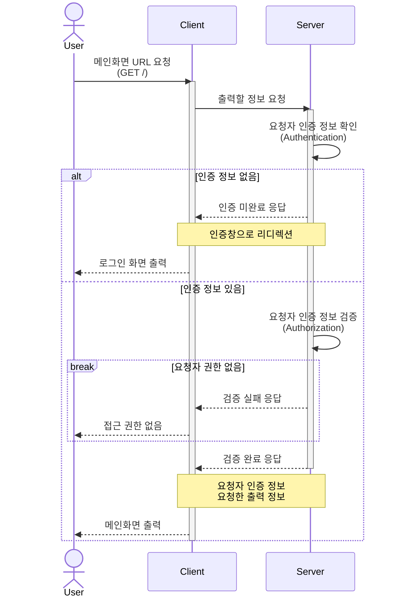
```mermaid
sequenceDiagram

actor U as User
participant C as Client
participant S as Server


U->>C: 메인화면 URL 요청 <br/> (GET /)
activate C
C->>S: 출력할 정보 요청
activate S
S->>S: 요청자 인증 정보 확인 <br/> (Authentication)
alt 인증 정보 없음
S-->>C: 인증 미완료 응답
Note over S,C: 인증창으로 리디렉션
C-->>U: 로그인 화면 출력
else 인증 정보 있음
S->>S: 요청자 인증 정보 검증 <br/> (Authorization)
break 요청자 권한 없음
S-->>C: 검증 실패 응답
C-->>U: 접근 권한 없음
end

S-->>C: 검증 완료 응답
deactivate S
Note over S,C: 요청자 인증 정보 <br/> 요청한 출력 정보
C-->>U: 메인화면 출력
end
deactivate C

```

본 프로젝트에서는 요청자 인증 정보 검증 단계에서 Authorization 미들웨어를 사용하는 대신, 사용자 지정 미들웨어 [CheckUserAuth](/GameAPIServer/Middlewares/CheckUserAuth.cs)를 통하여 Authentication 에서 제공받은 정보를 검증합니다. 위 과정을 포함한 전체적인 사용자 검증은 다음과 같은 순서로 진행됩니다

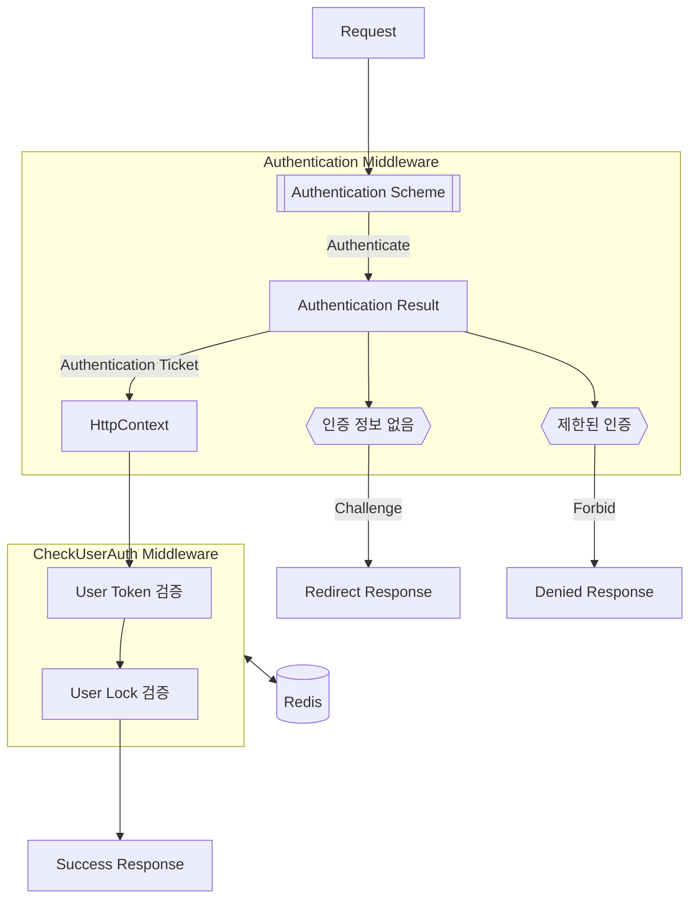
```mermaid
flowchart TD
  R[Request]--->A

  subgraph AM[Authentication Middleware]
  A[[Authentication Scheme]]
  AR-->|Authentication Ticket| H[HttpContext]
  AR-->AC{{인증 정보 없음}}
  AR-->AF{{제한된 인증}}
  end

  A-->|Authenticate|AR[Authentication Result]
  H-->Token

  subgraph CM[CheckUserAuth Middleware]
       direction TB
  Token[User Token 검증]-->Lock[User Lock 검증]
  end

CM<-->DB[(Redis)]

Lock[User Lock 검증]--->Sucess[Success Response]
AC-->|Challenge|Redirect[Redirect Response]
AF-->|Forbid|Denied[Denied Response]


```

</br>
</br>
- 요청 엔드포인트에 따라서, 적절한 Authentication Scheme을 구분

- 지정된 Authentication Sceme의 Claims Principal가 존재 하는지 확인

- AuthenticateResult에 정보 식별 성공/실패 여부를 반환.

  - 성공시 해당 Claims Principal가 들어있는 AuthenticationTicket을 함께 반환.

  - 실패시 Challenge(인증 챌린지)를 호출. 어떠한 인증이 필요한지 클라이언트에 다시 반환<br/> (예: 쿠키의 경우 사용자를 로그인 페이지로 리디렉션. JWT Bearer의 경우 www-authenticate:bearer 헤더를 포함한 오류를 반환)

### 인증 정보 만들기

ASP.NET Core에서 사용자 정보를 보유하는 인증 정보를 만들려면, 먼저 Claims Principal을 구성해야 합니다. ClaimsPrincipal 구성을 위해서 필요한 모든 Claim을 생성하고 ClaimsIdentity에 추가한 후, 해당 정보를 Redis 저장소에 저장하여 유효 시간을 관리합니다. 본 프로젝트는 쿠키 기반 인증을 사용하기 때문에, 생성된 사용자 정보는 직렬화되어 암호화된 쿠키에 저정 후 관리하여 인증 상태를 유지합니다.

아래는 인증 쿠키 등록을 위한 Claims 구성 및 생성 예시입니다.

```csharp

    // 사용자 인증 정보를 기반으로 Claim(사용자 속성)을 설정합니다.
    // 'UID'는 사용자 고유 식별자, 'Token'은 사용자 인증 토큰, 역할(Role)은 'User'로 설정합니다.
    var claims = new List<Claim>
    {
        new Claim("UID", userAuth.UID.ToString()),   // 사용자 고유 식별자 (UID)
        new Claim("Token", userAuth.Token),          // 사용자 인증 토큰
        new Claim(ClaimTypes.Role, "User")           // 사용자의 역할 (일반 사용자로 설정)
    };

    // Claim을 사용하여 Identity와 Principal을 생성합니다.
    // ClaimsIdentity는 인증된 사용자의 신원을 나타내고,
    // ClaimsPrincipal은 이 Identity를 포함한 사용자를 나타냅니다.
    var claimsIdentity = new ClaimsIdentity(claims, CookieAuthenticationDefaults.AuthenticationScheme);

    // 인증 속성(AuthenticationProperties)을 설정합니다.
    // 본 서버는 Redis를 활용하여 세션 만료여부를 관리 하기때문에
    // 이 예시에서는 속성값을 설정하지 않았지만, 필요에 따라 세션 유지 또는 만료 시간 등 추가 설정이 가능합니다.
    var authProperties = new AuthenticationProperties
    {
        // IsPersistent = true, ExpiresUtc = DateTime.UtcNow.AddHours(1) 등을 설정 가능
    };

    // ClaimsPrincipal(사용자)와 AuthenticationProperties(인증 속성)를 반환합니다.
    return (new ClaimsPrincipal(claimsIdentity), authProperties);

```

생성된 정보는 아래와 같이 `SignInAsync`를 호출하여 알맞은 Authentication Scheme에 연결이 가능하며, 이후 각 요청마다 실행되는 미들웨어를 통해 안증 및 검증 되게 됩니다.

```csharp
  var (claimsPrincipal, authProperties) = _authService.RegisterUserClaims(result);
  await HttpContext.SignInAsync(CookieAuthenticationDefaults.AuthenticationScheme claimsPrincipal, authProperties);
```

#### Blazor에서의 인증 시스템 활용

클라이언트인 Blazor WebAssembly는 주로 외부 아이덴티티 제공자 또는 API에 의존하여 인증을 관리합니다. <br/>WebAssembly 앱 자체에서는 사용자 데이터를 안전하게 저장할 수 없기 때문에, 많은 경우 토큰 기반 인증이 선호됩니다.

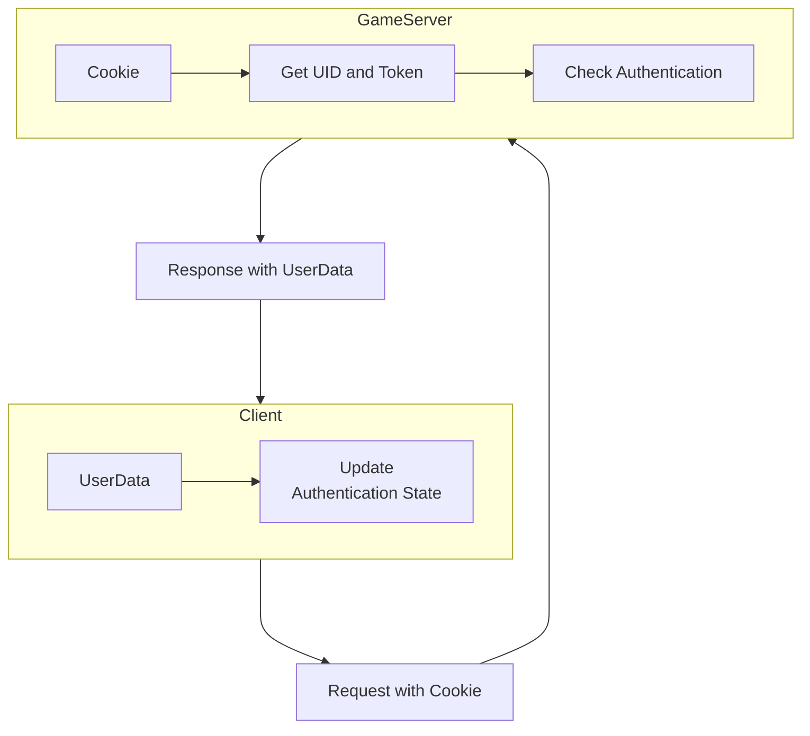
```mermaid
flowchart TD
subgraph C[Client]

A[Update <br/> Authentication State]
U[UserData]-->A
end
C--->R[Request with Cookie]
R--->G
G--->Res[Response with UserData]
Res--->C

subgraph G[GameServer]
Cookie-->T[Get UID and Token]
T-->Check[Check Authentication]
end

```

본 프로젝트의 Authentication을 사용하여 <br/>AuthenticationStateProvider에서 인증 상태를 가져와 전 컴포넌트에 아래와 같이 전파합니다.

```xml
<CascadingAuthenticationState>
	<Router AppAssembly="@typeof(App).Assembly">
		<Found Context="routeData">
			<AuthorizeRouteView RouteData="@routeData" DefaultLayout="@typeof(MainLayout)">
				<NotAuthorized>
					   @{
							Navigation.NavigateTo("/login", true);
					   }
				</NotAuthorized>
				<Authorizing>
					<p>Authorizing...</p>
				</Authorizing>
			</AuthorizeRouteView>
			<FocusOnNavigate RouteData="@routeData" Selector="h1" />
		</Found>
		<NotFound>
			<PageTitle>Not found</PageTitle>
			<LayoutView Layout="@typeof(PublicLayout)">
				<p role="alert">Sorry, there's nothing at this address.</p>
			</LayoutView>
		</NotFound>
	</Router>
</CascadingAuthenticationState>
```

#### AuthorizeRouteView 원리

- AuthorizeRouteView는 특정 경로가 인증된 사용자에게만 허용되도록 설정된 컴포넌트입니다. <br/>이 컴포넌트는 ASP.NET Core 쿠키 인증을 기반으로 사용자 인증 상태를 확인하여, <br/> 사용자가 인증된 경우에만 페이지를 렌더링합니다.

- 사용자가 인증되지 않은 상태에서 인증이 필요한 페이지에 접근하려고 하면, <br/>사용자를 로그인 페이지로 리다이렉트합니다.

- 사용자의 인증 상태를 확인하는 중에는 Authorizing 블록이 실행되어, <br/> 인증 진행중이라는 메시지를 표시합니다. <br/>이 부분은 ASP.NET Core 쿠키 인증 시스템이 사용자의 상태를 확인하는 동안 잠시 나타납니다.

<!-- 매칭 진행 로직-->

### Request Match

클라이언트에서 매치 페이지 진입시에 게임서버는 아래의 사전확인 과정을 거칩니다.

매치서버에 `requestmatching/check`를 통해 매치 요청이 진행 중이면 해당 화면을 띄웁니다.


<br/>
진행중인 요청이 없을 경우 Start Match 버튼을 클릭하여 `/requestmatching` 요청을 전송할 수 있습니다. <br/>

### Complete Match

매칭 진행시 아래와 같은 작업이 진행됩니다.

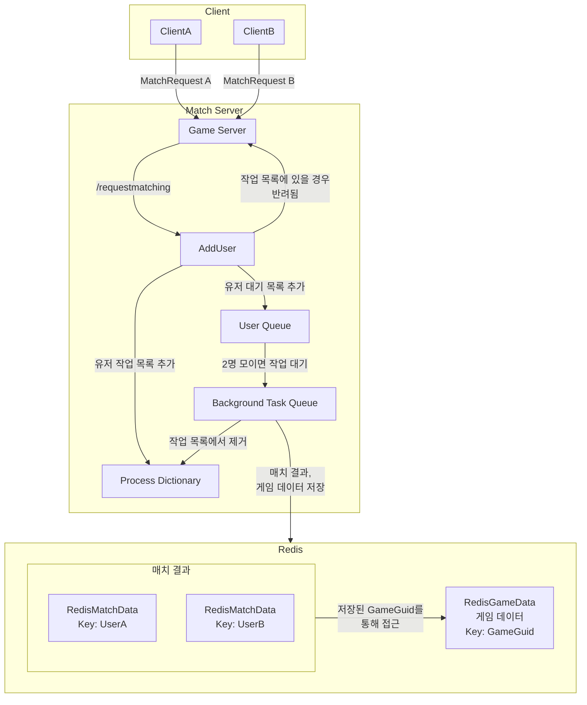
```mermaid
flowchart TD


subgraph CA[ClientA]
end

subgraph CB[ClientB]

end
CA-->|MatchRequest A|G
CB-->|MatchRequest B|G

subgraph C[Client]
CA
CB
end

subgraph G[Game Server]

end

G-->|/requestmatching|AU

subgraph M[Match Server]
TQ[Background Task Queue]
UQ[User Queue]
PD[Process Dictionary]
AU[AddUser]-->|유저 대기 목록 추가|UQ
AU--->|작업 목록에 있을 경우 <br/> 반려됨|G
AU-->|유저 작업 목록 추가|PD
UQ-->|2명 모이면 작업 대기|TQ
TQ-->|작업 목록에서 제거|PD
end

TQ--->|매치 결과,<br/> 게임 데이터 저장|R
subgraph R[Redis]
subgraph MR[매치 결과]
RMA[RedisMatchData <br/> Key: UserA]
RMB[RedisMatchData <br/> Key: UserB]
end
MR-->|저장된 GameGuid를 <br/> 통해 접근|RG
RG[RedisGameData <br/> 게임 데이터 <br/> Key: GameGuid]

end

```


매치 완료시 아래와 같은 알림이 뜨고, 게임 서버에서는 `RedisMatchData`를 삭제하면서 가져옵니다. <br/> Confirm 시에 게임 페이지로 이동합니다

<!-- 게임 진행 로직 -->

### Process Game


<br/>

매치 결과 수락시에 게임 페이지로 이동되면 출력되는 화면입니다. 해당 화면에서는 로딩시에 게임 시작 여부를 판별 후, 전 인원이 입장 하지 않았을 경우 위 팝업을 띄웁니다.

아래는 게임 첫 입장시 게임 상태 식별 과정을 그린 시퀀스 다이어그램입니다.

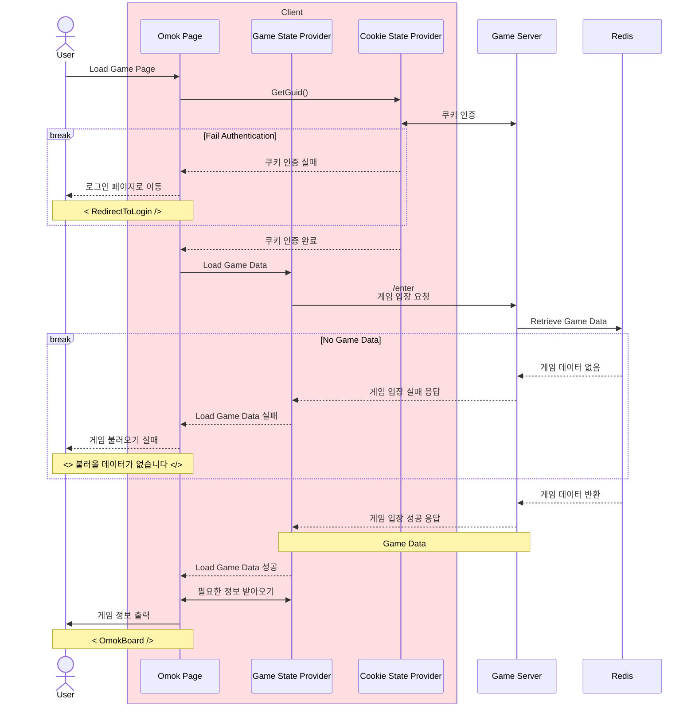
```mermaid
sequenceDiagram

actor U as User

box rgb(255, 222, 225) Client
participant P as Omok Page
participant GP as Game State Provider
participant CP as Cookie State Provider
end
participant S as Game Server
participant R as Redis

U->>P:Load Game Page
P->>CP: GetGuid()
CP<<->>S: 쿠키 인증

break Fail Authentication
CP-->>P:쿠키 인증 실패
P-->>U: 로그인 페이지로 이동
Note over P,U:  < RedirectToLogin />
end

CP-->>P:쿠키 인증 완료
P->>GP:Load Game Data
GP->>S:/enter <br/> 게임 입장 요청
S->>R:Retrieve Game Data

break No Game Data
R-->>S: 게임 데이터 없음
S-->>GP: 게임 입장 실패 응답
GP-->>P: Load Game Data 실패
P-->>U: 게임 불러오기 실패
Note over P,U: <> 불러올 데이터가 없습니다 </>
end

R-->>S: 게임 데이터 반환
S-->>GP:게임 입장 성공 응답
Note over S,GP:Game Data
GP-->>P: Load Game Data 성공
GP<<->>P: 필요한 정보 받아오기
P->>U:게임 정보 출력
Note over P,U: < OmokBoard />
```

본 페이지 [Omok.razor](GameClient/Pages/Omok.razor) (/omok) 에서는 게임 로딩 완료 후 [GameStateProvider](/GameClient/Providers/GameStateProvider.cs)를 통해 게임 상태 요청 `/omok/peek` 를 1초에 한번 게임 서버로 보냅니다.

`GameStateProvider`는 게임 상태 변경 사항에 따라 아래의 콜백중 알맞은 콜백을 Omok 페이지로 전달합니다.

- 게임이 종료 되었을 경우 `NotifyGameCompleted`
- 게임이 시작 되었을 경우 `NotifyGameStarted`
- 게임 턴이 바뀌었을 경우 `NotifyTurnChange`


게임이 시작되면 턴에 따라서 바로 시작이 가능하거나 위와 같이 턴 로딩 화면으로 전환 됩니다.

### Complete Game


오목의 승리 조건 달성시 승자 구분과 함께 게임결과가 저장되고 승자에게 보상이 전달됩니다. 더이상 게임이 업데이트 되지 않습니다.

### User Interface

중복 요청들 방지를 위해 FluentUI에서 제공하는 SplashScreen을 활용하여 요청시에 유저 입력을 막습니다.

또한, 로딩 알림을 위해 Overlay 컴포넌트를 사용하여 로그인, 페이지 로딩등의 API 요청이 포함된 프로세스 시작시에는 해당 화면으로 유저에게 로딩이 진행중임을 알립니다.

### GameData

게임 상태 요청에서는 `흑돌`/`백돌` 유저의 정보 `RedisUserCurrentGame`와 함께 </br>
아래의 게임정보를 담은 byte[]로 구성된 데이터를 RedisDB에서 불러옵니다.

#### 게임 전체 정보

진행중인 게임 데이터는 Byte 배열로 저장 및 관리됩니다. <br/>
아래는 해당 배열 구성과 인덱스 정보입니다.

| Name           | GameIndex       | Data Type | Size     | Description                                |
| :------------- | :-------------- | :-------- | :------- | :----------------------------------------- |
| 게임 보드 정보 | 0               | byte[]    | 57 bytes | 15x15 보드에 한칸당 2비트를 차지합니다     |
| 게임 상태 관리 | `GameFlag`      | byte      | 1 byte   | 게임 상태를 불러오거나 변경하는데 쓰입니다 |
| 게임 상태 관리 | `BlackPlayer`   | Int64     | 8 bytes  | 흑돌 플레이어의 UID                        |
| 게임 상태 관리 | `WhitePlayer`   | Int64     | 8 bytes  | 백돌 플레이어의 UID                        |
| 게임 상태 관리 | `GameStartTime` | Int64     | 8 bytes  | 게임 시작 시간                             |
| 게임 상태 관리 | `LastTurnTime`  | Int64     | 8 bytes  | 마지막 돌 두기 시간                        |
| 게임 상태 관리 | `TurnCount`     | Int64     | 8 bytes  | 총 진행된 턴수                             |

#### 게임 상태 플래그

`GameFlag`에 해당하는 각 플래그 정보입니다

| Name           | Bit Number | Description                    |
| :------------- | :--------- | :----------------------------- |
| GameState      | 0          | 게임 상태 식별                 |
| GameEnterBlack | 1          | 흑돌 입장 여부                 |
| GameEnterWhite | 2          | 백돌 입장 여부                 |
| GameWinner     | 3          | 게임 완료시에 게임 승리자 식별 |
| GameWinner     | 4          | 게임 종료 여부                 |

#### 게임 정보 관리

게임 데이터 생성 후 게임정보는 Redis 저장소를 통해서 불러오거나 갱신할 수 있습니다.

게임 정보 전체 배열을 불러오는 경우는 다음과 같습니다

- 게임 입장 (EnterGame)
- 게임 돌 두기 (SetOmokStone)
- 게임 턴 체크 (GetTurnInfo)

#### 공통 확인 정보

게임을 진행할떄는 `RedisUserCurrentGame` 을 통해 현재 진행중인 유저의 게임 정보를 확인합니다.

유저정보는 게임 정보 `RedisGameData`(byte[]) 와 함께 생성 되며,

저장되어있는 GameGuid (게임 인스턴스 고유 식별 번호) 를 통해서 올바른 `RedisGameData`에 접근합니다.

`RedisUserCurrentGame`과 `RedisGameData` 게임서버에서 접근되며,

정보를 불러올때마다 저장 시간이 갱신됩니다.

#### 게임 업데이트 프로세스

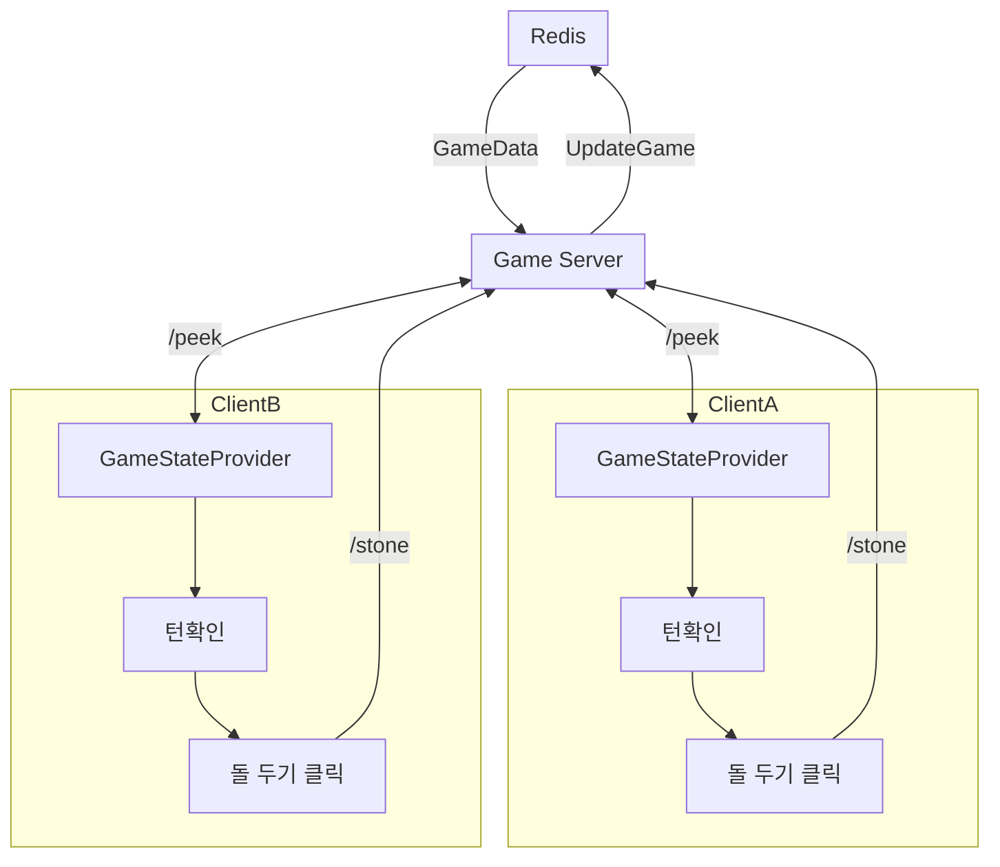
```mermaid
flowchart TD


subgraph CA[ClientA]
GA[GameStateProvider]
GA-->TurnA
TurnA[턴확인]
TurnA-->ActionA
ActionA[돌 두기 클릭]
end
ActionA--->|/stone|G

subgraph CB[ClientB]
GB[GameStateProvider]
GB-->TurnB
TurnB[턴확인]
TurnB-->ActionB
ActionB[돌 두기 클릭]
end
ActionB--->|/stone|G

subgraph G[Game Server]
end
G-->| UpdateGame|R
R--->|GameData|G
subgraph R[Redis]
end

G<-->|/peek|GB
G<-->|/peek|GA

```

#### 게임 승리 프로세스

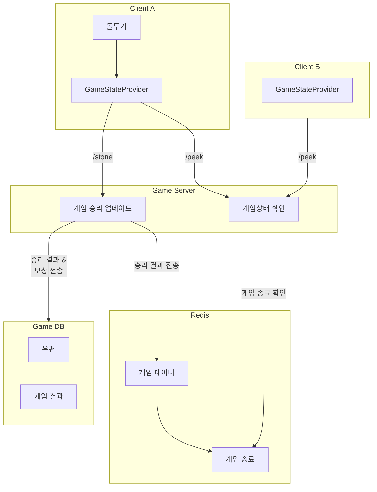
```mermaid
flowchart TD


subgraph CA[Client A]
GA[GameStateProvider]
ActionA[돌두기]
ActionA-->GA
end

GA--->|/stone|END

subgraph CB[Client B]
GB[GameStateProvider]
end

subgraph G[Game Server]
END[게임 승리 업데이트]
CheckGame[게임상태 확인]

end
END--->|승리 결과 전송|GDA
END--->|승리 결과 & <br/> 보상 전송|GDB

subgraph R[Redis]
GDA[게임 데이터]
GDE[게임 종료]
GDA-->GDE
end

subgraph GDB[Game DB]
Mail[우편]
Result[게임 결과]
end

GA--->|/peek|CheckGame[게임상태 확인]
CheckGame--->|게임 종료 확인|GDE

CB--->|/peek|CheckGame

```

</details>


<details>
  <summary> API Documentation</summary>	
 <!-- API Documentation -->

## Hive API Documentation

Hive Server에 요청 가능한 API 목록

### Create Hive Account

#### Request

```http
POST /CreateHiveAccount

{
"Email": "foo@bar.com",
"Password": "1234foobar!"
}
```

| Body Param | Type     | Description                                 |
| :--------- | :------- | :------------------------------------------ |
| Email      | `string` | **Required**. 계정 로그인시 사용할 이메일   |
| Password   | `string` | **Required**. 계정 로그인시 사용할 비밀번호 |

### Login Hive

#### Request

```http
POST /Login

{
"Email": "foo@bar.com",
"Password": "1234foobar!"
}
```

| Body Param | Type     | Description                      |
| :--------- | :------- | :------------------------------- |
| Email      | `string` | **Required**. 가입한 계정 이메일 |
| Password   | `string` | **Required**. 계정 비밀번호      |

#### Response

| Body      | Type        | Description                  |
| :-------- | :---------- | :--------------------------- |
| Result    | `ErrorCode` | 로그인 실패시 오류 코드 반환 |
| PlayerID  | `long`      | Hive 계정 고유 번호          |
| HiveToken | `string`    | 발급된 계정 토큰             |

### Verify Token

#### Request

```http
POST /VerifyToken

{
"PlayerID": "<PlayerID from Login Hive Response>",
"HiveToken": "<HiveToken from Login Hive Response>"
}
```

| Body Param | Type     | Description                     |
| :--------- | :------- | :------------------------------ |
| PlayerID   | `long`   | **Required**. 전달 받은 계정 ID |
| HiveToken  | `string` | **Required**. 발급받은 인증토큰 |

#### Response

| Body   | Type        | Description                |
| :----- | :---------- | :------------------------- |
| Result | `ErrorCode` | 검증 실패시 오류 코드 반환 |

## Game API Documentation

Game Server에 요청 가능한 API 목록

### Login Game

#### Request

```http
POST /Login

{
"PlayerID": "<PlayerID from Login Hive Response>",
"HiveToken": "<HiveToken from Login Hive Response>"
}
```

| Body Param | Type     | Description                                     |
| :--------- | :------- | :---------------------------------------------- |
| PlayerID   | `long`   | **Required**. 하이브 로그인시 전달 받은 계정 ID |
| HiveToken  | `string` | **Required**. 하이브 로그인시 발급받은 인증토큰 |

#### Response

| Body   | Type        | Description                  |
| :----- | :---------- | :--------------------------- |
| Result | `ErrorCode` | 로그인 실패시 오류 코드 반환 |

- 서버에 세션 정보가 저장됩니다.
- 인증 쿠키가 등록됩니다.

### Logout Game

#### Request

```http
GET /Logout
```

#### Response

| Body   | Type        | Description                    |
| :----- | :---------- | :----------------------------- |
| Result | `ErrorCode` | 로그아웃 실패시 오류 코드 반환 |

- 서버에 세션 정보가 삭제됩니다.
- 인증 쿠키가 삭제됩니다.

### Match Game

사용자가 게임을 시작하기 위해 매치서버로 매칭 시작 요청을 합니다.

#### Request

```http
POST /matchstart
```

- 다른유저와 매칭 시작을 요청합니다
- 인증 쿠키에서 UID 를 가져오기 떄문에 별도의 정보를 요구 하지 않습니다.

#### Response

| Body   | Type        | Description                     |
| :----- | :---------- | :------------------------------ |
| Result | `ErrorCode` | 매치 등록 실패시 오류 코드 반환 |

- 매칭이 진행됩니다.

### Check Match

사용자의 매칭 진행 상태를 확인합니다

#### Request

```http
POST /matchcheck
```

#### Response

| Body   | Type        | Description                       |
| :----- | :---------- | :-------------------------------- |
| RoomId | `string`      | 매치 완료시 등록된 게임룸 ID 반환 |
| Result | `ErrorCode` | 완료된 매치 없을시 오류 코드 반환 |

- 현 매칭 상태를 수신합니다.
- 매칭 완료 시에 게임룸 ID를 제공 받습니다.

### Enter Game

매칭 완료된 게임에 입장합니다

#### Request

```http
POST /omok/enter
```

- 인증 쿠키에 포함된 UID 로 입장 가능한 게임을 식별합니다.

#### Response

| Body     | Type        | Description                     |
| :------- | :---------- | :------------------------------ |
| GameData | `byte[] `     | 입장된 게임의 데이터            |
| Result   | `ErrorCode` | 게임 입장 실패시 오류 코드 반환 |

- 입장 완료 시에 게임 데이터를 제공 받습니다.
- 최초 입장시 필요한 플레이어 수가 채워지면 입장과 함께 게임이 시작됩니다.

### Peek Game

진행중인 게임 상태를 1초마다 확인합니다.

#### Request

```http
POST /omok/peek
```

#### Response

| Body     | Type        | Description                     |
| :------- | :---------- | :------------------------------ |
| GameData | `byte[]`      | 진행중인 게임의 데이터            |
| Result   | `ErrorCode` | 게임 입장 실패시 오류 코드 반환 |


### Put Stone
진행중인 게임에서 돌을 둡니다

#### Request
```http
POST /omok/stone
```

| Body Param | Type     | Description                     |
| :--------- | :------- | :------------------------------ |
|   PosX   | `int`  | **Required**. 돌두기 가로축 위치 |
| PosY  | `int` | **Required**. 돌두기 세로축 위치 |

#### Response

| Body     | Type        | Description                     |
| :------- | :---------- | :------------------------------ |
| Result   | `ErrorCode` | 게임 입장 실패시 오류 코드 반환 |


### Get User Data

인증된 사용자의 정보를 불러옵니다.

#### Request

```http
GET /userdata
```

#### Response

| Body   | Type        | Description                    |
| :----- | :---------- | :----------------------------- |
| LoadUserData | `LoadedUserData` | 사용자 데이터 |

| Result | `ErrorCode` |  실패시 오류 코드 반환 |

LoadedUserData 는 사용자 기본 정보인 `UserInfo`, 사용자 출석 정보인 `UserAttendances` 가 포함 되어있습니다.

### Update User Nickname

사용자의 게임 닉네임을 변경합니다.

#### Request

```http
POST /userdata/update/nickname
```

#### Response

| Body   | Type        | Description                    |
| :----- | :---------- | :----------------------------- |
| Result | `ErrorCode` | 로그아웃 실패시 오류 코드 반환 |

### Check Mail

요청한 플레이어가 받은 메일 목록을 불러옵니다

#### Request

```http
POST /mail/check
```

#### Response

| Body     | Type        | Description                     |
| :------- | :---------- | :------------------------------ |
| MailData   | `IEnumerable<MailInfo>` | 받은 메일 목록 |
| Result   | `ErrorCode` | 조회 실패시 오류 코드 반환 |


### Read Mail

메일을 읽습니다. 메일 상태가 읽음으로 갱신됩니다.

#### Request

```http
POST /mail/read
```

| Body Param | Type     | Description                     |
| :--------- | :------- | :------------------------------ |
|   MailUid   | `Int64`  | **Required**. 읽으려는 메일 고유 식별 번호 |

#### Response

| Body     | Type        | Description                     |
| :------- | :---------- | :------------------------------ |
| Result   | `ErrorCode` | 실패시 오류 코드 반환 |

###  Receive Mail Reward

메일에 첨부된 보상을 획득합니다. 메일 상태가 보상받음 으로 갱신됩니다.

획득한 보상은 플레이어의 인벤토리로 옮겨집니다.

#### Request

```http
POST /mail/receive
```

| Body Param | Type     | Description                     |
| :--------- | :------- | :------------------------------ |
|   MailUid   | `Int64`  | **Required**. 수령하려는 메일 고유 식별 번호 |

#### Response

| Body     | Type        | Description                     |
| :------- | :---------- | :------------------------------ |
| Result   | `ErrorCode` | 실패시 오류 코드 반환 |

### Delete Mail 

메일을 삭제합니다.

#### Request

```http
POST /mail/delete
```

| Body Param | Type     | Description                     |
| :--------- | :------- | :------------------------------ |
|   MailUid   | `Int64`  | **Required**. 삭제하려는 메일 고유 식별 번호 |

#### Response

| Body     | Type        | Description                     |
| :------- | :---------- | :------------------------------ |
| Result   | `ErrorCode` | 실패시 오류 코드 반환 |

</details>

<!-- Prerequisites -->
# Getting Started

## Prerequisites

이 서버는 MySql과 Redis 서버가 로컬호스트에서 사전 실행되어야 정상적으로 작동됩니다. 

- [.NET 8 SDK](https://dotnet.microsoft.com/download)
- [MySQL](https://dev.mysql.com/downloads/installer/)
- [Redis](https://redis.io/)
  
### MySQL

#### 설치 방법 Windows

먼저 [MySQL 다운로드 페이지](https://dev.mysql.com/downloads/installer/)에서 MySQL Installer를 다운로드 한후 실행합니다.

연결 유형에서 기본적으로 `TCP/IP`를 사용하고, 포트 번호를 확인한 후 `Root Password`를 설정한 후 기본 구성으로 MySQL 서버 설치를 마칩니다.

설정이 완료되면 MySQL 서버를 시작하고, MySQL Workbench를 사용하여 데이터베이스에 연결합니다. <br/>
MySQL 서버가 자동으로 시작되지 않은 경우, 아래 명령어로 수동으로 시작할 수 있습니다.


```powershell
 net start MySQL
```

서버 이름은 `MySQL` 이후에 버전 suffix 붙는 경우가 있습니다. 설치 시 등록되는 이름을 확인 하여야 합니다

#### 덤프 파일을 활용하여 데이터베이스 셋업

MySQL Workbench에 실행된 MySQL 서버에 연결하고,  상단의 Server 메뉴에서 Data Import를 선택합니다. 입력 필드 옆의 ... 버튼을 클릭하고 [dump.sql 파일이 있는 위치](Database/dump.sql)로 이동하여 파일을 선택합니다.

아래로 스크롤하여 Start Import 버튼을 클릭합니다. 

MySQL Workbench가 이제 dump.sql 파일의 SQL 명령을 실행하여 테이블을 생성하고 데이터를 삽입하며 데이터베이스를 설정합니다.

### Redis

Redis는 기본적으로 Windows에서 직접 지원되지 않지만, Windows용 Redis 포트 또는 WSL(Windows Subsystem for Linux), Docker 등을 통해 설치 및 실행할 수 있습니다.

#### WSL을 통한 설치 방법 

Windows PowerShell을 관리자 권한으로 실행한 후 아래 명령어를 실행하여 WSL을 활성화합니다:
```powershell
wsl --install
```

이후 아래를 실행하여 Redis 설치를 완료합니다

```powershell
curl -fsSL https://packages.redis.io/gpg | sudo gpg --dearmor -o /usr/share/keyrings/redis-archive-keyring.gpg

echo "deb [signed-by=/usr/share/keyrings/redis-archive-keyring.gpg] https://packages.redis.io/deb $(lsb_release -cs) main" | sudo tee /etc/apt/sources.list.d/redis.list

sudo apt-get update
sudo apt-get install redis
```

#### Redis 실행하기

아래의 명령어로 Ubuntu를 통해 설치된 Redis를 실행 합니다

```bash
sudo service redis-server start
```

## Running Locally

솔루션을 빌드 후 실행하거나 
각 프로젝트 디렉터리에서 다음 명령어를 실행하여 API 서버를 로컬에서 실행합니다

```bash
dotnet run
```

각 서버의 주소는 아래와 같이 설정되어있으며, 각 프로젝트에 appsettings.json에서 변경할 수 있습니다.

Game Server: http://localhost:8000
Hive Server: http://localhost:8080
Match Server: http://localhost:9000

## Roadmap

### Data Models

- [x] HiveDb Models
- [x] MasterDb Models
- [x] GameDb Models

### Security

- [x] Custom Authentication Middleware
- [x] User Request Lock Middleware
- [x] App Version Control Middleware

### Server Infrastructrue

- [x] Logger using ZLogger
- [x] Redis
- [x] MySQL

### Content

- [x] Create Account/Login
- [x] Match
- [x] Play Game
- [x] Game Completion (Save Result and Reward)
- [x] Mail
- [x] Attendence
- [ ] Shop
- [ ] Replay Game
- [ ] Friend


================================================
File: OmokGame.sln
================================================

Microsoft Visual Studio Solution File, Format Version 12.00
# Visual Studio Version 17
VisualStudioVersion = 17.9.34902.65
MinimumVisualStudioVersion = 10.0.40219.1
Project("{9A19103F-16F7-4668-BE54-9A1E7A4F7556}") = "HiveAPIServer", "HiveAPIServer\HiveAPIServer.csproj", "{BBCC3676-A2D0-4EBE-A9B1-943F760010FF}"
EndProject
Project("{9A19103F-16F7-4668-BE54-9A1E7A4F7556}") = "MatchAPIServer", "MatchAPIServer\MatchAPIServer.csproj", "{6A2B998C-A089-45C6-B023-9ED30F7F16BB}"
EndProject
Project("{9A19103F-16F7-4668-BE54-9A1E7A4F7556}") = "GameAPIServer", "GameAPIServer\GameAPIServer.csproj", "{F513DAE9-CC0C-45B4-BE9E-95C58B30206F}"
EndProject
Project("{9A19103F-16F7-4668-BE54-9A1E7A4F7556}") = "ServerShared", "ServerShared\ServerShared.csproj", "{08A5D674-0578-4D85-8684-2A5399BC373B}"
EndProject
Project("{9A19103F-16F7-4668-BE54-9A1E7A4F7556}") = "GameShared", "GameShared\GameShared.csproj", "{5CE12DD9-2D72-41AE-89CF-BE80CF9BCF45}"
EndProject
Project("{9A19103F-16F7-4668-BE54-9A1E7A4F7556}") = "GameClient", "GameClient\GameClient.csproj", "{1A8A6D7B-47F5-422D-908A-9720735B3FBD}"
EndProject
Global
	GlobalSection(SolutionConfigurationPlatforms) = preSolution
		Debug|Any CPU = Debug|Any CPU
		Release|Any CPU = Release|Any CPU
	EndGlobalSection
	GlobalSection(ProjectConfigurationPlatforms) = postSolution
		{BBCC3676-A2D0-4EBE-A9B1-943F760010FF}.Debug|Any CPU.ActiveCfg = Debug|Any CPU
		{BBCC3676-A2D0-4EBE-A9B1-943F760010FF}.Debug|Any CPU.Build.0 = Debug|Any CPU
		{BBCC3676-A2D0-4EBE-A9B1-943F760010FF}.Release|Any CPU.ActiveCfg = Release|Any CPU
		{BBCC3676-A2D0-4EBE-A9B1-943F760010FF}.Release|Any CPU.Build.0 = Release|Any CPU
		{6A2B998C-A089-45C6-B023-9ED30F7F16BB}.Debug|Any CPU.ActiveCfg = Debug|Any CPU
		{6A2B998C-A089-45C6-B023-9ED30F7F16BB}.Debug|Any CPU.Build.0 = Debug|Any CPU
		{6A2B998C-A089-45C6-B023-9ED30F7F16BB}.Release|Any CPU.ActiveCfg = Release|Any CPU
		{6A2B998C-A089-45C6-B023-9ED30F7F16BB}.Release|Any CPU.Build.0 = Release|Any CPU
		{F513DAE9-CC0C-45B4-BE9E-95C58B30206F}.Debug|Any CPU.ActiveCfg = Debug|Any CPU
		{F513DAE9-CC0C-45B4-BE9E-95C58B30206F}.Debug|Any CPU.Build.0 = Debug|Any CPU
		{F513DAE9-CC0C-45B4-BE9E-95C58B30206F}.Release|Any CPU.ActiveCfg = Release|Any CPU
		{F513DAE9-CC0C-45B4-BE9E-95C58B30206F}.Release|Any CPU.Build.0 = Release|Any CPU
		{08A5D674-0578-4D85-8684-2A5399BC373B}.Debug|Any CPU.ActiveCfg = Debug|Any CPU
		{08A5D674-0578-4D85-8684-2A5399BC373B}.Debug|Any CPU.Build.0 = Debug|Any CPU
		{08A5D674-0578-4D85-8684-2A5399BC373B}.Release|Any CPU.ActiveCfg = Release|Any CPU
		{08A5D674-0578-4D85-8684-2A5399BC373B}.Release|Any CPU.Build.0 = Release|Any CPU
		{5CE12DD9-2D72-41AE-89CF-BE80CF9BCF45}.Debug|Any CPU.ActiveCfg = Debug|Any CPU
		{5CE12DD9-2D72-41AE-89CF-BE80CF9BCF45}.Debug|Any CPU.Build.0 = Debug|Any CPU
		{5CE12DD9-2D72-41AE-89CF-BE80CF9BCF45}.Release|Any CPU.ActiveCfg = Release|Any CPU
		{5CE12DD9-2D72-41AE-89CF-BE80CF9BCF45}.Release|Any CPU.Build.0 = Release|Any CPU
		{1A8A6D7B-47F5-422D-908A-9720735B3FBD}.Debug|Any CPU.ActiveCfg = Debug|Any CPU
		{1A8A6D7B-47F5-422D-908A-9720735B3FBD}.Debug|Any CPU.Build.0 = Debug|Any CPU
		{1A8A6D7B-47F5-422D-908A-9720735B3FBD}.Release|Any CPU.ActiveCfg = Release|Any CPU
		{1A8A6D7B-47F5-422D-908A-9720735B3FBD}.Release|Any CPU.Build.0 = Release|Any CPU
	EndGlobalSection
	GlobalSection(SolutionProperties) = preSolution
		HideSolutionNode = FALSE
	EndGlobalSection
	GlobalSection(ExtensibilityGlobals) = postSolution
		SolutionGuid = {24424D20-81DE-4E63-8F18-511FD54320A1}
	EndGlobalSection
EndGlobal


================================================
File: Database/dump.sql
================================================
CREATE DATABASE  IF NOT EXISTS `gamedb` /*!40100 DEFAULT CHARACTER SET utf8mb4 COLLATE utf8mb4_0900_ai_ci */ /*!80016 DEFAULT ENCRYPTION='N' */;
USE `gamedb`;
-- MySQL dump 10.13  Distrib 8.0.38, for Win64 (x86_64)
--
-- Host: 127.0.0.1    Database: gamedb
-- ------------------------------------------------------
-- Server version	8.4.2

/*!40101 SET @OLD_CHARACTER_SET_CLIENT=@@CHARACTER_SET_CLIENT */;
/*!40101 SET @OLD_CHARACTER_SET_RESULTS=@@CHARACTER_SET_RESULTS */;
/*!40101 SET @OLD_COLLATION_CONNECTION=@@COLLATION_CONNECTION */;
/*!50503 SET NAMES utf8 */;
/*!40103 SET @OLD_TIME_ZONE=@@TIME_ZONE */;
/*!40103 SET TIME_ZONE='+00:00' */;
/*!40014 SET @OLD_UNIQUE_CHECKS=@@UNIQUE_CHECKS, UNIQUE_CHECKS=0 */;
/*!40014 SET @OLD_FOREIGN_KEY_CHECKS=@@FOREIGN_KEY_CHECKS, FOREIGN_KEY_CHECKS=0 */;
/*!40101 SET @OLD_SQL_MODE=@@SQL_MODE, SQL_MODE='NO_AUTO_VALUE_ON_ZERO' */;
/*!40111 SET @OLD_SQL_NOTES=@@SQL_NOTES, SQL_NOTES=0 */;

--
-- Table structure for table `attendance`
--

DROP TABLE IF EXISTS `attendance`;
/*!40101 SET @saved_cs_client     = @@character_set_client */;
/*!50503 SET character_set_client = utf8mb4 */;
CREATE TABLE `attendance` (
  `attendance_uid` bigint NOT NULL AUTO_INCREMENT,
  `attendance_code` int NOT NULL,
  `user_uid` bigint NOT NULL,
  `attendance_seq` int NOT NULL DEFAULT '0',
  `create_dt` timestamp NOT NULL DEFAULT CURRENT_TIMESTAMP,
  PRIMARY KEY (`attendance_uid`),
  UNIQUE KEY `uq_user_attendance` (`user_uid`,`attendance_code`)
) ENGINE=InnoDB DEFAULT CHARSET=utf8mb4 COLLATE=utf8mb4_0900_ai_ci;
/*!40101 SET character_set_client = @saved_cs_client */;

--
-- Dumping data for table `attendance`
--

LOCK TABLES `attendance` WRITE;
/*!40000 ALTER TABLE `attendance` DISABLE KEYS */;
/*!40000 ALTER TABLE `attendance` ENABLE KEYS */;
UNLOCK TABLES;

--
-- Table structure for table `game_result`
--

DROP TABLE IF EXISTS `game_result`;
/*!40101 SET @saved_cs_client     = @@character_set_client */;
/*!50503 SET character_set_client = utf8mb4 */;
CREATE TABLE `game_result` (
  `game_result_uid` bigint NOT NULL AUTO_INCREMENT,
  `black_user_uid` bigint NOT NULL,
  `white_user_uid` bigint NOT NULL,
  `result_code` int NOT NULL,
  `start_dt` timestamp NOT NULL,
  `end_dt` timestamp NOT NULL DEFAULT CURRENT_TIMESTAMP,
  PRIMARY KEY (`game_result_uid`),
  KEY `idx_user_black` (`black_user_uid`),
  KEY `idx_user_white` (`white_user_uid`)
) ENGINE=InnoDB DEFAULT CHARSET=utf8mb4 COLLATE=utf8mb4_0900_ai_ci;
/*!40101 SET character_set_client = @saved_cs_client */;

--
-- Dumping data for table `game_result`
--

LOCK TABLES `game_result` WRITE;
/*!40000 ALTER TABLE `game_result` DISABLE KEYS */;
/*!40000 ALTER TABLE `game_result` ENABLE KEYS */;
UNLOCK TABLES;

--
-- Table structure for table `mail`
--

DROP TABLE IF EXISTS `mail`;
/*!40101 SET @saved_cs_client     = @@character_set_client */;
/*!50503 SET character_set_client = utf8mb4 */;
CREATE TABLE `mail` (
  `mail_uid` bigint NOT NULL AUTO_INCREMENT,
  `mail_title` varchar(100) NOT NULL,
  `mail_content` varchar(300) DEFAULT NULL,
  `mail_status_code` int DEFAULT '0',
  `send_user_uid` bigint DEFAULT NULL,
  `receive_user_uid` bigint NOT NULL,
  `reward_code` int DEFAULT '0',
  `create_dt` timestamp NOT NULL DEFAULT CURRENT_TIMESTAMP,
  `update_dt` timestamp NULL DEFAULT NULL,
  `expire_dt` timestamp NOT NULL,
  PRIMARY KEY (`mail_uid`),
  KEY `idx_user_receive` (`receive_user_uid`)
) ENGINE=InnoDB DEFAULT CHARSET=utf8mb4 COLLATE=utf8mb4_0900_ai_ci;
/*!40101 SET character_set_client = @saved_cs_client */;

--
-- Dumping data for table `mail`
--

LOCK TABLES `mail` WRITE;
/*!40000 ALTER TABLE `mail` DISABLE KEYS */;
/*!40000 ALTER TABLE `mail` ENABLE KEYS */;
UNLOCK TABLES;

--
-- Table structure for table `user_info`
--

DROP TABLE IF EXISTS `user_info`;
/*!40101 SET @saved_cs_client     = @@character_set_client */;
/*!50503 SET character_set_client = utf8mb4 */;
CREATE TABLE `user_info` (
  `user_uid` bigint NOT NULL AUTO_INCREMENT,
  `hive_player_id` bigint NOT NULL,
  `user_name` varchar(20) DEFAULT NULL,
  `create_dt` timestamp NOT NULL DEFAULT CURRENT_TIMESTAMP,
  `attendance_update_dt` timestamp NULL DEFAULT NULL,
  `recent_login_dt` timestamp NOT NULL,
  `play_total` int DEFAULT '0',
  `win_total` int DEFAULT '0',
  PRIMARY KEY (`user_uid`),
  UNIQUE KEY `hive_player_id` (`hive_player_id`)
) ENGINE=InnoDB DEFAULT CHARSET=utf8mb4 COLLATE=utf8mb4_0900_ai_ci;
/*!40101 SET character_set_client = @saved_cs_client */;

--
-- Dumping data for table `user_info`
--

LOCK TABLES `user_info` WRITE;
/*!40000 ALTER TABLE `user_info` DISABLE KEYS */;
/*!40000 ALTER TABLE `user_info` ENABLE KEYS */;
UNLOCK TABLES;

--
-- Table structure for table `user_item`
--

DROP TABLE IF EXISTS `user_item`;
/*!40101 SET @saved_cs_client     = @@character_set_client */;
/*!50503 SET character_set_client = utf8mb4 */;
CREATE TABLE `user_item` (
  `user_item_uid` bigint NOT NULL AUTO_INCREMENT,
  `user_uid` bigint DEFAULT NULL,
  `item_id` int NOT NULL,
  `item_cnt` int DEFAULT '0',
  PRIMARY KEY (`user_item_uid`),
  UNIQUE KEY `unique_user_item` (`user_uid`,`item_id`),
  KEY `idx_user_uid_item` (`user_uid`)
) ENGINE=InnoDB DEFAULT CHARSET=utf8mb4 COLLATE=utf8mb4_0900_ai_ci;
/*!40101 SET character_set_client = @saved_cs_client */;

--
-- Dumping data for table `user_item`
--

LOCK TABLES `user_item` WRITE;
/*!40000 ALTER TABLE `user_item` DISABLE KEYS */;
/*!40000 ALTER TABLE `user_item` ENABLE KEYS */;
UNLOCK TABLES;

--
-- Table structure for table `user_money`
--

DROP TABLE IF EXISTS `user_money`;
/*!40101 SET @saved_cs_client     = @@character_set_client */;
/*!50503 SET character_set_client = utf8mb4 */;
CREATE TABLE `user_money` (
  `user_money_uid` bigint NOT NULL AUTO_INCREMENT,
  `user_uid` bigint DEFAULT NULL,
  `money_code` int NOT NULL,
  `money_amount` int DEFAULT '0',
  PRIMARY KEY (`user_money_uid`),
  UNIQUE KEY `unique_user_money` (`user_uid`,`money_code`),
  KEY `idx_user_uid_money` (`user_uid`)
) ENGINE=InnoDB DEFAULT CHARSET=utf8mb4 COLLATE=utf8mb4_0900_ai_ci;
/*!40101 SET character_set_client = @saved_cs_client */;

--
-- Dumping data for table `user_money`
--

LOCK TABLES `user_money` WRITE;
/*!40000 ALTER TABLE `user_money` DISABLE KEYS */;
/*!40000 ALTER TABLE `user_money` ENABLE KEYS */;
UNLOCK TABLES;
/*!40103 SET TIME_ZONE=@OLD_TIME_ZONE */;

/*!40101 SET SQL_MODE=@OLD_SQL_MODE */;
/*!40014 SET FOREIGN_KEY_CHECKS=@OLD_FOREIGN_KEY_CHECKS */;
/*!40014 SET UNIQUE_CHECKS=@OLD_UNIQUE_CHECKS */;
/*!40101 SET CHARACTER_SET_CLIENT=@OLD_CHARACTER_SET_CLIENT */;
/*!40101 SET CHARACTER_SET_RESULTS=@OLD_CHARACTER_SET_RESULTS */;
/*!40101 SET COLLATION_CONNECTION=@OLD_COLLATION_CONNECTION */;
/*!40111 SET SQL_NOTES=@OLD_SQL_NOTES */;

-- Dump completed on 2024-09-24 18:58:18
CREATE DATABASE  IF NOT EXISTS `masterdb` /*!40100 DEFAULT CHARACTER SET utf8mb4 COLLATE utf8mb4_0900_ai_ci */ /*!80016 DEFAULT ENCRYPTION='N' */;
USE `masterdb`;
-- MySQL dump 10.13  Distrib 8.0.38, for Win64 (x86_64)
--
-- Host: 127.0.0.1    Database: masterdb
-- ------------------------------------------------------
-- Server version	8.4.2

/*!40101 SET @OLD_CHARACTER_SET_CLIENT=@@CHARACTER_SET_CLIENT */;
/*!40101 SET @OLD_CHARACTER_SET_RESULTS=@@CHARACTER_SET_RESULTS */;
/*!40101 SET @OLD_COLLATION_CONNECTION=@@COLLATION_CONNECTION */;
/*!50503 SET NAMES utf8 */;
/*!40103 SET @OLD_TIME_ZONE=@@TIME_ZONE */;
/*!40103 SET TIME_ZONE='+00:00' */;
/*!40014 SET @OLD_UNIQUE_CHECKS=@@UNIQUE_CHECKS, UNIQUE_CHECKS=0 */;
/*!40014 SET @OLD_FOREIGN_KEY_CHECKS=@@FOREIGN_KEY_CHECKS, FOREIGN_KEY_CHECKS=0 */;
/*!40101 SET @OLD_SQL_MODE=@@SQL_MODE, SQL_MODE='NO_AUTO_VALUE_ON_ZERO' */;
/*!40111 SET @OLD_SQL_NOTES=@@SQL_NOTES, SQL_NOTES=0 */;

--
-- Table structure for table `attendance`
--

DROP TABLE IF EXISTS `attendance`;
/*!40101 SET @saved_cs_client     = @@character_set_client */;
/*!50503 SET character_set_client = utf8mb4 */;
CREATE TABLE `attendance` (
  `attendance_code` int NOT NULL AUTO_INCREMENT,
  `attendance_name` varchar(50) NOT NULL,
  `enabled_yn` tinyint(1) NOT NULL DEFAULT '0',
  `repeatable_yn` tinyint(1) NOT NULL DEFAULT '0',
  PRIMARY KEY (`attendance_code`),
  KEY `idx_enabled_yn` (`enabled_yn`)
) ENGINE=InnoDB AUTO_INCREMENT=4 DEFAULT CHARSET=utf8mb4 COLLATE=utf8mb4_0900_ai_ci;
/*!40101 SET character_set_client = @saved_cs_client */;

--
-- Dumping data for table `attendance`
--

LOCK TABLES `attendance` WRITE;
/*!40000 ALTER TABLE `attendance` DISABLE KEYS */;
INSERT INTO `attendance` VALUES (1,'주간 출석부',1,1),(2,'9월 출석부',1,0),(3,'10월 출석부',0,0);
/*!40000 ALTER TABLE `attendance` ENABLE KEYS */;
UNLOCK TABLES;

--
-- Table structure for table `attendance_detail`
--

DROP TABLE IF EXISTS `attendance_detail`;
/*!40101 SET @saved_cs_client     = @@character_set_client */;
/*!50503 SET character_set_client = utf8mb4 */;
CREATE TABLE `attendance_detail` (
  `attendance_detail_uid` bigint NOT NULL AUTO_INCREMENT,
  `attendance_code` int NOT NULL,
  `attendance_seq` int NOT NULL,
  `reward_code` int NOT NULL,
  PRIMARY KEY (`attendance_detail_uid`),
  UNIQUE KEY `idx_attendance_code_seq` (`attendance_code`,`attendance_seq`)
) ENGINE=InnoDB AUTO_INCREMENT=20 DEFAULT CHARSET=utf8mb4 COLLATE=utf8mb4_0900_ai_ci;
/*!40101 SET character_set_client = @saved_cs_client */;

--
-- Dumping data for table `attendance_detail`
--

LOCK TABLES `attendance_detail` WRITE;
/*!40000 ALTER TABLE `attendance_detail` DISABLE KEYS */;
INSERT INTO `attendance_detail` VALUES (1,1,1,1),(14,1,2,2),(15,1,3,3),(16,1,4,4),(17,1,5,1),(18,1,6,2),(19,1,7,3);
/*!40000 ALTER TABLE `attendance_detail` ENABLE KEYS */;
UNLOCK TABLES;

--
-- Table structure for table `item`
--

DROP TABLE IF EXISTS `item`;
/*!40101 SET @saved_cs_client     = @@character_set_client */;
/*!50503 SET character_set_client = utf8mb4 */;
CREATE TABLE `item` (
  `item_id` int NOT NULL,
  `item_name` varchar(50) NOT NULL,
  `item_image` varchar(100) NOT NULL DEFAULT 'default.png',
  PRIMARY KEY (`item_id`)
) ENGINE=InnoDB DEFAULT CHARSET=utf8mb4 COLLATE=utf8mb4_0900_ai_ci;
/*!40101 SET character_set_client = @saved_cs_client */;

--
-- Dumping data for table `item`
--

LOCK TABLES `item` WRITE;
/*!40000 ALTER TABLE `item` DISABLE KEYS */;
INSERT INTO `item` VALUES (1,'분홍장갑','glove_pink.png'),(2,'푸른장갑','glove_blue.png'),(3,'별','star.png'),(4,'초코 포션','potion_choco.png'),(5,'크림 포션','potion_cream.png'),(6,'핑크 포션','potion_pink.png'),(7,'무지개 포션','potion_rainbow.png');
/*!40000 ALTER TABLE `item` ENABLE KEYS */;
UNLOCK TABLES;

--
-- Table structure for table `money`
--

DROP TABLE IF EXISTS `money`;
/*!40101 SET @saved_cs_client     = @@character_set_client */;
/*!50503 SET character_set_client = utf8mb4 */;
CREATE TABLE `money` (
  `money_code` int NOT NULL,
  `money_name` varchar(50) NOT NULL,
  PRIMARY KEY (`money_code`)
) ENGINE=InnoDB DEFAULT CHARSET=utf8mb4 COLLATE=utf8mb4_0900_ai_ci;
/*!40101 SET character_set_client = @saved_cs_client */;

--
-- Dumping data for table `money`
--

LOCK TABLES `money` WRITE;
/*!40000 ALTER TABLE `money` DISABLE KEYS */;
/*!40000 ALTER TABLE `money` ENABLE KEYS */;
UNLOCK TABLES;

--
-- Table structure for table `reward`
--

DROP TABLE IF EXISTS `reward`;
/*!40101 SET @saved_cs_client     = @@character_set_client */;
/*!50503 SET character_set_client = utf8mb4 */;
CREATE TABLE `reward` (
  `reward_uid` bigint NOT NULL AUTO_INCREMENT,
  `reward_code` int NOT NULL,
  `item_count` int NOT NULL,
  `item_id` int NOT NULL,
  PRIMARY KEY (`reward_uid`),
  KEY `idx_reward_code` (`reward_code`)
) ENGINE=InnoDB AUTO_INCREMENT=8 DEFAULT CHARSET=utf8mb4 COLLATE=utf8mb4_0900_ai_ci;
/*!40101 SET character_set_client = @saved_cs_client */;

--
-- Dumping data for table `reward`
--

LOCK TABLES `reward` WRITE;
/*!40000 ALTER TABLE `reward` DISABLE KEYS */;
INSERT INTO `reward` VALUES (1,1,1,1),(2,1,1,2),(3,1,1,3),(4,2,1,4),(5,3,2,5),(6,4,2,6),(7,4,2,7);
/*!40000 ALTER TABLE `reward` ENABLE KEYS */;
UNLOCK TABLES;

--
-- Table structure for table `version`
--

DROP TABLE IF EXISTS `version`;
/*!40101 SET @saved_cs_client     = @@character_set_client */;
/*!50503 SET character_set_client = utf8mb4 */;
CREATE TABLE `version` (
  `my_row_id` bigint unsigned NOT NULL AUTO_INCREMENT /*!80023 INVISIBLE */,
  `app_version` varchar(10) NOT NULL,
  `master_data_version` varchar(10) NOT NULL,
  PRIMARY KEY (`my_row_id`)
) ENGINE=InnoDB AUTO_INCREMENT=2 DEFAULT CHARSET=utf8mb4 COLLATE=utf8mb4_0900_ai_ci;
/*!40101 SET character_set_client = @saved_cs_client */;

--
-- Dumping data for table `version`
--

LOCK TABLES `version` WRITE;
/*!40000 ALTER TABLE `version` DISABLE KEYS */;
INSERT INTO `version` (`my_row_id`, `app_version`, `master_data_version`) VALUES (1,'1.0.0','1.0.0');
/*!40000 ALTER TABLE `version` ENABLE KEYS */;
UNLOCK TABLES;
/*!40103 SET TIME_ZONE=@OLD_TIME_ZONE */;

/*!40101 SET SQL_MODE=@OLD_SQL_MODE */;
/*!40014 SET FOREIGN_KEY_CHECKS=@OLD_FOREIGN_KEY_CHECKS */;
/*!40014 SET UNIQUE_CHECKS=@OLD_UNIQUE_CHECKS */;
/*!40101 SET CHARACTER_SET_CLIENT=@OLD_CHARACTER_SET_CLIENT */;
/*!40101 SET CHARACTER_SET_RESULTS=@OLD_CHARACTER_SET_RESULTS */;
/*!40101 SET COLLATION_CONNECTION=@OLD_COLLATION_CONNECTION */;
/*!40111 SET SQL_NOTES=@OLD_SQL_NOTES */;

-- Dump completed on 2024-09-24 18:58:18
CREATE DATABASE  IF NOT EXISTS `hivedb` /*!40100 DEFAULT CHARACTER SET utf8mb4 COLLATE utf8mb4_0900_ai_ci */ /*!80016 DEFAULT ENCRYPTION='N' */;
USE `hivedb`;
-- MySQL dump 10.13  Distrib 8.0.38, for Win64 (x86_64)
--
-- Host: 127.0.0.1    Database: hivedb
-- ------------------------------------------------------
-- Server version	8.4.2

/*!40101 SET @OLD_CHARACTER_SET_CLIENT=@@CHARACTER_SET_CLIENT */;
/*!40101 SET @OLD_CHARACTER_SET_RESULTS=@@CHARACTER_SET_RESULTS */;
/*!40101 SET @OLD_COLLATION_CONNECTION=@@COLLATION_CONNECTION */;
/*!50503 SET NAMES utf8 */;
/*!40103 SET @OLD_TIME_ZONE=@@TIME_ZONE */;
/*!40103 SET TIME_ZONE='+00:00' */;
/*!40014 SET @OLD_UNIQUE_CHECKS=@@UNIQUE_CHECKS, UNIQUE_CHECKS=0 */;
/*!40014 SET @OLD_FOREIGN_KEY_CHECKS=@@FOREIGN_KEY_CHECKS, FOREIGN_KEY_CHECKS=0 */;
/*!40101 SET @OLD_SQL_MODE=@@SQL_MODE, SQL_MODE='NO_AUTO_VALUE_ON_ZERO' */;
/*!40111 SET @OLD_SQL_NOTES=@@SQL_NOTES, SQL_NOTES=0 */;

--
-- Table structure for table `account`
--

DROP TABLE IF EXISTS `account`;
/*!40101 SET @saved_cs_client     = @@character_set_client */;
/*!50503 SET character_set_client = utf8mb4 */;
CREATE TABLE `account` (
  `player_id` bigint NOT NULL AUTO_INCREMENT,
  `email` varchar(255) NOT NULL,
  `pw` char(64) NOT NULL,
  `salt` char(64) NOT NULL,
  `create_dt` timestamp NOT NULL DEFAULT CURRENT_TIMESTAMP,
  PRIMARY KEY (`player_id`),
  UNIQUE KEY `email` (`email`)
) ENGINE=InnoDB AUTO_INCREMENT=37 DEFAULT CHARSET=utf8mb4 COLLATE=utf8mb4_0900_ai_ci;
/*!40101 SET character_set_client = @saved_cs_client */;

--
-- Dumping data for table `account`
--

LOCK TABLES `account` WRITE;
/*!40000 ALTER TABLE `account` DISABLE KEYS */;
/*!40000 ALTER TABLE `account` ENABLE KEYS */;
UNLOCK TABLES;

--
-- Table structure for table `auth_token`
--

DROP TABLE IF EXISTS `auth_token`;
/*!40101 SET @saved_cs_client     = @@character_set_client */;
/*!50503 SET character_set_client = utf8mb4 */;
CREATE TABLE `auth_token` (
  `player_id` bigint NOT NULL,
  `token` char(64) NOT NULL,
  `create_dt` timestamp NOT NULL DEFAULT CURRENT_TIMESTAMP,
  `expire_dt` timestamp NOT NULL,
  PRIMARY KEY (`player_id`),
  CONSTRAINT `fk_player` FOREIGN KEY (`player_id`) REFERENCES `account` (`player_id`)
) ENGINE=InnoDB DEFAULT CHARSET=utf8mb4 COLLATE=utf8mb4_0900_ai_ci;
/*!40101 SET character_set_client = @saved_cs_client */;

--
-- Dumping data for table `auth_token`
--

LOCK TABLES `auth_token` WRITE;
/*!40000 ALTER TABLE `auth_token` DISABLE KEYS */;
/*!40000 ALTER TABLE `auth_token` ENABLE KEYS */;
UNLOCK TABLES;
/*!40103 SET TIME_ZONE=@OLD_TIME_ZONE */;

/*!40101 SET SQL_MODE=@OLD_SQL_MODE */;
/*!40014 SET FOREIGN_KEY_CHECKS=@OLD_FOREIGN_KEY_CHECKS */;
/*!40014 SET UNIQUE_CHECKS=@OLD_UNIQUE_CHECKS */;
/*!40101 SET CHARACTER_SET_CLIENT=@OLD_CHARACTER_SET_CLIENT */;
/*!40101 SET CHARACTER_SET_RESULTS=@OLD_CHARACTER_SET_RESULTS */;
/*!40101 SET COLLATION_CONNECTION=@OLD_COLLATION_CONNECTION */;
/*!40111 SET SQL_NOTES=@OLD_SQL_NOTES */;

-- Dump completed on 2024-09-24 18:58:19


================================================
File: FlowDiagrams/Match.md
================================================
## 매칭 과정

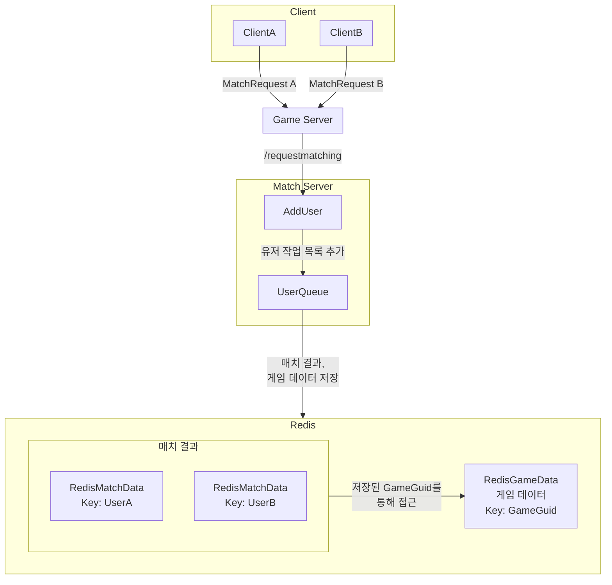
```mermaid
flowchart TD


subgraph CA[ClientA]
end

subgraph CB[ClientB]

end
CA-->|MatchRequest A|G
CB-->|MatchRequest B|G

subgraph C[Client]
CA
CB
end

subgraph G[Game Server]

end

G-->|/requestmatching|AU

subgraph M[Match Server]
AU[AddUser]-->|유저 작업 목록 추가|UserQueue
end

UserQueue--->|매치 결과,<br/> 게임 데이터 저장|R
subgraph R[Redis]
subgraph MR[매치 결과]
RMA[RedisMatchData <br/> Key: UserA]
RMB[RedisMatchData <br/> Key: UserB]
end
MR-->|저장된 GameGuid를 <br/> 통해 접근|RG
RG[RedisGameData <br/> 게임 데이터 <br/> Key: GameGuid]

end

```


================================================
File: FlowDiagrams/Omok.md
================================================
## 게임 상태 업데이트


```mermaid
flowchart TD


subgraph CA[ClientA]
GA[GameStateProvider]
GA-->TurnA
TurnA[턴확인]
TurnA-->ActionA
ActionA[돌 두기 클릭]
end
ActionA--->|/stone|G

subgraph CB[ClientB]
GB[GameStateProvider]
GB-->TurnB
TurnB[턴확인]
TurnB-->ActionB
ActionB[돌 두기 클릭]
end
ActionB--->|/stone|G

subgraph G[Game Server]
end
G-->| UpdateGame|R
R--->|GameData|G
subgraph R[Redis]
end

G<-->|/peek|GB
G<-->|/peek|GA

```

## 게임 승리 시


```mermaid
flowchart TD


subgraph CA[Client A]
GA[GameStateProvider]
ActionA[돌두기]
ActionA-->GA
end

GA--->|/stone|END

subgraph CB[Client B]
GB[GameStateProvider]
end

subgraph G[Game Server]
END[게임 승리 업데이트]
CheckGame[게임상태 확인]

end
END--->|승리 결과 전송|GDA
END--->|승리 결과 & <br/> 보상 전송|GDB

subgraph R[Redis]
GDA[게임 데이터]
GDE[게임 종료]
GDA-->GDE
end

subgraph GDB[Game DB]
Mail[우편]
Result[게임 결과]
end

GA--->|/peek|CheckGame[게임상태 확인]
CheckGame--->|게임 종료 확인|GDE

CB--->|/peek|CheckGame

```


================================================
File: GameAPIServer/GameAPIServer.csproj
================================================
<Project Sdk="Microsoft.NET.Sdk.Web">

  <PropertyGroup>
    <TargetFramework>net10.0</TargetFramework>
    <Nullable>enable</Nullable>
    <ImplicitUsings>enable</ImplicitUsings>
  </PropertyGroup>

  <ItemGroup>
    <PackageReference Include="CloudStructures" Version="3.3.0" />
    <PackageReference Include="mysqlconnector" Version="2.3.7" />
    <PackageReference Include="sqlkata" Version="2.4.0" />
    <PackageReference Include="sqlkata.execution" Version="2.4.0" />
    <PackageReference Include="stackexchange.redis" Version="2.8.12" />
    <PackageReference Include="System.Linq" Version="4.3.0" />
    <PackageReference Include="zlogger" Version="2.5.5" />
  </ItemGroup>

  <ItemGroup>
    <ProjectReference Include="..\GameShared\GameShared.csproj" />
    <ProjectReference Include="..\ServerShared\ServerShared.csproj" />
  </ItemGroup>

</Project>


================================================
File: GameAPIServer/Program.cs
================================================
using ZLogger;
using GameAPIServer.Repository.Interfaces;
using GameAPIServer.Services.Interfaces;
using GameAPIServer.Services;
using GameAPIServer.Repository;
using Microsoft.AspNetCore.Authentication.Cookies;
using GameAPIServer.Middleware;

WebApplicationBuilder builder = WebApplication.CreateBuilder(args);

// Cookie Authentication
builder.Services
	.AddAuthentication(CookieAuthenticationDefaults.AuthenticationScheme)
	.AddCookie(options =>
	{
		options.LoginPath = "/login";
		options.LogoutPath = "/logout";
		options.SlidingExpiration = true;                       // 쿠키 자동 갱신
		options.Cookie.HttpOnly = true;
		options.Cookie.SameSite = SameSiteMode.Lax;             // 임시   
		options.Cookie.SecurePolicy = CookieSecurePolicy.None;  // 임시   
		options.Cookie.MaxAge = RedisExpiryTimes.AuthTokenExpiryShort;
		options.Events.OnRedirectToLogin = context =>
		{
			context.Response.StatusCode = 200;
			return Task.CompletedTask;
		};

		options.Events.OnRedirectToAccessDenied = context =>
		{
			context.Response.StatusCode = 200;
			return Task.CompletedTask;
		};
	});

IConfiguration configuration = builder.Configuration;
builder.Services.AddCors(options =>
{
	options.AddPolicy("AllowSpecificOrigin", builder =>
	{
		builder.WithOrigins("http://localhost:3000")            // 임시 
			   .AllowAnyHeader()
			   .AllowAnyMethod()
			   .AllowCredentials();
	});
});

builder.Services.Configure<ServerConfig>(configuration.GetSection(nameof(ServerConfig)));

/* DB */
builder.Services.AddTransient<IUserRepository, UserRepository>();
builder.Services.AddTransient<IGameResultRepository, GameResultRepository>();
builder.Services.AddSingleton<IMemoryRepository, MemoryRepository>();
builder.Services.AddSingleton<IMasterRepository, MasterRepository>();
builder.Services.AddSingleton<IMailRepository, MailRepository>();
builder.Services.AddSingleton<IAttendanceRepository, AttendanceRepository>();
builder.Services.AddSingleton<IItemRepository, ItemRepository>();

/* Service */
builder.Services.AddTransient<IOmokService, OmokService>();
builder.Services.AddTransient<IMatchService, MatchService>();
builder.Services.AddTransient<IDataLoadService, DataLoadService>();
builder.Services.AddTransient<IAuthService, AuthService>();
builder.Services.AddTransient<IMailService, MailService>();
builder.Services.AddTransient<IAttendanceService, AttendanceService>();
builder.Services.AddTransient<IItemService, ItemService>();
builder.Services.AddTransient<IGameDataService, GameDataService>();

/* Http Client */
builder.Services.AddHttpClient<IAuthService, AuthService>();    
builder.Services.AddHttpClient<IMatchService, MatchService>();

builder.Services.AddControllers();

SetLogger();

WebApplication app = builder.Build();

if (false == await app.Services.GetService<IMasterRepository>().Load())
{
	return;
}

ILoggerFactory loggerFactory = app.Services.GetRequiredService<ILoggerFactory>();

app.UseCors("AllowSpecificOrigin");

app.UseRouting();
app.UseAuthentication();  // Must come between Routing and Endpoints
app.UseAuthorization();   // Must come after authentication
app.UseMiddleware<VersionCheck>();
app.UseMiddleware<CheckUserAuthAndLoadUserData>();
app.MapDefaultControllerRoute();

IMasterRepository masterDataDb = app.Services.GetRequiredService<IMasterRepository>();
await masterDataDb.Load();

app.Run();

void SetLogger()
{
	ILoggingBuilder logging = builder.Logging;
	logging.ClearProviders();

	var fileDir = ((IConfiguration)builder.Configuration)["logdir"];

	var exists = Directory.Exists(fileDir);

	if (!exists)
	{
		Directory.CreateDirectory(fileDir);
	}

	logging.AddZLoggerRollingFile(
		options =>
		{
			options.UseJsonFormatter();
			options.FilePathSelector = (timestamp, sequenceNumber) => $"{fileDir}{timestamp.ToLocalTime():yyyy-MM-dd}_{sequenceNumber:000}.log";
			options.RollingInterval = ZLogger.Providers.RollingInterval.Day;
			options.RollingSizeKB = 1024;
		});

	_ = logging.AddZLoggerConsole(options =>
	{
		options.UseJsonFormatter();
	});
}


================================================
File: GameAPIServer/RedisKeyGenerator.cs
================================================
癤퓆amespace GameAPIServer;

public class RedisKeyGenerator
{
	const string loginUid = "Uid_";
	const string userLockKey = "ULOCK_";

	public static string MakeUidKey(string id)
	{
		return loginUid + id;
	}

	public static string MakeUserLockKey(string id)
	{
		return userLockKey + id;
	}

}


================================================
File: GameAPIServer/Security.cs
================================================
癤퓎sing System;
using System.Linq;
using System.Security.Cryptography;
using System.Text;

namespace GameAPIServer.Services;

public class Security
{
	const String AllowableCharacters = "abcdefghijklmnopqrstuvwxyz0123456789";

	public static String MakeHashingPassWord(String saltValue, String pw)
	{
		var sha = SHA256.Create();
		var hash = sha.ComputeHash(Encoding.ASCII.GetBytes(saltValue + pw));
		var stringBuilder = new StringBuilder();
		foreach (var b in hash)
		{
			stringBuilder.AppendFormat("{0:x2}", b);
		}

		return stringBuilder.ToString();
	}

	public static String SaltString()
	{
		var bytes = new Byte[64];
		using (var random = RandomNumberGenerator.Create())
		{
			random.GetBytes(bytes);
		}

		return new String(bytes.Select(x => AllowableCharacters[x % AllowableCharacters.Length]).ToArray());
	}

	public static String CreateAuthToken()
	{
		var bytes = new Byte[25];
		using (var random = RandomNumberGenerator.Create())
		{
			random.GetBytes(bytes);
		}

		return new String(bytes.Select(x => AllowableCharacters[x % AllowableCharacters.Length]).ToArray());
	}

}


================================================
File: GameAPIServer/apiTest.http
================================================
@GameAPIServer_HostAddress = http://localhost:5265

GET {{GameAPIServer_HostAddress}}/weatherforecast/
Accept: application/json

###


================================================
File: GameAPIServer/appsettings.Development.json
================================================
{
  "Logging": {
    "LogLevel": {
      "Default": "Information",
      "Microsoft.AspNetCore": "Warning"
    }
  }
}


================================================
File: GameAPIServer/appsettings.json
================================================
{
    "Logging": {
        "LogLevel": {
            "Default": "Information",
            "Microsoft.AspNetCore": "Warning"
        },
        "ZLoggerConsole": {
            "LogLevel": {
                "Default": "Information"
            }
        }
    },
    "logdir": "./log/",
    "AllowedHosts": "*",
  "ServerConfig": {
    "HiveDb": "Server=localhost;Port=3306;User ID=shanabunny;Password=comsooyoung!1;Database=hivedb;Pooling=true;Min Pool Size=0;Max Pool Size=100;AllowUserVariables=True;",
    "GameDb": "Server=localhost;Port=3306;User ID=shanabunny;Password=comsooyoung!1;Database=gamedb;Pooling=true;Min Pool Size=0;Max Pool Size=100;AllowUserVariables=True;",
    "MasterDb": "Server=localhost;Port=3306;User ID=shanabunny;Password=comsooyoung!1;Database=masterdb;Pooling=true;Min Pool Size=0;Max Pool Size=100;AllowUserVariables=True;",
    "Redis": "localhost",
    "HiveServer": "http://localhost:8080",
    "MatchServer": "http://localhost:9000"
  }
}


================================================
File: GameAPIServer/Controllers/AttendanceController.cs
================================================
using GameAPIServer.Services.Interfaces;
using Microsoft.AspNetCore.Mvc;
using ZLogger;

namespace GameAPIServer.Controllers;

[Route("[controller]")]
[ApiController]
public class Attendance : SecureController<Attendance>
{
	private readonly IAttendanceService _attendanceService;

	public Attendance(ILogger<Attendance> logger, IAttendanceService attendanceService) : base(logger)
	{
		_attendanceService = attendanceService;
	}

	/// <summary>
	/// 異쒖꽍 媛깆떊
	/// </summary>
	[HttpPost]
	public async Task<ErrorCodeDTO> Attend()
	{
		AttendanceResponse response = new();

		Int64 uid = GetUserUid();

		response.Result = await _attendanceService.Attend(uid);

		if (ErrorCode.None != response.Result)
		{
			_logger.ZLogError($"[UpdateUserAttendance] ErrorCode : {response.Result}");
			return response;
		}
		return response;
	}
}


================================================
File: GameAPIServer/Controllers/GameDataController.cs
================================================
using GameAPIServer.Services.Interfaces;
using Microsoft.AspNetCore.Mvc;
using ZLogger;

namespace GameAPIServer.Controllers;

[Route("[controller]")]
[ApiController]
public class GameData : SecureController<UserData>
{
	private readonly IGameDataService _gameDataService;

	public GameData(ILogger<UserData> logger, IGameDataService gameDataService) : base(logger)
	{
		_gameDataService = gameDataService;
	}

	[HttpPost]
	public GameDataLoadResponse LoadGameData()
	{
		GameDataLoadResponse response = new();
		response.GameData = _gameDataService.LoadGameData();
		return response;
	}
}


================================================
File: GameAPIServer/Controllers/LoginController.cs
================================================
using GameAPIServer.Services.Interfaces;
using Microsoft.AspNetCore.Authentication.Cookies;
using Microsoft.AspNetCore.Authentication;
using Microsoft.AspNetCore.Mvc;
using ZLogger;

namespace GameAPIServer.Controllers;

[Route("[controller]")]
[ApiController]
public class Login : ControllerBase
{
	private readonly ILogger<Login> _logger;
	private readonly IAuthService _authService;

	public Login(ILogger<Login> logger, IAuthService authService)
	{
		_logger = logger;
		_authService = authService;
	}

	/// <summary>
	/// 계정 로그인 
	/// </summary>
	/// <remarks>
	/// Hive 계정을 이용하여 게임 계정에 로그인하거나 새로운 게임 계정을 생성합니다.
	/// </remarks>
	[HttpPost]
	public async Task<LoginResponse> LoginUser(LoginRequest request)
	{
		LoginResponse response = new();

		var (errorCode, result) = await _authService.Login(request.PlayerId, request.HiveToken);
		if (errorCode != ErrorCode.None || result == null)
		{
			response.Result = errorCode;
			return response;
		}

		var (claimsPrincipal, authProperties) = _authService.RegisterUserClaims(result);
		await HttpContext.SignInAsync(CookieAuthenticationDefaults.AuthenticationScheme, 
			claimsPrincipal, authProperties);
		
		_logger.ZLogInformation($"[User Login] UserUid : {result.Uid}");

		return response;
	}
}


================================================
File: GameAPIServer/Controllers/LogoutController.cs
================================================
using GameAPIServer.Services.Interfaces;
using Microsoft.AspNetCore.Authentication.Cookies;
using Microsoft.AspNetCore.Authentication;
using Microsoft.AspNetCore.Mvc;
using ZLogger;

namespace GameAPIServer.Controllers;

[Route("[controller]")]
[ApiController]
public class Logout : ControllerBase
{
	private readonly ILogger<Logout> _logger;
	private readonly IAuthService _authService;

	public Logout(ILogger<Logout> logger, IAuthService authService)
	{
		_logger = logger;
		_authService = authService;
	}

	/// <summary>
	/// 계정 로그아웃 
	/// <remarks>
	/// 쿠키 및 토큰을 삭제하여 로그아웃합니다.
	/// </remarks>
	[HttpPost]
	public async Task<LogoutResponse> LogoutUser()
	{
		LogoutResponse response = new();

		var uidClaim = User.FindFirst("uid")?.Value;
		if (string.IsNullOrEmpty(uidClaim))
		{
			response.Result = ErrorCode.ClaimAuthTokenUserNotFound;
			return response;
		}

		response.Result = await _authService.Logout(uidClaim);
		if (response.Result != ErrorCode.None)
		{
			_logger.ZLogError($"[User Logout Fail] Useruid : {uidClaim}");
		}

		await HttpContext.SignOutAsync(CookieAuthenticationDefaults.AuthenticationScheme);

		return response;
	}
}


================================================
File: GameAPIServer/Controllers/MailController.cs
================================================
using GameAPIServer.Services.Interfaces;
using Microsoft.AspNetCore.Mvc;
using ZLogger;

namespace GameAPIServer.Controllers;

[ApiController]
[Route("[controller]")]
public class Mail : SecureController<Mail>
{
	private readonly IMailService _mailService;

	public Mail(ILogger<Mail> logger, IMailService MailService) : base(logger)
	{
		_mailService = MailService;
	}

	[HttpPost("check")]
	public async Task<GetMailResponse> GetMail()
	{
		GetMailResponse response = new();

		Int64 uid = GetUserUid();

		(response.Result, response.MailData) = await _mailService.GetMails(uid);

		if (ErrorCode.None != response.Result)
		{
			_logger.ZLogError($"[CheckMail] Error: {response.Result}");
		}

		return response;
	}

	[HttpPost("receive")]
	public async Task<ReceiveMailResponse> ReceiveMailReward([FromBody] ReceiveMailRequest request)
	{
		ReceiveMailResponse response = new();

		Int64 uid = GetUserUid();

		(response.Result) = await _mailService.ReceiveRewardFromMail(uid, request.MailUid);

		if (ErrorCode.None != response.Result)
		{
			_logger.ZLogError($"[CheckMail] Error: {response.Result}");
		}

		return response;
	}


	[HttpPost("read")]
	public async Task<ReadMailResponse> ReadMail([FromBody] ReadMailRequest request)
	{
		ReadMailResponse response = new();

		Int64 uid = GetUserUid();

		(response.Result, response.MailInfo, response.Items) = await _mailService.ReadMail(uid, request.MailUid);

		if (ErrorCode.None != response.Result)
		{
			_logger.ZLogError($"[CheckMail] Error: {response.Result}");
		}

		return response;
	}

	[HttpPost("send")]
	public async Task<SendMailResponse> SendMail([FromBody] SendMailRequest request)
	{
		SendMailResponse response = new();

		Int64 uid = GetUserUid();

		response.Result = await _mailService.SendMail(uid, request.ReceiveUid, request.Title, request.Content);

		if (ErrorCode.None != response.Result)
		{
			_logger.ZLogError($"[CheckMail] Error: {response.Result}");
		}

		return response;
	}


	[HttpPost("delete")]
	public async Task<DeleteMailResponse> DeleteMail([FromBody] DeleteMailRequest request)
	{
		DeleteMailResponse response = new();

		Int64 uid = GetUserUid();

		response.Result = await _mailService.DeleteMail(uid, request.MailUid);

		if (ErrorCode.None != response.Result)
		{
			_logger.ZLogError($"[CheckMail] Error: {response.Result}");
		}

		return response;
	}
}


================================================
File: GameAPIServer/Controllers/MatchController.cs
================================================
using GameAPIServer.Services.Interfaces;
using Microsoft.AspNetCore.Mvc;
using ZLogger;

namespace GameAPIServer.Controllers;

[ApiController]
[Route("[controller]")]
public class Match : SecureController<Match>
{
	private readonly IMatchService _matchService;

	public Match(ILogger<Match> logger, IMatchService matchService) : base(logger)
	{
		_matchService = matchService;
	}

	/// <summary>
	/// 매치 요청
	/// </summary>
	/// <remarks>
	/// 매칭을 시작 요청합니다
	/// </remarks>
	[HttpPost("start")]
	public async Task<CheckMatchResponse> StartMatch()
	{
		CheckMatchResponse response = new();

		Int64 Uid = GetUserUid();

		response.Result = await _matchService.StartMatch(Uid);

		if (ErrorCode.None != response.Result)
		{
			_logger.ZLogError($"[CheckMatch] Error: {response.Result}");
		}

		return response;
	}

    /// <summary>
    /// 매치 상태 체크
    /// </summary>
    /// <remarks>
    /// 매치 완료 여부를 체크합니다.
    /// </remarks>
    [HttpPost("check")]
	public async Task<CheckMatchResponse> CheckMatchCompletion()
	{
		CheckMatchResponse response = new();

		Int64 Uid = GetUserUid();

		(response.Result, var matchData) = await _matchService.CheckMatch(Uid);

		if (ErrorCode.None != response.Result)
		{
			_logger.ZLogError($"[MatchCheck] Error: {response.Result}");
			return response;
		}

		response.MatchData = matchData;
		return response;
	}

}


================================================
File: GameAPIServer/Controllers/OmokController.cs
================================================
using GameAPIServer.Services.Interfaces;
using Microsoft.AspNetCore.Mvc;
using ZLogger;

namespace GameAPIServer.Controllers;

[Route("[controller]")]
[ApiController]
public class Omok : SecureController<Omok>
{
	private readonly IOmokService _omokService;

	public Omok(ILogger<Omok> logger, IOmokService gameService) : base(logger)
	{
		_omokService = gameService;
	}

	/// <summary>
	/// 게임 참여하기
	/// </summary>
	/// <remarks>
	/// 게임룸에 입장 합니다
	/// </remarks>
	[HttpPost("enter")]
	public async Task<EnterGameResponse> EnterGame()
	{
		var response = new EnterGameResponse();

		Int64 uid = GetUserUid();

		(response.Result, response.GameData) = await _omokService.EnterGame(uid);

		if (response.Result != ErrorCode.None)
		{
			_logger.ZLogError($"[Omok EnterGame] Error: {response.Result}");
			return response;
		}

		return response;
	}

	/// <summary>
	/// 게임 확인
	/// </summary>
	/// <remarks>
	/// 게임 확인을 통해 게임 참여 가능여부 등을 체크 합니다
	/// </remarks>
	[HttpPost("peek")]
	public async Task<PeekGameResponse> CheckGame()
	{
		var response = new PeekGameResponse();

		Int64 uid = GetUserUid();

		(response.Result, response.GameData) = await _omokService.PeekGame(uid);

		if (response.Result != ErrorCode.None)
		{
			_logger.ZLogError($"[Omok CheckGame] Error: {response.Result}");
		}

		return response;
	}

	/// <summary>
	/// 돌 두기
	/// </summary>
	/// <remarks>
	/// 진행중인 게임에서 돌을 둡니다
	/// </remarks>
	[HttpPost("stone")]
	public async Task<PlayOmokResponse> PutGameStone([FromBody] PlayOmokRequest request)
	{
		var response = new PlayOmokResponse();

		Int64 uid = GetUserUid();

		(response.Result, response.GameData) = await _omokService.SetOmokStone(uid, request.PosX, request.PosY);

		if (response.Result != ErrorCode.None)
		{
			_logger.ZLogError($"[Omok PutGameStone] Error: {response.Result}");
		}

		return response;
	}

}


================================================
File: GameAPIServer/Controllers/SecureController.cs
================================================
using Microsoft.AspNetCore.Mvc;
namespace GameAPIServer.Controllers;

[Route("[controller]")]
[ApiController]
public class SecureController<T> : ControllerBase
{
	protected readonly ILogger<T> _logger;

	public SecureController(ILogger<T> logger)
	{
		_logger = logger;
	}

	protected Int64 GetUserUid()
	{
		Int64 uid = 0;

		string? uidClaim = User.FindFirst("Uid")?.Value;
		if (string.IsNullOrEmpty(uidClaim))
		{
			return uid;
		}

		Int64.TryParse(uidClaim, out uid);

		return uid;
	}
}


================================================
File: GameAPIServer/Controllers/UserDataController.cs
================================================
using GameAPIServer.Services.Interfaces;
using Microsoft.AspNetCore.Mvc;
using ZLogger;

namespace GameAPIServer.Controllers;

[Route("[controller]")]
[ApiController]
public class UserData : SecureController<UserData>
{
	private readonly IDataLoadService _dataLoadService;
	private readonly IAuthService _userService;

	public UserData(ILogger<UserData> logger, IDataLoadService dataLoadService, IAuthService authService) : base(logger)
	{
		_dataLoadService = dataLoadService;
		_userService = authService;
	}

	[HttpGet]
	public async Task<UserDataLoadResponse> GetUserInfo()
	{
		UserDataLoadResponse response = new();

		Int64 uid = GetUserUid();

		(response.Result, response.UserData) = await _dataLoadService.LoadUserData(uid);

		if (ErrorCode.None != response.Result)
		{
			_logger.ZLogError($"[UserData Load] ErrorCode : {response.Result}");
			return response;
		}

		return response;
	}

	[HttpPost("items")]
	public async Task<UserItemLoadResponse> GetUserItem()
	{
		UserItemLoadResponse response = new();

		Int64 uid = GetUserUid();

		(response.Result, response.ItemData) = await _dataLoadService.LoadItemData(uid);

		if (ErrorCode.None != response.Result)
		{
			_logger.ZLogError($"[UserData Load] ErrorCode : {response.Result}");
			return response;
		}

		return response;
	}

	[HttpPost("profile")]
	public async Task<UserProfileLoadResponse> GetUserProfile([FromBody] UserProfileLoadRequest request)
	{
		UserProfileLoadResponse response = new();

		(response.Result, response.ProfileData) = await _dataLoadService.LoadUserProfile(request.Uid);

		if (ErrorCode.None != response.Result)
		{
			_logger.ZLogError($"[UserData Load] ErrorCode : {response.Result}");
			return response;
		}

		return response;
	}

	[HttpPost("update/nickname")]
	public async Task<UpdateNicknameResponse> ChangeNickname([FromBody] UpdateNicknameRequest request)
	{
		UpdateNicknameResponse response = new();

		var uid = GetUserUid();

		response.Result = await _userService.UpdateNickname(uid, request.Nickname);

		if (ErrorCode.None != response.Result)
		{
			_logger.ZLogError($"[UserData Load] ErrorCode : {response.Result}");
			return response;
		}

		return response;
	}
}


================================================
File: GameAPIServer/Middleware/CheckUserAuth.cs
================================================
using System.Net;
using GameAPIServer.Models.GameDb;
using GameAPIServer.Models.RedisDb;
using GameAPIServer.Repository.Interfaces;

namespace GameAPIServer.Middleware;
public class CheckUserAuthAndLoadUserData
{
	private readonly IMemoryRepository _memoryDb;
	private readonly RequestDelegate _next;

	public CheckUserAuthAndLoadUserData(RequestDelegate next, IMemoryRepository memoryDb)
	{
		_memoryDb = memoryDb;
		_next = next;
	}

	public async Task Invoke(HttpContext context)
	{
		try
		{
			var path = context.Request.Path.Value;
			var uidClaim = GetUidClaim(context);

			if (IsIgnorePath(path))
			{
				await _next(context);
				return;
			}

			if (false == IsAuthenticated(context))
			{
				await SendError(context, ErrorCode.ClaimInvalid);
				return;
			}

			if (true == string.IsNullOrEmpty(uidClaim))
			{
				await SendError(context, ErrorCode.ClaimUidNotFound);
				return;
			}

			var result = await IsTokenValid(uidClaim, context);
			if (ErrorCode.None != result)
			{
				await SendError(context, result);
				return;
			}

			var userLockKey = RedisKeyGenerator.MakeUserLockKey(uidClaim);
			RedisUserLock userLock = new();

			if (false == await IsUserLockSecure(userLockKey, userLock))
			{
				await SendError(context, ErrorCode.RedisUserLockOccupied);
				return;
			}

			if (Int64.TryParse(uidClaim, out var uid))
			{
				context.Items["Uid"] = uid; 
			}
			else
			{
				await SendError(context, ErrorCode.ClaimUidInvalid);
				return;
			}

			await _next(context);
			await _memoryDb.UnlockDataAsync(userLockKey, userLock);
		}
		catch
		{
			context.Response.StatusCode = StatusCodes.Status500InternalServerError;
			await SendError(context, ErrorCode.UnhandledException);
		}	
	}

	private async Task<bool> IsUserLockSecure(string userLockKey, RedisUserLock userLock)
	{
		return await SetLock(userLockKey, userLock);

	}

	private async Task<ErrorCode> IsTokenValid(string uid, HttpContext context)
	{
		var tokenClaim = GetTokenClaim(context);

		var userAuthData = await GetUserAuth(uid);
		if (null == userAuthData)
		{
			return ErrorCode.ClaimAuthTokenUserNotFound;
		}

		if (userAuthData.Token != tokenClaim)
		{
			return ErrorCode.ClaimAuthTokenInvalid;
		}

		return ErrorCode.None;
	}

	private static string? GetTokenClaim(HttpContext context)
	{
		var tokenClaim = context.User.FindFirst("Token")?.Value;
		return tokenClaim;
	}
	private static string? GetUidClaim(HttpContext context)
	{
		var uidClaim = context.User.FindFirst("Uid")?.Value;
		return uidClaim;
	}

	private static bool IsAuthenticated(HttpContext context)
	{
		if (context.User.Identity?.IsAuthenticated == true)
		{
			return true;
		}

		return false;
	}

	private static bool IsIgnorePath(string? path)
	{
		if (string.IsNullOrEmpty(path))
		{
			return false;
		}

		if (string.Compare(path, "/Login", StringComparison.OrdinalIgnoreCase) == 0)
		{
			return true;
		}

		return false;
	}

	private async Task<RedisUserAuth?> GetUserAuth(string uidClaim)
	{
		var key = RedisKeyGenerator.MakeUidKey(uidClaim);
		var (errorCode, userInfo) = await _memoryDb.GetDataAsync<RedisUserAuth>(key);
		return errorCode == ErrorCode.None ? userInfo : null;
	}

	private async Task<bool> SetLock(string key, RedisUserLock userLock)
	{
		if (await _memoryDb.LockDataAsync(key, userLock, RedisExpiryTimes.RequestLockExpiry))
		{
			return true;
		}

		return false;
	}

	private static async Task<bool> SendError(HttpContext context, ErrorCode errorCode, 
		int statusCode = StatusCodes.Status401Unauthorized)
	{
		context.Response.StatusCode = statusCode;
		await context.Response.WriteAsJsonAsync(new ErrorCodeDTO
		{
			Result = errorCode
		});
		return true;
	}
}


================================================
File: GameAPIServer/Middleware/VersionCheck.cs
================================================
using GameAPIServer.Repository.Interfaces;
using System.Text.Json;

namespace GameAPIServer.Middleware;
public class VersionCheck
{
	readonly RequestDelegate _next;
	readonly ILogger<VersionCheck> _logger;
	readonly IMasterRepository _masterDb;

	public VersionCheck(RequestDelegate next, ILogger<VersionCheck> logger, IMasterRepository masterDb)
	{
		_next = next;
		_logger = logger;
		_masterDb = masterDb;
	}

	public async Task Invoke(HttpContext context)
	{
		var appVersion = context.Request.Headers["AppVersion"].ToString();
		var masterDataVersion = context.Request.Headers["MasterDataVersion"].ToString();

		if (!(await VersionCompare(appVersion, masterDataVersion, context)))
		{
			return;
		}

		await _next(context);
	}

	async Task<bool> VersionCompare(string appVersion, string masterDataVersion, HttpContext context)
	{
		if (!appVersion.Equals(_masterDb._version!.app_version))
		{
			context.Response.StatusCode = StatusCodes.Status426UpgradeRequired;
			var errorJsonResponse = JsonSerializer.Serialize(new MiddlewareResponse
			{
				result = ErrorCode.InvalidAppVersion
			});
			await context.Response.WriteAsync(errorJsonResponse);
			return false;
		}

		if (!masterDataVersion.Equals(_masterDb._version!.master_data_version))
		{
			context.Response.StatusCode = StatusCodes.Status426UpgradeRequired;
			var errorJsonResponse = JsonSerializer.Serialize(new MiddlewareResponse
			{
				result = ErrorCode.InvalidMasterDataVersion
			});
			await context.Response.WriteAsync(errorJsonResponse);
			return false;
		}

		return true;
	}

	class MiddlewareResponse
	{
		public ErrorCode result { get; set; }
	}
}


================================================
File: GameAPIServer/Models/MasterDB.cs
================================================
namespace GameAPIServer.Models.MasterDb;

public class ItemTemplate
{
	public static string[] SelectColumns =
	[
		"item_id as ItemId",
		"item_name as ItemName",
		"item_image as ItemImage",
	];
}

public class MoneyTemplate
{
	public static string[] SelectColumns =
	[
		"money_code as MoneyCode",
		"money_name as MoneyName",
	];
}

public class RewardTemplate
{
	public static string[] SelectColumns =
	[
		"reward_uid as RewardUid",
		"reward_code as RewardCode",
		"item_id as ItemId",
		"item_count as ItemCount",
	];
}

public class AttendanceTemplate
{
	public static string[] SelectColumns =
	[
		"attendance_name as Name",
		"attendance_code as AttendanceCode",
		"enabled_yn as Enabled",
		"repeatable_yn as Repeatable",
	];
}

public class AttendanceDetailTemplate
{
	public static string[] SelectColumns =
	[
		"attendance_code as AttendanceCode",
		"attendance_seq as AttendanceCount",
		"reward_code as RewardCode",
	];
}

public class Shop
{
	public int ShopCode { get; set; }
	public string ShopName { get; set; } = "";
	public bool Enabled { get; set; }

	public static string[] SelectColumns =
	[
		"shop_code as ShopCode",
		"shop_name as ShopName",
		"enabled_yn as Enabled",
	];
}

public class ShopItem
{
	public int ShopCode { get; set; }
	public int RewardCode { get; set; }
	public int CostCode { get; set; }
	public int CostAmount { get; set; }

	public static string[] SelectColumns =
	[
		"shop_code as ShopCode",
		"reward_code as RewardCode",
		"cost_code as CostCode",
		"cost_amount as CostAmount",
	];
}


================================================
File: GameAPIServer/Models/RedisDB.cs
================================================
namespace GameAPIServer.Models.RedisDb;
/*
 * Authentication
 */
public class RedisUserAuth
{
	public Int64 Uid { get; set; } = 0;
	public string Token { get; set; } = "";
}

public class RedisUserLock
{

}


================================================
File: GameAPIServer/Models/GameDB/Attendance.cs
================================================
namespace GameAPIServer.Models.GameDb;

public class UserAttendance 
{
	public Int64 user_uid{ get; set; }
	public int attendance_code { get; set; }
	public int attendance_seq { get; set; }


	public static string[] SelectColumns =
	[
		"user_uid as Uid",
		"attendance_code as AttendanceCode",
		"attendance_seq as AttendanceCount",
	];
}


================================================
File: GameAPIServer/Models/GameDB/GameResult.cs
================================================
namespace GameAPIServer.Models.GameDb;

public class GameResult
{
	public Int64 game_result_uid { get; set; }
	public Int64 black_user_uid{ get; set; }
	public Int64 white_user_uid{ get; set; }
	public DateTime start_dt { get; set; }
	public DateTime end_dt { get; set; }
	public int result_code { get; set; }
}


================================================
File: GameAPIServer/Models/GameDB/Mail.cs
================================================
namespace GameAPIServer.Models.GameDb;


public class Mail
{
    public Int64 mail_uid { get; set; }
    public Int64 receive_user_uid{ get; set; }
	public Int64 send_user_uid{ get; set; }
	public string mail_title { get; set; } = "";
    public string mail_content { get; set; } = "";
    public int mail_status_code { get; set; } = 0;
    public int reward_code { get; set; } = 0;
    public DateTime create_dt { get; set; }
    public DateTime update_dt { get; set; }
    public DateTime expire_dt { get; set; }

	public static string[] SelectColumns =
	{
		"mail_uid as MailUid",
		"receive_user_uid as ReceiveUid",
		"send_user_uid as SendUid",
		"mail_title as Title",
		"mail_content as Content",
		"mail_status_code as StatusCode",
		"reward_code as RewardCode",
		"create_dt as CreateDateTime",
		"update_dt as UpdateDateTime",
		"expire_dt as ExpireDateTime",
	};
}


================================================
File: GameAPIServer/Models/GameDB/User.cs
================================================
namespace GameAPIServer.Models.GameDb;
public class User : UserInfo
{
	public static string[] SelectColumns =
	[
		"user_uid as Uid",
		"user_name as Nickname",
		"create_dt as CreatedDateTime",
		"recent_login_dt as RecentLoginDateTime",
		"attendance_update_dt as AttendanceUpdateTime",
	];
}

public class UserMoney : UserMoneyInfo
{
	public static string[] SelectColumns =
	[
		"money_code as MoneyCode",
		"money_amount as MoneyAmount",
	];
}

public class UserItem 
{
	public Int64 user_uid{ get; set; }
	public int item_id { get; set; }
	public int item_cnt { get; set; }

	public static string[] SelectColumns =
	[
		"item_id as ItemId",
		"item_cnt as ItemCount",
	];
}


================================================
File: GameAPIServer/Properties/launchSettings.json
================================================
{
  "$schema": "http://json.schemastore.org/launchsettings.json",
  "iisSettings": {
    "windowsAuthentication": false,
    "anonymousAuthentication": true,
    "iisExpress": {
      "applicationUrl": "http://localhost:10469",
      "sslPort": 0
    }
  },
  "profiles": {
    "GameAPI Server": {
      "commandName": "Project",
      "dotnetRunMessages": true,
      "launchBrowser": false,
      "applicationUrl": "http://localhost:8000",
      "environmentVariables": {
        "ASPNETCORE_ENVIRONMENT": "Development"
      }
    },
    //"IIS Express": {
    //  "commandName": "IISExpress",
    //  "launchBrowser": true,
    //  "launchUrl": "weatherforecast",
    //  "environmentVariables": {
    //    "ASPNETCORE_ENVIRONMENT": "Development"
    //  }
    //}
  }
}


================================================
File: GameAPIServer/Repository/AttendanceRepository.cs
================================================
using GameAPIServer.Models.GameDb;
using GameAPIServer.Models.MasterDb;
using GameAPIServer.Repository.Interfaces;
using Microsoft.Extensions.Options;
using MySqlConnector;
using SqlKata.Execution;
using System.Data;
using ZLogger;

namespace GameAPIServer.Repository;

public class AttendanceRepository : IAttendanceRepository
{
	readonly ILogger<AttendanceRepository> _logger;
	readonly IOptions<ServerConfig> _dbConfig;

	IDbConnection _dbConn;
	SqlKata.Compilers.MySqlCompiler _compiler;
	QueryFactory _queryFactory;

	public AttendanceRepository(ILogger<AttendanceRepository> logger, IOptions<ServerConfig> dbConfig)
	{
		_dbConfig = dbConfig;
		_logger = logger;

		Open();

		_compiler = new SqlKata.Compilers.MySqlCompiler();
		_queryFactory = new SqlKata.Execution.QueryFactory(_dbConn, _compiler);
	}

	public async Task<IEnumerable<AttendanceInfo>> GetAttendanceList(Int64 uid)
	{
		return await _queryFactory.Query("attendance").Where("user_uid", uid)
													.Select(UserAttendance.SelectColumns)
													.GetAsync<AttendanceInfo>();
	}

	public async Task<(ErrorCode, IEnumerable<AttendanceInfo>)> UpdateAttendanceList(Int64 uid)
	{
		try
		{

			var result = await _queryFactory.Query("attendance")
									.Where("user_uid", uid)
									.IncrementAsync("attendance_seq", 1);

			var rows = await _queryFactory.Query("attendance")
											.Where("user_uid", uid)
											.Select(UserAttendance.SelectColumns)
											.GetAsync<AttendanceInfo>();

			var updateResult = await _queryFactory.Query("user_info").Where("user_uid", uid).UpdateAsync(new
			{
				attendance_update_dt = DateTime.Now,
			});

			return (ErrorCode.None, rows);
		}
		catch (Exception e)
		{
			_logger.ZLogError(e, $"[UpdateAttendence Failed] ErrorMessage: {e.Message}");
			return (ErrorCode.DbAttendanceUpdateException, null);
		}
	}

	public async Task<bool> InsertMissingAttendanceList(Int64 uid, List<Attendance> list)
	{
		if (0 == list.Count)
		{
			return true;
		}

		try
		{
			var cols = new[] { "user_uid", "attendance_code" };
			var data = list.Select(item => new object[] { uid, item.AttendanceCode }).ToArray();
			var result = await _queryFactory.Query("attendance").InsertAsync(cols, data);

			return result > 0;
		}
		catch (Exception e)
		{
			_logger.ZLogError(e, $"[InsertAttendance Failed] ErrorMessage: {e.Message}");
			return false;
		}
	}

	void Open()
	{
		_dbConn = new MySqlConnection(_dbConfig.Value.GameDb);
		_dbConn.Open();
	}

	void Close()
	{
		_dbConn.Close();
	}

	public void Dispose()
	{
		Close();
	}
}


================================================
File: GameAPIServer/Repository/GameResultRepository.cs
================================================
using System.Data;
using GameAPIServer.Models.GameDb;
using GameAPIServer.Repository.Interfaces;
using Microsoft.Extensions.Options;
using MySqlConnector;
using SqlKata.Execution;
using ZLogger;

namespace GameAPIServer.Repository;

public class GameResultRepository : IGameResultRepository
{
	readonly ILogger<GameResultRepository> _logger;
	readonly IOptions<ServerConfig> _dbConfig;

	IDbConnection _dbConn;
	SqlKata.Compilers.MySqlCompiler _compiler;
	QueryFactory _queryFactory;

	public GameResultRepository(ILogger<GameResultRepository> logger, IOptions<ServerConfig> dbConfig)
	{
		_dbConfig = dbConfig;
		_logger = logger;

		Open();

		_compiler = new SqlKata.Compilers.MySqlCompiler();
		_queryFactory = new SqlKata.Execution.QueryFactory(_dbConn, _compiler);
	}

	public async Task<IEnumerable<GameResult>?> GetGameResultByUserUid(Int64 uid)
	{
		try
		{
			return await _queryFactory.Query("game_result")
								.Where("black_user_uid", uid)
								.OrWhere("white_user_uid", uid)
								.GetAsync<GameResult>();
		}
		catch (Exception e)
		{
			_logger.ZLogError(e, $"[GetGameResultByUserUid Failed] Uid:{uid}, ErrorMessage:{e.Message}");
			return null;
		}
	}

	public async Task<ErrorCode> InsertGameResult(GameResult gameResult)
	{
		try
		{
			var result = await _queryFactory.Query("game_result")
								   .InsertGetIdAsync<int>(new
								   {
									   gameResult.black_user_uid,
									   gameResult.white_user_uid,
									   gameResult.result_code,
									   gameResult.start_dt,
								   });

			if (result > 0)
				return ErrorCode.None;

			return ErrorCode.DbGameResultInsertFail;

		}
		catch (Exception e)
		{
			_logger.ZLogError(e, $"[InsertGameResult Failed] ErrorMessage: {e.Message}");
			return ErrorCode.DbGameResultInsertException;
		}
	}

	public void Dispose()
	{
		Close();
	}

	void Open()
	{
		_dbConn = new MySqlConnection(_dbConfig.Value.GameDb);
		_dbConn.Open();
	}

	void Close()
	{
		_dbConn.Close();
	}
}


================================================
File: GameAPIServer/Repository/ItemRepository.cs
================================================
using System.Data;
using GameAPIServer.Controllers;
using GameAPIServer.Models.GameDb;
using GameAPIServer.Repository.Interfaces;
using Microsoft.Extensions.Options;
using MySqlConnector;
using SqlKata.Execution;
using ZLogger;

namespace GameAPIServer.Repository;

public class ItemRepository : IItemRepository
{
	readonly ILogger<ItemRepository> _logger;
	readonly IOptions<ServerConfig> _dbConfig;

	IDbConnection _dbConn;
	SqlKata.Compilers.MySqlCompiler _compiler;
	QueryFactory _queryFactory;

	public ItemRepository(ILogger<ItemRepository> logger, IOptions<ServerConfig> dbConfig)
	{
		_dbConfig = dbConfig;
		_logger = logger;

		Open();

		_compiler = new SqlKata.Compilers.MySqlCompiler();
		_queryFactory = new SqlKata.Execution.QueryFactory(_dbConn, _compiler);
	}
	public async Task<bool> InsertUserItem(UserItem item)
	{
		try
		{
			string query = $@"
            INSERT INTO user_item (user_uid, item_id, item_cnt)
            VALUES ({item.user_uid}, {item.item_id}, {item.item_cnt})
            ON DUPLICATE KEY UPDATE item_cnt = item_cnt + {item.item_cnt};";

			var result = await _queryFactory.StatementAsync(query);
			return result > 0;
		}
		catch (Exception e)
		{
			_logger.ZLogError(e, $"[InsertUserItem Failed] ErrorMessage: {e.Message}");
			return false;
		}
	}

	void Open()
	{
		_dbConn = new MySqlConnection(_dbConfig.Value.GameDb);
		_dbConn.Open();
	}

	void Close()
	{
		_dbConn.Close();
	}

	public void Dispose()
	{
		Close();
	}
}


================================================
File: GameAPIServer/Repository/MailRepository.cs
================================================
using System.Data;
using GameAPIServer.Models.GameDb;
using GameAPIServer.Repository.Interfaces;
using Microsoft.Extensions.Options;
using MySqlConnector;
using SqlKata.Execution;
using ZLogger;

namespace GameAPIServer.Repository;

public class MailRepository : IMailRepository
{
	readonly ILogger<MailRepository> _logger;
	readonly IOptions<ServerConfig> _dbConfig;

	IDbConnection _dbConn;
	SqlKata.Compilers.MySqlCompiler _compiler;
	QueryFactory _queryFactory;

	public MailRepository(ILogger<MailRepository> logger, IOptions<ServerConfig> dbConfig)
	{
		_dbConfig = dbConfig;
		_logger = logger;

		Open();

		_compiler = new SqlKata.Compilers.MySqlCompiler();
		_queryFactory = new SqlKata.Execution.QueryFactory(_dbConn, _compiler);
	}

	public async Task<ErrorCode> InsertMail(Mail mail)
	{
		try
		{
			var result = await _queryFactory.Query("mail")
								   .InsertGetIdAsync<int>(new
								   {
									   mail.mail_title,
									   mail.mail_content,
									   mail.receive_user_uid,
									   mail.reward_code,
									   mail.expire_dt,
									   mail.send_user_uid,
									   create_dt = DateTime.Now
								   });

			if (result > 0)
				return ErrorCode.None;

			return ErrorCode.DbMailInsertFail;

		}
		catch (Exception e)
		{
			_logger.ZLogError(e, $"[InserMail Failed] ErrorMessage: {e.Message}");
			return ErrorCode.DbMailInsertException;
		}
	}

	public async Task<IEnumerable<MailInfo>?> GetReceivedMails(Int64 uid)
	{
		try
		{
			return await _queryFactory.Query("mail").Where("receive_user_uid", uid)
												.Select(Mail.SelectColumns)
												.OrderByDesc("create_dt")
												.GetAsync<MailInfo>();
		}
		catch (Exception e)
		{
			_logger.ZLogError(e, $"[GetReceivedMails Failed] ErrorMessage: {e.Message}");
			return null;
		}
	}

	public async Task<MailInfo?> GetMail(Int64 uid, Int64 mailUid)
	{
		try 
		{
			return await _queryFactory.Query("mail").Where("mail_uid", mailUid)
											.Where("receive_user_uid", uid)
											.Select(Mail.SelectColumns)
											.FirstAsync<MailInfo>();
		}
		catch (Exception e)
		{
			_logger.ZLogError(e, $"[GetMail Failed] ErrorMessage: {e.Message}");
			return null;
		}
	}

	public async Task<ErrorCode> DeleteMail(Int64 uid, Int64 MailUid)
	{
		try
		{
			return await _queryFactory.Query("mail")
										.Where("mail_uid", MailUid)
										.Where("receive_user_uid", uid)
										.DeleteAsync() > 0 ? ErrorCode.None : ErrorCode.DbMailDeleteFail;
		}
		catch (Exception e)
		{
			_logger.ZLogError(e, $"[DeleteMail Failed] ErrorMessage: {e.Message}");
			return ErrorCode.DbMailDeleteException;
		}
	}

	public async Task<ErrorCode> UpdateMailStatus(Int64 mailUid, MailStatusCode statusCode)
	{
		try
		{
			if (statusCode == MailStatusCode.Read)
			{
				var mail = await _queryFactory.Query("mail").Where("mail_uid", mailUid)
											.Select(Mail.SelectColumns)
											.FirstAsync<MailInfo>();
				if (mail == null)
					return ErrorCode.DbMailUpdateFail;

				if (mail.StatusCode == MailStatusCode.Received ||
					mail.StatusCode == MailStatusCode.Read)
					return ErrorCode.None;
			}

			return await _queryFactory.Query("mail")
										.Where("mail_uid", mailUid)
										.UpdateAsync(new
										{
											mail_status_code = statusCode
										}) > 0 ? ErrorCode.None : ErrorCode.DbMailUpdateFail;
		}
		catch (Exception e)
		{
			_logger.ZLogError(e, $"[UpdateMailStatus Failed] ErrorMessage: {e.Message}");
			return ErrorCode.DbMailUpdateException;
		}
	}

	public void Dispose()
	{
		Close();
	}
	void Open()
	{
		_dbConn = new MySqlConnection(_dbConfig.Value.GameDb);
		_dbConn.Open();
	}
	void Close()
	{
		_dbConn.Close();
	}
}


================================================
File: GameAPIServer/Repository/MasterRepository.cs
================================================
using MySqlConnector;
using GameAPIServer.Repository.Interfaces;
using GameAPIServer.Models.MasterDb;
using ZLogger;
using System.Data;
using Microsoft.Extensions.Options;
using SqlKata.Execution;

namespace GameAPIServer.Repository;

public class MasterRepository : IMasterRepository
{
	readonly ILogger<MasterRepository> _logger;
	readonly IOptions<ServerConfig> _dbConfig;
	IDbConnection _dbConn;
	readonly SqlKata.Compilers.MySqlCompiler _compiler;
	readonly QueryFactory _queryFactory;

	public VersionDAO _version { get; set; }

	public MasterRepository(ILogger<MasterRepository> logger, IOptions<ServerConfig> dbConfig)
	{
		_dbConfig = dbConfig;
		_logger = logger;

		Open();

		_compiler = new SqlKata.Compilers.MySqlCompiler();
		_queryFactory = new QueryFactory(_dbConn, _compiler);
	}

	public List<Item> _items { get; set; }
	public List<Money> _money { get; set; }
	public List<Reward> _rewards { get; set; }
	public List<Attendance> _attendances { get; set; }

	public async Task<bool> Load()
	{
		try
		{
			_version = await _queryFactory.Query("version").FirstOrDefaultAsync<VersionDAO>();

			_items = (await _queryFactory.Query("item").Select(ItemTemplate.SelectColumns).GetAsync<Item>()).ToList();
			_money = (await _queryFactory.Query("money").Select(MoneyTemplate.SelectColumns).GetAsync<Money>()).ToList();
			_rewards = (await _queryFactory.Query("reward").Select(RewardTemplate.SelectColumns).GetAsync<Reward>()).ToList();
			_attendances = (await _queryFactory.Query("attendance").Where("enabled_yn", 1).Select(AttendanceTemplate.SelectColumns).GetAsync<Attendance>()).ToList();

			var attendanceDetails = await _queryFactory.Query("attendance_detail").Select(AttendanceDetailTemplate.SelectColumns).GetAsync<AttendanceDetail>();

			foreach (var attendance in _attendances)
			{
				attendance.AttendanceDetails = attendanceDetails.Where(a => a.AttendanceCode == attendance.AttendanceCode).ToList();
			}

			return true;
		}
		catch (Exception e)
		{
			_logger.ZLogError(e, $"[LoadData Failed] ErrorMessage:{e.Message}");

			return false;
		}
	}

	public int GetAttendanceRewardCode(int attendanceCode, int attendanceCount)
	{

		var attendance = _attendances.FirstOrDefault(a => a.AttendanceCode == attendanceCode);
		if (null == attendance)
		{
			return 0;
		}

		var attendanceDetail = attendance.AttendanceDetails.FirstOrDefault(a => a.AttendanceCount == attendanceCount);
		if (null == attendanceDetail)
		{
			return 0;
		}

		return attendanceDetail.RewardCode;

	}
	public List<(Item?, int)> GetRewardItems(int rewardCode)
	{
		return _rewards.FindAll(r => r.RewardCode == rewardCode)
									.Select(r => (GetItem(r.ItemId), r.ItemCount))
									.ToList();
	}

	public Item? GetItem(int itemId)
	{
		return _items.FirstOrDefault(i => i.ItemId == itemId);
	}

	void Open()
	{
		_dbConn = new MySqlConnection(_dbConfig.Value.MasterDb);
		_dbConn.Open();
	}

	void Close()
	{
		_dbConn.Close();
	}

	public void Dispose()
	{
		Close();
	}
}


================================================
File: GameAPIServer/Repository/MemoryRepository.cs
================================================
using Microsoft.Extensions.Options;
using CloudStructures;
using CloudStructures.Structures;
using ZLogger;
using GameAPIServer.Repository.Interfaces;
using StackExchange.Redis;

namespace GameAPIServer.Repository;

public class MemoryRepository : IMemoryRepository
{
	readonly ILogger<MemoryRepository> _logger;
	readonly RedisConnection _redisConnection;

	public MemoryRepository(ILogger<MemoryRepository> logger,IOptions<ServerConfig> dbConfig)
	{
		_redisConnection = new RedisConnection(new RedisConfig("default", dbConfig.Value.Redis));
		_logger = logger;
	}

	public async Task<bool> DeleteDataAsync<T>(string key)
	{
		try
		{
			RedisString<T> redisData = new(_redisConnection, key, null);
			return await redisData.DeleteAsync();
		}
		catch (Exception e)
		{
			_logger.LogError(e, "Failed to delete data: Key={Key}", key);
			return false;
		}
	}

	public async Task<bool> StoreDataAsync<T>(string key, T data, TimeSpan expiry)
	{
		try
		{
			RedisString<T> redisData = new(_redisConnection, key, expiry);
			return await redisData.SetAsync(data, null, When.NotExists);
		}
		catch (Exception e)
		{
			_logger.LogError(e, "Failed to store data: Key={Key}, Data={Data}", key, data);
			return false;
		}
	}

	public async Task<bool> UpdateDataAsync<T>(string key, T data, TimeSpan expiry)
	{
		try
		{
			RedisString<T> redisData = new(_redisConnection, key, expiry);
			return await redisData.SetAsync(data);
		}
		catch (Exception e)
		{
			_logger.LogError(e, "Failed to update data: Key={Key}, Data={Data}", key, data);
			return false;
		}
	}

	public async Task<(ErrorCode, T?)> GetDataAsync<T>(string key)
	{
		try
		{
			RedisString<T> redisData = new(_redisConnection, key, null);
			RedisResult<T> result = await redisData.GetAsync();

			if (result.HasValue)
			{
				return (ErrorCode.None, result.Value);  // Return the match data if found
			}
			else
			{
				return (ErrorCode.RedisDataNotFound, default(T)); // Return an error if the match is not found
			}

		}
		catch (Exception e)
		{
			_logger.ZLogError(e, $"[FailedToRetrieve] KEY:{key}, ErrorMessage: {e.Message}");
			return (ErrorCode.RedisDataGetException, default(T));
		}
	}

	public async Task<bool> LockDataAsync<T>(string key, T data, TimeSpan expiry)
	{
		try
		{
			var lockKey = SharedKeyGenerator.MakeLockKey(key);
			RedisLock<T> redisData = new(_redisConnection, lockKey);
			return await redisData.TakeAsync(data, expiry);
		}
		catch (Exception e)
		{
			_logger.LogError(e, "Failed to store data: Key={Key}, Data={Data}", key, data);
			return false;
		}
	}

	public async Task<bool> UnlockDataAsync<T>(string key, T data)
	{
		try
		{
			var lockKey = SharedKeyGenerator.MakeLockKey(key);
			RedisLock<T> redisData = new(_redisConnection, lockKey);
			return await redisData.ReleaseAsync(data);
		}
		catch (Exception e)
		{
			_logger.LogError(e, "Failed to store data: Key={Key}, Data={Data}", key, data);
			return false;
		}
	}

	public async Task<bool> ExtendLockAsync<T>(string key, T data, TimeSpan expiry)
	{
		try
		{
			var lockKey = SharedKeyGenerator.MakeLockKey(key);
			RedisLock<T> redisData = new(_redisConnection, lockKey);
			return await redisData.ExtendAsync(data, expiry);
		}
		catch (Exception e)
		{
			_logger.LogError(e, "Failed to extend lock data: Key={Key}, Data={Data}", key, data);
			return false;
		}
	}

	public async Task<(ErrorCode, T?)> GetAndDeleteAsync<T>(string key)
	{
		try
		{
			RedisString<T> redisData = new(_redisConnection, key, null);
			RedisResult<T> result = await redisData.GetAndDeleteAsync();

			if (result.HasValue)
			{
				return (ErrorCode.None, result.Value);  // Return the match data if found
			}
			else
			{
				return (ErrorCode.RedisDataNotFound, default(T)); // Return an error if the match is not found
			}

		}
		catch (Exception e)
		{
			_logger.ZLogError(e, $"[FailedToRetrieve] KEY:{key}, ErrorMessage: {e.Message}");
			return (ErrorCode.RedisDataGetException, default(T));
		}
	}

	public async Task<(ErrorCode, T?, TimeSpan?)> GetWithExpiry<T>(string key)
	{
		try
		{
			RedisString<T> redisData = new(_redisConnection, key, null);
			RedisResultWithExpiry<T> result = await redisData.GetWithExpiryAsync();

			if (result.HasValue)
			{
				return (ErrorCode.None, result.Value, result.Expiry);  // Return the match data if found
			}
			else
			{
				return (ErrorCode.RedisDataNotFound, default, null ); // Return an error if the match is not found
			}

		}
		catch (Exception e)
		{
			_logger.ZLogError(e, $"[FailedToRetrieve] KEY:{key}, ErrorMessage: {e.Message}");
			return (ErrorCode.RedisDataGetException, default, null);
		}
	}

	public async Task<(ErrorCode, byte[]?)> GetGameAsync(string gameGuid)
	{
		try
		{
			var key = SharedKeyGenerator.MakeGameDataKey(gameGuid);

			var redisData = new RedisString<byte[]>(_redisConnection, key, null);
			var result = await redisData.GetAsync();

			if (result.HasValue)
			{
				return (ErrorCode.None, result.Value);
			}

			return (ErrorCode.RedisGameNotFound, null);

		}
		catch (Exception e)
		{
			_logger.LogError(e, "Failed to get game data: gameGuid={gameGuid}", gameGuid);
			return (ErrorCode.RedisGameEnterException, null);
		}
	}
	public async Task<bool> SetGameAsync(string gameGuid, byte[] gameData)
	{
		try
		{
			var key = SharedKeyGenerator.MakeGameDataKey(gameGuid);
			var redisData = new RedisString<byte[]>(_redisConnection, key, RedisExpiryTimes.GameDataExpiry);

			if (false == await redisData.SetAsync(gameData))
			{
				return false;
			}

			return true;
		}
		catch (Exception e)
		{
			_logger.LogError(e, "Failed to get game data: gameGuid={gameGuid}", gameGuid);
			return false;
		}
	}

	public async Task<(ErrorCode, RedisMatchData?)> GetMatchInfo(Int64 uid)
	{
		try
		{
			var key = SharedKeyGenerator.MakeMatchDataKey(uid.ToString());
			var redisData = new RedisString<RedisMatchData>(_redisConnection, key, null);
			var result = await redisData.GetAsync();

			if (result.HasValue)
			{
				return (ErrorCode.None, result.Value);
			}

			return (ErrorCode.RedisMatchNotFound, null);
		}
		catch (Exception e)
		{
			_logger.LogError(e, "Failed to get match: Uid={Uid}", uid);
			return (ErrorCode.RedisMatchGetException, null);
		}
	}

	public async Task<(ErrorCode, RedisUserCurrentGame?)> GetUserGameInfo(Int64 uid)
	{
		try
		{
			var key = SharedKeyGenerator.MakeUserGameKey(uid.ToString());
			var redisData = new RedisString<RedisUserCurrentGame>(_redisConnection, key, RedisExpiryTimes.UserDataExpiry);
			var result = await redisData.GetAsync();

			if (result.HasValue)
			{
				await SetUserGameInfo(result.Value);
				return (ErrorCode.None, result.Value);
			}

			return (ErrorCode.RedisUserGameNotFound, null);
		}
		catch (Exception e)
		{
			_logger.LogError(e, "Failed to get current user game: Uid={Uid}", uid);
			return (ErrorCode.RedisUserGameGetException, null);
		}
	}

	public async Task<ErrorCode> SetUserGameInfo(RedisUserCurrentGame userInfo)
	{
		try
		{
			var key = SharedKeyGenerator.MakeUserGameKey(userInfo.Uid.ToString());
			var redisData = new RedisString<RedisUserCurrentGame>(_redisConnection, key, RedisExpiryTimes.UserDataExpiry);
			var result = await redisData.SetAsync(userInfo);

			if (true == result)
			{
				return ErrorCode.None;
			}

			return ErrorCode.RedisUserGameStoreFail;
		}
		catch (Exception e)
		{
			_logger.LogError(e, "Failed to set current user game: Uid={Uid}", userInfo.Uid);
			return ErrorCode.RedisUserGameSetException;
		}
	}

}


================================================
File: GameAPIServer/Repository/UserRepository.cs
================================================
using GameAPIServer.Models.GameDb;
using Microsoft.Extensions.Options;
using MySqlConnector;
using SqlKata.Execution;
using System.Data;
using ZLogger;

namespace GameAPIServer.Repository.Interfaces;

public  class UserRepository : IUserRepository
{
	readonly ILogger<UserRepository> _logger;
	readonly IOptions<ServerConfig> _dbConfig;

	IDbConnection _dbConn;
	SqlKata.Compilers.MySqlCompiler _compiler;
	QueryFactory _queryFactory;

	public UserRepository(ILogger<UserRepository> logger, IOptions<ServerConfig> dbConfig)
	{
		_dbConfig = dbConfig;
		_logger = logger;

		Open();

		_compiler = new SqlKata.Compilers.MySqlCompiler();
		_queryFactory = new SqlKata.Execution.QueryFactory(_dbConn, _compiler);
	}

	public async Task<UserInfo?> GetUserByNickname(string nickname)
	{
		try
		{
			return await _queryFactory.Query("user_info")
								.Where("user_name", nickname)
								.Select(User.SelectColumns)
								.FirstOrDefaultAsync<User>();
		}
		catch (Exception e)
		{
			_logger.ZLogError(e, $"[GetUserByNickname Failed] Nickname:{nickname}, ErrorMessage:{e.Message}");
			return null;
		}
	}

	public async Task<UserInfo?> GetUserByPlayerId(Int64 playerId)
	{
		try
		{
			return await _queryFactory.Query("user_info")
								  .Where("hive_player_id", playerId)
								  .Select(User.SelectColumns)
								  .FirstOrDefaultAsync<UserInfo>();

		}
		catch (Exception e)
		{
			_logger.ZLogError(e, $"[GetUserByPlayerId Failed] Player ID:{playerId}, ErrorMessage:{e.Message}");
			return null;
		}
	}

	public async Task<UserInfo?> GetUserByUid(Int64 uid)
	{
		try
		{
			return  await _queryFactory.Query("user_info")
								.Where("user_uid", uid)
								.Select(User.SelectColumns)
								.FirstOrDefaultAsync<UserInfo>();
		}
		catch (Exception e)
		{
			_logger.ZLogError(e, $"[GetUserByUid Failed] Uid:{uid}, ErrorMessage:{e.Message}");
			return null;
		}
	}

	public async Task<IEnumerable<UserMoneyInfo>?> GetUserMoneyByUid(Int64 uid)
	{
		try
		{
			return await _queryFactory.Query("user_money")
								.Where("user_uid", uid)
								.Select(UserMoney.SelectColumns)
								.GetAsync<UserMoneyInfo>();

		}
		catch (Exception e)
		{
			_logger.ZLogError(e, $"[GetUserMoneyByUid Failed] Uid:{uid}, ErrorMessage:{e.Message}");
			return null;
		}
	}

	public async Task<IEnumerable<UserItemInfo>?> GetUserItemByUid(Int64 uid)
	{
		try
		{
			return await _queryFactory.Query("user_item")
								.Where("user_uid", uid)
								.Select(UserItem.SelectColumns)
								.GetAsync<UserItemInfo>();
		}
		catch (Exception e)
		{
			_logger.ZLogError(e, $"[GetUserItemByUid Failed] Uid:{uid}, ErrorMessage:{e.Message}");
			return null;
		}
	}

	public async Task<(ErrorCode, int)> InsertUser(Int64 playerId)
	{
		try
		{
			var result = await _queryFactory.Query("user_info")
								   .InsertGetIdAsync<int>(new
								   {
									   hive_player_id = playerId,
									   create_dt = DateTime.Now,
									   recent_login_dt = DateTime.Now,
									   user_name = $"Player_{playerId}",
								   });
			return (ErrorCode.None, result);
		}
		catch (Exception e)
		{
			_logger.ZLogError(e, $"[InsertUser Failed] Player ID:{playerId}, ErrorMessage: {e.Message}");
			return (ErrorCode.DbUserInsertException, 0);
		}
	}

	public async Task<bool> UpdateRecentLoginTime(Int64 uid)
	{
		try
		{
			var result = await _queryFactory.Query("user_info").Where("user_uid", uid).UpdateAsync(new
			{
				recent_login_dt = DateTime.Now,
			});

			return true;
		}
		catch (Exception e)
		{
			_logger.ZLogError(e, $"[UpdateRecentLoginTime Failed] user_uid:{uid}, ErrorMessage: {e.Message}");
			return false;
		}
	}

	public async Task<bool> UpdateUserNickname(Int64 uid, string nickname)
	{
		try
		{
			var result = await _queryFactory.Query("user_info").Where("user_uid", uid).UpdateAsync(new
			{
				user_name = nickname,
			});

			return true;
		}
		catch (Exception e)
		{
			_logger.ZLogError(e, $"[UpdateUserNickname Failed] user_uid:{uid}, ErrorMessage: {e.Message}");
			return false;
		}
	}

	public async Task<int> GetTotalUserPlayCountByUid(long uid)
	{
		try
		{
			return await _queryFactory.Query("game_result")
								.Where("black_user_uid", uid)
								.OrWhere("white_user_uid",uid)
								.CountAsync<int>();
		}
		catch (Exception e)
		{
			_logger.ZLogError(e, $"[GetTotalUserGameByUid Failed] Uid:{uid}, ErrorMessage:{e.Message}");
			return 0;
		}
	}

	public async Task<int> GetTotalUserWinCountByUid(long uid)
	{
		try
		{
			return await _queryFactory.Query("game_result")
				.Where("black_user_uid", uid).Where("result_code", (int)GameResultCode.BlackWin)
				.OrWhere("white_user_uid", uid).Where("result_code", (int)GameResultCode.WhiteWin)
				.CountAsync<int>();
		}
		catch (Exception e)
		{
			_logger.ZLogError(e, $"[GetTotalUserGameByUid Failed] Uid:{uid}, ErrorMessage:{e.Message}");
			return 0;
		}
	}
	void Open()
	{
		_dbConn = new MySqlConnection(_dbConfig.Value.GameDb);
		_dbConn.Open();
	}

	void Close()
	{
		_dbConn.Close();
	}

	public void Dispose()
	{
		Close();
	}
}


================================================
File: GameAPIServer/Repository/Interfaces/IAttendanceRepository.cs
================================================
namespace GameAPIServer.Repository.Interfaces;

public interface IAttendanceRepository : IDisposable
{
	public Task<IEnumerable<AttendanceInfo>> GetAttendanceList(Int64 uid);
	public Task<(ErrorCode, IEnumerable<AttendanceInfo>)> UpdateAttendanceList(Int64 uid);
	public Task<bool> InsertMissingAttendanceList(Int64 uid, List<Attendance> list);
}


================================================
File: GameAPIServer/Repository/Interfaces/IGameResultRepository.cs
================================================
using GameAPIServer.Models.GameDb;
namespace GameAPIServer.Repository.Interfaces;

public interface IGameResultRepository : IDisposable
{
	public Task<IEnumerable<GameResult>?> GetGameResultByUserUid(Int64 uid);

	public Task<ErrorCode> InsertGameResult(GameResult gameResult);
}


================================================
File: GameAPIServer/Repository/Interfaces/IItemRepository.cs
================================================
using GameAPIServer.Models.GameDb;

namespace GameAPIServer.Repository.Interfaces;

public interface IItemRepository : IDisposable
{
	public Task<bool> InsertUserItem(UserItem item);
}


================================================
File: GameAPIServer/Repository/Interfaces/IMailRepository.cs
================================================
using GameAPIServer.Models.GameDb;

namespace GameAPIServer.Repository.Interfaces;

public interface IMailRepository : IDisposable
{
	public Task<ErrorCode> InsertMail(Mail mail);

	public Task<IEnumerable<MailInfo>?> GetReceivedMails(Int64 uid);

	public Task<MailInfo?> GetMail(Int64 uid, Int64 mailUid);

	public Task<ErrorCode> DeleteMail(Int64 uid, Int64 mailUid);

	public Task<ErrorCode> UpdateMailStatus(Int64 mailUid, MailStatusCode statusCode);
}


================================================
File: GameAPIServer/Repository/Interfaces/IMasterRepository.cs
================================================
using GameAPIServer.Models.MasterDb;

namespace GameAPIServer.Repository.Interfaces
{
	public interface IMasterRepository : IDisposable
	{
		public VersionDAO _version { get; }
		public List<Item> _items { get; }
		public List<Money> _money { get; }
		public List<Reward> _rewards { get; }
		public List<Attendance> _attendances { get; }

		public Task<bool> Load();
		public int GetAttendanceRewardCode(int attendanceCode, int attendanceCount);
		public List<(Item, int)> GetRewardItems(int rewardCode);

		public Item? GetItem(int itemId);

	}
}


================================================
File: GameAPIServer/Repository/Interfaces/IMemoryRepository.cs
================================================
namespace GameAPIServer.Repository.Interfaces;

public interface IMemoryRepository
{
	/* Generic */
	public Task<(ErrorCode, T?)> GetDataAsync<T>(string key);
	public Task<(ErrorCode, T?, TimeSpan?)> GetWithExpiry<T>(string key);
	public Task<(ErrorCode, T?)> GetAndDeleteAsync<T>(string key);
	public Task<bool> DeleteDataAsync<T>(string key);
	public Task<bool> StoreDataAsync<T>(string key, T data, TimeSpan expiry);
	public Task<bool> UpdateDataAsync<T>(string key, T data, TimeSpan expiry);

	/* Lock */
	public Task<bool> LockDataAsync<T>(string key, T data, TimeSpan expiry);
	public Task<bool> ExtendLockAsync<T>(string key, T data, TimeSpan expiry);
	public Task<bool> UnlockDataAsync<T>(string key, T data);

	/* User */
	public Task<(ErrorCode, RedisMatchData?)> GetMatchInfo(Int64 uid);
	public Task<(ErrorCode, RedisUserCurrentGame?)> GetUserGameInfo(Int64 uid);
	public Task<ErrorCode> SetUserGameInfo(RedisUserCurrentGame userInfo);

	/* Game */
	public Task<(ErrorCode, byte[]?)> GetGameAsync(string gameGuid);
	public Task<bool> SetGameAsync(string gameGuid, byte[] gameData);
}


================================================
File: GameAPIServer/Repository/Interfaces/IUserRepository.cs
================================================
namespace GameAPIServer.Repository.Interfaces;

public interface IUserRepository : IDisposable
{
	public Task<UserInfo?> GetUserByUid(Int64 uid);
	public Task<IEnumerable<UserMoneyInfo>?> GetUserMoneyByUid(Int64 uid);
	public Task<IEnumerable<UserItemInfo>?> GetUserItemByUid(Int64 uid);
	public Task<UserInfo?> GetUserByPlayerId(Int64 playerId);
	public Task<UserInfo?> GetUserByNickname(string nickname);
	public Task<(ErrorCode, int)> InsertUser(Int64 playerId);
	public Task<bool> UpdateRecentLoginTime(Int64 uid);
	public Task<bool> UpdateUserNickname(Int64 uid, string nickname);

	public Task<int> GetTotalUserPlayCountByUid(Int64 uid);
	public Task<int> GetTotalUserWinCountByUid(Int64 uid);

}


================================================
File: GameAPIServer/Services/AttendanceService.cs
================================================
using GameAPIServer.Repository.Interfaces;
using GameAPIServer.Services.Interfaces;
using ZLogger;

namespace GameAPIServer.Services;

public class AttendanceService : IAttendanceService
{
	readonly ILogger<AttendanceService> _logger;
	private readonly IAttendanceRepository _attendanceDb;
	private readonly IMasterRepository _masterDb;
	private readonly IUserRepository _userDb;
	private readonly IMailService _mailService;

	public AttendanceService(ILogger<AttendanceService> logger, IAttendanceRepository attendanceDb,
		IMailService mailService,
		IUserRepository userDb,
		IMasterRepository masterDb)
	{
		_logger = logger;
		_attendanceDb = attendanceDb;
		_masterDb = masterDb;
		_userDb = userDb;
		_mailService = mailService;
	}

	public async Task<ErrorCode> Attend(Int64 uid)
	{
		try
		{
			var user = await _userDb.GetUserByUid(uid);

			if (user == null)
			{
				return ErrorCode.AttendanceUpdateFailUserNotFound;
			}

			if (user.AttendanceUpdateTime >= DateTime.Today)
			{
				_logger.ZLogError($"[Attend] Already attend. Uid: {uid}");
				return ErrorCode.AttendanceUpdateFailAlreadyAttended;
			}

			var (errorCode, updatedRows) = await _attendanceDb.UpdateAttendanceList(uid);

			if (ErrorCode.None != errorCode)
			{
				_logger.ZLogError($"[UpdateAttendanceList] Uid: {uid}");
				return ErrorCode.AttendanceUpdateFail;
			}

			if (updatedRows.Any())
			{
				foreach (var row in updatedRows)
				{
					var rewardCode = _masterDb.GetAttendanceRewardCode(row.AttendanceCode, row.AttendanceCount);
					errorCode = await SendReward(uid, rewardCode);
				}
			}

			return errorCode;
		}
		catch (Exception e)
		{
			_logger.ZLogError(e, $"[Attend] ErrorCode: {ErrorCode.AttendanceUpdateException}, Uid: {uid}");
			return ErrorCode.AttendanceUpdateException;
		}
	}

	public async Task<(ErrorCode, IEnumerable<AttendanceInfo>?)> GetAttendance(Int64 uid)
	{
		try
		{
			var result = await _attendanceDb.InsertMissingAttendanceList(uid, _masterDb._attendances);

			if (false == result)
			{
				_logger.ZLogError($"[InsertMissingAttendanceList] No data to insert. Uid: {uid}");
			}

			var attendance = await _attendanceDb.GetAttendanceList(uid);

			if (attendance == null)
			{
				_logger.ZLogError($"[GetAttendance] Uid: {uid}");
				return (ErrorCode.AttendanceGetFail, null);
			}

			return (ErrorCode.None, attendance);
		}
		catch (Exception e)
		{
			_logger.ZLogError(e, $"[GetAttendance] ErrorCode: {ErrorCode.AttendanceGetException}, Uid: {uid}");
			return (ErrorCode.AttendanceGetException, null);
		}
	}
	private async Task<ErrorCode> SendReward(Int64 uid, int rewardCode)
	{
		if (0 == rewardCode)
		{
			return ErrorCode.None;
		}

		var result = await _mailService.SendReward(uid, rewardCode);

		if (ErrorCode.None != result)
		{
			_logger.ZLogError($"[Fail Send Attendance Reward] Uid: {uid}, RewardCode: {rewardCode}");
		}
		else
		{
			_logger.ZLogInformation($"[Success Send Attendance Reward] Uid: {uid}, RewardCode: {rewardCode}");
		}

		return result;
	}
}


================================================
File: GameAPIServer/Services/AuthService.cs
================================================

using GameAPIServer.Repository.Interfaces;
using GameAPIServer.Services.Interfaces;
using GameAPIServer.Models.RedisDb;
using Microsoft.Extensions.Options;
using ZLogger;
using System.Security.Claims;
using Microsoft.AspNetCore.Authentication.Cookies;
using Microsoft.AspNetCore.Authentication;

namespace GameAPIServer.Services;

public class AuthService : IAuthService
{
	readonly ILogger<AuthService> _logger;
	private readonly IUserRepository _userDb;
	private readonly IMemoryRepository _memoryDb;
	private readonly HttpClient _httpClient;

	public AuthService(ILogger<AuthService> logger, IOptions<ServerConfig> dbConfig, IUserRepository userDb, IMemoryRepository memoryDb, HttpClient httpClient)
	{
		_logger = logger;
		_userDb = userDb;
		_memoryDb = memoryDb;
		_httpClient = httpClient;
		_httpClient.BaseAddress = new Uri(dbConfig.Value.HiveServer);
	}

	public async Task<(ErrorCode, RedisUserAuth?)> RegisterToken(Int64 uid)
	{
		var key = RedisKeyGenerator.MakeUidKey(uid.ToString());
		var token = Security.CreateAuthToken();
		RedisUserAuth userAuth = new() { Token = token, Uid = uid };

		if (true == await _memoryDb.StoreDataAsync(key, userAuth, RedisExpiryTimes.AuthTokenExpiryShort))
			return (ErrorCode.None, userAuth);

		return (ErrorCode.RedisTokenStoreFail, null);
	}

	public async Task<ErrorCode> UpdateLastLoginTime(Int64 uid)
	{
		try
		{
			if (false == await _userDb.UpdateRecentLoginTime(uid))
			{
				_logger.ZLogError($"[UpdateLastLoginTime] ErrorCode: {ErrorCode.DbUserRecentLoginUpdateFail}");
				return ErrorCode.DbUserRecentLoginUpdateFail;
			}

			return ErrorCode.None;
		}
		catch (Exception e)
		{
			_logger.ZLogError(e,
				$"[UpdateLastLoginTime] ErrorCode: {ErrorCode.DbUserRecentLoginUpdateException}, Uid: {uid}");

			return ErrorCode.DbUserRecentLoginUpdateException;
		}
	}

	public async Task<(ErrorCode, Int64)> VerifyUser(Int64 playerId)
	{
		try
		{
			var user = await _userDb.GetUserByPlayerId(playerId);
			if (null == user)
			{
				return (ErrorCode.DbUserNotFound, 0);
			}

			return (ErrorCode.None, user.Uid);
		}
		catch (Exception e)
		{
			_logger.ZLogError(e,
				$"[VerifyUser] ErrorCode: {ErrorCode.DbUserFindPlayerIdException}, PlayerId: {playerId}");

			return (ErrorCode.DbUserFindPlayerIdException, 0);
		}
	}

	public async Task<ErrorCode> VerifyTokenToHive(Int64 playerId, string hiveToken)
	{
		try
		{
			var response = await _httpClient.PostAsJsonAsync("/verifytoken", new
			{
				PlayerId = playerId,
				HiveToken = hiveToken
			});

			if (null != response && response.IsSuccessStatusCode)
			{
				return ErrorCode.None;
			}

			return ErrorCode.DbUserHiveTokenNotFound;
		}
		catch (Exception e)
		{
			_logger.ZLogError(e,
				$"[GDbUser.VerifyTokenToHive] ErrorCode: {ErrorCode.DbUserHiveTokenException}, PlayerId: {playerId}");

			return ErrorCode.DbUserHiveTokenException;
		}
	}

	public async Task<(ErrorCode, RedisUserAuth?)> Login(Int64 playerId, string hiveToken)
	{
		var errorCode = await VerifyTokenToHive(playerId, hiveToken);
		if (ErrorCode.None != errorCode)
		{
			return (errorCode , null);
		}

		(errorCode, Int64 uid) = await VerifyUser(playerId);

		if (errorCode == ErrorCode.DbUserNotFound)
		{
			(errorCode, uid) = await _userDb.InsertUser(playerId);
		}

		if (ErrorCode.None != errorCode)
		{
			return (errorCode, null);
		}

		errorCode = await UpdateLastLoginTime(uid);

		if (ErrorCode.None != errorCode)
		{
			return (errorCode, null);
		}

		var key = RedisKeyGenerator.MakeUidKey(uid.ToString());
		(errorCode, RedisUserAuth? userAuth) = await _memoryDb.GetDataAsync<RedisUserAuth>(key);

		if (null != userAuth)
		{
			return (ErrorCode.None, userAuth);
		}

		(errorCode, var result) = await RegisterToken(uid);
		if (ErrorCode.None != errorCode)
		{
			return (errorCode, null);
		}

		return (ErrorCode.None, result);
	}

	public (ClaimsPrincipal, AuthenticationProperties) RegisterUserClaims(RedisUserAuth userAuth)
	{
		var claims = new List<Claim>
		{
			new("Uid", userAuth.Uid.ToString()),
			new("Token", userAuth.Token),
			new(ClaimTypes.Role, "User")
		};

		var claimsIdentity = new ClaimsIdentity(claims, CookieAuthenticationDefaults.AuthenticationScheme);

		var authProperties = new AuthenticationProperties
		{
		};

		return (new ClaimsPrincipal(claimsIdentity), authProperties);
	}

	public async Task<ErrorCode> Logout(string uidClaim)
	{
		var key = RedisKeyGenerator.MakeUidKey(uidClaim);
		if (false == await _memoryDb.DeleteDataAsync<RedisUserAuth>(key))
		{
			return ErrorCode.RedisDataDeleteFail;
		}

		return ErrorCode.None;
	}

	public async Task<ErrorCode> UpdateNickname(long uid, string nickname)
	{
		try
		{
			if (false == await _userDb.UpdateUserNickname(uid, nickname))
			{
				_logger.ZLogError($"[UpdateNickname] ErrorCode: {ErrorCode.DbUserNicknameUpdateFail}");
				return ErrorCode.DbUserNicknameUpdateFail;
			}

			return ErrorCode.None;
		}
		catch (Exception e)
		{
			_logger.ZLogError(e,
				$"[UpdateNickname] ErrorCode: {ErrorCode.DbUserNicknameUpdateException}, Uid: {uid}");

			return ErrorCode.DbUserNicknameUpdateException;
		}
	}
}


================================================
File: GameAPIServer/Services/DataLoadService.cs
================================================
using System;
using System.Security.Cryptography;
using GameAPIServer.Models.GameDb;
using GameAPIServer.Repository.Interfaces;
using GameAPIServer.Services.Interfaces;
using ZLogger;

namespace GameAPIServer.Services;

public class DataLoadService : IDataLoadService
{
	readonly ILogger<DataLoadService> _logger;
	private readonly IUserRepository _userDb;
	private readonly IAttendanceService _attendanceService;

	public DataLoadService(ILogger<DataLoadService> logger, IUserRepository userDb, IAttendanceService attendanceService)
	{
		_logger = logger;
		_userDb = userDb;
		_attendanceService = attendanceService;
	}

	public async Task<(ErrorCode, LoadedUserData?)> LoadUserData(Int64 uid)
	{
		try
		{
			var user = await _userDb.GetUserByUid(uid);
			if (null == user)
			{
				_logger.ZLogError($"[LoadUserData] Uid: {uid}");
				return (ErrorCode.DbLoadUserInfoFail, null);
			}

			user.WinCount = await _userDb.GetTotalUserWinCountByUid(uid);
			user.PlayCount = await _userDb.GetTotalUserPlayCountByUid(uid);

			var userMoney = await _userDb.GetUserMoneyByUid(uid);
			if (null == userMoney)
			{
				_logger.ZLogError($"[LoadUserMoney] Uid: {uid}");
				return (ErrorCode.DbLoadUserMoneyFail, new LoadedUserData());
			}

			var (errorCode, attendances) = await LoadAttendanceData(uid, user.AttendanceUpdateTime);

			var userData = new LoadedUserData
			{
				User = user,
				UserMoney = userMoney,
				UserAttendances = attendances
			};

			return (ErrorCode.None, userData);
		}
		catch (Exception e)
		{
			_logger.ZLogError(e, $"[LoadUserData] ErrorCode: {ErrorCode.DbLoadUserException}, Uid: {uid}");
			return (ErrorCode.None, null);
		}
	}

	private async Task<(ErrorCode, IEnumerable<AttendanceInfo>?)> LoadAttendanceData(Int64 uid, DateTime updateTime)
	{
		try
		{
			var (errorCode, attendance) = await _attendanceService.GetAttendance(uid);

			if (ErrorCode.None != errorCode)
			{
				_logger.ZLogError($"[LoadAttendanceData] ErrorCode: {errorCode}, Uid: {uid}");
				return (errorCode, null);
			}

			return (errorCode, attendance);
		}
		catch (Exception e)
		{
			_logger.ZLogError(e, $"[LoadAttendanceData] ErrorCode: {ErrorCode.AttendanceGetException}, Uid: {uid}");
			return (ErrorCode.AttendanceGetException, null);
		}
	}
	public async Task<(ErrorCode, LoadedItemData?)> LoadItemData(Int64 uid)
	{
		try
		{
			var result = await _userDb.GetUserItemByUid(uid);

			if (null == result)
			{
				_logger.ZLogError($"[LoadUserItem] Uid: {uid}");
				return (ErrorCode.DbLoadUserItemFail, null);
			}

			var itemData = new LoadedItemData
			{
				UserItem = result,
			};

			return (ErrorCode.None, itemData);
		}
		catch (Exception e)
		{
			_logger.ZLogError(e, $"[LoadAttendanceData] ErrorCode: {ErrorCode.AttendanceGetException}, Uid: {uid}");
			return (ErrorCode.AttendanceGetException, null);
		}

	}

	public async Task<(ErrorCode, LoadedProfileData?)> LoadUserProfile(Int64 uid)
	{
		try
		{
			var user = await _userDb.GetUserByUid(uid);
			if (null == user)
			{
				_logger.ZLogError($"[LoadUserData] Uid: {uid}");
				return (ErrorCode.DbLoadUserNotFound, null);
			}

			var userData = new LoadedProfileData
			{
				User = user,
			};

			return (ErrorCode.None, userData);
		}
		catch (Exception e)
		{
			_logger.ZLogError(e, $"[LoadUserData] ErrorCode: {ErrorCode.DbLoadUserException}, Uid: {uid}");
			return (ErrorCode.None, null);
		}
	}
}


================================================
File: GameAPIServer/Services/GameDataService.cs
================================================
using GameAPIServer.Repository.Interfaces;
using GameAPIServer.Services.Interfaces;
using GameAPIServer.Services;

public class GameDataService : IGameDataService
{
	readonly ILogger<DataLoadService> _logger;
	private readonly IMasterRepository _masterDb;

	public GameDataService(ILogger<DataLoadService> logger, IMasterRepository masterDb)
	{
		_logger = logger;
		_masterDb = masterDb;
	}

	public LoadedGameData LoadGameData()
	{
		LoadedGameData loadGameData = new LoadedGameData
		{
			Attendances = _masterDb._attendances,
			Items = _masterDb._items,
			Rewards = _masterDb._rewards
		};

		return loadGameData;
	}
}


================================================
File: GameAPIServer/Services/ItemService.cs
================================================
using GameAPIServer.Models.GameDb;
using GameAPIServer.Models.MasterDb;
using GameAPIServer.Repository.Interfaces;
using GameAPIServer.Services.Interfaces;
using ZLogger;

namespace GameAPIServer.Services;

public class ItemService: IItemService
{
	private readonly ILogger<ItemService> _logger;
	private readonly IItemRepository _itemRepository;

	public ItemService(ILogger<ItemService> logger,  IItemRepository postGameRepository)
	{
		_logger = logger;
		_itemRepository = postGameRepository;
	}

	public async Task<ErrorCode> InsertUserItem(Int64 uid, int itemId, int itemCount = 1)
	{
		try
		{
			UserItem item = new UserItem
			{
				user_uid = uid,
				item_id = itemId,
				item_cnt = itemCount
			};

			if (false == await _itemRepository.InsertUserItem(item))
			{
				return ErrorCode.DbItemInsertFail;
			}

			return ErrorCode.None;

		}
		catch (Exception e)
		{
			_logger.ZLogError(e, $"[InsertUserItem] ErrorCode: {ErrorCode.DbItemInsertException}, Uid: {uid}");
			return ErrorCode.DbItemInsertException;
		}
	}
}


================================================
File: GameAPIServer/Services/MailService.cs
================================================
using GameAPIServer.Models.GameDb;
using GameAPIServer.Services.Interfaces;
using GameAPIServer.Repository.Interfaces;
using ZLogger;

namespace GameAPIServer.Services;

public class MailService : IMailService
{
	private readonly ILogger<MailService> _logger;
	private readonly IMailRepository _mailDb;
	private readonly IMasterRepository _masterDb;
	private readonly IItemService _itemService;

	public MailService(ILogger<MailService> logger, IMailRepository postGameRepository, IItemService itemService, IMasterRepository masterDb)
	{
		_logger = logger;
		_mailDb = postGameRepository;
		_itemService = itemService;
		_masterDb = masterDb;
	}

	public async Task<(ErrorCode, IEnumerable<MailInfo>?)> GetMails(Int64 uid)
	{
		try
		{
			var mails = await _mailDb.GetReceivedMails(uid);

			if (mails == null)
			{
				_logger.ZLogError($"[GetMails] Uid: {uid}");
				return (ErrorCode.MailGetFail, null);
			}

			var list = mails.Select((mailInfo) =>
			{
				if (mailInfo.ExpireDateTime < DateTime.Now)
				{
					mailInfo.StatusCode = MailStatusCode.Expired;
				}

				if (mailInfo.SendUid > 0)
				{
					mailInfo.Type = MailType.User;
				}

				return mailInfo;
			});

			return (ErrorCode.None, list);
		}
		catch (Exception e)
		{
			_logger.ZLogError(e, $"[GetMails] ErrorCode: {ErrorCode.MailGetException}, Uid: {uid}");
			return (ErrorCode.MailGetException, null);
		}

	}

	public async Task<ErrorCode> SendReward(Int64 uid, int rewardCode, string title = "System Reward")
	{
		try
		{
			var mail = new Mail
			{
				mail_title = title,
				receive_user_uid = uid,
				reward_code = rewardCode,
				expire_dt = DateTime.Now.AddDays(7)
			};

			return await _mailDb.InsertMail(mail);
		}
		catch (Exception e)
		{
			_logger.ZLogError(e, $"[SendReward] ErrorCode: {ErrorCode.MailSendRewardException}, Uid: {uid}");
			return ErrorCode.MailSendRewardException;
		}

	}

	public async Task<ErrorCode> DeleteMail(Int64 uid, Int64 mailUid)
	{
		try
		{
			return await _mailDb.DeleteMail(uid, mailUid);
		}
		catch (Exception e)
		{
			_logger.ZLogError(e, $"[DeletesMail] ErrorCode: {ErrorCode.MailDeleteException}, Uid: {uid}, MailUid: {mailUid}");
			return ErrorCode.MailDeleteException;
		}
	}

	public async Task<ErrorCode> SendMail(Int64 sendUid, Int64 receiveUid, string title, string content)
	{
		try
		{
			var mail = new Mail
			{
				mail_title = title,
				mail_content = content,
				send_user_uid = sendUid,
				receive_user_uid = receiveUid,
				expire_dt = DateTime.Now.AddDays(7)
			};

			return await _mailDb.InsertMail(mail);
		}
		catch (Exception e)
		{
			_logger.ZLogError(e, $"[SendReward] ErrorCode: {ErrorCode.MailSendRewardException}, Uid: {sendUid}");
			return ErrorCode.MailSendRewardException;
		}

	}

	public async Task<ErrorCode> ReceiveRewardFromMail(Int64 uid, Int64 mailUid)
	{
		try
		{
			var (result, mail, items) = await GetMailDetails(uid, mailUid);

			if (ErrorCode.None != result)
			{
				_logger.ZLogError($"[ReceiveReward] ErrorCode: {result}, Uid: {uid}, MailUid: {mailUid}");
				return result;
			}

			result = CheckMailAvailability(mail, items);

			if (ErrorCode.None != result)
			{
				return result;
			}

			if (false == await InsertItems(uid, items))
			{
				_logger.ZLogError($"[ReceiveReward] ErrorCode: {result}, Uid: {uid}, MailUid: {mailUid}");
				return result;
			}

			result = await _mailDb.UpdateMailStatus(mailUid, MailStatusCode.Received);

			if (ErrorCode.None != result)
			{
				_logger.ZLogError($"[ReceiveReward] ErrorCode: {result}, Uid: {uid}, MailUid: {mailUid}");
			}

			return result;
		}
		catch (Exception e)
		{
			_logger.ZLogError(e, $"[ReceiveReward] ErrorCode: {ErrorCode.MailReceiveException}, Uid: {uid}, MailUid: {mailUid}");
			return ErrorCode.MailReceiveException;
		}
	}

	public async Task<(ErrorCode, MailInfo?, List<(Item, int)>?)> ReadMail(Int64 uid, Int64 mailUid)
	{
		try
		{
			var (result, mail, items) = await GetMailDetails(uid, mailUid);

			if (ErrorCode.None != result				
			&& ErrorCode.MailReceiveFailRewardNotFound != result) 
			{
				_logger.ZLogError($"[ReadMail] ErrorCode: {result}, Uid: {uid}, MailUid: {mailUid}");
				return (result, null, null);
			}

			result = await _mailDb.UpdateMailStatus(mailUid, MailStatusCode.Read);

			if (ErrorCode.None != result)
			{
				_logger.ZLogError($"[ReadMail] ErrorCode: {result}, Uid: {uid}, MailUid: {mailUid}");
			}

			return (result, mail, items);
		}
		catch (Exception e)
		{
			_logger.ZLogError(e, $"[ReadMail] ErrorCode: {ErrorCode.MailReadException}, Uid: {uid}, MailUid: {mailUid}");
			return (ErrorCode.MailReadException, null, null);
		}
	}

	private async Task<(ErrorCode, MailInfo?, List<(Item, int)>?)> GetMailDetails(Int64 uid, Int64 mailUid)
	{

		MailInfo? mail = await _mailDb.GetMail(uid, mailUid);

		if (null == mail)
		{
			return (ErrorCode.MailReceiveFailMailNotFound, mail, null);
		}

		if (mail.ExpireDateTime < DateTime.Now)
		{
			return (ErrorCode.MailGetFailMailExpired, mail, null);
		}


		if (mail.RewardCode == 0)
		{
			return (ErrorCode.MailReceiveFailRewardNotFound, mail, null);
		}

		List<(Item, int)> items = _masterDb.GetRewardItems(mail.RewardCode);

		return (ErrorCode.None, mail, items);
	}

	private async Task<bool> InsertItems(Int64 uid, List<(Item, int)> items)
	{
		foreach (var (item, count) in items)
		{
			if (null == item)
				continue;
			
			if (ErrorCode.None != await _itemService.InsertUserItem(uid, item.ItemId, count))
			{
				_logger.ZLogError($"[InsertItem] Uid: {uid} ItemId:{item.ItemId}");
				return false;
			}
		}
		return true;
	}

	private ErrorCode CheckMailAvailability(MailInfo? mail, List<(Item, int)>? items)
	{

		if (null == items || items.Count == 0)
		{
			return ErrorCode.MailReceiveFailRewardNotFound;
		}

		if (null == mail)
		{
			return ErrorCode.MailReceiveFailMailNotFound;
		}

		if (mail.StatusCode == MailStatusCode.Received)
		{
			return ErrorCode.MailReceiveFailAlreadyReceived;
		}

		if (mail.StatusCode == MailStatusCode.Expired)
		{
			return ErrorCode.MailReceiveFailExpired;
		}

		return ErrorCode.None;
	}
}


================================================
File: GameAPIServer/Services/MatchService.cs
================================================

using GameAPIServer.Services.Interfaces;
using GameAPIServer.Repository.Interfaces;
using ZLogger;
using Microsoft.Extensions.Options;

namespace GameAPIServer.Services;

public class MatchService : IMatchService
{
	readonly ILogger<MatchService> _logger;
	private readonly IMemoryRepository _memoryDb;
	private readonly HttpClient _httpClient;

	public MatchService(ILogger<MatchService> logger, IMemoryRepository memoryDb, IOptions<ServerConfig> dbConfig, HttpClient httpClient)
	{
		_logger = logger;
		_memoryDb = memoryDb;
		_httpClient = httpClient;
		_httpClient.BaseAddress = new Uri(dbConfig.Value.MatchServer);
	}

	public async Task<(ErrorCode, MatchData?)> CheckMatch(Int64 uid)
	{
		try
		{
			var matchKey = SharedKeyGenerator.MakeMatchDataKey(uid.ToString());
			var (errorCode, result, expiry) =  await _memoryDb.GetWithExpiry<RedisMatchData>(matchKey);

			if (errorCode != ErrorCode.None)
			{
				return (errorCode, null);
			}

			if (result.MatchedUserID == 0)
			{
				return (ErrorCode.GameMatchUserNotFound, null);
			}

			var response = new MatchData
			{
				MatchedUserID = result.MatchedUserID,
				GameGuid = result.GameGuid,
				RemainTime = expiry
			};

            var userGameKey = SharedKeyGenerator.MakeUserGameKey(uid.ToString());
			if (false == await _memoryDb.StoreDataAsync(userGameKey, new RedisUserCurrentGame
				{
					Uid = uid,
					GameGuid = result.GameGuid,
				}, RedisExpiryTimes.UserDataExpiry))
			{
				return (ErrorCode.GameMatchCreateUserDataFail, null);
			}

            var deleteResult = await _memoryDb.DeleteDataAsync<RedisMatchData>(matchKey);

			return (errorCode, response);
		}
		catch (Exception e)
		{
			_logger.ZLogError(e, $"[CheckMatch] Uid:{uid}, ErrorMessage:{e.Message}");
			return (ErrorCode.RedisMatchGetException, null);
		}
	}

    public async Task<ErrorCode> StartMatch(Int64 uid)
	{
		try
		{
            if (false == await CheckUserStatus(uid))
				return ErrorCode.GameMatchInvalidUserStatus;

            var response = await _httpClient.PostAsJsonAsync("/RequestMatching", new MatchRequest
			{
				Uid = uid
			});

			if (response.IsSuccessStatusCode)
			{
				var result = await response.Content.ReadFromJsonAsync<ErrorCodeDTO>();

				if (null == result)
				{
					return ErrorCode.MatchServerInternalError;
				}

				return result.Result;
			}

			return ErrorCode.MatchServerRequestFail;

		}
		catch (Exception e)
		{
			_logger.ZLogError(e, $"[StartMatch] Uid:{uid}, ErrorMessage:{e.Message}");
			return ErrorCode.MatchServerRequestException;
		}
	}

    private async Task<bool> CheckUserStatus(Int64 uid)
    {
        var userGameKey = SharedKeyGenerator.MakeUserGameKey(uid.ToString());
        var (errorCode, userGame) = await _memoryDb.GetDataAsync<RedisUserCurrentGame>(userGameKey);

        if (ErrorCode.None == errorCode)
		{
			(errorCode, var game) = await _memoryDb.GetDataAsync<byte[]>(SharedKeyGenerator.MakeGameDataKey(userGame.GameGuid));
			
			if (null == game ||
				true == OmokGame.IsGameEnded(game))
			{
				_ = await _memoryDb.DeleteDataAsync<RedisUserCurrentGame>(userGameKey);
				return true;
			}

        }

        var matchKey = SharedKeyGenerator.MakeMatchDataKey(uid.ToString());
        (errorCode, var match) = await _memoryDb.GetDataAsync<RedisMatchData>(matchKey);

        if (errorCode == ErrorCode.None)
            return false;

        return true;
    }
}


================================================
File: GameAPIServer/Services/OmokService.cs
================================================
using GameAPIServer.Models.GameDb;
using GameAPIServer.Repository.Interfaces;
using GameAPIServer.Services.Interfaces;

namespace GameAPIServer.Services;

public class OmokService : IOmokService
{
	private readonly ILogger<OmokService> _logger;
	private readonly IMemoryRepository _memoryRepository;
	private readonly IGameResultRepository _gameResultRepository;
	private readonly IMailService _mailService;

	public OmokService(ILogger<OmokService> logger, IMemoryRepository memoryRepository, IGameResultRepository gameResultRepository, IMailService mailService)
	{
		_logger = logger;
		_memoryRepository = memoryRepository;
		_gameResultRepository = gameResultRepository;
		_mailService = mailService;
	}

	public async Task<(ErrorCode, byte[]?)> EnterGame(Int64 uid)
	{
		try
		{
			var (errorCode, gameGuid) = await GetGameGuidFromUserGame(uid);

			if (ErrorCode.None != errorCode)
			{
				return (errorCode, null);
			}

			(errorCode, var game) = await _memoryRepository.GetGameAsync(gameGuid);

			if (ErrorCode.None != errorCode)
			{
				return (errorCode, null);
			}

			if (true == OmokGame.IsGameStarted(game))
			{
				return (ErrorCode.None, game);
			}
			
			if (false == OmokGame.TryEnterPlayer(game, uid))
			{
				return (ErrorCode.GameEnterPlayerFail, null);
			}

			if (OmokGame.IsGameReady(game))
			{
                OmokGame.StartGame(game);

            }

            if (false == await _memoryRepository.SetGameAsync(gameGuid, game))
			{
				return (ErrorCode.GameSaveGameFail, null);
			}

			return (ErrorCode.None, game);

		}
		catch (Exception e)
		{
			_logger.LogError(e, "Failed to enter game: Uid={Uid}", uid);
			return (ErrorCode.GameEnterGameException, null);
		}
	}

	public async Task<(ErrorCode, byte[]?)> SetOmokStone(Int64 uid, int x, int y)
	{
		try
		{
			var (errorCode, userGameInfo) = await _memoryRepository.GetUserGameInfo(uid);

			if (ErrorCode.None != errorCode)
			{
				return (errorCode, null);
			}

            (errorCode, var game) = await _memoryRepository.GetGameAsync(userGameInfo.GameGuid);

			if (ErrorCode.None != errorCode)
			{
				return (errorCode, null);
			}

			var stone = OmokGame.GetPlayerStone(game, uid);

			errorCode = OmokGame.TryPutStone(game, x, y, OmokGame.GetPlayerStone(game, uid));

			if (ErrorCode.None != errorCode)
			{
				return (errorCode, null);
			}

            if (true == OmokGame.IsGameEnded(game))
			{
				_ = await SaveGameResult(game);
				_ = await SendGameReward(game);
			}

			if (false == await _memoryRepository.SetGameAsync(userGameInfo.GameGuid, game))
			{
				return (ErrorCode.GameSaveStoneFail, null);
			}

			return (ErrorCode.None, game);
		}
		catch (Exception e)
		{
			_logger.LogError(e, "Failed to set stone: Uid={Uid}", uid);
			return (ErrorCode.GameSaveStoneException, null);
		}
	}

	public async Task<(ErrorCode, byte[]?)> PeekGame(Int64 uid)
	{
		try
		{
			var (errorCode, gameGuid) = await GetGameGuidFromUserGame(uid);

			if (ErrorCode.None != errorCode)
			{
				return (errorCode, null);
			}

			(errorCode, var game) = await _memoryRepository.GetGameAsync(gameGuid);

			if (ErrorCode.None != errorCode)
			{
				return (errorCode, null);
			}

			if (true == OmokGame.IsGameStarted(game) &&
				true == OmokGame.CheckExpiry(game , uid))
			{
				_ = await _memoryRepository.SetGameAsync(gameGuid, game);
			}

			return (ErrorCode.None, game);
		}
		catch (Exception e)
		{
			_logger.LogError(e, "Failed to get game: Uid={Uid}", uid);
			return (ErrorCode.GameGetException, null);
		}
	}

	private async Task<ErrorCode> SaveGameResult(byte[] game)
	{
		if (true == OmokGame.IsGameResultSaved(game))
		{ 
			return ErrorCode.GameSaveResultFail;
		}

        var gameResult = new GameResult
		{
			result_code = (int)OmokGame.GetGameResultCode(game),
			black_user_uid= OmokGame.GetBlackPlayerUid(game),
			white_user_uid= OmokGame.GetWhitePlayerUid(game),
			start_dt = DateTimeOffset.FromUnixTimeMilliseconds(OmokGame.GetGameStartTime(game)).UtcDateTime
		};

		var saveResult = await _gameResultRepository.InsertGameResult(gameResult);

		if (ErrorCode.None == saveResult)
		{
			OmokGame.SetGameResultSaved(game);
		}

		return saveResult;
	}

	private async Task<ErrorCode> SendGameReward(byte[] game)
	{
		if (true == OmokGame.IsGameRewardSent(game))
		{
			return ErrorCode.GameSendRewardFail;
		}


		var mailResponse = await _mailService.SendReward(
			OmokGame.GetGameWinnerUid(game),
			OmokGame.OmokRewardCode,
			"Omok Game Reward");

		if (ErrorCode.None == mailResponse)
		{
			OmokGame.SetGameRewardSent(game);
		}

		return mailResponse;
	}

	private async Task<(ErrorCode, string)> GetGameGuidFromUserGame(Int64 uid)
	{
		var (errorCode, userGameInfo) = await _memoryRepository.GetUserGameInfo(uid);

		if (ErrorCode.None != errorCode)
		{
			return (errorCode, "");
		}

		if (null == userGameInfo)
		{
			return (ErrorCode.GameEnterFailGameNotFound, "");
		}

		return (ErrorCode.None, userGameInfo.GameGuid);
	}
}


================================================
File: GameAPIServer/Services/Service.cs
================================================
癤퓆amespace GameAPIServer.Services;

//public class Service<T,S> where T: class where S : Repository<T>
//{
//	readonly ILogger<T> _logger;
//	private readonly S _repository;

//	public Service(ILogger<T> logger, S repository)
//	{
//		_logger = logger;
//		_repository = repository;
//	}
//}


================================================
File: GameAPIServer/Services/Interfaces/IAttendanceService.cs
================================================
namespace GameAPIServer.Services.Interfaces;

public interface IAttendanceService
{
	public Task<ErrorCode> Attend(Int64 uid);
	public Task<(ErrorCode, IEnumerable<AttendanceInfo>?)> GetAttendance(Int64 uid);
}


================================================
File: GameAPIServer/Services/Interfaces/IAuthService.cs
================================================
using GameAPIServer.Models.RedisDb;
using Microsoft.AspNetCore.Authentication;
using System.Security.Claims;

namespace GameAPIServer.Services.Interfaces;

public interface IAuthService
{
	public Task<ErrorCode> VerifyTokenToHive(Int64 playerId, string hiveToken);
	public Task<(ErrorCode, Int64)> VerifyUser(Int64 playerId);
	public Task<ErrorCode> UpdateLastLoginTime(Int64 uid);
	public Task<ErrorCode> UpdateNickname(Int64 uid, string nickname);
	public Task<(ErrorCode, RedisUserAuth?)> RegisterToken(Int64 uid);
	public Task<(ErrorCode, RedisUserAuth?)> Login(Int64 playerId, string hiveToken);
	public Task<ErrorCode> Logout(string uidClaim);
	public (ClaimsPrincipal, AuthenticationProperties) RegisterUserClaims(RedisUserAuth userAuth);
}


================================================
File: GameAPIServer/Services/Interfaces/IDataLoadService.cs
================================================
namespace GameAPIServer.Services.Interfaces;

public interface IDataLoadService
{
	public Task<(ErrorCode, LoadedUserData?)> LoadUserData(Int64 uid);

	public Task<(ErrorCode, LoadedItemData?)> LoadItemData(Int64 uid);

	public Task<(ErrorCode, LoadedProfileData?)> LoadUserProfile(Int64 uid);

}


================================================
File: GameAPIServer/Services/Interfaces/IGameDataService.cs
================================================
namespace GameAPIServer.Services.Interfaces;

public interface IGameDataService
{
	public LoadedGameData LoadGameData();
}


================================================
File: GameAPIServer/Services/Interfaces/IItemService.cs
================================================
using GameAPIServer.Repository.Interfaces;

namespace GameAPIServer.Services.Interfaces;

public interface IItemService
{
	public Task<ErrorCode> InsertUserItem(Int64 uid, int itemId, int itemCount = 1);

}


================================================
File: GameAPIServer/Services/Interfaces/IMailService.cs
================================================
using GameAPIServer.Models.MasterDb;

namespace GameAPIServer.Services.Interfaces;

public interface IMailService
{
	public Task<ErrorCode> SendReward(Int64 uid, int rewardCode, string title = "System Reward");

	public Task<ErrorCode> SendMail(Int64 sendUid, Int64 receiveUid, string title, string content);

	public Task<(ErrorCode, IEnumerable<MailInfo>?)> GetMails(Int64 uid);

	public Task<(ErrorCode, MailInfo?, List<(Item, int)>?)> ReadMail(Int64 uid, Int64 mailUid);

	public Task<ErrorCode> DeleteMail(Int64 uid, Int64 mailUid);

	public Task<ErrorCode> ReceiveRewardFromMail(Int64 uid, Int64 mailUid);
}


================================================
File: GameAPIServer/Services/Interfaces/IMatchService.cs
================================================
namespace GameAPIServer.Services.Interfaces;

public interface IMatchService
{
	public Task<(ErrorCode, MatchData?)> CheckMatch(Int64 uid);

	public Task<ErrorCode> StartMatch(Int64 uid);

}


================================================
File: GameAPIServer/Services/Interfaces/IOmokService.cs
================================================

namespace GameAPIServer.Services.Interfaces;

public interface IOmokService
{
	public Task<(ErrorCode, byte[]?)> EnterGame(Int64 uid);
	public Task<(ErrorCode, byte[]?)> SetOmokStone(Int64 uid, int x, int y);
	public Task<(ErrorCode, byte[]?)> PeekGame(Int64 uid);
}


================================================
File: GameClient/App.razor
================================================
@using GameClient.Components
@using Microsoft.AspNetCore.Components.Authorization
@inject IJSRuntime JS

<FluentDesignTheme Mode="DesignThemeModes.Light" StorageName="omok" CustomColor="#ff91a7"  />
<FluentDesignSystemProvider AccentBaseColor="#e75480" NeutralBaseColor="#fdeef2">
<Router AppAssembly="@typeof(App).Assembly">
	<Found Context="routeData">
		<AuthorizeRouteView RouteData="@routeData" DefaultLayout="@typeof(MainLayout)">
			<NotAuthorized>
				<RedirectToLogin/>
			</NotAuthorized>
		</AuthorizeRouteView>
	</Found>
	<NotFound>
		<PageTitle>Not found</PageTitle>
		<LayoutView Layout="@typeof(MainLayout)">
			<p role="alert">Sorry, there's nothing at this address.</p>
		</LayoutView>
	</NotFound>
</Router>
</FluentDesignSystemProvider>

@code {
	protected override async Task OnAfterRenderAsync(bool firstRender)
	{
		if (firstRender)
		{
			await JS.InvokeVoidAsync("hideLoadingScreen");
		}
	}
}


================================================
File: GameClient/ClientConfig.cs
================================================
癤퓆amespace GameClient;

public class ClientConfig
{
	public string HiveServer { get; set; } = "";
	public string GameServer { get; set; } = "";
}


================================================
File: GameClient/DAO.cs
================================================
namespace GameClient;

public class UserDisplayData
{
	public string Nickname { get; set; }
	public Int64 Uid { get; set; }
}

public class MailDisplayData
{
	public MailInfo MailInfo { get; set; }
	public List<(Item, int)> Items { get; set; }
}


================================================
File: GameClient/GameClient.csproj
================================================
<Project Sdk="Microsoft.NET.Sdk.BlazorWebAssembly">

  <PropertyGroup>
    <TargetFramework>net10.0</TargetFramework>
    <Nullable>enable</Nullable>
    <ImplicitUsings>enable</ImplicitUsings>
  </PropertyGroup>

  <ItemGroup>
    <PackageReference Include="Microsoft.AspNetCore.Components.WebAssembly" Version="8.0.8" />
    <PackageReference Include="Microsoft.AspNetCore.Components.WebAssembly.DevServer" Version="8.0.8" PrivateAssets="all" />
    <PackageReference Include="Microsoft.AspNetCore.Components.WebAssembly.Authentication" Version="8.0.8" />
    <PackageReference Include="Microsoft.FluentUI.AspNetCore.Components" Version="4.*-*" />
    <PackageReference Include="Microsoft.FluentUI.AspNetCore.Components.Icons" Version="4.*-*" />
  </ItemGroup>

  <ItemGroup>
    <ProjectReference Include="..\GameShared\GameShared.csproj" />
  </ItemGroup>

</Project>


================================================
File: GameClient/Program.cs
================================================
using Microsoft.AspNetCore.Components.Web;
using Microsoft.AspNetCore.Components.WebAssembly.Hosting;
using Microsoft.AspNetCore.Components.Authorization;
using Microsoft.FluentUI.AspNetCore.Components;
using GameClient.Providers;
using GameClient;
using GameClient.Handlers;
using Microsoft.FluentUI.AspNetCore.Components.Components.Tooltip;

var builder = WebAssemblyHostBuilder.CreateDefault(args);
builder.RootComponents.Add<App>("#app");
builder.RootComponents.Add<HeadOutlet>("head::after");
var apiConfig = builder.Configuration.GetSection("ClientConfig").Get<ClientConfig>()!;

// Authentication
builder.Services.AddAuthorizationCore();
builder.Services.AddCascadingAuthenticationState();

// Providers
builder.Services.AddScoped<AuthenticationStateProvider, CookieStateProvider>();
builder.Services.AddScoped<MatchStateProvider>();
builder.Services.AddScoped<AttendanceProvider>();
builder.Services.AddScoped<LoadingStateProvider>();
builder.Services.AddScoped<GameStateProvider>();
builder.Services.AddScoped<MailStateProvider>();
builder.Services.AddScoped<InventoryStateProvider>();
builder.Services.AddScoped<GameContentProvider>();
builder.Services.AddScoped<CookieStateProvider>();

// Handlers
builder.Services.AddTransient<CookieHandler>();
builder.Services.AddTransient<VersionHandler>();

// Http
builder.Services.AddScoped(sp => new HttpClient { BaseAddress = new Uri(builder.HostEnvironment.BaseAddress) });
builder.Services.AddHttpClient("Game", client => client.BaseAddress = new Uri(apiConfig.GameServer))
				.AddHttpMessageHandler<CookieHandler>()
				.AddHttpMessageHandler<VersionHandler>();
builder.Services.AddHttpClient("Hive", client => client.BaseAddress = new Uri(apiConfig.HiveServer));

// UI
builder.Services.AddFluentUIComponents();

await builder.Build().RunAsync();


================================================
File: GameClient/_Imports.razor
================================================
@using System.Net.Http
@using System.Net.Http.Json
@using Microsoft.AspNetCore.Components.Forms
@using Microsoft.AspNetCore.Components.Routing
@using Microsoft.AspNetCore.Components.Web
@using Microsoft.AspNetCore.Components.Web.Virtualization
@using Microsoft.AspNetCore.Components.WebAssembly.Http
@using Microsoft.FluentUI.AspNetCore.Components
@using Microsoft.JSInterop
@using GameClient
@using GameClient.Layout
@using GameClient.Pages
@using GameClient.Components
@using GameClient.Components.UI
@using GameClient.Components.Game
@using GameClient.Components.User
@using GameClient.Providers


================================================
File: GameClient/Components/Header.razor
================================================
@using Microsoft.AspNetCore.Components.Authorization;
@inject CookieStateProvider CookieStateProvider
@inject NavigationManager NavigationManager


<FluentStack Orientation="@Orientation.Horizontal" VerticalAlignment="@VerticalAlignment.Center" Style="position:fixed; height:48px" >
	<LogoWithText/>
	<FluentSpacer/>
	<AuthorizeView>
		<Authorized>
			<ProfileMenu/>
			<FluentButton OnClick="HandleLogout">Logout</FluentButton>
		</Authorized>
		<NotAuthorized>
			<FluentNavLink Href="/login">Login</FluentNavLink>
			<FluentNavLink Href="/register">Register</FluentNavLink>
		</NotAuthorized>
	</AuthorizeView>
</FluentStack>


@code {
	protected async Task HandleLogout()
	{
		await CookieStateProvider.LogoutAsync();
		NavigationManager.NavigateTo("Login", true);
	}
}


================================================
File: GameClient/Components/LoadingOverlay.razor
================================================
@inject LoadingStateProvider LoadingStateProvider


<FluentOverlay @bind-Visible=@(this.LoadingStateProvider.IsLoading)
			   Opacity="0"
			   Alignment="Align.Center"
			   Justification="JustifyContent.Center"
			   Dismissable="false"
		>
	
</FluentOverlay>

@code {
	protected override void OnInitialized()
	{
		LoadingStateProvider.OnChange += StateHasChanged;
	}

	public void Dispose()
	{
		LoadingStateProvider.OnChange -= StateHasChanged;
	}
}


================================================
File: GameClient/Components/LoadingOverlay.razor.css
================================================
@keyframes infinite-rotate {
    from {
        transform: rotate(0deg);
    }

    to {
        transform: rotate(360deg);
    }
}

.rotate {
    width: 100px;
    height: 100px;
    animation: infinite-rotate 2s linear infinite; /* Infinite rotation */
}


================================================
File: GameClient/Components/Menu.razor
================================================
@inject MailStateProvider MailStateProvider


<FluentStack Orientation="Orientation.Vertical" Width="150"
			 Style="
					height: 330px;
					background-color:transparent;
					position: fixed;
					left:0;
					top: 15%;
					z-index: 1000;
">
	<Icon Source="/images/icons/profile.png" Size="100" OnClick=@(()=>ShowMenu.InvokeAsync(MenuType.Profile)) />
	<FluentStack Orientation="@Orientation.Horizontal" VerticalAlignment="@VerticalAlignment.Top">
		<Icon Source="/images/icons/mail.png" Size="100" OnClick=@(()=>ShowMenu.InvokeAsync(MenuType.Mail)) />

		@if (@MailStateProvider.UnreadMailCount > 0)
		{
			<h1 style="position: fixed; color:red; left: 20px;">
				@MailStateProvider.UnreadMailCount
			</h1>
		}

	</FluentStack>
	<Icon Source="/images/icons/inventory.png" Size="100" OnClick=@(()=>ShowMenu.InvokeAsync(MenuType.Inventory)) />
	<Icon Source="/images/icons/attendance.png" Size="100" OnClick=@(()=>ShowMenu.InvokeAsync(MenuType.Attendance)) />
</FluentStack>


@code {
	[Parameter]
	public EventCallback<MenuType> ShowMenu { get; set; }
}


================================================
File: GameClient/Components/NavMenu.razor
================================================
@inject IToastService ToastService

<FluentStack Orientation="Orientation.Vertical" Width="150"
				 Style="
					height: 330px;
					background-color:transparent;
					position: fixed;
					left:0;
					top: 20%;">
		<Icon Source="/images/icons/profile.png" Size="100"/>
		<Icon Source="/images/icons/mail.png" Size="100"/>
		<Icon Source="/images/icons/inventory.png" Size="100"/>
		<Icon Source="/images/icons/attendance.png" Size="100"/>
		<Icon Source="/images/icons/shop.png" Size="100"/>
</FluentStack>


@code {
}


================================================
File: GameClient/Components/ProfileMenu.razor
================================================
@using Microsoft.AspNetCore.Components.Authorization

<AuthorizeView>
	<Authorized>
		<FluentLabel>@context.User.Identity?.Name</FluentLabel>
		<FluentProfileMenu Image="images/logo_icon.png"
						   Status="@PresenceStatus.Available"
						   HeaderLabel="Microsoft"
						   FullName="@context.User.Identity?.Name"
						   PopoverStyle="min-width: 330px;" />
	</Authorized>
</AuthorizeView>


================================================
File: GameClient/Components/RedirectToLogin.razor
================================================
@inject NavigationManager NavigationManager

@code {
	protected override void OnInitialized()
	{
		NavigationManager.NavigateTo("Login", true);
	}
}


================================================
File: GameClient/Components/RedirectToLogout.razor
================================================
@inject NavigationManager NavigationManager
@inject CookieStateProvider CookieStateProvider

@code {
	protected override async Task OnInitializedAsync()
	{
		await CookieStateProvider.LogoutAsync();
		NavigationManager.NavigateTo("Login");
	}
}


================================================
File: GameClient/Components/Game/GameMenu.razor
================================================

<FluentStack Orientation="Orientation.Horizontal" Width="150"
				 Style="
					height: 330px;
					background-color:transparent;
					position: fixed;
					left:0;
					top: 20%;">
		<Icon Source="/images/ui/button_pink.png" Size="50" />
		<Icon Source="/images/ui/button_pink.png" Size="50" />
		<Icon Source="/images/ui/button_pink.png" Size="50" />
</FluentStack>


================================================
File: GameClient/Components/Game/GameMenu.razor.cs
================================================
癤퓆amespace GameClient.Components.Game;

public partial class GameMenu 
{

}


================================================
File: GameClient/Components/Game/OmokBoard.razor
================================================
@using Microsoft.AspNetCore.Components
@using System

<FluentStack 
	VerticalAlignment="@VerticalAlignment.Center"
	HorizontalAlignment="@HorizontalAlignment.Center"
	Orientation="Orientation.Vertical" class="omok-board" HorizontalGap="0" VerticalGap="0"
	Style="background-image: url('/images/game/board.png');
					padding: 1px;
					width: 628px;
					height: 628px;	
					background-size: 628px 628px;
					background-repeat: no-repeat;
					background-position: fixed;
					background-color: transparent;
					display:inline-block"

>
	@if (GameData != null && GameData.Length > 0)
	{
		@for (int posY = 0; posY < BoardSize; posY++)
		{
			int currentPosY = posY;
				<FluentStack Orientation="Orientation.Horizontal" HorizontalGap="1" VerticalGap="1">
				@for (int posX = 0; posX < BoardSize; posX++)
				{
					int currentPosX = posX;
					OmokStone cellValue = GetCellValue(currentPosX, currentPosY);

					<OmokCell CellValue="cellValue" OnCellClick="() => OnCellClicked(currentPosX, currentPosY)" />
				}
				</FluentStack>
		}
	}
	else
	{
					<p>Loading game data...</p>
	}
</FluentStack>

@code {

	[Parameter]
	public byte[]? GameData { get; set; }

	[Parameter]
	public EventCallback<(int X, int Y)> OnCellClick { get; set; }

	private const int BoardSize = 15;

	private void OnCellClicked(int posX, int posY)
	{
		OnCellClick.InvokeAsync((posX, posY));
	}

	private OmokStone GetCellValue(int posX, int posY)
	{
		if (GameData == null)
		{
			return OmokStone.Empty;
		}

		return OmokGame.GetStone(GameData, posX, posY);
	}
}


================================================
File: GameClient/Components/Game/OmokCell.razor
================================================
<div class="omok-cell" style="height: 40px !important; width: 40px !important;" 
	@onclick="() => OnCellClicked()">
	@RenderCellContent(CellValue)	
</div>


@code {
	[Parameter]
	public EventCallback OnCellClick { get; set; }

	[Parameter]
	public OmokStone CellValue { get; set; }

	private readonly int CellSize = 40;

	private void OnCellClicked()
	{
		OnCellClick.InvokeAsync();
	}

	private RenderFragment RenderCellContent(OmokStone cellValue)
	{
		RenderFragment content = cellValue switch
		{
			OmokStone.Black => @,
			OmokStone.White => @,
			_ => @<div></div> // Empty cell
		};
		return content;
	}
}


================================================
File: GameClient/Components/Game/OmokPanel.razor
================================================
<FluentStack Orientation="@Orientation.Vertical"
			 VerticalAlignment="@VerticalAlignment.Center"
			 HorizontalAlignment="@HorizontalAlignment.Center"
			 Width="25%" Style="height:100%;">

	<FluentStack Orientation="@Orientation.Vertical"
				 HorizontalAlignment="@HorizontalAlignment.Center">
		@if(IsMyProfile)
		{

			
		}
		else
		{
			
		})
	</FluentStack>
	<FluentStack Orientation="@Orientation.Vertical" VerticalAlignment="@VerticalAlignment.Center"
	HorizontalAlignment="@HorizontalAlignment.Center"
	>
		<div style=" width:200px; border-radius: 16px;
						background: #9e5649;">
			<h1 style="text-align: center; color:white;"> @UserInfo?.Nickname</h1>
		</div>
		@if (IsMyTurn)
		{
			<span class="fredoka" style="font-size: 26px;">@RemainingTime seconds</span>
		}
		else
		{
			<span class="fredoka" style="font-size: 26px;">Waiting</span>
		}
	</FluentStack>
</FluentStack>


@code
{
	[Parameter]
	public UserInfo? UserInfo { get; set; }

	[Parameter]
	public bool IsMyTurn { get; set; } = false;

	[Parameter]
	public bool IsMyProfile { get; set; } = false;

	private PeriodicTimer? timer;
	private int RemainingTime = (int)OmokGame.TurnExpiry / 1000;

	public async Task Start()
	{
		if (timer == null)
		{
			timer = new PeriodicTimer(TimeSpan.FromSeconds(1));

			RemainingTime = (int)OmokGame.TurnExpiry / 1000;

			using (timer)
			{
				while (await timer.WaitForNextTickAsync())
				{
					if (RemainingTime == 0)
					{
						break;
					}
					RemainingTime--;
					StateHasChanged();	
				}
			}
		}
	}

	protected override void OnParametersSet()
	{
		if (IsMyTurn)
		{
			_ = Task.Run(Start);
		}
		else
		{
			DisposeTimer();
		}
	}

	private void DisposeTimer()
	{
		timer?.Dispose();
		timer = null;
	}
}


================================================
File: GameClient/Components/Game/Roulette.razor
================================================


@code {

}


================================================
File: GameClient/Components/UI/GameItem.razor
================================================
<FluentStack HorizontalAlignment="@HorizontalAlignment.Center" VerticalAlignment="@VerticalAlignment.Center" Style="height:100%">
	@if (ItemCount > 0 && Item != null)
	{
		<div
			 class="game-item"
			 style="
				background-image: url('images/items/@Item.ItemImage');
				width: 50px;
				height: 50px;
				background-size: contain;
				background-repeat: no-repeat;
				background-position: center;"
			 @onclick="@OnClickAsync">
			<h1 style="float:right;
				color:#4a1d0f; text-align:right;
				vertical-align:bottom;
				-webkit-text-stroke-width: 1px;
				-webkit-text-stroke-color: white;">
				@ItemCount
			</h1>
		</div>
	}
	else
	{
		<div style="
				background: transparent;
				width: 50px;
				height: 50px;">
		</div>
	}
</FluentStack>

@code {
	[Parameter]
	public Item? Item { get; set; }

	[Parameter]
	public int ItemCount { get; set; } = 0;

	[Parameter]
	public EventCallback OnClick { get; set; }

	private async Task OnClickAsync()
	{
		await OnClick.InvokeAsync();
	}
}


================================================
File: GameClient/Components/UI/Icon.razor
================================================


<div class="menu-icon" @onclick="@_onclick">
	
</div>

@code {

	[Parameter]
	public EventCallback OnClick { get; set; }

	[Parameter]
	public string Source { get; set; }

	[Parameter]
	public string Alt { get; set; } = "";

	[Parameter]
	public int Size { get; set; }

	private void _onclick()
	{
		OnClick.InvokeAsync();
	}
}


================================================
File: GameClient/Components/UI/Input.razor
================================================



<input type="email" name="email" placeholder="E-mail">

@code {

}


================================================
File: GameClient/Components/UI/Input.razor.css
================================================
/* Inputs */
a,
input {
    font-family: 'Open Sans Condensed', sans-serif;
    text-decoration: none;
    position: relative;
    width: 80%;
    display: block;
    margin: 9px auto;
    font-size: 17px;
    color: #fff;
    padding: 8px;
    border-radius: 6px;
    border: none;
    background: rgba(3,3,3,.1);
    -webkit-transition: all 2s ease-in-out;
    -moz-transition: all 2s ease-in-out;
    -o-transition: all 2s ease-in-out;
    transition: all 0.2s ease-in-out;
}

    input:focus {
        outline: none;
        box-shadow: 3px 3px 10px #333;
        background: rgba(3,3,3,.18);
    }

/* Placeholders */
::-webkit-input-placeholder {
    color: #ddd;
}

:-moz-placeholder { /* Firefox 18- */
    color: red;
}

::-moz-placeholder { /* Firefox 19+ */
    color: red;
}

:-ms-input-placeholder {
    color: #333;
}


================================================
File: GameClient/Components/UI/ItemButton.razor
================================================

	<button 
		style="
				width: 160px;
				height: 80px;
				color:white;
				background-color:transparent;
				text-align: center;
				background-image: url('images/ui/button_pink.png');
				background-size: contain;
				background-repeat: no-repeat;
				font-family: 'Cherry Bomb One', system-ui;
				font-weight: 400;
				font-style: normal;
				margin:auto;
				border:none; outline:none;
				z-index: 999;
				cursor:pointer;" @onclick="@OnClickHandler">
		
		@ChildContent
	</button>

@code {
	[Parameter]
	public RenderFragment? ChildContent { get; set; }

	[Parameter]
	public bool IsDisabled { get; set; } = false;

	[Parameter]
	public EventCallback OnClick { get; set; }

	private async Task OnClickHandler()
	{
		if (!IsDisabled)
		{
			await OnClick.InvokeAsync(null);
		}
	}
}


================================================
File: GameClient/Components/UI/ItemComponent.razor
================================================
@if (IsDisabled)
{
	<div style="width:400px;
				border-radius: 16px;
				padding-left: 16px;
				border-style: dashed;
				border-color:white;
				border-width: 2px;
				background-image: linear-gradient(to right, #ffecd280 0%, #ff6b7e80 100%);
				background-size: 100% auto; opacity: 0.2;">

		@ChildContent
	</div>
}
else
{
	<div class="menu-item"
		 style="width:400px;
				padding-left: 16px;
				border-radius: 16px;
				border-style: dashed;
				border-color:white;
				border-width: 2px;
				background-image: linear-gradient(to right, #ffecd280 0%, #fcb69f80 100%);
				background-size: 100% auto;">

		@ChildContent
	</div>
}

@code {

	[Parameter]
	public RenderFragment? ChildContent { get; set; }

	[Parameter]
	public bool IsDisabled { get; set; } = false;
}


================================================
File: GameClient/Components/UI/Logo.razor
================================================



================================================
File: GameClient/Components/UI/LogoWithText.razor
================================================
@inject NavigationManager NavigationManager

<div onclick=@(() => NavigationManager.NavigateTo("/")) style="cursor: pointer;">
	
	
</div>


================================================
File: GameClient/Components/UI/MailItem.razor
================================================
@if (Mail != null)
{

	<ItemComponent IsDisabled="Mail.StatusCode == MailStatusCode.Expired">
		<FluentStack Orientation="@Orientation.Horizontal"
					 VerticalAlignment="@VerticalAlignment.Center"
					 Style="height:80px;">

			<FluentStack Orientation="@Orientation.Horizontal" Width="80%"
						 HorizontalAlignment="@HorizontalAlignment.Start"
						 VerticalAlignment="@VerticalAlignment.Center">
				@if (Mail.StatusCode == MailStatusCode.Unread)
				{
					<span style="font-size: 28px;
							color:#4a1d0f;
							font-family: 'Cherry Bomb One', system-ui;"
						  @onclick="@ReadMailAsync">
						@Mail.Title
					</span>

				}
				else
				{
					<span style="font-size: 28px;
							color:#8a7169;
							font-family: 'Cherry Bomb One', system-ui;"
						  @onclick="@ReadMailAsync">
						@Mail.Title
					</span>
				}
				<p style="cursor:pointer;
						-webkit-text-stroke-width: 1px;
						-webkit-text-stroke-color: white;
						color:#8a7169;
						font-style: normal; font-size: 16px;">
					@(CalculateDaysRemaining(Mail.ExpireDateTime)) Days
				</p>
			</FluentStack>
			<FluentStack Orientation="@Orientation.Horizontal" Width="20%"
						 VerticalAlignment="@VerticalAlignment.Center"
						 HorizontalAlignment="@HorizontalAlignment.End">


				@if (Mail.RewardCode > 0)
				{
					@if (Mail.StatusCode == MailStatusCode.Received)
					{
						
					}
					else
					{
						
					}
				}
				
			</FluentStack>
		</FluentStack>
	</ItemComponent>

}

@code {
	[Parameter]
	public MailInfo? Mail { get; set; }

	[Parameter]
	public RenderFragment ChildContent { get; set; }

	[Parameter]
	public EventCallback OnRead { get; set; }

	[Parameter]
	public EventCallback OnReceive { get; set; }

	[Parameter]
	public EventCallback OnDelete { get; set; }

	private int CalculateDaysRemaining(DateTime expireDateTime)
	{
		var remainingTime = expireDateTime - DateTime.UtcNow;
		return Math.Max(remainingTime.Days, 0);
	}

	private async Task ReadMailAsync()
	{
		await OnRead.InvokeAsync();
	}

	private async Task ReceiveMailAsync()
	{
		await OnReceive.InvokeAsync();
	}

	private async Task DeleteMailAsync()
	{
		await OnDelete.InvokeAsync();
	}
}


================================================
File: GameClient/Components/UI/Popup.razor
================================================
<FluentOverlay @bind-Visible=@(@IsOpen)
			   Opacity="0"
			   Alignment="Align.Center"
			   Justification="JustifyContent.Center"
			   OnClose="@OnClose"
			   Interactive=true
			   InteractiveExceptId="popup">
	<div id="popup" style="height: 800px; width:600px;
				background: url('images/ui/popup_v1.svg') no-repeat;
				background-size:auto 100%;
				background-position: center;
">
		<FluentStack Orientation="Orientation.Vertical"
					 VerticalGap="2"

					HorizontalGap="2"
					 HorizontalAlignment="HorizontalAlignment.Center" VerticalAlignment="VerticalAlignment.Center">
			<div style="height: 150px; width:600px;
						margin-top: -16px;
						background: url('images/ui/popup_topping.svg') no-repeat;
						background-position: center;
						background-size:100%;">
				
				<h1 style="text-align: center; padding-top: 20px; color:white;
						font-family: 'Fredoka',  system-ui;
						font-optical-sizing: auto;
						font-weight: 600;
						font-size: 36px;">
					@Title
				</h1>
			</div>
			@ChildContent
		</FluentStack>
	</div>
</FluentOverlay>

@code
{
	[Parameter]
	public string Title { get; set; } = "Title";

	[Parameter]
	public bool IsOpen { get; set; } = true;

	[Parameter]
	public EventCallback OnClose { get; set; }

	[Parameter]
	public RenderFragment? ChildContent { get; set; }
}


================================================
File: GameClient/Components/UI/PopupProfile.razor
================================================
<FluentOverlay @bind-Visible=@(@IsOpen)
			   Opacity="0"
			   Alignment="Align.Center"
			   Justification="JustifyContent.Center"
			   OnClose="@OnClose"
			   Interactive=true
			   InteractiveExceptId="popup">
	<div id="popup" style="height: 800px; width:600px;
				background: url('images/ui/popup_v2.svg') no-repeat;
				background-size:auto 100%;
				background-position: center;
">
		<FluentStack Orientation="Orientation.Vertical"
					 VerticalGap="2"
					 HorizontalGap="2"
					 HorizontalAlignment="HorizontalAlignment.Center" VerticalAlignment="VerticalAlignment.Center">
			<div style="height: 150px; width:600px;
						margin-top: -16px;
						background: url('images/ui/popup_topping_v2.svg') no-repeat;
						background-position: center;
						background-size:100%;">
				
				<h1 style="text-align: center; padding-top: 20px; color:#4a1d0f;
						font-family: 'Fredoka',  system-ui;
						font-optical-sizing: auto;
						font-weight: 600;
						font-size: 36px;">
					@Title
				</h1>
			</div>
			@ChildContent
		</FluentStack>
	</div>
</FluentOverlay>

@code
{
	[Parameter]
	public string Title { get; set; } = "Title";

	[Parameter]
	public bool IsOpen { get; set; } = true;

	[Parameter]
	public EventCallback OnClose { get; set; }

	[Parameter]
	public RenderFragment? ChildContent { get; set; }
}


================================================
File: GameClient/Components/UI/PopupShort.razor
================================================

<FluentOverlay @bind-Visible=@(@IsOpen)
			   Opacity="0"
			   Alignment="Align.Center"
			   Justification="JustifyContent.Center"
			   OnClose="@OnClose"
			   Interactive=true
			   InteractiveExceptId="popup"
			   Dismissable=@IsDissmissable>
	<div id="popup" style="height: 200px; width:800px;
				background: url('images/ui/popup_short.svg') no-repeat;
				background-size:100% auto;
				background-position: top center;
">
		<FluentStack Orientation="Orientation.Vertical" HorizontalAlignment="HorizontalAlignment.Center" VerticalAlignment="VerticalAlignment.Center">
			<h1 style="text-align: center; padding-top: 20px; color:white;">
				@ChildContent
			</h1>
		</FluentStack>
	</div>
</FluentOverlay>

@code
{
	[Parameter]
	public bool IsOpen { get; set; } = true;

	[Parameter]
	public EventCallback OnClose { get; set; }

	[Parameter]
	public bool IsDissmissable { get; set; } = true;

	[Parameter]
	public RenderFragment? ChildContent { get; set; }
}


================================================
File: GameClient/Components/User/AttendanceList.razor
================================================

<FluentStack Orientation="@Orientation.Vertical"
			 VerticalGap="4" HorizontalGap="0"
Style="height: 600px; width: 450px; overflow-y: auto;
overflow-x:hidden" HorizontalAlignment="@HorizontalAlignment.Center">
	@if (GameContentProvider.GameData != null &&
			GameContentProvider.GameData.Attendances != null &&
			GameContentProvider.GameData.Attendances.Any() &&
			_attendance != null && _current != null)
	{
		@foreach (var detail in _attendance.AttendanceDetails)
		{
			<ItemComponent>
				<FluentStack Orientation="@Orientation.Horizontal" VerticalGap="0" HorizontalGap="1"
				
			VerticalAlignment="@VerticalAlignment.Center"
				>
					<FluentStack Orientation="@Orientation.Horizontal" Width="35%">
						<h1 style="font-size: 24px; color:#4a1d0f;">DAY @detail.AttendanceCount</h1>
						<FluentSpacer />

					</FluentStack>
					<FluentStack Orientation="@Orientation.Horizontal"
								 Width="35%"
								 Style="overflow-x: auto;overflow-y:hidden; white-space: nowrap; border-radius: 16px;background: #a36a58;">
						@foreach (var item in GameContentProvider.GetItemsFromRewardCode(detail.RewardCode))
						{

							<div style="
								border-radius: 6px;
								width:60px;
								height:60px;

											">
								<GameItem ItemCount="@item.Item2" Item="@item.Item1" />
							</div>

						}
					</FluentStack>
					<FluentStack Orientation="@Orientation.Horizontal" Width="30%"
					HorizontalAlignment="@HorizontalAlignment.Center"
					>
						@if (detail.AttendanceCount < _current.AttendanceCount + 1)
						{
							
						}
						else if (detail.AttendanceCount == _current.AttendanceCount + 1)
						{
							
						}
						else
						{
							
						}
					</FluentStack>

				</FluentStack>

			</ItemComponent>
		}
	}
	else
	{
		<h1 style="text-align: center; color:white;">No attendance available</h1>
	}

</FluentStack>


================================================
File: GameClient/Components/User/AttendanceList.razor.cs
================================================
using GameClient.Providers;
using Microsoft.AspNetCore.Components;
using Microsoft.FluentUI.AspNetCore.Components;

namespace GameClient.Components.User;

public partial class AttendanceList
{
	private Attendance? _attendance;
	private AttendanceInfo? _current;

	[Inject]
	private AttendanceProvider AttendanceProvider { get; set; }
	[Inject]
	private GameContentProvider GameContentProvider { get; set; }
	[Inject]
	private LoadingStateProvider LoadingStateProvider { get; set; }
	[Inject]
	private MailStateProvider MailStateProvider { get; set; }

	[Inject]
	private IToastService ToastService { get; set; }


	protected override void OnInitialized()
	{
		if (null == GameContentProvider.GameData ||
			null == GameContentProvider.GameData.Attendances)
				return;

		_attendance = GameContentProvider.GameData.Attendances.First();
		_current = AttendanceProvider.GetAttendanceInfo(_attendance.AttendanceCode);
	}

	private async Task AttendAsync()
	{
		try
		{
			LoadingStateProvider.SetLoading(true);

			if (null == _attendance)
				return;
	
			var response = await AttendanceProvider.AttendAsync();
	
			if (ErrorCode.None != response)
			{
				ToastService.ShowError(response.ToString());
			}
			else
			{
				await MailStateProvider.GetMailsAsync();
				ToastService.ShowSuccess("Attendance success!");
			}
		}
		catch (Exception ex)
		{
			ToastService.ShowError(ex.Message);
		}
		finally
		{
			LoadingStateProvider.SetLoading(false);
		}

	}
}


================================================
File: GameClient/Components/User/Inventory.razor
================================================
<FluentGrid Id="inventory" Style="height: 600px; width: 450px; margin:auto" Spacing="1" Justify="JustifyContent.Center">
	@if (_list != null && _list.Any())
	{
		@foreach (var item in _list)
		{
			<FluentGridItem>
				<div style="background-color: #85442425;
				border-radius: 6px;
				width:60px;
				height:60px;
				border-style: dashed;
				border-color:white;
				border-width: 2px;

		">
					<GameItem Item="@GetItem(item.ItemId)" ItemCount="item.ItemCount" 
							  OnClick="() => OnClickItem(item)" />
				</div>
			</FluentGridItem>
		}
		@if (_list.Count % 6 > 0)
		{
			@for (int i = 0; i < (6 - (_list.Count % 6)); i++)
			{
				<FluentGridItem>
									<div style="background-color: #85442425;
				border-radius: 6px;
				width:60px;
				height:60px;
				border-style: dashed;
				border-color:white;
				border-width: 2px;

		">
					<GameItem />
					</div>
				</FluentGridItem>
			}
		}

		@for (int i = 0; i < 6 - (int)(_list.Count / 6); i++)
		{
			@for (int j = 0; j < 6; j++)
			{
				<FluentGridItem>
					<div style="background-color: #85442425;
					border-radius: 6px;
					width:60px;
					height:60px;
					border-style: dashed;
					border-color:white;
					border-width: 2px;

					">
						<GameItem />
					</div>
				</FluentGridItem>
			}
		}
	}
	else
	{
		<h1 style="text-align: center; color:white;">No items available</h1>
	}
</FluentGrid>


================================================
File: GameClient/Components/User/Inventory.razor.cs
================================================
using GameClient.Providers;
using Microsoft.AspNetCore.Components;
using Microsoft.FluentUI.AspNetCore.Components;

namespace GameClient.Components.User;

public partial class Inventory
{
	private UserItemInfo? _selectedItem { get; set; }

	[Inject]
	private IToastService ToastService { get; set; }
	[Inject]
	private InventoryStateProvider InventoryStateProvider { get; set; }
	[Inject]
	private GameContentProvider GameContentProvider { get; set; }

	private List<UserItemInfo>? _list { get; set; }

	protected override async Task OnInitializedAsync()
	{
		_list = InventoryStateProvider.Items;
	}

	private Item? GetItem(int itemId)
	{
		if (null == GameContentProvider.GameData)
			return null;

		var items = GameContentProvider.GameData.Items;

		if (null == items)
			return null;

		return items.Find(x => x.ItemId == itemId);
	}

	private string GetItemImg(int itemId)
	{
		return GetItem(itemId)?.ItemImage ?? "";
	}

	private string GetItemName(int itemId)
	{
		return GetItem(itemId)?.ItemName ?? "";
	}

	private void OnClickItem(UserItemInfo item)
	{
		if (item == _selectedItem)
		{
			_selectedItem = null;
			return;
		}

		_selectedItem = item;
		ToastService.ShowSuccess($"Item {item.ItemId} clicked");
	}
}


================================================
File: GameClient/Components/User/MailList.razor
================================================
<FluentStack Orientation="@Orientation.Vertical" Style="height: 600px; width: 450px; overflow-y: auto; overflow-x:hidden" HorizontalAlignment="@HorizontalAlignment.Center">	
	<FluentStack Orientation="@Orientation.Horizontal" >
		<h1 onclick=@(() => ChangeMailType(MailType.System)) style="cursor:pointer;color:#4a1d0f;">
			System
		</h1>
		<h1 onclick=@(() => ChangeMailType(MailType.User)) style="cursor:pointer;color:#4a1d0f;">
			User
		</h1>
	</FluentStack>

	@if (_currentList != null && _currentList.Any())
	{
		@foreach (var mail in _currentList)
		{
			<MailItem Mail="mail" 
				OnDelete="() => DeleteMail(mail.MailUid)" 
				OnRead="() => ReadMail(mail.MailUid)"
				OnReceive="() => ReceiveMail(mail.MailUid)"/>
		}
	}
	else
	{
		<h1 style="text-align: center; color:white;">No mails available</h1>
	}
	<FluentSpacer />
	<FluentStack Orientation="@Orientation.Horizontal">
	</FluentStack>
	<Popup IsOpen="@IsMailOpened()" OnClose="@CloseMail" Title="@(_selectedMail != null ? _selectedMail.MailInfo.Title : string.Empty)">
		@if (_selectedMail != null)
		{
			<FluentStack Orientation="@Orientation.Vertical" Style="width: 450px; height: 100%">
				<FluentStack Orientation="@Orientation.Horizontal" HorizontalAlignment="@HorizontalAlignment.Start">
					
					<FluentSpacer/>
				</FluentStack>
				<FluentStack Style="width: 100%; height: 100%; background-color:bisque; border-radius:8px;">
					<p style="text-align: center; color:#8a7169;">@_selectedMail.MailInfo.Content</p>
				</FluentStack>
			</FluentStack>
		}
	</Popup>
</FluentStack>


================================================
File: GameClient/Components/User/MailList.razor.cs
================================================
using GameClient.Providers;
using Microsoft.AspNetCore.Components;
using Microsoft.FluentUI.AspNetCore.Components;

namespace GameClient.Components.User;

public partial class MailList
{
	[Inject]
	private IToastService ToastService { get; set; }
	[Inject]
	private MailStateProvider MailStateProvider { get; set; }
	[Inject]
	private InventoryStateProvider InventoryStateProvider { get; set; }

	private List<MailInfo>? _list { get; set; } = null;

	private List<MailInfo>? _currentList => _list?.Where(e => e.Type == CurrentMailType).ToList();

	private MailDisplayData? _selectedMail { get; set; } = null;

	private MailType CurrentMailType { get; set; } = MailType.System;

	protected override async Task OnInitializedAsync()
	{
		await RefreshMail();
	}

	private async Task ReadMail(Int64 mailUid)
	{
		try
		{
			var (result, mail) = await MailStateProvider.ReadMailAsync(mailUid);

			if (result == ErrorCode.None)
			{
				_selectedMail = mail;
				await RefreshMail();
				StateHasChanged();
			}
			else
			{
				ToastService.ShowError(result.ToString());
			}
		}
		catch (Exception ex)
		{
			ToastService.ShowError(ex.Message);
		}
	}

	private async Task ReceiveMail(Int64 mailUid)
	{
		try
		{
			var result = await MailStateProvider.ReceiveMailAsync(mailUid);

			if (result == ErrorCode.None)
			{
				await RefreshMail();
				await InventoryStateProvider.GetUserItemsAsync();
				ToastService.ShowSuccess("Received mail");
			}
			else
			{
				ToastService.ShowError(result.ToString());
			}
		}
		catch (Exception ex)
		{
			ToastService.ShowError(ex.Message);
		}
	}

	private async Task DeleteMail(Int64 mailUid)
	{
		try
		{
			var result = await MailStateProvider.DeleteMailAsync(mailUid);

			if (result == ErrorCode.None)
			{
				await RefreshMail();
			}
			else
			{
				ToastService.ShowError(result.ToString());
			}
		}
		catch (Exception ex)
		{
			ToastService.ShowError(ex.Message);
		}
	}

	private bool IsMailOpened()
	{
		return _selectedMail != null;
	}
	
	private void CloseMail()
	{
		_selectedMail = null;
		StateHasChanged();
	}

	private void ChangeMailType(MailType type)
	{
		CurrentMailType = type;
		StateHasChanged();
	}

	private async Task RefreshMail()
	{
		try
		{
			var (result, list) = await MailStateProvider.GetMailsAsync();

			if (result == ErrorCode.None)
			{
				this._list = list;
			}
			else
			{
				ToastService.ShowError(result.ToString());
			}
		}
		catch (Exception ex)
		{
			ToastService.ShowError(ex.Message);
		}

	}
}


================================================
File: GameClient/Components/User/Profile.razor
================================================
@using Microsoft.AspNetCore.Components.Authorization

<FluentStack Orientation="@Orientation.Vertical" Style="height: 100%; width: 400px;" HorizontalAlignment="@HorizontalAlignment.Center">
	<FluentStack Orientation="@Orientation.Horizontal" HorizontalAlignment="@HorizontalAlignment.Center">
		<FluentStack Orientation="@Orientation.Vertical" VerticalAlignment="@VerticalAlignment.Center" Width="50%">
			
		</FluentStack>
		<FluentStack Orientation="@Orientation.Vertical" VerticalAlignment="@VerticalAlignment.Center" VerticalGap="0" HorizontalGap="0">
			<FluentStack Orientation="@Orientation.Horizontal" VerticalAlignment="@VerticalAlignment.Center" HorizontalAlignment="@HorizontalAlignment.Center" Style=" width:200px; border-radius: 16px;background: #9e5649;" VerticalGap="2" HorizontalGap="0">
			
				@if (IsEditMode())
				{
					<FluentTextField @bind-Value="@UserInfo.Nickname" />
				}
				else
				{
					<h1 style="text-align: center; color:white;"> @UserInfo?.Nickname</h1>
				}

				
			</FluentStack>
			<FluentSpacer />
			<FluentStack Orientation="@Orientation.Horizontal" VerticalGap="0" HorizontalGap="0" VerticalAlignment="@VerticalAlignment.Center">
				
				
				

			</FluentStack>
		</FluentStack>
	</FluentStack>
	<FluentStack Orientation="@Orientation.Horizontal"
				 Style="background: #ffecd9; height: 250px; border-radius: 16px;">

	</FluentStack>
	<FluentSpacer />
	<FluentStack Orientation="@Orientation.Vertical" VerticalAlignment="@VerticalAlignment.Center"
				 HorizontalAlignment="@HorizontalAlignment.Start"
				 VerticalGap="20">
		@if (((CookieStateProvider)CookieStateProvider).AuthenticatedUser != null)
		{
			<span style="font-size: 48px; line-height:48px">
				Win Rate: @(((@UserInfo?.WinCount * 100.0) / @UserInfo?.PlayCount)?.ToString("0.##"))%
			</span>
		}
		<FluentSpacer />
		<FluentStack Orientation="@Orientation.Horizontal">
			<span style="font-size: 48px;" class="fredoka">Wins: @UserInfo?.WinCount</span>
			<span style="font-size: 48px;" class="fredoka">Total: @UserInfo?.PlayCount</span>
		</FluentStack>

	</FluentStack>

	<Popup IsOpen="@IsMailMode()" OnClose="@QuitMailMode" Title="@(SendMail != null ? SendMail.Title : string.Empty)">
		@if (SendMail != null)
		{
			<FluentStack Orientation="@Orientation.Vertical" Style="width: 450px; height: 100%">
				<FluentStack Orientation="@Orientation.Horizontal" HorizontalAlignment="@HorizontalAlignment.Start">
					
					<FluentSpacer />
				</FluentStack>
				<FluentStack Style="background-color:bisque; border-radius:8px; height:100%"
							 Orientation="@Orientation.Vertical"
				
				HorizontalAlignment="@HorizontalAlignment.Center"
				VerticalAlignment="VerticalAlignment.Center"
				>
					<FluentStack Orientation="@Orientation.Horizontal" Width="100%">
						<FluentTextArea @bind-Value="@SendMail.Content" Rows="6" Style="width: 100%" />
					</FluentStack>


				</FluentStack>		
				<FluentSpacer />
				<FluentStack Orientation="@Orientation.Horizontal">
					
					
				</FluentStack>
			</FluentStack>
		}
	</Popup>

</FluentStack>


================================================
File: GameClient/Components/User/Profile.razor.cs
================================================


using GameClient.Providers;
using Microsoft.AspNetCore.Components;
using Microsoft.AspNetCore.Components.Authorization;
using Microsoft.FluentUI.AspNetCore.Components;

namespace GameClient.Components.User;

public partial class Profile
{

	private UserInfo? UserInfo { get; set; }

	private MailInfo? SendMail { get; set; } = null;

	private bool _isEditMode { get; set; } = false;
	private bool _isMailMode { get; set; } = false;

	[Inject]
	IToastService ToastService { get; set; }

	[Inject]
	MailStateProvider MailStateProvider { get; set; }

	[Inject]
	AuthenticationStateProvider CookieStateProvider { get; set; }

	protected override void OnInitialized()
	{
		UserInfo = ((CookieStateProvider)CookieStateProvider).AuthenticatedUser;
	}

	private bool IsMailMode()
	{
		return _isMailMode;
	}

	private bool IsEditMode()
	{
		return _isEditMode;
	}

	private void ToggleEditMode()
	{
		_isEditMode = !_isEditMode;

		if (false == _isEditMode)
		{
			_ = SaveNickname();
		}
	}
	private void StartMailMode()
	{
		SendMail = new MailInfo()
		{
			SendUid = UserInfo.Uid,
			ReceiveUid = UserInfo.Uid,
			Title = "Send Mail",
			Content = ""
		};

		_isMailMode = true;
	}

	private void QuitMailMode()
	{
		_isMailMode = false;
		SendMail = null;
	}

	private async Task SendMailToUser()
	{
		if (null == SendMail ||
			false == _isMailMode)
			return;

		try
		{
			var result = await MailStateProvider.SendMailAsync(SendMail);

			if (result == ErrorCode.None)
			{
				ToastService.ShowSuccess("Mail sent successfully");
				await MailStateProvider.GetMailsAsync();
			}
			else
			{
				ToastService.ShowError(result.ToString());
			}
		}
		catch(Exception e)
		{
			ToastService.ShowError(e.Message);
		}
		finally 
		{ 
			_isMailMode = false;
			SendMail = null;
		}

	}

	private async Task SaveNickname()
	{
		try
		{
			var result = await ((CookieStateProvider)CookieStateProvider).UpdateNicknameAsync(UserInfo.Nickname);

			if (result == ErrorCode.None)
			{
				ToastService.ShowSuccess("Nickname updated");
			}
			else
			{
				ToastService.ShowError(result.ToString());
			}
		}
		catch(Exception e)
		{
			ToastService.ShowError(e.Message);
		}
	}
}


================================================
File: GameClient/Components/User/Shop.razor
================================================
<h3>Shop</h3>

@code {

}


================================================
File: GameClient/Handlers/CookieHandler.cs
================================================
癤퓎sing Microsoft.AspNetCore.Components.WebAssembly.Http;
using System.Net;


public class CookieHandler : DelegatingHandler
{
	protected override async Task<HttpResponseMessage> SendAsync(HttpRequestMessage request, CancellationToken cancellationToken)
	{
		request.SetBrowserRequestCredentials(BrowserRequestCredentials.Include);
		return await base.SendAsync(request, cancellationToken);
	}
}


================================================
File: GameClient/Handlers/VersionHandler.cs
================================================
癤퓆amespace GameClient.Handlers;

public class VersionHandler : DelegatingHandler
{
	protected override async Task<HttpResponseMessage> SendAsync(HttpRequestMessage request, CancellationToken cancellationToken)
	{
		request.Headers.Add("AppVersion", "1.0.0");
		request.Headers.Add("MasterDataVersion", "1.0.0");
		return await base.SendAsync(request, cancellationToken);
	}
}


================================================
File: GameClient/Layout/LoginLayout.razor
================================================
@inherits LayoutComponentBase;

<FluentBodyContent Class="body-content">
	<ErrorBoundary>
		<ChildContent>
			<div class="content" 
				style="overflow:hidden"
			 >
				@Body
			</div>
			<LoadingOverlay/>
		</ChildContent>
		<ErrorContent Context="ex">
			<div class="blazor-error-boundary">@ex.Message</div>
		</ErrorContent>
	</ErrorBoundary>
</FluentBodyContent>

 <FluentToastProvider MaxToastCount="5" />
<FluentDialogProvider />


================================================
File: GameClient/Layout/MainLayout.razor
================================================
@inherits LayoutComponentBase;

@using Microsoft.AspNetCore.Components.Authorization;

<AuthorizeView>
	<Authorized>
		<div style="background-image: url('/images/background_v2.png');
					background-size:  cover;
					background-repeat: no-repeat;
					background-position: top center;
					background-attachment: fixed;
					background-color: transparent;
					overflow:hidden; 
					padding:0;
				margin:0;
">		

					<FluentBodyContent Class="body-content" Style="background-image: url('/images/tree_v2.png');
					background-size: auto 100%;
					background-repeat: no-repeat;
					background-position: right bottom;
					background-color: transparent;
					maring: 0; padding 0; overflow:hidden;

">		
						<ErrorBoundary>
							<ChildContent>
								<div class="content" style="overflow:hidden">
									@Body
								</div>
								<LoadingOverlay />
							</ChildContent>
							<ErrorContent Context="ex">
								<div class="blazor-error-boundary">@ex.Message</div>
							</ErrorContent>
						</ErrorBoundary>
					</FluentBodyContent>
			
			
			
		</div>
	</Authorized>
	<NotAuthorized>
		<FluentBodyContent Class="body-content">
			<ErrorBoundary>
				<ChildContent>
					<div class="content" 
						style="overflow:hidden"
					 >
						@Body
					</div>
					<LoadingOverlay/>
				</ChildContent>
				<ErrorContent Context="ex">
					<div class="blazor-error-boundary">@ex.Message</div>
				</ErrorContent>
			</ErrorBoundary>
		</FluentBodyContent>
	</NotAuthorized>

</AuthorizeView>

<FluentToastProvider MaxToastCount="5" />


================================================
File: GameClient/Pages/Home.razor
================================================
@page "/"

@using Microsoft.AspNetCore.Authorization;
@using Microsoft.AspNetCore.Components.Authorization;
@inject NavigationManager NavigationManager

<PageTitle>Home</PageTitle>

<AuthorizeView>
	<Authorized>
		<Header />
		<FluentStack VerticalAlignment="@VerticalAlignment.Center"
					 HorizontalAlignment="@HorizontalAlignment.Center"
					 Orientation="@Orientation.Vertical"
					 Style="height:100%;">
			<Roulette />
			<Match />
			@if (_currentMenu == MenuType.Profile)
			{
				<PopupProfile IsOpen=@IsOpen() OnClose=@CloseMenu Title="@_currentMenu.ToString()">
					<Profile />
				</PopupProfile>
			}
			else
			{
				<Popup IsOpen=@IsOpen() OnClose=@CloseMenu Title="@_currentMenu.ToString()">
					@switch (_currentMenu)
					{
						case MenuType.Profile:
							<Profile />
							break;
						case MenuType.Mail:
							<MailList />
							break;
						case MenuType.Inventory:
							<Inventory />
							break;
						case MenuType.Attendance:
							<AttendanceList />
							break;
						case MenuType.Shop:
							<Shop />
							break;
						default:
							<div></div>
							break;
					}
				</Popup>
			}
			<Menu ShowMenu="@ShowMenu" />
		</FluentStack>

	</Authorized>
	<NotAuthorized>
		<RedirectToLogin />
	</NotAuthorized>
</AuthorizeView>


================================================
File: GameClient/Pages/Home.razor.cs
================================================
using GameClient.Providers;
using Microsoft.AspNetCore.Components;

namespace GameClient.Pages;

public enum MenuType
{
	None,
	Profile,
	Mail,
	Inventory,
	Attendance,
	Shop,
	Setting,
}

public partial class Home
{
	private MenuType _currentMenu = MenuType.None;
	[Inject]
	private LoadingStateProvider LoadingStateProvider { get; set; } = null!;
	[Inject]
	private InventoryStateProvider InventoryStateProvider { get; set; } = null!;
	[Inject]
	private MailStateProvider MailStateProvider { get; set; }

	[Inject]
	private GameContentProvider GameContentProvider { get; set; }

	protected override async Task OnInitializedAsync()
	{
		try
		{
			await GameContentProvider.LoadContent();
			await MailStateProvider.GetMailsAsync();
			_ = await InventoryStateProvider.GetUserItemsAsync();
		}
		catch (Exception ex)
		{
		}
	}

	private bool IsOpen()
	{
		return _currentMenu != MenuType.None;
	}

	private void CloseMenu()
	{
		_currentMenu = MenuType.None;
		StateHasChanged();
	}

	private void ShowMenu(MenuType menu)
	{
		_currentMenu = menu;
		StateHasChanged();
	}
}


================================================
File: GameClient/Pages/Login.razor
================================================
@page "/login"

<PageTitle>Login</PageTitle>

<FluentBodyContent Style="overflow: hidden; max-width: 100vw; margin:0; padding:0;">
	<div class="wrapper">
		<div class="bubble"><span class="dot"></span></div>
		<div class="bubble"><span class="dot"></span></div>
		<div class="bubble"><span class="dot"></span></div>
		<div class="bubble"><span class="dot"></span></div>
		<div class="bubble"><span class="dot"></span></div>
		<div class="bubble"><span class="dot"></span></div>
		<div class="bubble"><span class="dot"></span></div>
		<div class="bubble"><span class="dot"></span></div>
		<div class="bubble"><span class="dot"></span></div>
		<div class="bubble"><span class="dot"></span></div>
		<div class="bubble"><span class="dot"></span></div>
		<div class="bubble"><span class="dot"></span></div>
		<div class="bubble"><span class="dot"></span></div>
		<div class="bubble"><span class="dot"></span></div>
		<div class="bubble"><span class="dot"></span></div>
	</div>

	<FluentStack VerticalAlignment="@VerticalAlignment.Center" HorizontalAlignment="@HorizontalAlignment.Center" Orientation="@Orientation.Vertical"
				 Style="overflow: hidden; height: 100%">
		<Logo />
		<FluentStack Orientation="@Orientation.Vertical" VerticalAlignment="@VerticalAlignment.Center" HorizontalAlignment="@HorizontalAlignment.Center" Style="
					overflow:hidden; width:450px;
					">
			<FluentTextField Placeholder="Email"
							 Appearance="FluentInputAppearance.Filled" Label="Email" @bind-Value="User.Email" Style="width: 100%; min-width: 400px" Id="Email" />

			<FluentTextField Placeholder="Password"
							 Appearance="FluentInputAppearance.Filled" Label="Password" @bind-Value="User.Password" Type="Password" Style="width: 100%; min-width: 400px" Id="Password" />

			<FluentStack Orientation="@Orientation.Horizontal" HorizontalAlignment="@HorizontalAlignment.Center"
						 VerticalAlignment="@VerticalAlignment.Center" Style="width:400px">

				<ItemButton OnClick="@HandleLoginAsync">
					<span class="fredoka menu-icon" style="font-size: 24px; margin:auto;">Login</span>
				</ItemButton>
				<ItemButton OnClick="@RedirectToRegister">
					<span class="fredoka menu-icon" style="font-size: 24px; margin:auto;">Register</span>
				</ItemButton>
			</FluentStack>
		</FluentStack>
	</FluentStack>

</FluentBodyContent>


================================================
File: GameClient/Pages/Login.razor.cs
================================================
using Microsoft.AspNetCore.Components;
using Microsoft.AspNetCore.Components.Authorization;
using Microsoft.FluentUI.AspNetCore.Components;
using GameClient.Providers;
using Microsoft.JSInterop;

namespace GameClient.Pages;

public partial class Login
{
	[Inject]
	protected AuthenticationStateProvider AuthenticationStateProvider { get; set; } = null!;
	[Inject]
	protected NavigationManager? Navigation { get; set; }
	[Inject]
	protected IToastService? ToastService { get; set; }
	[Inject]
    protected IJSRuntime? JS { get; set; }

    [Inject]
	protected LoadingStateProvider? LoadingStateProvider { get; set; }

	protected HiveLoginRequest User { get; set; } = new HiveLoginRequest();


    private async Task HandleLoginAsync()
	{
		try
		{
			LoadingStateProvider?.SetLoading(true);

			var response = await ((CookieStateProvider)AuthenticationStateProvider)
				.LoginAsync(User.Email, User.Password);

			if (ErrorCode.None != response)
			{
				HandleInvalidResponse(response);
			}
			else
			{
				ToastService?.ShowSuccess("Login successful!");
				Navigation?.NavigateTo("/");
			}
		}
		catch (Exception ex)
		{
			Console.WriteLine(ex.Message);
			HandleInvalidSubmit(ex.Message);
		}
		finally
		{
			LoadingStateProvider?.SetLoading(false);
		}
	}

	private void RedirectToRegister()
	{
		Navigation?.NavigateTo("/register");
	}

	private void HandleInvalidSubmit(string message)
	{
		ToastService?.ShowError($"Failed to login. Please try again: {message} ");
	}

	private void HandleInvalidResponse(ErrorCode error)
	{
		ToastService?.ShowError($"Failed to login. ErrorCode:{error}");
	}

}


================================================
File: GameClient/Pages/Login.razor.css
================================================
* {
    margin: 0;
    padding: 0;
}

.wrapper {
    height: 100%;
    width: 100%;
    position: fixed;
    top: 0;
    left: 0;
    background: url('images/background_v5.png') no-repeat;
    background-size: cover;
}

.wrapper .bubble {
    height: 60px;
    width: 60px;
    border: 2px solid rgba(255, 255, 255, 0.7);
    border-radius: 50px;
    position: fixed;
    top: 10%;
    left: 10%;
    animation: 4s linear infinite;
}


    .wrapper .bubble:nth-child(1) {
        top: 20%;
        left: 20%;
        animation: animate 8s linear infinite;
    }

    .wrapper .bubble:nth-child(2) {
        top: 60%;
        left: 80%;
        animation: animate 10s linear infinite;
    }

    .wrapper .bubble:nth-child(3) {
        top: 40%;
        left: 40%;
        animation: animate 3s linear infinite;
    }

    .wrapper .bubble:nth-child(4) {
        top: 66%;
        left: 30%;
        animation: animate 7s linear infinite;
    }

    .wrapper .bubble:nth-child(5) {
        top: 90%;
        left: 10%;
        animation: animate 9s linear infinite;
    }

    .wrapper .bubble:nth-child(6) {
        top: 30%;
        left: 60%;
        animation: animate 5s linear infinite;
    }

    .wrapper .bubble:nth-child(7) {
        top: 70%;
        left: 20%;
        animation: animate 8s linear infinite;
    }

    .wrapper .bubble:nth-child(8) {
        top: 75%;
        left: 60%;
        animation: animate 10s linear infinite;
    }

    .wrapper .bubble:nth-child(9) {
        top: 50%;
        left: 50%;
        animation: animate 6s linear infinite;
    }

    .wrapper .bubble:nth-child(10) {
        top: 45%;
        left: 20%;
        animation: animate 10s linear infinite;
    }

    .wrapper .bubble:nth-child(11) {
        top: 10%;
        left: 90%;
        animation: animate 9s linear infinite;
    }

    .wrapper .bubble:nth-child(12) {
        top: 20%;
        left: 70%;
        animation: animate 7s linear infinite;
    }

    .wrapper .bubble:nth-child(13) {
        top: 20%;
        left: 20%;
        animation: animate 8s linear infinite;
    }

    .wrapper .bubble:nth-child(14) {
        top: 60%;
        left: 5%;
        animation: animate 6s linear infinite;
    }

    .wrapper .bubble:nth-child(15) {
        top: 90%;
        left: 80%;
        animation: animate 9s linear infinite;
    }

.bubble .dot {
    height: 10px;
    width: 10px;
    border-radius: 50px;
    background: rgba(255, 255, 255, 0.5);
    position: absolute;
    top: 20%;
    right: 20%;
}

@keyframes animate {
    0% {
        transform: scale(0) translateY(0) rotate(70deg);
    }

    100% {
        transform: scale(1.3) translateY(-100px) rotate(360deg);
    }
}

.menu-icon {
    margin: 1rem;
    transition: transform 0.3s;
}

    .menu-icon:hover {
        cursor: pointer;
        transform: scale(1.2);
    }


================================================
File: GameClient/Pages/Match.razor
================================================
<FluentStack Orientation="@Orientation.Vertical"
			 VerticalAlignment="@VerticalAlignment.Center"
			 HorizontalAlignment="@HorizontalAlignment.Center"
			 Style="width:100%; border-radius: 25px; margin:30px; padding:30px">


	<button style="width: 200px;margin:auto;
			opacity: 0.8;
			padding: 10px;
			min-height: 60px;
			min-width: 120px;
			background: url('/images/button_bg.png');
			background-size: 100% 100%;" @onclick="@HandleMatchRequest">
		START
	</button>

	<PopupShort IsOpen="@_isMatched" OnClose="@AcceptGame">
		Match Completed!
	</PopupShort>
</FluentStack>


================================================
File: GameClient/Pages/Match.razor.cs
================================================
using GameClient.Providers;
using Microsoft.AspNetCore.Components;
using Microsoft.FluentUI.AspNetCore.Components;

namespace GameClient.Pages;

public partial class Match : IDisposable
{
	private bool _isMatched = false;
	private CancellationTokenSource? _cancellationTokenSource;

	[Inject]
	protected IToastService ToastService { get; set; }
	[Inject]
	protected MatchStateProvider MatchStateProvider { get; set; }
	[Inject]
	protected LoadingStateProvider LoadingStateProvider { get; set; }
	[Inject]
	protected NavigationManager NavigationManager { get; set; }

	public void Dispose()
	{
		MatchStateProvider.OnMatchCompleted -= HandleMatchComplete;
		MatchStateProvider.OnMatchStart -= HandleMatchStart;
		_cancellationTokenSource?.Dispose();
		DisposeCancelllationToken();
	}

	protected override void OnInitialized()
	{
		MatchStateProvider.OnMatchCompleted += HandleMatchComplete;
		MatchStateProvider.OnMatchStart += HandleMatchStart;
	}

	protected async void HandleMatchRequest()
	{
		LoadingStateProvider?.SetLoading(true);

		try
		{
			if (null != _cancellationTokenSource)
			{
				DisposeCancelllationToken();
			}

			_cancellationTokenSource = new CancellationTokenSource();

			var response = await MatchStateProvider.RequestMatchAsync(_cancellationTokenSource.Token);

			if (ErrorCode.None != response)
			{
				ToastService?.ShowError($"Match request failed, ERROR: {response}");
			}
		}
		catch (Exception ex)
		{
			ToastService?.ShowError($"Match request failed, ERROR: {ex.Message}");
			LoadingStateProvider?.SetLoading(false);
		}
	}

	private void HandleMatchStart()
	{
		LoadingStateProvider?.SetLoading(true);
	}

	private void HandleMatchComplete(ErrorCode errorCode, MatchData? matchData)
	{
		if (ErrorCode.None == errorCode &&
			null != matchData)
		{
			ShowMatchResult(matchData);
		}
		else
		{
			ToastService?.ShowError($"Match has been completed with error: {errorCode}");
		}

		LoadingStateProvider?.SetLoading(false);
		DisposeCancelllationToken();
	}

	private void ShowMatchResult(MatchData matchData)
	{
		_isMatched = true;
		StateHasChanged();
	}

	private void AcceptGame()
	{
		DisposeCancelllationToken();

		string url = $"/omok";
		NavigationManager.NavigateTo(url);
	}

	private void CancelGame()
	{
		DisposeCancelllationToken();
		LoadingStateProvider?.SetLoading(false);
		ToastService?.ShowError("Game has been cancelled.");
		StateHasChanged();
	}

	private void DisposeCancelllationToken()
	{
		if (null != _cancellationTokenSource)
		{
			if (_cancellationTokenSource.Token.CanBeCanceled)
			{
				_cancellationTokenSource.Cancel();
			};

			_cancellationTokenSource.Dispose();
			_cancellationTokenSource = null;
		}
	}
}


================================================
File: GameClient/Pages/Omok.razor
================================================
@page "/omok"

@using GameClient.Components.Game
@using Microsoft.AspNetCore.Authorization;
@using Microsoft.AspNetCore.Components.Authorization;

<PageTitle>Omok</PageTitle>

<AuthorizeView>
	<Authorized>
		<FluentBodyContent>
			<FluentStack Orientation="@Orientation.Horizontal"
						 VerticalAlignment="@VerticalAlignment.Center"
						 HorizontalAlignment="@HorizontalAlignment.Center" Style="height:100%;">
				<OmokPanel UserInfo="((CookieStateProvider)AuthenticationStateProvider).AuthenticatedUser" IsMyTurn="GameStateProvider.IsMyTurn(GetUid()) && GameStateProvider.GameStart" />
				<FluentStack VerticalAlignment="@VerticalAlignment.Center"
							 HorizontalAlignment="@HorizontalAlignment.Center"
							 Orientation="@Orientation.Vertical"
							 Style="height:100%;"
							 Width="50%">
					<OmokBoard GameData="this.GameStateProvider.Game" OnCellClick="@HandleCellClick" />
				</FluentStack>
				<OmokPanel UserInfo="Opponent" IsMyTurn="!GameStateProvider.IsMyTurn(GetUid()) && GameStateProvider.GameStart" />
			</FluentStack>

		</FluentBodyContent>
		<PopupShort IsOpen="_isGameComplete" OnClose="@HandleExitGame">
			Game Is Complete
		</PopupShort>
	</Authorized>
	<NotAuthorized>
		<RedirectToLogin />
	</NotAuthorized>
</AuthorizeView>


================================================
File: GameClient/Pages/Omok.razor.cs
================================================
using GameClient.Providers;
using GameShared;
using Microsoft.AspNetCore.Components;
using Microsoft.AspNetCore.Components.Authorization;
using Microsoft.FluentUI.AspNetCore.Components;

namespace GameClient.Pages;

public partial class Omok : IDisposable
{
	private bool _isGameComplete = false;
	private CancellationTokenSource? _cancellationTokenSource;
	private UserInfo? Opponent;

	[Inject]
	protected IToastService ToastService { get; set; }
	[Inject]
	protected LoadingStateProvider LoadingStateProvider { get; set; }
	[Inject]
	protected AuthenticationStateProvider AuthenticationStateProvider { get; set; }	
	[Inject]
	protected GameStateProvider GameStateProvider { get; set; }

	[Inject]
	private NavigationManager NavigationManager { get; set; }

	protected override async Task OnInitializedAsync()
	{
		GameStateProvider.OnGameStarted += HandleGameStart;
		GameStateProvider.OnGameCompleted += HandleGameComplete;
		GameStateProvider.OnTurnChange += HandleTurnChange;

		await LoadGameDataAsync();
	}

	private async Task LoadGameDataAsync()
	{
		LoadingStateProvider?.SetLoading(true);

		try
		{
			if (null != _cancellationTokenSource)
			{
				DisposeCancelllationToken();
			}

			_cancellationTokenSource = new CancellationTokenSource();

			var errorCode = await GameStateProvider.EnterGameAsync(_cancellationTokenSource.Token);

			if (errorCode != ErrorCode.None)
			{
				ToastService?.ShowError($"Failed to load game data. Error: {errorCode}");
				return;
			}

			await LoadOpponentDataAsync();

			ToastService?.ShowSuccess("Game data loaded successfully");

		}
		catch(Exception e)
		{
			ToastService?.ShowError($"Failed to load game data. Error: {e.Message}");
		}
        finally
        {
			LoadingStateProvider?.SetLoading(false);
		}

		if (false == GameStateProvider.GameStart)
		{
			LoadingStateProvider?.SetLoading(true);
		}
	}

	private async Task LoadOpponentDataAsync()
	{
		if (null == GameStateProvider.Game)
		{
			ToastService?.ShowError("Game data is not loaded yet. Please try again later.");
			return;
		}

		try
		{
			var (result, opponent) = await GameStateProvider.LoadUserInfoAsync(OmokGame.GetOpponentUid(GameStateProvider.Game, GetUid()));

			if (result != ErrorCode.None)
			{
				ToastService?.ShowError($"Failed to load opponent data. Error: {result}");
				return;
			}

			Opponent = opponent;
		}
		catch (Exception e)
		{
			ToastService?.ShowError($"Failed to load game data. Error: {e.Message}");
		}
	}

	private async Task HandleCellClick((int X, int Y) pos)
	{
        if (false == GameStateProvider.IsMyTurn(GetUid()))
        {
            ToastService?.ShowError("Not your turn");
            return;
        }

        try
		{
			LoadingStateProvider?.SetLoading(true);

            var errorCode = await GameStateProvider.PlayGameAsync(pos.X, pos.Y);
            if (errorCode != ErrorCode.None)
            {
                ToastService?.ShowError($"Failed to play move at ({pos.X}, {pos.Y}). Error: {errorCode}");
                return;
            }

            ToastService?.ShowSuccess($"Move played at ({pos.X}, {pos.Y})");
        }
		catch(Exception e)
		{
            ToastService?.ShowError($"Failed to play move at ({pos.X}, {pos.Y}). Error: {e.Message}");
        }
		finally
		{
			if (GameStateProvider.IsMyTurn(GetUid()))
				LoadingStateProvider?.SetLoading(false);
		}
	}

	private void HandleGameComplete(OmokStone winner)
	{
		DisposeCancelllationToken();
		ToastService?.ShowEvent($"Game has been completed, {winner} won!");
		_isGameComplete = true;
		StateHasChanged();
    }

	private void HandleExitGame()
	{
		LoadingStateProvider?.SetLoading(false);
		DisposeCancelllationToken();
		string url = $"/";
		NavigationManager.NavigateTo(url , true);
	}

	private void HandleGameStart()
	{
		ToastService?.ShowEvent("Game has been started");
		StateHasChanged();
	}

	private void HandleTurnChange()
	{
		if (true == GameStateProvider.IsMyTurn(GetUid()))
		{
			LoadingStateProvider?.SetLoading(false);
		}
		else
		{
			LoadingStateProvider?.SetLoading(true);
		}

		StateHasChanged();
	}

	private Int64 GetUid()
	{
		if (AuthenticationStateProvider == null)
		{
			return 0;
		}

		var uid = ((CookieStateProvider)AuthenticationStateProvider).AuthenticatedUser?.Uid;

		if (uid == null)
		{
			return 0;
		}

		return uid.Value;
	}

	public void Dispose()
	{
		GameStateProvider.OnGameStarted -= HandleGameStart;
		GameStateProvider.OnGameCompleted -= HandleGameComplete;
		GameStateProvider.OnTurnChange -= HandleTurnChange;
		LoadingStateProvider?.SetLoading(false);
		DisposeCancelllationToken();
	}

	private void DisposeCancelllationToken()
	{
		if (null != _cancellationTokenSource)
		{
			if (_cancellationTokenSource.Token.CanBeCanceled)
			{
				_cancellationTokenSource.Cancel();
			};

			_cancellationTokenSource.Dispose();
			_cancellationTokenSource = null;
		}
	}
}


================================================
File: GameClient/Pages/Register.razor
================================================
@page "/register"

<PageTitle>Register</PageTitle>

<FluentBodyContent Style="overflow: hidden; max-width: 100vw; margin:0; padding:0;">
	<div class="wrapper">
		<div class="bubble"><span class="dot"></span></div>
		<div class="bubble"><span class="dot"></span></div>
		<div class="bubble"><span class="dot"></span></div>
		<div class="bubble"><span class="dot"></span></div>
		<div class="bubble"><span class="dot"></span></div>
		<div class="bubble"><span class="dot"></span></div>
		<div class="bubble"><span class="dot"></span></div>
		<div class="bubble"><span class="dot"></span></div>
		<div class="bubble"><span class="dot"></span></div>
		<div class="bubble"><span class="dot"></span></div>
		<div class="bubble"><span class="dot"></span></div>
		<div class="bubble"><span class="dot"></span></div>
		<div class="bubble"><span class="dot"></span></div>
		<div class="bubble"><span class="dot"></span></div>
		<div class="bubble"><span class="dot"></span></div>
	</div>

	<FluentStack VerticalAlignment="@VerticalAlignment.Center" HorizontalAlignment="@HorizontalAlignment.Center" Orientation="@Orientation.Vertical"
				 Style="overflow: hidden; height: 100%">
		<Logo />
		<FluentStack Orientation="@Orientation.Vertical" VerticalAlignment="@VerticalAlignment.Center" HorizontalAlignment="@HorizontalAlignment.Center" Style="
					overflow:hidden; width:450px;
					">
			<FluentTextField Placeholder="Email"
							 Appearance="FluentInputAppearance.Filled" Label="Email" @bind-Value="User.Email" Style="width: 100%; min-width: 400px" Id="Email" />

			<FluentTextField Placeholder="Password"
							 Appearance="FluentInputAppearance.Filled" Label="Password" @bind-Value="User.Password" Type="Password" Style="width: 100%; min-width: 400px" Id="Password" />

			<FluentStack Orientation="@Orientation.Horizontal" HorizontalAlignment="@HorizontalAlignment.Center"
						 VerticalAlignment="@VerticalAlignment.Center" Style="width:400px">

				<ItemButton OnClick="@HandleRegisterAsync">
					<span class="fredoka menu-icon" style="font-size: 24px; margin:auto;">Register</span>
				</ItemButton>
			</FluentStack>
		</FluentStack>
	</FluentStack>

</FluentBodyContent>


================================================
File: GameClient/Pages/Register.razor.cs
================================================
癤퓎sing Microsoft.AspNetCore.Components.Authorization;
using Microsoft.AspNetCore.Components;
using Microsoft.FluentUI.AspNetCore.Components;
using GameClient.Providers;

namespace GameClient.Pages;

public partial class Register
{
	[Inject]
	protected AuthenticationStateProvider AuthenticationStateProvider { get; set; } = null!;
	[Inject]
	protected NavigationManager Navigation { get; set; }
	[Inject]
	protected IToastService ToastService { get; set; }

	protected HiveRegisterRequest User { get; set; } = new HiveRegisterRequest();

	private async Task HandleRegisterAsync()
	{
		try
		{
			var response = await ((CookieStateProvider)AuthenticationStateProvider)
				.RegisterAsync(User.Email, User.Password);

			if (ErrorCode.None != response)
			{
				HandleInvalidResponse(response);
			}
			else
			{
				ToastService.ShowSuccess("Account created successfully!");
				Navigation.NavigateTo("/");
			}
		}
		catch (Exception ex)
		{
			Console.WriteLine(ex.Message);
			HandleInvalidSubmit();
		}

	}

	private void HandleInvalidSubmit()
	{
		ToastService.ShowError("Failed to create account. Please try again.");
	}

	private void HandleInvalidResponse(ErrorCode error)
	{
		ToastService.ShowError($"Failed to create account. Error Code:{error}");
	}

}


================================================
File: GameClient/Pages/Register.razor.css
================================================
* {
    margin: 0;
    padding: 0;
}

.wrapper {
    height: 100%;
    width: 100%;
    position: fixed;
    top: 0;
    left: 0;
    background: url('images/loading_v2.png') no-repeat;
    background-size: cover;
}

    .wrapper .bubble {
        height: 60px;
        width: 60px;
        border: 2px solid rgba(255, 255, 255, 0.7);
        border-radius: 50px;
        position: fixed;
        top: 10%;
        left: 10%;
        animation: 4s linear infinite;
    }


        .wrapper .bubble:nth-child(1) {
            top: 20%;
            left: 20%;
            animation: animate 8s linear infinite;
        }

        .wrapper .bubble:nth-child(2) {
            top: 60%;
            left: 80%;
            animation: animate 10s linear infinite;
        }

        .wrapper .bubble:nth-child(3) {
            top: 40%;
            left: 40%;
            animation: animate 3s linear infinite;
        }

        .wrapper .bubble:nth-child(4) {
            top: 66%;
            left: 30%;
            animation: animate 7s linear infinite;
        }

        .wrapper .bubble:nth-child(5) {
            top: 90%;
            left: 10%;
            animation: animate 9s linear infinite;
        }

        .wrapper .bubble:nth-child(6) {
            top: 30%;
            left: 60%;
            animation: animate 5s linear infinite;
        }

        .wrapper .bubble:nth-child(7) {
            top: 70%;
            left: 20%;
            animation: animate 8s linear infinite;
        }

        .wrapper .bubble:nth-child(8) {
            top: 75%;
            left: 60%;
            animation: animate 10s linear infinite;
        }

        .wrapper .bubble:nth-child(9) {
            top: 50%;
            left: 50%;
            animation: animate 6s linear infinite;
        }

        .wrapper .bubble:nth-child(10) {
            top: 45%;
            left: 20%;
            animation: animate 10s linear infinite;
        }

        .wrapper .bubble:nth-child(11) {
            top: 10%;
            left: 90%;
            animation: animate 9s linear infinite;
        }

        .wrapper .bubble:nth-child(12) {
            top: 20%;
            left: 70%;
            animation: animate 7s linear infinite;
        }

        .wrapper .bubble:nth-child(13) {
            top: 20%;
            left: 20%;
            animation: animate 8s linear infinite;
        }

        .wrapper .bubble:nth-child(14) {
            top: 60%;
            left: 5%;
            animation: animate 6s linear infinite;
        }

        .wrapper .bubble:nth-child(15) {
            top: 90%;
            left: 80%;
            animation: animate 9s linear infinite;
        }

.bubble .dot {
    height: 10px;
    width: 10px;
    border-radius: 50px;
    background: rgba(255, 255, 255, 0.5);
    position: absolute;
    top: 20%;
    right: 20%;
}

@keyframes animate {
    0% {
        transform: scale(0) translateY(0) rotate(70deg);
    }

    100% {
        transform: scale(1.3) translateY(-100px) rotate(360deg);
    }
}

.menu-icon {
    margin: 1rem;
    transition: transform 0.3s;
}

    .menu-icon:hover {
        cursor: pointer;
        transform: scale(1.2);
    }


================================================
File: GameClient/Properties/launchSettings.json
================================================
{
  "$schema": "http://json.schemastore.org/launchsettings.json",
  "iisSettings": {
    "windowsAuthentication": false,
    "anonymousAuthentication": true,
    "iisExpress": {
      "applicationUrl": "http://localhost:53597",
      "sslPort": 44347
    }
  },
  "profiles": {
    "http": {
      "commandName": "Project",
      "dotnetRunMessages": true,
      "launchBrowser": true,
      "inspectUri": "{wsProtocol}://{url.hostname}:{url.port}/_framework/debug/ws-proxy?browser={browserInspectUri}",
      "applicationUrl": "http://localhost:3000",
      "environmentVariables": {
        "ASPNETCORE_ENVIRONMENT": "Development"
      }
    },
    //"https": {
    //  "commandName": "Project",
    //  "dotnetRunMessages": true,
    //  "launchBrowser": true,
    //  "inspectUri": "{wsProtocol}://{url.hostname}:{url.port}/_framework/debug/ws-proxy?browser={browserInspectUri}",
    //  "applicationUrl": "https://localhost:7112;http://localhost:5156",
    //  "environmentVariables": {
    //    "ASPNETCORE_ENVIRONMENT": "Development"
    //  }
    //},
    "IIS Express": {
      "commandName": "IISExpress",
      "launchBrowser": true,
      "inspectUri": "{wsProtocol}://{url.hostname}:{url.port}/_framework/debug/ws-proxy?browser={browserInspectUri}",
      "environmentVariables": {
        "ASPNETCORE_ENVIRONMENT": "Development"
      }
    }
  }
}


================================================
File: GameClient/Providers/AttendanceProvider.cs
================================================
using System.Net.Http.Json;
namespace GameClient.Providers;

public class AttendanceProvider
{
	private readonly IHttpClientFactory _httpClientFactory;
	private IEnumerable<AttendanceInfo>? _attendanceInfos;


	public AttendanceProvider(IHttpClientFactory httpClientFactory)
	{
		_httpClientFactory = httpClientFactory;
	}

	public async Task<ErrorCode> AttendAsync()
	{
		try
		{
			var gameClient = _httpClientFactory.CreateClient("Game");
			var response = await gameClient.PostAsync("/attendance", null);

			if (!response.IsSuccessStatusCode)
			{
				return ErrorCode.AttendanceUpdateBadRequest;
			}

			var result = await response.Content.ReadFromJsonAsync<AttendanceResponse>();
			return result.Result;
		}
		catch (Exception e)
		{
			return ErrorCode.AttendanceUpdateException;
		}
	}

	public void SetAttendanceInfos(IEnumerable<AttendanceInfo>? attendanceInfos)
	{
		_attendanceInfos = attendanceInfos;
	}

	public IEnumerable<AttendanceInfo>? GetAttendanceInfos()
	{
		return _attendanceInfos;
	}

	public AttendanceInfo? GetAttendanceInfo(int attendanceCode)
	{
		if (_attendanceInfos == null)
		{
			return null;
		}

		foreach (var info in _attendanceInfos)
		{
			if (info.AttendanceCode == attendanceCode)
			{
				return info;
			}
		}

		return null;
	}
}


================================================
File: GameClient/Providers/CookieStateProvider.cs
================================================
using Microsoft.AspNetCore.Components;
using Microsoft.AspNetCore.Components.Authorization;
using System.Net.Http.Json;
using System.Security.Claims;

namespace GameClient.Providers;
public class CookieStateProvider : AuthenticationStateProvider
{
	private readonly IHttpClientFactory _httpClientFactory;
	private readonly AttendanceProvider _attendanceProvider; 
	private ClaimsPrincipal _anonymousUser = new ClaimsPrincipal(new ClaimsIdentity());
	private bool _authenticated = false;

	public UserInfo? AuthenticatedUser { get; private set; }

	public CookieStateProvider(IHttpClientFactory httpClientFactory, AttendanceProvider attendanceProvider)
	{
		_httpClientFactory = httpClientFactory;
		_attendanceProvider = attendanceProvider;
	}

	public async Task<bool> CheckAuthenticatedAsync()
	{
		try
		{
			await GetAuthenticationStateAsync();
			return _authenticated;
		}
		catch (Exception e)
		{
			Console.WriteLine(e.Message);
			return false;
		}
	}

	public void NotifyAuthenticationStateChanged()
	{
		NotifyAuthenticationStateChanged(GetAuthenticationStateAsync());
	}

	public override async Task<AuthenticationState> GetAuthenticationStateAsync()
	{
		_authenticated = false;
		var user = _anonymousUser;
		try
		{
			var gameClient = _httpClientFactory.CreateClient("Game");
		
			var response = await gameClient.GetAsync("/userdata");

			if (response.IsSuccessStatusCode)
			{
				var result = await response.Content.ReadFromJsonAsync<UserDataLoadResponse>();

				if (null == result)
				{
					return new AuthenticationState(user);
				}

				var userInfo = result.UserData?.User;
				var attendanceInfo = result.UserData?.UserAttendances;

				if (null == userInfo)
				{
					return new AuthenticationState(user);
				}

				if (null != attendanceInfo)
				{
					_attendanceProvider.SetAttendanceInfos(attendanceInfo);
				}

				var claims = new List<Claim>
				{
					new(ClaimTypes.Name, userInfo.Nickname),
					new(ClaimTypes.NameIdentifier, userInfo.Uid.ToString()),
				};

				var identity = new ClaimsIdentity(claims, "ServerCookie");
				user = new ClaimsPrincipal(identity);

				AuthenticatedUser = userInfo;
				_authenticated = true;
				return new AuthenticationState(user);
			}
		}
		catch (Exception e)
		{
			Console.WriteLine(e.Message);
			_authenticated = false;
			return new AuthenticationState(user);
		}

		return new AuthenticationState(user);
	}

	public async Task<ErrorCode> LoginAsync(string email, string password)
	{
		try
		{
			var hiveClient = _httpClientFactory.CreateClient("Hive");
			var hiveResult = await hiveClient.PostAsJsonAsync(
				"/LoginHive", new HiveLoginRequest
				{
					Email = email,
					Password = password
				});

			var hiveResponse = await hiveResult.Content.ReadFromJsonAsync<HiveLoginResponse>();

			if (null == hiveResponse)
			{
				return ErrorCode.HiveLoginFail;
			}

			if (ErrorCode.None != hiveResponse.Result)
			{
				return hiveResponse.Result;
			}

			var gameClient = _httpClientFactory.CreateClient("Game");

			var gameResult = await gameClient.PostAsJsonAsync(
				"/Login", new LoginRequest
				{
					PlayerId = hiveResponse.PlayerId,
					HiveToken = hiveResponse.HiveToken
				});

			if (false == gameResult.IsSuccessStatusCode)
			{
				return ErrorCode.LoginFailBadRequest;
			}

			var result = await gameResult.Content.ReadFromJsonAsync<LoginResponse>();

			if (null == result)
			{
				return ErrorCode.LoginFailInvalidResponse;
			}

			NotifyAuthenticationStateChanged(GetAuthenticationStateAsync());

			return result.Result;
		}
		catch (Exception e)
		{
			Console.WriteLine(e.Message);
			return ErrorCode.LoginFailException;
		}
	}

	public async Task<ErrorCode> RegisterAsync(string email, string password)
	{
		try
		{
			var hiveClient = _httpClientFactory.CreateClient("Hive");
			var hiveResult = await hiveClient.PostAsJsonAsync(
				"/CreateHiveAccount", new HiveRegisterRequest
				{
					Email = email,
					Password = password
				});

			if (true == hiveResult.IsSuccessStatusCode)
			{
				return ErrorCode.None;
			}

			return ErrorCode.LoginFail;
		}
		catch (Exception e)
		{
			Console.WriteLine(e.Message);
			return ErrorCode.LoginFailException;
		}
	}

	public async Task<ErrorCode> UpdateNicknameAsync(string nickname)
	{
		try
		{
			var gameClient = _httpClientFactory.CreateClient("Game");
			var response = await gameClient.PostAsJsonAsync("userdata/update/nickname", new UpdateNicknameRequest
			{
				Nickname = nickname
			});

			if (!response.IsSuccessStatusCode)
			{
				return ErrorCode.UpdateUserFailBadRequest;
			}

			var result = await response.Content.ReadFromJsonAsync<UpdateNicknameResponse>();
			return result.Result;
		}
		catch (Exception e)
		{
			Console.WriteLine(e.Message);
			return ErrorCode.UpdateUserException;
		}
	}

	public async Task LogoutAsync()
	{
		try
		{
			var gameClient = _httpClientFactory.CreateClient("Game");
			await gameClient.PostAsync("/logout", null);
		}
		catch (Exception e)
		{
			Console.WriteLine(e.Message);
		}
	}
}


================================================
File: GameClient/Providers/GameContentProvider.cs
================================================
using System.Net.Http.Json;

namespace GameClient.Providers;

public class GameContentProvider
{
	private bool _initialized = false;
	private readonly IHttpClientFactory _httpClientFactory;

	public LoadedGameData? GameData { get; private set; }

	public GameContentProvider(IHttpClientFactory httpClientFactory)
	{
		_httpClientFactory = httpClientFactory;
	}

	public async Task LoadContent()
	{
		if (true == _initialized)
			return;
		try
		{
			var gameClient = _httpClientFactory.CreateClient("Game");
			var response = await gameClient.PostAsync("/gamedata" , null);

			if (response.IsSuccessStatusCode)
			{
				var result = await response.Content.ReadFromJsonAsync<GameDataLoadResponse>();

				if (ErrorCode.None != result.Result)
				{
					return;
				}

				GameData = result.GameData;
				_initialized = true;
			}

		}
		catch (Exception ex)
		{

		}
	}

	public List<(Item, int)> GetItemsFromRewardCode(int rewardCode)
	{
		var items = new List<(Item, int)>();

		if (null == GameData?.Items)
			return items;

		if (null == GameData?.Rewards)
			return items;

		var rewards = GameData.Rewards.Where(x => x.RewardCode == rewardCode);

		if (!rewards.Any())
			return items;

		foreach (var reward in rewards)
		{
			var template = GameData.Items.FirstOrDefault(x => x.ItemId == reward.ItemId);

			if (null == template)
				continue;

			items.Add((template, reward.ItemCount));
		}

		return items;
	}
}


================================================
File: GameClient/Providers/GameStateProvider.cs
================================================
using System.Net.Http.Json;
namespace GameClient.Providers;

public class GameStateProvider
{
	private readonly IHttpClientFactory _httpClientFactory;

	public byte[]? Game { get; set; }
	public LoadedProfileData? Opponent { get; set; }
	public bool GameStart = false;
	public OmokStone CurrentTurn = OmokStone.Empty;
	public OmokStone Winner = OmokStone.Empty;

	public event Action? OnGameStarted;
	public event Action<OmokStone>? OnGameCompleted;
	public event Action? OnTurnChange;

	public GameStateProvider(IHttpClientFactory httpClientFactory)
	{
		_httpClientFactory = httpClientFactory;
	}
	public async Task<ErrorCode> EnterGameAsync(CancellationToken cancellationToken)
	{
		try
		{
			var gameClient = _httpClientFactory.CreateClient("Game");
			var response = await gameClient.PostAsJsonAsync("/omok/enter", new { });

			if (!response.IsSuccessStatusCode)
			{
				return ErrorCode.GameGetFail;
			}

			var result = await response.Content.ReadFromJsonAsync<EnterGameResponse>();

			if (null == result)
			{
				return ErrorCode.GameGetFailGameNotFound;
			}

			if (ErrorCode.None != result.Result)
			{
				return result.Result;
			}

			if (null == result.GameData)
			{
				return ErrorCode.GameGetFailInvalidGameData;
			}

			Game = result.GameData;

			CheckGameUpdate();
			_ = MonitorGameAsync(cancellationToken);
			return result.Result;

		}
		catch (Exception e)
		{
			Console.WriteLine(e.Message);
			return ErrorCode.GameGetException;
		}
	}

	public async Task<ErrorCode> PlayGameAsync(int x, int y)
	{
		if (null == Game)
		{
			return ErrorCode.GamePlayFailGameLoadFail;
		}

		try
		{
			var gameClient = _httpClientFactory.CreateClient("Game");
			var response = await gameClient.PostAsJsonAsync("/omok/stone", new PlayOmokRequest
			{
				PosX = x,
				PosY = y
			});

			if (!response.IsSuccessStatusCode)
			{
				return ErrorCode.GamePlayFail;
			}

			var result = await response.Content.ReadFromJsonAsync<PlayOmokResponse>();

			if (null == result)
			{
				return ErrorCode.GamePlayFailGameNotFound;
			}

			if (ErrorCode.None != result.Result)
			{
				return result.Result;
			}

			if (null == result.GameData)
			{
				return ErrorCode.GamePlayFailInvalidData;
			}

			Game = result.GameData;
			CheckGameUpdate();

			return result.Result;
		}
		catch (Exception e)
		{
			Console.WriteLine(e.Message);
			return ErrorCode.GamePlayException;
		}
	}

	private void HandleMonitorTimeout(CancellationToken cancellationToken)
	{
		_ = MonitorGameAsync(cancellationToken);
	}

	private async Task MonitorGameAsync(CancellationToken cancellationToken)
	{
		try
		{
			var errorCode = await PeekGameAsync(cancellationToken);
		}
		catch (Exception e)
		{
			Console.WriteLine(e.Message);
		}

		if (null != Game && cancellationToken.IsCancellationRequested == false)
		{
			await Task.Delay(1000, cancellationToken);
			HandleMonitorTimeout(cancellationToken);
		}
	}

	private async Task<ErrorCode> PeekGameAsync(CancellationToken cancellationToken)
	{
		try
		{
			using PeriodicTimer timer = new(TimeSpan.FromSeconds(1));

			while (await timer.WaitForNextTickAsync(cancellationToken))
			{
				if (cancellationToken.IsCancellationRequested)
				{
					return ErrorCode.GamePeekCancelled;
				}

				var gameClient = _httpClientFactory.CreateClient("Game");
				var response = await gameClient.PostAsync("/omok/peek", null);

				if (!response.IsSuccessStatusCode)
				{
					return (ErrorCode.GamePeekFailInvalidData);
				}

				var result = await response.Content.ReadFromJsonAsync<PeekGameResponse>();

				if (null == result || null == result.GameData)
				{
					return (ErrorCode.GamePeekFailInvalidData);
				}

				Game = result.GameData;
				CheckGameUpdate();

				return result.Result;
			}

			return ErrorCode.GamePeekFail;
		}
		catch (OperationCanceledException)
		{
			return ErrorCode.GamePeekCancelled;
		}
		catch (Exception e)
		{
			Console.WriteLine(e.Message);
			return ErrorCode.GamePeekException;
		}
	}

	public async Task<(ErrorCode, UserInfo?)> LoadUserInfoAsync(Int64 uid)
	{
		if (null == Game)
		{
			return (ErrorCode.GameLoadOpponentFailGameNotFound, null);
		}

		try
		{
			var gameClient = _httpClientFactory.CreateClient("Game");
			var response = await gameClient.PostAsJsonAsync("/userdata/profile", new UserProfileLoadRequest {
			
				Uid = uid
			});

			if (!response.IsSuccessStatusCode)
			{
				return ((ErrorCode.GamePeekFailInvalidData, null));
			}

			var result = await response.Content.ReadFromJsonAsync<UserProfileLoadResponse>();

			if (null == result)
			{
				return (ErrorCode.GamePeekFailInvalidData, null);
			}

			return (result.Result, result.ProfileData?.User);
		}
		catch (Exception e)
		{
			Console.WriteLine(e.Message);
			return (ErrorCode.GameLoadOpponentProfileException, null);
		}
	}

	private void CheckGameUpdate()
	{
		if (null == Game)
			return;

		if (OmokGame.IsGameEnded(Game))
		{
			Winner = OmokGame.GetGameWinner(Game);

			NotifyGameCompleted(Winner);
			return;
		}

		if (false == GameStart)
		{
			if (true == OmokGame.IsGameStarted(Game))
			{
				GameStart = true;
				NotifyGameStarted();
			}
		}
		else if (CurrentTurn != OmokGame.GetCurrentTurn(Game))
		{
			CurrentTurn = OmokGame.GetCurrentTurn(Game);
			NotifyTurnChange();
		}
	}

	private void NotifyGameStarted()
	{
		OnGameStarted?.Invoke();
	}

	public OmokStone GetOmokStone(Int64 uid)
	{
		if (null == Game)
		{
			return OmokStone.Empty;
		}

		return OmokGame.GetPlayerStone(Game, uid);
	}

	public bool IsMyTurn(Int64 uid)
	{
		if (null == Game)
		{
			return false;
		}

		return OmokGame.GetCurrentTurn(Game) == GetOmokStone(uid);
	}

	private void NotifyTurnChange()
	{
		OnTurnChange?.Invoke();
	}

	private void NotifyGameCompleted(OmokStone winner)
	{
		OnGameCompleted?.Invoke(winner);
	}

}


================================================
File: GameClient/Providers/InventoryStateProvider.cs
================================================
using System.Net.Http.Json;

namespace GameClient.Providers;

public class InventoryStateProvider
{
	private readonly IHttpClientFactory _httpClientFactory;
	
	public List<UserItemInfo> Items { get; private set; }

	public InventoryStateProvider(IHttpClientFactory httpClientFactory)
	{
		_httpClientFactory = httpClientFactory;
	}
	public async Task<(ErrorCode, List<UserItemInfo>)> GetUserItemsAsync()
	{
		try
		{
			List<UserItemInfo> items = new List<UserItemInfo>();

			var gameClient = _httpClientFactory.CreateClient("Game");
			var response = await gameClient.PostAsync("/userdata/items", null);

			if (!response.IsSuccessStatusCode)
			{
				return (ErrorCode.UserItemGetBadRequest, items);
			}

			var result = await response.Content.ReadFromJsonAsync<UserItemLoadResponse>();

			if (ErrorCode.None != result.Result)
			{
				return (result.Result, items);
			}

			items.AddRange(result.ItemData.UserItem);

			Items = items;

			return (ErrorCode.None, items);
		}
		catch (Exception e)
		{
			return (ErrorCode.UserItemGetException, null);
		}
	}
}


================================================
File: GameClient/Providers/LoadingStateProvider.cs
================================================
namespace GameClient.Providers;

public class LoadingStateProvider
{
	public bool IsLoading { get; set; } = false;

	public Action? OnChange;

	public void SetLoading(bool isLoading)
	{
		IsLoading = isLoading;
		OnChange?.Invoke();
	}
}


================================================
File: GameClient/Providers/MailStateProvider.cs
================================================
using System.Net.Http.Json;
namespace GameClient.Providers;

public class MailStateProvider
{
	private readonly IHttpClientFactory _httpClientFactory;
	public int UnreadMailCount { get; private set; }

	public MailStateProvider(IHttpClientFactory httpClientFactory)
	{
		_httpClientFactory = httpClientFactory;
	}

	public async Task<(ErrorCode, List<MailInfo>)> GetMailsAsync()
	{
		try
		{
			List<MailInfo> mails = new List<MailInfo>();

			var gameClient = _httpClientFactory.CreateClient("Game");
			var response = await gameClient.PostAsync("/mail/check", null);

			if (!response.IsSuccessStatusCode)
			{
				return (ErrorCode.MailGetBadRequest, mails);
			}

			var result = await response.Content.ReadFromJsonAsync<GetMailResponse>();

			if (result == null || result.MailData == null)
			{
				return (ErrorCode.MailGetNotFound, mails);
			}

			if (ErrorCode.None != result.Result)
			{
				return (result.Result, mails);
			}

			mails.AddRange(result.MailData);

			UnreadMailCount = result.MailData.Count((e) => e.StatusCode == MailStatusCode.Unread);

			return (ErrorCode.None, mails);
		}
		catch (Exception e)
		{
			return (ErrorCode.MailGetException, null);
		}
	}

	public async Task<(ErrorCode, MailDisplayData?)> ReadMailAsync(Int64 mailUid)
	{
		try
		{
			var gameClient = _httpClientFactory.CreateClient("Game");
			var response = await gameClient.PostAsJsonAsync("/mail/read", new ReadMailRequest
			{
				MailUid = mailUid
			});

			if (!response.IsSuccessStatusCode)
			{
				return (ErrorCode.MailReadBadRequest, null);
			}

			var result = await response.Content.ReadFromJsonAsync<ReadMailResponse>();

			if (ErrorCode.None != result.Result)
			{
				return (result.Result, null);
			}

			var mailDisplayData = new MailDisplayData
			{
				MailInfo = result.MailInfo,
				Items = result.Items
			};

			return (ErrorCode.None, mailDisplayData);
		}
		catch (Exception e)
		{
			return (ErrorCode.MailReadException, null);
		}
	}

	public async Task<ErrorCode> ReceiveMailAsync(Int64 mailUid)
	{
		try
		{
			var gameClient = _httpClientFactory.CreateClient("Game");
			var response = await gameClient.PostAsJsonAsync("/mail/receive", new ReceiveMailRequest
			{
				MailUid = mailUid
			});

			if (!response.IsSuccessStatusCode)
			{
				return ErrorCode.MailReceiveBadRequest;
			}

			var result = await response.Content.ReadFromJsonAsync<ReceiveMailResponse>();

			return result.Result;

		}
		catch (Exception e)
		{
			return ErrorCode.MailReceiveException;
		}
	}

	public async Task<ErrorCode> SendMailAsync(MailInfo mail)
	{
		try
		{
			var gameClient = _httpClientFactory.CreateClient("Game");
			var response = await gameClient.PostAsJsonAsync("/mail/send", new SendMailRequest
			{
				ReceiveUid = mail.ReceiveUid,
				Title = mail.Title,
				Content = mail.Content
			});

			if (!response.IsSuccessStatusCode)
			{
				return ErrorCode.MailSendBadRequest;
			}

			var result = await response.Content.ReadFromJsonAsync<SendMailResponse>();

			return result.Result;

		}
		catch (Exception e)
		{
			return ErrorCode.MailSendException;
		}
	}

	public async Task<ErrorCode> DeleteMailAsync(Int64 mailUid)
	{
		try
		{
			var gameClient = _httpClientFactory.CreateClient("Game");
			var response = await gameClient.PostAsJsonAsync("/mail/delete", new DeleteMailRequest
			{
				MailUid = mailUid
			});

			if (!response.IsSuccessStatusCode)
			{
				return ErrorCode.MailDeleteBadRequest;
			}

			var result = await response.Content.ReadFromJsonAsync<DeleteMailResponse>();

			return result.Result;
		}
		catch (Exception e)
		{
			return ErrorCode.MailDeleteException;
		}
	}
}


================================================
File: GameClient/Providers/MatchStateProvider.cs
================================================

using System.Net.Http.Json;
using System.Threading;
namespace GameClient.Providers;

public class MatchStateProvider
{
	private readonly IHttpClientFactory _httpClientFactory;

	public bool IsMatching { get; set; }
	public event Action<ErrorCode, MatchData?>? OnMatchCompleted;
	public event Action? OnMatchStart;

	public MatchStateProvider(IHttpClientFactory httpClientFactory)
	{
		_httpClientFactory = httpClientFactory;
	}

	public async Task<ErrorCode> RequestMatchAsync(CancellationToken cancellationToken)
	{
		if (IsMatching)
		{
			return ErrorCode.GameMatchDuplicate;
		}

		try
		{
			IsMatching = false;

			var gameClient = _httpClientFactory.CreateClient("Game");
			var response = await gameClient.PostAsync("/match/start", null);

			if (!response.IsSuccessStatusCode)
			{
				return ErrorCode.GameMatchBadRequest;
			}

			var result = await response.Content.ReadFromJsonAsync<ErrorCodeDTO>();

			if (null == result)
			{
				return ErrorCode.GameMatchInvalidResponse;
			}

			if (ErrorCode.None == result.Result)
			{
				IsMatching = true;
				_ = MonitorMatchStatusAsync(cancellationToken);
				NotifyMatchStart();
			}

			return result.Result;

		}
		catch (Exception e)
		{
			IsMatching = false;
			return ErrorCode.MatchServerRequestException;
		}
	}

	private async Task MonitorMatchStatusAsync(CancellationToken cancellationToken)
	{
		try
		{
			var (errorCode, gameGuid) = await CheckMatch(cancellationToken);

			if (ErrorCode.GameMatchTimeout == errorCode)
			{
				HandleMonitorTimeout();
				return;
			}
			else
			{
				IsMatching = false;
				NotifyMatchCompleted(errorCode, gameGuid);
			}


		}
		catch (Exception e)
		{
			Console.WriteLine(e);
			IsMatching = false;
			NotifyMatchCompleted(ErrorCode.MatchServerInternalError, null);
		}

	}

	private async Task<(ErrorCode, MatchData?)> CheckMatch(CancellationToken cancellationToken)
	{
		try
		{
			using PeriodicTimer timer = new(TimeSpan.FromSeconds(1));


			while (await timer.WaitForNextTickAsync(cancellationToken))
			{

				var gameClient = _httpClientFactory.CreateClient("Game");
				var response = await gameClient.PostAsync("/match/check", null, cancellationToken);

				if (!response.IsSuccessStatusCode)
				{
					return (ErrorCode.GameMatchCheckFailBadRequest, null);
				}

				var result = await response.Content.ReadFromJsonAsync<CheckMatchResponse>(cancellationToken);

				if (null == result)
				{
					return (ErrorCode.GameMatchCheckFailInvalidData, null);
				}

				if (ErrorCode.None == result.Result)
				{
					return (result.Result, result.MatchData);
				}
			}

			return (ErrorCode.GameMatchTimeout, null);
		}
		catch (OperationCanceledException)
		{
			Console.WriteLine("Match checking task was cancelled.");
			return (ErrorCode.GameMatchCancelled, null);
		}
		catch (Exception e)
		{
			Console.WriteLine(e);
			return (ErrorCode.MatchServerRequestFail, null);
		}
	}

	private void HandleMonitorTimeout()
	{
		_ = MonitorMatchStatusAsync(CancellationToken.None);
	}

	private void NotifyMatchCompleted(ErrorCode error, MatchData? matchData)
	{
		OnMatchCompleted?.Invoke(error, matchData);
	}

	private void NotifyMatchStart()
	{
		OnMatchStart?.Invoke();
	}

}


================================================
File: GameClient/wwwroot/appsettings.json
================================================
{
  "Logging": {
    "LogLevel": {
      "Default": "Information",
      "Microsoft.AspNetCore": "Warning"
    }
  },
  "ClientConfig": {
    "GameServer": "http://localhost:8000",
    "HiveServer": "http://localhost:8080",
    "MatchServer": "http://localhost:9000"
  }
}


================================================
File: GameClient/wwwroot/index.html
================================================
<!DOCTYPE html>
<html lang="en">
<head>
	<meta charset="utf-8" />
	<meta name="viewport" content="width=device-width, initial-scale=1.0" />
	<title>GameClient</title>
	<base href="/" />
	<!--<link href="_content/Microsoft.FluentUI.AspNetCore.Components/css/reboot.css" rel="stylesheet" />-->
	<link rel="stylesheet" href="css/app.css" />
	<link rel="icon" type="image/x-icon" href="favicon.ico" />
	<link href="GameClient.styles.css" rel="stylesheet" />
	<link href="https://unpkg.com/aos@2.3.1/dist/aos.css" rel="stylesheet">
	<link rel="preconnect" href="https://fonts.googleapis.com">
	<link rel="preconnect" href="https://fonts.gstatic.com" crossorigin>
	<link href="https://fonts.googleapis.com/css2?family=Fredoka:wght@600&display=swap" rel="stylesheet">
	<link href="https://fonts.googleapis.com/css2?family=Cherry+Bomb+One&display=swap" rel="stylesheet">
	<style>
		#loading-screen {
			position: fixed;
			top: 0;
			left: 0;
			width: 100%;
			height: 100%;
			background: url("images/background_v1.png") no-repeat center center fixed;
			background-size: cover;
			display: flex;
			align-items: center;
			justify-content: center;
			flex-direction: column;
			z-index: 9999;
		}
	</style>
</head>
<body>
	<div id="loading-screen" style="width: 100vw; height: 100vh; overflow: hidden;">
		<!-- Logo Image -->
		
		<!-- Progress Bar -->
		<div id="progress-container">
			<div id="progress-bar">
				<div id="progress-fill"></div>
			</div>
		</div>
	</div>
	<div id="app">
	</div>

	<div id="blazor-error-ui">
		An unhandled error has occurred.
		<a href="." class="reload">Reload</a>
		<span class="dismiss">🗙</span>
	</div>
	<script src="https://unpkg.com/aos@2.3.1/dist/aos.js"></script>
	<!-- Add Animation -->
	<script src="_framework/blazor.webassembly.js"></script>
	<!-- Set Custom Loading Screen -->
	<script src="js/custom-loader.js"></script>
	<!-- Set the default theme -->
	<script src="_content/Microsoft.FluentUI.AspNetCore.Components/js/loading-theme.js" type="text/javascript"></script>
	<loading-theme storage-name="omok"></loading-theme>
	<script type="text/javascript">
		caches.delete("blazor-resources-/");
	</script>
</body>

</html>


================================================
File: GameClient/wwwroot/css/app.css
================================================

		#loading-screen {
			position: fixed;
			top: 0;
			left: 0;
			width: 100%;
			height: 100%;
			background: url("images/background_v1.png") no-repeat center center fixed;
			background-size: cover;
			display: flex;
			align-items: center;
			justify-content: center;
			flex-direction: column;
			z-index: 9999;
		}

		/* Logo styles */
		#loading-logo {
			width: 200px; /* Adjust the size as needed */
			height: auto;
			margin-bottom: 20px; /* Space between logo and progress indicator */
		}

		/* Progress bar styles */
		#progress-container {
			width: 80%;
			max-width: 600px;
			background-color: #ddd;
			border-radius: 10px;
			overflow: hidden;
			margin-top: 20px;
		}

		#progress-bar {
			width: 100%;
			height: 20px;
		}

		#progress-fill {
			height: 100%;
			width: var(--blazor-load-percentage, 0%);
			background-color: #e68392;
			transition: width 0.2s;
		}

		@media only screen and (max-width: 1200px) {
			#hide-sm {
				display: none;
			}
		}

		button:focus {
			outline: none;
		}

		button {
			border: none;
			background-position: center bottom;
			background-repeat: no-repeat;
			text-align: center;
			vertical-align:central;
		}

			button:hover {
				opacity: 1;
				cursor: pointer;
			}

			button  {
				font-family: "Cherry Bomb One", system-ui;
				font-weight: 400;
				font-style: normal;
				color: white;
				font-size: 3em;
			}

		.menu-icon {
			margin: 1rem;
			transition: transform 0.3s;
		}

			.menu-icon:hover {
				cursor: pointer;
				transform: scale(1.2);
			}

        .omok-cell {
            margin: 1px;
            padding: 0;
            cursor: pointer;
        }

		h1 {
			font-family: "Cherry Bomb One", system-ui;
            font-weight: 400;
            font-style: normal;
            color: white;
		}
body {
	--body-font: "Segoe UI Variable", "Segoe UI", sans-serif;
	font-family: var(--body-font);
	font-size: var(--type-ramp-base-font-size);
	line-height: var(--type-ramp-base-line-height);
	margin: 0;
	padding: 0;
	color: #ff6993;
	background-color: #a3f1ff;
}

.navmenu-icon {
	display: none;
}

.main {
	min-height: 100dvh;
	color: var(--neutral-foreground-rest);
	align-items: stretch !important;
}

.body-content {
	min-height: 100dvh;
	align-self: stretch;
	display: flex;
	overflow: hidden;
}

.content {
	align-self: stretch !important;
	width: 100%;
}

.alert {
	border: 1px dashed var(--accent-fill-rest);
	padding: 5px;
}


#blazor-error-ui {
	background: lightyellow;
	bottom: 0;
	box-shadow: 0 -1px 2px rgba(0, 0, 0, 0.2);
	display: none;
	left: 0;
	padding: 0.6rem 1.25rem 0.7rem 1.25rem;
	position: fixed;
	width: 100%;
	z-index: 1000;
/*	margin: 20px 0;*/
}

	#blazor-error-ui .dismiss {
		cursor: pointer;
		position: absolute;
/*		right: 0.75rem;
		top: 0.5rem;*/
	}

.blazor-error-boundary {
	background: url() no-repeat 1rem/1.8rem, #b32121;
/*	padding: 1rem 1rem 1rem 3.7rem;*/
	color: white;
}

	.blazor-error-boundary::before {
		content: "An error has occurred. "
	}

.loading-progress {
	position: relative;
	display: block;
	width: 8rem;
	height: 8rem;
	margin: 20vh auto 1rem auto;
}

	.loading-progress circle {
		fill: none;
		stroke: #e0e0e0;
		stroke-width: 0.6rem;
		transform-origin: 50% 50%;
		transform: rotate(-90deg);
	}

		.loading-progress circle:last-child {
			stroke: #1b6ec2;
			stroke-dasharray: calc(3.141 * var(--blazor-load-percentage, 0%) * 0.8), 500%;
			transition: stroke-dasharray 0.05s ease-in-out;
		}

.loading-progress-text {
	position: absolute;
	text-align: center;
	font-weight: bold;
	inset: calc(20vh + 3.25rem) 0 auto 0.2rem;
}

	.loading-progress-text:after {
		content: var(--blazor-load-percentage-text, "Loading");
	}

code {
	color: #c02d76;
}

@media (max-width: 600px) {

	.main {
		flex-direction: column !important;
		row-gap: 0 !important;
	}

	nav.sitenav {
		width: 100%;
		height: 100%;
	}

	#main-menu {
		width: 100% !important;
	}

		#main-menu > div:first-child:is(.expander) {
			display: none;
		}
}

#loading-screen {
	position: fixed;
	top: 0;
	left: 0;
	width: 100%;
	height: 100%;
	background: url("images/background_v1.png") no-repeat center center fixed;
	background-size: cover;
	display: flex;
	align-items: center;
	justify-content: center;
	flex-direction: column;
	z-index: 9999;
}

/* Logo styles */
#loading-logo {
	width: 200px; /* Adjust the size as needed */
	height: auto;
	margin-bottom: 20px; /* Space between logo and progress indicator */
}

/* Progress bar styles */
#progress-container {
	width: 80%;
	max-width: 600px;
	background-color: #ddd;
	border-radius: 10px;
	overflow: hidden;
	margin-top: 20px;
}

#progress-bar {
	width: 100%;
	height: 20px;
}

#progress-fill {
	height: 100%;
	width: var(--blazor-load-percentage, 0%);
	background-color: #e68392;
	transition: width 0.2s;
}

@media only screen and (max-width: 1200px) {
	#hide-sm {
		display: none;
	}
}

button:focus {
	outline: none;
}

button {
	border: none;
	background-position: center bottom;
	background-repeat: no-repeat;
	text-align: center;
	vertical-align: central;
}

	button:hover {
		opacity: 1;
		cursor: pointer;
	}

button {
	font-family: "Cherry Bomb One", system-ui;
	font-weight: 400;
	font-style: normal;
	color: white;
	font-size: 3em;
}

.menu-icon {
	margin: 1rem;
	transition: transform 0.3s;
}

	.menu-icon:hover {
		cursor: pointer;
		transform: scale(1.2);
	}

.omok-cell {
	margin: 1px;
	padding: 0;
	cursor: pointer;
}

h1 {
	font-family: "Cherry Bomb One", system-ui;
	font-weight: 400;
	font-style: normal;
	color: white;
}


.fredoka {
	font-family: "Fredoka", system-ui;
	font-optical-sizing: auto;
	font-weight: 600;
	font-style: normal;
}

.menu-item {
	transition: transform 0.3s;
}
	.menu-item:hover {
		transform: translateX(10px)
	}

.game-item {
	margin:auto;
	transition: transform 0.1s;
	cursor: pointer;
}

.game-item:hover {
	transform: scale(1.1);
}


/* width */
::-webkit-scrollbar {
	width: 10px;
}

/* Track */
::-webkit-scrollbar-track {
	box-shadow: inset 0 0 5px grey;
	border-radius: 10px;
}

/* Handle */
::-webkit-scrollbar-thumb {
	background: #4a1d0f;
	border-radius: 10px;
}


================================================
File: GameClient/wwwroot/css/loading.css
================================================
/* Loading screen styles */
#loading-screen {
	position: fixed;
	top: 0;
	left: 0;
	width: 100%;
	height: 100%;
	background: url("images/background_v1.png") no-repeat center center fixed;
	background-size: 100% auto;
	display: flex;
	align-items: center;
	justify-content: center;
	flex-direction: column;
	z-index: 9999;
}

/* Logo styles */
#loading-logo {
	width: 200px; /* Adjust the size as needed */
	height: auto;
	margin-bottom: 20px; /* Space between logo and progress indicator */
}

/* Progress bar styles */
#progress-container {
	width: 80%;
	max-width: 600px;
	background-color: #ddd;
	border-radius: 10px;
	overflow: hidden;
	margin-top: 20px;
}

#progress-bar {
	width: 100%;
	height: 20px;
}

#progress-fill {
	height: 100%;
	width: var(--blazor-load-percentage, 0%);
	background-color: #e68392;
	transition: width 0.2s;
}

@media only screen and (max-width: 1200px) {
	#hide-sm {
		display: none;
	}
}


================================================
File: GameClient/wwwroot/js/custom-loader.js
================================================
(function () {
    document.getElementById('loading-screen').style.display = 'flex';
    document.getElementById('app').style.display = 'none';

    let progress = 0;
    const progressFill = document.getElementById('progress-fill');

    function updateProgress() {
        if (progress < 90) {
            progress += Math.random() * 5;
            if (progress > 90) {
                progress = 90;
            }

            progressFill.style.width = progress + '%';
            setTimeout(updateProgress, 300);
        }
    }

    updateProgress();

    window.hideLoadingScreen = function () {
        progressFill.style.width = '100%';
        document.documentElement.style.setProperty('--blazor-load-percentage', '100%');

        setTimeout(() => {
            document.getElementById('loading-screen').style.display = 'none';
            document.getElementById('app').style.display = 'block';
        }, 100);
    };
})();


================================================
File: GameShared/DAO.cs
================================================
癤퓈ublic class VersionDAO
{
	public string app_version { get; set; } = "";
	public string master_data_version { get; set; } = "";
}


================================================
File: GameShared/DTO.cs
================================================
using System.ComponentModel.DataAnnotations;

/**
 * 
 * Common 
 * 
 */

public class ErrorCodeDTO
{
	public ErrorCode Result { get; set; } = ErrorCode.None;
}


/**
 * 
 * User 
 * 
 */
public class UserDataLoadResponse : ErrorCodeDTO
{
	public LoadedUserData? UserData { get; set; }

}

public class UserItemLoadResponse : ErrorCodeDTO
{
	public LoadedItemData? ItemData { get; set; }
}

public class GameDataLoadResponse : ErrorCodeDTO
{
	public LoadedGameData? GameData { get; set; }
}

public class UserProfileLoadRequest
{
	public Int64 Uid { get; set; }
}

public class UserProfileLoadResponse : ErrorCodeDTO
{
	public LoadedProfileData? ProfileData { get; set; }
}

public class UpdateNicknameRequest
{
	public string Nickname { get; set; } = "";
}

public class UpdateNicknameResponse : ErrorCodeDTO;

public class LoadedUserData
{
	public UserInfo? User { get; set; }
	public IEnumerable<UserMoneyInfo>? UserMoney { get; set; }

	public IEnumerable<AttendanceInfo>? UserAttendances { get; set; }
}

public class LoadedGameData
{
	public List<Item>? Items { get; set; }
	public List<Attendance>? Attendances { get; set; }
	public List<Reward>? Rewards { get; set; }
}

public class LoadedItemData
{
	public IEnumerable<UserItemInfo>? UserItem { get; set; }
}

public class LoadedProfileData
{
	public UserInfo? User { get; set; }
}

public class UserInfo
{
	public Int64 Uid { get; set; }
	public Int64 PlayerId { get; set; }
	public string Nickname { get; set; } = "";
	public DateTime CreatedDateTime { get; set; }
	public DateTime RecentLoginDateTime { get; set; }
	public DateTime AttendanceUpdateTime { get; set; }

	public int WinCount { get; set; }
	public int PlayCount { get; set; }
}

public class UserMoneyInfo
{
	public int MoneyCode { get; set; }
	public int MoneyAmount { get; set; }
}
public class UserItemInfo
{
	public int ItemId { get; set; }
	public int ItemCount { get; set; }

}

/**
 * 
 * Game Content 
 * 
 */

public class Item
{
	public int ItemId { get; set; }
	public string ItemName { get; set; } = "";
	public string ItemImage { get; set; } = "";
}

public class Money
{
	public int MoneyCode { get; set; }
	public string MoneyName { get; set; } = "";
}

public class Reward
{
	public int RewardUid { get; set; }
	public int RewardCode { get; set; }
	public int ItemId { get; set; }
	public int ItemCount { get; set; }
}

public class Attendance
{
	public string Name { get; set; } = "";
	public int AttendanceCode { get; set; }
	public bool Enabled { get; set; }
	public bool Repeatable { get; set; }

	public List<AttendanceDetail> AttendanceDetails { get; set; } = new List<AttendanceDetail>();
}

public class AttendanceDetail
{
	public int AttendanceCode { get; set; }
	public int AttendanceCount { get; set; }
	public int RewardCode { get; set; }

}

/**
 * 
 * Mail 
 * 
 */

public enum MailStatusCode : int
{
	Unread = 0,
	Read = 1,
	Received = 2,
	Expired = 3,
}

public enum MailType : int
{
	System = 0,
	User = 1,
}

public class GetMailResponse : ErrorCodeDTO
{
	public IEnumerable<MailInfo>? MailData { get; set; }
}
public class ReadMailRequest
{
	public Int64 MailUid { get; set; }
}
public class ReadMailResponse : ErrorCodeDTO
{
	public MailInfo? MailInfo { get; set; }
	public List<(Item, int)>? Items { get; set; }
}


public class ReceiveMailRequest
{
	public Int64 MailUid { get; set; }
}


public class ReceiveMailResponse : ErrorCodeDTO
{
}

public class SendMailRequest
{
	public Int64 ReceiveUid { get; set; }
	public string Title { get; set; } = "";
	public string Content { get; set; } = "";
}

public class SendMailResponse : ErrorCodeDTO
{
}

public class DeleteMailRequest
{
	public Int64 MailUid { get; set; }
}


public class DeleteMailResponse : ErrorCodeDTO
{
}


public class MailInfo
{
	public Int64 MailUid { get; set; }
	public Int64 ReceiveUid { get; set; }
	public Int64 SendUid { get; set; }
	public string Title { get; set; } = "";
	public string Content { get; set; } = "";
	public MailStatusCode StatusCode { get; set; } = 0;
	public MailType Type { get; set; } = 0;
	public int RewardCode { get; set; } = 0;
	public DateTime CreatedDateTime { get; set; }
	public DateTime UpdatedDateTime { get; set; }
	public DateTime ExpireDateTime { get; set; }
}

/**
 * 
 * Attendance 
 * 
 */
public class AttendanceInfo
{
	public Int64 Uid { get; set; }
	public int AttendanceCode { get; set; }
	public int AttendanceCount { get; set; }
}


public class AttendanceResponse : ErrorCodeDTO
{
}


/**
 * 
 * Game
 * 
 */


public class GameResponse : ErrorCodeDTO
{
	public byte[]? GameData { get; set; }
}

public class GetGameResponse : GameResponse
{
}

public class EnterGameResponse : GameResponse
{
}

public class PlayOmokRequest
{
	public int PosX { get; set; }

	public int PosY { get; set; }
}

public class PlayOmokResponse : GameResponse
{
}

public class PeekGameRequest
{
}

public class PeekGameResponse : GameResponse
{
}
public class GameResultInfo
{
	public Int64 GameResultUid { get; set; }
	public Int64 BlackPlayerUid { get; set; }
	public Int64 WhitePlayerUid { get; set; }
	public DateTime StartTime { get; set; }
	public DateTime EndTime { get; set; }
	public int ResultCode { get; set; }
}


/**
 * 
 * Auth  
 * 
 */

public class LoginRequest
{
	[Required]
	public Int64 PlayerId { get; set; }

	[Required]
	public string HiveToken { get; set; }
}

public class LoginResponse : ErrorCodeDTO
{
}

public class LogoutResponse : ErrorCodeDTO
{
}

/**
 * 
 * Match
 * 
 */

public class StartMatchRequest
{

}
public class PeekMatchRequest
{

}

public class StartMatchResponse : ErrorCodeDTO
{
}

public class CheckMatchRequest
{

}

public class MatchData
{
	public Int64 MatchedUserID { get; set; }
	public string GameGuid { get; set; } = "";

	public TimeSpan? RemainTime { get; set; }
}


public class CheckMatchResponse : ErrorCodeDTO
{
	public MatchData? MatchData { get; set; }
}

/**
 * 
 * Hive  
 * 
 */

public class HiveRegisterRequest : HiveCredentials { }

public class HiveRegisterResponse : ErrorCodeDTO { }

public class HiveLoginRequest : HiveCredentials { }

public class HiveLoginResponse : ErrorCodeDTO
{
	[Required]
	public Int64 PlayerId { get; set; }
	[Required]
	public string HiveToken { get; set; }
}

public class HiveVerifyTokenRequest : HiveLoginResponse { }

public class HiveVerifyTokenResponse : ErrorCodeDTO { }

public class HiveCredentials
{
	[Required]
	[MinLength(1, ErrorMessage = "EMAIL CANNOT BE EMPTY")]
	[StringLength(50, ErrorMessage = "EMAIL IS TOO LONG")]
	[RegularExpression("^[a-zA-Z0-9_\\.-]+@([a-zA-Z0-9-]+\\.)+[a-zA-Z]{2,6}$", ErrorMessage = "E-mail is not valid")]
	public string Email { get; set; }
	[Required]
	[MinLength(1, ErrorMessage = "PASSWORD CANNOT BE EMPTY")]
	[StringLength(30, ErrorMessage = "PASSWORD IS TOO LONG")]
	[DataType(DataType.Password)]
	public string Password { get; set; }
}


================================================
File: GameShared/ErrorCode.cs
================================================

public enum ErrorCode : UInt16
{

	None = 0,

	////////////////////////////////////////////////////////////////
	// Hive 100 ~

	HiveTokenNotFound = 100,
	HiveTokenInvalid = 101,
	HiveTokenExpired = 102,
	HiveTokenMismatch = 103,
	HiveTokenInvalidPlayerId = 104,
	HiveVerifyTokenFail = 105,
	HiveVerifyTokenFailException = 106,
	HiveSaveTokenFail = 107,
	HiveSaveTokenException = 108,

	HiveLoginFail = 110,
	HiveLoginFailUserNotFound = 111,
	HiveLoginFailPasswordInvalid = 112,
	HiveLoginFailException = 113,

	HiveCreateAccountFail = 120,
	HiveCreateAccountException = 121,

	HiveInsertFailException = 128,
	HiveSelectFailException = 129,
	HiveUpdateFailException = 130,

	////////////////////////////////////////////////////////////////
	// System 500 ~

	UnhandledException = 500,
	InvalidAppVersion = 501,
	InvalidMasterDataVersion = 502,
	MatchServerInternalError = 503,
	MatchServerRequestFail = 504,
	MatchServerRequestException = 505,
    MatchServerUserNotFound = 506,

    ////////////////////////////////////////////////////////////////
    // Authentication 1000 ~

    ClaimNotFound = 1000,
	ClaimInvalid = 1001,

	ClaimUidNotFound = 1010,
	ClaimUidInvalid = 1011,

	ClaimAuthTokenNotFound = 1020,
	ClaimAuthTokenInvalid = 1021,
	ClaimAuthTokenNull = 1022,
	ClaimAuthTokenExpired = 1023,
	ClaimAuthTokenUserNotFound = 1024,

	LoginFail = 1030,
	LoginFailUserNotFound = 1031,
	LoginFailPasswordInvalid = 1032,
	LoginFailException = 1033,
	LoginFailInvalidResponse = 1034,
	LoginFailBadRequest = 1035,

	RegisterFail = 1040,
	RegisterFailException = 1041,

	UpdateUserFail = 1050,
	UpdateUserException = 1051,
	UpdateUserFailBadRequest = 1052,

	////////////////////////////////////////////////////////////////
	// Database 2000 ~

	DbUserNotFound = 2000,
	DbUserFindPlayerIdFail = 2001,
	DbUserFindPlayerIdException = 2002,

	DbUserHiveTokenNotFound = 2050,
	DbUserHiveTokenException = 2051,

	DbUserInsertFail = 2060,
	DbUserInsertException = 2061,

	DbUserRecentLoginUpdateFail = 2070,
	DbUserRecentLoginUpdateException = 2071,
	DbUserNicknameUpdateFail = 2072,
	DbUserNicknameUpdateException = 2073,

	DbUserLoginFailPasswordInvalid = 2080,

	DbLoadUserInfoFail = 2100,
	DbLoadUserMoneyFail = 2101,
	DbLoadUserItemFail = 2102,
	DbLoadUserException = 2103,
	DbLoadUserNotFound = 2104,
	DbLoadUserProfileFail = 2105,
	DbLoadUserProfileException = 2106,

	DbGameResultInsertFail = 2110,
	DbGameResultInsertException = 2111,

    DbGameRewardInsertFail = 2120,
    DbGameRewardInsertException = 2121,

	DbAttendanceUpdateFail = 2130,
	DbAttendanceUpdateException = 2131,

	DbAttendanceGetFail = 2140,
	DbAttendanceGetException = 2141,

	DbAttendanceInsertFail = 2150,
	DbAttendanceInsertException = 2151,

	DbUserGameUpdateFail = 2160,
	DbUserGameUpdateException = 2161,

	DbMailGetFail = 2170,
	DbMailGetException = 2171,
	DbMailGetFailMailNotFound = 2172,

	DbMailInsertFail = 2180,
	DbMailInsertException = 2181,

	DbMailReceiveFail = 2190,
	DbMailReceiveException = 2191,

	DbItemInsertFail = 2200,
	DbItemInsertException = 2201,
	DbItemInsertItemNotFound = 2202,
	DbItemInsertTemplateNotFound = 2203,

	DbMailUpdateFail = 2210,
	DbMailUpdateException = 2211,

	DbMailDeleteFail = 2220,
	DbMailDeleteException = 2221,


	////////////////////////////////////////////////////////////////
	// Redis 3000 ~

	RedisUserLockNotFound = 3000,
	RedisUserLockInvalid = 3001,
	RedisUserLockOccupied = 3002,

	RedisDataNotFound = 3010,
	RedisDataInvalid = 3011,
	RedisDataDeleteFail = 3012,
	RedisDataGetException = 3013,
	RedisDataSetException = 3014,

	RedisMatchNotFound = 3020,
	RedisMatchInvalid = 3021,
	RedisMatchExpired = 3022,
	RedisMatchGetException = 3023,
	RedisMatchSetException = 3024,

	RedisGameNotFound = 3030,
	RedisGameInvalid = 3031,
	RedisGameNull = 3032,
	RedisGameGetException = 3033,
	RedisGameSetException = 3034,

	RedisGameEnterFailLock = 3040,
	RedisGameEnterException = 3041,

	RedisUserGameNotFound = 3050,
	RedisUserGameInvalid = 3051,
	RedisUserGameNull = 3052,

	RedisUserGameGetException = 3060,
	RedisUserGameSetException = 3061,

	RedisUserGameStoreFail = 3070,
	RedisTokenStoreFail = 3071,


	RedisGameLockOccupied = 3080,

	////////////////////////////////////////////////////////////////
	// Game 4000 ~

	GameNotFound = 4000,
	GameInvalidGameRoomId = 4001,

	GameGetException = 4010,
	GameGetFail = 4011,
	GameGetFailGameNotFound = 4012,
	GameGetFailInvalidGameData = 4013,

	GameEnterFail = 4020,
	GameEnterFailMatchNotFound = 4021,
	GameEnterFailGameNotFound = 4022,
	GameEnterGameException = 4023,
	GameEnterFailPlayerNotFound = 4024,
	GameEnterPlayerFail = 4025,
	GameEnterFailInvalidGameStatus = 4026,

	GameSaveGameFail = 4030,
	GameSaveGameException = 4031,
	GameSaveUserGameFail = 4032,
	GameSaveUserGameException = 4033,

	GameGetStoneFail = 4040,
	GameGetStoneFailGameNotFound = 4041,
	GameGetStoneFailInvalidPostion = 4042,
	GameGetStoneException = 4043,

	GameSaveStoneFail = 4050,
	GameSaveStoneException = 4051,
	GameSaveStoneFailGameNotFound = 4052,
	GameSaveStoneFailInvalidUser = 4053,
	GameSaveStoneFailInvalidPosition = 4054,
	GameSaveStoneFailInvalidTurn = 4055,
	GameSaveStoneFailInvalidGameStatus = 4056,
	GameSaveStoneFailInvalidParameters = 4057,
	GameSaveStoneFailExpiredTurn = 4058,

	GameCheckTurnFail = 4060,
	GameCheckTurnFailInvalidUser = 4061,
	GameCheckTurnFailGameNotFound = 4062,
	GameCheckTurnFailInvalidGameStatus = 4063,
	GameCheckTurnFailInvalidTurn = 4064,
	GameCheckTurnException = 4065,
	
	GameMatchCancelled = 4070,
	GameMatchTimeout = 4071,
	GameMatchDuplicate = 4072,
	GameMatchUserNotFound = 4073,
	GameMatchInvalidResponse = 4074,
	GameMatchInvalidData = 4075,
	GameMatchRequestFail = 4076,
	GameMatchCreateUserDataFail = 4077,
	GameMatchInvalidUserStatus = 4048,
    GameMatchBadRequest = 4079,

    GameMatchCheckFail = 4080,
	GameMatchCheckException = 4081,
	GameMatchCheckFailInvalidData = 4082,
	GameMatchCheckFailBadRequest = 4083,

	GamePlayFail = 4090,
	GamePlayException = 4091,
	GamePlayFailGameNotFound = 4092,
	GamePlayFailGameLoadFail = 4093,
	GamePlayFailInvalidData = 4094,
	GamePlayFailInvalidTurn = 4095,

	GamePeekFail = 4100,
	GamePeekFailGameNotFound = 4101,
	GamePeekFailInvalidData = 4102,
	GamePeekException = 4103,
	GamePeekCancelled = 4104,


	GameStartFail = 4110,
	GameStartException = 4111,

	GameSaveResultFail = 4120,
	GameSendRewardFail = 4121,

	GameLoadOpponentProfileFail = 4130,
	GameLoadOpponentProfileException = 4131,
	GameLoadOpponentFailGameNotFound = 4132,
	GameLoadOpponentFailBadRequest = 4133,


	////////////////////////////////////////////////////////////////
	// Attendance 5000 ~

	AttendanceGetNotFound = 5000,
	AttendanceGetBadRequest = 5001,
	AttendanceGetFail = 5002,
	AttendanceGetException = 5003,

	AttendanceUpdateFail = 5010,
	AttendanceUpdateException = 5011,
	AttendanceUpdateBadRequest = 5012,
	AttendanceUpdateFailAlreadyAttended = 5013,
	AttendanceUpdateFailUserNotFound = 5014,


	////////////////////////////////////////////////////////////////
	// Mail 6000 ~

	MailGetNotFound = 6000,
	MailGetBadRequest = 6001,
	MailGetFail = 6002,
	MailGetException = 6003,
	MailGetFailMailExpired = 6004,

	MailReceiveFailMailNotFound = 6004,
	MailReceiveFailRewardNotFound = 6005,
	MailReceiveFailItemNotFound = 6006,
	MailReceiveFail = 6007,
	MailReceiveException = 6008,
	MailReceiveBadRequest = 6009,

	MailReadFail = 6010,
	MailReadException = 6011,
	MailReadBadRequest = 6012,

	MailSendFail = 6020,
	MailSendException = 6021,
	MailSendBadRequest = 6022,

	MailSendRewardFail = 6030,
	MailSendRewardException = 6031,

	MailDeleteFail = 6040,
	MailDeleteException = 6041,
	MailDeleteBadRequest = 6042,

	MailReceiveFailAlreadyReceived = 6050,
	MailReceiveFailExpired = 6051,


	////////////////////////////////////////////////////////////////
	// User Item 7000 ~

	UserItemGetNotFound = 7000,
	UserItemGetBadRequest = 7001,
	UserItemGetFail = 7002,
	UserItemGetException = 7003,

}


================================================
File: GameShared/GameExpiry.cs
================================================
癤퓆amespace GameShared;

public static class GameExpiry
{
	/* Match */
	public static readonly TimeSpan MatchWaitExpiry = TimeSpan.FromMinutes(2);

	/* Game */
	public static readonly TimeSpan GameWaitExpiry = TimeSpan.FromMinutes(2);
	public static readonly TimeSpan GameTurnExpiry = TimeSpan.FromSeconds(30);
}


================================================
File: GameShared/GameShared.csproj
================================================
<Project Sdk="Microsoft.NET.Sdk">

  <PropertyGroup>
    <TargetFramework>net10.0</TargetFramework>
    <ImplicitUsings>enable</ImplicitUsings>
    <Nullable>enable</Nullable>
  </PropertyGroup>

</Project>


================================================
File: GameShared/OmokGame.cs
================================================
public enum OmokStone 
{				
	Empty,		
	Black,		
	White		
}

public enum GameResultCode
{
	Draw = 0,
	BlackWin = 1,
	WhiteWin = 2

}

[Flags]
public enum GameFlag : byte
{
	GameStart = 1 << 0,			
	GameEnterBlack = 1 << 1,    
	GameEnterWhite = 1 << 2,    
	GameWinner = 1 << 3,				
	GameEnd = 1 << 4,				
	GameResultSaved = 1 << 5,
	GameRewardSent = 1 << 6,             
	Flag8 = 1 << 7              
}

public enum GameIndex : int
{
	GameFlag = OmokGame.BoardByteSize,          // BoardByteSize + 1
	BlackPlayer = 58,							// GameFlag + 1
	WhitePlayer = 66,							// BlackPlayer + sizeof(Int64) (8 bytes)
	GameStartTime = 74,							// WhitePlayer + sizeof(Int64) (8 bytes)
	LastTurnTime = 82,							// GameStartTime + sizeof(Int64) (8 bytes)
	TurnCount = 90,								// LastTurnTime + sizeof(Int64) (8 bytes)
	TotalByteSize = 91							// TurnCount + 1 (1 byte)
}

public static class OmokGame
{
	public static readonly Int64 TurnExpiry = 1000 * 10 * 3; // 30 seconds

	public const int BoardSize = 15;
	private const int BitsPerStone = 2;
	public const int BoardByteSize = 57;
	public const int OmokRewardCode = 1;

	public static byte[]? MakeOmokGame(Int64 blackUid, Int64 whiteUid)
	{
		byte[] gameData = new byte[(int)GameIndex.TotalByteSize];

		Buffer.BlockCopy(BitConverter.GetBytes(blackUid), 0, gameData, 
			(int)GameIndex.BlackPlayer, sizeof(Int64));

		Buffer.BlockCopy(BitConverter.GetBytes(whiteUid), 0, gameData, 
			(int)GameIndex.WhitePlayer, sizeof(Int64));

		return gameData;
	}

	#region Game Logic

	/// <summary>
	///	게임 입장
	/// </summary>
	public static bool TryEnterPlayer(byte[] gameData, Int64 uid)
	{
		if (IsPlayerEntered(gameData, uid))
		{
			return false;
		}

		EnterPlayer(gameData, uid);

		return true;
	}

	/// <summary>
	///	돌 배치 하기 
	/// </summary>
	public static ErrorCode TryPutStone(byte[] gameData, int posX, int posY, OmokStone stone)
	{
		if (true == IsTurnExpired(gameData))
		{
			return ErrorCode.GameSaveStoneFailExpiredTurn;
		}

		var errorCode = CanPutStone(gameData, posX, posY, stone);
		
		if (ErrorCode.None != errorCode)
		{
			return errorCode;
		}

		SetStone(gameData, posX, posY , stone);

		if (CheckWin(gameData, stone))
		{
			EndGame(gameData, stone);
		}
		else
		{
			UpdateTurn(gameData);
		}

		return ErrorCode.None;
	}

	/// <summary>
	///	승리 여부 확인
	/// </summary>
	public static bool CheckWin(byte[] gameData, OmokStone stone)
	{
		for (int posX = 0; posX < BoardSize; posX++)
		{
			for (int posY = 0; posY < BoardSize; posY++)
			{
				if (GetStone(gameData, posX, posY) == stone)
				{		
					if (CheckDirection(gameData, stone, posX, posY, 1, 0) ||  
						CheckDirection(gameData, stone, posX, posY, 0, 1) ||  
						CheckDirection(gameData, stone, posX, posY, 1, 1) ||  
						CheckDirection(gameData, stone, posX, posY, 1, -1))   
					{
						return true;
					}
				}
			}
		}

		return false;
	}

	/// <summary>
	///	턴 만료 여부 확인 (1턴 이상 턴이 지났을 경우)
	/// </summary>
	public static bool CheckAndUpdateTurnExpiry(byte[] gameData, Int64 uid)
	{
		if (GetCurrentTurn(gameData) == GetPlayerStone(gameData, uid))
		{
			return false;
		}

		if (false == IsTurnExpired(gameData))
		{
			return false;
		}

		UpdateTurn(gameData);
		return true;
	}

	/// <summary>
	///	게임 만료 여부 확인 (2턴 이상 턴이 지났을 경우)
	/// </summary>
	public static bool CheckAndUpdateGameExpiry(byte[] gameData)
	{
		if (IsGameExpired(gameData))
		{
			EndGame(gameData, OmokStone.Empty);
			return true;
		}

		return false;
	}

	#endregion

	#region GET

	public static bool IsPosValid(int posX, int posY)
	{
		return posX >= 0 && posX < BoardSize && posY >= 0 && posY < BoardSize;
	}

	public static bool IsStoneValid(OmokStone stone)
	{
		return stone == OmokStone.Black || stone == OmokStone.White;
	}

	public static Int64 GetWhitePlayerUid(byte[] gameData)
	{
		return BitConverter.ToInt64(gameData, (int)GameIndex.WhitePlayer);
	}

	public static Int64 GetBlackPlayerUid(byte[] gameData)
	{
		return BitConverter.ToInt64(gameData, (int)GameIndex.BlackPlayer);
	}

	public static Int64 GetGameStartTime(byte[] gameData)
	{
		return BitConverter.ToInt64(gameData, (int)GameIndex.GameStartTime);
	}

	public static Int64 GetOpponentUid(byte[] gameData, Int64 uid)
	{
		if (GetWhitePlayerUid(gameData) == uid)
		{
			return GetBlackPlayerUid(gameData);
		}

		if (GetBlackPlayerUid(gameData) == uid)
		{
			return GetWhitePlayerUid(gameData);
		}

		return 0;
	}

	public static OmokStone GetStone(byte[] gameData, int posX, int posY)
	{
		int bitIndex = GetIndex(posX, posY);
		int byteIndex = bitIndex / 8;
		int bitOffset = bitIndex % 8;

		if (byteIndex >= gameData.Length)
		{
		}

		int occupiedMask = 1 << (byte)bitOffset;
		int colorMask = 1 << (byte)bitOffset + 1;

		if ((gameData[byteIndex] & (byte)occupiedMask ) == 0)
		{
			return OmokStone.Empty;
		}

		return (gameData[byteIndex] & (byte)colorMask) == 0 ? OmokStone.Black : OmokStone.White;
	}

	public static OmokStone GetCurrentTurn(byte[] gameData)
	{
		byte turnCount = gameData[(int)GameIndex.TurnCount];
		return (turnCount & 1) == 0 ? OmokStone.White : OmokStone.Black;
	}

	public static OmokStone GetPlayerStone(byte[] gameData, Int64 uid)
	{
		if (GetWhitePlayerUid(gameData) == uid)
		{
			return OmokStone.White;

		}
		 
		if (GetBlackPlayerUid(gameData) == uid)
		{
			return OmokStone.Black;

		}

		return OmokStone.Empty;
	}

	public static bool GetGameState(byte[] gameData, GameFlag flag)
	{
		return (gameData[(int)GameIndex.GameFlag] & (byte)flag) != 0;
	}

	public static bool IsPlayerEntered(byte[] gameData, Int64 uid)
	{
		if (GetWhitePlayerUid(gameData) == uid)
		{
			return GetGameState(gameData, GameFlag.GameEnterWhite);
		}

		if (GetBlackPlayerUid(gameData) == uid)
		{
			return GetGameState(gameData, GameFlag.GameEnterBlack);
		}

		return false;
	}

	public static bool IsGameReady(byte[] gameData)
	{
		return IsFlagSet(gameData, GameFlag.GameEnterBlack) && IsFlagSet(gameData, GameFlag.GameEnterWhite);
	}

	public static bool IsGameStarted(byte[] gameData)
	{
		return IsFlagSet(gameData, GameFlag.GameStart) && !IsFlagSet(gameData, GameFlag.GameEnd);
	}

	public static bool IsGameEnded(byte[] gameData)
	{
		return IsFlagSet(gameData, GameFlag.GameEnd);
	}

	public static GameResultCode GetGameResultCode(byte[] gameData)
	{
		if (true == IsFlagSet(gameData, GameFlag.GameEnd))
		{
			if (IsFlagSet(gameData, GameFlag.GameWinner))
			{
				return GameResultCode.WhiteWin;
			}
			else
			{
				return GameResultCode.BlackWin;
			}
		}

		return GameResultCode.Draw;
	}

	public static bool IsGameResultSaved(byte[] gameData)
	{
		return IsFlagSet(gameData, GameFlag.GameResultSaved);
	}

	public static bool IsGameRewardSent(byte[] gameData)
	{
		return IsFlagSet(gameData, GameFlag.GameRewardSent);
	}

	public static OmokStone GetGameWinner(byte[] gameData)
	{
		return IsFlagSet(gameData, GameFlag.GameWinner) ? OmokStone.White : OmokStone.Black;
	}

	public static Int64 GetGameWinnerUid(byte[] gameData)
	{
		return GetGameWinner(gameData) == OmokStone.White ? GetWhitePlayerUid(gameData) : GetBlackPlayerUid(gameData);
	}

	public static bool IsGameExpired(byte[] gameData)
	{
		Int64 lastTurnTime = BitConverter.ToInt64(gameData, (int)GameIndex.LastTurnTime);
		return DateTimeOffset.UtcNow.ToUnixTimeMilliseconds() - lastTurnTime > TurnExpiry * 2;

	}

	public static bool CheckExpiry(byte[] gameData, Int64 uid)
	{
		return true == OmokGame.CheckAndUpdateGameExpiry(gameData) || true == OmokGame.CheckAndUpdateTurnExpiry(gameData, uid);
	}

	public static bool IsTurnExpired(byte[] gameData)
	{
		Int64 lastTurnTime = BitConverter.ToInt64(gameData, (int)GameIndex.LastTurnTime);
		return DateTimeOffset.UtcNow.ToUnixTimeMilliseconds() - lastTurnTime > TurnExpiry;
	}

	public static ErrorCode CanPutStone(byte[] gameData, int posX, int posY, OmokStone stone)
	{
		if (true == IsGameEnded(gameData))
		{
			return ErrorCode.GameSaveStoneFailInvalidGameStatus;
		}

		if (false == IsGameStarted(gameData))
		{
			return ErrorCode.GameSaveStoneFailInvalidGameStatus;
		}

		if (GetCurrentTurn(gameData) != stone)
		{
			return ErrorCode.GameSaveStoneFailInvalidTurn;
		}

		if (!IsPosValid(posX, posY) || !IsStoneValid(stone) || !IsCellEmpty(gameData, posX, posY))
		{
			return ErrorCode.GameSaveStoneFailInvalidParameters;
		}

		return ErrorCode.None;
	}

	#endregion

	#region SET

	public static void SetLastTurnChangeTime(byte[] gameData, Int64 turnTimeInMillis)
	{
		byte[] turnTimeBytes = BitConverter.GetBytes(turnTimeInMillis);
		Buffer.BlockCopy(turnTimeBytes, 0, gameData, (int)GameIndex.LastTurnTime, sizeof(Int64)); 
	}

	public static void SetGameStartTime(byte[] gameData, Int64 startTimeInMillis)
	{
		byte[] startTimeBytes = BitConverter.GetBytes(startTimeInMillis);
		Buffer.BlockCopy(startTimeBytes, 0, gameData, (int)GameIndex.GameStartTime, sizeof(Int64)); 
	}

	public static void StartGame(byte[] gameData)
	{
		SetFlag(gameData, GameFlag.GameStart);
		SetGameStartTime(gameData, (Int64)DateTimeOffset.UtcNow.ToUnixTimeMilliseconds());
		UpdateTurn(gameData);
	}

	public static void EndGame(byte[] gameData, OmokStone winner)
	{
		UnsetFlag(gameData, GameFlag.GameStart);
		SetFlag(gameData, GameFlag.GameEnd);

		if (winner == OmokStone.White)
		{
			SetFlag(gameData, GameFlag.GameWinner);
		}
		else 
		{
			UnsetFlag(gameData, GameFlag.GameWinner);
		}
	}

	public static void SetGameResultSaved(byte[] gameData)
	{
		SetFlag(gameData, GameFlag.GameResultSaved);
	}

	public static void SetGameRewardSent(byte[] gameData)
	{
		SetFlag(gameData, GameFlag.GameRewardSent);
	}

	public static void EnterPlayer(byte[] gameData, Int64 uid)
	{
		if (GetWhitePlayerUid(gameData) == uid)
		{
		
			SetFlag(gameData, GameFlag.GameEnterWhite);
		}
		else if (GetBlackPlayerUid(gameData) == uid)
		{			
			SetFlag(gameData, GameFlag.GameEnterBlack);
		}
	}


	#endregion

	#region GameFlag 관리
	private static void SetFlag(byte[] gameData, GameFlag flag)
	{
		gameData[(int)GameIndex.GameFlag] |= (byte)flag;
	}

	private static void UnsetFlag(byte[] gameData, GameFlag flag)
	{
		gameData[(int)GameIndex.GameFlag] &= (byte)~flag;
	}

	private static bool IsFlagSet(byte[] gameData, GameFlag flag)
	{
		return (gameData[(int)GameIndex.GameFlag] & (byte)flag) != 0;
	}

	#endregion

	#region PRIVATE

	private static int GetIndex(int posX, int posY)
	{
		return (posY * BoardSize + posX) * BitsPerStone;
	}

	private static bool IsCellEmpty(byte[] gameData, int posX, int posY)
	{
		int bitIndex = GetIndex(posX, posY);
		int byteIndex = bitIndex / 8;
		int bitOffset = bitIndex % 8;

		if (byteIndex >= gameData.Length)
		{
			return false;
		}

		int occupiedMask = 1 << (byte)bitOffset;
		return (gameData[byteIndex] & (byte)occupiedMask) == 0;
	}
	
	private static bool CheckDirection(byte[] gameData, OmokStone stone, int posX, int posY, int dx, int dy)
	{
		int consecutive = 0;

		for (int i = 0; i < 5; i++)
		{
			int newX = posX + i * dx;
			int newY = posY + i * dy;

			if (IsPosValid(newX, newY) &&
				GetStone(gameData, newX, newY) == stone)
			{
				consecutive++;
			}
			else
			{
				break;
			}
		}

		return consecutive == 5;
	}

	private static void SetStone(byte[] gameData, int posX, int posY, OmokStone stone)
	{
		int bitIndex = GetIndex(posX, posY);
		int byteIndex = bitIndex / 8;
		int bitOffset = bitIndex % 8;

		int occupiedMask = 1 << (byte)bitOffset;
		int colorMask = 1 << (byte)bitOffset + 1;

		gameData[byteIndex] |= (byte)occupiedMask;

		if (stone == OmokStone.White)
		{
			gameData[byteIndex] |= (byte)colorMask;
		}
		else
		{
			gameData[byteIndex] &= (byte)~colorMask;
		}
	}

	private static void UpdateTurn(byte[] gameData)
	{
		SetLastTurnChangeTime(gameData, (Int64)DateTimeOffset.UtcNow.ToUnixTimeMilliseconds());
		gameData[(int)GameIndex.TurnCount]++;
	}

	#endregion
}


================================================
File: HiveAPIServer/HiveAPIServer.csproj
================================================
<Project Sdk="Microsoft.NET.Sdk.Web">

    <PropertyGroup>
        <TargetFramework>net10.0</TargetFramework>
    </PropertyGroup>

    <PropertyGroup Condition="'$(Configuration)|$(Platform)'=='Debug|AnyCPU'">
        <OutputPath>..\00_ServerBin\HiveAPIServer\</OutputPath>
    </PropertyGroup>

    <PropertyGroup Condition="'$(Configuration)|$(Platform)'=='Release|AnyCPU'">
        <OutputPath>..\00_ServerBin\HiveAPIServer\</OutputPath>
    </PropertyGroup>

    <ItemGroup>
      <Compile Remove="log\**" />
      <Content Remove="log\**" />
      <EmbeddedResource Remove="log\**" />
      <None Remove="log\**" />
    </ItemGroup>

    <ItemGroup>
        <PackageReference Include="Microsoft.AspNetCore.Authentication.JwtBearer" Version="8.0.6" />
        <PackageReference Include="Microsoft.Extensions.Logging.Abstractions" Version="8.0.1" />
        <PackageReference Include="MySqlConnector" Version="2.3.7" />
        <PackageReference Include="SqlKata" Version="2.4.0" />
        <PackageReference Include="SqlKata.Execution" Version="2.4.0" />
        <PackageReference Include="System.Configuration.ConfigurationManager" Version="8.0.0" />
        <PackageReference Include="System.Net.Security" Version="4.3.2" />
        <PackageReference Include="ZLogger" Version="2.4.1" />
    </ItemGroup>

    <ItemGroup>
      <ProjectReference Include="..\GameShared\GameShared.csproj" />
      <ProjectReference Include="..\ServerShared\ServerShared.csproj" />
    </ItemGroup>
    

</Project>


================================================
File: HiveAPIServer/HiveAPIServer.sln
================================================

Microsoft Visual Studio Solution File, Format Version 12.00
# Visual Studio Version 17
VisualStudioVersion = 17.8.34330.188
MinimumVisualStudioVersion = 10.0.40219.1
Project("{9A19103F-16F7-4668-BE54-9A1E7A4F7556}") = "HiveAPIServer", "HiveAPIServer.csproj", "{C4BF4730-21F7-4F00-A236-706420265F0D}"
EndProject
Global
	GlobalSection(SolutionConfigurationPlatforms) = preSolution
		Debug|Any CPU = Debug|Any CPU
		Release|Any CPU = Release|Any CPU
	EndGlobalSection
	GlobalSection(ProjectConfigurationPlatforms) = postSolution
		{C4BF4730-21F7-4F00-A236-706420265F0D}.Debug|Any CPU.ActiveCfg = Debug|Any CPU
		{C4BF4730-21F7-4F00-A236-706420265F0D}.Debug|Any CPU.Build.0 = Debug|Any CPU
		{C4BF4730-21F7-4F00-A236-706420265F0D}.Release|Any CPU.ActiveCfg = Release|Any CPU
		{C4BF4730-21F7-4F00-A236-706420265F0D}.Release|Any CPU.Build.0 = Release|Any CPU
	EndGlobalSection
	GlobalSection(SolutionProperties) = preSolution
		HideSolutionNode = FALSE
	EndGlobalSection
	GlobalSection(ExtensibilityGlobals) = postSolution
		SolutionGuid = {886F9A94-7F55-43A7-8F6A-BC5E13E3F288}
	EndGlobalSection
EndGlobal


================================================
File: HiveAPIServer/Program.cs
================================================
using System.IO;
using Microsoft.AspNetCore.Builder;
using Microsoft.Extensions.Configuration;
using Microsoft.Extensions.DependencyInjection;
using Microsoft.Extensions.Logging;
using ZLogger;
using HiveAPIServer.Repository;
using HiveAPIServer.Services;

WebApplicationBuilder builder = WebApplication.CreateBuilder(args);
IConfiguration configuration = builder.Configuration;
builder.Services.AddCors(options =>
{
	options.AddPolicy("AllowAll", builder =>
	{
		builder.AllowAnyOrigin()
			   .AllowAnyMethod()
			   .AllowAnyHeader();
	});

	options.AddPolicy("AllowSpecificOrigin", builder =>
	{
		builder.WithOrigins("http://localhost:3000") // Blazor WebAssembly client origin
			   .AllowAnyHeader()
			   .AllowAnyMethod()
			   .AllowCredentials();
	});
});
builder.Services.Configure<ServerConfig>(configuration.GetSection(nameof(ServerConfig)));
builder.Services.AddTransient<IHiveDb, HiveDb>();
builder.Services.AddTransient<IHiveService, HiveService>();
builder.Services.AddControllers();

SetLogger();

WebApplication app = builder.Build();
app.UseCors("AllowSpecificOrigin");
app.UseRouting();
app.MapDefaultControllerRoute();
app.Run(configuration["ServerAddress"]);

void SetLogger()
{
    ILoggingBuilder logging = builder.Logging;
    logging.ClearProviders();

    var fileDir = configuration["logdir"];

    var exists = Directory.Exists(fileDir);

    if (!exists)
    {
        Directory.CreateDirectory(fileDir);
    }

    logging.AddZLoggerRollingFile(
        options =>
        {
            options.UseJsonFormatter();
            options.FilePathSelector = (timestamp, sequenceNumber) => $"{fileDir}{timestamp.ToLocalTime():yyyy-MM-dd}_{sequenceNumber:000}.log";
            options.RollingInterval = ZLogger.Providers.RollingInterval.Day;
            options.RollingSizeKB = 1024;
        });

    _ = logging.AddZLoggerConsole(options =>
    {
        options.UseJsonFormatter();
    });
}


================================================
File: HiveAPIServer/Security.cs
================================================
using System;
using System.Linq;
using System.Security.Cryptography;
using System.Text;

namespace HiveAPIServer.Services;

public class Security
{
    const string AllowableCharacters = "abcdefghijklmnopqrstuvwxyz0123456789";

    public static string MakeHashingPassWord(string saltValue, string pw)
    {
        var sha = SHA256.Create();
        var hash = sha.ComputeHash(Encoding.ASCII.GetBytes(saltValue + pw));
        var stringBuilder = new StringBuilder();
        foreach (var b in hash)
        {
            stringBuilder.AppendFormat("{0:x2}", b);
        }

        return stringBuilder.ToString();
    }

    public static string MakeHashingToken(string saltValue, Int64 playerId)
    {
        var sha = SHA256.Create();
        var hash = sha.ComputeHash(Encoding.ASCII.GetBytes(saltValue + playerId));
        var stringBuilder = new StringBuilder();
        foreach (var b in hash)
        {
            stringBuilder.AppendFormat("{0:x2}", b);
        }

        return stringBuilder.ToString();
    }

    public static string SaltString()
    {
        var bytes = new Byte[64];
        using (var random = RandomNumberGenerator.Create())
        {
            random.GetBytes(bytes);
        }

        return new string(bytes.Select(x => AllowableCharacters[x % AllowableCharacters.Length]).ToArray());
    }

    public static string CreateAuthToken()
    {
        var bytes = new Byte[25];
        using (var random = RandomNumberGenerator.Create())
        {
            random.GetBytes(bytes);
        }

        return new string(bytes.Select(x => AllowableCharacters[x % AllowableCharacters.Length]).ToArray());
    }

}


================================================
File: HiveAPIServer/appsettings.Development.json
================================================
{
    "Logging": {
        "LogLevel": {
            "Default": "Debug",
            "Microsoft": "Warning",
            "Microsoft.Hosting.Lifetime": "Debug"
        },
        "ZLoggerConsole": {
            "LogLevel": {
                "Default": "Debug"
            }
        }
    },
    "AllowedHosts": "*",
    "logdir": "./log/",
}


================================================
File: HiveAPIServer/appsettings.json
================================================
{
    "Logging": {
        "LogLevel": {
            "Default": "Information",
            "Microsoft": "Warning",
            "Microsoft.Hosting.Lifetime": "Information"
        },
        "ZLoggerConsole": {
            "LogLevel": {
                "Default": "Information"
            }
        }
    },
    "logdir": "./log/",
    "AllowedHosts": "*",
    "ServerAddress": "http://0.0.0.0:8080",
  "ServerConfig": {
    "HiveDb": "Server=localhost;Port=3306;User ID=shanabunny;Password=comsooyoung!1;Database=hivedb;Pooling=true;Min Pool Size=0;Max Pool Size=100;AllowUserVariables=True;",
    "Redis": "localhost"
  }
}


================================================
File: HiveAPIServer/Controllers/CreateHiveAccountController.cs
================================================
using System.Threading.Tasks;
using HiveAPIServer.Services;
using Microsoft.AspNetCore.Mvc;
using Microsoft.Extensions.Logging;

namespace HiveAPIServer.Controllers;

[ApiController]
[Route("[controller]")]
public class CreateHiveAccount : ControllerBase
{
    readonly ILogger<CreateHiveAccount> _logger;
    readonly IHiveService _hiveService;
    public CreateHiveAccount(ILogger<CreateHiveAccount> logger, IHiveService hiveService)
    {
        _logger = logger;
		_hiveService = hiveService;
    }

    [HttpPost]
    public async Task<HiveRegisterResponse> Create([FromBody] HiveRegisterRequest request)
    {
		HiveRegisterResponse response = new();

        response.Result = await _hiveService.CreateAccount(request.Email, request.Password);

        return response;
    }
}


================================================
File: HiveAPIServer/Controllers/LoginHiveController.cs
================================================
using Microsoft.AspNetCore.Mvc;
using Microsoft.Extensions.Logging;
using System.Threading.Tasks;
using HiveAPIServer.Services;
using HiveAPIServer.Model.DAO;

namespace HiveAPIServer.Controllers;

[ApiController]
[Route("[controller]")]
public class LoginHive : ControllerBase
{
	readonly ILogger<LoginHive> _logger;
	readonly IHiveService _hiveService;
	
	public LoginHive(ILogger<LoginHive> logger, IHiveService hiveService)
	{
		_logger = logger;
		_hiveService = hiveService;
	}

	[HttpPost]
	public async Task<HiveLoginResponse> Login([FromBody] HiveLoginRequest request)
	{
		HiveLoginResponse response = new();

		(response.Result, HdbTokenInfo data) = await _hiveService.LoginHive(request.Email, request.Password);

		if (ErrorCode.None == response.Result)
		{
			response.HiveToken = data.token;
			response.PlayerId = data.player_id;
		}

		return response;
	}
}


================================================
File: HiveAPIServer/Controllers/VerifyToken.cs
================================================
using Microsoft.AspNetCore.Mvc;
using Microsoft.Extensions.Logging;
using HiveAPIServer.Services;
using ZLogger;
using System.Threading.Tasks;


namespace HiveAPIServer.Controllers;

[ApiController]
[Route("[controller]")]
public class VerifyToken : ControllerBase
{
    readonly ILogger<VerifyToken> _logger;
    readonly IHiveService _hiveService;

    public VerifyToken(ILogger<VerifyToken> logger, IHiveService hiveService)
    {
        _logger = logger;
		_hiveService = hiveService;
    }

    [HttpPost]
    public async Task<HiveVerifyTokenResponse> Verify([FromBody] HiveVerifyTokenRequest request)
    {
		HiveVerifyTokenResponse response = new();
        response.Result = await _hiveService.VerifyToken(request.PlayerId, request.HiveToken);


		if (ErrorCode.None != response.Result)
        {
            _logger.ZLogError($"[VerifyToken] ErrorCode: {response.Result}");
            //response.Result = ErrorCode.Hive_VerifyTokenFail;
        }

        return response;
    }
}


================================================
File: HiveAPIServer/Model/DAO/HiveDb.cs
================================================
using System;

namespace HiveAPIServer.Model.DAO;

//HiveDb의 객체는 객체 이름 앞에 Hdb를 붙인다.

public class HdbAccountInfo
{
    public Int64 player_id { get; set; }
    public string email { get; set; }
    public string pw { get; set; }
    public string salt { get; set; }
    
    public string create_dt { get; set; }
}

public class HdbTokenInfo
{
	public Int64 player_id { get; set; }

	public string token { get; set; }
	public string expire_dt { get; set; }
}


================================================
File: HiveAPIServer/Properties/launchSettings.json
================================================
{
  "$schema": "http://json.schemastore.org/launchsettings.json",
  "iisSettings": {
    "windowsAuthentication": false,
    "anonymousAuthentication": true,
    "iisExpress": {
      "applicationUrl": "http://localhost:11502",
      "sslPort": 44384
    }
  },
  "profiles": {
    "HiveAPI Server": {
      "commandName": "Project",
      "launchBrowser": false,
      "applicationUrl": "http://0.0.0.0:8080;",
      "environmentVariables": {
        "ASPNETCORE_ENVIRONMENT": "Development"
      }
    }
    //"IIS Express": {
    //  "commandName": "IISExpress",
    //  "launchBrowser": true,
    //  "launchUrl": "weatherforecast",
    //  "environmentVariables": {
    //    "ASPNETCORE_ENVIRONMENT": "Development"
    //  }
    //}
  }
}


================================================
File: HiveAPIServer/Repository/HiveDb.cs
================================================
癤퓎sing System.Threading.Tasks;
using System;
using Microsoft.Extensions.Options;
using System.Data;
using MySqlConnector;
using SqlKata.Execution;
using Microsoft.Extensions.Logging;
using ZLogger;

namespace HiveAPIServer.Repository;

public class HiveDb : IHiveDb
{
	readonly IOptions<ServerConfig> _dbConfig;
	readonly ILogger<HiveDb> _logger;
	IDbConnection _dbConn;
	readonly SqlKata.Compilers.MySqlCompiler _compiler;
	readonly QueryFactory _queryFactory;

	public HiveDb(ILogger<HiveDb> logger, IOptions<ServerConfig> dbConfig)
	{
		_logger = logger;
		_dbConfig = dbConfig;

		Open();

		_compiler = new SqlKata.Compilers.MySqlCompiler();
		_queryFactory = new QueryFactory(_dbConn, _compiler);
	}

	public void Dispose()
	{
		Close();
	}

	void Open()
	{
		_dbConn = new MySqlConnection(_dbConfig.Value.HiveDb);
		_dbConn.Open();
	}

	void Close()
	{
		_dbConn.Close();
	}

	public async Task<bool> CreateAsync<T>(string table, T data)
	{
		try
		{
			return 1 == await _queryFactory.Query(table).InsertAsync(data);
		}
		catch (Exception e)
		{
			_logger.ZLogError(e,
			$"[InsertFailException] Table: {table} ErrorCode: {ErrorCode.HiveInsertFailException}");
			return false;
		}
	}

	public async Task<T> SelectAsync<T, S>(string table, string where, S value)
	{
		try
		{
			T result = await _queryFactory.Query(table)
									.Where(where, value)
									.FirstOrDefaultAsync<T>();
			return result;
		}
		catch (Exception e)
		{
			_logger.ZLogError(e,
			$"[InsertFailException] Table: {table} ErrorCode: {ErrorCode.HiveSelectFailException}");
			return default;
		}
	}

	public async Task<bool> UpsertAsync<T>(string table, string primaryKey, T data)
	{
		try
		{
			var pkValue = data.GetType().GetProperty(primaryKey).GetValue(data, null);
			var record = await _queryFactory.Query(table).Where(primaryKey, pkValue).FirstOrDefaultAsync<T>();

			if (null == record)
			{
				return 1 == await _queryFactory.Query(table).InsertAsync(data);
			}

			return 1 == await _queryFactory.Query(table).Where(primaryKey, pkValue).UpdateAsync(data);
		}
		catch (Exception e)
		{
			_logger.ZLogError(e,
			$"[InsertFailException] Table: {table} ErrorCode: {ErrorCode.HiveUpdateFailException}");
			return false;
		}
	}
}


================================================
File: HiveAPIServer/Repository/IHiveDb.cs
================================================
癤퓎sing System;
using System.Threading.Tasks;

namespace HiveAPIServer.Repository
{
	public interface IHiveDb : IDisposable
	{
		public Task<bool> CreateAsync<T>(string table, T data);

		public Task<bool> UpsertAsync<T>(string table, string primaryKey, T data);

		public Task<T> SelectAsync<T, S>(string table, string where, S value);

	}
}


================================================
File: HiveAPIServer/Services/HiveService.cs
================================================
癤퓎sing HiveAPIServer.Model.DAO;
using System;
using System.Threading.Tasks;
using ZLogger;
using HiveAPIServer.Repository;
using Microsoft.Extensions.Logging;
using Microsoft.Extensions.Configuration;

namespace HiveAPIServer.Services
{
	public class HiveService : IHiveService
	{
		private readonly ILogger<HiveService> _logger;
		private readonly IHiveDb _hiveDb;
		readonly string _saltValue;

		public HiveService(ILogger<HiveService> logger, IHiveDb hiveDb, IConfiguration config)
		{
			_logger = logger;
			_hiveDb = hiveDb;
			_saltValue = config.GetSection("TokenSaltValue").Value;
		}

		public async Task<ErrorCode> VerifyToken(Int64 playerId, string token)
		{
			try
			{
				var tokenInfo = await _hiveDb.SelectAsync<HdbTokenInfo, Int64>("auth_token", "player_id", playerId);

				if (null == tokenInfo)
				{
					return ErrorCode.HiveTokenNotFound;
				}

				if (tokenInfo.token != token)
				{
					return ErrorCode.HiveTokenMismatch;
				}

				if (DateTime.TryParse(tokenInfo.expire_dt, out DateTime expireDateTime) &&
					expireDateTime < DateTime.Now)
				{
					return ErrorCode.HiveTokenExpired;
				}

				var hashingToken = Security.MakeHashingToken(_saltValue, playerId);
				if (token != hashingToken)
				{
					return ErrorCode.HiveTokenInvalid;
				}

				return ErrorCode.None;
			}
			catch (Exception e)
			{
				_logger.ZLogError(e,
				$"[HiveService.VerifyToken] PlayerId:{playerId} ErrorCode: {ErrorCode.HiveVerifyTokenFailException}");
				return ErrorCode.HiveVerifyTokenFailException;
			}
		}

		public async Task<(ErrorCode, HdbTokenInfo)> LoginHive(string email, string pw)
		{
			var (result, playerId) = await VerifyUser(email, pw);

			if (result != ErrorCode.None)
			{
				_logger.ZLogError($"[LoginHive.VerifyUser] email: {email} ErrorCode: {result}");
				return (result, null);
			}

			(result, var token) = await CreateToken(playerId);
			if (result != ErrorCode.None)
			{
				_logger.ZLogError($"[LoginHive.CreateTokenAsync] email: {email} ErrorCode: {result}");
				return (result, null);
			}

			return (result, new HdbTokenInfo { 
			player_id = playerId,
			token = token
			});
		}

		public async Task<ErrorCode> CreateAccount(string email, string pw)
		{
			var saltValue = Security.SaltString();
			var hashingPassword = Security.MakeHashingPassWord(saltValue, pw);

			try
			{
				var result = await _hiveDb.CreateAsync("account", new HdbAccountInfo
				{
					player_id = 0,
					email = email,
					salt = saltValue,
					pw = hashingPassword,
					create_dt = DateTime.Now.ToString("yyyy/MM/dd HH:mm:ss"),
				});

				if (false == result)
				{
					_logger.ZLogError($"[CreateAccount] email: {email}, salt : {saltValue}, hashed_pw:{hashingPassword}");
					return ErrorCode.HiveCreateAccountFail;
				}

				_logger.ZLogDebug( $"[CreateAccount] email: {email}, salt : {saltValue}, hashed_pw:{hashingPassword}");
				return ErrorCode.None;
			}
			catch (Exception e)
			{
				_logger.ZLogError(e,
				$"[AccoutDb.CreateAccount] ErrorCode: {ErrorCode.HiveCreateAccountException}");
				return ErrorCode.HiveCreateAccountException;
			}
		}

		private async Task<(ErrorCode, string)> CreateToken(Int64 playerId)
		{
			try
			{
				var token = Security.MakeHashingToken(_saltValue, playerId);
				var tokenInfo = new HdbTokenInfo
				{
					player_id = playerId,
					token = token,
					expire_dt = DateTime.Now.AddHours(1).ToString("yyyy/MM/dd HH:mm:ss"),
				};

				if (false == await _hiveDb.UpsertAsync("auth_token","player_id", tokenInfo))
				{
					return (ErrorCode.HiveSaveTokenFail, null);
				}
		
				return (ErrorCode.None, token);
			}
			catch (Exception e)
			{
				_logger.ZLogError(e, $"[HiveService.SaveTokenException] PlayerId: {playerId}");
				return (ErrorCode.HiveSaveTokenException, null);
			}
		}

		private async Task<(ErrorCode, Int64)> VerifyUser(string email, string pw)
		{
			try
			{
				var userInfo = await _hiveDb.SelectAsync<HdbAccountInfo, string>("account", "email", email);
				if (null == userInfo)
				{
					return (ErrorCode.HiveLoginFailUserNotFound, 0);
				}

				var hashingPassword = Security.MakeHashingPassWord(userInfo.salt, pw);
				if (userInfo.pw != hashingPassword)
				{
					return (ErrorCode.HiveLoginFailPasswordInvalid, 0);
				}

				return (ErrorCode.None, userInfo.player_id);
			}
			catch (Exception e)
			{
				_logger.ZLogError(e,
				$"[HiveService.VerifyUser] Email:{email} ErrorCode: {ErrorCode.HiveLoginFailException}");
				return (ErrorCode.HiveLoginFailException, 0);
			}
		}
	}
}


================================================
File: HiveAPIServer/Services/IHiveService.cs
================================================
癤퓎sing System;
using System.Threading.Tasks;
using HiveAPIServer.Model.DAO;

namespace HiveAPIServer.Services
{
	public interface IHiveService
	{
		public Task<ErrorCode> CreateAccount(string email, string pw);
		public Task<(ErrorCode, HdbTokenInfo)> LoginHive(string email, string pw);
		public Task<ErrorCode> VerifyToken(Int64 playerId, string token);
	}
}


================================================
File: MatchAPIServer/MatchAPIServer.csproj
================================================
<Project Sdk="Microsoft.NET.Sdk.Web">

    <PropertyGroup>
        <TargetFramework>net10.0</TargetFramework>
    </PropertyGroup>

    <PropertyGroup Condition="'$(Configuration)|$(Platform)'=='Debug|AnyCPU'">
        <OutputPath>..\00_ServerBin\MatchAPIServer\</OutputPath>
    </PropertyGroup>

    <PropertyGroup Condition="'$(Configuration)|$(Platform)'=='Release|AnyCPU'">
        <OutputPath>..\00_ServerBin\MatchAPIServer\</OutputPath>
    </PropertyGroup>

    <ItemGroup>
        <PackageReference Include="cloudstructures" Version="3.3.0" />
        <PackageReference Include="Microsoft.Extensions.Logging.Abstractions" Version="8.0.1" />
        <PackageReference Include="stackexchange.redis" Version="2.8.12" />
        <PackageReference Include="System.Configuration.ConfigurationManager" Version="8.0.0" />
        <PackageReference Include="System.Net.Security" Version="4.3.2" />
        <PackageReference Include="ZLogger" Version="2.4.1" />
    </ItemGroup>

    <ItemGroup>
      <ProjectReference Include="..\GameShared\GameShared.csproj" />
      <ProjectReference Include="..\ServerShared\ServerShared.csproj" />
    </ItemGroup>

    
</Project>


================================================
File: MatchAPIServer/MatchAPIServer.sln
================================================

Microsoft Visual Studio Solution File, Format Version 12.00
Project("{FAE04EC0-301F-11D3-BF4B-00C04F79EFBC}") = "MatchAPIServer", "MatchAPIServer.csproj", "{C4BF4730-21F7-4F00-A236-706420265F0D}"
EndProject
Global
	GlobalSection(SolutionConfigurationPlatforms) = preSolution
		Debug|Any CPU = Debug|Any CPU
		Release|Any CPU = Release|Any CPU
	EndGlobalSection
	GlobalSection(ProjectConfigurationPlatforms) = postSolution
		{C4BF4730-21F7-4F00-A236-706420265F0D}.Debug|Any CPU.ActiveCfg = Debug|Any CPU
		{C4BF4730-21F7-4F00-A236-706420265F0D}.Debug|Any CPU.Build.0 = Debug|Any CPU
		{C4BF4730-21F7-4F00-A236-706420265F0D}.Release|Any CPU.ActiveCfg = Release|Any CPU
		{C4BF4730-21F7-4F00-A236-706420265F0D}.Release|Any CPU.Build.0 = Release|Any CPU
		{AC7CEAA7-C4E2-4940-BDAE-0DCFDB5FC273}.Debug|Any CPU.ActiveCfg = Debug|Any CPU
		{AC7CEAA7-C4E2-4940-BDAE-0DCFDB5FC273}.Debug|Any CPU.Build.0 = Debug|Any CPU
		{AC7CEAA7-C4E2-4940-BDAE-0DCFDB5FC273}.Release|Any CPU.ActiveCfg = Release|Any CPU
		{AC7CEAA7-C4E2-4940-BDAE-0DCFDB5FC273}.Release|Any CPU.Build.0 = Release|Any CPU
	EndGlobalSection
EndGlobal


================================================
File: MatchAPIServer/MatchWorker.cs
================================================
using System.Threading.Tasks;
using System;
using Microsoft.Extensions.Logging;
using MatchAPIServer.Repository;
using System.Collections.Concurrent;
using ZLogger;

namespace MatchAPIServer;

public class MatchWorker
{
	private readonly ILogger<MatchWorker> _logger;
	private readonly IMemoryRepository _memoryDb;
	private static readonly ConcurrentQueue<Int64> _userQueue = new();

	private readonly System.Threading.Thread _matchThread;

	public MatchWorker(ILogger<MatchWorker> logger, IMemoryRepository memoryDb)
	{
		_logger = logger;
		_memoryDb = memoryDb;

		_matchThread = new System.Threading.Thread(MonitorMatchQueue);
		_matchThread.Start();
	}

	private void MonitorMatchQueue()
	{
		while (true)
		{
			if (_userQueue.Count < 2)
			{
				System.Threading.Thread.Sleep(100); // 잠시 대기
				continue;
			}

			if (false == _userQueue.TryDequeue(out Int64 userA))
				continue;
			;

			if (false == _userQueue.TryDequeue(out Int64 userB))
			{
				_userQueue.Enqueue(userA);
				continue;
			}

			if (userA == userB)
			{
				_userQueue.Enqueue(userA);
				continue;
			}

			var gameGuid = Guid.NewGuid().ToString();

			if (false ==  StoreMatchData(userA, gameGuid).Result)
			{
				continue;
	
			}

			if (false ==  StoreMatchData(userB, gameGuid).Result)
			{
				continue;
			}

			if (false ==  StoreGameData(userA, userB, gameGuid).Result)
			{
				DeleteMatchData(userA, userB).Wait();
				_logger.ZLogError($"[StoreGameData] Rollback Matching for User:{userA} and User:{userB}");
				return;
			}
		}
	}
	public bool AddUser(Int64 uid)
	{
		_userQueue.Enqueue(uid);
		return true;
	}


	private async Task<bool> StoreGameData(Int64 userA, Int64 userB, string gameGuid)
	{
		var gamaDataKey = SharedKeyGenerator.MakeGameDataKey(gameGuid);

		var gameData = OmokGame.MakeOmokGame(userA, userB);
		if (gameData == null)
		{
			return false;
		}

		if (false == await _memoryDb.StoreDataAsync(gamaDataKey, gameData, RedisExpiryTimes.GameDataExpiry))
		{
			return false;
		}

		return true;
	}

	private async Task<bool> StoreMatchData(Int64 userUid, string gameGuid)
	{
		var key = SharedKeyGenerator.MakeMatchDataKey(userUid.ToString());
		var matchData = new RedisMatchData
		{
			MatchedUserID = userUid,
			GameGuid = gameGuid
		};

		return await _memoryDb.StoreDataAsync(key, matchData, RedisExpiryTimes.MatchDataExpiry);
	}

	private async Task DeleteMatchData(Int64 userA, Int64 userB)
	{
		var keyA = SharedKeyGenerator.MakeMatchDataKey(userA.ToString());
		var keyB = SharedKeyGenerator.MakeMatchDataKey(userB.ToString());

		await _memoryDb.DeleteDataAsync<Int64>(keyA);
		await _memoryDb.DeleteDataAsync<Int64>(keyB);
	}

}


================================================
File: MatchAPIServer/Program.cs
================================================
using System.IO;
using ZLogger;
using Microsoft.AspNetCore.Builder;
using Microsoft.Extensions.Configuration;
using Microsoft.Extensions.DependencyInjection;
using Microsoft.Extensions.Logging;
using MatchAPIServer.Repository;
using MatchAPIServer.Service;
using MatchAPIServer;


WebApplicationBuilder builder = WebApplication.CreateBuilder(args);
IConfiguration configuration = builder.Configuration;

builder.Services.Configure<ServerConfig>(configuration.GetSection(nameof(ServerConfig)));
builder.Services.AddSingleton<IMemoryRepository, MemoryRepository>();
builder.Services.AddSingleton<IMatchService, MatchService>();
builder.Services.AddSingleton<MatchWorker>();

builder.Services.AddControllers();

SetLogger();

WebApplication app = builder.Build();

app.UseRouting();
app.MapDefaultControllerRoute();
app.Run(configuration["ServerAddress"]);

void SetLogger()
{
	ILoggingBuilder logging = builder.Logging;
	logging.ClearProviders();

	var fileDir = configuration["logdir"];

	var exists = Directory.Exists(fileDir);

	if (!exists)
	{
		Directory.CreateDirectory(fileDir);
	}

	logging.AddZLoggerRollingFile(
		options =>
		{
			options.UseJsonFormatter();
			options.FilePathSelector = (timestamp, sequenceNumber) => $"{fileDir}{timestamp.ToLocalTime():yyyy-MM-dd}_{sequenceNumber:000}.log";
			options.RollingInterval = ZLogger.Providers.RollingInterval.Day;
			options.RollingSizeKB = 1024;
		});

	_ = logging.AddZLoggerConsole(options =>
	{
		options.UseJsonFormatter();
	});
}


================================================
File: MatchAPIServer/appsettings.Development.json
================================================
{
  "Logging": {
    "LogLevel": {
      "Default": "Debug",
      "Microsoft": "Warning",
      "Microsoft.Hosting.Lifetime": "Debug"
    }
  },
  "AllowedHosts": "*",
}


================================================
File: MatchAPIServer/appsettings.json
================================================
{
    "Logging": {
        "LogLevel": {
            "Default": "Information",
            "Microsoft": "Warning",
            "Microsoft.Hosting.Lifetime": "Information"
        },
        "ZLoggerConsole": {
            "LogLevel": {
                "Default": "Information"
            }
        }
    },
    "logdir": "./log/",
    "AllowedHosts": "*",
    "ServerAddress": "http://0.0.0.0:9000",
    "ServerConfig": {
        "GameServer": "http://localhost:8000",
        "Redis": "localhost"
    }
}


================================================
File: MatchAPIServer/Controllers/RequestMatchingController.cs
================================================

using MatchAPIServer.Service;
using Microsoft.AspNetCore.Mvc;

namespace MatchAPIServer.Controllers;

[ApiController]
[Route("[controller]")]
public class RequestMatching : ControllerBase
{
	IMatchService _matchService;
	public RequestMatching(IMatchService matchService)
	{
		_matchService = matchService;
	}

	[HttpPost]
	public ErrorCodeDTO Post(MatchRequest request)
	{
		ErrorCodeDTO response = new();

		if (false == _matchService.AddUser(request.Uid))
		{
			response.Result = ErrorCode.MatchServerInternalError;
		}

		return response;
	}
}


================================================
File: MatchAPIServer/Properties/launchSettings.json
================================================
{
  "$schema": "http://json.schemastore.org/launchsettings.json",
  "iisSettings": {
    "windowsAuthentication": false,
    "anonymousAuthentication": true,
    "iisExpress": {
      "applicationUrl": "http://localhost:11502",
      "sslPort": 44384
    }
  },
  "profiles": {
    //"IIS Express": {
    //  "commandName": "IISExpress",
    //  "launchBrowser": true,
    //  "launchUrl": "weatherforecast",
    //  "environmentVariables": {
    //    "ASPNETCORE_ENVIRONMENT": "Development"
    //  }
    //},
    "API Server": {
      "commandName": "Project",
      "launchBrowser": false,
      "launchUrl": "Login",
      "applicationUrl": "http://0.0.0.0:9000;",
      "environmentVariables": {
        "ASPNETCORE_ENVIRONMENT": "Development"
      }
    }
  }
}


================================================
File: MatchAPIServer/Repository/IMemoryRepository.cs
================================================
using System;
using System.Threading.Tasks;

namespace MatchAPIServer.Repository;

public interface IMemoryRepository
{
	public Task DeleteDataAsync<T>(string key);
	public Task<bool> StoreDataAsync<T>(string key, T data, TimeSpan expiry);
	public Task<(ErrorCode, T)> GetDataAsync<T>(string key);
	
	public Task<bool> LockDataAsync<T>(string key, T data, TimeSpan expiry);
	public Task<bool> ExtendLockAsync<T>(string key, T data, TimeSpan expiry);
	public Task<bool> UnlockDataAsync<T>(string key, T data);

}


================================================
File: MatchAPIServer/Repository/MemoryRepository.cs
================================================
using CloudStructures;
using CloudStructures.Structures;
using Microsoft.Extensions.Logging;
using Microsoft.Extensions.Options;
using System;
using System.Threading.Tasks;
using ZLogger;
using StackExchange.Redis;

namespace MatchAPIServer.Repository;


public class MemoryRepository : IMemoryRepository
{
	private readonly RedisConnection _redisConnection;
	private readonly ILogger<MemoryRepository> _logger;

	public MemoryRepository(IOptions<ServerConfig> dbConfig, ILogger<MemoryRepository> logger)
	{
		_redisConnection = new RedisConnection(new RedisConfig("default", dbConfig.Value.Redis));
		_logger = logger;
	}

	public async Task DeleteDataAsync<T>(string key)
	{
		try
		{
			RedisString<T> redisString = new(_redisConnection, key, null);
			await redisString.DeleteAsync();
		}
		catch (Exception e)
		{
			_logger.LogError(e, "Failed to delete data: Key={Key}", key);
		}
	}

	public async Task<bool> StoreDataAsync<T>(string key, T data, TimeSpan expiry)
	{
		try
		{
			RedisString<T> redisString = new(_redisConnection, key, expiry);
			return await redisString.SetAsync(data, null, When.NotExists);
		}
		catch (Exception e)
		{
			_logger.LogError(e, "Failed to store data: Key={Key}, Data={Data}", key, data);
			return false;
		}
	}
	public async Task<(ErrorCode, T?)> GetDataAsync<T>(string key)
	{
		try
		{
			RedisString<T> redisData = new(_redisConnection, key, null);
			RedisResult<T> result = await redisData.GetAsync();

			if (result.HasValue)
			{
				_logger.ZLogInformation(
				 $"[[Redis.GetDataAsync] Key = {key} Retrieved");
				return (ErrorCode.None, result.Value);  // Return the match data if found
			}
			else
			{
				return (ErrorCode.RedisMatchNotFound, default(T)); // Return an error if the match is not found
			}

		}
		catch (Exception e)
		{
			_logger.ZLogError(e, $"[FailedToRetrieve] KEY:{key}, ErrorMessage: {e.Message}");
			return (ErrorCode.RedisMatchGetException, default(T));
		}
	}

	public async Task<bool> LockDataAsync<T>(string key, T token, TimeSpan expiry)
	{
		try
		{
			var lockKey = SharedKeyGenerator.MakeLockKey(key);
			RedisLock<T> redisLock = new(_redisConnection, lockKey);
			return await redisLock.TakeAsync(token, expiry);
		}
		catch (Exception e)
		{
			_logger.LogError(e, "Failed to lock data: Key={Key}, token={token}", key, token);
			return false;
		}
	}

	public async Task<bool> UnlockDataAsync<T>(string key, T token)
	{
		try
		{
			var lockKey = SharedKeyGenerator.MakeLockKey(key);
			RedisLock<T> redisData = new(_redisConnection, lockKey);
			return await redisData.ReleaseAsync(token);
		}
		catch (Exception e)
		{
			_logger.LogError(e, "Failed to unlock data: Key={Key}, token={token}", key, token);
			return false;
		}
	}
	public async Task<bool> ExtendLockAsync<T>(string key, T token, TimeSpan expiry)
	{
		try
		{
			var lockKey = SharedKeyGenerator.MakeLockKey(key);
			RedisLock<T> redisData = new(_redisConnection, lockKey);
			return await redisData.ExtendAsync(token, expiry);
		}
		catch (Exception e)
		{
			_logger.LogError(e, "Failed to extend lock data: Key={Key}, Data={token}", key, token);
			return false;
		}
	}
}


================================================
File: MatchAPIServer/Services/IMatchService.cs
================================================
using System;

namespace MatchAPIServer.Service;

public interface IMatchService
{
	public bool AddUser(Int64 uid);
}


================================================
File: MatchAPIServer/Services/MatchService.cs
================================================
using Microsoft.Extensions.Logging;
using System.Collections.Concurrent;
using System;

namespace MatchAPIServer.Service;

public class MatchService : IMatchService
{
	readonly ILogger<MatchService> _logger;
	private readonly MatchWorker _matchWorker;

    private readonly ConcurrentQueue<Int64> _userQueue = new();
    private readonly ConcurrentDictionary<Int64, bool> _processDictionary = new();

    public MatchService(ILogger<MatchService> logger, MatchWorker matchWorker)
	{
		_logger = logger;
		_matchWorker = matchWorker;
	}

	public bool AddUser(Int64 uid)
	{
		if (false == _matchWorker.AddUser(uid))
			return false;

		return true;
	}

}


================================================
File: Schemas/GameDb.md
================================================
## Game Database

### Entity-Relationship Diagram

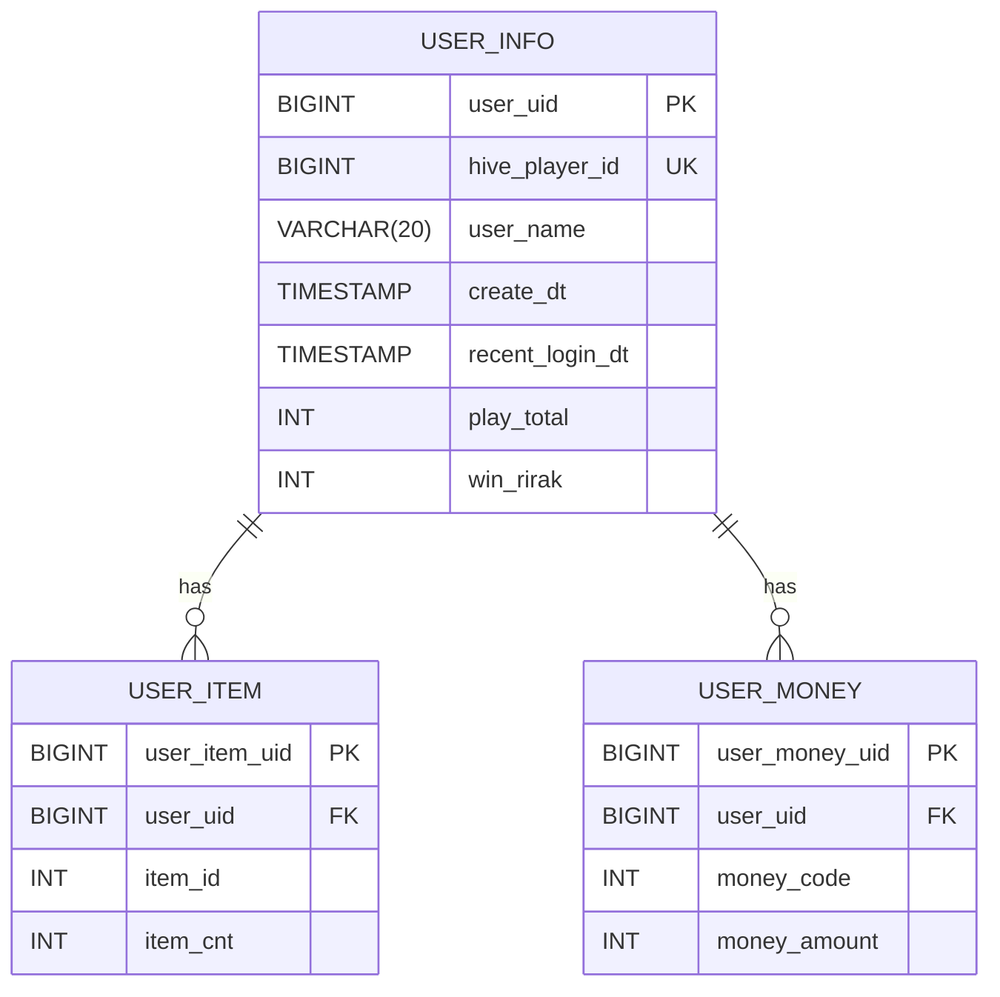
```mermaid
erDiagram
    "USER_INFO" {
        BIGINT user_uid PK
        BIGINT hive_player_id UK
        VARCHAR(20) user_name
        TIMESTAMP create_dt
        TIMESTAMP recent_login_dt
        INT play_total
        INT win_rirak
    }

    "USER_ITEM" {
        BIGINT user_item_uid PK
        BIGINT user_uid FK
        INT item_id
        INT item_cnt
    }

    "USER_MONEY" {
        BIGINT user_money_uid PK
        BIGINT user_uid FK
        INT money_code
        INT money_amount
    }

    USER_INFO ||--o{ USER_ITEM : "has"
    USER_INFO ||--o{ USER_MONEY : "has"

```

Foreign key applications are considered but may lack in practicality.

### USER_INFO Table

```sql
CREATE TABLE user_info (
    user_uid BIGINT AUTO_INCREMENT PRIMARY KEY,
    hive_player_id BIGINT NOT NULL UNIQUE,
    user_name VARCHAR(20) NOT NULL UNIQUE,
    create_dt TIMESTAMP NOT NULL DEFAULT CURRENT_TIMESTAMP,
    attendance_update_dt TIMESTAMP NOT NULL DEFAULT CURRENT_TIMESTAMP,
    recent_login_dt TIMESTAMP NOT NULL,
    play_total INT DEFAULT 0,
    win_total INT DEFAULT 0
);
```

### USER_ITEM Table

```sql
CREATE TABLE user_item (
    user_item_uid BIGINT AUTO_INCREMENT PRIMARY KEY,
    user_uid BIGINT NOT NULL,
    item_id INT NOT NULL,
    item_cnt INT DEFAULT 0,
    -- CONSTRAINT fk_user_item_user FOREIGN KEY (user_uid)
    -- REFERENCES user_info(user_uid),
    INDEX idx_user_uid_item (user_uid),
    UNIQUE KEY unique_user_item (user_uid, item_id)
);
```

### USER_MONEY Table

```sql
CREATE TABLE user_money (
    user_money_uid BIGINT AUTO_INCREMENT PRIMARY KEY,
    user_uid BIGINT NOT NULL,
    money_code INT NOT NULL,
    money_amount INT DEFAULT 0,
    -- CONSTRAINT fk_user_money_user FOREIGN KEY (user_uid)
    -- REFERENCES user_info(user_uid),
    INDEX idx_user_uid_money (user_uid),
    UNIQUE KEY unique_user_money (user_uid, money_code)
);

```

### GAME_RESULT Table

```sql
CREATE TABLE game_result (
    game_result_uid BIGINT AUTO_INCREMENT PRIMARY KEY,
    black_user_uid BIGINT NOT NULL,
    white_user_uid BIGINT NOT NULL,
    result_code INT NOT NULL,
    start_dt TIMESTAMP NOT NULL,
    end_dt TIMESTAMP NOT NULL DEFAULT CURRENT_TIMESTAMP,
    INDEX idx_user_black (black_user_uid),
    INDEX idx_user_white (white_user_uid)
);
```

### MAIL Table

```sql
CREATE TABLE mail (
    mail_uid BIGINT AUTO_INCREMENT PRIMARY KEY,
    mail_title VARCHAR(100) NOT NULL,
    mail_content VARCHAR(300),
    mail_status_code INT DEFAULT 0,
    send_user_uid BIGINT,
    receive_user_uid BIGINT NOT NULL,
    reward_code INT DEFAULT 0,
    create_dt TIMESTAMP NOT NULL DEFAULT CURRENT_TIMESTAMP,
    update_dt TIMESTAMP,
    expire_dt TIMESTAMP NOT NULL,
    INDEX idx_user_receive (receive_user_uid)
);
```

### ATTENDANCE Table

```sql
CREATE TABLE attendance (
    attendance_uid BIGINT AUTO_INCREMENT PRIMARY KEY,
    attendance_code INT NOT NULL,
    user_uid BIGINT NOT NULL,
    attendance_seq INT NOT NULL DEFAULT 0,
    create_dt TIMESTAMP NOT NULL DEFAULT CURRENT_TIMESTAMP,

    UNIQUE INDEX uq_user_attendance (user_uid, attendance_code)
);
```


================================================
File: Schemas/HiveDb.md
================================================
## Hive Database

### Entity-Relationship Diagram

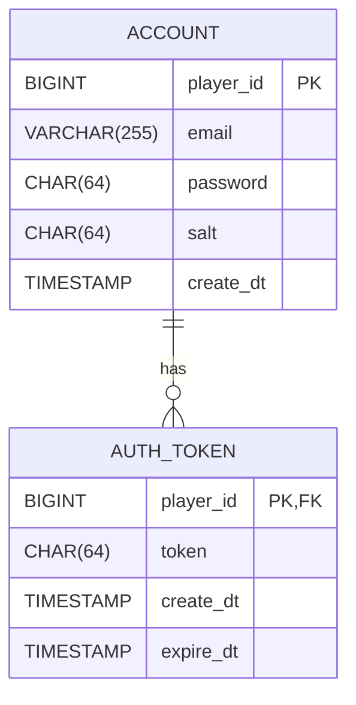
```mermaid
erDiagram
"ACCOUNT" {
    BIGINT player_id PK
    VARCHAR(255) email
    CHAR(64) password
    CHAR(64) salt
    TIMESTAMP create_dt
}

"AUTH_TOKEN" {
    BIGINT player_id PK,FK
    CHAR(64) token
    TIMESTAMP create_dt
    TIMESTAMP expire_dt
}

ACCOUNT ||--o{ AUTH_TOKEN : "has"

```

### ACCOUNT Table

```sql
CREATE TABLE `account` (
  player_id BIGINT NOT NULL AUTO_INCREMENT PRIMARY KEY,
  email VARCHAR(255) NOT NULL,
  pw CHAR(64) NOT NULL,
  salt CHAR(64) NOT NULL,
  create_dt TIMESTAMP NOT NULL DEFAULT CURRENT_TIMESTAMP,
  UNIQUE KEY email (email)
);
```

### AUTH_TOKEN Table

```sql
CREATE TABLE `auth_token` (
    player_id BIGINT NOT NULL PRIMARY KEY,
    token CHAR(64) NOT NULL,
    create_dt TIMESTAMP NOT NULL DEFAULT CURRENT_TIMESTAMP,
    expire_dt TIMESTAMP NOT NULL,
    CONSTRAINT fk_player FOREIGN KEY (player_id) REFERENCES account(player_id)
);
```


================================================
File: Schemas/MasterDb.md
================================================
## Master Database

Master Database는 각 게임 컨텐츠 세팅을 위한 게임 설정 데이터가 저장 됩니다.

### Money Template

```sql
CREATE TABLE money (
    money_code INT PRIMARY KEY,
    money_name VARCHAR(50) NOT NULL,
);
```

### Item Template

```sql
CREATE TABLE item (
    item_id INT PRIMARY KEY,
    item_name VARCHAR(50) NOT NULL,
    item_image VARCHAR(100) NOT NULL,
);
```

### Reward Template

```sql
CREATE TABLE reward (
    reward_uid BIGINT AUTO_INCREMENT PRIMARY KEY,
    reward_code INT NOT NULL,
    item_amount INT NOT NULL,
    item_id INT NOT NULL,
    INDEX idx_reward_code (reward_code)
);
```

### Attendance Template

```sql
CREATE TABLE attendance (
    attendance_code INT AUTO_INCREMENT PRIMARY KEY,
    attendance_name VARCHAR(50) NOT NULL,
    enabled_yn TINYINT(1) NOT NULL DEFAULT 0,
    repeatable_yn TINYINT(1) NOT NULL DEFAULT 0,
    INDEX idx_enabled_yn (enabled_yn)
);
```

### Attendance Detail Template

```sql
CREATE TABLE attendance_detail (
    attendance_detail_uid BIGINT AUTO_INCREMENT PRIMARY KEY,
    attendance_code INT NOT NULL,
    attendance_seq INT NOT NULL,
    reward_code INT NOT NULL,
    UNIQUE INDEX idx_attendance_code_seq (attendance_code, attendance_seq)
);
```


================================================
File: SequenceDiagrams/Authentication.md
================================================
## Authentication Sequence Diagrams

### Create Hive Account

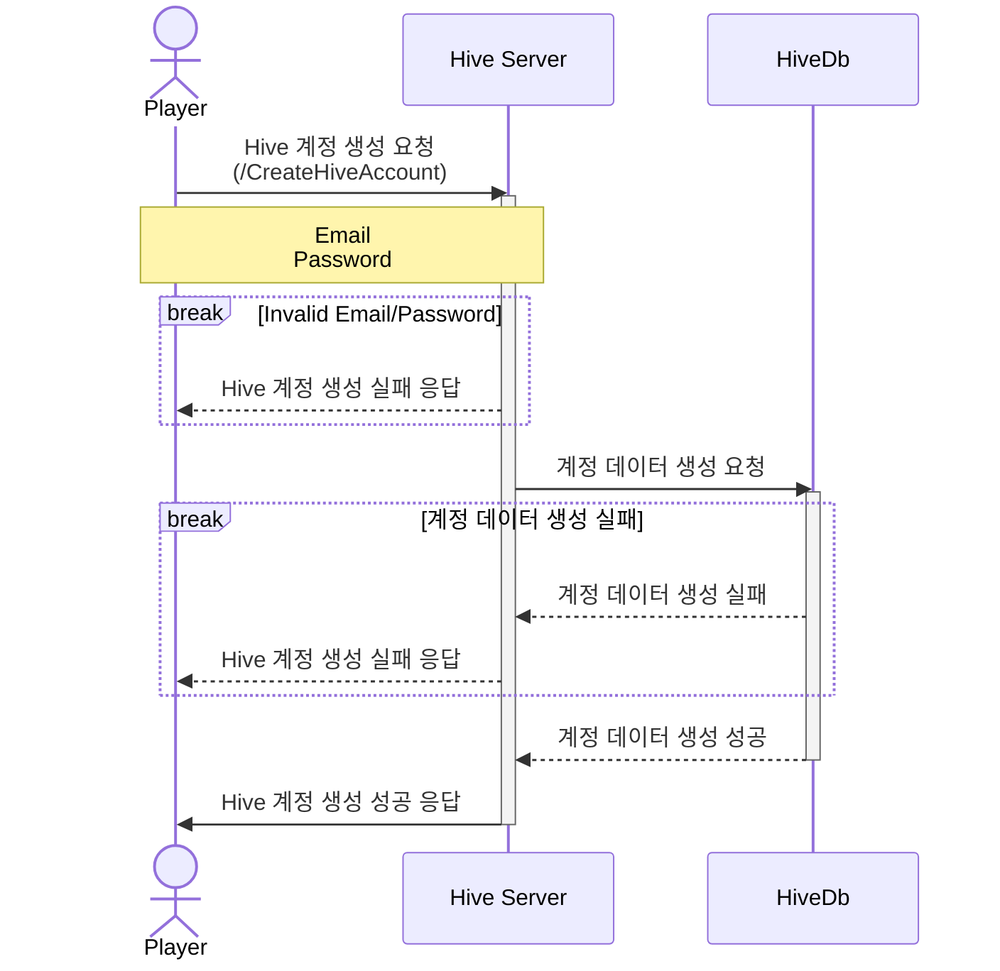
```mermaid
sequenceDiagram
actor Player
participant Hive Server
participant HiveDb

Player->>Hive Server:Hive 계정 생성 요청 <br/> (/CreateHiveAccount)
activate Hive Server
Note over Player,Hive Server: Email <br/> Password

break Invalid Email/Password
 Hive Server-->>Player:Hive 계정 생성 실패 응답
end

Hive Server->>HiveDb:계정 데이터 생성 요청 
activate HiveDb
break 계정 데이터 생성 실패
    HiveDb-->>Hive Server: 계정 데이터 생성 실패
    Hive Server-->>Player:Hive 계정 생성 실패 응답
end
HiveDb-->>Hive Server: 계정 데이터 생성 성공
deactivate HiveDb


Hive Server->>Player:Hive 계정 생성 성공 응답
deactivate Hive Server
```

### Login

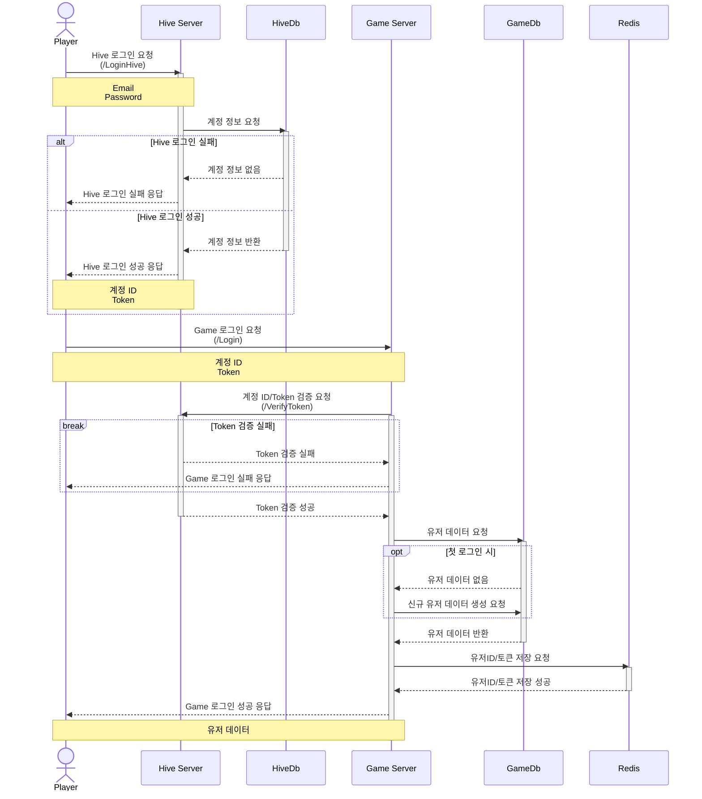
```mermaid
sequenceDiagram
actor Player
participant Hive Server
participant HiveDb
participant Game Server
participant GameDb
participant Redis

Player->>Hive Server:Hive 로그인 요청 <br/> (/LoginHive)
activate Hive Server
Note over Player,Hive Server: Email <br/> Password

Hive Server->>HiveDb:계정 정보 요청
activate HiveDb

alt Hive 로그인 실패
    HiveDb-->>Hive Server:계정 정보 없음
    Hive Server-->>Player:Hive 로그인 실패 응답
else Hive 로그인 성공

    HiveDb-->>Hive Server:계정 정보 반환
    deactivate HiveDb
    Hive Server-->>Player:Hive 로그인 성공 응답
Note over Player,Hive Server: 계정 ID <br/> Token
    deactivate Hive Server
end

    Player->>Game Server:Game 로그인 요청 <br/> (/Login)
    Note over Player,Game Server: 계정 ID <br/> Token

    Game Server->>Hive Server:계정 ID/Token 검증 요청 <br/> (/VerifyToken)
    activate Game Server

    activate Hive Server
        break Token 검증 실패

            Hive Server-->>Game Server:Token 검증 실패
            Game Server-->>Player:Game 로그인 실패 응답
        end

    Hive Server-->>Game Server:Token 검증 성공
    deactivate Hive Server

    Game Server->>GameDb: 유저 데이터 요청
    activate GameDb

        opt 첫 로그인 시
            GameDb-->>Game Server: 유저 데이터 없음
            Game Server->>GameDb:신규 유저 데이터 생성 요청

        end
            GameDb-->>Game Server:유저 데이터 반환

    deactivate GameDb

    Game Server->>Redis:유저ID/토큰 저장 요청
    activate Redis
    Redis-->>Game Server:유저ID/토큰 저장 성공
    deactivate Redis
    Game Server-->>Player:Game 로그인 성공 응답
    Note over Game Server, Player: 유저 데이터

deactivate Game Server

```


================================================
File: SequenceDiagrams/Mail.md
================================================


================================================
File: SequenceDiagrams/Match.md
================================================
## Match Sequence Diagram

### Request Match

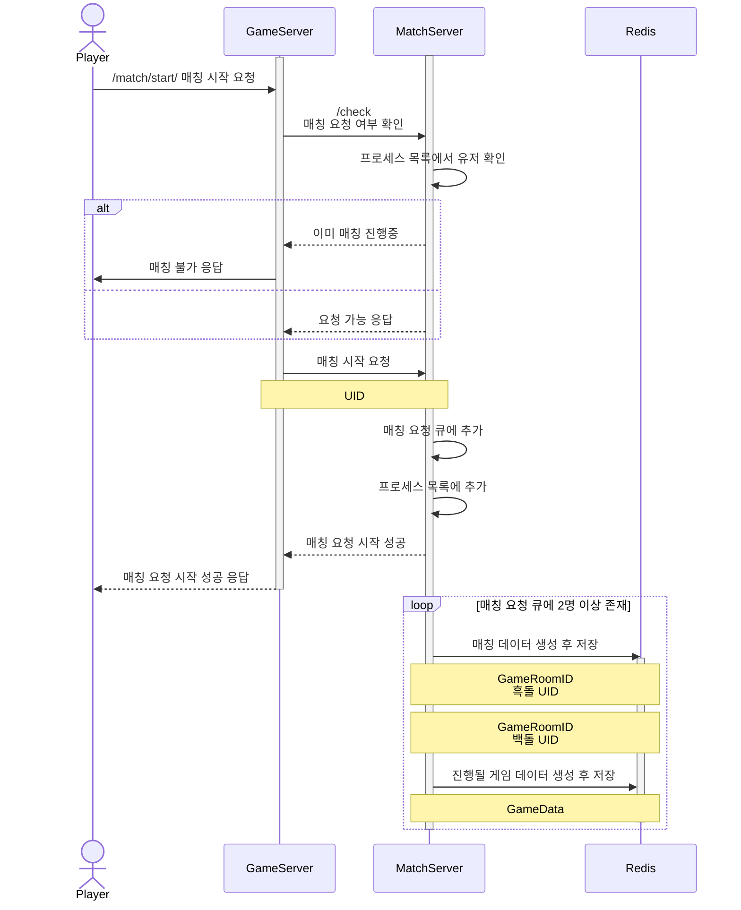
```mermaid
sequenceDiagram

    actor P as Player
    participant G as GameServer
    participant M as MatchServer
    participant R as Redis

activate M
activate G
P->>G: /match/start/ 매칭 시작 요청
G->>M: /check <br/> 매칭 요청 여부 확인
M->>M: 프로세스 목록에서 유저 확인
alt 
M-->>G: 이미 매칭 진행중
G->>P: 매칭 불가 응답
else
M-->>G: 요청 가능 응답
end
G->>M: 매칭 시작 요청
Note over G,M: UID
M->>M:매칭 요청 큐에 추가
M->>M:프로세스 목록에 추가
M-->>G: 매칭 요청 시작 성공
G-->>P: 매칭 요청 시작 성공 응답
deactivate G


loop 매칭 요청 큐에 2명 이상 존재
    M->>R: 매칭 데이터 생성 후 저장
    activate R
    Note over R,M: GameRoomID <br/> 흑돌 UID
        Note over R,M: GameRoomID <br/> 백돌 UID
    M->>R: 진행될 게임 데이터 생성 후 저장
    Note over M,R: GameData
    deactivate R
end

deactivate M
```

### Check Match

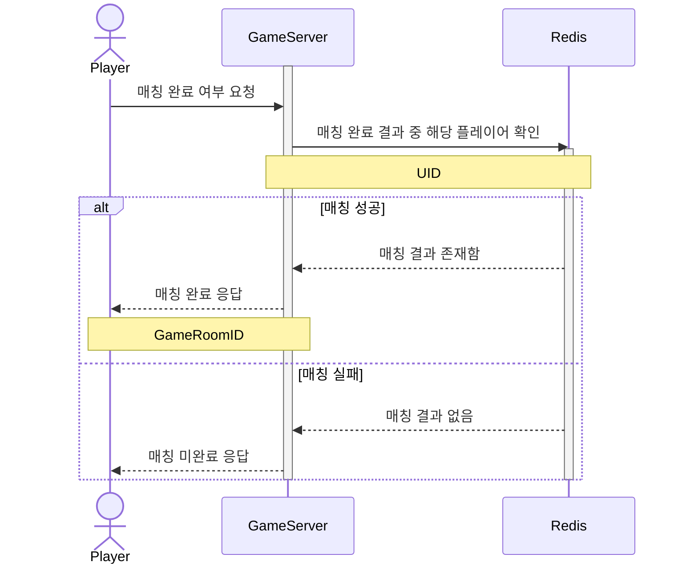
```mermaid
sequenceDiagram

    actor P as Player
    participant G as GameServer
    participant R as Redis

activate G

P->>G: 매칭 완료 여부 요청
G->>R: 매칭 완료 결과 중 해당 플레이어 확인
activate R

Note over G,R: UID

alt 매칭 성공
    R-->>G: 매칭 결과 존재함
    G-->>P: 매칭 완료 응답
    Note over G,P: GameRoomID

    else 매칭 실패
    R-->>G: 매칭 결과 없음
    G-->>P: 매칭 미완료 응답
end

deactivate G
deactivate R

```


================================================
File: SequenceDiagrams/Omok.md
================================================
## Omok Sequence Diagrams

### Enter Game

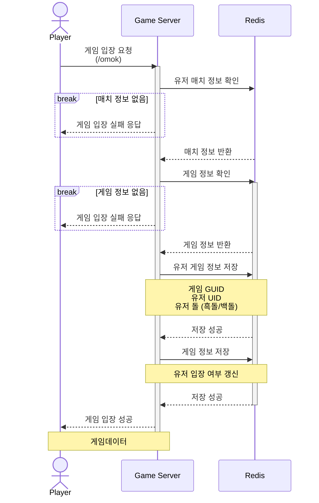
```mermaid
sequenceDiagram
actor P as Player
participant G as Game Server
participant R as Redis


P->>G:게임 입장 요청 <br/> (/omok)
activate G
G->>R:유저 매치 정보 확인
break 매치 정보 없음
G-->>P:게임 입장 실패 응답
end
R-->>G: 매치 정보 반환
G->>R:게임 정보 확인
activate R
break 게임 정보 없음
G-->>P:게임 입장 실패 응답
end

R-->>G: 게임 정보 반환
G->>R: 유저 게임 정보 저장
Note over G,R: 게임 GUID <br/> 유저 UID <br/> 유저 돌 (흑돌/백돌)
R-->>G: 저장 성공
G->>R: 게임 정보 저장
Note over G,R: 유저 입장 여부 갱신
R-->>G: 저장 성공
deactivate R
G-->>P:게임 입장 성공
Note over G,P: 게임데이터


Deactivate G

```

### Start Game

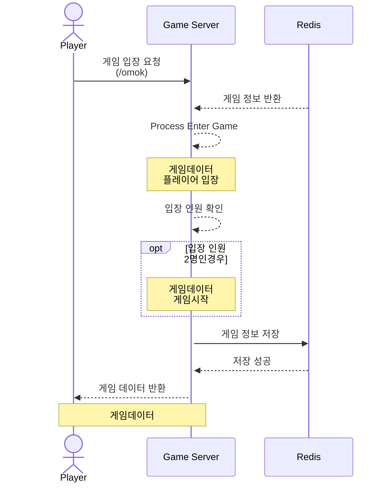
```mermaid
sequenceDiagram
actor P as Player
participant G as Game Server
participant R as Redis


P->>G:게임 입장 요청 <br/> (/omok)
activate G
R-->>G: 게임 정보 반환
G-->>G: Process Enter Game
Note over G: 게임데이터 <br/> 플레이어 입장
G-->>G:입장 인원 확인
opt 입장 인원 2명인경우
Note over G: 게임데이터 <br/> 게임시작
end

G->>R: 게임 정보 저장
R-->>G: 저장 성공

G-->>P: 게임 데이터 반환
Note over G,P: 게임데이터

```

### Set Stone in Game

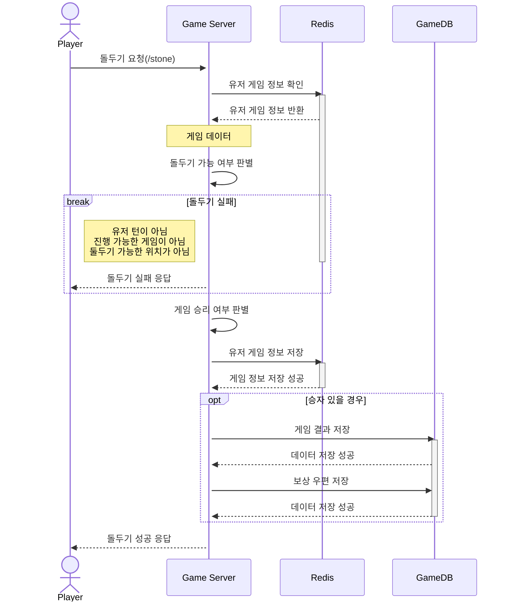
```mermaid
sequenceDiagram
actor P as Player
participant G as Game Server
participant R as Redis
participant GDB as GameDB

activate G
P->>G: 돌두기 요청(/stone)
G->>R: 유저 게임 정보 확인
activate R
R-->>G: 유저 게임 정보 반환
Note over G: 게임 데이터
G->>G: 돌두기 가능 여부 판별
break 돌두기 실패
Note left of G: 유저 턴이 아님 <br/> 진행 가능한 게임이 아님 <br/> 둘두기 가능한 위치가 아님
deactivate R
G-->>P: 돌두기 실패 응답
end

G->>G: 게임 승리 여부 판별
G->>R: 유저 게임 정보 저장
activate R
R-->>G: 게임 정보 저장 성공
deactivate R

opt 승자 있을 경우
G->>GDB: 게임 결과 저장
activate GDB
GDB-->>G: 데이터 저장 성공
G->>GDB: 보상 우편 저장
GDB-->>G: 데이터 저장 성공
deactivate GDB
end

G-->>P: 돌두기 성공 응답
```

### Check Game State

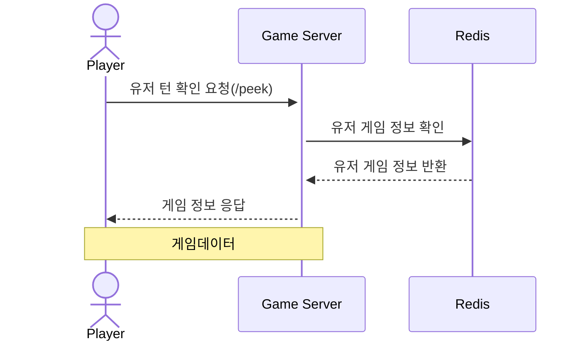
```mermaid
sequenceDiagram
actor P as Player
participant G as Game Server
participant R as Redis

activate G
P->>G: 유저 턴 확인 요청(/peek)
G->>R: 유저 게임 정보 확인
R-->>G: 유저 게임 정보 반환


G-->>P: 게임 정보 응답
Note over G,P: 게임데이터
```

### Game Process with Client
```mermaid
sequenceDiagram

actor U as User

box rgb(255, 222, 225) Client
participant P as Omok Page
participant GP as Game State Provider
participant CP as Cookie State Provider
end
participant S as Game Server
participant R as Redis

U->>P:Load Game Page
P->>CP: GetGuid()
CP<<->>S: 쿠키 인증

break Fail Authentication
CP-->>P:쿠키 인증 실패
P-->>U: 로그인 페이지로 이동
Note over P,U:  < RedirectToLogin />
end

CP-->>P:쿠키 인증 완료
P->>GP:Load Game Data
GP->>S:/enter <br/> 게임 입장 요청
S->>R:Retrieve Game Data

break No Game Data
R-->>S: 게임 데이터 없음
S-->>GP: 게임 입장 실패 응답
GP-->>P: Load Game Data 실패
P-->>U: 게임 불러오기 실패
Note over P,U: <> 불러올 데이터가 없습니다 </>
end 

R-->>S: 게임 데이터 반환
S-->>GP:게임 입장 성공 응답
Note over S,GP:Game Data
GP-->>P: Load Game Data 성공
GP<<->>P: 필요한 정보 받아오기
P->>U:게임 정보 출력
Note over P,U: < OmokBoard />
```


================================================
File: ServerShared/RedisExpiry.cs
================================================


public static class RedisExpiryTimes
{
	public static readonly TimeSpan DefaultExpiry = TimeSpan.FromMinutes(2);

	/* Auth */
	public static readonly TimeSpan AuthTokenExpiryLong = TimeSpan.FromDays(7);
	public static readonly TimeSpan AuthTokenExpiryShort = TimeSpan.FromHours(2);
	public static readonly TimeSpan RequestLockExpiry = TimeSpan.FromSeconds(3);

    /* User */
    public static readonly TimeSpan UserDataExpiry = TimeSpan.FromMinutes(1);

    /* Match */
    public static readonly TimeSpan MatchDataExpiry = TimeSpan.FromSeconds(30);

	/* Game */
	public static readonly TimeSpan GameDataExpiry = TimeSpan.FromMinutes(5);
}


================================================
File: ServerShared/RedisModels.cs
================================================
/*
 * Game
 */
using System.ComponentModel.DataAnnotations;

public class RedisMatchData
{
	public string GameGuid { get; set; } = "";
	public Int64 MatchedUserID { get; set; } = 0;
}

public class RedisGameLock
{
	public Int64 CurrentPlayerUid { get; set; } = 0;
}

public class RedisUserCurrentGame
{
	public Int64 Uid { get; set; } = 0;

	public string GameGuid { get; set; } = "";

}


public class MatchRequest
{
	[Required]
    public Int64 Uid { get; set; } = 0;
}


================================================
File: ServerShared/ServerShared.csproj
================================================
<Project Sdk="Microsoft.NET.Sdk">

  <PropertyGroup>
    <TargetFramework>net10.0</TargetFramework>
    <ImplicitUsings>enable</ImplicitUsings>
    <Nullable>enable</Nullable>
  </PropertyGroup>

</Project>


================================================
File: ServerShared/SharedConfig.cs
================================================
癤퓈ublic class ServerConfig
{
	public string HiveDb { get; set; } = "";
	public string GameDb { get; set; } = "";
	public string MasterDb { get; set; } = "";
	public string Redis { get; set; } = "";
	public string HiveServer { get; set; } = "";
	public string GameServer { get; set; } = "";
	public string MatchServer { get; set; } = "";

}


================================================
File: ServerShared/SharedKeyGenerator.cs
================================================

public class SharedKeyGenerator
{
    const string matchKey = "MATCH_";
    const string gameKey = "GAME_";
	const string lockKey = "LOCK:";
	const string userGameKey = "UGAME_";

	public static string MakeMatchDataKey(string id)
    {
        return matchKey + id;
    }

    public static string MakeGameDataKey(string id)
    {
        return gameKey + id;
    }

	public static string MakeUserGameKey(string id)
	{
		return userGameKey + id;
	}

	public static string MakeLockKey(string key)
	{
		return lockKey + key;
	}
}


