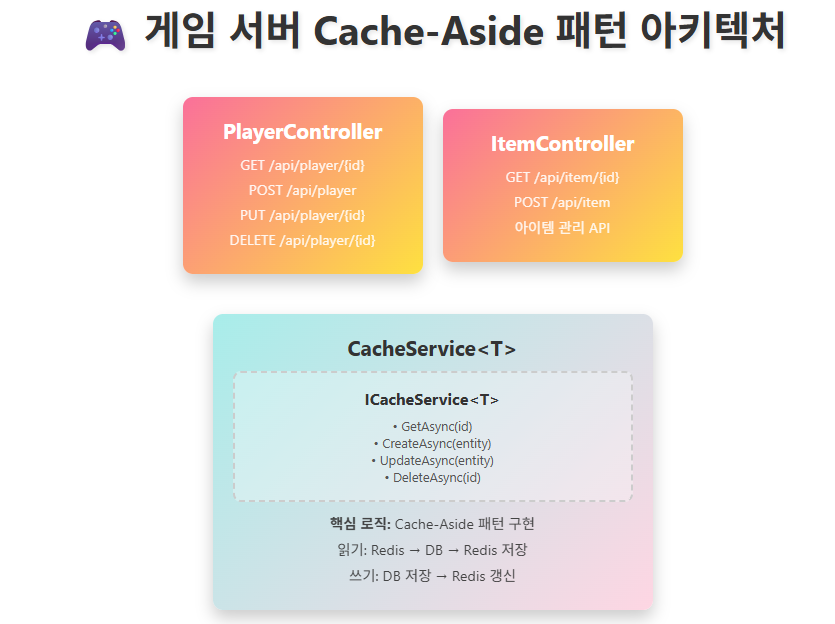

Directory structure:
└── prometheus_grafana/
    ├── README.md
    ├── Tutorial.md
    └── omok_api_server.md

================================================
File: README.md
================================================
# Prometheus + Grafana 모니터링 학습 가이드

## 왜 모니터링이 필요한가?

게임 서버를 운영하면 다음 질문들에 답할 수 있어야 합니다.

| 질문 | 모니터링 없이 | 모니터링으로 |
|:---|:---|:---|
| 서버가 정상인가? | 유저 신고를 받아야 알 수 있음 | 대시보드에서 실시간 확인 |
| 지금 동접이 몇 명인가? | DB 쿼리를 직접 실행 | Grafana 그래프에서 즉시 확인 |
| 어떤 API가 느린가? | 로그를 하나하나 검색 | 응답 시간 히스토그램으로 즉시 파악 |
| 메모리 누수가 있는가? | OOM 크래시 후에야 발각 | 메모리 사용량 추이 그래프로 사전 감지 |
| 언제 서버를 증설해야 하는가? | 감으로 판단 | CPU/메모리 추이를 보고 판단 |

---

## Prometheus와 Grafana란?

```
┌─────────────┐     Pull (/metrics)     ┌──────────────┐     Query      ┌──────────────┐
│  게임 서버   │  ◄────────────────────  │  Prometheus   │  ◄──────────  │   Grafana     │
│  /metrics    │                         │  시계열 DB     │              │  대시보드     │
│  엔드포인트  │                         │  + PromQL     │              │  시각화       │
└─────────────┘                         └──────────────┘              └──────────────┘
```

| 도구 | 역할 | 비유 |
|:---|:---|:---|
| **Prometheus** | 메트릭 수집 + 저장 + 쿼리 엔진 | 체온계 (측정 + 기록) |
| **Grafana** | 대시보드 시각화 | 건강 검진 결과지 (그래프로 보여줌) |
| **prometheus-net** | ASP.NET Core 앱에서 메트릭 노출 | 체온계를 꽂을 수 있는 포트 |
| **Node Exporter** | 서버 OS 메트릭 (CPU, 메모리, 디스크) 수집 | 서버 자체의 건강 상태 |

**Prometheus의 Pull 방식:** Prometheus 서버가 주기적으로(기본 15초) 각 서버의 `/metrics` 엔드포인트를 호출하여 메트릭을 가져갑니다. 서버는 `/metrics`를 열어두기만 하면 됩니다.

### 4가지 메트릭 타입

| 타입 | 설명 | 예시 |
|:---|:---|:---|
| **Counter** | 단조 증가만 하는 값 (리셋 시 0부터) | 총 요청 수, 총 에러 수 |
| **Gauge** | 증가/감소 모두 가능한 현재값 | 동접 수, 메모리 사용량, 큐 길이 |
| **Histogram** | 값의 분포를 버킷으로 측정 | 응답 시간 분포 (P50, P90, P99) |
| **Summary** | 값의 분포를 클라이언트에서 계산 | 응답 시간 백분위 (서버 측 계산) |

> **Counter vs Gauge 구분법:** "서버를 재시작하면 0이 되어야 하는가?" → Counter. "현재 상태를 나타내는가?" → Gauge.

---

## 학습 자료 구조

```
prometheus_grafana/
├── README.md                      # 이 문서 (Prometheus 설치 + 개념 설명)
├── Tutorial/                      # 기초 학습
│   ├── README.md                  # 실습 가이드 (prometheus-net 적용, PromQL, 커스텀 메트릭)
│   ├── GameAPIServer/             # ASP.NET Core 예제 서버 (로컬 실행용)
│   └── TCPSocketServer/           # TCP 서버 + Prometheus 메트릭 노출 예제
└── omok_api_server/               # 실전 프로젝트 (Docker Compose 환경)
    ├── README.md                  # 프로젝트 문서
    ├── Tutorial.md                # 실습 튜토리얼 (PromQL 쿼리 실습)
    ├── docker-compose.yml         # 전체 인프라 한 번에 실행
    ├── prometheus.yml             # Prometheus 스크랩 설정
    ├── grafana/
    │   └── dashboard_settings.json # Grafana 대시보드 설정 (import용)
    └── server/                    # 마이크로서비스 (GameServer + HiveServer + MatchServer)
```

### 권장 학습 순서

| 단계 | 경로 | 학습 내용 |
|:---|:---|:---|
| **1단계** | 이 문서 (README.md) | Prometheus 개념, 설치, windows_exporter |
| **2단계** | `Tutorial/README.md` | prometheus-net 적용법, PromQL 쿼리, 커스텀 메트릭 |
| **3단계** | `Tutorial/GameAPIServer/` | 로컬에서 예제 서버 실행 + `/metrics` 확인 |
| **4단계** | `omok_api_server/` | Docker Compose로 전체 스택 실행 (Prometheus + Grafana + 서버 3개) |
| **5단계** | `omok_api_server/Tutorial.md` | Grafana 대시보드 구성 + PromQL 실전 쿼리 |

---

## Docker Compose로 전체 스택 실행하기 (omok_api_server)

### 사전 요구사항

- Docker Desktop (Docker Compose 포함)

### 실행 방법

```bash
cd prometheus_grafana/omok_api_server

# Docker 네트워크 생성 (최초 1회)
docker network create game-network

# 전체 스택 실행 (MySQL, Redis, GameServer, HiveServer, MatchServer, Prometheus, Grafana)
docker compose up -d

# 실행 상태 확인
docker compose ps
```

### 접속 주소

| 서비스 | URL | 용도 |
|:---|:---|:---|
| **Grafana** | http://localhost:3000 | 대시보드 (초기 ID/PW: admin/admin) |
| **Prometheus** | http://localhost:9090 | 메트릭 쿼리 UI |
| **GameServer** | http://localhost:5105 | 게임 API 서버 |
| **HiveServer** | http://localhost:5284 | 계정 서버 |
| **MatchServer** | http://localhost:5259 | 매칭 서버 |
| **GameServer /metrics** | http://localhost:5105/metrics | 메트릭 엔드포인트 (Prometheus가 수집) |

### Grafana 초기 설정

1. http://localhost:3000 접속 → admin / admin 로그인
2. 좌측 메뉴 → **Connections** → **Data sources** → **Add data source**
3. **Prometheus** 선택 → URL에 `http://prometheus:9090` 입력 → **Save & test**
4. 좌측 메뉴 → **Dashboards** → **Import**
5. `grafana/dashboard_settings.json` 파일 내용을 붙여넣기 → **Load** → **Import**

### 종료

```bash
docker compose down        # 컨테이너 중지 및 제거
docker compose down -v     # 볼륨(DB 데이터)까지 삭제
```

---

## Windows 버전 Prometheus 서버 설치
https://prometheus.io/download/  에서 다운로드 한다.
가장 최신 버전보다는 안정 버전을 설치하는 것이 좋다.  
  
프로메테우스의 설정들은 yaml 파일로 관리한다.  
  
default 포트는 9090이며 포트를 변경하려면 **--web.listen-address** flag를 추가하여 실행한다.  
`ex) ./prometheus --config.file=/tmp/prometheus.yml --web.listen-address=:8080`  
   

## windows_exporter
 
### 1) 개요 (무엇을 설치하나요?)
* **windows_exporter**: CPU/메모리/디스크/네트워크/서비스 상태 등 **Windows 10/11(21H2+)** 메트릭을 HTTP로 노출하는 에이전트. 기본 포트는 **9182**, 엔드포인트는 **/metrics**. MSI 설치 시 **Windows 서비스 등록**과 **방화벽 예외**까지 자동 설정된다.

### 2) 설치 (관리자 권한 PowerShell)
1. **MSI 다운로드** (최신 버전은 릴리스 페이지에서 확인)
  
```powershell
# 관리자 PowerShell 실행
$ver = '0.31.3'   # 날짜 기준 최신
$msiUrl = "https://github.com/prometheus-community/windows_exporter/releases/download/v$ver/windows_exporter-$ver-amd64.msi"
$msi = "$env:TEMP\windows_exporter-$ver-amd64.msi"
Invoke-WebRequest -Uri $msiUrl -OutFile $msi
```
 
(최신 버전은 [GitHub Releases](https://github.com/prometheus-community/windows_exporter/releases)에서 확인한다.) 
  
2. **설치 실행**  
가장 간단히는 다음처럼 기본값으로 설치하면 된다.
  
```powershell
msiexec /i $msi
```
  
> 위 설치로 서비스가 자동 등록되고, 기본 포트(9182)로 동작하며 방화벽 예외도 생성된다.  

#### (선택) 설치 시 옵션 주기
MSI는 여러 속성을 지원한다. 예: 수집할 컬렉터 지정, 포트/경로 변경, 방화벽 원격 허용 IP 제한 등. PowerShell에서는 `--%` 토큰 뒤에 MSI 속성을 넘긴다.  
  
```powershell
# 기본 컬렉터 + process 추가, 포트 9182 유지, 방화벽 예외 생성
msiexec /i $msi --% ENABLED_COLLECTORS="[defaults],process" LISTEN_PORT=9182 ADDLOCAL=FirewallException
```
  
사용 가능한 주요 속성:  

* `ENABLED_COLLECTORS` : `--collectors.enabled`와 동일 (예: `[defaults],process`)
* `LISTEN_ADDR` / `LISTEN_PORT` : 리슨 주소/포트 (기본 9182)
* `METRICS_PATH` : 메트릭 경로 (기본 `/metrics`)
* `TEXTFILE_DIRS` : textfile 컬렉터 디렉토리 지정
* `REMOTE_ADDR` : 방화벽 예외를 특정 IP(들)로 제한(쉼표 구분)
* `EXTRA_FLAGS` : 그 외 CLI 플래그 전달
* `ADDLOCAL=FirewallException` : 방화벽 예외 생성
* `APPLICATIONFOLDER` : 설치 경로 변경
  (설치자 속성이 설정 파일보다 **우선** 적용된다.) 

> PowerShell 7.3+에서 `--% EXTRA_FLAGS` 사용 시, `PSNativeCommandArgumentPassing`을 Legacy로 설정해야 한다.    

### .exe 실행
.msi로 설치하지 않고 바로 실행도 가능하다.   
```
windows_exporter-0.31.2-amd64.exe
```  
혹시 실행이 제대로 되지 않았다면 실행 파일이 있는 위치에 `textfile_inputs` 디렉토리를 만들어 놓는다.  
  
---
  
### 3) 실행/확인
  
```powershell
# 서비스 상태 확인
Get-Service windows_exporter

# 웹으로 메트릭 확인 (로컬)
Start-Process "http://localhost:9182/metrics"
```
  
정상이라면 텍스트 형태의 메트릭이 보인다. 실패 시 **Windows 이벤트 로그**(MSI가 기본적으로 eventlog에 기록)에서 에러를 확인한다. 

---
  
### 4) 보안/방화벽 팁 (중요)
* 서버 외부에서 스크랩할 경우, **방화벽을 Prometheus 서버 IP로 제한**하는 게 안전하다. 설치 시 `REMOTE_ADDR="1.2.3.4"` 처럼 지정하거나, 설치 후 방화벽 규칙에서 원격 주소를 제한한다.   
* TLS/Basic Auth가 필요하다면 `--web.config.file`로 **웹 설정 파일**을 지정할 수 있다.  
  
---  
  
### 5) Prometheus에 대상 추가 (prometheus.yml)
가장 기본적인 스크랩 설정은 아래와 같다(서버에서 편집).  
  
```yaml
scrape_configs:
  - job_name: 'windows'
    scrape_interval: 15s
    metrics_path: /metrics
    static_configs:
      - targets: ['YOUR_WINDOWS_HOST:9182']   # 예: '192.168.0.10:9182'
```
  
Prometheus 설정 파일 문법/개념은 공식 문서를 참고한다.  
  
#### (선택) 특정 컬렉터만 수집하고 싶다면
windows_exporter는 기본 컬렉터 세트를 활성화한다(예: cpu, logical\_disk, memory, net, os, physical_disk, service, system). Prometheus 쪽에서 **쿼리 파라미터**로 제한할 수도 있다:  
  
```yaml
scrape_configs:
  - job_name: 'windows'
    params:
      collect[]: ['cpu','memory','logical_disk','os']  # 필요한 컬렉터만
    static_configs:
      - targets: ['YOUR_WINDOWS_HOST:9182']
```
  
(collect[] 파라미터는 공식 README에 예시가 있습니다.)   
  
---  
  
### 6) 자주 쓰는 확장: textfile 컬렉터
커스텀 스크립트가 만든 메트릭 파일을 함께 노출하고 싶다면, 설치 시:  
  
```powershell
msiexec /i $msi --% TEXTFILE_DIRS="C:\metrics_text"
```
  
그 디렉터리에 `*.prom` 텍스트 파일(프로메테우스 포맷)을 두면 `/metrics`에서 함께 노출된다.  

---  
  
### 7) (선택) Grafana 대시보드 바로 붙이기
Grafana에서 **“Import” → Dashboard ID: 14694** (Windows Exporter Dashboard) 같은 공개 대시보드를 가져와서 빠르게 시각화할 수 있다.   
  
---  
  
### 8) 문제 해결 체크리스트
* **포트 충돌**: 9182를 다른 프로세스가 사용 중인지 확인 → 필요 시 `LISTEN_PORT` 변경 후 재설치/재시작.  
* **방화벽**: 외부에서 접속이 안 되면, Windows 인바운드 규칙과 서버/네트워크 방화벽 모두 9182 열려 있는지 확인. MSI로 예외가 생성되지만 환경에 따라 추가 설정이 필요할 수 있다.   
* **로그 위치**: MSI 기본값으로 **Windows 이벤트 로그**에 기록된다(응용 프로그램 및 서비스 로그에서 확인).  
* **지원 OS**: Windows 11(21H2+) 지원. 오래된 Windows Server 버전은 호환성 문제가 있을 수 있다.  

   

### 9) 실행 확인
  
#### 1) windows_exporter 프로세스 확인
* `.exe` 파일을 그냥 실행하면 **윈도우 서비스 등록** 없이 콘솔 프로세스로만 떠 있다.
  
  * PowerShell에서 확인:

    ```powershell
    Get-Process windows_exporter
    ```
* 실행이 안 되어 있다면 `windows_exporter.exe`를 다시 실행하거나, `--help` 옵션으로 기본 포트(9182)로 뜨는지 확인한다.  
  
---
  
#### 2) 웹 브라우저로 메트릭 노출 확인
1. 크롬/엣지에서 `http://localhost:9182/metrics` 접속
   → 텍스트 형식의 메트릭이 쭉 보이면 정상이다.
2. 보이지 않거나 연결 오류라면:

   * 방화벽에서 9182 포트가 막혀 있는지 확인
   * 실행 시 포트 변경(`--telemetry.addr=:9183`)한 적 없는지 확인

---  
  
#### 3) Prometheus 설정 확인
Prometheus 서버가 같은 머신에 있다면, `prometheus.yml`에 다음이 있어야 한다:  
  
```yaml
scrape_configs:
  - job_name: 'windows'
    static_configs:
      - targets: ['localhost:9182']
```
  
* `targets`에 `localhost:9182`가 들어 있어야 한다.
* 설정을 고친 후에는 **Prometheus 재시작**이 필요하다.  
  
---  
  
#### 4) Prometheus 웹 UI에서 확인
Prometheus UI (`http://localhost:9090/targets`) → **Status → Targets** 메뉴에서:  
  
* `windows` job이 뜨는지
* `UP` 상태인지
  확인한다.
  만약 `DOWN`이라면 `Error` 메시지가 표시된다 (예: connection refused → 포트 문제, 404 → metrics path 문제).
  
---  
  
#### 5) 자주 하는 실수
* `.exe`는 설치형(MSI)과 달리 **서비스 등록/방화벽 예외**가 자동으로 안 된다.

  * 그냥 실행하면 현재 세션에서만 동작 → 로그아웃하면 꺼진다.
  * 항상 켜두려면 **서비스로 등록**해야 한다.  
  
    ```powershell
    sc.exe create windows_exporter binPath= "C:\경로\windows_exporter.exe"
    sc.exe start windows_exporter
    ```
* Prometheus 쪽에서 `metrics_path`를 기본값(`/metrics`) 말고 다른 걸로 잘못 적은 경우도 많다.  
  
  
### Prometheus 서버에서 메트릭을 확인하는 방법
  
#### 1) windows_exporter가 메트릭을 노출하는 위치
  
* 기본 주소:

  ```
  http://<Windows서버IP>:9182/metrics
  ```
* 같은 머신에서 실행 중이면:  

  ```
  http://localhost:9182/metrics
  ```
  
→ 여기서 보이는 텍스트 데이터가 Prometheus가 가져가는 원본이다.  
  
  
#### 2) Prometheus 설정 확인 (prometheus.yml)
Prometheus 서버에서 `prometheus.yml`에 다음과 같이 `scrape_configs` 항목을 추가해야 한다:  
  
```yaml
scrape_configs:
  - job_name: 'windows'
    static_configs:
      - targets: ['localhost:9182']   # Prometheus와 windows_exporter가 같은 PC일 때
      # - targets: ['192.168.0.10:9182']   # 다른 PC에서 수집할 경우
```  
  
* `targets`에는 exporter가 떠 있는 주소:포트를 적는다.  
* 수정 후 Prometheus를 재시작해야 적용된다.  
    
#### 3) Prometheus 웹 UI에서 확인
Prometheus는 기본적으로 `http://localhost:9090`에서 접속 가능하다.  
  
1. **Targets 상태 확인**

   * 메뉴 → `Status → Targets`
   * `windows` job이 있고, 상태가 **UP**이면 정상이다.
   * **DOWN**이면 `Error` 메시지를 보고 원인(방화벽, 포트, metrics_path 오타 등) 확인한다.

2. **메트릭 직접 조회**

   * 메뉴 → `Graph` (또는 `Explore`)에서
     `windows_`로 시작하는 메트릭을 검색한다.
     예:

     * `windows_cpu_time_total` (CPU 사용)
     * `windows_memory_available_bytes` (남은 메모리)
     * `windows_logical_disk_free_bytes` (디스크 여유 공간)

  
#### 4) 시각화 (Grafana 연동)
Prometheus 자체 UI는 기본 그래프만 보여주므로, 보통 **Grafana**를 붙여서 대시보드를 사용한다.
  
* Grafana → `Configuration → Data Sources`에서 Prometheus 연결
* `Dashboard → Import` → ID `14694` (공식 Windows Exporter 대시보드) 불러오기

→ 그러면 CPU, 메모리, 디스크, 네트워크, 서비스 상태까지 한눈에 확인 가능하다.
  
#### 5) 자주 확인하는 메트릭 예시
  
* **CPU**: `windows_cpu_time_total`
* **메모리 사용률**:

  ```promql
  1 - (windows_memory_available_bytes / windows_memory_physical_total_bytes)
  ```
* **디스크 여유율**:

  ```promql
  windows_logical_disk_free_bytes{volume="C:"} / windows_logical_disk_size_bytes{volume="C:"}
  ```
* **네트워크 수신/송신 바이트**: `windows_net_bytes_total`

---

👉 정리하면,

1. Prometheus 설정 파일에 `windows_exporter` 타깃 추가
2. Prometheus UI에서 `Status → Targets`로 `UP` 확인
3. `Graph`/`Explore`에서 `windows_` 메트릭 검색
4. 필요하면 Grafana에서 대시보드로 시각화
  
---------     

</br>  
</br>  
</br>  


# Grafana 학습
  
## Windows에 설치 및 사용하기
  
### 1. Grafana 다운로드 및 설치
1. **공식 사이트 접속**
   [Grafana Downloads](https://grafana.com/grafana/download) 페이지에서 **Windows** 버전을 선택한다.
2. **Installer 다운로드**
   `.msi` 설치 파일을 다운로드한다.
3. **설치 실행**
   설치 마법사에 따라 `Next → Install → Finish` 순으로 진행한다.

   * 기본적으로 `C:\Program Files\GrafanaLabs\grafana` 에 설치됨.
4. **Grafana 실행 확인**
   설치가 완료되면 Windows 서비스로 등록되어 자동 실행된다.
   서비스 이름은 `Grafana` 이다.
   (서비스 확인: `Win + R → services.msc` 실행)

.msi 이외에 포터블 실행 버전도 제공하고 있다.
  
### 2. Grafana 실행 및 접속
1. 브라우저에서 [http://localhost:3000](http://localhost:3000) 접속한다.
2. 기본 계정으로 로그인한다:

   * **아이디:** `admin`
   * **비밀번호:** `admin`
3. 최초 로그인 시 비밀번호 변경을 요청받으므로 새로운 비밀번호로 변경한다.
  
  
### 3. 데이터 소스 연결
Grafana는 데이터를 직접 저장하지 않고 **외부 데이터 소스**를 연결해 시각화한다.
대표적인 데이터 소스:  
* **Prometheus**
* **MySQL / PostgreSQL**
* **ElasticSearch**
* **Loki (로그 관리)**
  
연결 방법:  
1. 왼쪽 메뉴에서 **Connections → Data sources** 선택.
2. 원하는 데이터 소스 클릭 후 접속 정보 입력.
3. **Save & test** 버튼으로 연결 확인.


### 4. 대시보드 생성
1. 좌측 메뉴 → **Dashboards → New Dashboard** 클릭.
2. **Add a new panel** 선택.
3. 쿼리(Query) 작성:  
   * 데이터 소스에서 원하는 메트릭이나 SQL 입력.
4. **시각화 선택**:  
   * Graph, Table, Gauge, Heatmap 등 다양한 시각화 옵션 선택 가능.
5. **저장**:  
   * 패널 저장 후 대시보드에 추가.

  
### 5. Windows 서비스 관리
* Grafana 서비스는 자동 시작되도록 설정되어 있음.
* 수동 제어:

  * 시작: `net start grafana`
  * 중지: `net stop grafana`
  
### 6. 추가 팁
* **플러그인 설치**: `grafana-cli plugins install <plugin-name>` 명령어 사용.
* **설정 파일 수정**: `C:\Program Files\GrafanaLabs\grafana\conf\defaults.ini`
  (포트 변경, 보안 설정 등 가능)
* **로그 확인**: `C:\Program Files\GrafanaLabs\grafana\data\log` 경로 확인.


## Grafana에서 Prometheus 연결하기
Grafana가 Prometheus에서 데이터를 가져오도록 설정한다.

1. **Grafana 접속**
   브라우저에서 [http://localhost:3000](http://localhost:3000) 접속 → 로그인(`admin / admin`).

2. **데이터 소스 추가**  

   * 왼쪽 메뉴에서 **Connections → Data sources** 클릭.
   * **Add data source** 버튼 클릭.
   * 목록에서 **Prometheus** 선택.

3. **Prometheus 주소 입력**

   * URL: `http://localhost:9090`
   * 나머지는 기본값 그대로 두면 된다.

4. **연결 테스트**
   `Save & test` 버튼 클릭 → "Data source is working" 메시지가 나오면 성공.


### 대시보드 만들기
  
1. **새 대시보드 생성**

   * 왼쪽 메뉴 → **Dashboards → New → New Dashboard** 클릭.
   * **Add a new panel** 선택.

2. **쿼리 작성하기**

   * Data source: **Prometheus** 선택.
   * 예제 쿼리 입력:

     * `up` : Prometheus가 모니터링 중인 타겟의 상태 확인 (1=정상, 0=비정상).
     * `node_cpu_seconds_total` : CPU 사용량 (노드 익스포터 설치 시).
   * 실행하면 그래프가 바로 그려진다.

3. **시각화 선택**
   * Line, Gauge, Table 등 원하는 형태로 변경 가능.

4. **저장하기**
   대시보드 이름 입력 후 저장.

### 전체 흐름 요약 
1. Prometheus 설치 및 실행 (`localhost:9090` 에서 동작 확인)
2. Grafana 접속 (`localhost:3000`)
3. 데이터 소스 → Prometheus 추가 (URL: `http://localhost:9090`)
4. 쿼리(`up`, `node_cpu_seconds_total` 등)로 대시보드 생성
5. Exporter 추가해서 더 많은 메트릭 수집 가능

  
  
## WSL의 Docker에 Grafana를 띄우고, 같은 Windows 머신에서 실행 중인 Prometheus(네이티브 Windows 실행)와 연동하는 방법
  
### 1. 네트워크 구조 이해하기
* **Prometheus**: Windows에서 실행됨 → `localhost:9090`
* **Grafana**: WSL 내부 Docker 컨테이너에서 실행됨

문제는 **WSL 컨테이너에서 보이는 `localhost`**는 컨테이너 자기 자신을 의미한다는 점이다.
따라서, Grafana 컨테이너가 Windows 호스트의 Prometheus(`localhost:9090`)를 인식하려면 **호스트 IP**를 사용해야 한다.

  
### 2. Windows 호스트 IP 확인하기
WSL 안에서 다음 명령어로 Windows 호스트 IP를 확인할 수 있다.

```bash
cat /etc/resolv.conf | grep nameserver
```

보통 `192.168.65.1` 같은 IP가 나온다.
이 IP가 **WSL에서 바라보는 Windows 호스트 IP**다.

  
### 3. Grafana 컨테이너 실행하기
WSL 터미널에서 Grafana를 Docker로 실행한다.

```bash
docker run -d \
  -p 3000:3000 \
  --name=grafana \
  grafana/grafana
```

* `-p 3000:3000`: 호스트(WSL)와 매핑, 브라우저에서 `http://localhost:3000` 접속 가능
* `--name=grafana`: 컨테이너 이름 지정

  
### 4. Grafana에서 Prometheus 연결 설정

1. 브라우저에서 [http://localhost:3000](http://localhost:3000) 접속

   * 기본 계정: `admin / admin`
2. 왼쪽 메뉴 → **Connections → Data sources** → **Add data source** → **Prometheus** 선택
3. **URL 입력**

   * 만약 Windows Prometheus가 `localhost:9090`에 뜨고 있다면,
     Grafana 컨테이너에서는 `http://<Windows 호스트 IP>:9090` 으로 접근해야 한다.
   * 예:

     ```
     http://192.168.65.1:9090
     ```
4. **Save & test** 버튼 클릭 → `Data source is working` 메시지 나오면 성공.


### 5. 대시보드 만들기

1. **Dashboards → New → New dashboard** → **Add a new panel**
2. Data source: Prometheus 선택
3. 쿼리 입력 (예시)  
   * `up` → Prometheus에서 모니터링 중인 타겟 상태 확인
4. 그래프 시각화 후 저장

  
### 6. 추가 팁

* **IP 고정 문제**
  WSL이 재부팅될 때마다 호스트 IP(`192.168.x.x`)가 달라질 수 있다.
  이럴 때는 WSL에서 항상 `host.docker.internal`을 쓰면 편하다.
  (Docker Desktop 최신 버전은 Linux 컨테이너에서도 지원)

  즉, Prometheus 주소를 다음처럼 써도 된다:

  ```
  http://host.docker.internal:9090
  ```

* **Windows 방화벽**
  Prometheus가 Windows에서 `0.0.0.0:9090`이 아닌 `localhost:9090`에만 바인딩되어 있으면,
  WSL에서 접근할 때 막힐 수 있다.
  → `prometheus.yml` 실행 시 `--web.listen-address="0.0.0.0:9090"` 옵션을 주면 외부에서도 접속 가능하다.

  
### ✅ 요약
1. WSL의 Docker로 Grafana 실행
2. Prometheus는 Windows에서 실행 (`localhost:9090`)
3. Grafana Data Source에서 Prometheus URL을 `http://host.docker.internal:9090` 또는 Windows 호스트 IP(`192.168.65.1:9090`)로 입력
4. 연결 후 대시보드 생성

--------    

</br>  
</br>  
</br>  
  

# PromLens
[PromLens](https://promlens.com/ )는 Prometheus의 **PromQL 쿼리를 작성·이해·디버깅**하기 쉽게 도와주는 시각화 도구다. 그라파나처럼 거대한 대시보드를 만드는 용도보다는, 엔지니어가 쿼리를 직접 다루면서 “내가 짠 PromQL이 어떤 의미인지, 어떤 결과를 내는지”를 직관적으로 파악하는 데 초점을 맞춘다.

## 주요 특징

### 1. 쿼리 작성 지원
* PromQL을 입력하면 구문을 자동으로 **구조화된 트리 형태**로 보여준다.
* 쿼리 안에서 어떤 함수가 적용되고, 어떤 메트릭에 필터가 걸리는지 한눈에 확인할 수 있다.
* 복잡한 쿼리일수록 “이 값이 어떻게 계산됐는지”를 단계별로 추적하기 좋다.

### 2. 결과 시각화
* 쿼리 결과를 **시계열 그래프**와 **표**로 바로 보여준다.
* 그라파나보다 훨씬 단순하지만, “지금 이 지표가 어떻게 변하고 있는지” 확인하기엔 충분하다.

### 3. 실시간 쿼리 분석
* PromQL의 연산자, 레이블 필터, 집계 함수 등을 단계별로 분석해서 설명을 붙여준다.
* 쿼리 디버깅 시 잘못된 구문이나 의도치 않은 결과를 쉽게 발견할 수 있다.

### 4. Prometheus 연동
* PromLens는 **독립 실행형 웹앱**이지만, Prometheus 서버와 연결하면 실데이터를 바로 가져올 수 있다.
* 로컬 환경이나 개발 환경에서 띄워서 Prometheus API 엔드포인트만 지정하면 된다.

---

## 사용 방법
1. PromLens 설치

   * 공식 Docker 이미지 사용:

     ```bash
     docker run -p 8080:8080 prom/promlens
     ```
   * 이후 브라우저에서 `http://localhost:8080` 접속.

2. Prometheus 서버 연결

   * PromLens 설정 화면에서 Prometheus 서버 URL (`http://localhost:9090`) 입력.

3. PromQL 입력 및 실행

   * 쿼리 입력 후 실행하면 구조 분석 + 결과 시각화가 동시에 나온다.


---

## 활용 시나리오
* 새로운 메트릭이나 Exporter를 붙였을 때 **PromQL 테스트**용으로 사용.
* 복잡한 alert 규칙이나 recording rule을 만들기 전에 **쿼리 검증**.
* 운영자가 아니라 **엔지니어 전용 툴**로 두고 빠르게 메트릭 확인.


  


================================================
File: Tutorial.md
================================================
Directory structure:
└── Tutorial/
    ├── README.md
    ├── GameAPIServer/
    │   ├── ErrorCode.cs
    │   ├── GameAPIServer.csproj
    │   ├── GameAPIServer.sln
    │   ├── Program.cs
    │   ├── Security.cs
    │   ├── appsettings.Development.json
    │   ├── appsettings.json
    │   ├── httpTest.http
    │   ├── Controllers/
    │   │   ├── CreateAccountController.cs
    │   │   ├── FriendAcceptController.cs
    │   │   ├── FriendCancelReqController.cs
    │   │   ├── FriendDeleteController.cs
    │   │   ├── FriendListController.cs
    │   │   ├── FriendSendReqController.cs
    │   │   ├── GameDataLoadController.cs
    │   │   ├── LoginController.cs
    │   │   ├── MailDeleteController.cs
    │   │   ├── MailListController.cs
    │   │   ├── MailReceiveController.cs
    │   │   ├── MetricsExampleController.cs
    │   │   └── UserDataLoadController.cs
    │   ├── Models/
    │   │   ├── MasterDB.cs
    │   │   ├── RedisDB.cs
    │   │   ├── DAO/
    │   │   │   ├── Account.cs
    │   │   │   ├── Attendance.cs
    │   │   │   ├── Friend.cs
    │   │   │   ├── Game.cs
    │   │   │   ├── Item.cs
    │   │   │   ├── Mailbox.cs
    │   │   │   └── User.cs
    │   │   └── DTO/
    │   │       ├── AttendanceCheck.cs
    │   │       ├── AttendanceInfo.cs
    │   │       ├── CreateAccount.cs
    │   │       ├── ErrorCode.cs
    │   │       ├── FreindDelete.cs
    │   │       ├── FriendAccept.cs
    │   │       ├── FriendAdd.cs
    │   │       ├── FriendList.cs
    │   │       ├── GameDataLoad.cs
    │   │       ├── Header.cs
    │   │       ├── Login.cs
    │   │       ├── Logout.cs
    │   │       ├── MailDelete.cs
    │   │       ├── MailList.cs
    │   │       ├── MailReceive.cs
    │   │       ├── OtherUserInfo.cs
    │   │       ├── Ranking.cs
    │   │       ├── SocialDataLoad.cs
    │   │       ├── UserDataLoad.cs
    │   │       ├── UserRank.cs
    │   │       └── UserSetMainChar.cs
    │   ├── Properties/
    │   │   └── launchSettings.json
    │   ├── Repository/
    │   │   ├── FakeGameDb.cs
    │   │   └── IGameDb.cs
    │   └── Services/
    │       ├── AuthService.cs
    │       ├── DataLoadService.cs
    │       ├── FriendService.cs
    │       ├── GameService.cs
    │       ├── MailService.cs
    │       ├── UserService.cs
    │       └── Interfaces/
    │           ├── IAuthService.cs
    │           ├── IDataLoadService.cs
    │           ├── IFriendService.cs
    │           ├── IGameService.cs
    │           ├── IMailService.cs
    │           └── IUserService.cs
    └── TCPSocketServer/
        ├── Program.cs
        ├── TCPSocketServer.csproj
        └── TCPSocketServer.sln

================================================
File: README.md
================================================
# Prometheus 실습

## 1. 프로메테우스 설치

## 2. Prometheus.yml
  
```yaml
# my global config
global:
  scrape_interval: 15s # Set the scrape interval to every 15 seconds. Default is every 1 minute.
  evaluation_interval: 15s # Evaluate rules every 15 seconds. The default is every 1 minute.
  # scrape_timeout is set to the global default (10s).
 
# Alertmanager configuration
alerting:
  alertmanagers:
    - static_configs:
        - targets:
          # - alertmanager:9093
 
# Load rules once and periodically evaluate them according to the global 'evaluation_interval'.
rule_files:
  # - "first_rules.yml"
  # - "second_rules.yml"
 
# A scrape configuration containing exactly one endpoint to scrape:
# Here it's Prometheus itself.
scrape_configs:
  - job_name: "prometheus"
    # metrics_path defaults to '/metrics'
    # scheme defaults to 'http'.
    static_configs:
      - targets: ["localhost:9090"]
 
# 이 설정으로 스크랩한 모든 시계열엔 여기 있는 job 이름이 `job=<job_name>` 레이블로 추가된다.
  - job_name: "apiserver"
# 글로벌로 설정해둔 기본값을 재정의하며, 이 job에선 타겟을 5초 간격으로 스크랩한다.
    scrape_interval: 5s
    static_configs:
    # 프로메테우스가 읽어올 주소를 입력한다.
      - targets: ['localhost:5000']
    # labels를 통해 읽어온 데이터에 라벨링을 하여 관리할 수 있다.
        labels:
          groups: "server"
   
  - job_name: "gameserver"
    scrape_interval: 5s
    static_configs:
      - targets: ['localhost:5002']
        labels:
          type: "server"
 
  - job_name: "server_info"
    scrape_interval: 5s
    static_configs:
      - targets: ['localhost:9182']
        labels:
          type: "info"

```


## API 서버에 적용하기
Prometheus는 “Pull 방식” → Web API에서 `/metrics` 같은 엔드포인트를 열어주면 Prometheus 서버가 주기적으로 가져간다.  
  
ASP.NET Core에서는 보통 `prometheus-net` 라이브러리를 많이 사용한다.  
👉 NuGet 패키지: prometheus-net.AspNetCore  

아래와 같은 NuGet도 있다.      
Nuget package for general use and metrics export via HttpListener or to Pushgateway: prometheus-net  
`Install-Package prometheus-net`    
    
Nuget package for ASP.NET Core middleware and stand-alone Kestrel metrics server: prometheus-net.AspNetCore  
`Install-Package prometheus-net.AspNetCore`    
  
Nuget package for ASP.NET Core Health Check integration: prometheus-net.AspNetCore.HealthChecks  
`Install-Package prometheus-net.AspNetCore.HealthChecks`  
  
Nuget package for ASP.NET Core gRPC integration: prometheus-net.AspNetCore.Grpc  
`Install-Package prometheus-net.AspNetCore.Grpc`  
    
  
### 패키지 설치
터미널(또는 Visual Studio 패키지 매니저 콘솔)에서:  
```
dotnet add package prometheus-net.AspNetCore
```  
  

### Program.cs 수정 
  
```  
using Prometheus;

var builder = WebApplication.CreateBuilder(args);
builder.Services.AddControllers();

var app = builder.Build();

app.UseRouting();

// 1) 기본 HTTP 요청 미들웨어
app.UseHttpMetrics();   // 요청 관련 기본 메트릭 수집

app.UseEndpoints(endpoints =>
{
    endpoints.MapControllers();
    endpoints.MapMetrics(); // 2) /metrics 엔드포인트 등록
});

app.Run();
```

이제 http://localhost:5000/metrics (혹은 Kestrel/설정된 포트)에서 Prometheus 포맷 메트릭이 노출된다.  
위 주소의 port 번호는 api 서버에서 설정된 port 번호를 따르면 된다.  


### 커스텀 메트릭 추가하기

```
using Prometheus;

public class WeatherController : ControllerBase
{
    // Counter 메트릭 예시
    private static readonly Counter WeatherRequests = 
        Metrics.CreateCounter("weather_requests_total", "Total number of weather requests.");

    [HttpGet("weather")]
    public IActionResult GetWeather()
    {
        WeatherRequests.Inc(); // 호출할 때마다 카운터 증가
        return Ok(new { Temp = "24C", Status = "Sunny" });
    }
}
```  
  
- Counter: 단순 증가 값 (요청 수, 에러 수)
- Gauge: 현재 상태값 (메모리 사용량, 큐 길이)
-  Histogram/Summary: 분포/지연 시간 같은 값
  

### Prometheus 서버 설정
Prometheus의 prometheus.yml에 Web API 주소를 등록합니다:

```yaml
scrape_configs:
  - job_name: 'aspnetcore-api'
    scrape_interval: 15s
    static_configs:
      - targets: ['localhost:5000']   # API 주소와 포트
```  
  
- Web API가 /metrics를 열고 있으므로 metrics_path는 기본값(/metrics) 그대로 둔다.
- Prometheus 재시작 후, http://localhost:9090/targets 에서 aspnetcore-api job이 UP 상태로 떠야 한다.


### 참고할 수 있는 메트릭 예시
- 요청 수: http_requests_received_total
- 처리 시간 히스토그램: http_request_duration_seconds_bucket
- 현재 실행 중 요청 수: http_requests_in_progress
  

### GC와 스레드풀 등의 정보도 수집하고 싶을 때
ASP.NET Core API 서버에서 Prometheus로 **GC, 스레드 풀 등 특정 런타임 메트릭만 수집**하고 싶다면, 두 가지 방법이 있다.
 
#### 1) 기본 prometheus-net.AspNetCore 미들웨어만 사용할 때
`app.UseHttpMetrics()` + `endpoints.MapMetrics()` 조합은 **HTTP 요청/응답 관련 메트릭**만 기본 제공한다.  
GC, Thread Pool, Working Set 같은 .NET 런타임 메트릭은 자동으로는 나오지 않는다.  


#### 2) .NET 런타임 메트릭 전용 라이브러리 사용
**패키지**: [`prometheus-net.DotNetRuntime`](https://github.com/dotnet/runtime)  
  
### 설치

```bash
dotnet add package prometheus-net.DotNetRuntime
```

##### Program.cs에서 활성화

```csharp
using Prometheus;

var builder = WebApplication.CreateBuilder(args);
builder.Services.AddControllers();

var app = builder.Build();

// .NET 런타임 메트릭 등록 (GC, 스레드 풀 등)
DotNetRuntimeStatsBuilder.Default().StartCollecting();
/*
// 원하는 정보만 모니터링
IDisposable collector = DotNetRuntimeStatsBuilder
    .Customize()
    .WithContentionStats()
    .WithJitStats()
    .WithThreadPoolStats()
    .WithGcStats()
    .WithExceptionStats()
    .StartCollecting();
*/


app.UseRouting();

// HTTP 요청 메트릭
app.UseHttpMetrics();

app.UseEndpoints(endpoints =>
{
    endpoints.MapControllers();
    endpoints.MapMetrics();
});

app.Run();
```
  
#### 3) 수집되는 주요 런타임 메트릭 예시

* **GC 관련**
  * `dotnet_gc_collections_total` (세대별 GC 횟수)
  * `dotnet_gc_heap_size_bytes` (힙 크기)
  * `dotnet_gc_gen0_collections_total`, `gen1`, `gen2`
* **ThreadPool 관련**
  * `dotnet_threadpool_threads_total`
  * `dotnet_threadpool_queue_length`
* **JIT, Lock 등**
  * `dotnet_jit_methods_total`
  * `dotnet_contention_total`
  

#### 4) 특정 메트릭만 수집하고 싶을 때
Prometheus는 “pull + filter” 방식이라, 서버 측에서 노출을 막기보다는 **Prometheus 쪽에서 선택적으로 가져오는 방식**을 쓴다.  

##### (1) Prometheus 설정에서 특정 메트릭만 스크랩
  
```yaml
scrape_configs:
  - job_name: 'aspnetcore-api'
    static_configs:
      - targets: ['localhost:5000']
    metric_relabel_configs:
      - source_labels: [__name__]
        regex: "dotnet_gc_.*"
        action: keep
```
  
→ 이렇게 하면 `dotnet_gc_`로 시작하는 메트릭만 저장된다.  
  
##### (2) 코드에서 직접 필터링
`prometheus-net` 자체는 개별 메트릭 노출을 끄는 옵션이 없으므로, 특정 수치를 원치 않으면:

* 커스텀 미들웨어로 제한된 `/metrics` 엔드포인트 구현
* 또는 `metric_relabel_configs` 쪽에서 필터링하는 게 일반적이다.

  
#### 5) Grafana에서 활용

* `dotnet_gc_collections_total` → GC 빈도 추적
* `dotnet_threadpool_queue_length` → 대기 작업 적체 확인
* `dotnet_threadpool_threads_total` → 동시 처리 리소스 확인


### HTTP 요청 관련 메트릭 쿼리
ASP.NET Core Web API + `prometheus-net.AspNetCore` 

#### 1) 기본적으로 수집되는 HTTP 메트릭
`app.UseHttpMetrics()`를 쓰면 아래와 같은 메트릭이 자동 노출된다:  

* **총 요청 수**
  `http_requests_received_total{method="GET",code="200"}`
* **진행 중 요청 수**
  `http_requests_in_progress`
* **요청 처리 시간** (히스토그램)
  `http_request_duration_seconds_bucket`
  `http_request_duration_seconds_sum`
  `http_request_duration_seconds_count`


#### 2) PromQL 쿼리 예시

##### (1) 초당 요청 수 (QPS)

```promql
rate(http_requests_received_total[5m])
```

* 5분 구간 이동 평균 요청 속도
  
##### (2) 상태 코드별 요청 비율

```promql
sum(rate(http_requests_received_total[5m])) by (code)
```

* 200/400/500 코드별 요청 비율 확인 가능

##### (3) 평균 응답 시간

```promql
rate(http_request_duration_seconds_sum[5m])
/
rate(http_request_duration_seconds_count[5m])
```

* 요청당 평균 처리 시간 (초 단위)

##### (4) P90 응답 시간 (느린 요청 감지)

```promql
histogram_quantile(0.9, rate(http_request_duration_seconds_bucket[5m]))
```

* 응답 시간 분포에서 90% 구간 추정치

##### (5) 현재 처리 중인 요청 수

```promql
http_requests_in_progress
```
  

#### 3) Prometheus 웹 UI에서 실행 방법
1. 브라우저에서 `http://localhost:9090` 접속
2. 상단 탭에서 **Graph/Explore** 선택
3. 위 PromQL 쿼리 입력 후 **Execute**
4. Graph 버튼으로 그래프 확인 가능

  
#### 4) 응용 팁

* 특정 메서드만 보고 싶으면:

  ```promql
  rate(http_requests_received_total{method="POST"}[5m])
  ```
* 특정 경로만 보고 싶으면 (endpoint 라벨이 있을 때):

  ```promql
  rate(http_requests_received_total{route="/api/orders"}[5m])
  ```
   

### 지정한  **job_name**에만 쿼리 할 때
**라벨 필터(label filter)** 를 쓴다.  

#### 1) Prometheus 라벨 구조 복습
Prometheus는 수집할 때 자동으로 몇 가지 라벨을 붙여준다:

* `job` : `prometheus.yml`에서 정의한 `job_name`
* `instance` : `target` (예: `localhost:9182`)
* 그 외 exporter가 노출한 라벨들 (method, code, path 등)
  
즉, 쿼리할 때 `job="windows"` 처럼 필터링할 수 있다.  

#### 2) 쿼리 예시

##### (1) 특정 job의 모든 메트릭 가져오기

```promql
http_requests_received_total{job="aspnetcore-api"}
```

##### (2) job 단위로 요청 수 비교

```promql
sum(rate(http_requests_received_total[5m])) by (job)
```

→ 여러 job이 있을 때 job별 요청률을 한눈에 비교

##### (3) 특정 job + 특정 instance

```promql
rate(http_requests_received_total{job="aspnetcore-api",instance="localhost:5000"}[5m])
```

##### (4) 특정 job에서만 응답 시간 P90 구하기

```promql
histogram_quantile(
  0.9,
  sum(rate(http_request_duration_seconds_bucket{job="aspnetcore-api"}[5m])) by (le)
)
```
  
  
#### 3) 실전 팁

* **job 단위 대시보드**: Grafana 패널에서 변수(`$job`)를 만들어 두면 job 선택 드롭다운으로 전환 가능
* **비교용**: `by(job)` 집계를 쓰면 여러 job을 동시에 비교할 수 있습니다
* **필터 조합**: `{job="aspnetcore-api", method="POST"}` 같이 조합 가능


### 특정 http request를 Count하기
- 기본적으로 PromQL `http_request_duration_seconds_count`을 통해 모든 http request를 모니터링 할 수 있지만 특정 http request만을 모니터링 할 수 있도록 Counter 메트릭을 생성할 수 있다.  
  
```
namespace ApiServer.Controllers
{
    [ApiController]
    [Route("[controller]")]
    public class LoginController : ControllerBase
    {
        private readonly IAccountDb _accountDb;
        private readonly ILogger<LoginController> _logger;
        private readonly IRedisDb _redisDb;
         
        // 프로메테우스 Counter 측정 항목 설명
        private static readonly Counter _LoginCounter = Metrics.CreateCounter("API_Server_LoginCounter", "API_Server_LoginCounter");
         
        public LoginController(ILogger<LoginController> logger, IAccountDb accountDb, IRedisDb redisDb)
        {
            _accountDb = accountDb;
            _logger = logger;
            _redisDb = redisDb;
        }
 
        [HttpPost]
        public async Task<LoginResponse> LoginPost(LoginRequest request)
        {
            //...
 
            // 프로메테우스 카운터 증가
            _LoginCounter.Inc();
             
            return response;
        }
    }
}
```
  
프로메테우스에서 "API_Server_LoginCounter" 쿼리를 통해 모니터링 할 수 있다.


## TCP 소켓 서버
핵심은 **“서버 로직은 TCP 소켓으로 처리하면서, 별도로 Prometheus가 가져갈 수 있는 `/metrics` HTTP 엔드포인트를 열어주는 것”** 이다.

### 1) NuGet 패키지 설치
Prometheus용 라이브러리 **prometheus-net**을 씁니다.

```bash
dotnet add package prometheus-net
dotnet add package prometheus-net.AspNetCore
```  
 
`prometheus-net.AspNetCore` 은 `KestrelMetricServer`을 위해 설치한다.  


### TCP 서버 코드 예시

아주 단순한 TCP 서버 (비동기 echo 서버) 예제이다.

```csharp
using System.Net;
using System.Net.Sockets;
using System.Text;
using Prometheus;

class Program
{
    // Prometheus Counter 메트릭
    private static readonly Counter TcpRequestsTotal =
        Metrics.CreateCounter("tcp_requests_total", "Total number of TCP requests handled.");

    static async Task Main(string[] args)
    {
        // 1) Prometheus 전용 HTTP 서버 시작 (/metrics 노출)
        // 포트 1234에서 metrics 엔드포인트 제공
        var metricServer = new KestrelMetricServer(port: 1234);
        metricServer.Start();

        // 2) TCP 서버 시작
        var listener = new TcpListener(IPAddress.Any, 9000);
        listener.Start();
        Console.WriteLine("TCP Server listening on port 9000. Prometheus on :1234/metrics");

        while (true)
        {
            var client = await listener.AcceptTcpClientAsync();
            _ = HandleClient(client);
        }
    }

    private static async Task HandleClient(TcpClient client)
    {
        using var stream = client.GetStream();
        var buffer = new byte[1024];
        int bytesRead = await stream.ReadAsync(buffer, 0, buffer.Length);

        string received = Encoding.UTF8.GetString(buffer, 0, bytesRead);
        Console.WriteLine($"Received: {received}");

        // 3) 요청 카운터 증가
        TcpRequestsTotal.Inc();

        // 에코 응답
        byte[] response = Encoding.UTF8.GetBytes($"Echo: {received}");
        await stream.WriteAsync(response, 0, response.Length);
    }
}
```

### 확인
1. TCP 서버: `nc localhost 9000` → 메시지 보내면 echo 응답  
2. Prometheus 메트릭: `http://localhost:1234/metrics` 접속 →  
  
   ```
   # HELP tcp_requests_total Total number of TCP requests handled.
   # TYPE tcp_requests_total counter
   tcp_requests_total 5
   ```
  
### Prometheus 설정 (prometheus.yml)

```yaml
scrape_configs:
  - job_name: 'tcp-server'
    static_configs:
      - targets: ['localhost:1234']
```

### 확장 아이디어

* 연결 수 추적 (Gauge):

  ```csharp
  private static readonly Gauge ActiveConnections =
      Metrics.CreateGauge("tcp_active_connections", "Number of active TCP connections.");
  ```

  → 클라이언트 연결 시 `.Inc()`, 끊을 때 `.Dec()`.

* 처리 시간 측정 (Histogram):

  ```csharp
  private static readonly Histogram RequestDuration =
      Metrics.CreateHistogram("tcp_request_duration_seconds", "TCP request handling time.");

  using (RequestDuration.NewTimer())
  {
      // 요청 처리 코드
  }
  ```

### ✅ 정리

* **prometheus-net** 라이브러리의 `KestrelMetricServer`로 `/metrics` HTTP 엔드포인트를 열고,
* TCP 서버 로직에서 Counter/Gauge/Histogram 같은 메트릭을 업데이트하면 됩니다.
* Prometheus가 해당 포트를 스크랩해서 모니터링할 수 있습니다.


### TCP 서버 자체 상태(연결/요청) + 애플리케이션 로직(메시지 처리량, 큐 길이 등)
  
#### 1) 기본 구성
1. **TCP 서버 로직**은 그대로 유지 (예: `TcpListener`)
2. **KestrelMetricServer**를 별도로 띄워 `/metrics` HTTP 엔드포인트 제공
3. TCP 서버에서 이벤트가 발생할 때마다 Prometheus 메트릭을 업데이트

즉,  
* TCP 통신 = 비즈니스 로직
* KestrelMetricServer = 모니터링 HTTP 엔드포인트

#### 2) 추적할 메트릭 종류

🔹 TCP 서버 상태  
  
* **활성 연결 수 (Gauge)**

  ```csharp
  private static readonly Gauge ActiveConnections =
      Metrics.CreateGauge("tcp_active_connections", "Number of active TCP connections.");
  ```

* **총 처리 요청 수 (Counter)**

  ```csharp
  private static readonly Counter RequestsTotal =
      Metrics.CreateCounter("tcp_requests_total", "Total number of TCP requests handled.");
  ```

* **요청 처리 시간 (Histogram)**

  ```csharp
  private static readonly Histogram RequestDuration =
      Metrics.CreateHistogram("tcp_request_duration_seconds", "Request processing time in seconds.");
  ```
  
🔹 애플리케이션 로직 상태

* **메시지 처리량 (Counter)**
  → 메시지를 받을 때마다 `MessagesTotal.Inc()`

* **큐 길이 (Gauge)**
  → 메시지 큐에 push → `.Inc()`, 처리 시 → `.Dec()`

* **에러 발생 수 (Counter)**

  ```csharp
  private static readonly Counter ErrorsTotal =
      Metrics.CreateCounter("tcp_errors_total", "Number of errors during request processing.");
  ```

#### 3) 코드 예시 (간단 버전)

```csharp
using System.Net;
using System.Net.Sockets;
using System.Text;
using Prometheus;

class Program
{
    private static readonly Gauge ActiveConnections =
        Metrics.CreateGauge("tcp_active_connections", "Number of active TCP connections.");

    private static readonly Counter RequestsTotal =
        Metrics.CreateCounter("tcp_requests_total", "Total number of TCP requests handled.");

    private static readonly Histogram RequestDuration =
        Metrics.CreateHistogram("tcp_request_duration_seconds", "TCP request handling time.");

    private static readonly Gauge QueueLength =
        Metrics.CreateGauge("tcp_message_queue_length", "Messages waiting in queue.");

    static async Task Main(string[] args)
    {
        // Prometheus metrics endpoint (http://localhost:1234/metrics)
        var metricServer = new KestrelMetricServer(port: 1234);
        metricServer.Start();

        var listener = new TcpListener(IPAddress.Any, 9000);
        listener.Start();
        Console.WriteLine("TCP Server listening on port 9000");

        while (true)
        {
            var client = await listener.AcceptTcpClientAsync();
            _ = HandleClient(client);
        }
    }

    private static async Task HandleClient(TcpClient client)
    {
        ActiveConnections.Inc();
        try
        {
            using (client)
            {
                var buffer = new byte[1024];
                using (var timer = RequestDuration.NewTimer())
                {
                    var stream = client.GetStream();
                    int bytesRead = await stream.ReadAsync(buffer, 0, buffer.Length);
                    string msg = Encoding.UTF8.GetString(buffer, 0, bytesRead);

                    RequestsTotal.Inc();
                    QueueLength.Inc();   // 메시지 큐에 들어감

                    // 처리 로직 (예: echo)
                    byte[] response = Encoding.UTF8.GetBytes($"Echo: {msg}");
                    await stream.WriteAsync(response, 0, response.Length);

                    QueueLength.Dec();   // 처리 완료
                }
            }
        }
        catch
        {
            // 에러 카운터 올리기 가능
        }
        finally
        {
            ActiveConnections.Dec();
        }
    }
}
```
  
#### 4) Prometheus 설정

```yaml
scrape_configs:
  - job_name: 'tcp-server'
    static_configs:
      - targets: ['localhost:1234']
```
  
#### 5) Grafana에서 활용

* **tcp\_active\_connections** → 현재 연결 수 모니터링
* **rate(tcp\_requests\_total\[5m])** → 초당 요청 처리량(QPS)
* **histogram\_quantile(0.9, rate(tcp\_request\_duration\_seconds\_bucket\[5m]))** → 90% 응답 시간
* **tcp\_message\_queue\_length** → 메시지 적체 여부 확인


#### ✅ 요약

* **TCP 레벨 상태**: 연결 수(Gauge), 요청 수(Counter), 처리 시간(Histogram)
* **애플리케이션 로직**: 메시지 처리량(Counter), 큐 길이(Gauge), 에러 수(Counter)
* Prometheus는 `/metrics` 엔드포인트에서 수집 → Grafana로 시각화
  
 
### 전체 단위 메트릭과 클라이언트별 라벨 메트릭
  
#### 🔹 1. 서버 전체 단위 메트릭
**정의**: 서버 전체 상태를 하나의 수치로 집계 → “서버가 얼마나 바쁘냐”를 보는 용도.

* 예시 메트릭:

  * 활성 연결 수

    ```csharp
    private static readonly Gauge ActiveConnections =
        Metrics.CreateGauge("tcp_active_connections_total", "Active TCP connections.");
    ```

    * 클라이언트가 접속하면 `ActiveConnections.Inc();`
    * 끊어지면 `ActiveConnections.Dec();`
  * 총 요청 수

    ```csharp
    private static readonly Counter RequestsTotal =
        Metrics.CreateCounter("tcp_requests_total", "Total handled TCP requests.");
    ```

    * 요청 처리할 때마다 `RequestsTotal.Inc();`
  * 평균 처리 시간 (히스토그램)

    ```csharp
    private static readonly Histogram RequestDuration =
        Metrics.CreateHistogram("tcp_request_duration_seconds", "Request processing time.");
    ```

👉 장점:

* 데이터 개수가 적어 **가볍고 빠름**
* 전체 부하 추세 파악에 적합 (Grafana 대시보드에서 한눈에 보기 좋음)

👉 단점:

* 어떤 클라이언트(IP)가 문제를 일으키는지 파악하기 어려움
  
#### 🔹 2. 클라이언트별 라벨 메트릭
**정의**: 메트릭에 `client_ip` 같은 라벨을 붙여서, 특정 클라이언트 단위로 상세 모니터링.

* 예시 코드:

  ```csharp
  private static readonly Counter RequestsByClient =
      Metrics.CreateCounter("tcp_requests_by_client_total",
          "Total requests per client.",
          new CounterConfiguration
          {
              LabelNames = new[] { "client_ip" }
          });

  private static readonly Gauge ActiveConnectionsByClient =
      Metrics.CreateGauge("tcp_active_connections_by_client",
          "Active connections per client.",
          new GaugeConfiguration
          {
              LabelNames = new[] { "client_ip" }
          });
  ```

* 사용 예시:

  ```csharp
  string clientIp = ((IPEndPoint)client.Client.RemoteEndPoint).Address.ToString();
  RequestsByClient.WithLabels(clientIp).Inc();
  ActiveConnectionsByClient.WithLabels(clientIp).Inc();
  ```

👉 장점:
* **문제 클라이언트 추적 가능** (예: 특정 IP가 요청을 과도하게 보낼 때)
* 트래픽 분포, Top N 클라이언트 분석 가능

👉 단점:
* 클라이언트가 많아질수록 **라벨 조합 폭발(label cardinality)** 문제가 생김 → Prometheus 성능 저하
* 수천 개 이상의 클라이언트 IP를 모두 저장하면 메모리/스토리지 부담
  
#### 🔹 3. 운영 시 고려
* **전체 단위 메트릭**은 항상 필수 → 서버 전체 부하/상태 감지용
* **클라이언트별 라벨 메트릭**은 선택적 →

  * 내부 서비스처럼 클라이언트 수가 제한적일 때 유용
  * 외부 불특정 다수 클라이언트가 접속하는 서버라면 위험 (메트릭 폭발)

👉 그래서 보통은:

1. 전체 단위 메트릭 = Prometheus 기본 수집
2. 클라이언트별 메트릭 =

   * 샘플링해서 저장
   * Top-N 클라이언트만 추적
   * 또는 로그 기반 분석 툴(ELK, Loki 등)과 병행
  
#### 🔹 4. PromQL 예시

* 전체 요청률:

  ```promql
  rate(tcp_requests_total[5m])
  ```
* 클라이언트별 요청률:

  ```promql
  rate(tcp_requests_by_client_total[5m]) by (client_ip)
  ```
* 특정 클라이언트(IP=192.168.0.10)의 연결 수:

  ```promql
  tcp_active_connections_by_client{client_ip="192.168.0.10"}
  ```

#### ✅ **정리**

* **전체 단위 메트릭** → 항상 안정적, 서버 상태를 빠르게 알 수 있음
* **클라이언트별 라벨 메트릭** → 상세 분석에 유용하지만 라벨 폭발 주의
* 따라서 운영에서는 두 가지를 **병행**하되, 클라이언트별 메트릭은 **제한적/샘플링**해서 쓰는 게 안전합니다.
  
   

### JIT, GC, 예외(Exception) 메트릭을 수집
  
#### 🔹 1. NuGet 패키지 추가
  
```bash
dotnet add package prometheus-net.DotNetRuntime
```
  
* [`prometheus-net.DotNetRuntime`](https://github.com/djluck/prometheus-net.DotNetRuntime) 은 CLR 이벤트를 구독해서 **GC, JIT, ThreadPool, Exception** 같은 런타임 메트릭을 자동으로 노출한다.
* 기존 `prometheus-net`과 호환되며 `/metrics` 엔드포인트에 추가된다.

  
#### 🔹 2. Program.cs 예시 (소켓 서버 + 런타임 메트릭)
 
```csharp
using Prometheus;

class Program
{
    static async Task Main(string[] args)
    {
        // 1) .NET 런타임 메트릭 수집 시작 (GC, JIT, Exception 등)
        DotNetRuntimeStatsBuilder.Default().StartCollecting();

        // 2) Prometheus metrics endpoint 열기 (예: http://localhost:1234/metrics)
        var metricServer = new KestrelMetricServer(port: 1234);
        metricServer.Start();

        Console.WriteLine("Socket server with Prometheus metrics running...");

        // 3) TCP 서버 실행 로직
        var listener = new TcpListener(System.Net.IPAddress.Any, 9000);
        listener.Start();
        while (true)
        {
            var client = await listener.AcceptTcpClientAsync();
            _ = HandleClient(client);
        }
    }

    private static async Task HandleClient(TcpClient client)
    {
        try
        {
            using var stream = client.GetStream();
            var buffer = new byte[1024];
            int bytesRead = await stream.ReadAsync(buffer, 0, buffer.Length);
            string received = System.Text.Encoding.UTF8.GetString(buffer, 0, bytesRead);

            Console.WriteLine($"Received: {received}");

            var response = System.Text.Encoding.UTF8.GetBytes($"Echo: {received}");
            await stream.WriteAsync(response, 0, response.Length);
        }
        catch (Exception ex)
        {
            Console.WriteLine($"Exception: {ex.Message}");
            // 예외 발생 수는 DotNetRuntimeStatsBuilder가 자동 수집
        }
    }
}
```

  
#### 🔹 3. 수집되는 주요 메트릭

##### GC

* `dotnet_gc_collections_total{generation="0"}`
* `dotnet_gc_heap_size_bytes`
* `dotnet_gc_time_seconds_total`

##### JIT

* `dotnet_jit_methods_total`
* `dotnet_jit_time_seconds_total`

##### Exception

* `dotnet_exceptions_total{type="System.InvalidOperationException"}`

##### ThreadPool

* `dotnet_threadpool_threads_total`
* `dotnet_threadpool_queue_length`

 
#### 🔹 4. Prometheus 설정
  
```yaml
scrape_configs:
  - job_name: 'socket-server'
    static_configs:
      - targets: ['localhost:1234']
```
  
#### 🔹 5. 주의할 점
* 런타임 메트릭은 **애플리케이션 성능 특성**을 볼 때 유용하지만, 너무 잦은 스크랩은 Prometheus 부담 → 보통 `scrape_interval: 15s` 정도가 적당합니다.
* Exception 메트릭은 **발생한 예외 타입별로 라벨**이 붙는데,

  * 예외 타입이 너무 다양하면 라벨 카디널리티 문제 가능성 → 운영에서는 주요 예외만 잡히도록 조율 필요
  
  
#### ✅ 정리

* **prometheus-net.DotNetRuntime**을 쓰면 소켓 서버에서도 **GC, JIT, Exception, ThreadPool** 메트릭을 자동 수집 가능
* `/metrics` 엔드포인트에 자동 추가 → Prometheus에서 그대로 스크랩
* Exception 라벨 폭발 문제만 주의

  

## 매트릭 지표 

### 🔹 1. GC 관련 메트릭

| 메트릭                                               | 의미            | 활용                                                             |
| ------------------------------------------------- | ------------- | -------------------------------------------------------------- |
| `dotnet_gc_collections_total{generation="0/1/2"}` | 세대별 GC 발생 횟수  | - **Gen0**가 많으면 일시적 객체 생성이 많음<br>- **Gen2**가 자주 발생하면 메모리 압박 크다 |
| `dotnet_gc_heap_size_bytes`                       | 힙 크기          | - 전체 메모리 사용량 모니터링<br>- GC 직후에도 줄지 않으면 **대형 객체/메모리 누수** 가능성     |
| `dotnet_gc_time_seconds_total`                    | GC에 소비된 누적 시간 | - CPU를 GC에 쓰고 있는 시간 비율 확인<br>- 서비스 성능 저하 원인 진단에 도움             |
| `dotnet_gc_committed_memory_bytes`                | GC 커밋된 메모리    | - 메모리 압박 추세 확인 (실제 OS 메모리 사용량 반영)                              |

👉 **튜닝 포인트**

* Gen2/LOH 컬렉션이 잦으면 → **객체 생명주기 관리/메모리 풀링** 고려
* `gcServer` 모드(`runtimeconfig.json`) 켜서 서버용 GC로 바꾸면 멀티코어 환경에서 효율↑


### 🔹 2. JIT 메트릭

| 메트릭                             | 의미             | 활용                                                             |
| ------------------------------- | -------------- | -------------------------------------------------------------- |
| `dotnet_jit_methods_total`      | JIT 컴파일된 메서드 수 | 서버가 오래 켜져 있는데 값이 계속 증가 → **Dynamic Code Generation** 과다 사용 가능성 |
| `dotnet_jit_time_seconds_total` | JIT에 소요된 시간    | 기동 직후 높다가 안정되는 게 정상                                            |

👉 **튜닝 포인트**

* 성능 민감한 경우 **ReadyToRun(R2R) 빌드** 또는 **Tiered Compilation 최적화** 사용


### 🔹 3. 예외 메트릭 (성능 측면)

* `dotnet_exceptions_total{type="..."}`
* 예외는 발생 시마다 스택 트레이스 수집으로 **비용이 크다**
* 특정 타입 예외가 빈번하면 try-catch 로직 개선 or validation 사전 체크 필요

### 🔹 4. ThreadPool / 대기열 메트릭

| 메트릭                               | 의미                 | 활용                                       |
| --------------------------------- | ------------------ | ---------------------------------------- |
| `dotnet_threadpool_threads_total` | ThreadPool 총 쓰레드 수 | 증가 추세 → 요청량 급증 or 작업이 블로킹됨               |
| `dotnet_threadpool_queue_length`  | 대기 중인 작업 개수        | 값이 계속 높음 → ThreadPool이 backlog 처리 못하고 있음 |

👉 **튜닝 포인트**

* I/O 작업은 async/await로 처리해 ThreadPool 점유 최소화
* CPU bound 작업은 `Task.Run` 대신 별도 `System.Threading.Channels` / 전용 워커 스레드 고려

### 🔹 5. PromQL 예시 (Grafana 대시보드에서 활용)

* **GC 비율 (전체 CPU 대비 GC 시간)**

  ```promql
  rate(dotnet_gc_time_seconds_total[5m]) 
  / rate(process_cpu_seconds_total[5m]) * 100
  ```

* **세대별 GC 발생률**

  ```promql
  rate(dotnet_gc_collections_total{generation="2"}[5m])
  ```

* **메모리 사용량 추세**

  ```promql
  dotnet_gc_heap_size_bytes
  ```

* **스레드풀 대기열 모니터링**

  ```promql
  dotnet_threadpool_queue_length
  ```

  
### ✅ 정리
성능 최적화(메모리/GC 튜닝)에서는 아래 메트릭을 중점적으로 봐야 한다:

* GC: **세대별 컬렉션 빈도, 힙 크기, GC 시간 비율**
* JIT: **JIT 소요 시간**, 장기적으로 **동적 코드 증가 여부**
* Exception: **빈번한 예외 발생** → 성능 손실 원인
* ThreadPool: **대기열 길이, 스레드 수 변화**

👉 운영에서는 **Grafana 대시보드**를 만들어 “GC 동작 패턴 + 메모리 사용 + ThreadPool 상태”를 한눈에 볼 수 있게 하는 게 베스트 프랙티스이다.

  

## 새로운 서버가 증가할 때
Prometheus를 직접 써보면 제일 불편한 게 **“새 서버가 늘어날 때마다 prometheus.yml을 수정 → 서버 재시작”** 부분이다.
이를 해결하기 위해 Prometheus는 **Service Discovery(서비스 디스커버리)** 기능을 지원한다.  


### 🔹 1. Service Discovery (정석 방법)
Prometheus는 여러 환경에 맞는 디스커버리를 내장하고 있다:

* **Kubernetes**: `kubernetes_sd_configs`
  → 새 Pod/Service가 생기면 자동으로 타깃 추가
* **Consul**: `consul_sd_configs`
  → Consul에 등록된 서비스 목록 자동 감지
* **EC2, GCP, Azure, OpenStack**: 클라우드 VM 자동 등록
* **Docker Swarm / ECS**: 컨테이너 기반 디스커버리

👉 운영 환경이 위 중 하나라면 “새 서버 추가 → Prometheus 자동 인지”가 가능하다.

### 🔹 2. File-based Service Discovery (가장 쉬운 방법)
직접 yaml을 수정해서 Prometheus를 재시작하는 대신, **외부 파일 하나만 갱신**하면 Prometheus가 자동 반영하게 만들 수 있다.

#### `prometheus.yml`

```yaml
scrape_configs:
  - job_name: 'my-servers'
    file_sd_configs:
      - files:
        - targets.json
```

#### `targets.json`

```json
[
  {
    "targets": ["server1:9182", "server2:9182"],
    "labels": {
      "env": "prod"
    }
  }
]
```

➡️ Prometheus는 `targets.json` 파일을 주기적으로 다시 읽는다.
즉, 새 서버가 늘어나면 JSON 파일만 수정하면 되고 **Prometheus 재시작이 필요 없다**.

### 🔹 3. Pushgateway (임시/배치 잡에 적합)
만약 서버 수가 들쭉날쭉하거나, 짧게 돌았다가 사라지는 잡(Job)이라면 →
Prometheus가 일일이 discovery 하기 어려우므로 **Pushgateway**를 써서 서버 쪽에서 직접 메트릭을 push하도록 만들 수 있다.

하지만 Pushgateway는 “항상 떠 있는 서버” 모니터링에는 권장되지 않고, **배치 작업이나 임시 잡**에 적합하다.
  
### 🔹 4. Service Discovery + Service Registry 조합
규모가 커지면 보통:

* **Consul / Etcd / ZooKeeper** 같은 서비스 레지스트리
* 또는 **Kubernetes / ECS / Docker Swarm** 같은 오케스트레이터

→ Prometheus가 여기랑 연동해서 자동으로 타깃 추가/삭제
  
### ✅ 요약
* 지금처럼 **직접 yaml 수정 + 재시작** → 불편하고 확장성 없음
* **가장 쉬운 개선책** → `file_sd_configs` + JSON 파일 관리 (재시작 필요 없음)
* **운영 환경에 따라 최적**

  * Kubernetes → `kubernetes_sd_configs`
  * Consul → `consul_sd_configs`
  * 클라우드 환경 → EC2/GCP/Azure 디스커버리
  
  
## File-based Service Discovery 
온프레미스 환경에서는 보통 **서버 IP나 호스트 이름이 고정**되어 있고, Kubernetes 같은 자동 디스커버리가 없으니 **File-based Service Discovery** 방식이 가장 적합하다.  
  
### 🔹 1. 기본 prometheus.yml

```yaml
global:
  scrape_interval: 15s

scrape_configs:
  - job_name: 'onprem-servers'
    file_sd_configs:
      - files:
          - targets.json   # 별도의 파일에서 서버 목록을 불러옴
```

여기서 `targets.json`만 관리하면 Prometheus를 재시작하지 않고도 서버를 추가/삭제할 수 있다.

### 🔹 2. targets.json 예시

```json
[
  {
    "targets": ["192.168.10.11:9182", "192.168.10.12:9182"],
    "labels": {
      "env": "prod",
      "role": "app"
    }
  },
  {
    "targets": ["192.168.20.21:9182"],
    "labels": {
      "env": "staging",
      "role": "db"
    }
  }
]
```

* `"targets"`: Prometheus가 스크랩할 서버 목록 (IP:포트)
* `"labels"`: 라벨 추가 (Grafana 대시보드나 쿼리에서 환경/역할 구분 가능)

### 🔹 3. 동작 방식
* Prometheus는 `targets.json`을 **몇 초마다 자동 재로드**합니다.
* 새 서버를 추가하려면 JSON에 IP만 넣고 저장하면 됩니다.
* Prometheus 자체를 재시작할 필요가 없습니다.

### 🔹 4. 확장 아이디어

* **자동 생성 스크립트**:
  새 서버가 추가될 때 Ansible, Chef, Puppet 같은 배포 툴이 `targets.json`을 업데이트하도록 자동화할 수 있습니다.
* **DNS 서비스 디스커버리**:
  온프레미스라도 `A 레코드`나 `SRV 레코드`를 잘 관리하면 `dns_sd_configs`를 써서 자동 발견도 가능합니다.

예:

```yaml
scrape_configs:
  - job_name: 'onprem-dns'
    dns_sd_configs:
      - names: ['exporters.mycompany.local']
        type: 'A'
        port: 9182
```

### ✅ 정리

* **온프레미스 서버**에서는 `file_sd_configs` + `targets.json` 방식이 가장 현실적
* 서버가 늘어나면 JSON만 수정 → Prometheus는 자동 반영
* 더 고급 환경이면 **DNS 기반 디스커버리**나 **배포 자동화 툴**과 연계

  


================================================
File: GameAPIServer/ErrorCode.cs
================================================
癤퓎sing System;

// 1000 ~ 19999
public enum ErrorCode : UInt16
{
    None = 0,

    // Common 1000 ~
    UnhandleException = 1001,
    RedisFailException = 1002,
    InValidRequestHttpBody = 1003,
    TokenDoesNotExist = 1004,
    UidDoesNotExist = 1005,
    AuthTokenFailWrongAuthToken = 1006,
    Hive_Fail_InvalidResponse = 1010,
    InValidAppVersion = 1011,
    InvalidMasterDataVersion = 1012,

    // Auth 2000 ~
    CreateUserFailException = 2001,
    CreateUserFailNoNickname = 2002,
    CreateUserFailDuplicateNickname = 2003,
    LoginFailException = 2004,
    LoginFailUserNotExist = 2005,
    LoginFailPwNotMatch = 2006,
    LoginFailSetAuthToken = 2007,
    LoginUpdateRecentLoginFail = 2008,
    LoginUpdateRecentLoginFailException = 2009,
    AuthTokenMismatch = 2010,
    AuthTokenKeyNotFound = 2011,
    AuthTokenFailWrongKeyword = 2012,
    AuthTokenFailSetNx = 2013,
    AccountIdMismatch = 2014,
    DuplicatedLogin = 2015,
    CreateUserFailInsert = 2016,
    LoginFailAddRedis = 2017,
    CheckAuthFailNotExist = 2018,
    CheckAuthFailNotMatch = 2019,
    CheckAuthFailException = 2020,
    LogoutRedisDelFail = 2021,
    LogoutRedisDelFailException= 2022,
    DeleteAccountFail = 2023,
    DeleteAccountFailException = 2024,
    InitNewUserGameDataFailException = 2025,
    InitNewUserGameDataFailCharacter = 2026,
    InitNewUserGameDataFailGameList = 2027,
    InitNewUserGameDataFailMoney = 2028,
    InitNewUserGameDataFailAttendance = 2029,
    CreateAccountFailInsert = 2051,
    CreateAccountFailException = 2052,

    // Friend 2100
    FriendSendReqFailUserNotExist = 2101,
    FriendSendReqFailInsert = 2102,
    FriendSendReqFailException = 2103,
    FriendSendReqFailAlreadyExist = 2104,
    SendFriendReqFailSameUid = 2105,
    FriendGetListFailOrderby = 2106,
    FriendGetListFailException = 2107,
    FriendGetRequestListFailException = 2108,
    FriendDeleteFailNotFriend = 2109,
    FriendDeleteFailDelete = 2110,
    FriendDeleteFailException = 2111,
    FriendDeleteFailSameUid = 2112,
    FriendDeleteReqFailNotFriend = 2113,
    FriendDeleteReqFailDelete = 2114,
    FriendDeleteReqFailException = 2115,
    FriendAcceptFailException = 2116,
    FriendAcceptFailSameUid = 2117,
    AcceptFriendRequestFailUserNotExist = 2118,
    AcceptFriendRequestFailAlreadyFriend = 2119,
    AcceptFriendRequestFailException = 2120,
    FriendSendReqFailNeedAccept = 2121,

    // Game 2200
    MiniGameListFailException = 2201,
    GameSetNewUserListFailException = 2202,
    GameSetNewUserListFailInsert = 2203,
    MiniGameUnlockFailInsert = 2204,
    MiniGameUnlockFailException = 2205,
    MiniGameInfoFailException = 2206,
    MiniGameSaveFailException = 2207,
    MiniGameSaveFailGameLocked = 2208,
    MiniGameUnlockFailAlreadyUnlocked = 2209,
    MiniGameSetPlayCharFailUpdate = 2210,
    MiniGameSetPlayCharFailException = 2211,
    MiniGameSaveFailFoodDecrement = 2212,

    SetUserScoreFailException = 2301,
    GetRankingFailException = 2302,
    GetUserRankFailException = 2303,

    // Item 3000 ~
    CharReceiveFailInsert = 3011,
    CharReceiveFailLevelUP = 3012,
    CharReceiveFailIncrementCharCnt = 3013,
    CharReceiveFailException= 3014,
    CharListFailException = 3015,
    CharNotExist = 3016,
    CharSetCostumeFailUpdate = 3017,
    CharSetCostumeFailException = 3018,

    SkinReceiveFailAlreadyOwn = 3021,
    SkinReceiveFailInsert = 3022,
    SkinReceiveFailException = 3023,
    SkinListFailException = 3024,

    CostumeReceiveFailInsert = 3031,
    CostumeReceiveFailLevelUP = 3032,
    CostumeReceiveFailIncrementCharCnt = 3033,
    CostumeReceiveFailException = 3034,
    CostumeListFailException = 3035,
    CharSetCostumeFailHeadNotExist= 3036,
    CharSetCostumeFailFaceNotExist = 3037,
    CharSetCostumeFailHandNotExist = 3038,

    FoodReceiveFailInsert = 3041,
    FoodReceiveFailIncrementFoodQty = 3042,
    FoodReceiveFailException = 3043,
    FoodListFailException = 3044,
    FoodGearReceiveFailInsert = 3045,
    FoodGearReceiveFailIncrementFoodGear = 3046,
    FoodGearReceiveFailException = 3047,

    GachaReceiveFailException= 3051,


    //GameDb 4000~ 
    GetGameDbConnectionFail = 4002,


    // MasterDb 5000 ~
    MasterDB_Fail_LoadData = 5001,
    MasterDB_Fail_InvalidData = 5002,

    // User
    UserInfoFailException = 6001,
    UserMoneyInfoFailException = 6002,
    UserUpdateJewelryFailIncremnet = 6003,
    SetMainCharFailException = 6004,
    GetOtherUserInfoFailException = 6005,
    UserNotExist = 6006,

    // Mail
    MailListFailException = 8001,
    MailReceiveFailException = 8002,
    MailReceiveFailAlreadyReceived = 8003,
    MailReceiveFailMailNotExist = 8004,
    MailReceiveFailUpdateReceiveDt = 8005,
    MailRewardListFailException = 8006,
    MailDeleteFailDeleteMail = 8007,
    MailDeleteFailDeleteMailReward = 8008,
    MailDeleteFailException = 8009,
    MailReceiveFailNotMailOwner = 8010,
    MailReceiveRewardsFailException = 8011,

    // Attendance
    AttendanceInfoFailException = 9001,
    AttendanceCheckFailAlreadyChecked = 9002,
    AttendanceCheckFailException = 9003,

    GetRewardFailException = 9004,
}


================================================
File: GameAPIServer/GameAPIServer.csproj
================================================
<Project Sdk="Microsoft.NET.Sdk.Web">

    <PropertyGroup>
        <TargetFramework>net10.0</TargetFramework>
    </PropertyGroup>

    <PropertyGroup Condition="'$(Configuration)|$(Platform)'=='Debug|AnyCPU'">
        <OutputPath>..\00_ServerBin\GameAPIServer\</OutputPath>
    </PropertyGroup>

    <PropertyGroup Condition="'$(Configuration)|$(Platform)'=='Release|AnyCPU'">
        <OutputPath>..\00_ServerBin\GameAPIServer\</OutputPath>
    </PropertyGroup>

    <ItemGroup>
        <PackageReference Include="CloudStructures" Version="3.4.1" />
        <PackageReference Include="MySqlConnector" Version="2.4.0" />
        <PackageReference Include="prometheus-net.AspNetCore" Version="8.2.1" />
        <PackageReference Include="SqlKata" Version="4.0.1" />
        <PackageReference Include="SqlKata.Execution" Version="4.0.1" />
        <PackageReference Include="System.Configuration.ConfigurationManager" Version="10.0.0-rc.1.25451.107" />
        <PackageReference Include="ZLogger" Version="2.5.10" />
    </ItemGroup>

</Project>


================================================
File: GameAPIServer/GameAPIServer.sln
================================================

Microsoft Visual Studio Solution File, Format Version 12.00
# Visual Studio Version 17
VisualStudioVersion = 17.8.34330.188
MinimumVisualStudioVersion = 10.0.40219.1
Project("{9A19103F-16F7-4668-BE54-9A1E7A4F7556}") = "GameAPIServer", "GameAPIServer.csproj", "{C4BF4730-21F7-4F00-A236-706420265F0D}"
EndProject

Global
	GlobalSection(SolutionConfigurationPlatforms) = preSolution
		Debug|Any CPU = Debug|Any CPU
		Release|Any CPU = Release|Any CPU
	EndGlobalSection
	GlobalSection(ProjectConfigurationPlatforms) = postSolution
		{C4BF4730-21F7-4F00-A236-706420265F0D}.Debug|Any CPU.ActiveCfg = Debug|Any CPU
		{C4BF4730-21F7-4F00-A236-706420265F0D}.Debug|Any CPU.Build.0 = Debug|Any CPU
		{C4BF4730-21F7-4F00-A236-706420265F0D}.Release|Any CPU.ActiveCfg = Release|Any CPU
		{C4BF4730-21F7-4F00-A236-706420265F0D}.Release|Any CPU.Build.0 = Release|Any CPU
		{EDAEE952-47EB-4524-B8C9-00C73A782988}.Debug|Any CPU.ActiveCfg = Debug|Any CPU
		{EDAEE952-47EB-4524-B8C9-00C73A782988}.Debug|Any CPU.Build.0 = Debug|Any CPU
		{EDAEE952-47EB-4524-B8C9-00C73A782988}.Release|Any CPU.ActiveCfg = Release|Any CPU
		{EDAEE952-47EB-4524-B8C9-00C73A782988}.Release|Any CPU.Build.0 = Release|Any CPU
	EndGlobalSection
	GlobalSection(SolutionProperties) = preSolution
		HideSolutionNode = FALSE
	EndGlobalSection
EndGlobal


================================================
File: GameAPIServer/Program.cs
================================================
using System.IO;
using GameAPIServer.Repository;
using GameAPIServer.Servicies;
using GameAPIServer.Servicies.Interfaces;
using Microsoft.AspNetCore.Builder;
using Microsoft.Extensions.Configuration;
using Microsoft.Extensions.DependencyInjection;
using Microsoft.Extensions.Logging;
using ZLogger;
using Prometheus;


WebApplicationBuilder builder = WebApplication.CreateBuilder(args);

IConfiguration configuration = builder.Configuration;

builder.Services.AddTransient<IGameDb, FakeGameDb>();
builder.Services.AddTransient<IAuthService, AuthService>();
builder.Services.AddTransient<IFriendService, FriendService>();
builder.Services.AddTransient<IGameService, GameService>();
builder.Services.AddTransient<IMailService, MailService>();
builder.Services.AddTransient<IUserService, UserService>();
builder.Services.AddTransient<IDataLoadService, DataLoadService>();
builder.Services.AddControllers();

SettingLogger();

WebApplication app = builder.Build();


//log setting
ILoggerFactory loggerFactory = app.Services.GetRequiredService<ILoggerFactory>();

app.UseRouting();

app.UseHttpMetrics();   // HTTP 요청 관련 기본 메트릭 수집

app.MapDefaultControllerRoute();

app.MapMetrics(); // /metrics 엔드포인트 등록 (Prometheus가 이 주소를 수집)

app.Run(configuration["ServerAddress"]);


void SettingLogger()
{
    ILoggingBuilder logging = builder.Logging;
    logging.ClearProviders();

    var fileDir = configuration["logdir"];

    var exists = Directory.Exists(fileDir);

    if (!exists)
    {
        Directory.CreateDirectory(fileDir);
    }

    logging.AddZLoggerRollingFile(
        options =>
        {
            options.UseJsonFormatter();
            options.FilePathSelector = (timestamp, sequenceNumber) => $"{fileDir}{timestamp.ToLocalTime():yyyy-MM-dd}_{sequenceNumber:000}.log";
            options.RollingInterval = ZLogger.Providers.RollingInterval.Day;
            options.RollingSizeKB = 1024;
        });

    _ = logging.AddZLoggerConsole(options =>
    {
        options.UseJsonFormatter();
    });


}


================================================
File: GameAPIServer/Security.cs
================================================
using System;
using System.Linq;
using System.Security.Cryptography;
using System.Text;

namespace GameAPIServer;

public class Security
{
    const String AllowableCharacters = "abcdefghijklmnopqrstuvwxyz0123456789";

    public static String MakeHashingPassWord(String saltValue, String pw)
    {
        var sha = SHA256.Create();
        var hash = sha.ComputeHash(Encoding.ASCII.GetBytes(saltValue + pw));
        var stringBuilder = new StringBuilder();
        foreach (var b in hash)
        {
            stringBuilder.AppendFormat("{0:x2}", b);
        }

        return stringBuilder.ToString();
    }

    public static String SaltString()
    {
        var bytes = new Byte[64];
        using (var random = RandomNumberGenerator.Create())
        {
            random.GetBytes(bytes);
        }

        return new String(bytes.Select(x => AllowableCharacters[x % AllowableCharacters.Length]).ToArray());
    }

    public static String CreateAuthToken()
    {
        var bytes = new Byte[25];
        using (var random = RandomNumberGenerator.Create())
        {
            random.GetBytes(bytes);
        }

        return new String(bytes.Select(x => AllowableCharacters[x % AllowableCharacters.Length]).ToArray());
    }

}


================================================
File: GameAPIServer/appsettings.Development.json
================================================
{
  "Logging": {
    "LogLevel": {
      "Default": "Debug",
      "Microsoft": "Warning",
      "Microsoft.Hosting.Lifetime": "Debug"
    }
  },
  "AllowedHosts": "*",
  "ServerAddress": "http://localhost:11500",
  "HiveServerAddress": "http://localhost:11501",
  "logdir": "./log/",
  "DbConfig": {
    "Redis": "localhost",
    "GameDb": "Server=localhost;Port=3306;user=root;Password=sykim2312;Database=game_db;Pooling=true;Min Pool Size=0;Max Pool Size=100;AllowUserVariables=True;",
    "MasterDb": "Server=localhost;Port=3306;user=root;Password=sykim2312;Database=master_db;Pooling=true;Min Pool Size=0;Max Pool Size=100;AllowUserVariables=True;"
  }
}


================================================
File: GameAPIServer/appsettings.json
================================================
{
  "Logging": {
    "LogLevel": {
      "Default": "Debug",
      "Microsoft": "Warning",
      "Microsoft.Hosting.Lifetime": "Debug"
    },
    "ZLoggerConsole": {
      "LogLevel": {
        "Default": "Information"
      }
    }
  },
  "AllowedHosts": "*",
  "ServerAddress": "http://localhost:11500",
  "HiveServerAddress": "http://localhost:11501",
  "logdir": "./log/"
  
}


================================================
File: GameAPIServer/httpTest.http
================================================
@host = http://localhost:11500

### ============================================================
### 기존 API
### ============================================================

### 로그인
POST {{host}}/Login
Content-Type: application/json

{
  "ID":"jacking751",
  "PW":"123qwe"
}

### 계정 생성
POST {{host}}/CreateAccount
Content-Type: application/json

{
  "ID":"jacking751",
  "PW":"123qwe",
  "NickName": "aaa"
}


### ============================================================
### Prometheus 메트릭 예시 (MetricsExampleController)
### ============================================================

### [Counter] 로그인 성공 (api_login_total{status="success"} 증가)
POST {{host}}/MetricsExample/Login
Content-Type: application/json

{ "UserId": "user1" }

### [Counter] 로그인 실패 (api_login_total{status="fail"} 증가)
POST {{host}}/MetricsExample/Login
Content-Type: application/json

{ "UserId": "error" }

### [Gauge] 유저 접속 (api_active_users 증가)
POST {{host}}/MetricsExample/Connect

### [Gauge] 유저 접속 해제 (api_active_users 감소)
POST {{host}}/MetricsExample/Disconnect

### [Histogram + Summary] 100ms 작업 (api_request_duration_seconds에 분포 기록)
POST {{host}}/MetricsExample/SlowWork
Content-Type: application/json

{ "DelayMs": 100 }

### [Histogram + Summary] 500ms 작업 (느린 요청 시뮬레이션)
POST {{host}}/MetricsExample/SlowWork
Content-Type: application/json

{ "DelayMs": 500 }

### [Histogram + Summary] 2000ms 작업 (매우 느린 요청)
POST {{host}}/MetricsExample/SlowWork
Content-Type: application/json

{ "DelayMs": 2000 }

### ============================================================
### 메트릭 확인: 브라우저에서 아래 주소 접속
### http://localhost:11500/metrics
### → api_login_total, api_active_users,
###   api_request_duration_seconds_bucket 등 확인 가능
### ============================================================


================================================
File: GameAPIServer/Controllers/CreateAccountController.cs
================================================
癤퓎sing System.Threading.Tasks;
using GameAPIServer.Servicies.Interfaces;
using GameAPIServer.Models.DTO;
using Microsoft.AspNetCore.Mvc;
using Microsoft.Extensions.Logging;


namespace GameAPIServer.Controllers;

[ApiController]
[Route("[controller]")]
public class CreateAccountController : ControllerBase
{
    readonly ILogger<CreateAccountController> _logger;
    readonly IAuthService _authService;

    public CreateAccountController(ILogger<CreateAccountController> logger, IAuthService authService)
    {
        _logger = logger;
        _authService = authService;
    }

    [HttpPost]
    public async Task<CreateHiveAccountResponse> Create([FromBody]CreateHiveAccountRequest request)
    {
        CreateHiveAccountResponse response = new();

        response.Result = await _authService.CreateAccount(request.UserID, request.Password);

        return response;
    }

    

    
}


================================================
File: GameAPIServer/Controllers/FriendAcceptController.cs
================================================
using GameAPIServer.Servicies.Interfaces;
using GameAPIServer.Models.DTO;
using Microsoft.AspNetCore.Mvc;
using Microsoft.Extensions.Logging;
using System.Threading.Tasks;
using ZLogger;

namespace GameAPIServer.Controllers;

[ApiController]
[Route("[controller]")]
public class FriendAcceptController : ControllerBase
{
    readonly ILogger<FriendAcceptController> _logger;
    readonly IFriendService _friendService;

    public FriendAcceptController(ILogger<FriendAcceptController> logger, IFriendService friendService)
    {
        _logger = logger;
        _friendService = friendService;
    }

    /// <summary>
    /// 친구 요청을 수락하는 API </br>
    /// 요청이 왔는지, 이미 친구 인지 확인 후 친구 요청을 수락합니다.
    /// </summary>
    [HttpPost]
    public async Task<FriendAcceptResponse> AcceptFriend([FromHeader] Header header, FriendAcceptRequest request)
    {
        FriendAcceptResponse response = new();
        
        response.Result = await _friendService.AcceptFriendReq(header.Uid, request.FriendUid);

        _logger.ZLogInformation($"[FriendAccept] Uid : {header.Uid}");
        return response;
    }
}


================================================
File: GameAPIServer/Controllers/FriendCancelReqController.cs
================================================
using GameAPIServer.Servicies.Interfaces;
using GameAPIServer.Models.DTO;
using Microsoft.AspNetCore.Mvc;
using Microsoft.Extensions.Logging;
using System.Threading.Tasks;
using ZLogger;

namespace GameAPIServer.Controllers;

[ApiController]
[Route("[controller]")]
public class FriendCancelReqController : ControllerBase
{
    readonly ILogger<FriendCancelReqController> _logger;
    readonly IFriendService _friendService;

    public FriendCancelReqController(ILogger<FriendCancelReqController> logger, IFriendService friendService)
    {
        _logger = logger;
        _friendService = friendService;
    }

    /// <summary>
    /// 친구 요청 취소 API
    /// 보낸 친구 요청을 취소합니다.
    /// </summary>
    [HttpPost]
    public async Task<FriendDeleteResponse> CancelFriendReq([FromHeader] Header header, FriendDeleteRequest request)
    {
        FriendDeleteResponse response = new();

        response.Result = await _friendService.CancelFriendReq(header.Uid, request.FriendUid);

        _logger.ZLogInformation($"[FriendCancelReq] Uid : {header.Uid}");
        return response;
    }
}


================================================
File: GameAPIServer/Controllers/FriendDeleteController.cs
================================================
using GameAPIServer.Servicies.Interfaces;
using GameAPIServer.Models.DTO;
using Microsoft.AspNetCore.Mvc;
using Microsoft.Extensions.Logging;
using System.Threading.Tasks;
using ZLogger;

[ApiController]
[Route("[controller]")]
public class FriendDeleteController : ControllerBase
{
    readonly ILogger<FriendDeleteController> _logger;
    readonly IFriendService _friendService;

    public FriendDeleteController(ILogger<FriendDeleteController> logger, IFriendService friendService)
    {
        _logger = logger;
        _friendService = friendService;
    }

    /// <summary>
    /// 친구를 삭제하는 API
    /// 서로 친구를 삭제합니다.
    /// </summary>
    [HttpPost]
    public async Task<FriendDeleteResponse> DeleteFriend([FromHeader] Header header, FriendDeleteRequest request)
    {
        FriendDeleteResponse response = new();

        response.Result = await _friendService.DeleteFriend(header.Uid, request.FriendUid);

        _logger.ZLogInformation($"[FriendDelete] Uid : {header.Uid}");
        return response;
    }
}


================================================
File: GameAPIServer/Controllers/FriendListController.cs
================================================
using GameAPIServer.Servicies.Interfaces;
using GameAPIServer.Models.DTO;
using Microsoft.AspNetCore.Mvc;
using Microsoft.Extensions.Logging;
using System.Threading.Tasks;
using ZLogger;

namespace GameAPIServer.Controllers;

[ApiController]
[Route("[controller]")]
public class FriendListController : ControllerBase
{
    readonly ILogger<FriendListController> _logger;
    readonly IFriendService _friendService;

    public FriendListController(ILogger<FriendListController> logger, IFriendService friendService)
    {
        _logger = logger;
        _friendService = friendService;
    }

    /// <summary>
    /// 친구 목록 조회 API
    /// 보낸 친구 요청, 받은 친구 요청, 친구 목록을 조회합니다.
    /// </summary>
    [HttpPost]
    public async Task<FriendListResponse> GetFriendList([FromHeader] Header header)
    {
        FriendListResponse response = new();

        (response.Result, response.FriendList) = await _friendService.GetFriendList(header.Uid);

        _logger.ZLogInformation($"[FriendList] Uid : {header.Uid}");
        return response;
    } 
}


================================================
File: GameAPIServer/Controllers/FriendSendReqController.cs
================================================
using GameAPIServer.Servicies.Interfaces;
using GameAPIServer.Models.DTO;
using Microsoft.AspNetCore.Mvc;
using Microsoft.Extensions.Logging;
using System.Threading.Tasks;
using ZLogger;

namespace GameAPIServer.Controllers;

[ApiController]
[Route("[controller]")]
public class FriendSendReqController : ControllerBase
{
    readonly ILogger<FriendSendReqController> _logger;
    readonly IFriendService _friendService;

    public FriendSendReqController(ILogger<FriendSendReqController> logger, IFriendService friendService)
    {
        _logger = logger;
        _friendService = friendService;
    }

    /// <summary>
    /// 친구 요청 API </br>
    /// 상대방에게 친구 요청을 보냅니다.
    /// </summary>
    [HttpPost]
    public async Task<SendFriendReqResponse> SendFriendReq([FromHeader] Header header, SendFriendReqRequest request)
    {
        SendFriendReqResponse response = new();

        response.Result = await _friendService.SendFriendReq(header.Uid, request.FriendUid);

        _logger.ZLogInformation($"[FriendSendReq] Uid : {header.Uid}");
        return response;
    }
}


================================================
File: GameAPIServer/Controllers/GameDataLoadController.cs
================================================
using GameAPIServer.Servicies.Interfaces;
using GameAPIServer.Models.DTO;
using Microsoft.AspNetCore.Mvc;
using Microsoft.Extensions.Logging;
using System.Threading.Tasks;
using ZLogger;

namespace GameAPIServer.Controllers;

[ApiController]
[Route("[controller]")]
public class GameDataLoadController : ControllerBase
{
    readonly ILogger<GameDataLoadController> _logger;
    readonly IDataLoadService _dataLoadService;

    public GameDataLoadController(ILogger<GameDataLoadController> logger, IDataLoadService dataLoadService)
    {
        _logger = logger;
        _dataLoadService = dataLoadService;
    }

    /// <summary>
    /// 아이템 데이터 로드 API
    /// 게임에 필요한 아이템 정보(보유한 게임, 캐릭터, 스킨, 코스튬, 푸드)를 조회합니다.
    /// </summary>
    [HttpPost]
    public async Task<GameDataLoadResponse> LoadGameData([FromHeader] Header header)
    {
        GameDataLoadResponse response = new();

        (response.Result, response.GameData) = await _dataLoadService.LoadGameData(header.Uid);

        _logger.ZLogInformation($"[GameDataLoad] Uid : {header.Uid}");
        return response;
    }
}


================================================
File: GameAPIServer/Controllers/LoginController.cs
================================================
using System.Threading.Tasks;
using GameAPIServer.Servicies.Interfaces;
using GameAPIServer.Models.DTO;
using Microsoft.AspNetCore.Mvc;
using Microsoft.Extensions.Logging;
using ZLogger;


namespace GameAPIServer.Controllers;

[ApiController]
[Route("[controller]")]
public class LoginController : ControllerBase
{
    readonly ILogger<LoginController> _logger;
    readonly IAuthService _authService;
    readonly IGameService _gameService;
    readonly IDataLoadService _dataLoadService;

    public LoginController(ILogger<LoginController> logger, IAuthService authService, IGameService gameService, IDataLoadService dataLoadService)
    {
        _logger = logger;
        _authService = authService;
        _gameService = gameService;
        _dataLoadService = dataLoadService;
    }

    /// <summary>
    /// 로그인 API </br>
    /// 하이브 토큰을 검증하고, 유저가 없다면 생성, 토큰 발급, 로그인 시간 업데이트, 유저 데이터 로드를 합니다. 
    /// </summary>
    [HttpPost]
    public async Task<LoginResponse> Login(LoginRequest request)
    {
        LoginResponse response = new();

        //TODO: 컨트룰러에 구현 코드가 너무 많이 노출 되어 있다. 아래 코드에서는 서비스 객체의 메소드를 여러개 호출하고 있는데 1개 정도의 메소드로 묶어서 호출하는 방법을 생각해보자.
        // 즉 구현은 대부분 서비스 객체에 있어야 하고, 컨트룰러는 필요한 서비스 객체를 호출하고, 응답만 보내는 역할을 해야 한다.

        
        //하이브 토큰 체크
        var (errorCode,uid, authToken) = await _authService.Login(request.UserID, request.Password);
        if (errorCode != ErrorCode.None)
        {
            response.Result = errorCode;
            return response;
        }

        response.Result = errorCode;
        response.AuthToken = authToken;

        
        //TODO: 첫 로그인 유저인 경우 아직 게임데이터가 생성 되어 있지 않으니 여기서 생성하도록 한다.
        _logger.ZLogInformation($"[Login] Uid : {uid}, Token : {authToken}");
        return response;
    }
}


================================================
File: GameAPIServer/Controllers/MailDeleteController.cs
================================================
using GameAPIServer.Servicies.Interfaces;
using GameAPIServer.Models.DTO;
using Microsoft.AspNetCore.Mvc;
using Microsoft.Extensions.Logging;
using System.Threading.Tasks;
using ZLogger;

namespace GameAPIServer.Controllers;

[ApiController]
[Route("[controller]")]
public class MailDeleteController : ControllerBase
{
    readonly ILogger<MailDeleteController> _logger;
    readonly IMailService _mailService;

    public MailDeleteController(ILogger<MailDeleteController> logger, IMailService mailService)
    {
        _logger = logger;
        _mailService = mailService;
    }

    /// <summary>
    /// 메일 삭제 API
    /// 메일함에서 메일을 삭제합니다.
    /// </summary>
    [HttpPost]
    public async Task<MailDeleteResponse> DeleteMail([FromHeader] Header header, MailDeleteRequest request)
    {
        MailDeleteResponse response = new();

        response.Result = await _mailService.DeleteMail(header.Uid, request.MailSeq);

        _logger.ZLogInformation($"[MailDelete] Uid : {header.Uid}");
        return response;
    }
}


================================================
File: GameAPIServer/Controllers/MailListController.cs
================================================
using GameAPIServer.Servicies.Interfaces;
using GameAPIServer.Models.DTO;
using Microsoft.AspNetCore.Mvc;
using Microsoft.Extensions.Logging;
using System.Threading.Tasks;
using ZLogger;

namespace GameAPIServer.Controllers;

[ApiController]
[Route("[controller]")]
public class MailListController : ControllerBase
{
    readonly ILogger<MailListController> _logger;
    readonly IMailService _mailService;

    public MailListController(ILogger<MailListController> logger, IMailService mailService)
    {
        _logger = logger;
        _mailService = mailService;
    }

    /// <summary>
    /// 메일 목록 정보 API
    /// 유저의 메일 목록 정보를 가져옵니다.
    /// </summary>
    [HttpPost]
    public async Task<MailboxInfoResponse> GetMailList([FromHeader] Header header)
    {
        MailboxInfoResponse response = new();

        (response.Result, response.MailList) = await _mailService.GetMailList(header.Uid);

        _logger.ZLogInformation($"[MailList] Uid : {header.Uid}");
        return response;
    }
}


================================================
File: GameAPIServer/Controllers/MailReceiveController.cs
================================================
using GameAPIServer.Servicies.Interfaces;
using GameAPIServer.Models.DTO;
using Microsoft.AspNetCore.Mvc;
using Microsoft.Extensions.Logging;
using System.Threading.Tasks;
using ZLogger;

namespace GameAPIServer.Controllers;

[ApiController]
[Route("[controller]")]
public class MailReceiveController : ControllerBase
{
    readonly ILogger<MailReceiveController> _logger;
    readonly IMailService _mailService;

    public MailReceiveController(ILogger<MailReceiveController> logger, IMailService mailService)
    {
        _logger = logger;
        _mailService = mailService;
    }

    /// <summary>
    /// 메일 보상 수령 API
    /// 메일에 포함된 보상을 모두 수령하고, 수령한 보상을 반환합니다.
    /// </summary>
    [HttpPost]
    public async Task<MailReceiveResponse> ReceiveMail([FromHeader] Header header, MailReceiveRequest request)
    {
        MailReceiveResponse response = new();

        (response.Result, response.Rewards) = await _mailService.ReceiveMail(header.Uid, request.MailSeq);

        _logger.ZLogInformation($"[MailReceive] Uid : {header.Uid}");
        return response;
    }
}


================================================
File: GameAPIServer/Controllers/MetricsExampleController.cs
================================================
using System.Threading.Tasks;
using Microsoft.AspNetCore.Mvc;
using Prometheus;

namespace GameAPIServer.Controllers;

/// <summary>
/// Prometheus 4가지 메트릭 타입(Counter, Gauge, Histogram, Summary)의 실제 사용 예시.
///
/// 서버 실행 후 http://localhost:{port}/metrics 에서 아래 메트릭들이 노출되는 것을 확인할 수 있다.
/// Prometheus가 이 엔드포인트를 주기적으로 수집(Pull)하여 시계열 DB에 저장한다.
/// </summary>
[ApiController]
[Route("[controller]")]
public class MetricsExampleController : ControllerBase
{
    // ─────────────────────────────────────────────────────────
    // [1] Counter: 단조 증가만 하는 값. 절대 감소하지 않는다.
    //     서버 재시작 시 0으로 리셋. rate()로 초당 증가율 계산 가능.
    //     용도: 총 요청 수, 총 에러 수, 총 로그인 수
    //     PromQL 예: rate(api_login_total[5m]) → 5분간 초당 로그인 수
    // ─────────────────────────────────────────────────────────
    static readonly Counter LoginCounter = Metrics.CreateCounter(
        "api_login_total",                // 메트릭 이름 (Prometheus에서 이 이름으로 쿼리)
        "Total number of login attempts", // 설명 (help 텍스트)
        new CounterConfiguration
        {
            LabelNames = new[] { "status" } // 라벨: 성공/실패 구분 가능
        });

    // ─────────────────────────────────────────────────────────
    // [2] Gauge: 증가/감소 모두 가능한 현재값.
    //     용도: 현재 동접 수, 메모리 사용량, 큐 길이, 활성 게임 수
    //     PromQL 예: api_active_users → 현재 동접 수
    // ─────────────────────────────────────────────────────────
    static readonly Gauge ActiveUsers = Metrics.CreateGauge(
        "api_active_users",
        "Number of currently active users");

    // ─────────────────────────────────────────────────────────
    // [3] Histogram: 값의 분포를 버킷(bucket)으로 측정.
    //     자동으로 _bucket, _sum, _count 3가지 시계열이 생성됨.
    //     용도: API 응답 시간 분포, 패킷 크기 분포
    //     PromQL 예: histogram_quantile(0.9, rate(api_request_duration_seconds_bucket[5m]))
    //               → P90 응답 시간 (90%의 요청이 이 시간 이내에 처리됨)
    // ─────────────────────────────────────────────────────────
    static readonly Histogram RequestDuration = Metrics.CreateHistogram(
        "api_request_duration_seconds",
        "API request processing time in seconds",
        new HistogramConfiguration
        {
            // 버킷 경계: 10ms, 50ms, 100ms, 250ms, 500ms, 1s, 2.5s, 5s, 10s
            Buckets = new[] { 0.01, 0.05, 0.1, 0.25, 0.5, 1.0, 2.5, 5.0, 10.0 }
        });

    // ─────────────────────────────────────────────────────────
    // [4] Summary: Histogram과 비슷하지만 클라이언트(서버 앱)에서 백분위를 계산.
    //     용도: 응답 시간의 P50, P90, P99를 서버 측에서 직접 계산하여 노출
    //     주의: Summary는 Prometheus 서버에서 집계 불가 (여러 인스턴스 합산 불가)
    //           → 대부분의 경우 Histogram을 권장
    // ─────────────────────────────────────────────────────────
    static readonly Summary RequestSummary = Metrics.CreateSummary(
        "api_request_summary_seconds",
        "API request processing time summary",
        new SummaryConfiguration
        {
            Objectives = new[]
            {
                new QuantileEpsilonPair(0.5, 0.05),   // P50 (중앙값)
                new QuantileEpsilonPair(0.9, 0.01),   // P90
                new QuantileEpsilonPair(0.99, 0.001), // P99
            }
        });

    /// <summary>
    /// POST /MetricsExample/Login
    /// Counter 예시: 로그인 시도마다 카운터 증가. 라벨로 성공/실패 구분.
    /// </summary>
    [HttpPost("Login")]
    public IActionResult Login([FromBody] MetricsLoginRequest req)
    {
        if (req.UserId == "error")
        {
            LoginCounter.WithLabels("fail").Inc();
            return BadRequest(new { Result = "LoginFail" });
        }

        LoginCounter.WithLabels("success").Inc();
        return Ok(new { Result = "Success", UserId = req.UserId });
    }

    /// <summary>
    /// POST /MetricsExample/Connect
    /// Gauge 예시: 유저 접속 시 동접 수 증가.
    /// </summary>
    [HttpPost("Connect")]
    public IActionResult Connect()
    {
        ActiveUsers.Inc(); // 동접 +1
        return Ok(new { Result = "Connected", ActiveUsers = ActiveUsers.Value });
    }

    /// <summary>
    /// POST /MetricsExample/Disconnect
    /// Gauge 예시: 유저 접속 해제 시 동접 수 감소.
    /// </summary>
    [HttpPost("Disconnect")]
    public IActionResult Disconnect()
    {
        ActiveUsers.Dec(); // 동접 -1
        return Ok(new { Result = "Disconnected", ActiveUsers = ActiveUsers.Value });
    }

    /// <summary>
    /// POST /MetricsExample/SlowWork
    /// Histogram + Summary 예시: 작업 소요 시간을 측정하여 분포를 기록.
    /// delayMs 파라미터로 지연 시간을 조절하여 다양한 응답 시간 분포를 만들 수 있다.
    /// </summary>
    [HttpPost("SlowWork")]
    public async Task<IActionResult> SlowWork([FromBody] SlowWorkRequest req)
    {
        // Histogram: 타이머로 소요 시간 자동 측정
        using (RequestDuration.NewTimer())
        // Summary: 동시에 Summary에도 기록
        using (RequestSummary.NewTimer())
        {
            // 지연 시뮬레이션 (실제로는 DB 조회, 외부 API 호출 등)
            await Task.Delay(req.DelayMs);
        }

        return Ok(new { Result = "Done", DelayMs = req.DelayMs });
    }
}

// ── DTO ─────────────────────────────────────────────
public class MetricsLoginRequest
{
    public string UserId { get; set; } = "";
}

public class SlowWorkRequest
{
    public int DelayMs { get; set; } = 100;
}


================================================
File: GameAPIServer/Controllers/UserDataLoadController.cs
================================================
using GameAPIServer.Servicies.Interfaces;
using GameAPIServer.Models.DTO;
using Microsoft.AspNetCore.Mvc;
using Microsoft.Extensions.Logging;
using System.Threading.Tasks;
using ZLogger;

namespace GameAPIServer.Controllers;

[ApiController]
[Route("[controller]")]
public class UserDataLoadController : ControllerBase
{
    readonly ILogger<UserDataLoadController> _logger;
    readonly IDataLoadService _dataLoadService;

    public UserDataLoadController(ILogger<UserDataLoadController> logger, IDataLoadService dataLoadService)
    {
        _logger = logger;
        _dataLoadService = dataLoadService;
    }

    /// <summary>
    /// 유저 데이터 로드 API
    /// 게임에 필요한 유저 정보(유저의 정보(점수,재화), 출석 정보)를 조회합니다.
    /// </summary>
    [HttpPost]
    public async Task<UserDataLoadResponse> LoadUserData([FromHeader] Header header)
    {
        UserDataLoadResponse response = new();

        (response.Result, response.UserData) = await _dataLoadService.LoadUserData(header.Uid);

        _logger.ZLogInformation($"[UserDataLoad] Uid : {header.Uid}");
        return response;
    }
}


================================================
File: GameAPIServer/Models/MasterDB.cs
================================================
癤퓎sing System.Collections.Generic;

namespace GameAPIServer.Models;

public class AttendanceRewardData : RewardData
{
    public int day_seq { get; set; }
}

public class RewardData
{
    public int reward_key { get; set; }
    public int reward_qty { get; set; }
    public string reward_type { get; set; }
}

public class CharacterData
{
    public int char_key { get; set; }
    public string char_name { get; set; }
    public string char_grade { get; set; }
    public int stat_run { get; set; }
    public int stat_power { get; set; }
    public int stat_jump { get; set; }
    public int game_key { get; set; }
}

public class SkinData
{
    public int skin_key { get; set; }
    public string skin_name { get; set; }
    public int char_key { get; set; }
    public int skin_bonus_percent { get; set; }
}

public class CostumeData
{
    public int costume_key { get; set; }
    public string costume_name { get; set; }
    public int costume_type { get; set; }
    public int set_key { get; set; }
}

public class CostumeSetData
{
    public int set_key { get; set; }
    public int char_key { get; set; }
    public string set_name { get; set; }
    public int set_bonus_percent { get; set; }
    public int char_bonus_percent { get; set; }
}

public class FoodData
{
    public int food_key { get; set; }
    public string food_name { get; set; }
    public int game_key { get; set; }
}

public class SkillData
{
    public int skill_key { get; set; }
    public int act_prob_percent { get; set; }
    public int char_key { get; set; } = 0;
}

public class GachaRewardData
{
    public GachaRewardInfo gachaRewardInfo { get; set; }
    public List<RewardData> gachaRewardList { get; set; }
}

public class GachaRewardInfo
{
    public int gacha_reward_key { get; set; }
    public int char_prob_percent { get; set; }
    public int skin_prob_percent { get; set; }
    public int costume_prob_percent { get; set; }
    public int food_prob_percent { get; set; }
    public int food_gear_prob_percent { get; set; }
    public int gacha_count { get; set; }
    public string gacha_reward_name { get; set; }
}

public class ItemLevelData
{
    public int level { get; set; }
    public int item_cnt { get; set; }
}

public class ReceivedReward
{
    public ReceivedReward(int key, List<RewardData> datas)
    {
        rewardKey = key;
        rewardDatas = datas;
    }

    public int rewardKey { get; set; }
    public List<RewardData> rewardDatas { get; set; }
}

public class VersionDAO
{
    public string app_version { get; set; } = "";
    public string master_data_version { get; set; } = "";
}


================================================
File: GameAPIServer/Models/RedisDB.cs
================================================
using System;

namespace GameAPIServer.Models;

//RedisDB의 객체는 객체 이름 앞에 Rdb를 붙인다.

public class RdbAuthUserData
{
    public Int64 Uid { get; set; } = 0;
    public string Token { get; set; } = "";
}

public class RdbUserScoreData
{
    public Int64 uid { get; set; } = 0;
    public int total_bestscore { get; set; } = 0;
}


================================================
File: GameAPIServer/Models/DAO/Account.cs
================================================
癤퓎sing System;

namespace GameAPIServer.Models.DAO;


public class Account
{
    public Int64 player_id { get; set; }
    public string user_id { get; set; }
    public string pw { get; set; }
    public string salt_value { get; set; }
    public string recent_login_dt { get; set; }
    public string create_dt { get; set; }
}


================================================
File: GameAPIServer/Models/DAO/Attendance.cs
================================================
癤퓎sing System;

namespace GameAPIServer.Models.DAO;

public class GdbAttendanceInfo
{
    public int uid { get; set; }
    public int attendance_cnt { get; set; }
    public DateTime recent_attendance_dt { get; set; }
}


================================================
File: GameAPIServer/Models/DAO/Friend.cs
================================================
癤퓎sing System;

namespace GameAPIServer.Models.DAO;


public class GdbFriendInfo
{
    public int uid { get; set; }

    public string friend_uid { get; set; }
    public bool friend_yn { get; set; }
    public DateTime create_dt { get; set; }
}


================================================
File: GameAPIServer/Models/DAO/Game.cs
================================================
癤퓎sing System;

namespace GameAPIServer.Models.DAO;

public class GdbMiniGameInfo
{
    public int game_key { get; set; }
    public int play_char_key { get; set; }
    public int bestscore { get; set; }
    public DateTime create_dt { get; set; }
    public DateTime new_record_dt { get; set; }
    public DateTime recent_play_dt { get; set; }
    public int bestscore_cur_season { get; set; }
    public int bestscore_prev_season { get; set; }
}


================================================
File: GameAPIServer/Models/DAO/Item.cs
================================================
癤퓎sing System;

namespace GameAPIServer.Models.DAO;

public class GdbUserCharInfo
{
    public int uid { get; set; }
    public int char_key { get; set; }
    public int char_level { get; set; }
    public int char_cnt { get; set; }
    public int skin_key { get; set; }
    public string costume_json { get; set; }
}

public class GdbUserCostumeInfo
{
    public int uid { get; set; }
    public int costume_key { get; set; }
    public int costume_level { get; set; }
    public int costume_cnt { get; set; }
    public DateTime create_dt { get; set; }
}

public class GdbUserCharRandomSkillInfo
{
    public int uid { get; set; }
    public int char_key { get; set; }
    public int index_num { get; set; }
    public int skill_key { get; set; }
    public DateTime create_dt { get; set; }
}

public class GdbUserSkinInfo
{
    public int uid { get; set; }
    public int skin_key { get; set; }
    public DateTime create_dt { get; set; }
}

public class GdbUserFoodInfo
{
    public int uid { get; set; }
    public int food_key { get; set; }
    public int food_qty { get; set; }
    public int food_level { get; set; }
    public int food_gear_qty { get; set; }
    public DateTime create_dt { get; set; }
}

public class CharCostumeInfo
{
    public int Head { get; set; }
    public int Face { get; set; }
    public int Hand { get; set; }
}


================================================
File: GameAPIServer/Models/DAO/Mailbox.cs
================================================
癤퓎sing System;

namespace GameAPIServer.Models.DAO;

public class GdbMailboxInfo
{
    public int mail_seq { get; set; }
    public int uid { get; set; }
    public string mail_title { get; set; }
    public DateTime create_dt { get; set; }
    public DateTime expire_dt { get; set; }
    public DateTime receive_dt { get; set; }
    public bool receive_yn { get; set; }
}

public class GdbMailboxRewardInfo : RewardData
{
    public int mail_seq { get; set; }
}


================================================
File: GameAPIServer/Models/DAO/User.cs
================================================
癤퓎sing System;

namespace GameAPIServer.Models.DAO;

public class GdbUserInfo
{
    public int uid { get; set; }
    public string player_id { get; set; }
    public string nickname { get; set; }
    public int main_char_key { get; set; }
    public DateTime create_dt { get; set; }
    public DateTime recent_login_dt { get; set; }
    public int total_bestscore { get; set; }
    public int total_bestscore_cur_season { get; set; }
    public int total_bestscore_prev_season { get; set; }
    public int star_point { get; set; }
}

public class GdbUserMoneyInfo
{
    public int uid { get; set; }
    public int jewelry { get; set; }
    public int gold_medal { get; set; }
    public int sunchip { get; set; }
    public int cash { get; set; }
}


================================================
File: GameAPIServer/Models/DTO/AttendanceCheck.cs
================================================
癤퓎sing System.Collections.Generic;

namespace GameAPIServer.Models.DTO;

public class AttendanceCheckResponse : ErrorCode
{
    public List<ReceivedReward> Rewards { get; set; }
}


================================================
File: GameAPIServer/Models/DTO/AttendanceInfo.cs
================================================
癤퓎sing GameAPIServer.Models.DAO;


namespace GameAPIServer.Models.DTO;

public class AttendanceInfoResponse : ErrorCode
{
    public GdbAttendanceInfo AttendanceInfo { get; set; }
}


================================================
File: GameAPIServer/Models/DTO/CreateAccount.cs
================================================
using System.ComponentModel.DataAnnotations;


namespace GameAPIServer.Models.DTO;

public class CreateHiveAccountRequest
{
    [Required]
    [MinLength(1, ErrorMessage = "EMAIL CANNOT BE EMPTY")]
    [StringLength(50, ErrorMessage = "EMAIL IS TOO LONG")]
    [RegularExpression("^[a-zA-Z0-9_\\.-]+@([a-zA-Z0-9-]+\\.)+[a-zA-Z]{2,6}$", ErrorMessage = "E-mail is not valid")]
    public string UserID { get; set; }

    [Required]
    [MinLength(1, ErrorMessage = "PASSWORD CANNOT BE EMPTY")]
    [StringLength(30, ErrorMessage = "PASSWORD IS TOO LONG")]
    [DataType(DataType.Password)]
    public string Password { get; set; }
}


public class CreateHiveAccountResponse
{
    [Required]
    public global::ErrorCode Result { get; set; } = global::ErrorCode.None;
}


================================================
File: GameAPIServer/Models/DTO/ErrorCode.cs
================================================
癤퓆amespace GameAPIServer.Models.DTO;

public class ErrorCode
{
    public global::ErrorCode Result { get; set; } = global::ErrorCode.None;
}


================================================
File: GameAPIServer/Models/DTO/FreindDelete.cs
================================================
癤퓎sing System.ComponentModel.DataAnnotations;

namespace GameAPIServer.Models.DTO;

public class FriendDeleteRequest
{
    [Required]
    public int FriendUid { get; set; }
}


public class FriendDeleteResponse : ErrorCode
{
}


================================================
File: GameAPIServer/Models/DTO/FriendAccept.cs
================================================
癤퓎sing System.ComponentModel.DataAnnotations;

namespace GameAPIServer.Models.DTO;

public class FriendAcceptRequest
{
    [Required]
    public int FriendUid { get; set; }
}

public class FriendAcceptResponse : ErrorCode
{
}


================================================
File: GameAPIServer/Models/DTO/FriendAdd.cs
================================================
癤퓎sing System.ComponentModel.DataAnnotations;

namespace GameAPIServer.Models.DTO;

public class SendFriendReqRequest
{
    [Required]
    public int FriendUid { get; set; }
}


public class SendFriendReqResponse : ErrorCode
{
}


================================================
File: GameAPIServer/Models/DTO/FriendList.cs
================================================
癤퓎sing System.Collections.Generic;


namespace GameAPIServer.Models.DTO;

public class FriendListResponse : ErrorCode
{
    public IEnumerable<DAO.GdbFriendInfo> FriendList { get; set; }
}


================================================
File: GameAPIServer/Models/DTO/GameDataLoad.cs
================================================

namespace GameAPIServer.Models.DTO;

public class GameDataLoadResponse : ErrorCode
{
    public DataLoadGameInfo GameData { get; set; }
}

public class DataLoadGameInfo
{        
}

public class UserCharInfo
{
    public DAO.GdbUserCharInfo CharInfo { get; set; }
  
}


================================================
File: GameAPIServer/Models/DTO/Header.cs
================================================
癤퓎sing Microsoft.AspNetCore.Mvc;

namespace GameAPIServer.Models.DTO;

public class Header
{
    [FromHeader]
    public int Uid { get; set; }
}


================================================
File: GameAPIServer/Models/DTO/Login.cs
================================================
癤퓎sing System.ComponentModel.DataAnnotations;


namespace GameAPIServer.Models.DTO;

public class LoginRequest
{
    [Required]
    [MinLength(1, ErrorMessage = "EMAIL CANNOT BE EMPTY")]
    [StringLength(50, ErrorMessage = "EMAIL IS TOO LONG")]
    [RegularExpression("^[a-zA-Z0-9_\\.-]+@([a-zA-Z0-9-]+\\.)+[a-zA-Z]{2,6}$", ErrorMessage = "E-mail is not valid")]
    public string UserID { get; set; }

    [Required]
    [MinLength(1, ErrorMessage = "PASSWORD CANNOT BE EMPTY")]
    [StringLength(30, ErrorMessage = "PASSWORD IS TOO LONG")]
    [DataType(DataType.Password)]
    public string Password { get; set; }
}

public class LoginResponse
{
    [Required] public global::ErrorCode Result { get; set; } = global::ErrorCode.None;
    [Required] public string AuthToken { get; set; } = "";
    [Required] public long Uid { get; set; } = 0;

    public DataLoadUserInfo userData { get; set; }
}


================================================
File: GameAPIServer/Models/DTO/Logout.cs
================================================
癤퓆amespace GameAPIServer.Models.DTO;

public class LogoutResponse : ErrorCode
{
}


================================================
File: GameAPIServer/Models/DTO/MailDelete.cs
================================================
癤퓎sing System.ComponentModel.DataAnnotations;

namespace GameAPIServer.Models.DTO;

public class MailDeleteRequest
{
    [Required]
    public int MailSeq { get; set; }
}
public class MailDeleteResponse : ErrorCode
{
}


================================================
File: GameAPIServer/Models/DTO/MailList.cs
================================================
癤퓎sing System.Collections.Generic;

namespace GameAPIServer.Models.DTO;

public class MailboxInfoResponse : ErrorCode
{
    public List<UserMailInfo> MailList { get; set; }
}


================================================
File: GameAPIServer/Models/DTO/MailReceive.cs
================================================
癤퓎sing System.Collections.Generic;
using System.ComponentModel.DataAnnotations;

namespace GameAPIServer.Models.DTO;


public class MailReceiveRequest
{
    [Required]
    public int MailSeq { get; set; }
}

public class MailReceiveResponse : ErrorCode
{
    public List<ReceivedReward> Rewards { get; set; }
}


================================================
File: GameAPIServer/Models/DTO/OtherUserInfo.cs
================================================
癤퓎sing System;
using System.ComponentModel.DataAnnotations;

namespace GameAPIServer.Models.DTO;

public class OtherUserInfoRequest
{
    [Required]
    public int Uid { get; set; }
}

public class OtherUserInfoResponse : ErrorCode
{
    public OtherUserInfo UserInfo { get; set; }
}

public class OtherUserInfo
{
    public int uid { get; set; }
    public string nickname { get; set; }
    public int total_bestscore { get; set; }
    public int total_bestscore_cur_season { get; set; }
    public int total_bestscore_prev_season { get; set; }
    public int main_char_key { get; set; }
    public int main_char_skin_key { get; set; }
    public string main_char_costume_json { get; set; }
    public long rank;
}


================================================
File: GameAPIServer/Models/DTO/Ranking.cs
================================================
癤퓎sing System.Collections.Generic;

namespace GameAPIServer.Models.DTO;

public class RankingResponse : ErrorCode
{
    public List<RankData> RankingData { get; set; }
}

public class RankData
{
    public long rank { get; set; }
    public int uid { get; set; }
    public int score { get; set; }
}


================================================
File: GameAPIServer/Models/DTO/SocialDataLoad.cs
================================================
癤퓎sing System.Collections.Generic;

namespace GameAPIServer.Models.DTO;

public class SocialDataLoadResponse : ErrorCode
{
    public DataLoadSocialInfo SocialData { get; set; }
}

public class DataLoadSocialInfo
{
    public IEnumerable<DAO.GdbFriendInfo> FriendList { get; set; }
    public List<UserMailInfo> MailList { get; set; }

}

public class UserMailInfo
{
    public DAO.GdbMailboxInfo MailInfo { get; set; }
    public IEnumerable<DAO.GdbMailboxRewardInfo> MailItems { get; set; }
}


================================================
File: GameAPIServer/Models/DTO/UserDataLoad.cs
================================================
癤퓆amespace GameAPIServer.Models.DTO;

public class UserDataLoadResponse : ErrorCode
{
    public DataLoadUserInfo UserData { get; set; }
}

public class DataLoadUserInfo
{
    public DAO.GdbUserInfo UserInfo { get; set; }
    public DAO.GdbUserMoneyInfo MoneyInfo { get; set; }
    public DAO.GdbAttendanceInfo AttendanceInfo { get; set; }
}


================================================
File: GameAPIServer/Models/DTO/UserRank.cs
================================================
癤퓆amespace GameAPIServer.Models.DTO;

public class UserRankResponse : ErrorCode
{
    public long Rank { get; set; }
}


================================================
File: GameAPIServer/Models/DTO/UserSetMainChar.cs
================================================
癤퓎sing System.ComponentModel.DataAnnotations;

namespace GameAPIServer.Models.DTO;

public class UserSetMainCharRequest
{
    [Required]
    public int CharKey { get; set; }
}

public class UserSetMainCharResponse : ErrorCode
{
}


================================================
File: GameAPIServer/Properties/launchSettings.json
================================================
{
  "$schema": "http://json.schemastore.org/launchsettings.json",
  "iisSettings": {
    "windowsAuthentication": false,
    "anonymousAuthentication": true,
    "iisExpress": {
      "applicationUrl": "http://localhost:55883",
      "sslPort": 44384
    }
  },
  "profiles": {
    "IIS Express": {
      "commandName": "IISExpress",
      "launchBrowser": true,
      "launchUrl": "weatherforecast",
      "environmentVariables": {
        "ASPNETCORE_ENVIRONMENT": "Development"
      }
    },
    "API Server": {
      "commandName": "Project",
      "launchBrowser": false,
      "launchUrl": "Login",
      "applicationUrl": "http://0.0.0.0:11500;",
      "environmentVariables": {
        "ASPNETCORE_ENVIRONMENT": "Development"
      }
    }
  }
}


================================================
File: GameAPIServer/Repository/FakeGameDb.cs
================================================
癤퓎sing System;
using System.Collections.Generic;
using System.Data;
using System.Threading.Tasks;
using GameAPIServer.Models;
using GameAPIServer.Models.DAO;

namespace GameAPIServer.Repository;

public class FakeGameDb : IGameDb
{
    public Task<ErrorCode> CreateAccount(string userID, string pw)
        => Task.FromResult(ErrorCode.None);

    public Task<(ErrorCode, long)> VerifyUser(string userID, string pw)
        => Task.FromResult((ErrorCode.None, 1L));

    public Task<GdbUserInfo> GetUserByPlayerId(long playerId)
        => Task.FromResult(new GdbUserInfo { uid = 1, player_id = "player1", nickname = "FakeUser" });

    public Task<GdbUserInfo> GetUserByUid(int uid)
        => Task.FromResult(new GdbUserInfo { uid = uid, player_id = "player1", nickname = "FakeUser" });

    public Task<GdbUserInfo> GetUserByNickname(string nickname, IDbTransaction transaction)
        => Task.FromResult(new GdbUserInfo { uid = 1, player_id = "player1", nickname = nickname });

    public Task<int> InsertUser(long playerId, string nickname, IDbTransaction transaction)
        => Task.FromResult(1);

    public Task<int> UpdateRecentLogin(int uid)
        => Task.FromResult(1);

    public Task<GdbFriendInfo> GetFriendReqInfo(int uid, int friendUid)
        => Task.FromResult(new GdbFriendInfo { uid = uid, friend_uid = friendUid.ToString(), friend_yn = false, create_dt = DateTime.UtcNow });

    public Task<int> InsertFriendReq(int uid, int friendUid, bool accept = false)
        => Task.FromResult(1);

    public Task<int> InsertFriendReq(int uid, int friendUid, IDbTransaction transaction, bool accept = false)
        => Task.FromResult(1);

    public Task<int> UpdateFriendReqAccept(int uid, int friendUid, IDbTransaction transaction, bool accept = false)
        => Task.FromResult(1);

    public Task<IEnumerable<GdbFriendInfo>> GetFriendInfoList(int uid)
        => Task.FromResult<IEnumerable<GdbFriendInfo>>(new List<GdbFriendInfo>());

    public Task<int> DeleteFriendEachOther(int uid, int friendUid)
        => Task.FromResult(1);

    public Task<int> DeleteFriendReq(int uid, int friendUid)
        => Task.FromResult(1);

    public Task<int> InsertInitMoneyInfo(int uid, IDbTransaction transaction)
        => Task.FromResult(1);

    public Task<int> InsertInitAttendance(int uid, IDbTransaction transaction)
        => Task.FromResult(1);

    public Task<IEnumerable<GdbMailboxInfo>> GetMailList(int uid)
        => Task.FromResult<IEnumerable<GdbMailboxInfo>>(new List<GdbMailboxInfo>());

    public Task<GdbMailboxInfo> GetMailInfo(int mailSeq)
        => Task.FromResult(new GdbMailboxInfo { mail_seq = mailSeq, uid = 1, mail_title = "Test Mail", create_dt = DateTime.UtcNow, expire_dt = DateTime.UtcNow.AddDays(7), receive_dt = DateTime.MinValue, receive_yn = false });

    public Task<IEnumerable<GdbMailboxRewardInfo>> GetMailRewardList(int mailSeq)
        => Task.FromResult<IEnumerable<GdbMailboxRewardInfo>>(new List<GdbMailboxRewardInfo>());

    public Task<int> DeleteMail(int mailSeq)
        => Task.FromResult(1);

    public Task<int> DeleteMailReward(int mailSeq)
        => Task.FromResult(1);

    public Task<int> UpdateReceiveMail(int mailSeq)
        => Task.FromResult(1);

    public Task<GdbAttendanceInfo> GetAttendanceById(int uid)
        => Task.FromResult(new GdbAttendanceInfo { uid = uid, attendance_cnt = 0, recent_attendance_dt = DateTime.UtcNow });

    public Task<GdbUserMoneyInfo> GetUserMoneyById(int uid)
        => Task.FromResult(new GdbUserMoneyInfo { uid = uid, jewelry = 0, gold_medal = 0, sunchip = 0, cash = 0 });

    public Task<int> UpdateMainChar(int uid, int charKey)
        => Task.FromResult(1);

    public Task<IEnumerable<RdbUserScoreData>> SelectAllUserScore()
        => Task.FromResult<IEnumerable<RdbUserScoreData>>(new List<RdbUserScoreData>());

    public Task<int> CheckAttendanceById(int uid)
        => Task.FromResult(1);

    public Task<int> UpdateUserjewelry(int uid, int rewardQty)
        => Task.FromResult(1);

    public IDbConnection GDbConnection()
        => null;
}


================================================
File: GameAPIServer/Repository/IGameDb.cs
================================================
癤퓎sing GameAPIServer.Models;
using GameAPIServer.Models.DAO;
using System;
using System.Collections.Generic;
using System.Data;
using System.Threading.Tasks;

namespace GameAPIServer.Repository;

public interface IGameDb
{
    public Task<ErrorCode> CreateAccount(string userID, string pw);
    public Task<(ErrorCode, Int64)> VerifyUser(string userID, string pw);


    public Task<GdbUserInfo> GetUserByPlayerId(Int64 playerId);
    public Task<GdbUserInfo> GetUserByUid(int uid);
    public Task<GdbUserInfo> GetUserByNickname(string nickname, IDbTransaction transaction);
    public Task<int> InsertUser(Int64 playerId, string nickname, IDbTransaction transaction);
    public Task<int> UpdateRecentLogin(int uid);
    public Task<GdbFriendInfo> GetFriendReqInfo(int uid, int friendUid);
    public Task<int> InsertFriendReq(int uid, int friendUid, bool accept = false);
    public Task<int> InsertFriendReq(int uid, int friendUid, IDbTransaction transaction, bool accept = false);
    public Task<int> UpdateFriendReqAccept(int uid, int friendUid, IDbTransaction transaction, bool accept = false);
    public Task<IEnumerable<GdbFriendInfo>> GetFriendInfoList(int uid);
    public Task<int> DeleteFriendEachOther(int uid, int friendUid);
    public Task<int> DeleteFriendReq(int uid, int friendUid);
    

    public Task<int> InsertInitMoneyInfo(int uid, IDbTransaction transaction);
    public Task<int> InsertInitAttendance(int uid, IDbTransaction transaction);
  
    
    public Task<IEnumerable<GdbMailboxInfo>> GetMailList(int uid);
    public Task<GdbMailboxInfo> GetMailInfo(int mailSeq);
    public Task<IEnumerable<GdbMailboxRewardInfo>> GetMailRewardList(int mailSeq);
    public Task<int> DeleteMail(int mailSeq);
    public Task<int> DeleteMailReward(int mailSeq);
    public Task<int> UpdateReceiveMail(int mailSeq);
    public Task<GdbAttendanceInfo> GetAttendanceById(int uid);
    public Task<GdbUserMoneyInfo> GetUserMoneyById(int uid);
    public Task<int> UpdateMainChar(int uid, int charKey);
    public Task<IEnumerable<RdbUserScoreData>> SelectAllUserScore();
    public Task<int> CheckAttendanceById(int uid);
    public Task<int> UpdateUserjewelry(int uid, int rewardQty);
    public IDbConnection GDbConnection();
}


================================================
File: GameAPIServer/Services/AuthService.cs
================================================
癤퓎sing GameAPIServer.Servicies.Interfaces;
using GameAPIServer.Models.DAO;
using Microsoft.Extensions.Configuration;
using Microsoft.Extensions.Logging;
using System;
using System.Threading.Tasks;
using ZLogger;
using GameAPIServer.Repository;

namespace GameAPIServer.Servicies;

public class AuthService : IAuthService
{
    readonly ILogger<AuthService> _logger;
    readonly IGameDb _gameDb;
    string _hiveServerAPIAddress;

    public AuthService(ILogger<AuthService> logger, IConfiguration configuration, IGameDb gameDb)
    {
        _gameDb = gameDb;
        _logger = logger;
        _hiveServerAPIAddress = configuration.GetSection("HiveServerAddress").Value + "/verifytoken";
    }

    public async Task<ErrorCode> CreateAccount(string userID, string passWord)
    {
        var result = await _gameDb.CreateAccount(userID, passWord);
        return result;
    }
    
    public async Task<(ErrorCode, Int64, string)> Login(string userID, string passWord)
    {
        (var result, var uid) = await _gameDb.VerifyUser(userID, passWord);
        if (result != ErrorCode.None)
        {
            return (result, 0, "");
        }

        var token = Security.CreateAuthToken();
        result = ErrorCode.None;

        return (result, uid, token);
    }

    

}


================================================
File: GameAPIServer/Services/DataLoadService.cs
================================================
using GameAPIServer.Servicies.Interfaces;
using GameAPIServer.Models.DTO;
using System.Threading.Tasks;

namespace GameAPIServer.Servicies;

public class DataLoadService : IDataLoadService
{
    readonly IGameService _gameService;
    readonly IFriendService _friendService;
    readonly IUserService _userService;
    readonly IMailService _mailService;
    

    public DataLoadService(IMailService mailService, IUserService userService, IGameService gameService, IFriendService friendService)
    {
        _mailService = mailService;
        _userService = userService;
        _gameService = gameService;
        _friendService = friendService;
    }

    public async Task<(ErrorCode, DataLoadUserInfo)> LoadUserData(int uid)
    {
        DataLoadUserInfo loadData = new();
        (var errorCode, loadData.UserInfo) = await _userService.GetUserInfo(uid);
        if (errorCode != ErrorCode.None)
        {
            return (errorCode,null);
        }

        (errorCode, loadData.MoneyInfo) = await _userService.GetUserMoneyInfo(uid);
        if (errorCode != ErrorCode.None)
        {
            return (errorCode, null);
        }
                
        return (ErrorCode.None, loadData);
    }

    public async Task<(ErrorCode, DataLoadGameInfo)> LoadGameData(int uid)
    {
        DataLoadGameInfo loadData = new();

        //TODO 게임 데이터 로딩을 구현한다
        await Task.CompletedTask;

        return (ErrorCode.None, loadData);
    }

    public async Task<(ErrorCode, DataLoadSocialInfo)> LoadSocialData(int uid)
    {
        DataLoadSocialInfo loadData = new();

        (var errorCode, loadData.MailList) = await _mailService.GetMailList(uid);
        if (errorCode != ErrorCode.None)
        {
            return (errorCode, null);
        }

        (errorCode, loadData.FriendList) = await _friendService.GetFriendList(uid);
        if (errorCode != ErrorCode.None)
        {
            return (errorCode, null);
        }

        return (ErrorCode.None, loadData);
    }
}


================================================
File: GameAPIServer/Services/FriendService.cs
================================================
using GameAPIServer.Servicies.Interfaces;
using GameAPIServer.Models.DAO;
using Microsoft.Extensions.Logging;
using System;
using System.Collections.Generic;
using System.Threading.Tasks;
using ZLogger;
using GameAPIServer.Repository;

namespace GameAPIServer.Servicies;

public class FriendService : IFriendService
{
    readonly ILogger<FriendService> _logger;
    readonly IGameDb _gameDb;

    public FriendService(ILogger<FriendService> logger, IGameDb gameDb)
    {
        _gameDb = gameDb;
        _logger = logger;
    }

    public async Task<ErrorCode> SendFriendReq(int uid, int friendUid)
    {
        try
        {
            if (uid == friendUid)
            {
                _logger.ZLogDebug(
                $"[Friend.AcceptFriendRequest] ErrorCode: {ErrorCode.FriendAcceptFailSameUid}, Uid: {uid}, FriendUid : {friendUid}");
                return ErrorCode.FriendAcceptFailSameUid;
            }

            GdbUserInfo userInfo = await _gameDb.GetUserByUid(friendUid);
            //없는 유저일 때
            if (userInfo is null)
            {
                _logger.ZLogDebug(
                $"[Friend.SendFriendReq] ErrorCode: {ErrorCode.FriendSendReqFailUserNotExist}, Uid: {uid}, FriendUid : {friendUid}");
                return ErrorCode.FriendSendReqFailUserNotExist;
            }
            //이미 친구신청 했거나 친구일 때
            GdbFriendInfo friendReqInfo = await _gameDb.GetFriendReqInfo(uid, friendUid);
            if (friendReqInfo is not null)
            {
                _logger.ZLogDebug(
                $"[Friend.SendFriendReq] ErrorCode: {ErrorCode.FriendSendReqFailAlreadyExist}, Uid: {uid}, FriendUid : {friendUid}");
                return ErrorCode.FriendSendReqFailAlreadyExist;
            }
            //상대의 친구요청이 와있을 때
            friendReqInfo = await _gameDb.GetFriendReqInfo(friendUid, uid);
            if(friendReqInfo is not null)
            {
                _logger.ZLogDebug(
                                   $"[Friend.SendFriendReq] ErrorCode: {ErrorCode.FriendSendReqFailNeedAccept}, Uid: {uid}, FriendUid : {friendUid}");
                return ErrorCode.FriendSendReqFailNeedAccept;
            }
            //친구 요청
            var rowCount = await _gameDb.InsertFriendReq(uid, friendUid);
            if (rowCount != 1)
            {
                _logger.ZLogDebug(
                $"[Friend.SendFriendReq] ErrorCode: {ErrorCode.FriendSendReqFailInsert}, Uid: {uid}, FriendUid : {friendUid}");
                return ErrorCode.FriendSendReqFailInsert;
            }
            return ErrorCode.None;
        }
        catch (Exception e)
        {
            _logger.ZLogError(e,
                $"[Friend.SendFriendReq] ErrorCode: {ErrorCode.FriendSendReqFailException}, Uid: {uid}, FriendUid : {friendUid}");
            return ErrorCode.FriendSendReqFailException;
        }
    }

    public async Task<ErrorCode> AcceptFriendReq(int uid, int friendUid)
    {
        try
        {
            if (uid == friendUid)
            {
                _logger.ZLogDebug(
                $"[Friend.AcceptFriendRequest] ErrorCode: {ErrorCode.FriendAcceptFailSameUid}, Uid: {uid}, FriendUid : {friendUid}");
                return ErrorCode.FriendAcceptFailSameUid;
            }

            GdbUserInfo userInfo = await _gameDb.GetUserByUid(friendUid);
            //없는 유저일 때
            if (userInfo is null)
            {
                _logger.ZLogDebug(
                $"[Friend.AcceptFriendRequest] ErrorCode: {ErrorCode.FriendSendReqFailUserNotExist}, Uid: {uid}, FriendUid : {friendUid}");
                return ErrorCode.AcceptFriendRequestFailUserNotExist;
            }
            //친구 요청이 안왔거나, 이미 친구 일 때
            GdbFriendInfo friendReqInfo = await _gameDb.GetFriendReqInfo(friendUid, uid);
            if (friendReqInfo is null || friendReqInfo.friend_yn == true)
            {
                _logger.ZLogDebug(
                $"[Friend.AcceptFriendRequest] ErrorCode: {ErrorCode.FriendSendReqFailAlreadyExist}, Uid: {uid}, FriendUid : {friendUid}");
                return ErrorCode.AcceptFriendRequestFailAlreadyFriend;
            }
            //친구 요청 수락
            return await AcceptRequest(uid, friendUid);
        }
        catch (Exception e)
        {
            _logger.ZLogError(e,
                $"[Friend.AcceptFriendRequest] ErrorCode: {ErrorCode.AcceptFriendRequestFailException}, Uid: {uid}, FriendUid : {friendUid}");
            return ErrorCode.AcceptFriendRequestFailException;
        }
    }

    public async Task<(ErrorCode, IEnumerable<GdbFriendInfo>)> GetFriendList(int uid)
    {
        try
        {
            return (ErrorCode.None, await _gameDb.GetFriendInfoList(uid));
        }
        catch (Exception e)
        {
            _logger.ZLogError(e,
                               $"[Friend.GetFriendList] ErrorCode: {ErrorCode.FriendGetListFailException}, Uid: {uid}");
            return (ErrorCode.FriendGetListFailException, null);
        }
    }

    public async Task<ErrorCode> DeleteFriend(int uid, int friendUid)
    {
        try
        {
            if (uid == friendUid)
            {
                _logger.ZLogDebug(
                $"[Friend.AcceptFriendRequest] ErrorCode: {ErrorCode.FriendAcceptFailSameUid}, Uid: {uid}, FriendUid : {friendUid}");
                return ErrorCode.FriendAcceptFailSameUid;
            }

            //친구가 아닐 때
            GdbFriendInfo friendInfo = await _gameDb.GetFriendReqInfo(uid, friendUid);
            if (friendInfo is null || friendInfo.friend_yn==false)
            {
                _logger.ZLogDebug(
                $"[Friend.DeleteFriend] ErrorCode: {ErrorCode.FriendDeleteFailNotFriend}, Uid: {uid}, FriendUid : {friendUid}");
                return ErrorCode.FriendDeleteFailNotFriend;
            }

            var rowCount = await _gameDb.DeleteFriendEachOther(uid, friendUid);
            if(rowCount != 2)
            {
                _logger.ZLogDebug(
                                   $"[Friend.DeleteFriend] ErrorCode: {ErrorCode.FriendDeleteFailDelete}, Uid: {uid}, FriendUid : {friendUid}");
                return ErrorCode.FriendDeleteFailDelete;
            }

            return ErrorCode.None;
        }
        catch (Exception e)
        {
            _logger.ZLogError(e, $"[Friend.DeleteFriend] ErrorCode: {ErrorCode.FriendDeleteFailException}, Uid: {uid}, FriendUid : {friendUid}");
            return ErrorCode.FriendDeleteFailException;
        }
    }

    public async Task<ErrorCode> CancelFriendReq(int uid, int friendUid)
    {
        try
        {
            if (uid == friendUid)
            {
                _logger.ZLogDebug(
                $"[Friend.AcceptFriendRequest] ErrorCode: {ErrorCode.FriendAcceptFailSameUid}, Uid: {uid}, FriendUid : {friendUid}");
                return ErrorCode.FriendAcceptFailSameUid;
            }
            //친구 요청을 안했거나 친구 상태 일때
            GdbFriendInfo friendInfo = await _gameDb.GetFriendReqInfo(uid, friendUid);
            if (friendInfo is null || friendInfo.friend_yn == true)
            {
                _logger.ZLogDebug(
                $"[Friend.DeleteFriendReq] ErrorCode: {ErrorCode.FriendDeleteReqFailNotFriend}, Uid: {uid}, FriendUid : {friendUid}");
                return ErrorCode.FriendDeleteReqFailNotFriend;
            }

            var rowCount = await _gameDb.DeleteFriendReq(uid, friendUid);
            if (rowCount != 1)
            {
                _logger.ZLogDebug(
                $"[Friend.DeleteFriendReq] ErrorCode: {ErrorCode.FriendDeleteReqFailDelete}, Uid: {uid}, FriendUid : {friendUid}");
            }

            return ErrorCode.None;
        }
        catch (Exception e)
        {
            _logger.ZLogError(e, $"[Friend.DeleteFriendReq] ErrorCode: {ErrorCode.FriendDeleteReqFailException}, Uid: {uid}, FriendUid : {friendUid}");
            return ErrorCode.FriendDeleteReqFailException;
        }
    }

    async Task<ErrorCode> AcceptRequest(int uid, int friendUid)
    {
        var transaction = _gameDb.GDbConnection().BeginTransaction();
        try
        {
            var rowCount = await _gameDb.InsertFriendReq(uid, friendUid, transaction, true);
            if (rowCount != 1)
            {
                _logger.ZLogDebug(
                $"[Friend.AcceptFriendRequest] ErrorCode: {ErrorCode.FriendSendReqFailInsert}, Uid: {uid}, FriendUid : {friendUid}");
                transaction.Rollback();
                return ErrorCode.FriendSendReqFailInsert;
            }

            rowCount = await _gameDb.UpdateFriendReqAccept(uid, friendUid, transaction, true);
            if (rowCount != 1)
            {
                _logger.ZLogDebug(
                $"[Friend.AcceptFriendRequest] ErrorCode: {ErrorCode.FriendSendReqFailInsert}, Uid: {uid}, FriendUid : {friendUid}");
                transaction.Rollback();
                return ErrorCode.FriendSendReqFailInsert;
            }

            transaction.Commit();
            return ErrorCode.None;
        }
        catch(Exception e)
        {
            _logger.ZLogError(e,
                $"[Friend.AcceptFriendRequest] ErrorCode: {ErrorCode.FriendAcceptFailException}, Uid: {uid}, FriendUid : {friendUid}");
            return ErrorCode.FriendAcceptFailException;
        }
        finally
        {
            transaction.Dispose();
        }
    }
}


================================================
File: GameAPIServer/Services/GameService.cs
================================================
using GameAPIServer.Servicies.Interfaces;
using GameAPIServer.Models.DAO;
using Microsoft.Extensions.Logging;
using System;
using System.Collections.Generic;
using System.Data;
using System.Threading.Tasks;
using ZLogger;
using GameAPIServer.Repository;

namespace GameAPIServer.Servicies;

public class GameService :IGameService
{
    readonly ILogger<GameService> _logger;
    readonly IGameDb _gameDb;
  

    public GameService(ILogger<GameService> logger, IGameDb gameDb)
    {
        _logger = logger;
        _gameDb = gameDb;
    }


    public async Task<(ErrorCode, int)> InitNewUserGameData(Int64 playerId, string nickname)
    {
        var transaction = _gameDb.GDbConnection().BeginTransaction();
        try
        {
            var (errorCode, uid) = await CreateUserAsync(playerId, nickname, transaction);
            if(errorCode != ErrorCode.None)
            {
                transaction.Rollback();
                return (errorCode,0);
            }

            
            var rowCount = await _gameDb.InsertInitMoneyInfo(uid, transaction);
            if (rowCount != 1)
            {
                transaction.Rollback();
                return (ErrorCode.InitNewUserGameDataFailMoney, 0);
            }

            rowCount = await _gameDb.InsertInitAttendance(uid, transaction);
            if (rowCount != 1)
            {
                transaction.Rollback();
                return (ErrorCode.InitNewUserGameDataFailAttendance, 0);
            }

            transaction.Commit();
            return (ErrorCode.None, uid);
        }
        catch (Exception e)
        {
            transaction.Rollback();
            _logger.ZLogError(e,
                $"[Game.InitNewUserGameData] ErrorCode: {ErrorCode.InitNewUserGameDataFailException}, PlayerId : {playerId}");
            return (ErrorCode.GameSetNewUserListFailException, 0);
        }
        finally
        {
            transaction.Dispose();
        }
    }

    async Task<(ErrorCode,int)> CreateUserAsync(Int64 playerId, string nickname, IDbTransaction transaction)
    {
        try
        {
            if (string.IsNullOrEmpty(nickname))
            {
                _logger.ZLogError($"[CreateAccount] ErrorCode: {ErrorCode.CreateUserFailNoNickname}, nickname : {nickname}");
                return (ErrorCode.CreateUserFailNoNickname,0);
            }
            //nickname 중복 체크
            var existUser = await _gameDb.GetUserByNickname(nickname, transaction);
            if (existUser is not null)
            {
                _logger.ZLogError($"[CreateAccount] ErrorCode: {ErrorCode.CreateUserFailDuplicateNickname}, nickname : {nickname}");
                return (ErrorCode.CreateUserFailDuplicateNickname,0);
            }

            //유저 생성
            return (ErrorCode.None, await _gameDb.InsertUser(playerId, nickname, transaction));
        }
        catch (Exception e)
        {
            _logger.ZLogError(e,
                $"[CreateAccount] ErrorCode: {ErrorCode.CreateUserFailException}, PlayerId: {playerId}");
            return (ErrorCode.CreateUserFailException, 0);
        }
    }

}


================================================
File: GameAPIServer/Services/MailService.cs
================================================
using GameAPIServer.Models;
using GameAPIServer.Models.DTO;
using GameAPIServer.Repository;
using GameAPIServer.Servicies.Interfaces;
using Microsoft.Extensions.Logging;
using System;
using System.Collections.Generic;
using System.Threading.Tasks;
using ZLogger;

namespace GameAPIServer.Servicies;

public class MailService : IMailService
{
    readonly ILogger<MailService> _logger;
    readonly IGameDb _gameDb;
   

    public MailService(ILogger<MailService> logger, IGameDb gameDb )
    {
        _logger = logger;
        _gameDb = gameDb;
    }

    public async Task<(ErrorCode,List<UserMailInfo>)> GetMailList(int uid)
    {
        try
        {
            List<UserMailInfo> userMailInfoList = new();
            
            var mailList = await _gameDb.GetMailList(uid);
            foreach (var mail in mailList)
            {
                UserMailInfo userMailInfo = new();
                userMailInfo.MailInfo = mail;
                userMailInfo.MailItems = await _gameDb.GetMailRewardList(mail.mail_seq);
                userMailInfoList.Add(userMailInfo);
            }

            return (ErrorCode.None, userMailInfoList);
        }
        catch (System.Exception e)
        {
            _logger.ZLogError(e,
                                   $"[Mail.GetMailList] ErrorCode: {ErrorCode.MailListFailException}, Uid: {uid}");
            return (ErrorCode.MailListFailException, null);
        }
    }

    public async Task<(ErrorCode,List<ReceivedReward>)> ReceiveMail(int uid, int mailSeq)
    {
        try
        {
            //메일의 존재, 수령여부, 소유권 확인
            var mailInfo = await _gameDb.GetMailInfo(mailSeq);
            if(mailInfo == null)
            {
                return (ErrorCode.MailReceiveFailMailNotExist, null);
            }
            if (mailInfo.receive_yn == true)
            {
                return (ErrorCode.MailReceiveFailAlreadyReceived, null);
            }
            if(mailInfo.uid != uid)
            {
                return ((ErrorCode.MailReceiveFailNotMailOwner, null));
            }

            //메일 보상 확인
            var mailRewards = await _gameDb.GetMailRewardList(mailSeq);

            //메일 보상 수령
            return await ReceiveMailRewards(mailInfo.uid, mailSeq, mailRewards);
        }
        catch (Exception e)
        {
            _logger.ZLogError(e,
                   $"[Mail.ReceiveMail] ErrorCode: {ErrorCode.MailReceiveFailException}, Uid: {uid}, MailSeq: {mailSeq}");
            return (ErrorCode.MailReceiveFailException, null);
        }
    }

    async Task<(ErrorCode,List<ReceivedReward>)> ReceiveMailRewards(int uid, int mailSeq, IEnumerable<RewardData> mailRewards)
    {
        try
        {
            List<ReceivedReward> totalRewards = new();

            
            //수령일자 및 수령여부 업데이트
            var rowCount = await _gameDb.UpdateReceiveMail(mailSeq);
            if (rowCount != 1)
            {
                return (ErrorCode.MailReceiveFailUpdateReceiveDt, null);
            }

            return (ErrorCode.None, totalRewards);
        }
        catch (Exception e)
        {
            _logger.ZLogError(e,
                $"[Mail.ReceiveMail] ErrorCode: {ErrorCode.MailReceiveRewardsFailException}, MailSeq: {mailSeq}");
            return (ErrorCode.MailReceiveRewardsFailException, null);
        }
    }

    public async Task<ErrorCode> DeleteMail(int uid, int mailSeq)
    {
        try
        {
            //메일의 존재, 소유권 확인
            var mailInfo = await _gameDb.GetMailInfo(mailSeq);
            if (mailInfo == null)
            {
                return ErrorCode.MailReceiveFailMailNotExist;
            }
            if (mailInfo.uid != uid)
            {
                return ErrorCode.MailReceiveFailNotMailOwner;
            }

            //메일 삭제
            var rowCount = await _gameDb.DeleteMail(mailSeq);
            if (rowCount != 1)
            {
                return ErrorCode.MailDeleteFailDeleteMail;
            }

            //메일 보상 삭제
            rowCount = await _gameDb.DeleteMailReward(mailSeq);
            if (rowCount < 1)
            {
                return ErrorCode.MailDeleteFailDeleteMailReward;
            }

            return ErrorCode.None;
        }
        catch (Exception e)
        {
            _logger.ZLogError(e,
                $"[Mail.DeleteMail] ErrorCode: {ErrorCode.MailDeleteFailException}, Uid: {uid}, MailSeq: {mailSeq}");
            return ErrorCode.MailDeleteFailException;
        }
    }
}


================================================
File: GameAPIServer/Services/UserService.cs
================================================
癤퓎sing GameAPIServer.Models.DAO;
using GameAPIServer.Models.DTO;
using GameAPIServer.Repository;
using GameAPIServer.Servicies.Interfaces;
using Microsoft.Extensions.Logging;
using System;
using System.Threading.Tasks;
using ZLogger;

namespace GameAPIServer.Servicies;

public class UserService : IUserService
{
    readonly ILogger<UserService> _logger;
    readonly IGameDb _gameDb;
    

    public UserService(ILogger<UserService> logger, IGameDb gameDb)
    {
        _logger = logger;
        _gameDb = gameDb;
    }

    public async Task<(ErrorCode, GdbUserInfo)> GetUserInfo(int uid)
    {
        try
        {
            return (ErrorCode.None, await _gameDb.GetUserByUid(uid));
        }
        catch (Exception e)
        {
            _logger.ZLogError(e,
                $"[User.GetUserInfo] ErrorCode: {ErrorCode.UserInfoFailException}, Uid: {uid}");
            return (ErrorCode.UserInfoFailException, null);
        }
    }

    public async Task<(ErrorCode, GdbUserMoneyInfo)> GetUserMoneyInfo(int uid)
    {
        try
        {
            return (ErrorCode.None, await _gameDb.GetUserMoneyById(uid));
        }
        catch (Exception e)
        {
            _logger.ZLogError(e,
                $"[User.GetUserMoneyInfo] ErrorCode: {ErrorCode.UserMoneyInfoFailException}, Uid: {uid}");
            return (ErrorCode.UserMoneyInfoFailException, null);
        }
    }

    

    public async Task<(ErrorCode, OtherUserInfo)> GetOtherUserInfo(int uid)
    {
        try
        {
            var userInfo = await _gameDb.GetUserByUid(uid);
            if (userInfo == null)
            {
                _logger.ZLogError($"[User.GetOtherUserInfo] ErrorCode: {ErrorCode.UserNotExist}, Uid: {uid}");
                return (ErrorCode.UserNotExist, null);
            }

            
            ErrorCode errorCode = ErrorCode.None;

            if(errorCode != ErrorCode.None)
            {
                _logger.ZLogError($"[User.GetOtherUserInfo] ErrorCode: {errorCode}, Uid: {uid}");
                return (errorCode, null);
            }

            return (ErrorCode.None, new OtherUserInfo
            {
                uid = uid,
                nickname = userInfo.nickname,                    
            });

        }
        catch (Exception e)
        {
            _logger.ZLogError(e,
                $"[User.GetOtherUserInfo] ErrorCode: {ErrorCode.GetOtherUserInfoFailException}, Uid: {uid}");
            return (ErrorCode.GetOtherUserInfoFailException, null);
        }
    }
}


================================================
File: GameAPIServer/Services/Interfaces/IAuthService.cs
================================================
癤퓎sing System.Threading.Tasks;
using System;

namespace GameAPIServer.Servicies.Interfaces;

public interface IAuthService
{
    public Task<ErrorCode> CreateAccount(string userID, string passWord);
        
    public Task<(ErrorCode, Int64, string)> Login(string userID, string passWord);

    //public Task<ErrorCode> UpdateLastLoginTime(int uid);

    //public Task<(ErrorCode, string)> RegisterToken(int uid);
}


================================================
File: GameAPIServer/Services/Interfaces/IDataLoadService.cs
================================================
癤퓎sing GameAPIServer.Models.DTO;
using System.Threading.Tasks;

namespace GameAPIServer.Servicies.Interfaces;

public interface IDataLoadService
{
    public Task<(ErrorCode, DataLoadUserInfo)> LoadUserData(int uid);
    public Task<(ErrorCode, DataLoadGameInfo)> LoadGameData(int uid);
    public Task<(ErrorCode, DataLoadSocialInfo)> LoadSocialData(int uid);
}


================================================
File: GameAPIServer/Services/Interfaces/IFriendService.cs
================================================
癤퓎sing System.Threading.Tasks;
using System.Collections.Generic;
using GameAPIServer.Models.DAO;

namespace GameAPIServer.Servicies.Interfaces;

public interface IFriendService
{
    public Task<ErrorCode> SendFriendReq(int uid, int friendUid);
    public Task<ErrorCode> AcceptFriendReq(int uid, int friendUid);
    public Task<(ErrorCode, IEnumerable<GdbFriendInfo>)> GetFriendList(int uid);
    public Task<ErrorCode> DeleteFriend(int uid, int friendUid);
    public Task<ErrorCode> CancelFriendReq(int uid, int friendUid);
}


================================================
File: GameAPIServer/Services/Interfaces/IGameService.cs
================================================
癤퓎sing GameAPIServer.Models.DAO;
using System;
using System.Collections.Generic;
using System.Threading.Tasks;

namespace GameAPIServer.Servicies.Interfaces;

public interface IGameService
{
    public Task<(ErrorCode, int)> InitNewUserGameData(Int64 playerId, string nickname);
   
}
 


================================================
File: GameAPIServer/Services/Interfaces/IMailService.cs
================================================
癤퓎sing GameAPIServer.Models;
using GameAPIServer.Models.DTO;
using System.Collections.Generic;
using System.Threading.Tasks;

namespace GameAPIServer.Servicies.Interfaces;

public interface IMailService
{
    public Task<(ErrorCode, List<UserMailInfo>)> GetMailList(int uid);
    public Task<(ErrorCode, List<ReceivedReward>)> ReceiveMail(int uid, int mailSeq);
    public Task<ErrorCode> DeleteMail(int uid, int mailSeq);
}


================================================
File: GameAPIServer/Services/Interfaces/IUserService.cs
================================================
癤퓎sing GameAPIServer.Models.DAO;
using GameAPIServer.Models.DTO;
using System.Threading.Tasks;

namespace GameAPIServer.Servicies.Interfaces;

public interface IUserService
{
    public Task<(ErrorCode, GdbUserInfo)> GetUserInfo(int uid);
    
    public Task<(ErrorCode, GdbUserMoneyInfo)> GetUserMoneyInfo(int uid);
    
    public Task<(ErrorCode, OtherUserInfo)> GetOtherUserInfo(int uid);
}


================================================
File: TCPSocketServer/Program.cs
================================================
using System.Net;
using System.Net.Sockets;
using System.Text;
using Prometheus;


Counter TcpRequestsTotal = Metrics.CreateCounter("tcp_requests_total", "Total number of TCP requests handled.");


// 1) Prometheus 전용 HTTP 서버 시작 (/metrics 노출)
// 포트 1234에서 metrics 엔드포인트 제공
var metricServer = new KestrelMetricServer(port: 1234);
metricServer.Start();

// 2) TCP 서버 시작
var listener = new TcpListener(IPAddress.Any, 9000);
listener.Start();
Console.WriteLine("TCP Server listening on port 9000. Prometheus on :1234/metrics");

while (true)
{
    var client = await listener.AcceptTcpClientAsync();
    _ = HandleClient(client);
}


async Task HandleClient(TcpClient client)
{
    using var stream = client.GetStream();
    var buffer = new byte[1024];
    int bytesRead = await stream.ReadAsync(buffer, 0, buffer.Length);

    string received = Encoding.UTF8.GetString(buffer, 0, bytesRead);
    Console.WriteLine($"Received: {received}");

    // 3) 요청 카운터 증가
    TcpRequestsTotal.Inc();

    // 에코 응답
    byte[] response = Encoding.UTF8.GetBytes($"Echo: {received}");
    await stream.WriteAsync(response, 0, response.Length);
}


================================================
File: TCPSocketServer/TCPSocketServer.csproj
================================================
<Project Sdk="Microsoft.NET.Sdk">

  <PropertyGroup>
    <OutputType>Exe</OutputType>
    <TargetFramework>net10.0</TargetFramework>
    <ImplicitUsings>enable</ImplicitUsings>
    <Nullable>enable</Nullable>
  </PropertyGroup>

  <ItemGroup>
    <PackageReference Include="prometheus-net" Version="8.2.1" />
    <PackageReference Include="prometheus-net.AspNetCore" Version="8.2.1" />
  </ItemGroup>

</Project>


================================================
File: TCPSocketServer/TCPSocketServer.sln
================================================

Microsoft Visual Studio Solution File, Format Version 12.00
# Visual Studio Version 17
VisualStudioVersion = 17.14.36511.14 d17.14
MinimumVisualStudioVersion = 10.0.40219.1
Project("{FAE04EC0-301F-11D3-BF4B-00C04F79EFBC}") = "TCPSocketServer", "TCPSocketServer.csproj", "{C0F016BC-0CE9-CF75-53DA-DF95F0DD2DB8}"
EndProject
Global
	GlobalSection(SolutionConfigurationPlatforms) = preSolution
		Debug|Any CPU = Debug|Any CPU
		Release|Any CPU = Release|Any CPU
	EndGlobalSection
	GlobalSection(ProjectConfigurationPlatforms) = postSolution
		{C0F016BC-0CE9-CF75-53DA-DF95F0DD2DB8}.Debug|Any CPU.ActiveCfg = Debug|Any CPU
		{C0F016BC-0CE9-CF75-53DA-DF95F0DD2DB8}.Debug|Any CPU.Build.0 = Debug|Any CPU
		{C0F016BC-0CE9-CF75-53DA-DF95F0DD2DB8}.Release|Any CPU.ActiveCfg = Release|Any CPU
		{C0F016BC-0CE9-CF75-53DA-DF95F0DD2DB8}.Release|Any CPU.Build.0 = Release|Any CPU
	EndGlobalSection
	GlobalSection(SolutionProperties) = preSolution
		HideSolutionNode = FALSE
	EndGlobalSection
	GlobalSection(ExtensibilityGlobals) = postSolution
		SolutionGuid = {05B5E361-FDD0-4A67-B3AE-C1593D20BAFD}
	EndGlobalSection
EndGlobal


================================================
File: omok_api_server.md
================================================
Directory structure:
└── omok_api_server/
    ├── README.md
    ├── Tutorial.md
    ├── docker-compose.yml
    ├── prometheus.yml
    ├── grafana/
    │   └── dashboard_settings.json
    ├── img/
    ├── init-scripts/
    │   └── init.sql
    └── server/
        ├── .gitignore
        ├── GameServer/
        │   ├── DbConfig.cs
        │   ├── Dockerfile
        │   ├── ErrorCode.cs
        │   ├── GameConstants.cs
        │   ├── GameServer.csproj
        │   ├── GameServer.sln
        │   ├── KeyGenerator.cs
        │   ├── LoggerHelper.cs
        │   ├── Omok.cs
        │   ├── Program.cs
        │   ├── RedisExpiry.cs
        │   ├── appsettings.Development.json
        │   ├── appsettings.json
        │   ├── .dockerignore
        │   ├── Controllers/
        │   │   ├── AttendanceController.cs
        │   │   ├── BaseController.cs
        │   │   ├── FakeLoginController.cs
        │   │   ├── FriendController.cs
        │   │   ├── GamePlayController.cs
        │   │   ├── HelloController.cs
        │   │   ├── ItemController.cs
        │   │   ├── LoginController.cs
        │   │   ├── MailController.cs
        │   │   ├── MatchingController.cs
        │   │   └── PlayerInfoController.cs
        │   ├── DTO/
        │   │   ├── Attendance.cs
        │   │   ├── Friend.cs
        │   │   ├── GameLogin.cs
        │   │   ├── Hello.cs
        │   │   ├── Item.cs
        │   │   ├── Mail.cs
        │   │   ├── Match.cs
        │   │   ├── OmokGame.cs
        │   │   ├── PlayerInfo.cs
        │   │   └── VerifyToken.cs
        │   ├── Middleware/
        │   │   ├── CheckAuth.cs
        │   │   └── CheckVersion.cs
        │   ├── Models/
        │   │   ├── GameDb.cs
        │   │   ├── MasterDb.cs
        │   │   └── MemoryDb.cs
        │   ├── Properties/
        │   │   └── launchSettings.json
        │   ├── Repository/
        │   │   ├── GameDb.cs
        │   │   ├── MasterDb.cs
        │   │   ├── MemoryDb.cs
        │   │   └── Interfaces/
        │   │       ├── IGameDb.cs
        │   │       ├── IMasterDb.cs
        │   │       └── IMemoryDb.cs
        │   └── Services/
        │       ├── AttendanceService.cs
        │       ├── FriendService.cs
        │       ├── GameService.cs
        │       ├── ItemService.cs
        │       ├── LoginService.cs
        │       ├── MailService.cs
        │       ├── MatchingService.cs
        │       ├── PlayerInfoService.cs
        │       └── Interfaces/
        │           ├── IAttendanceService.cs
        │           ├── IFriendService.cs
        │           ├── IGameService.cs
        │           ├── IItemService.cs
        │           ├── ILoginService.cs
        │           ├── IMailService.cs
        │           ├── IMatchingService.cs
        │           └── IPlayerInfoService.cs
        ├── HiveServer/
        │   ├── DbConfig.cs
        │   ├── Dockerfile
        │   ├── ErrorCode.cs
        │   ├── HiveServer.csproj
        │   ├── HiveServer.sln
        │   ├── Program.cs
        │   ├── Security.cs
        │   ├── appsettings.Development.json
        │   ├── appsettings.json
        │   ├── .dockerignore
        │   ├── Controllers/
        │   │   ├── LoginController.cs
        │   │   ├── RegisterController.cs
        │   │   └── VerifyTokenController.cs
        │   ├── DTO/
        │   │   ├── CreateHiveAccount.cs
        │   │   ├── LoginHive.cs
        │   │   └── VerifyToken.cs
        │   ├── Models/
        │   │   └── HiveDB.cs
        │   ├── Properties/
        │   │   └── launchSettings.json
        │   ├── Repository/
        │   │   ├── HiveDb.cs
        │   │   └── IHiveDb.cs
        │   └── Services/
        │       ├── LoginService.cs
        │       ├── RegisterService.cs
        │       ├── VerifyTokenService.cs
        │       └── Interfaces/
        │           ├── ILoginService.cs
        │           ├── IRegisterService.cs
        │           └── IVerifyTokenService.cs
        ├── MatchServer/
        │   ├── DbConfig.cs
        │   ├── Dockerfile
        │   ├── ErrorCode.cs
        │   ├── KeyGenerator.cs
        │   ├── MatchServer.csproj
        │   ├── MatchServer.sln
        │   ├── Omok.cs
        │   ├── Program.cs
        │   ├── RedisExpiry.cs
        │   ├── appsettings.Development.json
        │   ├── appsettings.json
        │   ├── .dockerignore
        │   ├── Controllers/
        │   │   └── RequestMatchingController.cs
        │   ├── DTO/
        │   │   └── Match.cs
        │   ├── Models/
        │   │   └── MemoryDb.cs
        │   ├── Properties/
        │   │   └── launchSettings.json
        │   ├── Repository/
        │   │   ├── IMemoryDb.cs
        │   │   └── MemoryDb.cs
        │   └── Services/
        │       ├── MatchWorker.cs
        │       ├── RequestMatchingService.cs
        │       └── Interfaces/
        │           └── IRequestMatchingService.cs
        └── ServerShared/
            ├── ErrorCode.cs
            ├── KeyGenerator.cs
            ├── Omok.cs
            ├── RedisExpiry.cs
            ├── ServerShared.csproj
            └── ServerShared.sln

================================================
File: README.md
================================================
# Prometheus_Grafana
Prometheus &amp; Grafana 학습을 위한 레포지토리


# 학습 목표 및 과제 설명

이전에 작업을 진행했던 오목 게임 서버에 Prometheus와 Grafana를 사용하여

서버와 시스템 상태를 실시간으로 모니터링 합니다.

- 이전에 작업했던 게임 레포지토리는 [오목 게임](https://github.com/yujinS0/Omok-Game)입니다.
- 현재 프로젝트에 맞게 수정된 버전은 현 레포지토리의 [server 폴더에](./server/)에 위치합니다.
- 따라서 클라이언트의 경우 [Omok Client](https://github.com/yujinS0/Omok-Game/tree/main/OmokClient)를 참고하세요.


#### 최소 요구 조건
- 게임 서버가 실행중인 머신의 정보 표시 (ex. cpu, memory 사용량 등)
- 게임 서버의 GC 관련 사용에 대한 정보 표시
- 초당 클라이언트 요청 수 표시


-----

Prometheus와 Grafana는 모니터링과 시각화에 많이 사용되는 도구로, 

주로 시스템 성능, 애플리케이션 상태, 서버 상태를 추적하고 분석에 사용한다.

Prometheus는 데이터를 수집하고 저장하는 역할을, Grafana는 Prometheus에서 수집한 데이터를 시각화하는 역할을 한다.

전체 흐름은 다음과 같다. 

Prometheus (모니터링 및 데이터 수집)

- Prometheus는 타겟(서버, 애플리케이션, 데이터베이스)로부터 메트릭을 주기적으로 스크랩(scrape)한다.
- 수집된 메트릭을 시간 시계열 데이터로 저장하고, 이를기반으로 특정 쿼리와 알람을 설정할 수 있다.

Grafana (시각화 및대시보드)

- Grafana는 Prometheus와 같은 데이터 소스로부터 데이터를 받아 시각화한다.
- 사용자는 여러 위젯을 통해 데이터를 분석하고, 대시보드를 구성하여 실시간 모니터링을 할 수 있다


<br>

# 목차

[Prometheus](#prometheus)
- [프로메테우스 아키텍처](#프로메테우스-아키텍처)
- [기능](#기능)
- [Metrics](#metrics)

[실습](#실습)
- [기초 실습 및 Prometheus 확인](#기초-실습-및-prometheus-확인)
- [Alertmanager 설정하기](#alertmanager-설정하기)
- [Prometheus Web UI 대신 Grafana 사용하기](#prometheus-web-ui-대신-grafana-사용하기)

[Grafana](#grafana)

[실습: 그라파나 대시보드 구성](#실습--그라파나-대시보드-구성)

[Feedback & TODO](#feedback--todo)


<br>


# Prometheus

프로메테우스는 대상 시스템으로부터 각종 모니터링 지표를 수집하여 저장하고 검색할 수 있는 시스템이다.

SoundCloud에서 만든 ` 오픈소스 모니터링 시스템 ` 및 알림 툴킷

프로메테우스는 metrics(수치 측정치)를 시계열 데이터(time-series data)로 수집하고 저장한다.

즉 metrics 정보는 label이라는 key-value 쌍과 timestamp와 함께 저장된다.

- 메트릭은 시간에 따른 추이를 추적할 가치가 있는 데이터로, 메모리/CPU/스레드 사용률 등이 있다.

<details> 
<summary> 공식 문서 : 주요 기능 </summary>

[Prometheus Inroduction](https://prometheus.io/docs/introduction/overview/)
- 메트릭 이름과 키-값 쌍으로 식별되는 시계열 데이터가 포함된 다차원 데이터 모델
- PromQL이라는 강력한 쿼리 언어
- 분산형 스토리지에 의존하지 않고 단일 서버 노드의 자율적인 운영
- HTTP 풀 모델을 통한 시계열 수집
- ... 등
</details> 

프로메테우스를 활용해서 아래와 같은 일들을 할 수 있다.
- 감시 대상의 서버를 자동으로 탐색 (Serivce Discovery)
- 감시 대상의 서버로부터 측정치(metrics)를 수집/보관
- 보관 중의 데이터에 대해 집계 쿼리를 통해 의미있는 지표 생성
- 상황에 따른 alert 설정/알림


<br>
<br>

## 프로메테우스 아키텍처


Prometheus는 다른 모니터링 시스템과는 달리 Pull 형태로 metric을 수집하는 특징이 있다.

<details>
<summary> Pull 방식이란? </summary>

Prometheus가 **Pull 형태**로 메트릭을 수집한다는 것은, 다른 일부 모니터링 시스템들이 사용하는 **Push 방식**과 대조적이다. 

이 두 방식의 차이점을 이해하면 Prometheus가 어떻게 작동하는지 더 명확하게 파악할 수 있다.

#### Pull 방식 (Prometheus)

- Prometheus 서버는 설정된 간격으로 (예: 15초, 30초 등) 정의된 타겟(노드, 서비스 등)으로부터 직접 메트릭을 가져오기 위해 HTTP 요청을 보낸다.
- 각 타겟은 메트릭을 제공하는 HTTP 엔드포인트(주로 `/metrics` 경로)를 노출해야 하며, 이 엔드포인트에서는 Prometheus가 이해할 수 있는 형식으로 메트릭을 제공한다
  
- **장점**:
  + 구성의 단순성: 모니터링 대상이 되는 시스템이나 서비스에 대한 관리가 상대적으로 간단합니다. 각 타겟은 단지 메트릭을 노출하기만 하면 되며, 모든 수집 로직은 Prometheus 서버 측에서 관리된다
  + 네트워크 불안정성 대처: Prometheus 서버가 타겟에 접근할 수 없는 경우, 해당 스크레이프(scrape) 시도는 실패로 기록되고 다음 간격에서 다시 시도된다. 일시적인 네트워크 문제가 데이터 손실로 직결되지 않는다.
  + 보안: 타겟 시스템이 외부로 데이터를 보내지 않기 때문에, 내부 네트워크에서 관리되는 시스템의 보안을 유지하기가 더 용이하다.

- **단점**:
  + 스케일링 이슈: 매우 큰 시스템에서는 수천 개의 타겟을 주기적으로 스크레이프하는 것이 성능에 영향을 줄 수 있다.
  + 발견 지연: 새로운 서비스나 인스턴스가 추가되었을 때 Prometheus가 이를 인지하고 스크레이프 리스트에 추가하는데 시간이 걸릴 수 있다.

 
#### Push 방식 (다른 시스템 예: InfluxDB, Graphite 등)

- 메트릭 데이터를 생성하는 각 서비스나 애플리케이션은 직접 모니터링 시스템으로 데이터를 전송(push)한다. 
- 이 경우, 각 타겟은 모니터링 시스템의 데이터 수집 엔드포인트로 데이터를 보내는 책임을 진다.

- **장점**:
  + 실시간 데이터 전송: 메트릭이 생성되는 즉시 모니터링 시스템으로 전송되므로, 거의 실시간으로 모니터링이 가능하다.
  + 분산 처리 용이: 데이터를 보내는 책임이 각 타겟에 있기 때문에, 많은 수의 타겟을 관리하는 대규모 환경에서 확장성의 장점을 갖는다.

- **단점**:
  + 네트워크 불안정성: 네트워크 문제로 인해 메트릭 데이터가 유실될 수 있다.
  + 보안 문제: 각 타겟이 외부 모니터링 시스템에 데이터를 직접 보내야 하기 때문에, 보안 설정과 관리가 더 복잡해질 수 있다.


Pull 방식은 특히 구성의 단순성과 내부 네트워크 환경에서의 보안 유지 측면에서 유리하다.

</details>

Prometheus 서버는 주기적으로 감시 대상의 노드에 직접 웹 요청을 보내 metrics를 수집하고, 

다차원 형태의 데이터 모델로 이를 저장한다.

감시 대상의 노드는 정적으로 설정할 수 있고, service discovery를 통해 동적으로 설정할 수도 있다.

감시 대상의 노드에는 exporter라는 컴포넌트를 설치만 하면 서버에 웹 api를 오픈할 수 있기 때문에, Prometheus의 환경 구성이 매우 간단하다.

exporter에는 공개 되어있는 종류가 굉장히 많기 때문에 필요로하는 metric에 따라서 바로 설치가 가능하다.


데이터를 조회할 때는 PromQL이라는 쿼리 언어를 사용하는데, 모니터링 지표의 조회/가공에 특화되어 있다.

얻어낸 지표를 내장된 Web UI로 시각화할 수 있고, Grafana와 연동하여 더 다양한 시각화를 할 수 있다.

사전에 정의한 규칙에 따라 사용자의 메일이나 slack으로 알람을 보내는 기능 또한 존재한다.

<br>
<br>

## 기능

프로메테우스에서는 Service discovery가 존재하는데, 해당 기능을 통해 target으로 등록된 대상의 데이터들을 수집할 수 있다.

prometheus.yml 파일

scrape할 job_name과 static_config를 등록하면 대상의 metric들을 수집할 수 있다. 

```yml
scrape_configs:
  - job_name: 'prometheus'  # The job name is added as a label `job=<job_name>` to any timeseries scraped from this config.
    - static_configs:   # metrics_path defaults to '/metrics' & scheme defaults to 'http'.
      - targets: ['localhost:9090']

  - job_name: 'node'
    - static_configs:
      - targets: ['localhost:9100']

```

프로메테우스의 장점은 collectd + influxdb + grafana 의 기능을 모두 사용할 수 있다는 점이다.

Service discovery가 collectd의 기능을 하며, 수집된 Metric들은 Prometheus server의 TSDB(Time Series Database, 시계열 DB)에 저장된다.

저장된 데이터를 통해 Prometheus Web UI에서 promql을 통해 시각화한 모습을 볼 수 있고, Grafana를 통해 데이터를 시각화할 수 있다.


또한, Prometheus는 Alertmanager를 통해 알람을 설정할 수 있고, 이를 통해 알람을 받을 수 있다.

아래 부분이 alerting 부분으로, targets의 주소에 알람 매니저의 주소를 등록하면 된다.

rules 위반으로 판단되면 등록된 receiver(알람을 받을 대상)에게 알람을 보낸다.

```yml
alerting:
  alertmanagers:
  - static_configs:
  - targets:
    - localhost:9093

```


<br>
<br>

## Metrics

프로메테우스의 클라이언트 라이브러리는 아래 4가지 핵심 메트릭 타입을 제공한다.

1. Counter

- 값이 커지거나, 재시작 시 0으로 초기화하는 것만 가능
- 음수로 증가하는 것은 불가능
- 완료된 테스크 수, 에러 횟수 등

2. Gauge

- 임의대로 올라가거나 내려가는 단일 숫자 값
- 현재 메모리 사용량과 같은 지표를 측정할 떄 사용하거나, 동시 요청 수와 같이 증가, 감소하는 경우 사용

3. Histogram

- 관측 결과를 샘플링해 설정한 버킷들에 카운팅
- _bucket{le=""} 로 노출하는 관측 버킷들에 대한 누적 카운터
- _sum으로 노출하는, 모든 관측 값들의 총합
- _count로 노출하는, 관찰한 이벤트들의 개수


4. Summary
- Histogram과 유사하게 관측 결과를 샘플링하지만, quantile(분위수)을 계산할 수 있다.
- 슬라이딩 타임 윈도우를 통해 설정해둔 분위수를 계산한다.
- {quantile=""}로 노출하는, 관찰한 이벤트들의 스트리밍 
- _sum으로 노출하는, 모든 관측 값들의 총합
- _count로 노출하는, 관찰한 이벤트들의 개수


---

# 실습

## 기초 실습 및 Prometheus 확인

Prometheus를 공식 홈페이지에서 설치할 수도 있지만, docker 이미지를 다운로드 후 명령어로 실행해보자.

### 1. wsl에서 docker 버전을 확인한다.
```bash
docker -v
```

### 2. docker pull 명령어로 prometheus 이미지를 다운로드한다.

```bash
mkdir ~/prometheus
vi ~/prometheus/prometheus.yml

```

### 3. prometheus.yml 파일을 생성한다. 

(이때 Prometheus 자기 자신을 모니터링하도록 구성했다)

```bash
docker pull prom/prometheus
```


```yml
global:
  scrape_interval: 15s

scrape_configs:
  - job_name: 'prometheus'
    static_configs:
      - targets: ['localhost:9090']

```

### 4. Docker에서 prometheus 컨테이너를 실행한다.

```bash
docker run -d --name prometheus \
  -p 9090:9090 \
  -v ~/prometheus/prometheus.yml:/etc/prometheus/prometheus.yml \
  prom/prometheus
```

-d: 백그라운드에서 실행

--name prometheus: 컨테이너 이름을 prometheus로 설정

-p 9090:9090: Prometheus가 9090 포트에서 실행되도록 포트 매핑

-v ~/prometheus/prometheus.yml:/etc/prometheus/prometheus.yml: 로컬 설정 파일을 컨테이너 내부로 마운트


- 정상적으로 실행되었다면, 브라우저에서 localhost:9090으로 접속하여 Prometheus Web UI 확인이 가능하다.


### 5. Prometheus 컨테이너 관리를 위한 docker 명령어

컨테이너 중지 : `docker stop prometheus`

컨테이너 재시작 : `docker restart prometheus`

컨테이너 IP 주소 확인 : `docker inspect -f '{{range.NetworkSettings.Networks}}{{.IPAddress}}{{end}}' node_exporter`

docker compose 에서 특정 서비스만 빌드할 때

    ```bash
    docker-compose build <SERVICE_NAME>  # 특정 서비스만 빌드할 때
    docker-compose up -d --build  # 모든 서비스를 다시 빌드 및 실행
    ```


### 6. Node exporter 사용하기

exporter란, Prometheus가 모니터링할 수 있는 metric을 제공하는 엔드포인트(서버)를 생성하는 애플리케이션이다.
- 여기서 말하는 엔드포인트란? 메트릭 데이터를 제공하는 URL 또는 네트워크 경로를 의미
- 즉, Prometheus가 데이터를 스크랩할 수 있는 웹 주소 (HTTP 엔드포인트)

Node Exporter는 시스템 메트릭을 수집하고 Prometheus가 접근할 수 있도록 localhost:9100/metrics와 같은 엔드포인트를 열어둔다.
이 URL에 접근하면 CPU, 메모리, 네트워크 정보와 같은 다양한 메트릭 데이터를 확인할 수 있다.
Prometheus는 설정 파일(prometheus.yml)에서 이 엔드포인트를 타겟으로 설정하여 주기적으로 데이터를 요청(스크랩)한다.

```bash
docker run -d --name node_exporter -p 9100:9100 prom/node-exporter
```

위 명령어를 실행하면, Node Exporter가 9100 포트에서 실행되며, Prometheus가 이 엔드포인트를 스크랩하여 메트릭 데이터를 수집할 수 있다.

브라우저에서 localhost:9100/metrics로 접속하여 Node Exporter가 제공하는 메트릭 데이터를 확인할 수 있다.

```yml
global:
  scrape_interval: 15s  # 기본 스크레이프 간격을 15초로 설정

scrape_configs:
  - job_name: 'prometheus'  # Prometheus 자신을 모니터링하는 기본 설정
    static_configs:
      - targets: ['localhost:9090']  # Prometheus 웹 UI를 스크랩

  - job_name: 'node_exporter'  # Node Exporter를 모니터링하는 설정
    static_configs:
      - targets: ['172.17.0.4:9100']  # Node Exporter의 엔드포인트 (docker 네트워크 주소 -> 추후 docker compose를 통해 같은 네트워크에 위치시키도록 수정)
```

위와 같이 prometheus.yml 파일을 수정하고, Prometheus 컨테이너를 재시작하면 

프로메테우스는 Node Exporter로부터 시스템 메트릭을 수집하기 시작한다.


<br>

지금까지 Node Exporter를 Prometheus에 연동하는 과정이다.


Node Exporter를 연결하지 않으면, 

**서버 자체의 시스템 리소스 지표** (예: CPU 사용률, 메모리 사용률, 디스크 사용량 등)를 Prometheus가 수집할 수 없다.

따라서, Prometheus로 서버의 하드웨어 성능과 상태를 모니터링하려면 Node Exporter가 필수이다.

다른 서비스들의 애플리케이션 성능 지표 (예: HTTP 요청 응답 시간, 오류율 등)는 Prometheus에서 애플리케이션 수준의 메트릭을 통해 모니터링할 수 있다. 

즉, 서버 자체 상태와 무관하게 애플리케이션 메트릭은 수집이 가능하다. 

Node Exporter 없는 경우:
- **가능한 모니터링**: 애플리케이션에서 제공하는 자체 메트릭 (HTTP 요청 시간, DB 쿼리 시간 등).
- **불가능한 모니터링**: 서버 자체의 CPU, 메모리, 디스크 사용률 등의 리소스 상태.


#### 구조

Node Exporter : 서버의 CPU, 메모리, 디스크와 같은 시스템 리소스 지표를 수집하는 Prometheus용 에이전트

Prometheus : 이 Node Exporter로부터 데이터를 수집하여 시스템 상태 모니터링 가능

1. **Node Exporter**: 서버의 리소스 상태를 수집하고 `/metrics` 엔드포인트로 노출
2. **Prometheus**: `prometheus.yml` 설정에 따라 Node Exporter의 엔드포인트(예: `nodeexporter:9100`)로부터 데이터를 주기적으로 스크레이핑하여 저장
3. **Grafana**: Prometheus가 수집한 데이터를 시각화하는 툴이다. 
    - Grafana는 Node Exporter에 직접 연결되는 것이 아니라, **Prometheus 데이터 소스**를 설정하여 해당 데이터를 시각화


<br>

이제 Prometheus가 Node Exporter로부터 데이터를 제대로 수집하고 있는지 확인해보자. 


#### a. **Prometheus가 Node Exporter를 스크랩하고 있는지 확인**

   Prometheus의 웹 UI에서 현재 어떤 타겟을 스크랩하고 있는지 확인하여 이를 통해 Node Exporter가 제대로 설정되어있는지 확인 가능하다.

     ```
     http://localhost:9090/targets
     ```

   - 위 페이지에서는 Prometheus가 현재 모니터링 중인 타겟 목록을 볼 수 있다.
     - `UP` 상태로 **node_exporter**가 표시되면, Prometheus가 Node Exporter로부터 데이터를 성공적으로 스크랩하고 있는 것
     - `http://172.17.0.4:9100`이 타겟으로 설정되어 있고, 상태가 `UP`임을 확인

#### b. **Prometheus에서 Node Exporter의 메트릭 확인**
   Prometheus의 웹 UI에서 **PromQL**을 사용하여 Node Exporter로부터 수집된 메트릭 데이터를 확인 가능하다.

   - 웹 UI 상단의 **Graph** 탭으로 이동:
     ```
     http://localhost:9090/graph
     ```

   - **Expression** 필드에 다음과 같은 Node Exporter 관련 메트릭을 입력하고, **Execute** 버튼을 클릭하여 쿼리 결과를 확인:
     ```promql
     node_cpu_seconds_total
     ```

   - 이 메트릭은 CPU 사용 시간을 나타내며, 시스템 CPU 사용률 확인이 가능하다. 그 외에 명령어는 아래와 같다:
     - **CPU 관련 메트릭**: `node_cpu_seconds_total`
     - **메모리 관련 메트릭**: `node_memory_MemAvailable_bytes`
     - **디스크 관련 메트릭**: `node_disk_io_time_seconds_total`
     - **네트워크 관련 메트릭**: `node_network_receive_bytes_total`

#### c. **Node Exporter의 메트릭 직접 확인 (브라우저로 확인)**

   Node Exporter가 제공하는 메트릭 데이터를 직접 확인하려면 브라우저에서 Node Exporter의 메트릭 엔드포인트에 접속해보면 된다. 
   
   Node Exporter가 실행 중이라면 아래 URL에서 제공하는 메트릭 리스트를 확인할 수 있다:

   ```
   http://localhost:9100/metrics
   ```

   이 페이지에는 Node Exporter가 수집한 CPU, 메모리, 네트워크, 디스크 관련 다양한 메트릭 데이터가 표시된다.

#### Prometheus & Node Exporter 정리 :
- Prometheus 웹 UI에서 **Targets** 페이지(`http://localhost:9090/targets`)로 가서 Node Exporter가 `UP` 상태인지 확인
- **Graph** 페이지에서 PromQL을 사용해 수집된 메트릭을 쿼리할 수 있음
- **Node Exporter**가 제공하는 메트릭을 직접 확인하려면 `http://localhost:9100/metrics`로 접속해 데이터를 확인할 수 있음


<br>
<br>

## Alertmanager 설정하기

Prometheus의 Alertmanager는 모니터링 중 발생하는 경고를 관리하고, 이를 이메일, 슬랙, PagerDuty 등 다양한 채널로 전송할 수 있도록 설정할 수 있는 도구이다.

아래는 Alertmanager를 Docker에서 실행하고 Prometheus와 연동하는 방법을 단계별로 설명한 것이다.

#### a. **Alertmanager 이미지 다운로드 및 실행**

```bash
docker run -d --name alertmanager \
  -p 9093:9093 \
  -v /path/to/alertmanager/config.yml:/etc/alertmanager/config.yml \
  prom/alertmanager
```

- 백그라운드에서, alertmanager라는 이름의 컨테이너를 실행
- 이때 host의 9093 포트와 alertmanager의 9093 포트를 매핑
- alertmanager의 설정 파일을 컨테이너 내부로 마운트


#### b. **Alertmanager 설정 파일 작성**

Alertmanager 설정 파일은 YAML 형식으로 작성되며, 

이 파일에서 경고를 처리하는 방식과 경고를 받을 수신자(예: 이메일, 슬랙, PagerDuty 등)를 정의할 수 있다.  

**설정 파일 예시 (`config.yml`)**

```yaml
global:
  resolve_timeout: 5m  # 경고가 해결된 후 알람을 해제하기까지의 대기 시간 설정

route:
  receiver: 'email-notifications'  # 기본 수신자를 'email-notifications'로 설정

receivers:
  - name: 'email-notifications'  # 수신자의 이름 정의
    email_configs:
      - to: 'your-email@example.com'  # 알람을 받을 이메일 주소
        from: 'alertmanager@example.com'  # 발신 이메일 주소
        smarthost: 'smtp.example.com:587'  # SMTP 서버 주소와 포트
        auth_username: 'your-email-username'  # SMTP 서버 로그인 사용자명
        auth_password: 'your-email-password'  # SMTP 서버 로그인 비밀번호
        require_tls: true  # TLS(암호화) 요구 여부 설정
```

**global** 섹션:

- `resolve_timeout`: 알람이 해결된 후 Alertmanager가 경고를 해제하기 전에 대기하는 시간 
- 여기서는 5분으로 설정되었습니다. 즉, 5분 후에 경고가 해결되면 알림을 중지

**route** 섹션:
- `receiver`: 기본적으로 경고를 전달할 수신자(경고가 발생했을 때 알림을 보낼 대상)를 지정
- 여기서는 `email-notifications`라는 이름을 가진 수신자에게 알람이 전송되도록 설정

**receivers** 섹션:
- **receivers**는 경고를 처리하는 방법을 정의하는 부분. 각 수신자는 경고를 받을 수신자 그룹 정의
- `name`: 수신자의 이름 (여기서는 `email-notifications`라고 정의)
- `email_configs`: 이메일을 통해 알람을 보내는 설정을 정의

  - `to`: 알람을 받을 이메일 주소입니다. 예를 들어, `your-email@example.com`에 알람이 전송
  - `from`: 발신 이메일 주소입니다. 이 주소는 Alertmanager에서 발송하는 이메일의 발신자로 표시
  - `smarthost`: SMTP 서버의 주소와 포트를 입력. 
     + 예를 들어, `smtp.example.com:587`은 SMTP 서버가 `smtp.example.com`이며 포트 587을 사용한다는 의미
     + 이는 이메일을 전송하기 위해 필요한 서버 정보
  - `auth_username`: SMTP 서버에 로그인하기 위한 사용자명. 이메일 발송에 사용할 계정의 사용자명을 입력
  - `auth_password`: SMTP 서버에 로그인하기 위한 비밀번호. 이메일 발송에 사용할 계정의 비밀번호를 입력
  - `require_tls`: 이메일 전송 시 TLS 암호화 사용 여부 설정. `true`로 설정하면 암호화된 연결을 통해 이메일 전송

<details>
<summary>SMTP 서버 정보란?</summary>

**SMTP 서버 정보란 무엇인가?**

**SMTP**(Simple Mail Transfer Protocol)는 이메일을 보내기 위한 프로토콜 

이메일을 전송하려면 SMTP 서버를 통해 이메일 전달

Alertmanager가 알람을 이메일로 보내기 위해서는 SMTP 서버의 정보를 제공해야 함

SMTP 서버 정보를 설정하는 방법:

- **smarthost**: SMTP 서버의 주소와 포트. 대표적인 SMTP 서버의 정보:
  - **Gmail**:
    - 서버 주소: `smtp.gmail.com`
    - 포트: `587`
  - **네이버 메일**:
    - 서버 주소: `smtp.naver.com`
    - 포트: `587`
  - **다른 메일 서비스**는 해당 메일 서비스 제공자의 SMTP 서버 정보를 참조해야 함.
  
- **auth_username**: 이메일을 보내기 위해 로그인할 SMTP 서버 계정. 이메일 전송을 허용하는 메일 계정의 사용자명 입력.
  - 예: Gmail 계정의 이메일 주소(`your-email@gmail.com`).

- **auth_password**: SMTP 서버 로그인 비밀번호 (이메일 발송을 허가받기 위한)
  - 예: Gmail 계정의 비밀번호. Gmail을 사용하는 경우, 2단계 인증을 사용한다면 앱 비밀번호를 생성해서 사용해야 한다.

</details>


<details>
<summary>Gmail을 사용한 SMTP 설정</summary>

##### Gmail을 사용한 SMTP 설정 예시:

Gmail SMTP 서버를 사용하여 Alertmanager에서 이메일 알림을 설정하는 방법에 대한 간단한 설명이다.

```yaml
global:
  resolve_timeout: 5m

route:
  receiver: 'email-notifications'

receivers:
  - name: 'email-notifications'
    email_configs:
      - to: 'your-email@gmail.com'
        from: 'alertmanager@gmail.com'
        smarthost: 'smtp.gmail.com:587'
        auth_username: 'your-email@gmail.com'
        auth_password: 'your-app-password'  # Gmail 앱 비밀번호 사용
        require_tls: true
```

> ⚠️ **Gmail을 사용할 때 주의할 점**:
> 1. Gmail은 보안 상의 이유로 기본 비밀번호로는 외부 애플리케이션에서 SMTP를 사용할 수 없다. **앱 비밀번호**라는 별도의 비밀번호를 생성해야 한다.
> 2. 앱 비밀번호를 생성하려면:
>    - Google 계정 설정에서 **2단계 인증**을 활성화한다.
>    - 그런 다음 **앱 비밀번호**를 생성하여 SMTP 인증에 사용할 수 있다.
>    - [앱 비밀번호 생성 방법](https://support.google.com/accounts/answer/185833?hl=ko)


설정 파일을 작성한 후, Alertmanager 컨테이너를 시작하거나 재시작할 때 이 파일을 마운트하여 사용한다.

```bash
docker run -d --name alertmanager \
  -p 9093:9093 \
  -v ~/prometheus/alertmanager/config.yml:/etc/alertmanager/config.yml \
  prom/alertmanager
```

이렇게 하면 Alertmanager는 설정 파일에 정의된 수신자(여기서는 이메일)를 통해 알림을 전송할 수 있다.


- **Alertmanager 설정 파일**은 YAML 형식으로 작성하며, 경고가 발생할 때 알림을 전송할 수신자 및 메일 서버 정보를 포함한다.
- **SMTP 서버**는 이메일을 발송하기 위한 서버 정보이며, 이를 통해 Alertmanager가 이메일을 발송할 수 있다.
- 설정 파일을 **마운트**한 상태로 Alertmanager Docker 컨테이너를 실행하면 이메일을 통한 경고 알림을 받을 수 있다.


- 추후 프로메테우스의 설정파일에 Alertmanager의 주소를 추가하여, 알람을 받을 수 있도록 설정하면 된다.

</details>


<br>
<br>

---

## Prometheus Web UI 대신 Grafana 사용하기


#### a. **Grafana 설치 및 접속**:
   Docker로 Grafana 이미지를 pull 받아온 후 실행할 수 있다.

```bash
docker run -d --name grafana -p 3000:3000 grafana/grafana
```

Grafana는 기본적으로 `http://localhost:3000`에서 접근할 수 있으며, 
 
기본 로그인 정보는 `admin/admin`이다. 로그인 이후 비밀번호 변경이 가능하다.


#### b. Prometheus 데이터 소스 추가

1) Grafana 대시보드 좌측 메뉴에서 **Configuration** (톱니바퀴 아이콘)을 클릭한 후, **Data Sources**를 선택
2) **Add data source** 버튼 클릭
3) 목록에서 **Prometheus** (최상단) 클릭
4) 설정 페이지에서 **HTTP** 섹션의 **URL** 필드 또는 **Connection**에 Prometheus 서버 주소(`http://localhost:9090`) 입력 
    - 현재 테스트로 각각의 docker 컨테이너를 통해 올려서 나의 경우 `http://172.17.0.4:9090` 입력
    - 만약 그라파나와 프로메테우스가 같은 환경에 설치되어있다면 `http://localhost:9090` 입력
5) 하단의 **Save & Test** 버튼으로 데이터 소스를 저장 후 연결 테스트 (연결이 성공적이면, "Data source is working")

<br>

이어서 Grafana에서 데이터 시각화를 위한 대시보드 추가 및 기능에 대해 소개하겠다.


#### c. 대시보드 생성

1. Grafana 대시보드에서 **+** 아이콘 클릭 후 **Dashboard** 선택
2. 새 패널을 추가하기 위해 **Add an empty panel** 클릭
3. 쿼리 편집기에서 데이터 소스로 Prometheus 선택 후, PromQL 쿼리를 입력해 메트릭을 조회한다. 
    - 예를 들어, CPU 사용량 : `node_cpu_seconds_total` 메트릭
4. Time Series로 되어있는 **Visualization** 탭에서 차트 유형 / 모양을 선택 및 조정할 수 있다.
5. **Panel Title**에서 패널 제목 설정이 가능
6. 대시보드 상단의 **Save dashboard** 아이콘을 클릭하여 대시보드 저장

- 데이터 시각화 옵션
    - **Graph**: 시계열 데이터의 변화를 선 그래프로 표시
    - **Stat**: 단일 수치를 크게 표시하며, 최근 값이나 평균 등의 통계 표시
    - **Gauge**: 게이지 형태로 현재 수치를 시각적으로 표현
    - **Bar Gauge**: 여러 메트릭을 바 형태로 비교하여 표시
    - **Table**: 메트릭을 표 형태로 나열


#### d. Grafana 실습 예제: CPU 사용률 모니터링
 
1. 새 대시보드를 생성하고, 패널을 추가한다.
2. PromQL 쿼리로 CPU 사용률을 계산하기 위해 쿼리를 입력: (Builder 탭에서 Code 탭으로 변경하여 입력)
    ```sql
    100 - (avg by (cpu) (irate(node_cpu_seconds_total{mode="idle"}[5m])) * 100)
    ```
3. **Visualization**에서 **Graph** 유형 선택, 시간 범위와 리프레시 간격 설정
4. 대시보드에 여러 패널을 추가하여, 다양한 시스템 메트릭을 동시에 모니터링이 가능함


이렇게 Grafana에서 Prometheus 데이터 소스를 추가하고, 

기본적인 데이터 시각화 패널을 구성하여 복잡한 메트릭도 쉽게 모니터링할 수 있다.

Grafana의 다양한 시각화 도구를 통해 데이터 분석과 모니터링을 효과적으로 수행할 수 있다.

추가적으로 **Add**에서 **row**를 추가하여 패널을 그룹화하여 관리할 수 있다.

<br>

<br>

---


# Grafana

그라파나는 데이터를 시각화하여 분석 및 모니터링을 용이하게 해주는 오픈소스 분석 플랫폼이다.

앞 선 과정처럼 Prometheus를 통해 수집한 데이터를 Grafana에서 시각화하고, 대시보드를 구성해 확인할 수 있다.

이때 수집한 metric을 promql을 통해 시각화할 수 있다.


<br>

["프로메테우스 & 그라파나 실습 문서"](./Tutorial.md)는

프로메테우스가 node_exporter를 활용해서 수집한 metric을 promql을 통해 데이터 시각화(이때 그라파나 사용)하는 실습 문서이다.

<br><br>

# 실습 : 그라파나 대시보드 구성


이제 나의 프로젝트의 그라파나 대시보드 구성에 대해 설명하겠다.

[server 폴더](./server/) 하위에 위치하는 api 서버인 gameserver, 계정 생성 및 로그인을 담당하는 hiveserver, 매칭을 담당하는 matchserver 를 모니터링한다.


json settings 은 [grafana_dashboard_settings.json](./grafana/dashboard_settings.json) 파일에 정의되어있다.


### CPU 


### Memory


### GC


### API & Network


----

# Feedback & TODO


## Node Exporter 관련 리소스 접근 제한 문제

현재 레포지토리에서 설명하는 방식으로는 컨테이너 내부에서 Node Exporter를 실행하기 때문에,

컨테이너가 접근 가능한 리소스가 제한되어 호스트 시스템 전체의 정보를 수집할 수 없다.

## 해결방법

#### 공식적으로 정확한 메트릭 수집을 위해 로컬에서 실행하는 것을 추천한다고 합니다.

#### 1) 로컬에서 Node Exporter 수집 (호스트 시스템 정보를 읽어올 수 있도록)

  - [Prometheus 다운로드 페이지](https://prometheus.io/download/#node_exporter)에서 Node Exporter 확인 및 다운로드
    - 아래 과정을 통해 Node Exporter를 로컬에서 실행
	    ```bash
	    tar xvfz node_exporter-1.2.2.linux-amd64.tar.gz
	    cd node_exporter-1.2.2.linux-amd64
	    ./node_exporter
	    ```
    - Prometheus 설정 파일에서 Node Exporter 타겟을 로컬로 변경
        ```yml
        scrape_configs:
          - job_name: 'node_exporter'
            static_configs:
              - targets: ['localhost:9100']
        ```
      + 이때, 나의 경우 localhost 대신에, 호스트 네트워크의 IP(WSL) 확인 이후 IP 주소를 사용했다.
      + `ip addr` 명령어로 호스트 네트워크의 IP 주소를 확인할 수 있다.
      + wsl의 경우 eth0 네트워크 인터페이스의 주소를 확인하여 `inet 192.123.456.1`와 같은 형태로 확인이 가능하다. 

#### 2) 컨테이너가 호스트 시스템 메트릭에 접근할 수 있도록 설정

  - Host 시스템 파일 마운트
    ```yml
      node-exporter:
        image: prom/node-exporter
        container_name: node-exporter
        volumes:
          - /proc:/host/proc:ro
          - /sys:/host/sys:ro
          - /:/rootfs:ro
        command:
          - "--path.procfs=/host/proc"
          - "--path.rootfs=/rootfs"
          - "--path.sysfs=/host/sys"
          - "--collector.filesystem.mount-points-exclude=^/(sys|proc|dev|host|etc)($$|/)"
        networks:
          - backend
        ports:
          - "9100:9100"
    ```
    
  - Host Network Mode로 실행
    + 컨테이너화한 Node Exporter의 네트워크 메트릭을 정상 수집하려면, docker-compose 파일에 아래처럼 설정을 포함시킨 후
      ```yml
      network_mode: host
      ```
    + 이후 prometheus.yml에서 node exporter 호스트 설정을 아래처럼 바꾼다
      ```yml
      static_configs:
      - targets: ['host.docker.internal:9100']
      ```
    


================================================
File: Tutorial.md
================================================
# Prometheus & Grafana 모니터링 실습 튜토리얼

## 목차

### [머신 상태 모니터링](#머신-상태-모니터링)
- [가용 메모리 사용률](#가용-메모리-사용률)
- [평균 cpu 사용률](#평균-cpu-사용률)
- [누적 cpu 사용률](#누적-cpu-사용률)
- [디스크 용량 사용률](#디스크-용량-사용률)
- [네트워크 사용률](#네트워크-사용률)
- [CPU 이용률](#CPU-이용률)

- 
### [API 서버의 초당 요청 수 표시](#api-서버의-초당-요청-수-표시-1)
- [최근 1분간 1초마다 들어온 HTTP 요청의 평균 개수](#최근-1분간-1초마다-들어온-HTTP-요청의-평균-개수)
- [최근 5분간 엔드포인트 별 HTTP 요청 평균 처리 시간(초)](#최근-5분간-엔드포인트-별-HTTP-요청-평균-처리-시간(초))
- [특정 API 누적 요청 수](#특정-API-누적-요청-수)
- [특정 API 초당 요청 수](#특정-API-초당-요청-수)
- [ASP.NET core 서버 내 Gauge metric을 통해 특정 API 모니터링하기](#aspnet-core-내-gauge-metric-활용해서-특정-api-모니터링하기)


### [C#에서의 GC 정보](#GC-정보)
- [애플리케이션 내 Garbage Collection 총 수행 횟수](#애플리케이션-내-Garbage-Collection-총-수행-횟수)
- [세대별 GC 수행 횟수](#세대별-GC-수행-횟수)
- [세대별 GC 평균 수집 횟수](#세대별-GC-평균-수집-횟수)


### [Prometheus 총정리 with C# asp.net core](#prometheus-총정리-with-c-aspnet-core-1)
- [Prometheus Metrics type](#prometheus-metrics-type)
- [ASP.NET Core에서 Prometheus 사용하기](#aspnet-core에서-prometheus-사용하기)

 
---


## 머신 상태 모니터링

프로메테우스에서 머신 상태 모니터링 시 node_exporter 사용하여 실행 중인 서버의 cpu, 메모리, 디스크 사용률과 같은 지표를 수집할 수 있다.

아래는 머신 상태를 모니터링 하고 기본적으로 http 요청을 처리하는 사용 사례이다.


### 가용 메모리 사용률

#### 가용 가능한 메모리 확인
```bash
free -m
```

#### promql을 통해 Grafana에서 데이터 시각화

1. 가용하고있는 메모리 확인
```promql
node_memory_Active_bytes / node_memory_MemTotal_bytes
```

2. 가용한 것을 제외한, 사용 가능한 메모리 확인
```promql
(1 - (node_memory_Active_bytes / node_memory_MemTotal_bytes)) * 100
```


### 평균 cpu 사용률

```promql
100 - (avg by (cpu) (irate(node_cpu_seconds_total{mode="idle"}[5m])) * 100)
```

cpu 평균 사용률을 나타낸다.
- avg by (cpu) : cpu에 대한 평균
- node_cpu_seconds_total{mode="idle"}[5m] : 5m 간 mode가 idle 상태인 cpu 누적 사용
- 전체 - 쉬고있는 cpu 사용률 : 현재 이용률

나의 경우 local 머신에서 돌리고 있어서, cpu가 인텔 코어 i7 12700F 라서 물리적인 코어 수는 12개, 총 스레드 수는 20개 이다.

그래프를 보면 0번부터 19번까지의 코어를 확인할 수 있다. (스레드 수)

<details>

<summary>물리적 코어 vs 논리적 코어</summary>

`물리적 코어`와 `논리적 코어(스레드)` 의 개념이 다르기 때문에 

총 20개의 CPU 항목이 보여지는 것이다.

1. **물리적 코어 vs 논리적 코어 (스레드)**
   - **물리적 코어**: 실제 CPU 내의 독립적인 실행 유닛으로, `Intel Core i7 12700F`의 경우 **12개의 물리적 코어**
   - **논리적 코어(스레드)**: 각 물리적 코어가 동시에 실행할 수 있는 논리적 프로세스 유닛. `Intel Core i7 12700F`의 경우 **Hyper-Threading** 기능을 지원하여 각 코어가 2개의 스레드를 실행 가능
	 + 그래서 실제로는 **12개의 물리적 코어가 20개의 논리적 코어**로 나타남

2. **Prometheus와 Node Exporter가 수집하는 CPU 데이터**
   - Prometheus의 `node_cpu_seconds_total` 메트릭은 **논리적 코어 단위**로 데이터를 수집
	- 논리적 코어 수가 총 20개이기 때문에 `cpu=0`부터 `cpu=19`까지 20개의 코어가 각각 표시
   - **각 논리적 코어는 독립적으로 관리**
	- Node Exporter는 이를 기반으로 각 논리적 코어의 `idle`, `user`, `system` 모드에서의 CPU 사용 시간을 수집

3. **실제로 보이는 20개의 CPU 그래프**
   - 시스템에서 **논리적 코어를 기준으로 데이터**를 수집하기 때문에 **각 스레드마다 CPU 사용량**을 따로 표시
	- 논리적 코어의 사용량을 모두 평균 내어 그래프에 표시하는 경우 CPU 사용률이 전체 시스템 수준의 평균으로 나타난다.
   - 따라서 물리적 코어는 12개지만 Hyper-Threading을 통해 20개의 논리적 코어가 표시되며, **각각 독립적인 사용률**을 보일 수 있다.

이로 인해 물리적 코어보다 많은 논리적 코어가 보여지는 것은 정상적인 현상입니다.

</details>


### 누적 cpu 사용률

```promql
node_cpu_seconds_total
```

누적 cpu 사용 시간을 나타낸다.
- Grafana에서는 단위가 K로 확인되어 4K = 4000초로 확인하면 된다.

### 디스크 용량 사용률

윈도우에서의 디스크 용량 사용률

```promql
100 - (windows_logical_disk_free_bytes / windows_logical_disk_size_bytes) * 100
```

리눅스에서의 디스크 용량 사용률

```promql
100 - ((node_filesystem_free_bytes{mountpoint="/"} / node_filesystem_size_bytes{mountpoint="/"}) * 100)
```

```promql
100 - ((node_filesystem_free_bytes{mountpoint="/mnt/c"} / node_filesystem_size_bytes{mountpoint="/mnt/c"}) * 100)
```

디스크 용량 사용률의 의미 : 사용 중인 용량이 전체 디스크 용량 대비 몇퍼센트인지


### 네트워크 사용률

- rate 함수로 5분 동안 초당 바이트 수의 평균을 계산 후
- bps(bit per second)로 변환하기 위해 * 8

#### 네트워크 전송 속도

```promql
rate(node_network_transmit_bytes_total{device="eth0"}[5m]) * 8
```

#### 네트워크 수신 속도

```promql
rate(node_network_receive_bytes_total{device="eth0"}[5m]) * 8
```
 
Prometheus의 웹 UI에서 네트워크 장치 이름을 조회 후 promql 문을 작성하자
1. http://localhost:9090 으로 이동 후 Graph 탭 클릭
2. Expression에 `node_network_transmit_bytes_total` 입력 후 Execute 클릭 후 장치 명 확인

나의 경우 `eth0` 로 명령어를 작성했다.


### CPU 이용률(%)

```promql
100 - (avg by (instance) (irate(windows_cpu_time_total{mode="idle"}[5m])) * 100)
```

```promql
100 - (avg by (instance) (irate(node_cpu_seconds_total{mode="idle"}[5m])) * 100)
```

- `windows_cpu_time_total{mode="idle"}` : 코어 별 CPU 유휴 시간 (컴퓨터 부팅 후 CPU가 일을 하지 않은 누적 시간)
- `irate(windows_cpu_time_total{mode="idle"}[5m])` : 코어 별 CPU 유휴 시간 비율
	
	+ rate() : 주어진 시간에 대해 (현재 값 - 주어진 시간만큼 전의 값) / (현재 시간 - 주어진 시간만큼 전의 시간)으로 계산
	    - 만약 식에서 5분으로 주어졌다면 최근 5분 간 양 끝 점 사이의 차이를 1초 단위로 평균 낸 값이다.

	+ irate() : (현재 값 - 바로 이전의 값) / (현재 시간 - 바로 이전의 시간)으로 계산
	    - 주어진 시간에 관계 없이 현재 데이터와 가장 최근의 데이터 사이의 차이를 1초 단위로 평균 낸 값이다. 
	    - 주어진 시간 값은 irate를 사용할 때 데이터 시간 간격의 최댓값으로써 두 데이터 사이의 시간 간격보다 크다면 어떤 값이든 같은 결과를 반환한다. 
		- 반대로 주어진 시간 값이 두 데이터 사이의 시간 간격보다 작다면 데이터가 없는 것으로 판단한다.

	+ rate()는 그래프의 기울기가 부드럽게 바뀌므로 전체적인 값의 변화를 볼 때 적합하고, 
	  
	+ irate()는 그래프의 기울기가 보다 급격하게 바뀔 수 있어 CPU 또는 메모리 상태와 같이 짧은 시간 내에 값이 변하는 걸 감지해야 할 때 사용된다.
 

- `avg by (instance) (irate(windows_cpu_time_total{mode="idle"}[5m]))` : 인스턴스 별 CPU 유휴 시간 비율 평균


## 참고

프로메테우스에는 target 데이터를 수집하는 주기인 scrap time이 존재한다.

default 값은 1minute이며, `prometheus.yml` 파일에서 scrap_interval 를 수정하면 되는데, 

너무 짧게 (ex. 1ms) 설정하면 문제가 발생할 수 있다.

<br><br>

---

## API 서버의 초당 요청 수 표시

이어서 API 서버의 초당 요청 수를 표시하는 더 자세한 사용 사례이다.

endpoint 이름에 따라 조회하는 예시부터, Gauge를 사용하는 등의 내용을 다루고 있다.


### 최근 1분간 1초마다 들어온 HTTP 요청의 평균 개수

```promql
sum by (endpoint) (rate(http_requests_received_total[1m]))
```

- `http_requests_received_total` : HTTP 요청의 누적 개수
- `rate(http_requests_received_total[1m])` : 최근 1분 간 HTTP 요청 개수 / 60초

endpoint 별로 HTTP 요청 그래프를 확인할 수 있다.

### 최근 5분간 엔드포인트 별 HTTP 요청 평균 처리 시간(초)

```promql
avg by (endpoint) (rate(http_request_duration_seconds_sum[5m]) / rate(http_request_duration_seconds_count[5m]))
```

- `http_request_duration_seconds_sum` : HTTP 요청 처리 누적 시간
- `rate(http_request_duration_seconds_sum[5m])` : 최근 5분 간 1초마다 HTTP 요청을 처리하는 데 소모한 시간
- `(rate(http_request_duration_seconds_sum[5m]) / rate(http_request_duration_seconds_count[5m]))` : 최근 5분 간 HTTP 요청당 평균 처리 시간


### 특정 API 누적 요청 수

Login API의 누적 요청 수를 조회하는 예시이다.

```promql
http_requests_received_total{endpoint="Login"}
```

### 특정 API 초당 요청 수

Login API의 초당 요청 수를 조회하는 예시이다.

```promql
rate(http_requests_received_total{endpoint="Login"}[1m])
```

- endpoint가 Login이면서 시간의 범위는 1m
- 1분간의 누적의 요청 수의 평균을 알기 위해 rate 함수
- [] 값, 즉 간격이 너무 짧다면 metric을 수집할 수 없다.


### ASP.NET core 내 Gauge Metric 활용해서 특정 API 모니터링하기

ASP.net core에서 Prometheus를 사용하여 특정 API의 요청 수를 모니터링하는 방법이다. 
nuget에서 패키지 설치 이후 `using Prometheus;` 을 통해 사용할 수 있다.

아래는 FakeLoginController 내에서 Gauge Metric을 생성하고, FakeLogin API 요청이 들어올 때마다 증가시키는 예시이다.

```csharp

    private static readonly Gauge FakeLoginGauge = Metrics.CreateGauge("game_server_fake_login", "Fake login Metric");

    ...

    [HttpPost]
    public async Task<GameLoginResponse> FakeLogin([FromBody] GameLoginRequest request)
    {
        FakeLoginGauge.Inc();
		...
    }
```

위와 같이 코드를 구성하면 FakeLogin API 요청이 들어올 때마다 FakeLoginGauge가 증가하게 된다.

해당 Endpoint의 metrics를 조회해보면 아래와 같이 쌓인 것을 확인할 수 있다.


Grafana에서도 해당 gauge Metric을 조회할 수 있다.

```promql
game_server_fake_login
sum(game_server_fake_login)
```


<br><br>

---


## GC 정보

### 애플리케이션 내 Garbage Collection 총 수행 횟수

```promql
dotnet_collection_count_total
```
- 0세대, 1세대, 2세대 수집 횟수 확인 가능


### 세대별 GC 수행 횟수

```promql
dotnet_collection_count_total{generation="0"}
```
- generation="0" : 0세대 수집 횟수


### 세대별 GC 평균 수집 횟수

```promql
rate(dotnet_collection_count_total[1m])
```

- dotnet_collection_count_total : 전체 gc 세대 별 누적 횟수
- rate(dotnet_collection_count_total[1m]) : rate 함수를 통해 1분 간의 평균 수집 횟수 확인 가능


<br><br>

---

# Prometheus 총정리 (with C# asp.net core)


## Prometheus Metrics type

1. Counter : 증가하는 값

2. Gauge : 증가, 감소하는 값

3. Histogram : 값의 범위를 나누어 저장

4. Summary : Histogram과 유사하지만 quantile을 사용하여 값의 분포를 저장

<br><br>

---

## ASP.NET Core에서 Prometheus 사용하기

### ASP.NET core 에서의 설정

- nuget에서 "Install-Package prometheus-net.AspNetCore"을 통해 패키지를 설치한다.
- http request를 모니터링하기 위해 "app.UseRoutin()"이후 "app.UseHttpMetrics()"와 "app.UseMetricsServer()"를 추가한다.

### 특정 http request를 Count하기

- 기본적으로 PromQL "http_request_duration_seconds_count"을 통해 모든 http request를 모니터링 할 수 있지만 
- 특정 http request만을 모니터링 할 수 있도록 Counter 메트릭을 생성할 수 있다.

- `API_Server_LoginCounter` 쿼리로 모니터링 할 수 있다.

### 런타임 모니터링
- build, jit, garbage collection(GC), excption, contetion 등의 정보들을 모니터링 한다. 
- nuget에서 prometheus-net.DotNetRuntime 패키지를 설치
- Program.cs 에서 collector를 선언하여 사용한다.

	```csharp
	// default
	IDisposable collector = DotNetRuntimeStatsBuilder.Default().StartCollecting();
 
	// 원하는 정보만 모니터링
	IDisposable collector = DotNetRuntimeStatsBuilder
		.Customize()
		.WithContentionStats()
		.WithJitStats()
		.WithThreadPoolStats()
		.WithGcStats()
		.WithExceptionStats()
		.StartCollecting();
	```

### 소켓

- nuget에서 "Install-Package prometheus-net"를 통해 패키지를 설치한다.
- program.cs

	```csharp
	// http://localhost:5002/metrics 프로메테우스 서버
	var prometheusServer = new MetricServer(hostname:"127.0.0.1",port: 5002);
	prometheusServer.Start();
	```


- 런타임 모니터링 : build, jit, garbage collection(GC), excption, contetion 등의 정보

	```csharp
	// default
	IDisposable collector = DotNetRuntimeStatsBuilder.Default().StartCollecting();
 
	// 원하는 정보만 모니터링
	IDisposable collector = DotNetRuntimeStatsBuilder
		.Customize()
		.WithGcStats()
		.WithContentionStats()
		.WithThreadPoolStats()
		.WithJitStats()
		.WithExceptionStats()
		.WithSocketStats()
	   .StartCollecting();

   ```

### 서버 리소스

- CPU, Memory, Network 등 하드웨어 정보를 모니터링

- Node exporter (linux)

#### CPU Load

```promql
sum by (mode) (rate(windows_cpu_time_total[5m]))
```

#### Memory Usage

```promql
windows_cs_physical_memory_bytes - windows_os_physical_memory_free_bytes
```
#### Network

```promql
rate(windows_net_bytes_sent_total[5m])
```
#### Disk

```promql
rate(windows_logical_disk_split_ios_total{volume !~"HarddiskVolume.+"}[5m])
```
#### GC (DotNet)

```promql
increase(dotnet_collection_count_total[5m])
```
#### CPU usage (DotNet)

```promql
avg by (instance) (irate(process_cpu_seconds_total[5m]))
```
5분 동안 각 인스턴스의 초당 CPU 사용 시간을 측정하여, 인스턴스별 평균 CPU 사용률을 계산

#### Network (DotNet)

```promql
rate(dotnet_sockets_bytes_sent_total[5m])

rate(dotnet_sockets_bytes_received_total[5m])
```

#### API Server 모니터링 (ASP.NET Core)

```promql
rate(http_request_duration_seconds_count[5m])
```

#### 소켓 Server 모니터링 (.Net Framework)

현재 연결된 소켓 수

```promql
dotnet_sockets_connections_established_incoming_total
```

#### 받고/보내기 트래픽

```promql
rate(dotnet_sockets_bytes_sent_total[5m])

rate(dotnet_sockets_bytes_received_total[5m])
```


================================================
File: docker-compose.yml
================================================
version: '3'

services:
  mysql:
    image: mysql:8.0
    environment:
      MYSQL_ROOT_PASSWORD: "000930"
      MYSQL_ALLOW_EMPTY_PASSWORD: "no"
      MYSQL_DATABASE: masterdb
    ports:
      - "3310:3306"
    volumes:
      - mysql-data:/var/lib/mysql
      #- ./init-scripts:/docker-entrypoint-initdb.d  # 초기화 스크립트 연결
    networks:
      - game-network
    healthcheck:
      test: ["CMD", "mysqladmin", "ping", "-h", "localhost", "-u", "root", "-p000930"]
      interval: 30s
      timeout: 10s
      retries: 5
      start_period: 30s

  redis:
    image: redis:latest
    ports:
      - "6389:6379"
    networks:
      - game-network
    healthcheck:
      test: ["CMD", "redis-cli", "ping"]
      interval: 30s
      timeout: 10s
      retries: 5
      start_period: 30s

  gameserver:
    build:
      context: ./server/GameServer
      dockerfile: Dockerfile
    ports:
      - "5105:8080"
    depends_on:
      - mysql
      - redis
    environment:
      ConnectionStrings__MysqlGameDBConnection: "Server=mysql;Database=gamedb;User=root;Password=000930;"
      ConnectionStrings__MasterDBConnection: "Server=mysql;Database=masterdb;User=root;Password=000930;"
      ConnectionStrings__RedisGameDBConnection: "redis:6379"
    networks:
      - game-network

  hiveserver:
    build:
      context: ./server/HiveServer
      dockerfile: Dockerfile
    ports:
      - "5284:8080"
    depends_on:
      - mysql
    environment:
      ConnectionStrings__MysqlHiveDBConnection: "Server=mysql;Database=hivedb;User=root;Password=000930;"
    networks:
      - game-network

  matchserver:
    build:
      context: ./server/MatchServer
      dockerfile: Dockerfile
    ports:
      - "5259:8080"
    depends_on:
      - redis
    environment:
      ConnectionStrings__RedisGameDBConnection: "redis:6379"
    networks:
      - game-network

  prometheus:
    image: prom/prometheus
    volumes:
      - ./prometheus.yml:/etc/prometheus/prometheus.yml  # Prometheus 설정 파일을 마운트
    ports:
      - "9090:9090"  # Prometheus 웹 UI 포트
    networks:
      - game-network
    depends_on:
      - gameserver
      - hiveserver
      - matchserver
  
  grafana:
    image: grafana/grafana
    ports:
      - "3000:3000"  # Grafana 웹 UI 포트
    depends_on:
      - prometheus
    networks:
      - game-network
    environment:
      - GF_SECURITY_ADMIN_PASSWORD=admin  # Admin 패스워드 설정 (옵션)
    volumes:
      - grafana-data:/var/lib/grafana

#  nodeexporter:
#    image: prom/node-exporter
#    ports:
#      - "9100:9100"  # Node Exporter 포트
#    networks:
#      - game-network


networks:
  game-network:
    # external: true 사용 시 사전에 'docker network create game-network' 필요
    # 학습 환경에서는 driver: bridge로 자동 생성하는 것이 편리
    driver: bridge

volumes:
  mysql-data:
  grafana-data:  


================================================
File: prometheus.yml
================================================
global:
  scrape_interval: 15s  # 기본 스크레이프 간격을 15초로 설정
  # evaluation_interval: 15s

# Alertmanager configuration
# alerting:
#   alertmanagers:
#     - static_configs:
#         - targets:
        # - localhost:9093 ## 
# Load rules once and periodically evaluate them according to the global 'evaluation_interval'.
# rule_files:
  # - "alert.rules.yml"
  # - "second_rules.yml"

scrape_configs:
    - job_name: 'gameserver'
      static_configs:
        - targets: ['gameserver:8080']  # GameServer의 /metrics 엔드포인트 # prometheus_grafana-gameserver-1
    - job_name: 'hiveserver'
      static_configs:
        - targets: ['hiveserver:8080']  # HiveServer의 /metrics 엔드포인트
    - job_name: 'matchserver'
      static_configs:
        - targets: ['matchserver:8080']  # MatchServer의 /metrics 엔드포인트
    # - job_name: 'prometheus'  # Prometheus 자신을 모니터링하는 기본 설정
    #   static_configs:
    #   - targets: ['localhost:9090']  # Prometheus 웹 UI를 스크랩

    - job_name: 'node'  # Node Exporter 모니터링 설정
      static_configs:
      - targets: ['localhost:9100'] # Node Exporter 로컬에서 실행하도록 수정
      #  - targets: ['nodeexporter:9100'] # Docker Compose의 서비스 이름으로 접근
      #  - targets: ['172.17.0.4:9100']  # Node Exporter의 엔드포인트 (docker 네트워크 주소 -> 추후 docker compose를 통해 같은 네트워크에 위치시키도록 수정)


================================================
File: grafana/dashboard_settings.json
================================================
{
    "annotations": {
        "list": [
            {
                "builtIn": 1,
                "datasource": {
                    "type": "grafana",
                    "uid": "-- Grafana --"
                },
                "enable": true,
                "hide": true,
                "iconColor": "rgba(0, 211, 255, 1)",
                "name": "Annotations & Alerts",
                "type": "dashboard"
            }
        ]
    },
    "description": "오목 api server 모니터링 (Game, Hive, Match)",
    "editable": true,
    "fiscalYearStartMonth": 0,
    "graphTooltip": 0,
    "id": 4,
    "links": [],
    "panels": [
        {
            "collapsed": false,
            "gridPos": {
                "h": 1,
                "w": 24,
                "x": 0,
                "y": 0
            },
            "id": 13,
            "panels": [],
            "title": "CPU",
            "type": "row"
        },
        {
            "datasource": {
                "type": "prometheus",
                "uid": "ae26y76ga8740a"
            },
            "fieldConfig": {
                "defaults": {
                    "color": {
                        "mode": "thresholds"
                    },
                    "mappings": [],
                    "thresholds": {
                        "mode": "absolute",
                        "steps": [
                            {
                                "color": "green",
                                "value": null
                            },
                            {
                                "color": "red",
                                "value": 80
                            }
                        ]
                    }
                },
                "overrides": []
            },
            "gridPos": {
                "h": 11,
                "w": 7,
                "x": 0,
                "y": 1
            },
            "id": 12,
            "options": {
                "minVizHeight": 75,
                "minVizWidth": 75,
                "orientation": "auto",
                "reduceOptions": {
                    "calcs": [
                        "lastNotNull"
                    ],
                    "fields": "",
                    "values": false
                },
                "showThresholdLabels": false,
                "showThresholdMarkers": true,
                "sizing": "auto"
            },
            "pluginVersion": "11.3.0",
            "targets": [
                {
                    "editorMode": "code",
                    "expr": "100 - (avg by (instance) (rate(node_cpu_seconds_total{mode=\"idle\"}[5m])) * 100)",
                    "legendFormat": "__auto",
                    "range": true,
                    "refId": "A"
                }
            ],
            "title": "CPU 사용량(%)",
            "type": "gauge"
        },
        {
            "datasource": {
                "type": "prometheus",
                "uid": "ae26y76ga8740a"
            },
            "description": "누적 CPU  사용률 (4K=400초)",
            "fieldConfig": {
                "defaults": {
                    "color": {
                        "mode": "palette-classic"
                    },
                    "custom": {
                        "axisBorderShow": false,
                        "axisCenteredZero": false,
                        "axisColorMode": "text",
                        "axisLabel": "",
                        "axisPlacement": "auto",
                        "barAlignment": 0,
                        "barWidthFactor": 0.6,
                        "drawStyle": "line",
                        "fillOpacity": 0,
                        "gradientMode": "none",
                        "hideFrom": {
                            "legend": false,
                            "tooltip": false,
                            "viz": false
                        },
                        "insertNulls": false,
                        "lineInterpolation": "linear",
                        "lineWidth": 1,
                        "pointSize": 5,
                        "scaleDistribution": {
                            "type": "linear"
                        },
                        "showPoints": "auto",
                        "spanNulls": false,
                        "stacking": {
                            "group": "A",
                            "mode": "none"
                        },
                        "thresholdsStyle": {
                            "mode": "off"
                        }
                    },
                    "mappings": [],
                    "thresholds": {
                        "mode": "absolute",
                        "steps": [
                            {
                                "color": "green",
                                "value": null
                            },
                            {
                                "color": "red",
                                "value": 80
                            }
                        ]
                    }
                },
                "overrides": []
            },
            "gridPos": {
                "h": 11,
                "w": 10,
                "x": 7,
                "y": 1
            },
            "id": 3,
            "options": {
                "legend": {
                    "calcs": [],
                    "displayMode": "list",
                    "placement": "bottom",
                    "showLegend": true
                },
                "tooltip": {
                    "mode": "single",
                    "sort": "none"
                }
            },
            "pluginVersion": "11.3.0",
            "targets": [
                {
                    "editorMode": "code",
                    "expr": "node_cpu_seconds_total",
                    "legendFormat": "__auto",
                    "range": true,
                    "refId": "A"
                }
            ],
            "title": "누적 CPU 사용률",
            "type": "timeseries"
        },
        {
            "datasource": {
                "type": "prometheus",
                "uid": "ae26y76ga8740a"
            },
            "description": "5분 동안 각 인스턴스의 초당 CPU 사용 시간을 측정하여, 인스턴스별 평균 CPU 사용률을 계산",
            "fieldConfig": {
                "defaults": {
                    "color": {
                        "mode": "palette-classic"
                    },
                    "custom": {
                        "axisBorderShow": false,
                        "axisCenteredZero": false,
                        "axisColorMode": "text",
                        "axisLabel": "",
                        "axisPlacement": "auto",
                        "barAlignment": 0,
                        "barWidthFactor": 0.6,
                        "drawStyle": "line",
                        "fillOpacity": 0,
                        "gradientMode": "none",
                        "hideFrom": {
                            "legend": false,
                            "tooltip": false,
                            "viz": false
                        },
                        "insertNulls": false,
                        "lineInterpolation": "linear",
                        "lineWidth": 1,
                        "pointSize": 5,
                        "scaleDistribution": {
                            "type": "linear"
                        },
                        "showPoints": "auto",
                        "spanNulls": false,
                        "stacking": {
                            "group": "A",
                            "mode": "none"
                        },
                        "thresholdsStyle": {
                            "mode": "off"
                        }
                    },
                    "mappings": [],
                    "thresholds": {
                        "mode": "absolute",
                        "steps": [
                            {
                                "color": "green",
                                "value": null
                            },
                            {
                                "color": "red",
                                "value": 80
                            }
                        ]
                    }
                },
                "overrides": []
            },
            "gridPos": {
                "h": 13,
                "w": 9,
                "x": 0,
                "y": 12
            },
            "id": 10,
            "options": {
                "legend": {
                    "calcs": [],
                    "displayMode": "list",
                    "placement": "bottom",
                    "showLegend": true
                },
                "tooltip": {
                    "mode": "single",
                    "sort": "none"
                }
            },
            "pluginVersion": "11.3.0",
            "targets": [
                {
                    "editorMode": "code",
                    "expr": "avg by (instance) (irate(process_cpu_seconds_total[5m]))",
                    "legendFormat": "__auto",
                    "range": true,
                    "refId": "A"
                }
            ],
            "title": "인스턴스 별 평균 CPU 사용",
            "type": "timeseries"
        },
        {
            "datasource": {
                "type": "prometheus",
                "uid": "ae26y76ga8740a"
            },
            "description": "평균 cpu 사용률 (1시간)\n20개의 스레드",
            "fieldConfig": {
                "defaults": {
                    "color": {
                        "mode": "palette-classic"
                    },
                    "custom": {
                        "axisBorderShow": false,
                        "axisCenteredZero": false,
                        "axisColorMode": "text",
                        "axisLabel": "",
                        "axisPlacement": "auto",
                        "barAlignment": 0,
                        "barWidthFactor": 0.6,
                        "drawStyle": "line",
                        "fillOpacity": 0,
                        "gradientMode": "none",
                        "hideFrom": {
                            "legend": false,
                            "tooltip": false,
                            "viz": false
                        },
                        "insertNulls": false,
                        "lineInterpolation": "linear",
                        "lineStyle": {
                            "fill": "solid"
                        },
                        "lineWidth": 0.5,
                        "pointSize": 2,
                        "scaleDistribution": {
                            "type": "linear"
                        },
                        "showPoints": "auto",
                        "spanNulls": false,
                        "stacking": {
                            "group": "A",
                            "mode": "none"
                        },
                        "thresholdsStyle": {
                            "mode": "off"
                        }
                    },
                    "mappings": [],
                    "thresholds": {
                        "mode": "absolute",
                        "steps": [
                            {
                                "color": "green",
                                "value": null
                            },
                            {
                                "color": "red",
                                "value": 80
                            }
                        ]
                    }
                },
                "overrides": []
            },
            "gridPos": {
                "h": 13,
                "w": 8,
                "x": 9,
                "y": 12
            },
            "id": 1,
            "options": {
                "legend": {
                    "calcs": [],
                    "displayMode": "list",
                    "placement": "bottom",
                    "showLegend": true
                },
                "tooltip": {
                    "mode": "single",
                    "sort": "none"
                }
            },
            "pluginVersion": "11.3.0",
            "targets": [
                {
                    "datasource": {
                        "type": "prometheus",
                        "uid": "ae26y76ga8740a"
                    },
                    "editorMode": "code",
                    "expr": "100 - (avg by (cpu) (irate(node_cpu_seconds_total{mode=\"idle\"}[5m])) * 100)",
                    "legendFormat": "__auto",
                    "range": true,
                    "refId": "A"
                }
            ],
            "title": "평균 CPU 사용률",
            "type": "timeseries"
        },
        {
            "collapsed": false,
            "gridPos": {
                "h": 1,
                "w": 24,
                "x": 0,
                "y": 25
            },
            "id": 14,
            "panels": [],
            "title": "Memory",
            "type": "row"
        },
        {
            "datasource": {
                "type": "prometheus",
                "uid": "ae26y76ga8740a"
            },
            "description": "전체 메모리 중 사용 가능한 메모리를 제외한 부분(즉, 사용 중인 메모리)을 퍼센트로 나타냄",
            "fieldConfig": {
                "defaults": {
                    "color": {
                        "mode": "thresholds"
                    },
                    "mappings": [],
                    "thresholds": {
                        "mode": "absolute",
                        "steps": [
                            {
                                "color": "green",
                                "value": null
                            },
                            {
                                "color": "red",
                                "value": 80
                            }
                        ]
                    }
                },
                "overrides": []
            },
            "gridPos": {
                "h": 12,
                "w": 7,
                "x": 0,
                "y": 26
            },
            "id": 11,
            "options": {
                "minVizHeight": 75,
                "minVizWidth": 75,
                "orientation": "auto",
                "reduceOptions": {
                    "calcs": [
                        "lastNotNull"
                    ],
                    "fields": "",
                    "values": false
                },
                "showThresholdLabels": false,
                "showThresholdMarkers": true,
                "sizing": "auto"
            },
            "pluginVersion": "11.3.0",
            "targets": [
                {
                    "editorMode": "code",
                    "expr": "(1 - (node_memory_MemAvailable_bytes / node_memory_MemTotal_bytes)) * 100",
                    "legendFormat": "__auto",
                    "range": true,
                    "refId": "A"
                }
            ],
            "title": "Memory 사용량(%)",
            "type": "gauge"
        },
        {
            "datasource": {
                "type": "prometheus",
                "uid": "ae26y76ga8740a"
            },
            "description": "사용 가능한 메모리 확인",
            "fieldConfig": {
                "defaults": {
                    "color": {
                        "mode": "thresholds"
                    },
                    "mappings": [],
                    "thresholds": {
                        "mode": "absolute",
                        "steps": [
                            {
                                "color": "green",
                                "value": null
                            },
                            {
                                "color": "red",
                                "value": 80
                            }
                        ]
                    }
                },
                "overrides": []
            },
            "gridPos": {
                "h": 12,
                "w": 7,
                "x": 7,
                "y": 26
            },
            "id": 2,
            "options": {
                "colorMode": "value",
                "graphMode": "area",
                "justifyMode": "auto",
                "orientation": "auto",
                "percentChangeColorMode": "standard",
                "reduceOptions": {
                    "calcs": [
                        "lastNotNull"
                    ],
                    "fields": "",
                    "values": false
                },
                "showPercentChange": false,
                "textMode": "auto",
                "wideLayout": true
            },
            "pluginVersion": "11.3.0",
            "targets": [
                {
                    "editorMode": "code",
                    "expr": "(1 - (node_memory_Active_bytes / node_memory_MemTotal_bytes)) * 100",
                    "legendFormat": "__auto",
                    "range": true,
                    "refId": "A"
                }
            ],
            "title": "사용 가능한 메모리 (%)",
            "type": "stat"
        },
        {
            "collapsed": false,
            "gridPos": {
                "h": 1,
                "w": 24,
                "x": 0,
                "y": 38
            },
            "id": 15,
            "panels": [],
            "title": "GC",
            "type": "row"
        },
        {
            "datasource": {
                "type": "prometheus",
                "uid": "ae26y76ga8740a"
            },
            "description": "1분 동안의 GC 수집 증가량을 기준으로 초당 평균 GC 수집 횟수를 보여줌",
            "fieldConfig": {
                "defaults": {
                    "color": {
                        "mode": "palette-classic"
                    },
                    "custom": {
                        "axisBorderShow": false,
                        "axisCenteredZero": false,
                        "axisColorMode": "text",
                        "axisLabel": "",
                        "axisPlacement": "auto",
                        "barAlignment": 0,
                        "barWidthFactor": 0.6,
                        "drawStyle": "line",
                        "fillOpacity": 0,
                        "gradientMode": "none",
                        "hideFrom": {
                            "legend": false,
                            "tooltip": false,
                            "viz": false
                        },
                        "insertNulls": false,
                        "lineInterpolation": "linear",
                        "lineWidth": 1,
                        "pointSize": 5,
                        "scaleDistribution": {
                            "type": "linear"
                        },
                        "showPoints": "auto",
                        "spanNulls": false,
                        "stacking": {
                            "group": "A",
                            "mode": "none"
                        },
                        "thresholdsStyle": {
                            "mode": "off"
                        }
                    },
                    "mappings": [],
                    "thresholds": {
                        "mode": "absolute",
                        "steps": [
                            {
                                "color": "green",
                                "value": null
                            },
                            {
                                "color": "red",
                                "value": 80
                            }
                        ]
                    }
                },
                "overrides": [
                    {
                        "matcher": {
                            "id": "byName",
                            "options": "[hiveserver] GC Gen 0"
                        },
                        "properties": [
                            {
                                "id": "color",
                                "value": {
                                    "fixedColor": "dark-green",
                                    "mode": "fixed"
                                }
                            }
                        ]
                    },
                    {
                        "matcher": {
                            "id": "byName",
                            "options": "[matchserver] GC Gen 0"
                        },
                        "properties": [
                            {
                                "id": "color",
                                "value": {
                                    "fixedColor": "light-green",
                                    "mode": "fixed"
                                }
                            }
                        ]
                    },
                    {
                        "matcher": {
                            "id": "byName",
                            "options": "[hiveserver] GC Gen 1"
                        },
                        "properties": [
                            {
                                "id": "color",
                                "value": {
                                    "fixedColor": "dark-orange",
                                    "mode": "fixed"
                                }
                            }
                        ]
                    },
                    {
                        "matcher": {
                            "id": "byName",
                            "options": "[matchserver] GC Gen 1"
                        },
                        "properties": [
                            {
                                "id": "color",
                                "value": {
                                    "fixedColor": "light-yellow",
                                    "mode": "fixed"
                                }
                            }
                        ]
                    },
                    {
                        "matcher": {
                            "id": "byName",
                            "options": "[gameserver] GC Gen 2"
                        },
                        "properties": [
                            {
                                "id": "color",
                                "value": {
                                    "fixedColor": "blue",
                                    "mode": "fixed"
                                }
                            }
                        ]
                    },
                    {
                        "matcher": {
                            "id": "byName",
                            "options": "[hiveserver] GC Gen 2"
                        },
                        "properties": [
                            {
                                "id": "color",
                                "value": {
                                    "fixedColor": "dark-blue",
                                    "mode": "fixed"
                                }
                            }
                        ]
                    },
                    {
                        "matcher": {
                            "id": "byName",
                            "options": "[matchserver] GC Gen 2"
                        },
                        "properties": [
                            {
                                "id": "color",
                                "value": {
                                    "fixedColor": "light-blue",
                                    "mode": "fixed"
                                }
                            }
                        ]
                    }
                ]
            },
            "gridPos": {
                "h": 11,
                "w": 9,
                "x": 0,
                "y": 39
            },
            "id": 9,
            "options": {
                "legend": {
                    "calcs": [],
                    "displayMode": "table",
                    "placement": "right",
                    "showLegend": true
                },
                "tooltip": {
                    "mode": "single",
                    "sort": "none"
                }
            },
            "pluginVersion": "11.3.0",
            "targets": [
                {
                    "editorMode": "code",
                    "expr": "rate(dotnet_collection_count_total[1m])",
                    "legendFormat": "[{{job}}] GC Gen {{generation}}",
                    "range": true,
                    "refId": "A"
                }
            ],
            "title": "1초당 세대 별 GC 평균 수행 횟수",
            "type": "timeseries"
        },
        {
            "datasource": {
                "type": "prometheus",
                "uid": "ae26y76ga8740a"
            },
            "description": "애플리케이션 별 Garbage Collection 총 수행 횟수 (세대별)",
            "fieldConfig": {
                "defaults": {
                    "color": {
                        "mode": "palette-classic"
                    },
                    "custom": {
                        "axisBorderShow": false,
                        "axisCenteredZero": false,
                        "axisColorMode": "text",
                        "axisLabel": "",
                        "axisPlacement": "auto",
                        "barAlignment": 0,
                        "barWidthFactor": 0.6,
                        "drawStyle": "line",
                        "fillOpacity": 0,
                        "gradientMode": "none",
                        "hideFrom": {
                            "legend": false,
                            "tooltip": false,
                            "viz": false
                        },
                        "insertNulls": false,
                        "lineInterpolation": "linear",
                        "lineWidth": 1,
                        "pointSize": 5,
                        "scaleDistribution": {
                            "type": "linear"
                        },
                        "showPoints": "auto",
                        "spanNulls": false,
                        "stacking": {
                            "group": "A",
                            "mode": "none"
                        },
                        "thresholdsStyle": {
                            "mode": "off"
                        }
                    },
                    "mappings": [],
                    "thresholds": {
                        "mode": "absolute",
                        "steps": [
                            {
                                "color": "green",
                                "value": null
                            },
                            {
                                "color": "red",
                                "value": 80
                            }
                        ]
                    }
                },
                "overrides": [
                    {
                        "matcher": {
                            "id": "byName",
                            "options": "[gameserver] GC Gen 0"
                        },
                        "properties": [
                            {
                                "id": "color",
                                "value": {
                                    "fixedColor": "red",
                                    "mode": "fixed"
                                }
                            }
                        ]
                    },
                    {
                        "matcher": {
                            "id": "byName",
                            "options": "[gameserver] GC Gen 1"
                        },
                        "properties": [
                            {
                                "id": "color",
                                "value": {
                                    "fixedColor": "light-red",
                                    "mode": "fixed"
                                }
                            }
                        ]
                    },
                    {
                        "matcher": {
                            "id": "byName",
                            "options": "[gameserver] GC Gen 2"
                        },
                        "properties": [
                            {
                                "id": "color",
                                "value": {
                                    "fixedColor": "super-light-red",
                                    "mode": "fixed"
                                }
                            }
                        ]
                    },
                    {
                        "matcher": {
                            "id": "byName",
                            "options": "[hiveserver] GC Gen 0"
                        },
                        "properties": [
                            {
                                "id": "color",
                                "value": {
                                    "fixedColor": "dark-yellow",
                                    "mode": "fixed"
                                }
                            }
                        ]
                    },
                    {
                        "matcher": {
                            "id": "byName",
                            "options": "[hiveserver] GC Gen 1"
                        },
                        "properties": [
                            {
                                "id": "color",
                                "value": {
                                    "fixedColor": "yellow",
                                    "mode": "fixed"
                                }
                            }
                        ]
                    },
                    {
                        "matcher": {
                            "id": "byName",
                            "options": "[hiveserver] GC Gen 2"
                        },
                        "properties": [
                            {
                                "id": "color",
                                "value": {
                                    "fixedColor": "super-light-yellow",
                                    "mode": "fixed"
                                }
                            }
                        ]
                    },
                    {
                        "matcher": {
                            "id": "byName",
                            "options": "[matchserver] GC Gen 0"
                        },
                        "properties": [
                            {
                                "id": "color",
                                "value": {
                                    "fixedColor": "dark-blue",
                                    "mode": "fixed"
                                }
                            }
                        ]
                    },
                    {
                        "matcher": {
                            "id": "byName",
                            "options": "[matchserver] GC Gen 1"
                        },
                        "properties": [
                            {
                                "id": "color",
                                "value": {
                                    "fixedColor": "blue",
                                    "mode": "fixed"
                                }
                            }
                        ]
                    },
                    {
                        "matcher": {
                            "id": "byName",
                            "options": "[matchserver] GC Gen 2"
                        },
                        "properties": [
                            {
                                "id": "color",
                                "value": {
                                    "fixedColor": "super-light-blue",
                                    "mode": "fixed"
                                }
                            }
                        ]
                    }
                ]
            },
            "gridPos": {
                "h": 11,
                "w": 8,
                "x": 9,
                "y": 39
            },
            "id": 8,
            "options": {
                "legend": {
                    "calcs": [],
                    "displayMode": "list",
                    "placement": "right",
                    "showLegend": true
                },
                "tooltip": {
                    "mode": "single",
                    "sort": "none"
                }
            },
            "pluginVersion": "11.3.0",
            "targets": [
                {
                    "editorMode": "code",
                    "expr": "dotnet_collection_count_total{job=\"gameserver\"}",
                    "legendFormat": "[{{job}}] GC Gen {{generation}}",
                    "range": true,
                    "refId": "A"
                },
                {
                    "datasource": {
                        "type": "prometheus",
                        "uid": "ae26y76ga8740a"
                    },
                    "editorMode": "code",
                    "expr": "dotnet_collection_count_total{job=\"hiveserver\"}",
                    "hide": false,
                    "legendFormat": "[{{job}}] GC Gen {{generation}}",
                    "range": true,
                    "refId": "B"
                },
                {
                    "datasource": {
                        "type": "prometheus",
                        "uid": "ae26y76ga8740a"
                    },
                    "editorMode": "code",
                    "expr": "dotnet_collection_count_total{job=\"matchserver\"}",
                    "hide": false,
                    "legendFormat": "[{{job}}] GC Gen {{generation}}",
                    "range": true,
                    "refId": "C"
                }
            ],
            "title": "GC 수행 횟수",
            "type": "timeseries"
        },
        {
            "collapsed": false,
            "gridPos": {
                "h": 1,
                "w": 24,
                "x": 0,
                "y": 50
            },
            "id": 16,
            "panels": [],
            "title": "HTTP & Network",
            "type": "row"
        },
        {
            "datasource": {
                "type": "prometheus",
                "uid": "ae26y76ga8740a"
            },
            "description": "1분간 1초마다 들어온 HTTP 요청 평균 개수",
            "fieldConfig": {
                "defaults": {
                    "color": {
                        "mode": "palette-classic"
                    },
                    "custom": {
                        "axisBorderShow": false,
                        "axisCenteredZero": false,
                        "axisColorMode": "text",
                        "axisLabel": "",
                        "axisPlacement": "auto",
                        "barAlignment": 0,
                        "barWidthFactor": 0.6,
                        "drawStyle": "line",
                        "fillOpacity": 0,
                        "gradientMode": "none",
                        "hideFrom": {
                            "legend": false,
                            "tooltip": false,
                            "viz": false
                        },
                        "insertNulls": false,
                        "lineInterpolation": "linear",
                        "lineWidth": 1,
                        "pointSize": 5,
                        "scaleDistribution": {
                            "type": "linear"
                        },
                        "showPoints": "auto",
                        "spanNulls": false,
                        "stacking": {
                            "group": "A",
                            "mode": "none"
                        },
                        "thresholdsStyle": {
                            "mode": "off"
                        }
                    },
                    "mappings": [],
                    "thresholds": {
                        "mode": "absolute",
                        "steps": [
                            {
                                "color": "green",
                                "value": null
                            },
                            {
                                "color": "red",
                                "value": 80
                            }
                        ]
                    }
                },
                "overrides": []
            },
            "gridPos": {
                "h": 11,
                "w": 9,
                "x": 0,
                "y": 51
            },
            "id": 5,
            "options": {
                "legend": {
                    "calcs": [],
                    "displayMode": "list",
                    "placement": "bottom",
                    "showLegend": true
                },
                "tooltip": {
                    "mode": "single",
                    "sort": "none"
                }
            },
            "pluginVersion": "11.3.0",
            "targets": [
                {
                    "editorMode": "code",
                    "expr": "sum by (endpoint) (rate(http_requests_received_total[1m]))",
                    "legendFormat": "__auto",
                    "range": true,
                    "refId": "A"
                }
            ],
            "title": "HTTP 요청 평균 개수",
            "type": "timeseries"
        },
        {
            "datasource": {
                "type": "prometheus",
                "uid": "ae26y76ga8740a"
            },
            "description": "최근 5분간 엔드포인트 별 HTTP 요청 평균 처리 시간(초)",
            "fieldConfig": {
                "defaults": {
                    "color": {
                        "mode": "palette-classic"
                    },
                    "custom": {
                        "axisBorderShow": false,
                        "axisCenteredZero": false,
                        "axisColorMode": "text",
                        "axisLabel": "",
                        "axisPlacement": "auto",
                        "barAlignment": 0,
                        "barWidthFactor": 0.6,
                        "drawStyle": "line",
                        "fillOpacity": 0,
                        "gradientMode": "none",
                        "hideFrom": {
                            "legend": false,
                            "tooltip": false,
                            "viz": false
                        },
                        "insertNulls": false,
                        "lineInterpolation": "linear",
                        "lineWidth": 1,
                        "pointSize": 5,
                        "scaleDistribution": {
                            "type": "linear"
                        },
                        "showPoints": "auto",
                        "spanNulls": false,
                        "stacking": {
                            "group": "A",
                            "mode": "none"
                        },
                        "thresholdsStyle": {
                            "mode": "off"
                        }
                    },
                    "mappings": [],
                    "thresholds": {
                        "mode": "absolute",
                        "steps": [
                            {
                                "color": "green",
                                "value": null
                            },
                            {
                                "color": "red",
                                "value": 80
                            }
                        ]
                    }
                },
                "overrides": []
            },
            "gridPos": {
                "h": 11,
                "w": 8,
                "x": 9,
                "y": 51
            },
            "id": 6,
            "options": {
                "legend": {
                    "calcs": [],
                    "displayMode": "list",
                    "placement": "bottom",
                    "showLegend": true
                },
                "tooltip": {
                    "mode": "single",
                    "sort": "none"
                }
            },
            "pluginVersion": "11.3.0",
            "targets": [
                {
                    "editorMode": "code",
                    "expr": "avg by (endpoint) (rate(http_request_duration_seconds_sum[5m]) / rate(http_request_duration_seconds_count[5m]))",
                    "legendFormat": "__auto",
                    "range": true,
                    "refId": "A"
                }
            ],
            "title": "HTTP 요청 평균 처리 시간(초)",
            "type": "timeseries"
        },
        {
            "datasource": {
                "type": "prometheus",
                "uid": "ae26y76ga8740a"
            },
            "description": "Login API 누적 요청 수, API 초당 요청 수 (game & hive)",
            "fieldConfig": {
                "defaults": {
                    "color": {
                        "mode": "palette-classic"
                    },
                    "custom": {
                        "axisBorderShow": false,
                        "axisCenteredZero": false,
                        "axisColorMode": "text",
                        "axisLabel": "",
                        "axisPlacement": "auto",
                        "barAlignment": 0,
                        "barWidthFactor": 0.6,
                        "drawStyle": "line",
                        "fillOpacity": 0,
                        "gradientMode": "none",
                        "hideFrom": {
                            "legend": false,
                            "tooltip": false,
                            "viz": false
                        },
                        "insertNulls": false,
                        "lineInterpolation": "linear",
                        "lineWidth": 1,
                        "pointSize": 5,
                        "scaleDistribution": {
                            "type": "linear"
                        },
                        "showPoints": "auto",
                        "spanNulls": false,
                        "stacking": {
                            "group": "A",
                            "mode": "none"
                        },
                        "thresholdsStyle": {
                            "mode": "off"
                        }
                    },
                    "mappings": [],
                    "thresholds": {
                        "mode": "absolute",
                        "steps": [
                            {
                                "color": "green",
                                "value": null
                            },
                            {
                                "color": "red",
                                "value": 80
                            }
                        ]
                    }
                },
                "overrides": [
                    {
                        "__systemRef": "hideSeriesFrom",
                        "matcher": {
                            "id": "byNames",
                            "options": {
                                "mode": "exclude",
                                "names": [
                                    "누적 요청 수"
                                ],
                                "prefix": "All except:",
                                "readOnly": true
                            }
                        },
                        "properties": [
                            {
                                "id": "custom.hideFrom",
                                "value": {
                                    "legend": false,
                                    "tooltip": false,
                                    "viz": true
                                }
                            }
                        ]
                    }
                ]
            },
            "gridPos": {
                "h": 12,
                "w": 9,
                "x": 0,
                "y": 62
            },
            "id": 7,
            "options": {
                "legend": {
                    "calcs": [],
                    "displayMode": "list",
                    "placement": "bottom",
                    "showLegend": true
                },
                "tooltip": {
                    "mode": "single",
                    "sort": "none"
                }
            },
            "pluginVersion": "11.3.0",
            "targets": [
                {
                    "editorMode": "code",
                    "exemplar": false,
                    "expr": "http_requests_received_total{endpoint=\"Login\"}",
                    "format": "time_series",
                    "instant": false,
                    "interval": "",
                    "legendFormat": "누적 요청 수",
                    "range": true,
                    "refId": "A"
                },
                {
                    "datasource": {
                        "type": "prometheus",
                        "uid": "ae26y76ga8740a"
                    },
                    "editorMode": "code",
                    "expr": "rate(http_requests_received_total{endpoint=\"Login\"}[1m])",
                    "format": "time_series",
                    "hide": false,
                    "instant": false,
                    "legendFormat": "초당 요청 수",
                    "range": true,
                    "refId": "B"
                }
            ],
            "title": "Login 요청 수",
            "type": "timeseries"
        },
        {
            "datasource": {
                "type": "prometheus",
                "uid": "ae26y76ga8740a"
            },
            "description": "네트워크 전송/수신 속도",
            "fieldConfig": {
                "defaults": {
                    "color": {
                        "mode": "palette-classic"
                    },
                    "custom": {
                        "axisBorderShow": false,
                        "axisCenteredZero": false,
                        "axisColorMode": "text",
                        "axisLabel": "",
                        "axisPlacement": "auto",
                        "barAlignment": 0,
                        "barWidthFactor": 0.6,
                        "drawStyle": "line",
                        "fillOpacity": 0,
                        "gradientMode": "none",
                        "hideFrom": {
                            "legend": false,
                            "tooltip": false,
                            "viz": false
                        },
                        "insertNulls": false,
                        "lineInterpolation": "linear",
                        "lineWidth": 1,
                        "pointSize": 5,
                        "scaleDistribution": {
                            "type": "linear"
                        },
                        "showPoints": "auto",
                        "spanNulls": false,
                        "stacking": {
                            "group": "A",
                            "mode": "none"
                        },
                        "thresholdsStyle": {
                            "mode": "off"
                        }
                    },
                    "mappings": [],
                    "thresholds": {
                        "mode": "absolute",
                        "steps": [
                            {
                                "color": "green",
                                "value": null
                            },
                            {
                                "color": "red",
                                "value": 80
                            }
                        ]
                    }
                },
                "overrides": [
                    {
                        "__systemRef": "hideSeriesFrom",
                        "matcher": {
                            "id": "byNames",
                            "options": {
                                "mode": "exclude",
                                "names": [
                                    "{device=\"eth0\", instance=\"nodeexporter:9100\", job=\"node_exporter\"}"
                                ],
                                "prefix": "All except:",
                                "readOnly": true
                            }
                        },
                        "properties": [
                            {
                                "id": "custom.hideFrom",
                                "value": {
                                    "legend": false,
                                    "tooltip": false,
                                    "viz": false
                                }
                            }
                        ]
                    }
                ]
            },
            "gridPos": {
                "h": 12,
                "w": 8,
                "x": 9,
                "y": 62
            },
            "id": 4,
            "options": {
                "legend": {
                    "calcs": [],
                    "displayMode": "list",
                    "placement": "bottom",
                    "showLegend": true
                },
                "tooltip": {
                    "mode": "single",
                    "sort": "none"
                }
            },
            "pluginVersion": "11.3.0",
            "targets": [
                {
                    "editorMode": "code",
                    "exemplar": false,
                    "expr": "rate(node_network_transmit_bytes_total{device=\"eth0\"}[5m]) * 8",
                    "instant": false,
                    "interval": "",
                    "legendFormat": "network transmit",
                    "range": true,
                    "refId": "A"
                },
                {
                    "datasource": {
                        "type": "prometheus",
                        "uid": "ae26y76ga8740a"
                    },
                    "editorMode": "code",
                    "expr": "rate(node_network_receive_bytes_total{device=\"eth0\"}[5m]) * 8",
                    "hide": false,
                    "instant": false,
                    "legendFormat": "network recive",
                    "range": true,
                    "refId": "B"
                }
            ],
            "title": "네트워크 사용률",
            "type": "timeseries"
        }
    ],
    "preload": false,
    "schemaVersion": 40,
    "tags": [],
    "templating": {
        "list": []
    },
    "time": {
        "from": "now-1h",
        "to": "now"
    },
    "timepicker": {},
    "timezone": "browser",
    "title": "Omok API Game Server",
    "uid": "ee2arfc6dcvlsa",
    "version": 31,
    "weekStart": ""
}


================================================
File: init-scripts/init.sql
================================================
create database hivedb;
CREATE TABLE `hivedb`.`account` (
  account_uid BIGINT AUTO_INCREMENT PRIMARY KEY,
  hive_user_id VARCHAR(255) NOT NULL UNIQUE,
  hive_user_pw CHAR(64) NOT NULL,  -- SHA-256 해시 결과는 항상 64 길이의 문자열
  create_dt TIMESTAMP DEFAULT CURRENT_TIMESTAMP,
  salt CHAR(64) NOT NULL
);
CREATE TABLE `hivedb`.`login_token` (
    hive_user_id VARCHAR(255) NOT NULL PRIMARY KEY,
    hive_token CHAR(64) NOT NULL,
    create_dt DATETIME NOT NULL DEFAULT CURRENT_TIMESTAMP,
    expires_dt DATETIME NOT NULL
);

create database gamedb;
CREATE TABLE `gamedb`.`player_info` (
  player_uid BIGINT AUTO_INCREMENT PRIMARY KEY,
  player_id VARCHAR(255) NOT NULL UNIQUE,
  nickname VARCHAR(27),
  exp INT,
  level INT,
  win INT,
  lose INT,
  draw INT,
  create_dt TIMESTAMP DEFAULT CURRENT_TIMESTAMP
);
CREATE TABLE `gamedb`.`player_money` (
  player_uid BIGINT NOT NULL PRIMARY KEY COMMENT '플레이어 UID',
  game_money BIGINT DEFAULT 0,
  diamond BIGINT DEFAULT 0
);
CREATE TABLE `gamedb`.player_item (
	player_item_code BIGINT AUTO_INCREMENT PRIMARY KEY,
    	player_uid BIGINT NOT NULL COMMENT '플레이어 UID',
    	item_code INT NOT NULL COMMENT '아이템 ID',
    	item_cnt INT NOT NULL COMMENT '아이템 수'
);
CREATE TABLE `gamedb`.mailbox (
  mail_id BIGINT AUTO_INCREMENT NOT NULL PRIMARY KEY,
  title VARCHAR(150) NOT NULL,
  content TEXT NOT NULL,
  item_code INT NOT NULL,
  item_cnt INT NOT NULL,
  send_dt TIMESTAMP NOT NULL DEFAULT CURRENT_TIMESTAMP,
  expire_dt TIMESTAMP NOT NULL,
  receive_dt TIMESTAMP NULL,
  receive_yn TINYINT NOT NULL DEFAULT 0 COMMENT '수령 유무',
  player_uid BIGINT NOT NULL
);
CREATE TABLE `gamedb`.attendance (
    player_uid BIGINT NOT NULL PRIMARY KEY, 
    attendance_cnt INT NOT NULL COMMENT '출석 횟수', 
    recent_attendance_dt DATETIME COMMENT '최근 출석 일시'
);
CREATE TABLE `gamedb`.friend (
    player_uid BIGINT NOT NULL COMMENT '플레이어 UID',
    friend_player_uid BIGINT NOT NULL COMMENT '친구 UID',
    friend_player_nickname VARCHAR(27) NOT NULL COMMENT '친구 닉네임',
    create_dt TIMESTAMP NOT NULL DEFAULT CURRENT_TIMESTAMP COMMENT '생성 일시',
    PRIMARY KEY (player_uid, friend_player_uid)
);
CREATE TABLE `gamedb`.friend_request (
    send_player_uid BIGINT NOT NULL COMMENT '발송 플레이어 UID',
    receive_player_uid BIGINT NOT NULL COMMENT '수령 플레이어 UID',
    send_player_nickname VARCHAR(27) NOT NULL COMMENT '발송 플레이어 닉네임',
    receive_player_nickname VARCHAR(27) NOT NULL COMMENT '수령 플레이어 닉네임',
    request_state TINYINT NOT NULL DEFAULT 0 COMMENT '요청 상태(0:대기, 1:수락)',
    create_dt TIMESTAMP NOT NULL DEFAULT CURRENT_TIMESTAMP COMMENT '생성 일시',
    PRIMARY KEY (send_player_uid, receive_player_uid)
);

create database masterdb;
CREATE TABLE IF NOT EXISTS `masterdb`.attendance_reward (
  day_seq INT,
  reward_item INT,
  item_count INT
);
INSERT INTO `masterdb`.attendance_reward (day_seq, reward_item, item_count) VALUES
(1, 1, 100), (2, 1, 100), (3, 1, 100), (4, 1, 100), (5, 1, 100), (6, 1, 100), (7, 1, 200), (8, 1, 200), (9, 1, 200), (10, 1, 200),
(11, 1, 200), (12, 2, 10), (13, 2, 10), (14, 2, 10), (15, 2, 10), (16, 2, 10), (17, 2, 10), (18, 2, 10), (19, 2, 10), (20, 2, 10),
(21, 2, 10), (22, 2, 10), (23, 2, 20), (24, 2, 20), (25, 2, 20), (26, 2, 20), (27, 2, 20), (28, 2, 20), (29, 2, 20), (30, 2, 20),
(31, 3, 1);

CREATE TABLE `masterdb`.item (
  item_code INT,
  name VARCHAR(64) NOT NULL,
  description VARCHAR(128) NOT NULL,
  countable TINYINT NOT NULL COMMENT '합칠 수 있는 아이템 : 1'
);
INSERT INTO `masterdb`.item (item_code, name, description, countable) VALUES
(1, 'game_money', '게임 머니(인게임 재화)', 1),
(2, 'diamond', '다이아몬드(유료 재화)', 1),
(3, '무르기 아이템', '자신의 차례에 턴을 무를 수 있음', 1),
(4, '닉네임변경', '기본 닉네임에서 변경할 수 있음', 1);

CREATE TABLE `masterdb`.first_item (
    item_code INT,
    count INT
  );
INSERT INTO `masterdb`.first_item (item_code, count) VALUES
(1, 1000),
(3, 1),
(4, 1);

CREATE TABLE `masterdb`.version (
    app_version VARCHAR(64),
    master_data_version VARCHAR(64)
  );
INSERT INTO `masterdb`.version (app_version, master_data_version) VALUES
('0.1.0', '0.1.0');


================================================
File: server/.gitignore
================================================
## Ignore Visual Studio temporary files, build results, and
## files generated by popular Visual Studio add-ons.
##
## Get latest from https://github.com/github/gitignore/blob/main/VisualStudio.gitignore

# User-specific files
*.rsuser
*.suo
*.user
*.userosscache
*.sln.docstates

# User-specific files (MonoDevelop/Xamarin Studio)
*.userprefs

# Mono auto generated files
mono_crash.*

# Build results
[Dd]ebug/
[Dd]ebugPublic/
[Rr]elease/
[Rr]eleases/
x64/
x86/
[Ww][Ii][Nn]32/
[Aa][Rr][Mm]/
[Aa][Rr][Mm]64/
bld/
[Bb]in/
[Oo]bj/
[Ll]og/
[Ll]ogs/

# Visual Studio 2015/2017 cache/options directory
.vs/
# Uncomment if you have tasks that create the project's static files in wwwroot
#wwwroot/

# Visual Studio 2017 auto generated files
Generated\ Files/

# MSTest test Results
[Tt]est[Rr]esult*/
[Bb]uild[Ll]og.*

# NUnit
*.VisualState.xml
TestResult.xml
nunit-*.xml

# Build Results of an ATL Project
[Dd]ebugPS/
[Rr]eleasePS/
dlldata.c

# Benchmark Results
BenchmarkDotNet.Artifacts/

# .NET Core
project.lock.json
project.fragment.lock.json
artifacts/

# ASP.NET Scaffolding
ScaffoldingReadMe.txt

# StyleCop
StyleCopReport.xml

# Files built by Visual Studio
*_i.c
*_p.c
*_h.h
*.ilk
*.meta
*.obj
*.iobj
*.pch
*.pdb
*.ipdb
*.pgc
*.pgd
*.rsp
*.sbr
*.tlb
*.tli
*.tlh
*.tmp
*.tmp_proj
*_wpftmp.csproj
*.log
*.tlog
*.vspscc
*.vssscc
.builds
*.pidb
*.svclog
*.scc

# Chutzpah Test files
_Chutzpah*

# Visual C++ cache files
ipch/
*.aps
*.ncb
*.opendb
*.opensdf
*.sdf
*.cachefile
*.VC.db
*.VC.VC.opendb

# Visual Studio profiler
*.psess
*.vsp
*.vspx
*.sap

# Visual Studio Trace Files
*.e2e

# TFS 2012 Local Workspace
$tf/

# Guidance Automation Toolkit
*.gpState

# ReSharper is a .NET coding add-in
_ReSharper*/
*.[Rr]e[Ss]harper
*.DotSettings.user

# TeamCity is a build add-in
_TeamCity*

# DotCover is a Code Coverage Tool
*.dotCover

# AxoCover is a Code Coverage Tool
.axoCover/*
!.axoCover/settings.json

# Coverlet is a free, cross platform Code Coverage Tool
coverage*.json
coverage*.xml
coverage*.info

# Visual Studio code coverage results
*.coverage
*.coveragexml

# NCrunch
_NCrunch_*
.*crunch*.local.xml
nCrunchTemp_*

# MightyMoose
*.mm.*
AutoTest.Net/

# Web workbench (sass)
.sass-cache/

# Installshield output folder
[Ee]xpress/

# DocProject is a documentation generator add-in
DocProject/buildhelp/
DocProject/Help/*.HxT
DocProject/Help/*.HxC
DocProject/Help/*.hhc
DocProject/Help/*.hhk
DocProject/Help/*.hhp
DocProject/Help/Html2
DocProject/Help/html

# Click-Once directory
publish/

# Publish Web Output
*.[Pp]ublish.xml
*.azurePubxml
# Note: Comment the next line if you want to checkin your web deploy settings,
# but database connection strings (with potential passwords) will be unencrypted
*.pubxml
*.publishproj

# Microsoft Azure Web App publish settings. Comment the next line if you want to
# checkin your Azure Web App publish settings, but sensitive information contained
# in these scripts will be unencrypted
PublishScripts/

# NuGet Packages
*.nupkg
# NuGet Symbol Packages
*.snupkg
# The packages folder can be ignored because of Package Restore
**/[Pp]ackages/*
# except build/, which is used as an MSBuild target.
!**/[Pp]ackages/build/
# Uncomment if necessary however generally it will be regenerated when needed
#!**/[Pp]ackages/repositories.config
# NuGet v3's project.json files produces more ignorable files
*.nuget.props
*.nuget.targets

# Microsoft Azure Build Output
csx/
*.build.csdef

# Microsoft Azure Emulator
ecf/
rcf/

# Windows Store app package directories and files
AppPackages/
BundleArtifacts/
Package.StoreAssociation.xml
_pkginfo.txt
*.appx
*.appxbundle
*.appxupload

# Visual Studio cache files
# files ending in .cache can be ignored
*.[Cc]ache
# but keep track of directories ending in .cache
!?*.[Cc]ache/

# Others
ClientBin/
~$*
*~
*.dbmdl
*.dbproj.schemaview
*.jfm
*.pfx
*.publishsettings
orleans.codegen.cs

# Including strong name files can present a security risk
# (https://github.com/github/gitignore/pull/2483#issue-259490424)
#*.snk

# Since there are multiple workflows, uncomment next line to ignore bower_components
# (https://github.com/github/gitignore/pull/1529#issuecomment-104372622)
#bower_components/

# RIA/Silverlight projects
Generated_Code/

# Backup & report files from converting an old project file
# to a newer Visual Studio version. Backup files are not needed,
# because we have git ;-)
_UpgradeReport_Files/
Backup*/
UpgradeLog*.XML
UpgradeLog*.htm
ServiceFabricBackup/
*.rptproj.bak

# SQL Server files
*.mdf
*.ldf
*.ndf

# Business Intelligence projects
*.rdl.data
*.bim.layout
*.bim_*.settings
*.rptproj.rsuser
*- [Bb]ackup.rdl
*- [Bb]ackup ([0-9]).rdl
*- [Bb]ackup ([0-9][0-9]).rdl

# Microsoft Fakes
FakesAssemblies/

# GhostDoc plugin setting file
*.GhostDoc.xml

# Node.js Tools for Visual Studio
.ntvs_analysis.dat
node_modules/

# Visual Studio 6 build log
*.plg

# Visual Studio 6 workspace options file
*.opt

# Visual Studio 6 auto-generated workspace file (contains which files were open etc.)
*.vbw

# Visual Studio 6 auto-generated project file (contains which files were open etc.)
*.vbp

# Visual Studio 6 workspace and project file (working project files containing files to include in project)
*.dsw
*.dsp

# Visual Studio 6 technical files
*.ncb
*.aps

# Visual Studio LightSwitch build output
**/*.HTMLClient/GeneratedArtifacts
**/*.DesktopClient/GeneratedArtifacts
**/*.DesktopClient/ModelManifest.xml
**/*.Server/GeneratedArtifacts
**/*.Server/ModelManifest.xml
_Pvt_Extensions

# Paket dependency manager
.paket/paket.exe
paket-files/

# FAKE - F# Make
.fake/

# CodeRush personal settings
.cr/personal

# Python Tools for Visual Studio (PTVS)
__pycache__/
*.pyc

# Cake - Uncomment if you are using it
# tools/**
# !tools/packages.config

# Tabs Studio
*.tss

# Telerik's JustMock configuration file
*.jmconfig

# BizTalk build output
*.btp.cs
*.btm.cs
*.odx.cs
*.xsd.cs

# OpenCover UI analysis results
OpenCover/

# Azure Stream Analytics local run output
ASALocalRun/

# MSBuild Binary and Structured Log
*.binlog

# NVidia Nsight GPU debugger configuration file
*.nvuser

# MFractors (Xamarin productivity tool) working folder
.mfractor/

# Local History for Visual Studio
.localhistory/

# Visual Studio History (VSHistory) files
.vshistory/

# BeatPulse healthcheck temp database
healthchecksdb

# Backup folder for Package Reference Convert tool in Visual Studio 2017
MigrationBackup/

# Ionide (cross platform F# VS Code tools) working folder
.ionide/

# Fody - auto-generated XML schema
FodyWeavers.xsd

# VS Code files for those working on multiple tools
.vscode/*
!.vscode/settings.json
!.vscode/tasks.json
!.vscode/launch.json
!.vscode/extensions.json
*.code-workspace

# Local History for Visual Studio Code
.history/

# Windows Installer files from build outputs
*.cab
*.msi
*.msix
*.msm
*.msp

# JetBrains Rider
*.sln.iml


================================================
File: server/GameServer/DbConfig.cs
================================================
public class DbConfig
{
    public string MysqlGameDBConnection { get; set; } ="";
    public string RedisGameDBConnection { get; set; } ="";
    public string MasterDBConnection { get; set; } = "";
}


================================================
File: server/GameServer/Dockerfile
================================================
# Use the official ASP.NET runtime image as a base image
FROM mcr.microsoft.com/dotnet/aspnet:10.0 AS base
WORKDIR /app
EXPOSE 5105
EXPOSE 7080

# Use the official build image for building the app
FROM mcr.microsoft.com/dotnet/sdk:10.0 AS build
WORKDIR /src

# Copy the solution and restore dependencies
COPY ["GameServer.csproj", "./"]

RUN dotnet restore "./GameServer.csproj"

# Copy the rest of the project files
COPY . .

# Build the project
WORKDIR "/src/."
RUN dotnet build "GameServer.csproj" -c Release -o /app/build

# Publish the build
FROM build AS publish
RUN dotnet publish "GameServer.csproj" -c Release -o /app/publish

# Final stage - run the app
FROM base AS final
WORKDIR /app
COPY --from=publish /app/publish .

ENTRYPOINT ["dotnet", "GameServer.dll"]


================================================
File: server/GameServer/ErrorCode.cs
================================================
using System;

namespace ServerShared;

// SYJ: 모든 ErrorCode 중복 사용 X = 유니크해야 함!

// 1000 ~ 19999
public enum ErrorCode : UInt16
{
    None = 0,

    // Common 1000 ~
    UnhandleException = 1001,
    RedisFailException = 1002,
    InValidRequestHttpBody = 1003,
    TokenDoesNotExist = 1004,
    UidDoesNotExist = 1005,
    AuthTokenFailWrongAuthToken = 1006,
    Hive_Fail_InvalidResponse = 1010,
    InValidAppVersion = 1011,
    InvalidMasterDataVersion = 1012,
    InvalidResponseFormat = 1013,
    ServerError = 1014,
    JsonParsingError = 1015,
    InternalError = 1020, // HttpRequestException 및 JsonException 이외의 모든 예기치 않은 오류
    InternalServerError = 1021, 
    InvalidRequest = 1030,
    MissingHeader = 1040,

    // Auth 2000 ~
    CreateUserFailException = 2001,
    CreateUserFailNoNickname = 2002,
    CreateUserFailDuplicateNickname = 2003,
    LoginFailException = 2004,
    LoginFailUserNotExist = 2005,
    LoginFailPwNotMatch = 2006,
    LoginFailSetAuthToken = 2007,
    LoginUpdateRecentLoginFail = 2008,
    LoginUpdateRecentLoginFailException = 2009,
    AuthTokenMismatch = 2010,
    AuthTokenKeyNotFound = 2011,
    AuthTokenFailWrongKeyword = 2012,
    AccountIdMismatch = 2014,
    DuplicatedLogin = 2015,
    CreateUserFailInsert = 2016,
    LoginFailAddRedis = 2017,
    CheckAuthFailNotExist = 2018,
    CheckAuthFailNotMatch = 2019,
    CheckAuthFailException = 2020,
    LogoutRedisDelFail = 2021,
    LogoutRedisDelFailException = 2022,
    DeleteAccountFail = 2023,
    DeleteAccountFailException = 2024,
    InitNewUserGameDataFailException = 2025,
    InitNewUserGameDataFailCharacter = 2026,
    InitNewUserGameDataFailGameList = 2027,
    InitNewUserGameDataFailMoney = 2028,
    InitNewUserGameDataFailAttendance = 2029,
    InvalidAppVersion = 2030,
    InvalidDataVersion = 2031,
    AuthTokenFailSetNx = 2032,
    AuthTokenFailDelNx = 2033,
    PlayerIdMismatch = 2034,

    // Match Error 2050
    UpdateStartGameDataFailException = 2050,

    // Friend 2100
    ReqFriendFailPlayerNotExist = 2101,
    FriendRequestAlreadyPending = 2102,
    ReverseFriendRequestPending = 2103,
    AlreadyFriends = 2104,
    FriendRequestNotFound = 2105,

    FriendGetListFailOrderby = 2106,
    FriendGetListFailException = 2107,
    FriendGetRequestListFailException = 2108,
    FriendDeleteFailNotFriend = 2109,
    FriendDeleteFailDelete = 2110,
    FriendDeleteFailException = 2111,
    FriendDeleteFailSameUid = 2112,
    FriendDeleteReqFailNotFriend = 2113,
    FriendDeleteReqFailDelete = 2114,
    FriendDeleteReqFailException = 2115,
    FriendAcceptFailException = 2116,
    FriendAcceptFailSameUid = 2117,
    AcceptFriendRequestFailUserNotExist = 2118,
    AcceptFriendRequestFailAlreadyFriend = 2119,
    AcceptFriendRequestFailException = 2120,
    FriendSendReqFailNeedAccept = 2121,

    // Game 2200
    MiniGameListFailException = 2201,
    GameSetNewUserListFailException = 2202,
    GameSetNewUserListFailInsert = 2203,
    MiniGameUnlockFailInsert = 2204,
    MiniGameUnlockFailException = 2205,
    MiniGameInfoFailException = 2206,
    MiniGameSaveFailException = 2207,
    MiniGameSaveFailGameLocked = 2208,
    MiniGameUnlockFailAlreadyUnlocked = 2209,
    MiniGameSetPlayCharFailUpdate = 2210,
    MiniGameSetPlayCharFailException = 2211,
    MiniGameSaveFailFoodDecrement = 2212,

    SetUserScoreFailException = 2301,
    GetRankingFailException = 2302,
    GetUserRankFailException = 2303,

    GameDataNotFound = 2400,
    GameRoomNotFound = 2402,
    GameBoardNotFound = 2403,
    GameBlackNotFound = 2404,
    GameWhiteNotFound = 2405,
    GameTurnNotFound = 2406,
    GameTurnPlayerNotFound = 2407,
    PlayerGameDataNotFound = 2401,

    GameEnd = 2500,
    GameAlreadyEnd = 2501,
    UpdateGameDataFailException = 2502,
    UpdateGameResultFail = 2503,
    NotYourTurn = 2513,
    RequestTurnEnd = 2515,
    ChangeTurnFailNotYourTurn = 2516,
    TurnChangedByTimeout = 2520,

    SetStoneFailException = 2531,
    InvalidOperationException = 2532,


    // Item 3000 ~
    CharReceiveFailInsert = 3011,
    CharReceiveFailLevelUP = 3012,
    CharReceiveFailIncrementCharCnt = 3013,
    CharReceiveFailException = 3014,
    CharListFailException = 3015,
    CharNotExist = 3016,
    CharSetCostumeFailUpdate = 3017,
    CharSetCostumeFailException = 3018,

    SkinReceiveFailAlreadyOwn = 3021,
    SkinReceiveFailInsert = 3022,
    SkinReceiveFailException = 3023,
    SkinListFailException = 3024,

    CostumeReceiveFailInsert = 3031,
    CostumeReceiveFailLevelUP = 3032,
    CostumeReceiveFailIncrementCharCnt = 3033,
    CostumeReceiveFailException = 3034,
    CostumeListFailException = 3035,
    CharSetCostumeFailHeadNotExist = 3036,
    CharSetCostumeFailFaceNotExist = 3037,
    CharSetCostumeFailHandNotExist = 3038,

    FoodReceiveFailInsert = 3041,
    FoodReceiveFailIncrementFoodQty = 3042,
    FoodReceiveFailException = 3043,
    FoodListFailException = 3044,
    FoodGearReceiveFailInsert = 3045,
    FoodGearReceiveFailIncrementFoodGear = 3046,
    FoodGearReceiveFailException = 3047,

    GachaReceiveFailException = 3051,


    // GameDb 4000 ~ 
    GetGameDbConnectionFail = 4002,
    AddFirstItemsForPlayerFail = 4003,
    CreatePlayerInfoDataAndStartItemsFail = 4004,
    GameDatabaseError = 4010,

    // PlayerInfo 4500 ~
    PlayerNotFound = 4501,
    UpdatePlayerNickNameFailed = 4502,
    
    PlayerUidNotFound = 4551,


    // Redis 4700 ~
    RedisException = 4701,
    InValidPlayerUidError = 4710, 

    // MasterDb 5000 ~
    MasterDB_Fail_LoadData = 5001,
    MasterDB_Fail_InvalidData = 5002,
    FailToLoadAppVersionInMasterDb = 5003,

    // User
    UserInfoFailException = 6001,
    UserMoneyInfoFailException = 6002,
    UserUpdateJewelryFailIncremnet = 6003,
    SetMainCharFailException = 6004,
    GetOtherUserInfoFailException = 6005,
    UserNotExist = 6006,

    // Mail
    MailListFailException = 8001,
    MailReceiveFailException = 8002,
    MailReceiveFailAlreadyReceived = 8003,
    MailReceiveFailMailNotExist = 8004,
    MailReceiveFailUpdateReceiveDt = 8005,
    MailRewardListFailException = 8006,
    MailDeleteFailDeleteMail = 8007,
    MailDeleteFailDeleteMailReward = 8008,
    MailDeleteFailException = 8009,
    MailReceiveFailNotMailOwner = 8010,
    MailReceiveRewardsFailException = 8011,
    MailNotFound = 8020,
    FailToDeleteMailItemNotReceived = 8021,
    FailToReadMailDetail = 8022,

    // Attendance
    AttendanceInfoNotFound = 9000,
    AttendanceInfoFailException = 9001,
    AttendanceCheckFailAlreadyChecked = 9002,
    AttendanceCheckFailException = 9003,

    GetRewardFailException = 9004,
}


================================================
File: server/GameServer/GameConstants.cs
================================================
癤퓆amespace GameServer;

public class GameConstants
{
    public const int WinExp = 20;
    public const int LoseExp = 10;

    public const int GameMoneyItemCode = 1;
    public const int DiamondItemCode = 2;
    public const int Countable = 1;

    public const int AttendanceRewardExpireDate = 30;
}


================================================
File: server/GameServer/GameServer.csproj
================================================
<Project Sdk="Microsoft.NET.Sdk.Web">

  <PropertyGroup>
    <TargetFramework>net10.0</TargetFramework>
    <Nullable>enable</Nullable>
    <ImplicitUsings>enable</ImplicitUsings>
  </PropertyGroup>

	<ItemGroup>
		<PackageReference Include="CloudStructures" Version="3.3.0" />
		<PackageReference Include="Microsoft.AspNetCore.OpenApi" Version="8.0.7" />
		<PackageReference Include="MySqlConnector" Version="2.3.7" />
		<PackageReference Include="prometheus-net" Version="8.2.1" />
		<PackageReference Include="prometheus-net.AspNetCore" Version="8.2.1" />
		<PackageReference Include="SqlKata" Version="2.4.0" />
		<PackageReference Include="SqlKata.Execution" Version="2.4.0" />
		<PackageReference Include="Swashbuckle.AspNetCore.Swagger" Version="6.6.2" />
		<PackageReference Include="Swashbuckle.AspNetCore.SwaggerGen" Version="6.6.2" />
		<PackageReference Include="Swashbuckle.AspNetCore.SwaggerUI" Version="6.6.2" />
		<PackageReference Include="ZLogger" Version="2.5.7" />
	</ItemGroup>

  <!--<ItemGroup>
    <ProjectReference Include="..\ServerShared\ServerShared.csproj" />
  </ItemGroup>-->

</Project>


================================================
File: server/GameServer/GameServer.sln
================================================

Microsoft Visual Studio Solution File, Format Version 12.00
# Visual Studio Version 17
VisualStudioVersion = 17.10.35013.160
MinimumVisualStudioVersion = 10.0.40219.1
Project("{9A19103F-16F7-4668-BE54-9A1E7A4F7556}") = "GameServer", "GameServer.csproj", "{CE10EA20-E437-4037-8844-9ABE91F4B838}"
EndProject
Project("{9A19103F-16F7-4668-BE54-9A1E7A4F7556}") = "ServerShared", "..\ServerShared\ServerShared.csproj", "{C1E7E578-A5AF-4FE2-901E-2A5D74329936}"
EndProject
Global
	GlobalSection(SolutionConfigurationPlatforms) = preSolution
		Debug|Any CPU = Debug|Any CPU
		Release|Any CPU = Release|Any CPU
	EndGlobalSection
	GlobalSection(ProjectConfigurationPlatforms) = postSolution
		{CE10EA20-E437-4037-8844-9ABE91F4B838}.Debug|Any CPU.ActiveCfg = Debug|Any CPU
		{CE10EA20-E437-4037-8844-9ABE91F4B838}.Debug|Any CPU.Build.0 = Debug|Any CPU
		{CE10EA20-E437-4037-8844-9ABE91F4B838}.Release|Any CPU.ActiveCfg = Release|Any CPU
		{CE10EA20-E437-4037-8844-9ABE91F4B838}.Release|Any CPU.Build.0 = Release|Any CPU
		{C1E7E578-A5AF-4FE2-901E-2A5D74329936}.Debug|Any CPU.ActiveCfg = Debug|Any CPU
		{C1E7E578-A5AF-4FE2-901E-2A5D74329936}.Debug|Any CPU.Build.0 = Debug|Any CPU
		{C1E7E578-A5AF-4FE2-901E-2A5D74329936}.Release|Any CPU.ActiveCfg = Release|Any CPU
		{C1E7E578-A5AF-4FE2-901E-2A5D74329936}.Release|Any CPU.Build.0 = Release|Any CPU
	EndGlobalSection
	GlobalSection(SolutionProperties) = preSolution
		HideSolutionNode = FALSE
	EndGlobalSection
	GlobalSection(ExtensibilityGlobals) = postSolution
		SolutionGuid = {37922032-E967-4FBB-AABF-E311A845C3CF}
	EndGlobalSection
EndGlobal


================================================
File: server/GameServer/KeyGenerator.cs
================================================
using System;
using System.Collections.Generic;
using System.Text;

namespace ServerShared;

public class KeyGenerator
{
    public static string MatchResult(string playerId)
    {
        return $"M_{playerId}_Result";
    }

    public static string InGamePlayerInfo(string playerId)
    {
        return $"GP_{playerId}_Info";
    }
    public static string PlayerLogin(string playerId)
    {
        return $"U_{playerId}_Login";
    }

    public static string GameRoomId()
    {
        return Guid.NewGuid().ToString(); // SYJ Ulid 확인 후, 바꾸기
    }
    public static string UserLockKey(string playerId)
    {
        return $"user_lock:{playerId}";
    }
}


================================================
File: server/GameServer/LoggerHelper.cs
================================================
using System.Runtime.CompilerServices;
using Microsoft.Extensions.Logging;
using ZLogger;

namespace GameServer;

public static class LoggerHelper
{
    // 공통 ActionLog 메서드
    public static void ActionLog<T>(ILogger<T> logger, object context, [CallerMemberName] string? tag = null)
    {
        string logPrefix = "Action.";
        tag = logPrefix + tag;
        logger.ZLogInformation($"[{tag:json}] {context:json}");
    }
}


================================================
File: server/GameServer/Omok.cs
================================================
using System.Text;

namespace ServerShared;

public enum OmokStone
{
    None,
    Black,
    White
}

public class OmokGameEngine
{
    public const int BoardSize = 15;
    public const int BoardSizeSquare = BoardSize * BoardSize;

    const byte BlackStone = 1;
    const byte WhiteStone = 2;

    // 오목판 정보 BoardSize * BoardSize
    byte[] _rawData;

    string _blackPlayer;
    string _whitePlayer;


    OmokStone _turnPlayerStone;
    UInt64 _turnTimeMilli;
    OmokStone _winner;


    public byte[] GetRawData()
    {
        return _rawData;
    }

    public byte[] MakeRawData(string blackPlayer, string whitePlayer)
    {
        _blackPlayer = blackPlayer;
        _whitePlayer = whitePlayer;

        // 플레이어 이름의 길이를 동적으로 계산
        var blackPlayerBytes = Encoding.UTF8.GetBytes(blackPlayer);
        var whitePlayerBytes = Encoding.UTF8.GetBytes(whitePlayer);

        // 데이터 크기 계산
        int rawDataSize = BoardSizeSquare + // 오목판 정보
                          1 + blackPlayerBytes.Length + // 흑돌 플레이어 이름 (길이 1 바이트 + 실제 이름 데이터)
                          1 + whitePlayerBytes.Length + // 백돌 플레이어 이름 (길이 1 바이트 + 실제 이름 데이터)
                          1 + // 현재 턴 정보
                          8 + // 턴 시작 시각 (돌 둔 시간)
                          1;  // 이긴 사람 정보

        var rawData = new byte[rawDataSize];
        var index = 0;

        // 1. 오목판 정보 초기화 (모두 0)
        for (int i = 0; i < BoardSizeSquare; i++)
        {
            rawData[index++] = (byte)OmokStone.None;
        }

        // 2. 흑돌 플레이어 이름 저장
        rawData[index++] = (byte)blackPlayerBytes.Length;
        Array.Copy(blackPlayerBytes, 0, rawData, index, blackPlayerBytes.Length);
        index += blackPlayerBytes.Length;

        // 3. 백돌 플레이어 이름 저장
        rawData[index++] = (byte)whitePlayerBytes.Length;
        Array.Copy(whitePlayerBytes, 0, rawData, index, whitePlayerBytes.Length);
        index += whitePlayerBytes.Length;

        // 4. 현재 턴 정보 저장 (초기값 0)
        rawData[index++] = (byte)OmokStone.None;

        // 5. 턴 시간 저장 (초기값 현재 시간)
        var turnTime = BitConverter.GetBytes((UInt64)DateTimeOffset.UtcNow.ToUnixTimeSeconds());
        Array.Copy(turnTime, 0, rawData, index, turnTime.Length);
        index += turnTime.Length;

        // 6. 이긴 사람 정보 저장 (초기값 0)
        rawData[index++] = (byte)OmokStone.None;

        _rawData = rawData;
        StartGame();

        return _rawData;
    }

    public OmokStone GetStoneAt(int x, int y)
    {
        int index = y * BoardSize + x;
        return (OmokStone)_rawData[index];
    }

    public OmokStone GetCurrentTurn()
    {
        int index = BoardSizeSquare + 1 + GetBlackPlayerId().Length + 1 + GetWhitePlayerId().Length;
        return (OmokStone)_rawData[index];
    }

    public string GetBlackPlayerId()
    {
        int index = BoardSizeSquare;
        int length = _rawData[index];
        index += 1;
        return Encoding.UTF8.GetString(_rawData, index, length);
    }

    public string GetWhitePlayerId()
    {
        int index = BoardSizeSquare;
        int blackPlayerIdLength = _rawData[index];
        index += 1 + blackPlayerIdLength;
        int whitePlayerIdLength = _rawData[index];
        index += 1;
        return Encoding.UTF8.GetString(_rawData, index, whitePlayerIdLength);
    }

    public string GetCurrentTurnPlayerId()
    {
        return GetCurrentTurn() == OmokStone.Black ? GetBlackPlayerId() : GetWhitePlayerId();
    }

    public UInt64 GetTurnTime()
    {
        int index = BoardSizeSquare + 1 + GetBlackPlayerId().Length + 1 + GetWhitePlayerId().Length + 1;
        return BitConverter.ToUInt64(_rawData, index);
    }

    public OmokStone GetWinnerStone()
    {
        int index = BoardSizeSquare + 1 + GetBlackPlayerId().Length + 1 + GetWhitePlayerId().Length + 1 + 8;
        return (OmokStone)_rawData[index];
    }

    public string GetWinnerPlayerId()
    {
        var winner = GetWinnerStone();
        if (winner == OmokStone.None)
            return null;
        return winner == OmokStone.Black ? GetBlackPlayerId() : GetWhitePlayerId();
    }

    public (string winnerPlayerId, string loserPlayerId) GetWinnerAndLoser()
    {
        var winnerStone = GetWinnerStone();
        if (winnerStone == OmokStone.None)
        {
            return (null, null);
        }

        string winnerPlayerId;
        string loserPlayerId;

        if (winnerStone == OmokStone.Black)
        {
            winnerPlayerId = GetBlackPlayerId();
            loserPlayerId = GetWhitePlayerId();
        }
        else
        {
            winnerPlayerId = GetWhitePlayerId();
            loserPlayerId = GetBlackPlayerId();
        }

        return (winnerPlayerId, loserPlayerId);
    }

    public void Decoding(byte[] rawData)
    {
        _rawData = rawData;

        DecodingUserName();
        DecodingTurnAndTime();
        DecodingWinner();
    }
    public void StartGame()
    {
        if (_blackPlayer == null || _whitePlayer == null)
        {
            throw new InvalidOperationException("Players are not set.");
        }

        _turnPlayerStone = OmokStone.Black;
        _turnTimeMilli = (UInt64)DateTimeOffset.UtcNow.ToUnixTimeSeconds();
        int turnIndex = BoardSizeSquare + 1 + _blackPlayer.Length + 1 + _whitePlayer.Length;
        _rawData[turnIndex] = (byte)OmokStone.Black;

        var turnTimeBytes = BitConverter.GetBytes(_turnTimeMilli);
        Array.Copy(turnTimeBytes, 0, _rawData, turnIndex + 1, turnTimeBytes.Length);
    }

    public void SetStone(string playerId, int x, int y)
    {
        // 현재 턴인 플레이어 이름 확인
        string currentTurnPlayerId = GetCurrentTurnPlayerId();
        if (currentTurnPlayerId != playerId)
        {
            throw new InvalidOperationException("Not the player's turn.");
        }

        // 돌이 이미 놓여진 위치인지 확인
        int index = y * BoardSize + x;
        if (_rawData[index] != (byte)OmokStone.None)
        {
            throw new InvalidOperationException("The position is already occupied.");
        }

        // 돌 두기
        bool isBlack = playerId == GetBlackPlayerId();
        _rawData[index] = (byte)(isBlack ? OmokStone.Black : OmokStone.White);

        // 턴 변경
        _turnPlayerStone = isBlack ? OmokStone.White : OmokStone.Black;
        int turnIndex = BoardSizeSquare + 1 + _blackPlayer.Length + 1 + _whitePlayer.Length;
        _rawData[turnIndex] = (byte)_turnPlayerStone;

        // 턴 둔 시간 변경
        _turnTimeMilli = (UInt64)DateTimeOffset.UtcNow.ToUnixTimeSeconds();
        var turnTimeBytes = BitConverter.GetBytes(_turnTimeMilli);
        Array.Copy(turnTimeBytes, 0, _rawData, turnIndex + 1, turnTimeBytes.Length);

        // 오목 승리 조건 체크하는 함수
        OmokCheck();
    }

    public void OmokCheck() // 결과 체크
    {
        for (int y = 0; y < BoardSize; y++)
        {
            for (int x = 0; x < BoardSize; x++)
            {
                var stone = GetStoneAt(x, y);
                if (stone == OmokStone.None)
                    continue;

                if (CheckDirection(x, y, 1, 0, stone) || // 가로 방향 체크
                    CheckDirection(x, y, 0, 1, stone) || // 세로 방향 체크
                    CheckDirection(x, y, 1, 1, stone) || // 대각선 방향 체크 (↘)
                    CheckDirection(x, y, 1, -1, stone))  // 대각선 방향 체크 (↗)
                {
                    _winner = stone;
                    int winnerIndex = BoardSizeSquare + 1 + _blackPlayer.Length + 1 + _whitePlayer.Length + 1 + 8;
                    _rawData[winnerIndex] = (byte)stone;
                    
                    return;
                }
            }
        }
    }

    private bool CheckDirection(int startX, int startY, int dx, int dy, OmokStone stone)
    {
        int count = 1;
        for (int step = 1; step < 5; step++)
        {
            int x = startX + step * dx;
            int y = startY + step * dy;

            if (x < 0 || x >= BoardSize || y < 0 || y >= BoardSize)
                break;

            if (GetStoneAt(x, y) == stone)
            {
                count++;
            }
            else
            {
                break;
            }
        }

        return count >= 5;
    }

    public (ErrorCode errorCode, byte[] rawData) ChangeTurn(byte[] rawData, string playerId) 
    {
        Decoding(rawData);

        // 현재 턴인 플레이어 이름 확인
        string currentTurnPlayerId = GetCurrentTurnPlayerId();
        
        if (currentTurnPlayerId != playerId)
        {
            return (ErrorCode.ChangeTurnFailNotYourTurn, rawData);
        }

        bool isBlack = playerId == GetBlackPlayerId();

        // 턴 변경
        _turnPlayerStone = isBlack ? OmokStone.White : OmokStone.Black;
        int turnIndex = BoardSizeSquare + 1 + _blackPlayer.Length + 1 + _whitePlayer.Length;
        rawData[turnIndex] = (byte)_turnPlayerStone;

        // 턴 둔 시간 변경
        _turnTimeMilli = (UInt64)DateTimeOffset.UtcNow.ToUnixTimeSeconds();
        var turnTimeBytes = BitConverter.GetBytes(_turnTimeMilli);
        Array.Copy(turnTimeBytes, 0, rawData, turnIndex + 1, turnTimeBytes.Length);

        return (ErrorCode.None, rawData);
    }

    void DecodingUserName()
    {
        var index = BoardSizeSquare;

        int blackPlayerIdLength = _rawData[index];
        index += 1;
        _blackPlayer = Encoding.UTF8.GetString(_rawData, index, blackPlayerIdLength);

        index += blackPlayerIdLength;
        int whitePlayerIdLength = _rawData[index];
        index += 1;
        _whitePlayer = Encoding.UTF8.GetString(_rawData, index, whitePlayerIdLength);
    }

    void DecodingTurnAndTime()
    {
        int turnIndex = BoardSizeSquare + 1 + _blackPlayer.Length + 1 + _whitePlayer.Length;
        _turnPlayerStone = (OmokStone)_rawData[turnIndex];

        var turnTimeBytes = new byte[8];
        Array.Copy(_rawData, turnIndex + 1, turnTimeBytes, 0, 8);
        _turnTimeMilli = BitConverter.ToUInt64(turnTimeBytes, 0);
    }

    void DecodingWinner()
    {
        int winnerIndex = BoardSizeSquare + 1 + _blackPlayer.Length + 1 + _whitePlayer.Length + 1 + 8;
        _winner = (OmokStone)_rawData[winnerIndex];
    }
}


================================================
File: server/GameServer/Program.cs
================================================
using GameServer.Repository;
using GameServer.Services.Interfaces;
using GameServer.Services;
using MatchServer.Services;
using GameServer.Repository.Interfaces;
using ZLogger;
using System.Text.Json;
using ZLogger.Formatters;
using Prometheus;

var builder = WebApplication.CreateBuilder(args);

// CORS 정책 추가 - Blazor 등 외부 클라이언트에서 호출 가능하도록
builder.Services.AddCors(options =>
{
    options.AddPolicy("AllowAllOrigins",
        builder =>
        {
            builder.AllowAnyOrigin()
                   .AllowAnyMethod()
                   .AllowAnyHeader();
        });
});

builder.Services.Configure<DbConfig>(builder.Configuration.GetSection("ConnectionStrings")); 
builder.Services.Configure<DbConfig>(builder.Configuration.GetSection("RedisConfig")); 

builder.Services.AddScoped<IGameDb, GameDb>();
builder.Services.AddSingleton<IMemoryDb, MemoryDb>();
builder.Services.AddSingleton<IMasterDb, MasterDb>();
builder.Services.AddScoped<ILoginService, LoginService>();
builder.Services.AddScoped<IMatchingService, MatchingService>();
builder.Services.AddScoped<IGameService, GameService>();
builder.Services.AddScoped<IPlayerInfoService, PlayerInfoService>();
builder.Services.AddScoped<IItemService, ItemService>();
builder.Services.AddScoped<IMailService, MailService>();
builder.Services.AddScoped<IAttendanceService, AttendanceService>();
builder.Services.AddScoped<IFriendService, FriendService>();

builder.Services.AddHttpClient();

// 기본 로깅 설정 (주석 처리)
//builder.Logging.ClearProviders();
//builder.Logging.AddConsole();
//builder.Logging.SetMinimumLevel(LogLevel.Information);

// 로깅 설정 (ZLogger를 통한 JSON 로그 출력)
builder.Logging.ClearProviders();
builder.Logging.AddZLoggerConsole(options =>
{
    options.UseJsonFormatter(formatter =>
    {
        formatter.JsonPropertyNames = JsonPropertyNames.Default with
        {
            Category = JsonEncodedText.Encode("category"),
            Timestamp = JsonEncodedText.Encode("timestamp"),
            LogLevel = JsonEncodedText.Encode("logLevel"),
            Message = JsonEncodedText.Encode("message")
        };

        formatter.IncludeProperties = IncludeProperties.Timestamp | IncludeProperties.ParameterKeyValues;
    });
});

// 로그 최소 레벨 설정
builder.Logging.SetMinimumLevel(LogLevel.Information);

builder.Services.AddControllers();

var app = builder.Build();

// Prometheus 미들웨어 추가
app.UseMetricServer();   // /metrics 엔드포인트 제공 (Prometheus가 이 주소를 수집)
app.UseHttpMetrics();     // HTTP 요청에 대한 자동 메트릭 수집 (요청 수, 응답 시간 등)

app.UseCors("AllowAllOrigins");

app.UseMiddleware<GameServer.Middleware.CheckVersion>(); // HTTP 요청의 클라이언트 버전 체크
app.UseMiddleware<GameServer.Middleware.CheckAuth>();    // HTTP 요청의 인증 토큰 체크

app.MapControllers();

app.Run();


================================================
File: server/GameServer/RedisExpiry.cs
================================================
癤퓆amespace ServerShared;

public static class RedisExpireTime
{
    public static readonly TimeSpan PlayerLogin = TimeSpan.FromHours(2);
    public static readonly TimeSpan MatchResult = TimeSpan.FromMinutes(3);
    public static readonly TimeSpan GameData = TimeSpan.FromMinutes(2);
    public static readonly TimeSpan InGamePlayerInfo = TimeSpan.FromHours(2);
    public static readonly TimeSpan LockTime = TimeSpan.FromSeconds(30);
}


================================================
File: server/GameServer/appsettings.Development.json
================================================
{
  "Logging": {
    "LogLevel": {
      "Default": "Information",
      "Microsoft.AspNetCore": "Warning"
    }
  }
}


================================================
File: server/GameServer/appsettings.json
================================================
//{
//    "ConnectionStrings": {
//        "MysqlGameDBConnection": "Server=mysql;Port=3306;Database=gamedb;User=root;Password=000930;",
//        "RedisGameDBConnection": "redis:6379",
//        "MasterDBConnection": "Server=mysql;Port=3306;Database=masterdb;User=root;Password=000930;"
//    },
//    "RedisConfig": {
//        "RedisExpiryHours": 10
//    },
//    "Logging": {
//        "LogLevel": {
//            "Default": "Information",
//            "Microsoft.AspNetCore": "Warning"
//        }
//    },
//    "AllowedHosts": "*"
//}

{
    "ConnectionStrings": {
        "MysqlGameDBConnection": "Server=localhost;Database=gamedb;User=root;Password=000930;",
        "RedisGameDBConnection": "localhost:6379",
        "MasterDBConnection": "Server=localhost;Database=masterdb;User=root;Password=000930;"
    },
    "RedisConfig": {
        "RedisExpiryHours": 10
    },
    "Logging": {
        "LogLevel": {
            "Default": "Information",
            "Microsoft.AspNetCore": "Warning"
        }
    },
    "AllowedHosts": "*"
}


================================================
File: server/GameServer/.dockerignore
================================================
.vs


================================================
File: server/GameServer/Controllers/AttendanceController.cs
================================================
癤퓎sing GameServer.DTO;
using GameServer.Services;
using GameServer.Services.Interfaces;
using Microsoft.AspNetCore.Mvc;
using ServerShared;

namespace GameServer.Controllers;

[ApiController]
[Route("[controller]")]
public class AttendanceController : ControllerBase
{
    private readonly ILogger<AttendanceController> _logger;
    private readonly IAttendanceService _attendanceService;

    public AttendanceController(ILogger<AttendanceController> logger, IAttendanceService attendanceService)
    {
        _logger = logger;
        _attendanceService = attendanceService;
    }

    [HttpPost("get-info")]
    public async Task<AttendanceInfoResponse> GetAttendanceInfo([FromBody] AttendanceInfoRequest request)
    {
        var playerUid = (long)HttpContext.Items["PlayerUid"];

        var (result, attendanceInfo) = await _attendanceService.GetAttendanceInfo(playerUid);
        
        return new AttendanceInfoResponse
        {
            Result = result,
            AttendanceCnt = attendanceInfo.AttendanceCnt,
            RecentAttendanceDate = attendanceInfo.RecentAttendanceDate
        };
    }

    [HttpPost("check")]
    public async Task<AttendanceCheckResponse> AttendanceCheck([FromBody] AttendanceCheckRequest request)
    {
        var playerUid = (long)HttpContext.Items["PlayerUid"];

        var result = await _attendanceService.AttendanceCheck(playerUid);

        return new AttendanceCheckResponse
        {
            Result = result
        };
    }

    

}


================================================
File: server/GameServer/Controllers/BaseController.cs
================================================
using Microsoft.AspNetCore.Mvc;
using ZLogger;
using System.Runtime.CompilerServices;
using Microsoft.Extensions.Logging;

namespace GameServer.Controllers;

public abstract class BaseController<T> : ControllerBase
{
    private readonly ILogger<T> _logger;
    private const string _logPrefix = "Action.";

    protected BaseController(ILogger<T> logger)
    {
        _logger = logger;
    }

    protected void ActionLog(object context, [CallerMemberName] string? tag = null) // 호출한 메서드 이름이 tag로 사용됨
    {
        tag = _logPrefix + tag;
        _logger.ZLogInformation($"[{tag:json}] {context:json}");
    }
}


================================================
File: server/GameServer/Controllers/FakeLoginController.cs
================================================
using Microsoft.AspNetCore.Mvc;
using GameServer.Services.Interfaces;
using GameServer.DTO;
using ServerShared;
using System.Text.Json;
using Prometheus;

namespace GameServer.Controllers;

[ApiController]
[Route("[controller]")]
public class FakeLoginController : BaseController<FakeLoginController> // ControllerBase
{
    private readonly ILogger<FakeLoginController> _logger;
    private readonly ILoginService _loginService;

    private static readonly Gauge FakeLoginGauge = Metrics.CreateGauge("game_server_fake_login", "Fake login Metric");

    public FakeLoginController(ILogger<FakeLoginController> logger, ILoginService loginService) : base(logger)
    {
        _logger = logger;
        _loginService = loginService;
    }

    [HttpPost]
    public async Task<GameLoginResponse> FakeLogin([FromBody] GameLoginRequest request)
    {
        FakeLoginGauge.Inc();

        try
        {
            
            var verifyTokenRequest = new VerifyTokenRequest
            {
                HiveUserId = request.PlayerId,
                HiveToken = request.Token
            };


            // 성공 로그를 JSON 형식으로 기록
            ActionLog(new
            {
                action = "fake_login_success",
                playerId = request.PlayerId,
                //timestamp = DateTime.UtcNow
            });
    
            return new GameLoginResponse { Result = ErrorCode.None };
        }
        catch (HttpRequestException e)
        {
            // 에러 처리 및 로그 기록
            ActionLog(new
            {
                action = "login_error_http",
                exception = e.Message,
                //timestamp = DateTime.UtcNow
            });
            return new GameLoginResponse { Result = ErrorCode.ServerError };
        }
        catch (JsonException e)
        {
            // JSON 파싱 에러 처리 및 로그 기록
            ActionLog(new
            {
                action = "login_error_json",
                exception = e.Message,
                //timestamp = DateTime.UtcNow
            });
            return new GameLoginResponse { Result = ErrorCode.JsonParsingError };
        }
        catch (Exception e)
        {
            // 일반 에러 처리 및 로그 기록
            ActionLog(new
            {
                action = "login_error_unexpected",
                exception = e.Message,
                //timestamp = DateTime.UtcNow
            });
            return new GameLoginResponse { Result = ErrorCode.InternalError };
        }
    }

}


================================================
File: server/GameServer/Controllers/FriendController.cs
================================================
癤퓎sing GameServer.DTO;
using GameServer.Models;
using GameServer.Services;
using GameServer.Services.Interfaces;
using Microsoft.AspNetCore.Mvc;
using ServerShared;

namespace GameServer.Controllers;

[ApiController]
[Route("[controller]")]
public class FriendController : ControllerBase
{
    private readonly ILogger<FriendController> _logger;
    private readonly IFriendService _friendService;

    public FriendController(ILogger<FriendController> logger, IFriendService friendService)
    {
        _logger = logger;
        _friendService = friendService;
    }

    [HttpPost("get-list")]
    public async Task<GetFriendListResponse> GetFriendList([FromBody] GetFriendListRequest request)
    {
        var playerUid = (long)HttpContext.Items["PlayerUid"];
        (ErrorCode result, List<string> friendNickNames, List<DateTime> createDt) = await _friendService.GetFriendList(playerUid);

        return new GetFriendListResponse
        {
            Result = result,
            FriendNickNames = friendNickNames,
            CreateDt = createDt
        };
    }

    [HttpPost("get-request-list")]
    public async Task<GetFriendRequestListResponse> GetFriendRequestList([FromBody] GetFriendRequestListRequest request)
    {
        var playerUid = (long)HttpContext.Items["PlayerUid"];
        (ErrorCode result, FriendRequestInfo friendRequestInfo) = await _friendService.GetFriendRequestList(playerUid);

        return new GetFriendRequestListResponse
        {
            Result = result,
            ReqFriendNickNames = friendRequestInfo.ReqFriendNickNames,
            ReqFriendUid = friendRequestInfo.ReqFriendUid,
            State = friendRequestInfo.State,
            CreateDt = friendRequestInfo.CreateDt
        };
    }

    [HttpPost("request")]
    public async Task<RequestFriendResponse> RequestFriend([FromBody] RequestFriendRequest request)
    {
        var playerUid = (long)HttpContext.Items["PlayerUid"];
        var result = await _friendService.RequestFriend(playerUid, request.FriendPlayerId);

        return new RequestFriendResponse
        {
            Result = result
        };
    }

    [HttpPost("accept")]
    public async Task<AcceptFriendResponse> AcceptFriend([FromBody] AcceptFriendRequest request)
    {
        var playerUid = (long)HttpContext.Items["PlayerUid"];
        var result = await _friendService.AcceptFriend(playerUid, request.FriendPlayerUid);

        return new AcceptFriendResponse
        {
            Result = result
        };
    }
}


================================================
File: server/GameServer/Controllers/GamePlayController.cs
================================================
using Microsoft.AspNetCore.Mvc;
using Microsoft.Extensions.Logging;
using System.Threading.Tasks;
using GameServer.DTO;
using GameServer.Services.Interfaces;
using ServerShared;
using GameServer.Services;

namespace GameServer.Controllers;

[ApiController]
[Route("[controller]")]
public class GamePlayController : ControllerBase
{
    private readonly ILogger<GamePlayController> _logger;
    private readonly IGameService _gameService;

    public GamePlayController(ILogger<GamePlayController> logger, IGameService gameService) 
    {
        _logger = logger;
        _gameService = gameService;
    }

    [HttpPost("put-omok")]
    public async Task<PutOmokResponse> PutOmok([FromBody] PutOmokRequest request) 
    {
        var (result, winner) = await _gameService.PutOmok(request.PlayerId, request.X, request.Y); 

        if (result != ErrorCode.None)
        {
            _logger.LogError($"[PutOmok] PlayerId: {request.PlayerId}, ErrorCode: {result}");
        }

        return new PutOmokResponse { Result = result, Winner = winner };
    }

    [HttpPost("giveup-put-omok")]
    public async Task<TurnChangeResponse> GiveUpPutOmok([FromBody] PlayerRequest request)
    {
        var (result, gameInfo) = await _gameService.GiveUpPutOmok(request.PlayerId);
        return new TurnChangeResponse
        {
            Result = result,
            GameInfo = gameInfo
        };
    }

    [HttpPost("turn-checking")]
    public async Task<TurnCheckResponse> TurnChecking([FromBody] PlayerRequest request)
    {
        var (result, isMyTurn) = await _gameService.TurnChecking(request.PlayerId);

        if (result != ErrorCode.None)
        {
            return new TurnCheckResponse
            {
                Result = result
            };
        }

        return new TurnCheckResponse
        {
            Result = ErrorCode.None,
            IsMyTurn = isMyTurn
        };
    }

    [HttpPost("omok-game-data")] // 게임 전체 데이터 가져오는 요청
    public async Task<BoardResponse> GetOmokGameData([FromBody] PlayerRequest request)
    {
        var (result, gameData) = await _gameService.GetGameRawData(request.PlayerId);

        if (result != ErrorCode.None)
        {
            return new BoardResponse
            {
                Result = result
            };
        }

        return new BoardResponse
        {
            Result = ErrorCode.None,
            Board = gameData
        };
    }
}


================================================
File: server/GameServer/Controllers/HelloController.cs
================================================
using Microsoft.AspNetCore.Mvc;
using GameServer.Services.Interfaces;
using GameServer.DTO;
using ServerShared;
using System.Text.Json;
using Prometheus;

namespace GameServer.Controllers;

[ApiController]
[Route("[controller]")]
public class HelloController : BaseController<HelloController> // ControllerBase
{
    private readonly ILogger<HelloController> _logger;
    private static readonly Gauge HelloGauge = Metrics.CreateGauge("game_server_hello", "Hello Metric");

    public HelloController(ILogger<HelloController> logger) : base(logger)
    {
        _logger = logger;
    }

    [HttpPost]
    public async Task<HelloResponse> Hello()
    {
        HelloGauge.Inc();
        try
        {

            // 성공 로그를 JSON 형식으로 기록
            ActionLog(new
            {
                action = "hello_success",
                //playerId = request.PlayerId,
                //timestamp = DateTime.UtcNow
            });

            return new HelloResponse { 
                Result = ErrorCode.None,
                Message = "Hello, World!"
            };
        }
        catch (HttpRequestException e)
        {
            // 에러 처리 및 로그 기록
            ActionLog(new
            {
                action = "login_error_http",
                exception = e.Message,
                //timestamp = DateTime.UtcNow
            });
            return new HelloResponse { Result = ErrorCode.ServerError };
        }
        catch (JsonException e)
        {
            // JSON 파싱 에러 처리 및 로그 기록
            ActionLog(new
            {
                action = "login_error_json",
                exception = e.Message,
                //timestamp = DateTime.UtcNow
            });
            return new HelloResponse { Result = ErrorCode.JsonParsingError };
        }
        catch (Exception e)
        {
            // 일반 에러 처리 및 로그 기록
            ActionLog(new
            {
                action = "login_error_unexpected",
                exception = e.Message,
                //timestamp = DateTime.UtcNow
            });
            return new HelloResponse { Result = ErrorCode.InternalError };
        }
    }

}


================================================
File: server/GameServer/Controllers/ItemController.cs
================================================
癤퓎sing GameServer.DTO;
using GameServer.Services;
using GameServer.Services.Interfaces;
using Microsoft.AspNetCore.Mvc;
using ServerShared;

namespace GameServer.Controllers;

[ApiController]
[Route("[controller]")]
public class ItemController : ControllerBase
{
    private readonly ILogger<ItemController> _logger;
    private readonly IItemService _itemService;

    public ItemController(ILogger<ItemController> logger, IItemService itemService)
    {
        _logger = logger;
        _itemService = itemService;
    }

    [HttpPost("get-list")]
    public async Task<PlayerItemResponse> GetPlayerItems([FromBody] PlayerItemRequest request)
    {

        if (HttpContext.Items.TryGetValue("PlayerUid", out var playerUidObj) && playerUidObj is long playerUid)
        {
            var (result, items) = await _itemService.GetPlayerItems(playerUid, request.ItemPageNum);

            var playerItemCodes = new List<long>();
            var itemCodes = new List<int>();
            var itemCnts = new List<int>();

            if (items != null)
            {
                foreach (var item in items)
                {
                    playerItemCodes.Add(item.PlayerItemCode);
                    itemCodes.Add(item.ItemCode);
                    itemCnts.Add(item.ItemCnt);
                }
            }

            return new PlayerItemResponse
            {
                Result = result,
                PlayerItemCode = playerItemCodes,
                ItemCode = itemCodes,
                ItemCnt = itemCnts
            };
        }
        else
        {
            return new PlayerItemResponse
            {
                Result = ErrorCode.PlayerUidNotFound,
                PlayerItemCode = null,
                ItemCode = null,
                ItemCnt = null
            };
        }
    }
}


================================================
File: server/GameServer/Controllers/LoginController.cs
================================================
using Microsoft.AspNetCore.Mvc;
using GameServer.Services.Interfaces;
using GameServer.DTO;
using ServerShared;
using System.Text.Json;
using Prometheus;

namespace GameServer.Controllers;

[ApiController]
[Route("[controller]")]
public class LoginController : BaseController<LoginController> // ControllerBase
{
    private readonly ILogger<LoginController> _logger;
    private readonly ILoginService _loginService;

    private static readonly Gauge RealLoginGauge = Metrics.CreateGauge("game_server_real_login", "Real login Metric");


    public LoginController(ILogger<LoginController> logger, ILoginService loginService) : base(logger)
    {
        _logger = logger;
        _loginService = loginService;
    }

    [HttpPost]
    public async Task<GameLoginResponse> Login([FromBody] GameLoginRequest request)
    {
        RealLoginGauge.Inc();

        try
        {
            var verifyTokenRequest = new VerifyTokenRequest
            {
                HiveUserId = request.PlayerId,
                HiveToken = request.Token
            };

            var result = await _loginService.login(request.PlayerId, request.Token, request.AppVersion, request.DataVersion);

            if (result == ErrorCode.None)
            {
                // 로그를 JSON 형식으로 기록
                ActionLog(new
                {
                    action = "login_success",
                    playerId = request.PlayerId,
                    //timestamp = DateTime.UtcNow
                });
            }
            else
            {
                // 로그를 JSON 형식으로 기록
                ActionLog(new
                {
                    action = "login_failed",
                    playerId = request.PlayerId,
                    errorCode = result,
                    //timestamp = DateTime.UtcNow
                });
            }

            return new GameLoginResponse { Result = result };
        }
        catch (HttpRequestException e)
        {
            // 에러 처리 및 로그 기록
            ActionLog(new
            {
                action = "login_error_http",
                exception = e.Message,
                //timestamp = DateTime.UtcNow
            });
            return new GameLoginResponse { Result = ErrorCode.ServerError };
        }
        catch (JsonException e)
        {
            // JSON 파싱 에러 처리 및 로그 기록
            ActionLog(new
            {
                action = "login_error_json",
                exception = e.Message,
                //timestamp = DateTime.UtcNow
            });
            return new GameLoginResponse { Result = ErrorCode.JsonParsingError };
        }
        catch (Exception e)
        {
            // 일반 에러 처리 및 로그 기록
            ActionLog(new
            {
                action = "login_error_unexpected",
                exception = e.Message,
                //timestamp = DateTime.UtcNow
            });
            return new GameLoginResponse { Result = ErrorCode.InternalError };
        }
    }

    //[HttpPost]
    //public async Task<GameLoginResponse> Login([FromBody] GameLoginRequest request)
    //{
    //    try
    //    {
    //        var verifyTokenRequest = new VerifyTokenRequest
    //        {
    //            HiveUserId = request.PlayerId,
    //            HiveToken = request.Token
    //        };

    //        var result = await _loginService.login(request.PlayerId, request.Token, request.AppVersion, request.DataVersion);

    //        if (result == ErrorCode.None)
    //        {
    //            _logger.LogInformation("Login successful for PlayerId={PlayerId}", request.PlayerId);
    //        }
    //        else
    //        {
    //            _logger.LogWarning("Login failed for PlayerId={PlayerId} with ErrorCode={ErrorCode}", request.PlayerId, result);
    //        }

    //        return new GameLoginResponse { Result = result };
    //    }
    //    catch (HttpRequestException e)
    //    {
    //        _logger.LogError(e, "HTTP request to token validation service failed.");
    //        return new GameLoginResponse { Result = ErrorCode.ServerError };
    //    }
    //    catch (JsonException e)
    //    {
    //        _logger.LogError(e, "Error parsing JSON from token validation service.");
    //        return new GameLoginResponse { Result = ErrorCode.JsonParsingError };
    //    }
    //    catch (Exception e)
    //    {
    //        _logger.LogError(e, "Unexpected error occurred during login.");
    //        return new GameLoginResponse { Result = ErrorCode.InternalError };
    //    }
    //}
}


================================================
File: server/GameServer/Controllers/MailController.cs
================================================
癤퓎sing GameServer.DTO;
using GameServer.Models;
using GameServer.Services;
using GameServer.Services.Interfaces;
using Microsoft.AspNetCore.Mvc;
using ServerShared;

namespace GameServer.Controllers;

[ApiController]
[Route("[controller]")]
public class MailController : ControllerBase
{
    private readonly ILogger<MailController> _logger;
    private readonly IMailService _mailService;

    public MailController(ILogger<MailController> logger, IMailService mailService)
    {
        _logger = logger;
        _mailService = mailService;
    }

    [HttpPost("get-mailbox")]
    public async Task<MailBoxResponse> GetPlayerMailBoxList([FromBody] GetPlayerMailBoxRequest request)
    {
        var playerUid = (long)HttpContext.Items["PlayerUid"];
        (ErrorCode result, MailBoxList mailBoxList) = await _mailService.GetPlayerMailBoxList(playerUid, request.PageNum);

        return new MailBoxResponse
        {
            Result = result,
            MailIds = mailBoxList.MailIds,
            Titles = mailBoxList.MailTitles,
            ItemCodes = mailBoxList.ItemCodes,
            SendDates = mailBoxList.SendDates,
            ReceiveYns = mailBoxList.ReceiveYns
        };
    }

    [HttpPost("read")]
    public async Task<MailDetailResponse> ReadPlayerMail([FromBody] ReadMailRequest request)
    {
        var playerUid = (long)HttpContext.Items["PlayerUid"];
        var (errorCode, mailDetail) = await _mailService.ReadMail(playerUid, request.MailId);

            if (mailDetail == null)
            {
                return new MailDetailResponse
                {
                    Result = errorCode,
                    MailId = -1,
                    Title = null,
                    Content = null,
                    ItemCode = -1,
                    ItemCnt = -1,
                    SendDate = null,
                    ExpireDate = null,
                    ReceiveDate = null,
                    ReceiveYn = -1
                };
            }

            return new MailDetailResponse
            {
                Result = errorCode,
                MailId = mailDetail.MailId,
                Title = mailDetail.Title,
                Content = mailDetail.Content,
                ItemCode = mailDetail.ItemCode,
                ItemCnt = mailDetail.ItemCnt,
                SendDate = mailDetail.SendDate,
                ExpireDate = mailDetail.ExpireDate,
                ReceiveDate = mailDetail.ReceiveDate,
                ReceiveYn = mailDetail.ReceiveYn
            };
    }

    [HttpPost("receive-item")]
    public async Task<ReceiveMailItemResponse> ReceiveMailItem([FromBody] ReceiveMailItemRequest request)
    {
        var playerUid = (long)HttpContext.Items["PlayerUid"];

        var (result, isReceived) = await _mailService.ReceiveMailItem(playerUid, request.MailId);

        return new ReceiveMailItemResponse
        {
            Result = result,
            IsAlreadyReceived = isReceived
        };
    }

    [HttpPost("delete")]
    public async Task<DeleteMailResponse> DeleteMail([FromBody] DeleteMailRequest request)
    {
        var playerUid = (long)HttpContext.Items["PlayerUid"];

        var result = await _mailService.DeleteMail(playerUid, request.MailId);
        return new DeleteMailResponse
        {
            Result = result
        };
    }
}


================================================
File: server/GameServer/Controllers/MatchingController.cs
================================================
癤퓎sing System.Net.Http;
using System.Text.Json;
using System.Text;
using System.Threading.Tasks;
using Microsoft.AspNetCore.Mvc;
using Microsoft.Extensions.Logging;
using GameServer.DTO;
using GameServer.Services.Interfaces;
using ServerShared;

namespace GameServer.Controllers;

[ApiController]
[Route("[controller]")]
public class MatchingController : BaseController<MatchingController> // ControllerBase
{
    private readonly ILogger<MatchingController> _logger;
    private readonly IMatchingService _matchingService;

    public MatchingController(ILogger<MatchingController> logger, IMatchingService matchingService) : base(logger)
    {
        _logger = logger;
        _matchingService = matchingService;
    }

    [HttpPost("check")]
    public async Task<MatchCompleteResponse> CheckAndInitializeMatch([FromBody] MatchRequest request)
    {
        var (result, matchResult) = await _matchingService.CheckAndInitializeMatch(request.PlayerId);

        if (matchResult == null)
        {
            return new MatchCompleteResponse
            {
                Result = result,
                Success = 0
            };
        }

        ActionLog(new
        {
            action = "match_success",
            playerId = request.PlayerId
        });

        return new MatchCompleteResponse
        {
            Result = result,
            Success = 1
        };
    }
    [HttpPost("request")]
    public async Task<MatchResponse> RequestMatching([FromBody] MatchRequest request)
    {
        var result = await _matchingService.RequestMatching(request.PlayerId);

        ActionLog(new
        {
            action = "match_request",
            playerId = request.PlayerId
        });

        return new MatchResponse
        {
            Result = result
        };
    }
}


================================================
File: server/GameServer/Controllers/PlayerInfoController.cs
================================================
癤퓎sing GameServer.DTO;
using GameServer.Services;
using GameServer.Services.Interfaces;
using Microsoft.AspNetCore.Mvc;
using ServerShared;

namespace GameServer.Controllers;

[ApiController]
[Route("[controller]")]
public class PlayerInfoController : ControllerBase
{
    private readonly ILogger<PlayerInfoController> _logger;
    private readonly IPlayerInfoService _playerInfoService;

    public PlayerInfoController(ILogger<PlayerInfoController> logger, IPlayerInfoService playerInfoService)
    {
        _logger = logger;
        _playerInfoService = playerInfoService;
    }

    [HttpPost("basic-player-data")]
    public async Task<PlayerBasicInfoResponse> GetBasicPlayerData([FromBody] PlayerBasicInfoRequest request)
    {
        var (result, playerBasicInfo) = await _playerInfoService.GetPlayerBasicData(request.PlayerId);

        if (result != ErrorCode.None)
        {
            return new PlayerBasicInfoResponse
            {
                Result = result,
                PlayerBasicInfo = null
            };
        }

        return new PlayerBasicInfoResponse
        {
            Result = result,
            PlayerBasicInfo = playerBasicInfo
        };
    }

    [HttpPost("update-nickname")]
    public async Task<UpdateNickNameResponse> UpdateNickName([FromBody] UpdateNickNameRequest request)
    {
        var result = await _playerInfoService.UpdateNickName(request.PlayerId, request.NickName);

        return new UpdateNickNameResponse
        {
            Result = result
        };
    }

    

}


================================================
File: server/GameServer/DTO/Attendance.cs
================================================
癤퓎sing GameServer.Models;
using ServerShared;

namespace GameServer.DTO;

public class AttendanceInfoRequest
{
    public string PlayerId { get; set; }
}

public class AttendanceInfoResponse
{
    public ErrorCode Result { get; set; }
    public int AttendanceCnt { get; set; }
    public DateTime? RecentAttendanceDate { get; set; }
}

public class AttendanceCheckRequest
{
    public string PlayerId { get; set; }
}

public class AttendanceCheckResponse
{
    public ErrorCode Result { get; set; }
}

public class AttendanceInfo
{
    public int AttendanceCnt { get; set; }
    public DateTime? RecentAttendanceDate { get; set; }
}


================================================
File: server/GameServer/DTO/Friend.cs
================================================
癤퓎sing GameServer.Models;
using ServerShared;

namespace GameServer.DTO;

public class GetFriendListRequest
{
    public string PlayerId { get; set; }
}

public class GetFriendListResponse
{
    public ErrorCode Result { get; set; }
    public List<String> FriendNickNames { get; set; }
    public List<DateTime> CreateDt { get; set; }
}

public class GetFriendRequestListRequest
{
    public string PlayerId { get; set; }
}

public class GetFriendRequestListResponse
{
    public ErrorCode Result { get; set; }
    public List<String> ReqFriendNickNames { get; set; }
    public List<long> ReqFriendUid { get; set; }
    public List<int> State { get; set; }
    public List<DateTime> CreateDt { get; set; }
}
public class RequestFriendRequest
{
    public string PlayerId { get; set; }
    public string FriendPlayerId { get; set; }
}

public class RequestFriendResponse
{
    public ErrorCode Result { get; set; }
}

public class AcceptFriendRequest
{
    public string PlayerId { get; set; }
    public long FriendPlayerUid { get; set; }
}

public class AcceptFriendResponse
{
    public ErrorCode Result { get; set; }
}

public class FriendRequestInfo
{
    public List<String> ReqFriendNickNames { get; set; }
    public List<long> ReqFriendUid { get; set; }
    public List<int> State { get; set; }
    public List<DateTime> CreateDt { get; set; }
}


================================================
File: server/GameServer/DTO/GameLogin.cs
================================================
using System.ComponentModel.DataAnnotations;
using ServerShared;

namespace GameServer.DTO;

public class GameLoginRequest
{
    [Required]
    [EmailAddress]
    [MinLength(1, ErrorMessage = "EMAIL CANNOT BE EMPTY")]
    [StringLength(50, ErrorMessage = "EMAIL IS TOO LONG")]
    public required string PlayerId { get; set; }

    [Required]
    public required string Token { get; set; }

    [Required]
    public string AppVersion { get; set; } = ""; // "0.1.0";
    public string DataVersion { get; set; } = ""; // "0.1.0";
}

public class GameLoginResponse
{
    [Required]
    public ErrorCode Result { get; set; } = ErrorCode.None;
}


================================================
File: server/GameServer/DTO/Hello.cs
================================================
using System.ComponentModel.DataAnnotations;
using ServerShared;

namespace GameServer.DTO;

//public class GameLoginRequest
//{
//    [Required]
//    [EmailAddress]
//    [MinLength(1, ErrorMessage = "EMAIL CANNOT BE EMPTY")]
//    [StringLength(50, ErrorMessage = "EMAIL IS TOO LONG")]
//    public required string PlayerId { get; set; }

//    [Required]
//    public required string Token { get; set; }

//    [Required]
//    public string AppVersion { get; set; } = ""; // "0.1.0";
//    public string DataVersion { get; set; } = ""; // "0.1.0";
//}

public class HelloResponse
{
    public string Message { get; set; } = "Hello, World!";

    [Required]
    public ErrorCode Result { get; set; } = ErrorCode.None;
}


================================================
File: server/GameServer/DTO/Item.cs
================================================
癤퓎sing GameServer.Models;
using ServerShared;

namespace GameServer.DTO;

public class PlayerItemRequest
{
    public string PlayerId { get; set; }
    public int ItemPageNum { get; set; }
}

public class PlayerItemResponse
{
    public ErrorCode Result {  get; set; }
    public List<Int64> PlayerItemCode { get; set; }
    public List<Int32> ItemCode { get; set; }
    public List<Int32> ItemCnt { get; set; }
}


public class PlayerItem
{
    public Int64 PlayerItemCode { get; set; }
    public Int32 ItemCode { get; set; }
    public Int32 ItemCnt { get; set; }
}


================================================
File: server/GameServer/DTO/Mail.cs
================================================
癤퓎sing GameServer.Models;
using ServerShared;

namespace GameServer.DTO;


public class GetPlayerMailBoxRequest
{
    public string PlayerId { get; set; }
    public int PageNum { get; set; }
}

public class MailBoxResponse
{
    public ErrorCode Result { get; set; }
    public List<Int64> MailIds { get; set; }
    public List<string> Titles { get; set; }
    public List<int> ItemCodes { get; set; }
    public List<DateTime> SendDates { get; set; }
    public List<int> ReceiveYns { get; set; }
}

public class ReadMailRequest
{
    public string PlayerId { get; set; }
    public Int64 MailId { get; set; }
}

public class MailDetailResponse
{
    public ErrorCode Result { get; set; }
    public Int64 MailId { get; set; }
    public string Title { get; set; }
    public string Content { get; set; }
    public int ItemCode { get; set; }
    public int ItemCnt { get; set; }
    public DateTime? SendDate { get; set; }
    public DateTime? ExpireDate { get; set; }
    public DateTime? ReceiveDate { get; set; }
    public int ReceiveYn { get; set; }
}
public class ReceiveMailItemRequest
{
    public string PlayerId { get; set; }
    public Int64 MailId { get; set; }
}

public class ReceiveMailItemResponse
{
    public ErrorCode Result { get; set; }
    public int? IsAlreadyReceived { get; set; }
}

public class DeleteMailResponse
{
    public ErrorCode Result { get; set; }
}

public class DeleteMailRequest
{
    public string PlayerId { get; set; }
    public Int64 MailId { get; set; }
}

public class MailDetail
{
    public Int64 MailId { get; set; }
    public string Title { get; set; }
    public string Content { get; set; }
    public int ItemCode { get; set; }
    public int ItemCnt { get; set; }
    public DateTime SendDate { get; set; }
    public DateTime ExpireDate { get; set; }
    public DateTime? ReceiveDate { get; set; }
    public int ReceiveYn { get; set; }
}


================================================
File: server/GameServer/DTO/Match.cs
================================================
using System.ComponentModel.DataAnnotations;
using ServerShared;

namespace GameServer.DTO;

public class MatchRequest
{
    [Required] public string PlayerId { get; set; }
}

public class MatchResponse
{
    [Required] public ErrorCode Result { get; set; } = ErrorCode.None;
}

public class MatchCompleteResponse
{
    [Required] public ErrorCode Result { get; set; } = ErrorCode.None;
    [Required] public int Success { get; set; } // 매칭 성공하면 1
}

public class MatchCancelResponse
{
    [Required] public ErrorCode Result { get; set; } = ErrorCode.None;
    [Required] public string Message { get; set; }
}


================================================
File: server/GameServer/DTO/OmokGame.cs
================================================
using ServerShared;
using System.ComponentModel.DataAnnotations;

namespace GameServer.DTO;

public class PutOmokRequest
{
    [Required] public string PlayerId { get; set; }
    [Required] public int X { get; set; }
    [Required] public int Y { get; set; }
}

public class PutOmokResponse
{
    [Required] public ErrorCode Result { get; set; } = ErrorCode.None;
    public Winner Winner { get; set; }
}

public class PlayerRequest
{
    public string PlayerId { get; set; }
}

// 추후 이런 식으로 수정 예정
//public class BoardClassResponse
//{
//    public ErrorCode Result { get; set; }
//    public GameData GameData { get; set; }
//}

//public class GameData
//{
//    public byte[] Board { get; set; }
//    public string BlackPlayer { get; set; }
//    public string WhitePlayer { get; set; }
//    public OmokStone CurrentTurn { get; set; }
//    public string WinnerPlayerId { get; set; }
//    public OmokStone WinnerStone { get; set; }
//}

public class BoardResponse
{
    public ErrorCode Result { get; set; }
    public byte[] Board { get; set; }
}

public class PlayerResponse
{
    public ErrorCode Result { get; set; }
    public string PlayerId { get; set; }
}

public class TurnCheckResponse
{
    public ErrorCode Result { get; set; }
    public bool IsMyTurn { get; set; }
}

public class CurrentTurnResponse
{
    public ErrorCode Result { get; set; }
    public OmokStone CurrentTurn { get; set; }
}

public class WinnerResponse
{
    public ErrorCode Result { get; set; }
    public Winner Winner { get; set; }
}

public class Winner
{
    public OmokStone Stone { get; set; }
    public string PlayerId { get; set; }
}

public class GameInfo
{
    public byte[] Board { get; set; }
    public OmokStone CurrentTurn { get; set; }
}

public class CheckTurnResponse
{
    public ErrorCode Result { get; set; }
}

public class TurnChangeResponse
{
    public ErrorCode Result { get; set; }
    public GameInfo GameInfo { get; set; }
}


================================================
File: server/GameServer/DTO/PlayerInfo.cs
================================================
癤퓎sing GameServer.Models;
using ServerShared;

namespace GameServer.DTO;

public class PlayerBasicInfoRequest
{
    public string PlayerId { get; set; }
}

public class PlayerBasicInfoResponse
{
    public ErrorCode Result { get; set; }
    public PlayerBasicInfo PlayerBasicInfo { get; set; }
}

public class PlayerBasicInfo
{
    public string NickName { get; set; }
    public int Exp { get; set; }
    public int Level { get; set; }
    public int Win { get; set; }
    public int Lose { get; set; }
    public int Draw { get; set; }
    public long GameMoney { get; set; }
    public long Diamond { get; set; }
}

public class UpdateNickNameRequest
{
    public string PlayerId { get; set; }
    public string NickName { get; set; }
}

public class UpdateNickNameResponse
{
    public ErrorCode Result { get; set; }
}


================================================
File: server/GameServer/DTO/VerifyToken.cs
================================================
using System.ComponentModel.DataAnnotations;
using ServerShared;

namespace GameServer.DTO;

public class VerifyTokenRequest
{
    [Required]
    public string HiveUserId { get; set; }
    [Required]
    public required string HiveToken { get; set; }
}

public class VerifyTokenResponse
{
    [Required]
    public ErrorCode Result { get; set; }
}


================================================
File: server/GameServer/Middleware/CheckAuth.cs
================================================
using Microsoft.AspNetCore.Http;
using System.Threading.Tasks;
using GameServer.Models;
using System.Text.Json;
using ServerShared;
using GameServer.Repository.Interfaces;

namespace GameServer.Middleware;

public class CheckAuth
{
    private readonly RequestDelegate _next;
    private readonly IMemoryDb _memoryDb;
    private readonly ILogger<CheckAuth> _logger;

    public CheckAuth(RequestDelegate next, IMemoryDb memoryDb, ILogger<CheckAuth> logger)
    {
        _next = next;
        _memoryDb = memoryDb;
        _logger = logger;
    }

    public async Task Invoke(HttpContext context)
    {
        // /metrics 엔드포인트는 버전 체크를 생략 (Prometheus 스크랩)
        if (context.Request.Path.StartsWithSegments("/metrics"))
        {
            await _next(context);
            return;
        }

        // Test API의 경우 생략 (Hello)
        if (IsTestRequest(context))
        {
            await _next(context);
            return;
        }

        // 
        if (IsFakeLoginRequest(context))
        {
            await _next(context);
            return;
        }

        if (IsLoginOrRegisterRequest(context))
        {
            await _next(context);
            return;
        }

        if (!await GetPlayerInfo(context))
        {
            return;
        }

        if (!await CheckAuthentication(context))
        {
            return;
        }

        if (!await SetUserLock(context))
        {
            return;
        }

        await _next(context);

        await ReleaseUserLock(context);
    }

    private async Task<bool> GetPlayerInfo(HttpContext context)
    {
        if (!TryGetHeaders(context, out var playerId, out var token))
        {
            await WriteErrorResponse(context, StatusCodes.Status400BadRequest, ErrorCode.MissingHeader);
            return false;
        }

        string bodyPlayerId = await GetBodyPlayerId(context);

        if (!IsPlayerIdMatch(playerId, bodyPlayerId))
        {
            await WriteErrorResponse(context, StatusCodes.Status400BadRequest, ErrorCode.PlayerIdMismatch);
            return false;
        }

        context.Items["PlayerId"] = playerId;
        context.Items["Token"] = token;
        return true;
    }

    private async Task<bool> CheckAuthentication(HttpContext context)
    {
        var playerId = context.Items["PlayerId"] as string;
        var token = context.Items["Token"] as string;

        var (playerUid, redisToken) = await _memoryDb.GetPlayerUidAndLoginToken(playerId);

        if (!IsValidToken(token, redisToken))
        {
            await WriteErrorResponse(context, StatusCodes.Status401Unauthorized, ErrorCode.AuthTokenFailWrongAuthToken);
            return false;
        }

        context.Items["PlayerUid"] = playerUid;
        return true;
    }

    private async Task<bool> SetUserLock(HttpContext context)
    {
        var playerId = context.Items["PlayerId"] as string;

        var userLockKey = KeyGenerator.UserLockKey(playerId);
        if (!await _memoryDb.SetUserReqLock(userLockKey))
        {
            await WriteErrorResponse(context, StatusCodes.Status429TooManyRequests, ErrorCode.AuthTokenFailSetNx);
            return false;
        }

        return true;
    }

    private async Task ReleaseUserLock(HttpContext context)
    {
        var playerId = context.Items["PlayerId"] as string;

        var userLockKey = KeyGenerator.UserLockKey(playerId);
        var lockReleaseResult = await _memoryDb.DelUserReqLock(userLockKey);
        if (!lockReleaseResult)
        {
            await WriteErrorResponse(context, StatusCodes.Status500InternalServerError, ErrorCode.AuthTokenFailDelNx);
        }
    }

    private bool IsLoginOrRegisterRequest(HttpContext context)
    {
        var formString = context.Request.Path.Value;
        return string.Compare(formString, "/login", StringComparison.OrdinalIgnoreCase) == 0 ||
               string.Compare(formString, "/register", StringComparison.OrdinalIgnoreCase) == 0;
    }

    private bool IsFakeLoginRequest(HttpContext context)
    {
        var formString = context.Request.Path.Value;
        return string.Compare(formString, "/fakelogin", StringComparison.OrdinalIgnoreCase) == 0;
    }

    private bool IsTestRequest(HttpContext context)
    {
        var formString = context.Request.Path.Value;
        return string.Compare(formString, "/hello", StringComparison.OrdinalIgnoreCase) == 0;
    }

    private bool TryGetHeaders(HttpContext context, out string playerId, out string token)
    {
        bool hasPlayerId = context.Request.Headers.TryGetValue("PlayerId", out var playerIdHeader);
        bool hasToken = context.Request.Headers.TryGetValue("Token", out var tokenHeader);

        playerId = hasPlayerId ? playerIdHeader.ToString() : null;
        token = hasToken ? tokenHeader.ToString() : null;

        return hasPlayerId && hasToken;
    }

    private async Task<string> GetBodyPlayerId(HttpContext context)
    {
        if (context.Request.ContentLength > 0 && context.Request.ContentType != null && context.Request.ContentType.Contains("application/json"))
        {
            context.Request.EnableBuffering();
            using (var reader = new StreamReader(context.Request.Body, leaveOpen: true))
            {
                var body = await reader.ReadToEndAsync();
                context.Request.Body.Position = 0;

                var requestBody = JsonSerializer.Deserialize<JsonElement>(body);
                if (requestBody.TryGetProperty("PlayerId", out var playerIdElement))
                {
                    return playerIdElement.GetString();
                }
            }
        }
        return null;
    }

    private bool IsPlayerIdMatch(string headerPlayerId, string bodyPlayerId)
    {
        if (!string.IsNullOrEmpty(bodyPlayerId) && bodyPlayerId != headerPlayerId)
        {
            _logger.LogWarning("PlayerId mismatch: headerPlayerId = {HeaderPlayerId}, bodyPlayerId = {BodyPlayerId}", headerPlayerId, bodyPlayerId);
            return false;
        }
        return true;
    }

    private bool IsValidToken(string token, string redisToken)
    {
        return !string.IsNullOrEmpty(redisToken) && token == redisToken;
    }

    private async Task<bool> SetUserLock(HttpContext context, string playerId)
    {
        var userLockKey = KeyGenerator.UserLockKey(playerId);
        if (!await _memoryDb.SetUserReqLock(userLockKey))
        {
            return false;
        }
        return true;
    }

    private async Task ReleaseUserLock(HttpContext context, string playerId)
    {
        var userLockKey = KeyGenerator.UserLockKey(playerId);
        var lockReleaseResult = await _memoryDb.DelUserReqLock(userLockKey);
        if (!lockReleaseResult)
        {
            await WriteErrorResponse(context, StatusCodes.Status500InternalServerError, ErrorCode.AuthTokenFailDelNx);
        }
    }

    private async Task WriteErrorResponse(HttpContext context, int statusCode, ErrorCode errorCode)
    {
        context.Response.StatusCode = statusCode;
        var errorJsonResponse = JsonSerializer.Serialize(new MiddlewareResponse
        {
            Result = errorCode
        });
        await context.Response.WriteAsync(errorJsonResponse);
    }

    class MiddlewareResponse
    {
        public ErrorCode Result { get; set; }
    }
}


================================================
File: server/GameServer/Middleware/CheckVersion.cs
================================================
using System.Text.Json;
using System.Threading.Tasks;
using GameServer.Repository.Interfaces;
using Microsoft.AspNetCore.Builder;
using Microsoft.AspNetCore.Http;
using ServerShared;

namespace GameServer.Middleware;

public class CheckVersion
{
    private readonly RequestDelegate _next;
    private readonly ILogger<CheckVersion> _logger;
    private readonly IMasterDb _masterDb;

    public CheckVersion(RequestDelegate next, ILogger<CheckVersion> logger, IMasterDb masterDb)
    {
        _next = next;
        _logger = logger;
        _masterDb = masterDb;
    }

    public async Task Invoke(HttpContext httpContext)
    {
        // /metrics 엔드포인트는 버전 체크를 생략 (Prometheus 스크랩)
        //if (context.Request.Path.StartsWithSegments("/metrics"))
        //{
        //    await _next(httpContext);
        //    return;
        //}

        // Test API의 경우 생략 (Hello)
        if (IsTestRequest(httpContext))
        {
            await _next(httpContext);
            return;
        }

        var appVersion = httpContext.Request.Headers["AppVersion"].ToString();
        var dataVersion = httpContext.Request.Headers["DataVersion"].ToString();

        if (!(await VersionCompare(appVersion, dataVersion, httpContext)))
        {
            return;
        }

        await _next(httpContext);
    }

    private async Task<bool> VersionCompare(string appVersion, string dataVersion, HttpContext context)
    {
        var currentVersion = _masterDb.GetVersion();
        if (currentVersion == null)
        {
            _logger.LogWarning("Current version is null. Cannot perform version comparison.");
            context.Response.StatusCode = StatusCodes.Status500InternalServerError;
            var errorJsonResponse = JsonSerializer.Serialize(new MiddlewareResponse
            {
                Result = ErrorCode.FailToLoadAppVersionInMasterDb
            });
            await context.Response.WriteAsync(errorJsonResponse);
            return false;
        }

        if (!appVersion.Equals(currentVersion.AppVersion))
        {
            context.Response.StatusCode = StatusCodes.Status426UpgradeRequired;
            var errorJsonResponse = JsonSerializer.Serialize(new MiddlewareResponse
            {
                Result = ErrorCode.InvalidAppVersion
            });
            await context.Response.WriteAsync(errorJsonResponse);
            return false;
        }

        if (!dataVersion.Equals(currentVersion.MasterDataVersion))
        {
            context.Response.StatusCode = StatusCodes.Status426UpgradeRequired;
            var errorJsonResponse = JsonSerializer.Serialize(new MiddlewareResponse
            {
                Result = ErrorCode.InvalidDataVersion
            });
            await context.Response.WriteAsync(errorJsonResponse);
            return false;
        }

        return true;
    }
    private bool IsTestRequest(HttpContext context)
    {
        var formString = context.Request.Path.Value;
        return string.Compare(formString, "/hello", StringComparison.OrdinalIgnoreCase) == 0;
    }
    private class MiddlewareResponse
    {
        public ErrorCode Result { get; set; }
    }
}


================================================
File: server/GameServer/Models/GameDb.cs
================================================
namespace GameServer.Models;

public class PlayerInfo
{
    public int PlayerUid { get; set; }
    public string PlayerId { get; set; }
    public string NickName { get; set; }
    public int Exp { get; set; }
    public int Level { get; set; }
    public int Win { get; set; }
    public int Lose { get; set; }
    public int Draw { get; set; }
}

public class MailBoxList
{
    public List<long> MailIds { get; set; }
    public List<string> MailTitles { get; set; }
    public List<int> ItemCodes { get; set; }
    public List<DateTime> SendDates { get; set; }
    public List<int> ReceiveYns { get; set; }

    public MailBoxList()
    {
        MailIds = new List<long>();
        MailTitles = new List<string>();
        ItemCodes = new List<int>();
        SendDates = new List<DateTime>();
        ReceiveYns = new List<int>();
    }
}

public class Friend
{
    public long PlayerUid { get; set; }
    public long FriendPlayerUid { get; set; }
    public string FriendNickName { get; set; }
    public DateTime CreateDt { get; set; }
}

public class FriendRequest
{
    public long SendPlayerUid { get; set; }
    public long ReceivePlayerUid { get; set; }
    public string SendPlayerNickname { get; set; }
    public string ReceivePlayerNickname { get; set; }
    public int RequestState { get; set; }
    public DateTime CreateDt { get; set; }
}


================================================
File: server/GameServer/Models/MasterDb.cs
================================================
癤퓎sing System.ComponentModel.DataAnnotations;

namespace GameServer.Models; 

public class AttendanceReward
{
    public int DaySeq { get; set; }
    public int RewardItem { get; set; }
    public int ItemCount { get; set; }
}
public class Item
{
    public int ItemCode { get; set; }
    public string Name { get; set; }
    public string Description { get; set; }
    public int Countable { get; set; }
}
public class FirstItem
{
    public int ItemCode { get; set; }
    public int Count { get; set; }
}
public class Version
{
    public string AppVersion { get; set; }
    public string MasterDataVersion { get; set; }
}


================================================
File: server/GameServer/Models/MemoryDb.cs
================================================
癤퓆amespace GameServer.Models;

public class PlayerLoginInfo
{
    public Int64 PlayerUid { get; set; }
    public string Token { get; set; }
    public string AppVersion { get; set; }
    public string DataVersion { get; set; }
}
public class InGamePlayerInfo
{
    public string GameRoomId { get; set; }
    public DateTime CreatedAt { get; set; }
}

public class MatchResult
{
    public string GameRoomId { get; set; }
    public string Opponent { get; set; }
}


================================================
File: server/GameServer/Properties/launchSettings.json
================================================
{
  "$schema": "http://json.schemastore.org/launchsettings.json",
  "iisSettings": {
    "windowsAuthentication": false,
    "anonymousAuthentication": true,
    "iisExpress": {
      "applicationUrl": "http://localhost:12516",
      "sslPort": 44349
    }
  },
  "profiles": {
    "http": {
      "commandName": "Project",
      "dotnetRunMessages": true,
      "launchBrowser": true,
      "applicationUrl": "http://0.0.0.0:5105",
      "environmentVariables": {
        "ASPNETCORE_ENVIRONMENT": "Development"
      }
    },
    "https": {
        "commandName": "Project",
        "dotnetRunMessages": true,
        "launchBrowser": true,
        "applicationUrl": "https://0.0.0.0:7053;http://0.0.0.0:5105",
        "environmentVariables": {
            "ASPNETCORE_ENVIRONMENT": "Development"
        }
    },
    "IIS Express": {
      "commandName": "IISExpress",
      "launchBrowser": true,
      "environmentVariables": {
        "ASPNETCORE_ENVIRONMENT": "Development"
      }
    }
  }
}


================================================
File: server/GameServer/Repository/GameDb.cs
================================================
using MySqlConnector;
using SqlKata.Compilers;
using SqlKata.Execution;
using Microsoft.Extensions.Options;
using GameServer.Models;
using GameServer.DTO;
using ServerShared;
using GameServer.Repository.Interfaces;
using SqlKata.Extensions;

namespace GameServer.Repository;

public class GameDb : IGameDb
{
    private readonly IOptions<DbConfig> _dbConfig;
    private readonly ILogger<GameDb> _logger;
    private MySqlConnection _connection;
    readonly QueryFactory _queryFactory;
    private readonly IMasterDb _masterDb;

    public GameDb(IOptions<DbConfig> dbConfig, ILogger<GameDb> logger, IMasterDb masterDb)
    {
        _dbConfig = dbConfig;
        _logger = logger;

        _connection = new MySqlConnection(_dbConfig.Value.MysqlGameDBConnection);
        _connection.Open();

        _queryFactory = new QueryFactory(_connection, new MySqlCompiler());
        _masterDb = masterDb;
    }

    public void Dispose()
    {
        _connection?.Close();
        _connection?.Dispose();
    }

    public async Task<PlayerInfo> CreatePlayerInfoDataAndStartItems(string playerId)
    {
        using var transaction = await _connection.BeginTransactionAsync();
        try
        {
            var newPlayerInfo = new PlayerInfo
            {
                PlayerId = playerId,
                NickName = Guid.NewGuid().ToString().Replace("-", "").Substring(0, 27),
                Exp = 0,
                Level = 1,
                Win = 0,
                Lose = 0,
                Draw = 0
            };

            var insertId = await _queryFactory.Query("player_info").InsertGetIdAsync<int>(new
            {
                player_id = newPlayerInfo.PlayerId,
                nickname = newPlayerInfo.NickName,
                exp = newPlayerInfo.Exp,
                level = newPlayerInfo.Level,
                win = newPlayerInfo.Win,
                lose = newPlayerInfo.Lose,
                draw = newPlayerInfo.Draw
            }, transaction);

            newPlayerInfo.PlayerUid = insertId;

            var addItemsResult = await AddFirstItemsForPlayer(newPlayerInfo.PlayerUid, transaction);
            if (addItemsResult != ErrorCode.None)
            {
                await transaction.RollbackAsync();
                return null;
            }

            var attendanceResult = await CreatePlayerAttendanceInfo(newPlayerInfo.PlayerUid, transaction);
            if (!attendanceResult)
            {
                await transaction.RollbackAsync();
                return null;
            }

            await transaction.CommitAsync();
            return newPlayerInfo;
        }
        catch (Exception ex)
        {
            await transaction.RollbackAsync();
            _logger.LogError(ex, "Error creating player info for playerId: {PlayerId}", playerId);
            return null;
        }
    }

    private async Task<ErrorCode> AddFirstItemsForPlayer(long playerUid, MySqlTransaction transaction)
    {
        var firstItems = _masterDb.GetFirstItems();

        try
        {
            foreach (var item in firstItems)
            {
                if (item.ItemCode == GameConstants.GameMoneyItemCode)
                {
                    await _queryFactory.Query("player_money").InsertAsync(new
                    {
                        player_uid = playerUid,
                        game_money = item.Count
                    }, transaction);
                }
                else if (item.ItemCode == GameConstants.DiamondItemCode)
                {
                    await _queryFactory.Query("player_money").InsertAsync(new
                    {
                        player_uid = playerUid,
                        diamond = item.Count
                    }, transaction);
                }
                else
                {
                    await _queryFactory.Query("player_item").InsertAsync(new
                    {
                        player_uid = playerUid,
                        item_code = item.ItemCode,
                        item_cnt = item.Count
                    }, transaction);
                }

                _logger.LogInformation($"Added item for player_uid={playerUid}: ItemCode={item.ItemCode}, Count={item.Count}");
            }
            return ErrorCode.None;
        }
        catch (Exception ex)
        {
            _logger.LogError(ex, "Error adding initial items for playerUid: {PlayerUid}", playerUid);
            await transaction.RollbackAsync();
            return ErrorCode.AddFirstItemsForPlayerFail;
        }
    }

    private async Task<bool> CreatePlayerAttendanceInfo(long playerUid, MySqlTransaction transaction)
    {
        try
        {
            var attendanceExists = await _queryFactory.Query("attendance")
                .Where("player_uid", playerUid)
                .ExistsAsync(transaction);

            if (attendanceExists)
            {
                return true;
            }

            await _queryFactory.Query("attendance").InsertAsync(new
            {
                player_uid = playerUid,
                attendance_cnt = 0,
                recent_attendance_dt = (DateTime?)null
            }, transaction);
            return true;
        }
        catch (Exception ex)
        {
            _logger.LogError(ex, "Error creating attendance info for playerUid: {PlayerUid}", playerUid);
            return false;
        }
    }

    public async Task<PlayerInfo> GetPlayerInfoData(string playerId)
    {
        try
        {
            var result = await _queryFactory.Query("player_info")
                .Where("player_id", playerId)
                .Select("player_id", "nickname", "exp", "level", "win", "lose", "draw")
                .FirstOrDefaultAsync();

            if (result == null)
            {
                _logger.LogError("No data found for playerId: {PlayerId}", playerId);
                return null;
            }

            var playerInfo = new PlayerInfo
            {
                PlayerId = result.player_id,
                NickName = result.nickname,
                Exp = result.exp,
                Level = result.level,
                Win = result.win,
                Lose = result.lose,
                Draw = result.draw
            };

            _logger.LogInformation("GetPlayerInfoDataAsync succeeded for playerId: {PlayerId}", playerId);
            return playerInfo;
        }
        catch (Exception ex)
        {
            _logger.LogError(ex, "An error occurred while getting player info data for playerId: {PlayerId}", playerId);
            throw;
        }
    }

    public async Task<bool> UpdateGameResult(string winnerId, string loserId, int WinExp, int LoseExp)
    {
        var winnerData = await GetPlayerInfoData(winnerId);
        var loserData = await GetPlayerInfoData(loserId);

        if (winnerData == null)
        {
            _logger.LogError("Winner data not found for PlayerId: {PlayerId}", winnerId);
            return false;
        }

        if (loserData == null)
        {
            _logger.LogError("Loser data not found for PlayerId: {PlayerId}", loserId);
            return false;
        }

        using (var transaction = await _connection.BeginTransactionAsync())
        {
            try
            {
                winnerData.Win++;
                winnerData.Exp += GameConstants.WinExp;

                loserData.Lose++;
                loserData.Exp += GameConstants.LoseExp;

                var winnerUpdateResult = await _queryFactory.Query("player_info")
                    .Where("player_id", winnerId)
                    .UpdateAsync(new { win = winnerData.Win, exp = winnerData.Exp }, transaction);

                var loserUpdateResult = await _queryFactory.Query("player_info")
                    .Where("player_id", loserId)
                    .UpdateAsync(new { lose = loserData.Lose, exp = loserData.Exp }, transaction);

                if (winnerUpdateResult == 0 || loserUpdateResult == 0)
                {
                    _logger.LogError("Database update failed for winner or loser. WinnerId: {WinnerId}, LoserId: {LoserId}", winnerId, loserId);
                    await transaction.RollbackAsync();
                    return false;
                }

                // 성공 로그
                //_logger.LogInformation("Updated game result. Winner: {WinnerId}, Wins: {Wins}, Exp: {WinnerExp}, Loser: {LoserId}, Losses: {Losses}, Exp: {LoserExp}",
                //    winnerId, winnerData.Win, winnerData.Exp, loserId, loserData.Lose, loserData.Exp);

                // 게임 종료 결과 로그 기록 (LoggerHelper(ZLogger) 사용)
                LoggerHelper.ActionLog(_logger, new
                {
                    action = "game_end",
                    winnerId = winnerId,
                    loserId = loserId,
                    //timestamp = DateTime.UtcNow
                });

                await transaction.CommitAsync();
                return true;
            }
            catch (Exception ex)
            {
                _logger.LogError(ex, "Exception occurred while updating game result for winner: {WinnerId}, loser: {LoserId}", winnerId, loserId);
                await transaction.RollbackAsync();
                return false;
            }
        }
    }

    public async Task<bool> UpdateNickName(string playerId, string newNickName)
    {
        try
        {
            var affectedRows = await _queryFactory.Query("player_info")
                .Where("player_id", playerId)
                .UpdateAsync(new { nickname = newNickName });

            return affectedRows > 0;
        }
        catch (Exception ex)
        {
            _logger.LogError(ex, "An error occurred while updating nickname for playerId: {PlayerId}", playerId);
            return false;
        }
    }

    public async Task<PlayerBasicInfo> GetplayerBasicInfo(string playerId)
    {
        try
        {
            var playerInfoResult = await _queryFactory.Query("player_info")
                .Where("player_id", playerId)
                .Select("player_uid", "nickname", "exp", "level", "win", "lose", "draw")
                .FirstOrDefaultAsync();

            if (playerInfoResult == null)
            {
                _logger.LogWarning("No data found for playerId: {PlayerId}", playerId);
                return null;
            }


            long playerUid = playerInfoResult.player_uid;

            var playerMoneyResult = await _queryFactory.Query("player_money")
                .Where("player_uid", playerUid)
                .Select("game_money", "diamond")
                .FirstOrDefaultAsync();

            if (playerMoneyResult == null)
            {
                _logger.LogWarning("No money data found for playerId: {PlayerId}", playerId);
                return null;
            }


            var playerBasicInfo = new PlayerBasicInfo
            {
                NickName = playerInfoResult.nickname,
                GameMoney = playerMoneyResult.game_money,
                Diamond = playerMoneyResult.diamond,
                Exp = playerInfoResult.exp,
                Level = playerInfoResult.level,
                Win = playerInfoResult.win,
                Lose = playerInfoResult.lose,
                Draw = playerInfoResult.draw
            };

            return playerBasicInfo;
        }
        catch (Exception ex)
        {
            _logger.LogError(ex, "An error occurred while getting player info summary for playerId: {PlayerId}", playerId);
            throw;
        }
    }


    public async Task<long> GetPlayerUidByPlayerId(string playerId)
    {
        try
        {
            var playerUid = await _queryFactory.Query("player_info")
                                                 .Where("player_id", playerId)
                                                 .Select("player_uid")
                                                 .FirstOrDefaultAsync<long>();
            return playerUid;
        }
        catch (Exception ex)
        {
            _logger.LogError(ex, "Error retrieving player UID for PlayerId: {PlayerId}", playerId);
            return -1; 
        }
    }

    public async Task<string> GetPlayerNicknameByPlayerUid(long playerUid)
    {
        try
        {
            var result = await _queryFactory.Query("player_info")
                                            .Where("player_uid", playerUid)
                                            .Select("nickname")
                                            .FirstOrDefaultAsync<string>();

            if (result == null)
            {
                _logger.LogWarning("No nickname found for playerUid: {PlayerUid}", playerUid);
                return null;
            }

            return result;
        }
        catch (Exception ex)
        {
            _logger.LogError(ex, "An error occurred while fetching the nickname for playerUid: {PlayerUid}", playerUid);
            throw;
        }
    }


    public async Task<List<PlayerItem>> GetPlayerItems(long playerUid, int page, int pageSize)
    {
        try
        {
            int skip = (page - 1) * pageSize;

            var rawItems = await _queryFactory.Query("player_item")
                                      .Where("player_uid", playerUid)
                                      .Select("player_item_code", "item_code", "item_cnt")
                                      .Skip(skip)
                                      .Limit(pageSize)
                                      .GetAsync();

            var items = rawItems.Select(item => new PlayerItem
            {
                PlayerItemCode = item.player_item_code,
                ItemCode = item.item_code,
                ItemCnt = item.item_cnt
            }).ToList();

            return items;
        }
        catch (Exception ex)
        {
            _logger.LogError(ex, "An error occurred while getting player items for playerUid: {PlayerUid}", playerUid);
            return new List<PlayerItem>();
        }
    }

    public async Task<MailBoxList> GetPlayerMailBoxList(long playerUid, int skip, int pageSize)
    {
        try
        {
            var results = await _queryFactory.Query("mailbox")
                                          .Where("player_uid", playerUid)
                                          .OrderByDesc("send_dt")
                                          .Select("mail_id", "title", "item_code", "send_dt", "receive_yn")
                                          .Skip(skip)
                                          .Limit(pageSize)
                                          .GetAsync();

            var mailBoxList = new MailBoxList();

            foreach (var result in results)
            {
                long mailId = Convert.ToInt64(result.mail_id);
                string title = Convert.ToString(result.title);
                int itemCode = Convert.ToInt32(result.item_code);
                DateTime sendDate = Convert.ToDateTime(result.send_dt);
                int receiveYn = Convert.ToInt32(result.receive_yn);

                mailBoxList.MailIds.Add(mailId);
                mailBoxList.MailTitles.Add(title);
                mailBoxList.ItemCodes.Add(itemCode);
                mailBoxList.SendDates.Add(sendDate);
                mailBoxList.ReceiveYns.Add(receiveYn);
            }

            return mailBoxList;
        }
        catch (Exception ex)
        {
            _logger.LogError(ex, "An error occurred while getting mailbox list for playerUid: {PlayerUid}", playerUid);
            return new MailBoxList();
        }
    }

    public async Task<MailDetail> ReadMailDetail(long playerUid, Int64 mailId)
    {
        try
        {
            var mailExists = await _queryFactory.Query("mailbox")
                                                .Where("mail_id", mailId)
                                                .Where("player_uid", playerUid)
                                                .ExistsAsync();

            if (!mailExists)
            {
                _logger.LogWarning("Mail with ID {MailId} for Player UID {PlayerUid} not found.", mailId, playerUid);
                return null;
            }


            var result = await _queryFactory.Query("mailbox")
                                        .Where("mail_id", mailId)
                                        .FirstOrDefaultAsync();

            if (result == null)
            {
                _logger.LogError("Mail with ID {MailId} not found.", mailId);
                return null;
            }

            var mailDetail = new MailDetail
            {
                MailId = result.mail_id,
                Title = result.title,
                Content = result.content,
                ItemCode = result.item_code,
                ItemCnt = result.item_cnt,
                SendDate = result.send_dt,
                ExpireDate = result.expire_dt,
                ReceiveDate = result.receive_dt,
                ReceiveYn = result.receive_yn
            };

            return mailDetail;
        }
        catch (Exception ex)
        {
            _logger.LogError(ex, "An error occurred while reading mail detail for playerUid: {PlayerUid}, mailId: {MailId}", playerUid, mailId);
            return null;
        }
    }

    public async Task<(int, int, int)> GetMailItemInfo(long playerUid, long mailId)
    {
        try
        {
            var result = await _queryFactory.Query("mailbox")
            .Where("player_uid", playerUid)
            .Where("mail_id", mailId)
            .Select("receive_yn", "item_code", "item_cnt")
            .FirstOrDefaultAsync();

            if (result == null)
            {
                _logger.LogWarning("Fail to get mail item info : Mail with ID {MailId} not found.", mailId);
                return (-1, -1, -1);
            }

            return (result.receive_yn, result.item_code, result.item_cnt);
        }
        catch (Exception ex)
        {
            _logger.LogError(ex, "An error occurred while getting mail item info for playerUid: {PlayerUid}, mailId: {MailId}", playerUid, mailId);
            return (-1, -1, -1);
        }
    }

    public async Task<bool> UpdateMailReceiveStatus(long playerUid, long mailId, MySqlTransaction transaction)
    {
        try
        {
            var updateResult = await _queryFactory.Query("mailbox")
            .Where("player_uid", playerUid)
            .Where("mail_id", mailId)
            .UpdateAsync(new { receive_yn = true, receive_dt = DateTime.Now }, transaction);

            return updateResult > 0;
        }
        catch (Exception ex)
        {
            _logger.LogError(ex, "An error occurred while updating mail receive status for playerUid: {PlayerUid}, mailId: {MailId}", playerUid, mailId);
            return false;
        }
    }

    public async Task<bool> AddPlayerItem(long playerUid, int itemCode, int itemCnt, MySqlTransaction transaction)
    {
        try
        {
            if (itemCode == GameConstants.GameMoneyItemCode)
            {
                var result = await _queryFactory.Query("player_money")
                .Where("player_uid", playerUid)
                .IncrementAsync("game_money", itemCnt, transaction);
                return result > 0;
            }
            else if (itemCode == GameConstants.DiamondItemCode)
            {
                var result = await _queryFactory.Query("player_money")
                .Where("player_uid", playerUid)
                .IncrementAsync("diamond", itemCnt, transaction);
                return result > 0;
            }
            else
            {
                var itemInfo = _masterDb.GetItems().FirstOrDefault(i => i.ItemCode == itemCode);
                if (itemInfo?.Countable == GameConstants.Countable) // ��ĥ �� �ִ� ������
                {
                    var existingItem = await _queryFactory.Query("player_item")
                    .Where("item_code", itemCode)
                    .FirstOrDefaultAsync(transaction);

                    if (existingItem != null)
                    {
                        var results = await _queryFactory.Query("player_item")
                        .Where("item_code", itemCode)
                        .IncrementAsync("item_cnt", itemCnt, transaction);
                        return results > 0;
                    }
                }

                var result = await _queryFactory.Query("player_item").InsertAsync(new
                {
                    player_uid = playerUid,
                    item_code = itemCode,
                    item_cnt = itemCnt
                }, transaction);

                return result > 0;
            }
        }
        catch (Exception ex)
        {
            _logger.LogError(ex, "An error occurred while adding player item for playerUid: {PlayerUid}, itemCode: {ItemCode}", playerUid, itemCode);
            return false;
        }
    }

    public async Task<(bool, int)> ReceiveMailItemTransaction(long playerUid, long mailId)
    {
        var (receiveYn, itemCode, itemCnt) = await GetMailItemInfo(playerUid, mailId);

        if (receiveYn == -1)
        {
            _logger.LogWarning("Fail to receive mail item : Mail with ID {MailId} not found.", mailId);
            return (false, receiveYn);
        }

        if (receiveYn == 1) // �̹� ������ ���
        {
            return (true, receiveYn);
        }

        using (var transaction = await _connection.BeginTransactionAsync())
        {
            try
            {
                var updateStatus = await UpdateMailReceiveStatus(playerUid, mailId, transaction);
                if (!updateStatus)
                {
                    await transaction.RollbackAsync();
                    return (false, receiveYn);
                }

                var addItemResult = await AddPlayerItem(playerUid, itemCode, itemCnt, transaction);
                if (!addItemResult)
                {
                    await transaction.RollbackAsync();
                    return (false, receiveYn);
                }

                await transaction.CommitAsync();
                _logger.LogInformation("First Receive mail item.");
                return (true, 0);
            }
            catch (Exception ex)
            {
                await transaction.RollbackAsync();
                _logger.LogError(ex, "Transaction failed while receiving mail item for playerUid: {PlayerUid}, mailId: {MailId}", playerUid, mailId);
                return (false, receiveYn);
            }
        }
    }

    public async Task<bool> DeleteMail(long playerUid, Int64 mailId)
    {
        try
        {
            var mailExists = await _queryFactory.Query("mailbox")
                                            .Where("mail_id", mailId)
                                            .Where("player_uid", playerUid)
                                            .ExistsAsync();

            if (!mailExists)
            {
                _logger.LogWarning("Mail with ID {MailId} for Player UID {PlayerUid} not found.", mailId, playerUid);
                return false;
            }

            await _queryFactory.Query("mailbox")
                           .Where("mail_id", mailId)
                           .DeleteAsync();
            return true;
        }
        catch (Exception ex)
        {
            _logger.LogError(ex, "An error occurred while deleting mail for playerUid: {PlayerUid}, mailId: {MailId}", playerUid, mailId);
            return false;
        }
    }

    public async Task AddMailInMailBox(long playerUid, string title, string content, int itemCode, int itemCnt, DateTime expireDt) // ���� ��� ���ϴ� �Լ� (���� ���� class)
    {
        try
        {
            await _queryFactory.Query("mailbox").InsertAsync(new
            {
                player_uid = playerUid,
                title = title,
                content = content,
                item_code = itemCode,
                item_cnt = itemCnt,
                send_dt = DateTime.Now,
                expire_dt = expireDt,
                receive_yn = 0
            });
        }
        catch (Exception ex)
        {
            _logger.LogError(ex, "An error occurred while adding mail in mailbox for playerUid: {PlayerUid}", playerUid);
        }
    }


    public async Task<AttendanceInfo?> GetAttendanceInfo(long playerUid)
    {
        try
        {
            var result = await _queryFactory.Query("attendance")
        .Where("player_uid", playerUid)
        .FirstOrDefaultAsync();

            if (result == null)
            {
                _logger.LogError("No attendance Info found with player_uid :{playerUid}.", playerUid);
                return null;
            }

            var attendanceInfo = new AttendanceInfo
            {
                AttendanceCnt = result.attendance_cnt,
                RecentAttendanceDate = result.recent_attendance_dt
            };

            return attendanceInfo;
        }
        catch (Exception ex) 
        {
            _logger.LogError(ex, "An error occurred while fetching attendance info for player_uid: {PlayerUid}.", playerUid);
            return null;
        }
    }

    public async Task<DateTime?> GetRecentAttendanceDate(long playerUid)
    {
        try
        {
            var result = await _queryFactory.Query("attendance")
            .Where("player_uid", playerUid)
            .Select("recent_attendance_dt")
            .FirstOrDefaultAsync<DateTime?>();

            return result;
        }
        catch (Exception ex)
        {
            _logger.LogError(ex, "An error occurred while getting recent attendance date for playerUid: {PlayerUid}", playerUid);
            return null;
        }
    }

    public async Task<bool> UpdateAttendanceInfo(long playerUid, MySqlTransaction transaction)
    {
        try
        {
            var updateResult = await _queryFactory.Query("attendance")
                .Where("player_uid", playerUid)
                .UpdateAsync(new Dictionary<string, object>
                    {
                        { "attendance_cnt", new SqlKata.UnsafeLiteral("attendance_cnt + 1") },
                        { "recent_attendance_dt", DateTime.Now }
                    }, transaction);

                    return updateResult > 0;
        }
        catch (Exception ex)
        {
            _logger.LogError(ex, "An error occurred while updating attendance info for playerUid: {PlayerUid}", playerUid);
            return false;
        }
    }

    public async Task<int> GetTodayAttendanceCount(long playerUid, MySqlTransaction transaction)
    {
        try
        {
            var result = await _queryFactory.Query("attendance")
            .Where("player_uid", playerUid)
            .Select("attendance_cnt")
            .FirstOrDefaultAsync<int>(transaction);

            return result;
        }
        catch (Exception ex)
        {
            _logger.LogError(ex, "An error occurred while getting today's attendance count for playerUid: {PlayerUid}", playerUid);
            return -1;
        }
    }
    private AttendanceReward? GetAttendanceRewardByDaySeq(int count)
    {
        try
        {
            var rewards = _masterDb.GetAttendanceRewards();
            return rewards.FirstOrDefault(reward => reward.DaySeq == count);
        }
        catch (Exception ex)
        {
            _logger.LogError(ex, "An error occurred while getting attendance reward by day sequence.");
            return null;
        }
    }


    public async Task<bool> AddAttendanceRewardToMailbox(long playerUid, int attendanceCount, MySqlTransaction transaction)
    {
        var reward = GetAttendanceRewardByDaySeq(attendanceCount);

        if (reward == null)
        {
            _logger.LogError("No reward found for attendance count {AttendanceCount}.", attendanceCount);
            return false;
        }

        try
        {
            var result = await _queryFactory.Query("mailbox").InsertAsync(new
            {
                player_uid = playerUid,
                title = $"{attendanceCount}�� �⼮ ����",
                content = $"�ȳ��ϼ���? �⼮ ���� {attendanceCount}���� �Դϴ�.",
                item_code = reward.RewardItem,
                item_cnt = reward.ItemCount,
                send_dt = DateTime.Now,
                expire_dt = DateTime.Now.AddDays(GameConstants.AttendanceRewardExpireDate),
                receive_yn = 0
            }, transaction);

            return result > 0;
        }
        catch (Exception ex)
        {
            _logger.LogError(ex, "An error occurred while adding attendance reward to mailbox for playerUid: {PlayerUid}, attendanceCount: {AttendanceCount}", playerUid, attendanceCount);
            return false;
        }
    }

    public async Task<bool> ExecuteTransaction(Func<MySqlTransaction, Task<bool>> operation)
    {
        using var transaction = await _connection.BeginTransactionAsync();
        try
        {
            var result = await operation(transaction);
            if (result)
            {
                await transaction.CommitAsync();
                return true;
            }
            else
            {
                await transaction.RollbackAsync();
                return false;
            }
        }
        catch (Exception ex)
        {
            await transaction.RollbackAsync();
            _logger.LogError(ex, "Transaction failed");
            return false;
        }
    }


    public async Task<List<Friend>> GetFriendList(long playerUid)
    {
        try
        {
            var results = await _queryFactory.Query("friend")
                                             .Where("player_uid", playerUid)
                                             .GetAsync();

            if (!results.Any())
            {
                _logger.LogInformation("No friends found for playerUid: {PlayerUid}", playerUid);
                return new List<Friend>();
            }

            var friends = results.Select(row => new Friend
            {
                PlayerUid = row.player_uid,
                FriendPlayerUid = row.friend_player_uid,
                FriendNickName = row.friend_player_nickname,
                CreateDt = row.create_dt
            }).ToList();

            return friends;
        }
        catch (Exception ex)
        {
            _logger.LogError(ex, "An error occurred while fetching the friend list for playerUid: {PlayerUid}", playerUid);
            return new List<Friend>();
        }
    }

    public async Task<List<FriendRequest>> GetFriendRequestList(long playerUid)
    {
        try
        {
            var results = await _queryFactory.Query("friend_request")
                                             .Where("receive_player_uid", playerUid)
                                             .GetAsync();

            if (!results.Any())
            {
                _logger.LogInformation("No friend requests found for playerUid: {PlayerUid}", playerUid);
                return new List<FriendRequest>();
            }

            var friendRequests = results.Select(row => new FriendRequest
            {
                SendPlayerUid = row.send_player_uid,
                ReceivePlayerUid = row.receive_player_uid,
                SendPlayerNickname = row.send_player_nickname,
                ReceivePlayerNickname = row.receive_player_nickname,
                RequestState = row.request_state,
                CreateDt = row.create_dt
            }).ToList();

            return friendRequests;
        }
        catch (Exception ex)
        {
            _logger.LogError(ex, "An error occurred while fetching the friend requests for playerUid: {PlayerUid}", playerUid);
            return new List<FriendRequest>();
        }
    }

    public async Task<FriendRequest> GetFriendRequest(long sendPlayerUid, long receivePlayerUid)
    {
        try
        {
            var results = await _queryFactory.Query("friend_request")
                                            .Where("send_player_uid", sendPlayerUid)
                                            .Where("receive_player_uid", receivePlayerUid)
                                            .FirstOrDefaultAsync();

            if (results == null)
            {
                return null;
            }

            var friendRequest = new FriendRequest
            {
                SendPlayerUid = results.send_player_uid,
                ReceivePlayerUid = results.receive_player_uid,
                SendPlayerNickname = results.send_player_nickname,
                ReceivePlayerNickname = results.receive_player_nickname,
                RequestState = results.request_state,
                CreateDt = results.create_dt
            };

            return friendRequest;
        }
        catch (Exception ex)
        {
            _logger.LogError(ex, "An error occurred while fetching the friend request from sendPlayerUid: {SendPlayerUid} to receivePlayerUid: {ReceivePlayerUid}", sendPlayerUid, receivePlayerUid);
            return null;
        }
    }

    public async Task AddFriendRequest(long sendPlayerUid, long receivePlayerUid, string sendPlayerNickname, string receivePlayerNickname)
    {
        try
        {
            await _queryFactory.Query("friend_request").InsertAsync(new
            {
                send_player_uid = sendPlayerUid,
                receive_player_uid = receivePlayerUid,
                send_player_nickname = sendPlayerNickname,
                receive_player_nickname = receivePlayerNickname,
                request_state = 0,
                create_dt = DateTime.Now
            });
        }
        catch (Exception ex)
        {
            _logger.LogError(ex, "An error occurred while adding a friend request from sendPlayerUid: {SendPlayerUid} to receivePlayerUid: {ReceivePlayerUid}", sendPlayerUid, receivePlayerUid);
            throw;
        }
    }

    public async Task UpdateFriendRequestStatus(long sendPlayerUid, long receivePlayerUid, int status)
    {
        try
        {
            await _queryFactory.Query("friend_request")
                               .Where("send_player_uid", sendPlayerUid)
                               .Where("receive_player_uid", receivePlayerUid)
                               .UpdateAsync(new { request_state = status });
        }
        catch (Exception ex)
        {
            _logger.LogError(ex, "An error occurred while updating the friend request status from sendPlayerUid: {SendPlayerUid} to receivePlayerUid: {ReceivePlayerUid}", sendPlayerUid, receivePlayerUid);
            throw;
        }
    }

    public async Task AddFriend(long playerUid, long friendPlayerUid, string friendPlayerNickname)
    {
        try
        {
            await _queryFactory.Query("friend").InsertAsync(new
            {
                player_uid = playerUid,
                friend_player_uid = friendPlayerUid,
                friend_player_nickname = friendPlayerNickname,
                create_dt = DateTime.Now
            });
        }
        catch (Exception ex)
        {
            _logger.LogError(ex, "An error occurred while adding a friend for playerUid: {PlayerUid} with friendPlayerUid: {FriendPlayerUid}", playerUid, friendPlayerUid);
            throw;
        }
    }
}


================================================
File: server/GameServer/Repository/MasterDb.cs
================================================
癤퓎sing Microsoft.Extensions.Logging;
using Microsoft.Extensions.Options;
using MySqlConnector;
using SqlKata.Compilers;
using ServerShared;
using SqlKata.Execution;
using GameServer.DTO;
using GameServer.Models;
using GameServer.Repository.Interfaces;


namespace GameServer.Repository;

public class MasterDb : IMasterDb
{
    readonly IOptions<DbConfig> _dbConfig;
    readonly ILogger<MasterDb> _logger;

    private GameServer.Models.Version _version { get; set; }
    private List<AttendanceReward> _attendanceRewardList { get; set; }
    private List<Item> _itemList { get; set; }
    private List<FirstItem> _firstItemList { get; set; }

    public MasterDb(ILogger<MasterDb> logger, IOptions<DbConfig> dbConfig)
    {
        _logger = logger;
        _dbConfig = dbConfig;
        
        var loadTask = Load();
        loadTask.Wait();

        if (!loadTask.Result)
        {
            throw new InvalidOperationException("Failed to load master data from the database. Server is shutting down.");
        }
    }

    public async Task<bool> Load()
    {
        MySqlConnection connection = null;
        
        try
        {
            connection = new MySqlConnection(_dbConfig.Value.MasterDBConnection);
            connection.Open();

            var queryFactory = new QueryFactory(connection, new MySqlCompiler());
            
            if (!await LoadVersion(queryFactory) ||
                !await LoadAttendanceRewards(queryFactory) ||
                !await LoadItems(queryFactory) ||
                !await LoadFirstItems(queryFactory))
            {
                return false;
            }
        }
        catch (Exception e)
        {
            _logger.LogError(e, "[MasterDb.Load] Error loading data from database.");
            return false;
        }
        finally
        {
            if (connection != null)
            {
                await connection.CloseAsync();
                await connection.DisposeAsync();
            }
        }
        return true;
    }

    private async Task<bool> LoadVersion(QueryFactory queryFactory)
    {
        var getVersionResult = await queryFactory.Query("version").FirstOrDefaultAsync();
        if (getVersionResult == null)
        {
            _logger.LogWarning("No Version data found [MasterDb]");
            return false;
        }

        _version = new GameServer.Models.Version
        {
            AppVersion = getVersionResult.app_version,
            MasterDataVersion = getVersionResult.master_data_version
        };

        _logger.LogInformation($"Loaded version: AppVersion={_version.AppVersion}, MasterDataVersion={_version.MasterDataVersion}");
        return true;
    }

    private async Task<bool> LoadAttendanceRewards(QueryFactory queryFactory)
    {
        var attendanceRewardsResult = await queryFactory.Query("attendance_reward").GetAsync();
        if (attendanceRewardsResult == null || !attendanceRewardsResult.Any())
        {
            _logger.LogWarning("No AttendanceReward data found [MasterDb]");
            return false;
        }

        _attendanceRewardList = attendanceRewardsResult.Select(ar => new AttendanceReward
        {
            DaySeq = ar.day_seq,
            RewardItem = ar.reward_item,
            ItemCount = ar.item_count
        }).ToList();

        _logger.LogInformation("Loaded attendance rewards:");
        foreach (var reward in _attendanceRewardList)
        {
            _logger.LogInformation($"DaySeq={reward.DaySeq}, RewardItem={reward.RewardItem}, ItemCount={reward.ItemCount}");
        }
        return true;
    }

    private async Task<bool> LoadItems(QueryFactory queryFactory)
    {
        var itemsResult = await queryFactory.Query("item").GetAsync();
        if (itemsResult == null || !itemsResult.Any())
        {
            _logger.LogWarning("No Item data found [MasterDb]");
            return false;
        }

        _itemList = itemsResult.Select(it => new Item
        {
            ItemCode = it.item_code,
            Name = it.name,
            Description = it.description,
            Countable = it.countable
        }).ToList();

        _logger.LogInformation("Loaded items:");
        foreach (var item in _itemList)
        {
            _logger.LogInformation($"ItemCode={item.ItemCode}, Name={item.Name}, Description={item.Description}, Countable={item.Countable}");
        }
        return true;
    }

    private async Task<bool> LoadFirstItems(QueryFactory queryFactory)
    {
        var firstItemsResult = await queryFactory.Query("first_item").GetAsync();
        if (firstItemsResult == null || !firstItemsResult.Any())
        {
            _logger.LogWarning("No FirstItem data found [MasterDb]");
            return false;
        }

        _firstItemList = firstItemsResult.Select(fi => new FirstItem
        {
            ItemCode = fi.item_code,
            Count = fi.count
        }).ToList();

        _logger.LogInformation("Loaded first items:");
        foreach (var firstItem in _firstItemList)
        {
            _logger.LogInformation($"ItemCode={firstItem.ItemCode}, Count={firstItem.Count}");
        }
        return true;
    }

    public GameServer.Models.Version GetVersion()
    {
        return _version;
    }

    public List<AttendanceReward> GetAttendanceRewards()
    {
        return _attendanceRewardList;
    }

    public List<Item> GetItems()
    {
        return _itemList;
    }

    public List<FirstItem> GetFirstItems()
    {
        return _firstItemList;
    }
}


================================================
File: server/GameServer/Repository/MemoryDb.cs
================================================
using Microsoft.Extensions.Logging;
using CloudStructures.Structures;
using CloudStructures;
using Microsoft.Extensions.Options;
using System.Threading.Tasks;
using GameServer.DTO;
using GameServer.Models;
using ServerShared;
using GameServer.Repository.Interfaces;

namespace GameServer.Repository;

public class MemoryDb : IMemoryDb
{
    private readonly RedisConnection _redisConn;
    private readonly ILogger<MemoryDb> _logger;

    public MemoryDb(IOptions<DbConfig> dbConfig, ILogger<MemoryDb> logger)
    {
        _logger = logger;
        RedisConfig config = new RedisConfig("default", dbConfig.Value.RedisGameDBConnection);
        _redisConn = new RedisConnection(config);
    }

    public async Task<bool> SavePlayerLoginInfo(string playerId, Int64 playerUid, string token, string appVersion, string dataVersion)
    {
        var key = KeyGenerator.PlayerLogin(playerId);
        var playerLoginInfo = new PlayerLoginInfo
        {
            PlayerUid = playerUid,
            Token = token,
            AppVersion = appVersion,
            DataVersion = dataVersion
        };

        var redis = new RedisString<PlayerLoginInfo>(_redisConn, key, RedisExpireTime.PlayerLogin);
        bool result = await redis.SetAsync(playerLoginInfo);
        if (result)
        {
            _logger.LogInformation("Successfully saved login info for playerId: {playerId}", playerId);
        }
        else
        {
            _logger.LogWarning("Failed to save login info for playerId: {playerId}", playerId);
        }
        return result;
    }

    public async Task<bool> DeletePlayerLoginInfo(string playerId)
    {
        var key = KeyGenerator.PlayerLogin(playerId);
        var redisString = new RedisString<PlayerLoginInfo>(_redisConn, key, RedisExpireTime.PlayerLogin);
        bool result = await redisString.DeleteAsync();
        if (result)
        {
            _logger.LogInformation("Successfully deleted login info for playerId: {playerId}", playerId);
        }
        else
        {
            _logger.LogWarning("Failed to delete login info for playerId: {playerId}", playerId);
        }
        return result;
    }

    public async Task<Int64> GetPlayerUid(string playerId)
    {
        var key = KeyGenerator.PlayerLogin(playerId);
        var redisString = new RedisString<PlayerLoginInfo>(_redisConn, key, RedisExpireTime.PlayerLogin);
        var result = await redisString.GetAsync();

        if (result.HasValue)
        {
            _logger.LogInformation("Successfully retrieved token for playerId={playerId}", playerId);
            return result.Value.PlayerUid;
        }
        else
        {
            _logger.LogWarning("No token found for playerId={playerId}", playerId);
            return -1;
        }
    }

    public async Task<string> GetLoginToken(string playerId)
    {
        var key = KeyGenerator.PlayerLogin(playerId);
        var redisString = new RedisString<PlayerLoginInfo>(_redisConn, key, RedisExpireTime.PlayerLogin);
        var result = await redisString.GetAsync();

        if (result.HasValue)
        {
            _logger.LogInformation("Successfully retrieved token for playerId={playerId}", playerId);
            return result.Value.Token;
        }
        else
        {
            _logger.LogWarning("No token found for playerId={playerId}", playerId);
            return null;
        }
    }

    public async Task<(Int64, string)> GetPlayerUidAndLoginToken(string playerId)
    {
        var key = KeyGenerator.PlayerLogin(playerId);
        var redisString = new RedisString<PlayerLoginInfo>(_redisConn, key, RedisExpireTime.PlayerLogin);
        var result = await redisString.GetAsync();

        if (result.HasValue)
        {
            _logger.LogInformation("Successfully retrieved token for playerId={playerId}", playerId);
            return (result.Value.PlayerUid , result.Value.Token);
        }
        else
        {
            _logger.LogWarning("No token found for playerId={playerId}", playerId);
            return (-1, null);
        }
    }

    public async Task<string> GetGameRoomId(string playerId)
    {
        var key = KeyGenerator.InGamePlayerInfo(playerId);
        var inGamePlayerInfo = await GetInGamePlayerInfo(key);
        
        if (inGamePlayerInfo == null)
        {
            _logger.LogWarning("No game room found for PlayerId: {PlayerId}", playerId);
            return null;
        }

        return inGamePlayerInfo.GameRoomId;
    }

    public async Task<byte[]> GetGameData(string key)
    {
        try
        {
            var redisString = new RedisString<byte[]>(_redisConn, key, RedisExpireTime.GameData);
            var result = await redisString.GetAsync();

            if (result.HasValue)
            {
                _logger.LogInformation("Successfully retrieved data for Key={Key}", key);
                return result.Value;
            }
            else
            {
                _logger.LogWarning("No data found for Key={Key}", key);
                return null;
            }
        }
        catch (Exception ex)
        {
            _logger.LogError(ex, "Failed to retrieve data for Key={Key}", key);
            return null;
        }
    }

    public async Task<bool> UpdateGameData(string key, byte[] rawData) 
    {
        try
        {
            //TODO: (08.08) 게임이 끝난 경우에는 재빠르게 데이터가 삭제되어야 하므로 expire 시간을 대략 1,2분 정도로 하는 것이 좋습니다.
            //=> 수정 완료했습니다.

            var redisString = new RedisString<byte[]>(_redisConn, key, RedisExpireTime.GameData);
            var result = await redisString.SetAsync(rawData);
            
            _logger.LogInformation("Update game info: Key={Key}, GamerawData={rawData}", key, rawData);
            return result;
        }
        catch (Exception ex) {
            _logger.LogError(ex, "Failed to update game info: Key={Key}, GamerawData={rawData}", key, rawData);
            return false;
        }
    }

    public async Task<MatchResult> GetMatchResult(string key) // 매칭 결과 조회
    {
        try
        {
            var redisString = new RedisString<MatchResult>(_redisConn, key, RedisExpireTime.MatchResult);
            _logger.LogInformation("Attempting to retrieve match result for Key={Key}", key);
            var matchResult = await redisString.GetAsync();

            if (matchResult.HasValue)
            {
                _logger.LogInformation("Retrieved match result for Key={Key}: MatchResult={MatchResult}", key, matchResult.Value);
                await redisString.DeleteAsync();
                _logger.LogInformation("Deleted match result for Key={Key} from Redis", key);
                return matchResult.Value;
            }
            else
            {
                _logger.LogWarning("No match result found for Key={Key}", key);
                return null;
            }
        }
        catch (Exception ex)
        {
            _logger.LogError(ex, "Failed to retrieve match result for Key={Key}", key);
            return null;
        }
    }

    // 매칭 완료 후 게임중인 유저 게임 데이터 저장하는
    public async Task<bool> StoreInGamePlayerInfo(string key, InGamePlayerInfo inGamePlayerInfo)
    {
        try
        {
            var redisString = new RedisString<InGamePlayerInfo>(_redisConn, key, RedisExpireTime.InGamePlayerInfo);
            _logger.LogInformation("Attempting to store playing player info: Key={Key}, GameInfo={inGamePlayerInfo}", key, inGamePlayerInfo);

            await redisString.SetAsync(inGamePlayerInfo);
            _logger.LogInformation("Stored playing player info: Key={Key}, GameInfo={inGamePlayerInfo}", key, inGamePlayerInfo);
            
            return true;
        }
        catch (Exception ex)
        {
            _logger.LogError(ex, "Failed to store playing player info: Key={Key}", key);
            return false;
        }
    }
    public async Task<InGamePlayerInfo> GetInGamePlayerInfo(string key)
    {
        try
        {
            var redisString = new RedisString<InGamePlayerInfo>(_redisConn, key, RedisExpireTime.InGamePlayerInfo);
            var result = await redisString.GetAsync();

            if (result.HasValue)
            {
                _logger.LogInformation("Successfully retrieved playing player info for Key={Key}", key);
                return result.Value;
            }
            else
            {
                _logger.LogWarning("No playing player info found for Key={Key}", key);
                return null;
            }
        }
        catch (Exception ex)
        {
            _logger.LogError(ex, "Failed to retrieve playing player info for Key={Key}", key);
            return null;
        }
    }

    public async Task<bool> SetUserReqLock(string key)
    {
        try
        {
            var redisString = new RedisString<string>(_redisConn, key, RedisExpireTime.LockTime); // 30초 동안 락 설정
            
            var result = await redisString.SetAsync(key, RedisExpireTime.LockTime, StackExchange.Redis.When.NotExists);
            if (result)
            {
                _logger.LogInformation("Successfully set lock for Key={Key}", key);
            }
            else
            {
                _logger.LogWarning("Failed to set lock for Key={Key}", key);
            }
            return result;
        }
        catch (Exception ex)
        {
            _logger.LogError(ex, "Error setting lock for Key={Key}", key);
            return false;
        }
    }

    public async Task<bool> DelUserReqLock(string key)
    {
        try
        {
            var redisString = new RedisString<string>(_redisConn, key, RedisExpireTime.LockTime);
            var result = await redisString.DeleteAsync();
            if (result)
            {
                _logger.LogInformation("Successfully deleted lock for Key={Key}", key);
            }
            else
            {
                _logger.LogWarning("Failed to delete lock for Key={Key}", key);
            }
            return result;
        }
        catch (Exception ex)
        {
            _logger.LogError(ex, "Error deleting lock for Key={Key}", key);
            return false;
        }
    }

    public void Dispose()
    {
        // _redisConn?.Dispose(); // Redis 연결 해제
    }

}


================================================
File: server/GameServer/Repository/Interfaces/IGameDb.cs
================================================
using GameServer.DTO;
using GameServer.Models;
using MySqlConnector;
using ServerShared;

namespace GameServer.Repository.Interfaces;

public interface IGameDb : IDisposable
{
    Task<PlayerInfo> CreatePlayerInfoDataAndStartItems(string playerId);
    Task<PlayerInfo> GetPlayerInfoData(string playerId);
    Task<bool> UpdateGameResult(string winnerId, string loserId, int WinExp, int LoseExp);
    Task<bool> UpdateNickName(string playerId, string newNickName);
    Task<PlayerBasicInfo> GetplayerBasicInfo(string playerId);

    Task<long> GetPlayerUidByPlayerId(string playerId);
    Task<string> GetPlayerNicknameByPlayerUid(long playerUid);


    Task<List<PlayerItem>> GetPlayerItems(long playerUid, int page, int pageSize);

    Task<MailBoxList> GetPlayerMailBoxList(long playerUid, int skip, int pageSize);
    Task<MailDetail> ReadMailDetail(long playerUid, Int64 mailId);
    Task<(int, int, int)> GetMailItemInfo(long playerUid, long mailId);
    Task<bool> UpdateMailReceiveStatus(long playerUid, long mailId, MySqlTransaction transaction);
    Task<bool> AddPlayerItem(long playerUid, int itemCode, int itemCnt, MySqlTransaction transaction);
    Task<(bool, int)> ReceiveMailItemTransaction(long playerUid, long mailId);
    Task<bool> DeleteMail(long playerUid, Int64 mailId);


    Task<AttendanceInfo?> GetAttendanceInfo(long playerUid);
    Task<DateTime?> GetRecentAttendanceDate(long playerUid);
    Task<bool> UpdateAttendanceInfo(long playerUid, MySqlTransaction transaction);
    Task<int> GetTodayAttendanceCount(long playerUid, MySqlTransaction transaction);
    Task<bool> AddAttendanceRewardToMailbox(long playerUid, int attendanceCount, MySqlTransaction transaction);


    Task<bool> ExecuteTransaction(Func<MySqlTransaction, Task<bool>> operation);


    Task<List<Friend>> GetFriendList(long playerUid);
    Task<List<FriendRequest>> GetFriendRequestList(long playerUid);
    Task<FriendRequest> GetFriendRequest(long sendPlayerUid, long receivePlayerUid);
    Task AddFriendRequest(long sendPlayerUid, long receivePlayerUid, string sendPlayerNickname, string receivePlayerNickname);
    Task UpdateFriendRequestStatus(long sendPlayerUid, long receivePlayerUid, int status);
    Task AddFriend(long playerUid, long friendPlayerUid, string friendPlayerNickname);
}


================================================
File: server/GameServer/Repository/Interfaces/IMasterDb.cs
================================================
癤퓎sing GameServer.Models;

namespace GameServer.Repository.Interfaces;

public interface IMasterDb
{
    Task<bool> Load();
    Models.Version GetVersion();
    List<AttendanceReward> GetAttendanceRewards();
    List<Item> GetItems();
    List<FirstItem> GetFirstItems();
}


================================================
File: server/GameServer/Repository/Interfaces/IMemoryDb.cs
================================================
using GameServer.DTO;
using GameServer.Models;

namespace GameServer.Repository.Interfaces;

public interface IMemoryDb : IDisposable
{
    Task<bool> SavePlayerLoginInfo(string playerId, Int64 playerUid, string token, string appVersion, string dataVersion);
    Task<bool> DeletePlayerLoginInfo(string playerId);
    Task<Int64> GetPlayerUid(string playerId);
    Task<string> GetLoginToken(string playerId);
    Task<(Int64, string)> GetPlayerUidAndLoginToken(string playerId);
    Task<MatchResult> GetMatchResult(string key);
    Task<bool> StoreInGamePlayerInfo(string key, InGamePlayerInfo inGamePlayerInfo);
    Task<byte[]> GetGameData(string key);
    Task<bool> UpdateGameData(string key, byte[] rawData);
    Task<InGamePlayerInfo> GetInGamePlayerInfo(string key);
    Task<string> GetGameRoomId(string playerId);
    Task<bool> SetUserReqLock(string key);
    Task<bool> DelUserReqLock(string key);
}


================================================
File: server/GameServer/Services/AttendanceService.cs
================================================
癤퓎sing System.Net.Http;
using System.Text.Json;
using System.Text;
using GameServer.DTO;
using GameServer.Models;
using GameServer.Services.Interfaces;
using ServerShared;
using StackExchange.Redis;
using GameServer.Repository.Interfaces;
using MySqlConnector;

namespace GameServer.Services;

public class AttendanceService : IAttendanceService
{
    private readonly IHttpClientFactory _httpClientFactory;
    private readonly ILogger<AttendanceService> _logger;
    private readonly IGameDb _gameDb;

    public AttendanceService(IHttpClientFactory httpClientFactory, ILogger<AttendanceService> logger, IGameDb gameDb)
    {
        _httpClientFactory = httpClientFactory;
        _logger = logger;
        _gameDb = gameDb;
    }

    public async Task<(ErrorCode, AttendanceInfo?)> GetAttendanceInfo(long playerUid)
    {
        var attendanceInfo = await _gameDb.GetAttendanceInfo(playerUid);

        if (attendanceInfo == null)
        {
            return (ErrorCode.AttendanceInfoNotFound, null);
        }
        return (ErrorCode.None, attendanceInfo);
    }

    public async Task<ErrorCode> AttendanceCheck(long playerUid)
    {
        var attendanceInfo = await _gameDb.GetAttendanceInfo(playerUid);

        if (attendanceInfo == null)
        {
            return ErrorCode.AttendanceInfoNotFound;
        }

        if (attendanceInfo.RecentAttendanceDate.HasValue && attendanceInfo.RecentAttendanceDate.Value.Date == DateTime.Today)
        {
            return ErrorCode.AttendanceCheckFailAlreadyChecked;
        }

        var result = await _gameDb.ExecuteTransaction(async transaction =>
        {
            return await UpdateAttendanceInfoAndGiveReward(playerUid, attendanceInfo.AttendanceCnt, transaction);
        });

        if (!result)
        {
            return ErrorCode.AttendanceCheckFailException;
        }

        return ErrorCode.None;
    }

    private async Task<bool> UpdateAttendanceInfoAndGiveReward(long playerUid, int currentAttendanceCnt, MySqlTransaction transaction)
    {
        var updateResult = await _gameDb.UpdateAttendanceInfo(playerUid, transaction);
        if (!updateResult)
        {
            return false;
        }

        
        var rewardResult = await _gameDb.AddAttendanceRewardToMailbox(playerUid, currentAttendanceCnt+1, transaction);
        if (!rewardResult)
        {
            return false;
        }

        return true;
    }
}


================================================
File: server/GameServer/Services/FriendService.cs
================================================
癤퓎sing GameServer.DTO;
using GameServer.Models;
using GameServer.Services.Interfaces;
using ServerShared;
using GameServer.Repository.Interfaces;
using Microsoft.AspNetCore.Http.HttpResults;

namespace GameServer.Services;

public class FriendService : IFriendService
{
    private readonly ILogger<FriendService> _logger;
    private readonly IGameDb _gameDb;

    public FriendService(ILogger<FriendService> logger, IGameDb gameDb)
    {
        _logger = logger;
        _gameDb = gameDb;
    }

    public async Task<(ErrorCode, List<string>, List<DateTime>)> GetFriendList(long playerUid)
    {
        try
        {
            var friends = await _gameDb.GetFriendList(playerUid);
            return (ErrorCode.None, friends.Select(f => f.FriendNickName).ToList(), friends.Select(f => f.CreateDt).ToList());
        }
        catch (Exception ex)
        {
            _logger.LogError(ex, "An error occurred while fetching the friend list.");
            return (ErrorCode.GameDatabaseError, null, null);
        }
    }

    public async Task<(ErrorCode, FriendRequestInfo)> GetFriendRequestList(long playerUid)
    {
        try
        {
            var friendRequests = await _gameDb.GetFriendRequestList(playerUid);
            FriendRequestInfo friendRequestInfo = new FriendRequestInfo
            {
                ReqFriendNickNames = friendRequests.Select(f => f.SendPlayerNickname).ToList(),
                ReqFriendUid = friendRequests.Select(f => f.SendPlayerUid).ToList(),
                State = friendRequests.Select(f => f.RequestState).ToList(), 
                CreateDt = friendRequests.Select(f => f.CreateDt).ToList()
            };
            return (ErrorCode.None, friendRequestInfo);
        }
        catch (Exception ex)
        {
            _logger.LogError(ex, "An error occurred while fetching the friend request list.");
            return (ErrorCode.GameDatabaseError, null);
        }
    }

    public async Task<ErrorCode> RequestFriend(long playerUid, string friendPlayerId)
    {
        try
        {
            var friendPlayerUid = await _gameDb.GetPlayerUidByPlayerId(friendPlayerId);
            if (friendPlayerUid == -1)
            {
                _logger.LogWarning("Friend player ID not found: {FriendPlayerId}", friendPlayerId);
                return ErrorCode.ReqFriendFailPlayerNotExist;
            }

            var existingRequest = await _gameDb.GetFriendRequest(playerUid, friendPlayerUid);
            if (existingRequest != null)
            {
                if (existingRequest.RequestState == 0)
                {
                    _logger.LogInformation("Friend request is already pending.");
                    return ErrorCode.FriendRequestAlreadyPending;
                }
                if (existingRequest.RequestState == 1)
                {
                    _logger.LogInformation("Already friends.");
                    return ErrorCode.AlreadyFriends;
                }
            }

            var reverseRequest = await _gameDb.GetFriendRequest(friendPlayerUid, playerUid);
            if (reverseRequest != null && reverseRequest.RequestState == 0)
            {
                _logger.LogInformation("Reverse friend request is already pending.");
                return ErrorCode.ReverseFriendRequestPending;
            }

            var playerNickname = await _gameDb.GetPlayerNicknameByPlayerUid(playerUid);
            var friendNickname = await _gameDb.GetPlayerNicknameByPlayerUid(friendPlayerUid);

            await _gameDb.AddFriendRequest(playerUid, friendPlayerUid, playerNickname, friendNickname);
            return ErrorCode.None;
        }
        catch (Exception ex)
        {
            _logger.LogError(ex, "An error occurred while sending friend request.");
            return ErrorCode.GameDatabaseError;
        }
    }

    public async Task<ErrorCode> AcceptFriend(long playerUid, long friendPlayerUid)
    {
        try
        {
            //var friendPlayerUid = await _gameDb.GetPlayerUidByPlayerId(friendPlayerId);
            //if (friendPlayerUid == -1)
            //{
            //    _logger.LogWarning("Friend player ID not found: {FriendPlayerId}", friendPlayerId);
            //    return ErrorCode.PlayerNotFound;
            //}

            var request = await _gameDb.GetFriendRequest(friendPlayerUid, playerUid);
            if (request == null)
            {
                _logger.LogWarning("Friend request not found for sendPlayerUid: {SendPlayerUid}, receivePlayerUid: {ReceivePlayerUid}", friendPlayerUid, playerUid);
                return ErrorCode.FriendRequestNotFound;
            }

            if (request.RequestState == 1)
            {
                _logger.LogInformation("Friend request already accepted.");
                return ErrorCode.AlreadyFriends;
            }

            await _gameDb.UpdateFriendRequestStatus(friendPlayerUid, playerUid, 1);

            var playerNickname = await _gameDb.GetPlayerNicknameByPlayerUid(playerUid);
            var friendNickname = await _gameDb.GetPlayerNicknameByPlayerUid(friendPlayerUid);

            await _gameDb.AddFriend(playerUid, friendPlayerUid, friendNickname);
            await _gameDb.AddFriend(friendPlayerUid, playerUid, playerNickname);

            return ErrorCode.None;
        }
        catch (Exception ex)
        {
            _logger.LogError(ex, "An error occurred while accepting friend request.");
            return ErrorCode.GameDatabaseError;
        }
    }
}


================================================
File: server/GameServer/Services/GameService.cs
================================================
using GameServer.DTO;
using ServerShared;
using Microsoft.Extensions.Logging;
using System.Threading.Tasks;
using GameServer.Services.Interfaces;
using GameServer.Models;
using StackExchange.Redis;
using GameServer.Repository.Interfaces;

namespace GameServer.Services;

public class GameService : IGameService
{
    private readonly IMemoryDb _memoryDb;
    private readonly IGameDb _gameDb;
    private readonly ILogger<GameService> _logger;

    public GameService(IMemoryDb memoryDb, IGameDb gameDb, ILogger<GameService> logger)
    {
        _memoryDb = memoryDb;
        _gameDb = gameDb;
        _logger = logger;
    }

    public async Task<(ErrorCode, Winner)> PutOmok(string playerId, int x, int y)
    {
        var (validatePlayerTurn, omokGameData, gameRoomId) = await ValidatePlayerTurn(playerId);

        if (validatePlayerTurn != ErrorCode.None)
        {
            _logger.LogError("validatePlayerTurn : Fail");
            return (validatePlayerTurn, null);
        }

        omokGameData.SetStone(playerId, x, y);
        bool updateResult = await _memoryDb.UpdateGameData(gameRoomId, omokGameData.GetRawData());

        if (!updateResult)
        {
            _logger.LogError("Failed to update game data for RoomId: {RoomId}", gameRoomId);
            return (ErrorCode.UpdateGameDataFailException, null);
        }

        var (result, winner) = await CheckForWinner(omokGameData);
        if (result != ErrorCode.None)
        {
            return (result, null);
        }

        return (ErrorCode.None, winner);
    }

    private async Task<(ErrorCode, OmokGameEngine, string)> ValidatePlayerTurn(string playerId)
    {
        string gameRoomId = await _memoryDb.GetGameRoomId(playerId);

        if (gameRoomId == null)
        {
            _logger.LogError("Failed to retrieve playing player info for PlayerId: {PlayerId}", playerId);
            return (ErrorCode.PlayerGameDataNotFound, null, null);
        }


        byte[] rawData = await _memoryDb.GetGameData(gameRoomId);

        if (rawData == null)
        {
            _logger.LogError("Failed to retrieve game data for RoomId: {RoomId}", gameRoomId);
            return (ErrorCode.GameRoomNotFound, null, null);
        }


        var omokGameData = new OmokGameEngine();
        omokGameData.Decoding(rawData);

        // 게임이 끝난 상태인지 체크
        OmokStone winnerStone = omokGameData.GetWinnerStone();
        if (winnerStone != OmokStone.None)
        {
            _logger.LogError("Game End. PlayerId: {PlayerId}", playerId);
            return (ErrorCode.GameAlreadyEnd, null, null);
        }


        string currentTurnPlayerId = omokGameData.GetCurrentTurnPlayerId();
        if (playerId != currentTurnPlayerId)
        {
            _logger.LogError("It is not the player's turn. PlayerId: {PlayerId}", playerId);
            return (ErrorCode.NotYourTurn, null, null);
        }
        
        return (ErrorCode.None, omokGameData, gameRoomId);
    }

    private async Task<(ErrorCode, Winner)> CheckForWinner(OmokGameEngine omokGameData)
    {
        var (winnerPlayerId, loserPlayerId) = omokGameData.GetWinnerAndLoser();

        if (winnerPlayerId == null || loserPlayerId == null)
        {
            return (ErrorCode.None, null);
        }

        try
        {
            var updateResult = await _gameDb.UpdateGameResult(winnerPlayerId, loserPlayerId, GameConstants.WinExp, GameConstants.LoseExp);
            if (!updateResult)
            {
                return (ErrorCode.UpdateGameResultFail, null);
            }
        }
        catch (Exception ex)
        {
            _logger.LogError(ex, "Failed to update game result for winner: {WinnerId}, loser: {LoserId}", winnerPlayerId, loserPlayerId);
            return (ErrorCode.UpdateGameResultFail, null);
        }

        return (ErrorCode.None, new Winner { Stone = omokGameData.GetWinnerStone(), PlayerId = winnerPlayerId });
    }

    public async Task<(ErrorCode, GameInfo)> GiveUpPutOmok(string playerId)
    {
        var gameRoomId = await _memoryDb.GetGameRoomId(playerId);
        if (gameRoomId == null)
        {
            return (ErrorCode.GameRoomNotFound, null);
        }
        var rawData = await _memoryDb.GetGameData(gameRoomId);

        var omokGameData = new OmokGameEngine();

        try
        {
            var (result, updatedRawData) = omokGameData.ChangeTurn(rawData, playerId);
            if (result != ErrorCode.None)
            {
                return (result, null);
            }
            await _memoryDb.UpdateGameData(gameRoomId, updatedRawData);
            _logger.LogInformation("Turn changed successfully for player {PlayerId}", playerId);
        }
        catch (Exception ex)
        {
            _logger.LogError(ex, "Failed to change turn for player {PlayerId}", playerId);
        }

        var (errorCode, gameData) = await GetGameRawData(playerId);

        return (ErrorCode.None, new GameInfo
        {
            Board = gameData,
            CurrentTurn = await GetCurrentTurnStone(playerId)
        });
    }

    public async Task<(ErrorCode, bool)> TurnChecking(string playerId)
    {
        var currentTurnPlayerId = await GetCurrentTurnPlayerId(playerId);

        if (string.IsNullOrEmpty(currentTurnPlayerId))
        {
            return (ErrorCode.GameTurnPlayerNotFound, false);
        }

        if (playerId == currentTurnPlayerId)
        {
            return (ErrorCode.None, true);
        }
        else
        {
            return (ErrorCode.None, false);
        }
    }

    public async Task<(ErrorCode, byte[]?)> GetGameRawData(string playerId)
    {
        var gameRoomId = await _memoryDb.GetGameRoomId(playerId);
        if (gameRoomId == null)
        {
            _logger.LogWarning("Game room not found for player: {PlayerId}", playerId);
            return (ErrorCode.GameRoomNotFound, null);
        }

        var rawData = await _memoryDb.GetGameData(gameRoomId);
        if (rawData == null)
        {
            _logger.LogWarning("Game data not found for game room: {GameRoomId}", gameRoomId);
            return (ErrorCode.GameBoardNotFound, null);
        }

        return (ErrorCode.None, rawData);
    }

    private async Task<OmokGameEngine> GetGameData(string playerId)
    {
        var gameRoomId = await _memoryDb.GetGameRoomId(playerId);
        if (gameRoomId == null)
        {
            return null;
        }

        var rawData = await _memoryDb.GetGameData(gameRoomId);
        if (rawData == null)
        {
            return null;
        }

        var omokGameData = new OmokGameEngine();
        omokGameData.Decoding(rawData);

        return omokGameData;
    }

    private async Task<string> GetCurrentTurnPlayerId(string playerId)
    {
        var omokGameData = await GetGameData(playerId);
        return omokGameData?.GetCurrentTurnPlayerId();
    }

    private async Task<OmokStone> GetCurrentTurnStone(string playerId)
    {
        var omokGameData = await GetGameData(playerId);
        return omokGameData?.GetCurrentTurn() ?? OmokStone.None;
    }
}


================================================
File: server/GameServer/Services/ItemService.cs
================================================
using System.Net.Http;
using System.Text.Json;
using System.Text;
using GameServer.DTO;
using GameServer.Models;
using GameServer.Services.Interfaces;
using ServerShared;
using StackExchange.Redis;
using GameServer.Repository.Interfaces;

namespace GameServer.Services;

public class ItemService : IItemService
{
    private readonly ILogger<ItemService> _logger;
    private readonly IGameDb _gameDb;
    private readonly IMemoryDb _memoryDb;
    private const int PageSize = 20; // 페이지 당 아이템 수

    public ItemService(ILogger<ItemService> logger, IGameDb gameDb, IMemoryDb memoryDb)
    {
        _logger = logger;
        _gameDb = gameDb;
        _memoryDb = memoryDb;
    }

    public async Task<(ErrorCode, List<PlayerItem>)> GetPlayerItems(Int64 playerUid, int itemPageNum)
    {
        try
        {
            var items = await _gameDb.GetPlayerItems(playerUid, itemPageNum, PageSize);

            if (items != null)
            {
                return (ErrorCode.None, items);
            }
            else
            {
                return (ErrorCode.None, new List<PlayerItem>());
            }
        }
        catch (Exception ex)
        {
            _logger.LogError(ex, "Error occurred while getting player items for playerUid: {PlayerUid}", playerUid);
            return (ErrorCode.GameDatabaseError, null);
        }
    }
}


================================================
File: server/GameServer/Services/LoginService.cs
================================================
癤퓎sing System.Net.Http;
using System.Text.Json;
using System.Text;
using GameServer.DTO;
using GameServer.Models;
using GameServer.Services.Interfaces;
using ServerShared;
using StackExchange.Redis;
using GameServer.Repository.Interfaces;

namespace GameServer.Services;

public class LoginService : ILoginService
{
    private readonly IHttpClientFactory _httpClientFactory;
    private readonly ILogger<LoginService> _logger;
    private readonly IGameDb _gameDb;
    private readonly IMemoryDb _memoryDb;

    public LoginService(IHttpClientFactory httpClientFactory, ILogger<LoginService> logger, IGameDb gameDb, IMemoryDb memoryDb)
    {
        _httpClientFactory = httpClientFactory;
        _logger = logger;
        _gameDb = gameDb;
        _memoryDb = memoryDb;
    }

    
    public async Task<ErrorCode> login(string playerId, string token, string appVersion, string dataVersion)
    {
        var result = await VerifyToken(playerId, token);
        if (result != ErrorCode.None)
        {
            _logger.LogError("Token verification failed for playerId: {playerId}", playerId);
            return result;
        }

        var initializeResult = await InitializePlayerData(playerId);
        if (initializeResult != ErrorCode.None)
        {
            await _memoryDb.DeletePlayerLoginInfo(playerId);
            return initializeResult;
        }

        var saveResult = await SavePlayerLoginInfoToMemoryDb(playerId, token, appVersion, dataVersion); 
        if (saveResult != ErrorCode.None)
        {
            return saveResult;
        }

        _logger.LogInformation("Successfully authenticated playerId with token");

        return ErrorCode.None;
    }

    private async Task<ErrorCode> VerifyToken(string playerId, string token)
    {
        var client = _httpClientFactory.CreateClient();

        var verifyTokenRequest = new VerifyTokenRequest
        {
            HiveUserId = playerId,
            HiveToken = token
        };

        var response = await client.PostAsJsonAsync("http://prometheus_grafana-hiveserver-1:8080/VerifyToken", verifyTokenRequest);
        
        if (!response.IsSuccessStatusCode)
        {
            return ErrorCode.InternalError;
        }
        
        var responseBody = await response.Content.ReadFromJsonAsync<VerifyTokenResponse>();

        if (responseBody != null)
        {
            return responseBody.Result;
        }
        else
        {
            _logger.LogError("Failed to parse VerifyTokenResponse.");
            return ErrorCode.InternalError;
        }
    }

    private async Task<ErrorCode> SavePlayerLoginInfoToMemoryDb(string playerId, string token, string appVersion, string dataVersion)
    {
        var playerUid = await _gameDb.GetPlayerUidByPlayerId(playerId);
        if (playerUid == -1)
        {
            return ErrorCode.PlayerUidNotFound;
        }

        var saveResult = await _memoryDb.SavePlayerLoginInfo(playerId, playerUid, token, appVersion, dataVersion);
        if (!saveResult)
        {
            _logger.LogError("Failed to save login info to Redis for playerId: {playerId}", playerId);
            return ErrorCode.InternalError;
        }
        return ErrorCode.None;
    }
    private async Task<ErrorCode> InitializePlayerData(string playerId)
    {
        var playerInfo = await _gameDb.GetPlayerInfoData(playerId);
        if (playerInfo == null)
        {
            _logger.LogInformation("First login detected, creating new player_info for player_id: {PlayerId}", playerId);
            var newPlayerInfo = await _gameDb.CreatePlayerInfoDataAndStartItems(playerId);
            if (newPlayerInfo == null)
            {
                _logger.LogError("Failed to create new player info for playerId: {playerId}", playerId);
                return ErrorCode.CreatePlayerInfoDataAndStartItemsFail;
            }
        }
        return ErrorCode.None;
    }

}


================================================
File: server/GameServer/Services/MailService.cs
================================================
using System.Net.Http;
using System.Text.Json;
using System.Text;
using GameServer.DTO;
using GameServer.Models;
using GameServer.Services.Interfaces;
using ServerShared;
using StackExchange.Redis;
using GameServer.Repository.Interfaces;
using System;

namespace GameServer.Services;

public class MailService : IMailService
{
    private readonly ILogger<MailService> _logger;
    private readonly IGameDb _gameDb;
    private readonly IMemoryDb _memoryDb;
    private const int PageSize = 15;

    public MailService(ILogger<MailService> logger, IGameDb gameDb, IMemoryDb memoryDb)
    {
        _logger = logger;
        _gameDb = gameDb;
        _memoryDb = memoryDb;
    }

    public async Task<(ErrorCode, MailBoxList)> GetPlayerMailBoxList(Int64 playerUid, int pageNum)
    {
        try
        {
            int skip = (pageNum - 1) * PageSize; // SYJ 페이징할 때 고려해봐야함!
            MailBoxList mailBoxList = await _gameDb.GetPlayerMailBoxList(playerUid, skip, PageSize);

            if (mailBoxList == null || !mailBoxList.MailIds.Any())
            {
                return (ErrorCode.None, new MailBoxList()); // 비어있는 MailBoxList 반환
            }

            return (ErrorCode.None, mailBoxList);
        }
        catch (Exception ex)
        {
            _logger.LogError(ex, "An error occurred while fetching the player's mailbox.");
            return (ErrorCode.GameDatabaseError, null); // 적절한 오류 코드 반환
        }
    }

    public async Task<(ErrorCode, MailDetail)> ReadMail(Int64 playerUid, Int64 mailId)
    {
        var mailDetail = await _gameDb.ReadMailDetail(playerUid, mailId);
        if (mailDetail == null)
        {
            return (ErrorCode.MailNotFound, null);
        }

        return (ErrorCode.None, mailDetail);
    }

    public async Task<(ErrorCode, int)> ReceiveMailItem(long playerUid, long mailId)
    {
        var (success, receiveYn) = await _gameDb.ReceiveMailItemTransaction(playerUid, mailId); 

        if (!success)
        {
            return (ErrorCode.GameDatabaseError, -1);
        }

        return (ErrorCode.None, receiveYn);         
    }


    public async Task<ErrorCode> DeleteMail(long playerUid, long mailId)
    {
        var (receiveYn, itemCode, itemCnt) = await _gameDb.GetMailItemInfo(playerUid, mailId);
        if (receiveYn == -1)
        {
            return ErrorCode.MailNotFound;
        }

        if (receiveYn == 0) // 보상 미수령 상태 확인
        {
            return ErrorCode.FailToDeleteMailItemNotReceived;
        }

        var deleteResult = await _gameDb.DeleteMail(playerUid, mailId);
        if (!deleteResult)
        {
            return ErrorCode.MailNotFound;
        }

        return ErrorCode.None;
    }

}


================================================
File: server/GameServer/Services/MatchingService.cs
================================================
癤퓎sing GameServer;
using GameServer.DTO;
using GameServer.Models;
using ServerShared;
using GameServer.Services.Interfaces;
using Microsoft.AspNetCore.DataProtection.KeyManagement;
using GameServer.Services;
using Microsoft.Extensions.Logging;
using System.Text.Json;
using System.Text;
using GameServer.Repository.Interfaces;

namespace MatchServer.Services;
public class MatchingService : IMatchingService
{
    private readonly IMemoryDb _memoryDb;
    private readonly ILogger<MatchingService> _logger;
    private readonly IHttpClientFactory _httpClientFactory;

    public MatchingService(IMemoryDb memoryDb, ILogger<MatchingService> logger, IHttpClientFactory httpClientFactory)
    {
        _memoryDb = memoryDb;
        _logger = logger;
        _httpClientFactory = httpClientFactory;
    }

    public async Task<ErrorCode> RequestMatching(string playerId)
    {
        var client = _httpClientFactory.CreateClient();
        var request = new MatchRequest { PlayerId = playerId };

        var response = await client.PostAsJsonAsync("http://prometheus_grafana-matchserver-1:8080/RequestMatching", request);
        if (!response.IsSuccessStatusCode)
        {
            return ErrorCode.InternalError;
        }
        
        var responseBody = await response.Content.ReadFromJsonAsync<MatchResponse>();

        if (responseBody?.Result == null)
        {
            return ErrorCode.InternalError;
        }
        return responseBody.Result;
    }


    public async Task<(ErrorCode, MatchResult)> CheckAndInitializeMatch(string playerId)
    {
        var (errorCode, matchResult) = await GetMatchResult(playerId);

        if (errorCode == ErrorCode.None && matchResult != null)
        {
            await InitializeInGamePlayerInfo(playerId, matchResult.GameRoomId);
        }

        return (errorCode, matchResult);
    }

    private async Task<(ErrorCode, MatchResult)> GetMatchResult(string playerId)
    {
        var matchResultKey = KeyGenerator.MatchResult(playerId);
        var matchResult = await _memoryDb.GetMatchResult(matchResultKey);

        if (matchResult != null)
        {
            return (ErrorCode.None, matchResult);
        }

        return (ErrorCode.None, null);
    }

    private async Task<ErrorCode> InitializeInGamePlayerInfo(string playerId, string gameRoomId)
    {
        var inGamePlayerKey = KeyGenerator.InGamePlayerInfo(playerId);

        var inGamePlayerInfo = new InGamePlayerInfo
        {
            GameRoomId = gameRoomId
        };

        var success = await _memoryDb.StoreInGamePlayerInfo(inGamePlayerKey, inGamePlayerInfo);
        if (success)
        {
            return ErrorCode.None;
        }
        return ErrorCode.InternalError;
    }

}


================================================
File: server/GameServer/Services/PlayerInfoService.cs
================================================
癤퓎sing System.Net.Http;
using System.Text.Json;
using System.Text;
using GameServer.DTO;
using GameServer.Models;
using GameServer.Services.Interfaces;
using ServerShared;
using StackExchange.Redis;
using GameServer.Repository.Interfaces;

namespace GameServer.Services;

public class PlayerInfoService : IPlayerInfoService
{
    private readonly IHttpClientFactory _httpClientFactory;
    private readonly ILogger<PlayerInfoService> _logger;
    private readonly IGameDb _gameDb;

    public PlayerInfoService(IHttpClientFactory httpClientFactory, ILogger<PlayerInfoService> logger, IGameDb gameDb)
    {
        _httpClientFactory = httpClientFactory;
        _logger = logger;
        _gameDb = gameDb;
    }

    public async Task<(ErrorCode, PlayerBasicInfo?)> GetPlayerBasicData(string playerId)
    {
        var playerInfo = await _gameDb.GetplayerBasicInfo(playerId);

        if (playerInfo == null)
        {
            return (ErrorCode.PlayerNotFound, null);
        }
        return (ErrorCode.None, playerInfo);
    }

    public async Task<ErrorCode> UpdateNickName(string playerId, string newNickName)
    {
        var result = await _gameDb.UpdateNickName(playerId, newNickName);

        if (!result)
        {
            return ErrorCode.UpdatePlayerNickNameFailed;
        }

        return ErrorCode.None;
    }
    
}


================================================
File: server/GameServer/Services/Interfaces/IAttendanceService.cs
================================================
癤퓎sing GameServer.DTO;
using GameServer.Models;
using GameServer.Repository;
using ServerShared;

namespace GameServer.Services.Interfaces;

public interface IAttendanceService
{
    Task<(ErrorCode, AttendanceInfo?)> GetAttendanceInfo(long playerUid);
    Task<ErrorCode> AttendanceCheck(long playerUid);
}


================================================
File: server/GameServer/Services/Interfaces/IFriendService.cs
================================================
癤퓎sing GameServer.DTO;
using ServerShared;

namespace GameServer.Services.Interfaces;

public interface IFriendService
{
    Task<(ErrorCode, List<string>, List<DateTime>)> GetFriendList(long playerUid);
    Task<(ErrorCode, FriendRequestInfo)> GetFriendRequestList(long playerUid);
    Task<ErrorCode> RequestFriend(long playerUid, string friendPlayerId);
    Task<ErrorCode> AcceptFriend(long playerUid, long friendPlayerUid);
}


================================================
File: server/GameServer/Services/Interfaces/IGameService.cs
================================================
癤퓎sing GameServer.DTO;
using ServerShared;
using System.Collections.Generic;
using System.Threading.Tasks;

namespace GameServer.Services.Interfaces;

public interface IGameService
{
    Task<(ErrorCode, Winner)> PutOmok(string playerId, int x, int y);
    Task<(ErrorCode, GameInfo)> GiveUpPutOmok(string playerId);
    Task<(ErrorCode, bool)> TurnChecking(string playerId);
    Task<(ErrorCode, byte[]?)> GetGameRawData(string playerId);
}


================================================
File: server/GameServer/Services/Interfaces/IItemService.cs
================================================
癤퓎sing GameServer.DTO;
using GameServer.Models;
using ServerShared;

namespace GameServer.Services.Interfaces;

public interface IItemService
{
    Task<(ErrorCode, List<PlayerItem>)> GetPlayerItems(Int64 playerUid, int itemPageNum);
}


================================================
File: server/GameServer/Services/Interfaces/ILoginService.cs
================================================
癤퓎sing GameServer.DTO;
using GameServer.Models;
using ServerShared;

namespace GameServer.Services.Interfaces;

public interface ILoginService
{
    Task<ErrorCode> login(string playerId, string token, string appVersion, string dataVersion);
}


================================================
File: server/GameServer/Services/Interfaces/IMailService.cs
================================================
癤퓎sing GameServer.DTO;
using GameServer.Models;
using ServerShared;

namespace GameServer.Services.Interfaces;

public interface IMailService
{
    Task<(ErrorCode, MailBoxList)> GetPlayerMailBoxList(Int64 playerUid, int pageNum);
    Task<(ErrorCode, MailDetail)> ReadMail(Int64 playerUid, Int64 mailId);
    Task<(ErrorCode, int)> ReceiveMailItem(Int64 playerUid, Int64 mailId);
    Task<ErrorCode> DeleteMail(Int64 playerUid, Int64 mailId);
}


================================================
File: server/GameServer/Services/Interfaces/IMatchingService.cs
================================================
癤퓎sing System.Threading.Tasks;
using GameServer.DTO;
using GameServer.Models;
using ServerShared;

namespace GameServer.Services.Interfaces;

public interface IMatchingService
{
    Task<ErrorCode> RequestMatching(string playerId);
    Task<(ErrorCode, MatchResult)> CheckAndInitializeMatch(string playerId);
}


================================================
File: server/GameServer/Services/Interfaces/IPlayerInfoService.cs
================================================
癤퓎sing GameServer.DTO;
using GameServer.Models;
using GameServer.Repository;
using ServerShared;

namespace GameServer.Services.Interfaces;

public interface IPlayerInfoService
{
    Task<(ErrorCode, PlayerBasicInfo?)> GetPlayerBasicData(string playerId);
    Task<ErrorCode> UpdateNickName(string playerId, string newNickName);
}


================================================
File: server/HiveServer/DbConfig.cs
================================================
public class DbConfig
{
    public string MysqlHiveDBConnection { get; set; } ="";
    public int TokenExpiryHours { get; set; } // 유효 기간을 시간 단위로 설정
}


================================================
File: server/HiveServer/Dockerfile
================================================
# Use the official ASP.NET runtime image as a base image
FROM mcr.microsoft.com/dotnet/aspnet:10.0 AS base
WORKDIR /app
EXPOSE 5284
EXPOSE 7080

# Use the official build image for building the app
FROM mcr.microsoft.com/dotnet/sdk:10.0 AS build
WORKDIR /src

# Copy the solution and restore dependencies
COPY ["HiveServer.csproj", "./"]
RUN dotnet restore "./HiveServer.csproj"

# Copy the rest of the project files
COPY . .

# Build the project
WORKDIR "/src/."
RUN dotnet build "HiveServer.csproj" -c Release -o /app/build

# Publish the build
FROM build AS publish
RUN dotnet publish "HiveServer.csproj" -c Release -o /app/publish

# Final stage - run the app
FROM base AS final
WORKDIR /app
COPY --from=publish /app/publish .

ENTRYPOINT ["dotnet", "HiveServer.dll"]


================================================
File: server/HiveServer/ErrorCode.cs
================================================
// 1000 ~ 19999
public enum ErrorCode : UInt16
{
    None = 0,

    AythCheckFail = 21,
    ReceiptCheckFail = 22,

    CreateAccountFailException = 2001,
    CreateAccountFailInsert = 2002,
    LoginFailUserNotExist = 2003,
    LoginFailPwNotMatch = 2004,
    LoginFailException = 2005,
    VerifyTokenFail = 3001,
    DatabaseError = 3002,
    UserNotFound = 3003,
    InternalError = 1000
}


================================================
File: server/HiveServer/HiveServer.csproj
================================================
<Project Sdk="Microsoft.NET.Sdk.Web">

  <PropertyGroup>
    <TargetFramework>net10.0</TargetFramework>
    <Nullable>enable</Nullable>
    <ImplicitUsings>enable</ImplicitUsings>
  </PropertyGroup>

  <ItemGroup>
    <Compile Remove="Middleware\**" />
    <Content Remove="Middleware\**" />
    <EmbeddedResource Remove="Middleware\**" />
    <None Remove="Middleware\**" />
  </ItemGroup>

  <ItemGroup>
    <PackageReference Include="AutoMapper" Version="13.0.1" />
    <PackageReference Include="CloudStructures" Version="3.3.0" />
    <PackageReference Include="Microsoft.AspNetCore.OpenApi" Version="8.0.7" />
    <PackageReference Include="MySqlConnector" Version="2.3.7" />
    <PackageReference Include="prometheus-net" Version="8.2.1" />
    <PackageReference Include="prometheus-net.AspNetCore" Version="8.2.1" />
    <PackageReference Include="SqlKata" Version="2.4.0" />
    <PackageReference Include="SqlKata.Execution" Version="2.4.0" />
    <PackageReference Include="Swashbuckle.AspNetCore.Swagger" Version="6.6.2" />
    <PackageReference Include="Swashbuckle.AspNetCore.SwaggerGen" Version="6.6.2" />
    <PackageReference Include="Swashbuckle.AspNetCore.SwaggerUI" Version="6.6.2" />
  </ItemGroup>

</Project>


================================================
File: server/HiveServer/HiveServer.sln
================================================

Microsoft Visual Studio Solution File, Format Version 12.00
# Visual Studio Version 17
VisualStudioVersion = 17.10.35013.160
MinimumVisualStudioVersion = 10.0.40219.1
Project("{FAE04EC0-301F-11D3-BF4B-00C04F79EFBC}") = "HiveServer", "HiveServer.csproj", "{A67DCFC3-E1FA-4925-8688-CE25EE8B9448}"
EndProject
Global
	GlobalSection(SolutionConfigurationPlatforms) = preSolution
		Debug|Any CPU = Debug|Any CPU
		Release|Any CPU = Release|Any CPU
	EndGlobalSection
	GlobalSection(ProjectConfigurationPlatforms) = postSolution
		{A67DCFC3-E1FA-4925-8688-CE25EE8B9448}.Debug|Any CPU.ActiveCfg = Debug|Any CPU
		{A67DCFC3-E1FA-4925-8688-CE25EE8B9448}.Debug|Any CPU.Build.0 = Debug|Any CPU
		{A67DCFC3-E1FA-4925-8688-CE25EE8B9448}.Release|Any CPU.ActiveCfg = Release|Any CPU
		{A67DCFC3-E1FA-4925-8688-CE25EE8B9448}.Release|Any CPU.Build.0 = Release|Any CPU
	EndGlobalSection
	GlobalSection(SolutionProperties) = preSolution
		HideSolutionNode = FALSE
	EndGlobalSection
	GlobalSection(ExtensibilityGlobals) = postSolution
		SolutionGuid = {99BD0C47-63B1-426B-A590-B60FE7E0BF38}
	EndGlobalSection
EndGlobal


================================================
File: server/HiveServer/Program.cs
================================================
using HiveServer.Repository;
using HiveServer.Services.Interfaces;
using HiveServer.Services;
using AutoMapper;
using HiveServer;
using Prometheus;

var builder = WebApplication.CreateBuilder(args);

// CORS 정책 추가 - Blazor 등 외부 클라이언트에서 호출 가능하도록
builder.Services.AddCors(options =>
{
    options.AddPolicy("AllowAllOrigins",
        builder =>
        {
            builder.AllowAnyOrigin()
                   .AllowAnyMethod()
                   .AllowAnyHeader();
        });
});

//builder.Services.AddAutoMapper(typeof(MappingProfile)); // AutoMapper 등록

builder.Services.Configure<DbConfig>(builder.Configuration.GetSection("ConnectionStrings"));
builder.Services.Configure<DbConfig>(builder.Configuration.GetSection("MysqlConfig"));

builder.Services.AddScoped<IHiveDb, HiveDb>(); // hive mysql
builder.Services.AddScoped<ILoginService, LoginService>();
builder.Services.AddScoped<IRegisterService, RegisterService>();
builder.Services.AddScoped<IVerifyTokenService, VerifyTokenService>();

// 로그 설정
builder.Logging.ClearProviders();
builder.Logging.AddConsole();
builder.Logging.SetMinimumLevel(LogLevel.Information);

builder.Services.AddControllers();

// Swagger 설정 추가
builder.Services.AddEndpointsApiExplorer();
builder.Services.AddSwaggerGen();

var app = builder.Build();

// 개발 환경에서만 Swagger를 사용하도록 설정
if (app.Environment.IsDevelopment())
{
    app.UseSwagger();
    app.UseSwaggerUI(c => c.SwaggerEndpoint("/swagger/v1/swagger.json", "My API V1"));
}

// Prometheus 미들웨어 추가
app.UseMetricServer();   // /metrics 엔드포인트 제공
app.UseHttpMetrics();     // HTTP 요청에 대한 자동 메트릭 수집

// CORS 미들웨어 추가
app.UseCors("AllowAllOrigins");

//app.UseHttpsRedirection();
app.UseAuthorization();
app.MapControllers();

app.Run();


================================================
File: server/HiveServer/Security.cs
================================================
using System.Security.Cryptography;
using System.Text;

namespace HiveServer.Services;

public class Security
{
    const string AllowableCharacters = "abcdefghijklmnopqrstuvwxyz0123456789";

    public static string MakeHashingPassWord(string saltValue, string pw) // 비밀번호에 salt 결합하여 SHA256 해시 생성
    {
        var sha = SHA256.Create();
        var hash = sha.ComputeHash(Encoding.ASCII.GetBytes(saltValue + pw));
        var stringBuilder = new StringBuilder();
        foreach (var b in hash)
        {
            stringBuilder.AppendFormat("{0:x2}", b);
        }

        return stringBuilder.ToString();
    }

    public static string MakeHashingToken(string saltValue, string userId) // saltValue와 userId를 결합하여 SHA256 해시 생성
    {
        var sha = SHA256.Create();
        var hash = sha.ComputeHash(Encoding.ASCII.GetBytes(saltValue + userId));
        var stringBuilder = new StringBuilder();
        foreach (var b in hash)
        {
            stringBuilder.AppendFormat("{0:x2}", b);
        }

        return stringBuilder.ToString();
    }

    public static string SaltString() // 랜덤 SaltString 생성
    {
        var bytes = new Byte[64];
        using (var random = RandomNumberGenerator.Create())
        {
            random.GetBytes(bytes);
        }

        return new string(bytes.Select(x => AllowableCharacters[x % AllowableCharacters.Length]).ToArray());
    }

    public static string CreateAuthToken() // 랜덤 인증 토큰 생성
    {
        var bytes = new Byte[25];
        using (var random = RandomNumberGenerator.Create())
        {
            random.GetBytes(bytes);
        }

        return new string(bytes.Select(x => AllowableCharacters[x % AllowableCharacters.Length]).ToArray());
    }

}


================================================
File: server/HiveServer/appsettings.Development.json
================================================
{
  "Logging": {
    "LogLevel": {
      "Default": "Information",
      "Microsoft.AspNetCore": "Warning"
    }
  }
}


================================================
File: server/HiveServer/appsettings.json
================================================
{
    "ConnectionStrings": {
        "MysqlHiveDBConnection": "Server=localhost;Database=hivedb;User=root;Password=000930;"
        //"MysqlHiveDBConnection": "Server=localhost;Port=3310;Database=hivedb;User=root;Password=000930;" // for docker test
    },
    "MysqlConfig": {
        "TokenExpiryHours": 10
    },
    "Logging": {
        "LogLevel": {
            "Default": "Information",
            "Microsoft.AspNetCore": "Warning"
        }
    },
    "AllowedHosts": "*"
}


================================================
File: server/HiveServer/.dockerignore
================================================
.vs


================================================
File: server/HiveServer/Controllers/LoginController.cs
================================================
using Microsoft.AspNetCore.Mvc;
using HiveServer.DTO;
using HiveServer.Services.Interfaces;

namespace HiveServer.Controllers;

[ApiController]
[Route("[controller]")]
public class LoginController : ControllerBase
{
    private readonly ILogger<LoginController> _logger;
    private readonly ILoginService _loginService;

    public LoginController(ILogger<LoginController> logger, ILoginService loginService)
    {
        _logger = logger;
        _loginService = loginService;
    }

    [HttpPost]
    public async Task<LoginResponse> Login([FromBody] LoginRequest request)
    {
        var (result, token) = await _loginService.Login(request.HiveUserId, request.HiveUserPw);
        _logger.LogInformation($"[Login] hive_user_id: {request.HiveUserId}, Result: {result}");

        return new LoginResponse
        {
            Result = result,
            HiveUserId = request.HiveUserId,
            HiveToken = token
        };
    }
}


================================================
File: server/HiveServer/Controllers/RegisterController.cs
================================================
using Microsoft.AspNetCore.Mvc;
using HiveServer.Services.Interfaces;
using HiveServer.DTO;

namespace HiveServer.Controllers;

[ApiController]
[Route("[controller]")]
public class RegisterController : ControllerBase
{
    private readonly ILogger<RegisterController> _logger;
    private readonly IRegisterService _registerService;

    public RegisterController(ILogger<RegisterController> logger, IRegisterService registerService)
    {
        _logger = logger;
        _registerService = registerService;
    }

    [HttpPost]
    public async Task<AccountResponse> Register([FromBody] AccountRequest request)
    {
        var result = await _registerService.Register(request.HiveUserId, request.HiveUserPw);

        _logger.LogInformation($"[Register] hive_user_id: {request.HiveUserId}, Result: {result}");
        return new AccountResponse 
        {
            Result = result
        };
    }
}


================================================
File: server/HiveServer/Controllers/VerifyTokenController.cs
================================================
using Microsoft.AspNetCore.Mvc;
using HiveServer.Services.Interfaces;
using HiveServer.DTO;

namespace HiveServer.Controllers;

[ApiController]
[Route("[controller]")]
public class VerifyTokenController : ControllerBase
{
    private readonly ILogger<VerifyTokenController> _logger;
    private readonly IVerifyTokenService _verifyTokenService;

    public VerifyTokenController(ILogger<VerifyTokenController> logger, IVerifyTokenService verifyTokenService)
    {
        _logger = logger;
        _verifyTokenService = verifyTokenService;
    }

    [HttpPost]
    public async Task<VerifyTokenResponse> Verify([FromBody] VerifyTokenRequest request)
    {
        var result = await _verifyTokenService.Verify(request.HiveUserId, request.HiveToken);
        _logger.LogInformation($"[VerifyToken] hive_user_id: {request.HiveUserId}, Result: {result}");
        return new VerifyTokenResponse
        {
            Result = result,
        };
    }
}


================================================
File: server/HiveServer/DTO/CreateHiveAccount.cs
================================================
using System.ComponentModel.DataAnnotations;

namespace HiveServer.DTO;

public class AccountRequest
{
    [Required]
    [EmailAddress]
    [MinLength(1, ErrorMessage = "EMAIL CANNOT BE EMPTY")]
    [StringLength(50, ErrorMessage = "EMAIL IS TOO LONG")]
    public required string HiveUserId { get; set; }

    [Required]
    [MinLength(6, ErrorMessage = "Password must be at least 6 characters long.")]
    [StringLength(30, ErrorMessage = "PASSWORD IS TOO LONG")]
    [DataType(DataType.Password)]
    public required string HiveUserPw { get; set; }
}

public class AccountResponse
{
    [Required]
    public ErrorCode Result { get; set; } = ErrorCode.None;
}

public class UserNumRequest
{
    public long UserNum { get; set; }
}

public class UserIdResponse
{
    public string HiveUserId { get; set; }
    public ErrorCode Result { get; set; } = ErrorCode.None;
}


================================================
File: server/HiveServer/DTO/LoginHive.cs
================================================
using System.ComponentModel.DataAnnotations;

namespace HiveServer.DTO;

public class LoginRequest
{
    [Required]
    [EmailAddress]
    [MinLength(1, ErrorMessage = "EMAIL CANNOT BE EMPTY")]
    [StringLength(50, ErrorMessage = "EMAIL IS TOO LONG")]
    public required string HiveUserId { get; set; }

    [Required]
    [MinLength(6, ErrorMessage = "Password must be at least 6 characters long.")]
    [StringLength(30, ErrorMessage = "PASSWORD IS TOO LONG")]
    [DataType(DataType.Password)]
    public required string HiveUserPw { get; set; }
}

public class LoginResponse
{
    [Required]
    public ErrorCode Result { get; set; } = ErrorCode.None;
    [Required]
    public string HiveUserId { get; set; }
    public string HiveToken { get; set; }
}


================================================
File: server/HiveServer/DTO/VerifyToken.cs
================================================
using System.ComponentModel.DataAnnotations;

namespace HiveServer.DTO;

public class VerifyTokenRequest
{
    [Required]
    public string HiveUserId { get; set; }
    [Required]
    public required string HiveToken { get; set; }
}

public class VerifyTokenResponse
{
    [Required]
    public ErrorCode Result { get; set; } = ErrorCode.None;
}


================================================
File: server/HiveServer/Models/HiveDB.cs
================================================
namespace HiveServer.Models;
public class HdbAccount
{
    public long AccountUid { get; set; }
    public required string HiveUserId { get; set; }
    public required string HiveUserPw { get; set; }
}


================================================
File: server/HiveServer/Properties/launchSettings.json
================================================
{
  "$schema": "http://json.schemastore.org/launchsettings.json",
  "iisSettings": {
    "windowsAuthentication": false,
    "anonymousAuthentication": true,
    "iisExpress": {
      "applicationUrl": "http://localhost:21746",
      "sslPort": 44393
    }
  },
  "profiles": {
    "http": {
        "commandName": "Project",
        "dotnetRunMessages": true,
        "launchBrowser": true,
        "applicationUrl": "http://0.0.0.0:5284",
        "environmentVariables": {
            "ASPNETCORE_ENVIRONMENT": "Development"
        }
    },
    "https": {
        "commandName": "Project",
        "dotnetRunMessages": true,
        "launchBrowser": true,
        "applicationUrl": "https://0.0.0.0:7024;http://0.0.0.0:5284",
        "environmentVariables": {
            "ASPNETCORE_ENVIRONMENT": "Development"
        }
    },
    "IIS Express": {
      "commandName": "IISExpress",
      "launchBrowser": true,
      "environmentVariables": {
        "ASPNETCORE_ENVIRONMENT": "Development"
      }
    }
  }
}


================================================
File: server/HiveServer/Repository/HiveDb.cs
================================================
using MySqlConnector;
using SqlKata.Compilers;
using SqlKata.Execution;
using HiveServer.Services;
using Microsoft.Extensions.Options;

namespace HiveServer.Repository;

public class HiveDb : IHiveDb
{
    private readonly IOptions<DbConfig> _dbConfig;
    private readonly ILogger<HiveDb> _logger;
    private readonly int _tokenExpiryHours;

    public HiveDb(IOptions<DbConfig> dbConfig, ILogger<HiveDb> logger)
    {
        _dbConfig = dbConfig;
        _logger = logger;
        _tokenExpiryHours = dbConfig.Value.TokenExpiryHours;
    }

    public void Dispose()
    {
        // Dispose할 자원이 없습니다.
    }

    public async Task<ErrorCode> RegisterAccount(string hiveUserId, string hiveUserPw)
    {
        using (var connection = new MySqlConnection(_dbConfig.Value.MysqlHiveDBConnection))
        {
            await connection.OpenAsync();

            using (var transaction = await connection.BeginTransactionAsync())
            {
                try
                {
                    var queryFactory = new QueryFactory(connection, new MySqlCompiler());

                    var salt = Security.SaltString();
                    var hashedPassword = Security.MakeHashingPassWord(salt, hiveUserPw);

                    var id = await queryFactory.Query("account")
                        .InsertGetIdAsync<int>(new
                        {
                            hive_user_id = hiveUserId,
                            hive_user_pw = hashedPassword,
                            salt = salt
                        }, transaction: transaction);

                    _logger.LogInformation($"Account successfully registered with ID: {id}.");

                    var tokenResult = await InitializeDefaultAuthToken(queryFactory, hiveUserId, transaction);
                    if (tokenResult != ErrorCode.None)
                    {
                        _logger.LogError("Failed to initialize token entry for UserId: {UserId}", hiveUserId);
                        await transaction.RollbackAsync();
                        return tokenResult;
                    }

                    await transaction.CommitAsync();
                    return ErrorCode.None;
                }
                catch (MySqlException ex)
                {
                    _logger.LogError(ex, "Database error when registering account with UserId: {UserId}", hiveUserId);
                    await transaction.RollbackAsync();
                    return ErrorCode.DatabaseError;
                }
                catch (Exception ex)
                {
                    _logger.LogError(ex, "Failed to register account with UserId: {UserId}", hiveUserId);
                    await transaction.RollbackAsync();
                    return ErrorCode.InternalError;
                }
            }
        }
    }

    private async Task<ErrorCode> InitializeDefaultAuthToken(QueryFactory queryFactory, string hiveUserId, MySqlTransaction transaction)
    {
        try
        {
            await queryFactory.Query("login_token")
                .InsertAsync(new
                {
                    hive_user_id = hiveUserId,
                    hive_token = "",
                    create_dt = DateTime.UtcNow,
                    expires_dt = DateTime.UtcNow.AddHours(_tokenExpiryHours)
                }, transaction: transaction);

            _logger.LogInformation("Token entry initialized successfully for UserId: {UserId}", hiveUserId);
            return ErrorCode.None;
        }
        catch (MySqlException ex)
        {
            _logger.LogError(ex, "Database error when initializing token entry for UserId: {UserId}", hiveUserId);
            return ErrorCode.DatabaseError;
        }
        catch (Exception ex)
        {
            _logger.LogError(ex, "Failed to initialize token entry for UserId: {UserId}", hiveUserId);
            return ErrorCode.InternalError;
        }
    }

    // 다른 메서드들도 동일한 방식으로 수정합니다.
    public async Task<ErrorCode> VerifyUser(string hiveUserId, string hiveUserPw)
    {
        using (var connection = new MySqlConnection(_dbConfig.Value.MysqlHiveDBConnection))
        {
            await connection.OpenAsync();

            var queryFactory = new QueryFactory(connection, new MySqlCompiler());

            try
            {
                var user = await queryFactory.Query("account")
                    .Select("hive_user_id", "hive_user_pw", "salt")
                    .Where("hive_user_id", hiveUserId)
                    .FirstOrDefaultAsync();

                if (user == null)
                {
                    _logger.LogWarning("User not found with ID: {UserId}", hiveUserId);
                    return ErrorCode.UserNotFound;
                }

                var hashedInputPassword = Security.MakeHashingPassWord(user.salt, hiveUserPw);

                if (user.hive_user_pw != hashedInputPassword)
                {
                    _logger.LogWarning("Password mismatch for UserId: {UserId}", hiveUserId);
                    return ErrorCode.LoginFailPwNotMatch;
                }

                _logger.LogInformation("User verified successfully with ID: {UserId}", hiveUserId);
                return ErrorCode.None;
            }
            catch (MySqlException ex)
            {
                _logger.LogError(ex, "Database error when verifying user with UserId: {UserId}", hiveUserId);
                return ErrorCode.DatabaseError;
            }
            catch (Exception ex)
            {
                _logger.LogError(ex, "Failed to verify user with UserId: {UserId}", hiveUserId);
                return ErrorCode.InternalError;
            }
        }
    }


    // login_token 테이블에 token 값 업데이트하는 함수 (실패시 false 반환)
    public async Task<bool> SaveToken(string hiveUserId, string token)
    {
        try
        {
            using (var connection = new MySqlConnection(_dbConfig.Value.MysqlHiveDBConnection))
            {
                await connection.OpenAsync();

                var queryFactory = new QueryFactory(connection, new MySqlCompiler());

                var expirationTime = DateTime.UtcNow.AddHours(_tokenExpiryHours);

                var affectedRows = await queryFactory.Query("login_token")
                    .Where("hive_user_id", hiveUserId)
                    .UpdateAsync(new
                    {
                        hive_token = token,
                        create_dt = DateTime.UtcNow,
                        expires_dt = expirationTime
                    });

                if (affectedRows > 0)
                {
                    _logger.LogInformation("Token successfully saved for UserId: {UserId}", hiveUserId);
                    return true;
                }

                _logger.LogWarning("No rows affected when saving token for UserId: {UserId}", hiveUserId);
                return false;
            }
        }
        catch (MySqlException ex)
        {
            _logger.LogError(ex, "Database error when saving token for UserId: {UserId}", hiveUserId);
            return false;
        }
        catch (Exception ex)
        {
            _logger.LogError(ex, "Failed to save token for UserId: {UserId}", hiveUserId);
            return false;
        }
    }


    // login_token 테이블에서 hive_user_id에 해당하는 토큰 값을 검증하는 함수
    public async Task<bool> ValidateTokenAsync(string hiveUserId, string token)
    {
        try
        {
            using (var connection = new MySqlConnection(_dbConfig.Value.MysqlHiveDBConnection))
            {
                await connection.OpenAsync();

                var queryFactory = new QueryFactory(connection, new MySqlCompiler());

                var tokenData = await queryFactory.Query("login_token")
                    .Select("hive_token", "expires_dt")
                    .Where("hive_user_id", hiveUserId)
                    .FirstOrDefaultAsync();

                if (tokenData == null)
                {
                    _logger.LogWarning("Token not found for UserId: {UserId}", hiveUserId);
                    return false;
                }

                var storedToken = tokenData.hive_token;
                var expirationTime = tokenData.expires_dt;

                if (storedToken == token && expirationTime > DateTime.UtcNow)
                {
                    _logger.LogInformation("Token validated successfully for UserId: {UserId}", hiveUserId);
                    return true;
                }

                _logger.LogWarning("Token validation failed for UserId: {UserId}", hiveUserId);
                return false;
            }
        }
        catch (MySqlException ex)
        {
            _logger.LogError(ex, "Database error when validating token for UserId: {UserId}", hiveUserId);
            return false;
        }
        catch (Exception ex)
        {
            _logger.LogError(ex, "Failed to validate token for UserId: {UserId}", hiveUserId);
            return false;
        }
    }

}


//using MySqlConnector;
//using SqlKata.Compilers;
//using SqlKata.Execution;
//using HiveServer.Services;
//using Microsoft.Extensions.Options;
//using System.Transactions;

//namespace HiveServer.Repository
//{
//    public class HiveDb : IHiveDb
//    {
//        private readonly IOptions<DbConfig> _dbConfig;
//        private readonly ILogger<HiveDb> _logger;
//        private MySqlConnection _connection;
//        readonly QueryFactory _queryFactory;
//        private readonly int _tokenExpiryHours;

//        public HiveDb(IOptions<DbConfig> dbConfig, ILogger<HiveDb> logger)
//        {
//            _dbConfig = dbConfig;
//            _logger = logger;

//            _connection = new MySqlConnection(_dbConfig.Value.MysqlHiveDBConnection); 
//            _connection.Open();

//            _queryFactory = new QueryFactory(_connection, new MySqlCompiler());
//            _tokenExpiryHours = dbConfig.Value.TokenExpiryHours;
//        }

//        public void Dispose()
//        {
//            _connection?.Close();
//            _connection?.Dispose();
//        }

//        public async Task<ErrorCode> RegisterAccount(string hiveUserId, string hiveUserPw)
//        {
//            using (var transaction = await _connection.BeginTransactionAsync()) // 트랜잭션 시작
//            {
//                try
//                {
//                    var salt = Security.SaltString();
//                    var hashedPassword = Security.MakeHashingPassWord(salt, hiveUserPw);

//                    var id = await _queryFactory.Query("account")
//                                        .InsertGetIdAsync<int>(new
//                                        {
//                                            hive_user_id = hiveUserId,
//                                            hive_user_pw = hashedPassword,
//                                            salt = salt
//                                        }, transaction); // 트랜잭션 전달

//                    _logger.LogInformation($"Account successfully registered with ID: {id}.");


//                    var tokenResult = await InitializeDefaultAuthToken(hiveUserId, transaction);
//                    if (tokenResult != ErrorCode.None)
//                    {
//                        _logger.LogError("Failed to initialize token entry for UserId: {UserId}", hiveUserId);
//                        await transaction.RollbackAsync();
//                        return tokenResult;
//                    }

//                    await transaction.CommitAsync();
//                    return ErrorCode.None; 
//                }
//                catch (MySqlException ex)
//                {
//                    _logger.LogError(ex, "Database error when registering account with UserId: {UserId}", hiveUserId);
//                    await transaction.RollbackAsync();
//                    return ErrorCode.DatabaseError;
//                }
//                catch (Exception ex)
//                {
//                    _logger.LogError(ex, "Failed to register account with UserId: {UserId}", hiveUserId);
//                    await transaction.RollbackAsync();
//                    return ErrorCode.InternalError;
//                }
//            }
//        }

//        // login_token 테이블에 기본 세팅 (초기화 담당)
//        private async Task<ErrorCode> InitializeDefaultAuthToken(string hiveUserId, MySqlTransaction transaction)
//        {
//            try
//            {
//                await _queryFactory.Query("login_token").InsertAsync(new
//                {
//                    hive_user_id = hiveUserId,
//                    hive_token = "", // 빈 문자열로 초기화
//                    create_dt = DateTime.UtcNow,
//                    expires_dt = DateTime.UtcNow.AddHours(_tokenExpiryHours)
//            }, transaction);

//                _logger.LogInformation("Token entry initialized successfully for UserId: {UserId}", hiveUserId);
//                return ErrorCode.None;
//            }
//            catch (MySqlException ex)
//            {
//                _logger.LogError(ex, "Database error when initializing token entry for UserId: {UserId}", hiveUserId);
//                return ErrorCode.DatabaseError;
//            }
//            catch (Exception ex)
//            {
//                _logger.LogError(ex, "Failed to initialize token entry for UserId: {UserId}", hiveUserId);
//                return ErrorCode.InternalError;
//            }
//        }


//        // 하이브 로그인 시 id와 pw가 일치하는지 salt적용해서 검증하는 함수
//        public async Task<ErrorCode> VerifyUser(string hiveUserId, string hiveUserPw)
//        {
//            try
//            {
//                // 1. 사용자 정보 가져오기
//                var user = await _queryFactory.Query("account")
//                                              .Select("hive_user_id", "hive_user_pw", "salt")
//                                              .Where("hive_user_id", hiveUserId)
//                                              .FirstOrDefaultAsync();

//                if (user == null)
//                {
//                    _logger.LogWarning("User not found with ID: {UserId}", hiveUserId);
//                    return ErrorCode.UserNotFound;
//                }

//                // 2. 입력된 비밀번호 해싱 (salt 값으로)
//                var hashedInputPassword = Security.MakeHashingPassWord(user.salt, hiveUserPw);

//                // 3. 해싱된 비밀번호를 비교
//                if (user.hive_user_pw != hashedInputPassword)
//                {
//                    _logger.LogWarning("Password mismatch for UserId: {UserId}", hiveUserId);
//                    return ErrorCode.LoginFailPwNotMatch;
//                }

//                _logger.LogInformation("User verified successfully with ID: {UserId}", hiveUserId);
//                return ErrorCode.None;
//            }
//            catch (MySqlException ex)
//            {
//                _logger.LogError(ex, "Database error when verifying user with UserId: {UserId}", hiveUserId);
//                return ErrorCode.DatabaseError;
//            }
//            catch (Exception ex)
//            {
//                _logger.LogError(ex, "Failed to verify user with UserId: {UserId}", hiveUserId);
//                return ErrorCode.InternalError;
//            }
//        }

//        // login_token 테이블에 token 값 업데이트하는 함수 (실패시 false 반환)
//        public async Task<bool> SaveToken(string hiveUserId, string token)
//        {
//            try
//            {
//                var expirationTime = DateTime.UtcNow.AddHours(_tokenExpiryHours);

//                var affectedRows = await _queryFactory.Query("login_token")
//                                              .Where("hive_user_id", hiveUserId)
//                                              .UpdateAsync(new
//                                              {
//                                                  hive_token = token,
//                                                  create_dt = DateTime.UtcNow,
//                                                  expires_dt = expirationTime
//                                              });

//                if (affectedRows > 0)
//                {
//                    _logger.LogInformation("Token successfully saved for UserId: {UserId}", hiveUserId);
//                    return true;
//                }

//                _logger.LogWarning("No rows affected when saving token for UserId: {UserId}", hiveUserId);
//                return false;
//            }
//            catch (MySqlException ex)
//            {
//                _logger.LogError(ex, "Database error when saving token for UserId: {UserId}", hiveUserId);
//                return false;
//            }
//            catch (Exception ex)
//            {
//                _logger.LogError(ex, "Failed to save token for UserId: {UserId}", hiveUserId);
//                return false;
//            }
//        }

//        // login_token 테이블에서 hive_user_id에 해당하는 토큰 값을 검증하는 함수
//        public async Task<bool> ValidateTokenAsync(string hiveUserId, string token)
//        {
//            try
//            {
//                var query = _queryFactory.Query("login_token")
//                                         .Select("hive_token", "expires_dt")
//                                         .Where("hive_user_id", hiveUserId);

//                var tokenData = await query.FirstOrDefaultAsync();

//                if (tokenData == null)
//                {
//                    _logger.LogWarning("Token not found for UserId: {UserId}", hiveUserId);
//                    return false;
//                }

//                var storedToken = tokenData.hive_token;
//                var expirationTime = tokenData.expires_dt;

//                if (storedToken == token && expirationTime > DateTime.UtcNow) // 토큰 일치 여부 및 유효 시간 확인
//                {
//                    _logger.LogInformation("Token validated successfully for UserId: {UserId}", hiveUserId);
//                    return true;
//                }

//                _logger.LogWarning("Token validation failed for UserId: {UserId}", hiveUserId);
//                return false;
//            }
//            catch (MySqlException ex)
//            {
//                _logger.LogError(ex, "Database error when validating token for UserId: {UserId}", hiveUserId);
//                return false;
//            }
//            catch (Exception ex)
//            {
//                _logger.LogError(ex, "Failed to validate token for UserId: {UserId}", hiveUserId);
//                return false;
//            }
//        }

//    }
//}


================================================
File: server/HiveServer/Repository/IHiveDb.cs
================================================
namespace HiveServer.Repository;

public interface IHiveDb : IDisposable
{
    public Task<ErrorCode> RegisterAccount(string hiveUserId, string hiveUserPw);
    public Task<ErrorCode> VerifyUser(string hiveUserId, string hiveUserPw);
    public Task<bool> SaveToken(string hiveUserId, string token);

    public Task<bool> ValidateTokenAsync(string hiveUserId, string token);  
}


================================================
File: server/HiveServer/Services/LoginService.cs
================================================
癤퓎sing HiveServer.DTO;
using HiveServer.Repository;
using HiveServer.Services.Interfaces;

namespace HiveServer.Services;

public class LoginService : ILoginService
{
    private readonly ILogger<LoginService> _logger;
    private readonly IHiveDb _hiveDb;
    private readonly string _saltValue = "Com2usSalt";

    public LoginService(ILogger<LoginService> logger, IHiveDb hiveDb)
    {
        _logger = logger;
        _hiveDb = hiveDb;
    }

    public async Task<(ErrorCode, string)> Login(string hiveUserId, string hiveUserPw)
    {
        var error = await _hiveDb.VerifyUser(hiveUserId, hiveUserPw);
        if (error != ErrorCode.None)
        {
            return (error, "");
        }

        var token = Security.MakeHashingToken(_saltValue, hiveUserId);
        var tokenSet = await _hiveDb.SaveToken(hiveUserId, token);

        if (!tokenSet)
        {
            return (ErrorCode.InternalError, "");
        }

        return (ErrorCode.None, token);
    }
}


================================================
File: server/HiveServer/Services/RegisterService.cs
================================================
癤퓎sing HiveServer.DTO;
using HiveServer.Repository;
using HiveServer.Services.Interfaces;

namespace HiveServer.Services;

public class RegisterService : IRegisterService
{
    private readonly ILogger<RegisterService> _logger;
    private readonly IHiveDb _hiveDb;

    public RegisterService(ILogger<RegisterService> logger, IHiveDb hiveDb)
    {
        _logger = logger;
        _hiveDb = hiveDb;
    }

    public async Task<ErrorCode> Register(string hiveUserId, string hiveUserPw)
    {
        AccountResponse response = new();
        ErrorCode result = await _hiveDb.RegisterAccount(hiveUserId, hiveUserPw);
        return result;
    }
}


================================================
File: server/HiveServer/Services/VerifyTokenService.cs
================================================
癤퓎sing HiveServer.DTO;
using HiveServer.Repository;
using HiveServer.Services.Interfaces;

namespace HiveServer.Services;

public class VerifyTokenService : IVerifyTokenService
{
    private readonly ILogger<VerifyTokenService> _logger;
    private readonly IHiveDb _hiveDb;

    public VerifyTokenService(ILogger<VerifyTokenService> logger, IHiveDb hiveDb)
    {
        _logger = logger;
        _hiveDb = hiveDb;
    }

    public async Task<ErrorCode> Verify(string hiveUserId, string hiveToken)
    {
        bool isValid = await _hiveDb.ValidateTokenAsync(hiveUserId, hiveToken);

        if (!isValid)
        {
            return ErrorCode.VerifyTokenFail;
        }

        return ErrorCode.None;
    }
}


================================================
File: server/HiveServer/Services/Interfaces/ILoginService.cs
================================================
癤퓎sing System.Threading.Tasks;
using HiveServer.DTO;

namespace HiveServer.Services.Interfaces;
public interface ILoginService
{
    Task<(ErrorCode, string)> Login(string hiveUserId, string hiveUserPw);
}


================================================
File: server/HiveServer/Services/Interfaces/IRegisterService.cs
================================================
癤퓎sing HiveServer.DTO;

namespace HiveServer.Services.Interfaces;

public interface IRegisterService
{
    Task<ErrorCode> Register(string hiveUserId, string hiveUserPw);
}


================================================
File: server/HiveServer/Services/Interfaces/IVerifyTokenService.cs
================================================
癤퓎sing HiveServer.DTO;

namespace HiveServer.Services.Interfaces;

public interface IVerifyTokenService
{
    Task<ErrorCode> Verify(string hiveUserId, string hiveToken);
}


================================================
File: server/MatchServer/DbConfig.cs
================================================
public class DbConfig
{
    public string RedisGameDBConnection { get; set; }
}


================================================
File: server/MatchServer/Dockerfile
================================================
# Use the official ASP.NET runtime image as a base image
FROM mcr.microsoft.com/dotnet/aspnet:10.0 AS base
WORKDIR /app
EXPOSE 5259

# Use the official build image for building the app
FROM mcr.microsoft.com/dotnet/sdk:10.0 AS build
WORKDIR /src

# Copy the solution and restore dependencies
COPY ["MatchServer.csproj", "./"]
RUN dotnet restore "./MatchServer.csproj"

# Copy the rest of the project files
COPY . .

# Build the project
WORKDIR "/src/."
RUN dotnet build "MatchServer.csproj" -c Release -o /app/build

# Publish the build
FROM build AS publish
RUN dotnet publish "MatchServer.csproj" -c Release -o /app/publish

# Final stage - run the app
FROM base AS final
WORKDIR /app
COPY --from=publish /app/publish .

ENTRYPOINT ["dotnet", "MatchServer.dll"]


================================================
File: server/MatchServer/ErrorCode.cs
================================================
using System;

namespace ServerShared;

// SYJ: 모든 ErrorCode 중복 사용 X = 유니크해야 함!

// 1000 ~ 19999
public enum ErrorCode : UInt16
{
    None = 0,

    // Common 1000 ~
    UnhandleException = 1001,
    RedisFailException = 1002,
    InValidRequestHttpBody = 1003,
    TokenDoesNotExist = 1004,
    UidDoesNotExist = 1005,
    AuthTokenFailWrongAuthToken = 1006,
    Hive_Fail_InvalidResponse = 1010,
    InValidAppVersion = 1011,
    InvalidMasterDataVersion = 1012,
    InvalidResponseFormat = 1013,
    ServerError = 1014,
    JsonParsingError = 1015,
    InternalError = 1020, // HttpRequestException 및 JsonException 이외의 모든 예기치 않은 오류
    InternalServerError = 1021, 
    InvalidRequest = 1030,
    MissingHeader = 1040,

    // Auth 2000 ~
    CreateUserFailException = 2001,
    CreateUserFailNoNickname = 2002,
    CreateUserFailDuplicateNickname = 2003,
    LoginFailException = 2004,
    LoginFailUserNotExist = 2005,
    LoginFailPwNotMatch = 2006,
    LoginFailSetAuthToken = 2007,
    LoginUpdateRecentLoginFail = 2008,
    LoginUpdateRecentLoginFailException = 2009,
    AuthTokenMismatch = 2010,
    AuthTokenKeyNotFound = 2011,
    AuthTokenFailWrongKeyword = 2012,
    AccountIdMismatch = 2014,
    DuplicatedLogin = 2015,
    CreateUserFailInsert = 2016,
    LoginFailAddRedis = 2017,
    CheckAuthFailNotExist = 2018,
    CheckAuthFailNotMatch = 2019,
    CheckAuthFailException = 2020,
    LogoutRedisDelFail = 2021,
    LogoutRedisDelFailException = 2022,
    DeleteAccountFail = 2023,
    DeleteAccountFailException = 2024,
    InitNewUserGameDataFailException = 2025,
    InitNewUserGameDataFailCharacter = 2026,
    InitNewUserGameDataFailGameList = 2027,
    InitNewUserGameDataFailMoney = 2028,
    InitNewUserGameDataFailAttendance = 2029,
    InvalidAppVersion = 2030,
    InvalidDataVersion = 2031,
    AuthTokenFailSetNx = 2032,
    AuthTokenFailDelNx = 2033,
    PlayerIdMismatch = 2034,

    // Match Error 2050
    UpdateStartGameDataFailException = 2050,

    // Friend 2100
    ReqFriendFailPlayerNotExist = 2101,
    FriendRequestAlreadyPending = 2102,
    ReverseFriendRequestPending = 2103,
    AlreadyFriends = 2104,
    FriendRequestNotFound = 2105,

    FriendGetListFailOrderby = 2106,
    FriendGetListFailException = 2107,
    FriendGetRequestListFailException = 2108,
    FriendDeleteFailNotFriend = 2109,
    FriendDeleteFailDelete = 2110,
    FriendDeleteFailException = 2111,
    FriendDeleteFailSameUid = 2112,
    FriendDeleteReqFailNotFriend = 2113,
    FriendDeleteReqFailDelete = 2114,
    FriendDeleteReqFailException = 2115,
    FriendAcceptFailException = 2116,
    FriendAcceptFailSameUid = 2117,
    AcceptFriendRequestFailUserNotExist = 2118,
    AcceptFriendRequestFailAlreadyFriend = 2119,
    AcceptFriendRequestFailException = 2120,
    FriendSendReqFailNeedAccept = 2121,

    // Game 2200
    MiniGameListFailException = 2201,
    GameSetNewUserListFailException = 2202,
    GameSetNewUserListFailInsert = 2203,
    MiniGameUnlockFailInsert = 2204,
    MiniGameUnlockFailException = 2205,
    MiniGameInfoFailException = 2206,
    MiniGameSaveFailException = 2207,
    MiniGameSaveFailGameLocked = 2208,
    MiniGameUnlockFailAlreadyUnlocked = 2209,
    MiniGameSetPlayCharFailUpdate = 2210,
    MiniGameSetPlayCharFailException = 2211,
    MiniGameSaveFailFoodDecrement = 2212,

    SetUserScoreFailException = 2301,
    GetRankingFailException = 2302,
    GetUserRankFailException = 2303,

    GameDataNotFound = 2400,
    GameRoomNotFound = 2402,
    GameBoardNotFound = 2403,
    GameBlackNotFound = 2404,
    GameWhiteNotFound = 2405,
    GameTurnNotFound = 2406,
    GameTurnPlayerNotFound = 2407,
    PlayerGameDataNotFound = 2401,

    GameEnd = 2500,
    GameAlreadyEnd = 2501,
    UpdateGameDataFailException = 2502,
    UpdateGameResultFail = 2503,
    NotYourTurn = 2513,
    RequestTurnEnd = 2515,
    ChangeTurnFailNotYourTurn = 2516,
    TurnChangedByTimeout = 2520,

    SetStoneFailException = 2531,
    InvalidOperationException = 2532,


    // Item 3000 ~
    CharReceiveFailInsert = 3011,
    CharReceiveFailLevelUP = 3012,
    CharReceiveFailIncrementCharCnt = 3013,
    CharReceiveFailException = 3014,
    CharListFailException = 3015,
    CharNotExist = 3016,
    CharSetCostumeFailUpdate = 3017,
    CharSetCostumeFailException = 3018,

    SkinReceiveFailAlreadyOwn = 3021,
    SkinReceiveFailInsert = 3022,
    SkinReceiveFailException = 3023,
    SkinListFailException = 3024,

    CostumeReceiveFailInsert = 3031,
    CostumeReceiveFailLevelUP = 3032,
    CostumeReceiveFailIncrementCharCnt = 3033,
    CostumeReceiveFailException = 3034,
    CostumeListFailException = 3035,
    CharSetCostumeFailHeadNotExist = 3036,
    CharSetCostumeFailFaceNotExist = 3037,
    CharSetCostumeFailHandNotExist = 3038,

    FoodReceiveFailInsert = 3041,
    FoodReceiveFailIncrementFoodQty = 3042,
    FoodReceiveFailException = 3043,
    FoodListFailException = 3044,
    FoodGearReceiveFailInsert = 3045,
    FoodGearReceiveFailIncrementFoodGear = 3046,
    FoodGearReceiveFailException = 3047,

    GachaReceiveFailException = 3051,


    // GameDb 4000 ~ 
    GetGameDbConnectionFail = 4002,
    AddFirstItemsForPlayerFail = 4003,
    CreatePlayerInfoDataAndStartItemsFail = 4004,
    GameDatabaseError = 4010,

    // PlayerInfo 4500 ~
    PlayerNotFound = 4501,
    UpdatePlayerNickNameFailed = 4502,
    
    PlayerUidNotFound = 4551,


    // Redis 4700 ~
    RedisException = 4701,
    InValidPlayerUidError = 4710, 

    // MasterDb 5000 ~
    MasterDB_Fail_LoadData = 5001,
    MasterDB_Fail_InvalidData = 5002,
    FailToLoadAppVersionInMasterDb = 5003,

    // User
    UserInfoFailException = 6001,
    UserMoneyInfoFailException = 6002,
    UserUpdateJewelryFailIncremnet = 6003,
    SetMainCharFailException = 6004,
    GetOtherUserInfoFailException = 6005,
    UserNotExist = 6006,

    // Mail
    MailListFailException = 8001,
    MailReceiveFailException = 8002,
    MailReceiveFailAlreadyReceived = 8003,
    MailReceiveFailMailNotExist = 8004,
    MailReceiveFailUpdateReceiveDt = 8005,
    MailRewardListFailException = 8006,
    MailDeleteFailDeleteMail = 8007,
    MailDeleteFailDeleteMailReward = 8008,
    MailDeleteFailException = 8009,
    MailReceiveFailNotMailOwner = 8010,
    MailReceiveRewardsFailException = 8011,
    MailNotFound = 8020,
    FailToDeleteMailItemNotReceived = 8021,
    FailToReadMailDetail = 8022,

    // Attendance
    AttendanceInfoNotFound = 9000,
    AttendanceInfoFailException = 9001,
    AttendanceCheckFailAlreadyChecked = 9002,
    AttendanceCheckFailException = 9003,

    GetRewardFailException = 9004,
}


================================================
File: server/MatchServer/KeyGenerator.cs
================================================
using System;
using System.Collections.Generic;
using System.Text;

namespace ServerShared;

public class KeyGenerator
{
    public static string MatchResult(string playerId)
    {
        return $"M_{playerId}_Result";
    }

    public static string InGamePlayerInfo(string playerId)
    {
        return $"GP_{playerId}_Info";
    }
    public static string PlayerLogin(string playerId)
    {
        return $"U_{playerId}_Login";
    }

    public static string GameRoomId()
    {
        return Guid.NewGuid().ToString(); // SYJ Ulid 확인 후, 바꾸기
    }
    public static string UserLockKey(string playerId)
    {
        return $"user_lock:{playerId}";
    }
}


================================================
File: server/MatchServer/MatchServer.csproj
================================================
<Project Sdk="Microsoft.NET.Sdk.Web">

  <PropertyGroup>
    <TargetFramework>net10.0</TargetFramework>
    <Nullable>enable</Nullable>
    <ImplicitUsings>enable</ImplicitUsings>
  </PropertyGroup>

  <ItemGroup>
    <PackageReference Include="CloudStructures" Version="3.3.0" />
    <PackageReference Include="prometheus-net" Version="8.2.1" />
    <PackageReference Include="prometheus-net.AspNetCore" Version="8.2.1" />
  </ItemGroup>

  <!--<ItemGroup>
    <ProjectReference Include="..\ServerShared\ServerShared.csproj" />
  </ItemGroup>-->

</Project>


================================================
File: server/MatchServer/MatchServer.sln
================================================

Microsoft Visual Studio Solution File, Format Version 12.00
# Visual Studio Version 17
VisualStudioVersion = 17.10.35013.160
MinimumVisualStudioVersion = 10.0.40219.1
Project("{9A19103F-16F7-4668-BE54-9A1E7A4F7556}") = "MatchServer", "MatchServer.csproj", "{336234A1-7534-4209-8186-EBA6DBE64D3B}"
EndProject
Project("{9A19103F-16F7-4668-BE54-9A1E7A4F7556}") = "ServerShared", "..\ServerShared\ServerShared.csproj", "{FF974A48-BB31-440B-89C1-21024B49F0F0}"
EndProject
Global
	GlobalSection(SolutionConfigurationPlatforms) = preSolution
		Debug|Any CPU = Debug|Any CPU
		Release|Any CPU = Release|Any CPU
	EndGlobalSection
	GlobalSection(ProjectConfigurationPlatforms) = postSolution
		{336234A1-7534-4209-8186-EBA6DBE64D3B}.Debug|Any CPU.ActiveCfg = Debug|Any CPU
		{336234A1-7534-4209-8186-EBA6DBE64D3B}.Debug|Any CPU.Build.0 = Debug|Any CPU
		{336234A1-7534-4209-8186-EBA6DBE64D3B}.Release|Any CPU.ActiveCfg = Release|Any CPU
		{336234A1-7534-4209-8186-EBA6DBE64D3B}.Release|Any CPU.Build.0 = Release|Any CPU
		{FF974A48-BB31-440B-89C1-21024B49F0F0}.Debug|Any CPU.ActiveCfg = Debug|Any CPU
		{FF974A48-BB31-440B-89C1-21024B49F0F0}.Debug|Any CPU.Build.0 = Debug|Any CPU
		{FF974A48-BB31-440B-89C1-21024B49F0F0}.Release|Any CPU.ActiveCfg = Release|Any CPU
		{FF974A48-BB31-440B-89C1-21024B49F0F0}.Release|Any CPU.Build.0 = Release|Any CPU
	EndGlobalSection
	GlobalSection(SolutionProperties) = preSolution
		HideSolutionNode = FALSE
	EndGlobalSection
	GlobalSection(ExtensibilityGlobals) = postSolution
		SolutionGuid = {52395C5E-28FF-4629-B723-ECFA4F3C4363}
	EndGlobalSection
EndGlobal


================================================
File: server/MatchServer/Omok.cs
================================================
using System.Text;

namespace ServerShared;

public enum OmokStone
{
    None,
    Black,
    White
}

public class OmokGameEngine
{
    public const int BoardSize = 15;
    public const int BoardSizeSquare = BoardSize * BoardSize;

    const byte BlackStone = 1;
    const byte WhiteStone = 2;

    // 오목판 정보 BoardSize * BoardSize
    byte[] _rawData;

    string _blackPlayer;
    string _whitePlayer;


    OmokStone _turnPlayerStone;
    UInt64 _turnTimeMilli;
    OmokStone _winner;


    public byte[] GetRawData()
    {
        return _rawData;
    }

    public byte[] MakeRawData(string blackPlayer, string whitePlayer)
    {
        _blackPlayer = blackPlayer;
        _whitePlayer = whitePlayer;

        // 플레이어 이름의 길이를 동적으로 계산
        var blackPlayerBytes = Encoding.UTF8.GetBytes(blackPlayer);
        var whitePlayerBytes = Encoding.UTF8.GetBytes(whitePlayer);

        // 데이터 크기 계산
        int rawDataSize = BoardSizeSquare + // 오목판 정보
                          1 + blackPlayerBytes.Length + // 흑돌 플레이어 이름 (길이 1 바이트 + 실제 이름 데이터)
                          1 + whitePlayerBytes.Length + // 백돌 플레이어 이름 (길이 1 바이트 + 실제 이름 데이터)
                          1 + // 현재 턴 정보
                          8 + // 턴 시작 시각 (돌 둔 시간)
                          1;  // 이긴 사람 정보

        var rawData = new byte[rawDataSize];
        var index = 0;

        // 1. 오목판 정보 초기화 (모두 0)
        for (int i = 0; i < BoardSizeSquare; i++)
        {
            rawData[index++] = (byte)OmokStone.None;
        }

        // 2. 흑돌 플레이어 이름 저장
        rawData[index++] = (byte)blackPlayerBytes.Length;
        Array.Copy(blackPlayerBytes, 0, rawData, index, blackPlayerBytes.Length);
        index += blackPlayerBytes.Length;

        // 3. 백돌 플레이어 이름 저장
        rawData[index++] = (byte)whitePlayerBytes.Length;
        Array.Copy(whitePlayerBytes, 0, rawData, index, whitePlayerBytes.Length);
        index += whitePlayerBytes.Length;

        // 4. 현재 턴 정보 저장 (초기값 0)
        rawData[index++] = (byte)OmokStone.None;

        // 5. 턴 시간 저장 (초기값 현재 시간)
        var turnTime = BitConverter.GetBytes((UInt64)DateTimeOffset.UtcNow.ToUnixTimeSeconds());
        Array.Copy(turnTime, 0, rawData, index, turnTime.Length);
        index += turnTime.Length;

        // 6. 이긴 사람 정보 저장 (초기값 0)
        rawData[index++] = (byte)OmokStone.None;

        _rawData = rawData;
        StartGame();

        return _rawData;
    }

    public OmokStone GetStoneAt(int x, int y)
    {
        int index = y * BoardSize + x;
        return (OmokStone)_rawData[index];
    }

    public OmokStone GetCurrentTurn()
    {
        int index = BoardSizeSquare + 1 + GetBlackPlayerId().Length + 1 + GetWhitePlayerId().Length;
        return (OmokStone)_rawData[index];
    }

    public string GetBlackPlayerId()
    {
        int index = BoardSizeSquare;
        int length = _rawData[index];
        index += 1;
        return Encoding.UTF8.GetString(_rawData, index, length);
    }

    public string GetWhitePlayerId()
    {
        int index = BoardSizeSquare;
        int blackPlayerIdLength = _rawData[index];
        index += 1 + blackPlayerIdLength;
        int whitePlayerIdLength = _rawData[index];
        index += 1;
        return Encoding.UTF8.GetString(_rawData, index, whitePlayerIdLength);
    }

    public string GetCurrentTurnPlayerId()
    {
        return GetCurrentTurn() == OmokStone.Black ? GetBlackPlayerId() : GetWhitePlayerId();
    }

    public UInt64 GetTurnTime()
    {
        int index = BoardSizeSquare + 1 + GetBlackPlayerId().Length + 1 + GetWhitePlayerId().Length + 1;
        return BitConverter.ToUInt64(_rawData, index);
    }

    public OmokStone GetWinnerStone()
    {
        int index = BoardSizeSquare + 1 + GetBlackPlayerId().Length + 1 + GetWhitePlayerId().Length + 1 + 8;
        return (OmokStone)_rawData[index];
    }

    public string GetWinnerPlayerId()
    {
        var winner = GetWinnerStone();
        if (winner == OmokStone.None)
            return null;
        return winner == OmokStone.Black ? GetBlackPlayerId() : GetWhitePlayerId();
    }

    public (string winnerPlayerId, string loserPlayerId) GetWinnerAndLoser()
    {
        var winnerStone = GetWinnerStone();
        if (winnerStone == OmokStone.None)
        {
            return (null, null);
        }

        string winnerPlayerId;
        string loserPlayerId;

        if (winnerStone == OmokStone.Black)
        {
            winnerPlayerId = GetBlackPlayerId();
            loserPlayerId = GetWhitePlayerId();
        }
        else
        {
            winnerPlayerId = GetWhitePlayerId();
            loserPlayerId = GetBlackPlayerId();
        }

        return (winnerPlayerId, loserPlayerId);
    }

    public void Decoding(byte[] rawData)
    {
        _rawData = rawData;

        DecodingUserName();
        DecodingTurnAndTime();
        DecodingWinner();
    }
    public void StartGame()
    {
        if (_blackPlayer == null || _whitePlayer == null)
        {
            throw new InvalidOperationException("Players are not set.");
        }

        _turnPlayerStone = OmokStone.Black;
        _turnTimeMilli = (UInt64)DateTimeOffset.UtcNow.ToUnixTimeSeconds();
        int turnIndex = BoardSizeSquare + 1 + _blackPlayer.Length + 1 + _whitePlayer.Length;
        _rawData[turnIndex] = (byte)OmokStone.Black;

        var turnTimeBytes = BitConverter.GetBytes(_turnTimeMilli);
        Array.Copy(turnTimeBytes, 0, _rawData, turnIndex + 1, turnTimeBytes.Length);
    }

    public void SetStone(string playerId, int x, int y)
    {
        // 현재 턴인 플레이어 이름 확인
        string currentTurnPlayerId = GetCurrentTurnPlayerId();
        if (currentTurnPlayerId != playerId)
        {
            throw new InvalidOperationException("Not the player's turn.");
        }

        // 돌이 이미 놓여진 위치인지 확인
        int index = y * BoardSize + x;
        if (_rawData[index] != (byte)OmokStone.None)
        {
            throw new InvalidOperationException("The position is already occupied.");
        }

        // 돌 두기
        bool isBlack = playerId == GetBlackPlayerId();
        _rawData[index] = (byte)(isBlack ? OmokStone.Black : OmokStone.White);

        // 턴 변경
        _turnPlayerStone = isBlack ? OmokStone.White : OmokStone.Black;
        int turnIndex = BoardSizeSquare + 1 + _blackPlayer.Length + 1 + _whitePlayer.Length;
        _rawData[turnIndex] = (byte)_turnPlayerStone;

        // 턴 둔 시간 변경
        _turnTimeMilli = (UInt64)DateTimeOffset.UtcNow.ToUnixTimeSeconds();
        var turnTimeBytes = BitConverter.GetBytes(_turnTimeMilli);
        Array.Copy(turnTimeBytes, 0, _rawData, turnIndex + 1, turnTimeBytes.Length);

        // 오목 승리 조건 체크하는 함수
        OmokCheck();
    }

    public void OmokCheck() // 결과 체크
    {
        for (int y = 0; y < BoardSize; y++)
        {
            for (int x = 0; x < BoardSize; x++)
            {
                var stone = GetStoneAt(x, y);
                if (stone == OmokStone.None)
                    continue;

                if (CheckDirection(x, y, 1, 0, stone) || // 가로 방향 체크
                    CheckDirection(x, y, 0, 1, stone) || // 세로 방향 체크
                    CheckDirection(x, y, 1, 1, stone) || // 대각선 방향 체크 (↘)
                    CheckDirection(x, y, 1, -1, stone))  // 대각선 방향 체크 (↗)
                {
                    _winner = stone;
                    int winnerIndex = BoardSizeSquare + 1 + _blackPlayer.Length + 1 + _whitePlayer.Length + 1 + 8;
                    _rawData[winnerIndex] = (byte)stone;
                    
                    return;
                }
            }
        }
    }

    private bool CheckDirection(int startX, int startY, int dx, int dy, OmokStone stone)
    {
        int count = 1;
        for (int step = 1; step < 5; step++)
        {
            int x = startX + step * dx;
            int y = startY + step * dy;

            if (x < 0 || x >= BoardSize || y < 0 || y >= BoardSize)
                break;

            if (GetStoneAt(x, y) == stone)
            {
                count++;
            }
            else
            {
                break;
            }
        }

        return count >= 5;
    }

    public (ErrorCode errorCode, byte[] rawData) ChangeTurn(byte[] rawData, string playerId) 
    {
        Decoding(rawData);

        // 현재 턴인 플레이어 이름 확인
        string currentTurnPlayerId = GetCurrentTurnPlayerId();
        
        if (currentTurnPlayerId != playerId)
        {
            return (ErrorCode.ChangeTurnFailNotYourTurn, rawData);
        }

        bool isBlack = playerId == GetBlackPlayerId();

        // 턴 변경
        _turnPlayerStone = isBlack ? OmokStone.White : OmokStone.Black;
        int turnIndex = BoardSizeSquare + 1 + _blackPlayer.Length + 1 + _whitePlayer.Length;
        rawData[turnIndex] = (byte)_turnPlayerStone;

        // 턴 둔 시간 변경
        _turnTimeMilli = (UInt64)DateTimeOffset.UtcNow.ToUnixTimeSeconds();
        var turnTimeBytes = BitConverter.GetBytes(_turnTimeMilli);
        Array.Copy(turnTimeBytes, 0, rawData, turnIndex + 1, turnTimeBytes.Length);

        return (ErrorCode.None, rawData);
    }

    void DecodingUserName()
    {
        var index = BoardSizeSquare;

        int blackPlayerIdLength = _rawData[index];
        index += 1;
        _blackPlayer = Encoding.UTF8.GetString(_rawData, index, blackPlayerIdLength);

        index += blackPlayerIdLength;
        int whitePlayerIdLength = _rawData[index];
        index += 1;
        _whitePlayer = Encoding.UTF8.GetString(_rawData, index, whitePlayerIdLength);
    }

    void DecodingTurnAndTime()
    {
        int turnIndex = BoardSizeSquare + 1 + _blackPlayer.Length + 1 + _whitePlayer.Length;
        _turnPlayerStone = (OmokStone)_rawData[turnIndex];

        var turnTimeBytes = new byte[8];
        Array.Copy(_rawData, turnIndex + 1, turnTimeBytes, 0, 8);
        _turnTimeMilli = BitConverter.ToUInt64(turnTimeBytes, 0);
    }

    void DecodingWinner()
    {
        int winnerIndex = BoardSizeSquare + 1 + _blackPlayer.Length + 1 + _whitePlayer.Length + 1 + 8;
        _winner = (OmokStone)_rawData[winnerIndex];
    }
}


================================================
File: server/MatchServer/Program.cs
================================================
using MatchServer.Repository;
using MatchServer;
using MatchServer.Services.Interfaces;
using MatchServer.Services;
using Prometheus;

var builder = WebApplication.CreateBuilder(args);

// CORS 정책 추가 - Blazor 등 외부 클라이언트에서 호출 가능하도록
builder.Services.AddCors(options =>
{
    options.AddPolicy("AllowAllOrigins",
        builder =>
        {
            builder.AllowAnyOrigin()
                   .AllowAnyMethod()
                   .AllowAnyHeader();
        });
});

builder.Services.Configure<DbConfig>(builder.Configuration.GetSection("ConnectionStrings")); // DbConfig 설정 로드

builder.Services.AddSingleton<IMemoryDb, MemoryDb>(); // Game Redis
builder.Services.AddSingleton<IRequestMatchingService, RequestMatchingService>();
builder.Services.AddSingleton<MatchWorker>(); // MatchWorker 싱글톤

builder.Services.AddHttpClient(); // HttpClientFactory 추가

// 로그 설정
builder.Logging.ClearProviders();
builder.Logging.AddConsole();
builder.Logging.SetMinimumLevel(LogLevel.Information);

builder.Services.AddControllers();

var app = builder.Build();

// Prometheus 미들웨어 추가
app.UseMetricServer();   // /metrics 엔드포인트 제공
app.UseHttpMetrics();     // HTTP 요청에 대한 자동 메트릭 수집

// CORS 미들웨어 추가
app.UseCors("AllowAllOrigins");

app.MapControllers();

app.Run();


================================================
File: server/MatchServer/RedisExpiry.cs
================================================
癤퓆amespace ServerShared;

public static class RedisExpireTime
{
    public static readonly TimeSpan PlayerLogin = TimeSpan.FromHours(2);
    public static readonly TimeSpan MatchResult = TimeSpan.FromMinutes(3);
    public static readonly TimeSpan GameData = TimeSpan.FromMinutes(2);
    public static readonly TimeSpan InGamePlayerInfo = TimeSpan.FromHours(2);
    public static readonly TimeSpan LockTime = TimeSpan.FromSeconds(30);
}


================================================
File: server/MatchServer/appsettings.Development.json
================================================
{
  "Logging": {
    "LogLevel": {
      "Default": "Information",
      "Microsoft.AspNetCore": "Warning"
    }
  }
}


================================================
File: server/MatchServer/appsettings.json
================================================
{
    "ConnectionStrings": {
        "RedisGameDBConnection": "localhost:6380" // local test (if using docker copose file? have to check this port number)
        //"RedisGameDBConnection": "localhost:6389" // docker test
    },
    "Logging": {
        "LogLevel": {
            "Default": "Information",
            "Microsoft.AspNetCore": "Warning"
        }
    },
    "AllowedHosts": "*"
}


================================================
File: server/MatchServer/.dockerignore
================================================
.vs


================================================
File: server/MatchServer/Controllers/RequestMatchingController.cs
================================================
癤퓎sing Microsoft.AspNetCore.Mvc;
using MatchServer.DTO;
using ServerShared;
using MatchServer.Services.Interfaces;

namespace MatchServer.Controllers;

[ApiController]
[Route("[controller]")]
public class RequestMatchingController : ControllerBase
{
    private readonly ILogger<RequestMatchingController> _logger;
    private readonly IRequestMatchingService _matchService;

    public RequestMatchingController(ILogger<RequestMatchingController> logger, IRequestMatchingService matchService)
    {
        _logger = logger;
        _matchService = matchService;
    }

    [HttpPost]
    public MatchResponse RequestMatching([FromBody] MatchRequest request)
    {
        if (request == null || string.IsNullOrEmpty(request.PlayerId))
        {
            return new MatchResponse { Result = ErrorCode.InvalidRequest };
        }
        var result = _matchService.RequestMatching(request.PlayerId);
        return new MatchResponse { Result = result };
    }
}


================================================
File: server/MatchServer/DTO/Match.cs
================================================
癤퓎sing System.ComponentModel.DataAnnotations;
using ServerShared;

namespace MatchServer.DTO;

public class MatchRequest
{
    [Required] public string PlayerId { get; set; }
}

public class MatchResponse
{
    [Required] public ErrorCode Result { get; set; } = ErrorCode.None;
}


================================================
File: server/MatchServer/Models/MemoryDb.cs
================================================
癤퓆amespace MatchServer.Models;

public class MatchResult
{
    public string GameRoomId { get; set; }
    public string Opponent { get; set; }
}

public class InGamePlayerInfo
{
    public string PlayerId { get; set; }
    public string GameRoomId { get; set; }
    public DateTime CreatedAt { get; set; }
}


================================================
File: server/MatchServer/Properties/launchSettings.json
================================================
{
  "$schema": "http://json.schemastore.org/launchsettings.json",
  "iisSettings": {
    "windowsAuthentication": false,
    "anonymousAuthentication": true,
    "iisExpress": {
      "applicationUrl": "http://localhost:37598",
      "sslPort": 44386
    }
  },
  "profiles": {
    "http": {
      "commandName": "Project",
      "dotnetRunMessages": true,
      "launchBrowser": true,
      "applicationUrl": "http://0.0.0.0:5259",
      "environmentVariables": {
        "ASPNETCORE_ENVIRONMENT": "Development"
      }
    },
    "https": {
        "commandName": "Project",
        "dotnetRunMessages": true,
        "launchBrowser": true,
        "applicationUrl": "https://0.0.0.0:7142;http://0.0.0.0:5259",
        "environmentVariables": {
            "ASPNETCORE_ENVIRONMENT": "Development"
        }
    },
    "IIS Express": {
      "commandName": "IISExpress",
      "launchBrowser": true,
      "environmentVariables": {
        "ASPNETCORE_ENVIRONMENT": "Development"
      }
    }
  }
}


================================================
File: server/MatchServer/Repository/IMemoryDb.cs
================================================
using MatchServer.Models;

namespace MatchServer.Repository;

public interface IMemoryDb : IDisposable
{
    Task StoreMatchResultAsync(string key, MatchResult matchResult, TimeSpan expiry);
    Task<MatchResult> GetMatchResultAsync(string key);
    Task StoreGameDataAsync(string key, byte[] rawData, TimeSpan expiry);
    Task StoreInGamePlayerInfoAsync(string key, InGamePlayerInfo inGamePlayerInfo, TimeSpan expiry);
    Task<bool> DeleteMatchResultAsync(string key);
}


================================================
File: server/MatchServer/Repository/MemoryDb.cs
================================================
using CloudStructures.Structures;
using CloudStructures;
using Microsoft.Extensions.Options;
using MatchServer.Models;

namespace MatchServer.Repository;

public class MemoryDb : IMemoryDb
{
    private readonly RedisConnection _redisConn;
    private readonly ILogger<MemoryDb> _logger;

    public MemoryDb(IOptions<DbConfig> dbConfig, ILogger<MemoryDb> logger)
    {
        _logger = logger;
        RedisConfig config = new RedisConfig("default", dbConfig.Value.RedisGameDBConnection);
        _redisConn = new RedisConnection(config);
    }

    public async Task StoreMatchResultAsync(string key, MatchResult matchResult, TimeSpan expiry) // key로 matchResult 저장
    {
        try
        {
            var redisString = new RedisString<MatchResult>(_redisConn, key, expiry); 
            _logger.LogInformation("Attempting to store match result: Key={Key}, MatchResult={MatchResult}", key, matchResult);
            await redisString.SetAsync(matchResult);
            _logger.LogInformation("Stored match result: Key={Key}, MatchResult={MatchResult}", key, matchResult);
        }
        catch (Exception ex)
        {
            _logger.LogError(ex, "Failed to store match result: Key={Key}, MatchResult={MatchResult}", key, matchResult);
        }
    }

    public async Task StoreGameDataAsync(string key, byte[] rawData, TimeSpan expiry) // key로 OmokData 저장
    {
        try
        {
            var redisString = new RedisString<byte[]>(_redisConn, key, expiry);
            _logger.LogInformation("Attempting to store game info: Key={Key}, GamerawData={rawData}", key, rawData);
            await redisString.SetAsync(rawData);
            _logger.LogInformation("Stored game info: Key={Key}, GamerawData={rawData}", key, rawData);
        }
        catch (Exception ex)
        {
            _logger.LogError(ex, "Failed to store game info: Key={Key}, GamerawData={rawData}", key, rawData);
        }
    }

    public async Task StoreInGamePlayerInfoAsync(string key, InGamePlayerInfo inGamePlayerInfo, TimeSpan expiry) // key로 InGamePlayerInfo 저장
    {
        try
        {
            var redisString = new RedisString<InGamePlayerInfo>(_redisConn, key, expiry);
            _logger.LogInformation("Attempting to store playing player info: Key={Key}, GameInfo={inGamePlayerInfo}", key, inGamePlayerInfo);
            await redisString.SetAsync(inGamePlayerInfo);
            _logger.LogInformation("Stored playing player info: Key={Key}, GameInfo={inGamePlayerInfo}", key, inGamePlayerInfo);
        }
        catch (Exception ex)
        {
            _logger.LogError(ex, "Failed to store playing player info: Key={Key}", key);
        }
    }


    public async Task<MatchResult> GetMatchResultAsync(string key) // 매칭 결과 조회
    {
        try
        {
            var redisString = new RedisString<MatchResult>(_redisConn, key, null);
            _logger.LogInformation("Attempting to retrieve match result for Key={Key}", key);
            var matchResult = await redisString.GetAsync();

            if (matchResult.HasValue)
            {
                _logger.LogInformation("Retrieved match result for Key={Key}: MatchResult={MatchResult}", key, matchResult.Value);
                await redisString.DeleteAsync();
                _logger.LogInformation("Deleted match result for Key={Key} from Redis", key);
                return matchResult.Value;
            }
            else
            {
                _logger.LogWarning("No match result found for Key={Key}", key);
                return null;
            }
        }
        catch (Exception ex)
        {
            _logger.LogError(ex, "Failed to retrieve match result for Key={Key}", key);
            return null;
        }
    }

    public async Task<bool> DeleteMatchResultAsync(string key)
    {
        try
        {
            var redisString = new RedisString<MatchResult>(_redisConn, key, null);
            await redisString.DeleteAsync();
            _logger.LogInformation("Deleted match result: Key={Key}", key);
            return true;
        }
        catch (Exception ex)
        {
            _logger.LogError(ex, "Failed to delete match result: Key={Key}", key);
            return false;
        }
    }


    public void Dispose()
    {
        // _redisConn?.Dispose(); // Redis 연결 해제
    }
}


================================================
File: server/MatchServer/Services/MatchWorker.cs
================================================
using System.Collections.Concurrent;
using MatchServer.Models;
using MatchServer.Repository;
using ServerShared;

namespace MatchServer.Services
{
    public class MatchWorker : IDisposable
    {
        private readonly ILogger<MatchWorker> _logger;
        private readonly IMemoryDb _memoryDb;
        private static readonly ConcurrentQueue<string> _reqQueue = new();

        private readonly System.Threading.Thread _matchThread;

        public MatchWorker(ILogger<MatchWorker> logger, IMemoryDb memoryDb)
        {
            _logger = logger;
            _memoryDb = memoryDb;

            _matchThread = new System.Threading.Thread(RunMatching);
            _matchThread.Start();
        }

        public void AddMatchRequest(string playerId)
        {
            _reqQueue.Enqueue(playerId);
        }

        private void RunMatching()
        {
            while (true)
            {
                try
                {
                    if (_reqQueue.Count < 2)
                    {
                        System.Threading.Thread.Sleep(100); // 잠시 대기
                        continue;
                    }

                    if (_reqQueue.TryDequeue(out var playerA) && _reqQueue.TryDequeue(out var playerB))
                    {
                        var gameRoomId = KeyGenerator.GameRoomId();

                        var matchResultA = new MatchResult { GameRoomId = gameRoomId, Opponent = playerB };
                        var matchResultB = new MatchResult { GameRoomId = gameRoomId, Opponent = playerA };

                        // 매칭 결과 저장
                        if (!StoreMatchResults(playerA, playerB, matchResultA, matchResultB).Result)
                        {
                            continue;
                        }

                        // 게임 데이터 저장
                        if (!StoreGameData(gameRoomId, playerA, playerB).Result)
                        {
                            RollbackMatchResults(playerA, playerB).Wait();
                            continue;
                        }

                        _logger.LogInformation("Matched {PlayerA} and {PlayerB} with RoomId: {RoomId}", playerA, playerB, gameRoomId);
                    }
                }
                catch (Exception ex)
                {
                    _logger.LogError(ex, "Error occurred while running matching.");
                }
            }
        }

        private async Task<bool> StoreMatchResults(string playerA, string playerB, MatchResult matchResultA, MatchResult matchResultB)
        {
            try
            {
                var keyA = KeyGenerator.MatchResult(playerA);
                var keyB = KeyGenerator.MatchResult(playerB);

                var taskA = _memoryDb.StoreMatchResultAsync(keyA, matchResultA, RedisExpireTime.MatchResult);
                var taskB = _memoryDb.StoreMatchResultAsync(keyB, matchResultB, RedisExpireTime.MatchResult);

                await Task.WhenAll(taskA, taskB);
                return taskA.IsCompletedSuccessfully && taskB.IsCompletedSuccessfully;
            }
            catch (Exception ex)
            {
                _logger.LogError(ex, "Error occurred while storing match results for {PlayerA} and {PlayerB}", playerA, playerB);
                return false;
            }
        }

        private async Task<bool> StoreGameData(string gameRoomId, string playerA, string playerB)
        {
            try
            {
                var omokGameData = new OmokGameEngine();
                byte[] gameRawData = omokGameData.MakeRawData(playerA, playerB);

                var task = _memoryDb.StoreGameDataAsync(gameRoomId, gameRawData, RedisExpireTime.GameData);
                await task;
                return task.IsCompletedSuccessfully;
            }
            catch (Exception ex)
            {
                _logger.LogError(ex, "Error occurred while storing game data for RoomId: {RoomId}", gameRoomId);
                return false;
            }
        }

        private async Task RollbackMatchResults(string playerA, string playerB)
        {
            try
            {
                var keyA = KeyGenerator.MatchResult(playerA);
                var keyB = KeyGenerator.MatchResult(playerB);

                var taskA = _memoryDb.DeleteMatchResultAsync(keyA);
                var taskB = _memoryDb.DeleteMatchResultAsync(keyB);

                await Task.WhenAll(taskA, taskB);
                _logger.LogInformation("Rolled back match results for {PlayerA} and {PlayerB}", playerA, playerB);
            }
            catch (Exception ex)
            {
                _logger.LogError(ex, "Error occurred while rolling back match results for {PlayerA} and {PlayerB}", playerA, playerB);
            }
        }

        public void Dispose()
        {
            _logger.LogInformation("Disposing MatchWorker");
        }
    }
}


================================================
File: server/MatchServer/Services/RequestMatchingService.cs
================================================
癤퓎sing ServerShared;
using MatchServer.Services.Interfaces;

namespace MatchServer.Services;

public class RequestMatchingService : IRequestMatchingService
{
    private readonly ILogger<RequestMatchingService> _logger;
    private readonly MatchWorker _matchWorker;

    public RequestMatchingService(ILogger<RequestMatchingService> logger, MatchWorker matchWorker)
    {
        _logger = logger;
        _matchWorker = matchWorker;
    }

    public ErrorCode RequestMatching(string playerId)
    {
        try
        {
            _logger.LogInformation($"POST RequestMatching: {playerId}");
            _matchWorker.AddMatchRequest(playerId);
            _logger.LogInformation("Added {PlayerId} to match request queue.", playerId);
            return ErrorCode.None;
        }
        catch (Exception ex)
        {
            _logger.LogError(ex, "Error occurred while adding match request for {PlayerId}", playerId);
            return ErrorCode.InternalServerError;
        }
    }
}


================================================
File: server/MatchServer/Services/Interfaces/IRequestMatchingService.cs
================================================
癤퓎sing ServerShared;

namespace MatchServer.Services.Interfaces;

public interface IRequestMatchingService
{
    ErrorCode RequestMatching(string playerId);
}


================================================
File: server/ServerShared/ErrorCode.cs
================================================
using System;

namespace ServerShared;

// SYJ: 모든 ErrorCode 중복 사용 X = 유니크해야 함!

// 1000 ~ 19999
public enum ErrorCode : UInt16
{
    None = 0,

    // Common 1000 ~
    UnhandleException = 1001,
    RedisFailException = 1002,
    InValidRequestHttpBody = 1003,
    TokenDoesNotExist = 1004,
    UidDoesNotExist = 1005,
    AuthTokenFailWrongAuthToken = 1006,
    Hive_Fail_InvalidResponse = 1010,
    InValidAppVersion = 1011,
    InvalidMasterDataVersion = 1012,
    InvalidResponseFormat = 1013,
    ServerError = 1014,
    JsonParsingError = 1015,
    InternalError = 1020, // HttpRequestException 및 JsonException 이외의 모든 예기치 않은 오류
    InternalServerError = 1021, 
    InvalidRequest = 1030,
    MissingHeader = 1040,

    // Auth 2000 ~
    CreateUserFailException = 2001,
    CreateUserFailNoNickname = 2002,
    CreateUserFailDuplicateNickname = 2003,
    LoginFailException = 2004,
    LoginFailUserNotExist = 2005,
    LoginFailPwNotMatch = 2006,
    LoginFailSetAuthToken = 2007,
    LoginUpdateRecentLoginFail = 2008,
    LoginUpdateRecentLoginFailException = 2009,
    AuthTokenMismatch = 2010,
    AuthTokenKeyNotFound = 2011,
    AuthTokenFailWrongKeyword = 2012,
    AccountIdMismatch = 2014,
    DuplicatedLogin = 2015,
    CreateUserFailInsert = 2016,
    LoginFailAddRedis = 2017,
    CheckAuthFailNotExist = 2018,
    CheckAuthFailNotMatch = 2019,
    CheckAuthFailException = 2020,
    LogoutRedisDelFail = 2021,
    LogoutRedisDelFailException = 2022,
    DeleteAccountFail = 2023,
    DeleteAccountFailException = 2024,
    InitNewUserGameDataFailException = 2025,
    InitNewUserGameDataFailCharacter = 2026,
    InitNewUserGameDataFailGameList = 2027,
    InitNewUserGameDataFailMoney = 2028,
    InitNewUserGameDataFailAttendance = 2029,
    InvalidAppVersion = 2030,
    InvalidDataVersion = 2031,
    AuthTokenFailSetNx = 2032,
    AuthTokenFailDelNx = 2033,
    PlayerIdMismatch = 2034,

    // Match Error 2050
    UpdateStartGameDataFailException = 2050,

    // Friend 2100
    ReqFriendFailPlayerNotExist = 2101,
    FriendRequestAlreadyPending = 2102,
    ReverseFriendRequestPending = 2103,
    AlreadyFriends = 2104,
    FriendRequestNotFound = 2105,

    FriendGetListFailOrderby = 2106,
    FriendGetListFailException = 2107,
    FriendGetRequestListFailException = 2108,
    FriendDeleteFailNotFriend = 2109,
    FriendDeleteFailDelete = 2110,
    FriendDeleteFailException = 2111,
    FriendDeleteFailSameUid = 2112,
    FriendDeleteReqFailNotFriend = 2113,
    FriendDeleteReqFailDelete = 2114,
    FriendDeleteReqFailException = 2115,
    FriendAcceptFailException = 2116,
    FriendAcceptFailSameUid = 2117,
    AcceptFriendRequestFailUserNotExist = 2118,
    AcceptFriendRequestFailAlreadyFriend = 2119,
    AcceptFriendRequestFailException = 2120,
    FriendSendReqFailNeedAccept = 2121,

    // Game 2200
    MiniGameListFailException = 2201,
    GameSetNewUserListFailException = 2202,
    GameSetNewUserListFailInsert = 2203,
    MiniGameUnlockFailInsert = 2204,
    MiniGameUnlockFailException = 2205,
    MiniGameInfoFailException = 2206,
    MiniGameSaveFailException = 2207,
    MiniGameSaveFailGameLocked = 2208,
    MiniGameUnlockFailAlreadyUnlocked = 2209,
    MiniGameSetPlayCharFailUpdate = 2210,
    MiniGameSetPlayCharFailException = 2211,
    MiniGameSaveFailFoodDecrement = 2212,

    SetUserScoreFailException = 2301,
    GetRankingFailException = 2302,
    GetUserRankFailException = 2303,

    GameDataNotFound = 2400,
    GameRoomNotFound = 2402,
    GameBoardNotFound = 2403,
    GameBlackNotFound = 2404,
    GameWhiteNotFound = 2405,
    GameTurnNotFound = 2406,
    GameTurnPlayerNotFound = 2407,
    PlayerGameDataNotFound = 2401,

    GameEnd = 2500,
    GameAlreadyEnd = 2501,
    UpdateGameDataFailException = 2502,
    UpdateGameResultFail = 2503,
    NotYourTurn = 2513,
    RequestTurnEnd = 2515,
    ChangeTurnFailNotYourTurn = 2516,
    TurnChangedByTimeout = 2520,

    SetStoneFailException = 2531,
    InvalidOperationException = 2532,


    // Item 3000 ~
    CharReceiveFailInsert = 3011,
    CharReceiveFailLevelUP = 3012,
    CharReceiveFailIncrementCharCnt = 3013,
    CharReceiveFailException = 3014,
    CharListFailException = 3015,
    CharNotExist = 3016,
    CharSetCostumeFailUpdate = 3017,
    CharSetCostumeFailException = 3018,

    SkinReceiveFailAlreadyOwn = 3021,
    SkinReceiveFailInsert = 3022,
    SkinReceiveFailException = 3023,
    SkinListFailException = 3024,

    CostumeReceiveFailInsert = 3031,
    CostumeReceiveFailLevelUP = 3032,
    CostumeReceiveFailIncrementCharCnt = 3033,
    CostumeReceiveFailException = 3034,
    CostumeListFailException = 3035,
    CharSetCostumeFailHeadNotExist = 3036,
    CharSetCostumeFailFaceNotExist = 3037,
    CharSetCostumeFailHandNotExist = 3038,

    FoodReceiveFailInsert = 3041,
    FoodReceiveFailIncrementFoodQty = 3042,
    FoodReceiveFailException = 3043,
    FoodListFailException = 3044,
    FoodGearReceiveFailInsert = 3045,
    FoodGearReceiveFailIncrementFoodGear = 3046,
    FoodGearReceiveFailException = 3047,

    GachaReceiveFailException = 3051,


    // GameDb 4000 ~ 
    GetGameDbConnectionFail = 4002,
    AddFirstItemsForPlayerFail = 4003,
    CreatePlayerInfoDataAndStartItemsFail = 4004,
    GameDatabaseError = 4010,

    // PlayerInfo 4500 ~
    PlayerNotFound = 4501,
    UpdatePlayerNickNameFailed = 4502,
    
    PlayerUidNotFound = 4551,


    // Redis 4700 ~
    RedisException = 4701,
    InValidPlayerUidError = 4710, 

    // MasterDb 5000 ~
    MasterDB_Fail_LoadData = 5001,
    MasterDB_Fail_InvalidData = 5002,
    FailToLoadAppVersionInMasterDb = 5003,

    // User
    UserInfoFailException = 6001,
    UserMoneyInfoFailException = 6002,
    UserUpdateJewelryFailIncremnet = 6003,
    SetMainCharFailException = 6004,
    GetOtherUserInfoFailException = 6005,
    UserNotExist = 6006,

    // Mail
    MailListFailException = 8001,
    MailReceiveFailException = 8002,
    MailReceiveFailAlreadyReceived = 8003,
    MailReceiveFailMailNotExist = 8004,
    MailReceiveFailUpdateReceiveDt = 8005,
    MailRewardListFailException = 8006,
    MailDeleteFailDeleteMail = 8007,
    MailDeleteFailDeleteMailReward = 8008,
    MailDeleteFailException = 8009,
    MailReceiveFailNotMailOwner = 8010,
    MailReceiveRewardsFailException = 8011,
    MailNotFound = 8020,
    FailToDeleteMailItemNotReceived = 8021,
    FailToReadMailDetail = 8022,

    // Attendance
    AttendanceInfoNotFound = 9000,
    AttendanceInfoFailException = 9001,
    AttendanceCheckFailAlreadyChecked = 9002,
    AttendanceCheckFailException = 9003,

    GetRewardFailException = 9004,
}


================================================
File: server/ServerShared/KeyGenerator.cs
================================================
using System;
using System.Collections.Generic;
using System.Text;

namespace ServerShared;

public class KeyGenerator
{
    public static string MatchResult(string playerId)
    {
        return $"M_{playerId}_Result";
    }

    public static string InGamePlayerInfo(string playerId)
    {
        return $"GP_{playerId}_Info";
    }
    public static string PlayerLogin(string playerId)
    {
        return $"U_{playerId}_Login";
    }

    public static string GameRoomId()
    {
        return Guid.NewGuid().ToString(); // SYJ Ulid 확인 후, 바꾸기
    }
    public static string UserLockKey(string playerId)
    {
        return $"user_lock:{playerId}";
    }
}


================================================
File: server/ServerShared/Omok.cs
================================================
using System.Text;

namespace ServerShared;

public enum OmokStone
{
    None,
    Black,
    White
}

public class OmokGameEngine
{
    public const int BoardSize = 15;
    public const int BoardSizeSquare = BoardSize * BoardSize;

    const byte BlackStone = 1;
    const byte WhiteStone = 2;

    // 오목판 정보 BoardSize * BoardSize
    byte[] _rawData;

    string _blackPlayer;
    string _whitePlayer;


    OmokStone _turnPlayerStone;
    UInt64 _turnTimeMilli;
    OmokStone _winner;


    public byte[] GetRawData()
    {
        return _rawData;
    }

    public byte[] MakeRawData(string blackPlayer, string whitePlayer)
    {
        _blackPlayer = blackPlayer;
        _whitePlayer = whitePlayer;

        // 플레이어 이름의 길이를 동적으로 계산
        var blackPlayerBytes = Encoding.UTF8.GetBytes(blackPlayer);
        var whitePlayerBytes = Encoding.UTF8.GetBytes(whitePlayer);

        // 데이터 크기 계산
        int rawDataSize = BoardSizeSquare + // 오목판 정보
                          1 + blackPlayerBytes.Length + // 흑돌 플레이어 이름 (길이 1 바이트 + 실제 이름 데이터)
                          1 + whitePlayerBytes.Length + // 백돌 플레이어 이름 (길이 1 바이트 + 실제 이름 데이터)
                          1 + // 현재 턴 정보
                          8 + // 턴 시작 시각 (돌 둔 시간)
                          1;  // 이긴 사람 정보

        var rawData = new byte[rawDataSize];
        var index = 0;

        // 1. 오목판 정보 초기화 (모두 0)
        for (int i = 0; i < BoardSizeSquare; i++)
        {
            rawData[index++] = (byte)OmokStone.None;
        }

        // 2. 흑돌 플레이어 이름 저장
        rawData[index++] = (byte)blackPlayerBytes.Length;
        Array.Copy(blackPlayerBytes, 0, rawData, index, blackPlayerBytes.Length);
        index += blackPlayerBytes.Length;

        // 3. 백돌 플레이어 이름 저장
        rawData[index++] = (byte)whitePlayerBytes.Length;
        Array.Copy(whitePlayerBytes, 0, rawData, index, whitePlayerBytes.Length);
        index += whitePlayerBytes.Length;

        // 4. 현재 턴 정보 저장 (초기값 0)
        rawData[index++] = (byte)OmokStone.None;

        // 5. 턴 시간 저장 (초기값 현재 시간)
        var turnTime = BitConverter.GetBytes((UInt64)DateTimeOffset.UtcNow.ToUnixTimeSeconds());
        Array.Copy(turnTime, 0, rawData, index, turnTime.Length);
        index += turnTime.Length;

        // 6. 이긴 사람 정보 저장 (초기값 0)
        rawData[index++] = (byte)OmokStone.None;

        _rawData = rawData;
        StartGame();

        return _rawData;
    }

    public OmokStone GetStoneAt(int x, int y)
    {
        int index = y * BoardSize + x;
        return (OmokStone)_rawData[index];
    }

    public OmokStone GetCurrentTurn()
    {
        int index = BoardSizeSquare + 1 + GetBlackPlayerId().Length + 1 + GetWhitePlayerId().Length;
        return (OmokStone)_rawData[index];
    }

    public string GetBlackPlayerId()
    {
        int index = BoardSizeSquare;
        int length = _rawData[index];
        index += 1;
        return Encoding.UTF8.GetString(_rawData, index, length);
    }

    public string GetWhitePlayerId()
    {
        int index = BoardSizeSquare;
        int blackPlayerIdLength = _rawData[index];
        index += 1 + blackPlayerIdLength;
        int whitePlayerIdLength = _rawData[index];
        index += 1;
        return Encoding.UTF8.GetString(_rawData, index, whitePlayerIdLength);
    }

    public string GetCurrentTurnPlayerId()
    {
        return GetCurrentTurn() == OmokStone.Black ? GetBlackPlayerId() : GetWhitePlayerId();
    }

    public UInt64 GetTurnTime()
    {
        int index = BoardSizeSquare + 1 + GetBlackPlayerId().Length + 1 + GetWhitePlayerId().Length + 1;
        return BitConverter.ToUInt64(_rawData, index);
    }

    public OmokStone GetWinnerStone()
    {
        int index = BoardSizeSquare + 1 + GetBlackPlayerId().Length + 1 + GetWhitePlayerId().Length + 1 + 8;
        return (OmokStone)_rawData[index];
    }

    public string GetWinnerPlayerId()
    {
        var winner = GetWinnerStone();
        if (winner == OmokStone.None)
            return null;
        return winner == OmokStone.Black ? GetBlackPlayerId() : GetWhitePlayerId();
    }

    public (string winnerPlayerId, string loserPlayerId) GetWinnerAndLoser()
    {
        var winnerStone = GetWinnerStone();
        if (winnerStone == OmokStone.None)
        {
            return (null, null);
        }

        string winnerPlayerId;
        string loserPlayerId;

        if (winnerStone == OmokStone.Black)
        {
            winnerPlayerId = GetBlackPlayerId();
            loserPlayerId = GetWhitePlayerId();
        }
        else
        {
            winnerPlayerId = GetWhitePlayerId();
            loserPlayerId = GetBlackPlayerId();
        }

        return (winnerPlayerId, loserPlayerId);
    }

    public void Decoding(byte[] rawData)
    {
        _rawData = rawData;

        DecodingUserName();
        DecodingTurnAndTime();
        DecodingWinner();
    }
    public void StartGame()
    {
        if (_blackPlayer == null || _whitePlayer == null)
        {
            throw new InvalidOperationException("Players are not set.");
        }

        _turnPlayerStone = OmokStone.Black;
        _turnTimeMilli = (UInt64)DateTimeOffset.UtcNow.ToUnixTimeSeconds();
        int turnIndex = BoardSizeSquare + 1 + _blackPlayer.Length + 1 + _whitePlayer.Length;
        _rawData[turnIndex] = (byte)OmokStone.Black;

        var turnTimeBytes = BitConverter.GetBytes(_turnTimeMilli);
        Array.Copy(turnTimeBytes, 0, _rawData, turnIndex + 1, turnTimeBytes.Length);
    }

    public void SetStone(string playerId, int x, int y)
    {
        // 현재 턴인 플레이어 이름 확인
        string currentTurnPlayerId = GetCurrentTurnPlayerId();
        if (currentTurnPlayerId != playerId)
        {
            throw new InvalidOperationException("Not the player's turn.");
        }

        // 돌이 이미 놓여진 위치인지 확인
        int index = y * BoardSize + x;
        if (_rawData[index] != (byte)OmokStone.None)
        {
            throw new InvalidOperationException("The position is already occupied.");
        }

        // 돌 두기
        bool isBlack = playerId == GetBlackPlayerId();
        _rawData[index] = (byte)(isBlack ? OmokStone.Black : OmokStone.White);

        // 턴 변경
        _turnPlayerStone = isBlack ? OmokStone.White : OmokStone.Black;
        int turnIndex = BoardSizeSquare + 1 + _blackPlayer.Length + 1 + _whitePlayer.Length;
        _rawData[turnIndex] = (byte)_turnPlayerStone;

        // 턴 둔 시간 변경
        _turnTimeMilli = (UInt64)DateTimeOffset.UtcNow.ToUnixTimeSeconds();
        var turnTimeBytes = BitConverter.GetBytes(_turnTimeMilli);
        Array.Copy(turnTimeBytes, 0, _rawData, turnIndex + 1, turnTimeBytes.Length);

        // 오목 승리 조건 체크하는 함수
        OmokCheck();
    }

    public void OmokCheck() // 결과 체크
    {
        for (int y = 0; y < BoardSize; y++)
        {
            for (int x = 0; x < BoardSize; x++)
            {
                var stone = GetStoneAt(x, y);
                if (stone == OmokStone.None)
                    continue;

                if (CheckDirection(x, y, 1, 0, stone) || // 가로 방향 체크
                    CheckDirection(x, y, 0, 1, stone) || // 세로 방향 체크
                    CheckDirection(x, y, 1, 1, stone) || // 대각선 방향 체크 (↘)
                    CheckDirection(x, y, 1, -1, stone))  // 대각선 방향 체크 (↗)
                {
                    _winner = stone;
                    int winnerIndex = BoardSizeSquare + 1 + _blackPlayer.Length + 1 + _whitePlayer.Length + 1 + 8;
                    _rawData[winnerIndex] = (byte)stone;
                    
                    return;
                }
            }
        }
    }

    private bool CheckDirection(int startX, int startY, int dx, int dy, OmokStone stone)
    {
        int count = 1;
        for (int step = 1; step < 5; step++)
        {
            int x = startX + step * dx;
            int y = startY + step * dy;

            if (x < 0 || x >= BoardSize || y < 0 || y >= BoardSize)
                break;

            if (GetStoneAt(x, y) == stone)
            {
                count++;
            }
            else
            {
                break;
            }
        }

        return count >= 5;
    }

    public (ErrorCode errorCode, byte[] rawData) ChangeTurn(byte[] rawData, string playerId) 
    {
        Decoding(rawData);

        // 현재 턴인 플레이어 이름 확인
        string currentTurnPlayerId = GetCurrentTurnPlayerId();
        
        if (currentTurnPlayerId != playerId)
        {
            return (ErrorCode.ChangeTurnFailNotYourTurn, rawData);
        }

        bool isBlack = playerId == GetBlackPlayerId();

        // 턴 변경
        _turnPlayerStone = isBlack ? OmokStone.White : OmokStone.Black;
        int turnIndex = BoardSizeSquare + 1 + _blackPlayer.Length + 1 + _whitePlayer.Length;
        rawData[turnIndex] = (byte)_turnPlayerStone;

        // 턴 둔 시간 변경
        _turnTimeMilli = (UInt64)DateTimeOffset.UtcNow.ToUnixTimeSeconds();
        var turnTimeBytes = BitConverter.GetBytes(_turnTimeMilli);
        Array.Copy(turnTimeBytes, 0, rawData, turnIndex + 1, turnTimeBytes.Length);

        return (ErrorCode.None, rawData);
    }

    void DecodingUserName()
    {
        var index = BoardSizeSquare;

        int blackPlayerIdLength = _rawData[index];
        index += 1;
        _blackPlayer = Encoding.UTF8.GetString(_rawData, index, blackPlayerIdLength);

        index += blackPlayerIdLength;
        int whitePlayerIdLength = _rawData[index];
        index += 1;
        _whitePlayer = Encoding.UTF8.GetString(_rawData, index, whitePlayerIdLength);
    }

    void DecodingTurnAndTime()
    {
        int turnIndex = BoardSizeSquare + 1 + _blackPlayer.Length + 1 + _whitePlayer.Length;
        _turnPlayerStone = (OmokStone)_rawData[turnIndex];

        var turnTimeBytes = new byte[8];
        Array.Copy(_rawData, turnIndex + 1, turnTimeBytes, 0, 8);
        _turnTimeMilli = BitConverter.ToUInt64(turnTimeBytes, 0);
    }

    void DecodingWinner()
    {
        int winnerIndex = BoardSizeSquare + 1 + _blackPlayer.Length + 1 + _whitePlayer.Length + 1 + 8;
        _winner = (OmokStone)_rawData[winnerIndex];
    }
}


================================================
File: server/ServerShared/RedisExpiry.cs
================================================
癤퓆amespace ServerShared;

public static class RedisExpireTime
{
    public static readonly TimeSpan PlayerLogin = TimeSpan.FromHours(2);
    public static readonly TimeSpan MatchResult = TimeSpan.FromMinutes(3);
    public static readonly TimeSpan GameData = TimeSpan.FromMinutes(2);
    public static readonly TimeSpan InGamePlayerInfo = TimeSpan.FromHours(2);
    public static readonly TimeSpan LockTime = TimeSpan.FromSeconds(30);
}


================================================
File: server/ServerShared/ServerShared.csproj
================================================
<Project Sdk="Microsoft.NET.Sdk">

  <PropertyGroup>
    <OutputType>Library</OutputType>
    <TargetFramework>net10.0</TargetFramework>
    <ImplicitUsings>enable</ImplicitUsings>
    <Nullable>enable</Nullable>
  </PropertyGroup>

</Project>


================================================
File: server/ServerShared/ServerShared.sln
================================================

Microsoft Visual Studio Solution File, Format Version 12.00
# Visual Studio Version 17
VisualStudioVersion = 17.10.35013.160
MinimumVisualStudioVersion = 10.0.40219.1
Project("{FAE04EC0-301F-11D3-BF4B-00C04F79EFBC}") = "ServerShared", "ServerShared.csproj", "{2B182262-60F8-4AE3-B6CB-EF377D758F91}"
EndProject
Global
	GlobalSection(SolutionConfigurationPlatforms) = preSolution
		Debug|Any CPU = Debug|Any CPU
		Release|Any CPU = Release|Any CPU
	EndGlobalSection
	GlobalSection(ProjectConfigurationPlatforms) = postSolution
		{2B182262-60F8-4AE3-B6CB-EF377D758F91}.Debug|Any CPU.ActiveCfg = Debug|Any CPU
		{2B182262-60F8-4AE3-B6CB-EF377D758F91}.Debug|Any CPU.Build.0 = Debug|Any CPU
		{2B182262-60F8-4AE3-B6CB-EF377D758F91}.Release|Any CPU.ActiveCfg = Release|Any CPU
		{2B182262-60F8-4AE3-B6CB-EF377D758F91}.Release|Any CPU.Build.0 = Release|Any CPU
	EndGlobalSection
	GlobalSection(SolutionProperties) = preSolution
		HideSolutionNode = FALSE
	EndGlobalSection
	GlobalSection(ExtensibilityGlobals) = postSolution
		SolutionGuid = {71D4D42F-5423-4FCC-BE22-4C4E8C735305}
	EndGlobalSection
EndGlobal


