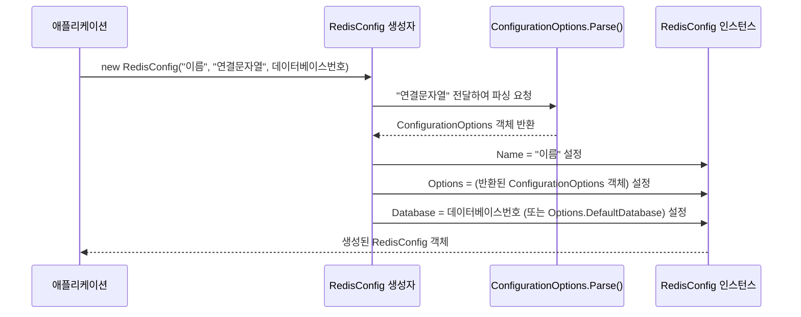
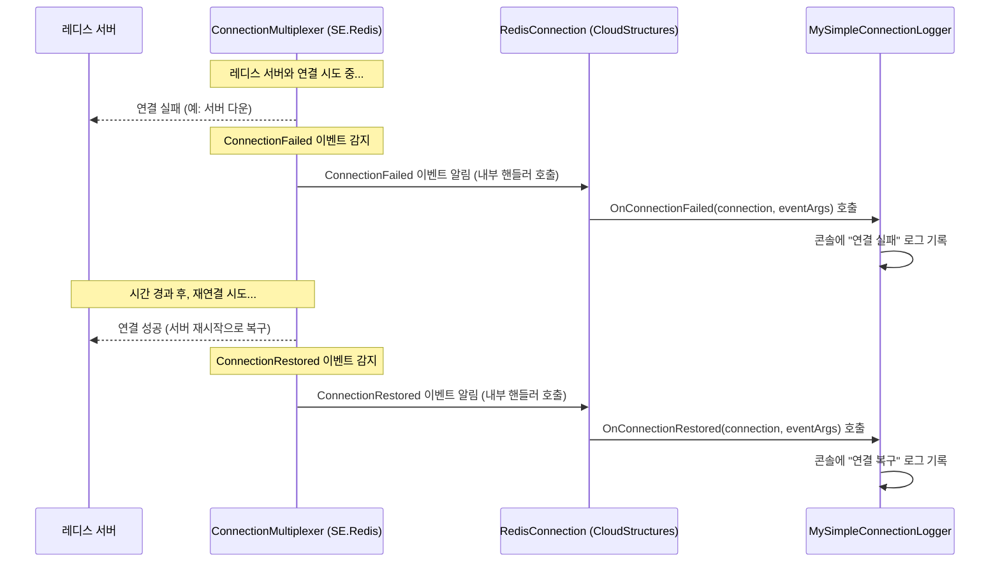
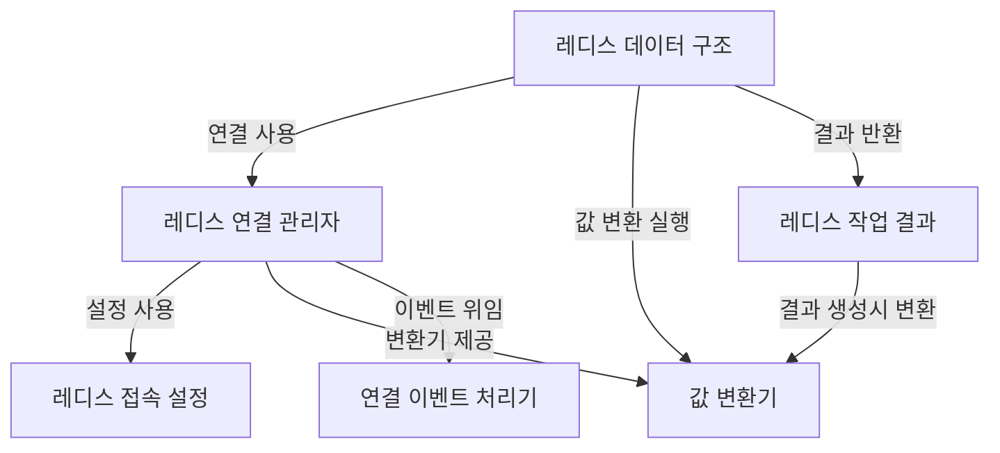

Directory structure:
└── redis/
    ├── README.md
    ├── RedisExampleServer.txt
    └── docs/
        ├── 01_레디스_접속_설정_.md
        ├── 02_레디스_연결_관리자_.md
        ├── 03_값_변환기_.md
        ├── 04_레디스_데이터_구조_.md
        ├── 05_레디스_작업_결과_.md
        ├── 06_연결_이벤트_처리기_.md
        ├── challenge_problems.md
        └── index.md

================================================
File: README.md
================================================
# Redis 학습 가이드

## Redis란?

**Redis**(Remote Dictionary Server)는 **인메모리 키-값 데이터 저장소**입니다. 데이터를 디스크가 아닌 **메모리에 저장**하여 MySQL 등 디스크 기반 DB보다 10~100배 빠른 읽기/쓰기 속도를 제공합니다.

### 게임 서버에서 Redis를 사용하는 이유

| 용도 | MySQL만 사용할 때 문제 | Redis로 해결 |
|:---|:---|:---|
| **인증 토큰** | 매 요청마다 DB 조회 → 느림 | 메모리에서 즉시 조회, TTL로 자동 만료 |
| **랭킹** | `ORDER BY` + `LIMIT` → 느린 쿼리 | SortedSet으로 O(logN) 정렬, 즉시 Top N 조회 |
| **분산 락** | 다중 서버 환경에서 동시 요청 제어 불가 | `SET NX`로 원자적 락 획득 |
| **속도 제한** | 별도 카운터 테이블 + 만료 관리 복잡 | 키 TTL로 자동 만료, Increment로 카운터 |
| **채팅 이력** | 채팅마다 INSERT → DB 부하 | List에 Push, 메모리에서 빠른 조회 |
| **세션 캐시** | 매 요청마다 유저 데이터 DB 조회 | Cache-Aside 패턴으로 메모리 캐시 |

> **핵심:** Redis는 MySQL을 **대체**하는 것이 아니라 **보완**합니다. 영구 저장은 MySQL, 빈번한 읽기/쓰기와 임시 데이터는 Redis를 사용합니다.

### Redis의 5가지 핵심 데이터 구조

| 데이터 구조 | Redis 명령 | C# (CloudStructures) | 게임 서버 활용 |
|:---|:---|:---|:---|
| **String** | `SET`, `GET`, `INCR` | `RedisString<T>` | 인증 토큰, 유저 세션, 카운터 |
| **List** | `LPUSH`, `LRANGE`, `LTRIM` | `RedisList<T>` | 채팅 이력, 활동 로그, 큐 |
| **Set** | `SADD`, `SREM`, `SMEMBERS` | `RedisSet<T>` | 좋아요, 친구 목록, 중복 방지 |
| **SortedSet** | `ZADD`, `ZRANGE`, `ZRANK` | `RedisSortedSet<T>` | 랭킹, 리더보드 |
| **Hash** | `HSET`, `HGET`, `HGETALL` | `RedisDictionary<TK,TV>` | 유저 프로필 필드별 관리 |

---

## 학습 자료 구조

```
redis/
├── README.md                          # 이 문서 (개요 및 시작 가이드)
├── docs/                              # CloudStructures 튜토리얼 (6장)
│   ├── index.md                       # 튜토리얼 목차 및 구조도
│   ├── 01_레디스_접속_설정_.md        # RedisConfig 설정 방법
│   ├── 02_레디스_연결_관리자_.md      # RedisConnection 싱글톤 관리
│   ├── 03_값_변환기_.md              # JSON 직렬화/역직렬화
│   ├── 04_레디스_데이터_구조_.md      # 5가지 데이터 구조 상세 설명
│   ├── 05_레디스_작업_결과_.md        # RedisResult<T> 안전한 결과 처리
│   ├── 06_연결_이벤트_처리기_.md      # 연결 실패/복구 이벤트 처리
│   └── challenge_problems.md          # 실습 과제 16개
│
└── RedisExampleServer/                # ASP.NET Core 예제 서버
    ├── Program.cs                     # 앱 초기화 + Redis 연결 설정
    ├── apiTest.http                   # API 테스트 파일 (18개 엔드포인트)
    ├── Services/
    │   ├── RedisService.cs            # Redis 연결 싱글톤 + 팩토리 메서드
    │   └── RedisKeyBuilder.cs         # Redis 키 네이밍 규칙 중앙 관리
    ├── Models/
    │   ├── ErrorCode.cs               # 에러코드 enum
    │   └── BaseResponse.cs            # API 공통 응답 DTO
    └── Controllers/
        ├── AuthController.cs          # String — 계정/로그인/유저데이터
        ├── ChatController.cs          # List — 채팅 메시지 저장/조회
        ├── LikeController.cs          # Set — 좋아요 토글/목록/수
        ├── RankingController.cs       # SortedSet — 랭킹 등록/조회
        ├── LockController.cs          # 분산 락 (SET NX + TTL)
        └── RateLimitController.cs     # 속도 제한 (TTL 활용 3패턴)
```

---

## 권장 학습 순서

```
1단계: 이론                   2단계: 예제 서버               3단계: 실습 과제
┌─────────────────┐          ┌─────────────────┐          ┌─────────────────┐
│ docs/ 튜토리얼  │    →     │ RedisExampleServer│    →     │ challenge_      │
│ 01~06장 순서대로 │          │ 코드 분석 + 실행  │          │ problems.md     │
│ 읽기            │          │ apiTest.http 테스트│          │ 16개 과제 구현   │
└─────────────────┘          └─────────────────┘          └─────────────────┘
```

### 예제 서버와 튜토리얼의 대응 관계

| 컨트롤러 | Redis 구조 | 관련 튜토리얼 | 학습 포인트 |
|:---|:---|:---|:---|
| `AuthController` | `RedisString<T>` | 04장 | GET/SET, HasValue 패턴, TTL, 복합 객체 직렬화 |
| `ChatController` | `RedisList<T>` | 04장 | LeftPush, Range, Trim(크기 제한) |
| `LikeController` | `RedisSet<T>` | 04장 | Add/Remove, Contains, Members |
| `RankingController` | `RedisSortedSet<T>` | 04장 | Add(Score), RangeByRank, Rank |
| `LockController` | `RedisString` + `When.NotExists` | 04장 | 분산 락, NX 플래그, TTL 자동 해제 |
| `RateLimitController` | `RedisString` + TTL | 04장 | Increment, 카운터 TTL, 쿨다운 패턴 |

---

## Redis 설치 및 실행

### Docker (권장)

```bash
# Redis 서버 실행
docker run -d --name redis -p 6379:6379 redis:latest

# 정상 동작 확인
docker exec -it redis redis-cli ping
# 출력: PONG
```

### Windows (WSL2)

```bash
wsl
sudo apt update && sudo apt install redis-server
sudo service redis-server start
redis-cli ping
# 출력: PONG
```

Windows에서 WSL 없이 사용하려면 [Memurai](https://www.memurai.com/) (Redis 호환)를 설치할 수 있습니다.

### redis-cli 기본 명령어

설치 확인 및 학습에 유용한 기본 명령어입니다.

```bash
redis-cli                    # Redis CLI 접속

# String
SET mykey "hello"            # 키-값 저장
GET mykey                    # 값 조회 → "hello"
SET counter 0                # 카운터 초기화
INCR counter                 # 1 증가 → 1
SET token "abc" EX 60        # 60초 후 자동 만료

# List
LPUSH mylist "a" "b" "c"    # 왼쪽에 추가 → [c, b, a]
LRANGE mylist 0 -1           # 전체 조회

# Set
SADD myset "user1" "user2"  # 멤버 추가
SMEMBERS myset               # 전체 멤버 조회
SISMEMBER myset "user1"      # 멤버 여부 확인 → 1(있음)

# SortedSet
ZADD ranking 100 "player1"  # 점수와 함께 추가
ZREVRANGE ranking 0 9 WITHSCORES  # Top 10 (내림차순)
ZREVRANK ranking "player1"   # 순위 조회 (0-based)

# 키 관리
KEYS *                       # 모든 키 조회 (개발용, 운영 금지)
TTL mykey                    # 남은 만료 시간 확인 (-1: 만료 없음, -2: 키 없음)
DEL mykey                    # 키 삭제
FLUSHDB                      # 현재 DB의 모든 키 삭제
```

---

## 예제 서버 실행 및 테스트

### 사전 요구사항

- .NET 10.0 SDK
- Redis 서버 (`127.0.0.1:6379`에서 실행 중)

### 빌드 및 실행

```bash
cd redis/RedisExampleServer
dotnet build
dotnet run
# 서버 주소: http://localhost:11600
```

### API 테스트

VS Code의 [REST Client](https://marketplace.visualstudio.com/items?itemName=humao.rest-client) 확장 또는 JetBrains Rider에서 `apiTest.http` 파일을 열고 각 요청의 `Send Request`를 클릭합니다.

**권장 테스트 순서:**

1. **Auth** — 계정 생성 → 로그인 → 유저 데이터 저장/조회
2. **Chat** — 메시지 전송 2개 → 이력 조회
3. **Like** — 좋아요 토글 → 목록 → 수 → 취소
4. **Ranking** — 점수 5명 등록 → Top10 → 내 순위 → 주변 순위
5. **Lock** — 아이템 획득 → (3초 내) 동일 유저 재요청 → `AlreadyLocked` 확인
6. **RateLimit** — 닉네임 변경 4회(4번째 실패) → 일일 이벤트 2회(2번째 실패) → SMS 쿨다운

### CloudStructures 라이브러리

본 예제는 [CloudStructures](https://github.com/Cysharp/CloudStructures) 라이브러리를 사용합니다. CloudStructures는 `StackExchange.Redis`를 래핑하여 Redis의 각 데이터 구조를 C# 제네릭 클래스로 제공합니다.

```
CloudStructures 구조:
┌─────────────────────────────────────────┐
│            CloudStructures              │
│  RedisString<T>, RedisList<T>,          │
│  RedisSet<T>, RedisSortedSet<T> ...     │
├─────────────────────────────────────────┤
│          StackExchange.Redis            │
│  ConnectionMultiplexer, IDatabase ...   │
├─────────────────────────────────────────┤
│              Redis Server               │
└─────────────────────────────────────────┘
```

직접 `StackExchange.Redis`를 사용하면 `IDatabase.StringSetAsync(key, value)` 처럼 문자열 기반으로 작업하지만, CloudStructures를 사용하면 `RedisString<UserGameData>`처럼 **타입 안전하게** 작업할 수 있습니다.

## 기술 스택

- .NET 10.0
- CloudStructures 3.3.0 (Redis 클라이언트 추상화)
- StackExchange.Redis (CloudStructures 내부 사용)


================================================
File: RedisExampleServer.txt
================================================
Directory structure:
└── RedisExampleServer/
    ├── Program.cs
    ├── RedisExampleServer.csproj
    ├── apiTest.http
    ├── appsettings.Development.json
    ├── appsettings.json
    ├── Controllers/
    │   ├── AuthController.cs
    │   ├── ChatController.cs
    │   ├── LikeController.cs
    │   ├── LockController.cs
    │   ├── RankingController.cs
    │   └── RateLimitController.cs
    ├── Models/
    │   ├── BaseResponse.cs
    │   └── ErrorCode.cs
    ├── Properties/
    │   └── launchSettings.json
    └── Services/
        ├── RedisKeyBuilder.cs
        └── RedisService.cs

================================================
File: Program.cs
================================================
using RedisExampleServer.Services;

var builder = WebApplication.CreateBuilder(args);

var configuration = builder.Configuration;

// RedisService를 싱글톤으로 등록 (앱 전체에서 하나의 Redis 연결을 공유)
// 참고: docs/02_레디스_연결_관리자_.md
builder.Services.AddSingleton<RedisService>();
builder.Services.AddControllers();

var app = builder.Build();

// Redis 초기화: appsettings.json의 "RedisAddress"(기본값 127.0.0.1)로 연결
// RedisService.Init()이 호출되면 내부적으로 CloudStructures의 RedisConnection이 생성됨
var redisService = app.Services.GetRequiredService<RedisService>();
redisService.Init(configuration["RedisAddress"]!);

app.MapControllers();

// appsettings.json의 "ServerAddress"(기본값 http://0.0.0.0:11600)에서 서버 시작
app.Run(configuration["ServerAddress"]);


================================================
File: RedisExampleServer.csproj
================================================
<Project Sdk="Microsoft.NET.Sdk.Web">

    <PropertyGroup>
        <TargetFramework>net10.0</TargetFramework>
        <Nullable>enable</Nullable>
        <ImplicitUsings>enable</ImplicitUsings>
    </PropertyGroup>

    <ItemGroup>
        <PackageReference Include="CloudStructures" Version="3.3.0" />
    </ItemGroup>

</Project>


================================================
File: apiTest.http
================================================
@host = http://localhost:11600

### ============================================================
### Auth (RedisString) — 계정 생성 / 로그인 / 유저 데이터
### ============================================================

### 계정 생성
POST {{host}}/Auth/CreateAccount
Content-Type: application/json

{ "Email": "test@example.com", "Password": "123qwe" }

### 로그인
POST {{host}}/Auth/Login
Content-Type: application/json

{ "Email": "test@example.com", "Password": "123qwe" }

### 유저 데이터 저장
POST {{host}}/Auth/SetUserData
Content-Type: application/json

{ "UserId": "test@example.com", "Level": 10, "Exp": 2500, "Money": 99999 }

### 유저 데이터 조회
POST {{host}}/Auth/GetUserData
Content-Type: application/json

{ "UserId": "test@example.com" }


### ============================================================
### Chat (RedisList) — 채팅 전송 / 이력 조회
### ============================================================

### 메시지 전송 1
POST {{host}}/Chat/Send
Content-Type: application/json

{ "UserId": "user1", "LobbyId": 1, "Message": "안녕하세요!" }

### 메시지 전송 2
POST {{host}}/Chat/Send
Content-Type: application/json

{ "UserId": "user2", "LobbyId": 1, "Message": "반갑습니다!" }

### 채팅 이력 조회
POST {{host}}/Chat/History
Content-Type: application/json

{ "LobbyId": 1, "Count": 10 }


### ============================================================
### Like (RedisSet) — 좋아요 토글 / 목록 / 수
### ============================================================

### user1이 targetUser에게 좋아요
POST {{host}}/Like/Toggle
Content-Type: application/json

{ "UserId": "user1", "TargetUserId": "targetUser" }

### user2도 좋아요
POST {{host}}/Like/Toggle
Content-Type: application/json

{ "UserId": "user2", "TargetUserId": "targetUser" }

### 좋아요 목록
POST {{host}}/Like/List
Content-Type: application/json

{ "TargetUserId": "targetUser" }

### 좋아요 수
POST {{host}}/Like/Count
Content-Type: application/json

{ "TargetUserId": "targetUser" }

### 좋아요 취소 (한번 더 Toggle)
POST {{host}}/Like/Toggle
Content-Type: application/json

{ "UserId": "user1", "TargetUserId": "targetUser" }


### ============================================================
### Ranking (RedisSortedSet) — 점수 등록 / Top10 / 내 순위
### ============================================================

### 점수 등록
POST {{host}}/Ranking/SetScore
Content-Type: application/json

{ "UserId": "player1", "Score": 1500 }

###
POST {{host}}/Ranking/SetScore
Content-Type: application/json

{ "UserId": "player2", "Score": 2300 }

###
POST {{host}}/Ranking/SetScore
Content-Type: application/json

{ "UserId": "player3", "Score": 1800 }

###
POST {{host}}/Ranking/SetScore
Content-Type: application/json

{ "UserId": "player4", "Score": 3100 }

###
POST {{host}}/Ranking/SetScore
Content-Type: application/json

{ "UserId": "player5", "Score": 900 }

### Top 10
POST {{host}}/Ranking/Top10

### 내 순위
POST {{host}}/Ranking/MyRank
Content-Type: application/json

{ "UserId": "player3" }

### 주변 순위 (내 순위 ±2)
POST {{host}}/Ranking/Neighbors
Content-Type: application/json

{ "UserId": "player3" }


### ============================================================
### Lock — 분산 락 (동시 요청 방지)
### ============================================================

### 아이템 획득 (3초 작업)
POST {{host}}/Lock/GetItem
Content-Type: application/json

{ "UserId": "user1", "WorkDurationMs": 3000 }

### 동시 요청 테스트: 위 요청 처리 중 같은 유저로 재요청 → AlreadyLocked
POST {{host}}/Lock/GetItem
Content-Type: application/json

{ "UserId": "user1", "WorkDurationMs": 1000 }


### ============================================================
### RateLimit — 속도 제한 / 일일 이벤트 / SMS 쿨다운
### ============================================================

### 닉네임 변경 (2분에 3회 제한 — 4번째부터 실패)
POST {{host}}/RateLimit/ChangeNickname
Content-Type: application/json

{ "UserId": "user1" }

### 일일 이벤트 (하루 1회 — 두 번째 시도는 실패)
POST {{host}}/RateLimit/DailyEvent
Content-Type: application/json

{ "UserId": "user1" }

### SMS 인증 코드 (60초 쿨다운 — 60초 내 재요청 실패)
POST {{host}}/RateLimit/RequestSmsCode
Content-Type: application/json

{ "UserId": "user1" }


================================================
File: appsettings.Development.json
================================================
{
  "Logging": {
    "LogLevel": {
      "Default": "Debug",
      "Microsoft.AspNetCore": "Warning"
    }
  }
}


================================================
File: appsettings.json
================================================
{
  "ServerAddress": "http://0.0.0.0:11600",
  "RedisAddress": "127.0.0.1",
  "Logging": {
    "LogLevel": {
      "Default": "Information",
      "Microsoft.AspNetCore": "Warning"
    }
  }
}


================================================
File: Controllers/AuthController.cs
================================================
using System.ComponentModel.DataAnnotations;
using System.Security.Cryptography;
using System.Text;
using Microsoft.AspNetCore.Mvc;
using RedisExampleServer.Models;
using RedisExampleServer.Services;

namespace RedisExampleServer.Controllers;

/// <summary>
/// RedisString&lt;T&gt; 예제: 계정 생성, 로그인, 유저 데이터 로드.
///
/// Redis 명령어 매핑:
///   GetAsync()  → GET key          (값 조회)
///   SetAsync()  → SET key value    (값 저장)
///   SetAsync(expiry) → SET key value EX seconds  (만료 시간 포함 저장)
///
/// 참고: docs/04_레디스_데이터_구조_.md — RedisString&lt;T&gt;
/// </summary>
[ApiController]
[Route("[controller]")]
public class AuthController : ControllerBase
{
    readonly RedisService _redis;

    public AuthController(RedisService redis)
    {
        _redis = redis;
    }

    // ── 계정 생성 ───────────────────────────────────────
    // RedisString SET: 이메일을 키로, 해싱된 비밀번호를 값으로 저장
    [HttpPost("CreateAccount")]
    public async Task<CreateAccountResponse> CreateAccount(CreateAccountRequest req)
    {
        var key = RedisKeyBuilder.UserAccount(req.Email);
        var redis = _redis.GetString<string>(key);

        // 중복 확인
        var exists = await redis.GetAsync();
        if (exists.HasValue)
            return new CreateAccountResponse { Result = ErrorCode.DuplicateAccount };

        var hashed = HashPassword(req.Password);
        await redis.SetAsync(hashed);

        return new CreateAccountResponse { Result = ErrorCode.None };
    }

    // ── 로그인 ──────────────────────────────────────────
    // RedisString GET으로 비밀번호 검증, SET으로 인증 토큰 저장 (30분 만료)
    [HttpPost("Login")]
    public async Task<LoginResponse> Login(LoginRequest req)
    {
        var accountRedis = _redis.GetString<string>(RedisKeyBuilder.UserAccount(req.Email));
        var stored = await accountRedis.GetAsync();

        if (!stored.HasValue)
            return new LoginResponse { Result = ErrorCode.AccountNotFound };

        if (stored.Value != HashPassword(req.Password))
            return new LoginResponse { Result = ErrorCode.InvalidPassword };

        // 토큰 생성 및 Redis에 저장 (30분 만료)
        var userId = req.Email;
        var token = Guid.NewGuid().ToString("N");
        var tokenRedis = _redis.GetString<string>(RedisKeyBuilder.AuthToken(userId), TimeSpan.FromMinutes(30));
        await tokenRedis.SetAsync(token);

        return new LoginResponse { Result = ErrorCode.None, UserId = userId, Token = token };
    }

    // ── 유저 데이터 로드 ─────────────────────────────────
    // RedisString<T>에 복합 객체(UserGameData)를 JSON 직렬화하여 저장/로드
    [HttpPost("SetUserData")]
    public async Task<BaseResponse> SetUserData(SetUserDataRequest req)
    {
        var redis = _redis.GetString<UserGameData>(RedisKeyBuilder.UserData(req.UserId));
        await redis.SetAsync(new UserGameData { Level = req.Level, Exp = req.Exp, Money = req.Money });
        return new BaseResponse { Result = ErrorCode.None };
    }

    [HttpPost("GetUserData")]
    public async Task<GetUserDataResponse> GetUserData(GetUserDataRequest req)
    {
        var redis = _redis.GetString<UserGameData>(RedisKeyBuilder.UserData(req.UserId));
        var result = await redis.GetAsync();

        if (!result.HasValue)
            return new GetUserDataResponse { Result = ErrorCode.AccountNotFound };

        return new GetUserDataResponse { Result = ErrorCode.None, Data = result.Value };
    }

    static string HashPassword(string password)
    {
        var bytes = SHA256.HashData(Encoding.UTF8.GetBytes(password));
        return Convert.ToHexString(bytes);
    }
}

// ── DTO ─────────────────────────────────────────────
public class CreateAccountRequest
{
    [Required][EmailAddress] public string Email { get; set; } = "";
    [Required][MinLength(1)][MaxLength(30)] public string Password { get; set; } = "";
}
public class CreateAccountResponse : BaseResponse { }

public class LoginRequest
{
    [Required] public string Email { get; set; } = "";
    [Required] public string Password { get; set; } = "";
}
public class LoginResponse : BaseResponse
{
    public string UserId { get; set; } = "";
    public string Token { get; set; } = "";
}

public class SetUserDataRequest
{
    [Required] public string UserId { get; set; } = "";
    public int Level { get; set; } = 1;
    public int Exp { get; set; }
    public long Money { get; set; }
}
public class GetUserDataRequest { [Required] public string UserId { get; set; } = ""; }
public class GetUserDataResponse : BaseResponse { public UserGameData? Data { get; set; } }

public class UserGameData
{
    public int Level { get; set; }
    public int Exp { get; set; }
    public long Money { get; set; }
}


================================================
File: Controllers/ChatController.cs
================================================
using System.ComponentModel.DataAnnotations;
using CloudStructures.Structures;
using Microsoft.AspNetCore.Mvc;
using RedisExampleServer.Models;
using RedisExampleServer.Services;

namespace RedisExampleServer.Controllers;

/// <summary>
/// RedisList&lt;T&gt; 예제: 로비 채팅 (최근 50개 메시지 유지).
/// RedisList는 순서가 보장되므로 채팅 이력, 최근 활동 로그 등에 적합하다.
///
/// Redis 명령어 매핑:
///   LeftPushAsync() → LPUSH key value   (왼쪽에 추가 = 최신이 맨 앞)
///   RangeAsync()    → LRANGE key 0 N    (인덱스 범위로 조회)
///   TrimAsync()     → LTRIM key 0 49    (범위 밖 요소 삭제 = 크기 제한)
///
/// 참고: docs/04_레디스_데이터_구조_.md — RedisList&lt;T&gt;
/// </summary>
[ApiController]
[Route("[controller]")]
public class ChatController : ControllerBase
{
    readonly RedisService _redis;
    const int MaxMessages = 50;

    public ChatController(RedisService redis)
    {
        _redis = redis;
    }

    // ── 메시지 전송 ─────────────────────────────────────
    // LeftPush로 최신 메시지를 앞에 추가, Trim으로 50개 제한 유지
    [HttpPost("Send")]
    public async Task<BaseResponse> Send(ChatSendRequest req)
    {
        var key = RedisKeyBuilder.ChatLobby(req.LobbyId);
        var list = _redis.GetList<ChatMessage>(key);

        var message = new ChatMessage
        {
            Sender = req.UserId,
            Content = req.Message,
            Timestamp = DateTime.UtcNow
        };

        await list.LeftPushAsync(message);
        await list.TrimAsync(0, MaxMessages - 1); // 최대 50개만 유지

        return new BaseResponse { Result = ErrorCode.None };
    }

    // ── 채팅 이력 조회 ──────────────────────────────────
    // Range로 최근 N개 메시지를 가져온다
    [HttpPost("History")]
    public async Task<ChatHistoryResponse> History(ChatHistoryRequest req)
    {
        var key = RedisKeyBuilder.ChatLobby(req.LobbyId);
        var list = _redis.GetList<ChatMessage>(key);

        var count = Math.Min(req.Count, MaxMessages);
        var messages = await list.RangeAsync(0, count - 1);

        return new ChatHistoryResponse
        {
            Result = ErrorCode.None,
            Messages = messages
        };
    }
}

// ── DTO & Model ─────────────────────────────────────
public class ChatMessage
{
    public string Sender { get; set; } = "";
    public string Content { get; set; } = "";
    public DateTime Timestamp { get; set; }
}

public class ChatSendRequest
{
    [Required] public string UserId { get; set; } = "";
    public int LobbyId { get; set; } = 1;
    [Required][MaxLength(200)] public string Message { get; set; } = "";
}

public class ChatHistoryRequest
{
    public int LobbyId { get; set; } = 1;
    public int Count { get; set; } = 20;
}

public class ChatHistoryResponse : BaseResponse
{
    public ChatMessage[] Messages { get; set; } = [];
}


================================================
File: Controllers/LikeController.cs
================================================
using System.ComponentModel.DataAnnotations;
using Microsoft.AspNetCore.Mvc;
using RedisExampleServer.Models;
using RedisExampleServer.Services;

namespace RedisExampleServer.Controllers;

/// <summary>
/// RedisSet&lt;T&gt; 예제: 좋아요 시스템.
/// RedisSet은 중복 없는 집합이므로 "누가 좋아요 했는지" 관리에 적합하다.
///
/// Redis 명령어 매핑:
///   AddAsync()      → SADD key member      (멤버 추가, 이미 있으면 무시)
///   RemoveAsync()   → SREM key member      (멤버 삭제)
///   ContainsAsync() → SISMEMBER key member  (멤버 존재 여부, O(1))
///   MembersAsync()  → SMEMBERS key          (모든 멤버 조회)
///   LengthAsync()   → SCARD key             (집합 크기)
///
/// 참고: docs/04_레디스_데이터_구조_.md — RedisSet&lt;T&gt;
/// </summary>
[ApiController]
[Route("[controller]")]
public class LikeController : ControllerBase
{
    readonly RedisService _redis;

    public LikeController(RedisService redis)
    {
        _redis = redis;
    }

    // ── 좋아요 토글 ─────────────────────────────────────
    // Contains로 이미 좋아요 했는지 확인, Add 또는 Remove로 토글
    [HttpPost("Toggle")]
    public async Task<LikeToggleResponse> Toggle(LikeToggleRequest req)
    {
        var set = _redis.GetSet<string>(RedisKeyBuilder.Likes(req.TargetUserId));

        var isMember = await set.ContainsAsync(req.UserId);
        if (isMember)
        {
            await set.RemoveAsync(req.UserId);
            return new LikeToggleResponse { Result = ErrorCode.None, Liked = false };
        }

        await set.AddAsync(req.UserId);
        return new LikeToggleResponse { Result = ErrorCode.None, Liked = true };
    }

    // ── 좋아요 목록 ─────────────────────────────────────
    // Members로 전체 좋아요한 유저 목록 조회
    [HttpPost("List")]
    public async Task<LikeListResponse> List(LikeListRequest req)
    {
        var set = _redis.GetSet<string>(RedisKeyBuilder.Likes(req.TargetUserId));
        var members = await set.MembersAsync();

        return new LikeListResponse
        {
            Result = ErrorCode.None,
            Users = members,
            Count = members.Length
        };
    }

    // ── 좋아요 수 ───────────────────────────────────────
    // Length로 집합의 크기(좋아요 수) 조회
    [HttpPost("Count")]
    public async Task<LikeCountResponse> Count(LikeCountRequest req)
    {
        var set = _redis.GetSet<string>(RedisKeyBuilder.Likes(req.TargetUserId));
        var count = await set.LengthAsync();

        return new LikeCountResponse { Result = ErrorCode.None, Count = count };
    }
}

// ── DTO ─────────────────────────────────────────────
public class LikeToggleRequest
{
    [Required] public string UserId { get; set; } = "";
    [Required] public string TargetUserId { get; set; } = "";
}
public class LikeToggleResponse : BaseResponse { public bool Liked { get; set; } }

public class LikeListRequest { [Required] public string TargetUserId { get; set; } = ""; }
public class LikeListResponse : BaseResponse
{
    public string[] Users { get; set; } = [];
    public long Count { get; set; }
}

public class LikeCountRequest { [Required] public string TargetUserId { get; set; } = ""; }
public class LikeCountResponse : BaseResponse { public long Count { get; set; } }


================================================
File: Controllers/LockController.cs
================================================
using System.ComponentModel.DataAnnotations;
using CloudStructures.Structures;
using Microsoft.AspNetCore.Mvc;
using RedisExampleServer.Models;
using RedisExampleServer.Services;
using StackExchange.Redis;

namespace RedisExampleServer.Controllers;

/// <summary>
/// Redis 분산 락 예제: 동시 요청 방지.
/// RedisString + When.NotExists + TTL로 분산 락을 구현한다.
/// 같은 유저의 동시 요청을 직렬화하여 데이터 정합성을 보장한다.
///
/// Redis 명령어 매핑:
///   SetAsync("locked", expiry, When.NotExists) → SET key "locked" EX 15 NX
///     NX: 키가 없을 때만 SET (이미 있으면 false 반환 = 락 획득 실패)
///     EX 15: 15초 후 자동 삭제 (서버 크래시 시에도 락이 영구히 남지 않음)
///   DeleteAsync() → DEL key  (락 해제)
/// </summary>
[ApiController]
[Route("[controller]")]
public class LockController : ControllerBase
{
    readonly RedisService _redis;
    static readonly TimeSpan LockExpiry = TimeSpan.FromSeconds(15);

    public LockController(RedisService redis)
    {
        _redis = redis;
    }

    // ── 락을 걸고 작업 수행 ──────────────────────────────
    // SetAsync(When.NotExists)로 락 획득 시도 → 작업 수행 → 락 해제
    // TTL을 설정하여 서버 크래시 시에도 자동 해제되도록 한다
    [HttpPost("GetItem")]
    public async Task<LockResponse> GetItem(LockRequest req)
    {
        var lockKey = RedisKeyBuilder.UserLock(req.UserId);
        var lockRedis = _redis.GetString<string>(lockKey, LockExpiry);

        // 락 획득 시도 (NX: Not Exists일 때만 SET)
        var acquired = await lockRedis.SetAsync("locked", LockExpiry, When.NotExists);
        if (!acquired)
            return new LockResponse { Result = ErrorCode.AlreadyLocked, Message = "다른 요청이 처리 중입니다" };

        try
        {
            // 시간이 걸리는 작업 시뮬레이션 (DB 조회, 아이템 지급 등)
            await Task.Delay(req.WorkDurationMs);

            return new LockResponse
            {
                Result = ErrorCode.None,
                Message = $"작업 완료 ({req.WorkDurationMs}ms 소요)"
            };
        }
        finally
        {
            // 락 해제
            await lockRedis.DeleteAsync();
        }
    }
}

// ── DTO ─────────────────────────────────────────────
public class LockRequest
{
    [Required] public string UserId { get; set; } = "";
    public int WorkDurationMs { get; set; } = 3000; // 기본 3초
}

public class LockResponse : BaseResponse
{
    public string Message { get; set; } = "";
}


================================================
File: Controllers/RankingController.cs
================================================
using System.ComponentModel.DataAnnotations;
using CloudStructures.Structures;
using Microsoft.AspNetCore.Mvc;
using RedisExampleServer.Models;
using RedisExampleServer.Services;
using StackExchange.Redis;

namespace RedisExampleServer.Controllers;

/// <summary>
/// RedisSortedSet&lt;T&gt; 예제: 랭킹 시스템 (Top 10, 내 순위, 주변 순위).
/// SortedSet은 점수(Score)로 자동 정렬되므로 리더보드에 최적이다.
///
/// Redis 명령어 매핑:
///   AddAsync(member, score)               → ZADD key score member  (추가/갱신, O(logN))
///   RangeByRankWithScoresAsync(0, 9, Desc)→ ZREVRANGE key 0 9 WITHSCORES (Top 10)
///   RankAsync(member, Desc)               → ZREVRANK key member    (내림차순 순위, 0-based)
///   ScoreAsync(member)                    → ZSCORE key member      (점수 조회)
///
/// 참고: docs/04_레디스_데이터_구조_.md — RedisSortedSet&lt;T&gt;
/// </summary>
[ApiController]
[Route("[controller]")]
public class RankingController : ControllerBase
{
    readonly RedisService _redis;

    public RankingController(RedisService redis)
    {
        _redis = redis;
    }

    // ── 점수 등록/갱신 ──────────────────────────────────
    // Add: 유저 점수를 등록. 이미 있으면 갱신된다.
    [HttpPost("SetScore")]
    public async Task<BaseResponse> SetScore(SetScoreRequest req)
    {
        var sortedSet = _redis.GetSortedSet<string>(RedisKeyBuilder.GlobalRanking);
        await sortedSet.AddAsync(req.UserId, req.Score);

        return new BaseResponse { Result = ErrorCode.None };
    }

    // ── Top 10 조회 ─────────────────────────────────────
    // RangeByRankWithScoresAsync: 순위 범위로 멤버+점수 조회 (내림차순)
    [HttpPost("Top10")]
    public async Task<RankingListResponse> Top10()
    {
        var sortedSet = _redis.GetSortedSet<string>(RedisKeyBuilder.GlobalRanking);
        var entries = await sortedSet.RangeByRankWithScoresAsync(0, 9, Order.Descending);

        var list = entries.Select((e, i) => new RankEntry
        {
            Rank = i + 1,
            UserId = e.Value,
            Score = (long)e.Score
        }).ToArray();

        return new RankingListResponse { Result = ErrorCode.None, Rankings = list };
    }

    // ── 내 순위 조회 ────────────────────────────────────
    // Rank: 특정 멤버의 순위를 반환 (0-based, 내림차순)
    [HttpPost("MyRank")]
    public async Task<MyRankResponse> MyRank(MyRankRequest req)
    {
        var sortedSet = _redis.GetSortedSet<string>(RedisKeyBuilder.GlobalRanking);
        var rank = await sortedSet.RankAsync(req.UserId, Order.Descending);

        if (!rank.HasValue)
            return new MyRankResponse { Result = ErrorCode.RankNotFound };

        var score = await sortedSet.ScoreAsync(req.UserId);

        return new MyRankResponse
        {
            Result = ErrorCode.None,
            Rank = rank.Value + 1, // 1-based
            Score = score.HasValue ? (long)score.Value : 0
        };
    }

    // ── 주변 순위 조회 (내 순위 ±2) ──────────────────────
    // Rank로 내 위치를 찾고, RangeByRank로 주변을 가져온다
    [HttpPost("Neighbors")]
    public async Task<RankingListResponse> Neighbors(MyRankRequest req)
    {
        var sortedSet = _redis.GetSortedSet<string>(RedisKeyBuilder.GlobalRanking);
        var myRank = await sortedSet.RankAsync(req.UserId, Order.Descending);

        if (!myRank.HasValue)
            return new RankingListResponse { Result = ErrorCode.RankNotFound };

        var start = Math.Max(0, myRank.Value - 2);
        var stop = myRank.Value + 2;

        var entries = await sortedSet.RangeByRankWithScoresAsync(start, stop, Order.Descending);

        var list = entries.Select((e, i) => new RankEntry
        {
            Rank = (int)start + i + 1,
            UserId = e.Value,
            Score = (long)e.Score
        }).ToArray();

        return new RankingListResponse { Result = ErrorCode.None, Rankings = list };
    }
}

// ── DTO & Model ─────────────────────────────────────
public class SetScoreRequest
{
    [Required] public string UserId { get; set; } = "";
    public long Score { get; set; }
}

public class MyRankRequest { [Required] public string UserId { get; set; } = ""; }
public class MyRankResponse : BaseResponse
{
    public long Rank { get; set; }
    public long Score { get; set; }
}

public class RankEntry
{
    public int Rank { get; set; }
    public string UserId { get; set; } = "";
    public long Score { get; set; }
}

public class RankingListResponse : BaseResponse
{
    public RankEntry[] Rankings { get; set; } = [];
}


================================================
File: Controllers/RateLimitController.cs
================================================
using System.ComponentModel.DataAnnotations;
using CloudStructures.Structures;
using Microsoft.AspNetCore.Mvc;
using RedisExampleServer.Models;
using RedisExampleServer.Services;
using StackExchange.Redis;

namespace RedisExampleServer.Controllers;

/// <summary>
/// Redis 키 만료(TTL) 예제: Rate Limiting, 일일 이벤트, SMS 쿨다운.
/// 키의 자동 만료(Expiry)를 활용한 시간 기반 제한 패턴들.
///
/// 핵심 Redis 패턴:
///   [카운터 패턴] INCR key → 값 1 증가 (키 없으면 0에서 시작). EXPIRE key 120 → TTL 설정
///   [1회 제한]    SET key value EX ttl NX → 키가 없을 때만 설정 + 자동 만료
///   [쿨다운]      SET key value EX 60 NX → 60초 동안 키 존재 = 재요청 차단
/// </summary>
[ApiController]
[Route("[controller]")]
public class RateLimitController : ControllerBase
{
    readonly RedisService _redis;

    public RateLimitController(RedisService redis)
    {
        _redis = redis;
    }

    // ── Rate Limiting: 2분에 3번 제한 ────────────────────
    // 패턴: INCR로 카운터 증가 → 값이 1이면(첫 요청) EXPIRE로 TTL 설정
    // Redis 명령: INCR key → 키 없으면 0에서 시작하여 1 반환. EXPIRE key 120
    [HttpPost("ChangeNickname")]
    public async Task<RateLimitResponse> ChangeNickname(RateLimitRequest req)
    {
        var key = RedisKeyBuilder.RateLimit(req.UserId, "nickname");
        var counter = new RedisString<long>(_redis.Connection, key, null);

        // 카운터 증가 (키가 없으면 0에서 시작하여 1 반환)
        var count = await counter.IncrementAsync(1);

        // 첫 요청이면 TTL 설정 (120초 후 카운터 자동 리셋)
        if (count == 1)
        {
            await counter.ExpireAsync(TimeSpan.FromSeconds(120));
        }

        if (count > 3)
            return new RateLimitResponse
            {
                Result = ErrorCode.RateLimitExceeded,
                Message = "2분 내 닉네임 변경 횟수(3회)를 초과했습니다"
            };

        var remaining = 3 - count;
        return new RateLimitResponse
        {
            Result = ErrorCode.None,
            Message = $"닉네임 변경 성공 (남은 횟수: {remaining})"
        };
    }

    // ── 일일 이벤트: 하루 1회 참여 ───────────────────────
    // SetAsync(When.NotExists) + 자정까지 TTL: 오늘 이미 참여했으면 실패
    [HttpPost("DailyEvent")]
    public async Task<RateLimitResponse> DailyEvent(RateLimitRequest req)
    {
        var key = RedisKeyBuilder.DailyEvent(req.UserId);
        var midnight = DateTime.Today.AddDays(1) - DateTime.Now;
        var redis = _redis.GetString<string>(key, midnight);

        var set = await redis.SetAsync("participated", midnight, When.NotExists);
        if (!set)
            return new RateLimitResponse
            {
                Result = ErrorCode.AlreadyParticipated,
                Message = "오늘 이미 참여한 이벤트입니다"
            };

        return new RateLimitResponse
        {
            Result = ErrorCode.None,
            Message = "일일 이벤트 참여 완료! 보상이 지급되었습니다"
        };
    }

    // ── SMS 쿨다운: 60초 간격 제한 ──────────────────────
    // SetAsync(When.NotExists) + 60초 TTL: 60초 내 재요청 차단
    [HttpPost("RequestSmsCode")]
    public async Task<RateLimitResponse> RequestSmsCode(RateLimitRequest req)
    {
        var key = RedisKeyBuilder.SmsCooldown(req.UserId);
        var redis = _redis.GetString<string>(key, TimeSpan.FromSeconds(60));

        var set = await redis.SetAsync("cooldown", TimeSpan.FromSeconds(60), When.NotExists);
        if (!set)
            return new RateLimitResponse
            {
                Result = ErrorCode.CooldownActive,
                Message = "60초 후에 다시 요청할 수 있습니다"
            };

        var code = Random.Shared.Next(100000, 999999);
        return new RateLimitResponse
        {
            Result = ErrorCode.None,
            Message = $"인증 코드가 발송되었습니다: {code}"
        };
    }
}

// ── DTO ─────────────────────────────────────────────
public class RateLimitRequest
{
    [Required] public string UserId { get; set; } = "";
}

public class RateLimitResponse : BaseResponse
{
    public string Message { get; set; } = "";
}


================================================
File: Models/BaseResponse.cs
================================================
namespace RedisExampleServer.Models;

/// <summary>
/// 모든 API 응답의 공통 기반 클래스.
/// Result가 ErrorCode.None(0)이면 성공, 그 외는 실패.
/// </summary>
public class BaseResponse
{
    public ErrorCode Result { get; set; }
}


================================================
File: Models/ErrorCode.cs
================================================
namespace RedisExampleServer.Models;

public enum ErrorCode : ushort
{
    None = 0,

    // Auth 1000~
    AuthFail = 1001,
    DuplicateAccount = 1002,
    AccountNotFound = 1003,
    InvalidPassword = 1004,
    TokenNotFound = 1005,

    // Chat 2000~
    ChatSendFail = 2001,

    // Like 3000~
    LikeFail = 3001,

    // Ranking 4000~
    RankingFail = 4001,
    RankNotFound = 4002,

    // Lock 5000~
    LockFail = 5001,
    AlreadyLocked = 5002,

    // RateLimit 6000~
    RateLimitExceeded = 6001,
    AlreadyParticipated = 6002,
    CooldownActive = 6003,

    // Redis 9000~
    RedisError = 9001,
}


================================================
File: Properties/launchSettings.json
================================================
{
  "profiles": {
    "RedisExampleServer": {
      "commandName": "Project",
      "applicationUrl": "http://0.0.0.0:11600",
      "environmentVariables": {
        "ASPNETCORE_ENVIRONMENT": "Development"
      }
    }
  }
}


================================================
File: Services/RedisKeyBuilder.cs
================================================
namespace RedisExampleServer.Services;

/// <summary>
/// Redis 키 네이밍 규칙을 관리하는 유틸리티.
/// 모든 키를 한 곳에서 관리하여 충돌과 오타를 방지한다.
/// </summary>
public static class RedisKeyBuilder
{
    // Auth
    public static string UserAccount(string email) => $"UA_{email}";
    public static string AuthToken(string userId) => $"Token_{userId}";
    public static string UserData(string userId) => $"UserData_{userId}";

    // Chat (RedisList)
    public static string ChatLobby(int lobbyId) => $"Chat_Lobby_{lobbyId}";

    // Like (RedisSet)
    public static string Likes(string targetUserId) => $"Likes_{targetUserId}";

    // Ranking (RedisSortedSet)
    public const string GlobalRanking = "Ranking_Global";

    // Lock
    public static string UserLock(string userId) => $"ULock_{userId}";

    // RateLimit
    public static string RateLimit(string userId, string action) => $"RateLimit_{userId}_{action}";
    public static string DailyEvent(string userId) => $"DailyEvent_{userId}_{DateTime.Now:yyyyMMdd}";
    public static string SmsCooldown(string userId) => $"SmsCooldown_{userId}";
}


================================================
File: Services/RedisService.cs
================================================
using CloudStructures;
using CloudStructures.Structures;

namespace RedisExampleServer.Services;

/// <summary>
/// Redis 연결을 관리하는 싱글톤 서비스.
/// CloudStructures의 RedisConnection을 감싸서 컨트롤러에서 직접 Redis 자료구조를 사용할 수 있도록 한다.
/// 참고: docs/02_레디스_연결_관리자_.md
/// </summary>
public class RedisService
{
    RedisConnection _connection = null!;

    public RedisConnection Connection => _connection;

    public void Init(string address)
    {
        var config = new RedisConfig("default", address);
        _connection = new RedisConnection(config);
    }

    // 편의 메서드: 키 이름으로 RedisString<T> 생성
    public RedisString<T> GetString<T>(string key)
    {
        return new RedisString<T>(_connection, key, null);
    }

    public RedisString<T> GetString<T>(string key, TimeSpan expiry)
    {
        return new RedisString<T>(_connection, key, expiry);
    }

    public RedisList<T> GetList<T>(string key)
    {
        return new RedisList<T>(_connection, key, null);
    }

    public RedisSet<T> GetSet<T>(string key)
    {
        return new RedisSet<T>(_connection, key, null);
    }

    public RedisSortedSet<T> GetSortedSet<T>(string key)
    {
        return new RedisSortedSet<T>(_connection, key, null);
    }
}


================================================
File: docs/01_레디스_접속_설정_.md
================================================
# Chapter 1: 레디스 접속 설정


CloudStructures를 사용하여 Redis와 통신하는 여정을 시작하신 것을 환영합니다! 이 장에서는 가장 기본적이면서도 중요한 첫 단계인 **레디스 접속 설정**에 대해 알아보겠습니다. 우리가 어떤 일을 시작하기 전에 계획을 세우듯이, 애플리케이션이 레디스 서버와 대화하려면 먼저 어디로, 어떻게 접속해야 하는지 알려줘야 합니다.

## 왜 레디스 접속 설정이 필요한가요?

애플리케이션이 레디스 서버를 사용하려고 할 때, 마치 우리가 새로운 친구 집에 처음 방문하는 것과 같습니다. 친구 집 주소를 알아야 하고, 초인종을 눌러야 문이 열리겠죠?

**중심 사용 사례:** 여러분의 컴퓨터(로컬 환경)에서 실행 중인 레디스 서버에 간단한 데이터를 저장하고 싶다고 가정해 봅시다.

이 경우, 우리 애플리케이션은 다음과 같은 정보를 알아야 합니다:
1.  레디스 서버가 어디에서 실행되고 있는가? (예: 내 컴퓨터, 특정 IP 주소)
2.  레디스 서버는 어떤 포트 번호를 사용하고 있는가? (기본값은 보통 6379입니다)
3.  혹시 비밀번호가 설정되어 있는가?
4.  여러 데이터베이스 중 어떤 데이터베이스를 사용할 것인가? (레디스는 기본적으로 0번부터 시작하는 여러 데이터베이스를 가질 수 있습니다)

이 모든 정보를 하나로 묶어 관리하는 것이 바로 `RedisConfig` 객체의 역할입니다. 마치 여행 가기 전에 목적지 주소, 교통편, 숙소 정보 등을 꼼꼼히 적어둔 '여행 계획서'와 같아요. 이 계획서(`RedisConfig`)가 있어야 `RedisConnection`이라는 실제 연결 담당자가 레디스 서버와 성공적으로 통신 채널을 열 수 있습니다.

## `RedisConfig`란 무엇인가요?

`RedisConfig`는 레디스 서버에 연결하기 위해 필요한 모든 구성 정보를 담고 있는 객체입니다. 이 객체는 다음과 같은 주요 정보를 가집니다:

*   **`Name` (이름)**: 이 설정에 대한 고유한 별명입니다. 예를 들어 "내 로컬 레디스", "운영 환경 캐시"처럼 이름을 붙여 여러 설정을 구분할 수 있습니다.
*   **`Options` (옵션)**: 실제 레디스 서버 접속에 필요한 핵심 정보들을 담고 있습니다. `StackExchange.Redis` 라이브러리의 `ConfigurationOptions` 객체를 사용하며, 여기에는 서버 주소, 포트, 암호, 연결 타임아웃 등의 상세 설정이 포함됩니다.
*   **`Database` (데이터베이스 인덱스)**: 연결 후 사용할 레디스의 논리적 데이터베이스 번호입니다. 지정하지 않으면 `Options`에 설정된 기본 데이터베이스를 사용합니다 (보통 0번).

여행 계획서에 비유해 볼까요?
*   `Name`: "제주도 여름 휴가 계획"
*   `Options`: "제주공항행 항공편 (대한항공 KE123)", "제주 시내 호텔 (롯데호텔)", "렌터카 (현대 소나타)" 등 실제 여행에 필요한 정보
*   `Database`: "첫날 방문할 관광지 (성산일출봉)"

## `RedisConfig` 사용 방법

`RedisConfig` 객체를 만드는 방법은 몇 가지가 있습니다. 가장 일반적인 방법은 연결 문자열(connection string)을 사용하는 것입니다.

### 1. 가장 기본적인 연결 (이름과 연결 문자열 사용)

로컬 컴퓨터(localhost)의 기본 포트(6379)에서 실행 중인 레디스 서버에 연결한다고 가정해 봅시다.

```csharp
// "local-redis"라는 이름으로 로컬호스트 6379 포트에 연결하는 설정
var config = new CloudStructures.RedisConfig("local-redis", "localhost:6379");
```

위 코드에서:
*   `"local-redis"`는 이 설정의 `Name`입니다. 나중에 여러 설정을 구분할 때 사용됩니다.
*   `"localhost:6379"`는 연결 문자열입니다. `호스트이름:포트번호` 형식입니다.

이 `config` 객체는 이제 `localhost:6379`에 있는 레디스 서버에 접속하기 위한 준비가 된 것입니다.

### 2. 암호 및 기본 데이터베이스를 포함한 연결 문자열 사용

만약 레디스 서버에 암호가 설정되어 있고, 특정 데이터베이스(예: 1번)를 기본으로 사용하고 싶다면 연결 문자열에 추가 정보를 포함할 수 있습니다.

```csharp
// "secured-redis"라는 이름으로, 암호가 "mysecretpassword"이고
// 기본 데이터베이스로 1번을 사용하는 로컬 레디스에 연결
var config = new CloudStructures.RedisConfig(
    "secured-redis",
    "localhost:6379,password=mysecretpassword,defaultDatabase=1"
);
```

연결 문자열 안에서 쉼표(`,`)로 구분하여 다양한 옵션을 설정할 수 있습니다. `password`와 `defaultDatabase`가 그 예입니다. `StackExchange.Redis` 라이브러리가 이 문자열을 해석하여 `ConfigurationOptions` 객체를 내부적으로 생성합니다.

### 3. `ConfigurationOptions` 객체를 직접 사용

더 세밀한 제어가 필요하거나, 이미 `StackExchange.Redis.ConfigurationOptions` 객체를 가지고 있다면 이를 직접 `RedisConfig` 생성자에 전달할 수 있습니다.

```csharp
// StackExchange.Redis의 ConfigurationOptions 객체를 먼저 설정
var options = new StackExchange.Redis.ConfigurationOptions
{
    EndPoints = { "127.0.0.1:6380" }, // 접속할 서버 주소 및 포트
    Password = "anotherpassword",     // 암호
    DefaultDatabase = 2               // 기본 데이터베이스
};

// "custom-options-redis"라는 이름으로 위에서 만든 options 객체를 사용하여 설정
var config = new CloudStructures.RedisConfig("custom-options-redis", options);
```

이 방법은 연결 문자열로 표현하기 어려운 복잡한 설정을 할 때 유용합니다.

### 4. `RedisConfig`에서 논리적 데이터베이스 지정하기

`CloudStructures`를 사용할 때, `RedisConfig` 생성자의 `database` 매개변수를 통해 이 설정이 사용할 특정 논리적 데이터베이스 번호를 지정할 수 있습니다. 이는 연결 문자열이나 `ConfigurationOptions`의 `DefaultDatabase` 설정보다 우선 적용됩니다.

```csharp
// "db5-redis"라는 이름으로, 로컬 레디스에 연결하되,
// CloudStructures에서는 5번 데이터베이스를 사용하도록 명시
var config = new CloudStructures.RedisConfig(
    "db5-redis",
    "localhost:6379,defaultDatabase=0", // 연결 문자열에는 기본 DB 0으로 되어 있지만
    database: 5                         // RedisConfig에서는 5번을 사용
);
```

이 경우, 실제 레디스 서버와의 연결은 `defaultDatabase=0`으로 초기화될 수 있지만, `CloudStructures`를 통해 이 `config`를 사용하는 모든 작업은 레디스의 5번 데이터베이스를 대상으로 수행됩니다. 만약 `database` 매개변수가 `null` (기본값)이면, `ConfigurationOptions`의 `DefaultDatabase` 값을 따릅니다.

## 내부 동작 살짝 엿보기

`RedisConfig` 객체를 생성할 때 내부적으로 어떤 일이 일어나는지 간단히 살펴보겠습니다.

예를 들어, `new RedisConfig("my-config", "redis.example.com:6379,password=1234", 0)` 코드가 실행되면:

1.  애플리케이션은 `RedisConfig`의 생성자를 호출하며 이름("my-config"), 연결 문자열("redis.example.com:6379,password=1234"), 그리고 데이터베이스 인덱스(0)를 전달합니다.
2.  `RedisConfig` 생성자는 먼저 전달받은 연결 문자열(`"redis.example.com:6379,password=1234"`)을 `StackExchange.Redis.ConfigurationOptions.Parse()` 메서드에 넘겨 `ConfigurationOptions` 객체로 변환합니다. 이 객체에는 서버 주소, 포트, 암호 등의 정보가 구조화되어 담깁니다.
3.  그 다음, 전달받은 이름("my-config"), 변환된 `ConfigurationOptions` 객체, 그리고 데이터베이스 인덱스(0)를 `RedisConfig` 인스턴스의 각 속성(`Name`, `Options`, `Database`)에 저장합니다.
4.  만약 생성자에 `database` 인덱스가 명시적으로 제공되지 않았다면 (`null`이라면), `ConfigurationOptions` 객체에 설정된 `DefaultDatabase` 값을 사용합니다.

다음은 이 과정을 보여주는 간단한 순서도입니다:



### 코드 살펴보기 (`RedisConfig.cs`)

실제 `CloudStructures`의 `RedisConfig.cs` 파일의 일부를 보면 이 과정을 더 명확히 이해할 수 있습니다.

두 개의 생성자가 있습니다. 첫 번째 생성자는 연결 문자열을 받습니다:

```csharp
// CloudStructures/RedisConfig.cs

// ... (다른 코드 생략) ...

public RedisConfig(string name, string connectionString, int? database = default)
    : this(name, ConfigurationOptions.Parse(connectionString), database)
{ } // 이 생성자는 다른 생성자를 호출합니다.
```

이 생성자는 `ConfigurationOptions.Parse(connectionString)`를 호출하여 연결 문자열을 `ConfigurationOptions` 객체로 변환한 후, 다른 생성자에게 이 객체를 전달합니다. `this(...)` 구문이 바로 그것입니다.

핵심 로직은 `ConfigurationOptions` 객체를 받는 두 번째 생성자에 있습니다:

```csharp
// CloudStructures/RedisConfig.cs

// ... (다른 코드 생략) ...

public RedisConfig(string name, ConfigurationOptions options, int? database = default)
{
    this.Name = name;       // 전달받은 이름 저장
    this.Options = options; // 전달받은 ConfigurationOptions 객체 저장

    // database 매개변수가 제공되면 그 값을 사용하고,
    // 그렇지 않으면 options에 설정된 DefaultDatabase 값을 사용
    this.Database = database ?? options.DefaultDatabase;
}
```

여기서 `this.Name = name;`과 `this.Options = options;`는 전달받은 값들을 각각 `Name`과 `Options` 속성에 할당합니다.

`this.Database = database ?? options.DefaultDatabase;` 부분은 중요합니다.
*   `??` 연산자(null 병합 연산자)는 `database` 매개변수가 `null`이 아니면 그 값을 사용하고, `null`이면 `options.DefaultDatabase` 값을 `this.Database`에 할당합니다.
*   이를 통해 `RedisConfig`를 생성할 때 명시적으로 데이터베이스 인덱스를 지정할 수도 있고, 지정하지 않으면 `ConfigurationOptions`에 설정된 기본값을 따르도록 유연성을 제공합니다.

이 `RedisConfig` 객체는 이후 레디스 서버와의 실제 연결을 수립하는 [레디스 연결 관리자](02_레디스_연결_관리자_.md)에게 전달되어 사용됩니다.

## 정리하며

이번 장에서는 `CloudStructures`를 사용하여 레디스에 연결하기 위한 첫걸음인 `RedisConfig` 객체에 대해 배웠습니다. `RedisConfig`는 레디스 서버의 주소, 포트, 암호, 사용할 데이터베이스 등 접속에 필요한 모든 정보를 담는 '여행 계획서'와 같다는 것을 기억해주세요. 이 계획서를 통해 우리는 애플리케이션이 어떤 레디스 서버와 통신해야 하는지 명확하게 지정할 수 있습니다.

이제 레디스 서버에 접속하기 위한 '여행 계획서'를 작성하는 방법을 배웠습니다. 다음 장에서는 이 계획서를 가지고 실제로 레디스와의 연결을 관리하는 [레디스 연결 관리자](02_레디스_연결_관리자_.md)에 대해 알아보겠습니다. 이 관리자는 `RedisConfig`를 사용하여 실제 연결을 만들고, 필요할 때 이 연결을 제공하는 중요한 역할을 합니다.

---

Generated by [AI Codebase Knowledge Builder](https://github.com/The-Pocket/Tutorial-Codebase-Knowledge)


================================================
File: docs/02_레디스_연결_관리자_.md
================================================
# Chapter 2: 레디스 연결 관리자

이전 [레디스 접속 설정](01_레디스_접속_설정_.md) 장에서는 레디스 서버에 접속하기 위한 '여행 계획서'인 `RedisConfig` 객체를 만드는 방법을 배웠습니다. `RedisConfig`에는 어디로, 어떻게 접속할지에 대한 모든 정보가 담겨 있었죠. 이제 그 계획서를 가지고 실제로 레디스와의 통신 채널을 열고 관리하는 일꾼, 바로 **레디스 연결 관리자 (`RedisConnection`)** 에 대해 알아볼 차례입니다.

## 레디스 연결 관리자는 왜 필요한가요?

`RedisConfig`가 여행 계획서라면, `RedisConnection`은 그 계획을 실행하는 여행 가이드 또는 통신을 총괄하는 중앙 교환원과 같습니다. `RedisConfig`에 적힌 대로 실제 레디스 서버에 접속하고, 우리가 보내는 명령을 레디스에 전달하며, 레디스로부터 받은 응답을 우리에게 돌려주는 역할을 합니다. 또한, 연결이 끊어졌을 때 다시 연결을 시도하거나, 연결 상태에 따라 특별한 작업을 수행할 수 있도록 돕습니다.

**중심 사용 사례:** 이전 장에서 "내 로컬 레디스"에 접속하기 위한 `RedisConfig`를 만들었습니다. 이제 이 설정을 사용해서 실제로 레디스 서버와 연결을 맺고, 앞으로 데이터를 주고받을 준비를 하고 싶습니다.

`RedisConnection` 객체는 이 모든 과정을 담당합니다. 마치 우리가 인터넷을 사용하기 위해 인터넷 공유기를 설치하고 켜는 것과 같아요. 일단 공유기가 켜지고 인터넷에 연결되면, 그 다음부터는 여러 기기에서 인터넷을 사용할 수 있죠. `RedisConnection`도 마찬가지로, 한 번 만들어두면 애플리케이션의 여러 부분에서 이 연결을 통해 레디스와 통신할 수 있게 됩니다.

## `RedisConnection`이란 무엇인가요?

`RedisConnection`은 레디스 서버와의 통신을 총괄하는 핵심 구성 요소입니다. 이름 그대로 '연결'을 담당하며, 다음과 같은 주요 역할을 합니다:

*   **실제 연결 수립**: `RedisConfig`에 담긴 정보를 바탕으로 실제 레디스 서버와 네트워크 연결을 맺습니다.
*   **명령 전달 및 응답 수신**: 애플리케이션이 레디스에 보내는 명령(예: "이 값을 저장해줘", "저 값을 가져다줘")을 전달하고, 레디스 서버의 응답을 받아옵니다. (실제 명령 실행은 다음 장들에서 다룰 데이터 구조 객체들을 통해 이루어집니다.)
*   **연결 상태 관리**: 연결이 안정적으로 유지되는지, 혹시 끊어지지는 않았는지 등을 관리합니다. 필요하다면 자동으로 재연결을 시도하기도 합니다.
*   **연결 이벤트 처리**: 연결 성공, 실패, 재연결 등 다양한 연결 관련 이벤트가 발생했을 때, 이를 감지하고 특정 동작을 수행할 수 있도록 지원합니다. (자세한 내용은 [연결 이벤트 처리기](06_연결_이벤트_처리기_.md) 장에서 다룹니다.)

가장 중요한 점은, **하나의 `RedisConnection` 인스턴스를 만들어 애플리케이션 전체에서 공유하며 사용하는 것이 일반적**이라는 것입니다. 매번 필요할 때마다 새로 연결을 만들고 끊는 것은 비효율적이기 때문입니다. 마치 집집마다 전화 교환기를 두는 대신, 하나의 중앙 전화 교환기가 여러 통화를 관리하는 것과 같습니다.

## `RedisConnection` 사용 방법

`RedisConnection` 객체를 만드는 것은 매우 간단합니다. 이전 장에서 만든 `RedisConfig` 객체만 있으면 됩니다.

### 1. `RedisConnection` 객체 생성하기

가장 기본적인 방법은 `RedisConfig` 객체를 `RedisConnection` 생성자에 전달하는 것입니다.

```csharp
// 이전 장에서 만든 RedisConfig 객체 (예시)
var config = new CloudStructures.RedisConfig("local-redis", "localhost:6379");

// RedisConfig를 사용하여 RedisConnection 객체 생성
var connection = new CloudStructures.RedisConnection(config);

// 이제 'connection' 객체를 통해 레디스와 통신할 준비가 되었습니다.
// 애플리케이션이 종료될 때 이 connection 객체를 Dispose 해주어야 합니다.
// 예를 들어, using 구문을 사용하거나 직접 .Dispose()를 호출할 수 있습니다.
// using (var connection = new CloudStructures.RedisConnection(config))
// {
//     // connection 사용
// }
```

위 코드에서 `new CloudStructures.RedisConnection(config)`를 호출하면 `connection`이라는 이름의 `RedisConnection` 객체가 만들어집니다. 이 `connection` 객체가 바로 레디스 서버와의 통신 창구 역할을 하게 됩니다.

이때, `RedisConnection` 생성자는 몇 가지 선택적 매개변수를 더 받을 수 있습니다:
*   `IValueConverter converter`: 레디스에 데이터를 저장하거나 읽어올 때 값의 형식을 변환하는 방법을 지정합니다. 자세한 내용은 [값 변환기](03_값_변환기_.md) 장에서 다룹니다.
*   `IConnectionEventHandler handler`: 연결 상태 변경과 같은 이벤트가 발생했을 때 처리할 로직을 담은 객체입니다. 자세한 내용은 [연결 이벤트 처리기](06_연결_이벤트_처리기_.md) 장에서 다룹니다.
*   `TextWriter logger`: 내부 동작에 대한 로그를 기록할 `TextWriter` 객체입니다 (예: `Console.Out`).

이러한 선택적 매개변수들은 지금 당장 필요하지 않다면 지정하지 않아도 괜찮습니다.

### 2. `RedisConnection` 공유하기 (싱글톤 패턴)

앞서 언급했듯이, `RedisConnection` 객체는 한 번 만들어서 애플리케이션 전체에서 공유하는 것이 좋습니다. 이렇게 하면 연결을 열고 닫는 데 드는 비용을 줄일 수 있고, `StackExchange.Redis` 라이브러리가 내부적으로 연결을 효율적으로 관리(Connection Pooling)할 수 있게 해줍니다.

가장 간단한 방법은 `static` 필드나 속성을 사용하여 `RedisConnection` 인스턴스를 저장하는 것입니다.

```csharp
// RedisConnection을 관리하는 정적 클래스 예시
public static class RedisManager
{
    private static readonly CloudStructures.RedisConnection _connection;

    static RedisManager()
    {
        // 애플리케이션 시작 시 한 번만 RedisConfig 생성
        var config = new CloudStructures.RedisConfig("shared-redis", "localhost:6379");
        // RedisConnection 생성 및 저장
        _connection = new CloudStructures.RedisConnection(config);
        // 실제 연결은 필요할 때 맺어집니다.
    }

    // 애플리케이션의 다른 부분에서 이 속성을 통해 RedisConnection에 접근
    public static CloudStructures.RedisConnection Connection => _connection;

    // 애플리케이션 종료 시 호출될 메서드 (예: ASP.NET Core의 경우 IApplicationLifetime)
    public static void DisposeConnection()
    {
        ((IDisposable)_connection)?.Dispose();
    }
}

// 사용 예시:
// var redisConn = RedisManager.Connection;
// 이제 redisConn을 사용하여 레디스 작업 수행
```
**주의:** 위 `DisposeConnection` 예시는 단순화를 위한 것이며, 실제 애플리케이션에서는 애플리케이션의 생명주기에 맞춰 적절한 시점에 `Dispose`를 호출해야 합니다. 예를 들어 ASP.NET Core 애플리케이션에서는 `IHostApplicationLifetime`의 `ApplicationStopping` 이벤트를 사용하여 정리할 수 있습니다.

### 3. `RedisConnection` 해제하기 (`IDisposable`)

`RedisConnection` 객체는 내부적으로 네트워크 리소스 등을 사용하므로, 애플리케이션이 종료될 때 반드시 `Dispose` 메서드를 호출하여 사용하던 리소스를 해제해주어야 합니다. 이는 C#의 `IDisposable` 패턴을 따릅니다.

`using` 구문을 사용하면 블록을 벗어날 때 자동으로 `Dispose`가 호출되지만, `RedisConnection`은 애플리케이션 전역에서 오랫동안 사용되는 경우가 많으므로, 애플리케이션 종료 시점에 명시적으로 `Dispose`를 호출하는 것이 일반적입니다.

```csharp
// 애플리케이션 종료 시점에 호출
// ((IDisposable)sharedConnection).Dispose();
```
만약 `RedisConnection`을 짧은 시간 동안만 사용한다면 `using` 문을 사용할 수 있습니다.
```csharp
var config = new CloudStructures.RedisConfig("temp-redis", "localhost:6379");
using (var connection = new CloudStructures.RedisConnection(config))
{
    // 이 블록 안에서 connection 사용
    // 블록을 벗어나면 connection.Dispose()가 자동으로 호출됨
}
```
하지만 앞서 설명했듯, 대부분의 경우 `RedisConnection`은 애플리케이션 수명 동안 유지됩니다.

## 내부 동작 살짝 엿보기

`RedisConnection` 객체를 생성하고 사용할 때 내부적으로 어떤 일이 일어나는지 간단히 살펴보겠습니다.

1.  **`RedisConnection` 객체 생성**: `new RedisConnection(config)`를 호출하면, `RedisConnection` 객체는 전달받은 `RedisConfig`를 저장합니다. **이때 바로 레디스 서버에 연결하지는 않습니다.**
2.  **첫 연결 시도 (Lazy Initialization)**: 실제로 레디스에 명령을 보내야 할 때 (예: 데이터를 가져오거나 저장하려고 할 때), `RedisConnection`은 내부적으로 `GetConnection()`이라는 메서드를 호출합니다.
3.  **`GetConnection()` 메서드**:
    *   이미 `ConnectionMultiplexer` (실제 레디스 연결을 담당하는 `StackExchange.Redis` 라이브러리의 핵심 객체) 인스턴스가 만들어져 있는지 확인합니다.
    *   만약 없다면, `RedisConfig`에 저장된 `Options`를 사용하여 `ConnectionMultiplexer.Connect()`를 호출하여 새 연결을 만듭니다. 이 과정에서 실제 네트워크 통신이 발생하여 레디스 서버와 연결됩니다.
    *   연결이 성공적으로 만들어지면, 이 `ConnectionMultiplexer` 인스턴스를 내부 필드에 저장(캐싱)해두고 반환합니다.
    *   이후 다시 `GetConnection()`이 호출되면, 이미 만들어둔 `ConnectionMultiplexer` 인스턴스를 즉시 반환합니다. 이렇게 함으로써 연결을 반복적으로 생성하는 비용을 줄입니다.
    *   여러 스레드에서 동시에 `GetConnection()`을 호출해도 안전하도록 내부적으로 잠금(`lock`) 메커니즘을 사용합니다.

다음은 이 과정을 보여주는 간단한 순서도입니다:

```mermaid
sequenceDiagram
    participant App as 애플리케이션 코드
    participant RC as RedisConnection
    participant SE_Multiplexer as ConnectionMultiplexer (StackExchange.Redis)
    participant RedisSrv as 레디스 서버

    App->>RC: new RedisConnection(config) 호출
    Note over RC: config 저장, 아직 실제 연결 X

    App->>RC: 레디스 작업 요청 (예: 값 저장)
    RC->>RC: GetConnection() 호출 (내부)
    alt 아직 SE_Multiplexer 없음
        RC->>SE_Multiplexer: Connect(config.Options) 요청
        SE_Multiplexer->>RedisSrv: 연결 시도
        RedisSrv-->>SE_Multiplexer: 연결 성공/실패
        critical 연결 성공 시
            SE_Multiplexer-->>RC: ConnectionMultiplexer 인스턴스 반환
            RC->>RC: ConnectionMultiplexer 인스턴스 캐싱
        else 연결 실패 시
            RC-->>App: 예외 발생
        end
    end
    RC->>SE_Multiplexer: 레디스 명령 실행 (내부 Database 객체 통해)
    SE_Multiplexer->>RedisSrv: 명령 전송
    RedisSrv-->>SE_Multiplexer: 응답 반환
    SE_Multiplexer-->>RC: 응답 반환
    RC-->>App: 최종 결과 반환
```

### 코드 살펴보기 (`RedisConnection.cs`)

실제 `CloudStructures`의 `RedisConnection.cs` 파일의 일부를 통해 이 동작을 더 자세히 살펴보겠습니다.

**생성자**:

```csharp
// CloudStructures/RedisConnection.cs

public sealed class RedisConnection(
    RedisConfig config, // 1장에서 만든 RedisConfig 객체
    IValueConverter? converter = null, // 선택적: 값 변환기
    IConnectionEventHandler? handler = null, // 선택적: 연결 이벤트 핸들러
    TextWriter? logger = null) // 선택적: 로거
    : IDisposable
{
    // 전달받은 config를 Config 속성에 저장
    public RedisConfig Config { get; } = config;

    // 전달받은 converter를 내부 ValueConverter로 감싸서 저장
    internal ValueConverter Converter { get; } = new(converter);

    // 전달받은 handler를 Handler 속성에 저장
    private IConnectionEventHandler? Handler { get; } = handler;

    // ... (기타 멤버)
}
```
생성자는 `RedisConfig`와 선택적인 다른 구성 요소들을 받아 내부 속성에 저장합니다.

**`GetConnection()` 메서드의 핵심 로직**:

```csharp
// CloudStructures/RedisConnection.cs

// 실제 ConnectionMultiplexer를 가져오는 메서드 (간략화된 버전)
public ConnectionMultiplexer GetConnection()
{
    this.CheckDisposed(); // 객체가 이미 Dispose되었는지 확인

    lock (this._gate) // 여러 스레드에서 동시에 접근하는 것을 방지 (Thread-safe)
    {
        // 이미 _connection 객체가 만들어져 있다면 그것을 반환
        if (this._connection is not null)
            return this._connection;

        ConnectionMultiplexer? connection = null;
        try
        {
            // 실제 연결 생성: StackExchange.Redis.ConnectionMultiplexer.Connect 호출
            // this.Config.Options에 저장된 설정 정보를 사용
            var stopwatch = Stopwatch.StartNew(); // 연결 시간 측정 시작
            connection = ConnectionMultiplexer.Connect(this.Config.Options, this.Logger);
            stopwatch.Stop(); // 연결 시간 측정 종료

            // 연결 이벤트 핸들러가 있다면 OnConnectionOpened 이벤트 호출
            if (this.Handler is not null)
            {
                this.Handler.OnConnectionOpened(this, new(stopwatch.Elapsed));
                // 다른 StackExchange.Redis 이벤트들도 여기에 연결됩니다.
                // (예: connection.ConnectionFailed += this.OnConnectionFailed;)
            }
        }
        catch
        {
            connection?.Dispose(); // 예외 발생 시 생성된 연결이 있다면 해제
            throw; // 예외 다시 던지기
        }

        this._connection = connection; // 성공적으로 생성된 연결을 _connection 필드에 저장
        return this._connection;
    }
}

// _gate는 동기화를 위한 객체, _connection은 ConnectionMultiplexer를 저장하는 필드
#if NET9_0_OR_GREATER
    private readonly System.Threading.Lock _gate = new();
#else
    private readonly object _gate = new();
#endif
    private ConnectionMultiplexer? _connection;
```
이 메서드는 `_connection` 필드가 `null`일 때만 (즉, 아직 연결이 없거나 이전 연결이 해제되었을 때) 새로운 `ConnectionMultiplexer`를 생성합니다. `lock (_gate)` 구문은 한 번에 하나의 스레드만 이 코드 블록에 진입하여 `_connection`을 안전하게 생성하고 할당하도록 보장합니다.

**`IDisposable` 구현**:
`RedisConnection`은 `IDisposable` 인터페이스를 구현하여, 사용이 끝난 후 리소스를 정리할 수 있도록 합니다.

```csharp
// CloudStructures/RedisConnection.cs

void IDisposable.Dispose()
{
    this.ReleaseConnection(); // 내부 ConnectionMultiplexer 해제
    this._disposed = true;    // 객체가 Dispose되었음을 표시
}

// ReleaseConnection 메서드는 내부 _connection (ConnectionMultiplexer)의
// 이벤트 핸들러를 분리하고 Dispose를 호출하여 리소스를 정리합니다.
public void ReleaseConnection()
{
    this.CheckDisposed();

    lock (this._gate)
    {
        var connection = this._connection;
        if (connection is null)
            return;

        // 이벤트 핸들러 분리
        // connection.ConfigurationChanged -= this.OnConfigurationChanged;
        // ... (다른 이벤트들도 동일하게 분리) ...

        connection.Dispose(); // ConnectionMultiplexer 해제
        this._connection = null; // 참조 제거
    }
}
```
`Dispose()` 메서드가 호출되면 `ReleaseConnection()`을 통해 내부 `ConnectionMultiplexer` 객체를 안전하게 닫고 관련 리소스를 해제합니다.

## 정리하며

이번 장에서는 `CloudStructures`의 핵심 구성 요소인 `RedisConnection`에 대해 배웠습니다. `RedisConnection`은 우리가 [레디스 접속 설정](01_레디스_접속_설정_.md)에서 만든 `RedisConfig`라는 '여행 계획서'를 가지고 실제로 레디스 서버와의 '통신 채널'을 열고 관리하는 역할을 합니다.

`RedisConnection`의 중요한 특징은 다음과 같습니다:
*   실제 연결은 필요할 때(Lazy Initialization) 맺어집니다.
*   한 번 생성된 `RedisConnection` 인스턴스는 애플리케이션 전역에서 공유하여 사용하는 것이 좋습니다 (싱글톤).
*   내부적으로 `StackExchange.Redis`의 `ConnectionMultiplexer`를 사용하여 레디스와 통신합니다.
*   애플리케이션 종료 시에는 반드시 `Dispose`를 호출하여 리소스를 해제해야 합니다.

이제 레디스 서버와의 연결을 관리하는 방법을 알게 되었으니, 다음 단계는 이 연결을 통해 레디스에 데이터를 어떤 형태로 저장하고 읽어올지 결정하는 것입니다. 다음 장인 [값 변환기](03_값_변환기_.md)에서는 `RedisConnection`이 데이터를 주고받을 때 값의 직렬화 및 역직렬화를 어떻게 처리하는지 자세히 알아보겠습니다.

---

Generated by [AI Codebase Knowledge Builder](https://github.com/The-Pocket/Tutorial-Codebase-Knowledge)


================================================
File: docs/03_값_변환기_.md
================================================
# Chapter 3: 값 변환기

이전 장인 [레디스 연결 관리자](02_레디스_연결_관리자_.md)에서는 `RedisConfig`라는 '여행 계획서'를 가지고 실제로 레디스 서버와 통신 채널을 열고 관리하는 `RedisConnection`에 대해 배웠습니다. 이제 성공적으로 연결된 레디스에 우리가 가진 C# 데이터를 어떻게 저장하고, 또 어떻게 다시 C# 데이터로 가져올 수 있을지 알아볼 차례입니다. 바로 이 과정을 담당하는 것이 **값 변환기(Value Converter)** 입니다.

## 값 변환기는 왜 필요한가요? "번역이 필요해요!"

우리가 C#으로 프로그램을 만들 때는 다양한 형태의 데이터를 사용합니다. 예를 들어, 사용자의 이름, 나이, 이메일 주소 등을 담는 `User`라는 클래스를 만들 수 있죠.

```csharp
// C#에서 사용하는 사용자 정보 클래스
public class User
{
    public string Name { get; set; }
    public int Age { get; set; }
    public List<string> Hobbies { get; set; }
}
```

하지만 레디스는 이런 C# 클래스 구조를 직접 이해하지 못합니다. 레디스는 주로 문자열이나 바이트 배열(byte array) 형태로 데이터를 저장하고 다룹니다. 마치 우리가 한국어를 사용하고, 레디스는 영어를 사용하는 친구와 같다고 생각할 수 있습니다. 서로 대화하려면 누군가 통역을 해주어야겠죠?

**중심 사용 사례:** 우리의 C# 애플리케이션에서 `User` 객체를 생성했고, 이 사용자 정보를 레디스에 저장하고 싶습니다. 나중에 이 정보를 다시 가져와서 C# `User` 객체로 사용하고 싶습니다.

이때 필요한 것이 바로 '통역사' 역할을 하는 **값 변환기**입니다. C# 객체를 레디스가 이해할 수 있는 형태(예: JSON 문자열 또는 바이트 배열)로 바꾸는 과정(직렬화, Serialization)과, 레디스에서 가져온 데이터를 다시 C# 객체로 되돌리는 과정(역직렬화, Deserialization)을 담당합니다.

## `CloudStructures`의 값 변환기란 무엇인가요?

`CloudStructures`는 이러한 데이터 변환을 처리하기 위해 `IValueConverter`라는 인터페이스와 이를 구현한 기본 변환기를 제공합니다.

*   **`IValueConverter` 인터페이스**: 값 변환기가 어떤 기능을 해야 하는지 정의하는 규약입니다. 두 가지 핵심 메서드를 정의합니다.
    *   `byte[] Serialize<T>(T value)`: C# 객체 `value`를 `byte[]` (바이트 배열)로 변환합니다.
    *   `T Deserialize<T>(byte[] value)`: `byte[]` 데이터를 다시 원래의 C# 객체 `T` 타입으로 변환합니다.

`CloudStructures`는 `RedisConnection`을 생성할 때 이 `IValueConverter` 구현체를 지정할 수 있게 해줍니다. 만약 특별히 지정하지 않으면, 기본적으로 `System.Text.Json` 라이브러리를 사용하는 `SystemTextJsonConverter`가 사용됩니다. `System.Text.Json`은 .NET에서 공식적으로 지원하는 빠르고 효율적인 JSON 라이브러리입니다.

**핵심 원리:**
1.  **C# 객체 → 레디스 (저장 시):**
    *   우리가 C# 객체 (예: `User` 인스턴스)를 레디스에 저장하려고 하면,
    *   값 변환기가 이 객체를 JSON 문자열과 같은 중간 형태로 변환하고, 이를 다시 바이트 배열로 만듭니다.
    *   이 바이트 배열이 레디스에 저장됩니다.
2.  **레디스 → C# 객체 (조회 시):**
    *   레디스에서 데이터를 가져오면, 이는 바이트 배열 형태입니다.
    *   값 변환기가 이 바이트 배열을 JSON 문자열 등으로 해석한 후, 원래의 C# 객체 (예: `User` 인스턴스)로 복원합니다.

### 특별한 친구들: 기본 타입 (Primitive Types)

숫자(int, long, double 등), 문자열(string), 불리언(bool), 바이트 배열(byte[])과 같은 C#의 기본 데이터 타입들은 레디스가 직접 이해하거나 거의 변환 없이 사용할 수 있는 경우가 많습니다. `CloudStructures`는 이러한 기본 타입들에 대해서는 `System.Text.Json`을 거치지 않고 더 효율적으로 직접 변환하는 내부 로직(`PrimitiveConverter`)을 가지고 있습니다. 이는 성능 향상에 도움을 줍니다.

예를 들어, C#의 `string` 값은 레디스의 문자열로, C#의 `long` 값은 레디스의 정수로 바로 저장될 수 있습니다.

## `CloudStructures`는 값 변환기를 어떻게 사용할까요?

이전 장에서 `RedisConnection` 객체를 만들 때, 선택적으로 `IValueConverter`를 전달할 수 있다고 언급했습니다.

```csharp
// RedisConfig 객체 (이전 장 내용 복습)
var config = new CloudStructures.RedisConfig("my-redis", "localhost:6379");

// 기본 값 변환기(System.Text.Json)를 사용하는 RedisConnection
var connectionDefault = new CloudStructures.RedisConnection(config);

// 사용자 정의 값 변환기를 사용하는 RedisConnection (아래에서 설명)
// var myCustomConverter = new MyCustomJsonConverter(); // 예시
// var connectionCustom = new CloudStructures.RedisConnection(config, converter: myCustomConverter);
```

대부분의 경우, 기본으로 제공되는 `SystemTextJsonConverter`만으로도 충분합니다. C# 객체를 JSON으로 직렬화하고, JSON을 다시 C# 객체로 역직렬화하는 일반적인 작업을 잘 처리해줍니다.

예를 들어, `User` 객체를 레디스에 문자열(String) 형태로 저장한다고 가정해 봅시다. (실제 레디스 명령어 사용은 [레디스 데이터 구조](04_레디스_데이터_구조_.md) 장에서 자세히 다룹니다.)

```csharp
// 저장할 User 객체
var user = new User { Name = "홍길동", Age = 30, Hobbies = new List<string> { "독서", "코딩" } };

// RedisString<User> 객체를 통해 user 객체를 "user:1" 키로 저장한다고 가정
// (RedisString은 다음 장에서 배웁니다)
// var redisString = new RedisString<User>(connectionDefault, "user:1", null);
// await redisString.SetAsync(user);

// 이때 내부적으로 일어나는 일 (간략화):
// 1. connectionDefault에 연결된 ValueConverter (기본 SystemTextJsonConverter)가 호출됩니다.
// 2. SystemTextJsonConverter.Serialize(user)가 호출되어 user 객체를 JSON 문자열로 변환 후, UTF-8 바이트 배열로 만듭니다.
//    예: {"Name":"홍길동","Age":30,"Hobbies":["독서","코딩"]} -> 바이트 배열
// 3. 이 바이트 배열이 레디스의 "user:1" 키에 값으로 저장됩니다.
```

데이터를 다시 가져올 때도 비슷하게 역직렬화 과정이 일어납니다.

## 나만의 통역사 만들기: 사용자 정의 값 변환기

때로는 `System.Text.Json` 대신 다른 직렬화 라이브러리(예: `Newtonsoft.Json`, `MessagePack`)를 사용하고 싶거나, 특별한 변환 로직이 필요할 수 있습니다. 이럴 때는 `IValueConverter` 인터페이스를 직접 구현하여 자신만의 값 변환기를 만들 수 있습니다.

다음은 `Newtonsoft.Json`을 사용하는 간단한 예시입니다 (실제 사용하려면 `Newtonsoft.Json` 패키지를 프로젝트에 추가해야 합니다).

```csharp
using Newtonsoft.Json; // Newtonsoft.Json 사용
using System.Text;     // Encoding 사용

public class NewtonsoftJsonConverter : CloudStructures.Converters.IValueConverter
{
    public byte[] Serialize<T>(T value)
    {
        if (value == null) return null;
        var jsonString = JsonConvert.SerializeObject(value);
        return Encoding.UTF8.GetBytes(jsonString);
    }

    public T Deserialize<T>(byte[] value)
    {
        if (value == null) return default(T);
        var jsonString = Encoding.UTF8.GetString(value);
        return JsonConvert.DeserializeObject<T>(jsonString);
    }
}
```
이렇게 만든 사용자 정의 변환기는 `RedisConnection` 생성 시 `converter` 매개변수로 전달하면 됩니다.

```csharp
// var config = new CloudStructures.RedisConfig("my-redis", "localhost:6379");
// var customConverter = new NewtonsoftJsonConverter();
// var connection = new CloudStructures.RedisConnection(config, converter: customConverter);

// 이제 이 connection을 사용하는 모든 작업은 NewtonsoftJsonConverter를 통해 직렬화/역직렬화됩니다.
```
하지만 대부분의 경우, `CloudStructures`가 기본으로 제공하는 `SystemTextJsonConverter`로 충분하며, 성능도 우수합니다. 특별한 요구사항이 없다면 기본 설정을 사용하는 것이 좋습니다.

## 내부 동작 살짝 엿보기: `ValueConverter`의 마법

`CloudStructures` 내부에는 `ValueConverter`라는 클래스가 있어, 실제로 어떤 변환기를 사용할지 결정하고 작업을 위임합니다. `RedisConnection`은 이 `ValueConverter` 인스턴스를 가집니다.

`ValueConverter`가 값을 직렬화하거나 역직렬화해야 할 때, 다음과 같은 순서로 동작합니다:

1.  **대상 타입(`T`) 확인**: 변환하려는 데이터의 타입 `T`가 무엇인지 확인합니다.
2.  **기본 타입인가?**: `T`가 `int`, `string`, `bool`, `byte[]` 등과 같은 기본 타입인지 확인합니다 (`PrimitiveConverterCache` 사용).
    *   **예 (기본 타입)**: 만약 `T`가 기본 타입이라면, `CloudStructures` 내부에 미리 준비된 해당 타입 전용의 효율적인 변환기(`IRedisValueConverter<T>`)를 사용합니다. 예를 들어 `string`은 `StringConverter`를, `long`은 `Int64Converter`를 사용합니다. 이 변환기들은 `RedisValue`라는 `StackExchange.Redis` 라이브러리의 데이터 타입으로 직접 변환하거나, 최소한의 변환만 거칩니다. (소스코드: `Converters/PrimitiveConverter.cs`)
    *   **아니오 (복합 객체)**: 만약 `T`가 기본 타입이 아니라면 (예: 우리가 만든 `User` 클래스), `RedisConnection` 생성 시 제공된 `IValueConverter` (기본값은 `SystemTextJsonConverter`)를 사용합니다. 이 변환기는 객체를 `byte[]`로 직렬화하거나, `byte[]`에서 객체로 역직렬화합니다. (소스코드: `Converters/SystemTextJsonConverter.cs`)
3.  **변환 실행**: 선택된 변환기를 사용하여 실제 데이터 변환(직렬화 또는 역직렬화)을 수행합니다.

다음은 `User` 객체를 저장할 때 값 변환기가 동작하는 과정을 나타내는 간단한 순서도입니다:

```mermaid
sequenceDiagram
    participant AppCode as 애플리케이션 코드
    participant RedisString_User as RedisString&lt;User&gt;
    participant Internal_VC as 내부 ValueConverter
    participant SysJsonConv as SystemTextJsonConverter
    participant SE_Redis as StackExchange.Redis

    AppCode->>RedisString_User: SetAsync(userObject) 요청
    RedisString_User->>Internal_VC: Serialize&lt;User&gt;(userObject) 호출
    Note over Internal_VC: User 타입은 기본 타입이 아님
    Internal_VC->>SysJsonConv: Serialize&lt;User&gt;(userObject) 호출 (byte[] 반환)
    SysJsonConv-->>Internal_VC: byte[] (JSON 데이터)
    Internal_VC-->>RedisString_User: RedisValue (byte[] 포함)
    RedisString_User->>SE_Redis: RedisValue를 Redis에 저장
```

### 코드 살펴보기 (`ValueConverter.cs`)

실제 `CloudStructures`의 `ValueConverter.cs` 파일의 일부를 통해 이 로직을 더 자세히 이해해 봅시다.

`ValueConverter`는 생성될 때 `IValueConverter` 구현체를 받습니다. 만약 `null`이 전달되면, `SystemTextJsonConverter`를 기본으로 사용합니다.

```csharp
// CloudStructures/Converters/ValueConverter.cs (일부)
internal sealed class ValueConverter(IValueConverter? customConverter)
{
    // 사용자가 제공한 변환기가 없으면 SystemTextJsonConverter를 기본으로 사용
    private IValueConverter CustomConverter { get; } = customConverter ?? new SystemTextJsonConverter();

    // ... (나머지 코드)
}
```

`Serialize<T>` 메서드는 다음과 같이 동작합니다:

```csharp
// CloudStructures/Converters/ValueConverter.cs (일부)
public RedisValue Serialize<T>(T value)
{
    // 1. T 타입에 맞는 기본 타입 변환기가 있는지 확인 (PrimitiveConverterCache<T> 사용)
    var converter = PrimitiveConverterCache<T>.Converter;
    return converter is null
        // 2a. 기본 타입 변환기가 없으면 -> CustomConverter (예: SystemTextJsonConverter) 사용
        ? this.CustomConverter.Serialize(value) // T -> byte[] -> RedisValue
        // 2b. 기본 타입 변환기가 있으면 -> 해당 변환기 사용
        : converter.Serialize(value); // T -> RedisValue (직접 또는 최소 변환)
}
```
여기서 `PrimitiveConverterCache<T>.Converter`는 `T` 타입에 대한 `IRedisValueConverter<T>` (기본 타입용 내부 변환기)를 찾아 반환합니다. 만약 `T`가 `string`이라면 `StringConverter`가 반환되고, `User`와 같은 사용자 정의 클래스라면 `null`이 반환됩니다.

`Deserialize<T>` 메서드도 유사한 로직으로 동작합니다:

```csharp
// CloudStructures/Converters/ValueConverter.cs (일부)
public T Deserialize<T>(RedisValue value)
{
    // 1. T 타입에 맞는 기본 타입 변환기가 있는지 확인
    var converter = PrimitiveConverterCache<T>.Converter;
    return converter is null
        // 2a. 없으면 -> CustomConverter (예: SystemTextJsonConverter) 사용
        ? this.CustomConverter.Deserialize<T>(value!) // RedisValue -> byte[] -> T
        // 2b. 있으면 -> 해당 변환기 사용
        : converter.Deserialize(value); // RedisValue -> T (직접 또는 최소 변환)
}
```

`PrimitiveConverterCache`는 다양한 기본 타입과 그에 맞는 전용 `IRedisValueConverter<T>` 구현체들을 미리 등록해 둔 정적 클래스입니다. (소스코드: `Converters/PrimitiveConverter.cs`의 `PrimitiveConverterCache.Map`)

예를 들어 `SystemTextJsonConverter`는 다음과 같이 `System.Text.Json.JsonSerializer`를 사용합니다:

```csharp
// CloudStructures/Converters/SystemTextJsonConverter.cs (일부)
public sealed class SystemTextJsonConverter : IValueConverter
{
    public byte[] Serialize<T>(T value)
        => JsonSerializer.SerializeToUtf8Bytes(value); // C# 객체 -> JSON 바이트 배열

    public T Deserialize<T>(byte[] value)
        => JsonSerializer.Deserialize<T>(value)!;  // JSON 바이트 배열 -> C# 객체
}
```

이처럼 `ValueConverter`는 데이터 타입에 따라 최적의 변환 방법을 선택하여, C# 애플리케이션과 레디스 사이의 데이터 교환을 원활하게 해주는 중요한 역할을 합니다.

## 정리하며

이번 장에서는 C# 객체와 레디스가 이해하는 데이터 형식 사이의 '통역사' 역할을 하는 **값 변환기**에 대해 배웠습니다. `CloudStructures`는 기본적으로 `System.Text.Json`을 사용하여 복잡한 C# 객체를 직렬화/역직렬화하며, 문자열이나 숫자와 같은 기본 타입에 대해서는 더 효율적인 내부 변환기를 사용합니다.

핵심 내용을 다시 정리하면:
*   값 변환기는 C# 객체를 레디스에 저장 가능한 형태(주로 바이트 배열)로 만들고, 그 반대의 변환도 수행합니다.
*   `CloudStructures`는 `IValueConverter` 인터페이스를 제공하며, 기본 구현체로 `SystemTextJsonConverter`를 사용합니다.
*   `RedisConnection` 생성 시 사용자 정의 값 변환기를 지정할 수 있지만, 대부분의 경우 기본 설정으로 충분합니다.
*   기본 타입(string, int 등)은 특별하고 효율적인 방식으로 처리됩니다.

이제 우리는 레디스에 연결하고(`RedisConfig`, `RedisConnection`), 데이터를 어떤 형태로 주고받을지(`ValueConverter`)에 대해 알게 되었습니다. 다음 장인 [레디스 데이터 구조](04_레디스_데이터_구조_.md)에서는 레디스가 제공하는 다양한 데이터 저장 방식(문자열, 리스트, 해시 등)과 `CloudStructures`를 사용하여 이를 어떻게 활용할 수 있는지 자세히 살펴보겠습니다. 마치 다양한 종류의 보관함에 물건을 정리하는 방법을 배우는 것과 같습니다!

---

Generated by [AI Codebase Knowledge Builder](https://github.com/The-Pocket/Tutorial-Codebase-Knowledge)


================================================
File: docs/04_레디스_데이터_구조_.md
================================================
# Chapter 4: 레디스 데이터 구조


이전 장인 [값 변환기](03_값_변환기_.md)에서는 C# 객체와 레디스 사이의 '통역사' 역할을 하는 값 변환기에 대해 배웠습니다. 값 변환기 덕분에 우리는 C# 객체를 레디스가 이해할 수 있는 형태로, 또는 그 반대로 변환할 수 있게 되었죠. 이제 실제로 레디스에 데이터를 저장하고 관리하는 다양한 '보관함'들, 즉 **레디스 데이터 구조**에 대해 알아볼 시간입니다.

## 레디스 데이터 구조는 왜 필요한가요? "상황에 맞는 도구가 필요해요!"

레디스는 단순히 값을 저장하는 것 이상의 기능을 제공합니다. 마치 우리가 물건을 정리할 때, 어떤 물건은 서랍에, 어떤 물건은 책장에, 또 어떤 물건은 옷장에 보관하듯이, 데이터의 종류와 사용 목적에 따라 가장 적합한 방식으로 저장하고 관리할 수 있도록 다양한 '데이터 구조' 또는 '데이터 타입'을 제공합니다.

**중심 사용 사례:** 여러분이 웹 애플리케이션을 개발 중이라고 상상해 보세요. 다음과 같은 다양한 정보를 레디스에 저장하고 싶을 수 있습니다:
1.  로그인한 사용자의 이름 (간단한 텍스트 정보)
2.  사용자가 최근에 본 상품 목록 (순서가 있는 목록)
3.  각 상품의 상세 정보: 상품 ID, 이름, 가격, 재고 수량 등 (여러 필드로 구성된 구조적인 정보)

이런 다양한 요구사항을 만족시키기 위해 레디스는 문자열(String), 리스트(List), 해시(Hash), 셋(Set), 정렬된 셋(Sorted Set) 등의 데이터 구조를 제공합니다. `CloudStructures`는 이러한 레디스의 데이터 구조들을 C#에서 마치 일반적인 객체처럼 쉽고 편리하게 사용할 수 있도록 추상화한 클래스들을 제공합니다. 각각의 데이터 구조는 특정 용도에 최적화된 잘 만들어진 도구와 같습니다.

## `CloudStructures`의 레디스 데이터 구조란 무엇인가요?

`CloudStructures`는 레디스가 제공하는 다양한 데이터 타입들을 C#에서 객체 지향적으로 편리하게 사용할 수 있도록 각각에 해당하는 클래스들을 제공합니다. 이 클래스들은 내부적으로 [값 변환기](03_값_변환기_.md)를 사용하여 C# 객체와 레디스 데이터 간의 변환을 처리하고, [레디스 연결 관리자](02_레디스_연결_관리자_.md)를 통해 실제 레디스 서버와 통신합니다.

주요 데이터 구조와 `CloudStructures`의 해당 클래스는 다음과 같습니다:

*   **문자열 (String)**: 가장 기본적인 데이터 타입입니다. 텍스트, 숫자, 또는 직렬화된 객체(예: JSON) 등 단일 값을 저장하는 데 사용됩니다.
    *   `CloudStructures` 클래스: `RedisString<T>`
    *   예시: 사용자 이름, 세션 정보, 캐시된 웹 페이지 조각
*   **리스트 (List)**: 순서가 있는 문자열의 목록입니다. 항목이 추가된 순서대로 저장되며, 중복된 값을 허용합니다.
    *   `CloudStructures` 클래스: `RedisList<T>`
    *   예시: 최근 활동 로그, 작업 큐, 트위터 타임라인
*   **해시 (Hash)**: 여러 개의 필드(field)와 값(value) 쌍으로 이루어진 객체를 저장하는 데 적합합니다. 마치 C#의 `Dictionary<string, string>`과 유사합니다.
    *   `CloudStructures` 클래스: `RedisDictionary<TKey, TValue>` (여기서 TKey는 보통 문자열 또는 기본 타입)
    *   예시: 사용자 프로필 (id, username, email 등), 상품 정보
*   **셋 (Set)**: 순서가 없는 문자열의 컬렉션입니다. 중복된 값을 허용하지 않습니다.
    *   `CloudStructures` 클래스: `RedisSet<T>`
    *   예시: 특정 게시물에 '좋아요'를 누른 사용자 ID 목록, 태그 목록
*   **정렬된 셋 (Sorted Set)**: 셋과 유사하지만, 각 멤버(member)가 스코어(score)라는 숫자 값과 연결되어 있어 스코어 순으로 정렬됩니다. 멤버는 중복되지 않지만 스코어는 중복될 수 있습니다.
    *   `CloudStructures` 클래스: `RedisSortedSet<T>`
    *   예시: 게임 순위표, 우선순위 큐

이 외에도 비트맵(`RedisBit`), HyperLogLog(`RedisHyperLogLog<T>`), 지리 공간 정보(`RedisGeo<T>`) 등 특수한 용도를 위한 데이터 구조도 지원합니다.

이 모든 `CloudStructures`의 데이터 구조 클래스들은 `IRedisStructure`라는 공통 인터페이스를 구현합니다. 이 인터페이스는 각 구조가 레디스 연결 정보(`Connection`)와 레디스 키(`Key`)를 가져야 함을 정의합니다. 대부분의 구조는 여기에 기본 만료 시간(`DefaultExpiry`)까지 포함하는 `IRedisStructureWithExpiry` 인터페이스를 구현합니다.

## `CloudStructures` 데이터 구조 사용 방법

`CloudStructures`의 데이터 구조를 사용하려면 먼저 [레디스 연결 관리자](02_레디스_연결_관리자_.md)를 통해 `RedisConnection` 객체를 준비해야 합니다. 그런 다음, 사용하려는 데이터 구조에 해당하는 클래스의 인스턴스를 생성합니다. 이때, `RedisConnection` 객체, 레디스에서 사용할 고유한 키(`RedisKey`), 그리고 선택적으로 기본 만료 시간을 전달합니다.

### 1. `RedisString<T>`: 단일 값 저장하기

가장 간단한 문자열 데이터를 저장하고 조회해 봅시다. 예를 들어, 사용자의 닉네임을 저장합니다.

```csharp
// RedisConnection 객체가 이미 준비되어 있다고 가정합니다.
// var connection = new RedisConnection(new RedisConfig("main", "localhost:6379"));

// "user:100:nickname" 이라는 키로 RedisString<string> 객체 생성
// 기본 만료 시간은 1시간으로 설정
var userNickname = new RedisString<string>(
    connection,
    "user:100:nickname",
    TimeSpan.FromHours(1)
);

// 값 설정 (비동기 작업)
string nickname = "쾌활한개발자";
bool wasSet = await userNickname.SetAsync(nickname); // 기본 만료 시간(1시간) 적용

if (wasSet)
{
    Console.WriteLine($"닉네임 '{nickname}'이(가) 저장되었습니다.");
}

// 값 가져오기 (비동기 작업)
RedisResult<string> result = await userNickname.GetAsync();
if (result.HasValue)
{
    Console.WriteLine($"가져온 닉네임: {result.Value}");
}
else
{
    Console.WriteLine("닉네임이 존재하지 않습니다.");
}
```
위 코드에서 `RedisString<string>`은 문자열 타입의 값을 다룹니다. `SetAsync` 메서드로 값을 저장하고, `GetAsync` 메서드로 값을 가져옵니다. 저장 시 `TimeSpan.FromHours(1)`로 지정된 기본 만료 시간이 적용됩니다. 만약 `SetAsync` 호출 시 `expiry` 매개변수를 직접 전달하면 해당 만료 시간이 우선 적용됩니다. `T`에 복잡한 객체 타입을 지정하면 [값 변환기](03_값_변환기_.md)가 자동으로 직렬화/역직렬화를 수행합니다.

**출력 예시 (예상):**
```
닉네임 '쾌활한개발자'이(가) 저장되었습니다.
가져온 닉네임: 쾌활한개발자
```

### 2. `RedisList<T>`: 순서가 있는 목록 관리하기

사용자의 최근 활동 5개를 리스트에 저장하고 관리해 봅시다.

```csharp
// "user:100:recent_activities" 키로 RedisList<string> 객체 생성
var recentActivities = new RedisList<string>(
    connection,
    "user:100:recent_activities",
    TimeSpan.FromDays(7) // 기본 만료 7일
);

// 최근 활동 추가 (리스트의 왼쪽에 추가 - LPUSH)
await recentActivities.LeftPushAsync("상품 A 조회");
await recentActivities.LeftPushAsync("로그인 성공");
await recentActivities.LeftPushAsync("장바구니에 상품 B 추가"); // 가장 최근 활동

// 최근 활동 3개 가져오기 (0번째부터 2번째까지 - LRANGE)
string[] activities = await recentActivities.RangeAsync(0, 2);
Console.WriteLine("최근 활동 3개:");
foreach (var activity in activities)
{
    Console.WriteLine($"- {activity}");
}

// 리스트 길이 제한 (예: 최근 5개만 유지 - LTRIM 과 유사한 사용자 정의 메서드)
// CloudStructures는 FixedLengthLeftPushAsync 같은 편의 메서드를 제공할 수 있습니다.
// 여기서는 기본 작업으로 표현합니다.
// await recentActivities.LeftPushAsync(newActivity);
// await recentActivities.TrimAsync(0, 4); // 항상 0부터 4까지 (5개) 유지
```
`RedisList<T>`는 `LeftPushAsync` (리스트 맨 앞에 추가), `RightPushAsync` (리스트 맨 뒤에 추가), `RangeAsync` (특정 범위의 항목 조회), `TrimAsync` (리스트 길이 조절) 등 다양한 메서드를 제공합니다.

**출력 예시 (예상):**
```
최근 활동 3개:
- 장바구니에 상품 B 추가
- 로그인 성공
- 상품 A 조회
```

### 3. `RedisDictionary<TKey, TValue>`: 구조화된 데이터 저장하기 (해시)

상품 ID "product:123"에 대한 상세 정보(이름, 가격, 재고)를 해시로 저장해 봅시다.

```csharp
// "product:123:details" 키로 RedisDictionary<string, string> 객체 생성
// 필드 키와 값 모두 문자열 타입
var productDetails = new RedisDictionary<string, string>(
    connection,
    "product:123:details",
    defaultExpiry: null // 기본 만료 시간 없음
);

// 상품 정보 설정 (필드-값 쌍으로 저장 - HSET)
await productDetails.SetAsync("name", "고성능 노트북");
await productDetails.SetAsync("price", "1500000");
await productDetails.SetAsync("stock", "50");

// 특정 필드(가격) 가져오기 (HGET)
RedisResult<string> priceResult = await productDetails.GetAsync("price");
if (priceResult.HasValue)
{
    Console.WriteLine($"상품 가격: {priceResult.Value}");
}

// 모든 필드와 값 가져오기 (HGETALL)
Dictionary<string, string> allDetails = await productDetails.GetAllAsync();
Console.WriteLine("\n상품 전체 정보:");
foreach (var detail in allDetails)
{
    Console.WriteLine($"- {detail.Key}: {detail.Value}");
}

// TValue에 int, double 등을 사용하고 싶다면,
// RedisDictionary<string, int> 와 같이 사용하고, 값 변환기가 이를 처리합니다.
// 또는 모든 값을 string으로 저장 후 애플리케이션에서 변환할 수도 있습니다.
```
`RedisDictionary<TKey, TValue>`는 `SetAsync` (특정 필드에 값 설정), `GetAsync` (특정 필드 값 조회), `GetAllAsync` (모든 필드와 값 조회) 등의 메서드를 제공합니다. `TKey`는 보통 `string`을 사용하고, `TValue`는 저장하려는 값의 타입입니다. `string`이 아닌 타입을 `TValue`로 사용하면 [값 변환기](03_값_변환기_.md)가 변환을 담당합니다.

**출력 예시 (예상):**
```
상품 가격: 1500000

상품 전체 정보:
- name: 고성능 노트북
- price: 1500000
- stock: 50
```

### 기타 데이터 구조

*   `RedisSet<T>`: 중복 없는 값들의 집합을 관리합니다. 태그, 친구 목록 등에 유용합니다. `AddAsync`, `MembersAsync`, `ContainsAsync` 등의 메서드를 제공합니다.
*   `RedisSortedSet<T>`: 각 값에 점수(score)를 매겨 정렬된 상태로 관리합니다. 랭킹 시스템, 우선순위 큐 등에 적합합니다. `AddAsync` (값과 점수 함께 저장), `RangeByScoreAsync`, `RankAsync` 등의 메서드를 제공합니다.

모든 데이터 구조 클래스는 유사한 방식으로 생성되고 사용됩니다. 중요한 것은 `RedisConnection` 객체, 레디스 키, 그리고 저장할 데이터의 타입(`T` 또는 `TKey, TValue`)을 명확히 하는 것입니다.

## 내부 동작 살짝 엿보기

`CloudStructures`의 데이터 구조 객체가 어떻게 레디스와 상호작용하는지 간단히 살펴보겠습니다. 예를 들어 `RedisString<T>.SetAsync()` 메서드를 호출하면 어떤 일이 일어날까요?

1.  **객체 생성**: `new RedisString<MyData>(connection, "mykey", TimeSpan.FromHours(1))` 코드로 `RedisString` 객체를 만듭니다. 이 객체는 생성자로 전달받은 `connection`, `key`, `defaultExpiry`를 내부적으로 저장합니다.

2.  **메서드 호출**: `await myRedisString.SetAsync(myDataInstance, TimeSpan.FromMinutes(30))`와 같이 메서드를 호출합니다.

3.  **내부 처리 과정**:
    *   `RedisString` 객체는 자신이 갖고 있는 `RedisConnection` 객체(`this.Connection`)를 사용하여 `StackExchange.Redis` 라이브러리의 `IDatabase` 또는 `IDatabaseAsync` 인스턴스를 얻습니다.
    *   `this.Connection.Converter` ([값 변환기](03_값_변환기_.md)에서 설명)를 사용하여 `myDataInstance` (C# 객체)를 레디스가 이해할 수 있는 `RedisValue` (주로 바이트 배열)로 직렬화합니다.
    *   얻어온 `IDatabaseAsync` 인스턴스의 해당 레디스 명령 메서드(예: `StringSetAsync`)를 호출합니다. 이때, 객체의 `this.Key`, 직렬화된 `RedisValue`, 그리고 메서드에 전달된 만료 시간(`TimeSpan.FromMinutes(30)`) 또는 객체의 `DefaultExpiry`를 사용합니다.
    *   만약 명시적인 만료 시간이 주어지고, 해당 명령이 한 번에 만료 시간을 설정할 수 없다면, `CloudStructures`는 내부적으로 트랜잭션(Transaction)을 사용하여 '값 설정'과 '키 만료 시간 설정(EXPIRE)' 명령을 원자적으로 실행할 수 있습니다 (예: `RedisOperationHelpers.ExecuteWithExpiryAsync`의 역할).
    *   `StackExchange.Redis` 라이브러리가 실제 레디스 서버와 통신하여 명령을 실행하고 결과를 반환합니다.
    *   `CloudStructures`는 이 결과를 받아 필요시 [레디스 작업 결과](05_레디스_작업_결과_.md) 객체로 감싸거나, 적절한 C# 타입으로 변환하여 최종 결과를 애플리케이션에 반환합니다.

다음은 `RedisString<T>.SetAsync()` 호출 시의 대략적인 흐름입니다:

```mermaid
sequenceDiagram
    participant App as 애플리케이션
    participant RString as RedisString&lt;MyData&gt; 객체
    participant RConn as RedisConnection
    participant Converter as 값 변환기
    participant SERedisDb as IDatabaseAsync (SE.Redis)
    participant RedisSrv as 레디스 서버

    App->>RString: SetAsync(myData, expiry) 호출
    RString->>RConn: Database 속성 접근 (IDatabaseAsync 인스턴스 요청)
    RConn-->>RString: IDatabaseAsync 인스턴스 반환
    RString->>Converter: Serialize(myData) 호출
    Converter-->>RString: 직렬화된 RedisValue 반환
    alt expiry가 있는 경우 (ExecuteWithExpiryAsync 사용 가능성)
        RString->>RConn: Transaction 속성 접근 (ITransaction 인스턴스 요청)
        RConn-->>RString: ITransaction 인스턴스 반환
        RString->>SERedisDb: (트랜잭션 내에서) StringSetAsync(Key, RedisValue)
        RString->>SERedisDb: (트랜잭션 내에서) KeyExpireAsync(Key, expiry)
        RString->>SERedisDb: ExecuteAsync() (트랜잭션 실행)
    else expiry가 없거나 StringSetAsync가 expiry 지원
        RString->>SERedisDb: StringSetAsync(Key, RedisValue, expiry)
    end
    SERedisDb->>RedisSrv: SET key value [EX seconds] 명령 전송
    RedisSrv-->>SERedisDb: 응답 (+OK)
    SERedisDb-->>RString: 작업 결과 (bool)
    RString-->>App: Task&lt;bool&gt; (작업 완료)
```

### 코드 살펴보기

모든 `CloudStructures` 데이터 구조의 기본 틀은 `IRedisStructure` 인터페이스에서 시작합니다.

```csharp
// 파일: Structures/IRedisStructure.cs

namespace CloudStructures.Structures;

public interface IRedisStructure
{
    RedisConnection Connection { get; } // 레디스 연결
    RedisKey Key { get; }               // 레디스 키
}

// 많은 구조는 기본 만료 시간을 갖는 IRedisStructureWithExpiry를 구현합니다.
public interface IRedisStructureWithExpiry : IRedisStructure
{
    TimeSpan? DefaultExpiry { get; } // 기본 만료 시간
}
```
이 인터페이스는 각 데이터 구조 객체가 어떤 레디스 연결(`Connection`)을 사용하고, 어떤 키(`Key`)를 다루는지 명확히 합니다.

이제 `RedisString<T>`의 생성자와 `SetAsync` 메서드 일부를 살펴보겠습니다.

```csharp
// 파일: Structures/RedisString.cs (일부)
namespace CloudStructures.Structures;

public readonly struct RedisString<T>(RedisConnection connection, RedisKey key, TimeSpan? defaultExpiry)
    : IRedisStructureWithExpiry // 인터페이스 구현
{
    // 생성자에서 전달받은 값을 속성에 저장
    public RedisConnection Connection { get; } = connection;
    public RedisKey Key { get; } = key;
    public TimeSpan? DefaultExpiry { get; } = defaultExpiry;

    // SET 명령어: http://redis.io/commands/set
    public Task<bool> SetAsync(T value, TimeSpan? expiry = null, When when = When.Always, CommandFlags flags = CommandFlags.None)
    {
        // 메서드에 expiry가 제공되지 않으면 DefaultExpiry 사용
        expiry ??= this.DefaultExpiry;

        // 값 변환기를 사용하여 C# 객체 T를 RedisValue로 직렬화
        var serialized = this.Connection.Converter.Serialize(value);

        // RedisConnection을 통해 얻은 IDatabaseAsync의 StringSetAsync 호출
        return this.Connection.Database.StringSetAsync(this.Key, serialized, expiry, when, flags);
    }
    // ... 다른 메서드들 ...
}
```
생성자는 `connection`, `key`, `defaultExpiry`를 받아 내부 속성에 할당합니다. `SetAsync` 메서드에서는:
1.  `expiry`가 `null`이면 `DefaultExpiry`를 사용합니다.
2.  `Connection.Converter.Serialize(value)`를 호출하여 값을 `RedisValue`로 변환합니다. 이 `Converter`는 [값 변환기](03_값_변환기_.md)에서 설명한 그 객체입니다.
3.  `Connection.Database.StringSetAsync(...)`를 호출하여 실제 레디스 명령을 실행합니다. `Connection.Database`는 내부적으로 `StackExchange.Redis`의 `IDatabaseAsync` 인스턴스를 반환합니다.

만약 `expiry`를 설정하는 작업이 SET 명령어 자체에서 지원되지 않고 별도의 EXPIRE 명령어가 필요하다면, `CloudStructures`는 `RedisOperationHelpers.ExecuteWithExpiryAsync`와 같은 헬퍼 메서드를 사용할 수 있습니다. 이 헬퍼는 트랜잭션을 사용하여 SET과 EXPIRE를 원자적으로 실행합니다. 예를 들어 `RedisDictionary<TKey, TValue>`의 `SetAsync` 메서드는 이 헬퍼를 사용합니다.

```csharp
// 파일: Structures/RedisDictionary.cs (SetAsync 일부)
public Task<bool> SetAsync(TKey field, TValue value, TimeSpan? expiry = null, When when = When.Always, CommandFlags flags = CommandFlags.None)
{
    expiry ??= this.DefaultExpiry;
    var f = this.Connection.Converter.Serialize(field); // 필드 키 직렬화
    var v = this.Connection.Converter.Serialize(value); // 값 직렬화
    // ExecuteWithExpiryAsync 헬퍼 사용
    return this.ExecuteWithExpiryAsync
    (
        static (db, state) => db.HashSetAsync(state.key, state.f, state.v, state.when, state.flags), // 실제 실행할 명령
        state: (key: this.Key, f, v, when, flags), // 명령에 필요한 상태
        expiry, // 만료 시간
        flags
    );
}
```
`ExecuteWithExpiryAsync`는 `Func<IDatabaseAsync, TState, Task>` (또는 Task<TResult>)를 받아, 만료 시간이 있으면 트랜잭션 내에서 해당 함수와 `KeyExpireAsync`를 함께 실행하고, 없으면 함수만 직접 실행합니다.

이처럼 `CloudStructures`는 `StackExchange.Redis`의 기능을 바탕으로, C# 개발자가 더욱 편리하고 객체 지향적인 방식으로 레디스를 사용할 수 있도록 잘 추상화된 데이터 구조 클래스들을 제공합니다.

## 정리하며

이번 장에서는 레디스가 제공하는 다양한 데이터 구조(문자열, 리스트, 해시, 셋, 정렬된 셋 등)와, `CloudStructures`가 이를 어떻게 C# 클래스로 추상화하여 제공하는지 살펴보았습니다. 각 데이터 구조는 특정 용도에 맞는 '특화된 도구'와 같으며, `CloudStructures`를 사용하면 이러한 도구들을 타입 안전하고 객체 지향적인 방식으로 쉽게 활용할 수 있습니다.

핵심 내용을 다시 정리하면:
*   레디스는 문자열, 리스트, 해시, 셋, 정렬된 셋 등 다양한 데이터 구조를 지원합니다.
*   `CloudStructures`는 각 레디스 데이터 구조에 매핑되는 C# 클래스(예: `RedisString<T>`, `RedisList<T>`, `RedisDictionary<TKey, TValue>`)를 제공합니다.
*   이 클래스들은 `RedisConnection`, `RedisKey`, 그리고 선택적 `DefaultExpiry`를 사용하여 생성됩니다.
*   C# 객체와 레디스 데이터 간의 변환은 [값 변환기](03_값_변환기_.md)가 담당합니다.
*   각 데이터 구조 클래스는 해당 레디스 명령을 수행하는 직관적인 비동기 메서드들을 제공합니다.

이제 우리는 레디스에 연결하고, 데이터를 적절한 형태로 변환하며, 다양한 데이터 구조를 사용하여 정보를 저장하고 조회하는 방법을 알게 되었습니다. 다음 장인 [레디스 작업 결과](05_레디스_작업_결과_.md)에서는 이러한 작업들이 성공했는지, 만약 값을 가져왔다면 그 값은 무엇인지 등을 나타내는 `CloudStructures`의 결과 표현 방식에 대해 자세히 알아보겠습니다.

---

Generated by [AI Codebase Knowledge Builder](https://github.com/The-Pocket/Tutorial-Codebase-Knowledge)


================================================
File: docs/05_레디스_작업_결과_.md
================================================
# Chapter 5: 레디스 작업 결과

이전 [레디스 데이터 구조](04_레디스_데이터_구조_.md) 장에서는 레디스가 제공하는 다양한 데이터 저장 방식과 `CloudStructures`를 사용하여 이를 어떻게 활용하는지 배웠습니다. 데이터를 저장하고 조회하는 명령을 실행했다면, 그 다음은 당연히 그 결과를 확인하는 것이겠죠? 이번 장에서는 레디스에 명령을 실행하고 그 결과를 받아올 때 사용되는 `RedisResult<T>`와 `RedisResultWithExpiry<T>` 구조체, 즉 **레디스 작업 결과**에 대해 자세히 알아보겠습니다.

## 레디스 작업 결과는 왜 필요한가요? "택배 상자를 열기 전에 확인하세요!"

레디스에 어떤 값을 가져오도록 요청했을 때, 그 값이 항상 존재한다고 보장할 수는 없습니다. 예를 들어, 특정 키에 해당하는 데이터가 아직 저장되지 않았거나, 이미 만료되어 사라졌을 수도 있습니다. 만약 이런 경우에 아무런 확인 없이 값을 사용하려고 하면 오류가 발생할 수 있습니다.

**중심 사용 사례:** 여러분이 "user:123:email"이라는 키로 사용자의 이메일 주소를 레디스에서 가져오려고 합니다.

```csharp
// RedisString<string> 객체를 통해 이메일 조회를 시도한다고 가정
var userEmailString = new RedisString<string>(connection, "user:123:email", null);
// var email = await userEmailString.GetAsync(); // 만약 이렇게 바로 받으면?
```

만약 "user:123:email" 키가 레디스에 없다면 `GetAsync()` 메서드는 무엇을 반환해야 할까요? `null`을 반환할 수도 있겠지만, 만약 저장된 이메일 값 자체가 `null`일 수도 있다면 어떻게 구분할 수 있을까요? 또한, `int`와 같은 값 타입(value type)은 `null`을 가질 수 없는데, 이 경우에는 어떻게 "값이 없음"을 표현할 수 있을까요?

이런 문제를 해결하기 위해 `CloudStructures`는 `RedisResult<T>`라는 특별한 '택배 상자'를 사용합니다. 이 상자는 내용물(`Value`)과 함께, 상자 안에 실제로 내용물이 들어있는지(`HasValue`) 여부를 알려줍니다. 덕분에 우리는 상자를 열기 전에 내용물이 있는지 안전하게 확인할 수 있습니다.

## `RedisResult<T>`: 안전한 값 확인 택배 상자

`RedisResult<T>`는 레디스 작업의 결과를 담는 구조체입니다. 제네릭 타입 `T`는 우리가 가져오려는 값의 실제 타입을 나타냅니다. 이 '택배 상자'에는 두 가지 중요한 정보가 있습니다:

1.  **`HasValue` (bool 타입 속성):** 택배 상자 안에 실제 내용물(값)이 들어있는지 여부를 나타냅니다. `true`이면 값이 존재하고, `false`이면 값이 존재하지 않습니다 (예: 키가 없거나 작업 실패).
2.  **`Value` (T 타입 속성):** 택배 상자 안의 실제 내용물입니다. **주의!** `HasValue`가 `false`인 상태에서 `Value`에 접근하려고 하면, 마치 빈 상자를 억지로 열려는 것처럼 `InvalidOperationException` 예외가 발생합니다. 항상 `HasValue`를 먼저 확인해야 합니다!

이 구조체 덕분에 우리는 다음과 같은 이점을 얻습니다:
*   **명확성:** 값이 실제로 없는 경우와, 값이 존재하지만 그 값이 `null`인 경우를 명확히 구분할 수 있습니다 (특히 `T`가 참조 타입일 때).
*   **안전성:** `HasValue`를 통해 값의 존재 유무를 먼저 확인하고 안전하게 값에 접근할 수 있도록 유도합니다.
*   **값 타입 지원:** `int`, `bool` 등 `null`을 가질 수 없는 값 타입에 대해서도 "값이 없음" 상태를 명확하게 표현할 수 있습니다.

### `RedisResult<T>` 사용 방법

앞서 살펴본 이메일 조회 사례를 `RedisResult<T>`를 사용하여 안전하게 처리해 보겠습니다.

```csharp
// RedisString<string> 객체가 준비되어 있다고 가정합니다.
// var connection = new RedisConnection(new RedisConfig("main", "localhost:6379"));
var userEmailKey = "user:123:email";
var userEmailString = new RedisString<string>(connection, userEmailKey, null);

// GetAsync() 메서드는 RedisResult<string>을 반환합니다.
RedisResult<string> emailResult = await userEmailString.GetAsync();

// 1. HasValue로 값이 있는지 먼저 확인합니다.
if (emailResult.HasValue)
{
    // 2. 값이 있다면 안전하게 Value 속성으로 접근합니다.
    string email = emailResult.Value;
    Console.WriteLine($"사용자 이메일: {email}");
}
else
{
    Console.WriteLine($"키 '{userEmailKey}'에 해당하는 이메일을 찾을 수 없습니다.");
}
```

위 코드에서는 `GetAsync()`가 반환한 `emailResult`의 `HasValue`를 먼저 확인합니다. `true`일 때만 `emailResult.Value`를 통해 실제 이메일 문자열을 가져옵니다. 이렇게 하면 예기치 않은 오류 없이 안전하게 값을 사용할 수 있습니다.

**출력 예시 (이메일이 존재할 경우):**
```
사용자 이메일: example@cloudstructures.dev
```

**출력 예시 (이메일이 존재하지 않을 경우):**
```
키 'user:123:email'에 해당하는 이메일을 찾을 수 없습니다.
```

### 편리한 도우미 메서드들

`RedisResult<T>`는 값에 더 쉽게 접근할 수 있도록 몇 가지 편리한 메서드도 제공합니다.

*   **`GetValueOrDefault()`:** 값이 있으면 해당 값을 반환하고, 없으면 `T` 타입의 기본값(`null` (참조 타입의 경우) 또는 `default(T)` (값 타입의 경우))을 반환합니다. 선택적으로 기본값을 직접 지정할 수도 있습니다.

    ```csharp
    // 키가 없으면 "기본값@메일.없음"을 사용
    string emailOrDefault = emailResult.GetValueOrDefault("기본값@메일.없음");
    Console.WriteLine($"이메일 (기본값 포함): {emailOrDefault}");

    // 키가 없고 T가 int라면 0을 반환
    // RedisResult<int> intResult = await someIntRedisString.GetAsync();
    // int count = intResult.GetValueOrDefault(); // HasValue가 false면 0
    // int countWithCustomDefault = intResult.GetValueOrDefault(-1); // HasValue가 false면 -1
    ```

*   **`GetValueOrNull()`:** `T`가 값 타입인 경우에도 값이 없으면 `null`을 반환할 수 있도록 `object?` 타입으로 반환합니다. (하지만 `GetValueOrDefault()`를 더 권장합니다.)

## `RedisResultWithExpiry<T>`: 만료 시간 정보가 포함된 택배 상자

어떤 레디스 명령은 값과 함께 해당 키의 남은 만료 시간(TTL: Time To Live) 정보도 반환합니다. 이러한 결과를 위해 `CloudStructures`는 `RedisResultWithExpiry<T>` 구조체를 제공합니다.

이 '특별한 택배 상자'는 `RedisResult<T>`가 가진 `HasValue`와 `Value` 속성 외에 다음 속성을 추가로 가집니다:

*   **`Expiry` (TimeSpan? 타입 속성):** 키의 남은 만료 시간을 나타냅니다. 만료 시간이 설정되어 있지 않거나 알 수 없는 경우 `null`일 수 있습니다.

사용 방법은 `RedisResult<T>`와 매우 유사합니다. 예를 들어, `RedisString<T>`의 `GetWithExpiryAsync` 메서드는 이 타입을 반환합니다.

```csharp
// GetWithExpiryAsync()는 RedisResultWithExpiry<string>을 반환합니다.
RedisResultWithExpiry<string> emailWithExpiryResult = await userEmailString.GetWithExpiryAsync();

if (emailWithExpiryResult.HasValue)
{
    string email = emailWithExpiryResult.Value;
    TimeSpan? expiry = emailWithExpiryResult.Expiry;
    Console.WriteLine($"이메일: {email}");
    if (expiry.HasValue)
    {
        Console.WriteLine($"남은 만료 시간: {expiry.Value.TotalSeconds}초");
    }
    else
    {
        Console.WriteLine("만료 시간이 설정되지 않았거나 알 수 없습니다.");
    }
}
else
{
    Console.WriteLine("이메일을 찾을 수 없습니다.");
}
```

## 내부 동작 살짝 엿보기: 택배는 어떻게 포장될까요?

`CloudStructures`가 레디스에서 값을 가져와 `RedisResult<T>`로 포장하는 과정은 어떻게 될까요? `RedisString<T>.GetAsync()` 메서드를 예로 들어 간단히 살펴보겠습니다.

1.  애플리케이션이 `RedisString<T>` 객체의 `GetAsync()` 메서드를 호출합니다.
2.  `RedisString<T>` 객체는 내부적으로 가지고 있는 `RedisConnection`을 통해 `StackExchange.Redis` 라이브러리의 `IDatabaseAsync` 인터페이스를 얻습니다.
3.  `IDatabaseAsync.StringGetAsync(this.Key)`와 같은 `StackExchange.Redis` 명령을 호출하여 레디스 서버로부터 `RedisValue`를 가져옵니다. `RedisValue`는 `StackExchange.Redis`가 레디스 값을 표현하는 방식입니다.
4.  `CloudStructures`는 반환된 `RedisValue`가 `IsNull`인지 확인합니다 (즉, 키가 존재하지 않거나 값이 없는지).
    *   만약 `RedisValue.IsNull`이 `true`이면, 비어있는 택배 상자인 `RedisResult<T>.Default` (내부적으로 `HasValue`가 `false`로 설정된 인스턴스)를 만듭니다.
    *   만약 `RedisValue.IsNull`이 `false`이면, 실제 값이 있다는 의미입니다. 이때 [값 변환기](03_값_변환기_.md) (`Connection.Converter`)를 사용하여 `RedisValue`를 우리가 원하는 C# 타입 `T`로 역직렬화합니다.
5.  역직렬화된 `T` 타입의 값으로 내용물이 채워진 택배 상자, 즉 `new RedisResult<T>(convertedValue)`를 만들어 반환합니다. 이때 `HasValue`는 `true`가 됩니다.

다음은 이 과정을 보여주는 간단한 순서도입니다:

```mermaid
sequenceDiagram
    participant App as 애플리케이션
    participant RString as RedisString&lt;T&gt;
    participant SERedisDb as IDatabaseAsync (SE.Redis)
    participant Converter as 값 변환기
    participant RResult as RedisResult&lt;T&gt; 객체

    App->>RString: GetAsync(키) 호출
    RString->>SERedisDb: StringGetAsync(키) 호출
    SERedisDb-->>RString: RedisValue 반환
    alt RedisValue가 Null (값이 없음)
        RString->>RResult: RedisResult&lt;T&gt;.Default (HasValue = false) 생성
    else RedisValue에 값이 있음
        RString->>Converter: Deserialize&lt;T&gt;(RedisValue) 호출
        Converter-->>RString: T 타입 객체 (역직렬화된 값) 반환
        RString->>RResult: new RedisResult&lt;T&gt;(객체) 생성 (HasValue = true)
    end
    RResult-->>App: 최종 RedisResult&lt;T&gt; 반환
```

### 코드 살펴보기 (`RedisResult.cs`)

실제 `CloudStructures`의 `RedisResult.cs` 파일의 일부를 통해 `RedisResult<T>` 구조체의 정의를 살펴보겠습니다.

```csharp
// 파일: CloudStructures/RedisResult.cs (일부)
public readonly struct RedisResult<T>
{
    // 기본값 (HasValue = false 인 인스턴스)
    public static RedisResult<T> Default { get; } = default;

    // 값이 실제로 존재하는지 여부
    public bool HasValue { get; }

    // 실제 값 (HasValue가 false면 예외 발생!)
    public T Value
        => this.HasValue
        ? this.value // 내부 필드 값 반환
        : throw new InvalidOperationException("has no value."); // 값이 없으면 예외
    private readonly T value; // 실제 값을 저장하는 내부 필드

    // 생성자 (내부적으로 CloudStructures에 의해 호출됨)
    internal RedisResult(T value)
    {
        this.HasValue = true; // 값이 있으므로 true
        this.value = value;   // 전달받은 값 저장
    }

    // ... (GetValueOrDefault 등의 헬퍼 메서드들) ...
}
```
여기서 `Value` 속성의 구현을 보면 `HasValue`가 `false`일 때 `InvalidOperationException`을 발생시키는 것을 명확히 알 수 있습니다. 이것이 바로 `HasValue`를 먼저 확인해야 하는 이유입니다.

`RedisResultWithExpiry<T>`도 유사한 구조를 가집니다.

```csharp
// 파일: CloudStructures/RedisResult.cs (일부)
public readonly struct RedisResultWithExpiry<T>
{
    public static RedisResultWithExpiry<T> Default { get; } = default;
    public bool HasValue { get; }
    public T Value
        => this.HasValue
        ? this.value
        : throw new InvalidOperationException("has no value.");
    private readonly T value;
    public TimeSpan? Expiry { get; } // 만료 시간 정보 추가

    internal RedisResultWithExpiry(T value, TimeSpan? expiry)
    {
        this.HasValue = true;
        this.value = value;
        this.Expiry = expiry; // 만료 시간도 함께 저장
    }
    // ... (헬퍼 메서드들) ...
}
```

`CloudStructures` 내부에서는 `StackExchange.Redis`가 반환하는 `RedisValue`를 `RedisResult<T>`로 변환하기 위해 다음과 같은 확장 메서드 (`RedisResultExtensions.cs`에 위치)를 사용합니다:

```csharp
// 파일: CloudStructures/RedisResult.cs (RedisResultExtensions 부분)
internal static class RedisResultExtensions
{
    // RedisValue를 RedisResult<T>로 변환
    public static RedisResult<T> ToResult<T>(this in RedisValue value, ValueConverter converter)
    {
        if (value.IsNull) // StackExchange.Redis의 RedisValue가 null이면
            return RedisResult<T>.Default; // HasValue = false 인 결과 반환

        // null이 아니면, 제공된 ValueConverter를 사용해 역직렬화
        var converted = converter.Deserialize<T>(value);
        return new(converted); // 역직렬화된 값으로 RedisResult<T> 생성 (HasValue = true)
    }

    // RedisValueWithExpiry를 RedisResultWithExpiry<T>로 변환 (유사한 로직)
    public static RedisResultWithExpiry<T> ToResult<T>(this in RedisValueWithExpiry value, ValueConverter converter)
    {
        if (value.Value.IsNull)
            return RedisResultWithExpiry<T>.Default;

        var converted = converter.Deserialize<T>(value.Value);
        return new(converted, value.Expiry);
    }
}
```
이 `ToResult` 확장 메서드는 `StackExchange.Redis`의 `RedisValue`와 우리가 [값 변환기](03_값_변환기_.md) 장에서 배운 `ValueConverter`를 받아 `RedisResult<T>`를 만들어냅니다. 이것이 바로 `StackExchange.Redis`의 결과와 `CloudStructures`의 결과 표현 방식 사이의 다리 역할을 합니다.

## 정리하며

이번 장에서는 레디스 작업의 결과를 안전하고 명확하게 다루기 위한 `CloudStructures`의 '택배 상자'인 `RedisResult<T>`와 `RedisResultWithExpiry<T>`에 대해 배웠습니다. 이 구조체들은 레디스에서 값을 가져올 때 해당 값이 실제로 존재하는지 여부(`HasValue`)를 먼저 확인하고, 존재할 경우에만 안전하게 실제 값(`Value`)에 접근할 수 있도록 도와줍니다.

핵심 내용을 다시 정리하면:
*   `RedisResult<T>`는 레디스 작업 결과의 값 존재 여부와 실제 값을 함께 담는 구조체입니다.
*   `HasValue` 속성을 통해 값이 있는지 먼저 확인하고, `Value` 속성으로 실제 값에 접근해야 합니다.
*   `RedisResultWithExpiry<T>`는 값과 함께 만료 시간 정보도 제공합니다.
*   이러한 결과 구조체는 레디스 작업의 성공 여부 및 결과 유효성을 안전하게 판단하는 데 매우 유용합니다.

이제 우리는 레디스 연결 설정부터 시작하여, 연결 관리, 값 변환, 다양한 데이터 구조 사용, 그리고 그 작업 결과 확인까지 `CloudStructures`를 사용하는 전반적인 과정을 이해하게 되었습니다. 다음 장인 [연결 이벤트 처리기](06_연결_이벤트_처리기_.md)에서는 레디스 연결 상태가 변경될 때(예: 연결 끊김, 재연결) 특정 동작을 수행하는 방법에 대해 알아보겠습니다.

---

Generated by [AI Codebase Knowledge Builder](https://github.com/The-Pocket/Tutorial-Codebase-Knowledge)


================================================
File: docs/06_연결_이벤트_처리기_.md
================================================
# Chapter 6: 연결 이벤트 처리기


이전 [레디스 작업 결과](05_레디스_작업_결과_.md) 장에서는 레디스에 명령을 실행하고 그 결과를 안전하게 확인하는 `RedisResult<T>`에 대해 배웠습니다. 이제 우리는 레디스와의 연결 자체에서 발생하는 다양한 상황들, 예를 들어 연결이 끊어지거나 다시 연결되는 등의 이벤트에 어떻게 대응할 수 있는지 알아보겠습니다. 바로 **연결 이벤트 처리기**가 이 역할을 담당합니다.

## 왜 연결 이벤트 처리기가 필요한가요? "비상 상황 알림 시스템"

우리가 만든 애플리케이션이 레디스 서버를 잘 사용하고 있다고 가정해 봅시다. 그런데 만약 갑자기 네트워크에 문제가 생겨 레디스 서버와의 연결이 끊어진다면 어떻게 될까요? 또는, 유지보수 작업으로 인해 레디스 서버가 잠시 중단되었다가 다시 시작될 수도 있습니다. 이런 상황을 우리 애플리케이션이 알아채지 못한다면, 사용자에게 오류를 보여주거나 데이터를 제대로 처리하지 못할 수 있습니다.

**중심 사용 사례:** 여러분의 애플리케이션이 레디스를 캐시 서버로 사용하고 있다고 생각해 보세요. 만약 레디스 연결이 끊겼다면, 애플리케이션은 이를 감지하고 다음과 같은 조치를 취하고 싶을 수 있습니다:
*   연결 실패 사실을 로그 파일에 기록하기.
*   관리자에게 즉시 알림 보내기.
*   연결이 복구될 때까지 레디스 사용을 일시 중단하고, 데이터베이스에서 직접 데이터를 가져오도록 임시 전환하기.
*   연결이 복구되면 다시 로그를 남기고, 정상적으로 레디스 사용 재개하기.

이처럼 레디스 연결 상태의 변화를 감지하고, 그에 맞춰 특정 동작을 수행하게 해주는 것이 바로 **연결 이벤트 처리기**입니다. 마치 건물의 화재 경보 시스템과 같아요. 화재(문제)가 발생하면 경보(알림)를 울려 즉시 대처할 수 있도록 도와주죠.

## 연결 이벤트 처리기란 무엇인가요?

연결 이벤트 처리기는 `CloudStructures`에서 레디스 연결과 관련된 다양한 이벤트가 발생했을 때, 이를 감지하고 우리가 정의한 특정 코드를 실행할 수 있도록 하는 기능입니다. 이 기능의 핵심은 `IConnectionEventHandler`라는 인터페이스(일종의 '약속' 또는 '규칙 모음')입니다.

**`IConnectionEventHandler` 인터페이스**

이 인터페이스는 레디스 연결과 관련된 여러 종류의 이벤트에 대응하는 메서드들을 정의하고 있습니다. 개발자는 이 인터페이스를 구현하는 클래스를 만들어서, 각 이벤트가 발생했을 때 어떤 동작을 할지 직접 코드로 작성할 수 있습니다.

주요 이벤트와 해당 메서드는 다음과 같습니다:

*   **`OnConnectionOpened(RedisConnection sender, ConnectionOpenedEventArgs e)`**: `RedisConnection`을 통해 레디스 서버와의 새 연결이 처음 성공적으로 **수립되었을 때** 호출됩니다.
*   **`OnConnectionFailed(RedisConnection sender, ConnectionFailedEventArgs e)`**: 레디스 서버와의 물리적인 연결 시도에 **실패했거나**, 이미 연결된 상태에서 연결이 **끊어졌을 때** 호출됩니다.
*   **`OnConnectionRestored(RedisConnection sender, ConnectionFailedEventArgs e)`**: 끊어졌던 연결이 성공적으로 **복구되었을 때** 호출됩니다.
*   **`OnErrorMessage(RedisConnection sender, RedisErrorEventArgs e)`**: 레디스 서버로부터 **오류 메시지를 수신했을 때** 호출됩니다. (예: 잘못된 명령어 사용 시)
*   **`OnConfigurationChanged(RedisConnection sender, EndPointEventArgs e)`**: 레디스 서버의 **구성 변경(예: 마스터/슬레이브 역할 변경 등)이 감지되었을 때** 호출됩니다.
*   `OnInternalError`, `OnHashSlotMoved` 등 더 상세한 이벤트들도 있습니다.

이러한 이벤트가 발생하면, `CloudStructures`는 우리가 등록한 `IConnectionEventHandler` 구현 객체의 해당 메서드를 자동으로 호출해줍니다. 그러면 우리는 그 안에서 로그 기록, 알림 발송, 시스템 상태 변경 등 필요한 모든 작업을 수행할 수 있습니다.

## 연결 이벤트 처리기 사용 방법

연결 이벤트 처리기를 사용하는 단계는 매우 간단합니다.

### 1. `IConnectionEventHandler` 인터페이스 구현하기

먼저, `IConnectionEventHandler` 인터페이스를 구현하는 자신만의 클래스를 만듭니다. 이 클래스 안에 각 이벤트가 발생했을 때 실행될 코드를 작성합니다.

가장 간단한 예로, 연결 실패와 복구 시 콘솔에 메시지를 출력하는 로거를 만들어 보겠습니다.

```csharp
using System;
using CloudStructures; // IConnectionEventHandler 사용을 위해 필요
using StackExchange.Redis; // ConnectionFailedEventArgs 등 사용을 위해 필요
using StackExchange.Redis.Maintenance; // ServerMaintenanceEvent 등 사용을 위해 필요

public class MySimpleConnectionLogger : IConnectionEventHandler
{
    public void OnConnectionOpened(RedisConnection sender, ConnectionOpenedEventArgs e)
    {
        Console.WriteLine($"[{DateTime.Now:HH:mm:ss}] 레디스 연결 성공! (소요 시간: {e.Elapsed.TotalMilliseconds}ms)");
    }

    public void OnConnectionFailed(RedisConnection sender, ConnectionFailedEventArgs e)
    {
        Console.WriteLine($"[{DateTime.Now:HH:mm:ss}] 레디스 연결 실패: EndPoint={e.EndPoint}, Type={e.FailureType}");
        if (e.Exception != null)
        {
            Console.WriteLine($"    예외: {e.Exception.Message}");
        }
    }

    public void OnConnectionRestored(RedisConnection sender, ConnectionFailedEventArgs e)
    {
        Console.WriteLine($"[{DateTime.Now:HH:mm:ss}] 레디스 연결 복구됨: EndPoint={e.EndPoint}, Type={e.FailureType}");
    }

    // 나머지 인터페이스 멤버들은 간단히 구현하거나 비워둘 수 있습니다.
    public void OnConfigurationChanged(RedisConnection sender, EndPointEventArgs e)
    {
        Console.WriteLine($"[{DateTime.Now:HH:mm:ss}] 설정 변경: {e.EndPoint}");
    }

    public void OnConfigurationChangedBroadcast(RedisConnection sender, EndPointEventArgs e)
    {
        Console.WriteLine($"[{DateTime.Now:HH:mm:ss}] 설정 변경 브로드캐스트: {e.EndPoint}");
    }

    public void OnErrorMessage(RedisConnection sender, RedisErrorEventArgs e)
    {
        Console.WriteLine($"[{DateTime.Now:HH:mm:ss}] 오류 메시지: {e.Message}");
    }

    public void OnHashSlotMoved(RedisConnection sender, HashSlotMovedEventArgs e)
    {
        // 필요시 구현
    }

    public void OnInternalError(RedisConnection sender, InternalErrorEventArgs e)
    {
        Console.WriteLine($"[{DateTime.Now:HH:mm:ss}] 내부 오류: {e.Origin} - {e.Exception?.Message}");
    }

    public void OnServerMaintenanceEvent(RedisConnection sender, ServerMaintenanceEvent e)
    {
        Console.WriteLine($"[{DateTime.Now:HH:mm:ss}] 서버 유지보수 이벤트: {e.ServerName} - {e.Type}");
    }
}
```
위 `MySimpleConnectionLogger` 클래스는 `IConnectionEventHandler`의 모든 메서드를 구현합니다. 여기서는 `OnConnectionOpened`, `OnConnectionFailed`, `OnConnectionRestored` 메서드에 간단한 콘솔 출력 로직을 추가했습니다. 실제 애플리케이션에서는 로깅 라이브러리(NLog, Serilog 등)를 사용하거나, 알림 서비스를 호출하는 등의 코드가 들어갈 수 있습니다.

### 2. `RedisConnection` 생성 시 핸들러 등록하기

다음으로, [레디스 연결 관리자](02_레디스_연결_관리자_.md)인 `RedisConnection` 객체를 생성할 때, 위에서 만든 이벤트 핸들러 클래스의 인스턴스를 `handler` 매개변수로 전달합니다.

```csharp
// 레디스 접속 설정 (1장에서 배운 내용)
var config = new CloudStructures.RedisConfig("event-test-redis", "localhost:6379");

// 위에서 만든 MySimpleConnectionLogger 인스턴스 생성
var logger = new MySimpleConnectionLogger();

// RedisConnection 생성 시 logger 인스턴스를 handler로 전달
var connection = new CloudStructures.RedisConnection(config, handler: logger);

// 이제 이 'connection' 객체에서 연결 이벤트가 발생하면
// 'logger' 객체의 해당 메서드가 호출됩니다.
```
이렇게 하면 `connection` 객체 내부에서 레디스 연결과 관련된 이벤트가 발생할 때마다 `logger` 객체의 해당 메서드가 호출됩니다.

### 3. 이벤트 발생 시 동작 확인

이제 모든 준비가 끝났습니다. 만약 애플리케이션 실행 중에 레디스 서버가 중지되면, `MySimpleConnectionLogger`의 `OnConnectionFailed` 메서드가 호출되어 콘솔에 "레디스 연결 실패" 관련 메시지가 출력될 것입니다. 그리고 레디스 서버가 다시 시작되어 연결이 복구되면, `OnConnectionRestored` 메서드가 호출되어 "레디스 연결 복구됨" 메시지가 나타날 것입니다.

실제로 테스트해보려면, 애플리케이션을 실행한 상태에서 로컬 레디스 서버를 잠시 중단했다가 다시 시작해보세요. 콘솔에 기록되는 로그를 통해 이벤트 핸들러가 잘 동작하는지 확인할 수 있습니다.

## 내부 동작 살짝 엿보기

우리가 등록한 이벤트 핸들러는 어떻게 `RedisConnection` 내부에서 동작하는 걸까요?

### 어떻게 이벤트가 전달될까요?

`CloudStructures`의 `RedisConnection` 객체는 내부적으로 `StackExchange.Redis` 라이브러리의 핵심 객체인 `ConnectionMultiplexer`를 사용하여 실제 레디스 서버와 통신합니다. 이 `ConnectionMultiplexer`는 자체적으로 다양한 연결 관련 이벤트를 감지하고 발생시키는 기능을 가지고 있습니다.

`RedisConnection`은 이 `ConnectionMultiplexer`로부터 발생하는 이벤트들을 구독(관찰)합니다. 그리고 특정 이벤트가 감지되면, `RedisConnection`은 자신이 가지고 있는 (우리가 생성자에게 전달한) `IConnectionEventHandler` 인스턴스의 해당 메서드를 호출해주는 역할을 합니다. 마치 중간에서 소식을 전달해주는 '메신저'와 같습니다.

### 간단한 순서도

다음은 레디스 연결이 실패했다가 복구되는 상황에서 이벤트가 처리되는 대략적인 흐름입니다:


이처럼 `ConnectionMultiplexer`가 실제 이벤트를 감지하고, `RedisConnection`이 이를 받아 사용자 정의 핸들러에게 전달하는 구조입니다.

### 코드 살펴보기

실제 코드를 통해 이 과정을 더 자세히 이해해 봅시다.

먼저, `IConnectionEventHandler.cs` 인터페이스는 우리가 구현해야 할 '약속'을 정의합니다. 이 파일의 내용은 이 장의 시작 부분에서 이미 간략히 소개되었습니다. 각 메서드는 특정 이벤트에 해당합니다.

```csharp
// 파일: CloudStructures/IConnectionEventHandler.cs
// (앞서 설명한 인터페이스 정의와 동일합니다. 주요 메서드 몇 가지만 다시 보면...)
public interface IConnectionEventHandler
{
    // ... 다른 메서드들 ...
    void OnConnectionFailed(RedisConnection sender, ConnectionFailedEventArgs e);
    void OnConnectionOpened(RedisConnection sender, ConnectionOpenedEventArgs e);
    void OnConnectionRestored(RedisConnection sender, ConnectionFailedEventArgs e);
    // ... 다른 메서드들 ...
}
```

다음은 `RedisConnection.cs`의 일부입니다. 생성자에서 `IConnectionEventHandler` 타입의 `handler`를 받아 내부 필드에 저장합니다.

```csharp
// 파일: CloudStructures/RedisConnection.cs (생성자 부분)

public sealed class RedisConnection(
    RedisConfig config,
    IValueConverter? converter = null,
    IConnectionEventHandler? handler = null, // 사용자 정의 핸들러를 받는 매개변수
    TextWriter? logger = null)
    : IDisposable
{
    // ...
    private IConnectionEventHandler? Handler { get; } = handler; // 전달받은 핸들러 저장
    // ...
}
```
`Handler` 속성에 우리가 전달한 `MySimpleConnectionLogger` 인스턴스가 저장됩니다.

실제 `ConnectionMultiplexer` 객체가 생성되고 이벤트 구독이 일어나는 부분은 `RedisConnection`의 `GetConnection()` 메서드(또는 관련 내부 메서드)에 있습니다. `ConnectionMultiplexer`가 성공적으로 연결을 맺거나, 연결 관련 이벤트가 발생하면 `RedisConnection`에 등록된 내부 핸들러들이 호출됩니다. 이 내부 핸들러들이 다시 우리가 제공한 `IConnectionEventHandler`의 메서드를 호출합니다.

예를 들어 `GetConnection()` 메서드 내부에서 `ConnectionMultiplexer` 객체(`connection`)가 만들어지면, 다음과 같이 이벤트들이 연결됩니다.

```csharp
// 파일: CloudStructures/RedisConnection.cs (GetConnection 메서드 내 이벤트 연결 부분 - 간략화)

// ... ConnectionMultiplexer.Connect(...) 호출 후 ...
// connection 변수가 생성된 ConnectionMultiplexer 객체라고 가정

if (this.Handler is not null) // 사용자가 핸들러를 제공했다면
{
    // ConnectionMultiplexer의 이벤트를 RedisConnection 내부 메서드에 연결
    connection.ConnectionFailed += this.OnInternalConnectionFailed;
    connection.ConnectionRestored += this.OnInternalConnectionRestored;
    connection.ErrorMessage += this.OnInternalErrorMessage;
    connection.ConfigurationChanged += this.OnInternalConfigurationChanged;
    connection.ConfigurationChangedBroadcast += this.OnInternalConfigurationChangedBroadcast;
    connection.HashSlotMoved += this.OnInternalHashSlotMoved;
    connection.InternalError += this.OnInternalInternalError;
    connection.ServerMaintenanceEvent += this.OnInternalServerMaintenanceEvent;

    // CloudStructures 자체 ConnectionOpened 이벤트
    // (이것은 ConnectionMultiplexer의 이벤트가 아니라 CloudStructures가 연결 성공 시 직접 발생)
    this.Handler.OnConnectionOpened(this, new(stopwatch.Elapsed));
}
```
여기서 `this.OnInternalConnectionFailed` 같은 메서드들은 `RedisConnection` 클래스 내부에 `private`으로 선언된 메서드들입니다. 이 메서드들이 바로 우리가 제공한 `Handler`의 실제 메서드를 호출해줍니다.

예를 들어, `OnInternalConnectionFailed` 메서드는 다음과 같이 생겼을 것입니다 (실제 코드는 다를 수 있음):

```csharp
// 파일: CloudStructures/RedisConnection.cs (내부 이벤트 핸들러 예시 - 간략화)

private void OnInternalConnectionFailed(object? sender, ConnectionFailedEventArgs e)
{
    // 사용자가 제공한 Handler가 있다면, 그 Handler의 OnConnectionFailed 메서드 호출
    this.Handler?.OnConnectionFailed(this, e);
}

private void OnInternalConnectionRestored(object? sender, ConnectionFailedEventArgs e)
{
    this.Handler?.OnConnectionRestored(this, e);
}
// 다른 내부 이벤트 핸들러들도 유사한 패턴을 따릅니다.
```
`this.Handler?.OnConnectionFailed(this, e)` 코드는 `Handler`가 `null`이 아닐 경우에만 `OnConnectionFailed` 메서드를 호출합니다. `this`는 현재 `RedisConnection` 인스턴스를 의미하며, `e`는 `ConnectionMultiplexer`로부터 전달받은 이벤트 정보를 담고 있는 객체입니다.

마지막으로, `CloudStructures`는 자체적으로 정의한 이벤트 정보 클래스도 사용합니다. 예를 들어 `ConnectionOpenedEventArgs`는 `CloudStructures`가 새 연결이 열렸을 때 추가적인 정보(연결 소요 시간 등)를 전달하기 위해 사용됩니다.

```csharp
// 파일: CloudStructures/ConnectionEventArgs.cs (ConnectionOpenedEventArgs 정의)
public sealed class ConnectionOpenedEventArgs : EventArgs
{
    public TimeSpan Elapsed { get; } // 연결 수립에 걸린 시간

    internal ConnectionOpenedEventArgs(TimeSpan elapsed)
        => this.Elapsed = elapsed;
}
```
이처럼 `RedisConnection`은 `StackExchange.Redis`의 강력한 이벤트 시스템을 기반으로, 사용자에게는 더 간편하고 `CloudStructures`에 특화된 방식으로 연결 이벤트를 처리할 수 있는 `IConnectionEventHandler` 인터페이스를 제공합니다.

## 정리하며

이번 장에서는 `IConnectionEventHandler` 인터페이스를 사용하여 레디스 연결 상태의 변화(예: 연결 실패, 복구, 설정 변경 등)를 감지하고, 이에 대응하는 사용자 정의 로직을 실행하는 방법에 대해 배웠습니다. 마치 우리 애플리케이션에 '레디스 연결 상태 감시 시스템'을 설치하는 것과 같습니다.

핵심 내용을 다시 정리하면:
*   `IConnectionEventHandler` 인터페이스를 구현하여 레디스 연결 관련 이벤트 발생 시 실행될 코드를 작성할 수 있습니다.
*   구현한 핸들러 인스턴스를 `RedisConnection` 생성 시 전달하면, 해당 `RedisConnection`에서 발생하는 연결 이벤트들이 핸들러로 전달됩니다.
*   이를 통해 연결 문제 발생 시 로그 기록, 알림 발송, 시스템 장애 극복(Failover) 로직 실행 등 애플리케이션의 안정성과 대응력을 높일 수 있습니다.

이것으로 `CloudStructures` 기본 튜토리얼 시리즈를 마무리합니다. 지금까지 배운 내용들 - [레디스 접속 설정](01_레디스_접속_설정_.md)부터 시작해서 [레디스 연결 관리자](02_레디스_연결_관리자_.md), [값 변환기](03_값_변환기_.md), 다양한 [레디스 데이터 구조](04_레디스_데이터_구조_.md) 사용법, [레디스 작업 결과](05_레디스_작업_결과_.md) 확인, 그리고 오늘 배운 연결 이벤트 처리까지 - 이 모든 것이 여러분이 `CloudStructures`를 사용하여 레디스를 더욱 효과적이고 안정적으로 활용하는 데 든든한 기초가 되기를 바랍니다.

`CloudStructures`와 함께 즐거운 개발 여정이 되시길 응원합니다!

---

Generated by [AI Codebase Knowledge Builder](https://github.com/The-Pocket/Tutorial-Codebase-Knowledge)


================================================
File: docs/challenge_problems.md
================================================
# Redis 프로그래밍 실습
레디스 프로그래밍을 학습하기 위해 제시한 과제에 맞게 구현해야 한다.  
    
    
## 각 언어별 사용 라이브러리
- C#: CloudStructures
- Golang: go-redis
- C++: [레디스 공식 사이트](https://redis.io/resources/clients/#cpp ), [Acl 라이브러리의 Redis](https://github.com/jacking75/edu_cpp_server_programming/tree/main/acl-beginner/RedisServerAcl )
  

## 구현 조건
- 사례 별 요청과 응답을 편리하게 조작하기 위해 API 서버(`csharp_APIServer` 디렉토리)에서 구현한다.  
- DB(MySQL 같은)는 사용하지 않고, 오직 Redis만 사용하거나 더미 데이터를 사용한다.  
- Redis는 1대만 사용한다고 가정한다.  
- Redis의 영구 저장 기능은 사용하지 않는다.
- Redis는 서비스 중 절대 죽지 않는다고 가정한다.
- 웹소켓은 사용하지 않는다. 오직 HTTP만 사용한다.  
- Redis 버전은 6.0 이상을 사용한다.
  
<br>  
    
# 과제 
  
## 로그인
- 저장할 것: 인증키, 앱버전, 데이터버전
- api url: RequestLogin
```
public class LoginReq
{
    public string ID { get; set; }
    public string Password { get; set; }

    public int AppVersion { get; set; }
    public int DataVersion { get; set; }
}

public class LoginRes
{
    public int Result { get; set; } = 0; // 0 성공, 0 이외는 모두 실패
    public string AuthKey { get; set; }
}
```
  
  
<br>  
  
## 로그인 때 저장한 유저 정보 가져오기 
- 사전에 유저의 게임 데이터를 Redis에 넣어 놓는다.
    - 로그인 때 넣으면 좋을 듯
- api url: LoadUserGameData
```
public class LoadUserGameDataReq
{
    public string ID { get; set; }
}

public class LoadUserGameDataRes
{
    public int Result { get; set; } = 0; // 0 성공, 0 이외는 모두 실패
    public int Level { get; set; }
    public int Exp { get; set; }
    public int Money { get; set; }
}
```  
  

<br>    

## 동일 유저 요청는 순차적으로 처리되도록 하기(Lock 걸기)
- 유저가 동시에 요청하더라도 한번에 하나만 처리해야 한다.
    - 게임서버가 요청을 받아서 처리하는 중에 또 요청이 오면 이 요청은 에러 처리가 되어야 한다.
    - 테스트를 위해 서버는 이 요청을 받으면 내부에서 Sleep을 10초 건다.
- 요청을 처리 중 서버가 크래시 되더라도 게임서버가 재 시작되면 유저는 요청을 할 수 있어야 한다.    
- api url: GetItem
```
public class GetItemReq
{
    public string ID { get; set; }
}

public class GetItemRes
{
    public int Result { get; set; } = 0;
}
```
  

<br>    

## 방문자 수 기록하기
- 로그인을 기준으로 한다. 1일 1회의 로그인만 방문자 수로 집계한다.  
  
  
<br>  

## 요청을 2분 단위로 3회만 가능하도록 제한걸기 
- 게임 서버에 2분 동안 3회만 요청 가능하다
- 2분이 지나면 요청 가능 횟수는 다시 3회가 된다.  
- api url: RequestChangeNickName
```
요청과 응답 데이터는 자유롭게 만든다  
```
  

<br>    

## 하루에 한 번만 참여 가능한 이벤트 
- 경험치 업 이벤트는 1일 1회만 참여가능
- 이력 측면에서 특정 유저가 특정 날짜에 이 이벤트를 참여 했는지 여부를 알 수 있어야 한다.
   

<br>     
  
## 인증 문자를 받고나서 다음 인증 문자를 받으려면 1분의 대기 시간을 주기
  

<br>    

## 링크드 리스트 구현하기
- Redis만을 사용하여 유저ID를 데이터로 하는 링크드 리스트 구현하기
- 유저 추가, 삭제
- 순회: 유저 앞에 있는 유저, A 유저 뒤에 있는 유저
  
  
<br>    

## 좋아요
  
### 유저를 상대로 좋아요 하기/취소하기
  

<br>    

### 누가 좋아요를 했는지 확인하기

  
<br>  

### 좋아요를 한 개수 조회하기

  
<br>  

## 최근에 본 인앱 상품 목록 보여주기(최근 순서대로 3개)     
  
  
<br>    

## 랭킹 구현
- 1~10등
- 자신의 등수
- 자신의 등수를 기준으로 상하 각각 2명씩
- 선택: 동접자 처리 
  

<br>    

## 배틀
- 클라이언트는 배틀 시작을 요청하고, 응답을 서버로부터 받아야 한다
    - NPC 정보를 보낸다. NPC 코드, NPC 이름, NPC 보상 경험치
    - 배틀 클리어 후 받는 보상 정보를 보낸다.
- 클라이언트는 배틀 중 처치한 NPC 정보를 알려준다.
- 클라이언트는 배틀가 완료되면 서버에 알린다.
    - 배틀 클리어 조건은 배틀 시작에서 받은 모든 NPC를 다 처치해야 한다.
    - 서버는 배틀가 완료되면 이 때 처치한 모든 NPC로 부터 얻을 수 있는 경험치와 보상을 계산해서 알려준다.
    - 배틀 정보는 삭제 되어야 한다.  
  

<br>    
  
## 배틀 - 보스 레이드
- 특정 보스를 여러 유저가 동시에 같이 공격한다
    - 유저는 최대 5명까지만 참여 가능하다
- 보스를 처리하면 보상을 받는다
    - 보상은 공격에 가장 크게 기여를 한 유저 순서로 차등 지급한다
    - 보상과 각 유저 별 공격 히스토리(어떤 공격, 데미지 수치)도 보여줘야 한다
  
  
<br>    

## 채팅
- 웹서버만으로 채팅을 구현한다
- 채팅은 로비 단위로 구분된다. 로비 번호는 1~ 100개. 
    - 채팅을 위해 로비로 나누어진 것으로 로비 입장 같은 것을 필요 없다.
    - 각 로비당 최대 인원은 100명까지
- 유저는 로그인 시에 자동으로 로비에 입장해야 한다. 즉 서버에서 자동으로 넣는다.
- 유저는 로그인 이후 로비 번호를 선택해서 로비 입장을 요청할 수도 있다.
- 채팅 창을 통해서 이전 채팅 히스토리를 볼 수 있어야 한다. 단 현재 채팅에서 50개까지만 가능하다.

  
<br>  

## Job Queue
- 다른 프로세스로 실행 중인 worker에 작업 요청하기
  
  
<br>  
    
## 선착순 쿠폰 발행하기
- 선착순 3명에게만 쿠폰을 발행한다


<br>  
<br>  
  

# 참고
- [Redis 관련 글 모음](https://gist.github.com/jacking75/5d9927851b22a539774301017e0cefd7 )
- [회사 위키의 Redis](https://jira.com2us.com/wiki/pages/viewpage.action?pageId=151550552 )
- [Redis를 활용한 다양한 시스템 설계](https://devs0n.tistory.com/92)
- [(일어) Redis 활용술 초급](https://www.slideshare.net/jaeseopjeong/redis-35862286)


================================================
File: docs/index.md
================================================
# Tutorial: CloudStructures

*CloudStructures*는 **레디스(Redis)** 데이터베이스를 C# 애플리케이션에서 *쉽고 편리하게* 사용할 수 있도록 지원하는 라이브러리입니다. 개발자는 이 라이브러리를 통해 레디스의 다양한 **데이터 구조**를 마치 C#의 일반 컬렉션처럼 다룰 수 있으며, **연결 관리**, **값 변환**, 접속 설정 등의 복잡한 세부 사항은 추상화되어 간단하게 처리됩니다.




## Chapters

1. [레디스 접속 설정
](01_레디스_접속_설정_.md)
2. [레디스 연결 관리자
](02_레디스_연결_관리자_.md)
3. [값 변환기
](03_값_변환기_.md)
4. [레디스 데이터 구조
](04_레디스_데이터_구조_.md)
5. [레디스 작업 결과
](05_레디스_작업_결과_.md)
6. [연결 이벤트 처리기
](06_연결_이벤트_처리기_.md)


---

### 예제 서버

이론 학습 후 `RedisExampleServer/`의 코드를 분석하고 `apiTest.http`로 실습한다.
실습 과제는 [challenge_problems.md](challenge_problems.md)를 참고한다.

